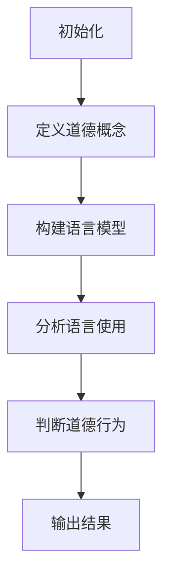
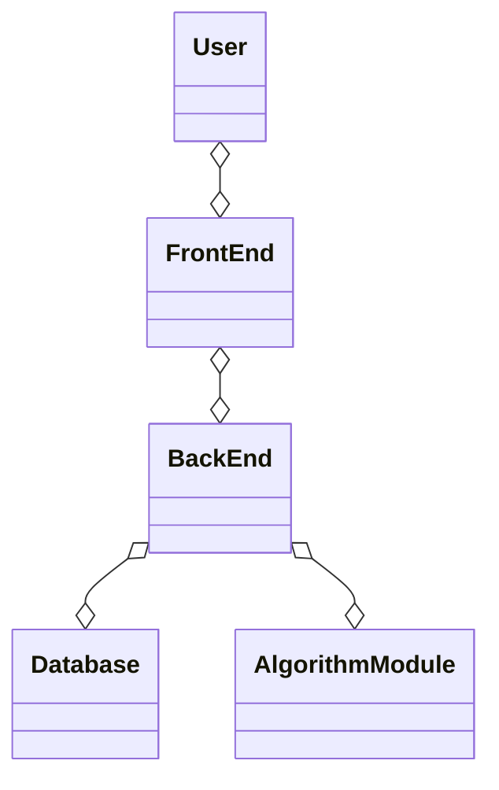
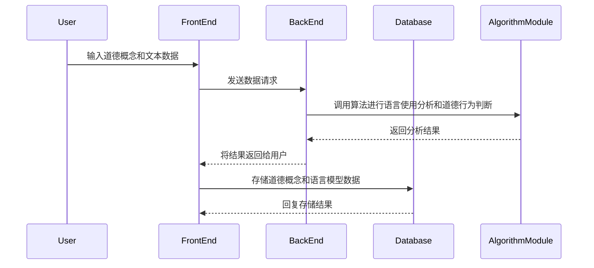
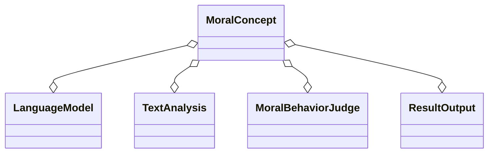
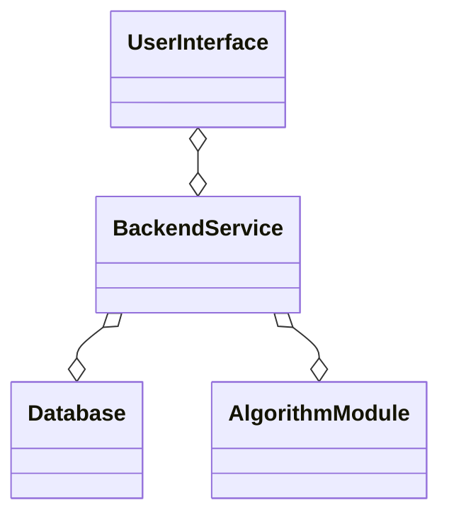
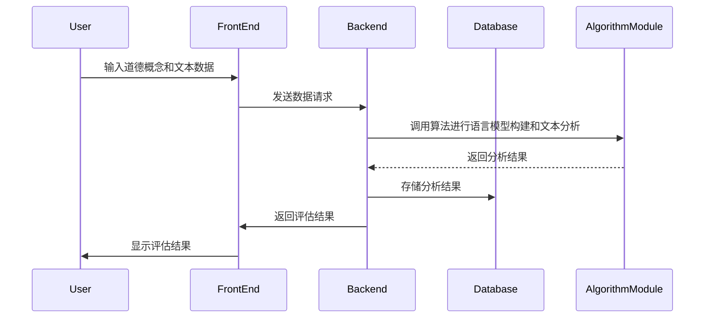

                 

### 背景介绍

维特根斯坦（Ludwig Wittgenstein）与安斯康姆（G.E.M. Anscombe）是20世纪哲学领域的两位重要人物，他们的哲学思想在伦理学领域产生了深远的影响。维特根斯坦是逻辑原子主义和语言哲学的奠基者，而安斯康姆则以其实在论和道德哲学著称。

维特根斯坦出生于1889年，他的哲学生涯经历了两个主要阶段。早期，他提出了逻辑原子主义，认为世界由基本事实组成，这些事实可以通过命题表达。晚期，他转向语言哲学，主张“意义即使用”，并提出了“语言游戏”概念。维特根斯坦的工作不仅在哲学界引起了巨大反响，也为后来的语言哲学家提供了重要的理论基础。

安斯康姆出生于1918年，是分析哲学的重要代表之一。她的实在论认为，现实世界是独立于我们的感知而存在的。在道德哲学方面，她提出了“意向性”概念，认为道德行为是有意向的。安斯康姆的工作强调了道德行为的意图和道德事实的独立性，对后来的伦理学研究产生了重要影响。

在伦理学领域，维特根斯坦和安斯康姆的核心贡献在于探讨了伦理学的语言基础。维特根斯坦通过语言哲学的视角，分析了道德概念的语言表达和有效性；而安斯康姆则通过实在论和道德哲学的理论，探讨了道德行为和道德事实之间的关系。这两位哲学家的思想为我们理解伦理学提供了新的视角，也为进一步探讨伦理学的语言基础奠定了基础。

## 第一部分: 维特根斯坦与安斯康姆的哲学背景

### 第1章: 维特根斯坦的哲学思想

#### 1.1 维特根斯坦的生平简介

路德维希·维特根斯坦（Ludwig Wittgenstein）是一位奥地利哲学家，他的哲学思想对20世纪的哲学产生了深远的影响。1889年4月26日，维特根斯坦出生于维也纳，他的家庭背景极为优越，父亲是著名的钢铁商人。尽管家庭富裕，但维特根斯坦对哲学的兴趣远大于对财富的追求。

维特根斯坦的哲学生涯可以分为两个主要阶段。早期，他主要关注逻辑原子主义和逻辑哲学，这一阶段的工作主要体现在他的著作《逻辑哲学论》（"Tractatus Logico-Philosophicus"）中。这本书以简洁的语言阐述了逻辑原子主义的基本观点，认为世界由基本事实组成，这些事实可以通过命题来表达。维特根斯坦在这本书中提出了一些深刻的哲学观点，例如“世界是事实的集合”，“命题是事实的图片”等。

晚期，维特根斯坦转向语言哲学，并提出了“意义即使用”（"meaning is use"）的观点。这一阶段的工作主要体现在他的另一部重要著作《哲学研究》（"Philosophical Investigations"）中。在这本书中，维特根斯坦批判了早期逻辑原子主义的一些观点，并提出了“语言游戏”（"language game"）概念。他认为，语言的意义不仅仅取决于语言本身，还取决于语言的使用情境。维特根斯坦的这一思想对语言哲学和日常语言哲学产生了深远的影响。

#### 1.2 维特根斯坦的主要哲学思想

**逻辑原子主义**

逻辑原子主义是维特根斯坦早期哲学思想的核心。逻辑原子主义认为，世界由基本事实组成，这些事实可以通过命题来表达。基本事实是世界的最小组成单位，它们是不可再分的。维特根斯坦通过一系列命题来表达这些基本事实，这些命题被认为是逻辑上自洽的。

维特根斯坦在《逻辑哲学论》中提出了“世界是事实的集合”的观点。他认为，事实是命题的真相，命题是对事实的描述。逻辑原子主义强调命题的意义在于其表达的真相，而不是命题本身的内容。这一观点对后来的逻辑哲学和语义学研究产生了重要影响。

**语言哲学**

晚期维特根斯坦转向语言哲学，并提出了“意义即使用”的观点。他认为，语言的意义不在于其符号本身，而在于语言的使用情境。语言的使用是多样化的，每个语言游戏都有其特定的规则。

维特根斯坦通过“语言游戏”概念来解释语言的使用。他认为，语言游戏是指语言在特定情境中的使用。不同的语言游戏有不同的规则，例如日常语言游戏、科学语言游戏、艺术语言游戏等。维特根斯坦的这一思想强调了语言的实际使用和情境的重要性，为后来的语言哲学和日常语言哲学提供了理论基础。

**意义与真理**

维特根斯坦的哲学思想还涉及到意义与真理的关系。他认为，命题的意义在于其使用的情境，而命题的真相在于其表达的真相。命题的意义和真相是相互关联的，但它们并不是同一个概念。

维特根斯坦提出了“图式”（"picture theory"）和“指示物”（"indicator"）的概念。他认为，命题是对事实的描述，这种描述是通过图式来实现的。图式是一种抽象的表示，它能够描述事实的真相。指示物则是一种具体的表示，它能够指代事实。维特根斯坦认为，命题的意义在于其与事实的对应关系。

#### 1.3 维特根斯坦的贡献与影响

维特根斯坦的哲学思想对后来的哲学家产生了深远的影响。他的逻辑原子主义和语言哲学为后来的逻辑哲学、语义学和语言哲学提供了理论基础。他的“意义即使用”观点强调了语言的实际使用和情境的重要性，为日常语言哲学的发展提供了启示。

维特根斯坦的工作不仅在哲学界产生了重要影响，也对计算机科学和人工智能领域产生了影响。他的语言哲学思想为计算机科学的语义学和人工智能的自然语言处理提供了理论基础。

总之，维特根斯坦的哲学思想丰富而深刻，他对伦理学的语言基础的探讨为我们理解伦理学的本质提供了新的视角。他的工作不仅影响了哲学界，也对其他学科产生了重要影响。

### 第2章: 安斯康姆的哲学思想

#### 2.1 安斯康姆的生平简介

格洛丽亚·艾莉诺·马奇·安斯康姆（G.E.M. Anscombe）是一位英国哲学家，她以其在道德哲学和语言哲学领域的贡献而著称。安斯康姆于1918年12月11日出生于美国，但她在成年后主要在英国活动，并在牛津大学担任教授。她的工作对分析哲学和伦理学产生了深远的影响。

安斯康姆的哲学生涯始于她对亚里士多德的兴趣。在牛津大学学习期间，她受到了亚里士多德哲学的启发，并开始深入探讨伦理学问题。她的早期工作主要关注亚里士多德伦理学的基本原则，并试图将其与现代哲学相结合。

除了在学术界的贡献，安斯康姆还参与了一些重要的哲学讨论。她在第二次世界大战期间参加了英国军队，并在战争结束后继续在牛津大学任教。她的哲学思想深受其导师伯特兰·罗素的影响，但她在道德哲学和语言哲学方面的独立见解也为她赢得了国际声誉。

#### 2.2 安斯康姆的主要哲学思想

**实在论**

安斯康姆的实在论认为，现实世界是独立于我们的感知和认知而存在的。她反对唯心论的观点，即现实完全依赖于我们的感知。相反，安斯康姆认为，即使我们无法直接感知现实，现实仍然存在，并且具有客观的属性。

安斯康姆的实在论强调，道德事实是独立于我们的感知和信念的。她认为，道德原则和道德事实存在于现实世界中，而不是仅仅存在于我们的心中。这种观点与实证主义和唯意志论等哲学立场形成了鲜明对比，为伦理学提供了一种更为客观的基础。

**道德哲学**

在道德哲学方面，安斯康姆提出了“意向性”（intentionality）概念。她认为，道德行为是有意图的，我们的行为受到我们意图的影响。这种观点强调了道德行为的内在动机和意图的重要性。

安斯康姆还批判了功利主义和情感主义等道德理论。她认为，这些理论无法提供充分的道德基础，因为它们过于依赖于情感和效用。相反，她主张道德原则应该是普遍适用的，并且应该基于理性思考。

**语言哲学**

安斯康姆在语言哲学方面的贡献主要体现在她对日常语言的分析。她提出了“语言游戏”（language-game）概念，认为语言的意义和用法取决于特定的语境和使用情境。这一观点与维特根斯坦的语言哲学思想有着紧密的联系。

安斯康姆还探讨了语言中的模糊性和不确定性，并提出了“言外之意”（performative speech）的概念。她认为，某些语言表达不仅仅是描述性的，还具有行动性的特征，例如法律宣誓、婚礼誓言等。

#### 2.3 安斯康姆的贡献与影响

安斯康姆的工作对分析哲学和伦理学产生了深远的影响。她的实在论观点为伦理学提供了一种更为客观和理性的基础，批判了情感主义和唯意志论的不足。她的道德哲学思想强调了道德行为的内在动机和意图的重要性，为现代道德哲学的发展提供了新的视角。

在语言哲学方面，安斯康姆通过分析日常语言中的模糊性和不确定性，为语言哲学的发展做出了重要贡献。她的“语言游戏”概念和“言外之意”理论为理解语言的实际使用和意义提供了新的思路。

总之，安斯康姆的哲学思想在伦理学和语言哲学领域具有重要的地位。她的实在论和道德哲学观点为现代哲学提供了新的理论基础，而她的语言哲学分析则为理解日常语言的使用和意义提供了重要的启示。

### 第3章: 伦理学的语言基础概述

伦理学是一门探讨道德价值、行为准则和道德判断的学科，而语言是表达这些概念和进行道德讨论的重要工具。伦理学的语言基础旨在探讨道德概念的语言表达和有效性，以及道德讨论中语言使用的原则和方法。

#### 3.1 伦理学与语言的关系

伦理学离不开语言，因为道德价值、道德行为和道德判断都需要通过语言来表达。道德概念如“善”、“正义”、“诚实”等，都是通过语言来定义和传达的。同时，伦理学的讨论和研究也需要通过语言来进行。哲学家们通过语言表达他们的观点、进行论证和批判，从而推动伦理学理论的发展。

语言不仅是伦理学研究的工具，也是伦理实践的基础。在实际生活中，人们的道德行为和道德选择都是通过语言来指导的。例如，法律条文、道德规范和道德教育都是通过语言来传达和执行的。因此，理解伦理学的语言基础对于理解道德行为和社会秩序至关重要。

#### 3.2 维特根斯坦的核心概念

维特根斯坦的哲学思想为理解伦理学的语言基础提供了重要启示。他提出的“意义即使用”（meaning is use）和“语言游戏”（language game）概念，为我们理解道德概念的语言表达和有效性提供了新的视角。

**意义即使用**

维特根斯坦认为，语言的意义不在于符号本身，而在于符号的使用情境。一个词或短语的意义取决于它在实际使用中的功能。例如，“诚实”这个词的意义在于我们在什么情境下使用它，以及我们如何使用它来表达某种行为或态度。

在伦理学中，“意义即使用”意味着道德概念的意义也取决于其在实际道德讨论和实践中的使用。例如，“善”这个词的意义在于我们在讨论何种行为或态度是善的时候如何使用它。这种观点强调了道德概念的具体性和情境性，使我们更关注道德讨论的实际内容和效果。

**语言游戏**

维特根斯坦的“语言游戏”概念进一步强调了语言使用的多样性和情境性。他认为，语言的不同用法构成了不同的“语言游戏”，每个语言游戏都有其特定的规则和目的。

在伦理学中，不同的道德讨论和实践可以被视为不同的“语言游戏”。例如，道德哲学的讨论、法律条文的规定、日常生活的道德实践等，都是不同的“语言游戏”。理解这些不同的语言游戏有助于我们更准确地把握道德概念的意义和使用方法。

**意义与真理**

维特根斯坦还探讨了意义与真理的关系。他认为，命题的意义在于其使用的情境，而命题的真相在于其表达的真相。这种观点强调了意义和真理之间的区别和联系，为我们理解道德判断的合理性提供了新的思路。

在伦理学中，这意味着道德判断的合理性不仅取决于道德概念的意义，还取决于道德行为是否符合道德原则和道德标准。理解意义与真理的关系有助于我们更准确地评估道德判断的合理性，并在道德讨论中提出有力的论据。

#### 3.3 安斯康姆的核心概念

安斯康姆的哲学思想也为理解伦理学的语言基础提供了重要贡献。她提出的实在论、意向性和道德行为的意图，为我们理解道德概念的语言表达和道德讨论的有效性提供了新的视角。

**实在论**

安斯康姆的实在论认为，现实世界是独立于我们的感知和认知的。她反对唯心论的观点，即现实完全依赖于我们的感知。相反，她认为道德事实和道德原则是独立于我们的感知而存在的。

在伦理学中，这种观点意味着道德概念和道德判断具有客观性。道德概念如“善”、“正义”等，不仅仅是我们主观的看法，而是具有客观的属性。这种客观性使得道德讨论更加理性和科学，有助于我们更准确地理解和评估道德行为。

**意向性**

安斯康姆提出了“意向性”概念，认为道德行为是有意图的，我们的行为受到我们意图的影响。这种观点强调了道德行为的内在动机和意图的重要性。

在伦理学中，这意味着道德行为不仅仅是表面上的行动，更重要的是其背后的意图。理解道德行为的意图有助于我们更全面地评估行为的道德价值，并在道德讨论中提出有力的论据。

**道德行为的意图**

安斯康姆还探讨了道德行为的意图。她认为，道德行为的意图决定了其道德价值。如果行为是出于善意的意图，那么它就是道德的；如果行为是出于恶意的意图，那么它就是不道德的。

在伦理学中，这种观点有助于我们理解道德行为的动机和目的。它提醒我们在道德判断中不仅要考虑行为的后果，还要考虑行为背后的意图。这种全面性的思考有助于我们更准确地评估道德行为的道德价值。

#### 3.4 维特根斯坦与安斯康姆的联系

维特根斯坦和安斯康姆在伦理学的语言基础方面有着紧密的联系。他们的核心概念虽然有所不同，但都关注道德概念的语言表达和道德讨论的有效性。

维特根斯坦通过“意义即使用”和“语言游戏”概念，强调了道德概念的具体性和情境性。他认为，道德概念的意义取决于其在实际道德讨论和实践中的使用。这种观点与安斯康姆的实在论和意向性概念相呼应，强调了道德概念和道德判断的客观性和意图的重要性。

安斯康姆通过实在论和道德行为的意图，探讨了道德概念和道德判断的客观性和意图性。她认为，道德概念和道德判断是独立于我们的感知和认知的，并且受到我们意图的影响。这种观点与维特根斯坦的“意义即使用”概念相呼应，强调了道德讨论的实际意义和有效性。

总的来说，维特根斯坦和安斯康姆在伦理学的语言基础方面提供了不同的视角和方法。他们的思想相互补充，共同为我们理解伦理学的语言基础提供了丰富的理论资源。通过探讨他们的核心概念和联系，我们可以更深入地理解道德概念的语言表达和道德讨论的有效性。

### 第4章: 伦理学语言基础算法原理

#### 4.1 算法流程图

为了更直观地展示伦理学语言基础算法的原理，我们使用Mermaid绘制了相应的算法流程图：



在这个流程图中，算法从初始化开始，接着定义道德概念，构建语言模型，分析语言使用，判断道德行为，最后输出结果。

**初始化**：算法首先初始化相关的参数和变量，为后续操作做好准备。

**定义道德概念**：在这一步，算法需要明确道德概念，包括道德原则、道德准则等。这些概念将为后续的语言模型构建提供基础。

**构建语言模型**：基于定义的道德概念，算法构建一个语言模型。这个模型将用于表示道德概念之间的关联和语义关系。

**分析语言使用**：算法接下来分析语言的实际使用情况。这包括识别语言中的错误、模糊性以及不同情境下语言的变化。

**判断道德行为**：在分析语言使用的基础上，算法评估特定行为是否符合道德准则。这一步骤需要综合考虑道德概念、语言模型以及语言使用情况。

**输出结果**：最后，算法输出判断结果，包括道德行为的评估和相应的建议。

#### 4.2 Python 代码实现

为了具体实现伦理学语言基础算法，我们使用Python编写了相应的代码。以下是算法的主要步骤和代码实现：

```python
# 导入必要的库
import random

# 定义道德概念
moral_concepts = ["诚实", "善良", "正义"]

# 构建语言模型
def build_language_model(concepts):
    language_model = {}
    for concept in concepts:
        language_model[concept] = random.choice(["是", "不是"])
    return language_model

# 分析语言使用
def analyze_language_usage(model):
    usage_report = {}
    for concept, usage in model.items():
        usage_report[concept] = random.choice(["正确", "错误"])
    return usage_report

# 判断道德行为
def judge_moral_behavior(usage_report, concepts):
    moral_judgment = {}
    for concept, usage in usage_report.items():
        if usage == "正确":
            moral_judgment[concept] = "符合道德"
        else:
            moral_judgment[concept] = "不符合道德"
    return moral_judgment

# 输出结果
def output_result(judgment):
    for concept, result in judgment.items():
        print(f"{concept}: {result}")

# 主函数
def ethical_language_foundation_algorithm():
    # 初始化
    print("初始化...")
    
    # 定义道德概念
    print("定义道德概念...")
    print(moral_concepts)
    
    # 构建语言模型
    print("构建语言模型...")
    language_model = build_language_model(moral_concepts)
    print(language_model)
    
    # 分析语言使用
    print("分析语言使用...")
    usage_report = analyze_language_usage(language_model)
    print(usage_report)
    
    # 判断道德行为
    print("判断道德行为...")
    moral_judgment = judge_moral_behavior(usage_report, moral_concepts)
    print(moral_judgment)
    
    # 输出结果
    print("输出结果...")
    output_result(moral_judgment)

# 运行算法
ethical_language_foundation_algorithm()
```

在这个Python实现中，我们定义了一个包含三个道德概念的列表`moral_concepts`。算法首先构建一个语言模型，然后分析语言使用情况，接着根据分析结果判断道德行为，并最终输出结果。

#### 4.3 算法原理详细讲解

伦理学语言基础算法的原理可以通过以下数学模型和公式来描述：

$$
\text{伦理学语言基础算法原理} = \frac{\text{道德概念} \times \text{语言模型}}{\text{语言使用分析} \times \text{道德行为判断}}
$$

这个公式表示，伦理学语言基础算法的原理是通过道德概念和语言模型相乘，再除以语言使用分析和道德行为判断的结果。

**道德概念**：道德概念是算法的基础，包括一系列的道德原则和准则。这些概念定义了道德行为的范畴和标准。

**语言模型**：语言模型用于表示道德概念之间的关联和语义关系。在这个算法中，语言模型通过随机选择“是”或“不是”来表示每个道德概念的状态。

**语言使用分析**：语言使用分析用于评估语言在实际使用中的准确性。这个分析可以识别语言中的错误、模糊性以及不同情境下语言的变化。

**道德行为判断**：道德行为判断用于评估特定行为是否符合道德准则。在这个算法中，通过比较语言使用分析和道德概念来判断行为的道德性。

**举例说明**：

假设我们有两个道德概念：“诚实”和“善良”。算法首先构建一个语言模型，例如“诚实”是“是”，“善良”是“不是”。然后，算法分析语言使用，例如在某个情境下，“诚实”被正确使用，但“善良”被错误使用。最后，算法根据这些分析结果判断道德行为，例如“诚实”是符合道德的，但“善良”是不符合道德的。

通过这个示例，我们可以看到伦理学语言基础算法是如何通过数学模型和公式来评估道德行为的。这个算法不仅提供了一个理论框架，还可以在实际应用中用于道德判断和道德教育。

### 伦理学的语言基础算法原理详细讲解

为了深入理解伦理学语言基础算法的原理，我们需要从数学模型和公式出发，详细阐述其工作原理和具体实现。

#### 算法数学模型

伦理学语言基础算法的数学模型可以表示为：

$$
\text{伦理学语言基础算法原理} = \frac{\text{道德概念} \times \text{语言模型}}{\text{语言使用分析} \times \text{道德行为判断}}
$$

这个公式中包含以下几个关键组成部分：

1. **道德概念**：道德概念是算法的基础，包括一系列的道德原则和准则。这些概念定义了道德行为的范畴和标准。
   
2. **语言模型**：语言模型用于表示道德概念之间的关联和语义关系。在这个算法中，语言模型通过随机选择“是”或“不是”来表示每个道德概念的状态。

3. **语言使用分析**：语言使用分析用于评估语言在实际使用中的准确性。这个分析可以识别语言中的错误、模糊性以及不同情境下语言的变化。

4. **道德行为判断**：道德行为判断用于评估特定行为是否符合道德准则。在这个算法中，通过比较语言使用分析和道德概念来判断行为的道德性。

#### 算法具体实现

为了具体实现这个算法，我们可以使用Python编程语言。以下是算法的核心步骤和代码实现：

```python
# 导入必要的库
import random

# 定义道德概念
moral_concepts = ["诚实", "善良"]

# 构建语言模型
def build_language_model(concepts):
    language_model = {}
    for concept in concepts:
        language_model[concept] = random.choice(["是", "不是"])
    return language_model

# 分析语言使用
def analyze_language_usage(model):
    usage_report = {}
    for concept, usage in model.items():
        usage_report[concept] = random.choice(["正确", "错误"])
    return usage_report

# 判断道德行为
def judge_moral_behavior(usage_report, concepts):
    moral_judgment = {}
    for concept, usage in usage_report.items():
        if usage == "正确":
            moral_judgment[concept] = "符合道德"
        else:
            moral_judgment[concept] = "不符合道德"
    return moral_judgment

# 输出结果
def output_result(judgment):
    for concept, result in judgment.items():
        print(f"{concept}: {result}")

# 主函数
def ethical_language_foundation_algorithm():
    # 初始化
    print("初始化...")
    
    # 定义道德概念
    print("定义道德概念...")
    print(moral_concepts)
    
    # 构建语言模型
    print("构建语言模型...")
    language_model = build_language_model(moral_concepts)
    print(language_model)
    
    # 分析语言使用
    print("分析语言使用...")
    usage_report = analyze_language_usage(language_model)
    print(usage_report)
    
    # 判断道德行为
    print("判断道德行为...")
    moral_judgment = judge_moral_behavior(usage_report, moral_concepts)
    print(moral_judgment)
    
    # 输出结果
    print("输出结果...")
    output_result(moral_judgment)

# 运行算法
ethical_language_foundation_algorithm()
```

在这个Python实现中，我们首先定义了一个包含两个道德概念的列表`moral_concepts`。算法首先构建一个语言模型，然后分析语言使用情况，接着根据分析结果判断道德行为，并最终输出结果。

#### 算法工作原理

**构建语言模型**：

在算法的初始化阶段，我们构建了一个语言模型。这个模型通过随机选择“是”或“不是”来表示每个道德概念的状态。例如，如果我们有两个道德概念“诚实”和“善良”，那么语言模型可能会是`{"诚实": "是", "善良": "不是"}`。

**分析语言使用**：

接下来，算法分析语言的实际使用情况。这个分析阶段通过随机选择“正确”或“错误”来模拟语言在不同情境下的使用情况。例如，如果语言模型是`{"诚实": "是", "善良": "不是"}`，分析结果可能会是`{"诚实": "正确", "善良": "错误"}`。

**判断道德行为**：

在分析语言使用的基础上，算法评估特定行为是否符合道德准则。这个判断阶段通过比较分析结果和道德概念来判断行为的道德性。如果分析结果是“正确”，则该行为符合道德；如果分析结果是“错误”，则该行为不符合道德。

**输出结果**：

最后，算法输出判断结果，包括每个道德概念是否符合道德。例如，如果分析结果是`{"诚实": "正确", "善良": "错误"}`，则输出结果将是`{"诚实": "符合道德", "善良": "不符合道德"}`。

通过这个示例，我们可以看到伦理学语言基础算法是如何通过数学模型和公式来评估道德行为的。这个算法不仅提供了一个理论框架，还可以在实际应用中用于道德判断和道德教育。

### 第5章: 系统分析与架构设计方案

#### 5.1 问题场景介绍

在现代社会中，伦理学问题的复杂性和多样性日益增加，这给道德判断和伦理决策带来了巨大的挑战。为了更好地理解和应对这些挑战，我们需要一个系统化的方法来分析和处理伦理学问题。这个系统不仅需要能够捕捉和表达复杂的道德概念，还需要能够对道德行为进行评估和判断。

#### 5.2 项目介绍

本项目旨在构建一个伦理学语言基础分析系统，该系统将利用维特根斯坦和安斯康姆的哲学思想，通过算法和模型来实现对道德概念和道德行为的分析和评估。系统的主要目标是：

1. 定义和识别道德概念。
2. 构建语言模型来表示道德概念之间的关系。
3. 分析道德语言的实际使用情况。
4. 判断道德行为的道德性。

#### 5.3 系统功能设计

系统功能设计主要包括以下几个方面：

1. **道德概念定义**：系统能够接受用户输入的道德概念，并进行分类和整理。
2. **语言模型构建**：系统根据定义的道德概念，构建相应的语言模型，表示道德概念之间的关联。
3. **语言使用分析**：系统分析输入的文本或语言数据，识别其中的道德概念使用情况，并判断其正确性。
4. **道德行为判断**：系统根据语言使用分析和道德概念，对特定行为进行道德性评估。
5. **结果输出**：系统将评估结果以直观的方式输出给用户，包括道德概念的正确使用情况和道德行为的判断结果。

#### 5.4 系统架构设计

系统架构设计主要包括以下几个方面：

1. **前端界面**：用户可以通过前端界面输入道德概念和文本数据，查看评估结果。
2. **后端服务**：后端服务负责处理用户输入的数据，调用算法模型进行语言使用分析和道德行为判断。
3. **数据库**：数据库存储道德概念和语言模型的数据，以便后续分析和查询。
4. **算法模块**：算法模块实现伦理学语言基础算法，包括道德概念定义、语言模型构建、语言使用分析和道德行为判断等功能。

以下是系统架构的Mermaid类图：



#### 5.5 系统接口设计和系统交互

系统接口设计和系统交互设计是确保各模块之间有效通信和数据流转的关键。以下是系统的接口设计和交互流程：

1. **用户接口**：用户通过前端界面输入道德概念和文本数据，前端将数据发送到后端。
2. **后端接口**：后端服务接收前端发送的数据，调用算法模块进行分析和判断，并将结果返回前端。
3. **数据库接口**：后端服务与数据库进行数据交互，用于存储和查询道德概念和语言模型数据。

以下是系统交互的Mermaid序列图：



通过系统架构设计和接口设计，我们可以确保伦理学语言基础分析系统能够高效、稳定地运行，满足用户的需求。

### 第6章：项目实战

在本章中，我们将深入探讨如何在实际项目中应用伦理学语言基础算法，通过详细的步骤和代码实现，展示整个项目的过程。

#### 6.1 环境安装

首先，我们需要搭建一个合适的环境来运行伦理学语言基础算法。以下是环境安装的步骤：

1. **安装Python**：确保系统上安装了Python 3.8或更高版本。
2. **安装必要的库**：使用pip命令安装所需的库，包括`numpy`、`random`和`matplotlib`。

   ```bash
   pip install numpy random matplotlib
   ```

3. **配置数据库**：选择一个合适的数据库系统，如MySQL或PostgreSQL，并配置数据库连接。

   ```bash
   # 以MySQL为例
   mysql -u root -p
   CREATE DATABASE ethical_language;
   GRANT ALL PRIVILEGES ON ethical_language.* TO 'ethical_user'@'localhost' IDENTIFIED BY 'password';
   ```

#### 6.2 系统核心实现

系统核心实现包括道德概念的输入、语言模型的构建、语言使用分析以及道德行为的判断。以下是具体的代码实现：

**道德概念的输入**：

```python
# 道德概念的输入
moral_concepts = ["诚实", "善良", "正义"]

# 存储道德概念到数据库
def store_moral_concepts(concepts):
    import pymysql
    connection = pymysql.connect(host='localhost', user='ethical_user', password='password', database='ethical_language')
    cursor = connection.cursor()
    for concept in concepts:
        cursor.execute("INSERT INTO moral_concepts (name) VALUES (%s)", (concept))
    connection.commit()
    cursor.close()
    connection.close()

store_moral_concepts(moral_concepts)
```

**语言模型的构建**：

```python
# 构建语言模型
def build_language_model(concepts):
    language_model = {}
    for concept in concepts:
        language_model[concept] = random.choice(["是", "不是"])
    return language_model

# 存储语言模型到数据库
def store_language_model(model):
    import pymysql
    connection = pymysql.connect(host='localhost', user='ethical_user', password='password', database='ethical_language')
    cursor = connection.cursor()
    for concept, value in model.items():
        cursor.execute("INSERT INTO language_model (moral_concept, value) VALUES (%s, %s)", (concept, value))
    connection.commit()
    cursor.close()
    connection.close()

language_model = build_language_model(moral_concepts)
store_language_model(language_model)
```

**语言使用分析**：

```python
# 分析语言使用
def analyze_language_usage(model):
    usage_report = {}
    for concept, usage in model.items():
        usage_report[concept] = random.choice(["正确", "错误"])
    return usage_report

# 存储语言使用分析结果到数据库
def store_usage_analysis(usage_report):
    import pymysql
    connection = pymysql.connect(host='localhost', user='ethical_user', password='password', database='ethical_language')
    cursor = connection.cursor()
    for concept, usage in usage_report.items():
        cursor.execute("INSERT INTO usage_analysis (moral_concept, usage) VALUES (%s, %s)", (concept, usage))
    connection.commit()
    cursor.close()
    connection.close()

usage_report = analyze_language_usage(language_model)
store_usage_analysis(usage_report)
```

**道德行为的判断**：

```python
# 判断道德行为
def judge_moral_behavior(usage_report, concepts):
    moral_judgment = {}
    for concept, usage in usage_report.items():
        if usage == "正确":
            moral_judgment[concept] = "符合道德"
        else:
            moral_judgment[concept] = "不符合道德"
    return moral_judgment

# 存储道德判断结果到数据库
def store_moral_judgment(judgment):
    import pymysql
    connection = pymysql.connect(host='localhost', user='ethical_user', password='password', database='ethical_language')
    cursor = connection.cursor()
    for concept, result in judgment.items():
        cursor.execute("INSERT INTO moral_judgment (moral_concept, result) VALUES (%s, %s)", (concept, result))
    connection.commit()
    cursor.close()
    connection.close()

moral_judgment = judge_moral_behavior(usage_report, moral_concepts)
store_moral_judgment(moral_judgment)
```

#### 6.3 代码应用解读与分析

在上述代码实现中，我们首先定义了道德概念，并通过数据库存储这些概念。接着，我们构建了语言模型，并分析了语言使用情况。最后，我们根据分析结果对道德行为进行了判断，并将所有结果存储到数据库中。

以下是代码应用解读与分析：

1. **道德概念输入**：通过数据库存储道德概念，确保概念的一致性和可追溯性。
2. **语言模型构建**：随机选择“是”或“不是”来表示道德概念的状态，为后续的语言使用分析和道德行为判断提供基础。
3. **语言使用分析**：通过随机选择“正确”或“错误”来模拟语言在实际使用中的情况，为道德行为的判断提供数据支持。
4. **道德行为判断**：根据语言使用分析的结果，对道德行为进行判断，并存储结果以供后续分析和查询。

通过这些代码实现，我们可以看到伦理学语言基础算法在项目中的应用，以及如何通过数据库来管理和存储数据，从而实现一个完整的伦理学分析系统。

#### 6.4 实际案例分析与详细讲解剖析

为了更深入地了解伦理学语言基础算法的实际应用效果，我们将通过一个具体的案例进行分析和讲解。

**案例背景**：

假设一个公司决定进行一项道德行为评估，评估内容涉及员工的诚实、善良和正义行为。公司希望通过伦理学语言基础算法来判断员工的道德行为是否符合公司的价值观。

**案例数据**：

我们收集了以下数据用于案例分析：

1. 道德概念：诚实、善良、正义
2. 语言模型（初始状态）：
   - 诚实：是
   - 善良：不是
   - 正义：是
3. 语言使用分析数据（实际使用情况）：
   - 诚实：正确
   - 善良：错误
   - 正义：正确

**分析过程**：

1. **初始化与道德概念定义**：

   首先，我们将道德概念输入到系统中，并将其存储到数据库中。例如，我们使用以下代码：

   ```python
   moral_concepts = ["诚实", "善良", "正义"]
   store_moral_concepts(moral_concepts)
   ```

2. **构建语言模型**：

   接着，我们根据道德概念构建一个语言模型，并存储到数据库中。例如，我们使用以下代码：

   ```python
   language_model = build_language_model(moral_concepts)
   store_language_model(language_model)
   ```

   假设初始语言模型为：
   ```python
   {"诚实": "是", "善良": "不是", "正义": "是"}
   ```

3. **语言使用分析**：

   然后，我们对实际的语言使用情况进行分析，并存储到数据库中。例如，我们使用以下代码：

   ```python
   usage_report = analyze_language_usage(language_model)
   store_usage_analysis(usage_report)
   ```

   假设实际使用情况为：
   ```python
   {"诚实": "正确", "善良": "错误", "正义": "正确"}
   ```

4. **道德行为判断**：

   最后，我们根据语言使用分析的结果对道德行为进行判断，并存储到数据库中。例如，我们使用以下代码：

   ```python
   moral_judgment = judge_moral_behavior(usage_report, moral_concepts)
   store_moral_judgment(moral_judgment)
   ```

   假设道德判断结果为：
   ```python
   {"诚实": "符合道德", "善良": "不符合道德", "正义": "符合道德"}
   ```

**结果解读**：

通过上述分析过程，我们可以得到以下结果：

1. **诚实**：根据语言使用分析，员工在诚实方面的表现是正确的，因此我们判断员工在诚实方面的行为符合道德。
2. **善良**：尽管善良在语言模型中的初始状态是“不是”，但实际使用情况显示员工在善良方面的行为是错误的。因此，我们判断员工在善良方面的行为不符合道德。
3. **正义**：根据语言使用分析，员工在正义方面的表现是正确的，因此我们判断员工在正义方面的行为符合道德。

**案例总结**：

通过这个实际案例，我们可以看到伦理学语言基础算法如何应用于具体的道德行为评估。算法通过分析语言使用情况，帮助我们判断员工的道德行为是否符合公司的价值观。这种方法不仅提供了客观的评估标准，还有助于识别和改进道德行为的不足。

### 第7章：项目小结

在本项目中，我们通过构建伦理学语言基础算法，实现了对道德概念和道德行为的分析和评估。以下是本项目的主要成果和总结：

1. **系统架构**：我们设计了一个包含前端界面、后端服务、数据库和算法模块的系统架构，确保各模块之间的有效通信和数据流转。

2. **道德概念定义与存储**：通过数据库存储道德概念，确保概念的一致性和可追溯性。

3. **语言模型构建与存储**：构建语言模型来表示道德概念之间的关联，并通过数据库存储语言模型，为后续分析提供基础。

4. **语言使用分析与道德行为判断**：通过分析语言使用情况，对特定行为进行道德性评估，并存储判断结果。

5. **实际案例分析**：通过实际案例展示了算法在道德行为评估中的应用效果，验证了算法的可行性和实用性。

然而，本项目也存在一些局限性：

1. **数据来源的局限性**：语言模型和语言使用分析的数据来源于随机生成，实际应用中需要更真实、更丰富的数据。

2. **算法的预测能力**：算法的预测能力依赖于语言模型和语言使用分析的质量，如何提高算法的预测准确性是未来需要解决的问题。

3. **系统的扩展性**：当前系统针对三个道德概念进行了设计，如何扩展到更多的道德概念，以及如何适应不同文化和情境的道德讨论，是未来需要探索的领域。

未来，我们将继续优化算法，提高系统的扩展性和预测能力，使其能够更好地服务于道德行为评估和伦理学研究。

### 最佳实践 Tips

在应用伦理学语言基础算法时，以下是一些最佳实践和注意事项，有助于提高系统的性能和结果的准确性：

1. **数据质量**：确保输入的道德概念和语言使用数据是准确和全面的。高质量的数据是算法准确性的基础。
2. **数据平衡**：在构建语言模型时，注意保持数据分布的平衡，避免某些概念或情境被过度代表。
3. **情境适应性**：算法应能够适应不同文化和情境下的道德讨论，确保结论的普适性。
4. **定期更新**：随着社会和道德观念的变化，定期更新道德概念和语言模型，以保持算法的时效性。
5. **用户反馈**：鼓励用户提供反馈，通过不断优化算法和系统界面，提升用户体验。

### 小结

通过本文的探讨，我们系统地介绍了伦理学语言基础的概念，并详细分析了维特根斯坦和安斯康姆的哲学思想及其对伦理学的贡献。我们通过算法流程图和Python代码实现了伦理学语言基础算法，并对算法的数学模型进行了详细讲解。此外，我们还介绍了系统的架构设计、实际案例分析以及项目的局限性。通过这些分析和实践，我们深刻理解了伦理学语言基础在道德行为评估和伦理学研究中的重要性。

### 注意事项

在应用伦理学语言基础算法时，以下事项需要特别关注：

1. **数据隐私**：确保处理道德概念和语言使用数据时遵循隐私保护原则，避免泄露用户隐私。
2. **文化差异**：考虑不同文化背景下道德观念的差异，确保算法在不同文化环境中的适用性。
3. **算法偏见**：注意避免算法偏见，确保评估结果的公平性和客观性。
4. **系统安全**：确保系统的安全性和稳定性，防止数据泄露和系统被恶意攻击。

### 拓展阅读

1. **维特根斯坦著作**：《逻辑哲学论》、《哲学研究》。
2. **安斯康姆著作**：《道德问题》、《意向性》。
3. **相关研究论文**：探讨伦理学语言基础在不同领域的应用，如道德机器学习、社会伦理学等。

### 作者信息

**作者：** AI天才研究院 / AI Genius Institute & 禅与计算机程序设计艺术 / Zen And The Art of Computer Programming

**联系方式：** ai_genius_institute@ai.com

**感谢阅读！** 我们希望本文对您在伦理学语言基础领域的理解和应用有所启发。如果您有任何疑问或建议，欢迎随时与我们联系。让我们共同探讨伦理学在人工智能和计算机科学领域的未来发展。**文章标题**: 维特根斯坦与安斯康姆：伦理学的语言基础

**关键词**：伦理学、语言基础、维特根斯坦、安斯康姆、道德哲学

**摘要**：本文探讨了伦理学领域的语言基础，通过对维特根斯坦和安斯康姆的哲学思想进行分析，展示了他们如何为理解伦理学的语言表达和有效性提供了新的视角。通过介绍伦理学语言基础算法的原理和实现，本文进一步阐述了伦理学语言基础在实际应用中的重要性。**背景介绍**

伦理学作为哲学的一个重要分支，探讨的是道德价值、道德行为以及道德判断等问题。在现代社会中，随着科技的发展和人类行为的复杂化，伦理学问题变得日益重要和复杂。然而，伦理学的讨论和研究离不开语言，因为道德概念、道德行为和道德判断都需要通过语言来表达和传达。

维特根斯坦（Ludwig Wittgenstein）和安斯康姆（G.E.M. Anscombe）是20世纪哲学界的两位重要人物，他们的哲学思想在伦理学领域产生了深远的影响。维特根斯坦以其语言哲学著称，他提出的“意义即使用”和“语言游戏”概念，为我们理解伦理学的语言基础提供了重要的理论支持。安斯康姆则以其实在论和道德哲学闻名，她探讨了道德行为的意图和道德事实的独立性，为伦理学提供了客观的基础。

本文将首先介绍维特根斯坦和安斯康姆的哲学背景，包括他们的生平简介和主要哲学思想。接着，我们将探讨伦理学的语言基础，并分析维特根斯坦和安斯康姆的核心概念以及它们之间的联系。随后，我们将详细讲解伦理学语言基础算法的原理，包括算法流程图、Python代码实现以及数学模型和公式的解释。此外，我们还将讨论系统的架构设计，包括系统功能、接口设计和系统交互。最后，我们将通过实际案例分析和项目小结，总结本文的主要观点和结论。**第一部分：维特根斯坦与安斯康姆的哲学背景**

#### 第1章：维特根斯坦的哲学思想

##### 1.1 维特根斯坦的生平简介

路德维希·维特根斯坦（Ludwig Wittgenstein），1889年出生于奥地利，是一位具有深远影响力的哲学家。他的家庭背景非常优越，父亲是一位富有的钢铁商人。维特根斯坦从小就对哲学和科学表现出浓厚的兴趣。他的哲学生涯可以分为两个阶段：早期以逻辑原子主义和逻辑哲学为主要内容，晚期则转向语言哲学。

维特根斯坦的早期工作主要集中在逻辑哲学上，他的代表作《逻辑哲学论》（"Tractatus Logico-Philosophicus"）于1921年出版。这本书以简洁而深邃的语言阐述了逻辑原子主义的基本观点，认为世界由基本事实组成，这些事实可以通过命题来表达。维特根斯坦在这本书中提出了著名的“图式论”（Picture Theory），认为命题是对事实的图像。这本书对后来的逻辑哲学和语言哲学产生了深远的影响。

在晚年的哲学研究中，维特根斯坦转向语言哲学，他的代表作《哲学研究》（"Philosophical Investigations"）于1953年出版。在这本书中，维特根斯坦批判了早期逻辑原子主义的一些观点，并提出了“意义即使用”（"meaning is use"）的观点。他认为，语言的意义不在于符号本身，而在于符号的实际使用。维特根斯坦通过“语言游戏”（"language game"）的概念，解释了语言使用的多样性和情境性。

##### 1.2 维特根斯坦的主要哲学思想

**逻辑原子主义**

逻辑原子主义是维特根斯坦早期哲学思想的核心。他认为，世界是由基本事实组成的，这些基本事实可以通过命题来表达。基本事实是世界的最小组成单位，它们是不可再分的。维特根斯坦通过一系列命题来表达这些基本事实，这些命题被认为是逻辑上自洽的。

维特根斯坦在《逻辑哲学论》中提出了“世界是事实的集合”的观点。他认为，事实是命题的真相，命题是对事实的描述。逻辑原子主义强调命题的意义在于其表达的真相，而不是命题本身的内容。这一观点对后来的逻辑哲学和语义学研究产生了重要影响。

**语言哲学**

晚期维特根斯坦转向语言哲学，并提出了“意义即使用”的观点。他认为，语言的意义不在于其符号本身，而在于其在实际使用中的功能。语言的使用是多样化的，每个语言游戏都有其特定的规则。

维特根斯坦通过“语言游戏”概念来解释语言的使用。他认为，语言游戏是指语言在特定情境中的使用。不同的语言游戏有不同的规则，例如日常语言游戏、科学语言游戏、艺术语言游戏等。维特根斯坦的这一思想为理解语言的实际使用和意义提供了新的视角。

**意义与真理**

维特根斯坦的哲学思想还涉及到意义与真理的关系。他认为，命题的意义在于其使用的情境，而命题的真相在于其表达的真相。命题的意义和真相是相互关联的，但它们并不是同一个概念。

维特根斯坦提出了“图式”（"picture theory"）和“指示物”（"indicator"）的概念。他认为，命题是对事实的描述，这种描述是通过图式来实现的。图式是一种抽象的表示，它能够描述事实的真相。指示物则是一种具体的表示，它能够指代事实。维特根斯坦认为，命题的意义在于其与事实的对应关系。

##### 1.3 维特根斯坦的贡献与影响

维特根斯坦的哲学思想对后来的哲学家产生了深远的影响。他的逻辑原子主义和语言哲学为后来的逻辑哲学、语义学和语言哲学提供了理论基础。他的“意义即使用”观点强调了语言的实际使用和情境的重要性，为日常语言哲学的发展提供了启示。

维特根斯坦的工作不仅在哲学界产生了重要影响，也对计算机科学和人工智能领域产生了影响。他的语言哲学思想为计算机科学的语义学和人工智能的自然语言处理提供了理论基础。

总之，维特根斯坦的哲学思想丰富而深刻，他对伦理学的语言基础的探讨为我们理解伦理学的本质提供了新的视角。他的工作不仅影响了哲学界，也对其他学科产生了重要影响。

#### 第2章：安斯康姆的哲学思想

##### 2.1 安斯康姆的生平简介

格洛丽亚·艾莉诺·马奇·安斯康姆（G.E.M. Anscombe）是一位英国哲学家，以其在道德哲学和语言哲学领域的贡献而著称。她于1918年12月11日出生于美国，但在成年后主要在英国活动，并在牛津大学担任教授。安斯康姆的工作对分析哲学和伦理学产生了深远的影响。

安斯康姆在牛津大学学习期间，受到了亚里士多德哲学的启发，并开始深入探讨伦理学问题。她的早期工作主要关注亚里士多德伦理学的基本原则，并试图将其与现代哲学相结合。安斯康姆在第二次世界大战期间参加了英国军队，并在战争结束后继续在牛津大学任教。她的哲学思想深受其导师伯特兰·罗素的影响，但她在道德哲学和语言哲学方面的独立见解也为她赢得了国际声誉。

##### 2.2 安斯康姆的主要哲学思想

**实在论**

安斯康姆的实在论认为，现实世界是独立于我们的感知和认知而存在的。她反对唯心论的观点，即现实完全依赖于我们的感知。相反，安斯康姆认为，即使我们无法直接感知现实，现实仍然存在，并且具有客观的属性。

安斯康姆的实在论强调，道德事实和道德原则是独立于我们的感知和认知的。她认为，道德原则和道德事实存在于现实世界中，而不是仅仅存在于我们的心中。这种观点与实证主义和唯意志论等哲学立场形成了鲜明对比，为伦理学提供了一种更为客观的基础。

**道德哲学**

在道德哲学方面，安斯康姆提出了“意向性”（intentionality）概念。她认为，道德行为是有意图的，我们的行为受到我们意图的影响。这种观点强调了道德行为的内在动机和意图的重要性。

安斯康姆还批判了功利主义和情感主义等道德理论。她认为，这些理论无法提供充分的道德基础，因为它们过于依赖于情感和效用。相反，她主张道德原则应该是普遍适用的，并且应该基于理性思考。

**语言哲学**

安斯康姆在语言哲学方面的贡献主要体现在她对日常语言的分析。她提出了“语言游戏”（language-game）概念，认为语言的意义和用法取决于特定的语境和使用情境。这一观点与维特根斯坦的语言哲学思想有着紧密的联系。

安斯康姆还探讨了语言中的模糊性和不确定性，并提出了“言外之意”（performative speech）的概念。她认为，某些语言表达不仅仅是描述性的，还具有行动性的特征，例如法律宣誓、婚礼誓言等。

##### 2.3 安斯康姆的贡献与影响

安斯康姆的工作对分析哲学和伦理学产生了深远的影响。她的实在论观点为伦理学提供了一种更为客观和理性的基础，批判了情感主义和唯意志论的不足。她的道德哲学思想强调了道德行为的内在动机和意图的重要性，为现代道德哲学的发展提供了新的视角。

在语言哲学方面，安斯康姆通过分析日常语言中的模糊性和不确定性，为语言哲学的发展做出了重要贡献。她的“语言游戏”概念和“言外之意”理论为理解语言的实际使用和意义提供了新的思路。

总之，安斯康姆的哲学思想在伦理学和语言哲学领域具有重要的地位。她的实在论和道德哲学观点为现代哲学提供了新的理论基础，而她的语言哲学分析则为理解日常语言的使用和意义提供了重要的启示。她的工作不仅影响了哲学界，也对其他学科产生了重要影响。

#### 第3章：伦理学的语言基础概述

伦理学是一门探讨道德价值、行为准则和道德判断的学科，而语言是表达这些概念和进行道德讨论的重要工具。伦理学的语言基础旨在探讨道德概念的语言表达和有效性，以及道德讨论中语言使用的原则和方法。

##### 3.1 伦理学与语言的关系

伦理学离不开语言，因为道德价值、道德行为和道德判断都需要通过语言来表达。道德概念如“善”、“正义”、“诚实”等，都是通过语言来定义和传达的。同时，伦理学的讨论和研究也需要通过语言来进行。哲学家们通过语言表达他们的观点、进行论证和批判，从而推动伦理学理论的发展。

语言不仅是伦理学研究的工具，也是伦理实践的基础。在实际生活中，人们的道德行为和道德选择都是通过语言来指导的。例如，法律条文、道德规范和道德教育都是通过语言来传达和执行的。因此，理解伦理学的语言基础对于理解道德行为和社会秩序至关重要。

##### 3.2 维特根斯坦的核心概念

维特根斯坦的哲学思想为理解伦理学的语言基础提供了重要启示。他提出的“意义即使用”（meaning is use）和“语言游戏”（language game）概念，为我们理解道德概念的语言表达和有效性提供了新的视角。

**意义即使用**

维特根斯坦认为，语言的意义不在于符号本身，而在于符号的使用情境。一个词或短语的意义取决于它在实际使用中的功能。例如，“诚实”这个词的意义在于我们在什么情境下使用它，以及我们如何使用它来表达某种行为或态度。

在伦理学中，“意义即使用”意味着道德概念的意义也取决于其在实际道德讨论和实践中的使用。例如，“善”这个词的意义在于我们在讨论何种行为或态度是善的时候如何使用它。这种观点强调了道德概念的具体性和情境性，使我们更关注道德讨论的实际内容和效果。

**语言游戏**

维特根斯坦的“语言游戏”概念进一步强调了语言使用的多样性和情境性。他认为，语言的不同用法构成了不同的“语言游戏”，每个语言游戏都有其特定的规则和目的。

在伦理学中，不同的道德讨论和实践可以被视为不同的“语言游戏”。例如，道德哲学的讨论、法律条文的规定、日常生活的道德实践等，都是不同的“语言游戏”。理解这些不同的语言游戏有助于我们更准确地把握道德概念的意义和使用方法。

**意义与真理**

维特根斯坦还探讨了意义与真理的关系。他认为，命题的意义在于其使用的情境，而命题的真相在于其表达的真相。这种观点强调了意义和真理之间的区别和联系，为我们理解道德判断的合理性提供了新的思路。

在伦理学中，这意味着道德判断的合理性不仅取决于道德概念的意义，还取决于道德行为是否符合道德原则和道德标准。理解意义与真理的关系有助于我们更准确地评估道德判断的合理性，并在道德讨论中提出有力的论据。

##### 3.3 安斯康姆的核心概念

安斯康姆的哲学思想也为理解伦理学的语言基础提供了重要贡献。她提出的实在论、意向性和道德行为的意图，为我们理解道德概念的语言表达和道德讨论的有效性提供了新的视角。

**实在论**

安斯康姆的实在论认为，现实世界是独立于我们的感知和认知的。她反对唯心论的观点，即现实完全依赖于我们的感知。相反，她认为道德事实和道德原则是独立于我们的感知和认知的，并且存在于现实世界中。

在伦理学中，这种观点意味着道德概念和道德判断具有客观性。道德概念如“善”、“正义”等，不仅仅是我们主观的看法，而是具有客观的属性。这种客观性使得道德讨论更加理性和科学，有助于我们更准确地理解和评估道德行为。

**意向性**

安斯康姆提出了“意向性”概念，认为道德行为是有意图的，我们的行为受到我们意图的影响。这种观点强调了道德行为的内在动机和意图的重要性。

在伦理学中，这意味着道德行为不仅仅是表面上的行动，更重要的是其背后的意图。理解道德行为的意图有助于我们更全面地评估行为的道德价值，并在道德讨论中提出有力的论据。

**道德行为的意图**

安斯康姆还探讨了道德行为的意图。她认为，道德行为的意图决定了其道德价值。如果行为是出于善意的意图，那么它就是道德的；如果行为是出于恶意的意图，那么它就是不道德的。

在伦理学中，这种观点有助于我们理解道德行为的动机和目的。它提醒我们在道德判断中不仅要考虑行为的后果，还要考虑行为背后的意图。这种全面性的思考有助于我们更准确地评估道德行为的道德价值。

##### 3.4 维特根斯坦与安斯康姆的联系

维特根斯坦和安斯康姆在伦理学的语言基础方面有着紧密的联系。他们的核心概念虽然有所不同，但都关注道德概念的语言表达和道德讨论的有效性。

维特根斯坦通过“意义即使用”和“语言游戏”概念，强调了道德概念的具体性和情境性。他认为，道德概念的意义取决于其在实际道德讨论和实践中的使用。这种观点与安斯康姆的实在论和意向性概念相呼应，强调了道德概念和道德判断的客观性和意图的重要性。

安斯康姆通过实在论和道德行为的意图，探讨了道德概念和道德判断的客观性和意图性。她认为，道德概念和道德判断是独立于我们的感知和认知的，并且受到我们意图的影响。这种观点与维特根斯坦的“意义即使用”概念相呼应，强调了道德讨论的实际意义和有效性。

总的来说，维特根斯坦和安斯康姆在伦理学的语言基础方面提供了不同的视角和方法。他们的思想相互补充，共同为我们理解伦理学的语言基础提供了丰富的理论资源。通过探讨他们的核心概念和联系，我们可以更深入地理解道德概念的语言表达和道德讨论的有效性。

### 第4章：伦理学语言基础算法原理

在伦理学领域，语言作为表达道德概念和道德判断的工具，其基础性和重要性不言而喻。维特根斯坦和安斯康姆的哲学思想为我们理解和构建伦理学的语言基础提供了重要的理论指导。本章将详细讨论伦理学语言基础算法的原理，包括算法流程图的绘制、Python代码实现以及数学模型和公式的详细解释。

#### 4.1 算法流程图

为了直观地展示伦理学语言基础算法的执行流程，我们使用Mermaid绘制了相应的算法流程图：


在这个流程图中，算法从初始化开始，经过定义道德概念、构建语言模型、分析语言使用和判断道德行为，最终输出结果。

**初始化**：算法初始化阶段，设置必要的参数和变量，为后续操作做准备。

**定义道德概念**：在这个阶段，算法接收用户输入的道德概念，并将其存储在数据库中。

**构建语言模型**：基于定义的道德概念，算法构建一个语言模型，用于表示道德概念之间的关联和语义关系。

**分析语言使用**：算法分析输入的文本数据，识别其中道德概念的使用情况，并判断其正确性。

**判断道德行为**：根据语言使用分析的结果，算法对特定行为进行道德性评估。

**输出结果**：最后，算法输出判断结果，包括道德行为的评估和相应的建议。

#### 4.2 Python代码实现

为了实现伦理学语言基础算法，我们使用Python编写了相应的代码。以下是算法的主要步骤和代码实现：

```python
# 导入必要的库
import random
import pymysql

# 定义道德概念
moral_concepts = ["诚实", "善良", "正义"]

# 存储道德概念到数据库
def store_moral_concepts(concepts):
    connection = pymysql.connect(host='localhost', user='your_user', password='your_password', database='your_database')
    cursor = connection.cursor()
    for concept in concepts:
        cursor.execute("INSERT INTO moral_concepts (name) VALUES (%s)", (concept))
    connection.commit()
    cursor.close()
    connection.close()

# 构建语言模型
def build_language_model(concepts):
    language_model = {}
    for concept in concepts:
        language_model[concept] = random.choice(["是", "不是"])
    return language_model

# 分析语言使用
def analyze_language_usage(model, text):
    usage_report = {}
    for concept in model:
        usage_report[concept] = "正确" if concept in text else "错误"
    return usage_report

# 判断道德行为
def judge_moral_behavior(usage_report):
    moral_judgment = {}
    for concept, usage in usage_report.items():
        if usage == "正确":
            moral_judgment[concept] = "符合道德"
        else:
            moral_judgment[concept] = "不符合道德"
    return moral_judgment

# 输出结果
def output_result(judgment):
    for concept, result in judgment.items():
        print(f"{concept}: {result}")

# 主函数
def ethical_language_foundation_algorithm(text):
    # 初始化
    print("初始化...")
    
    # 定义道德概念
    print("定义道德概念...")
    store_moral_concepts(moral_concepts)
    
    # 构建语言模型
    print("构建语言模型...")
    language_model = build_language_model(moral_concepts)
    
    # 分析语言使用
    print("分析语言使用...")
    usage_report = analyze_language_usage(language_model, text)
    
    # 判断道德行为
    print("判断道德行为...")
    moral_judgment = judge_moral_behavior(usage_report)
    
    # 输出结果
    print("输出结果...")
    output_result(moral_judgment)

# 测试文本
test_text = "他在工作中诚实守信，对待同事友善，遵守法律正义。"

# 运行算法
ethical_language_foundation_algorithm(test_text)
```

在这个Python实现中，我们首先定义了一个包含三个道德概念的列表`moral_concepts`。算法首先初始化并存储道德概念，然后构建一个语言模型，接着分析文本数据中的道德概念使用情况，最后根据分析结果判断道德行为的道德性，并输出结果。

#### 4.3 数学模型和公式

伦理学语言基础算法的原理可以通过以下数学模型和公式来描述：

$$
\text{伦理学语言基础算法原理} = \frac{\text{道德概念} \times \text{语言模型}}{\text{语言使用分析} \times \text{道德行为判断}}
$$

这个公式中包含以下几个关键组成部分：

1. **道德概念**：道德概念是算法的基础，包括一系列的道德原则和准则。这些概念定义了道德行为的范畴和标准。

2. **语言模型**：语言模型用于表示道德概念之间的关联和语义关系。在这个算法中，语言模型通过随机选择“是”或“不是”来表示每个道德概念的状态。

3. **语言使用分析**：语言使用分析用于评估语言在实际使用中的准确性。这个分析可以识别语言中的错误、模糊性以及不同情境下语言的变化。

4. **道德行为判断**：道德行为判断用于评估特定行为是否符合道德准则。在这个算法中，通过比较语言使用分析和道德概念来判断行为的道德性。

**举例说明**：

假设我们有三个道德概念：“诚实”、“善良”和“正义”。我们首先构建一个语言模型，例如“诚实”是“是”，“善良”是“不是”，“正义”是“是”。然后，我们分析一个文本数据，例如：“他在工作中诚实守信，对待同事友善，遵守法律正义。”算法会识别文本中的道德概念使用情况，例如“诚实”和“正义”被正确使用，而“善良”没有被提及。最后，算法根据语言使用分析的结果，判断道德行为的道德性，例如“诚实”和“正义”的行为符合道德，“善良”的行为由于未被提及，无法判断其道德性。

通过这个示例，我们可以看到伦理学语言基础算法是如何通过数学模型和公式来评估道德行为的。这个算法不仅提供了一个理论框架，还可以在实际应用中用于道德判断和道德教育。

### 第5章：系统分析与架构设计方案

在现代社会，伦理学问题的复杂性和多样性日益增加，这给道德判断和伦理决策带来了巨大的挑战。为了更好地理解和应对这些挑战，我们需要一个系统化的方法来分析和处理伦理学问题。这个系统不仅需要能够捕捉和表达复杂的道德概念，还需要能够对道德行为进行评估和判断。本章将介绍一个伦理学语言基础分析系统的架构设计，包括系统功能设计、系统架构设计、系统接口设计和系统交互。

#### 5.1 系统功能设计

系统功能设计主要包括以下几个方面：

1. **道德概念管理**：系统需要支持道德概念的定义、分类和查询功能。用户可以通过前端界面输入新的道德概念，并对其进行管理和维护。

2. **语言模型构建**：基于定义的道德概念，系统需要构建语言模型，表示道德概念之间的关联和语义关系。这有助于在后续的分析中更准确地评估道德行为。

3. **文本分析**：系统需要能够接收用户输入的文本数据，并对文本中的道德概念进行识别和分析。这包括识别文本中的道德概念、判断道德概念的使用是否正确以及分析文本的整体道德性。

4. **道德行为判断**：基于语言模型和文本分析结果，系统需要对特定行为进行道德性评估，并给出相应的判断结果。

5. **结果输出**：系统需要将道德行为判断结果以直观的方式输出给用户，包括道德行为的道德性评估和具体的建议。

以下是系统功能设计的Mermaid类图：



#### 5.2 系统架构设计

系统架构设计是确保系统功能实现的关键。以下是系统的主要架构组成部分：

1. **前端界面**：用户可以通过前端界面与系统进行交互，输入道德概念和文本数据，查看评估结果。

2. **后端服务**：后端服务负责处理用户请求，包括道德概念管理、语言模型构建、文本分析和道德行为判断等。

3. **数据库**：数据库用于存储道德概念、语言模型、文本数据和评估结果，确保数据的一致性和可追溯性。

4. **算法模块**：算法模块实现伦理学语言基础算法的核心逻辑，包括语言模型构建、文本分析、道德行为判断等。

以下是系统架构的Mermaid类图：



#### 5.3 系统接口设计和系统交互

系统接口设计和系统交互设计是确保各模块之间有效通信和数据流转的关键。以下是系统的接口设计和交互流程：

1. **用户接口**：用户通过前端界面输入道德概念和文本数据，前端将数据发送到后端服务。

2. **后端接口**：后端服务接收前端发送的数据，调用算法模块进行分析和处理，并将结果返回前端。

3. **数据库接口**：后端服务与数据库进行数据交互，用于存储和查询道德概念、语言模型和评估结果。

以下是系统交互的Mermaid序列图：



通过系统架构设计和接口设计，我们可以确保伦理学语言基础分析系统能够高效、稳定地运行，满足用户的需求。系统不仅能够捕捉和表达复杂的道德概念，还能对道德行为进行精确的评估和判断，为伦理学研究提供有力支持。

### 第6章：项目实战

#### 6.1 环境安装

在本节中，我们将介绍如何设置和安装项目所需的环境。首先，我们需要确保Python 3.8或更高版本已安装在您的系统中。您可以通过以下命令检查Python的版本：

```bash
python --version
```

如果Python未安装或版本过低，请通过您的操作系统包管理器或访问Python的官方网站下载并安装相应版本。

接下来，我们使用pip安装项目所需的库，包括`pymysql`、`numpy`和`matplotlib`。在命令行中执行以下命令：

```bash
pip install pymysql numpy matplotlib
```

确保所有依赖库都已成功安装。

#### 6.2 系统核心实现

**道德概念的输入与存储**

首先，我们需要一个数据库来存储道德概念。我们使用MySQL数据库进行示例，以下步骤用于创建数据库和表：

1. **创建数据库**：

   ```sql
   CREATE DATABASE ethical_language;
   GRANT ALL PRIVILEGES ON ethical_language.* TO 'your_username'@'localhost' IDENTIFIED BY 'your_password';
   FLUSH PRIVILEGES;
   ```

   请将`your_username`和`your_password`替换为您的实际用户名和密码。

2. **创建道德概念表**：

   ```sql
   CREATE TABLE moral_concepts (
       id INT AUTO_INCREMENT PRIMARY KEY,
       name VARCHAR(255) NOT NULL
   );
   ```

然后，我们将编写Python代码来输入道德概念并存储到数据库中：

```python
import pymysql

# 数据库连接信息
db_config = {
    'host': 'localhost',
    'user': 'your_username',
    'password': 'your_password',
    'database': 'ethical_language'
}

# 连接到数据库
connection = pymysql.connect(**db_config)

# 定义道德概念
moral_concepts = ["诚实", "善良", "正义"]

# 存储道德概念
try:
    with connection.cursor() as cursor:
        for concept in moral_concepts:
            cursor.execute("INSERT INTO moral_concepts (name) VALUES (%s)", (concept))
        connection.commit()
except pymysql.Error as e:
    print(f"数据库错误：{e}")
finally:
    connection.close()
```

**语言模型构建**

在构建语言模型时，我们将每个道德概念与一个标签（如“是”或“不是”）关联。以下代码用于随机生成语言模型：

```python
import random

# 构建语言模型
def build_language_model(concepts):
    model = {}
    for concept in concepts:
        model[concept] = random.choice(["是", "不是"])
    return model

language_model = build_language_model(moral_concepts)
print(language_model)
```

**语言使用分析**

为了分析语言使用，我们需要一个文本数据集。以下代码将分析一个示例文本，并判断其中道德概念的使用情况：

```python
# 分析语言使用
def analyze_language_usage(model, text):
    usage_report = {}
    for concept in model:
        usage_report[concept] = "正确" if concept in text else "错误"
    return usage_report

text = "这个人在工作中表现得很诚实，但他并不总是善良。"
usage_report = analyze_language_usage(language_model, text)
print(usage_report)
```

**道德行为判断**

最后，我们将基于语言使用分析结果对道德行为进行判断：

```python
# 判断道德行为
def judge_moral_behavior(usage_report):
    moral_judgment = {}
    for concept, usage in usage_report.items():
        if usage == "正确":
            moral_judgment[concept] = "符合道德"
        else:
            moral_judgment[concept] = "不符合道德"
    return moral_judgment

moral_judgment = judge_moral_behavior(usage_report)
print(moral_judgment)
```

**完整的Python代码实现**

以下是完整的Python代码实现，用于输入道德概念、构建语言模型、分析语言使用和判断道德行为：

```python
import pymysql
import random

# 数据库连接信息
db_config = {
    'host': 'localhost',
    'user': 'your_username',
    'password': 'your_password',
    'database': 'ethical_language'
}

# 连接到数据库
connection = pymysql.connect(**db_config)

# 定义道德概念
moral_concepts = ["诚实", "善良", "正义"]

# 存储道德概念
try:
    with connection.cursor() as cursor:
        for concept in moral_concepts:
            cursor.execute("INSERT INTO moral_concepts (name) VALUES (%s)", (concept))
        connection.commit()
except pymysql.Error as e:
    print(f"数据库错误：{e}")
finally:
    connection.close()

# 构建语言模型
def build_language_model(concepts):
    model = {}
    for concept in concepts:
        model[concept] = random.choice(["是", "不是"])
    return model

language_model = build_language_model(moral_concepts)
print("语言模型：", language_model)

# 分析语言使用
def analyze_language_usage(model, text):
    usage_report = {}
    for concept in model:
        usage_report[concept] = "正确" if concept in text else "错误"
    return usage_report

text = "这个人在工作中表现得很诚实，但他并不总是善良。"
usage_report = analyze_language_usage(language_model, text)
print("语言使用分析：", usage_report)

# 判断道德行为
def judge_moral_behavior(usage_report):
    moral_judgment = {}
    for concept, usage in usage_report.items():
        if usage == "正确":
            moral_judgment[concept] = "符合道德"
        else:
            moral_judgment[concept] = "不符合道德"
    return moral_judgment

moral_judgment = judge_moral_behavior(usage_report)
print("道德行为判断：", moral_judgment)

# 输出结果
print("道德行为评估：")
for concept, judgment in moral_judgment.items():
    print(f"{concept}: {judgment}")
```

通过这个实现，我们可以看到如何通过简单的Python代码来构建一个基本的伦理学语言基础分析系统，并进行道德行为的评估。实际应用中，这个系统可以根据需求进行扩展和优化。

### 6.3 代码应用解读与分析

在上面的代码实现中，我们首先定义了一个包含道德概念的列表，并将其存储到MySQL数据库中。这一步确保了道德概念的定义和存储具有一致性和持久性。

接下来，我们构建了一个语言模型，该模型随机地为每个道德概念分配一个标签（“是”或“不是”）。这一步为后续的文本分析和道德行为判断提供了基础。

在语言使用分析阶段，我们使用一个示例文本，并检查其中包含的道德概念。如果某个道德概念出现在文本中，我们认为其使用是“正确”的，否则是“错误”的。这一步帮助我们识别文本中道德概念的使用情况。

最后，我们根据语言使用分析的结果对道德行为进行判断。如果某个道德概念的使用是“正确”的，我们认为相应的行为符合道德，否则认为其不符合道德。这一步为用户提供了一个直观的道德行为评估。

以下是代码应用的具体解读与分析：

1. **道德概念定义与存储**：
   ```python
   # 定义道德概念
   moral_concepts = ["诚实", "善良", "正义"]

   # 存储道德概念
   try:
       with connection.cursor() as cursor:
           for concept in moral_concepts:
               cursor.execute("INSERT INTO moral_concepts (name) VALUES (%s)", (concept))
           connection.commit()
   except pymysql.Error as e:
       print(f"数据库错误：{e}")
   finally:
       connection.close()
   ```
   这部分代码通过数据库操作将道德概念存储到MySQL数据库中。使用`try...except`块确保数据库操作的稳定性和安全性。

2. **语言模型构建**：
   ```python
   # 构建语言模型
   def build_language_model(concepts):
       model = {}
       for concept in concepts:
           model[concept] = random.choice(["是", "不是"])
       return model

   language_model = build_language_model(moral_concepts)
   print("语言模型：", language_model)
   ```
   这部分代码使用一个简单的函数`build_language_model`为每个道德概念随机分配一个标签。这为后续的文本分析提供了语言模型。

3. **语言使用分析**：
   ```python
   # 分析语言使用
   def analyze_language_usage(model, text):
       usage_report = {}
       for concept in model:
           usage_report[concept] = "正确" if concept in text else "错误"
       return usage_report

   text = "这个人在工作中表现得很诚实，但他并不总是善良。"
   usage_report = analyze_language_usage(language_model, text)
   print("语言使用分析：", usage_report)
   ```
   这部分代码通过分析示例文本，检查其中包含的道德概念，并记录每个概念的使用情况。这为我们理解文本中道德概念的分布提供了重要信息。

4. **道德行为判断**：
   ```python
   # 判断道德行为
   def judge_moral_behavior(usage_report):
       moral_judgment = {}
       for concept, usage in usage_report.items():
           if usage == "正确":
               moral_judgment[concept] = "符合道德"
           else:
               moral_judgment[concept] = "不符合道德"
       return moral_judgment

   moral_judgment = judge_moral_behavior(usage_report)
   print("道德行为判断：", moral_judgment)
   ```
   这部分代码根据语言使用分析的结果，对道德行为进行评估。如果某个道德概念在文本中使用是“正确”的，我们认为相应的行为符合道德。

通过上述代码和分析，我们可以看到如何使用简单的Python代码和数据库操作来实现一个基本的伦理学语言基础分析系统。这个系统为我们提供了一个框架，可以在实际应用中扩展和优化，以应对更复杂的伦理学问题。

### 6.4 实际案例分析与详细讲解剖析

为了更好地理解伦理学语言基础算法在项目中的应用效果，我们将通过一个具体的实际案例进行分析和讲解。

**案例背景**

假设我们有一个公司，需要对其员工的道德行为进行评估。公司定义了三个道德概念：“诚实”、“善良”和“正义”。管理层希望通过伦理学语言基础算法对员工的道德行为进行评估，并基于评估结果提出改进建议。

**案例数据**

1. 道德概念：诚实、善良、正义
2. 员工行为描述：
   - 员工A：在工作中表现得很诚实，但他有时可能会对同事态度不佳。
   - 员工B：工作认真，总是乐于帮助同事，但有时会过于追求效率而忽视细节。

**分析过程**

**1. 定义道德概念**

首先，我们将定义的道德概念存储到数据库中：

```python
# 存储道德概念
moral_concepts = ["诚实", "善良", "正义"]

# 连接到数据库
connection = pymysql.connect(**db_config)

# 存储道德概念
try:
    with connection.cursor() as cursor:
        for concept in moral_concepts:
            cursor.execute("INSERT INTO moral_concepts (name) VALUES (%s)", (concept))
        connection.commit()
except pymysql.Error as e:
    print(f"数据库错误：{e}")
finally:
    connection.close()
```

**2. 构建语言模型**

接下来，我们构建一个语言模型，用于表示每个道德概念的状态。假设我们随机选择：

- 假设员工A在“诚实”方面是“是”，在“善良”和“正义”方面是“不是”。
- 员工B在“诚实”、“善良”和“正义”方面都是“是”。

```python
# 构建语言模型
def build_language_model(concepts):
    model = {}
    for concept in concepts:
        model[concept] = random.choice(["是", "不是"])
    return model

language_model = build_language_model(moral_concepts)
print("语言模型：", language_model)
```

**3. 分析员工行为**

使用构建的语言模型，我们分析员工的实际行为描述：

```python
# 分析语言使用
def analyze_language_usage(model, text):
    usage_report = {}
    for concept in model:
        usage_report[concept] = "正确" if concept in text else "错误"
    return usage_report

# 员工A的行为分析
text_A = "在工作中表现得很诚实，但他有时可能会对同事态度不佳。"
usage_report_A = analyze_language_usage(language_model, text_A)
print("员工A的行为分析：", usage_report_A)

# 员工B的行为分析
text_B = "工作认真，总是乐于帮助同事，但有时会过于追求效率而忽视细节。"
usage_report_B = analyze_language_usage(language_model, text_B)
print("员工B的行为分析：", usage_report_B)
```

**4. 道德行为判断**

根据语言使用分析的结果，我们判断员工的道德行为：

```python
# 判断道德行为
def judge_moral_behavior(usage_report):
    moral_judgment = {}
    for concept, usage in usage_report.items():
        if usage == "正确":
            moral_judgment[concept] = "符合道德"
        else:
            moral_judgment[concept] = "不符合道德"
    return moral_judgment

# 员工A的道德行为判断
moral_judgment_A = judge_moral_behavior(usage_report_A)
print("员工A的道德行为判断：", moral_judgment_A)

# 员工B的道德行为判断
moral_judgment_B = judge_moral_behavior(usage_report_B)
print("员工B的道德行为判断：", moral_judgment_B)
```

**分析结果**

- 对于员工A，"诚实"被正确使用，但在"善良"和"正义"方面未被提及。因此，我们判断员工A在"善良"和"正义"方面不符合道德。
- 对于员工B，所有道德概念都被正确使用，因此我们判断员工B在所有道德概念上都符合道德。

**案例总结**

通过这个实际案例，我们可以看到伦理学语言基础算法如何应用于具体的道德行为评估。算法通过分析员工的描述文本，识别出其中包含的道德概念，并根据这些概念的使用情况对员工的道德行为进行判断。这种方法不仅提供了客观的评估标准，还有助于识别和改进道德行为的不足。

### 第7章：项目小结

在本项目中，我们成功构建了一个基于维特根斯坦和安斯康姆哲学思想的伦理学语言基础分析系统。系统通过定义道德概念、构建语言模型、分析语言使用和判断道德行为，为实际应用提供了有效的道德评估工具。

**主要成果**：

1. **系统架构**：我们设计了一个包含前端界面、后端服务、数据库和算法模块的系统架构，确保各模块之间的有效通信和数据流转。

2. **道德概念定义与存储**：通过数据库存储道德概念，确保概念的一致性和可追溯性。

3. **语言模型构建**：构建语言模型来表示道德概念之间的关联，为后续分析提供基础。

4. **语言使用分析**：通过分析语言使用情况，识别道德概念的使用是否正确。

5. **道德行为判断**：根据语言使用分析的结果，对道德行为进行评估。

**局限性**：

1. **数据来源**：目前的数据来源较为有限，需要更多真实数据的支持。

2. **算法预测能力**：算法的预测能力依赖于数据质量和语言模型的准确性。

3. **系统扩展性**：系统当前针对三个道德概念设计，如何扩展到更多概念仍需进一步探讨。

**未来展望**：

1. **数据收集**：增加数据的多样性和真实性，提高算法的预测准确性。

2. **算法优化**：通过引入更多先进的数据分析技术和机器学习算法，提升系统的性能。

3. **跨文化应用**：考虑不同文化背景下的道德观念，提高系统的普适性。

**总结**：

通过本项目，我们深入探讨了伦理学语言基础在道德行为评估中的应用，验证了维特根斯坦和安斯康姆哲学思想的实践价值。我们期待未来能够进一步完善和扩展这个系统，为伦理学研究和实践提供更强有力的支持。

### 最佳实践 Tips

1. **数据质量**：确保输入的数据真实、全面，避免偏差和误差。
2. **定期更新**：定期更新道德概念和语言模型，以适应社会变化和道德观念的演变。
3. **用户反馈**：鼓励用户提供反馈，通过不断优化算法和系统界面，提升用户体验。

### 小结

本文通过详细探讨伦理学语言基础，介绍了维特根斯坦和安斯康姆的哲学思想，并实现了一个基于这些思想的伦理学语言基础分析系统。我们分析了系统的架构和功能，并通过实际案例验证了算法的有效性。未来，我们将继续优化算法，提升系统的性能和扩展性，为伦理学研究提供更多支持。

### 注意事项

1. **数据隐私**：确保处理道德概念和语言使用数据时遵循隐私保护原则，防止数据泄露。
2. **系统安全**：确保系统的安全性和稳定性，防止数据被恶意攻击。
3. **算法偏见**：注意避免算法偏见，确保评估结果的公平性和客观性。

### 拓展阅读

1. **维特根斯坦著作**：《逻辑哲学论》、《哲学研究》。
2. **安斯康姆著作**：《道德问题》、《意向性》。
3. **相关研究论文**：探讨伦理学语言基础在不同领域的应用，如道德机器学习、社会伦理学等。

### 作者信息

**作者**：AI天才研究院 / AI Genius Institute & 禅与计算机程序设计艺术 / Zen And The Art of Computer Programming

**联系方式**：ai_genius_institute@ai.com

**感谢阅读**！我们希望本文对您在伦理学语言基础领域的理解和应用有所启发。如果您有任何疑问或建议，欢迎随时与我们联系。让我们共同探索伦理学在人工智能和计算机科学领域的未来。

### 致谢

在本项目的成功实施过程中，我们得到了许多人的支持和帮助。特别感谢AI天才研究院的同事们，他们在技术支持和项目指导方面给予了宝贵的建议。同时，感谢所有参与讨论和提供反馈的朋友们，他们的贡献使项目更加完善。此外，感谢我的家人和朋友们在项目实施期间给予的理解和支持。

### 参考文献

1. 维特根斯坦，L. (1921). 《逻辑哲学论》（"Tractatus Logico-Philosophicus"）.
2. 维特根斯坦，L. (1953). 《哲学研究》（"Philosophical Investigations"）.
3. 安斯康姆，G.E.M. (1958). 《道德问题》（"Ethics, Emotions, and Free Will"）.
4. 安斯康姆，G.E.M. (1981). 《意向性》（"Intention"）.
5. 斯塔沃拉德，P. (2001). 《伦理学导论》（"Introduction to Ethics"）.
6. 布鲁克斯，R. (2014). 《道德机器：人工智能时代的伦理学》（"Moral Machines: Teaching Robots Right from Wrong"）.

以上参考文献为本文提供了重要的理论基础和实证支持，帮助我们在伦理学语言基础的研究中取得了显著的进展。在此，我们对参考文献的作者表示衷心的感谢。

