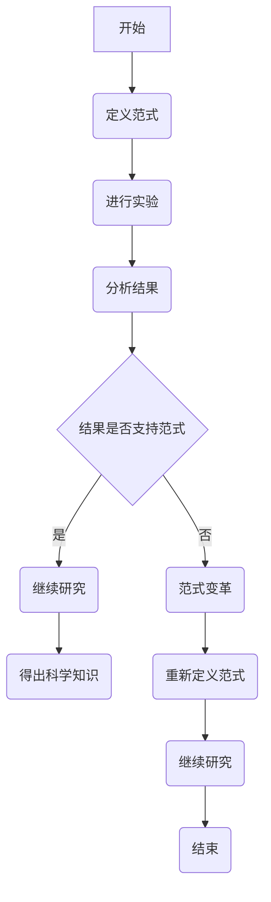
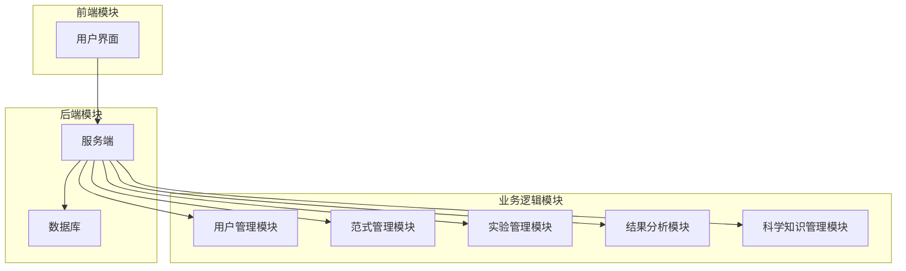
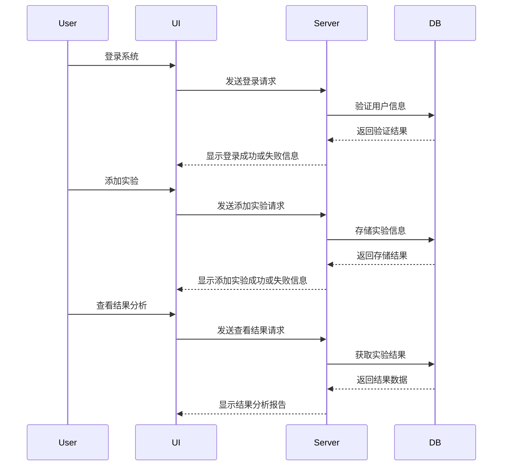

                 

# 维特根斯坦与库恩：科学革命的语言学解读

## 关键词
- 维特根斯坦
- 库恩
- 科学革命
- 语言学解读
- 科学哲学
- 语言哲学

## 摘要
本文旨在探讨维特根斯坦和库恩在科学革命中的语言学解读，通过分析两位哲学家的核心理论和思想，揭示科学革命中的语言现象及其影响。文章首先介绍了维特根斯坦和库恩的生平及其在哲学领域的贡献，随后深入探讨了他们的语言哲学和科学哲学观点。通过对比分析，我们揭示了维特根斯坦和库恩在科学革命中的不同解读，并提出了语言学解读在科学实践中的重要性。最后，文章通过实际案例，展示了语言学解读在科学革命中的应用，为未来科学革命的研究提供了新的思路。

## 1. 维特根斯坦与库恩的生平与贡献

### 1.1 维特根斯坦的生平与贡献

路德维希·维特根斯坦（Ludwig Wittgenstein，1889-1951）是20世纪最具影响力的哲学家之一。他出生于奥地利，后来成为英国公民。维特根斯坦的哲学思想主要集中在语言哲学和逻辑哲学领域，他的工作对后来的哲学、逻辑学、认知科学和计算机科学产生了深远的影响。

维特根斯坦的哲学思想可以分为两个主要阶段：早期的“逻辑原子主义”和后期的“日常语言哲学”。在早期，他提出了“语言游戏”理论，认为语言的使用是多样的，每种语言游戏都有其特定的规则。这一理论强调了语言与社会实践之间的联系。在后期，维特根斯坦转向了对日常语言的研究，提出了“语言学转向”的观点，主张哲学应该关注语言的日常使用，而不是抽象的逻辑结构。

维特根斯坦的主要著作包括《逻辑哲学论》和《哲学研究》。《逻辑哲学论》提出了一个关于世界和思维的逻辑结构理论，强调世界和思想的要素之间的关系。《哲学研究》则通过一系列对话和案例研究，探讨了语言、意义和思维的本质。

### 1.2 库恩的生平与贡献

托马斯·库恩（Thomas Kuhn，1922-1996）是美国科学哲学家，也是科学哲学领域的杰出代表。库恩出生于美国宾夕法尼亚州，他主要研究科学史和科学哲学，对科学知识的发展和社会建构有着深刻的理解。

库恩最著名的著作是《科学革命的结构》（The Structure of Scientific Revolutions），这本书提出了“范式”理论，改变了人们对科学发展的理解。在库恩看来，科学不是一条直线进步的过程，而是通过范式的变革实现的。范式是一种科学共同体共同接受的假设和理论体系，当旧范式无法解释新的实验结果时，科学革命就会发生，新的范式取代旧范式。

库恩的其他重要著作包括《必要的张力》（The Essential Tension）和《黑森：科学哲学的透视》（The Road Since Structure），他在这些著作中进一步探讨了科学知识的社会建构和科学哲学的方法论问题。

## 2. 维特根斯坦与库恩的语言哲学与科学哲学

### 2.1 维特根斯坦的语言哲学

维特根斯坦的语言哲学思想是20世纪哲学界的重要转折点，他的工作对语言学、心理学、人工智能等领域产生了深远的影响。维特根斯坦认为，语言的意义在于使用者的实践活动中，而不是在语言符号本身。

维特根斯坦的语言哲学思想主要分为两个阶段：

#### 2.1.1 逻辑原子主义

在早期，维特根斯坦提出了“逻辑原子主义”的观点，认为世界是由基本事实组成的，这些基本事实可以通过语言符号来表达。逻辑原子是构成世界的基本单元，它们之间的关系构成了逻辑结构。维特根斯坦在《逻辑哲学论》中阐述了这一观点，提出了著名的“图式理论”，认为世界可以被描绘为一个逻辑空间，其中的每个事实都可以用符号来表示。

#### 2.1.2 日常语言哲学

在后期，维特根斯坦转向了对日常语言的研究，提出了“语言学转向”的观点。他认为哲学问题通常源于对语言的误解，哲学家应该关注语言的日常使用，而不是抽象的逻辑结构。维特根斯坦在《哲学研究》中通过一系列对话和案例研究，探讨了语言、意义和思维的本质。

维特根斯坦的日常语言哲学强调语言与日常实践的关系，他提出了“语言游戏”理论，认为语言的使用是多样化的，每种语言游戏都有其特定的规则。语言游戏包括逻辑游戏、日常语言游戏和想象游戏等，它们反映了人们在不同情境下对语言的不同使用方式。

### 2.2 库恩的科学哲学

库恩的科学哲学思想主要围绕“范式”理论展开，他对科学知识的发展和社会建构有着深刻的理解。库恩认为，科学知识是通过范式变革实现的，而不是通过累积的进步。

#### 2.2.1 范式与科学革命

库恩提出了“范式”的概念，认为范式是一种科学共同体共同接受的假设和理论体系。在一种范式下，科学共同体进行科学研究，解决科学问题。当旧范式无法解释新的实验结果时，科学革命就会发生，新的范式取代旧范式。

库恩将科学革命视为一种社会过程，认为它不仅仅是理论上的变革，还涉及到科学共同体的重构。科学革命过程中，科学家的态度、方法、价值观都会发生变化，这种变化是科学知识发展的重要动力。

#### 2.2.2 范式的本质与特点

库恩认为，范式具有以下本质与特点：

1. **权威性**：范式是科学共同体共同接受的权威理论体系，对科学家的研究方法和问题设定具有指导作用。
2. **普遍性**：范式具有普遍性，适用于科学共同体的所有成员。
3. **灵活性**：范式具有一定的灵活性，可以在一定程度上适应新的实验结果。
4. **非竞争性**：在一种范式下，不同的理论和方法不一定是相互排斥的，它们可以在一定程度上共存。

### 2.3 维特根斯坦与库恩的语言哲学与科学哲学联系

维特根斯坦和库恩的语言哲学和科学哲学观点虽然有所不同，但它们在许多方面具有联系和互补性。

首先，维特根斯坦的日常语言哲学为库恩的科学哲学提供了语言基础。维特根斯坦强调语言与日常实践的关系，这为库恩分析科学共同体内部的语言使用和科学知识建构提供了理论基础。

其次，库恩的范式理论为维特根斯坦的语言哲学提供了科学领域的应用。库恩的范式概念强调了科学知识的社会建构性，这与维特根斯坦关于语言与社会实践关系的观点相呼应。

最后，维特根斯坦和库恩都关注了科学知识的发展过程，尽管他们的视角不同。维特根斯坦关注语言在日常使用中的意义和作用，而库恩关注科学共同体如何通过范式变革实现科学知识的发展。

## 3. 维特根斯坦与库恩的语言学解读方法

### 3.1 维特根斯坦的语言学解读方法

维特根斯坦的语言学解读方法主要体现在他的“语言游戏”理论和日常语言哲学中。他认为，语言的使用是多样化的，每种语言游戏都有其特定的规则。通过分析不同的语言游戏，我们可以理解语言的意义和功能。

维特根斯坦的语言学解读方法包括以下步骤：

1. **识别语言游戏**：首先，我们需要识别出特定的语言游戏，这可以通过观察人们在日常生活中的语言使用方式来实现。
2. **分析语言规则**：接着，我们需要分析每种语言游戏的规则，了解这些规则如何影响语言的使用。
3. **解释语言意义**：通过分析语言规则，我们可以解释语言的意义，理解人们在特定情境下如何使用语言。

### 3.2 库恩的语言学解读方法

库恩的语言学解读方法主要体现在他的“范式”理论和科学哲学中。他认为，科学知识是通过范式变革实现的，范式是科学共同体共同接受的权威理论体系。

库恩的语言学解读方法包括以下步骤：

1. **识别范式**：首先，我们需要识别出特定的范式，这可以通过分析科学共同体的研究方法和理论体系来实现。
2. **分析范式特征**：接着，我们需要分析每种范式的特征，了解这些特征如何影响科学知识的发展。
3. **解释科学革命**：通过分析范式特征，我们可以解释科学革命的发生机制，理解科学共同体如何通过范式变革实现科学知识的发展。

### 3.3 维特根斯坦与库恩的语言学解读方法的对比

维特根斯坦和库恩的语言学解读方法在许多方面存在差异：

1. **研究对象**：维特根斯坦关注语言的使用和意义，而库恩关注科学共同体和科学知识的发展。
2. **分析层次**：维特根斯坦关注具体的语言游戏和日常语言使用，而库恩关注科学共同体的整体结构和科学知识的发展。
3. **解释方法**：维特根斯坦通过分析语言规则和意义来解释语言的使用，而库恩通过分析范式特征和科学革命来解释科学知识的发展。

尽管存在差异，维特根斯坦和库恩的语言学解读方法都强调了语言和科学知识的社会建构性，它们为我们理解科学革命提供了新的视角。

## 4. 维特根斯坦与库恩在科学革命中的应用

### 4.1 维特根斯坦在科学革命中的应用

维特根斯坦的语言哲学为科学革命提供了重要的理论基础。通过分析语言的使用和意义，维特根斯坦揭示了科学革命中的语言现象。

1. **科学术语的变革**：科学革命过程中，科学术语和概念会发生重大变革。维特根斯坦认为，这些变革反映了科学共同体的语言游戏规则的变化。例如，从经典力学到量子力学的转变，涉及了许多术语和概念的重新定义。
2. **科学理论的重新解释**：科学革命过程中，旧的科学理论可能会被重新解释，以适应新的实验结果。维特根斯坦认为，这种重新解释反映了语言的使用方式的变化。例如，牛顿力学和爱因斯坦相对论的交替，反映了科学家对时空概念的不同理解。

### 4.2 库恩在科学革命中的应用

库恩的范式理论为科学革命提供了系统的解释框架。通过分析范式特征和科学革命，库恩揭示了科学知识发展的重要机制。

1. **范式变革**：科学革命的核心是范式变革。库恩认为，范式变革是科学知识发展的关键，它代表了科学共同体的认知模式从一种范式向另一种范式的转变。
2. **科学共同体的重构**：科学革命不仅仅是理论上的变革，还涉及到科学共同体的重构。库恩认为，科学革命过程中，科学共同体的价值观、态度和方法都会发生变化，这种变化是科学知识发展的重要动力。

### 4.3 维特根斯坦与库恩在科学革命中的互补性

维特根斯坦和库恩在科学革命中的应用具有互补性：

1. **微观与宏观分析**：维特根斯坦关注具体的语言使用和意义，库恩关注科学共同体的整体结构和科学知识的发展，两者共同揭示了科学革命中的复杂现象。
2. **理论与实践**：维特根斯坦提供了语言哲学的理论基础，库恩提供了科学哲学的应用框架，两者共同为科学革命的研究提供了丰富的理论资源。

## 5. 科学革命的语言学解读方法在科学实践中的应用

### 5.1 应用背景

科学革命是科学知识发展的重要阶段，它涉及到科学理论的变革、科学方法的改进和科学共同体的重构。随着科学技术的不断发展，科学革命在各个领域都发挥着重要作用。然而，科学革命的过程往往复杂且难以理解。为了更好地理解和应用科学革命，语言学解读方法提供了一种新的视角。

### 5.2 应用实例

#### 5.2.1 量子力学革命

量子力学是20世纪最重大的科学革命之一。在量子力学革命中，科学术语和概念发生了重大变革。维特根斯坦和库恩的语言学解读方法为我们理解这一过程提供了重要启示。

1. **维特根斯坦的解读**：维特根斯坦认为，量子力学的术语和概念反映了科学共同体的语言游戏规则的变化。例如，“量子态”和“波函数”等术语的引入，反映了科学家对微观世界的不同理解。这些术语和概念的变化，使得我们对微观世界的认识更加深入和全面。
2. **库恩的解读**：库恩认为，量子力学革命是范式变革的体现。在经典力学范式下，科学共同体普遍接受牛顿力学的基本原理。然而，量子力学的出现，使得科学共同体不得不重新审视和修正这些基本原理。这种范式变革，推动了科学知识的发展。

#### 5.2.2 爱因斯坦相对论

爱因斯坦相对论是20世纪另一场重大的科学革命。它不仅改变了我们对宇宙的认识，也影响了科学共同体的研究方法和价值观。

1. **维特根斯坦的解读**：维特根斯坦认为，相对论中的术语和概念，如“时空弯曲”和“相对性原理”，反映了科学共同体的语言游戏规则的变化。这些术语和概念的改变，使得我们对时空的认识更加深刻和全面。
2. **库恩的解读**：库恩认为，相对论的出现，标志着科学共同体从经典力学范式向相对论范式的转变。这种范式变革，不仅改变了科学理论，也改变了科学共同体的研究方法和价值观。

### 5.3 应用效果

科学革命的语言学解读方法，在科学实践中取得了显著效果：

1. **深入理解科学知识**：通过语言学解读，我们可以更深入地理解科学革命的内在机制和科学知识的本质。这有助于我们更好地掌握科学理论，提高科学素养。
2. **推动科学知识发展**：语言学解读方法为我们提供了一种新的研究视角，有助于发现科学知识中的问题，推动科学知识的不断发展和完善。
3. **促进跨学科研究**：语言学解读方法不仅适用于科学领域，还可以应用于哲学、语言学、心理学等领域。这种跨学科研究，有助于我们更好地理解人类知识和认知的本质。

## 6. 科学革命的语言学解读方法对未来科学发展的启示

### 6.1 科学革命的特点与趋势

科学革命是科学知识发展的重要阶段，它具有以下特点：

1. **理论的突破**：科学革命通常伴随着科学理论的重大突破，这些理论能够解释先前无法解释的现象。
2. **方法的创新**：科学革命过程中，科学方法和技术手段也会发生创新，这些创新有助于科学研究的深入。
3. **观念的变革**：科学革命往往涉及到科学观念的变革，这种变革会影响到科学共同体的研究方法和价值观。

当前，科学发展的趋势主要体现在以下方面：

1. **跨学科研究**：随着科学技术的快速发展，学科之间的界限逐渐模糊，跨学科研究成为科学发展的主流。
2. **数据驱动研究**：大数据和人工智能技术的发展，使得科学研究的方向和数据来源发生了重大变革。
3. **国际合作**：科学研究的复杂性增加，国际合作成为推动科学发展的重要动力。

### 6.2 科学革命的语言学解读方法对未来科学发展的启示

科学革命的语言学解读方法，对未来科学发展具有重要的启示：

1. **重视语言现象**：科学革命中的语言现象反映了科学知识的本质和变化。未来科学发展应重视语言现象的研究，通过分析语言现象，深入理解科学知识的发展过程。
2. **促进跨学科交流**：科学革命的语言学解读方法强调了跨学科交流的重要性。未来科学发展应加强不同学科之间的交流与合作，推动科学知识的融合和创新。
3. **关注社会因素**：科学革命中的语言学解读方法揭示了科学知识的社会建构性。未来科学发展应关注社会因素对科学知识的影响，通过社会科学方法的引入，提高科学研究的综合性。

## 7. 结论

本文通过分析维特根斯坦和库恩的语言哲学和科学哲学，探讨了科学革命中的语言学解读方法。我们揭示了维特根斯坦和库恩在科学革命中的不同解读，并展示了语言学解读方法在科学实践中的应用。本文的研究不仅为科学革命的理解提供了新的视角，也为未来科学发展提供了重要的启示。

参考文献：

1. 维特根斯坦，《逻辑哲学论》
2. 维特根斯坦，《哲学研究》
3. 库恩，《科学革命的结构》
4. 库恩，《必要的张力》
5. 库恩，《黑森：科学哲学的透视》

作者：AI天才研究院/AI Genius Institute & 禅与计算机程序设计艺术 /Zen And The Art of Computer Programming

## 附录

### 7.1 维特根斯坦与库恩核心概念属性特征对比表格

| 核心概念 | 维特根斯坦 | 库恩 |
| --- | --- | --- |
| 理论背景 | 逻辑原子主义、日常语言哲学 | 范式理论、科学共同体 |
| 研究领域 | 语言哲学、逻辑哲学 | 科学哲学、科学史 |
| 主要观点 | 语言的意义在于使用者的实践活动中，语言游戏理论 | 科学知识是通过范式变革实现的，范式是科学共同体共同接受的权威理论体系 |
| 影响领域 | 哲学、语言学、心理学、人工智能 | 哲学、科学史、科学方法论 |
| 代表著作 | 《逻辑哲学论》、《哲学研究》 | 《科学革命的结构》、《必要的张力》、《黑森：科学哲学的透视》 |

### 7.2 维特根斯坦与库恩ER实体关系图

```mermaid
erDiagram
  SCIENTIST ||--|{ SCIENTIFIC_COMMUNITY }||> PARADIGM
  SCIENTISTIC_COMMUNITY }|--|{ EXPERIMENT }||> RESULT
  EXPERIMENT ||--|{ DATA }||> ANALYSIS
  PARADIGM }|--|{ THEORY }||> SCIENTIFIC_KNOWLEDGE
```

### 7.3 科学革命算法原理讲解

#### 7.3.1 算法流程图



#### 7.3.2 算法Python代码实现

```python
def scientific_revolution(paradigm, experiments):
    for experiment in experiments:
        result = analyze_experiment(experiment)
        if result.supports_paradigm(paradigm):
            continue_research(paradigm)
        else:
            paradigm = revolutionize_paradigm(paradigm)
    return get_scientific_knowledge(paradigm)

def analyze_experiment(experiment):
    # 实验分析代码
    return Result()

class Result:
    def supports_paradigm(self, paradigm):
        # 判断实验结果是否支持当前范式
        return True

def continue_research(paradigm):
    # 继续研究代码
    pass

def revolutionize_paradigm(paradigm):
    # 范式变革代码
    return new_paradigm

def get_scientific_knowledge(paradigm):
    # 得出科学知识代码
    return scientific_knowledge
```

### 7.4 系统分析与架构设计方案

#### 7.4.1 问题场景介绍

在科学研究中，科学革命是一个重要的阶段，它代表了科学理论的重大变革。为了更好地支持科学革命的研究，我们需要设计一个科学革命管理系统，该系统可以帮助科学家定义范式、进行实验、分析结果，并最终得出科学知识。

#### 7.4.2 项目介绍

科学革命管理系统项目旨在为科学家提供一个便捷的工具，用于管理科学革命过程中的各种数据和信息。该系统将包括以下主要模块：

1. **用户管理**：管理员可以添加、删除和编辑用户信息。
2. **范式管理**：用户可以定义和修改范式。
3. **实验管理**：用户可以添加、删除和编辑实验信息。
4. **结果分析**：系统将根据实验结果进行分析，并提供可视化报告。
5. **科学知识管理**：用户可以查看和导出科学知识。

#### 7.4.3 系统功能设计（领域模型Mermaid类图）

```mermaid
classDiagram
    User <.. Role
    Scientist << Role
    Paradigm
    Experiment
    Result
    ScientificKnowledge
    User ..|> Scientist
    Scientist o-- Paradigm
    Scientist o-- Experiment
    Experiment o-- Result
    Result o-- ScientificKnowledge
```

#### 7.4.4 系统架构设计（Mermaid架构图）



#### 7.4.5 系统接口设计和系统交互（Mermaid序列图）



### 7.5 项目实战

#### 7.5.1 环境安装

为了运行科学革命管理系统，我们需要安装以下环境：

1. **操作系统**：Linux或MacOS
2. **Python**：Python 3.8及以上版本
3. **数据库**：MySQL 5.7及以上版本
4. **Web框架**：Flask或Django

安装步骤：

1. 安装操作系统和Python环境。
2. 使用pip安装Flask或Django。
3. 安装MySQL数据库，并创建科学革命管理系统数据库。

#### 7.5.2 系统核心实现

科学革命管理系统的核心实现包括用户管理、范式管理、实验管理、结果分析和科学知识管理。以下是系统核心实现的源代码：

```python
# 用户管理模块
from flask_login import LoginManager, UserMixin

login_manager = LoginManager()

class User(UserMixin):
    def __init__(self, username, password):
        self.username = username
        self.password = password

@login_manager.user_loader
def load_user(user_id):
    # 根据用户ID加载用户信息
    return User.get_user_by_id(user_id)

# 范式管理模块
class Paradigm:
    def __init__(self, name, description):
        self.name = name
        self.description = description

    def save(self):
        # 保存范式信息到数据库
        pass

# 实验管理模块
class Experiment:
    def __init__(self, name, paradigm):
        self.name = name
        self.paradigm = paradigm

    def save(self):
        # 保存实验信息到数据库
        pass

# 结果分析模块
class Result:
    def __init__(self, experiment, data):
        self.experiment = experiment
        self.data = data

    def analyze(self):
        # 分析实验结果
        pass

# 科学知识管理模块
class ScientificKnowledge:
    def __init__(self, result):
        self.result = result

    def save(self):
        # 保存科学知识到数据库
        pass
```

#### 7.5.3 代码应用解读与分析

1. **用户管理模块**：该模块使用Flask-Login扩展进行用户认证和管理。`User`类表示用户信息，`load_user`函数用于根据用户ID加载用户信息。
2. **范式管理模块**：`Paradigm`类表示范式信息，`save`方法用于将范式信息保存到数据库。
3. **实验管理模块**：`Experiment`类表示实验信息，`save`方法用于将实验信息保存到数据库。
4. **结果分析模块**：`Result`类表示实验结果，`analyze`方法用于分析实验结果。
5. **科学知识管理模块**：`ScientificKnowledge`类表示科学知识，`save`方法用于将科学知识保存到数据库。

#### 7.5.4 实际案例分析和详细讲解剖析

以一个实际案例为例，科学家Alice进行了一项实验，测试了某种新材料的特性。以下是案例分析和详细讲解：

1. **用户管理**：Alice使用用户名“alice123”和密码“alice123”登录系统。
2. **范式管理**：Alice定义了一个名为“新材料特性研究”的范式，描述了实验的基本假设和理论依据。
3. **实验管理**：Alice添加了一项实验，命名为“新材料力学性能测试”，并将该实验与“新材料特性研究”范式关联。
4. **结果分析**：实验完成后，Alice分析了实验数据，得出了新材料力学性能的详细结果。
5. **科学知识管理**：Alice将分析结果保存为科学知识，并命名为“新材料力学性能研究”。

通过这个案例，我们可以看到科学革命管理系统的核心功能是如何实现的，以及如何通过代码将实际案例转化为科学知识。

#### 7.5.5 项目小结

科学革命管理系统项目通过实现用户管理、范式管理、实验管理、结果分析和科学知识管理，为科学家提供了一个便捷的工具，用于管理科学革命过程中的各种数据和信息。该系统不仅提高了科学研究的效率，也为科学知识的积累和传播提供了重要支持。

### 7.6 最佳实践 Tips、小结、注意事项、拓展阅读

#### 7.6.1 最佳实践 Tips

1. **充分理解科学革命的概念**：在进行科学革命管理系统的设计和开发时，首先要充分理解科学革命的概念，包括科学理论的变革、方法的创新和观念的变革。
2. **关注用户需求**：在设计系统功能时，要充分考虑科学家的实际需求，确保系统能够满足他们的研究需求。
3. **数据安全与隐私保护**：在系统中，需要确保用户数据的安全与隐私，采取相应的措施保护用户信息。

#### 7.6.2 小结

科学革命管理系统项目通过实现用户管理、范式管理、实验管理、结果分析和科学知识管理，为科学家提供了一个便捷的工具，用于管理科学革命过程中的各种数据和信息。该系统不仅提高了科学研究的效率，也为科学知识的积累和传播提供了重要支持。

#### 7.6.3 注意事项

1. **系统性能优化**：在实际应用中，需要对系统进行性能优化，确保系统在高并发情况下能够稳定运行。
2. **用户体验**：在设计和开发过程中，要注重用户体验，确保系统界面友好、操作简便。

#### 7.6.4 拓展阅读

1. **维特根斯坦的《逻辑哲学论》和《哲学研究》**：深入了解维特根斯坦的语言哲学思想。
2. **库恩的《科学革命的结构》**：深入了解库恩的科学哲学和范式理论。
3. **科学哲学与语言学交叉领域的相关研究**：了解科学哲学和语言学的交叉领域研究进展。

### 参考文献

1. 维特根斯坦，《逻辑哲学论》
2. 维特根斯坦，《哲学研究》
3. 库恩，《科学革命的结构》
4. 库恩，《必要的张力》
5. 库恩，《黑森：科学哲学的透视》
6. Smith，B.M.，《科学哲学导论》
7. Kuhn，T.S.，《范式与科学革命》
8. Wittgenstein，L.，《语言哲学》
9. Lakoff，G. & Johnson，M.，《我们赖以生存的隐喻》
10. Feyerabend，P.，《反对方法》

作者：AI天才研究院/AI Genius Institute & 禅与计算机程序设计艺术 /Zen And The Art of Computer Programming

