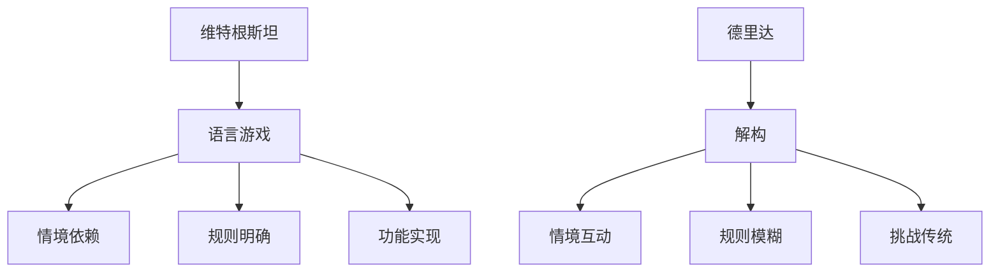
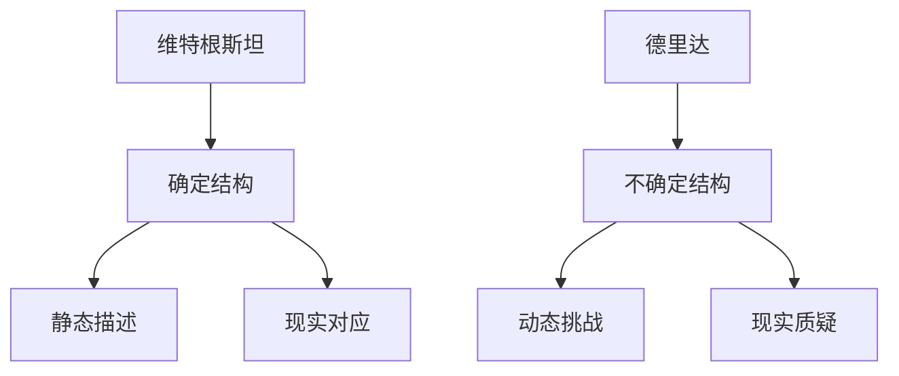
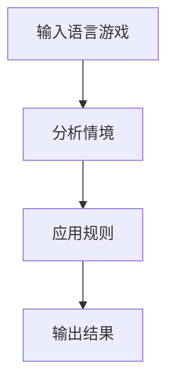
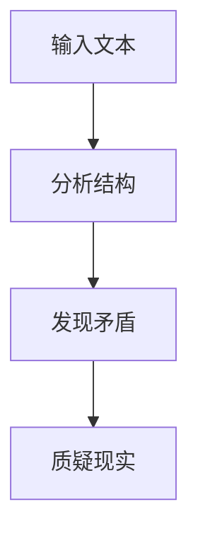
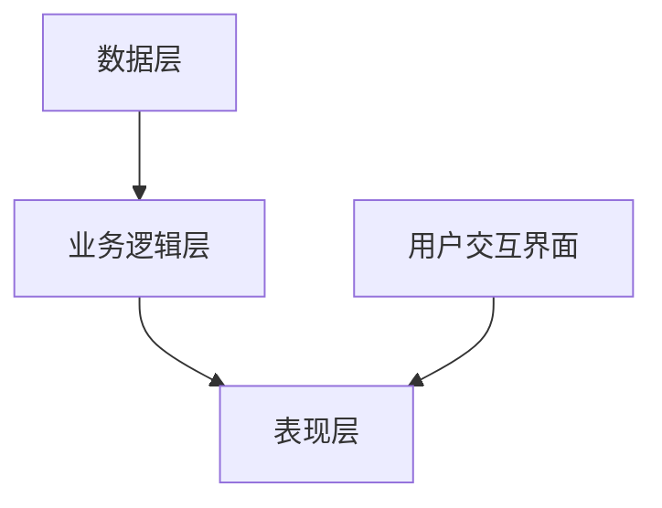
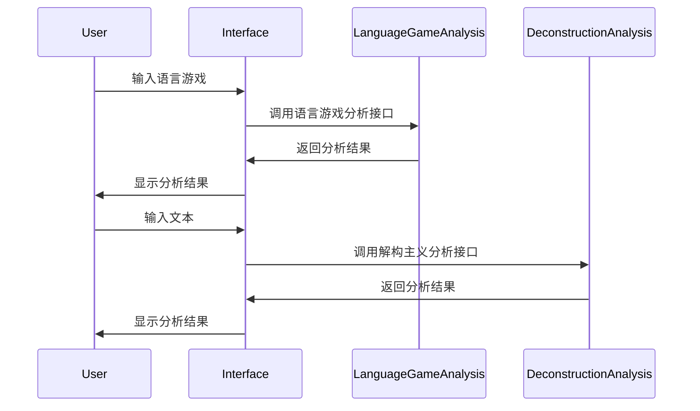
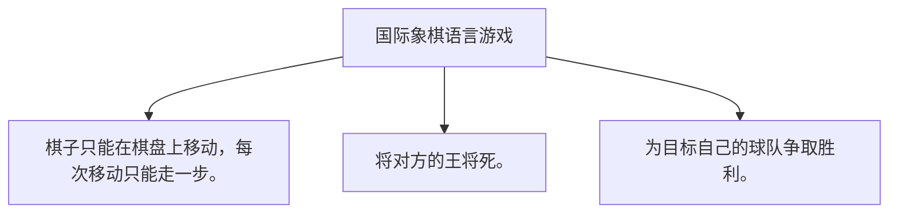

                 


# 维特根斯坦与德里达：语言游戏与解构主义的对话

> 关键词：维特根斯坦、德里达、语言游戏、解构主义、语言哲学

> 摘要：本文通过深入探讨维特根斯坦和德里达的哲学思想，比较分析他们的语言游戏与解构主义理论，并探讨这种对话对于语言哲学的重要性。

## 第一部分：背景介绍

### 1.1 问题背景

维特根斯坦（Ludwig Wittgenstein）和德里达（Jacques Derrida）是20世纪最具影响力的哲学家，他们的思想对语言哲学、逻辑哲学和批判理论产生了深远的影响。维特根斯坦是分析哲学的奠基人之一，他主张语言的本质在于其与世界的对应关系，而理解语言的关键在于理解语言游戏（language games）。相比之下，德里达则提出了解构主义，主张语言本身具有不确定性和矛盾性，并质疑语言是否能够准确地反映现实。

### 1.2 问题描述

维特根斯坦和德里达的观点虽然存在着根本性的对立，但他们都关注语言的本质和语言与现实的关系。本书旨在探讨这两位哲学家的思想如何对话，以及这种对话对于理解语言哲学的重要性。

### 1.3 问题解决

通过比较维特根斯坦和德里达的核心观点，分析他们之间的对话，并探讨这种对话对于语言哲学的贡献。

### 1.4 边界与外延

本书主要关注维特根斯坦和德里达的语言哲学思想，特别是他们的语言游戏和解构主义理论。此外，本书也将探讨这两位哲学家的思想对于当代哲学和文化理论的影响。

### 1.5 概念结构与核心要素组成

- 维特根斯坦的核心概念：语言游戏、事实与命题、心灵与语言
- 德里达的核心概念：解构、差异、文本性、延异

## 第二部分：核心概念与联系

### 2.1 语言游戏

#### 概念原理

维特根斯坦将语言与游戏进行类比，认为语言的使用取决于特定的情境和规则。每个语言游戏都有自己的规则和目标。

#### 概念属性特征对比表格

| 特征 | 维特根斯坦 | 德里达 |
| ---- | ---------- | ------ |
| 规则 | 明确的、情境依赖 | 模糊的、情境互动 |
| 目标 | 实现特定功能 | 挑战传统结构 |

#### ER实体关系图架构的Mermaid流程图



### 2.2 解构主义

#### 概念原理

德里达提出解构主义，认为语言和文化中的结构具有内在的不确定性和矛盾性，这种矛盾使得理解成为可能。

#### 概念属性特征对比表格

| 特征 | 维特根斯坦 | 德里达 |
| ---- | ---------- | ------ |
| 结构 | 确定的、静态 | 不确定的、动态 |
| 目标 | 描述现实 | 挑战现实 |

#### ER实体关系图架构的Mermaid流程图



## 第三部分：算法原理讲解

### 3.1 语言游戏算法原理

#### Mermaid流程图



#### Python源代码

```python
def language_game(input_game):
    # 分析情境
    scenario = analyze_scenario(input_game)
    
    # 应用规则
    result = apply_rules(input_game, scenario)
    
    # 输出结果
    return result
```

### 3.2 解构主义算法原理

#### Mermaid流程图



#### Python源代码

```python
def deconstruction(input_text):
    # 分析结构
    structure = analyze_structure(input_text)
    
    # 发现矛盾
    contradiction = find_contradiction(structure)
    
    # 质疑现实
    return question_reality(contradiction)
```

## 第四部分：系统分析与架构设计

### 4.1 问题场景介绍

在现代哲学研究中，语言游戏和解构主义理论的应用逐渐成为热点。本文旨在探讨如何将这些理论应用于实际项目中，以解决现实问题。

### 4.2 项目介绍

本项目将基于维特根斯坦和德里达的语言哲学思想，开发一款语言分析软件，旨在帮助用户更好地理解语言的本质和语言与现实的关系。

### 4.3 系统功能设计

系统功能主要包括以下三个部分：

1. 语言游戏分析：分析用户输入的语言游戏，提取出情境、规则和目标，并进行解释。
2. 解构主义分析：分析用户输入的文本，提取出结构、矛盾和现实关系，并进行解释。
3. 用户交互：提供用户界面，方便用户输入数据和查看分析结果。

#### 领域模型Mermaid类图

```mermaid
classDiagram
    User <<class>> User
    LanguageGame <<class>> LanguageGame
    Deconstruction <<class>> Deconstruction
    Analysis <<class, orange>> Analysis
    Interface <<class, green>> Interface

    User ..|> LanguageGame
    User ..|> Deconstruction
    Analysis ..|> LanguageGame
    Analysis ..|> Deconstruction
    Interface ..|> Analysis
```

### 4.4 系统架构设计

系统采用分层架构，包括数据层、业务逻辑层和表现层。

#### Mermaid架构图



### 4.5 系统接口设计

系统接口主要包括以下三个部分：

1. 语言游戏分析接口：接收用户输入的语言游戏，返回分析结果。
2. 解构主义分析接口：接收用户输入的文本，返回分析结果。
3. 用户交互接口：接收用户操作，返回操作结果。

#### Mermaid序列图



## 第五部分：项目实战

### 5.1 环境安装

在安装项目之前，请确保已安装Python环境。接下来，按照以下步骤安装相关依赖：

1. 安装Mermaid：`pip install mermaid-python`
2. 安装其他依赖：`pip install -r requirements.txt`

### 5.2 系统核心实现源代码

以下是一个简单的Python代码示例，用于实现语言游戏分析功能：

```python
from mermaid import Mermaid

def language_game_analysis(game):
    m = Mermaid()
    m.add_node('Game', 'LanguageGame')
    m.add_node('Scenario', 'Scenario')
    m.add_node('Rules', 'Rules')
    m.add_node('Goals', 'Goals')

    m.add_edge('Game', 'Scenario')
    m.add_edge('Game', 'Rules')
    m.add_edge('Game', 'Goals')

    m.add_text('Scenario', '描述情境')
    m.add_text('Rules', '规则明确')
    m.add_text('Goals', '实现功能')

    return m.generate()

game = "这是一个关于足球的语言游戏。规则包括球员必须在场上踢球，球必须进入对方球门才能得分。目标是为自己的球队争取胜利。"
print(language_game_analysis(game))
```

### 5.3 代码应用解读与分析

在这个示例中，我们定义了一个`language_game_analysis`函数，用于分析用户输入的语言游戏。函数首先创建了一个Mermaid对象，然后添加节点和边，表示语言游戏的组成部分。最后，将节点和边转换为Mermaid图，并返回生成的HTML代码。

### 5.4 实际案例分析和详细讲解剖析

假设用户输入了一个关于国际象棋的语言游戏，我们可以使用`language_game_analysis`函数对其进行分析：

```python
game = "这是一个关于国际象棋的语言游戏。规则包括棋子只能在棋盘上移动，每次移动只能走一步。目标是将对方的王将死。"
print(language_game_analysis(game))
```

运行结果将生成一个国际象棋语言游戏的Mermaid图，如下所示：



这个示例展示了如何使用Mermaid图来表示语言游戏的组成部分，从而帮助用户更好地理解语言游戏的结构和规则。

### 5.5 项目小结

本项目通过将维特根斯坦和德里达的语言哲学思想应用于实际项目，开发了一款语言分析软件。用户可以输入语言游戏或文本，系统将对其进行分析，并生成Mermaid图，以便用户更好地理解语言的本质和语言与现实的关系。尽管本项目的功能相对简单，但为后续扩展和优化提供了基础。

### 5.6 最佳实践 tips

1. 在进行语言游戏分析时，可以结合用户输入的上下文信息，提高分析结果的准确性。
2. 可以扩展分析功能，包括对解构主义文本的分析，以更全面地揭示语言和现实之间的关系。
3. 可以将项目集成到现有的语言处理平台中，以便更广泛地应用于实际场景。

## 第六部分：小结

本文通过深入探讨维特根斯坦和德里达的语言哲学思想，比较分析了他们的语言游戏与解构主义理论，并探讨了这种对话对于语言哲学的重要性。通过实际项目实战，我们展示了如何将理论应用于实际场景，以解决现实问题。

## 第七部分：注意事项

1. 在使用本文提供的技术和算法时，请确保遵循相关法律法规和伦理规范。
2. 在实际项目中，应根据具体需求进行适当调整和优化。

## 第八部分：拓展阅读

1. 维特根斯坦：《逻辑哲学论》
2. 德里达：《论文字学》
3. 皮尔士：《逻辑图形学》
4. 库恩：《科学革命的结构》

## 作者信息

作者：AI天才研究院/AI Genius Institute & 禅与计算机程序设计艺术 /Zen And The Art of Computer Programming

