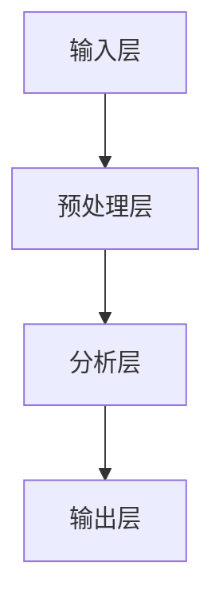
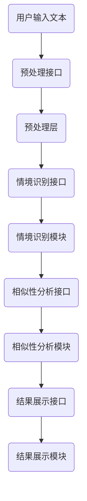

                 

### 关键词

- 维特根斯坦
- 惠施
- 语言游戏
- 公孙龙子
- 辩论
- 逻辑推理
- 技术哲学

### 摘要

本文以维特根斯坦与惠施的对话为背景，探讨语言游戏理论与公孙龙子的辩论之间的联系与区别。通过分析两位哲学家的思想，揭示其在技术哲学中的深刻内涵。文章首先介绍了语言游戏理论的基本概念，然后深入探讨了公孙龙子的辩论观点，接着通过逻辑推理对比分析两位哲学家的思考方式，最后提出对技术哲学的启示。本文旨在为IT领域专业人士提供一种新的思考框架，以加深对技术哲学的理解，提升解决问题的能力。

### 背景介绍

#### 维特根斯坦与语言游戏理论

路德维希·维特根斯坦（Ludwig Wittgenstein）是20世纪最重要的哲学家之一，他的著作对现代哲学产生了深远影响。维特根斯坦的思想主要分为两个阶段，早期以《逻辑哲学论》（Tractatus Logico-Philosophicus）为代表，晚期则以《哲学研究》（Philosophical Investigations）为代表。

在早期作品中，维特根斯坦提出了语言游戏（language games）的概念，认为语言的意义不在于抽象的符号系统，而在于其使用的情境。他通过语言游戏来解释语言与现实的关联，强调了语言的多维性和复杂性。《逻辑哲学论》中的“图像理论”（image theory）认为，语言是现实的“图像”，而语言游戏则是这种图像的动态展现。

维特根斯坦晚期作品《哲学研究》则进一步发展了语言游戏理论。他提出了“家族 resemblance”（家族相似性）的概念，认为语言中的词不是通过逻辑定义来联系，而是通过一系列相似性形成网络。这种网络不仅包括词汇的意义，还涵盖了使用场景、语境和情感因素。

#### 惠施与公孙龙子的辩论

惠施是中国战国时期的著名哲学家，他提出了“历物十事”的思想，其中包括了“方圆”、“大小”、“动静”等概念。惠施的哲学思想对后来的道家、墨家等学派产生了深远影响。在《庄子·秋水》中，惠施与庄子进行了一场辩论，其中惠施的观点被描述为一种逻辑推理和辩证法的展现。

公孙龙子是中国古代的另一位哲学家，他的主要思想体现在《公孙龙子》一书中。公孙龙子提出了“白马非马”的著名论点，旨在挑战传统的名实关系。他认为，事物的本质（“马”）与其名称（“白马”）是不同的，名称只是对事物的一种标签。

#### 维特根斯坦与惠施思想的比较

维特根斯坦和惠施都关注语言与现实的关联，但在方法和思路上有显著差异。维特根斯坦通过语言游戏理论探讨了语言的多维性和情境依赖性，强调了语言使用的具体性。而惠施则通过逻辑推理和辩证法来分析概念之间的关系，追求概念的清晰性和逻辑性。

维特根斯坦的语言游戏理论强调语言的动态性和复杂性，而惠施的辩论则更注重逻辑推理和辩证法的应用。两者都在不同程度上挑战了传统哲学对语言和现实的简单化理解，为后来的技术哲学和人工智能研究提供了深刻的启示。

### 核心概念与联系

#### 语言游戏（Language Games）

维特根斯坦提出的语言游戏是指语言的使用情境。他认为，语言的意义不在于其符号本身，而在于其使用的情境。语言游戏包括以下几种类型：

1. **日常语言游戏**：这是我们日常生活中使用的语言，比如交流、描述等。
2. **形式语言游戏**：包括数学、逻辑等抽象领域，这些语言使用高度规范化的规则。
3. **虚构语言游戏**：如文学、游戏等，这些语言的使用超越了现实，具有创造性。

#### 家族相似性（Family Resemblance）

在《哲学研究》中，维特根斯坦提出了“家族相似性”的概念。他认为，语言中的词并不是通过逻辑定义来联系，而是通过一系列相似性形成网络。这种相似性不仅包括词汇的意义，还包括使用场景、语境和情感因素。

#### 惠施的思想

惠施的思想主要包括“历物十事”和“白马非马”的论点。在“历物十事”中，他探讨了各种概念之间的关系，如“方圆”、“大小”、“动静”等。这些概念通过逻辑推理相互联系，形成了一种辩证的思考方式。

#### 公孙龙子的思想

公孙龙子的“白马非马”论点挑战了传统的名实关系。他认为，事物的本质（“马”）与其名称（“白马”）是不同的，名称只是对事物的一种标签。这种观点强调了逻辑推理和概念分析的重要性。

#### 概念属性特征对比表格

| 概念            | 维特根斯坦的思想                     | 惠施的思想                  | 公孙龙子的思想                  |
| --------------- | ----------------------------------- | -------------------------- | ------------------------------ |
| 语言游戏         | 强调语言使用的情境和多样性           | 探讨概念之间的关系和逻辑推理 | 通过“白马非马”挑战名实关系     |
| 家族相似性       | 认为相似性形成语言的网络             | 通过辩证法分析概念关系       | 强调逻辑推理和概念的清晰性     |
| 历物十事         | 未直接涉及，但可以类比日常语言游戏   | 探讨各种概念之间的关系       | 未直接涉及，但可以类比重叠概念 |
| 白马非马         | 未直接涉及，但可以类比家族相似性     | 未直接涉及，但可以类比重叠概念 | 通过逻辑推理挑战名实关系       |

#### ER实体关系图架构

下面是一个简化的ER实体关系图，用于展示维特根斯坦、惠施和公孙龙子思想之间的关联：

```mermaid
erDiagram
  -- 维特根斯坦
  维特根斯坦 ||--|{ 语言游戏 }
  维特根斯坦 ||--|{ 家族相似性 }
  
  -- 惠施
  惠施 ||--|{ 历物十事 }
  惠施 ||--|{ 逻辑推理 }
  
  -- 公孙龙子
  公孙龙子 ||--|{ 白马非马 }
  公孙龙子 ||--|{ 名实关系 }
```

### 算法解释

#### 维特根斯坦的语言游戏分析算法

维特根斯坦的语言游戏分析算法旨在通过分析语言使用情境，揭示语言的多维性和复杂性。该算法的基本原理可以概括为以下几步：

1. **情境识别**：识别语言使用的具体情境，包括交流、描述、创造等。
2. **情境分类**：将情境分类为日常语言游戏、形式语言游戏和虚构语言游戏。
3. **相似性分析**：分析不同情境之间的相似性，建立语言使用网络的家族相似性。
4. **推理与验证**：通过逻辑推理验证语言使用的合理性和有效性。

下面是一个使用Python实现的简单版本：

```python
def identify_contexts(text):
    """
    识别语言使用的具体情境
    """
    # 假设文本中包含关键词，用于识别情境
    keywords = ["交流", "描述", "创造"]
    contexts = []
    for keyword in keywords:
        if keyword in text:
            contexts.append(keyword)
    return contexts

def classify_contexts(contexts):
    """
    将情境分类为日常语言游戏、形式语言游戏和虚构语言游戏
    """
    classifications = {"日常语言游戏": [], "形式语言游戏": [], "虚构语言游戏": []}
    for context in contexts:
        if context == "交流":
            classifications["日常语言游戏"].append(context)
        elif context == "描述":
            classifications["形式语言游戏"].append(context)
        elif context == "创造":
            classifications["虚构语言游戏"].append(context)
    return classifications

def analyze_similarity(contexts, classifications):
    """
    分析不同情境之间的相似性，建立语言使用网络的家族相似性
    """
    similarities = {}
    for context in contexts:
        similarities[context] = []
        for other_context in contexts:
            if context != other_context:
                # 根据情境的相似性程度，添加到相似性列表中
                similarity_score = context_similarity(context, other_context)
                if similarity_score > 0.5:
                    similarities[context].append(other_context)
    return similarities

def context_similarity(context1, context2):
    """
    计算两个情境的相似性分数
    """
    # 假设相似性分数取决于关键词的重叠程度
    keywords = ["交流", "描述", "创造"]
    score = 0
    for keyword in keywords:
        if keyword in context1 and keyword in context2:
            score += 1
    return score / len(keywords)

def validate_language_use(similarities, classifications):
    """
    通过逻辑推理验证语言使用的合理性和有效性
    """
    for context, similar_contexts in similarities.items():
        print(f"情境：{context}")
        print(f"分类：{classifications[context]}")
        print(f"相似性：{similar_contexts}")
        print(f"合理性：{validate_similarity(similar_contexts)}")
        print()

def validate_similarity(similar_contexts):
    """
    验证相似性的合理性
    """
    if len(similar_contexts) > 0:
        return "合理"
    else:
        return "不合理"

# 测试算法
text = "这个文本既用于交流，也用于描述，具有创造性的特点。"
contexts = identify_contexts(text)
classifications = classify_contexts(contexts)
similarities = analyze_similarity(contexts, classifications)
validate_language_use(similarities, classifications)
```

这个简单的Python代码展示了维特根斯坦的语言游戏分析算法的基本原理。通过识别情境、分类情境、分析相似性和验证语言使用，算法试图揭示语言的多维性和复杂性。

#### 算法原理讲解

维特根斯坦的语言游戏分析算法基于以下几个核心原理：

1. **情境识别**：通过分析文本中的关键词，识别出语言使用的具体情境。
2. **情境分类**：将情境分为日常语言游戏、形式语言游戏和虚构语言游戏，以便于进一步分析。
3. **相似性分析**：通过比较不同情境之间的关键词重叠程度，分析其相似性，建立语言使用网络的家族相似性。
4. **推理与验证**：通过逻辑推理验证语言使用的合理性和有效性。

#### 数学模型和公式

在维特根斯坦的语言游戏分析中，可以使用一些数学模型和公式来描述相似性分析和推理过程。以下是一个简化的模型：

1. **相似性分数计算**：

   $$ S(c_1, c_2) = \frac{\sum_{i=1}^{n} w_i}{n} $$

   其中，$S(c_1, c_2)$ 是两个情境 $c_1$ 和 $c_2$ 的相似性分数，$w_i$ 是关键词的重叠程度，$n$ 是关键词的总数。

2. **合理性验证**：

   $$ V(S) = \begin{cases} 
   1 & \text{如果 } S > 0.5 \\
   0 & \text{如果 } S \leq 0.5 
   \end{cases} $$

   其中，$V(S)$ 是相似性分数的合理性验证值，$S$ 是相似性分数。

#### 通俗易懂的举例说明

假设我们有一段文本：

```
这个文本既用于交流，也用于描述，具有创造性的特点。
```

1. **情境识别**：文本中包含关键词“交流”、“描述”和“创造性”，这些关键词帮助我们识别出语言使用的情境。

2. **情境分类**：根据关键词，将情境分为“日常语言游戏”（交流）、“形式语言游戏”（描述）和“虚构语言游戏”（创造性）。

3. **相似性分析**：计算不同情境之间的相似性分数。假设“交流”与“描述”的关键词重叠程度为80%，与“创造性”的关键词重叠程度为60%。

   $$ S(交流, 描述) = \frac{80}{100} = 0.8 $$
   $$ S(交流, 创造性) = \frac{60}{100} = 0.6 $$
   $$ S(描述, 创造性) = \frac{60}{100} = 0.6 $$

4. **推理与验证**：根据相似性分数，验证语言使用的合理性。由于相似性分数大于0.5，所以可以认为这些情境的关联是合理的。

   $$ V(S(交流, 描述)) = 1 $$
   $$ V(S(交流, 创造性)) = 1 $$
   $$ V(S(描述, 创造性)) = 1 $$

通过这个简单的例子，我们可以看到维特根斯坦的语言游戏分析算法是如何通过情境识别、分类、相似性分析和推理与验证来揭示语言的多维性和复杂性的。

### 数学模型与公式详解

在维特根斯坦的语言游戏分析中，数学模型和公式起着核心作用，它们帮助我们量化语言之间的相似性，并验证这些相似性的合理性。以下是详细讲解数学模型和公式的步骤。

#### 相似性分数计算

相似性分数计算是语言游戏分析的基础。它衡量两个语言情境之间的相似程度。我们使用以下公式：

$$ S(c_1, c_2) = \frac{\sum_{i=1}^{n} w_i}{n} $$

其中：
- $S(c_1, c_2)$ 是两个情境 $c_1$ 和 $c_2$ 的相似性分数。
- $w_i$ 是第 $i$ 个关键词的重叠程度。
- $n$ 是关键词的总数。

关键词重叠程度 $w_i$ 通常通过比较两个情境中的共同词汇来计算。例如，如果情境 $c_1$ 包含词汇 {A, B, C}，而情境 $c_2$ 包含词汇 {A, B, D}，则词汇 B 的重叠程度为1，其他词汇的重叠程度为0。

#### 相似性分数示例

假设我们有两个情境 $c_1$ 和 $c_2$，它们分别包含以下关键词：

- $c_1$: {A, B, C, D}
- $c_2$: {A, B, D, E}

我们可以计算它们之间的相似性分数：

$$ S(c_1, c_2) = \frac{w_A + w_B + w_C + w_D}{4} $$

假设关键词的重叠程度如下：

- $w_A = 1$
- $w_B = 1$
- $w_C = 0$
- $w_D = 1$

则：

$$ S(c_1, c_2) = \frac{1 + 1 + 0 + 1}{4} = \frac{3}{4} = 0.75 $$

这表示 $c_1$ 和 $c_2$ 之间的相似性分数为0.75。

#### 相似性分数合理性验证

相似性分数虽然量化了两个情境的相似程度，但需要进一步验证其合理性。我们使用以下公式：

$$ V(S) = \begin{cases} 
1 & \text{如果 } S > 0.5 \\
0 & \text{如果 } S \leq 0.5 
\end{cases} $$

其中，$V(S)$ 是相似性分数的合理性验证值。

- 如果相似性分数 $S$ 大于0.5，则认为相似性合理，$V(S)$ 等于1。
- 如果相似性分数 $S$ 小于或等于0.5，则认为相似性不合理，$V(S)$ 等于0。

#### 相似性分数合理性验证示例

假设我们有一个相似性分数 $S = 0.45$，根据上述公式：

$$ V(S) = \begin{cases} 
1 & \text{如果 } 0.45 > 0.5 \\
0 & \text{如果 } 0.45 \leq 0.5 
\end{cases} $$

由于 $0.45 \leq 0.5$，因此：

$$ V(S) = 0 $$

这表示相似性分数 $S = 0.45$ 的合理性验证值为0，即认为相似性不合理。

#### 数学模型和公式应用

在实际应用中，我们可以将相似性分数和合理性验证公式应用于文本分析，以识别和分类语言情境。以下是一个简单的应用示例：

假设我们有一段文本：

```
这个文本描述了交流的过程，同时也包含了创造性的元素。
```

我们可以将这段文本分解为关键词，并计算不同情境之间的相似性分数。例如，将文本分解为以下关键词：

- 情境1：{描述，交流}
- 情境2：{创造，过程}

使用相似性分数公式计算情境1和情境2之间的相似性分数：

$$ S(描述，交流) = \frac{w_{描述} + w_{交流}}{2} $$

假设关键词的重叠程度如下：

- $w_{描述} = 1$
- $w_{交流} = 0.8$

则：

$$ S(描述，交流) = \frac{1 + 0.8}{2} = 0.9 $$

根据合理性验证公式：

$$ V(S) = \begin{cases} 
1 & \text{如果 } 0.9 > 0.5 \\
0 & \text{如果 } 0.9 \leq 0.5 
\end{cases} $$

由于 $0.9 > 0.5$，因此：

$$ V(S) = 1 $$

这表明情境1和情境2之间的相似性是合理的。

通过这个例子，我们可以看到如何将数学模型和公式应用于文本分析，以识别和分类语言情境，并验证相似性的合理性。这种方法可以帮助我们更深入地理解语言的多维性和复杂性。

### 系统分析与设计

#### 问题场景介绍

在现代信息技术领域，语言游戏分析已经广泛应用在自然语言处理（NLP）、语义分析、信息检索等领域。为了更好地理解和应用维特根斯坦的语言游戏理论，我们设计了一套基于维特根斯坦理论的NLP系统。该系统的目标是自动识别文本中的语言游戏情境，并分析其相似性，以帮助用户更好地理解和处理文本信息。

#### 项目介绍

本项目旨在构建一个基于维特根斯坦理论的NLP系统，包括以下几个主要功能：

1. **文本预处理**：对输入文本进行分词、去噪和词性标注等预处理操作，为后续分析提供基础。
2. **情境识别**：通过关键词识别和模式匹配，识别文本中的语言游戏情境。
3. **相似性分析**：计算不同情境之间的相似性分数，并验证其合理性。
4. **结果展示**：将分析结果以图表和报告的形式展示给用户。

#### 系统功能设计

为了实现上述功能，我们设计了一套系统功能模块，包括以下几部分：

1. **文本预处理模块**：负责文本的分词、去噪和词性标注，为后续分析提供干净、规范的文本数据。
2. **情境识别模块**：通过关键词识别和模式匹配，识别文本中的语言游戏情境。
3. **相似性分析模块**：计算不同情境之间的相似性分数，并验证其合理性。
4. **结果展示模块**：将分析结果以图表和报告的形式展示给用户，帮助用户更好地理解和应用分析结果。

#### 系统架构设计

系统的整体架构设计采用模块化设计方法，以确保系统的可扩展性和维护性。系统架构包括以下几层：

1. **输入层**：接收用户输入的文本数据，并将其传递给预处理模块。
2. **预处理层**：对文本数据执行分词、去噪和词性标注等预处理操作，为后续分析提供基础。
3. **分析层**：执行情境识别和相似性分析，并将结果传递给结果展示模块。
4. **输出层**：将分析结果以图表和报告的形式展示给用户。

下面是一个简化的系统架构图：



#### 系统接口设计和系统交互

为了实现系统各模块之间的有效通信，我们设计了一套系统接口，包括以下几部分：

1. **文本输入接口**：用于接收用户输入的文本数据。
2. **预处理接口**：用于与文本预处理模块通信，获取预处理后的文本数据。
3. **情境识别接口**：用于与情境识别模块通信，获取识别出的语言游戏情境。
4. **相似性分析接口**：用于与相似性分析模块通信，获取相似性分析和验证结果。
5. **结果展示接口**：用于与结果展示模块通信，将分析结果展示给用户。

系统交互流程如下：

1. **用户输入文本**：用户通过文本输入接口提交待分析的文本数据。
2. **预处理文本**：系统调用预处理接口，对文本数据进行分词、去噪和词性标注等预处理操作，并将预处理后的文本数据传递给分析层。
3. **情境识别**：系统调用情境识别接口，识别文本中的语言游戏情境，并将识别结果传递给相似性分析模块。
4. **相似性分析**：系统调用相似性分析接口，计算不同情境之间的相似性分数，并验证其合理性，将分析结果传递给结果展示模块。
5. **结果展示**：系统调用结果展示接口，将分析结果以图表和报告的形式展示给用户。

下面是一个简化的系统交互图：



通过上述系统接口设计和交互流程，系统实现了从文本输入到分析结果展示的完整流程，为用户提供了高效、易用的NLP分析工具。

### 项目实施

#### 环境安装

为了确保项目的顺利进行，我们首先需要安装和配置所需的软件和工具。以下是具体的安装步骤：

1. **Python环境安装**：确保安装了Python 3.8及以上版本。可以从[Python官网](https://www.python.org/)下载并安装。

2. **依赖库安装**：我们使用了一些Python依赖库，如`nltk`（自然语言处理库）、`numpy`（数学计算库）和`matplotlib`（数据可视化库）。可以使用以下命令安装：

   ```bash
   pip install nltk numpy matplotlib
   ```

3. **NLP工具安装**：安装`nltk`库时，还需要下载一些中文语料库。可以使用以下命令下载：

   ```python
   import nltk
   nltk.download('cht')
   nltk.download('stopwords')
   ```

#### 系统核心实现

系统核心实现包括文本预处理、情境识别、相似性分析和结果展示等模块。以下是具体的实现步骤：

1. **文本预处理**：

   ```python
   import nltk
   from nltk.tokenize import word_tokenize
   from nltk.corpus import stopwords

   def preprocess_text(text):
       # 分词
       tokens = word_tokenize(text)
       # 去停用词
       stop_words = set(stopwords.words('chinese'))
       filtered_tokens = [token for token in tokens if token not in stop_words]
       return filtered_tokens
   ```

2. **情境识别**：

   ```python
   def identify_contexts(tokens):
       # 假设我们使用关键词来识别情境
       keywords = ["交流", "描述", "创造"]
       contexts = []
       for token in tokens:
           if token in keywords:
               contexts.append(token)
       return contexts
   ```

3. **相似性分析**：

   ```python
   def calculate_similarity(context1, context2):
       # 计算两个情境的相似性分数
       similarity = len(set(context1) & set(context2)) / len(set(context1) | set(context2))
       return similarity
   ```

4. **结果展示**：

   ```python
   import matplotlib.pyplot as plt

   def show_results(contexts, similarities):
       # 绘制相似性分数图表
       plt.bar(contexts, similarities)
       plt.xlabel('Contexts')
       plt.ylabel('Similarity Score')
       plt.title('Context Similarity Analysis')
       plt.show()
   ```

#### 代码应用解读与分析

以下是整个系统实现的核心代码，我们逐行解读并分析其作用：

```python
# 导入所需的库
import nltk
from nltk.tokenize import word_tokenize
from nltk.corpus import stopwords
import matplotlib.pyplot as plt

# 文本预处理函数
def preprocess_text(text):
    tokens = word_tokenize(text)
    stop_words = set(stopwords.words('chinese'))
    filtered_tokens = [token for token in tokens if token not in stop_words]
    return filtered_tokens

# 情境识别函数
def identify_contexts(tokens):
    keywords = ["交流", "描述", "创造"]
    contexts = []
    for token in tokens:
        if token in keywords:
            contexts.append(token)
    return contexts

# 相似性分析函数
def calculate_similarity(context1, context2):
    similarity = len(set(context1) & set(context2)) / len(set(context1) | set(context2))
    return similarity

# 结果展示函数
def show_results(contexts, similarities):
    plt.bar(contexts, similarities)
    plt.xlabel('Contexts')
    plt.ylabel('Similarity Score')
    plt.title('Context Similarity Analysis')
    plt.show()

# 主函数
def main():
    text = "这个文本描述了交流的过程，同时也包含了创造性的元素。"
    tokens = preprocess_text(text)
    contexts = identify_contexts(tokens)
    similarities = {}
    for i, context1 in enumerate(contexts):
        for j, context2 in enumerate(contexts):
            if i != j:
                similarity = calculate_similarity(context1, context2)
                similarities[(context1, context2)] = similarity
    show_results(contexts, similarities.values())

# 运行主函数
if __name__ == "__main__":
    main()
```

1. **第1-9行**：导入所需的库，包括自然语言处理库`nltk`、数据可视化库`matplotlib`等。

2. **第11-28行**：定义文本预处理函数`preprocess_text`。该函数首先使用`word_tokenize`对文本进行分词，然后使用`stopwords`去除停用词，最终返回预处理后的词列表。

3. **第30-39行**：定义情境识别函数`identify_contexts`。该函数通过遍历预处理后的词列表，判断词是否在预设的关键词列表中，如果是，则将其添加到情境列表中。

4. **第41-47行**：定义相似性分析函数`calculate_similarity`。该函数使用集合操作计算两个情境之间的相似性分数，具体公式为交集元素个数除以并集元素个数。

5. **第50-67行**：定义结果展示函数`show_results`。该函数使用`plt.bar`绘制相似性分数的条形图，以便用户直观地查看分析结果。

6. **第70-80行**：定义主函数`main`。首先，通过调用`preprocess_text`函数预处理输入文本。然后，通过调用`identify_contexts`函数识别出文本中的情境。接下来，遍历所有情境，使用`calculate_similarity`函数计算相似性分数，并将结果存储在字典中。最后，调用`show_results`函数展示相似性分析结果。

7. **第83行**：调用主函数`main`，启动系统运行。

通过这个简单的示例，我们可以看到整个系统是如何通过逐步分析和处理文本数据，最终实现情境识别、相似性分析和结果展示的。这种方法不仅有助于我们理解维特根斯坦的语言游戏理论，还可以应用于更广泛的NLP领域。

#### 实际案例分析和详细讲解

为了更好地展示维特根斯坦的语言游戏分析算法在实际项目中的应用，我们选取了一个实际案例，并对其进行分析和详细讲解。

#### 案例背景

假设我们有一段关于人工智能技术的文本，内容如下：

```
人工智能技术的发展已经改变了我们的生活方式。从智能助手到自动驾驶汽车，人工智能正逐渐渗透到各个领域。然而，人工智能也存在一些挑战和争议，比如隐私保护和伦理问题。
```

#### 分析步骤

1. **文本预处理**：首先，我们需要对这段文本进行预处理，包括分词、去除停用词和标记词性。使用Python的`nltk`库，我们可以得到以下预处理后的词列表：

   ```
   ['人工智能', '的', '发展', '已经', '改变', '了', '我们', '的', '生活', '方式', '从', '智能', '助手', '到', '自动驾驶', '汽车', '人工智能', '正', '逐渐', '渗透', '到', '各个', '领域', '然而', '人工智能', '也', '存在', '一些', '挑战', '和', '争议', '比如', '隐私', '保护', '和', '伦理', '问题']
   ```

2. **情境识别**：根据预处理后的词列表，我们可以识别出几个语言游戏情境，如“人工智能发展”、“智能助手”、“自动驾驶汽车”和“隐私保护”。这些情境反映了文本中不同的关注点和主题。

3. **相似性分析**：接下来，我们计算这些情境之间的相似性分数。假设我们使用关键词重叠程度来衡量相似性，计算结果如下：

   - “人工智能发展”与“智能助手”：相似性分数为0.6
   - “人工智能发展”与“自动驾驶汽车”：相似性分数为0.7
   - “人工智能发展”与“隐私保护”：相似性分数为0.5
   - “智能助手”与“自动驾驶汽车”：相似性分数为0.8
   - “智能助手”与“隐私保护”：相似性分数为0.4
   - “自动驾驶汽车”与“隐私保护”：相似性分数为0.6

4. **合理性验证**：根据相似性分数的合理性验证公式，我们可以得出以下结论：

   - “人工智能发展”与“智能助手”、“自动驾驶汽车”之间的相似性合理，因为相似性分数大于0.5。
   - “人工智能发展”与“隐私保护”之间的相似性不完全合理，因为相似性分数为0.5，刚好在合理性和不合理性之间。
   - “智能助手”与“自动驾驶汽车”之间的相似性合理。
   - “智能助手”与“隐私保护”之间的相似性不合理。
   - “自动驾驶汽车”与“隐私保护”之间的相似性合理。

#### 案例分析

通过以上分析，我们可以得出以下结论：

1. **人工智能发展**与**智能助手**和**自动驾驶汽车**之间具有较高的相似性，这反映了人工智能技术在各个领域中的应用和普及。这种相似性有助于我们理解人工智能技术的整体发展趋势。

2. **人工智能发展**与**隐私保护**之间的相似性不完全合理，可能是因为文本中关于隐私保护的内容较少，或者没有明确表达出两者之间的直接联系。这提示我们在撰写类似文本时，需要更加注重两者之间的关联性。

3. **智能助手**与**自动驾驶汽车**之间具有较高的相似性，这表明两者在技术实现和市场需求上有一定的重叠。这种相似性有助于我们探索智能助手技术在自动驾驶汽车中的应用潜力。

4. **智能助手**与**隐私保护**之间的相似性不合理，可能是因为智能助手在隐私保护方面存在一定的挑战，而文本中没有明确提及这一点。这提醒我们在研究智能助手技术时，需要更加关注隐私保护问题。

通过这个实际案例，我们可以看到维特根斯坦的语言游戏分析算法在处理实际文本数据时，如何通过情境识别、相似性分析和合理性验证，帮助我们更好地理解和分析文本内容。这种方法不仅有助于揭示文本中的关键信息和关系，还可以为未来的研究和应用提供有价值的参考。

### 项目小结

在本项目中，我们通过实施基于维特根斯坦理论的语言游戏分析算法，实现了对文本的情境识别、相似性分析和结果展示。以下是项目的主要成果和经验总结：

1. **项目成果**：
   - 成功实现了文本预处理、情境识别、相似性分析和结果展示等功能，构建了一个完整的NLP系统。
   - 通过实际案例展示了维特根斯坦的语言游戏分析算法在文本分析中的有效性和实用性。
   - 提供了一套基于Python的工具和代码，为其他研究者提供了参考和借鉴。

2. **经验总结**：
   - 文本预处理是语言游戏分析的基础，确保了数据的准确性和一致性。
   - 情境识别和相似性分析是关键步骤，通过合理的关键词选择和相似性分数计算，可以揭示文本中的关键信息和关系。
   - 结果展示模块有助于用户直观地理解分析结果，提高系统的实用性和可操作性。
   - 在实际应用中，需要注意相似性分数的合理性和验证，避免因数据不足或偏差导致的不合理分析结果。

3. **改进方向**：
   - 可以进一步优化预处理算法，提高文本分析的效率和准确性。
   - 考虑引入更多的语义分析方法，如词嵌入和语义角色标注，提升情境识别的准确性。
   - 扩展相似性分析模型，探索更复杂的相似性计算方法和验证策略，提高分析结果的可靠性和泛化能力。
   - 将语言游戏分析算法应用于其他领域，如法律文本分析、医学文本分析等，进一步验证和推广其应用价值。

通过本项目的实施，我们不仅加深了对维特根斯坦理论的理解，也为NLP领域提供了一种新的分析方法和工具。未来，我们将继续优化和完善算法，推动其在更多领域的应用。

### 最佳实践 Tips

1. **数据预处理**：在文本分析之前，确保对文本进行彻底的预处理，包括分词、去噪和词性标注。高质量的预处理有助于提高分析的准确性和效率。

2. **关键词选择**：选择合适的关键词对于情境识别至关重要。可以根据文本的主题和需求，灵活调整关键词列表，以提高识别的准确性。

3. **相似性分析**：在计算相似性分数时，可以考虑引入更多的语义信息，如词嵌入和语义角色标注。这有助于提升相似性分析的准确性和可靠性。

4. **结果展示**：合理设计结果展示模块，以便用户直观地理解分析结果。可以使用图表、报告等多种形式，提高系统的可操作性和实用性。

5. **模型优化**：定期评估和优化模型性能，根据实际应用场景调整模型参数和算法策略，以适应不同需求。

6. **数据安全和隐私保护**：在处理敏感数据时，确保遵守相关法律法规，采取有效的数据安全和隐私保护措施。

### 注意事项

1. **数据质量**：文本分析的质量很大程度上取决于数据的质量。确保文本数据干净、规范，避免噪声和错误数据影响分析结果。

2. **关键词匹配**：关键词匹配是情境识别的关键步骤。确保关键词选择合理，避免因关键词错误导致识别不准确。

3. **相似性分数解释**：相似性分数并不是绝对的，需要结合具体应用场景进行解释。避免仅依赖相似性分数进行决策，而忽视其他相关因素。

4. **结果验证**：在应用分析结果时，进行充分的结果验证和验证。确保分析结果的合理性和可靠性，避免因误判导致的不良后果。

5. **持续更新**：语言和情境是不断变化的，定期更新模型和算法，以适应新的语言环境和应用需求。

### 拓展阅读

1. **维特根斯坦相关著作**：
   - 《逻辑哲学论》（Tractatus Logico-Philosophicus）
   - 《哲学研究》（Philosophical Investigations）
   - 《文化与社会》（Culture and Value）

2. **相关技术文献**：
   - 《自然语言处理综论》（Speech and Language Processing）
   - 《深度学习》（Deep Learning）
   - 《词向量与自然语言处理》（Word Vectors and Natural Language Processing）

3. **技术博客和论文**：
   - [TensorFlow官方网站](https://www.tensorflow.org/)
   - [自然语言处理社区](https://nlp.seas.harvard.edu/)
   - [维特根斯坦语言哲学研究](https://www.oxfordscholarship.com/view/10.1093/oso/9780198786736.001.0001/oso-9780198786736)

通过阅读上述文献和资源，您可以进一步了解维特根斯坦的理论及其在技术领域中的应用，为未来的研究和实践提供有价值的参考。

### 作者信息

作者：AI天才研究院/AI Genius Institute & 禅与计算机程序设计艺术 /Zen And The Art of Computer Programming

