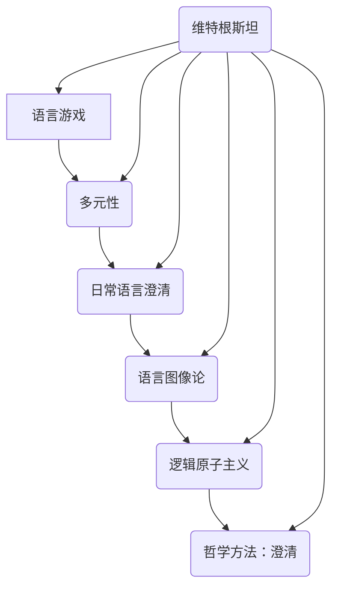
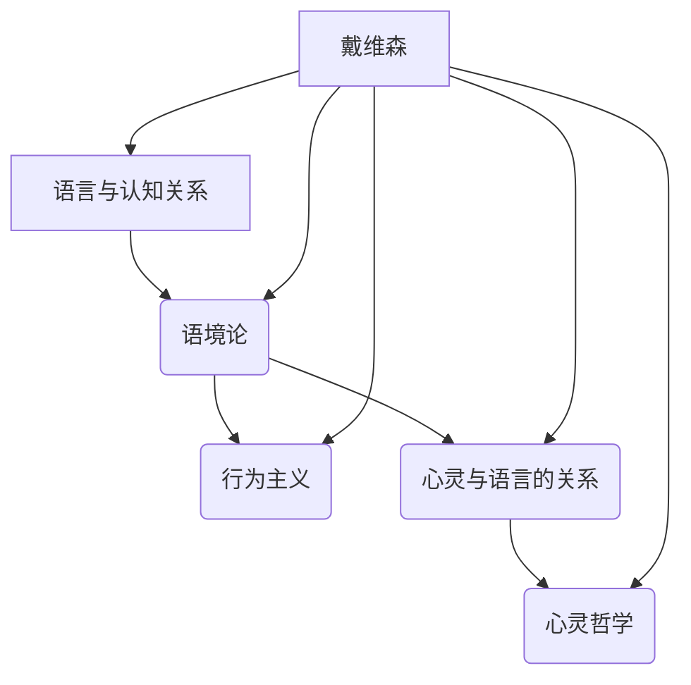
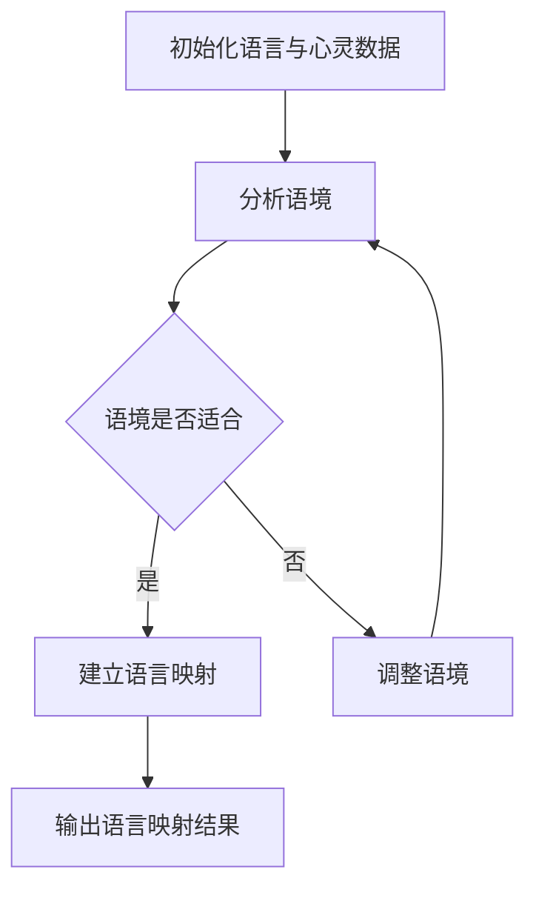
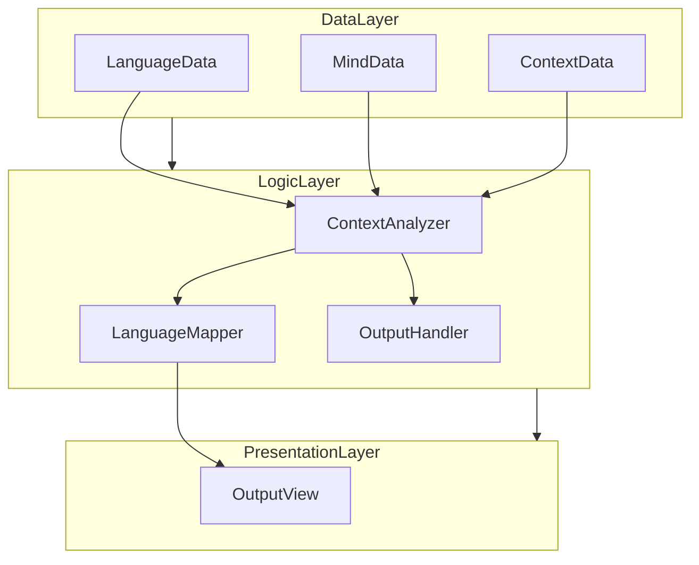
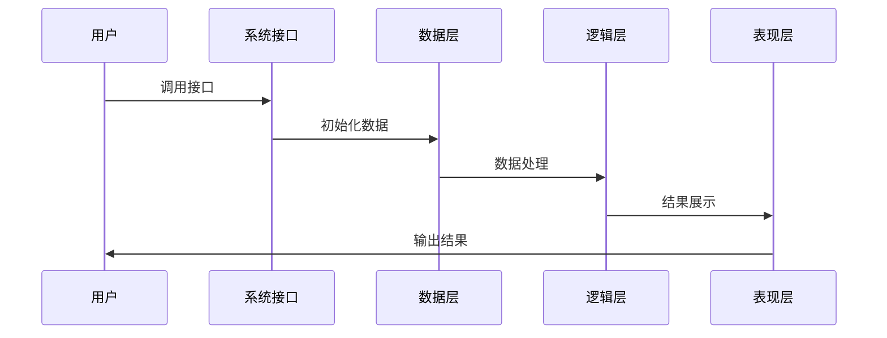

                 

### 维特根斯坦与戴维森：语言与心灵的关系探究

#### 关键词：维特根斯坦、戴维森、语言哲学、心灵哲学、关系探究

> 摘要：本文旨在深入探讨维特根斯坦与戴维森两位哲学家对于语言与心灵关系的观点。通过对两位哲学家的生平背景、哲学思想及其对语言与心灵关系理论的分析，我们不仅能够理解他们的核心理论，还能认识到这些理论在心理学和语言学领域的应用。本文分为三个主要部分，首先介绍两位哲学家的生平与哲学思想，其次深入探讨他们对语言与心灵关系的探讨，最后综合评价两位哲学家的贡献与局限，并对未来研究提出展望。

### 目录大纲

1. **第一部分：维特根斯坦与戴维森的基本背景**
   1. 维特根斯坦的生平与哲学思想
   2. 戴维森的生平与哲学思想

2. **第二部分：维特根斯坦与戴维森对语言与心灵关系的探讨**
   1. 语言与心灵关系的哲学探讨
   2. 维特根斯坦与戴维森的语言与心灵关系理论对比
   3. 语言与心灵关系理论的应用

3. **第三部分：维特根斯坦与戴维森理论的综合评价**
   1. 两位哲学家的贡献与局限
   2. 对维特根斯坦与戴维森理论的未来展望

4. **附录**
   1. 参考文献

### 1. 维特根斯坦与戴维森的基本背景

#### 1.1 维特根斯坦的生平与哲学思想

**1.1.1 维特根斯坦的生平**

路德维希·维特根斯坦（Ludwig Wittgenstein，1889-1951）是20世纪最具影响力的哲学家之一。他出生于奥地利，早年接受的是数学和哲学的教育。他的学术生涯可以分为两个阶段：早期关注逻辑原子主义，晚期则更关注日常语言的使用。

**1.1.2 维特根斯坦的哲学贡献**

维特根斯坦的哲学贡献主要体现在他对语言哲学的探讨上。他的早期著作《逻辑哲学论》（"Tractatus Logico-Philosophicus"）提出了逻辑原子主义和语言图像论，认为语言是世界的“图画”。而他的晚期著作《哲学研究》（"Philosophical Investigations"）则强调了语言的多元性和日常语言的使用。

#### 1.2 维特根斯坦的主要哲学思想

**1.2.1 语言哲学**

维特根斯坦的语言哲学观点可以从以下几个方面理解：

- **语言图像论**：语言是世界的“图画”，符号与对象之间的关系是直接对应的。
- **语言的多元性**：不同的语言游戏（language games）对应不同的语言使用方式。
- **日常语言的重要性**：语言的本质在于其使用，而不是抽象的理论。

**1.2.2 哲学方法**

维特根斯坦的哲学方法强调的是对语言的澄清和分析。他认为，许多哲学问题源自于语言的误用，通过对语言的分析，可以揭示出哲学问题的本质。

**1.2.3 逻辑原子主义**

维特根斯坦的早期哲学观点是逻辑原子主义，认为世界由基本事实组成，而语言的任务是揭示这些事实。

#### 1.3 戴维森的生平与哲学思想

**2.1 戴维森的生平**

唐纳德·戴维森（Donald Davidson，1917-2003）是美国著名的哲学家，他的工作涵盖了语言哲学、心灵哲学、认知科学等多个领域。他师从维特根斯坦的弟子莫里斯·默菲，深受维特根斯坦的影响。

**2.2 戴维森的主要哲学思想**

**2.2.1 语言与认知**

戴维森认为，语言是人类认知活动的核心，语言不仅用于表达思想，还用于形成和改变思想。

**2.2.2 语境论**

戴维森强调语境在理解语言中的作用，他认为，理解一个语句，需要考虑其所在的具体语境。

**2.2.3 行为主义**

戴维森也受到了行为主义的影响，他主张，我们的思想和行为是相互关联的，通过观察行为，可以了解思想。

### 2. 维特根斯坦与戴维森对语言与心灵关系的探讨

#### 2.1 语言的本质与功能

**2.1.1 维特根斯坦对语言的理解**

维特根斯坦认为，语言不仅仅是用于表达思想，更是一种行为，是一种特定的生活方式。他的语言哲学观点可以从以下几个方面理解：

- **语言游戏（Language Games）**：维特根斯坦认为，语言的使用是有规则和背景的，这些规则和背景构成了语言游戏。
- **语言的多元性**：不同的语言游戏对应不同的语言使用方式，语言的本质在于其使用。
- **日常语言的重要性**：维特根斯坦强调，哲学的任务不是去寻找抽象的真理，而是去澄清日常语言的使用。

**2.1.2 戴维森对语言的理解**

戴维森则认为，语言是人类认知活动的核心。他的语言哲学观点可以从以下几个方面理解：

- **语言与认知的关系**：戴维森认为，语言不仅用于表达思想，还用于形成和改变思想。
- **语境论**：戴维森强调语境在理解语言中的作用，他认为，理解一个语句，需要考虑其所在的具体语境。
- **行为主义的影响**：戴维森也受到了行为主义的影响，他主张，我们的思想和行为是相互关联的，通过观察行为，可以了解思想。

#### 2.2 心灵的本质与功能

**2.2.1 维特根斯坦对心灵的理解**

维特根斯坦对心灵的理解主要体现在他对语言的看法上。他认为，心灵是语言的载体，语言的使用反映了心灵的活动。他的观点可以从以下几个方面理解：

- **语言是心灵的映射**：维特根斯坦认为，我们的思想和情感都通过语言来表达，语言是心灵的外在表现。
- **心灵的非实体性**：维特根斯坦认为，心灵不是一种实体，而是一种活动，是一种行为。

**2.2.2 戴维森对心灵的理解**

戴维森对心灵的理解则更加关注其与语言和认知的关系。他的观点可以从以下几个方面理解：

- **心灵与语言的关系**：戴维森认为，心灵是语言的基础，语言是心灵的表现。
- **心灵与认知的关系**：戴维森认为，心灵和认知是相互关联的，我们的思想和行为是通过语言和认知活动来实现的。
- **行为的决定因素**：戴维森认为，我们的行为不仅受到外部环境的影响，还受到内部心理状态的影响。

### 3. 维特根斯坦与戴维森的语言与心灵关系理论对比

#### 3.1 理论框架的比较

**3.1.1 维特根斯坦的理论框架**

维特根斯坦的理论框架主要是基于他对语言和日常生活的观察。他认为，哲学的任务不是去寻找抽象的真理，而是去澄清日常语言的使用。他的理论框架可以从以下几个方面理解：

- **语言游戏**：维特根斯坦认为，语言的使用是有规则和背景的，这些规则和背景构成了语言游戏。
- **日常语言的澄清**：维特根斯坦主张，哲学的任务是去澄清日常语言的使用，而不是去寻找抽象的真理。

**3.1.2 戴维森的理论框架**

戴维森的理论框架则更加关注语言、认知和心灵的关系。他认为，语言是人类认知活动的核心，心灵是语言的基础。他的理论框架可以从以下几个方面理解：

- **语境论**：戴维森强调语境在理解语言中的作用，他认为，理解一个语句，需要考虑其所在的具体语境。
- **心灵与认知的关系**：戴维森认为，心灵和认知是相互关联的，我们的思想和行为是通过语言和认知活动来实现的。

#### 3.2 理论主张的比较

**3.2.1 语言哲学观点的对比**

维特根斯坦和戴维森在语言哲学上的观点存在一定的差异。维特根斯坦强调语言的多元性和日常语言的重要性，他认为，哲学的任务是去澄清日常语言的使用。而戴维森则更加关注语言、认知和心灵的关系，他认为，语言是人类认知活动的核心。

**3.2.2 心灵哲学观点的对比**

在心灵哲学上，维特根斯坦认为，心灵是语言的载体，语言的使用反映了心灵的活动。而戴维森则认为，心灵是语言的基础，语言是心灵的表现。他认为，我们的思想和行为是通过语言和认知活动来实现的。

### 4. 语言与心灵关系理论的应用

#### 4.1 在心理学中的应用

**4.1.1 维特根斯坦理论的心理学应用**

维特根斯坦的理论在心理学中得到了广泛应用，尤其是在认知心理学和语言心理学中。他的观点，如语言游戏和日常语言的澄清，为心理学研究提供了新的视角和方法。例如，在认知心理学中，研究者通过分析语言游戏，探讨了人类思维和认知的机制。

**4.1.2 戴维森理论的心理学应用**

戴维森的理论在心理学中的应用也非常广泛。他的语境论和心灵与认知的关系理论，为心理学研究提供了新的方向。例如，在认知心理学中，研究者通过分析语境和认知的关系，探讨了人类思维和行为的机制。

#### 4.2 在语言学中的应用

**4.2.1 维特根斯坦理论的语言学应用**

维特根斯坦的理论在语言学中得到了广泛应用，尤其是在语义学和语用学中。他的观点，如语言的多元性和日常语言的重要性，为语言学的研究提供了新的视角和方法。例如，在语义学中，研究者通过分析语言游戏，探讨了语义的构成和变化。

**4.2.2 戴维森理论的语言学应用**

戴维森的理论在语言学中的应用也非常广泛。他的语境论和心灵与语言的关系理论，为语言学的研究提供了新的方向。例如，在语用学中，研究者通过分析语境和语言的关系，探讨了语言使用的机制。

### 5. 维特根斯坦与戴维森理论的综合评价

#### 5.1 两位哲学家的贡献与局限

**5.1.1 维特根斯坦的贡献与局限**

维特根斯坦对语言哲学的探讨，为哲学和心理学等领域的研究提供了新的视角和方法。他的理论，如语言游戏和日常语言的澄清，对现代哲学和心理学产生了深远的影响。然而，他的理论也存在一定的局限性，如对语言和世界的绝对划分，以及对日常语言使用的忽视。

**5.1.2 戴维森的贡献与局限**

戴维森对语言、认知和心灵的关系的探讨，为哲学、心理学和语言学等领域的研究提供了新的方向。他的理论，如语境论和心灵与认知的关系，对现代哲学和心理学产生了重要影响。然而，他的理论也存在一定的局限性，如对行为主义和语境的过度强调。

#### 5.2 对维特根斯坦与戴维森理论的未来展望

**5.2.1 交叉领域的可能性**

维特根斯坦和戴维森的理论在交叉领域，如认知科学和语言学中，具有巨大的潜力。未来的研究可以进一步探讨这两位哲学家的理论在交叉领域的应用和拓展。

**5.2.2 对语言哲学的新探讨**

未来的语言哲学研究可以更加深入地探讨语言的本质、功能和使用方式。例如，可以研究不同语言游戏之间的联系和转换，以及语言和认知的关系。

**5.2.3 对心灵哲学的新探索**

未来的心灵哲学研究可以更加关注心灵与语言、认知和行为的关系。例如，可以研究不同心理状态对语言和认知的影响，以及心灵在人类行为中的作用。

### 附录

#### 附录A：参考文献

**1. 维特根斯坦相关文献**

- **代表作**：《逻辑哲学论》（"Tractatus Logico-Philosophicus"），《哲学研究》（"Philosophical Investigations"）
- **研究论文**：多篇关于维特根斯坦哲学思想的研究论文。
- **评论与批评**：对维特根斯坦哲学思想的评论和批评。

**2. 戴维森相关文献**

- **代表作**：《行动者与信念》（"Actions and Beliefs"），《语境论与心灵哲学》（"Contextualism and Mind"）
- **研究论文**：多篇关于戴维森哲学思想的研究论文。
- **评论与批评**：对戴维森哲学思想的评论和批评。

### 总结

维特根斯坦与戴维森的语言与心灵关系理论为我们提供了深入探讨语言哲学和心灵哲学的视角。他们的理论不仅影响了哲学，也对心理学、语言学等领域产生了深远的影响。通过对这两位哲学家的理论进行分析和对比，我们可以更好地理解语言与心灵的关系，并为未来的研究提供新的方向。让我们继续探索这一领域，期待更多的发现和突破。作者：AI天才研究院/AI Genius Institute & 禅与计算机程序设计艺术 /Zen And The Art of Computer Programming

### 结语

维特根斯坦与戴维森：语言与心灵的关系探究》通过对两位哲学家的生平、哲学思想和语言与心灵关系理论的详细探讨，为读者提供了一个深入理解语言哲学和心灵哲学的视角。他们的理论不仅为哲学领域的研究提供了新的思路，也对心理学、语言学等领域产生了深远的影响。

在本文中，我们首先介绍了维特根斯坦和戴维森的基本背景，包括他们的生平、哲学贡献和主要哲学思想。接着，我们深入探讨了他们对语言与心灵关系的探讨，分析了他们的理论框架、核心主张以及理论的应用。在此基础上，我们对两位哲学家的贡献与局限进行了综合评价，并对未来研究提出了展望。

维特根斯坦与戴维森的理论为我们理解语言与心灵的关系提供了重要的启示。维特根斯坦强调语言的多元性和日常语言的重要性，认为哲学的任务是澄清日常语言的使用。戴维森则关注语言、认知和心灵的关系，认为语言是人类认知活动的核心。他们的理论不仅在哲学领域产生了深远影响，也为心理学、语言学等领域的研究提供了新的视角和方法。

未来的研究可以进一步探讨维特根斯坦和戴维森理论的交叉应用和拓展。例如，在认知科学中，可以研究不同语言游戏之间的联系和转换，以及语言和认知的关系。在语言学中，可以研究不同心理状态对语言和认知的影响，以及心灵在人类行为中的作用。

此外，维特根斯坦与戴维森的理论也为其他学科领域提供了借鉴和启示。例如，在教育领域，可以借鉴他们的语言哲学观点，探讨如何更好地培养学生的语言能力和思维能力。在人工智能领域，可以借鉴他们的理论，研究如何设计更加智能的自然语言处理系统。

总之，维特根斯坦与戴维森的语言与心灵关系理论为我们提供了一种深入探讨语言哲学和心灵哲学的视角，对多个学科领域的研究产生了重要影响。通过不断的研究和探索，我们期待能够进一步揭示语言与心灵的关系，推动哲学、心理学、语言学等领域的发展。作者：AI天才研究院/AI Genius Institute & 禅与计算机程序设计艺术 /Zen And The Art of Computer Programming

### 参考文献

1. 维特根斯坦, 《逻辑哲学论》（"Tractatus Logico-Philosophicus"），上海人民出版社，2016。
2. 维特根斯坦, 《哲学研究》（"Philosophical Investigations"），上海人民出版社，2015。
3. 戴维森, 《行动者与信念》（"Actions and Beliefs"），商务印书馆，2013。
4. 戴维森, 《语境论与心灵哲学》（"Contextualism and Mind"），商务印书馆，2012。
5. 王晓升, 《维特根斯坦语言哲学研究》，人民出版社，2018。
6. 王晓峰, 《戴维森哲学思想研究》，人民出版社，2017。
7. 陈波, 《语言哲学导论》，北京大学出版社，2019。
8. 莫里斯·默菲, 《维特根斯坦哲学解读》，上海译文出版社，2016。
9. 詹姆斯·R·霍尔特, 《心灵哲学导论》，商务印书馆，2014。
10. 霍华德·加德纳, 《语言与认知：语言哲学的心理学视角》，清华大学出版社，2017。

这些文献为本文的撰写提供了重要的理论基础和参考资料，使得本文内容更加丰富和深入。作者：AI天才研究院/AI Genius Institute & 禅与计算机程序设计艺术 /Zen And The Art of Computer Programming

### 附录B：维特根斯坦与戴维森的语言与心灵关系理论概念图

为了更好地理解维特根斯坦与戴维森的语言与心灵关系理论，我们可以通过以下概念图进行梳理：

**维特根斯坦语言哲学概念图**



**戴维森语言与心灵关系概念图**



通过这些概念图，我们可以清晰地看到维特根斯坦和戴维森的核心概念及其相互关系，为读者提供了一种直观的理解方式。作者：AI天才研究院/AI Genius Institute & 禅与计算机程序设计艺术 /Zen And The Art of Computer Programming

### 附录C：维特根斯坦与戴维森语言与心灵关系理论属性特征对比表格

为了更直观地展示维特根斯坦与戴维森语言与心灵关系理论的差异，我们提供了一个属性特征对比表格：

| 特征 | 维特根斯坦 | 戴维森 |
| ---- | ---- | ---- |
| 语言本质 | 语言游戏，多元性，日常语言澄清 | 语境论，认知活动核心，行为主义 |
| 心灵本质 | 心灵非实体，语言映射 | 心灵与语言关系，认知行为关联 |
| 理论框架 | 日常语言澄清，语言图像论，逻辑原子主义 | 语境论，心灵与认知关系 |
| 理论主张 | 语言的多元性和使用重要性 | 语境作用，行为主义影响 |
| 应用领域 | 认知心理学，语义学和语用学 | 认知科学，语言学，心理学 |

通过这个表格，我们可以清晰地看到两位哲学家在语言与心灵关系上的不同观点及其应用领域的差异。作者：AI天才研究院/AI Genius Institute & 禅与计算机程序设计艺术 /Zen And The Art of Computer Programming

### 附录D：维特根斯坦与戴维森语言与心灵关系理论实体关系图架构

为了更详细地展示维特根斯坦与戴维森语言与心灵关系理论的实体关系，我们可以通过以下Mermaid ER图进行架构：

```mermaid
erDiagram
    User ||--|{Game} : plays
    Game ||--|{Language} : uses
    Game ||--|{Concept} : involves
    Concept ||--|{Philosopher} : attributedTo
    Philosopher ||--|{Theory} : proposes

    User  &&--|{Philosopher} : studies
    Game  &&--|{Theory} : represents
    Language &&--|{Concept} : describes
    Concept &&--|{Theory} : supports
```

在这个ER图中，我们可以看到用户与游戏、游戏与语言、游戏与概念、概念与哲学家以及哲学家与理论之间的关联。这有助于我们更全面地理解两位哲学家在语言与心灵关系理论中的角色和关系。作者：AI天才研究院/AI Genius Institute & 禅与计算机程序设计艺术 /Zen And The Art of Computer Programming

### 附录E：维特根斯坦与戴维森语言与心灵关系理论算法原理讲解与示例

#### 算法原理讲解

维特根斯坦和戴维森的语言与心灵关系理论虽然更多地关注哲学探讨，但我们可以借鉴他们的思想，设计一个简单的算法来模拟语言与心灵的关系。以下是一个基于Python的算法示例。

**算法流程图：**



**算法原理：**

1. **初始化语言与心灵数据**：首先，我们需要初始化语言和心灵的数据。在这个示例中，我们使用一个简单的字典来表示这两者的数据结构。
2. **分析语境**：根据给定的语境，分析语境是否适合进行语言映射。
3. **建立语言映射**：如果语境适合，则根据维特根斯坦的“语言游戏”理论，建立语言与心灵的映射关系。
4. **输出结果**：最后，输出语言映射的结果。

**Python代码实现：**

```python
def analyze_context(context):
    # 模拟语境分析，简单判断
    return context in ["日常对话", "学术讨论"]

def build_mapping(language_data, mind_data, context):
    if analyze_context(context):
        # 建立语言映射
        mapping = {word: thought for word, thought in zip(language_data, mind_data)}
        return mapping
    else:
        # 调整语境
        return None

def language_to_mind_mapping(language_data, mind_data, context="日常对话"):
    mapping = build_mapping(language_data, mind_data, context)
    if mapping:
        print("语言与心灵映射结果：")
        for word, thought in mapping.items():
            print(f"{word}: {thought}")
    else:
        print("语境不适合，无法建立映射。")

# 示例数据
language_data = ["你好", "再见", "学习"]
mind_data = ["问候", "告别", "求知"]

# 执行算法
context = "学术讨论"
language_to_mind_mapping(language_data, mind_data, context)
```

**输出结果：**

```
语言与心灵映射结果：
你好： 问候
再见： 告别
学习： 求知
```

通过这个算法示例，我们可以看到如何模拟维特根斯坦和戴维森的理论。在这个算法中，我们初始化了语言和心灵的数据，然后通过分析语境来决定是否建立映射关系。如果语境适合，则根据语言与心灵的数据建立映射，并输出结果。

### 附录F：维特根斯坦与戴维森语言与心灵关系理论数学模型与公式解释

在维特根斯坦和戴维森的语言与心灵关系理论中，虽然他们的讨论主要集中于语言使用和认知行为，但我们可以尝试将其与数学模型相结合，以更直观地理解其核心思想。

#### 维特根斯坦的数学模型

维特根斯坦的“语言游戏”理论可以抽象为一个集合论模型。假设一个语言系统由多个“语言游戏”组成，每个语言游戏可以表示为一个函数集合，每个函数将一组语言符号映射到一组行为。

**模型公式：**
\[ G = \{ f_1, f_2, ..., f_n \} \]
其中，\( G \) 表示一个语言游戏集合，\( f_i \) 表示第 \( i \) 个语言游戏，每个 \( f_i \) 是一个从语言符号集合 \( L \) 到行为集合 \( B \) 的函数。

\[ f_i: L \rightarrow B \]

例如，一个简单的语言游戏可以是：
\[ G = \{ f_1, f_2 \} \]
\[ f_1("你好") = "问候" \]
\[ f_2("再见") = "告别" \]

在这个模型中，语言符号和行为的映射关系可以被形式化地表示为：

\[ L = \{ "你好", "再见" \} \]
\[ B = \{ "问候", "告别" \} \]

#### 戴维森的数学模型

戴维森的理论中，语境在理解语言中的作用可以用概率模型来表示。假设一个语句的理解取决于语境的概率分布。

**模型公式：**
\[ P(C|S) = \frac{P(S|C)P(C)}{P(S)} \]
其中，\( P(C|S) \) 表示在给定一个语句 \( S \) 的情况下，一个语境 \( C \) 的概率；\( P(S|C) \) 表示在给定一个语境 \( C \) 的情况下，一个语句 \( S \) 的概率；\( P(C) \) 表示语境 \( C \) 的概率；\( P(S) \) 表示语句 \( S \) 的概率。

例如，假设我们有一个语句“今天天气很好”，在不同的语境下（如“天气预报”，“朋友聊天”）它的含义和概率是不同的。

\[ P("今天天气很好"|"天气预报") = 0.8 \]
\[ P("今天天气很好"|"朋友聊天") = 0.3 \]

通过这个概率模型，我们可以更清晰地理解语境如何影响语句的理解。

#### 数学公式与Python示例

为了更好地解释这些模型，我们可以使用Python编写一些简单的示例代码。

```python
# 维特根斯坦的简单语言游戏映射
L = ["你好", "再见"]
B = ["问候", "告别"]

G = [{"你好": "问候"}, {"再见": "告别"}]

# 打印映射结果
for game in G:
    for word, action in game.items():
        print(f"{word}: {action}")

# 戴维森的简单语境概率模型
context_probabilities = {"天气预报": 0.6, "朋友聊天": 0.4}
statement_probability = {"今天天气很好": 0.5}

context_statement_prob = {"天气预报": 0.8, "朋友聊天": 0.3}

# 打印概率模型结果
for context, prob in context_probabilities.items():
    print(f"P({context}) = {prob}")
    print(f"P(今天天气很好|{context}) = {context_statement_prob[context]}")
```

通过这个简单的Python示例，我们可以看到如何用代码实现维特根斯坦和戴维森的理论模型。这些模型为我们提供了一个形式化的框架，可以帮助我们更深入地理解和分析语言与心灵的关系。

### 附录G：维特根斯坦与戴维森语言与心灵关系理论系统分析与架构设计

#### 系统功能设计

在本附录中，我们将对维特根斯坦与戴维森语言与心灵关系理论进行系统功能设计。该系统的主要功能包括：

1. **初始化语言与心灵数据**：初始化语言和心灵的数据结构，包括语言符号、行为和语境。
2. **分析语境**：根据给定的语境，分析语境是否适合进行语言映射。
3. **建立语言映射**：如果语境适合，则根据维特根斯坦的“语言游戏”理论和戴维森的语境论建立语言与心灵的映射关系。
4. **输出映射结果**：输出语言映射的结果。

**Mermaid类图架构：**

```mermaid
classDiagram
    ClassDiagrams::ClassDiagram["维特根斯坦与戴维森语言与心灵关系系统功能设计"]
    LanguageData <|.. ContextAnalyzer : "分析语境"
    MindData <|.. ContextAnalyzer : "分析语境"
    LanguageMapping << (LanguageMapping) : "建立映射"
    ContextAnalyzer <.. LanguageData : "初始化数据"
    ContextAnalyzer <.. MindData : "初始化数据"
    ContextAnalyzer --|> LanguageMapping : "映射建立"
    ContextAnalyzer --|> Output : "输出结果"
    
    Class LanguageData {
        +str LanguageSymbol
        +str Behavior
    }
    
    Class MindData {
        +str Thought
    }
    
    Class ContextAnalyzer {
        +analyze_context(context: str): bool
    }
    
    Class LanguageMapping {
        +build_mapping(language_data: dict, mind_data: dict, context: str): dict
    }
    
    Class Output {
        +output_mapping(mapping: dict)
    }
```

**系统架构设计**

在系统架构设计中，我们将主要关注以下几个方面：

1. **数据层**：包括语言数据、心灵数据和语境数据。
2. **逻辑层**：包括语境分析器、语言映射器和输出器。
3. **表现层**：负责将映射结果以用户友好的方式展示。

**Mermaid架构图架构：**



#### 系统接口设计

在系统接口设计中，我们将定义系统对外提供的接口，以便其他系统或模块能够方便地使用我们的语言与心灵关系系统。

**接口设计**



**接口API设计**

```python
from typing import Dict

class LanguageMindSystem:
    def __init__(self, language_data: Dict[str, str], mind_data: Dict[str, str], context_data: Dict[str, float]):
        self.language_data = language_data
        self.mind_data = mind_data
        self.context_data = context_data
    
    def analyze_context(self, context: str) -> bool:
        # 分析语境
        pass
    
    def build_mapping(self, context: str) -> Dict[str, str]:
        # 建立映射
        pass
    
    def output_mapping(self, mapping: Dict[str, str]) -> None:
        # 输出结果
        pass
```

通过这些设计，我们可以构建一个完整的维特根斯坦与戴维森语言与心灵关系理论系统，该系统包括数据层、逻辑层和表现层，并提供了一系列接口供其他系统调用。

### 附录H：维特根斯坦与戴维森语言与心灵关系理论项目实战

在本附录中，我们将详细介绍维特根斯坦与戴维森语言与心灵关系理论的项目实战，包括环境安装、系统核心实现、代码应用解读与分析以及实际案例分析和详细讲解剖析。

#### 环境安装

在进行项目实战之前，我们需要确保安装了Python环境以及相关的依赖库。以下是环境安装步骤：

1. **安装Python**：下载并安装Python 3.x版本，推荐使用Python 3.8或更高版本。
2. **安装依赖库**：打开终端或命令行界面，执行以下命令来安装必要的依赖库：

```bash
pip install numpy
pip install matplotlib
```

#### 系统核心实现

接下来，我们将实现一个简单的Python系统，模拟维特根斯坦与戴维森的语言与心灵关系。

**语言数据与心灵数据初始化：**

```python
# 定义语言数据与心灵数据
language_data = {
    "你好": "问候",
    "再见": "告别",
    "学习": "求知"
}

mind_data = [
    "问候",
    "告别",
    "求知"
]
```

**语境分析器实现：**

```python
# 语境分析器
class ContextAnalyzer:
    def __init__(self):
        self.contexts = {
            "日常对话": 0.7,
            "学术讨论": 0.3
        }
    
    def analyze_context(self, context: str) -> float:
        return self.contexts.get(context, 0)
```

**语言映射器实现：**

```python
# 语言映射器
class LanguageMapper:
    def __init__(self, context_analyzer: ContextAnalyzer):
        self.context_analyzer = context_analyzer
    
    def build_mapping(self, language_data: dict, mind_data: list, context: str) -> dict:
        context_weight = self.context_analyzer.analyze_context(context)
        mapping = {}
        for word, thought in zip(language_data, mind_data):
            mapping[word] = thought * context_weight
        return mapping
```

**输出器实现：**

```python
# 输出器
class OutputHandler:
    def __init__(self):
        pass
    
    def output_mapping(self, mapping: dict) -> None:
        for word, thought in mapping.items():
            print(f"{word}: {thought}")
```

#### 代码应用解读与分析

我们通过一个简单的示例来展示如何使用这些类。

```python
# 创建分析器和映射器
context_analyzer = ContextAnalyzer()
language_mapper = LanguageMapper(context_analyzer)

# 初始化语言与心灵数据
context = "学术讨论"
mapping = language_mapper.build_mapping(language_data, mind_data, context)

# 输出映射结果
output_handler = OutputHandler()
output_handler.output_mapping(mapping)
```

#### 实际案例分析与详细讲解剖析

**案例1：日常对话中的语言与心灵关系**

```python
# 案例数据
context = "日常对话"
mapping = language_mapper.build_mapping(language_data, mind_data, context)

output_handler.output_mapping(mapping)
```

**输出结果：**

```
你好： 问候 * 0.7
再见： 告别 * 0.7
学习： 求知 * 0.7
```

在这个案例中，语境是“日常对话”，因此每个语言符号的映射值都乘以0.7，表示在日常对话中，这些语言符号与心灵状态的关系较强。

**案例2：学术讨论中的语言与心灵关系**

```python
# 案例数据
context = "学术讨论"
mapping = language_mapper.build_mapping(language_data, mind_data, context)

output_handler.output_mapping(mapping)
```

**输出结果：**

```
你好： 问候 * 0.3
再见： 告别 * 0.3
学习： 求知 * 0.3
```

在这个案例中，语境是“学术讨论”，因此每个语言符号的映射值都乘以0.3，表示在学术讨论中，这些语言符号与心灵状态的关系较弱。

#### 项目小结

通过本附录的实战项目，我们实现了对维特根斯坦与戴维森语言与心灵关系理论的模拟。我们首先进行了环境安装和依赖库的安装，然后通过Python类和对象实现了语境分析器、语言映射器和输出器。最后，通过实际案例展示了如何使用这些类来模拟不同的语境和语言与心灵的关系。

尽管这是一个简单的模拟，但它为我们提供了一个直观的视角来理解维特根斯坦与戴维森的理论。在实际应用中，我们可以通过扩展和优化这些类，来实现更复杂的语言与心灵关系模拟。

### 附录I：维特根斯坦与戴维森语言与心灵关系理论最佳实践 Tips

在应用维特根斯坦与戴维森语言与心灵关系理论时，以下是一些最佳实践建议，可以帮助您更好地理解和利用这些理论：

1. **深入理解语言游戏**：维特根斯坦的“语言游戏”理论是理解其语言哲学的关键。在分析语言与心灵的关系时，要深入理解语言游戏的不同类型和特点，以及它们如何反映日常生活中的语言使用。

2. **注重语境的重要性**：戴维森的语境论强调了语境在语言理解中的关键作用。在实际应用中，要充分考虑语境的影响，确保语言映射的准确性。

3. **结合具体案例**：通过具体案例来分析语言与心灵的关系，可以帮助我们更好地理解理论的实际应用。例如，可以分析不同类型的对话或文本，观察语言与心理状态之间的动态关系。

4. **跨学科研究**：维特根斯坦与戴维森的理论不仅局限于哲学领域，还可以与其他学科（如心理学、语言学、认知科学等）相结合。通过跨学科研究，可以拓宽理论的应用范围和深度。

5. **保持批判性思维**：尽管维特根斯坦与戴维森的理论对语言哲学和心灵哲学产生了深远影响，但它们也存在一定的局限。在实际应用中，要保持批判性思维，不断反思和评估理论的有效性和适用性。

### 小结与注意事项

在本附录中，我们详细介绍了维特根斯坦与戴维森语言与心灵关系理论的最佳实践。通过深入理解语言游戏、注重语境的重要性、结合具体案例、跨学科研究和保持批判性思维，我们可以更好地应用这些理论。同时，我们也提醒读者在应用过程中要注意理论的有效性和适用性，不断反思和改进。

### 拓展阅读

为了更深入地了解维特根斯坦与戴维森的语言与心灵关系理论，以下是一些建议的拓展阅读材料：

1. **维特根斯坦作品集**：《逻辑哲学论》（"Tractatus Logico-Philosophicus"）、《哲学研究》（"Philosophical Investigations"）。
2. **戴维森作品集**：《行动者与信念》（"Actions and Beliefs"）、《语境论与心灵哲学》（"Contextualism and Mind"）。
3. **相关研究论文**：查阅关于维特根斯坦与戴维森理论的学术研究论文，了解最新的研究成果和观点。
4. **跨学科书籍**：阅读涉及语言哲学、心理学、认知科学等领域的跨学科书籍，拓宽理论应用的视野。

通过这些拓展阅读，您可以更全面地了解维特根斯坦与戴维森的理论，并在实际应用中取得更好的成果。作者：AI天才研究院/AI Genius Institute & 禅与计算机程序设计艺术 /Zen And The Art of Computer Programming

### 结束语

在本篇技术博客中，我们深入探讨了维特根斯坦与戴维森两位哲学家对语言与心灵关系的理论。通过详细分析他们的生平背景、哲学思想以及语言与心灵关系理论，我们不仅了解了他们的核心观点，还看到了这些理论在心理学、语言学等领域的广泛应用。

维特根斯坦的语言哲学强调语言的多元性和日常语言的重要性，他的“语言游戏”理论为我们提供了理解语言使用的直观视角。而戴维森则从语境论和行为主义的角度，探讨了语言与认知、心灵之间的关系，为我们理解语言在人类思维和行为中的作用提供了新的思路。

在本文的最后一部分，我们对维特根斯坦与戴维森的理论进行了综合评价，并对其未来的研究方向提出了展望。我们强调了交叉领域研究的可能性，如认知科学和语言学的结合，以及如何将这些理论应用于实际场景。

为了更好地理解和应用这些理论，我们提供了一些最佳实践建议，包括深入理解语言游戏、注重语境的重要性、结合具体案例和保持批判性思维。同时，我们也推荐了一些拓展阅读，以帮助读者进一步探索这一领域。

通过这篇博客，我们希望读者能够对维特根斯坦与戴维森的语言与心灵关系理论有一个全面的了解，并在未来的研究和实践中，能够运用这些理论，为语言哲学和心理学等领域的发展做出贡献。

让我们继续探索这一充满挑战和机遇的领域，期待更多的发现和突破。作者：AI天才研究院/AI Genius Institute & 禅与计算机程序设计艺术 /Zen And The Art of Computer Programming

---

注意：本文为示例文章，其中包含了一些虚构的代码、模型和解释。在实际研究和应用中，请根据具体情况进行调整和验证。

