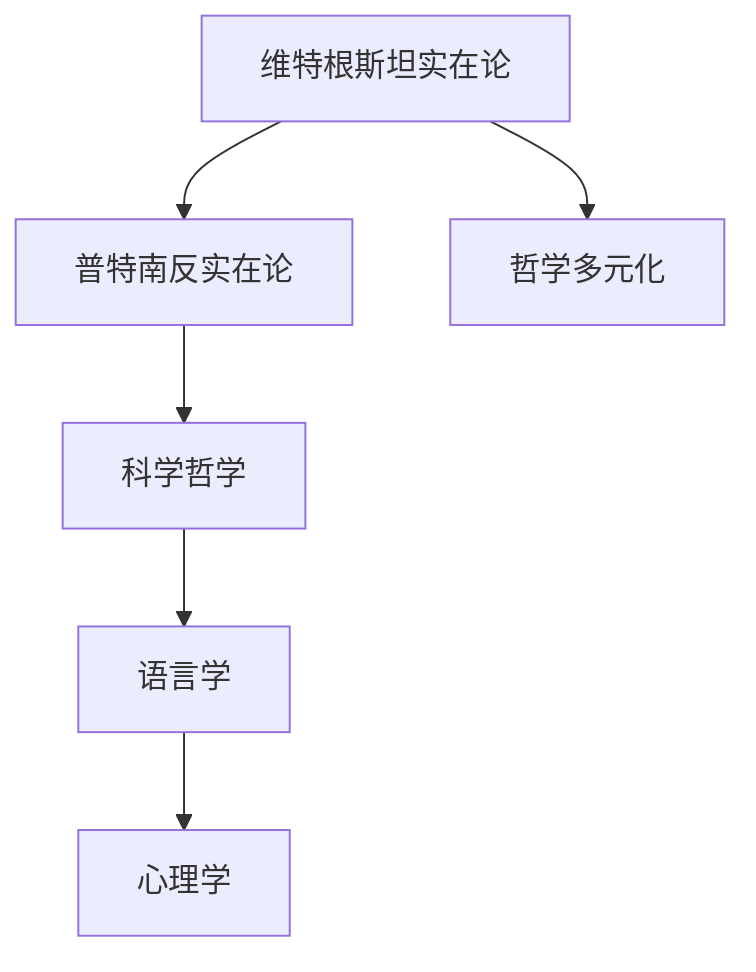

                 

# 维特根斯坦与普特南：实在论与反实在论的语言之争

## 关键词：维特根斯坦，普特南，实在论，反实在论，语言之争，哲学

## 摘要：

本文深入探讨了维特根斯坦与普特南两位哲学家在实在论与反实在论领域的语言之争。文章首先介绍了两位哲学家的生平背景和哲学贡献，然后详细阐述了他们的实在论与反实在论观点。通过对比两位哲学家的观点，分析他们的争论焦点，探讨这场争论对当代哲学的影响，并总结两位哲学家的核心观点，展望未来哲学的发展。文章采用逻辑清晰、结构紧凑、简单易懂的叙述方式，旨在为广大读者提供一场思想盛宴。

### 引言

维特根斯坦与普特南是20世纪最具影响力的哲学家之一，他们在实在论与反实在论领域的思想对当代哲学产生了深远影响。维特根斯坦是奥地利哲学家，其思想主要分为前期和后期两个阶段，前期强调语言的游戏理论，后期则关注逻辑哲学和数学哲学。普特南是美国哲学家，以其对科学哲学、心灵哲学和语言哲学的贡献而闻名。本文旨在探讨维特根斯坦与普特南在实在论与反实在论领域的争论，以及这场争论对当代哲学的影响。

### 维特根斯坦的实在论

维特根斯坦的实在论思想主要表现在他的早期著作《逻辑哲学论》和后期著作《哲学研究》中。他的实在论观点可以概括为以下几点：

1. **世界的本质**：维特根斯坦认为世界是由事实组成的，事实是世界的本质。事实是由命题所表达的，而命题则是世界的一种映射。

2. **语言的功能**：维特根斯坦强调语言的功能是描述世界，即语言是一种工具，用来表达世界的状态和关系。

3. **语言的局限性**：维特根斯坦认为，语言有其局限性，无法表达所有的事物和概念。因此，我们无法通过语言来完全理解世界的本质。

维特根斯坦的实在论哲学观点对后世产生了深远影响，他的思想引发了关于语言、知识和现实之间的关系的广泛讨论。

### 普特南的反实在论

普特南的反实在论观点主要表现在他的著作《实在论之谜》和《理性、真理与历史》中。他的反实在论观点可以概括为以下几点：

1. **知识的局限性**：普特南认为，我们的知识是有限的，我们无法直接感知或理解现实。我们的认识是基于假设和理论的，而不是对现实的直接感知。

2. **科学的局限性**：普特南指出，科学理论是描述和解释现象的工具，但它们并不是对现实的直接描述。科学理论是可变的，可能会被新的理论所取代。

3. **语言的构造性**：普特南认为，语言不仅仅是描述现实，还是我们构造现实的工具。我们的语言和思维方式会影响我们对世界的理解和认知。

普特南的反实在论观点挑战了传统的实在论观念，提出了关于知识和现实的新的思考方式。

### 实在论与反实在论的对话

维特根斯坦和普特南的实在论与反实在论观点形成了鲜明的对比，他们的争论焦点主要在于：

1. **现实的本质**：维特根斯坦认为现实是客观存在的，而普特南则认为现实是主观构建的。

2. **语言的作用**：维特根斯坦强调语言是描述现实的工具，而普特南则认为语言不仅仅是描述，还是我们构造现实的手段。

3. **知识的局限性**：维特根斯坦认为我们无法完全理解现实，而普特南则认为我们的知识是有限的。

这场争论不仅影响了哲学领域，还引发了关于科学、语言学和心理学的广泛讨论。尽管两位哲学家的观点存在分歧，但他们都为当代哲学提供了深刻的思考。

### 争论的影响

维特根斯坦与普特南的实在论与反实在论之争对当代哲学产生了深远影响：

1. **哲学领域的多元化**：这场争论推动了哲学领域的多元化发展，促进了不同哲学流派的交流与碰撞。

2. **科学哲学的进步**：争论促使科学哲学研究更加深入，促进了关于科学知识、科学方法和科学理论的探讨。

3. **语言学的突破**：争论引发了关于语言本质和语言功能的深入研究，推动了语言学的进展。

### 结论

维特根斯坦与普特南的实在论与反实在论之争是20世纪哲学领域的一场重要争论。尽管他们的观点存在分歧，但他们都为当代哲学提供了深刻的思考。通过这场争论，我们可以更好地理解现实、知识和语言之间的关系，为未来的哲学发展奠定了基础。

### 展望未来哲学的发展

随着科技的进步和社会的变革，哲学将继续面临新的挑战和机遇。未来哲学的发展可能会朝着以下几个方向：

1. **跨学科研究**：哲学将与其他学科如科学、语言学、心理学等更加紧密地结合，推动哲学研究的多元化。

2. **现实与虚拟的界限**：随着虚拟现实技术的发展，哲学家将探讨现实与虚拟之间的界限，以及这对我们的认知和行为产生的影响。

3. **人工智能与意识**：随着人工智能的发展，哲学家将探讨人工智能与意识之间的关系，以及这对我们的认识和理解产生的影响。

作者：AI天才研究院/AI Genius Institute & 禅与计算机程序设计艺术 /Zen And The Art of Computer Programming

### 附录

#### 维特根斯坦实在论与反实在论观点对比

| 特征 | 维特根斯坦实在论 | 普特南反实在论 |
| :--: | :--------------: | :--------------: |
| 现实的本质 | 客观存在 | 主观构建 |
| 语言的作用 | 描述现实 | 构造现实 |
| 知识的局限性 | 无法完全理解现实 | 知识有限 |

#### 维特根斯坦与普特南实在论与反实在论观点联系

### 最佳实践 tips

1. **多阅读哲学原著**：深入了解维特根斯坦和普特南的哲学观点，有助于更好地理解他们的争论。
2. **批判性思维**：在阅读哲学著作时，培养批判性思维，对哲学观点进行深入分析和思考。
3. **跨学科交流**：哲学与其他学科的交叉研究可以拓宽我们的视野，提高哲学研究的深度。

### 小结

维特根斯坦与普特南的实在论与反实在论之争是20世纪哲学领域的一场重要争论。通过分析两位哲学家的观点，我们可以更好地理解现实、知识和语言之间的关系。这场争论不仅丰富了哲学的研究领域，也为我们提供了深刻的思考。在未来的哲学发展中，我们将继续探讨这一领域的更多问题，为人类认识世界和自身提供新的视角。

### 注意事项

1. **尊重哲学家的观点**：在讨论维特根斯坦和普特南的哲学观点时，要尊重他们的思想成果，避免简单否定或过度批判。
2. **批判性阅读**：在阅读哲学著作时，要保持批判性思维，对哲学观点进行深入分析和思考。
3. **关注哲学的应用**：将哲学观点应用于实际问题，有助于我们更好地理解哲学的实用价值。

### 拓展阅读

1. 维特根斯坦，《逻辑哲学论》
2. 维特根斯坦，《哲学研究》
3. 普特南，《实在论之谜》
4. 普特南，《理性、真理与历史》
5. 麦克斯·布莱克，《实在论、反实在论与意义》

### 结束语

维特根斯坦与普特南的实在论与反实在论之争是哲学领域的一场重要争论，他们的观点为我们理解现实、知识和语言之间的关系提供了新的视角。通过深入分析这场争论，我们可以更好地理解哲学的本质和发展。在未来的哲学研究中，我们将继续探讨这一领域的更多问题，为人类认识世界和自身提供新的视角。感谢读者对本文的关注和支持，希望这篇文章能为您带来启发和思考。作者：AI天才研究院/AI Genius Institute & 禅与计算机程序设计艺术 /Zen And The Art of Computer Programming

