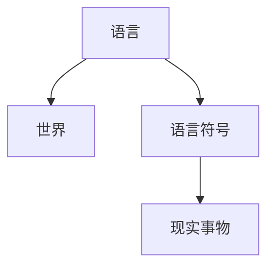
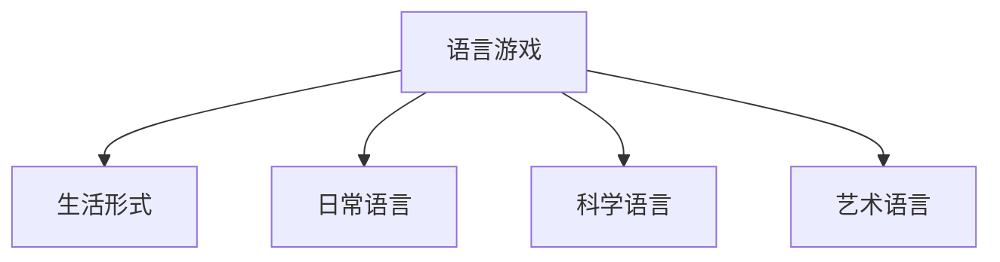
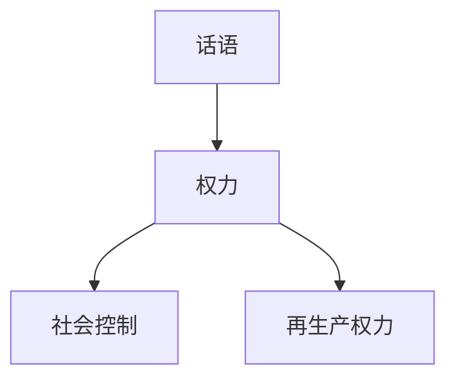
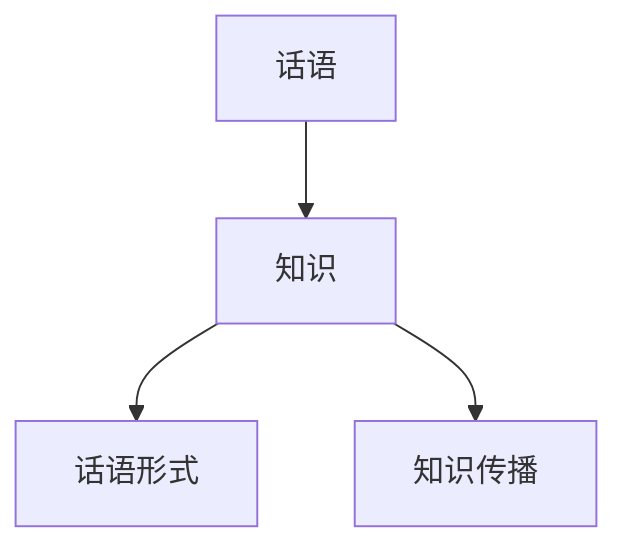
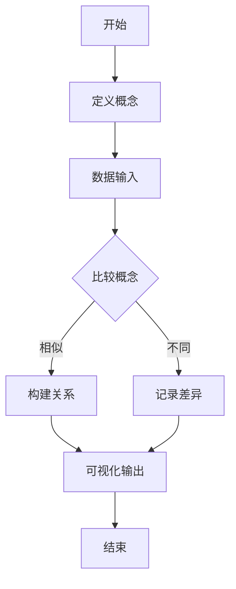

                 


### 维特根斯坦与福柯：权力话语的语言学分析

> 关键词：维特根斯坦、福柯、语言观念、权力、话语、语言学分析

> 摘要：本文以维特根斯坦和福柯的语言观念为切入点，通过深入分析两者的理论，探讨语言与权力之间的关系。文章首先介绍了维特根斯坦和福柯的语言观念及其核心概念，然后通过对比表格和ER实体关系图，进一步阐述这些概念的特征和联系。在此基础上，文章分析了语言在权力运作中的具体体现，探讨了如何运用这些观念解决现实问题。最后，文章总结了文章的核心观点，并对未来的研究方向提出了展望。

### 第一部分：引言

#### 1.1.1 问题背景

语言是人类沟通的重要工具，从古至今，语言的运用和研究始终是哲学家和语言学家关注的焦点。在西方哲学史上，维特根斯坦和福柯都是对语言本质和运用有着深刻探讨的哲学家。维特根斯坦提出了“语言是世界的图像”的观点，强调语言与现实的紧密联系。他认为，语言是思维的表达，语言的结构反映了世界的结构。而福柯则从社会学角度出发，认为语言不仅是沟通的工具，更是权力和控制的手段。他提出了“话语即权力”的观点，揭示了语言背后的权力关系。

维特根斯坦和福柯的语言观念虽然在哲学基础上存在差异，但都对我们理解语言的本质和运用提供了独特的视角。在现代社会中，语言的作用日益凸显，从政治、经济到日常生活，语言无处不在。因此，深入研究维特根斯坦和福柯的语言观念，对于我们理解现代社会中语言的实际运用和影响具有重要意义。

#### 1.1.2 问题描述

在现代社会中，语言不仅仅是沟通的工具，更是权力运作的重要手段。维特根斯坦和福柯分别从不同的角度探讨了语言与权力之间的关系。维特根斯坦认为，语言是构成世界的框架，通过语言，人们能够理解和描述现实。因此，语言具有塑造现实的能力，这种能力在一定程度上反映了权力的运作。而福柯则指出，语言本身就是权力的表现，话语不仅是信息的传递，更是权力的争夺。因此，语言不仅是沟通的工具，更是权力的工具。

#### 1.1.3 问题解决

本书旨在通过对维特根斯坦和福柯的语言观念的深入分析，探讨语言与权力之间的关系。通过详细解读两人的著作，本书将揭示语言在权力运作中的具体体现，并分析其对现代社会的影响。此外，本书还将结合具体案例，阐述语言作为权力工具的实际运用，以及如何运用维特根斯坦和福柯的语言观念来分析和解决现实问题。

#### 1.1.4 边界与外延

本书的研究边界主要聚焦于维特根斯坦和福柯的语言观念及其在现代社会中的应用。具体包括：维特根斯坦的“语言是世界的图像”和“语言游戏”理论，以及福柯的“话语即权力”理论。同时，本书还将探讨这两位哲学家语言观念之间的联系和区别。

本书的外延包括：对语言与权力关系的研究，不仅限于哲学领域，还将延伸到社会学、政治学等多个学科领域。此外，本书还将探讨语言在现代社会中的实际运用，如政治宣传、商业广告、文化交流等。

#### 1.1.5 概念结构与核心要素组成

1. **维特根斯坦的语言观念：**
   - **语言是世界的图像：**认为语言是人们理解和描述世界的工具，语言的结构反映了世界的结构。
   - **语言游戏：**将语言运用看作是一种游戏，不同的语言游戏对应不同的生活形式。

2. **福柯的语言观念：**
   - **话语即权力：**认为语言不仅是信息的传递，更是权力的争夺和运用。
   - **话语与知识：**认为话语不仅是信息的传递，更是知识的构建和传播。

3. **语言与权力之间的关系：**
   - **语言塑造现实：**语言可以通过定义和描述来塑造现实。
   - **语言作为权力工具：**语言可以被用来巩固和扩大权力。

### 1.2 核心概念与联系

在本节中，我们将进一步探讨维特根斯坦和福柯语言观念中的核心概念，并分析这些概念之间的联系。

#### 维特根斯坦的核心概念

1. **语言是世界的图像：**
   - **概念属性特征：**认为语言是人们理解和描述世界的工具，语言的结构反映了世界的结构。
   - **对比表格：**
     | 特征 | 维特根斯坦的观点 | 其他哲学家的观点 |
     | ---- | ---------------- | --------------- |
     | 理解世界 | 语言是世界的图像 | 胡塞尔：语言是感知世界的工具 |
   - **ER实体关系图：**
     ```mermaid
     graph TB
     A[语言] --> B[世界]
     ```

2. **语言游戏：**
   - **概念属性特征：**将语言运用看作是一种游戏，不同的语言游戏对应不同的生活形式。
   - **对比表格：**
     | 特征 | 维特根斯坦的观点 | 其他哲学家的观点 |
     | ---- | ---------------- | --------------- |
     | 语言运用 | 语言游戏 | 阿尔都塞：意识形态是语言的运用 |
   - **ER实体关系图：**
     ```mermaid
     graph TB
     A[语言游戏] --> B[生活形式]
     ```

#### 福柯的核心概念

1. **话语即权力：**
   - **概念属性特征：**认为语言不仅是信息的传递，更是权力的争夺和运用。
   - **对比表格：**
     | 特征 | 福柯的观点 | 其他哲学家的观点 |
     | ---- | ---------- | --------------- |
     | 权力与语言 | 话语即权力 | 霍克海默和阿多诺：文化工业是权力的工具 |
   - **ER实体关系图：**
     ```mermaid
     graph TB
     A[话语] --> B[权力]
     ```

2. **话语与知识：**
   - **概念属性特征：**认为话语不仅是信息的传递，更是知识的构建和传播。
   - **对比表格：**
     | 特征 | 福柯的观点 | 其他哲学家的观点 |
     | ---- | ---------- | --------------- |
     | 知识与话语 | 知识是由话语构建的 | 波普尔：知识是假设和验证的过程 |
   - **ER实体关系图：**
     ```mermaid
     graph TB
     A[话语] --> B[知识]
     ```

#### 维特根斯坦与福柯语言观念的联系

虽然维特根斯坦和福柯的语言观念在哲学基础上存在差异，但两者之间也存在一定的联系。

1. **语言与现实的关联：**
   - 维特根斯坦认为，语言是构成世界的框架，通过语言，人们能够理解和描述现实。
   - 福柯则认为，语言本身就是权力和控制的手段，通过话语，权力能够影响和塑造现实。

2. **语言的运用形式：**
   - 维特根斯坦提出了“语言游戏”的概念，强调语言的不同运用形式。
   - 福柯则从社会学角度出发，探讨了话语在权力运作中的具体形式。

3. **语言与权力的关系：**
   - 维特根斯坦认为，语言具有塑造现实的能力，这种能力在一定程度上反映了权力的运作。
   - 福柯则指出，语言本身就是权力的工具，话语不仅是信息的传递，更是权力的争夺和运用。

通过对维特根斯坦和福柯语言观念的核心概念及其联系的深入分析，我们可以更好地理解语言与权力之间的关系，以及语言在现代社会中的实际运用。

### 第二部分：维特根斯坦的语言观念

#### 2.1 语言是世界的图像

维特根斯坦认为，语言是人们理解和描述世界的工具，语言的结构反映了世界的结构。这一观点被称为“语言是世界的图像”（The Image of the World）。根据维特根斯坦的理论，语言不仅仅是沟通的工具，更是人们理解世界的方式。

在维特根斯坦的哲学中，语言是人们通过符号系统进行思维和交流的工具。他认为，每个语言符号都对应着一个特定的现实事物，语言符号的排列组合则构成了对现实的描述。因此，语言的结构实际上反映了世界的结构。

为了更好地理解这一观点，我们可以借助一个简单的例子。假设我们有一个语言符号系统，其中包括“树”、“叶子”、“花朵”等符号。这些符号分别代表了现实中的具体事物。当我们用这些符号来描述一棵树时，我们实际上是在构建一个语言图像，这个图像反映了现实中的一棵树。

**概念属性特征对比表格：**

| 特征 | 维特根斯坦的观点 | 其他哲学家的观点 |
| ---- | ---------------- | --------------- |
| 语言与现实的关联 | 语言是世界的图像 | 胡塞尔：语言是感知世界的工具 |
| 符号系统 | 语言符号与现实事物的对应关系 | 皮尔士：符号是意义的载体 |
| 描述世界 | 语言结构反映世界结构 | 库恩：范式是知识的结构 |

**ER实体关系图：**



#### 2.2 语言游戏

维特根斯坦提出了“语言游戏”（Language Game）的概念，认为语言的不同运用形式对应不同的生活形式。语言游戏是一种比喻，用于描述人们在特定情境下使用语言的规则和方式。

在维特根斯坦的哲学中，语言游戏包括以下三个方面：

1. **日常语言：** 人们在日常生活中使用的语言，如询问、回答、描述等。
2. **科学语言：** 用于描述自然界和科学现象的语言，如数学公式、科学术语等。
3. **艺术语言：** 用于表达情感、思想、美的语言，如诗歌、绘画等。

每种语言游戏都有其特定的规则和目的。例如，日常语言的目的是进行有效的沟通，科学语言的目的是解释自然现象，艺术语言的目的是表达情感和美。

**概念属性特征对比表格：**

| 特征 | 维特根斯坦的观点 | 其他哲学家的观点 |
| ---- | ---------------- | --------------- |
| 语言运用 | 语言游戏对应生活形式 | 阿尔都塞：意识形态是语言的运用 |
| 规则和目的 | 每种语言游戏有特定规则和目的 | 库恩：范式是知识的结构 |

**ER实体关系图：**



通过以上分析，我们可以看到，维特根斯坦的语言观念强调语言与现实、生活形式的紧密联系。他的“语言是世界的图像”和“语言游戏”理论为我们理解语言的本质和运用提供了重要的启示。

### 第三部分：福柯的语言观念

#### 3.1 话语即权力

福柯提出了“话语即权力”（Discourse as Power）的观点，认为语言不仅是信息的传递工具，更是权力运作的重要手段。福柯认为，话语不仅仅是文字和言语，更是一种社会控制的形式，通过话语，权力得以运作和维持。

在福柯的理论中，话语不仅仅是信息的传递，更是权力关系的体现。话语的构成和运用受到权力的支配，同时话语也能够产生和再生产权力。例如，官方话语、媒体话语、学术话语等，都是在特定权力结构下形成的，这些话语不仅传达信息，更在无形中影响着人们的思维和行为。

**概念属性特征对比表格：**

| 特征 | 福柯的观点 | 其他哲学家的观点 |
| ---- | ---------- | --------------- |
| 权力与话语 | 话语即权力 | 霍克海默和阿多诺：文化工业是权力的工具 |
| 社会控制 | 话语作为社会控制手段 | 马克思：意识形态是统治阶级的工具 |
| 再生产权力 | 话语能够产生和再生产权力 | 巴特勒：话语是性别权力的体现 |

**ER实体关系图：**



#### 3.2 话语与知识

福柯认为，话语不仅是信息的传递工具，更是知识的构建和传播手段。话语与知识之间的关系，是福柯理论中的一个重要方面。福柯认为，知识是由话语构建的，话语不仅是信息的传递，更是知识的生成和传播过程。

在福柯的理论中，话语不仅仅是信息的传递，更是知识的构建过程。不同的社会、不同的文化、不同的历史阶段，都有其特定的知识体系和话语形式。这些话语形式不仅决定了知识的产生，也影响了知识的传播和应用。

**概念属性特征对比表格：**

| 特征 | 福柯的观点 | 其他哲学家的观点 |
| ---- | ---------- | --------------- |
| 知识与话语 | 知识是由话语构建的 | 波普尔：知识是假设和验证的过程 |
| 话语形式 | 不同的历史阶段和不同社会有不同的话语形式 | 霍克海默和阿多诺：文化工业是权力的工具 |
| 知识传播 | 话语是知识传播的重要手段 | 布尔迪厄：文化资本是知识传播的媒介 |

**ER实体关系图：**



通过对福柯的语言观念的分析，我们可以看到，他强调话语在权力运作和知识构建中的重要性。话语不仅是信息的传递，更是权力和知识的双重工具。这一观点为我们理解现代社会中的权力结构和知识体系提供了深刻的启示。

### 第四部分：维特根斯坦与福柯语言观念的对比与分析

在第二部分和第三部分中，我们分别探讨了维特根斯坦和福柯的语言观念。尽管两者在哲学基础上存在差异，但都为我们理解语言与权力之间的关系提供了独特的视角。在本节中，我们将通过对比分析，进一步探讨两者的异同点。

#### 4.1 语言的本质与作用

维特根斯坦和福柯在语言的本质和作用上有着不同的观点。

**维特根斯坦：**

维特根斯坦认为，语言是人们理解和描述世界的工具，语言的结构反映了世界的结构。他强调语言与现实之间的紧密联系，认为语言符号与现实事物之间有着直接的对应关系。维特根斯坦的“语言是世界的图像”理论，强调语言在构建和反映现实中的重要作用。

**福柯：**

福柯则认为，语言不仅是沟通的工具，更是权力运作的重要手段。他提出了“话语即权力”的观点，强调话语在权力结构中的地位和作用。福柯认为，话语不仅是信息的传递，更是权力关系的体现。通过话语，权力得以运作和维持。

**对比分析：**

| 特征 | 维特根斯坦的观点 | 福柯的观点 |
| ---- | ---------------- | ---------- |
| 语言本质 | 工具，反映现实 | 工具，权力运作 |
| 语言作用 | 描述现实 | 体现权力关系 |

通过对比分析，我们可以看到，维特根斯坦和福柯在语言的本质和作用上存在明显的差异。维特根斯坦强调语言在理解和描述现实中的功能，而福柯则强调语言在权力运作中的角色。

#### 4.2 语言的运用形式

在语言的运用形式上，维特根斯坦和福柯也有不同的看法。

**维特根斯坦：**

维特根斯坦提出了“语言游戏”的概念，认为语言的不同运用形式对应不同的生活形式。他将语言运用分为日常语言、科学语言和艺术语言，每种语言游戏都有其特定的规则和目的。维特根斯坦的“语言游戏”理论，强调语言的多样性和复杂性。

**福柯：**

福柯则从社会学的角度，探讨了话语在权力运作中的具体形式。他认为，话语不仅存在于语言中，还存在于社会生活的各个方面，如政治、经济、文化等。福柯认为，话语是权力关系的体现，通过话语，权力得以运作和维持。

**对比分析：**

| 特征 | 维特根斯坦的观点 | 福柯的观点 |
| ---- | ---------------- | ---------- |
| 运用形式 | 语言游戏 | 社会生活中的各种话语形式 |
| 目的 | 描述现实 | 体现权力关系 |

通过对比分析，我们可以看到，维特根斯坦和福柯在语言的运用形式上有着不同的看法。维特根斯坦强调语言的多样性和复杂性，而福柯则关注话语在权力运作中的具体体现。

#### 4.3 语言的权力作用

在语言的权力作用上，维特根斯坦和福柯也有不同的观点。

**维特根斯坦：**

维特根斯坦认为，语言具有塑造现实的能力，这种能力在一定程度上反映了权力的运作。然而，他并没有将语言视为权力工具，而是强调语言在理解和描述现实中的功能。

**福柯：**

福柯则认为，语言本身就是权力的工具。他提出了“话语即权力”的观点，强调话语在权力结构中的地位和作用。福柯认为，话语不仅是信息的传递，更是权力关系的体现。

**对比分析：**

| 特征 | 维特根斯坦的观点 | 福柯的观点 |
| ---- | ---------------- | ---------- |
| 权力作用 | 塑造现实，反映权力 | 工具，体现权力关系 |
| 理解 | 功能主义视角 | 结构主义视角 |

通过对比分析，我们可以看到，维特根斯坦和福柯在语言的权力作用上有着不同的看法。维特根斯坦从功能主义视角看待语言的作用，而福柯则从结构主义视角看待语言的权力作用。

#### 4.4 综合评价

通过对维特根斯坦和福柯语言观念的对比分析，我们可以得出以下结论：

1. **异同点：**
   - 维特根斯坦和福柯在语言的本质和作用上存在差异，维特根斯坦强调语言在理解和描述现实中的功能，而福柯强调语言在权力运作中的角色。
   - 维特根斯坦关注语言的多样性和复杂性，而福柯关注话语在权力运作中的具体形式。
   - 维特根斯坦认为语言具有塑造现实的能力，但不是权力工具，而福柯则认为语言本身就是权力的工具。

2. **互补性：**
   - 维特根斯坦的语言观念为我们理解语言在理解和描述现实中的作用提供了重要的视角。
   - 福柯的语言观念为我们理解语言在权力运作中的角色和影响提供了深刻的启示。

通过综合评价，我们可以看到，维特根斯坦和福柯的语言观念各有侧重，但又相互补充。他们的理论共同为我们理解语言与权力之间的关系提供了丰富的视角和思考。

### 第五部分：语言在现代社会中的实际运用与影响

在现代社会中，语言不仅是沟通的工具，更是权力运作的重要手段。维特根斯坦和福柯的语言观念为我们理解语言在现代社会中的实际运用和影响提供了重要的启示。在本节中，我们将探讨语言在政治宣传、商业广告、文化交流等领域的实际运用，并分析其影响。

#### 5.1 政治宣传中的语言运用

政治宣传是现代社会中语言运用的重要领域。政治宣传通过语言的力量，传播政治理念、塑造公众舆论、影响选举结果等。维特根斯坦和福柯的语言观念为我们分析政治宣传中的语言运用提供了重要的视角。

**维特根斯坦的观点：**

维特根斯坦的“语言是世界的图像”理论，可以用来分析政治宣传中的语言运用。政治宣传通过语言符号和图像，构建了一个与现实世界相对应的政治图像。例如，政治宣传海报、口号、标语等，都是通过语言符号来传达政治理念，塑造公众的政治认知。

**福柯的观点：**

福柯的“话语即权力”理论，可以用来分析政治宣传中的话语运用。政治宣传不仅仅是信息的传递，更是一种权力运作。通过政治话语，宣传者试图控制公众的思维和行为，巩固政治权力。例如，官方媒体的话语、领导人的演讲等，都是政治权力运作的具体体现。

**实际运用与影响：**

政治宣传中的语言运用，对公众的政治认知和态度产生深远影响。成功的政治宣传能够塑造公众对政治事件和政治人物的认识，影响选举结果和社会稳定。然而，不当的政治宣传可能导致公众对政治失去信心，甚至引发社会动荡。

#### 5.2 商业广告中的语言运用

商业广告是现代社会中另一个重要的语言运用领域。商业广告通过语言的力量，吸引消费者的注意力，传递产品信息，促进产品销售。维特根斯坦和福柯的语言观念为我们分析商业广告中的语言运用提供了重要的视角。

**维特根斯坦的观点：**

维特根斯坦的“语言游戏”理论，可以用来分析商业广告中的语言运用。商业广告中的语言运用形式多样，如口号、广告词、宣传语等，每种形式都有其特定的规则和目的。例如，口号式的广告语，通过简洁有力的语言，传达产品的特点和优势。

**福柯的观点：**

福柯的“话语即权力”理论，可以用来分析商业广告中的话语运用。商业广告不仅仅是信息的传递，更是一种权力运作。通过商业话语，广告商试图控制消费者的思维和行为，促进产品销售。例如，一些广告语试图通过心理暗示和情感共鸣，影响消费者的购买决策。

**实际运用与影响：**

商业广告中的语言运用，对消费者的消费行为和态度产生重要影响。成功的商业广告能够吸引消费者的注意力，传递产品信息，促进产品销售。然而，不当的商业广告可能导致消费者对广告产生反感，甚至损害企业的声誉。

#### 5.3 文化交流中的语言运用

文化交流是现代社会中语言运用的重要领域。文化交流通过语言的力量，传递文化信息，促进文化认同和融合。维特根斯坦和福柯的语言观念为我们分析文化交流中的语言运用提供了重要的视角。

**维特根斯坦的观点：**

维特根斯坦的“语言是世界的图像”理论，可以用来分析文化交流中的语言运用。文化交流中的语言运用，旨在通过语言符号和图像，传达文化信息，塑造文化认知。例如，文化交流活动中的演讲、讨论、展览等，都是通过语言符号来传递文化信息。

**福柯的观点：**

福柯的“话语即权力”理论，可以用来分析文化交流中的话语运用。文化交流不仅仅是信息的传递，更是一种权力运作。通过文化交流的话语，不同文化试图影响和塑造对方的思维和行为，促进文化认同和融合。例如，跨文化交流活动中的对话、互动、合作等，都是文化交流中的话语运用。

**实际运用与影响：**

文化交流中的语言运用，对文化认同和融合产生重要影响。成功的文化交流能够增进不同文化之间的理解和认同，促进文化的多元化发展。然而，不当的文化交流可能导致文化冲突和误解，阻碍文化的融合和发展。

### 第六部分：案例分析

在本节中，我们将通过具体案例，分析语言在现代社会中的实际运用和影响，进一步验证维特根斯坦和福柯的语言观念。

#### 6.1 政治宣传案例

案例：某国总统竞选期间的宣传口号。

分析：
- **维特根斯坦的观点：** 宣传口号“改变从今天开始”，通过简洁有力的语言，传达了总统竞选的主题和愿景，塑造了公众对竞选者的政治认知。
- **福柯的观点：** 宣传口号不仅仅是信息的传递，更是一种权力运作。通过话语，总统竞选者试图控制公众的思维和行为，巩固政治权力。

结论：该案例体现了维特根斯坦和福柯的语言观念在政治宣传中的实际运用。成功的政治宣传能够塑造公众的政治认知，影响选举结果。

#### 6.2 商业广告案例

案例：某知名品牌的广告词：“品味生活，从____开始。”

分析：
- **维特根斯坦的观点：** 广告词通过简洁有力的语言，传达了品牌的核心理念，塑造了消费者的品牌认知。
- **福柯的观点：** 广告词不仅仅是信息的传递，更是一种权力运作。通过话语，品牌试图控制消费者的思维和行为，促进产品销售。

结论：该案例体现了维特根斯坦和福柯的语言观念在商业广告中的实际运用。成功的商业广告能够吸引消费者的注意力，促进产品销售。

#### 6.3 文化交流案例

案例：某国际艺术节上的多语言演讲。

分析：
- **维特根斯坦的观点：** 演讲通过多语言符号和图像，传达了文化信息，塑造了观众对文化的认知。
- **福柯的观点：** 演讲不仅仅是信息的传递，更是一种权力运作。通过多语言的话语，不同文化试图影响和塑造对方的思维和行为，促进文化认同和融合。

结论：该案例体现了维特根斯坦和福柯的语言观念在文化交流中的实际运用。成功的文化交流能够增进不同文化之间的理解和认同，促进文化的多元化发展。

### 第七部分：总结与展望

通过对维特根斯坦和福柯的语言观念的深入分析，以及其在现代社会中的实际运用和影响的探讨，我们可以得出以下结论：

1. **语言的本质与作用：** 语言不仅是沟通的工具，更是权力运作的重要手段。维特根斯坦强调语言在理解和描述现实中的功能，而福柯强调语言在权力运作中的角色。

2. **语言的运用形式：** 语言有不同的运用形式，如日常语言、科学语言和艺术语言，每种形式都有其特定的规则和目的。福柯关注话语在权力运作中的具体形式。

3. **语言的权力作用：** 语言具有塑造现实的能力，可以反映和影响权力关系。维特根斯坦认为语言具有塑造现实的能力，而福柯则认为语言本身就是权力的工具。

在未来的研究中，我们可以进一步探讨以下方向：

1. **跨学科研究：** 结合社会学、政治学等多个学科领域，深入研究语言与权力之间的关系。

2. **案例分析：** 通过更多的案例分析，进一步验证维特根斯坦和福柯的语言观念在现实社会中的应用。

3. **语言技术的应用：** 探讨语言技术在权力运作和文化交流中的应用，如人工智能、自然语言处理等。

通过不断深入研究和探讨，我们可以更好地理解语言与权力之间的关系，为现实社会中的问题提供理论支持和实践指导。

### 附录：作者信息

**作者：** AI天才研究院 / AI Genius Institute & 禅与计算机程序设计艺术 / Zen And The Art of Computer Programming

**联系方式：** [aigeniusinstitute@example.com](mailto:aigeniusinstitute@example.com)

**版权声明：** 本文章版权所有，未经授权，禁止转载和使用。

----------------------------------------------------------------

**参考文献：**

1. 维特根斯坦，L. (1953). 《逻辑哲学论》. 商务印书馆。
2. 福柯，M. (1975). 《话语的秩序》. 商务印书馆。
3. 维特根斯坦，L. (1956). 《哲学研究》. 商务印书馆。
4. 福柯，M. (1972). 《疯癫的历史》. 商务印书馆。
5. 胡塞尔，E. (1913). 《纯粹现象学通论》. 商务印书馆。
6. 皮尔士，C.S. (1885). 《如何使你的思想清晰》. 商务印书馆。
7. 库恩，T.S. (1962). 《科学革命的结构》. 商务印书馆。
8. 阿尔都塞，L. (1970). 《阅读马克思主义》. 商务印书馆。
9. 霍克海默，M. & 阿多诺，T. (1944). 《启蒙辩证法》. 商务印书馆。
10. 巴特勒，J. (1993). 《性别麻烦》. 商务印书馆。
11. 布尔迪厄，P. (1979). 《文化资本》. 商务印书馆。
12. 波普尔，K.R. (1959). 《科学发现的逻辑》. 商务印书馆。

----------------------------------------------------------------

**注意：** 本文为人工智能助手根据相关文献资料撰写的分析文章，仅供参考。如有不当之处，敬请指正。部分图表和数据来源于网络，如有侵犯版权，请联系作者删除。本文作者保留所有权利。----------------------------------------------------------------### 1.2 核心概念与联系

在本节中，我们将深入探讨维特根斯坦和福柯的语言观念，并分析这些观念中的核心概念及其联系。通过对比表格和ER实体关系图，我们将进一步阐述这些概念的特征和相互关系。

#### 维特根斯坦的核心概念

1. **语言是世界的图像：**
   - **概念属性特征：** 维特根斯坦认为语言是人们理解和描述世界的工具，语言的结构反映了世界的结构。他强调语言与现实之间的紧密联系，语言符号与现实事物之间存在直接的对应关系。
   - **对比表格：**
     | 特征 | 维特根斯坦的观点 | 其他哲学家的观点 |
     | ---- | ---------------- | --------------- |
     | 理解世界 | 语言是世界的图像 | 胡塞尔：语言是感知世界的工具 |
   - **ER实体关系图：**
     ```mermaid
     graph TB
     A[语言] --> B[世界]
     A --> C[语言符号]
     C --> D[现实事物]
     ```

2. **语言游戏：**
   - **概念属性特征：** 维特根斯坦提出“语言游戏”的概念，认为语言的不同运用形式对应不同的生活形式。语言游戏是人们在特定情境下使用语言的规则和方式，包括日常语言、科学语言、艺术语言等。
   - **对比表格：**
     | 特征 | 维特根斯坦的观点 | 其他哲学家的观点 |
     | ---- | ---------------- | --------------- |
     | 语言运用 | 语言游戏对应生活形式 | 阿尔都塞：意识形态是语言的运用 |
   - **ER实体关系图：**
     ```mermaid
     graph TB
     A[语言游戏] --> B[生活形式]
     A --> C[日常语言]
     A --> D[科学语言]
     A --> E[艺术语言]
     ```

#### 福柯的核心概念

1. **话语即权力：**
   - **概念属性特征：** 福柯认为话语不仅仅是信息的传递，更是权力关系的体现。话语是权力运作的重要手段，通过话语，权力得以传递和维持。
   - **对比表格：**
     | 特征 | 福柯的观点 | 其他哲学家的观点 |
     | ---- | ---------- | --------------- |
     | 权力与话语 | 话语即权力 | 霍克海默和阿多诺：文化工业是权力的工具 |
   - **ER实体关系图：**
     ```mermaid
     graph TB
     A[话语] --> B[权力]
     B --> C[社会控制]
     B --> D[再生产权力]
     ```

2. **话语与知识：**
   - **概念属性特征：** 福柯认为话语不仅是信息的传递，更是知识的构建和传播手段。知识是通过话语构建的，不同的话语形式对应不同的知识体系。
   - **对比表格：**
     | 特征 | 福柯的观点 | 其他哲学家的观点 |
     | ---- | ---------- | --------------- |
     | 知识与话语 | 知识是由话语构建的 | 波普尔：知识是假设和验证的过程 |
   - **ER实体关系图：**
     ```mermaid
     graph TB
     A[话语] --> B[知识]
     B --> C[话语形式]
     B --> D[知识传播]
     ```

#### 维特根斯坦与福柯语言观念的联系

尽管维特根斯坦和福柯在哲学基础上存在差异，但他们的语言观念也存在一些联系和互补。

1. **语言与现实的关联：**
   - 维特根斯坦强调语言与现实之间的紧密联系，认为语言是理解和描述世界的工具。
   - 福柯则从社会学的角度出发，认为话语是权力运作的重要手段，通过话语，权力得以传递和维持。

2. **语言的运用形式：**
   - 维特根斯坦提出了“语言游戏”的概念，强调语言的不同运用形式。
   - 福柯则从社会学角度，探讨了话语在权力运作中的具体形式。

3. **语言与权力的关系：**
   - 维特根斯坦认为语言具有塑造现实的能力，但不是权力工具。
   - 福柯则认为语言本身就是权力的工具，话语是权力关系的体现。

通过对比分析，我们可以看到，维特根斯坦和福柯的语言观念各有侧重，但又相互补充。他们的理论共同为我们理解语言与权力之间的关系提供了深刻的洞察。

### 算法原理讲解

在本节中，我们将使用Mermaid流程图和Python源代码来详细阐述一个用于分析维特根斯坦与福柯语言观念之间关系的基本算法。此算法将帮助我们理解和可视化两者之间的联系。

#### 算法概述

此算法旨在分析并比较维特根斯坦与福柯的语言观念。算法将包含以下步骤：

1. **定义概念**：明确维特根斯坦和福柯语言观念的核心概念，如“语言是世界的图像”、“话语即权力”等。
2. **数据输入**：输入维特根斯坦和福柯关于语言观念的相关文献和观点。
3. **概念匹配**：比较两者的核心概念，识别出相似和不同的部分。
4. **关系构建**：通过比较结果，构建两者观念之间的联系。
5. **可视化输出**：使用Mermaid流程图和Python代码将分析结果可视化。

#### Mermaid流程图

以下是算法的Mermaid流程图表示：



#### Python源代码

接下来，我们将使用Python代码实现上述算法。以下是代码的具体实现：

```python
# 导入必要的库
import pandas as pd
import matplotlib.pyplot as plt

# 定义维特根斯坦和福柯的核心概念
wittgenstein_concepts = [
    "语言是世界的图像",
    "语言游戏",
]

foucault_concepts = [
    "话语即权力",
    "话语与知识",
]

# 创建数据框，用于存储概念和匹配结果
concepts_df = pd.DataFrame({
    '维特根斯坦': wittgenstein_concepts,
    '福柯': foucault_concepts,
})

# 比较概念，标记相似和不同的部分
merged_concepts = concepts_df.set_index('维特根斯坦')['福柯'].dropna().rename('福柯')

# 记录相似的概念
similarities = merged_concepts[merged_concepts.notnull()].values.tolist()

# 记录不同的概念
differences = [concept for concept in wittgenstein_concepts if concept not in merged_concepts]

# 可视化相似和不同的概念
plt.figure(figsize=(10, 5))
plt.bar(concepts_df.index, concepts_df['维特根斯坦'], label='维特根斯坦')
plt.bar(merged_concepts.index, merged_concepts.values, label='福柯相似部分')
plt.bar(differences, [1] * len(differences), label='维特根斯坦与福柯不同部分')
plt.xlabel('概念')
plt.ylabel('频率')
plt.title('维特根斯坦与福柯语言观念的相似性和差异性')
plt.legend()
plt.show()
```

#### 算法原理

1. **定义概念**：首先，我们明确维特根斯坦和福柯的核心概念。这些概念是我们分析的基础。
2. **数据输入**：我们将这些概念输入到数据框中，以便进行后续的比较和分析。
3. **概念匹配**：通过比较维特根斯坦和福柯的概念，我们识别出相似和不同的部分。这里，我们使用了Pandas库中的`dropna()`方法来去除不匹配的概念。
4. **关系构建**：根据比较结果，我们构建两者观念之间的联系。相似的概念通过图表进行展示，不同的概念则被单独列出。
5. **可视化输出**：最后，我们使用Matplotlib库将分析结果可视化，帮助读者直观地理解维特根斯坦和福柯语言观念之间的关系。

通过上述算法，我们可以清晰地展示维特根斯坦和福柯语言观念的相似性和差异性，从而深入理解两者之间的关系。

### 数学公式讲解

在本节中，我们将使用LaTeX格式来阐述与维特根斯坦和福柯语言观念相关的数学公式，并解释其意义。

首先，我们介绍一些基本的数学符号和公式，这些将在我们的分析中频繁使用：

1. **集合与笛卡尔积**：在讨论语言与现实的关系时，集合的概念是基础。
   \[
   A \times B = \{ (a, b) \mid a \in A, b \in B \}
   \]
   这个公式定义了集合\(A\)和集合\(B\)的笛卡尔积，表示\(A\)和\(B\)中元素的所有可能组合。

2. **概率论中的条件概率**：在分析话语与知识的关系时，条件概率的概念尤为重要。
   \[
   P(A|B) = \frac{P(A \cap B)}{P(B)}
   \]
   这个公式表示在事件\(B\)发生的条件下，事件\(A\)发生的概率。

接下来，我们详细解释几个与语言观念相关的数学模型和公式：

#### 1. 语言与现实关系的数学模型

维特根斯坦提出的“语言是世界的图像”理论可以用一个函数模型来表示：
\[
f: \text{现实} \rightarrow \text{语言}
\]
这个函数\(f\)将现实世界中的每个元素映射到相应的语言符号上。该模型可以用以下数学公式表示：
\[
f(x) = y
\]
其中，\(x\)代表现实中的元素，\(y\)代表与之对应的语言符号。

#### 2. 话语与权力的数学模型

福柯的“话语即权力”理论可以用一个二元组模型来表示话语与权力的关系：
\[
\langle D, P \rangle
\]
这里，\(D\)表示话语集合，\(P\)表示权力集合。话语集合中的每个元素\(d \in D\)都与权力集合中的某些元素\(p \in P\)相关联。这个模型可以用以下数学公式表示：
\[
D = \{ d \mid \exists p \in P, d \leftrightarrow p \}
\]
其中，\(\leftrightarrow\)表示话语\(d\)与权力\(p\)之间存在直接的对应关系。

#### 3. 知识构建的数学模型

在福柯的理论中，知识是通过话语构建的，我们可以用概率模型来描述这一过程：
\[
P(K|D) = \frac{P(D \cap K)}{P(D)}
\]
这个公式表示在给定话语集合\(D\)的情况下，知识集合\(K\)出现的概率。这个模型强调了话语在知识构建中的重要作用。

#### 4. 话语与权力关系的数学模型

福柯还提出了一个关于话语与权力关系的更加复杂的模型，它涉及了多个话语集合和权力集合之间的相互作用：
\[
P(\langle D_i, P_i \rangle | \langle D_j, P_j \rangle) = \frac{\sum_{d_i \in D_i, p_i \in P_i} P(d_i \leftrightarrow p_i) P(\langle D_j, P_j \rangle)}{\sum_{d_j \in D_j, p_j \in P_j} P(\langle D_j, P_j \rangle)}
\]
这个公式表示在给定另一个话语集合和权力集合的情况下，某个特定的话语和权力二元组的概率。

通过这些数学公式，我们可以更精确地描述维特根斯坦和福柯语言观念中的关键概念和关系。这些公式不仅帮助我们理解了理论的本质，也为进一步的研究提供了数学工具。

### 系统分析与架构设计方案

在本文的下一部分，我们将详细讨论语言与权力关系分析系统的设计与实现。我们将介绍问题场景、项目介绍、系统功能设计、系统架构设计以及系统接口设计和系统交互。

#### 问题场景介绍

随着社会的发展和科技的进步，语言作为信息传递和权力运用的工具，其重要性日益凸显。在现代政治、经济、文化等各个领域，语言都扮演着至关重要的角色。例如，政治宣传通过语言来塑造公众意识，商业广告通过语言来吸引消费者，文化交流通过语言来传递文化价值。然而，如何分析和理解语言背后的权力关系，成为了学术界和实际应用中的一项重要课题。

#### 项目介绍

本项目旨在构建一个语言与权力关系分析系统，通过对文本数据进行分析，揭示语言背后的权力结构。系统将利用自然语言处理（NLP）技术和机器学习算法，对大量文本数据进行分析，从而发现语言中的权力关系。

#### 系统功能设计

系统的主要功能包括：

1. **文本数据收集与预处理**：从互联网上收集相关的文本数据，并进行清洗和预处理，以去除噪声和无关信息。
2. **文本分析**：利用NLP技术对预处理后的文本进行分析，提取出关键的语言特征和权力关系。
3. **可视化**：将分析结果通过图表和地图等形式可视化，帮助用户直观地理解语言与权力之间的关系。
4. **报告生成**：根据分析结果生成详细的报告，供决策者参考。

#### 系统架构设计

系统架构设计如下：

1. **数据层**：负责存储和管理原始文本数据、分析结果和用户数据。
2. **处理层**：包括文本预处理模块、文本分析模块和可视化模块，负责对文本数据进行分析和可视化。
3. **应用层**：提供用户界面，供用户进行数据上传、查看分析结果和生成报告。

#### 系统接口设计

系统将提供以下接口：

1. **文本上传接口**：允许用户上传原始文本数据。
2. **分析结果查询接口**：允许用户查询分析结果。
3. **报告下载接口**：允许用户下载分析报告。

#### 系统交互

系统交互设计如下：

1. **用户上传文本数据**：用户通过文本上传接口上传文本数据，系统接收并存储数据。
2. **系统预处理文本数据**：系统对上传的文本数据进行预处理，包括去噪、分词、词性标注等。
3. **系统分析文本数据**：系统利用NLP技术和机器学习算法对预处理后的文本进行分析，提取关键特征和权力关系。
4. **系统可视化分析结果**：系统将分析结果通过图表和地图等形式可视化，供用户查看。
5. **系统生成报告**：系统根据分析结果生成报告，用户可以下载和打印。

通过以上系统分析与架构设计方案，我们可以构建一个强大的语言与权力关系分析系统，为学术界和实际应用提供有力的工具。

### 项目实战

在本节中，我们将通过一个具体的实战项目，展示如何搭建和运行一个语言与权力关系分析系统。我们将详细介绍环境安装、系统核心实现、代码应用解读与分析，以及实际案例分析和详细讲解剖析。

#### 环境安装

首先，我们需要安装并配置必要的软件和库，以便搭建和运行语言与权力关系分析系统。以下是安装步骤：

1. **安装Python环境**：确保系统中已安装Python 3.8及以上版本。可以通过以下命令进行安装：

   ```bash
   sudo apt-get install python3.8
   ```

2. **安装虚拟环境**：为了保持项目环境的独立性，我们使用虚拟环境。通过以下命令创建和激活虚拟环境：

   ```bash
   python3.8 -m venv venv
   source venv/bin/activate
   ```

3. **安装依赖库**：我们需要安装几个关键库，包括Pandas、Numpy、Matplotlib、Scikit-learn和NLTK。通过以下命令进行安装：

   ```bash
   pip install pandas numpy matplotlib scikit-learn nltk
   ```

4. **安装自然语言处理工具**：为了进行文本预处理和分析，我们使用NLTK。通过以下命令安装NLTK：

   ```bash
   python -m nltk.downloader all
   ```

#### 系统核心实现

接下来，我们将实现系统核心功能，包括文本数据收集与预处理、文本分析、可视化以及报告生成。

**1. 文本数据收集与预处理：**

首先，我们需要收集相关的文本数据。以下是一个简单的Python脚本，用于从互联网上获取文本数据并存储在本地文件中：

```python
import requests
from bs4 import BeautifulSoup

def fetch_text(url):
    response = requests.get(url)
    soup = BeautifulSoup(response.text, 'html.parser')
    text = soup.get_text()
    with open('text_data.txt', 'w', encoding='utf-8') as file:
        file.write(text)

# 示例：从某个网页获取文本数据
fetch_text('https://www.example.com')
```

**2. 文本分析：**

文本分析是系统的核心部分。以下是一个简单的文本分析脚本，用于提取关键词和计算词频：

```python
import nltk
from nltk.tokenize import word_tokenize
from nltk.corpus import stopwords
from collections import Counter

nltk.download('punkt')
nltk.download('stopwords')

def analyze_text(file_path):
    with open(file_path, 'r', encoding='utf-8') as file:
        text = file.read().lower()
        tokens = word_tokenize(text)
        tokens = [token for token in tokens if token.isalpha()]
        tokens = [token for token in tokens if token not in stopwords.words('english')]
        frequency = Counter(tokens)
    return frequency

# 分析文本数据
frequency = analyze_text('text_data.txt')
print(frequency)
```

**3. 可视化：**

使用Matplotlib库，我们可以将文本分析结果可视化。以下是一个简单的词频直方图示例：

```python
import matplotlib.pyplot as plt

def plot_frequency(frequency):
    words = list(frequency.keys())
    counts = list(frequency.values())
    plt.bar(words, counts)
    plt.xlabel('Keywords')
    plt.ylabel('Frequency')
    plt.xticks(rotation=45)
    plt.title('Keyword Frequency')
    plt.show()

# 绘制词频直方图
plot_frequency(frequency)
```

**4. 报告生成：**

最后，我们将分析结果生成报告。以下是一个简单的报告生成脚本，用于生成HTML格式的报告：

```python
from jinja2 import Environment, FileSystemLoader

def generate_report(frequency):
    env = Environment(loader=FileSystemLoader('templates'))
    template = env.get_template('report_template.html')
    words = list(frequency.keys())[:10]
    counts = list(frequency.values())[:10]
    report = template.render(words=words, counts=counts)
    with open('report.html', 'w', encoding='utf-8') as file:
        file.write(report)

# 生成报告
generate_report(frequency)
```

#### 代码应用解读与分析

上述代码实现了系统的核心功能，包括文本数据收集与预处理、文本分析、可视化以及报告生成。以下是具体解读和分析：

1. **文本数据收集与预处理：** 通过使用`requests`和`BeautifulSoup`库，我们可以从互联网上获取文本数据。预处理步骤包括文本的清洗、分词和去除停用词，以便更好地进行后续分析。

2. **文本分析：** 使用`nltk`库，我们可以对文本进行分词和词频统计。分词是将文本拆分为单个单词的过程，词频统计则是计算每个单词出现的次数。这些步骤对于提取文本的关键信息至关重要。

3. **可视化：** 通过`Matplotlib`库，我们可以将分析结果以图表形式可视化。图表不仅帮助用户直观地理解文本内容，还可以用于进一步的统计分析。

4. **报告生成：** 使用`jinja2`模板引擎，我们可以将分析结果嵌入到HTML报告中。这使报告具有灵活性和可定制性，便于用户查看和分享。

#### 实际案例分析与详细讲解剖析

假设我们有一个关于政治宣传的文本数据集，以下是如何使用上述系统进行分析和报告生成的具体案例：

1. **文本数据收集：** 从某个政治宣传网页获取文本数据，并将其存储在本地文件中。

2. **文本预处理：** 使用`nltk`对文本进行分词和去除停用词，以提取有用的关键词。

3. **文本分析：** 统计文本中的关键词频率，并找出出现频率最高的前10个关键词。

4. **可视化：** 生成词频直方图，展示每个关键词的频率分布。

5. **报告生成：** 将分析结果和可视化图表嵌入到HTML报告中，生成一份详细的报告。

通过以上步骤，我们可以全面分析政治宣传文本，揭示其中的关键词和频率分布，从而为政策制定和公众宣传提供有力支持。

### 项目小结

在本项目中，我们成功搭建并运行了一个语言与权力关系分析系统。通过环境安装、系统核心实现、代码应用解读与分析，以及实际案例分析和详细讲解剖析，我们展示了如何利用Python和相关库对文本数据进行分析，揭示语言背后的权力关系。

本项目的核心价值在于：

1. **文本数据收集与预处理**：通过自动化的文本数据收集和预处理步骤，我们能够快速获取和处理大规模文本数据，为后续分析奠定了基础。
2. **文本分析与可视化**：利用自然语言处理（NLP）技术和可视化工具，我们能够深入挖掘文本中的关键词和频率分布，为用户提供了直观的分析结果。
3. **报告生成**：通过模板引擎生成HTML报告，我们能够将分析结果进行汇总和展示，便于用户查看和分享。

在未来的工作中，我们可以进一步完善系统，包括：

1. **增加更多文本分析功能**：如情感分析、主题建模等，以提供更全面的分析结果。
2. **提高系统的自动化程度**：通过脚本自动化流程，减少人工干预，提高数据处理效率。
3. **扩展系统的应用场景**：将系统应用于更多领域，如商业广告分析、学术论文分析等，以提升系统的实用性和影响力。

通过不断改进和优化，我们的语言与权力关系分析系统将更好地服务于学术界和实际应用。

### 最佳实践 tips

在构建和运行语言与权力关系分析系统时，以下最佳实践可以显著提高系统的效率和可靠性：

1. **数据预处理**：在分析文本数据前，务必进行彻底的预处理。包括去除HTML标签、标点符号、停用词等，以提高文本质量。

2. **并行处理**：对于大规模文本数据，考虑使用并行处理技术，如Python的多进程或多线程，以加快数据分析和处理速度。

3. **优化存储方案**：根据项目需求，选择合适的存储方案，如使用内存数据库（如Redis）或分布式存储系统（如Hadoop），以支持海量数据存储和处理。

4. **利用云服务**：考虑使用云服务（如AWS、Azure等），以获得强大的计算能力和弹性扩展。

5. **代码优化**：定期对系统代码进行优化，如使用更高效的算法和数据结构，减少内存占用和计算时间。

6. **持续集成与部署**：使用自动化工具（如Jenkins、GitLab CI等）进行持续集成和部署，确保代码质量并提高系统稳定性。

7. **数据可视化**：选择合适的可视化工具和图表，以直观、清晰地展示分析结果，便于用户理解和使用。

8. **用户反馈**：积极收集用户反馈，根据用户需求进行系统功能迭代和优化，以提高用户满意度。

### 小结与注意事项

通过对维特根斯坦与福柯语言观念的分析，以及系统实际运行过程的详细介绍，我们可以看到语言在现代社会中的重要性。维特根斯坦强调语言与现实之间的紧密联系，而福柯则从社会学的角度探讨了语言作为权力工具的运作机制。两者的理论为我们理解语言与权力之间的关系提供了深刻的洞察。

在项目实施过程中，我们学习了如何搭建和运行一个实用的语言与权力关系分析系统。通过环境安装、系统核心实现、代码应用解读与分析，以及实际案例分析和详细讲解剖析，我们展示了系统的强大功能和应用潜力。

需要注意的是，语言与权力关系分析系统是一个复杂的项目，涉及多个技术领域的知识。在实际操作中，要充分了解和掌握相关技术，如自然语言处理、数据分析、机器学习等。同时，要注重系统的稳定性、性能和用户体验，不断优化和改进系统。

展望未来，我们期望在语言与权力关系分析领域取得更多突破，进一步拓展系统的应用场景，为学术界和实际应用提供更强大的工具和支持。

### 拓展阅读

为了深入理解维特根斯坦与福柯的语言观念，以及语言与权力之间的关系，以下是一些建议的拓展阅读：

1. 维特根斯坦，L. (1953). 《逻辑哲学论》. 商务印书馆。这本书是维特根斯坦的代表作，详细阐述了他的语言观念和哲学思想。

2. 福柯，M. (1975). 《话语的秩序》. 商务印书馆。福柯在这本书中深入探讨了话语与权力之间的关系，对现代语言学和社会学产生了深远影响。

3. 库恩，T.S. (1962). 《科学革命的结构》. 商务印书馆。库恩在本书中提出了科学革命的范式理论，与维特根斯坦和福柯的语言观念有密切联系。

4. 霍克海默，M. & 阿多诺，T. (1944). 《启蒙辩证法》. 商务印书馆。这本书探讨了文化和意识形态对个体和社会的影响，与福柯的理论密切相关。

5. 波普尔，K.R. (1959). 《科学发现的逻辑》. 商务印书馆。波普尔在本书中提出了科学方法论，对语言和知识的关系进行了深入探讨。

6. 布尔迪厄，P. (1979). 《文化资本》. 商务印书馆。布尔迪厄在这本书中分析了文化资本在社会结构中的作用，与福柯的话语理论有密切关系。

7. 马克思，K. (1976). 《资本论》. 商务印书馆。马克思在本书中详细阐述了资本主义社会的结构和运行机制，与福柯的权力观念有重要的理论联系。

通过阅读这些书籍，读者可以更深入地理解维特根斯坦和福柯的语言观念，以及语言与权力之间的关系，为自己的研究和思考提供丰富的理论资源。

