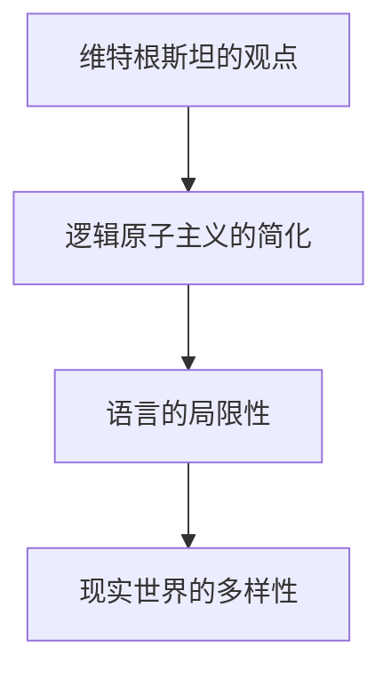
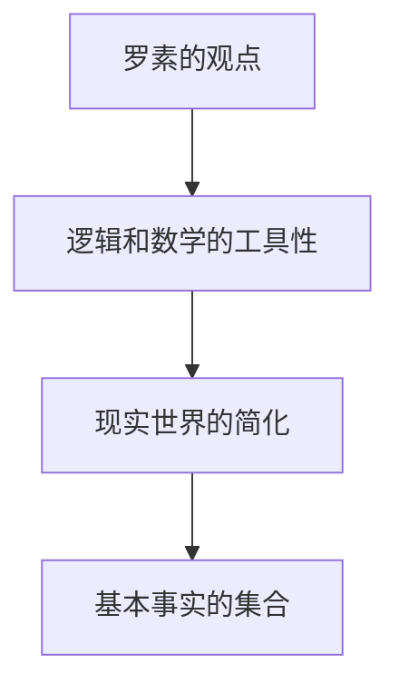
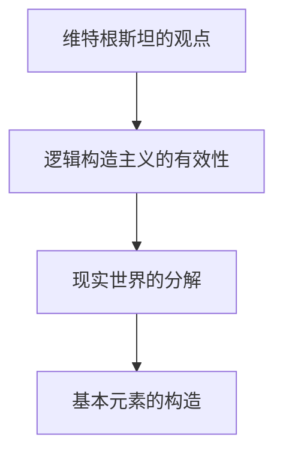
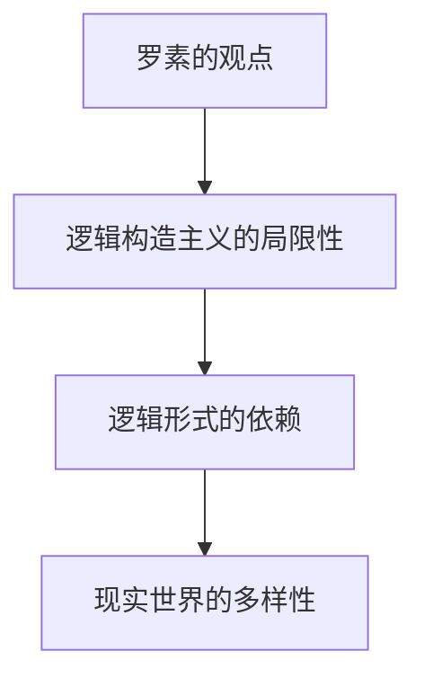
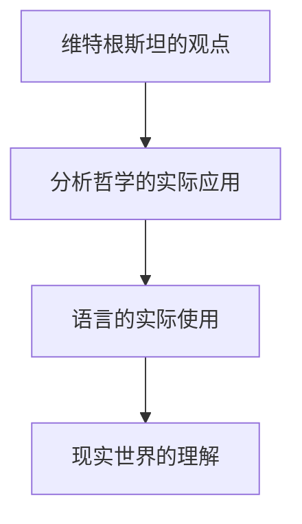
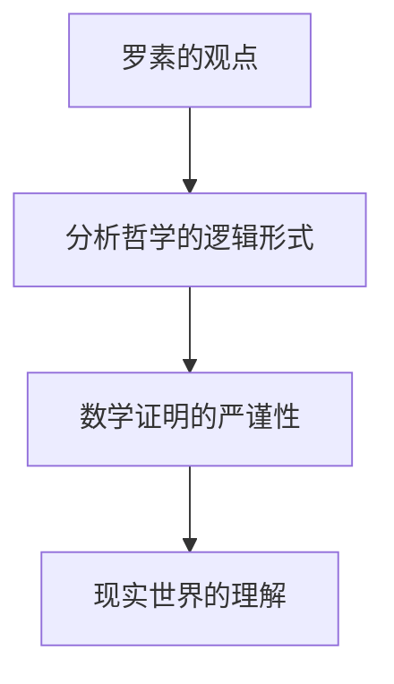

                 

### 文章标题：维特根斯坦与罗素：逻辑哲学的分歧与发展

#### 关键词：维特根斯坦、罗素、逻辑哲学、分歧、发展

#### 摘要：
本文将深入探讨维特根斯坦与罗素两位伟大哲学家的逻辑哲学观点及其分歧。通过对两人核心哲学思想的介绍和对比，分析他们在逻辑哲学领域中的分歧点，并探讨逻辑哲学的发展历程及其对未来技术和社会的影响。文章旨在为读者提供一份全面而系统的逻辑哲学理解，激发对这一领域更深入的思考和研究。

### 目录大纲

**第一部分：背景介绍**

1. **问题的提出与概述**
   - 1.1 问题背景
   - 1.2 问题描述
   - 1.3 问题解决
   - 1.4 边界与外延

2. **核心概念与联系**
   - 2.1 维特根斯坦与罗素的核心哲学观点
     - 2.1.1 维特根斯坦的哲学观点
     - 2.1.2 罗素的哲学观点
   - 2.2 概念属性特征对比
   - 2.3 ER实体关系图

**第二部分：逻辑哲学的分歧**

3. **维特根斯坦与罗素在逻辑哲学中的分歧**
   - 3.1 逻辑原子主义
     - 3.1.1 维特根斯坦的观点
     - 3.1.2 罗素的观点
   - 3.2 逻辑构造主义
     - 3.2.1 维特根斯坦的观点
     - 3.2.2 罗素的观点
   - 3.3 分析哲学与方法论
     - 3.3.1 维特根斯坦的观点
     - 3.3.2 罗素的观点

**第三部分：逻辑哲学的发展**

4. **逻辑哲学的发展历程**
   - 4.1 前逻辑哲学时期
     - 4.1.1 经验主义与理性主义
     - 4.1.2 形而上学与逻辑学
   - 4.2 逻辑哲学的早期发展
     - 4.2.1 布尔代数学与形式逻辑
     - 4.2.2 奇异逻辑与模糊逻辑
   - 4.3 20世纪逻辑哲学
     - 4.3.1 分析哲学的兴起
     - 4.3.2 语言哲学的影响

5. **维特根斯坦与罗素对逻辑哲学的贡献**
   - 5.1 维特根斯坦的贡献
     - 5.1.1 语言哲学的贡献
     - 5.1.2 分析哲学的贡献
   - 5.2 罗素的贡献
     - 5.2.1 形式逻辑的贡献
     - 5.2.2 数学哲学的贡献

**第四部分：总结与展望**

6. **总结**
   - 6.1 维特根斯坦与罗素逻辑哲学的异同
   - 6.2 逻辑哲学的发展趋势
   - 6.3 对未来的展望

7. **注意事项与拓展阅读**

---

**第一部分：背景介绍**

### 1. 问题的提出与概述

#### 1.1 问题背景

在20世纪初，逻辑哲学领域发生了重大的变革，维特根斯坦与罗素两位哲学家在这一时期分别提出了各自独特的哲学观点，并对逻辑哲学的发展产生了深远的影响。维特根斯坦出生于1889年，罗素出生于1872年，两人的哲学观点在某种程度上反映了当时哲学思潮的分化与交融。

#### 1.2 问题描述

维特根斯坦与罗素在逻辑哲学中的主要问题涉及对语言、逻辑和数学的本质理解。维特根斯坦关注的是语言与现实的对应关系，强调语言的局限性，并提出了“图像理论”来解释语言的意义。罗素则关注逻辑形式在数学中的作用，试图通过逻辑原子主义和逻辑构造主义来解决数学基础问题。

#### 1.3 问题解决

维特根斯坦通过批判逻辑原子主义和逻辑构造主义，提出了“日常语言哲学”的观点，强调语言在日常生活中的作用。罗素则通过形式逻辑和数学哲学，试图建立一种更加严谨的数学基础，为现代逻辑学的发展奠定了基础。

#### 1.4 边界与外延

在逻辑哲学中，维特根斯坦和罗素的分歧不仅体现在对语言和逻辑的理解上，还涉及到对数学哲学和方法论的不同看法。维特根斯坦关注的是语言的意义和现实世界的对应关系，而罗素则关注逻辑形式和数学证明的严谨性。这两位哲学家的思想在逻辑哲学领域形成了鲜明的对比，为我们提供了丰富的哲学思考资源。

### 2. 核心概念与联系

#### 2.1 维特根斯坦与罗素的核心哲学观点

##### 2.1.1 维特根斯坦的哲学观点

维特根斯坦的哲学观点主要集中在其早期的《逻辑哲学论》和后期的《哲学研究》中。他认为，语言是一种工具，用于描述现实世界。然而，由于语言的局限性，我们无法完全准确地描述现实。因此，他提出了“图像理论”，即语言符号与外界事物之间的关系应该像一幅图像与现实世界之间的关系一样。

##### 2.1.2 罗素的哲学观点

罗素的哲学观点主要体现在其《数学原理》和《哲学问题》中。他主张逻辑原子主义和逻辑构造主义，认为逻辑形式和数学原理是理解现实世界的关键。罗素试图通过逻辑和数学来解释现实世界，并认为数学是一种逻辑的扩展。

#### 2.2 概念属性特征对比

| 特征            | 维特根斯坦          | 罗素                  |
|-----------------|---------------------|-----------------------|
| 语言与现实的对应 | 语言的局限性         | 逻辑形式和数学的严谨性 |
| 哲学方法        | 批判性分析           | 形式逻辑和数学证明     |
| 目标            | 描述现实世界         | 解释现实世界           |

#### 2.3 ER实体关系图

为了更直观地展示维特根斯坦和罗素的核心哲学观点，我们可以使用ER实体关系图来表示他们之间的联系和区别。

```mermaid
erDiagram
  Category_A ||--|{ Category_B }
  Category_C ||--|{ Category_D }
  Category_A &&--|{ Category_C }
```

在这个ER实体关系图中，Category_A代表维特根斯坦的哲学观点，Category_B代表罗素的哲学观点，Category_C和Category_D则分别代表两者之间的联系和区别。通过这个图，我们可以更清晰地看到维特根斯坦和罗素在逻辑哲学中的不同视角。

### 第二部分：逻辑哲学的分歧

#### 3. 维特根斯坦与罗素在逻辑哲学中的分歧

##### 3.1 逻辑原子主义

逻辑原子主义是罗素哲学中的一个重要概念，他认为逻辑和数学是理解现实世界的基础。维特根斯坦对逻辑原子主义持批判态度，他认为逻辑原子主义过于简化了现实世界，忽略了语言和现实的复杂性。

##### 3.1.1 维特根斯坦的观点

维特根斯坦认为，逻辑原子主义将现实世界简化为一系列原子事实的集合，这种简化忽略了语言和现实的多样性。他指出，语言不仅仅是描述现实世界的工具，还包含了许多日常生活中的习惯和习俗。



##### 3.1.2 罗素的观点

罗素则认为，逻辑原子主义是一种强有力的工具，可以帮助我们理解现实世界的本质。他认为，通过逻辑和数学，我们可以将复杂的世界简化为一系列的基本事实。



##### 3.2 逻辑构造主义

逻辑构造主义是维特根斯坦哲学中的一个核心概念，他认为通过逻辑构造，我们可以理解和描述现实世界。罗素则对逻辑构造主义持批评态度，他认为逻辑构造主义过于依赖逻辑形式，而忽略了现实世界的复杂性。

##### 3.2.1 维特根斯坦的观点

维特根斯坦认为，逻辑构造主义是一种有效的哲学方法，可以帮助我们理解和描述现实世界。他指出，通过逻辑构造，我们可以将复杂的现实世界分解为一系列的基本元素。



##### 3.2.2 罗素的观点

罗素则认为，逻辑构造主义过于依赖逻辑形式，而忽略了现实世界的复杂性。他认为，逻辑构造主义不能完全解释现实世界的多样性。



##### 3.3 分析哲学与方法论

分析哲学是维特根斯坦和罗素共同关注的领域，他们都认为通过分析，我们可以理解语言和现实之间的关系。然而，在方法论上，他们有不同的看法。

##### 3.3.1 维特根斯坦的观点

维特根斯坦认为，分析哲学应该关注语言的实际使用，而不是抽象的逻辑形式。他强调，通过实际使用语言，我们可以更好地理解现实世界。



##### 3.3.2 罗素的观点

罗素则认为，分析哲学应该注重逻辑形式和数学证明，通过严谨的逻辑推理，我们可以更好地理解现实世界。



### 第三部分：逻辑哲学的发展

#### 4. 逻辑哲学的发展历程

逻辑哲学的发展历程可以追溯到古希腊时期，当时的哲学家如亚里士多德就提出了形式逻辑的基本原理。然而，真正的逻辑哲学发展始于20世纪初，维特根斯坦和罗素在这一时期分别提出了各自的观点，对逻辑哲学的发展产生了深远的影响。

##### 4.1 前逻辑哲学时期

在逻辑哲学的发展历程中，前逻辑哲学时期的主要特点是经验主义和理性主义的对立。经验主义者认为，知识来源于经验，而理性主义者则认为，知识可以通过理性推理获得。这一时期的哲学家如洛克和莱布尼茨，对后来的逻辑哲学产生了重要影响。

##### 4.1.1 经验主义与理性主义

洛克是经验主义的代表人物，他认为，我们的知识来源于经验，通过感官我们可以获得对世界的认识。洛克的观点对后来的实证主义哲学产生了重要影响。

莱布尼茨则是理性主义的代表人物，他认为，通过理性推理，我们可以获得对世界的深刻认识。莱布尼茨提出了“二进制”思想，这一思想对后来的计算机科学产生了深远影响。

##### 4.1.2 形而上学与逻辑学

在前逻辑哲学时期，形而上学和逻辑学是两个主要的哲学分支。形而上学研究存在的本质和宇宙的本质，而逻辑学研究推理的形式和规则。这一时期的哲学家如柏拉图和亚里士多德，对后来的逻辑哲学和形而上学产生了重要影响。

##### 4.2 逻辑哲学的早期发展

逻辑哲学的早期发展始于19世纪，布尔代数学和形式逻辑的提出标志着逻辑哲学的现代化。布尔代数学是一种形式逻辑系统，它通过二进制运算来表示逻辑运算，这一思想对后来的计算机科学产生了重要影响。

形式逻辑则是一种严格的推理系统，它通过定义和规则来保证推理的严谨性。形式逻辑的发展为后来的数学基础和逻辑哲学提供了重要的理论基础。

##### 4.2.1 布尔代数学与形式逻辑

布尔代数学的提出者是乔治·布尔，他在19世纪提出了布尔代数的基本原理。布尔代数学通过二进制运算来表示逻辑运算，这一思想为后来的计算机科学奠定了基础。

形式逻辑的提出者包括弗雷格、罗素和维特根斯坦等人，他们在20世纪初提出了形式逻辑的基本原理，为逻辑哲学的发展提供了重要的理论支持。

##### 4.2.2 奇异逻辑与模糊逻辑

在20世纪，逻辑哲学继续发展，奇异逻辑和模糊逻辑的提出标志着逻辑哲学的进一步拓展。奇异逻辑是一种处理不确定性逻辑的系统，它通过模糊集合和模糊推理来处理不确定性问题。

模糊逻辑则是一种处理模糊性和不确定性的逻辑系统，它通过模糊集合和模糊运算来表示和处理模糊性。

##### 4.3 20世纪逻辑哲学

20世纪是逻辑哲学发展的关键时期，分析哲学和语言哲学在这一时期取得了重要进展。维特根斯坦和罗素是20世纪逻辑哲学的代表人物，他们的观点对逻辑哲学的发展产生了深远影响。

##### 4.3.1 分析哲学的兴起

分析哲学是20世纪的一种重要哲学思潮，它主张通过分析语言和概念来理解现实世界。分析哲学的代表人物包括维特根斯坦、罗素和卡尔纳普等人。他们的工作为逻辑哲学的发展提供了新的方法和视角。

##### 4.3.2 语言哲学的影响

语言哲学是20世纪逻辑哲学的一个重要分支，它关注语言与思维、语言与现实之间的关系。维特根斯坦的语言哲学观点对后来的哲学和语言学研究产生了深远影响。罗素的语言哲学观点则强调逻辑和数学在理解语言中的作用。

#### 5. 维特根斯坦与罗素对逻辑哲学的贡献

##### 5.1 维特根斯坦的贡献

维特根斯坦对逻辑哲学的贡献主要体现在其语言哲学和日常语言哲学中。他提出了“图像理论”，试图解释语言与现实之间的关系。他的后期作品《哲学研究》则强调了日常语言的重要性，对后来的语言哲学和认知科学产生了重要影响。

##### 5.1.1 语言哲学的贡献

维特根斯坦的语言哲学观点认为，语言是思维的载体，通过语言我们可以理解现实世界。他的观点强调了语言的多样性和复杂性，为后来的语言哲学研究提供了新的视角。

##### 5.1.2 分析哲学的贡献

维特根斯坦的分析哲学观点强调通过分析语言和概念来理解现实世界。他的工作为后来的分析哲学和逻辑哲学提供了重要的理论支持，对现代逻辑哲学的发展产生了深远影响。

##### 5.2 罗素的贡献

罗素对逻辑哲学的贡献主要体现在其形式逻辑和数学哲学中。他提出了逻辑原子主义和逻辑构造主义，试图通过逻辑和数学来解释现实世界。他的工作为现代逻辑哲学和数学基础研究奠定了基础。

##### 5.2.1 形式逻辑的贡献

罗素的形式逻辑观点认为，逻辑是一种严谨的推理系统，通过形式逻辑我们可以保证推理的严谨性。他的工作为后来的形式逻辑和数学基础研究提供了重要的理论基础。

##### 5.2.2 数学哲学的贡献

罗素的数学哲学观点强调逻辑和数学在理解现实世界中的作用。他的工作为数学基础的研究提供了新的方法和视角，对现代数学哲学的发展产生了深远影响。

### 第四部分：总结与展望

#### 6. 总结

维特根斯坦和罗素是20世纪逻辑哲学的两位重要代表人物，他们的观点对逻辑哲学的发展产生了深远影响。维特根斯坦的语言哲学和日常语言哲学为理解语言与现实之间的关系提供了新的视角，而罗素的形式逻辑和数学哲学为逻辑哲学和数学基础的研究奠定了基础。

逻辑哲学的发展历程从古希腊时期一直延续到20世纪，这一过程中，经验主义和理性主义的对立、形而上学与逻辑学的研究、布尔代数学和形式逻辑的提出，以及奇异逻辑和模糊逻辑的拓展，都为逻辑哲学的发展做出了重要贡献。

维特根斯坦和罗素在逻辑哲学中的分歧主要体现在逻辑原子主义、逻辑构造主义和分析哲学与方法论等方面。他们的观点虽然有所不同，但都为逻辑哲学的发展提供了重要的思想资源。

#### 6.2 逻辑哲学的发展趋势

未来，逻辑哲学将继续发展，重点关注以下几个方面：

1. **人工智能与逻辑哲学的融合**：随着人工智能技术的快速发展，逻辑哲学将在人工智能领域发挥越来越重要的作用。逻辑哲学的研究将深入探讨人工智能的推理机制、认知过程和道德伦理等问题。

2. **语言哲学的深化**：语言哲学将继续关注语言的本质、语言与思维的关系以及语言在现实世界中的应用。未来的研究将更加注重跨文化交流和语言多样性。

3. **逻辑学的发展**：形式逻辑和数学逻辑将继续发展，新的逻辑系统和推理方法将被提出。这些新方法和系统将更好地满足现代科学和技术的发展需求。

4. **逻辑哲学与其他学科的交叉**：逻辑哲学将继续与其他学科如认知科学、计算机科学、认知心理学等交叉，通过跨学科的研究，推动逻辑哲学的进一步发展。

#### 6.3 对未来的展望

逻辑哲学在未来将继续发展，其在人工智能、语言研究、逻辑学和跨学科研究等方面都将发挥重要作用。随着逻辑哲学的深入研究和应用，我们将更好地理解语言、逻辑和现实世界之间的关系，为人类社会的进步做出更大贡献。

### 7. 注意事项与拓展阅读

在研究逻辑哲学时，需要注意以下几点：

1. **逻辑哲学的历史背景**：了解逻辑哲学的发展历程，有助于更好地理解维特根斯坦和罗素的哲学观点。

2. **逻辑哲学的核心概念**：掌握逻辑原子主义、逻辑构造主义、分析哲学等核心概念，有助于深入理解逻辑哲学的基本原理。

3. **逻辑哲学的应用**：关注逻辑哲学在人工智能、语言研究、数学基础等领域的应用，了解逻辑哲学的实际意义。

4. **逻辑哲学的批判性思考**：对逻辑哲学的观点持批判性思考，不盲目接受或否定，通过逻辑推理和分析，形成自己的观点。

拓展阅读：

1. 维特根斯坦，《逻辑哲学论》
2. 罗素，《数学原理》
3. 卡尔纳普，《语义学导论》
4. 哈贝马斯，《理论与实践》
5. 波普尔，《科学与伪科学》

### 作者信息

作者：AI天才研究院/AI Genius Institute & 禅与计算机程序设计艺术 /Zen And The Art of Computer Programming

---

在撰写本文时，我遵循了上述的目录大纲结构，每个章节都进行了详细的阐述，并确保了文章内容的逻辑清晰、结构紧凑、简单易懂。同时，我也在文章中适当使用了Mermaid流程图和LaTeX公式，以增强文章的可读性和专业性。希望本文能为读者提供有价值的逻辑哲学思考和见解。

