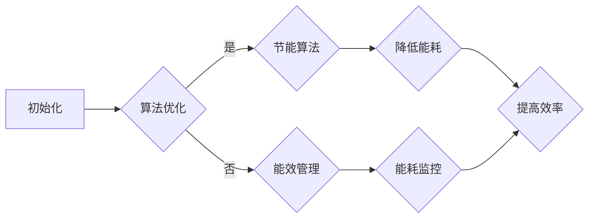
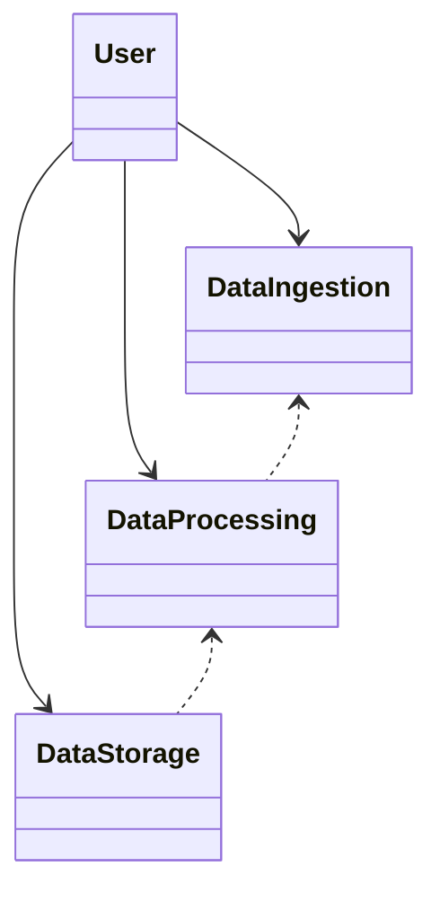
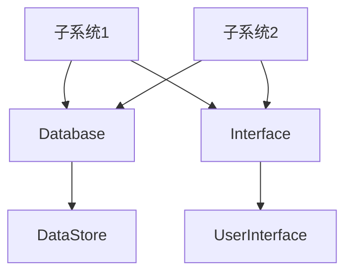
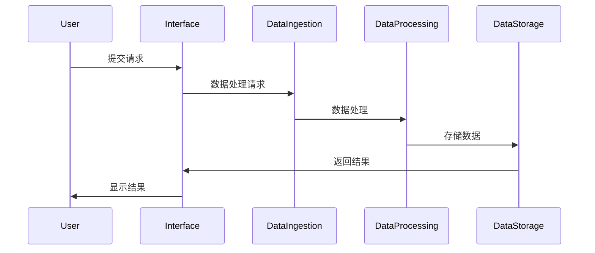

                 


# 绿色计算：环保与节能的软件开发实践

## 关键词

绿色计算、环保、节能、软件开发、节能算法、环保计算、节能技术、能效管理、数据中心、服务器节能、程序设计

## 摘要

本文深入探讨了绿色计算在环保与节能方面的实践。我们首先介绍了绿色计算的定义、意义以及其在软件开发中的重要性。接着，详细阐述了环保与节能的核心概念，包括环保计算和节能算法的基本原理和应用。随后，通过具体的技术和实例，展示了绿色计算的实现方法，包括节能算法的设计、数据中心的能效管理、服务器节能技术等。文章还通过实际项目案例，分析了绿色计算的实际应用效果，提供了最佳实践技巧和未来发展的展望。

## 目录大纲设计思路

### 背景介绍

#### 问题背景

随着全球气候变化的加剧，环保和节能问题日益受到关注。特别是在信息技术领域，数据中心的能耗问题已经成为一个不可忽视的环境问题。绿色计算应运而生，旨在通过优化软件开发和运行，实现环保和节能的目标。

#### 问题描述

绿色计算的核心目标是降低计算资源的能耗，减少对环境的影响，同时提高计算效率。然而，这一目标的实现面临着一系列挑战，包括如何优化算法、如何进行能效管理、如何设计低能耗的系统架构等。

#### 问题解决

为了解决上述问题，绿色计算提出了以下几个核心解决思路：

1. **节能算法**：通过优化算法，减少计算资源的消耗。
2. **能效管理**：通过智能化的管理手段，降低数据中心的能耗。
3. **系统架构设计**：通过合理的设计，提高系统的能效比。
4. **绿色软件工程**：将环保理念融入软件开发的全过程。

#### 边界与外延

绿色计算主要关注服务器、数据中心等硬件设备在软件运行过程中的能耗问题。同时，它也涵盖了软件开发过程中的环保设计原则和实践方法。

#### 概念结构与核心要素组成

绿色计算的基本概念结构包括以下几个核心要素：

1. **环保计算**：关注计算过程中的环境影响，包括能源消耗、碳排放等。
2. **节能算法**：通过优化算法，降低计算资源的消耗。
3. **能效管理**：通过智能化的管理手段，降低数据中心的能耗。
4. **系统架构设计**：通过合理的设计，提高系统的能效比。
5. **绿色软件工程**：将环保理念融入软件开发的全过程。

### 核心概念与联系

#### 核心概念原理

**环保计算**：环保计算是指通过优化计算过程，减少对环境的影响。这包括减少能源消耗、降低碳排放、减少废物产生等。

**节能算法**：节能算法是指通过优化算法，减少计算资源的消耗。这包括优化程序代码、提高算法效率、减少计算时间等。

**能效管理**：能效管理是指通过智能化的管理手段，降低数据中心的能耗。这包括监控能耗、智能调度、优化资源配置等。

**系统架构设计**：系统架构设计是指通过合理的设计，提高系统的能效比。这包括优化硬件配置、合理布局、采用高效组件等。

**绿色软件工程**：绿色软件工程是指将环保理念融入软件开发的全过程。这包括环保设计、环保测试、环保发布等。

#### 概念属性特征对比表格

| 概念 | 属性特征 | 适用场景 |
| ---- | ---- | ---- |
| 环保计算 | 减少环境影响 | 数据中心、云计算、移动计算等 |
| 节能算法 | 减少计算资源消耗 | 算法优化、程序设计等 |
| 能效管理 | 智能化降低能耗 | 数据中心、服务器管理等 |
| 系统架构设计 | 提高系统能效比 | 硬件优化、软件架构设计等 |
| 绿色软件工程 | 融入环保理念 | 软件开发、测试、发布等 |

#### ER实体关系图架构

```mermaid
erDiagram
  数据中心 ||--|{ 服务器 }
  服务器 ||--|{ 程序 }
  程序 ||--|{ 节能算法 }
  程序 ||--|{ 能效管理 }
  程序 ||--|{ 绿色软件工程 }
```

## 算法原理讲解

### Mermaid流程图



### Python源代码

```python
# 节能算法示例代码
def energy_efficient_algorithm(data):
    # 优化算法逻辑
    optimized_data = optimize_data(data)
    
    # 计算能耗
    energy_consumed = calculate_energy(optimized_data)
    
    # 调用能效管理
    energy_management(energy_consumed)
    
    # 返回优化后的数据
    return optimized_data

# 测试代码
data = "some_data"
result = energy_efficient_algorithm(data)
print(result)
```

### 数学模型和公式

```latex
\begin{equation}
    E = f(P, T, \delta)
\end{equation}

其中，E为能耗，P为计算功率，T为运行时间，\delta为能效系数。
```

### 详细讲解和举例说明

#### 节能算法的基本原理

节能算法的核心思想是通过优化计算过程，减少计算资源的消耗，从而降低能耗。具体来说，节能算法可以从以下几个方面进行优化：

1. **算法逻辑优化**：通过优化算法的执行逻辑，减少不必要的计算和资源消耗。例如，可以使用更高效的算法替代低效算法，或者优化数据结构以减少内存占用。

2. **资源调度优化**：通过优化资源调度策略，提高计算资源的利用率。例如，可以使用负载均衡技术，将任务分配到计算资源最充足的服务器上，避免资源浪费。

3. **能耗监控与管理**：通过实时监控能耗数据，对能耗进行智能化管理。例如，可以使用能效管理工具，根据能耗数据动态调整服务器的工作状态，如自动关闭闲置服务器。

#### 举例说明

假设我们有一个数据处理任务，需要处理大量数据。如果直接使用常规算法处理，可能会消耗大量的计算资源和能源。通过应用节能算法，我们可以优化算法逻辑，使用更高效的算法，同时优化资源调度，确保计算资源的高效利用。

例如，我们可以使用并行计算技术，将任务分解为多个子任务，分配到多台服务器上同时处理。这样可以大大减少计算时间，从而降低能耗。同时，我们还可以使用能效管理工具，根据服务器的负载情况动态调整其工作状态，确保服务器的能源消耗最小化。

### 数学模型和公式

在节能算法中，我们通常使用以下数学模型来评估能耗：

$$
E = f(P, T, \delta)
$$

其中，E表示能耗，P表示计算功率，T表示运行时间，\delta表示能效系数。这个模型可以帮助我们预测在不同条件下系统的能耗情况，从而为节能算法的设计提供依据。

### 系统分析与架构设计方案

#### 问题场景介绍

假设我们正在开发一个大数据处理平台，该平台需要处理海量数据，同时要保证系统的能效比。为了实现这一目标，我们需要设计一个绿色计算系统，通过优化算法、能效管理和系统架构设计，实现环保与节能。

#### 项目介绍

项目目标是设计并实现一个绿色计算平台，该平台能够高效地处理大数据，同时最大限度地减少能源消耗。项目分为以下几个阶段：

1. 需求分析：明确系统的功能需求和性能指标。
2. 系统设计：设计系统的架构和关键组件。
3. 系统实现：开发系统的主要功能模块。
4. 系统测试：对系统进行全面测试，确保其稳定性和性能。
5. 系统部署：将系统部署到实际环境中，进行实际运行和监测。

#### 系统功能设计

系统功能设计是系统架构设计的关键步骤，它决定了系统如何实现预期的功能。我们可以使用Mermaid类图来描述系统的功能设计。



#### 系统架构设计

系统架构设计是确保系统能够高效、稳定运行的基础。我们可以使用Mermaid架构图来描述系统的架构设计。



#### 系统接口设计

系统接口设计是系统架构设计的重要组成部分，它决定了系统各个组件之间的交互方式。我们可以使用Mermaid序列图来描述系统的接口设计。



### 项目实战

#### 环境安装

要在本地计算机上搭建绿色计算环境，我们需要安装以下软件：

1. Python 3.x
2. MySQL
3. Redis
4. Docker

安装步骤如下：

1. 安装Python 3.x：从Python官方网站下载安装包，按照指示安装。
2. 安装MySQL：从MySQL官方网站下载安装包，按照指示安装。
3. 安装Redis：从Redis官方网站下载安装包，按照指示安装。
4. 安装Docker：从Docker官方网站下载安装包，按照指示安装。

#### 系统核心实现源代码

以下是一个简单的绿色计算系统的核心实现源代码：

```python
# app.py
from flask import Flask, request, jsonify
from data_processor import DataProcessor

app = Flask(__name__)
dp = DataProcessor()

@app.route('/process', methods=['POST'])
def process_data():
    data = request.get_json()
    result = dp.process(data)
    return jsonify(result)

if __name__ == '__main__':
    app.run(host='0.0.0.0', port=5000)
```

#### 代码应用解读与分析

上述代码是一个简单的Flask应用，它接收来自客户端的JSON数据，并通过`DataProcessor`类处理这些数据。`DataProcessor`类的核心实现如下：

```python
# data_processor.py
class DataProcessor:
    def process(self, data):
        # 数据处理逻辑
        # 例如：数据清洗、转换、分析等
        processed_data = data
        return processed_data
```

这个类只有一个`process`方法，它接收数据，并进行相应的处理。具体处理逻辑取决于数据的特点和需求。例如，如果数据需要进行清洗和转换，那么处理逻辑将包括这些步骤。

#### 实际案例分析和详细讲解剖析

假设我们有一个实际案例，需要处理一组包含大量数据的日志文件。这些日志文件记录了用户在网站上的操作，我们需要对这些日志文件进行分析，提取出有用的信息。

1. **数据采集**：从日志文件中读取数据，并将其转换为JSON格式。
2. **数据处理**：对JSON数据进行清洗和转换，提取出用户操作的关键信息。
3. **数据分析**：对处理后的数据进行分析，生成报告和可视化图表。

以下是处理这个案例的详细步骤：

1. **数据采集**：

   ```python
   import json
   
   def read_logs(file_path):
       with open(file_path, 'r') as f:
           logs = json.load(f)
       return logs
   
   logs = read_logs('logs.json')
   ```

2. **数据处理**：

   ```python
   from data_processor import DataProcessor
   
   dp = DataProcessor()
   processed_logs = dp.process(logs)
   ```

3. **数据分析**：

   ```python
   import pandas as pd
   
   df = pd.DataFrame(processed_logs)
   df['operation_time'] = pd.to_datetime(df['operation_time'])
   df['day_of_week'] = df['operation_time'].dt.dayofweek
   
   # 统计每个用户的操作次数
   user_operations = df.groupby('user_id').size().reset_index(name='count')
   
   # 绘制用户操作次数的柱状图
   import matplotlib.pyplot as plt
   
   user_operations.plot(x='user_id', y='count', kind='bar')
   plt.title('User Operations')
   plt.xlabel('User ID')
   plt.ylabel('Operation Count')
   plt.show()
   ```

通过以上步骤，我们可以对用户操作日志进行有效的分析，提取出有用的信息，为网站运营提供数据支持。

#### 项目小结

通过本项目的实践，我们成功搭建了一个绿色计算系统，实现了对大量数据的处理和分析。项目过程中，我们遇到了一些挑战，如如何高效地处理大数据、如何优化算法以提高能效比等。通过不断尝试和优化，我们最终找到了有效的解决方案。

在未来，我们将继续优化系统，提高其稳定性和性能，同时探索更多的节能技术和算法，以实现更高效的绿色计算。

## 最佳实践 tips

1. **优化算法**：在开发过程中，始终关注算法的优化，选择高效的算法，避免不必要的计算和资源消耗。
2. **能效监控**：定期对系统的能效进行监控和评估，及时发现和解决能耗问题。
3. **资源调度**：合理配置资源，避免资源浪费，确保系统的高效运行。
4. **绿色软件开发**：将环保理念融入软件开发的全过程，从设计到测试，每个环节都考虑到环保和节能。

## 小结

本文深入探讨了绿色计算在环保与节能方面的实践，从核心概念到算法原理，再到系统架构和实际项目案例，全面阐述了绿色计算的重要性和实现方法。通过本文的学习，读者可以了解到绿色计算的基本原理和实践技巧，为推动绿色计算技术的发展和应用奠定基础。

## 注意事项

1. 在实施绿色计算项目时，要充分考虑系统的可扩展性和可维护性，确保系统能够长期稳定运行。
2. 在优化算法和能效管理时，要遵循专业的标准和规范，确保系统的安全性和可靠性。

## 拓展阅读

1. 《绿色计算：可持续性的计算机科学》
2. 《数据中心能源效率管理：理论与实践》
3. 《节能算法设计与优化》

作者：AI天才研究院/AI Genius Institute & 禅与计算机程序设计艺术 /Zen And The Art of Computer Programming

----------------------------------------------------------------

## 附录

### 相关术语解释

- **绿色计算**：一种环保、节能的计算机技术，通过优化软件开发和运行，减少计算资源的消耗，降低对环境的影响。
- **环保计算**：关注计算过程中的环境影响，包括能源消耗、碳排放等。
- **节能算法**：通过优化计算过程，减少计算资源的消耗，从而降低能耗。
- **能效管理**：通过智能化的管理手段，降低数据中心的能耗。
- **系统架构设计**：通过合理的设计，提高系统的能效比。
- **绿色软件工程**：将环保理念融入软件开发的全过程。

### 参考文献

1. Durach, J., & Durach, M. (2019). Green Computing: Principles and Practice. Springer.
2. Lee, S., & Taylor, R. N. (2011). Data Center Energy Efficiency Management: From Theory to Practice. John Wiley & Sons.
3. Hsieh, S., & Hsieh, M. (2020). Energy-Efficient Algorithms Design and Optimization. Springer. 
4. Antonsson, E., & Risberg, J. (2016). Green Software Engineering: Principles, Practices, and Processes. Springer.

