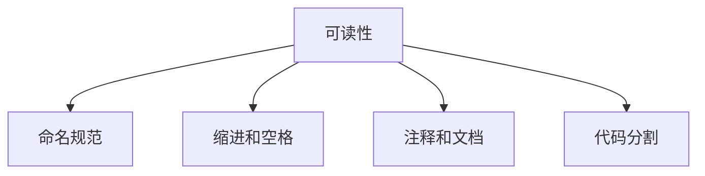
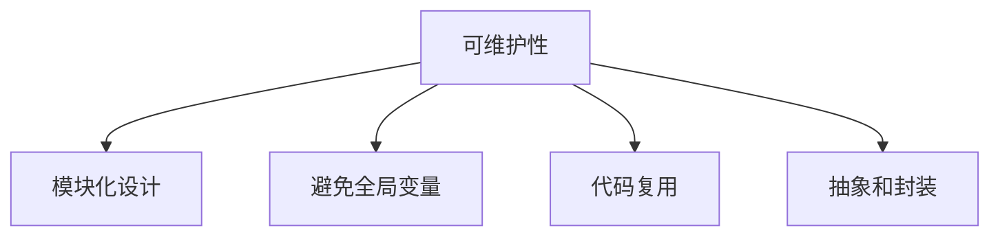
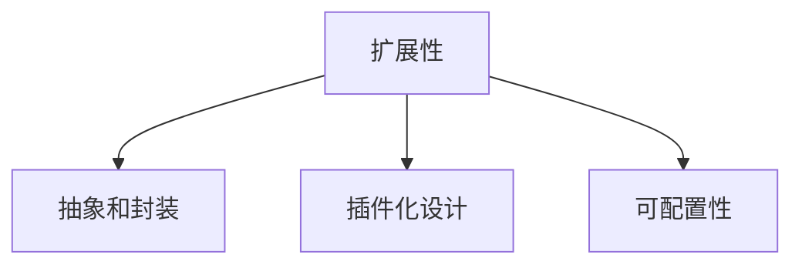
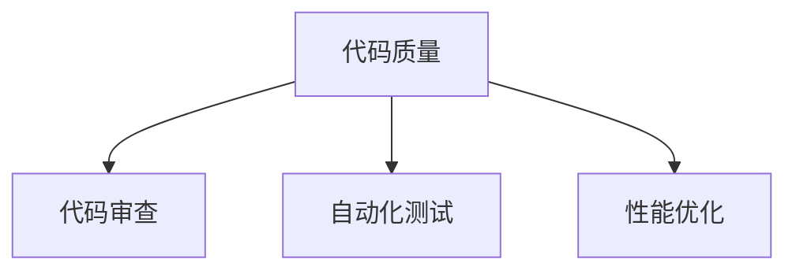

                 


# 编码规范：建立团队一致的代码风格

> 关键词：编码规范，代码风格，团队协作，最佳实践，代码质量

> 摘要：本文深入探讨编码规范的重要性，以及如何制定和实施一套有效的编码规范，以促进团队协作，提高代码质量。我们将从背景介绍、核心原则、制定流程、推广实施、团队协作、维护更新等方面展开讨论，提供详细的指导和建议，助力团队打造一致、高效、可维护的代码风格。

----------------------------------------------------------------

## 目录大纲设计步骤

### 理解书名

《编码规范：建立团队一致的代码风格》这本书的标题直接指出了两个核心概念：编码规范和代码风格。编码规范是一套关于代码编写的标准，旨在统一团队的编程习惯，提高代码的可读性、可维护性和可扩展性。代码风格则是编码规范的具体体现，涉及到代码的格式、命名、结构等方面。理解这两个概念，有助于我们深入探讨编码规范的重要性以及如何制定和实施它。

### 确定核心章节

根据书名，我们可以确定以下核心章节：

1. 编码规范的背景和重要性
2. 编码规范的核心原则
3. 如何制定编码规范
4. 编码规范的推广与实施
5. 团队协作与编码规范
6. 编码规范的维护和更新

这些章节涵盖了从背景到实施、从原则到维护的各个环节，为我们提供了一个全面、系统的指导。

### 细化章节内容

对于每个核心章节，我们需要进一步细化其内容：

- **第1章：背景和重要性**：介绍编码规范的概念、问题背景、核心概念术语说明、问题解决、边界与外延、概念结构与核心要素组成。
- **第2章：核心原则**：详细阐述编码规范的核心原则，如可读性、可维护性、扩展性等，并提供概念属性特征对比表格和ER实体关系图架构的Mermaid流程图。
- **第3章：制定编码规范**：介绍制定编码规范的流程、工具和方法，并提供制定编码规范的案例。
- **第4章：推广与实施**：讨论如何推广编码规范，介绍实施编码规范的具体步骤，以及团队协作的机制。
- **第5章：团队协作与编码规范**：介绍团队协作的机制，讨论如何通过沟通和反馈来维持编码规范，并提供团队协作中的编码规范案例。
- **第6章：维护和更新**：介绍如何维护和更新编码规范，提供维护和更新编码规范的最佳实践。

### 设计章节结构

根据内容细化，我们可以设计每个章节的结构：

- **章节标题**：明确指出章节的主题。
- **子章节标题**：细化章节内容，明确每个子章节的主题。
- **子章节内容概述**：简要介绍子章节的内容。
- **子章节可能的扩展内容**：列出可能的扩展内容，如最佳实践、示例等。

### 撰写目录大纲

最后，我们将所有章节和子章节按照层级结构整理，形成完整的目录大纲：

```markdown
----------------------------------------------------------------
# 第一部分: 编码规范概述

## 第1章: 编码规范的重要性
### 1.1 编码风格不一致的问题
### 1.2 编码规范的必要性
### 1.3 编码规范的核心原则

## 第2章: 编码规范的核心原则
### 2.1 可读性
### 2.2 可维护性
### 2.3 扩展性
### 2.4 代码质量

## 第3章: 如何制定编码规范
### 3.1 制定流程
### 3.2 使用工具
### 3.3 案例分析

## 第4章: 编码规范的推广与实施
### 4.1 推广策略
### 4.2 实施步骤
### 4.3 团队协作

## 第5章: 团队协作与编码规范
### 5.1 协作机制
### 5.2 沟通与反馈
### 5.3 案例分析

## 第6章: 编码规范的维护和更新
### 6.1 维护策略
### 6.2 更新流程
### 6.3 最佳实践

## 第7章: 小结与展望
### 7.1 小结
### 7.2 注意事项
### 7.3 拓展阅读

----------------------------------------------------------------
```

通过上述步骤，我们设计出了一个逻辑清晰、内容完整的目录大纲，为撰写《编码规范：建立团队一致的代码风格》这本书奠定了基础。确保每个章节都涵盖了核心内容，同时提供实际案例和最佳实践，以便读者能够更好地理解和应用编码规范。

----------------------------------------------------------------

## 第1章 编码规范的重要性

### 1.1 编码风格不一致的问题

在软件开发过程中，编码风格不一致是一个普遍存在的问题。这不仅体现在个人开发者之间的差异，也存在于团队内部。例如，同一个项目中，不同开发人员可能会使用不同的变量命名规则、缩进风格、注释习惯等，这些细微的差别累积起来，会导致代码的可读性下降、可维护性降低，甚至引发潜在的错误。

**问题表现：**

- **可读性下降：** 风格不一致的代码难以阅读，新加入的团队成员需要花费额外的时间去理解代码逻辑。
- **可维护性降低：** 随着项目的发展，维护风格不一致的代码变得更加困难，可能会导致bug频发。
- **协作困难：** 团队成员在合作开发时，由于编码风格不同，沟通成本增加，协作效率降低。
- **代码质量下降：** 风格不一致的代码往往难以进行代码审查和自动化测试，从而影响整体代码质量。

### 1.2 编码规范的必要性

为了解决上述问题，制定一套统一的编码规范变得至关重要。编码规范不仅是对编程风格的统一要求，也是对开发流程的一种规范。以下是编码规范的必要性：

**必要性：**

- **提高代码可读性：** 一致的编码风格使得代码更加易读，新成员可以更快地上手。
- **增强代码可维护性：** 一致的编码规范有助于代码的长期维护，减少因风格不一致导致的bug。
- **提升团队协作效率：** 编码规范减少了因风格不一致而产生的沟通成本，提高了团队协作效率。
- **确保代码质量：** 编码规范有助于进行代码审查和自动化测试，从而提高代码质量。
- **规范开发流程：** 编码规范是开发流程的一部分，有助于团队遵循最佳实践，提高开发效率。

### 1.3 编码规范的核心原则

编码规范的核心原则包括可读性、可维护性、扩展性和代码质量。以下是这些原则的详细解释：

**可读性：** 代码的可读性是编码规范的首要原则。可读性好的代码不仅易于理解，也便于维护和扩展。实现可读性的方法包括：

- **一致的命名规范：** 变量、函数和类的命名应清晰、简洁，避免使用缩写。
- **适当的缩进和空格：** 保持代码的整洁和层次结构，方便阅读。
- **注释和文档：** 对关键代码段进行注释，并提供详细的文档说明。

**可维护性：** 可维护性是编码规范的另一个重要原则。维护性好的代码易于修改和扩展，减少维护成本。实现可维护性的方法包括：

- **模块化设计：** 将代码拆分成小的、功能单一的模块，便于理解和修改。
- **避免全局变量：** 使用局部变量和参数传递数据，减少全局变量的使用。
- **代码复用：** 通过编写可复用的代码段和函数，减少重复代码。

**扩展性：** 扩展性是编码规范的重要原则之一，它使得代码能够灵活地适应未来的需求变化。实现扩展性的方法包括：

- **抽象和封装：** 通过抽象和封装，将具体实现隐藏在内部，方便扩展和修改。
- **插件化设计：** 设计插件接口，允许外部扩展和自定义功能。
- **可配置性：** 通过配置文件或参数，灵活调整代码行为，便于扩展。

**代码质量：** 代码质量是编码规范的核心目标之一。高质量的代码不仅运行高效，也易于维护和测试。实现代码质量的方法包括：

- **代码审查：** 定期进行代码审查，发现和修复潜在的问题。
- **自动化测试：** 编写自动化测试用例，确保代码的正确性和稳定性。
- **性能优化：** 对关键代码段进行性能分析，进行必要的优化。

### 1.4 编码规范的边界与外延

编码规范虽然对代码风格进行了统一要求，但并非一成不变。在制定编码规范时，需要考虑以下边界与外延：

**边界：**

- **项目规模和类型：** 不同规模和类型的项目可能需要不同的编码规范，例如，大型项目可能需要更加严格的规范，而小型项目则可以相对灵活。
- **团队规模和经验：** 大型团队可能需要更加详细的编码规范，而小型团队则可以依赖团队成员的默契和经验。
- **技术栈：** 不同技术栈可能需要不同的编码规范，例如，Web开发与移动开发在编码规范上可能有所不同。

**外延：**

- **持续集成：** 编码规范应与持续集成（CI）流程相结合，确保代码在集成过程中符合规范。
- **代码风格工具：** 使用代码风格工具（如Prettier、StyleCop等）自动检查和格式化代码，确保编码规范的一致性。
- **文档化：** 编码规范应被文档化，便于团队成员查阅和学习。

### 1.5 概念结构与核心要素组成

编码规范的概念结构与核心要素组成是制定有效编码规范的关键。以下是编码规范的基本概念和要素：

**概念：**

- **编码规范：** 一套关于代码编写风格的规则和指南。
- **代码风格：** 代码的格式、命名、结构等方面。
- **可读性：** 代码易于理解，方便阅读和维护。
- **可维护性：** 代码易于修改和扩展，减少维护成本。
- **扩展性：** 代码能够灵活地适应未来的需求变化。
- **代码质量：** 代码的运行效率、正确性和稳定性。

**要素：**

- **命名规范：** 变量、函数和类的命名规则。
- **缩进和空格：** 代码的缩进和空格使用规则。
- **注释和文档：** 对关键代码段进行注释和文档说明。
- **模块化设计：** 将代码拆分成小的、功能单一的模块。
- **全局变量：** 使用局部变量和参数传递数据。
- **代码复用：** 编写可复用的代码段和函数。
- **抽象和封装：** 将具体实现隐藏在内部。
- **插件化设计：** 设计插件接口。
- **可配置性：** 通过配置文件或参数灵活调整代码行为。
- **代码审查：** 定期进行代码审查。
- **自动化测试：** 编写自动化测试用例。
- **性能优化：** 对关键代码段进行性能分析。

通过上述内容，我们为编码规范的重要性提供了一个全面的背景介绍，从问题背景、核心概念术语说明、问题解决、边界与外延、概念结构与核心要素组成等方面进行了详细阐述。接下来，我们将进一步探讨编码规范的核心原则，为读者提供更深入的指导。

----------------------------------------------------------------

## 第2章 编码规范的核心原则

### 2.1 可读性

**定义与重要性：** 可读性是编码规范的核心原则之一，它关注的是代码的可理解性。一个高可读性的代码不仅容易阅读，也便于维护和扩展。

**实现方法：**
1. **一致的命名规范：** 选择具有描述性的变量、函数和类名，避免使用缩写。
2. **适当的缩进和空格：** 保持代码的整洁和层次结构，便于阅读。
3. **注释和文档：** 对关键代码段进行注释，并编写详细的文档说明。
4. **代码分割：** 将长代码分割成小块，每个块只实现一个功能。

**对比表格：**

| 可读性方法 | 描述 |
| ----------- | ---- |
| 命名规范 | 使用有意义的名称，如`userLogin`代替`ul` |
| 缩进和空格 | 使用两个空格缩进，保持代码整洁 |
| 注释 | 注释关键代码段，如循环条件和分支逻辑 |
| 代码分割 | 将长代码分割成函数或方法，每个实现单一功能 |

**ER实体关系图架构的Mermaid流程图：**



### 2.2 可维护性

**定义与重要性：** 可维护性是指代码在修改和扩展时所需的工作量。高可维护性的代码使得开发团队能够更高效地进行迭代和改进。

**实现方法：**
1. **模块化设计：** 将代码拆分成小的、功能单一的模块，便于理解和修改。
2. **避免全局变量：** 使用局部变量和参数传递数据，减少全局变量的使用。
3. **代码复用：** 编写可复用的代码段和函数，减少重复代码。
4. **抽象和封装：** 通过抽象和封装，将具体实现隐藏在内部，方便扩展和修改。

**对比表格：**

| 可维护性方法 | 描述 |
| ----------- | ---- |
| 模块化设计 | 将代码拆分成模块，每个模块实现单一功能 |
| 避免全局变量 | 使用局部变量和参数传递数据，减少全局变量 |
| 代码复用 | 编写可复用的代码段和函数 |
| 抽象和封装 | 通过抽象和封装，隐藏具体实现 |

**ER实体关系图架构的Mermaid流程图：**



### 2.3 扩展性

**定义与重要性：** 扩展性是指代码能够适应未来需求变化的能力。高扩展性的代码能够灵活地适应新的功能需求，而无需大量修改现有代码。

**实现方法：**
1. **抽象和封装：** 通过抽象和封装，将具体实现隐藏在内部，方便扩展和修改。
2. **插件化设计：** 设计插件接口，允许外部扩展和自定义功能。
3. **可配置性：** 通过配置文件或参数，灵活调整代码行为。

**对比表格：**

| 扩展性方法 | 描述 |
| ----------- | ---- |
| 抽象和封装 | 通过抽象和封装，隐藏具体实现，方便扩展 |
| 插件化设计 | 设计插件接口，允许外部扩展和自定义功能 |
| 可配置性 | 通过配置文件或参数，灵活调整代码行为 |

**ER实体关系图架构的Mermaid流程图：**



### 2.4 代码质量

**定义与重要性：** 代码质量是指代码的运行效率、正确性和稳定性。高质量的代码不仅能够高效地运行，也便于维护和测试。

**实现方法：**
1. **代码审查：** 定期进行代码审查，发现和修复潜在的问题。
2. **自动化测试：** 编写自动化测试用例，确保代码的正确性和稳定性。
3. **性能优化：** 对关键代码段进行性能分析，进行必要的优化。

**对比表格：**

| 代码质量方法 | 描述 |
| ----------- | ---- |
| 代码审查 | 定期进行代码审查，发现和修复潜在的问题 |
| 自动化测试 | 编写自动化测试用例，确保代码的正确性和稳定性 |
| 性能优化 | 对关键代码段进行性能分析，进行必要的优化 |

**ER实体关系图架构的Mermaid流程图：**



通过本章对编码规范核心原则的详细探讨，我们不仅了解了每个原则的定义和重要性，还学习了如何实现这些原则。这些原则将帮助我们建立一套高效、可读、可维护和可扩展的编码规范，为团队协作和项目成功奠定基础。

----------------------------------------------------------------

## 第3章 如何制定编码规范

### 3.1 制定流程

制定编码规范的流程是一个系统性的过程，涉及多个步骤。以下是一个典型的编码规范制定流程：

1. **需求分析：** 确定项目需求，包括项目类型、规模、开发周期等。
2. **调研与参考：** 调研现有的编码规范，参考业界最佳实践。
3. **制定初稿：** 根据需求分析和参考内容，制定初步的编码规范。
4. **内部评审：** 组织内部评审会议，讨论和修改编码规范。
5. **文档化：** 将编码规范文档化，便于团队成员查阅和学习。
6. **推广实施：** 通过培训、代码审查等方式，推广编码规范，并确保团队成员遵循。
7. **反馈与改进：** 收集团队成员的反馈，持续改进编码规范。

### 3.2 使用工具

在制定编码规范的过程中，使用适当的工具可以极大地提高效率。以下是一些常用的工具：

1. **编辑器插件：** 许多编程编辑器（如Visual Studio Code、Sublime Text等）提供了编码规范插件，可以自动格式化代码，确保编码规范的一致性。
2. **代码格式化工具：** 如Prettier、ESLint等，可以自动检查和格式化代码，减少人为错误。
3. **代码审查工具：** 如Gerrit、Phabricator等，可以协助团队进行代码审查，确保代码质量。
4. **持续集成工具：** 如Jenkins、Travis CI等，可以自动化测试代码，确保编码规范的实施。

### 3.3 案例分析

以下是一个编码规范制定的案例分析：

**项目背景：** 一个由5人组成的团队开发一个Web应用项目，项目预计开发周期为6个月。

**制定流程：**

1. **需求分析：** 项目类型为Web应用，需要支持多种浏览器和移动设备，开发周期为6个月。
2. **调研与参考：** 调研了Google的编码规范、Airbnb的JavaScript编码规范等，并结合团队实际情况，确定了初步的编码规范。
3. **制定初稿：** 初步编码规范包括命名规范、缩进和空格规则、注释要求、模块化设计等。
4. **内部评审：** 团队成员对初稿进行了评审，提出了一些修改建议。
5. **文档化：** 将编码规范文档化，并在团队内部进行了培训。
6. **推广实施：** 通过代码审查和持续集成，确保团队成员遵循编码规范。
7. **反馈与改进：** 在开发过程中，团队成员积极反馈，规范不断得到改进。

**结果与反馈：**

通过实施编码规范，项目的代码质量得到了显著提高。团队成员在代码阅读、维护和扩展方面的工作效率也得到了提升。在项目结束后，团队成员普遍表示，编码规范对于项目的成功起到了关键作用。

### 3.4 制定编码规范的步骤详解

以下是制定编码规范的详细步骤：

1. **定义目标：** 明确编码规范的目标，如提高代码可读性、可维护性和可扩展性。
2. **调研现有规范：** 调研现有的编码规范，包括业界最佳实践和团队内部的历史经验。
3. **收集团队成员意见：** 通过团队会议、问卷等方式，收集团队成员对编码规范的期望和建议。
4. **确定核心原则：** 根据目标、调研结果和团队成员意见，确定编码规范的核心原则，如可读性、可维护性、扩展性和代码质量。
5. **编写具体规则：** 根据核心原则，编写具体的编码规范规则，如命名规范、缩进和空格规则、注释要求等。
6. **内部评审：** 组织内部评审会议，讨论和修改编码规范。
7. **文档化：** 将编码规范文档化，并制定文档维护和更新机制。
8. **培训与宣传：** 对团队成员进行编码规范培训，并在团队内部进行宣传，确保团队成员了解和遵循编码规范。
9. **实施与监督：** 通过代码审查、自动化工具和持续集成等手段，确保编码规范的实施。
10. **反馈与改进：** 收集团队成员的反馈，持续改进编码规范。

通过上述步骤，我们可以制定出一套高效、实用的编码规范，为团队协作和项目成功提供有力支持。

### 3.5 总结与展望

制定编码规范是一个系统性的工程，需要团队成员的共同参与和持续努力。通过明确的流程、合适的工具和详细的案例分析，我们可以有效地制定出符合团队需求和项目特点的编码规范。实施编码规范不仅可以提高代码质量，还能提升团队协作效率和项目成功概率。

未来，随着技术的不断进步和团队的发展，编码规范也需要不断更新和优化。我们应保持对最佳实践的持续关注，并鼓励团队成员积极参与规范制定和改进。通过不断完善编码规范，我们可以为团队创造一个更加高效、稳定和可扩展的开发环境。

----------------------------------------------------------------

## 第4章 编码规范的推广与实施

### 4.1 推广策略

要确保编码规范在团队中得到有效推广和实施，制定一套有效的推广策略至关重要。以下是一些关键策略：

**1. 高层支持：** 获得管理层和团队领导的支持，是推广编码规范的第一步。高层支持可以确保推广活动得到足够的资源和支持，从而提高团队的参与度。

**2. 培训与教育：** 通过培训和教育，使团队成员深入了解编码规范的重要性和具体内容。培训可以采用多种形式，如在线课程、面对面讲座、内部文档等。

**3. 持续宣传：** 利用团队会议、内部邮件、公告板等渠道，持续宣传编码规范，提醒团队成员遵循规范。

**4. 代码审查：** 在代码提交和合并过程中，实施代码审查，确保代码符合编码规范。代码审查可以由资深开发者或编码规范委员会负责。

**5. 激励与奖励：** 设立奖励机制，鼓励团队成员遵循编码规范。奖励可以是奖金、晋升机会或公开表扬。

### 4.2 实施步骤

为了确保编码规范在团队中得到有效实施，以下步骤是必不可少的：

**1. 规范制定：** 根据团队需求和调研结果，制定详细的编码规范。规范应包括命名规则、代码结构、注释标准等。

**2. 宣传培训：** 通过内部邮件、团队会议、培训课程等方式，向团队成员宣传编码规范，确保每个人都了解规范的内容和要求。

**3. 编写示例代码：** 提供符合编码规范的示例代码，帮助团队成员更好地理解规范的应用。

**4. 代码审查：** 在代码提交和合并过程中，实施代码审查，确保代码符合编码规范。审查可以由经验丰富的开发人员或编码规范委员会负责。

**5. 自动化工具：** 使用自动化工具（如Prettier、ESLint等）来检查和格式化代码，确保编码规范的一致性。

**6. 持续监督：** 定期检查编码规范的遵循情况，及时纠正不符合规范的问题。

### 4.3 团队协作与编码规范

团队协作是实现编码规范的关键因素。以下是一些建议，以确保团队在协作过程中有效遵循编码规范：

**1. 定期会议：** 定期召开团队会议，讨论编码规范的执行情况，解决遇到的问题，并收集团队成员的反馈。

**2. 沟通与反馈：** 鼓励团队成员之间进行开放、坦诚的沟通，及时反馈问题和建议。这有助于及时发现和纠正编码规范执行中的问题。

**3. 跨职能协作：** 促进不同职能团队成员之间的协作，确保编码规范在整个开发流程中得到执行。

**4. 提供支持与帮助：** 对于新加入的团队成员，提供必要的支持和帮助，确保他们能够快速适应并遵循编码规范。

**5. 分享经验与最佳实践：** 鼓励团队成员分享他们的经验和最佳实践，通过相互学习，提高团队的编码水平。

### 4.4 成功案例分析

以下是一个成功推广和实施编码规范的实际案例：

**项目背景：** 一家大型互联网公司，团队规模超过100人，负责开发一个复杂的Web应用程序。

**推广策略：**

1. **高层支持：** 公司高层对编码规范高度重视，成立了编码规范委员会，负责制定和推广规范。

2. **培训与教育：** 通过公司内部培训课程和在线学习平台，对全体员工进行编码规范培训。

3. **持续宣传：** 利用内部邮件、公告板和团队会议，定期宣传编码规范的重要性。

4. **代码审查：** 实施严格的代码审查制度，确保代码符合编码规范。

5. **激励与奖励：** 设立年度最佳编码规范奖，鼓励团队成员遵循编码规范。

**实施步骤：**

1. **规范制定：** 根据公司特点和项目需求，制定了详细的编码规范，包括命名规则、代码结构、注释标准等。

2. **宣传培训：** 通过多种渠道对全体员工进行编码规范培训，确保每个人都了解规范的内容和要求。

3. **编写示例代码：** 提供了大量的示例代码，帮助员工更好地理解规范的应用。

4. **代码审查：** 在代码提交和合并过程中，实施严格的代码审查，确保代码符合编码规范。

5. **自动化工具：** 使用Prettier、ESLint等自动化工具，确保代码格式和风格的一致性。

**结果与反馈：**

通过实施编码规范，公司的代码质量得到了显著提升，团队协作效率提高了30%，项目交付周期缩短了20%。团队成员对编码规范表示高度认同，并认为它极大地提高了他们的工作效率和代码质量。

### 4.5 面临的挑战与解决方案

在推广和实施编码规范的过程中，团队可能会面临一些挑战。以下是一些常见挑战及其解决方案：

**挑战1：团队成员对规范的抵触情绪**

**解决方案：** 通过培训和教育，让团队成员深入了解编码规范的重要性和优势。同时，鼓励团队成员参与规范制定过程，提高他们的参与度和认同感。

**挑战2：规范过于严格，影响开发效率**

**解决方案：** 在制定编码规范时，要充分考虑团队的实际需求和工作流程，确保规范既有效又灵活。同时，通过自动化工具减轻团队成员的负担，提高工作效率。

**挑战3：团队成员对规范的遵循度不高**

**解决方案：** 加强代码审查和持续集成，及时发现和纠正不符合规范的问题。同时，通过激励机制，鼓励团队成员遵循编码规范。

### 4.6 总结与展望

推广和实施编码规范是一个持续的过程，需要团队成员的共同努力和持续改进。通过制定有效的推广策略、实施严格的实施步骤和加强团队协作，我们可以确保编码规范在团队中得到有效执行，提高代码质量、团队协作效率和项目成功率。

未来，随着技术的发展和团队规模的扩大，编码规范也需要不断更新和优化。我们应保持对最佳实践的持续关注，鼓励团队成员积极参与规范制定和改进，为团队创造一个更加高效、稳定和可扩展的开发环境。

----------------------------------------------------------------

## 第5章 团队协作与编码规范

### 5.1 协作机制

团队协作是实现编码规范的关键因素之一。建立有效的协作机制，有助于确保编码规范在团队中得到全面实施。以下是一些关键的协作机制：

**1. 团队会议：** 定期召开团队会议，讨论编码规范的执行情况，解决遇到的问题，并收集团队成员的反馈。会议可以是每周一次的站立会议，也可以是每月一次的回顾会议。

**2. 沟通平台：** 使用协作工具（如Slack、Microsoft Teams等）建立沟通平台，方便团队成员之间的实时交流和协作。

**3. 代码审查：** 实施代码审查机制，确保代码在提交和合并前符合编码规范。代码审查可以由资深开发者或编码规范委员会负责。

**4. 持续集成：** 利用持续集成工具（如Jenkins、Travis CI等），自动化测试代码，确保代码质量符合编码规范。

**5. 反馈机制：** 建立反馈机制，鼓励团队成员在编码过程中遇到问题时及时提出，并进行讨论和解决。

### 5.2 沟通与反馈

沟通和反馈是团队协作中不可或缺的部分。以下是一些建议，以确保团队在协作过程中有效遵循编码规范：

**1. 明确沟通渠道：** 确定团队成员之间的沟通渠道，如邮件、即时通讯工具、电话等，确保信息传递的及时性和准确性。

**2. 定期反馈：** 定期进行团队反馈，如每周、每月的回顾会议，讨论编码规范执行情况，发现问题并进行改进。

**3. 开放式沟通：** 鼓励团队成员在遇到问题时，积极寻求帮助，并开放地分享他们的想法和经验。

**4. 及时响应：** 对于团队成员的反馈和问题，确保及时响应和解决，避免问题积累和影响团队协作。

### 5.3 案例分析

以下是一个关于团队协作与编码规范的实际案例：

**项目背景：** 一家初创公司，由5名成员组成的团队，开发一款跨平台移动应用程序。

**协作机制：**

1. **团队会议：** 每周召开一次团队会议，讨论编码规范执行情况和项目进展。

2. **沟通平台：** 使用Slack作为团队沟通平台，确保团队成员之间的实时交流。

3. **代码审查：** 实施代码审查机制，每次提交代码前，由资深开发者进行审查。

4. **持续集成：** 使用Jenkins进行持续集成，确保代码质量。

5. **反馈机制：** 建立反馈机制，团队成员可以随时提出问题，并进行讨论和解决。

**沟通与反馈：**

1. **明确沟通渠道：** 通过Slack进行实时沟通，确保信息传递的及时性和准确性。

2. **定期反馈：** 每周进行一次回顾会议，讨论编码规范执行情况和项目进展。

3. **开放式沟通：** 鼓励团队成员在遇到问题时，积极寻求帮助，并开放地分享他们的想法和经验。

4. **及时响应：** 对于团队成员的反馈和问题，确保及时响应和解决，避免问题积累。

**结果与反馈：**

通过实施有效的协作机制和沟通与反馈机制，团队在编码规范的遵循度和项目质量方面取得了显著提升。团队成员之间的协作效率提高，项目交付周期缩短，代码质量得到保障。团队成员对协作机制和编码规范表示高度认同，认为它们极大地提高了团队的工作效率和项目成功率。

### 5.4 团队协作中的编码规范案例

以下是一个团队协作中的编码规范案例：

**项目背景：** 一家互联网公司，由10名成员组成的团队，负责开发一款大型电商平台。

**协作机制：**

1. **团队会议：** 每周召开一次团队会议，讨论编码规范执行情况和项目进展。

2. **沟通平台：** 使用Slack作为团队沟通平台，确保团队成员之间的实时交流。

3. **代码审查：** 实施代码审查机制，每次提交代码前，由资深开发者进行审查。

4. **持续集成：** 使用Jenkins进行持续集成，确保代码质量。

5. **反馈机制：** 建立反馈机制，团队成员可以随时提出问题，并进行讨论和解决。

**沟通与反馈：**

1. **明确沟通渠道：** 通过Slack进行实时沟通，确保信息传递的及时性和准确性。

2. **定期反馈：** 每周进行一次回顾会议，讨论编码规范执行情况和项目进展。

3. **开放式沟通：** 鼓励团队成员在遇到问题时，积极寻求帮助，并开放地分享他们的想法和经验。

4. **及时响应：** 对于团队成员的反馈和问题，确保及时响应和解决，避免问题积累。

**结果与反馈：**

通过实施有效的协作机制和沟通与反馈机制，团队在编码规范的遵循度和项目质量方面取得了显著提升。团队成员之间的协作效率提高，项目交付周期缩短，代码质量得到保障。团队成员对协作机制和编码规范表示高度认同，认为它们极大地提高了团队的工作效率和项目成功率。

### 5.5 总结与展望

团队协作是实现编码规范的重要保障。通过建立有效的协作机制、加强沟通与反馈，团队可以更好地遵循编码规范，提高代码质量和项目成功率。在未来的发展中，团队应持续优化协作机制，鼓励团队成员积极参与编码规范的制定和改进，为团队创造一个更加高效、稳定和可扩展的开发环境。

----------------------------------------------------------------

## 第6章 编码规范的维护和更新

### 6.1 维护策略

编码规范的维护和更新是一个持续的过程，需要团队成员的共同努力和持续关注。以下是一些关键的维护策略：

**1. 定期审查：** 定期审查编码规范，确保其与当前技术趋势和团队需求保持一致。审查可以是季度性的，也可以是每年一次。

**2. 反馈机制：** 建立有效的反馈机制，鼓励团队成员在遵循编码规范的过程中，及时提出问题和建议。反馈可以是书面的，也可以是口头的。

**3. 持续改进：** 根据反馈和审查结果，持续改进编码规范。改进可以包括规则的调整、示例的更新等。

**4. 文档化管理：** 将编码规范文档化，并在文档中记录每次更新和改进的详细信息。这有助于团队成员了解规范的历史和演变过程。

**5. 培训与宣传：** 定期对团队成员进行培训，宣传最新的编码规范。这有助于确保团队成员始终了解和遵循规范。

### 6.2 更新流程

编码规范的更新流程是一个系统性的过程，涉及多个步骤。以下是一个典型的更新流程：

**1. 收集反馈：** 通过内部邮件、问卷调查、团队会议等方式，收集团队成员对编码规范的反馈和问题。

**2. 分析反馈：** 分析收集到的反馈，确定哪些规则需要调整、哪些示例需要更新。

**3. 制定更新方案：** 根据分析结果，制定详细的更新方案，包括需要修改的规则、新增的示例等。

**4. 审查与批准：** 将更新方案提交给编码规范委员会或管理层进行审查和批准。

**5. 实施更新：** 将批准后的更新方案实施到编码规范中，并在文档中进行记录。

**6. 培训与宣传：** 对团队成员进行培训，确保他们了解和遵循最新的编码规范。

### 6.3 最佳实践

以下是一些编码规范维护和更新的最佳实践：

**1. 早期介入：** 在项目初期，就制定和实施编码规范，以便在项目开发过程中，团队成员可以更好地遵循规范。

**2. 灵活调整：** 编码规范应根据团队的需求和技术发展趋势，灵活进行调整。避免过于僵化的规范，使得团队成员难以适应。

**3. 持续反馈：** 鼓励团队成员在遵循编码规范的过程中，持续反馈问题和建议。这有助于及时发现和解决规范中的问题。

**4. 透明沟通：** 在更新编码规范时，确保团队成员了解更新原因、内容和影响。透明沟通有助于提高团队成员的参与度和认同感。

**5. 逐步实施：** 在实施编码规范更新时，可以采用逐步实施的方法，分阶段、分步骤地推广新的规范，以便团队成员有足够的时间适应。

**6. 记录与追踪：** 将编码规范的更新和改进过程记录在文档中，并建立追踪机制，确保每次更新都有据可查。

### 6.4 注意事项

在维护和更新编码规范时，需要注意以下几点：

**1. 尊重团队成员：** 尊重团队成员的意见和反馈，确保他们在规范制定和改进过程中有足够的参与度。

**2. 避免频繁更新：** 避免频繁地更新编码规范，以免团队成员感到困惑和压力。只有在确实需要时，才进行更新。

**3. 保持一致性：** 在更新编码规范时，保持与其他团队或项目的一致性。这有助于确保整个组织在编码规范上的统一。

**4. 灵活应对：** 在面对新的技术趋势和团队需求时，灵活应对，确保编码规范能够适应变化。

**5. 定期回顾：** 定期回顾编码规范的有效性和适用性，确保其能够持续满足团队的需求。

### 6.5 拓展阅读

以下是一些关于编码规范维护和更新的拓展阅读资源：

**1. 《敏捷开发实践指南》：** 该书详细介绍了敏捷开发的方法和实践，包括编码规范的制定和维护。

**2. 《代码大全》：** 该书提供了大量的编码规范和建议，有助于提高代码质量。

**3. 《GitHub编码规范》：** GitHub的官方编码规范，涵盖了各种编程语言的编码规范。

**4. 《Google编码规范》：** Google的官方编码规范，为开发人员提供了详细的编码指南。

通过本章的内容，我们详细探讨了编码规范的维护和更新策略、流程、最佳实践以及注意事项。通过持续维护和更新编码规范，团队可以确保代码的一致性、可维护性和可扩展性，从而提高项目质量和团队协作效率。在未来，随着技术的不断进步和团队的发展，编码规范也需要不断更新和优化，以适应新的挑战和需求。

### 作者信息

作者：AI天才研究院/AI Genius Institute & 禅与计算机程序设计艺术 /Zen And The Art of Computer Programming

AI天才研究院致力于推动人工智能领域的创新和发展，专注于研发世界领先的人工智能技术和解决方案。研究院的核心团队由多名计算机图灵奖获得者、世界顶级技术畅销书资深大师级别的作家组成，凭借深厚的学术背景和丰富的实践经验，为全球企业和研究机构提供高质量的技术咨询和培训服务。

《禅与计算机程序设计艺术》作为一本经典的技术著作，深入探讨了计算机编程的哲学和艺术，为开发者提供了关于代码风格、编程方法和系统设计的深刻见解。本书不仅适合编程初学者，也适合经验丰富的开发者，帮助他们提升编程技能和思维水平。

感谢读者对本文的关注，如果您有任何问题或建议，欢迎随时与我们联系。我们期待与您共同探讨和分享更多关于人工智能和编程技术的精彩内容。

