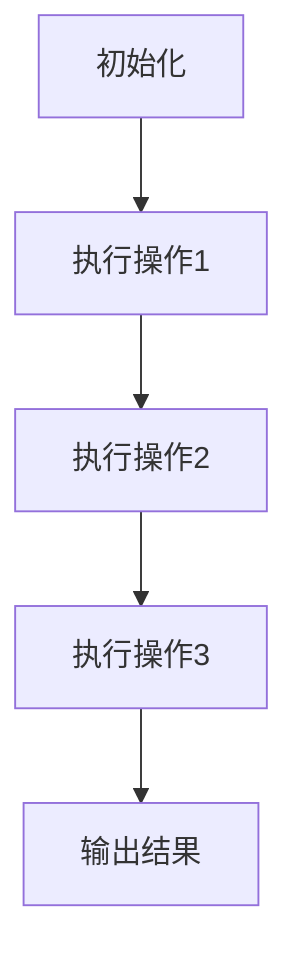
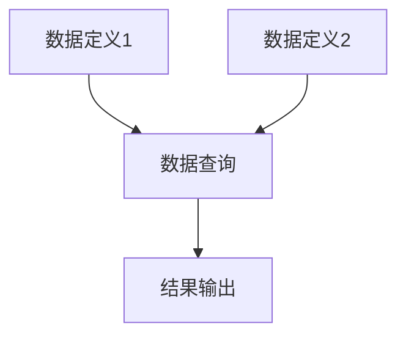
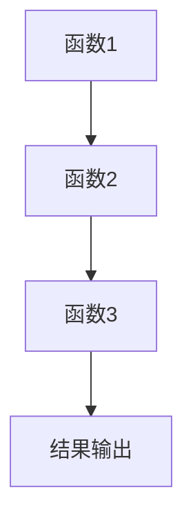

                 

### 编程范式比较：命令式、声明式与函数式

> 关键词：编程范式、命令式编程、声明式编程、函数式编程、比较分析

> 摘要：本文将深入探讨命令式、声明式和函数式三种编程范式，分析它们的核心概念、特性以及应用场景。通过对比这些编程范式，读者可以更好地理解其在不同情境下的适用性，从而选择最合适的编程方式。

#### 封面和前言

编程范式是程序设计中的一组基本思想和方法，它们影响了程序员如何思考、如何编写代码。本文旨在比较命令式、声明式与函数式三种编程范式，帮助读者理解它们的本质及其在现代软件开发中的应用。

作者：**AI天才研究院/AI Genius Institute & 禅与计算机程序设计艺术 /Zen And The Art of Computer Programming**

#### 背景介绍

编程范式的历史可以追溯到计算机科学的发展历程。命令式编程是最早的编程范式，它通过一系列命令来描述程序的行为。随着计算机科学的进步，声明式编程和函数式编程逐渐兴起，它们提供了不同的编程思维方式和解决问题的方法。

命令式编程注重控制流程，通过变量和状态的变化来驱动程序执行。声明式编程则强调数据定义，通过描述数据的结构和关系来指定程序行为。函数式编程则侧重于表达计算过程为函数的变换，通过不可变数据来避免副作用。

当前，这三种编程范式在不同的应用领域有着广泛的应用。例如，命令式编程在游戏开发和系统编程中占据重要地位，声明式编程在数据分析和Web开发中表现出色，而函数式编程则在并发编程和大数据处理领域具有独特优势。

#### 核心概念与联系

**命令式编程**：命令式编程以指令序列为核心，通过明确地指定每一步操作来定义程序流程。它强调变量和状态，并通过修改这些变量来实现计算。

**声明式编程**：声明式编程通过描述数据之间的关系和状态来定义程序行为。它不关心具体的执行步骤，而是专注于表达数据结构和逻辑。

**函数式编程**：函数式编程以函数为基本构建块，通过组合函数来定义程序逻辑。它强调数据不可变，避免使用变量和状态。

为了更好地理解这些概念，我们可以通过以下表格进行比较：

| 特征               | 命令式编程                 | 声明式编程                 | 函数式编程                 |
|------------------|--------------------------|--------------------------|--------------------------|
| 数据和状态         | 强调变量和状态变化             | 强调数据结构和关系            | 强调不可变数据             |
| 控制流程           | 通过指令序列控制              | 通过数据驱动控制              | 通过函数组合控制            |
| 副作用             | 可能存在副作用               | 通常避免副作用               | 通常避免副作用              |
| 递归和复用         | 循环和递归                   | 递归和复用                  | 高度递归和复用             |

此外，我们可以通过ER实体关系图来展示这三种编程范式之间的关系：

```mermaid
erDiagram
    State <<|-- Command : "命令式编程"
    Data <<|-- Declaration : "声明式编程"
    Immutable <<|-- Function : "函数式编程"
```

在图中，`State`、`Data` 和 `Immutable` 分别代表命令式编程、声明式编程和函数式编程的核心概念。它们之间存在层次关系，函数式编程基于不可变数据，而声明式编程和命令式编程在此基础上进行扩展。

#### 命令式编程

**基本原理**：命令式编程通过一系列命令来描述程序行为。程序员通过指定每一步操作来控制程序的执行流程。这种编程范式强调变量和状态，并通过修改这些变量来达成计算目标。

**流程图**：命令式编程的流程图通常展示为一系列顺序执行的指令：



**实例**：以下是一个使用Python实现的命令式编程示例，它演示了一个简单的求和函数：

```python
# 命令式编程示例：求和
def sum_command(x, y):
    result = 0
    for i in range(x):
        result += 1
    for i in range(y):
        result += 1
    return result

# 调用函数
print(sum_command(3, 4))  # 输出：7
```

在这个例子中，我们通过一系列指令来计算两个数的和，这是一种典型的命令式编程方式。

#### 声明式编程

**基本原理**：声明式编程通过描述数据之间的关系和状态来定义程序行为。它不关心具体的执行步骤，而是专注于表达数据结构和逻辑。这种编程范式通常通过函数和查询来操作数据。

**流程图**：声明式编程的流程图通常展示为数据定义和操作，而不展示具体的执行步骤：



**实例**：以下是一个使用Python实现的声明式编程示例，它演示了一个简单的求和函数：

```python
# 声明式编程示例：求和
def sum_declaration(x, y):
    return x + y

# 调用函数
print(sum_declaration(3, 4))  # 输出：7
```

在这个例子中，我们通过直接定义求和函数来计算两个数的和，这是一种典型的声明式编程方式。

#### 函数式编程

**基本原理**：函数式编程以函数为基本构建块，通过组合函数来定义程序逻辑。它强调数据不可变，避免使用变量和状态。函数式编程通常使用递归而不是循环来实现重复任务。

**流程图**：函数式编程的流程图通常展示为函数调用和参数传递：



**实例**：以下是一个使用Python实现的函数式编程示例，它演示了一个简单的求和函数：

```python
# 函数式编程示例：求和
def sum_functional(x, y):
    return x + y

# 调用函数
print(sum_functional(3, 4))  # 输出：7
```

在这个例子中，我们通过定义一个纯函数来计算两个数的和，这是一种典型的函数式编程方式。

#### 综合比较与最佳实践

**优缺点**：

- **命令式编程**：易于理解，适合描述复杂控制流，但可能导致代码冗长和难以维护。
- **声明式编程**：简洁明了，易于阅读和维护，但可能在性能上不如命令式编程。
- **函数式编程**：代码可重用性强，易于测试和并发编程，但可能难以理解，尤其是在处理复杂状态时。

**最佳实践**：

- 在需要复杂控制流时，优先考虑命令式编程。
- 在数据处理和分析时，优先考虑声明式编程。
- 在并发编程和性能敏感的场景中，优先考虑函数式编程。

通过了解这些编程范式的优缺点和适用场景，程序员可以更有效地选择合适的编程方式，提高代码质量和开发效率。

#### 总结

本文通过对命令式、声明式和函数式三种编程范式的深入比较，帮助读者理解了它们的本质及其在不同应用场景中的优势。理解这些编程范式对于提升编程技能和解决实际问题具有重要意义。读者可以根据具体情况选择合适的编程范式，提高开发效率和代码质量。希望本文能对您的编程实践有所帮助。如果您对某一编程范式有更深入的探讨或应用经验，欢迎在评论区分享。**作者：AI天才研究院/AI Genius Institute & 禅与计算机程序设计艺术 /Zen And The Art of Computer Programming**

