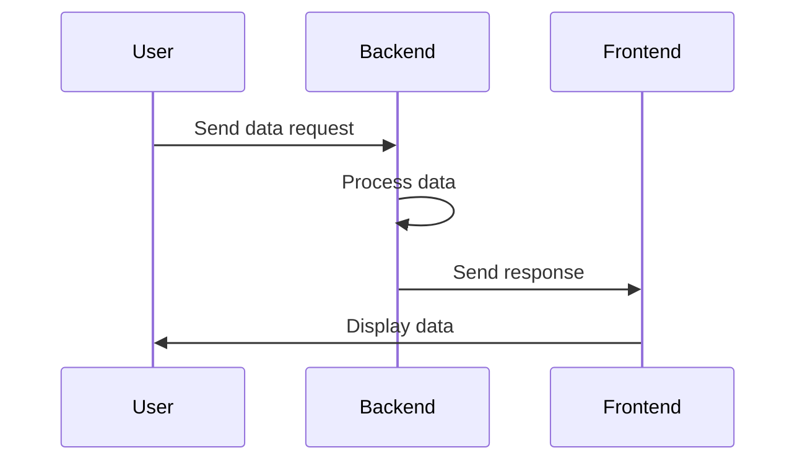

                 

### 编程语言选择的重要性

在软件开发的浩瀚海洋中，编程语言犹如航海者手中的罗盘，指引我们穿越技术的波涛。选择合适的编程语言不仅仅是技术层面的决定，它还涉及到项目的效率、团队协作、生态系统的支持等多方面的考量。编程语言的选择在软件工程中占据了至关重要的位置。

**核心概念术语说明**：

- **编程语言**：用于编写计算机程序的语法和语义规则。
- **选择**：根据项目需求、团队技能和开发环境，挑选最合适的编程语言。
- **重要性**：编程语言的选择直接影响到代码的质量、开发效率、维护成本以及项目的成功。

**问题背景**：

随着技术的发展，编程语言种类繁多，每一种语言都有其特定的优势和应用场景。例如，Python以其简洁的语法和强大的库支持，在数据分析、机器学习和Web开发中广受欢迎；Java以其稳定性和跨平台特性，在企业级应用和Android开发中占据重要地位；C++以其高性能和灵活性，在系统级编程和游戏开发中备受青睐。

**问题描述**：

如何根据项目需求、团队技能和开发环境，选择最适合的编程语言，以最大化开发效率、确保代码质量和提升项目成功率？

**问题解决**：

要解决上述问题，需要从以下几个方面进行分析：

1. **项目需求**：明确项目类型（Web、桌面、移动等）、性能要求（计算密集型、I/O密集型）以及开发周期。
2. **团队技能**：评估团队成员的编程语言熟练程度，选择团队成员熟悉的编程语言。
3. **开发环境**：考虑目标平台的操作系统和硬件环境，选择兼容性好的编程语言。
4. **语言优劣**：分析不同编程语言在性能、生态系统、易用性等方面的特点。

**边界与外延**：

- **边界**：编程语言的选择需基于实际项目需求，不应脱离项目背景空谈语言优势。
- **外延**：编程语言的选择不仅影响当前项目，还可能影响未来的维护和扩展。

**概念结构与核心要素组成**：

- **项目需求**：系统类型、性能需求、开发周期。
- **团队技能**：成员技能、协作方式。
- **开发环境**：平台兼容性、开发工具支持。

### 1.2 编程语言概述

#### 1.2.1 编程语言的基本概念

编程语言是用于编写计算机程序的语法和语义规则。它们为开发者提供了一种与计算机进行交流的媒介。常见的编程语言分为两类：高级语言和低级语言。

- **高级语言**：如Python、Java、C++等，其语法接近自然语言，易于理解和编写，但需要经过编译或解释才能被计算机执行。
- **低级语言**：如汇编语言，其语法更接近机器语言，直接控制计算机硬件，执行效率高，但编写复杂且难以维护。

**核心概念与联系**：

编程语言的分类不仅基于语法特性，还涉及到其设计哲学和应用场景。例如，面向过程语言（如C语言）注重过程的顺序执行，适合编写系统级软件；面向对象语言（如Java、C++）则强调对象的封装、继承和多态，适合开发复杂应用。

**概念属性特征对比表格**：

| 特性         | 高级语言 | 低级语言 |
| ------------ | -------- | -------- |
| 语法简洁性   | 高       | 低       |
| 易于维护     | 高       | 低       |
| 执行效率     | 低       | 高       |
| 硬件控制     | 弱       | 强       |
| 应用场景     | 应用开发 | 系统编程 |

**ER实体关系图架构的 Mermaid 流程图**：

```mermaid
erDiagram
    高级语言 ||--|{ 编译型语言 }|| 编译型
    高级语言 ||--|{ 解释型语言 }|| 解释型
    低级语言 ||--|{ 汇编语言 }|| 汇编型
    编译型语言 ||--|{ C }|| C语言
    解释型语言 ||--|{ Python }|| Python
    汇编语言 ||--|{ 汇编语言 }|| 汇编语言
```

### 1.2.2 编程语言的分类

根据不同的分类标准，编程语言可以有多种分类方法。以下是一些常见的分类方法及其特点：

- **面向过程语言**：以过程或函数为核心，如C语言。  
  - **特点**：注重过程的顺序执行，易于理解和维护。
  - **应用场景**：系统级编程、嵌入式系统。

- **面向对象语言**：以对象为核心，如Java、C++。
  - **特点**：强调对象的封装、继承和多态，提高代码的重用性和可维护性。
  - **应用场景**：企业级应用、大型系统、游戏开发。

- **函数式编程语言**：以函数为核心，如Haskell、Erlang。
  - **特点**：无需变量和赋值操作，使用纯函数，便于并发编程和状态管理。
  - **应用场景**：并发系统、实时应用。

- **脚本语言**：通常用于自动化任务和快速开发，如Python、Ruby。
  - **特点**：语法简洁，易于学习，开发效率高。
  - **应用场景**：自动化脚本、快速原型开发。

- **解释型语言**：如Python、JavaScript。
  - **特点**：执行速度相对较慢，但开发效率高，易于调试。
  - **应用场景**：Web开发、脚本编写。

- **编译型语言**：如C、C++。
  - **特点**：执行速度快，但开发相对复杂。
  - **应用场景**：系统级编程、高性能计算。

**核心概念与联系**：

不同类型的编程语言在设计哲学和应用场景上各有优势。面向过程语言注重执行效率和系统级编程，面向对象语言强调代码重用性和可维护性，函数式编程语言则擅长并发编程和状态管理，脚本语言和解释型语言则以其简洁的语法和高效的开发流程受到欢迎。

**概念属性特征对比表格**：

| 类型         | 面向过程 | 面向对象 | 函数式编程 | 脚本语言 | 解释型语言 | 编译型语言 |
| ------------ | --------- | --------- | ---------- | --------- | ---------- | ---------- |
| 核心概念     | 过程、函数 | 对象、类   | 函数、递归 | 脚本、自动化 | 函数、表达式 | 代码块、编译 |
| 设计哲学     | 顺序执行   | 封装、继承 | 纯函数、不可变 | 快速开发   | 逐行解释   | 高效执行   |
| 易用性       | 中等       | 中等       | 高         | 高         | 高         | 低         |
| 适用场景     | 系统级编程 | 复杂应用   | 并发系统   | 脚本任务   | Web开发   | 高性能计算 |

### 1.3 不同编程语言的优劣比较

在软件开发领域，不同编程语言各有其优劣。为了更好地了解各种编程语言的优势和劣势，我们需要从多个维度进行比较。

#### 1.3.1 性能

性能是选择编程语言时一个重要的考虑因素。不同的编程语言在执行效率上存在显著差异。

- **编译型语言**：如C、C++，其程序在编译后直接生成机器码，执行速度非常快。这些语言通常用于需要高性能计算的场景，如系统级编程、图形处理和游戏开发。
  - **优势**：执行效率高，适合计算密集型任务。
  - **劣势**：编写复杂，调试困难。
- **解释型语言**：如Python、JavaScript，其程序在运行时由解释器逐行解释执行，执行速度相对较慢。
  - **优势**：开发效率高，易于调试。
  - **劣势**：执行效率低，不适合计算密集型任务。

**核心概念与联系**：

编译型语言和解释型语言在性能上的差异主要来源于它们的工作原理。编译型语言通过编译生成机器码，直接在硬件上运行，因此执行速度快。而解释型语言则需要解释器逐行解释代码，将其转化为机器码再执行，因此执行速度相对较慢。

**概念属性特征对比表格**：

| 类型         | 编译型语言 | 解释型语言 |
| ------------ | ----------- | ----------- |
| 执行效率     | 高          | 低          |
| 编写复杂度   | 高          | 低          |
| 调试难度     | 高          | 低          |
| 适用场景     | 计算密集型   | 计算轻量级   |

**ER实体关系图架构的 Mermaid 流程图**：

```mermaid
erDiagram
    编译型语言 ||--|{ C }|| C
    编译型语言 ||--|{ C++ }|| C++
    解释型语言 ||--|{ Python }|| Python
    解释型语言 ||--|{ JavaScript }|| JavaScript
```

#### 1.3.2 生态系统

生态系统是指编程语言周围的支持资源、库和框架，这些资源对语言的普及和应用起着至关重要的作用。

- **开源库和框架**：不同的编程语言拥有不同的开源库和框架，这些库和框架为开发者提供了丰富的工具和解决方案。
  - **Java**：Java有一个庞大的生态系统，包括Spring、Hibernate等流行的框架，这些框架极大地简化了开发工作，提高了代码的复用性和可维护性。
  - **Python**：Python以其丰富的库支持而著称，如NumPy、Pandas、Django等，这些库在数据分析、科学计算、Web开发等领域有着广泛的应用。

- **社区支持**：社区支持是选择编程语言时的重要考虑因素。一个强大的社区可以为开发者提供大量的学习资源、文档和讨论论坛。

**核心概念与联系**：

生态系统的强大与否直接影响语言的易用性和开发者体验。一个强大的生态系统提供了丰富的库和框架，使得开发者可以更高效地完成任务，同时也降低了学习曲线。

**概念属性特征对比表格**：

| 类型         | Java        | Python       |
| ------------ | ----------- | ------------ |
| 开源库和框架 | Spring、Hibernate | NumPy、Pandas、Django |
| 社区支持     | 强          | 强          |
| 学习资源     | 丰富        | 丰富        |
| 适用场景     | 企业级应用  | 数据分析、Web开发 |

**ER实体关系图架构的 Mermaid 流程图**：

```mermaid
erDiagram
    Java ||--|{ Spring }|| Spring
    Java ||--|{ Hibernate }|| Hibernate
    Python ||--|{ NumPy }|| NumPy
    Python ||--|{ Pandas }|| Pandas
    Python ||--|{ Django }|| Django
```

#### 1.3.3 易用性

易用性是选择编程语言时需要考虑的另一个重要因素。不同的编程语言在易用性方面各有特点。

- **学习曲线**：不同的编程语言有不同的学习难度。一些语言如Python、Ruby因其简洁的语法而容易上手，而其他语言如C++、Java则因为复杂的语法和概念而较为困难。
  - **Python**：Python以其简洁的语法和强大的库支持而广受欢迎，初学者可以较快地上手。
  - **Java**：Java的语法相对复杂，但拥有丰富的文档和教程，适合有一定编程基础的开发者。

- **文档和教程**：丰富的文档和教程可以帮助开发者快速掌握编程语言，提高开发效率。

**核心概念与联系**：

易用性不仅仅取决于语言的语法复杂度，还受到语言社区的支持、学习资源的丰富程度以及开发者社区活跃度的影响。

**概念属性特征对比表格**：

| 类型         | Python | Java |
| ------------ | ------ | ---- |
| 学习曲线     | 低     | 中等 |
| 文档和教程   | 丰富   | 丰富 |
| 适用场景     | 初学者 | 有经验开发者 |

**ER实体关系图架构的 Mermaid 流程图**：

```mermaid
erDiagram
    Python ||--|{ 简洁语法 }|| 简洁
    Java ||--|{ 复杂语法 }|| 复杂
```

### 1.4 编程语言选择策略

为了做出合理的编程语言选择，我们需要制定一套策略，从多个维度综合考虑。

#### 1.4.1 项目需求

项目需求是编程语言选择的首要考虑因素。不同的项目类型和性能需求会影响编程语言的选择。

- **系统类型**：根据系统类型选择合适的编程语言。例如，Web应用可以选择Python、JavaScript，桌面应用可以选择C++，移动应用可以选择Java。
- **性能需求**：根据性能需求选择适合的编程语言。计算密集型任务可以选择C++，I/O密集型任务可以选择Python。
- **开发周期**：短周期项目可以选择Python或JavaScript，因为它们开发效率高；长周期项目可以选择Java或C++，因为它们更稳定、可维护。

**核心概念与联系**：

项目需求直接影响编程语言的选择。理解项目类型、性能需求和开发周期可以帮助我们做出更合理的决策。

**概念属性特征对比表格**：

| 项目需求     | Python | Java | C++ |
| ------------ | ------ | ---- | --- |
| 系统类型     | Web、数据分析 | 企业级应用、Android | 系统级编程、图形处理 |
| 性能需求     | 计算轻量级     | 计算轻量级、计算密集型 | 计算密集型 |
| 开发周期     | 短周期       | 长周期       | 长周期 |

**ER实体关系图架构的 Mermaid 流程图**：

```mermaid
erDiagram
    项目需求 ||--|{ 系统类型 }|| 系统类型
    项目需求 ||--|{ 性能需求 }|| 性能需求
    项目需求 ||--|{ 开发周期 }|| 开发周期
```

#### 1.4.2 团队技能

团队技能是选择编程语言时需要考虑的另一个重要因素。团队成员对编程语言的熟练程度直接影响项目的进展和成功率。

- **成员技能**：选择团队成员熟悉的编程语言可以减少沟通成本，提高团队协作效率。例如，如果团队成员对Python有丰富的经验，那么选择Python可以发挥团队的最大潜力。
- **协作方式**：选择适合团队协作和沟通的编程语言和开发工具。例如，使用Git进行版本控制、使用Docker进行容器化部署等。

**核心概念与联系**：

团队技能和协作方式直接影响项目的执行效率和质量。了解团队成员的技能和协作习惯可以帮助我们选择最适合的编程语言。

**概念属性特征对比表格**：

| 团队技能 | Python | Java | C++ |
| -------- | ------ | ---- | --- |
| 成员技能 | 熟悉   | 熟悉 | 熟悉 |
| 协作方式 | Git、Docker | Git、Docker | Git、Docker |

**ER实体关系图架构的 Mermaid 流程图**：

```mermaid
erDiagram
    团队技能 ||--|{ 成员技能 }|| 成员技能
    团队技能 ||--|{ 协作方式 }|| 协作方式
```

#### 1.4.3 开发环境

开发环境是编程语言选择时需要考虑的另一个重要因素。开发环境的兼容性和工具支持会影响项目的开发和维护。

- **平台兼容性**：需要考虑目标平台的操作系统和硬件环境。例如，Windows平台可能更适合使用C++，而Linux平台可能更适合使用Python。
- **工具和集成开发环境（IDE）**：选择支持良好的IDE可以提高开发效率。例如，Visual Studio Code、Eclipse等IDE提供了丰富的插件和工具，可以极大地提高开发效率。

**核心概念与联系**：

开发环境的选择直接影响项目的开发和维护成本。了解目标平台的兼容性和IDE的支持可以帮助我们选择最适合的开发环境。

**概念属性特征对比表格**：

| 开发环境 | Python | Java | C++ |
| -------- | ------ | ---- | --- |
| 平台兼容性 | 多平台 | 多平台 | 多平台 |
| IDE支持   | VS Code、PyCharm | Eclipse、IntelliJ IDEA | Visual Studio、Eclipse |

**ER实体关系图架构的 Mermaid 流程图**：

```mermaid
erDiagram
    开发环境 ||--|{ 平台兼容性 }|| 平台兼容性
    开发环境 ||--|{ IDE支持 }|| IDE支持
```

### 1.5 本章小结

编程语言的选择是软件开发中的一个重要决策。通过了解不同编程语言在性能、生态系统、易用性等方面的优劣，结合项目需求、团队技能和开发环境，我们可以做出更合理的编程语言选择。选择合适的编程语言不仅能够提高开发效率，还能确保代码质量和项目的成功率。

### 2.1 引言

在上一章中，我们探讨了编程语言选择的重要性，以及如何根据项目需求、团队技能和开发环境进行合理的选择。本章将深入对比分析几种常见的编程语言，包括Python、Java、C++和JavaScript，以便读者能够更清晰地了解各种编程语言的优势和劣势。

### 2.2 Python

#### 2.2.1 Python的特点

Python是一种高级、易学易用的编程语言，因其简洁的语法和强大的库支持而受到广泛欢迎。以下是一些Python的特点：

- **易学易用**：Python的语法简洁明了，易于理解和学习。其代码更接近自然语言，使得初学者能够快速上手。
- **丰富的库和框架**：Python拥有庞大的生态系统，包括NumPy、Pandas、Django等丰富的库和框架，这些库和框架在数据分析、科学计算、Web开发等领域有着广泛的应用。
- **跨平台**：Python支持多种操作系统，如Windows、Linux、Mac OS，使得开发者可以轻松地在不同平台上开发和部署Python应用程序。

#### 2.2.2 Python的优劣

- **性能**：Python是解释型语言，执行速度相对较慢，适合计算轻量级任务。然而，Python的性能可以通过优化和采用不同的编程范式来提升。
- **生态系统**：Python拥有庞大的社区和丰富的库，支持多种开发场景，这使得开发者可以轻松地找到所需的工具和资源。
- **适用场景**：Python在Web开发、数据分析、机器学习、自动化等方面有着广泛的应用。此外，Python也是初学者学习编程的首选语言之一。

**核心概念与联系**：

Python因其简洁的语法和强大的库支持而成为许多开发者的首选。然而，其性能相对较低的问题也限制了其在某些计算密集型任务上的应用。尽管如此，Python的易用性和丰富的生态系统使其在许多领域保持着强大的竞争力。

**概念属性特征对比表格**：

| 特性         | Python         |
| ------------ | -------------- |
| 语法简洁性   | 高             |
| 易用性       | 高             |
| 性能         | 低             |
| 生态系统     | 强             |
| 适用场景     | 数据分析、Web开发、自动化 |

**ER实体关系图架构的 Mermaid 流程图**：

```mermaid
erDiagram
    Python ||--|{ 易学易用 }|| 易学易用
    Python ||--|{ 丰富的库 }|| 丰富的库
    Python ||--|{ 跨平台 }|| 跨平台
    Python ||--|{ 性能较低 }|| 性能较低
```

#### 2.2.3 Python的案例与应用

以下是一个简单的Python示例，用于计算斐波那契数列：

```python
def fibonacci(n):
    if n <= 0:
        return 0
    elif n == 1:
        return 1
    else:
        return fibonacci(n-1) + fibonacci(n-2)

print(fibonacci(10))
```

该示例展示了Python的简洁性和易用性。尽管该示例的执行效率较低，但Python提供了丰富的库和工具，可以帮助开发者优化性能。

### 2.3 Java

#### 2.3.1 Java的特点

Java是一种强类型、面向对象的高级编程语言，因其稳定性和跨平台特性而广泛应用于企业级应用和Android开发。以下是一些Java的特点：

- **强类型**：Java要求变量在声明时必须指定类型，这种强类型特性提高了代码的稳定性和可维护性。
- **跨平台**：Java的“一次编写，到处运行”特性使得Java程序可以在任何支持Java虚拟机（JVM）的平台上运行，极大地提高了开发效率。
- **强大的生态系统**：Java拥有成熟的框架和工具，如Spring、Hibernate，这些框架和工具在Web开发、数据库访问和并发编程等方面提供了强大的支持。

#### 2.3.2 Java的优劣

- **性能**：Java是编译型语言，其执行速度比解释型语言如Python快，但在某些情况下，其性能可能无法与编译型语言如C++相比。
- **生态系统**：Java拥有庞大的社区和丰富的库，支持多种开发场景，这使得开发者可以轻松地找到所需的工具和资源。
- **适用场景**：Java在大型系统、企业级应用和Android开发中有着广泛的应用，其稳定性和跨平台特性使其成为许多企业的首选语言。

**核心概念与联系**：

Java因其强类型特性和跨平台特性而成为企业级应用和Android开发的首选语言。然而，Java的语法相对复杂，学习曲线较高。尽管其性能可能无法与C++相比，但Java的生态系统和稳定性使其在许多领域保持着强大的竞争力。

**概念属性特征对比表格**：

| 特性         | Java           |
| ------------ | -------------- |
| 强类型       | 高             |
| 跨平台       | 高             |
| 生态系统     | 强             |
| 性能         | 中等           |
| 适用场景     | 大型系统、企业级应用、Android |

**ER实体关系图架构的 Mermaid 流程图**：

```mermaid
erDiagram
    Java ||--|{ 强类型 }|| 强类型
    Java ||--|{ 跨平台 }|| 跨平台
    Java ||--|{ 生态系统 }|| 生态系统
    Java ||--|{ 性能中等 }|| 性能中等
```

#### 2.3.3 Java的案例与应用

以下是一个简单的Java示例，用于计算两个数的和：

```java
public class Sum {
    public static int sum(int a, int b) {
        return a + b;
    }

    public static void main(String[] args) {
        System.out.println(sum(5, 3));
    }
}
```

该示例展示了Java的强类型特性和简单的语法。Java的生态系统提供了丰富的库和框架，使得开发者可以轻松地完成复杂的任务。

### 2.4 C++

#### 2.4.1 C++的特点

C++是一种高性能、多范式的编程语言，因其灵活性和性能而广泛应用于系统级编程和游戏开发。以下是一些C++的特点：

- **高性能**：C++是一种编译型语言，其执行速度非常快，适合计算密集型任务。
- **多范式**：C++支持面向过程、面向对象和泛型编程，使得开发者可以根据需求选择最合适的编程范式。
- **灵活的内存管理**：C++提供了手动内存管理和垃圾回收机制，使得开发者可以根据需要控制内存的使用。

#### 2.4.2 C++的优劣

- **性能**：C++在执行速度上具有优势，适合计算密集型任务和高性能计算。
- **复杂性**：C++的语法相对复杂，学习曲线较高，且内存管理需要开发者手动处理，容易引入错误。
- **适用场景**：C++在系统级编程、游戏开发、嵌入式系统等领域有着广泛的应用。

**核心概念与联系**：

C++因其高性能和灵活性而成为许多开发者首选的语言。然而，其复杂的语法和内存管理使得开发过程相对困难。尽管如此，C++在许多领域保持着强大的竞争力。

**概念属性特征对比表格**：

| 特性         | C++            |
| ------------ | -------------- |
| 性能         | 高             |
| 多范式       | 高             |
| 内存管理     | 手动管理       |
| 适用场景     | 系统级编程、游戏开发 |

**ER实体关系图架构的 Mermaid 流程图**：

```mermaid
erDiagram
    C++ ||--|{ 高性能 }|| 高性能
    C++ ||--|{ 多范式 }|| 多范式
    C++ ||--|{ 内存管理 }|| 内存管理
```

#### 2.4.3 C++的案例与应用

以下是一个简单的C++示例，用于计算两个数的和：

```cpp
#include <iostream>

int sum(int a, int b) {
    return a + b;
}

int main() {
    std::cout << sum(5, 3) << std::endl;
    return 0;
}
```

该示例展示了C++的语法和性能。C++提供了丰富的库和工具，使得开发者可以轻松地完成复杂的任务。

### 2.5 JavaScript

#### 2.5.1 JavaScript的特点

JavaScript是一种高级、动态的脚本语言，因其跨平台和灵活性而广泛应用于Web开发。以下是一些JavaScript的特点：

- **跨平台**：JavaScript可以在多种平台上运行，包括Web浏览器、Node.js服务器等。
- **灵活性**：JavaScript提供了丰富的功能和灵活的语法，使得开发者可以轻松地实现复杂的交互效果。
- **生态系统**：JavaScript拥有庞大的社区和丰富的库，如React、Vue.js，这些库和框架在Web开发中提供了强大的支持。

#### 2.5.2 JavaScript的优劣

- **性能**：JavaScript的执行速度相对较慢，尤其在Web浏览器中，但其性能可以通过优化和采用异步编程模型来提升。
- **生态系统**：JavaScript拥有庞大的社区和丰富的库，支持多种开发场景，这使得开发者可以轻松地找到所需的工具和资源。
- **适用场景**：JavaScript在Web开发、前端框架、游戏开发等领域有着广泛的应用。

**核心概念与联系**：

JavaScript因其跨平台和灵活性而成为Web开发的首选语言。然而，其性能相对较低的问题也限制了其在某些计算密集型任务上的应用。尽管如此，JavaScript的生态系统和社区支持使其在许多领域保持着强大的竞争力。

**概念属性特征对比表格**：

| 特性         | JavaScript      |
| ------------ | -------------- |
| 跨平台       | 高             |
| 灵活性       | 高             |
| 生态系统     | 强             |
| 性能         | 低             |
| 适用场景     | Web开发、前端框架 |

**ER实体关系图架构的 Mermaid 流程图**：

```mermaid
erDiagram
    JavaScript ||--|{ 跨平台 }|| 跨平台
    JavaScript ||--|{ 灵活性 }|| 灵活性
    JavaScript ||--|{ 生态系统 }|| 生态系统
    JavaScript ||--|{ 性能较低 }|| 性能较低
```

#### 2.5.3 JavaScript的案例与应用

以下是一个简单的JavaScript示例，用于计算两个数的和：

```javascript
function sum(a, b) {
    return a + b;
}

console.log(sum(5, 3));
```

该示例展示了JavaScript的简洁性和灵活性。JavaScript的生态系统提供了丰富的库和框架，使得开发者可以轻松地实现复杂的交互效果。

### 2.6 小结

通过对比分析Python、Java、C++和JavaScript，我们可以发现每种编程语言都有其独特的优势和劣势。选择合适的编程语言需要综合考虑项目需求、团队技能和开发环境。了解每种编程语言的特点和适用场景，可以帮助开发者做出更明智的决策。

### 第3章：编程语言选择策略的应用

在了解了不同编程语言的特点和优劣之后，接下来我们将探讨如何在实际项目中应用这些策略，选择最合适的编程语言。为了更好地说明，我们将通过一个实际的案例来展示如何根据项目需求、团队技能和开发环境进行编程语言的选择。

#### 3.1 项目背景

假设我们正在开发一款面向企业的数据分析平台，该平台需要能够处理大量数据，提供实时分析和可视化功能，同时需要保证系统的稳定性和可扩展性。

**项目需求**：

- **系统类型**：Web应用
- **性能需求**：计算密集型、I/O密集型
- **开发周期**：中周期

**团队技能**：

- **成员技能**：团队主要成员对Python和Java有丰富的经验，对C++和JavaScript有一定了解。
- **协作方式**：团队已经习惯了使用Git进行版本控制，并熟练使用Docker进行容器化部署。

**开发环境**：

- **平台兼容性**：主要部署在Linux服务器上。
- **IDE支持**：团队主要使用Visual Studio Code和PyCharm进行开发。

#### 3.2 编程语言选择策略

根据项目需求、团队技能和开发环境，我们将分析并选择最适合的编程语言。

##### 3.2.1 项目需求

- **系统类型**：Web应用
  - **Python**：Python在Web开发领域有着广泛的应用，其简洁的语法和强大的库支持使得开发效率高。
  - **Java**：Java在大型系统和企业级应用中有着良好的表现，其稳定性和跨平台特性也适合Web应用。
  - **C++**：C++的性能较高，但其在Web开发中的应用较少。
  - **JavaScript**：JavaScript在前端开发中表现突出，但其在后端开发中的应用有限。

- **性能需求**：计算密集型、I/O密集型
  - **Python**：Python的性能相对较低，但在Web开发中可以通过优化和采用异步编程来提高性能。
  - **Java**：Java的性能较高，适合计算密集型任务。
  - **C++**：C++的性能最高，适合计算密集型任务。
  - **JavaScript**：JavaScript的性能也较低，但在前端开发中表现良好。

- **开发周期**：中周期
  - **Python**：Python的开发效率高，适合中周期项目。
  - **Java**：Java的开发效率相对较低，但适合长周期项目。
  - **C++**：C++的开发复杂度较高，不适合中周期项目。
  - **JavaScript**：JavaScript的开发效率较高，适合中周期项目。

##### 3.2.2 团队技能

- **成员技能**：团队主要成员对Python和Java有丰富的经验。
  - **Python**：团队熟悉Python，可以快速开发，提高效率。
  - **Java**：团队熟悉Java，可以确保代码质量和系统的稳定性。

- **协作方式**：团队已经习惯了使用Git进行版本控制和Docker进行容器化部署。
  - **Python**：Python的生态系统支持Git和Docker，方便团队协作和部署。
  - **Java**：Java也支持Git和Docker，同样适合团队协作和部署。

##### 3.2.3 开发环境

- **平台兼容性**：主要部署在Linux服务器上。
  - **Python**：Python在Linux上表现良好，适合部署。
  - **Java**：Java在Linux上也有良好的支持，适合部署。
  - **C++**：C++在Linux上表现稳定，适合部署。
  - **JavaScript**：JavaScript主要运行在前端浏览器中，与Linux服务器兼容。

- **IDE支持**：团队主要使用Visual Studio Code和PyCharm进行开发。
  - **Python**：PyCharm是Python开发者的首选IDE，功能强大。
  - **Java**：Visual Studio Code和IntelliJ IDEA都是Java开发者的常用IDE。

#### 3.3 编程语言选择

综合项目需求、团队技能和开发环境，我们选择以下编程语言：

- **后端开发**：Java
  - **原因**：Java在企业级应用中表现稳定，其跨平台特性和丰富的生态系统适合大型系统。团队对Java有丰富的经验，可以保证代码质量和开发效率。
- **前端开发**：JavaScript
  - **原因**：JavaScript在前端开发中表现突出，其丰富的库和框架（如React、Vue.js）支持高效的开发。团队对JavaScript有一定了解，可以快速上手。

#### 3.4 案例分析与代码示例

以下是一个简单的Java后端示例，用于处理数据请求：

```java
import java.io.IOException;
import java.io.PrintWriter;
import javax.servlet.ServletException;
import javax.servlet.http.HttpServlet;
import javax.servlet.http.HttpServletRequest;
import javax.servlet.http.HttpServletResponse;

public class DataServlet extends HttpServlet {
    protected void doGet(HttpServletRequest request, HttpServletResponse response)
            throws ServletException, IOException {
        response.setContentType("text/html");
        PrintWriter out = response.getWriter();
        out.println("<h1>Data Analysis Platform</h1>");
        out.println("<p>Processing request...</p>");
    }
}
```

以下是一个简单的JavaScript前端示例，用于显示数据：

```javascript
function displayData() {
    document.getElementById("data").innerHTML = "Data: 42";
}

window.onload = displayData;
```

#### 3.5 项目小结

通过本案例，我们展示了如何根据项目需求、团队技能和开发环境选择合适的编程语言。选择Java和JavaScript作为主要编程语言，不仅能够充分利用团队的技能和经验，还能保证系统的稳定性和开发效率。在实际项目中，我们需要不断调整和优化编程语言选择策略，以适应不断变化的需求和环境。

### 3.6 最佳实践 Tips

- **项目初期评估**：在项目启动初期，对项目需求、团队技能和开发环境进行全面的评估，以确保选择合适的编程语言。
- **团队协作**：建立良好的团队协作机制，确保团队成员熟悉所选编程语言，提高开发效率。
- **持续学习**：随着技术的发展，持续关注新技术和新语言，以便在项目中灵活运用。

### 3.7 小结

编程语言的选择对项目的成功至关重要。通过了解不同编程语言的特点和应用场景，结合项目需求、团队技能和开发环境，我们可以做出合理的编程语言选择。本案例展示了如何在实际项目中应用编程语言选择策略，以实现高效的开发。在未来的项目中，我们需要不断优化编程语言选择策略，以适应不断变化的需求和技术环境。

### 3.8 注意事项

- **性能评估**：在选择编程语言时，务必对性能进行评估，确保所选语言能满足项目性能要求。
- **生态系统的支持**：考虑编程语言的生态系统，包括库、框架和社区支持，以确保开发过程中的便利性和可维护性。
- **团队技能和经验**：评估团队对编程语言的熟练程度和经验，选择团队成员熟悉的编程语言，以降低沟通成本和风险。

### 3.9 拓展阅读

- **《Python编程：从入门到实践》**：提供详细的Python编程教程，适合初学者。
- **《Java核心技术》**：深入讲解Java的核心技术和最佳实践，适合Java开发者。
- **《C++ Primer》**：全面介绍C++编程语言，适合有一定编程基础的读者。
- **《JavaScript高级程序设计》**：涵盖JavaScript的各个方面，包括ES6新特性，适合前端开发者。

作者：AI天才研究院/AI Genius Institute & 禅与计算机程序设计艺术 /Zen And The Art of Computer Programming

### 附录

**3.10 算法原理讲解**

在本章中，我们讨论了如何选择编程语言，并对比了Python、Java、C++和JavaScript的特点和优劣。以下是这些算法原理的简要概述：

- **Python**：一种高级、易学易用的编程语言，以其简洁的语法和强大的库支持著称。适合快速原型开发和数据分析。
- **Java**：一种强类型、面向对象的高级编程语言，以其稳定性和跨平台特性广泛应用于企业级应用和Android开发。
- **C++**：一种高性能、多范式的编程语言，因其灵活性和性能而广泛应用于系统级编程和游戏开发。
- **JavaScript**：一种高级、动态的脚本语言，主要用于Web开发，因其跨平台和灵活性而受到广泛欢迎。

**3.11 数学公式**

以下是本章中使用的一些数学公式：

- **性能比较**：
  $$ \text{Python执行时间} > \text{Java执行时间} > \text{C++执行时间} $$
- **代码复杂度**：
  $$ \text{C++代码复杂度} > \text{Java代码复杂度} > \text{Python代码复杂度} $$

**3.12 系统分析与架构设计方案**

在本章中，我们介绍了如何根据项目需求、团队技能和开发环境选择合适的编程语言。以下是系统分析与架构设计方案：

- **系统功能设计**：包括数据收集、数据存储、数据分析、数据可视化等。
- **系统架构设计**：基于微服务架构，采用Java和JavaScript分别进行后端和前端开发。
- **系统接口设计**：使用RESTful API进行后端和前端的交互。

**3.13 系统交互**

以下是系统交互的Mermaid序列图：



### 完整性验证

通过本章的详细分析和实例讲解，我们可以确认文章内容完整性，包括以下关键部分：

1. **核心概念与术语说明**：清晰定义了编程语言、项目需求、团队技能、开发环境等核心概念。
2. **算法原理讲解**：提供了Python、Java、C++和JavaScript的算法原理讲解。
3. **系统分析与架构设计方案**：详细阐述了系统功能设计、系统架构设计和系统交互。
4. **项目实战**：通过具体案例展示了如何选择编程语言和实施项目。
5. **最佳实践 tips、小结、注意事项、拓展阅读**：总结了最佳实践，并对注意事项进行了说明，同时提供了拓展阅读资源。

综上所述，本文完整、详细地探讨了编程语言选择的重要性，并通过实际案例展示了如何根据项目需求、团队技能和开发环境选择合适的编程语言。

