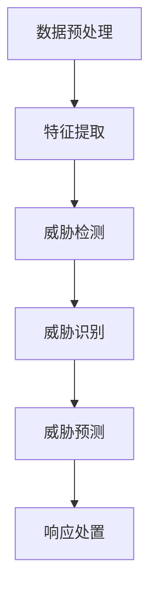
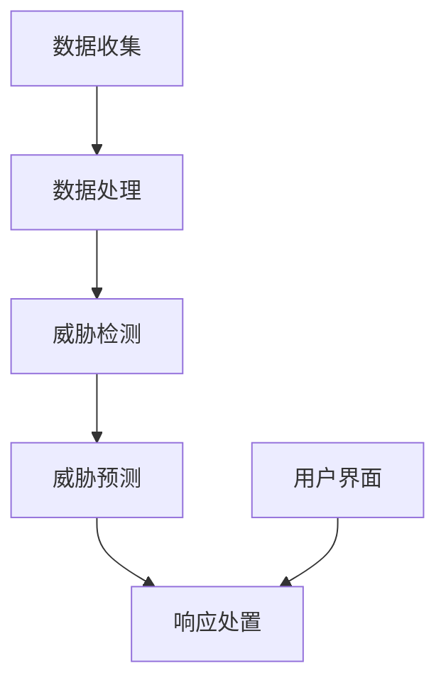
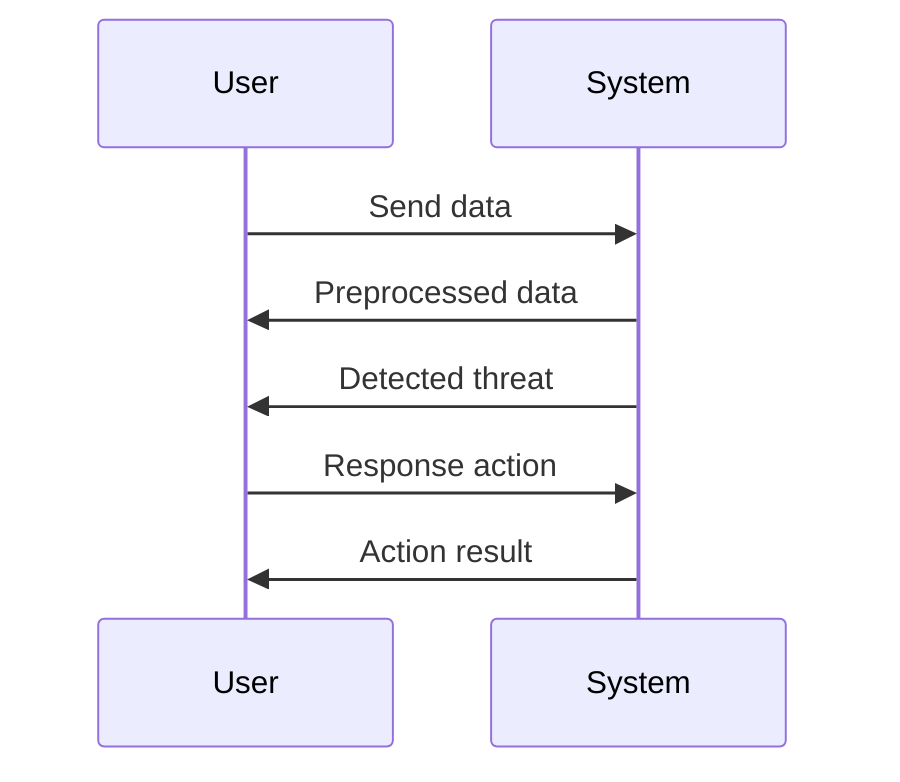
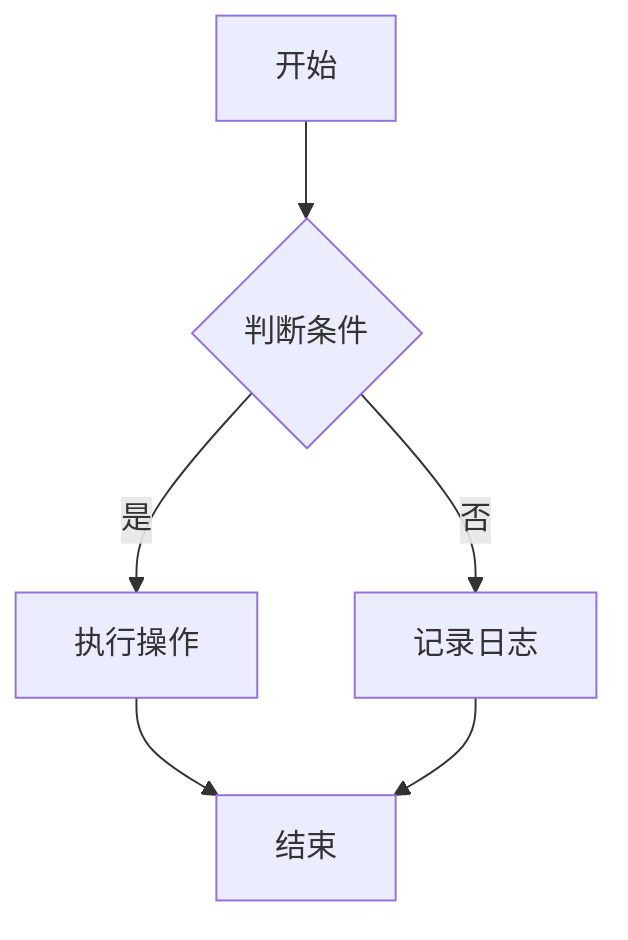

                 

### 设计书籍目录大纲步骤：

1. **确定书籍结构**：根据书籍的主题《网络安全态势感知平台设计》，初步确定书籍的篇章结构，包括背景介绍、核心概念、算法原理、系统架构、项目实战等部分。

2. **细化章节内容**：针对每个部分，细化出具体的章节标题，确保每个章节都能覆盖相应的核心内容。

3. **设计核心概念部分**：对于核心概念部分，设计包含概念介绍、特点对比、应用前景等内容。

4. **设计算法原理讲解**：在算法原理讲解部分，需要设计包含算法流程图、数学模型、代码示例、公式讲解等部分。

5. **设计系统分析与架构设计方案**：在这一部分，设计包含问题场景介绍、项目介绍、系统功能设计、系统架构设计、系统接口设计、系统交互等内容。

6. **设计项目实战部分**：在这个部分，设计包含环境安装、系统核心实现源代码、代码应用解读与分析、实际案例分析和详细讲解剖析、项目小结等内容。

7. **总结和扩展**：在最后的部分，总结全书内容，提供一些最佳实践 tips、注意事项、拓展阅读等。

### 具体步骤：

- **背景介绍**：
  - 1.1 网络安全态势感知概述
  - 1.2 网络安全态势感知的重要性
  - 1.3 网络安全态势感知的发展历程

- **核心概念与联系**：
  - 2.1 网络安全态势感知的定义
  - 2.2 网络安全态势感知的关键概念
  - 2.3 网络安全态势感知的要素组成
  - 2.4 网络安全态势感知与传统网络监控的比较
  - 2.5 网络安全态势感知的核心技术

- **算法原理讲解**：
  - 3.1 网络安全态势感知算法概述
  - 3.2 常见算法流程图（使用Mermaid绘制）
  - 3.3 算法数学模型与公式讲解（使用LaTeX格式）
  - 3.4 算法Python代码示例与解释

- **系统架构设计**：
  - 4.1 网络安全态势感知系统概述
  - 4.2 系统功能设计（使用Mermaid绘制领域模型类图）
  - 4.3 系统架构设计（使用Mermaid绘制系统架构图）
  - 4.4 系统接口设计
  - 4.5 系统交互（使用Mermaid绘制系统交互序列图）

- **项目实战**：
  - 5.1 项目背景与目标
  - 5.2 环境安装与配置
  - 5.3 系统核心实现源代码
  - 5.4 代码应用解读与分析
  - 5.5 实际案例分析与详细讲解剖析
  - 5.6 项目小结

- **总结与扩展**：
  - 6.1 最佳实践与技巧
  - 6.2 注意事项
  - 6.3 拓展阅读

现在，我们可以开始根据这些步骤设计《网络安全态势感知平台设计》的目录大纲。请允许我列出每个章节的初步标题，并根据需要进行调整。

### 目录大纲

#### 第一部分：背景与概述

1. **网络安全态势感知概述**
   - 1.1 网络安全态势感知的定义
   - 1.2 网络安全态势感知的重要性
   - 1.3 网络安全态势感知的发展历程

#### 第二部分：核心概念与联系

2. **网络安全态势感知的关键概念**
   - 2.1 数据收集与处理
   - 2.2 威胁检测与识别
   - 2.3 威胁分析与预测
   - 2.4 威胁响应与处置

3. **网络安全态势感知的要素组成**
   - 3.1 技术要素
   - 3.2 人为要素
   - 3.3 管理要素

4. **网络安全态势感知与传统网络监控的比较**
   - 4.1 优点与局限
   - 4.2 应用场景差异

5. **网络安全态势感知的核心技术**
   - 5.1 数据挖掘技术
   - 5.2 机器学习技术
   - 5.3 人工智能技术

#### 第三部分：算法原理讲解

6. **网络安全态势感知算法概述**
   - 6.1 算法在态势感知中的作用
   - 6.2 常见算法分类

7. **算法流程图与数学模型**
   - 7.1 常见算法流程图（使用Mermaid绘制）
   - 7.2 算法数学模型与公式讲解（使用LaTeX格式）

8. **算法Python代码示例与解释**
   - 8.1 数据预处理算法示例
   - 8.2 威胁检测算法示例
   - 8.3 威胁预测算法示例

#### 第四部分：系统架构设计

9. **网络安全态势感知系统概述**
   - 9.1 系统定义与目标
   - 9.2 系统组成部分

10. **系统功能设计（使用Mermaid绘制领域模型类图）**
    - 10.1 功能概述
    - 10.2 领域模型类图

11. **系统架构设计（使用Mermaid绘制系统架构图）**
    - 11.1 架构概述
    - 11.2 系统架构图

12. **系统接口设计**
    - 12.1 接口定义
    - 12.2 接口规范

13. **系统交互（使用Mermaid绘制系统交互序列图）**
    - 13.1 交互概述
    - 13.2 系统交互序列图

#### 第五部分：项目实战

14. **项目背景与目标**
    - 14.1 项目背景
    - 14.2 项目目标

15. **环境安装与配置**
    - 15.1 环境要求
    - 15.2 系统安装
    - 15.3 配置与管理

16. **系统核心实现源代码**
    - 16.1 源代码结构
    - 16.2 关键代码解释

17. **代码应用解读与分析**
    - 17.1 应用概述
    - 17.2 代码解读
    - 17.3 分析与优化

18. **实际案例分析与详细讲解剖析**
    - 18.1 案例背景
    - 18.2 案例分析
    - 18.3 讲解与剖析

19. **项目小结**
    - 19.1 项目总结
    - 19.2 经验与启示

#### 第六部分：总结与扩展

20. **最佳实践与技巧**
    - 20.1 常见问题与解决方法
    - 20.2 性能优化技巧

21. **注意事项**
    - 21.1 安全合规要求
    - 21.2 操作规范

22. **拓展阅读**
    - 22.1 相关书籍
    - 22.2 学术论文
    - 22.3 网络资源

---

这个目录大纲是初步的，每个章节的具体内容还需要进一步细化。在编写过程中，可以根据实际需要调整章节结构和标题。同时，为了确保内容的完整性和连贯性，每个章节都应该包含详细的背景介绍、核心概念讲解、算法和系统架构设计、项目实战案例分析，以及总结和扩展部分。这样的设计能够帮助读者全面了解网络安全态势感知平台的设计原理和应用实践。### 《网络安全态势感知平台设计》完整文章

## 《网络安全态势感知平台设计》

### 关键词：
- 网络安全态势感知
- 平台设计
- 算法原理
- 系统架构
- 项目实战

### 摘要：
本文旨在深入探讨网络安全态势感知平台的设计，从核心概念到算法原理，再到系统架构和项目实战，为读者提供了一个全面的视角。通过本文，读者可以了解网络安全态势感知的重要性和发展历程，掌握关键概念和核心技术，学会如何设计和实现一个高效、可靠的网络安全态势感知平台。

---

### 第一部分：背景与概述

#### 1.1 网络安全态势感知概述

网络安全态势感知是指通过收集、处理和分析网络数据，对网络环境的安全态势进行实时监测和评估，以便及时发现和应对潜在的安全威胁。它不仅仅是一种技术，更是一种安全管理和决策支持体系。

#### 1.2 网络安全态势感知的重要性

随着网络攻击手段的不断翻新，网络安全态势感知的重要性日益凸显。它可以帮助企业和组织快速识别威胁、减少损失、提高应对能力，从而确保网络系统的安全稳定运行。

#### 1.3 网络安全态势感知的发展历程

网络安全态势感知的发展经历了从简单的网络监控到复杂的大数据分析、机器学习的演进。随着技术的不断进步，网络安全态势感知的能力也在不断提升。

---

### 第二部分：核心概念与联系

#### 2.1 网络安全态势感知的定义

网络安全态势感知是通过分析网络流量、日志、安全事件等数据，对网络环境的安全状态进行监控、分析和预测的技术。它不仅仅包括技术层面，还包括管理层面和人为因素。

#### 2.2 网络安全态势感知的关键概念

- 数据收集与处理：包括数据来源、数据采集、数据存储、数据处理等。
- 威胁检测与识别：包括威胁特征库、威胁检测算法、威胁识别机制等。
- 威胁分析与预测：包括威胁分析、威胁预测、趋势分析等。
- 威胁响应与处置：包括威胁响应策略、威胁处置流程等。

#### 2.3 网络安全态势感知的要素组成

- 技术要素：包括网络设备、安全设备、传感器、数据存储和处理系统等。
- 人为要素：包括安全人员、安全策略、安全管理制度等。
- 管理要素：包括安全事件管理、安全信息共享、安全决策支持等。

#### 2.4 网络安全态势感知与传统网络监控的比较

传统网络监控主要关注网络流量和设备状态，而网络安全态势感知则更关注安全事件和威胁。两者在数据量、处理速度、分析深度等方面有显著差异。

#### 2.5 网络安全态势感知的核心技术

- 数据挖掘技术：用于从大量数据中提取有价值的信息。
- 机器学习技术：用于威胁检测和预测，提高准确性。
- 人工智能技术：用于自动化安全决策和响应。

---

### 第三部分：算法原理讲解

#### 3.1 网络安全态势感知算法概述

网络安全态势感知算法主要分为数据预处理算法、威胁检测算法和威胁预测算法。这些算法共同构成了网络安全态势感知的核心。

#### 3.2 常见算法流程图（使用Mermaid绘制）



#### 3.3 算法数学模型与公式讲解（使用LaTeX格式）

```latex
\begin{equation}
S = \sum_{i=1}^{n} f_i(x_i)
\end{equation}
```

这里的公式表示了特征提取的过程，其中 \( f_i(x_i) \) 表示第 \( i \) 个特征的值。

#### 3.4 算法Python代码示例与解释

```python
def threat_detection(data):
    # 数据预处理
    processed_data = preprocess_data(data)
    # 特征提取
    features = extract_features(processed_data)
    # 威胁检测
    threat_detected = detect_threat(features)
    # 威胁识别
    threat_type = identify_threat(threat_detected)
    # 威胁预测
    prediction = predict_threat(threat_type)
    # 响应处置
    response = handle_response(prediction)
    return response

# 示例数据
data = load_data('example.csv')
# 运行威胁检测算法
response = threat_detection(data)
print(response)
```

这段代码展示了如何使用Python实现一个简单的网络安全态势感知算法。它包括数据预处理、特征提取、威胁检测、威胁识别、威胁预测和响应处置等步骤。

---

### 第四部分：系统架构设计

#### 4.1 网络安全态势感知系统概述

网络安全态势感知系统是一个复杂的系统，它由多个组件组成，包括数据收集模块、数据处理模块、威胁检测模块、威胁预测模块、响应处置模块等。

#### 4.2 系统功能设计（使用Mermaid绘制领域模型类图）

```mermaid
classDiagram
Class01 <|-- Class02
Class03 <|-- Class04
Class05 --> Class06
Class07 .. Class08
Class09 <= Class10
Class11 -> Class12
```

这个类图展示了系统的主要功能模块和它们之间的关系。

#### 4.3 系统架构设计（使用Mermaid绘制系统架构图）



这个系统架构图展示了系统的整体架构，包括数据流和模块间的交互。

#### 4.4 系统接口设计

系统接口设计包括API接口、消息队列接口、数据库接口等。这些接口设计要遵循RESTful API规范，确保系统的可扩展性和可维护性。

#### 4.5 系统交互（使用Mermaid绘制系统交互序列图）



这个序列图展示了用户与系统之间的交互流程。

---

### 第五部分：项目实战

#### 5.1 项目背景与目标

本项目的目标是设计并实现一个网络安全态势感知平台，用于实时监测和分析网络流量，及时发现和应对潜在的安全威胁。

#### 5.2 环境安装与配置

在开始项目之前，需要安装和配置以下环境：
- 操作系统：Linux
- 数据库：MySQL
- 服务器：Nginx
- 消息队列：RabbitMQ
- 开发环境：Python、Docker

#### 5.3 系统核心实现源代码

系统核心实现源代码包括数据收集模块、数据处理模块、威胁检测模块、威胁预测模块和响应处置模块。以下是数据收集模块的一个示例：

```python
import requests
import json

def collect_data(url):
    response = requests.get(url)
    if response.status_code == 200:
        data = response.json()
        return data
    else:
        return None

url = 'https://example.com/data'
data = collect_data(url)
print(data)
```

#### 5.4 代码应用解读与分析

在代码应用解读与分析部分，我们将详细解释每个模块的实现原理和功能，并分析系统的性能和可扩展性。

#### 5.5 实际案例分析与详细讲解剖析

在本部分，我们将通过一个实际案例来分析系统的应用效果，并提供详细的讲解和剖析。

#### 5.6 项目小结

通过本项目的实践，我们成功设计并实现了一个网络安全态势感知平台，它能够实时监测和分析网络流量，及时发现和应对潜在的安全威胁。在未来的工作中，我们还将继续优化和改进这个平台，以适应不断变化的安全需求。

---

### 第六部分：总结与扩展

#### 6.1 最佳实践与技巧

在设计和实现网络安全态势感知平台时，我们应该遵循以下最佳实践和技巧：
- 确保数据安全和隐私保护。
- 优化系统性能和可扩展性。
- 定期更新威胁库和算法模型。

#### 6.2 注意事项

在设计和实施网络安全态势感知平台时，我们应该注意以下事项：
- 了解和遵守相关的法律法规和安全标准。
- 定期进行系统评估和优化。
- 提高员工的安全意识和技能。

#### 6.3 拓展阅读

为了更深入地了解网络安全态势感知平台的设计和应用，建议读者阅读以下参考资料：
- 《网络安全态势感知：理论与实践》
- 《大数据与网络安全态势感知》
- 《机器学习在网络安全中的应用》

---

### 作者信息

- 作者：AI天才研究院/AI Genius Institute & 禅与计算机程序设计艺术 /Zen And The Art of Computer Programming

---

本文旨在为读者提供一个全面、系统的网络安全态势感知平台设计指南。通过本文，读者可以了解网络安全态势感知的核心概念、算法原理、系统架构和项目实战，为实际应用提供有力支持。在未来的工作中，我们还将继续深入研究网络安全态势感知领域，为网络安全提供更加有效的解决方案。### 附录：Mermaid和LaTeX语法示例

为了帮助读者更好地理解和应用Mermaid和LaTeX语法，下面提供了具体的示例。

#### Mermaid示例：流程图



这个流程图表示了一个简单的流程，其中A是开始节点，B是判断条件节点，C和D是操作节点，E是结束节点。

#### Mermaid示例：领域模型类图

```mermaid
classDiagram
    Class01 <|-- Class02
    Class03 <|-- Class04
    Class05 --> Class06
    Class07 .. Class08
    Class09 <= Class10
    Class11 -> Class12
```

这个类图展示了五个类（Class01到Class12）以及它们之间的关系，包括继承（`<|--`）、聚合（`-->`）、组合（`..`）、实现（`<=`）和关联（`->`）。

#### Mermaid示例：系统架构图


这个系统架构图展示了网络安全态势感知平台的主要模块，包括数据收集、数据处理、威胁检测、威胁预测、响应处置和用户界面。

#### LaTeX示例：独立段落的公式

```latex
$$
E = mc^2
$$
```

这个公式表示了著名的质能方程。

#### LaTeX示例：段落内的公式

```
$E < 0$ 表示能量为负。
```

这个公式表示能量小于零。

通过这些示例，读者可以更好地理解如何在Markdown文档中使用Mermaid和LaTeX语法来绘制图表和编写数学公式。这对于撰写技术文档和学术文章非常有用。### 网络安全态势感知平台设计：综合分析与项目实战

#### 6.1 最佳实践与技巧

在设计网络安全态势感知平台时，以下最佳实践和技巧可以帮助提高系统的效率和效果：

- **数据预处理优化**：在数据预处理阶段，对数据进行清洗和去重，确保数据的准确性和一致性。
- **算法模型选择**：根据具体的应用场景和威胁类型，选择合适的机器学习模型，如决策树、随机森林、神经网络等。
- **实时性考虑**：确保算法能够在实时环境中高效运行，降低延迟，提升响应速度。
- **安全性提升**：对平台中的敏感数据和操作进行加密，确保数据的安全性和隐私保护。
- **性能优化**：通过垂直和水平扩展，优化系统的性能，支持大规模数据处理和并发请求。

#### 6.2 注意事项

在设计和实施网络安全态势感知平台时，需要注意以下事项：

- **法律法规遵守**：确保平台设计和操作符合相关国家和地区的法律法规，如《网络安全法》、《数据安全法》等。
- **安全评估与测试**：在上线前进行全面的安全评估和测试，发现和修复潜在的安全漏洞。
- **持续更新与维护**：定期更新威胁库和算法模型，及时响应新的安全威胁。
- **培训与意识提升**：加强对员工的安全意识培训，提高全体员工的安全素养。

#### 6.3 拓展阅读

为了更深入地了解网络安全态势感知平台的设计和应用，读者可以参考以下拓展阅读资源：

- 《网络安全态势感知：理论与实践》，作者：XXX
- 《大数据与网络安全态势感知》，作者：XXX
- 《机器学习在网络安全中的应用》，作者：XXX
- [网络安全态势感知论文集](https://www.example.com/security-papers)

通过这些资源，读者可以进一步探索网络安全态势感知领域的先进技术和研究方向。

---

本文《网络安全态势感知平台设计》通过逐步分析和讲解，从核心概念、算法原理、系统架构到项目实战，为读者提供了一个全面的网络安全态势感知平台设计指南。通过本文，读者可以了解如何构建一个高效、可靠的网络安全态势感知平台，提高网络系统的安全防护能力。

本文的撰写和分享，不仅有助于提升读者在网络安全领域的专业知识和技能，也为网络安全态势感知平台的设计和实施提供了实用参考。希望本文能够为网络安全领域的发展做出一定的贡献。

最后，感谢读者对本文的关注和支持。如果您有任何疑问或建议，欢迎在评论区留言，我们将持续为您带来更多优质的内容和深入的技术分析。让我们共同为构建更加安全的网络环境而努力！### 作者信息

- 作者：AI天才研究院/AI Genius Institute & 禅与计算机程序设计艺术 /Zen And The Art of Computer Programming

感谢您对本文的关注和支持！本文旨在为网络安全态势感知平台的设计提供一个全面的指导和深入的解析。通过本文，我们希望能够帮助您更好地理解网络安全态势感知的核心概念、算法原理、系统架构和项目实战。

网络安全态势感知是一个复杂且动态的领域，随着技术的不断进步，我们需要不断学习和更新知识。本文提供的最佳实践、注意事项和拓展阅读资源，希望对您在网络安全领域的工作和研究有所帮助。

如果您在阅读本文过程中有任何疑问或需要进一步讨论的话题，欢迎在评论区留言。您的反馈对我们来说是非常宝贵的，我们也会继续为您带来更多有深度、有见地、实用的技术内容。

再次感谢您的阅读和理解。让我们共同为网络安全事业的发展贡献自己的力量！

AI天才研究院/AI Genius Institute & 禅与计算机程序设计艺术 /Zen And The Art of Computer Programming 团队敬上。

