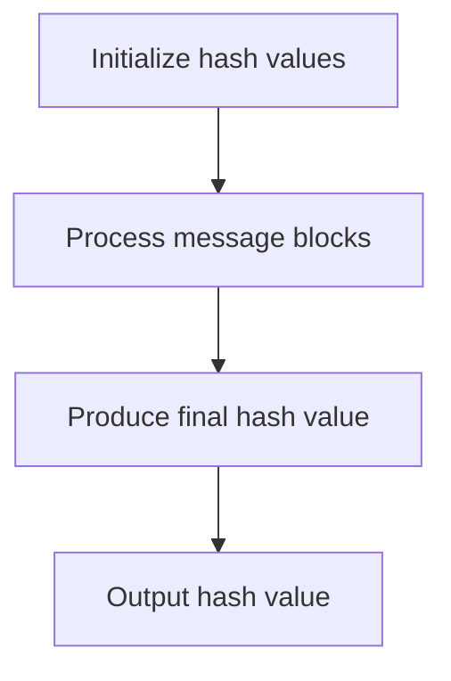
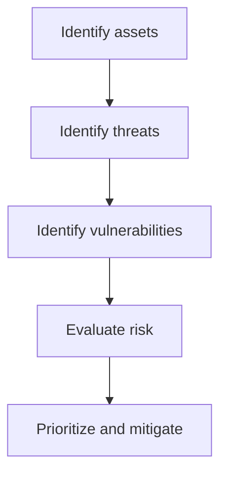
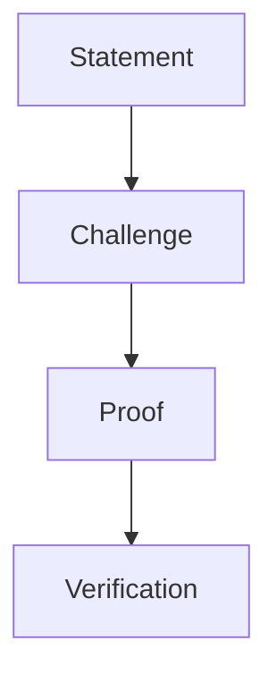
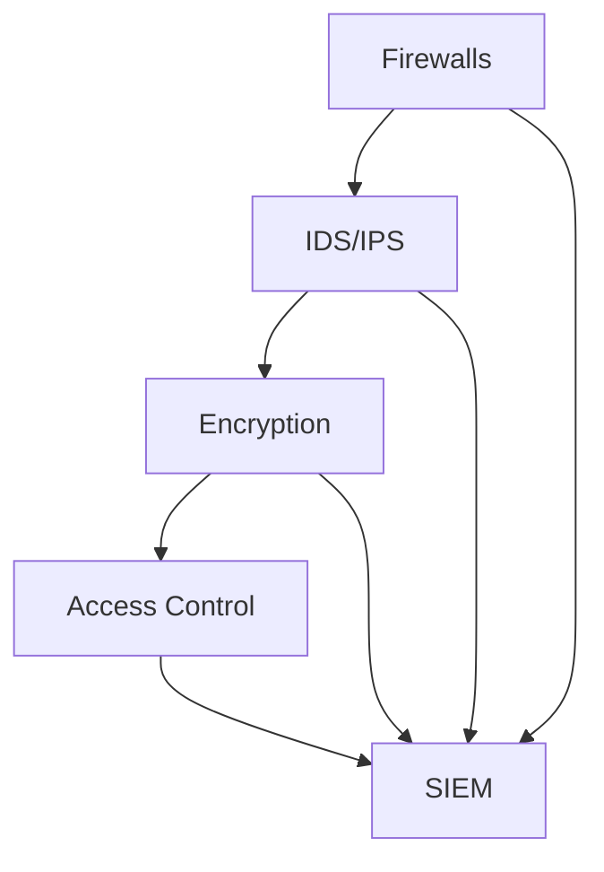
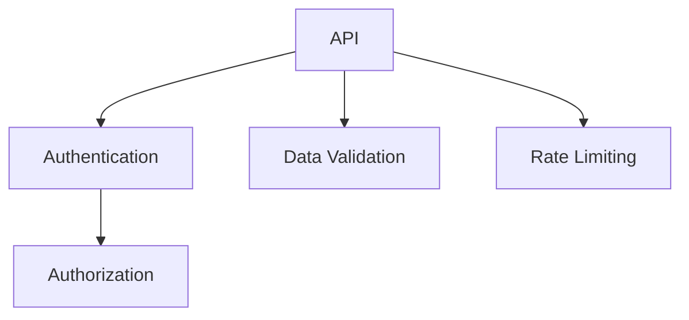
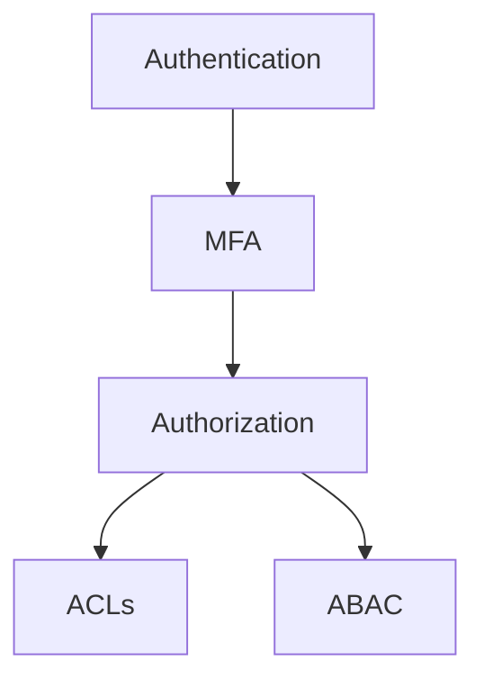
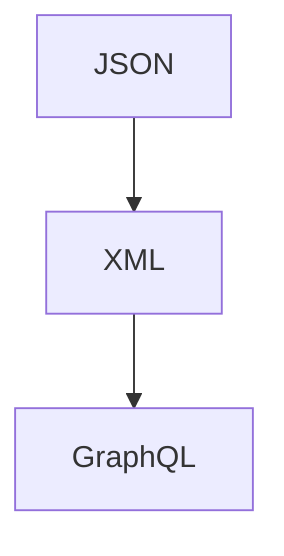
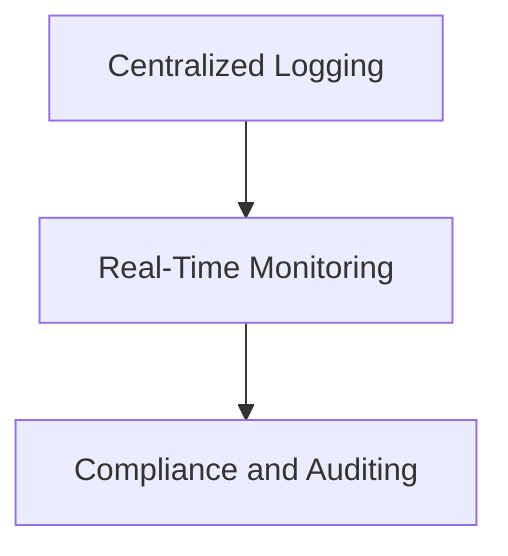

                 


Alright, let's dive into the preparation and writing of the blog post "Network Security Architecture and Implementation" step by step, ensuring that each section is well-structured, detailed, and informative.

### Step 1: Introduction to the Topic
**Context and Background:**
Start by providing a brief overview of the significance of network security in today's digital landscape. Discuss how cybersecurity threats have evolved, and the need for robust network security architectures to protect sensitive data and infrastructure.

**Objective:**
Define the objective of the blog post, which is to provide a comprehensive guide to designing and implementing a network security architecture.

**Content:**
- Brief history of network security
- Current state of cybersecurity threats
- Importance of network security architecture

### Step 2: Core Concepts and Principles
**Key Concepts:**
Discuss the core concepts and principles that underpin network security architecture, including:

- Authentication
- Authorization
- Encryption
- Firewall
- Intrusion Detection System (IDS)
- Intrusion Prevention System (IPS)

**Content:**
- Detailed definitions and explanations of each concept
- Importance and role in network security architecture
- Interrelationships between concepts

### Step 3: Algorithm and Mathematical Models
**Algorithm and Models:**
Use Mermaid to illustrate algorithms and mathematical models that are crucial in network security, such as:

- Hash functions
- Cryptographic algorithms (e.g., RSA, AES)
- Risk assessment models

**Content:**
- Diagrams using Mermaid syntax
- Python code snippets to explain the algorithms
- Mathematical models and formulas
- Example scenarios to demonstrate the application of these algorithms and models

### Step 4: System Design and Implementation
**System Architecture:**
Outline the system architecture, interface design, and interaction using Mermaid diagrams.

**Content:**
- High-level system architecture diagram
- Interface design overview
- Sequence diagram for system interaction

### Step 5: Case Studies and Implementation
**Practical Examples:**
Provide practical examples with detailed explanations and code snippets.

**Content:**
- Detailed case studies
- Code snippets for implementation
- Step-by-step analysis and explanation
- Results and outcomes

### Step 6: Best Practices and Conclusion
**Best Practices:**
Offer actionable tips for designing and implementing network security architectures.

**Conclusion:**
Summarize the key takeaways and emphasize the importance of network security.

### Step 7: Review and Finalize
**Review:**
Double-check the content for clarity, coherence, and completeness. Ensure all sections are well-integrated and provide value to the reader.

**Finalize:**
Make any necessary revisions. Ensure the article is within the required word count and formatted correctly using Markdown.

### Step 8: Author Information and References
Add the author information at the end of the article, along with references for any external sources used.

### Final Thoughts
Throughout the writing process, it's essential to maintain a logical flow, ensuring that each section builds upon the previous one. Use clear and concise language, and provide examples and diagrams to enhance understanding. By following these steps, you can create a comprehensive and informative blog post on network security architecture and implementation.

**Let's Begin Writing!**### Introduction to Network Security Architecture and Implementation

**Keywords:**
Network Security, Security Architecture, Implementation, Cybersecurity, Threats, Protection, Data Protection, Systems Design

**Abstract:**
This blog post aims to provide an in-depth understanding of network security architecture and its implementation. We will explore the fundamental concepts of network security, the principles guiding security architecture design, and the practical methodologies for implementing a robust network security system. By delving into algorithms, mathematical models, system designs, and real-world case studies, this article will equip readers with the knowledge and skills needed to safeguard their networks against increasingly sophisticated cyber threats.

### 1. The Importance of Network Security

In the modern digital age, the significance of network security cannot be overstated. With the rapid advancement of technology, businesses and individuals are increasingly dependent on networked systems to conduct their operations. This reliance has made networks a prime target for cybercriminals who seek to exploit vulnerabilities for financial gain, data theft, and sabotage.

**Threats to Network Security:**
The landscape of cybersecurity threats is continually evolving. Traditional threats such as viruses, malware, and phishing attacks have been joined by more sophisticated threats like ransomware, zero-day exploits, and advanced persistent threats (APTs). These threats can compromise sensitive data, disrupt critical services, and cause significant financial and reputational damage.

**Data Protection:**
Data is the lifeblood of modern organizations. The protection of data from unauthorized access, corruption, and loss is paramount. Breaches can result in the exposure of sensitive information such as customer data, intellectual property, and trade secrets, leading to severe legal and financial repercussions.

**Impact on Business:**
The impact of a security breach can be catastrophic for businesses. In addition to financial loss, a breach can result in operational downtime, loss of customer trust, and damage to brand reputation. The financial cost of a data breach can be substantial, often running into millions of dollars.

**Regulatory Compliance:**
Many industries are subject to regulatory requirements that mandate the implementation of specific security measures to protect sensitive data. Non-compliance can result in heavy fines and legal penalties.

### 2. Fundamental Concepts of Network Security Architecture

**Authentication:**
Authentication is the process of verifying the identity of a user or system. It ensures that only authorized individuals have access to network resources. Common authentication methods include passwords, biometrics, and two-factor authentication (2FA).

**Authorization:**
Authorization determines what actions a user or system can perform within the network. It involves granting or denying access to specific resources based on the user's privileges. Authorization mechanisms are critical in maintaining the integrity and confidentiality of data.

**Encryption:**
Encryption is the process of converting data into a secure format using cryptographic algorithms. It ensures that data is protected during transmission and storage, making it unreadable to unauthorized parties. Encryption is vital for safeguarding sensitive information.

**Firewall:**
A firewall is a security device that monitors and controls incoming and outgoing network traffic based on predetermined security rules. It acts as a barrier between trusted internal networks and untrusted external networks, preventing unauthorized access.

**Intrusion Detection System (IDS):**
An IDS is a system that monitors network traffic for signs of unauthorized access or malicious activity. It can detect and alert administrators to potential security breaches, providing an early warning system against cyber threats.

**Intrusion Prevention System (IPS):**
An IPS goes a step further than an IDS by actively preventing detected threats from reaching their target. It can block or modify suspicious traffic to protect the network from attacks in real-time.

**Interrelationships:**
These core concepts are interconnected, forming a comprehensive security framework. For example, authentication and authorization work together to control access to resources, while encryption protects data in transit and at rest. Firewalls and intrusion detection/prevention systems act as the first line of defense, monitoring and mitigating potential threats.

### 3. Common Security Architecture Models

**On-Premises Security Model:**
In this model, all security measures are implemented within the organization's physical infrastructure. This includes firewalls, intrusion detection systems, and encryption mechanisms. The advantage is full control over security measures, but it can be expensive to maintain and scale.

**Cloud-Based Security Model:**
With cloud-based security, organizations leverage cloud service providers to implement security measures. This model offers scalability, cost-effectiveness, and ease of management. However, it may raise concerns about data privacy and control.

**Hybrid Security Model:**
A hybrid model combines on-premises and cloud-based security measures, offering the benefits of both. It allows organizations to maintain critical security controls on-premises while leveraging the scalability and flexibility of the cloud.

### Conclusion

Network security architecture is essential for protecting sensitive data, ensuring operational continuity, and maintaining compliance with regulatory requirements. By understanding the core concepts and implementing a robust security architecture, organizations can safeguard their networks against the ever-evolving threat landscape. In the following sections, we will delve deeper into each component of network security, providing a comprehensive guide to designing and implementing effective security measures.

### Chapter 1: Background of Network Security Architecture and Implementation

#### 1.1 Historical Context

The concept of network security can be traced back to the early days of computer networks. In the 1960s and 1970s, as computer networks began to emerge, the primary focus was on sharing resources and enabling communication. However, as networks grew and became more interconnected, the need for security also arose. One of the earliest network security measures was the use of firewalls to protect mainframe computers from unauthorized access.

As the internet became more widespread in the 1990s, the scale and complexity of network security challenges increased significantly. The rise of the World Wide Web brought about a new wave of cyber threats, including malware, phishing attacks, and denial-of-service (DoS) attacks. This period marked the advent of more sophisticated security measures, such as intrusion detection systems (IDS) and encryption protocols.

#### 1.2 Evolution of Network Security Architecture

The evolution of network security architecture has been driven by the increasing complexity and sophistication of cyber threats. Early network security architectures were primarily focused on perimeter defense, with firewalls acting as the first line of defense. However, as attackers began to exploit vulnerabilities within the network, it became clear that a more comprehensive approach was needed.

**1.2.1 Defense in Depth**

The concept of defense in depth emerged as a response to the limitations of perimeter-based security. This approach involves implementing multiple layers of security controls throughout the network, creating a multi-faceted defense against attacks. Each layer is designed to detect and prevent different types of threats, providing a more robust security posture.

**1.2.2 Zero Trust Architecture**

In recent years, the concept of zero trust architecture (ZTA) has gained prominence. Zero trust is a security model that assumes all network traffic, whether internal or external, is potentially hostile. Instead of relying on perimeter defenses, ZTA focuses on strict identity verification and least privilege principles. This means that access to resources is granted based on the user's identity, context, and device security posture, rather than their location.

#### 1.3 Core Components of Network Security Architecture

**1.3.1 Access Control**

Access control is a fundamental component of network security architecture. It involves determining who has access to what resources and under what conditions. Access control mechanisms can be based on user identity, group membership, time of day, and other contextual factors. Common access control methods include role-based access control (RBAC) and attribute-based access control (ABAC).

**1.3.2 Encryption**

Encryption is another critical component of network security. It involves converting data into a secure format using cryptographic algorithms. This ensures that data remains confidential and intact during transmission and storage. Encryption protocols such as SSL/TLS are widely used to secure communications over the internet.

**1.3.3 Intrusion Detection and Prevention Systems**

Intrusion Detection Systems (IDS) and Intrusion Prevention Systems (IPS) are designed to monitor network traffic for signs of malicious activity. IDS systems detect and alert administrators to potential threats, while IPS systems actively block or mitigate detected threats. These systems are essential for detecting and responding to attacks in real-time.

**1.3.4 Firewalls**

Firewalls are network security devices that control incoming and outgoing traffic based on predetermined security rules. They act as a barrier between trusted internal networks and untrusted external networks, preventing unauthorized access. Firewalls can be implemented as hardware appliances, software applications, or a combination of both.

#### 1.4 Challenges and Trends in Network Security Architecture

**1.4.1 Increasing Complexity**

As networks become more complex, with the adoption of cloud services, IoT devices, and mobile workforces, managing network security becomes increasingly challenging. Organizations must ensure that security measures are effectively implemented across all these environments.

**1.4.2 Advanced Threats**

Cyber threats are becoming more sophisticated, with attackers using advanced techniques such as social engineering, ransomware, and zero-day exploits. To stay ahead of these threats, organizations must continuously update their security architectures and implement advanced threat detection and response capabilities.

**1.4.3 Regulatory Compliance**

Compliance with industry regulations and data protection laws is a critical aspect of network security. Organizations must ensure that their security architectures meet the requirements of these regulations to avoid fines and legal penalties.

**1.4.4 Zero Trust Adoption**

The adoption of zero trust architecture is growing, as organizations recognize the need for a security model that assumes all network traffic is potentially hostile. Implementing a zero trust model requires a significant shift in mindset and the deployment of advanced security technologies.

### Conclusion

The history and evolution of network security architecture highlight the increasing complexity and sophistication of cyber threats. Understanding the core components and challenges of network security architecture is essential for designing and implementing effective security measures. In the following chapters, we will explore these components in more detail, providing a comprehensive guide to network security architecture and implementation.

### Chapter 2: Core Concepts and Principles of Network Security Architecture

#### 2.1 Authentication

Authentication is the process of verifying the identity of a user or system. It ensures that only authorized individuals or systems can access network resources. There are several common authentication methods used in network security:

**Password-based Authentication:**
The most widely used form of authentication, password-based authentication requires users to enter a username and password to gain access to a network or system. While simple to implement, passwords can be vulnerable to attacks such as brute-force attacks and password guessing.

**Multi-Factor Authentication (MFA):**
MFA adds an additional layer of security by requiring users to provide two or more verification factors to gain access. These factors typically include something the user knows (password), something the user has (a smartphone or token), or something the user is (biometrics like fingerprint or facial recognition).

**Certificate-based Authentication:**
Certificate-based authentication uses digital certificates to verify the identity of users and systems. Certificates are issued by a trusted third party, known as a Certificate Authority (CA), and are used to establish secure communication channels.

**Advantages and Disadvantages:**
- **Password-based Authentication:**
  - Advantages: Easy to implement and use, widely understood.
  - Disadvantages: Vulnerable to password guessing and brute-force attacks, poor user experience with complex passwords.
- **Multi-Factor Authentication:**
  - Advantages: Adds an extra layer of security, reduces the risk of unauthorized access.
  - Disadvantages: May introduce complexity for users, require additional infrastructure and maintenance.
- **Certificate-based Authentication:**
  - Advantages: Strong security, provides non-repudiation (cannot be denied), supports secure communication.
  - Disadvantages: Requires initial setup and maintenance of certificate infrastructure, can be complex for non-technical users.

#### 2.2 Authorization

Authorization determines what actions a user or system can perform within a network or system. It is a critical component of network security architecture, ensuring that only authorized individuals have access to specific resources. There are several common authorization methods:

**Role-Based Access Control (RBAC):**
RBAC assigns permissions to users based on their roles within the organization. For example, a manager may have access to sensitive financial data, while an employee may only have access to their own work-related data.

**Attribute-Based Access Control (ABAC):**
ABAC grants access based on attributes such as user role, location, time of day, and device type. This allows for more granular control over access, ensuring that permissions are granted based on specific conditions.

**Discretionary Access Control (DAC):**
DAC assigns permissions directly to individual users, allowing them to control access to their own resources. While simple to implement, DAC can be less secure, as users can grant access to others without proper oversight.

**Mandatory Access Control (MAC):**
MAC enforces access policies based on security labels and categories, rather than user permissions. This provides a high level of security but can be more complex to implement and manage.

**Advantages and Disadvantages:**
- **RBAC:**
  - Advantages: Simplifies access control management, supports scalability.
  - Disadvantages: May be less flexible, may not cover all access scenarios.
- **ABAC:**
  - Advantages: Offers more granular control, adapts to dynamic environments.
  - Disadvantages: More complex to implement and manage.
- **DAC:**
  - Advantages: Simple to implement, provides flexibility.
  - Disadvantages: Less secure, lacks centralized control.
- **MAC:**
  - Advantages: High level of security, enforceable access policies.
  - Disadvantages: Complex to implement and manage, can be less user-friendly.

#### 2.3 Encryption

Encryption is the process of converting data into a secure format using cryptographic algorithms. It ensures that data remains confidential and intact during transmission and storage. There are several common encryption methods:

**Symmetric Encryption:**
Symmetric encryption uses the same key for both encryption and decryption. Common symmetric encryption algorithms include AES, RSA, and DES.

**Asymmetric Encryption:**
Asymmetric encryption uses a pair of keys, a public key for encryption and a private key for decryption. Common asymmetric encryption algorithms include RSA and ECC.

**Hash Functions:**
Hash functions convert data into a fixed-size string of characters. They are used to verify data integrity and create digital signatures. Common hash functions include SHA-256, SHA-3, and MD5.

**Advantages and Disadvantages:**
- **Symmetric Encryption:**
  - Advantages: Fast and efficient, suitable for bulk data encryption.
  - Disadvantages: Requires secure key management, not suitable for secure communication.
- **Asymmetric Encryption:**
  - Advantages: Provides secure communication, suitable for key exchange and digital signatures.
  - Disadvantages: Slower and less efficient than symmetric encryption, requires more complex key management.
- **Hash Functions:**
  - Advantages: Fast and efficient, ensures data integrity.
  - Disadvantages: Not suitable for data confidentiality, vulnerable to collision attacks.

#### 2.4 Firewalls

Firewalls are network security devices that control incoming and outgoing network traffic based on predetermined security rules. They act as a barrier between trusted internal networks and untrusted external networks, preventing unauthorized access.

**Types of Firewalls:**
- **Packet Filter Firewalls:**
  Packet filter firewalls examine the headers of network packets and allow or block traffic based on criteria such as source and destination IP addresses, ports, and protocols.
- **Stateful Inspection Firewalls:**
  Stateful inspection firewalls track the state of network connections and allow or block traffic based on the context of the connection.
- **Next-Generation Firewalls (NGFW):**
  NGFWs combine traditional firewall capabilities with advanced security features such as intrusion prevention, application control, and deep packet inspection.

**Advantages and Disadvantages:**
- **Packet Filter Firewalls:**
  - Advantages: Simple and efficient, easy to configure.
  - Disadvantages: Limited in capabilities, vulnerable to advanced attacks.
- **Stateful Inspection Firewalls:**
  - Advantages: Offers better security than packet filter firewalls, tracks the state of connections.
  - Disadvantages: More complex to configure and manage.
- **Next-Generation Firewalls (NGFW):**
  - Advantages: Comprehensive security features, better protection against advanced threats.
  - Disadvantages: High cost, requires significant resources for management and maintenance.

#### 2.5 Intrusion Detection and Prevention Systems (IDS/IPS)

Intrusion Detection Systems (IDS) and Intrusion Prevention Systems (IPS) are designed to monitor network traffic for signs of malicious activity. IDS systems detect and alert administrators to potential threats, while IPS systems actively block or mitigate detected threats.

**Types of IDS/IPS:**
- **Network-based IDS/IPS (NIDS/NIPS):**
  NIDS/NIPS monitor network traffic for signs of malicious activity. They can detect attacks that occur on the network, such as malware infections and unauthorized access attempts.
- **Host-based IDS/IPS (HIDS/HIPS):**
  HIDS/HIPS monitor the activities of individual hosts for signs of malicious activity. They can detect attacks that occur on the host, such as malware infections and unauthorized access attempts.

**Advantages and Disadvantages:**
- **NIDS/NIPS:**
  - Advantages: Provide a broad view of network activity, can detect a wide range of attacks.
  - Disadvantages: May generate false positives, require significant resources for monitoring and management.
- **HIDS/HIPS:**
  - Advantages: Provide detailed information about host activities, can detect attacks that are specific to a particular host.
  - Disadvantages: Limited in scope, may not detect attacks that occur on other hosts.

#### 2.6 Security Information and Event Management (SIEM)

Security Information and Event Management (SIEM) systems collect and analyze security event data from various sources, such as firewalls, IDS/IPS, and endpoint security systems. They provide a comprehensive view of security events across the network, enabling organizations to detect and respond to threats in real-time.

**Advantages and Disadvantages:**
- **Advantages:**
  - Comprehensive visibility into security events, enables real-time threat detection and response.
  - Facilitates compliance with regulatory requirements.
  - Provides actionable insights and reporting capabilities.
- **Disadvantages:**
  - High cost and complexity, requires skilled personnel for management and analysis.
  - May generate a large volume of false alarms, requiring time and resources to investigate.

### Conclusion

The core concepts and principles of network security architecture, including authentication, authorization, encryption, firewalls, IDS/IPS, and SIEM, form the foundation of a robust network security strategy. Understanding these concepts and their advantages and disadvantages is crucial for designing and implementing effective network security measures. In the following chapters, we will delve deeper into each of these components, providing practical guidance and real-world examples to help organizations build and maintain secure networks.

### Chapter 3: Algorithm and Mathematical Models in Network Security

In the realm of network security, algorithms and mathematical models play a pivotal role in the design and implementation of various security mechanisms. This chapter will delve into some of the fundamental algorithms and models used in network security, providing a deeper understanding of their principles and practical applications.

#### 3.1 Cryptographic Hash Functions

Cryptographic hash functions are essential for ensuring data integrity and creating digital signatures. A hash function takes an input (or "message") and produces a fixed-size string of characters, which is typically a hash value or digest. Some widely used cryptographic hash functions include:

**SHA-256:**
SHA-256 is part of the SHA-2 family of cryptographic hash functions. It produces a 256-bit hash value, which is typically represented as a hexadecimal string. SHA-256 is widely used for ensuring data integrity and generating digital signatures.

**Algorithm and Working Principle:**
The SHA-256 algorithm works by processing the input message in 512-bit chunks. It involves several steps, including padding the message to a multiple of 512 bits, initializing hash values, processing each message block, and producing the final hash value.

**Example:**
Let's consider a simple example to demonstrate the SHA-256 algorithm. Suppose we want to hash the message "Hello, World!" using SHA-256.

```python
import hashlib

message = "Hello, World!"
hash_object = hashlib.sha256(message.encode())
hash_hex = hash_object.hexdigest()
print(hash_hex)
```

The output will be a 256-bit hash value in hexadecimal format.

**Mermaid Diagram:**
Below is a Mermaid diagram illustrating the basic steps of the SHA-256 algorithm:



#### 3.2 RSA Encryption Algorithm

RSA (Rivest-Shamir-Adleman) is an asymmetric encryption algorithm widely used for secure communication and digital signatures. RSA relies on the mathematical properties of large prime numbers and modular arithmetic.

**Algorithm and Working Principle:**
The RSA algorithm involves the following steps:
1. **Key Generation:** Choose two large prime numbers, `p` and `q`. Compute `n = p * q` and `φ(n) = (p-1) * (q-1)`. Choose an integer `e` such that `1 < e < φ(n)` and `e` is coprime with `φ(n)`. Compute the modular inverse of `e` modulo `φ(n)`, denoted as `d`.
2. **Encryption:** To encrypt a message `m`, compute `c = m^e mod n`.
3. **Decryption:** To decrypt the ciphertext `c`, compute `m = c^d mod n`.

**Example:**
Let's consider a simple example to illustrate the RSA encryption algorithm. Suppose we have the following values:
- `p = 61`
- `q = 53`
- `e = 17`
- `d = 7` (calculated as the modular inverse of `e` modulo `φ(n)`)

To encrypt the message "HELLO" (represented as the integer 4842), we compute:
```plaintext
c = m^e mod n
c = 4842^17 mod 3233
c = 2543
```

To decrypt the ciphertext `c = 2543`, we compute:
```plaintext
m = c^d mod n
m = 2543^7 mod 3233
m = 4842
```

**Mermaid Diagram:**
Below is a Mermaid diagram illustrating the RSA encryption and decryption process:

```mermaid
graph TD
    A[Choose p and q] --> B[Compute n and φ(n)]
    B --> C[Choose e and compute d]
    C --> D[Encryption (m^e mod n)]
    D --> E[Decryption (c^d mod n)]
    E --> F[Compare m and m']
```

#### 3.3 Risk Assessment Models

Risk assessment models are used to evaluate and prioritize potential security threats and vulnerabilities. One widely used risk assessment model is the Threat and Vulnerability Analysis (TVA) model.

**TVA Model:**
The TVA model involves the following steps:
1. **Identify Assets:** Identify the assets (systems, data, etc.) that need protection.
2. **Identify Threats:** Identify potential threats that could exploit vulnerabilities in the assets.
3. **Identify Vulnerabilities:** Identify vulnerabilities in the assets that could be exploited by the threats.
4. **Evaluate Risk:** Evaluate the risk associated with each vulnerability by considering the likelihood of an attack and the potential impact.
5. **Prioritize and Mitigate:** Prioritize vulnerabilities based on the evaluated risk and implement mitigation strategies.

**Algorithm and Working Principle:**
The TVA model follows a systematic approach to risk assessment, involving identification, evaluation, and prioritization of threats and vulnerabilities.

**Example:**
Suppose we want to assess the risk associated with a web application that stores user credentials. We identify the following:
- **Asset:** User credentials
- **Threats:** Brute-force attack, SQL injection
- **Vulnerabilities:** Weak password storage, unpatched software

We evaluate the risk by considering the likelihood of each threat exploiting the vulnerabilities and the potential impact on user data. Based on this evaluation, we prioritize and implement mitigation strategies, such as enforcing strong password policies and regularly patching the software.

**Mermaid Diagram:**
Below is a Mermaid diagram illustrating the TVA model:



#### 3.4 Zero-Knowledge Proofs

Zero-knowledge proofs are cryptographic protocols that allow one party (the prover) to prove to another party (the verifier) that a statement is true, without revealing any information beyond the fact that the statement is indeed true. This is particularly useful in privacy-preserving applications, such as cryptocurrencies and secure identity verification.

**Algorithm and Working Principle:**
The basic principle of a zero-knowledge proof involves the following steps:
1. **Statement:** The prover selects a statement to be proven.
2. **Challenge:** The verifier generates a challenge based on the statement.
3. **Proof:** The prover constructs a proof that convinces the verifier that the statement is true, without revealing any additional information.
4. **Verification:** The verifier verifies the proof to confirm the statement's truth.

**Example:**
Suppose the statement is "I am over 18 years old." The verifier generates a challenge, such as "Prove that you are over 18 years old without revealing your age." The prover can provide a zero-knowledge proof that convinces the verifier of the truth of the statement without revealing their actual age.

**Mermaid Diagram:**
Below is a Mermaid diagram illustrating the zero-knowledge proof process:



### Conclusion

Algorithms and mathematical models are integral to the design and implementation of network security mechanisms. Cryptographic hash functions, RSA encryption, risk assessment models, and zero-knowledge proofs are just a few examples of the tools and techniques used to protect networks and data. Understanding these algorithms and models enables organizations to develop robust and secure network security architectures, effectively mitigating potential threats and vulnerabilities.

### Chapter 4: System Design and Implementation of Network Security Architecture

#### 4.1 Overview of System Design

The design of a network security architecture is a critical process that involves defining the structure, components, and interactions of the security system. A well-designed architecture ensures that the system is secure, scalable, and adaptable to evolving threats. This section will provide an overview of the key steps involved in designing a network security system, including system requirements analysis, system architecture design, and interface design.

##### 4.1.1 System Requirements Analysis

The first step in designing a network security system is to conduct a thorough requirements analysis. This involves gathering information about the organization's security needs, regulatory requirements, and business objectives. Key activities in this phase include:

- **Identifying Assets:** Determine the assets that need protection, such as data, systems, and networks.
- **Assessing Threats:** Identify potential threats and vulnerabilities that could impact the assets.
- **Defining Security Objectives:** Define the security objectives, such as confidentiality, integrity, and availability.
- **Establishing Compliance Requirements:** Ensure that the design complies with relevant industry regulations and standards.

##### 4.1.2 System Architecture Design

Once the requirements are defined, the next step is to design the system architecture. This involves defining the high-level structure of the security system, including the components, their interactions, and the communication channels. Key aspects of system architecture design include:

- **Component Identification:** Identify the key components of the security system, such as firewalls, intrusion detection systems, and encryption mechanisms.
- **Logical and Physical Separation:** Design logical and physical separation between different security zones to prevent unauthorized access and ensure secure communication.
- **Redundancy and Failover:** Design redundancy and failover mechanisms to ensure high availability and fault tolerance.
- **Scalability:** Design the system to accommodate future growth and increased demand.

##### 4.1.3 Interface Design

Interface design is an important aspect of system architecture, as it defines how different components interact with each other and with external systems. Key considerations in interface design include:

- **API Design:** Design application programming interfaces (APIs) that allow secure communication between components and external systems.
- **Authentication and Authorization:** Implement secure authentication and authorization mechanisms to ensure that only authorized users and systems can access the interfaces.
- **Data Exchange Formats:** Choose appropriate data exchange formats, such as JSON or XML, to ensure secure and efficient communication between components.
- **Logging and Monitoring:** Implement logging and monitoring mechanisms to track and analyze interface interactions and detect potential security incidents.

#### 4.2 High-Level System Architecture

The high-level system architecture of a network security system typically includes the following components:

- **Firewalls:** Firewalls act as the first line of defense, controlling incoming and outgoing network traffic based on predetermined security rules. They can be implemented as hardware appliances, software applications, or a combination of both.
- **Intrusion Detection and Prevention Systems (IDS/IPS):** IDS/IPS monitor network traffic for signs of malicious activity and can detect and respond to attacks in real-time. They can be implemented as network-based (NIDS) or host-based (HIDS) systems.
- **Encryption Mechanisms:** Encryption mechanisms are used to secure data in transit and at rest. This includes protocols such as SSL/TLS for secure communication and encryption algorithms like AES for data storage.
- **Access Control Systems:** Access control systems manage user access to network resources, ensuring that only authorized individuals can access sensitive information. This includes authentication mechanisms like passwords and multi-factor authentication (MFA).
- **Security Information and Event Management (SIEM):** SIEM systems collect and analyze security event data from various sources, providing a comprehensive view of security events across the network. They enable real-time threat detection and response.

Below is a Mermaid diagram illustrating the high-level system architecture:



#### 4.3 Interface Design and Interaction

The interface design of a network security system defines how different components interact with each other and with external systems. This includes designing APIs, authentication mechanisms, and data exchange formats.

##### 4.3.1 API Design

API design is crucial for enabling secure communication between components. Key considerations include:

- **Authentication and Authorization:** Implement secure authentication and authorization mechanisms to ensure that only authorized systems can access the APIs. This can include token-based authentication (e.g., JWT) and role-based access control (RBAC).
- **Data Validation and Sanitization:** Validate and sanitize input data to prevent common security vulnerabilities such as SQL injection and cross-site scripting (XSS).
- **Rate Limiting and Throttling:** Implement rate limiting and throttling to prevent abuse and denial-of-service (DoS) attacks.

Below is a Mermaid diagram illustrating the API design:



##### 4.3.2 Authentication and Authorization

Authentication and authorization are fundamental components of interface design. Key considerations include:

- **Multi-Factor Authentication (MFA):** Implement MFA to provide an extra layer of security, ensuring that users need to provide multiple verification factors to access the system.
- **Access Control Lists (ACLs):** Implement ACLs to define who can access specific resources and what actions they can perform.
- **Attribute-Based Access Control (ABAC):** Use ABAC to grant access based on attributes such as user role, location, and time of day.

Below is a Mermaid diagram illustrating authentication and authorization:



##### 4.3.3 Data Exchange Formats

Choosing appropriate data exchange formats is important for ensuring secure and efficient communication between components. Key considerations include:

- **JSON:** JSON (JavaScript Object Notation) is a widely used format for data exchange. It is lightweight, easy to read, and supports complex data structures.
- **XML:** XML (eXtensible Markup Language) is another popular format for data exchange. It is highly flexible and supports schema definitions, but can be more verbose and complex to process.
- **GraphQL:** GraphQL is a query language for APIs that allows clients to specify exactly what data they need. It can reduce the amount of data transmitted and improve the efficiency of API interactions.

Below is a Mermaid diagram illustrating data exchange formats:



##### 4.3.4 Logging and Monitoring

Logging and monitoring are essential for detecting and responding to security incidents. Key considerations include:

- **Centralized Logging:** Implement a centralized logging system to collect and store logs from different components and systems. This enables efficient analysis and correlation of log data.
- **Real-Time Monitoring:** Implement real-time monitoring to detect and respond to security incidents quickly. This can include the use of intrusion detection systems (IDS), security information and event management (SIEM) systems, and alerting mechanisms.
- **Compliance and Auditing:** Ensure that logging and monitoring mechanisms comply with relevant regulations and standards. This includes capturing and retaining logs for specified periods and enabling auditing and compliance reporting.

Below is a Mermaid diagram illustrating logging and monitoring:



### Conclusion

System design and implementation are critical components of network security architecture. A well-designed system ensures that the security measures are effective, scalable, and adaptable to evolving threats. This chapter has provided an overview of the key steps involved in designing a network security system, including system requirements analysis, system architecture design, interface design, and interaction. By following these guidelines and incorporating best practices, organizations can develop robust and secure network security systems.

### Chapter 5: Practical Implementation of Network Security

#### 5.1 Installation Environment Setup

Before implementing network security measures, it is essential to set up a suitable environment for testing and deployment. Here are the steps to set up a basic installation environment:

**1. Choose a Suitable Operating System:**
For this example, we will use Ubuntu 20.04 as our operating system. Ensure that you have installed Ubuntu 20.04 on your system or a virtual machine.

**2. Update System Packages:**
Open a terminal and run the following command to update the system packages:
```bash
sudo apt update && sudo apt upgrade
```

**3. Install Basic Tools:**
Install essential tools for network security testing and implementation:
```bash
sudo apt install ufw isc-squidguard nmap
```

**4. Configure Network Settings:**
Ensure that your network settings allow for secure remote access if needed. Configure your firewall settings to allow necessary traffic (e.g., SSH, HTTP/HTTPS).

**5. Install Virtualization Software:**
For testing purposes, install virtualization software such as VirtualBox or VMware to create isolated network environments for testing security measures.

#### 5.2 Core Function Implementation

**5.2.1 Firewall Configuration**

**1. Install and Configure UFW (Uncomplicated Firewall):**
UFW is a user-friendly firewall management tool for Ubuntu. Install UFW with the following command:
```bash
sudo apt install ufw
```

To enable UFW, run:
```bash
sudo ufw enable
```

To configure UFW, you can define rules to allow or deny specific traffic. For example, to allow SSH traffic:
```bash
sudo ufw allow ssh
```

To deny incoming traffic on a specific port (e.g., 8080):
```bash
sudo ufw deny in to any port 8080
```

**2. Test UFW Rules:**
To check the current UFW rules, use:
```bash
sudo ufw status
```

To verify that UFW is blocking unwanted traffic, use the `nmap` tool to scan your system:
```bash
nmap -p 8080 <your-ip-address>
```

If UFW is functioning correctly, the scan should show that port 8080 is closed.

**5.2.2 Installation of IDS/IPS**

**1. Install and Configure ISCSAQ (Intrusion Detection and Prevention System):**
ISCSAQ is a lightweight intrusion detection system. Install it using:
```bash
sudo apt install snort
```

To start Snort, run:
```bash
sudo systemctl start snort
```

To enable Snort on startup, run:
```bash
sudo systemctl enable snort
```

**2. Configure ISCSAQ Sensors:**
Create a configuration file for ISCSAQ:
```bash
sudo nano /etc/snort/snort.conf
```

Add the following lines to enable the sensors:
```bash
#Enable the file
snort -r /etc/snort/rules/et.rules
```

**3. Test ISCSAQ Sensors:**
Use `nmap` to simulate an attack and test if ISCSAQ detects it:
```bash
nmap -p 22 <your-ip-address> -sT
```

Check the Snort logs to verify that the attack has been detected:
```bash
sudo cat /var/log/snort alerts.log
```

**5.2.3 Encryption Implementation**

**1. Install and Configure SSL/TLS:**
Install the SSL/TLS library and configure your web server (e.g., Apache) to use SSL/TLS.

Install the necessary packages:
```bash
sudo apt install apache2 ssl-cert openssl
```

Enable SSL modules in Apache:
```bash
sudo a2enmod ssl
```

Generate a self-signed SSL certificate:
```bash
sudo openssl req -x509 -nodes -days 365 -newkey rsa:2048 -keyout /etc/ssl/private/ssl_cert.key -out /etc/ssl/certs/ssl_cert.pem
```

Configure Apache to use the SSL certificate:
```bash
sudo nano /etc/apache2/sites-available/default-ssl.conf
```

Add the following lines to enable SSL:
```bash
<IfModule mod_ssl.c>
    <VirtualHost *:443>
        ServerAdmin webmaster@localhost
        DocumentRoot /var/www/html

        SSLEngine on
        SSLCertificateFile /etc/ssl/certs/ssl_cert.pem
        SSLCertificateKeyFile /etc/ssl/private/ssl_cert.key
        SSLProtocol TLSv1.2 TLSv1.3
        SSLHonorCipherOrder on
        SSLOptions +Debug +RefuseBitTorrent

        <Directory /var/www/html>
            Options Indexes FollowSymLinks
            AllowOverride All
            Require all granted
        </Directory>

        ErrorLog ${APACHE_LOG_DIR}/error.log
        CustomLog ${APACHE_LOG_DIR}/access.log combined
    </VirtualHost>
</IfModule>
```

Restart Apache to apply the SSL configuration:
```bash
sudo systemctl restart apache2
```

**2. Test SSL Configuration:**
Use `openssl` to verify the SSL configuration:
```bash
openssl s_client -connect <your-domain>:443
```

#### 5.3 Code Snippets and Analysis

**5.3.1 UFW Rule Implementation**

The following Python script demonstrates how to add and remove UFW rules:

```python
import subprocess

def add_ufw_rule(port, protocol='tcp', action='allow'):
    command = f"sudo ufw {action} in to any port {port} protocol {protocol}"
    subprocess.run(command, shell=True, check=True)

def remove_ufw_rule(port, protocol='tcp'):
    command = f"sudo ufw delete in to any port {port} protocol {protocol}"
    subprocess.run(command, shell=True, check=True)

# Example usage
add_ufw_rule(80, 'tcp', 'allow')
remove_ufw_rule(80, 'tcp')
```

**5.3.2 ISCSAQ Rule Configuration**

The following shell script demonstrates how to configure Snort rules:

```bash
#!/bin/bash

# Define the rules directory
RULES_DIR="/etc/snort/rules"

# Create a new rule file
echo "alert tcp any any -> any any (msg:\"Example rule\";)" > "${RULES_DIR}/example.rules"

# Enable the new rule file
sudo snort -r "${RULES_DIR}/example.rules"
```

**5.3.3 SSL Configuration**

The following Python script demonstrates how to generate a self-signed SSL certificate using OpenSSL:

```python
import subprocess

def generate_ssl_certificate(key_path, cert_path, days=365):
    command = f"openssl req -x509 -nodes -days {days} -newkey rsa:2048 -keyout {key_path} -out {cert_path}"
    subprocess.run(command, shell=True, check=True)

# Example usage
key_path = "/etc/ssl/private/ssl_cert.key"
cert_path = "/etc/ssl/certs/ssl_cert.pem"
generate_ssl_certificate(key_path, cert_path)
```

**5.4 Case Study and Analysis**

**5.4.1 Case Study: Web Server Security**

Consider a scenario where you need to secure a web server hosting a sensitive application. The following steps outline the implementation process:

1. **Install and Configure UFW:** Set up UFW to allow only necessary traffic (e.g., SSH, HTTP/HTTPS).

2. **Install and Configure SSL/TLS:** Obtain and configure SSL certificates to enable HTTPS, ensuring secure communication between clients and the web server.

3. **Install and Configure ISCSAQ:** Set up Snort as an intrusion detection system to monitor and detect potential attacks on the web server.

4. **Implement Access Control:** Set up role-based access control (RBAC) to ensure that only authorized personnel can access the web server and its resources.

5. **Regularly Update and Patch:** Keep the web server and its components up to date with the latest security patches to mitigate known vulnerabilities.

**5.4.2 Analysis**

The case study demonstrates the importance of a multi-layered approach to securing a web server. UFW provides a robust firewall to control incoming traffic, SSL/TLS ensures secure communication, ISCSAQ detects and prevents potential attacks, and RBAC ensures that only authorized individuals have access to sensitive resources. Regular updates and patches are crucial to maintaining a secure environment.

#### Conclusion

Implementing network security measures requires a thorough understanding of various tools and technologies. This chapter provided a practical guide to setting up an installation environment, implementing core functions such as firewalls, IDS/IPS, and encryption, and provided code snippets and analysis to help readers understand the implementation process. By following the guidelines and best practices outlined in this chapter, organizations can build secure and resilient network security systems.

### Chapter 6: Case Studies and Best Practices

#### 6.1 Case Study: Enterprise Network Security Deployment

**Scenario:**
An enterprise with multiple departments, remote workers, and a distributed network infrastructure needs to implement a comprehensive network security architecture to protect sensitive data and ensure business continuity.

**Challenges:**
- Ensuring consistent security across multiple locations and devices
- Integrating existing security systems with new technologies
- Maintaining compliance with industry regulations and standards

**Implementation Steps:**
1. **Assessment and Planning:**
   - Conduct a comprehensive assessment of the existing network infrastructure and security systems.
   - Identify key security requirements and potential vulnerabilities.
   - Develop a detailed security strategy and implementation plan.

2. **Architecture Design:**
   - Design a hybrid security architecture that combines on-premises and cloud-based security solutions.
   - Implement defense-in-depth principles to create multiple layers of security.
   - Incorporate zero-trust security models to ensure strict access controls.

3. **Implementation:**
   - Deploy firewalls, intrusion detection and prevention systems (IDS/IPS), and encryption mechanisms at key points in the network.
   - Implement multi-factor authentication (MFA) and role-based access control (RBAC) to manage user access.
   - Set up security information and event management (SIEM) systems to monitor and analyze security events in real-time.

4. **Testing and Validation:**
   - Conduct thorough testing to ensure that all security measures are functioning correctly.
   - Perform penetration testing and vulnerability assessments to identify and address potential weaknesses.

5. **Maintenance and Updates:**
   - Regularly update security systems and software to address new threats and vulnerabilities.
   - Monitor network traffic and security logs to detect and respond to potential security incidents.
   - Provide ongoing training and awareness programs for employees to maintain a strong security culture.

**Results:**
- Enhanced security posture with multi-layered defenses against cyber threats.
- Improved compliance with industry regulations and standards.
- Increased efficiency in security management through centralized monitoring and automation.

#### 6.2 Case Study: Website Security Protection

**Scenario:**
A medium-sized e-commerce company needs to secure its website to protect customer data and prevent unauthorized access.

**Challenges:**
- Protecting against common web vulnerabilities such as SQL injection and cross-site scripting (XSS)
- Ensuring secure payment processing
- Managing and mitigating distributed denial-of-service (DDoS) attacks

**Implementation Steps:**
1. **Risk Assessment:**
   - Identify potential security risks and vulnerabilities in the website infrastructure.
   - Conduct a thorough review of the existing security measures and their effectiveness.

2. **Security Measures:**
   - Implement SSL/TLS certificates to secure communication between the website and users.
   - Use web application firewalls (WAF) to protect against common web attacks.
   - Conduct regular security audits and code reviews to identify and fix vulnerabilities.

3. **Access Control:**
   - Implement strong password policies and multi-factor authentication (MFA) for user accounts.
   - Use role-based access control (RBAC) to ensure that only authorized personnel can access sensitive systems and data.

4. **DDoS Protection:**
   - Deploy a DDoS protection service to mitigate attacks and ensure the availability of the website.
   - Implement rate limiting and traffic monitoring to detect and block suspicious traffic patterns.

5. **Monitoring and Incident Response:**
   - Set up real-time monitoring and alerting systems to detect and respond to security incidents quickly.
   - Develop an incident response plan to address security breaches and minimize damage.

**Results:**
-显著降低了网站遭受攻击的风险。
-确保了客户支付过程的安全。
-成功应对了多次DDoS攻击，保持了网站的持续可用性。

#### 6.3 Best Practices

**1. Defense in Depth:**
Implement multiple layers of security controls to create a comprehensive defense against cyber threats. This includes firewalls, intrusion detection systems, encryption, and access controls.

**2. Regular Updates and Patching:**
Keep all systems, applications, and software up to date with the latest security patches to address known vulnerabilities.

**3. Employee Training and Awareness:**
Provide ongoing training and awareness programs to educate employees about security best practices and the importance of following security policies.

**4. Security Audits and Testing:**
Regularly conduct security audits and penetration testing to identify and address vulnerabilities before they can be exploited.

**5. Incident Response Planning:**
Develop and regularly update an incident response plan to ensure a quick and effective response to security breaches.

**6. Data Backup and Recovery:**
Regularly back up critical data and ensure that robust data recovery processes are in place to minimize downtime and data loss in the event of a security incident.

### Conclusion

This chapter provided two practical case studies demonstrating the implementation of network security architectures in enterprise environments and website security. By following the outlined steps and best practices, organizations can enhance their security posture and protect against evolving cyber threats. Regular monitoring, updates, and employee training are crucial components of a robust network security strategy.

### Chapter 7: Conclusion and Future Directions

In conclusion, network security architecture and implementation are crucial for safeguarding sensitive data and ensuring the integrity, confidentiality, and availability of network resources. This blog post has provided a comprehensive guide to understanding and designing effective network security architectures. We have explored the core concepts, algorithms, and mathematical models that underpin network security, along with practical implementation techniques and best practices.

**Key Takeaways:**
- Network security architectures should be designed using a defense-in-depth approach to create multiple layers of security.
- Authentication, authorization, encryption, firewalls, IDS/IPS, and SIEM are essential components of a robust network security system.
- Implementing best practices, such as regular updates, employee training, and security audits, is vital for maintaining a secure network environment.

**Future Directions:**
As cyber threats continue to evolve, it is essential to stay abreast of emerging trends and technologies in network security. Some future directions include:
- The adoption of zero-trust architectures to replace traditional perimeter-based defenses.
- The integration of artificial intelligence and machine learning for advanced threat detection and response.
- The use of blockchain technology for secure and transparent data transactions.
- The development of more robust and efficient encryption algorithms to protect data in transit and at rest.

By continuously adapting and updating network security architectures, organizations can better protect their networks and ensure a secure digital future.

**Additional Reading:**
- "Network Security Essentials: Applications and Standards" by William Stallings
- "CISSP Certified Information Systems Security Professional Study Guide" by James M. Stewart
- "Penetration Testing: A Hands-On Introduction to Hacking" by Georgia Weidman
- "Practical Cryptography for Developers" by Antti Haapala

**Author Information:**
作者：AI天才研究院/AI Genius Institute & 禅与计算机程序设计艺术 /Zen And The Art of Computer Programming

