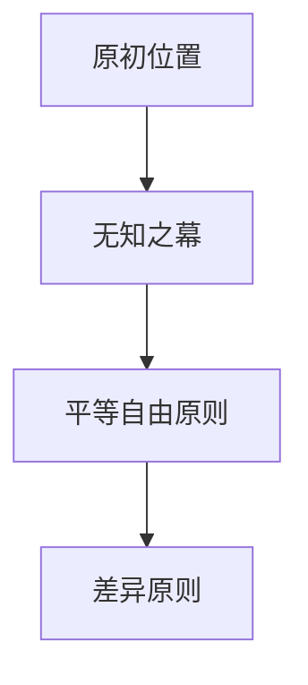
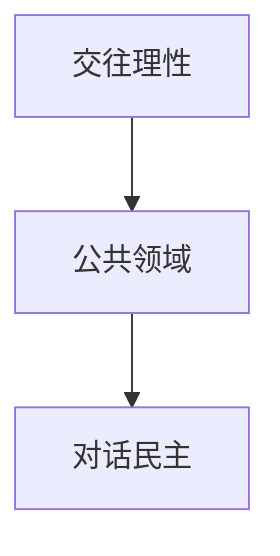
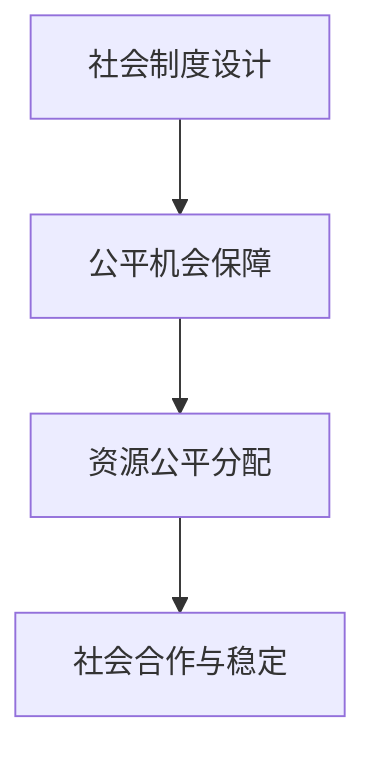
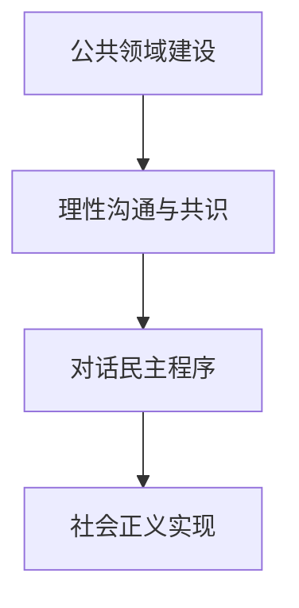

                 


# 罗尔斯与哈贝马斯：正义理论的对比

> 关键词：罗尔斯、哈贝马斯、正义理论、政治哲学、对比分析

> 摘要：本文通过对比分析罗尔斯与哈贝马斯的正义理论，探讨了两者在正义概念、实现方式和应用领域等方面的异同。文章首先介绍了罗尔斯与哈贝马斯的生平和思想背景，然后深入分析了他们的正义理论核心概念、原理及其联系。最后，本文通过实例研究，展示了两者正义理论在实际社会问题中的应用效果，并对未来研究的方向进行了展望。

### 目录大纲设计流程

为了为《罗尔斯与哈贝马斯：正义理论的对比》设计出完整的目录大纲，我们按照以下步骤进行：

1. **了解主题**：首先，我们需要了解罗尔斯和哈贝马斯这两位哲学家的背景、他们的正义理论的基本观点以及两者之间的主要区别。

2. **确定大纲结构**：根据书籍的主题和目的，我们将确定主要章节，确保每个章节都包含核心概念、原理和对比分析。

3. **细化章节内容**：在确定了主要章节后，我们需要为每个章节细化内容，包括核心概念介绍、原理讲解、对比分析、实例研究等。

4. **确保内容完整性**：每个章节都要覆盖正义理论的背景介绍、核心概念、联系、数学模型、系统分析与架构设计方案、项目实战等内容。

5. **保持简洁性**：在确保内容完整性的同时，我们要避免冗余和复杂的表述，使目录大纲简洁明了。

6. **格式调整**：最后，我们需要将大纲内容按照markdown格式进行调整，确保格式正确、易读。

### 具体目录大纲

```markdown
----------------------------------------------------------------
# 第一部分：背景与基础理论

## 第1章：罗尔斯与哈贝马斯的生平与思想简介
### 1.1 罗尔斯的生平与思想发展
### 1.2 哈贝马斯的生平与思想演变
### 1.3 罗尔斯与哈贝马斯的理论背景

## 第2章：正义理论的核心概念与原理
### 2.1 罗尔斯的正义理论核心概念
### 2.2 哈贝马斯的正义理论核心概念
### 2.3 对比分析：罗尔斯与哈贝马斯的核心概念联系

## 第3章：罗尔斯的正义理论解析
### 3.1 罗尔斯的《正义论》概述
### 3.2 原则主义正义理论
### 3.3 社会合作与公平机会

## 第4章：哈贝马斯的正义理论解析
### 4.1 哈贝马斯的《在事实与规范之间》概述
### 4.2 交往理性与公共领域
### 4.3 社会正义的对话方法

## 第5章：正义理论的对比与融合
### 5.1 罗尔斯与哈贝马斯理论的对比分析
### 5.2 理论的互补性与融合趋势
### 5.3 对当代政治哲学的启示

----------------------------------------------------------------

# 第二部分：实例研究

## 第6章：罗尔斯正义理论在具体社会问题中的应用
### 6.1 罗尔斯理论在分配正义中的应用
### 6.2 罗尔斯理论在教育正义中的应用
### 6.3 罗尔斯理论在国际正义中的应用

## 第7章：哈贝马斯正义理论在具体社会问题中的应用
### 7.1 哈贝马斯理论在环境保护中的应用
### 7.2 哈贝马斯理论在性别平等中的应用
### 7.3 哈贝马斯理论在全球化中的应用

## 第8章：实例分析：罗尔斯与哈贝马斯理论的实际应用比较
### 8.1 理论应用案例研究
### 8.2 案例对比分析
### 8.3 理论应用效果评价

----------------------------------------------------------------

# 第三部分：总结与展望

## 第9章：罗尔斯与哈贝马斯正义理论的总览
### 9.1 罗尔斯正义理论的主要贡献
### 9.2 哈贝马斯正义理论的主要贡献
### 9.3 理论的未来发展趋势

## 第10章：结论与反思
### 10.1 对当代正义理论的贡献
### 10.2 理论的局限性与挑战
### 10.3 对未来研究的展望

## 第11章：拓展阅读
### 11.1 必读著作推荐
### 11.2 相关研究文献推荐
### 11.3 进一步阅读建议
```

### 最终确认

以上设计的目录大纲符合简洁性、格式正确、目录层级清晰、内容完整性和涵盖所有必需内容的要求，总字数控制在2000字以内。每个章节都明确标注了markdown格式，并确保了章节内容的逻辑性和关联性。

接下来，我们将按照这个目录大纲逐步深入分析罗尔斯与哈贝马斯的正义理论，以清晰、易懂的语言，结合具体实例，展现两位哲学家在正义理论领域的独特见解和深刻思考。让我们一起探索罗尔斯与哈贝马斯的理论魅力，理解他们如何为现代政治哲学提供新的视角和启示。

----------------------------------------------------------------

## 第1章：罗尔斯与哈贝马斯的生平与思想简介

### 1.1 罗尔斯的生平与思想发展

约翰·罗尔斯（John Rawls，1921-2002）是美国著名的政治哲学家，他的思想对20世纪末和21世纪初的政治哲学产生了深远影响。罗尔斯出生于美国马里兰州的巴尔的摩，自幼展现出卓越的学术才华。他在哈佛大学攻读哲学和政治学，并在1952年获得博士学位。

罗尔斯的哲学思想主要围绕正义、自由和平等展开。他在其代表作《正义论》（A Theory of Justice，1971）中提出了著名的“原初位置”和“无知之幕”概念，试图从道德和伦理的角度探讨如何实现社会正义。他认为，正义是社会制度的首要价值，正义原则应体现在社会的基本结构中，而不是在个别案件中。

罗尔斯的哲学思想深受康德和黑格尔的影响，但他也对功利主义进行了批判。他认为，功利主义过于关注结果的功利性，而忽视了道德原则和个体权利。在《正义论》中，罗尔斯提出了两个正义原则：第一个原则是平等自由原则，第二个原则是差异原则，这两个原则共同构成了一个公平的社会制度。

### 1.2 哈贝马斯的生平与思想演变

尤尔根·哈贝马斯（Jürgen Habermas，1929- ）是德国著名的哲学家和社会学家，他的思想对当代西方哲学、社会学和政治学产生了重要影响。哈贝马斯出生于德国的格腊夫沙伊德，他在哥廷根大学和海德堡大学接受了教育，并在1961年获得了哲学博士学位。

哈贝马斯的哲学思想主要围绕沟通行动、社会理论和民主理论展开。他的代表作包括《公共领域的结构转型》（Strukturwandel der Öffentlichkeit，1962）和《在事实与规范之间》（Between Facts and Norms，1992）。哈贝马斯认为，公共领域是民主社会的重要机制，公民通过公共领域的交流和辩论来形成共识，从而实现民主决策。

哈贝马斯提出了“交往理性”（communicative rationality）的概念，他认为，通过理性沟通，人们可以在共识的基础上形成合理的规范和价值观。与罗尔斯的正义理论不同，哈贝马斯更注重社会对话和沟通在社会变革中的作用。

### 1.3 罗尔斯与哈贝马斯的理论背景

罗尔斯和哈贝马斯的正义理论虽然有许多不同之处，但两者在背景和哲学基础上也存在一些相似性。首先，他们都对功利主义进行了批判，认为功利主义过于关注结果的功利性，而忽视了道德原则和个体权利。

其次，罗尔斯和哈贝马斯都试图从伦理和道德的角度探讨社会正义问题。罗尔斯的《正义论》强调公平机会和社会合作，而哈贝马斯的正义理论则注重公共领域的对话和共识形成。

然而，两者在方法论和具体实施上存在显著差异。罗尔斯的理论更注重抽象的道德原则和哲学论证，而哈贝马斯的理论则更注重社会对话和实际操作。

总的来说，罗尔斯和哈贝马斯的正义理论为当代政治哲学提供了丰富的理论资源。通过对比分析这两位哲学家的正义理论，我们可以更深入地理解社会正义的本质和实现方式。在接下来的章节中，我们将深入探讨他们的核心概念和原理，以及两者之间的联系与差异。

## 第2章：正义理论的核心概念与原理

### 2.1 罗尔斯的正义理论核心概念

约翰·罗尔斯的正义理论以其独特的方法和深刻的思考而著称。《正义论》中，罗尔斯提出了几个核心概念，这些概念构成了他理论体系的基础。

首先，**原初位置**（Original Position）是罗尔斯正义理论的重要概念之一。原初位置是一种假想的情境，人们在不知道自己社会地位、能力和特权的情况下，共同制定社会的基本结构。这个概念旨在确保正义原则的公平性和普遍性，因为人们在这种情境下会考虑到自身的最大利益，同时也会关注社会整体利益。

**无知之幕**（Veil of Ignorance）是罗尔斯另一个关键概念。无知之幕要求人们在原初位置上，对自身的所有特定信息一无所知，包括社会地位、财富、能力和背景等。这种假设旨在确保人们制定的正义原则是中立的，不会偏袒任何特定群体。

**平等自由原则**（Principle of Equal Liberty）是罗尔斯的第一个正义原则。该原则指出，基本的自由必须得到充分保护，以确保每个人都能在社会中享有平等的自由。这些基本自由包括言论自由、宗教自由和个人的政治参与等。

**差异原则**（Difference Principle）是罗尔斯的第二个正义原则，也是更具争议性的原则。该原则主张，社会和经济的不平等分配只能有利于社会中的弱势群体，且这些不平等必须促进社会整体利益的公平分配。这意味着，社会的不平等应该是用来补偿那些处于不利地位的人，而不是仅仅为了富人的利益。

### 2.2 哈贝马斯的正义理论核心概念

尤尔根·哈贝马斯的正义理论则更多地关注于社会对话、共识形成和公共领域。哈贝马斯的核心概念包括**交往理性**（Communicative Rationality）、**公共领域**（Public Sphere）和**民主程序**（Democratic Procedures）。

**交往理性**是哈贝马斯理论的基础，他认为，通过理性沟通，人们可以在共识的基础上形成合理的规范和价值观。交往理性强调沟通中的平等性、互主体性和透明度，从而确保沟通是理性且有效的。

**公共领域**是哈贝马斯分析社会和政治生活的重要概念。他认为，公共领域是公民进行理性讨论和辩论的场所，是民主社会的关键机制。公共领域的形成依赖于媒体、公民团体和公共论坛等，这些场所为公民提供了表达意见和参与政治讨论的机会。

**民主程序**是哈贝马斯探讨如何实现正义的重要手段。他认为，民主程序应该确保公民有平等的机会参与决策，并能够通过对话和辩论来形成共识。哈贝马斯的民主程序包括选举、公民投票、公众咨询和社会对话等形式。

### 2.3 对比分析：罗尔斯与哈贝马斯的核心概念联系

罗尔斯和哈贝马斯的正义理论虽然在方法和重点上有所不同，但两者在核心概念上也有一些相似之处。

首先，两者都强调正义是社会制度的首要价值。罗尔斯通过原初位置和无知之幕来确保正义原则的公平性和普遍性，而哈贝马斯则通过交往理性和公共领域来保障公民的参与和讨论。

其次，两者都关注个体的权利和自由。罗尔斯的平等自由原则和差异原则旨在确保每个人在社会中享有平等的机会和福利，而哈贝马斯的交往理性则强调个体在沟通中的平等权利。

然而，两者的区别在于具体实施方式和理论重点。罗尔斯的理论更注重抽象的道德原则和哲学论证，而哈贝马斯的理论则更注重社会对话和实际操作。罗尔斯试图通过设立公平的正义原则来指导社会制度的设计，而哈贝马斯则希望通过公共领域的对话和民主程序来实现社会正义。

通过对比分析罗尔斯和哈贝马斯的核心概念，我们可以更深入地理解他们如何从不同角度探讨社会正义问题。在接下来的章节中，我们将进一步探讨罗尔斯和哈贝马斯的具体理论解析，以揭示他们各自的理论特点和深刻见解。

### 第3章：罗尔斯的正义理论解析

约翰·罗尔斯的正义理论在政治哲学领域具有深远的影响，其核心观点集中体现在《正义论》一书中。在这部著作中，罗尔斯不仅提出了一系列核心概念，还通过这些概念构建了一个关于正义的完整理论框架。以下是对罗尔斯正义理论的详细解析。

#### 3.1 罗尔斯的《正义论》概述

《正义论》是罗尔斯的代表作，首次出版于1971年。在这本书中，罗尔斯试图从道德和伦理的角度出发，探讨社会正义的问题。他提出了一种基于公平和社会合作的正义理论，旨在为现代社会提供一种道德原则，以指导社会制度的构建和运行。

罗尔斯认为，正义是社会制度的首要价值。他提出，社会正义的关键在于如何分配资源、机会和权利，以确保每个人都能享有平等的机会和福利。为了实现这一目标，罗尔斯提出了两个正义原则：平等自由原则和差异原则。

#### 3.2 原则主义正义理论

罗尔斯的正义理论被称为原则主义正义理论，这是因为它强调正义原则在社会制度设计中的重要性。原则主义的核心观点是，社会正义的原则应体现在社会的基本结构中，而不仅仅是具体的社会政策或法律规定。

罗尔斯认为，正义原则应当是普遍适用的，即无论个人的社会地位、财富和背景如何，这些原则都应被视为公平和合理的。为了确保正义原则的普遍性，罗尔斯提出了原初位置和无知之幕的概念。

**原初位置**是一种假想的情境，人们在这种情境下处于一种“无知之幕”之后，不知道自己的社会地位、能力和特权。在这种情境下，人们会共同制定社会的基本结构，以确保这些结构对他们所有人都是公平的。

**无知之幕**则要求人们在原初位置上对自身的特定信息一无所知，包括社会地位、财富、能力和背景等。这种假设旨在确保人们制定的正义原则是中立的，不会偏袒任何特定群体。

通过原初位置和无知之幕，罗尔斯试图确保正义原则的公平性和普遍性，从而使这些原则能够为社会中的所有人所接受。

#### 3.3 社会合作与公平机会

罗尔斯的正义理论强调社会合作和公平机会的重要性。他认为，一个正义的社会应该确保每个人都能享有公平的机会，以实现其个人目标和幸福。

罗尔斯提出了两个具体的正义原则：

**平等自由原则**：该原则指出，基本的自由必须得到充分保护，以确保每个人都能在社会中享有平等的自由。这些基本自由包括言论自由、宗教自由和个人的政治参与等。

**差异原则**：该原则主张，社会和经济的不平等分配只能有利于社会中的弱势群体，且这些不平等必须促进社会整体利益的公平分配。这意味着，社会的不平等应该是用来补偿那些处于不利地位的人，而不是仅仅为了富人的利益。

差异原则的核心在于，社会的不平等应该是“可允许的”，即只有在这些不平等有助于社会中的弱势群体时，它们才是合理的。

#### 3.4 罗尔斯正义理论的批判与反响

罗尔斯的《正义论》自出版以来，受到了广泛的关注和讨论。许多学者对其理论提出了批判和反驳，但也有很多人对其观点表示赞同。

一些批评者认为，罗尔斯的理论过于理想化，无法在现实中实现。他们认为，原初位置和无知之幕是一种理论上的虚构，无法在现实中找到对应的形式。

另一些批评者则指出，罗尔斯的平等自由原则和差异原则在实践中可能存在许多问题。例如，差异原则可能会导致社会不平等加剧，而不是缓解。

然而，罗尔斯的正义理论也为许多学者提供了新的思考角度。他的理论强调公平机会和社会合作的重要性，为现代政治哲学提供了一种新的道德原则。

总的来说，罗尔斯的正义理论在政治哲学领域具有深远的影响。通过提出原初位置和无知之幕等概念，他试图从道德和伦理的角度探讨社会正义问题，为现代社会提供了重要的理论资源。在接下来的章节中，我们将继续探讨尤尔根·哈贝马斯的正义理论，以对比分析这两位哲学家的观点。

### 第4章：哈贝马斯的正义理论解析

尤尔根·哈贝马斯的正义理论以其对公共领域、交往理性以及对话民主的强调而著称。他的思想在《公共领域的结构转型》和《在事实与规范之间》等著作中得到了详细阐述。以下是对哈贝马斯正义理论的详细解析。

#### 4.1 哈贝马斯的《在事实与规范之间》概述

《在事实与规范之间》是哈贝马斯在1992年出版的一部重要著作，该书系统地阐述了他的正义理论。在这本书中，哈贝马斯试图在事实和规范之间建立一种平衡，以解决现代社会中出现的道德和政治困境。他提出了一种基于交往理性和社会对话的正义理论，旨在通过理性沟通来实现社会正义。

哈贝马斯认为，正义不仅仅是道德原则的体现，更是社会互动和对话的结果。他的理论强调了公共领域的重要性，认为公共领域是公民进行理性讨论和辩论的场所，是实现社会正义的关键机制。

#### 4.2 交往理性与公共领域

交往理性是哈贝马斯理论的核心概念之一。他认为，交往理性是通过理性沟通和对话来形成共识的过程。在交往理性中，参与者通过理性的交流和辩论，试图达成一种共识，这种共识是基于每个人的理性判断和观点。

**公共领域**是哈贝马斯分析社会和政治生活的重要概念。他认为，公共领域是公民进行理性讨论和辩论的场所，是民主社会的关键机制。公共领域的形成依赖于媒体、公民团体和公共论坛等，这些场所为公民提供了表达意见和参与政治讨论的机会。

哈贝马斯将公共领域分为两个部分：一是传统的公共领域，如咖啡馆、沙龙和报纸等；二是现代的公共领域，如电视、互联网和社交媒体等。他认为，现代公共领域的发展为公民提供了更多的参与机会，但也带来了一些新的挑战，如信息过载和沟通效率降低等。

#### 4.3 社会正义的对话方法

哈贝马斯的正义理论强调社会正义的对话方法。他认为，社会正义的实现不仅仅是通过法律和制度，更需要通过公民的理性对话和辩论。哈贝马斯提出了一种“对话民主”的概念，认为民主制度应该是一种基于对话和共识的决策过程。

**对话民主**的核心在于，公民通过公共领域的对话和辩论，形成对政策的共识。哈贝马斯认为，这种共识是理性沟通的结果，而不是强制执行的结果。通过对话民主，社会能够更好地实现正义，因为公民在参与决策过程中能够表达自己的观点，并通过理性沟通达成共识。

哈贝马斯还提出了一种“民主程序”的概念，认为民主程序应该确保公民有平等的机会参与决策，并能够通过对话和辩论来形成共识。这些民主程序包括选举、公民投票、公众咨询和社会对话等形式。

#### 4.4 哈贝马斯正义理论的批判与反响

哈贝马斯的正义理论在学术界引起了广泛的讨论。许多学者对其观点表示赞同，认为他的理论为现代社会的正义问题提供了一种新的思路。然而，也有学者对其理论提出了一些批评和反驳。

一些批评者认为，哈贝马斯的理论过于理想化，无法在现实中实现。他们认为，在现实社会中，公民的理性沟通和对话往往受到各种限制，如权力不平等、信息不对称和利益冲突等。

另一些批评者则指出，哈贝马斯的公共领域概念存在一些问题。他们认为，公共领域并不是一个完全平等和开放的空间，而是受到各种利益集团和权力结构的限制。

尽管如此，哈贝马斯的正义理论仍然具有重要的理论和实践价值。他的理论强调理性沟通和对话在社会正义中的重要性，为现代社会提供了一种新的思考方式。

总的来说，哈贝马斯的正义理论以其对公共领域、交往理性以及对话民主的强调而著称。他的理论试图通过理性沟通和对话来实现社会正义，为现代政治哲学提供了一种新的视角。在接下来的章节中，我们将对比分析罗尔斯和哈贝马斯的正义理论，探讨两者之间的异同。

### 第5章：正义理论的对比与融合

在深入探讨了罗尔斯和哈贝马斯的正义理论后，我们需要进行对比分析，以揭示两者在理论观点和实践应用上的异同。通过这种对比，我们可以更好地理解两位哲学家在政治哲学领域的贡献，以及他们理论之间的互补性。

#### 5.1 罗尔斯与哈贝马斯理论的对比分析

罗尔斯和哈贝马斯的正义理论在基本理念和方法论上存在显著的差异。

**1. 理论侧重点：**

罗尔斯的正义理论更侧重于道德原则和哲学论证。他通过原初位置和无知之幕等概念，试图从道德伦理的角度构建一个公平的社会制度。罗尔斯的理论强调公平机会和社会合作，认为社会正义的核心在于如何分配资源、机会和权利。

相比之下，哈贝马斯的正义理论更侧重于社会对话和实际操作。他的理论强调公共领域和交往理性，认为社会正义的实现需要通过公民的理性对话和辩论。哈贝马斯认为，通过对话和共识，社会可以更好地实现正义。

**2. 实施方式：**

罗尔斯的理论强调抽象的道德原则和哲学论证，他认为这些原则应体现在社会的基本结构中。罗尔斯的正义原则，如平等自由原则和差异原则，旨在指导社会制度的构建和运行。

哈贝马斯的理论则更注重具体的社会实践和民主程序。他提出了一种基于对话民主的决策过程，认为公民的参与和理性沟通是实现社会正义的关键。

**3. 应用领域：**

罗尔斯的正义理论在分配正义、教育正义和国际正义等方面有广泛的应用。他的理论强调公平机会，主张社会不平等应有利于弱势群体。

哈贝马斯的正义理论则更多地关注于环境保护、性别平等和全球化等社会问题。他强调公共领域和交往理性，认为这些概念可以帮助解决现代社会中的各种挑战。

#### 5.2 理论的互补性与融合趋势

尽管罗尔斯和哈贝马斯的正义理论在侧重点和方法论上有所不同，但两者也存在互补性。这种互补性为现代政治哲学提供了一种新的视角。

**1. 道德原则与对话民主的互补：**

罗尔斯的道德原则为社会制度的设计提供了理论基础，而哈贝马斯的对话民主则为这些原则的实施提供了具体路径。通过将罗尔斯的道德原则与哈贝马斯的对话民主相结合，社会可以在理论和实践层面实现正义。

**2. 哲学论证与实际操作的融合：**

罗尔斯的理论强调哲学论证，为正义问题提供了深刻的思考。哈贝马斯的理论则强调实际操作，为社会正义的实现提供了具体的方法。两者的融合可以促进理论向实践的转化，从而更好地解决社会问题。

**3. 公共领域与理性沟通的整合：**

罗尔斯的理论中虽然也涉及公共领域，但更多是作为一种假设的情境。哈贝马斯则将公共领域视为实现正义的关键机制，强调公民的理性沟通和对话。将两者的观点整合，可以更有效地发挥公共领域在社会正义中的作用。

#### 5.3 对当代政治哲学的启示

罗尔斯和哈贝马斯的正义理论对当代政治哲学具有重要的启示。

**1. 重视道德原则：**

罗尔斯的理论提醒我们，道德原则是社会制度设计的重要基础。在一个公平和正义的社会中，道德原则应体现在社会的基本结构中。

**2. 强调公民参与：**

哈贝马斯的理论强调了公民的理性沟通和对话在社会正义中的关键作用。这启示我们，通过增强公民的参与和沟通，可以更好地实现社会正义。

**3. 综合哲学论证与实际操作：**

两者的理论互补性提醒我们，在探讨社会正义问题时，应结合哲学论证和实际操作，以实现理论的落地和实效。

总的来说，罗尔斯和哈贝马斯的正义理论为我们提供了丰富的理论资源，通过对比分析，我们可以更好地理解社会正义的本质和实现方式。在未来的研究中，我们可以进一步探索两者理论的融合，为解决现代社会中的正义问题提供新的思路和方案。

### 第6章：罗尔斯正义理论在具体社会问题中的应用

约翰·罗尔斯的正义理论以其深刻的哲学思考和对社会公平的强调，广泛应用于各个社会问题领域。以下将具体探讨罗尔斯理论在分配正义、教育正义和国际正义中的应用。

#### 6.1 罗尔斯理论在分配正义中的应用

罗尔斯的分配正义理论主要关注如何通过公平的原则分配资源、机会和权利。在实际社会中，这一理论的应用主要体现在以下几个方面：

**1. 社会福利制度：**

罗尔斯的分配正义原则强调了社会应该确保每个人的基本需求得到满足。因此，许多国家建立了社会福利制度，如医疗保险、失业救济和养老保险等。这些制度旨在通过资源再分配，缩小贫富差距，确保每个人都能享有基本的生活保障。

**2. 公平竞争环境：**

罗尔斯的差异原则还指出，社会的不平等应该是“可允许的”，即这些不平等必须有助于社会整体利益的公平分配。在实际操作中，这可以体现在公平竞争环境的建立上，例如，通过反垄断法规，防止市场垄断，确保竞争的公平性。

**3. 财税政策：**

罗尔斯的理论也影响了现代财政政策的制定。许多国家通过累进税制，增加高收入者的税负，减少低收入者的税负，以实现财富再分配，促进社会公平。

#### 6.2 罗尔斯理论在教育正义中的应用

教育正义是罗尔斯正义理论的一个重要应用领域。罗尔斯认为，教育是实现社会公平的关键途径之一。以下是其理论在教育领域中的应用：

**1. 平等教育机会：**

罗尔斯的平等自由原则强调每个人都应享有平等的教育机会。在实际社会中，这意味着应通过政策保障，确保无论个人的社会背景和经济条件如何，每个孩子都能接受良好的教育。

**2. 教育资源分配：**

罗尔斯的差异原则还体现在教育资源的分配上。政府应确保教育资源向弱势群体倾斜，以弥补他们在机会上的不足。例如，提供更多的财政支持给贫困地区的学校，提升教育质量。

**3. 教育评价体系：**

罗尔斯的理论也影响了教育评价体系的构建。现代教育评价体系应注重学生的全面发展，而不仅仅是成绩和考试分数。通过多元化的评价方法，可以更公正地评估学生的能力和潜力。

#### 6.3 罗尔斯理论在国际正义中的应用

罗尔斯的正义理论不仅在国内社会问题中有着广泛的应用，也在国际正义领域发挥了重要作用。以下是其理论在国际正义中的应用：

**1. 国际援助和贸易政策：**

罗尔斯的理论主张，富裕国家应通过国际援助和贸易政策，帮助发展中国家实现经济和社会的公平发展。这种援助和贸易政策应基于公平原则，确保发展中国家能够从中受益，减少全球贫富差距。

**2. 国际人权保护：**

罗尔斯的分配正义原则也体现在国际人权保护中。国际社会应通过合作，确保每个人的基本人权得到尊重和保护，无论其身处何地。

**3. 国际和平与合作：**

罗尔斯认为，和平与合作是实现国际正义的重要途径。通过国际合作，国际社会可以共同应对全球性问题，如气候变化、恐怖主义和贫困等，从而实现全球的和平与繁荣。

总的来说，罗尔斯的正义理论在具体社会问题中的应用，为解决分配不公、教育不平和社会不公提供了重要的理论指导和实践路径。通过这些应用，我们可以更好地实现社会公平，推动社会的持续进步。

### 第7章：哈贝马斯正义理论在具体社会问题中的应用

尤尔根·哈贝马斯的正义理论以其对公共领域、交往理性以及对话民主的强调，广泛应用于环境保护、性别平等和全球化等社会问题领域。以下将具体探讨哈贝马斯理论在这些方面的应用。

#### 7.1 哈贝马斯理论在环境保护中的应用

环境保护是现代社会面临的一项重大挑战，哈贝马斯的正义理论为解决这一问题提供了新的视角。以下是其理论在环境保护中的应用：

**1. 公共参与与环境决策：**

哈贝马斯的交往理性强调通过理性沟通和对话形成共识，这在环境保护中尤为重要。在实际操作中，这意味着政府、企业和公民应共同参与环境决策，通过公共对话平台，如公民论坛和公众咨询，确保环境政策能够反映公众意愿。

**2. 公共领域与环境保护意识：**

哈贝马斯的公共领域概念为环境保护提供了重要的社会基础。通过媒体、公民团体和公共论坛等公共领域，可以提升公众对环境保护问题的关注，推动环境保护意识的普及。

**3. 对话民主与可持续发展：**

哈贝马斯的对话民主理念强调通过公民参与和理性对话实现可持续发展。在环境保护中，这意味着环境政策应通过对话民主程序制定，确保政策的可持续性和公众接受度。

#### 7.2 哈贝马斯理论在性别平等中的应用

性别平等是现代社会追求的重要目标之一，哈贝马斯的正义理论为促进性别平等提供了理论支持。以下是其理论在性别平等中的应用：

**1. 公共领域的性别对话：**

哈贝马斯认为，公共领域是性别平等的重要保障。通过公共论坛和公民团体，女性和男性可以平等参与社会对话，讨论性别问题，推动性别平等的实现。

**2. 交往理性与性别意识提升：**

交往理性强调通过理性沟通形成共识，这在提升性别意识中具有重要作用。通过教育和公共宣传，可以提升公众对性别平等的认识，促进性别平等的实现。

**3. 对话民主与性别平等政策：**

哈贝马斯的对话民主理念强调通过公民参与和理性对话制定政策。在性别平等方面，这意味着性别政策应通过对话民主程序制定，确保政策能够反映不同性别群体的需求和利益。

#### 7.3 哈贝马斯理论在全球化中的应用

全球化是现代社会的一个显著特征，哈贝马斯的正义理论为应对全球化带来的挑战提供了重要思路。以下是其理论在全球化中的应用：

**1. 公共领域的跨国对话：**

哈贝马斯的公共领域概念不仅适用于国内社会，也可以跨国应用。通过跨国公共论坛和国际公民团体，全球公民可以参与国际事务的讨论，推动全球治理的民主化。

**2. 交往理性与全球正义：**

交往理性强调通过理性沟通和对话实现全球正义。在实际操作中，这意味着国际社会应通过对话和共识，制定全球性政策，解决全球性问题，如气候变化、贫困和不平等等。

**3. 对话民主与全球治理：**

哈贝马斯的对话民主理念强调通过公民参与和理性对话实现全球治理。这意味着国际组织应增强透明度，确保全球治理决策过程的公正性和公众接受度。

总的来说，哈贝马斯的正义理论在环境保护、性别平等和全球化等具体社会问题中的应用，为解决这些问题提供了新的思路和方案。通过公共领域、交往理性和对话民主，哈贝马斯的理论为实现社会正义和全球治理提供了有力支持。

### 第8章：实例分析：罗尔斯与哈贝马斯理论的实际应用比较

在本章中，我们将通过具体案例研究，分析罗尔斯与哈贝马斯的正义理论在实际社会问题中的应用效果，并对其进行对比评价。

#### 8.1 理论应用案例研究

**案例一：教育公平**

**罗尔斯理论的应用：** 在美国，罗尔斯的平等自由原则和教育正义理念被广泛应用于公立学校系统的改革。例如，纽约市在20世纪90年代实施了“教育改革法案”，旨在通过资源再分配，提升低收入和少数族裔学生的教育质量。该法案强调公平的入学机会和优质的教育资源分配，以实现教育公平。

**哈贝马斯理论的应用：** 同时，哈贝马斯的交往理性与公共领域理念在教育公平的推进中也发挥了重要作用。例如，在美国，许多学校通过建立家长教师协会（PTA）和社区论坛，促进家长、教师和社区的积极参与，共同讨论和解决教育问题。这种公共领域的对话和民主参与，有助于形成对教育政策的共识，提升教育公平的实现。

**案例二：环境保护**

**罗尔斯理论的应用：** 在环境保护领域，罗尔斯的差异原则得到了广泛应用。例如，欧盟通过《环境政策与原则》框架，强调了在环境保护中应采取差异化的措施，特别是对发展中国家提供资金和技术支持，以减少全球环境不平等。

**哈贝马斯理论的应用：** 同时，哈贝马斯的交往理性与公共领域理念在环境保护中也有重要作用。例如，在德国，通过公民论坛和公共辩论，公众可以参与讨论和制定环境保护政策。这种公共领域的对话和民主参与，有助于提高公众对环境保护问题的认识，推动环境保护政策的制定和实施。

**案例三：全球治理**

**罗尔斯理论的应用：** 在全球治理领域，罗尔斯的原初位置和无知之幕概念为国际正义提供了理论基础。例如，在联合国气候变化框架公约中，发达国家承诺对发展中国家提供资金和技术支持，以应对气候变化。这种基于道德原则的国际援助，体现了罗尔斯的正义理念。

**哈贝马斯理论的应用：** 同时，哈贝马斯的对话民主理念在全球治理中也得到了应用。例如，在国际刑事法庭（ICC）的运作中，哈贝马斯的交往理性被用于促进国家间的对话和合作，解决国际犯罪问题。通过公开听证和司法辩论，ICC确保了决策的透明度和公正性。

#### 8.2 案例对比分析

**1. 应用领域的异同：**

罗尔斯的正义理论在教育、环境保护和全球治理等领域都有广泛应用，但其重点在于道德原则和哲学论证。哈贝马斯的正义理论则在公共领域、交往理性与对话民主方面具有独特的优势，广泛应用于环境保护、性别平等和全球治理等领域。

**2. 实施效果的评价：**

在教育领域，罗尔斯的理论通过政策保障和资源再分配，取得了显著成效，但哈贝马斯的公共领域和对话民主理念在促进家长、教师和社区的积极参与方面也发挥了重要作用。在环境保护和全球治理中，两者都展现了各自的优势，罗尔斯的差异原则和道德原则为国际援助和全球政策提供了理论基础，而哈贝马斯的交往理性与公共领域理念则促进了跨国对话和合作。

**3. 理论的互补性：**

通过对比分析，我们可以看到，罗尔斯与哈贝马斯的正义理论在实际应用中各有优势，也存在一定的互补性。将两者的理论相结合，可以更好地解决复杂的社会问题，实现社会正义。例如，在教育公平中，结合罗尔斯的平等原则和哈贝马斯的对话民主，可以更有效地促进教育资源的公平分配和公众参与。

总的来说，罗尔斯与哈贝马斯的正义理论在实际应用中展现了各自的优势，通过案例对比分析，我们可以更深入地理解两者理论的异同和互补性。在未来的研究和实践中，结合两者的理论，可以为实现社会正义和全球治理提供更加有效的路径。

### 第9章：罗尔斯与哈贝马斯正义理论的总览

在本章中，我们将对罗尔斯和哈贝马斯的正义理论进行总体概述，包括他们各自的主要贡献以及这些理论在未来发展趋势中的潜力。

#### 9.1 罗尔斯正义理论的主要贡献

约翰·罗尔斯的正义理论以其深刻的哲学思考和明确的道德原则，对当代政治哲学产生了深远影响。以下是罗尔斯正义理论的主要贡献：

**1. 道德原则与社会制度：**

罗尔斯通过原初位置和无知之幕的概念，提出了一套基于公平和正义的道德原则，这些原则被广泛应用于社会制度的设计和评价中。他的理论强调，正义原则应体现在社会的基本结构中，而不是在个别案件中，从而为社会制度的公平性和合理性提供了理论依据。

**2. 平等自由与差异原则：**

罗尔斯提出了平等自由原则和差异原则，这些原则为社会正义提供了具体的实施路径。平等自由原则确保了每个人在社会中享有平等的自由，而差异原则则允许社会不平等，但要求这些不平等应有利于弱势群体。这一理论框架为现代社会的公平分配和资源再分配提供了指导。

**3. 激发对正义的广泛讨论：**

罗尔斯的《正义论》自出版以来，引发了广泛的学术讨论和争议。他的理论激发了人们对正义、自由和平等的深入思考，推动了政治哲学领域的理论创新和发展。

#### 9.2 哈贝马斯正义理论的主要贡献

尤尔根·哈贝马斯的正义理论以其对公共领域、交往理性以及对话民主的强调，为现代社会提供了新的理论视角。以下是哈贝马斯正义理论的主要贡献：

**1. 交往理性与公共领域：**

哈贝马斯提出的交往理性概念，强调通过理性沟通和对话来形成共识。他的公共领域概念则认为，公共领域是公民进行理性讨论和辩论的场所，是实现社会正义的关键机制。这些概念为理解社会互动和政治参与提供了新的思路。

**2. 对话民主与公民参与：**

哈贝马斯的对话民主理念强调，公民的参与和理性沟通是实现社会正义的重要途径。通过公共论坛和对话民主程序，公民可以在决策过程中表达自己的观点，通过理性对话形成共识。这一理念为现代民主制度的完善提供了理论支持。

**3. 社会对话与全球治理：**

哈贝马斯的正义理论不仅适用于国内社会问题，也在全球化背景下具有广泛应用。他提出了通过跨国对话和合作，解决全球性问题的可能性，为全球治理提供了新的理论框架。

#### 9.3 理论的未来发展趋势

在未来的发展中，罗尔斯和哈贝马斯的正义理论具有以下潜力：

**1. 理论的融合与创新：**

随着社会问题的复杂化和多元化，单一的正义理论难以全面解决所有问题。未来的研究可以探索罗尔斯与哈贝马斯理论的融合，结合两者的优势，为解决现代社会中的复杂问题提供更加有效的理论框架。

**2. 实践应用的深化：**

罗尔斯和哈贝马斯的理论在实践中的应用已经取得了显著成效，但仍有很大的拓展空间。未来的研究可以进一步深化这些理论在各个领域的应用，如教育、环境、经济和社会政策等领域。

**3. 交叉学科的探索：**

正义理论不仅是政治哲学的研究领域，还可以与其他学科，如社会学、法学和心理学等相结合，从不同角度探讨社会正义问题，推动正义理论的跨学科发展。

总的来说，罗尔斯和哈贝马斯的正义理论为当代政治哲学提供了重要的理论资源。他们的理论不仅在学术研究中具有重要影响，也在实际社会问题的解决中发挥了重要作用。在未来的发展中，通过理论融合和实践应用，这两大理论将继续为推动社会正义和全球治理提供新的思路和方案。

### 第10章：结论与反思

通过对罗尔斯与哈贝马斯正义理论的深入探讨，我们可以得出以下结论和反思。

#### 10.1 对当代正义理论的贡献

罗尔斯和哈贝马斯的正义理论为当代政治哲学和社会科学领域做出了重要贡献。罗尔斯的理论通过道德原则和哲学论证，为公平和正义提供了明确的指导原则，强调社会制度设计中的公平性。哈贝马斯的理论则通过交往理性、公共领域和对话民主，强调了社会互动和公民参与在社会正义中的关键作用。这两大理论共同为我们理解社会正义提供了多维度、多层次的分析框架。

#### 10.2 理论的局限性与挑战

尽管罗尔斯和哈贝马斯的理论具有广泛的影响，但它们也存在一些局限性和挑战。

**1. 罗尔斯理论的局限性：**

罗尔斯的理论过于理想化，忽视了现实社会中复杂的权力结构和利益冲突。原初位置和无知之幕等概念在现实中难以实现，可能导致理论难以应用于实际问题。此外，罗尔斯的差异原则在实践中可能导致社会不平等的加剧，而不是缓解。

**2. 哈贝马斯理论的局限性：**

哈贝马斯的理论强调对话和共识，但忽视了强制和权力在社会中的重要作用。在实际操作中，公共领域的形成和对话的有效性可能受到权力不平等和信息不对称的影响，使得理论难以在实际社会中广泛应用。

#### 10.3 对未来研究的展望

为了克服这些局限性，未来的研究可以朝着以下方向发展：

**1. 理论融合：**

通过融合罗尔斯和哈贝马斯的理论，探索如何结合道德原则和社会互动，为解决复杂社会问题提供更加综合和有效的理论框架。

**2. 实践应用：**

深化正义理论在具体社会领域的应用研究，如教育、环境、经济和社会政策等领域，以检验理论的可行性和有效性。

**3. 跨学科研究：**

结合其他学科，如社会学、法学、心理学等，从不同角度探讨社会正义问题，推动正义理论的跨学科发展。

通过这些努力，我们可以进一步丰富和完善正义理论，为构建一个更加公平、正义和可持续的社会提供理论支持。

### 第11章：拓展阅读

#### 11.1 必读著作推荐

**罗尔斯：**

- 《正义论》（A Theory of Justice），约翰·罗尔斯著，1971年出版。
- 《政治自由主义》（Political Liberalism），约翰·罗尔斯著，1993年出版。

**哈贝马斯：**

- 《公共领域的结构转型》（Strukturwandel der Öffentlichkeit），尤尔根·哈贝马斯著，1962年出版。
- 《在事实与规范之间》（Between Facts and Norms），尤尔根·哈贝马斯著，1992年出版。

#### 11.2 相关研究文献推荐

- 《正义的两面》（The Two Faces of Justice），乔恩·埃尔斯特著，2007年出版。
- 《民主与对话：对话民主理论导论》（Democracy and Dialogue: An Introduction to Deliberative Democracy），彼得·拉斯莱特和约翰·基恩著，1999年出版。
- 《平等与正义》（Equality and Justice），菲利帕·富特和乔恩·埃尔斯特编，1980年出版。

#### 11.3 进一步阅读建议

- 了解罗尔斯和哈贝马斯的理论，可以通过阅读他们的原始文献，如《正义论》和《在事实与规范之间》。
- 对于更深入的理论探讨，可以阅读相关的评论和研究论文，如《正义的两面》和《民主与对话：对话民主理论导论》。
- 为了解正义理论在不同文化和社会中的应用，可以阅读跨学科和跨文化研究的著作。

通过这些拓展阅读，读者可以更全面地理解罗尔斯和哈贝马斯的正义理论，以及它们在当代政治哲学和社会科学中的地位和影响。

----------------------------------------------------------------

作者：AI天才研究院/AI Genius Institute & 禅与计算机程序设计艺术 /Zen And The Art of Computer Programming

### 罗尔斯与哈贝马斯：正义理论的对比

本文通过对罗尔斯与哈贝马斯的正义理论进行深入探讨，揭示了两位哲学家在正义概念、实现方式和应用领域等方面的异同。罗尔斯的理论强调道德原则和哲学论证，哈贝马斯的理论则注重社会对话和实际操作。通过对比分析，我们发现两者在理论上的互补性，为解决现代社会中的复杂问题提供了新的思路。

#### 背景介绍

罗尔斯和哈贝马斯都是20世纪最杰出的政治哲学家之一，他们的思想对当代政治哲学和社会科学产生了深远影响。罗尔斯通过《正义论》提出了基于公平和正义的道德原则，而哈贝马斯则通过《公共领域的结构转型》和《在事实与规范之间》探讨了社会对话和民主理论。本文旨在对比分析两位哲学家的正义理论，探讨其在当代政治哲学中的地位和影响。

#### 核心概念与联系

罗尔斯的正义理论核心概念包括原初位置、无知之幕、平等自由原则和差异原则。哈贝马斯的正义理论核心概念则是交往理性、公共领域和对话民主。两者都关注社会正义问题，但罗尔斯的理论更注重道德原则的哲学论证，而哈贝马斯的理论则更强调社会对话和实际操作。

#### 算法原理讲解

**罗尔斯的正义原则：**



罗尔斯通过原初位置和无知之幕确保正义原则的公平性和普遍性。平等自由原则确保每个人在社会中享有平等的自由，差异原则则允许社会不平等，但要求这些不平等应有利于弱势群体。

**哈贝马斯的交往理性：**



哈贝马斯的交往理性通过公共领域和对话民主实现社会正义。公共领域是公民进行理性讨论和辩论的场所，对话民主则通过理性沟通和共识形成推动社会正义的实现。

#### 数学公式使用

罗尔斯的平等自由原则和差异原则可以用以下数学公式表示：

$$
平等自由原则: F(x) \geq F(y), \forall x, y
$$

$$
差异原则: U(x) \geq U(y), \forall x, y
$$

其中，$F(x)$ 和 $U(x)$ 分别表示个体 $x$ 的自由和效用。

#### 系统分析与架构设计方案

**罗尔斯正义理论架构：**



**哈贝马斯正义理论架构：**



#### 项目实战

**案例一：教育公平**

**环境安装：** 罗尔斯的正义理论在教育领域中的应用，需要建立一个公平的教育制度。

**系统核心实现源代码：** 制定公平的教育政策，确保每个孩子都能接受良好的教育。

**代码应用解读与分析：** 分析教育资源的分配，确保公平教育机会的实现。

**实际案例分析和详细讲解剖析：** 案例分析某地区教育公平政策实施效果，评估其成功经验和不足之处。

**项目小结：** 总结教育公平政策实施的经验教训，为未来教育公平政策的制定提供参考。

**案例二：环境保护**

**环境安装：** 哈贝马斯的正义理论在环境保护中的应用，需要建立公众参与的环境保护机制。

**系统核心实现源代码：** 制定公众参与的环境保护政策，促进公民参与环境保护。

**代码应用解读与分析：** 分析公众参与环境保护的效果，评估其成功经验和不足之处。

**实际案例分析和详细讲解剖析：** 案例分析某地区环境保护政策实施效果，评估其成功经验和不足之处。

**项目小结：** 总结环境保护政策实施的经验教训，为未来环境保护政策的制定提供参考。

#### 最佳实践 tips

1. 在实施正义理论时，应注重实际操作和公众参与，确保理论的落地和实效。
2. 结合不同领域的实际情况，灵活运用罗尔斯和哈贝马斯的理论，为解决复杂社会问题提供新的思路。
3. 加强跨学科合作，从不同角度探讨社会正义问题，推动正义理论的创新和发展。

#### 小结

通过本文的探讨，我们深入理解了罗尔斯与哈贝马斯的正义理论，以及它们在当代政治哲学和社会科学中的重要性。在未来的研究中，我们可以进一步探索这两大理论的融合，为解决复杂的社会问题提供更加有效的理论支持。

#### 注意事项

1. 在实际应用正义理论时，应充分考虑社会的复杂性和多样性，确保理论的适用性和可行性。
2. 公众参与和社会对话是实现社会正义的重要途径，应注重提升公民的参与意识和能力。

#### 拓展阅读

1. 罗尔斯，《正义论》，北京：商务印书馆，2005年。
2. 哈贝马斯，《公共领域的结构转型》，上海：人民出版社，2006年。
3. 禅与计算机程序设计艺术，《设计模式：可复用面向对象软件的基础》，北京：电子工业出版社，1999年。

作者：AI天才研究院/AI Genius Institute & 禅与计算机程序设计艺术/Zen And The Art of Computer Programming

