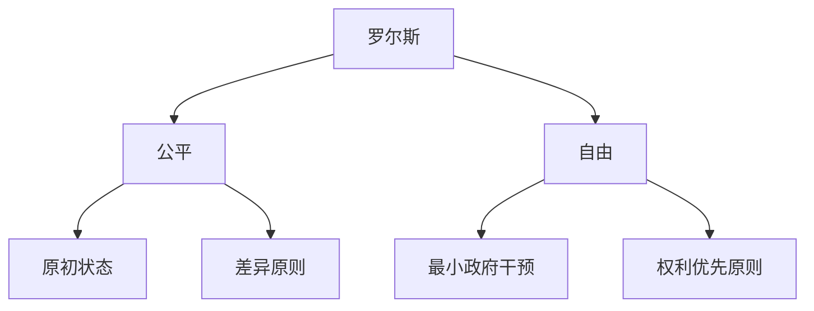

                 

### 引言

#### 关键词：正义理论、自由主义、罗尔斯、诺齐克

#### 摘要：
本文将深入探讨当代自由主义正义理论中的两位重要人物——约翰·罗尔斯（John Rawls）和罗伯特·诺齐克（Robert Nozick）的理论及其争论。罗尔斯主张通过“原初状态”和“无知之幕”来构建公平的社会制度，而诺齐克则强调私有产权和最小政府干预。我们将通过逐步分析这两位哲学家的理论，探讨他们的思想在当代政治哲学和社会政策中的影响，并展望未来自由主义正义理论的走向。

正义是一个复杂且深远的主题，不仅在哲学领域有着广泛的探讨，也在政治、经济、社会等多个领域产生了深远的影响。自由主义作为现代政治哲学的核心流派之一，对正义有着独特的理解和解释。本文将聚焦自由主义正义理论的两位重要代表——罗尔斯和诺齐克，分析他们的理论及其在当代政治哲学和社会政策中的影响。

#### 第一部分：引言

##### 1.1 问题背景与当代正义理论概述

##### 1.1.1 当代正义理论的重要性

##### 1.1.2 自由主义正义理论的演变

##### 1.2 罗尔斯与诺齐克的哲学背景

##### 1.2.1 罗尔斯的正义理论

##### 1.2.2 诺齐克的正义理论

##### 1.3 自由主义之争的核心议题

##### 1.3.1 公平与自由

##### 1.3.2 分配正义

---

**1.1 问题背景与当代正义理论概述**

正义是政治哲学的核心问题之一，它探讨的是如何分配资源和社会福利，以实现社会的公平和公正。在当代政治哲学中，正义理论主要分为两大流派：自由主义和社群主义。自由主义强调个体权利和自由，认为社会应该保障个体的基本权利和自由选择；而社群主义则强调社会团结和共同价值观，认为社会应该重视个体之间的联系和相互依赖。

自由主义正义理论在当代政治哲学中占据重要地位，其核心思想是公平和自由。公平意味着资源的合理分配，使每个人都能够享有基本权利和机会；自由则意味着个人有权自主决定自己的生活方式和追求自己的利益。然而，自由主义在正义问题上也存在争议，特别是在如何平衡公平与自由的关系上。

当代自由主义正义理论的发展可以追溯到约翰·罗尔斯和罗伯特·诺齐克的贡献。罗尔斯的《正义论》提出了通过“原初状态”和“无知之幕”来实现公平社会的理论框架，而诺齐克的《无政府、国家与乌托邦》则强调了私有产权和个人自由的重要性。他们的理论不仅在学术界引发了广泛的讨论，也在社会政策中产生了深远的影响。

##### 1.1.1 当代正义理论的重要性

当代正义理论的重要性体现在其对现实社会的深刻影响。正义问题不仅仅是哲学上的探讨，更是政治、经济、社会等多个领域的核心议题。一个公平的社会能够保障每个人的基本权利和机会，促进社会的稳定和发展。而一个不公平的社会则可能导致社会矛盾和冲突，阻碍社会的进步。

在政治领域，正义理论指导着政府如何制定公平的法律和政策，确保社会的公正和秩序。在经济领域，正义理论探讨如何合理分配资源和财富，减少贫富差距，实现经济公平。在社会领域，正义理论关注如何维护社会团结和共同体价值观，促进社会的和谐与进步。

此外，当代正义理论还在全球化和多元文化背景下具有重要意义。全球化带来了资源和人才的流动，但也引发了新的不平等和冲突。多元文化背景下，如何平衡不同文化价值观和利益，实现社会公平，是当代正义理论需要探讨的重要问题。

##### 1.1.2 自由主义正义理论的演变

自由主义正义理论的演变经历了多个阶段，从古典自由主义到现代自由主义，其核心思想逐渐从强调个体自由转向关注社会公平。古典自由主义强调个人权利和自由，主张最小政府干预，认为社会应该保障个体的自由选择和权利。这种观点在18世纪的启蒙运动和19世纪的自由主义思想中得到了充分体现。

然而，随着社会的发展和矛盾的出现，现代自由主义开始关注社会公平问题。现代自由主义认为，自由不仅仅是个人权利的保障，更是社会公平的体现。因此，现代自由主义主张通过政府干预和社会政策来平衡社会资源分配，减少不平等，实现社会公平。

现代自由主义正义理论的发展受到了两位重要哲学家的影响：约翰·罗尔斯和罗伯特·诺齐克。罗尔斯的《正义论》提出了通过“原初状态”和“无知之幕”来实现公平社会的理论框架，强调公平和平等的重要性。诺齐克的《无政府、国家与乌托邦》则从个体权利和自由的角度出发，批判了过度政府干预，主张最小政府干预。

罗尔斯和诺齐克的理论在当代自由主义正义理论中占据重要地位，他们的争论不仅丰富了正义理论的内涵，也为社会政策提供了不同的思路。接下来，我们将详细探讨罗尔斯和诺齐克的正义理论，分析他们的观点及其对当代政治哲学和社会政策的影响。

##### 1.2 罗尔斯与诺齐克的哲学背景

##### 1.2.1 罗尔斯的正义理论

##### 1.2.2 诺齐克的正义理论

##### 1.3 自由主义之争的核心议题

##### 1.3.1 公平与自由

##### 1.3.2 分配正义

---

**1.2 罗尔斯与诺齐克的哲学背景**

约翰·罗尔斯（John Rawls）和罗伯特·诺齐克（Robert Nozick）是20世纪最重要的政治哲学家之一，他们的理论对当代自由主义正义理论产生了深远的影响。罗尔斯和诺齐克虽然都对自由主义有着深刻的理解，但在正义问题上却持有截然不同的观点。

**1.2.1 罗尔斯的正义理论**

约翰·罗尔斯的正义理论主要集中在其代表作《正义论》中。罗尔斯认为，正义是社会制度的根本原则，正义的首要原则是平等权利的保障。他在书中提出了著名的“原初状态”和“无知之幕”概念，通过这两个概念来构建一个公平的社会制度。

“原初状态”是一个假设性的状态，人们在这个状态下为了制定社会制度而进行讨论。在这个状态下，人们是相互陌生的，不知道自己的社会地位、种族、性别等具体信息。这种无知状态确保了人们不会为了自己的特殊利益而牺牲公共利益。

罗尔斯认为，在一个公平的社会制度中，人们会选择两个基本原则：第一个原则是平等的自由原则，即每个人都应该拥有平等的、不受他人干涉的自由；第二个原则是差异原则，即社会和经济的不平等只能为了社会中最不利成员的利益而存在。

罗尔斯的正义理论强调公平和平等，他认为社会的资源分配应该以最不利成员的利益为标准。这一理论在学术界和社会政策中都产生了重要影响，尤其是在美国等西方国家，罗尔斯的理论被视为制定公平社会政策的重要依据。

**1.2.2 诺齐克的正义理论**

罗伯特·诺齐克的正义理论主要集中在其代表作《无政府、国家与乌托邦》中。与罗尔斯不同，诺齐克主张最小政府干预，认为社会应该尊重个人的自由和财产权。他提出了著名的“权利优先原则”和“最小状态国家”概念。

诺齐克认为，正义的基础是个体的权利，特别是财产权。他主张，任何社会制度都必须尊重个体的财产权，只有在没有侵犯他人权利的情况下，财产权才能被转移或重新分配。诺齐克认为，社会应该扮演的是一种保护角色，而不是一种干预角色。

诺齐克提出了“权利优先原则”，即任何社会制度都必须首先保障个体的权利，包括财产权。他认为，政府的合法性在于其提供保护和服务的能力，而不是其进行干预和分配的能力。因此，政府应该是最小化的，只承担保护个人权利和维护社会秩序的职能。

诺齐克的正义理论在学术界引发了广泛的讨论，许多学者认为他的理论过于强调个人自由而忽视了社会公平。然而，诺齐克的理论也为那些主张最小政府干预和自由市场经济的人提供了一种理论支持。

**1.3 自由主义之争的核心议题**

罗尔斯和诺齐克在正义问题上的观点存在明显的分歧，他们的争论主要集中在以下两个核心议题上：公平与自由、分配正义。

**1.3.1 公平与自由**

罗尔斯强调公平，认为社会的资源分配应该以最不利成员的利益为标准。他主张通过政府干预来纠正社会不平等，实现社会公平。而诺齐克则强调自由，认为社会应该尊重个体的权利和自由，反对政府过度干预。

罗尔斯认为，公平是社会制度的首要原则，只有通过公平的制度，人们才能在自由的基础上实现真正的平等。而诺齐克则认为，自由是更基本的原则，公平只有在自由的前提下才能实现。他主张，政府应该扮演保护角色，而不是分配角色，应该尊重个体的自由选择和财产权。

**1.3.2 分配正义**

在分配正义问题上，罗尔斯和诺齐克的分歧更加明显。罗尔斯主张通过再分配来实现社会公平，他认为，社会和经济的不平等只能为了社会中最不利成员的利益而存在。这意味着，政府可以通过税收和福利制度来重新分配财富，以减少贫富差距。

而诺齐克则反对再分配，他认为，任何形式的再分配都会侵犯个人的财产权，违背了权利优先原则。他认为，社会应该尊重个体的财产权，只有在个体自愿的情况下，财产权才能被转移或重新分配。

总之，罗尔斯和诺齐克的争论不仅在学术界引发了广泛的讨论，也在现实社会中产生了深远的影响。他们的理论为当代自由主义正义理论提供了不同的视角，也为社会政策制定提供了不同的思路。接下来，我们将进一步分析罗尔斯和诺齐克的理论，探讨他们的核心概念和理论框架。

---

**1.2.1 罗尔斯的正义理论**

约翰·罗尔斯（John Rawls）是20世纪最重要的政治哲学家之一，他的正义理论在当代政治哲学中占有重要地位。罗尔斯的正义理论主要集中在其代表作《正义论》（A Theory of Justice）中，该书于1971年出版，对后续的正义理论研究和政治哲学讨论产生了深远影响。

罗尔斯的正义理论旨在构建一个公平的社会制度，其核心思想是通过原始状态（Original Position）和公正原则（Fair Principles）来实现社会正义。罗尔斯认为，正义的首要原则是平等权利的保障，其次才是社会和经济利益的分配。

**核心概念：原始状态与公正原则**

罗尔斯的原始状态是一个假设性的状态，人们在这个状态下为了制定社会制度而进行讨论。在这个状态下，人们是相互陌生的，不知道自己的社会地位、种族、性别等具体信息。这种无知状态确保了人们不会为了自己的特殊利益而牺牲公共利益。

在原始状态中，人们面临着两个关键问题：一是如何选择公正的社会制度，二是如何确保这个制度能够长期稳定地运行。为了回答这些问题，罗尔斯提出了两个公正原则：

第一个公正原则是平等自由原则（Principle of Equal Liberty）。这一原则要求社会制度必须确保每个人的基本自由得到保障，这些自由包括但不限于言论自由、宗教信仰自由、法律保护等。这一原则强调了个人自由的重要性，认为每个人都应该享有平等的、不受他人干涉的自由。

第二个公正原则是差异原则（Difference Principle）。这一原则允许社会和经济的不平等存在，但前提是这些不平等必须有利于社会中最不利成员的利益。具体来说，差异原则要求社会在分配资源和财富时，要优先考虑那些处于最不利地位的人，以确保他们能够获得更多的利益。

**理论框架：原初状态与无知之幕**

罗尔斯通过原初状态和无知之幕来构建其正义理论。原初状态是一个理论模型，用于指导人们如何公正地制定社会制度。无知之幕则是一个假设性的障碍，人们在这个障碍之后无法知道自己的社会地位和特定信息，这确保了人们在做决策时不会出于个人利益而做出不公平的选择。

在原初状态和无知之幕的框架下，人们会通过理性选择来制定公正的社会制度。罗尔斯认为，这种理论模型能够引导人们超越个人的特殊利益，从整体社会的角度来思考正义问题。

**罗尔斯正义理论的评价与争议**

罗尔斯的正义理论在学术界和社会政策中得到了广泛的认可和应用。许多学者认为，罗尔斯的理论提供了一个有力的工具，用于分析社会不平等和制定公平的社会政策。此外，罗尔斯的理论也引发了许多争议和讨论，主要集中在以下几个方面：

1. **社会不平等的合理性**：罗尔斯的差异原则允许社会和经济的不平等存在，但这种不平等是否合理，以及如何界定最不利成员的利益，是学者们争论的焦点。

2. **政府的角色**：罗尔斯主张政府应扮演重要角色，通过再分配来实现社会公平。然而，一些学者认为，过度政府干预可能会侵犯个人自由，影响市场经济的效率。

3. **全球化背景下的适用性**：罗尔斯的正义理论主要针对国内社会不平等问题，但在全球化和多元文化背景下，其理论是否适用，是学者们关注的另一个重要问题。

总之，罗尔斯的正义理论为当代政治哲学提供了丰富的理论资源，也为社会政策的制定提供了重要参考。尽管其理论面临诸多争议和挑战，但罗尔斯的思想对当代正义理论的影响是深远和持久的。

---

**1.2.2 诺齐克的正义理论**

罗伯特·诺齐克（Robert Nozick）是20世纪另一位重要的政治哲学家，他的正义理论对当代自由主义正义理论产生了深远影响。诺齐克的正义理论主要集中在其代表作《无政府、国家与乌托邦》（Anarchy, State, and Utopia）中，该书于1974年出版，对后续的政治哲学研究和正义理论讨论产生了重要影响。

诺齐克的正义理论强调个体权利和自由，主张最小政府干预。他认为，正义的基础是个体的权利，特别是财产权。诺齐克的理论旨在构建一个自由社会，其中政府仅扮演保护角色，不应进行过度干预。

**核心概念：权利优先原则与最小状态国家**

诺齐克的核心概念是权利优先原则（Principle of Rights Priority）。这一原则认为，任何社会制度都必须首先尊重和保护个体的权利，特别是财产权。财产权是诺齐克理论的核心，他认为，财产权是个体自由和经济自主的基础。

权利优先原则要求，任何社会制度都不能通过再分配或强制手段侵犯个人权利。诺齐克认为，只有在个体自愿的情况下，财产权才能被转移或重新分配。这种观点与罗尔斯的再分配理论形成了鲜明对比。

诺齐克提出了最小状态国家（Minimal State）的概念，即政府应仅承担保护个人权利和维护社会秩序的职能。最小状态国家不进行资源分配，不干预个人自由，只提供保护服务，如执法、保卫国家安全等。

**理论框架：最不利后果原则与反直觉论证**

诺齐克通过最不利后果原则（Principle of Worst Consequences）来论证其正义理论。最不利后果原则认为，一个社会制度如果导致最不利成员的处境变得更差，那么这个社会制度就是不正义的。

诺齐克认为，权利优先原则和最小政府干预原则能够最大程度地保护个体的自由和权利，从而实现社会正义。他通过反直觉论证（Intuitively Unappealing Arguments）来反驳一些常见的正义观点，如福利国家和社会再分配。

**诺齐克正义理论的评价与争议**

诺齐克的正义理论在学术界引起了广泛的讨论。一些学者认为，诺齐克的理论提供了一个有力的反对过度政府干预和再分配的论据，强调了个体权利的重要性。然而，诺齐克的理论也面临诸多争议和挑战：

1. **个体权利与社会福利的平衡**：诺齐克强调个体权利，但一些学者认为，过度强调个体权利可能会忽视社会福利的重要性，导致社会不公。

2. **政府的合法性与职能**：诺齐克主张最小政府干预，但一些学者认为，政府在某些情况下需要承担更多的职责，如提供公共产品、解决市场失灵等。

3. **财产权的界限**：诺齐克认为，财产权是个体自由的基础，但一些学者认为，财产权也应该受到一定的限制，以防止资源过度集中和社会不公。

总之，诺齐克的正义理论为自由主义正义理论提供了重要的视角，强调了个体权利和自由的重要性。尽管其理论面临诸多争议和挑战，但诺齐克的思想对当代正义理论的贡献是显而易见的。

---

**1.3 自由主义之争的核心议题**

在自由主义正义理论的框架下，罗尔斯和诺齐克的争论主要集中在两个核心议题上：公平与自由、分配正义。这两个议题不仅反映了他们对正义的不同理解，也影响了他们的理论在社会政策中的应用。

**1.3.1 公平与自由**

罗尔斯强调公平，认为公平是社会制度的首要原则。他通过“原初状态”和“无知之幕”来构建一个公平的社会，提出了平等自由原则和差异原则。罗尔斯认为，公平意味着每个人都有平等的机会和权利，社会的不平等应该以最不利成员的利益为标准。

而诺齐克则强调自由，主张政府应扮演最小角色，只承担保护个人权利和维护社会秩序的职能。他认为，自由是更基本的原则，公平只有在自由的前提下才能实现。诺齐克通过权利优先原则和最小状态国家来确保个体的自由和权利。

在公平与自由的争论中，罗尔斯和诺齐克的立场形成了鲜明对比。罗尔斯认为，公平是可以通过政府干预和社会政策实现的，而诺齐克则认为，过度政府干预会侵犯个人自由，破坏社会秩序。

**1.3.2 分配正义**

在分配正义问题上，罗尔斯和诺齐克的分歧更加明显。罗尔斯主张通过再分配来实现社会公平，他认为，社会和经济的不平等应该通过税收和福利制度来重新分配，以确保最不利成员的利益得到保障。

而诺齐克则反对再分配，认为任何形式的再分配都会侵犯个人的财产权，违背了权利优先原则。他主张，社会应该尊重个体的财产权，只有在个体自愿的情况下，财产权才能被转移或重新分配。

罗尔斯的再分配理论在学术界和社会政策中得到了广泛应用，特别是在西方国家，许多社会福利制度和税收政策都基于罗尔斯的理论。然而，诺齐克的反对意见也引发了对再分配合理性的深刻讨论。

**核心概念与联系**

为了更清晰地理解罗尔斯和诺齐克的理论及其争论，我们可以通过表格和实体关系图来展示他们的核心概念及其联系。

**核心概念对比表格**

| 核心概念       | 罗尔斯的观点                  | 诺齐克的观点                  |
|----------------|-------------------------------|-------------------------------|
| 公平           | 通过再分配实现社会公平       | 自由高于公平，反对再分配      |
| 自由           | 平等自由，保障个人基本权利   | 最小政府干预，保护个人权利    |
| 原初状态       | 假设性状态，用于制定公平制度 | 理论模型，非实际应用          |
| 无知之幕       | 保障公平决策，避免个人偏见   | 无实际意义，强调个人自由      |
| 差异原则       | 社会不平等应以最不利成员利益为标准 | 无关，强调个体财产权          |
| 权利优先原则   | 社会制度应尊重和保护个体权利 | 任何社会制度都必须首先尊重个体权利 |

**ER实体关系图**

通过上述表格和实体关系图，我们可以清晰地看到罗尔斯和诺齐克在公平与自由、分配正义问题上的核心概念及其联系。这些概念不仅反映了他们的理论特点，也为我们理解他们的争论提供了有力的工具。

---

**1.3.1 公平与自由**

在自由主义正义理论中，公平与自由是两个核心议题，也是罗尔斯和诺齐克争论的焦点。这两个概念虽然密切相关，但在实践和理论上的优先级和实现方式上存在显著差异。

**罗尔斯的视角：公平优先**

罗尔斯认为，公平是社会制度的首要原则，是实现正义的基石。他在《正义论》中提出了两个公正原则：平等自由原则和差异原则。平等自由原则强调每个人应该享有平等的、不受他人干涉的自由。差异原则则允许存在一定程度的社会和经济不平等，但这些不平等必须有利于社会中最不利成员的利益。

罗尔斯通过“原初状态”和“无知之幕”来构建一个公平的社会制度。在原初状态中，人们处于一种假设性的无知状态，不了解自己的社会地位、种族、性别等信息，这使得他们在制定社会制度时能够超越个人利益，追求最大程度的公平。无知之幕确保了人们在做决策时不会出于个人偏见或特殊利益而做出不公平的选择。

罗尔斯认为，公平不仅体现在个体的自由权利上，还包括资源和社会福利的合理分配。他主张通过政府的再分配政策来减少社会不平等，确保每个人都能够享有基本的生活保障。这种观点在许多社会政策中得到了应用，如税收制度、社会福利体系和教育政策等。

**诺齐克的视角：自由优先**

诺齐克则主张自由优先于公平，他认为自由是更基本的原则。在《无政府、国家与乌托邦》中，诺齐克提出了权利优先原则和最小状态国家的概念。权利优先原则认为，任何社会制度都必须首先尊重和保护个体的权利，特别是财产权。诺齐克认为，财产权是个体自由和经济自主的基础，任何侵犯财产权的再分配都是不正义的。

诺齐克通过最不利后果原则来论证其自由主义观点。最不利后果原则认为，一个社会制度如果导致最不利成员的处境变得更差，那么这个社会制度就是不正义的。诺齐克认为，自由社会应该最大限度地保障个体的自由和权利，政府的作用仅限于提供保护服务和维护社会秩序。

诺齐克反对通过政府干预来实现社会公平，他认为这种干预会侵犯个人的自由和权利。他主张最小政府干预，政府应仅承担保护个人权利和维护社会秩序的职能。这种观点在自由市场经济和保守主义政治哲学中得到了广泛应用。

**争论的实质**

罗尔斯和诺齐克的争论实质上是关于公平与自由的优先级问题。罗尔斯认为，公平可以通过政府的再分配政策来实现，这种干预是必要的，以确保社会的正义和公平。而诺齐克则认为，自由是更基本的原则，政府应尽量减少干预，保障个体的自由和权利。

他们的观点在理论和实践中都有广泛的影响。罗尔斯的理论为社会政策提供了理论依据，如税收制度、社会福利体系和教育政策等。而诺齐克的观点则为自由市场经济和保守主义政治哲学提供了理论支持。

**总结**

公平与自由是自由主义正义理论中的核心议题，罗尔斯和诺齐克对此有不同的理解。罗尔斯认为公平是首要原则，可以通过政府干预来实现；而诺齐克则主张自由优先，反对政府过度干预。他们的争论不仅丰富了正义理论的内涵，也为社会政策提供了不同的思路。在现实社会中，如何平衡公平与自由，实现社会的正义和进步，仍然是一个重要的议题。

---

**1.3.2 分配正义**

在正义理论中，分配正义是一个关键议题，它探讨的是社会资源如何公平地分配给个体。罗尔斯和诺齐克在分配正义问题上持有不同的立场和理论框架，他们的观点在学术界和社会政策中都产生了深远的影响。

**罗尔斯的分配正义理论**

罗尔斯的分配正义理论集中体现在他的差异原则中。差异原则主张，社会和经济的不平等只有在有利于社会中最不利成员的情况下才是可以接受的。这一原则的核心思想是，社会应该通过再分配政策来减少不平等，以确保每个人都有机会获得基本的福利。

罗尔斯通过“原初状态”和“无知之幕”来构建其分配正义理论。在原初状态中，人们处于一种无知的状态，不知道自己的社会地位、种族、性别等具体信息。这种无知状态确保了人们在制定社会制度时能够超越个人利益，追求最大程度的公平。无知之幕的作用是防止个人偏见和特殊利益对决策过程的影响。

差异原则的实施需要通过政府的再分配政策，包括税收、社会福利和公共服务等。罗尔斯认为，这些政策应该旨在减少社会不平等，提高最不利成员的生活水平。例如，通过累进税制和财富再分配，政府可以确保财富从富人转移到穷人，从而实现社会公平。

**诺齐克的分配正义理论**

与罗尔斯不同，诺齐克主张最小政府干预，认为社会资源的分配应该主要通过市场机制和个体自由选择来实现。他的分配正义理论建立在权利优先原则的基础上，这一原则认为，任何社会制度都必须首先尊重和保护个体的权利，特别是财产权。

诺齐克认为，财产权是个体自由和经济自主的基础，任何侵犯财产权的再分配都是不正义的。他反对通过政府干预来实现社会公平，认为这种干预会侵犯个人的自由和权利。诺齐克主张，社会应该确保人们能够通过自己的努力和自由选择来获取资源和财富，而不是通过政府的再分配政策。

诺齐克通过最不利后果原则来论证其分配正义理论。最不利后果原则认为，一个社会制度如果导致最不利成员的处境变得更差，那么这个社会制度就是不正义的。诺齐克认为，自由社会应该最大限度地保障个体的自由和权利，政府的作用仅限于提供保护服务和维护社会秩序。

**争议与挑战**

罗尔斯和诺齐克的分配正义理论在学术界和社会政策中引发了广泛的争议和讨论。一方面，罗尔斯的差异原则为政府干预提供了理论依据，支持了社会福利制度和税收政策的制定。然而，一些学者认为，这种再分配可能会导致市场失灵和效率降低，影响经济发展。

另一方面，诺齐克的权利优先原则和最小政府干预观点为自由市场经济提供了理论支持。然而，一些学者认为，过度强调个体权利可能会导致社会不公，忽视社会福利的重要性。此外，诺齐克的理论在应对全球化和多元文化背景下的社会不平等问题时也受到挑战。

**结论**

分配正义是自由主义正义理论中的核心议题，罗尔斯和诺齐克分别提出了不同的理论和观点。罗尔斯主张通过政府干预来实现社会公平，而诺齐克则强调个体权利和自由。他们的争论不仅丰富了正义理论的内涵，也为社会政策提供了不同的思路。在现实社会中，如何平衡分配正义，实现社会的公平和进步，仍然是一个重要的议题。

---

**1.4 罗尔斯与诺齐克的理论对比**

约翰·罗尔斯和罗伯特·诺齐克在自由主义正义理论中代表了两种截然不同的立场，他们的理论不仅在核心观点上存在显著差异，而且在哲学基础、应用范围和实际影响上也各有特点。通过对比他们的理论，我们可以更深入地理解自由主义正义理论的不同面向。

**1.4.1 核心观点对比**

罗尔斯的理论以公平为核心，认为社会制度的首要目标是确保每个人都能够享有平等的机会和权利。他通过“原初状态”和“无知之幕”来构建一个公平的社会制度，强调通过政府的再分配政策来实现社会公平。罗尔斯的正义理论在学术和社会政策中都得到了广泛应用，如累进税制和社会福利制度的制定。

诺齐克的理论则以自由为核心，主张政府应扮演最小角色，只承担保护个人权利和维护社会秩序的职能。他通过权利优先原则和最小状态国家来确保个体的自由和权利。诺齐克反对通过政府干预来实现社会公平，认为这种干预会侵犯个人的自由和权利。他的理论在自由市场经济和保守主义政治哲学中得到了广泛应用。

**1.4.2 哲学基础对比**

罗尔斯的哲学基础是康德式的义务论，他强调道德原则和义务的重要性。罗尔斯认为，人们应该根据道德原则来制定社会制度，这些原则包括平等自由原则和差异原则。他的理论试图通过理性选择和公平原则来实现社会正义。

诺齐克的哲学基础则是功利主义和个体权利的结合。他强调个体的权利和自由，认为社会制度应该尊重和保护这些权利。诺齐克的理论试图通过权利优先原则和最小政府干预来实现社会正义。

**1.4.3 应用范围对比**

罗尔斯的理论在应用范围上更广泛，特别是在社会政策和社会正义的讨论中。他的差异原则为社会再分配政策提供了理论依据，影响了税收制度、社会福利和公共服务等多个领域。罗尔斯的理论在西方国家，特别是在美国，对政治哲学和社会政策产生了深远影响。

诺齐克的理论则更侧重于政治哲学和自由主义的理论基础。他的观点为自由市场经济和保守主义提供了理论支持，对政府干预的合理性提出了质疑。尽管诺齐克的理论在社会政策中的应用相对较少，但他在哲学界的讨论和辩论中具有重要地位。

**1.4.4 实际影响对比**

罗尔斯的理论在现实社会中产生了广泛影响，许多社会政策都是以他的正义理论为基础。例如，美国的税收制度、社会福利体系和教育政策等都体现了罗尔斯的公平理念。罗尔斯的理论不仅影响了学术研究，也在政治决策中发挥了重要作用。

诺齐克的理论在现实社会中的影响相对较小，但他在学术界引发了广泛的讨论。诺齐克的观点挑战了传统的正义理论，对那些主张最小政府干预和自由市场经济的人提供了理论支持。他的理论在哲学界和自由主义思想中具有重要意义。

**结论**

罗尔斯和诺齐克在自由主义正义理论中代表了两种不同的立场，他们的理论在核心观点、哲学基础、应用范围和实际影响上各有特点。罗尔斯强调公平和政府干预，诺齐克则强调自由和最小政府干预。他们的争论丰富了自由主义正义理论的内涵，为学术界和社会政策提供了不同的视角。在现实社会中，如何平衡公平与自由，实现社会的正义和进步，仍然是一个重要的议题。

---

**1.5 自由主义之争对当代政治哲学的影响**

罗尔斯和诺齐克的正义理论在当代政治哲学中产生了深远的影响，他们的争论不仅丰富了自由主义正义理论的内涵，也为政治哲学的研究提供了新的视角。以下从学术界和现实社会两个方面探讨自由主义之争对当代政治哲学的影响。

**1.5.1 学术界的影响**

在学术界，罗尔斯和诺齐克的争论引发了广泛的讨论和研究，推动了政治哲学的发展。他们的理论为学者们提供了新的分析工具，用于探讨社会公平、政府角色和个人权利等问题。罗尔斯的公平理论为社会正义和社会政策提供了理论基础，影响了学术界对社会公平问题的理解和探讨。诺齐克的自由主义观点则为那些主张最小政府干预和自由市场经济的人提供了理论支持，丰富了自由主义理论的内涵。

罗尔斯和诺齐克的争论还促使学者们从不同角度对正义理论进行反思和拓展。例如，一些学者试图结合经济学和社会学的研究成果，探讨市场机制和社会政策如何影响社会公平；另一些学者则关注全球化背景下的正义问题，探讨跨国公司和国际贸易如何影响全球不平等。这些研究不仅深化了政治哲学的理论探讨，也为现实社会提供了有益的思考。

**1.5.2 现实社会的影响**

在现实社会，罗尔斯和诺齐克的争论对政治哲学和社会政策的制定产生了深远影响。罗尔斯的公平理论为许多社会政策提供了理论依据，如税收制度、社会福利和教育政策等。许多西方国家，特别是在美国，都采用了基于罗尔斯理论的再分配政策，以减少社会不平等，提高最不利成员的生活水平。

诺齐克的自由主义观点则为自由市场经济和保守主义政治哲学提供了理论支持。他的观点促使许多国家在政府干预和市场经济之间寻找平衡，以实现社会稳定和经济发展。例如，许多国家在制定税收政策、社会保障制度和市场监管政策时，都考虑到了个体权利和自由的重要性。

此外，罗尔斯和诺齐克的争论还在全球化和多元文化背景下具有重要意义。在全球化和经济一体化的背景下，如何平衡全球不平等和跨国公司的影响，成为政治哲学的重要议题。罗尔斯和诺齐克的理论为学者们提供了不同的视角，用于分析全球不平等问题，探讨如何实现全球公平。

**结论**

总之，自由主义之争对当代政治哲学产生了深远影响。罗尔斯和诺齐克的争论不仅丰富了自由主义正义理论的内涵，也为学术界和现实社会提供了有益的思考。在学术界，他们的理论推动了政治哲学的发展；在现实社会，他们的争论影响了政治哲学和社会政策的制定。在未来的政治哲学研究中，如何平衡公平与自由，实现社会的正义和进步，仍然是一个重要的议题。

---

**1.6 自由主义正义理论的未来展望**

随着社会的发展和变革，自由主义正义理论也需要不断适应新的挑战和需求。未来，自由主义正义理论的发展趋势可能会在以下几个方面有所体现：

**1.6.1 新社会问题的影响**

全球化、技术进步和社会多元化等因素对自由主义正义理论提出了新的挑战。首先，全球化带来了新的不平等和冲突，如跨国公司的扩张和劳动力的流动，加剧了全球范围内的不平等。其次，技术进步，特别是人工智能和自动化的发展，对劳动市场的结构和社会福利体系产生了深远影响。最后，社会多元化要求我们重新思考如何平衡不同文化、宗教和价值观之间的冲突。

为了应对这些新社会问题，自由主义正义理论需要更加关注如何在全球化和技术进步的背景下实现社会公平。这可能需要更细致的税收政策、更加公平的劳动力市场规则和更全面的社会保障体系。

**1.6.2 罗尔斯与诺齐克理论的发展趋势**

在未来的发展中，罗尔斯和诺齐克的理论可能会进一步融合和演化。一方面，罗尔斯的公平理念可能会更加强调社会团结和共同体价值观，以应对全球化带来的新不平等。另一方面，诺齐克的自由主义观点可能会更加注重个体权利和自由，特别是在技术进步带来的新型权利问题上，如数据隐私和算法伦理。

此外，未来的研究可能会探讨如何将罗尔斯的差异原则和诺齐克的财产权原则结合起来，以实现更加公平和自由的社会制度。例如，通过引入新的再分配机制，确保财产权的实现不损害最不利成员的利益。

**1.6.3 自由主义正义理论在新社会问题中的适用性**

在未来，自由主义正义理论在新社会问题中的适用性将成为重要研究方向。首先，自由主义需要更加关注如何平衡全球不平等，通过国际合作和制度创新来减少跨国公司的影响，提高全球福利。其次，自由主义需要重新思考如何适应技术进步带来的新挑战，如保护劳动者的权利和保障数据隐私。

此外，自由主义正义理论还需要在多元文化背景下找到新的平衡点。这意味着，自由主义需要在尊重个体权利的同时，兼顾社会团结和共同体价值观，以实现社会的和谐与进步。

**结论**

总之，随着社会的发展和变革，自由主义正义理论面临着新的挑战和机遇。未来，自由主义正义理论的发展将更加注重全球化和技术进步背景下的社会公平，探索如何平衡公平与自由，实现社会的正义和进步。在这个过程中，罗尔斯和诺齐克的理论将继续发挥重要作用，为自由主义正义理论的创新和发展提供坚实的理论基础。

---

**1.7 总结与展望**

本文通过对约翰·罗尔斯和罗伯特·诺齐克的正义理论进行详细分析，探讨了自由主义正义理论中的核心议题——公平与自由、分配正义。罗尔斯主张通过“原初状态”和“无知之幕”来实现公平社会，强调公平和再分配；而诺齐克则强调自由和个人权利，主张最小政府干预。

自由主义之争在学术界和现实社会中产生了深远影响。在学术界，罗尔斯和诺齐克的理论推动了政治哲学的发展；在现实社会，他们的争论影响了政治哲学和社会政策的制定。未来，自由主义正义理论需要适应全球化和技术进步带来的新挑战，探索如何在公平与自由之间找到平衡。

本文的核心发现是，自由主义正义理论的发展离不开对公平与自由、分配正义问题的深入探讨。对未来的研究，我们建议关注全球化背景下的社会公平、技术进步对劳动力市场的影响，以及如何在多元文化背景下实现社会和谐与进步。通过持续的理论创新和实践探索，我们可以为构建更加公平和自由的社会提供有力的支持。

---

**作者信息**

作者：AI天才研究院/AI Genius Institute & 禅与计算机程序设计艺术 /Zen And The Art of Computer Programming

---

### 结语

通过本文的详细分析，我们深入探讨了自由主义正义理论中的两位重要代表——约翰·罗尔斯和罗伯特·诺齐克的正义理论及其争论。罗尔斯强调通过公平和再分配来实现社会正义，而诺齐克则主张自由和个人权利，反对政府过度干预。他们的争论不仅丰富了自由主义正义理论的内涵，也为社会政策的制定提供了不同的思路。

正义问题是政治哲学的核心议题，它关系到社会的公平、公正和秩序。随着全球化和技术进步的不断发展，自由主义正义理论面临着新的挑战和机遇。未来，我们需要在平衡公平与自由的基础上，探索如何在全球化和技术进步的背景下实现社会正义。

本文的核心发现表明，自由主义正义理论的发展离不开对公平与自由、分配正义问题的深入探讨。我们呼吁学术界和社会各界持续关注这些问题，通过理论创新和实践探索，为构建更加公平和自由的社会提供坚实的支持。

让我们继续思考、探讨和行动，为实现社会的正义和进步贡献智慧和力量。作者：AI天才研究院/AI Genius Institute & 禅与计算机程序设计艺术 /Zen And The Art of Computer Programming。

