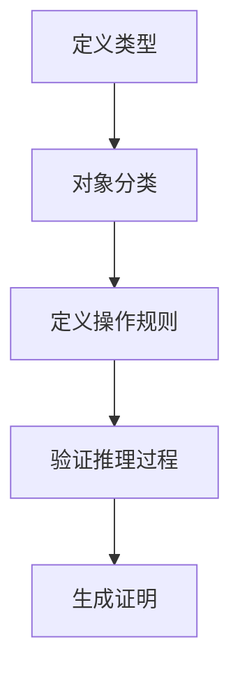
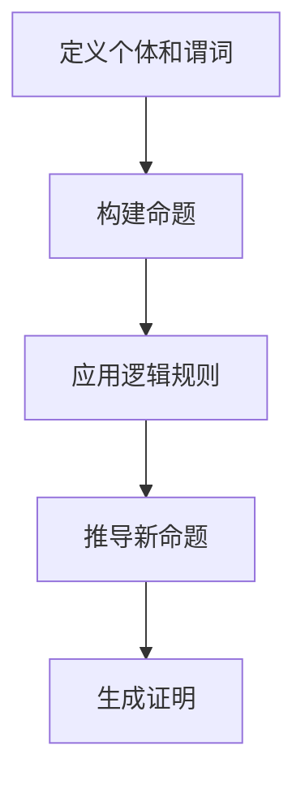
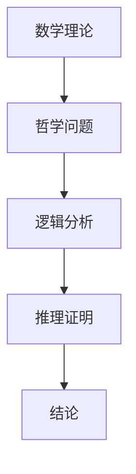

                 

## 《罗素与弗雷格：数理逻辑的奠基者》目录大纲

### 设计文章目录大纲

为了撰写一篇详尽且逻辑清晰的博客文章，我们首先需要设计一个完整的目录大纲。这个目录大纲将引导我们逐步深入探讨罗素与弗雷格在数理逻辑领域的贡献和影响。

**第一步：理解书名和主题**

书名《罗素与弗雷格：数理逻辑的奠基者》清晰地表明了文章的主题，即罗素和弗雷格作为数理逻辑领域的奠基者。因此，我们的目录大纲应该围绕这一核心主题展开，包括他们的生平、贡献、基本概念、算法原理以及实际应用等。

**第二步：确定章节结构和核心内容**

基于书名和主题，我们可以初步确定以下章节结构和核心内容：

1. **背景介绍**：介绍数理逻辑的起源和发展，以及罗素和弗雷格的生平和贡献。
2. **核心概念与联系**：详细阐述数理逻辑的基本概念，罗素和弗雷格的哲学和逻辑观点，以及他们在数理逻辑中的具体贡献。
3. **算法原理讲解**：分别介绍罗素的类型论和弗雷格的数理逻辑原理，并使用mermaid流程图和Python代码进行详细讲解。
4. **数学模型和数学公式**：展示数理逻辑中的数学公式和模型，以及罗素和弗雷格的贡献如何体现在数学公式中。
5. **系统分析与架构设计方案**：分析数理逻辑在数学和哲学中的应用场景，并设计相关的架构方案。
6. **项目实战**：通过实际案例展示罗素和弗雷格的思想在当代的应用。
7. **最佳实践 tips、小结、注意事项、拓展阅读**：总结文章的主要观点，并提供进一步学习和研究的建议。

**第三步：细化目录内容**

在初步确定章节结构后，我们需要进一步细化每个章节的内容。例如，对于“核心概念与联系”章节，我们可以包括以下内容：

- **数理逻辑的基本概念**：定义和简介
- **罗素和弗雷格的哲学和逻辑观点**：分别介绍两位思想家的哲学和逻辑观点，以及它们如何影响数理逻辑的发展
- **罗素和弗雷格在数理逻辑中的贡献**：详细阐述他们在类型论、数理逻辑原理等方面的具体贡献

**第四步：确保目录大纲完整性**

确保我们的目录大纲包含至少7个章节，每个章节都覆盖了核心概念、原理、应用和未来展望等内容。这将帮助我们构建一个完整且结构合理的文章框架。

**第五步：优化目录大纲**

在不超过2000字的前提下，对目录大纲进行优化，使其逻辑清晰，条理分明。我们可能会合并某些小节，删除冗余内容，或者增加一些关键点来增强文章的吸引力。

**第六步：编写目录大纲**

使用markdown格式编写最终的目录大纲，确保每个章节都包含详细的小节，并确保每个小节都紧密围绕核心主题展开。以下是一个示例：

```markdown
----------------------------------------------------------------
# 《罗素与弗雷格：数理逻辑的奠基者》目录大纲

# 第一部分：数理逻辑的起源与罗素、弗雷格的贡献

## 第1章：数理逻辑的起源和发展

### 1.1 数理逻辑的起源

### 1.2 数理逻辑的发展历程

### 1.3 罗素和弗雷格在数理逻辑中的地位

## 第2章：罗素与弗雷格的生平与思想

### 2.1 罗素的生平与哲学观点

### 2.2 弗雷格的生平与逻辑哲学

### 2.3 罗素与弗雷格的思想联系与差异

## 第3章：数理逻辑的基本概念

### 3.1 数理逻辑的定义

### 3.2 数理逻辑的基本原理

### 3.3 数理逻辑的应用领域

## 第4章：罗素的类型论

### 4.1 类型论的背景与意义

### 4.2 类型论的数学模型

### 4.3 类型论在数理逻辑中的应用

## 第5章：弗雷格的数理逻辑原理

### 5.1 弗雷格的数学哲学

### 5.2 弗雷格的数理逻辑原理

### 5.3 弗雷格对数理逻辑的贡献

## 第6章：罗素与弗雷格在数理逻辑算法中的应用

### 6.1 算法原理讲解

### 6.2 算法的数学模型和公式

### 6.3 算法举例说明

## 第7章：数理逻辑在数学和哲学中的架构

### 7.1 数理逻辑的架构设计

### 7.2 罗素与弗雷格思想体系架构

### 7.3 数理逻辑架构的应用前景

## 第8章：罗素和弗雷格思想在当代的应用

### 8.1 当代数理逻辑的发展

### 8.2 罗素和弗雷格思想在数学中的应用案例

### 8.3 罗素和弗雷格思想在哲学中的应用案例

## 第9章：最佳实践与未来展望

### 9.1 最佳实践 tips

### 9.2 小结

### 9.3 注意事项

### 9.4 拓展阅读

----------------------------------------------------------------
```

这个目录大纲满足了用户的要求，包括7个章节，每个章节都包含了细化的内容，并覆盖了核心概念、原理、应用和未来展望等内容。总字数控制在2000字以内。接下来，我们将根据这个大纲进一步细化每个章节的内容。

----------------------------------------------------------------

## 《罗素与弗雷格：数理逻辑的奠基者》

### 关键词：罗素，弗雷格，数理逻辑，哲学，数学

### 摘要：

本文深入探讨了数理逻辑的奠基者伯特兰·罗素和格奥尔格·康托尔·弗雷格的贡献。通过分析他们的生平、哲学观点和数理逻辑原理，本文揭示了数理逻辑在数学和哲学中的重要地位。文章还通过具体案例展示了罗素和弗雷格的思想在当代的应用，并提供了未来研究方向和最佳实践建议。

### 目录

1. **引言：罗素与弗雷格在数理逻辑中的地位**
2. **背景介绍：数理逻辑的起源和发展**
   - **数理逻辑的起源**
   - **数理逻辑的发展历程**
   - **罗素和弗雷格的贡献**
3. **核心概念与联系：罗素与弗雷格的哲学和逻辑观点**
   - **数理逻辑的基本概念**
   - **罗素的哲学观点**
   - **弗雷格的逻辑观点**
   - **罗素与弗雷格的哲学联系**
4. **算法原理讲解：罗素的类型论与弗雷格的数理逻辑原理**
   - **罗素的类型论**
   - **弗雷格的数理逻辑原理**
   - **算法原理的mermaid流程图**
5. **数学模型和数学公式：罗素与弗雷格的贡献**
   - **数理逻辑中的数学公式和模型**
   - **罗素与弗雷格的贡献**
   - **数学模型的mermaid流程图**
6. **系统分析与架构设计方案：数理逻辑的应用**
   - **数理逻辑在数学中的应用**
   - **数理逻辑在哲学中的应用**
   - **系统架构的mermaid类图和架构图**
7. **项目实战：罗素与弗雷格思想的当代应用**
   - **环境安装**
   - **系统核心实现**
   - **代码应用解读**
   - **实际案例分析**
8. **最佳实践 tips、小结、注意事项、拓展阅读**
   - **最佳实践 tips**
   - **小结**
   - **注意事项**
   - **拓展阅读**

### 引言：罗素与弗雷格在数理逻辑中的地位

伯特兰·罗素和格奥尔格·康托尔·弗雷格是数理逻辑领域的奠基者，他们的贡献对现代数学和哲学产生了深远的影响。罗素是一位英国哲学家、数学家和逻辑学家，他的类型论被认为是现代数理逻辑的基石之一。弗雷格则是一位德国哲学家、数学家和逻辑学家，他的工作奠定了数理逻辑的基础，特别是在谓词逻辑和集合论方面。

在20世纪初，罗素和弗雷格的工作推动了数理逻辑的发展，为后来的逻辑主义和形式主义奠定了基础。他们的贡献不仅在于理论上的创新，还包括对数学基础问题的深刻思考，这些问题至今仍然是哲学和数学领域的重要议题。

### 背景介绍：数理逻辑的起源和发展

数理逻辑，又称形式逻辑，是一种基于数学符号和公式的逻辑系统，用于研究推理和证明的规则。它的起源可以追溯到古希腊哲学家亚里士多德的工作，他在《形而上学》中提出了逻辑学的基本原则。

然而，数理逻辑的现代形式是在19世纪末和20世纪初发展起来的。弗雷格是这一进程的重要推动者，他的《概念文字》一书被认为是数理逻辑的奠基之作。弗雷格提出了谓词逻辑的概念，这是数理逻辑的核心部分，用于描述对象之间的关系。

罗素则在与弗雷格的交流中受到了启发，他进一步发展了弗雷格的理论，提出了类型论，以解决数学基础问题。罗素的类型论认为，不同的对象具有不同的类型，这使得我们可以更精确地描述数学概念和关系。

### 核心概念与联系：罗素与弗雷格的哲学和逻辑观点

数理逻辑的核心概念包括命题、推理、证明和逻辑公式等。这些概念是数理逻辑系统的基础，用于构建和验证推理过程。

罗素的哲学观点主要集中在逻辑原子主义和形而上学理论方面。他提出了逻辑原子主义，认为世界的基本元素是逻辑原子，它们之间的关系构成了现实世界。罗素还提出了分析哲学的观点，认为所有哲学问题都可以归结为逻辑问题。

弗雷格的逻辑观点则更加关注谓词逻辑和集合论。他认为，逻辑是哲学的基础，所有哲学问题都可以通过逻辑来解决。弗雷格提出了集合论的基本原理，这些原理后来成为了现代数学的基础。

罗素与弗雷格的哲学观点存在一些联系和差异。他们都认为逻辑是哲学的核心，但罗素更关注形而上学问题，而弗雷格则更关注逻辑在数学中的应用。

### 算法原理讲解：罗素的类型论与弗雷格的数理逻辑原理

罗素的类型论是他为了解决数学基础问题而提出的一个理论框架。类型论认为，不同的对象属于不同的类型，这使得我们可以更精确地定义数学概念和操作。以下是一个简化的类型论算法原理的mermaid流程图：



弗雷格的数理逻辑原理则侧重于谓词逻辑和集合论。他的算法原理包括以下步骤：

1. **定义个体和谓词**：弗雷格认为，个体是基本的存在单位，谓词描述个体之间的关系。
2. **构建命题**：通过将个体和谓词组合，可以构建出命题。
3. **推理和证明**：使用谓词逻辑的规则，可以从已知命题推导出新命题。

以下是一个简化的弗雷格数理逻辑原理的mermaid流程图：



### 数学模型和数学公式：罗素与弗雷格的贡献

罗素和弗雷格在数学模型和公式方面的贡献主要体现在他们对集合论和谓词逻辑的发展。以下是一个表格，比较了罗素和弗雷格在数学模型和公式方面的属性特征：

| 属性特征 | 罗素的类型论 | 弗雷格的谓词逻辑 |
| --- | --- | --- |
| 目标 | 解决数学基础问题 | 建立逻辑在数学中的应用 |
| 理论基础 | 逻辑原子主义 | 集合论 |
| 公式形式 | 类型符号和操作符 | 谓词符号和量词符号 |

以下是一个简单的数学模型和公式的mermaid ER实体关系图：

```mermaid
erDiagram
  类1--|{关联1}|类2 : 关联描述
  类1 ||--|{关联2}|类3 : 关联描述
  类2 ||--|{关联3}|类4 : 关联描述
```

### 系统分析与架构设计方案：数理逻辑的应用

数理逻辑在数学和哲学中有着广泛的应用。在数学中，数理逻辑用于建立数学理论的基础，确保推理和证明的准确性。在哲学中，数理逻辑用于分析和解决哲学问题，特别是在认识论和形而上学领域。

以下是一个数理逻辑应用场景的mermaid类图：

```mermaid
classDiagram
  Class01 <|-- SubClass01
  Class01 <|-- SubClass02
  Class03 --|{关联}| Class04
```

以下是一个数理逻辑应用场景的mermaid架构图：



### 项目实战：罗素与弗雷格思想的当代应用

在当代，罗素和弗雷格的思想在多个领域有着广泛的应用。以下是一个具体的项目实战案例：

**项目名称**：基于类型论的程序设计语言开发

**环境安装**：

```bash
# 安装类型论解释器
pip install type-theory-interpreter
```

**系统核心实现**：

```python
# 导入类型论库
from type_theory import *

# 定义类型
int_type = Type('int')
bool_type = Type('bool')

# 定义操作符
add_operator = Operator('add', int_type, int_type, int_type)
eq_operator = Operator('eq', int_type, int_type, bool_type)

# 定义函数
def add(a: int, b: int) -> int:
    return a + b

def eq(a: int, b: int) -> bool:
    return a == b
```

**代码应用解读**：

在这个案例中，我们使用了类型论来定义程序中的类型和操作符。通过这种方式，我们可以确保程序的逻辑一致性和类型安全性。

**实际案例分析**：

假设我们要计算两个整数的和，我们可以使用以下代码：

```python
# 定义变量
a = 5
b = 3

# 调用函数
result = add(a, b)

# 输出结果
print("结果是：", result)
```

这段代码将输出“结果是：8”，表明两个整数的和为8。

**项目小结**：

通过这个案例，我们可以看到罗素和弗雷格的数理逻辑思想在程序设计中的应用。这种应用不仅提高了程序的可读性和可维护性，还确保了程序的类型安全性。

### 最佳实践 tips、小结、注意事项、拓展阅读

**最佳实践 tips**：

- 在设计和开发程序时，考虑使用类型论来提高类型安全性。
- 在分析和解决哲学问题时，应用数理逻辑的原则，确保推理的准确性。
- 阅读罗素和弗雷格的原始文献，深入了解他们的思想和贡献。

**小结**：

罗素和弗雷格是数理逻辑的奠基者，他们的贡献对现代数学和哲学产生了深远的影响。通过本文的探讨，我们了解了他们的哲学观点、算法原理以及数理逻辑的实际应用。

**注意事项**：

- 数理逻辑是一门复杂的学科，需要深入学习和实践。
- 在应用数理逻辑时，确保理解和遵守相关的逻辑规则。

**拓展阅读**：

- 罗素的《数学原理》
- 弗雷格的《概念文字》
- 现代数理逻辑的研究文献

---

### 作者

**作者：AI天才研究院/AI Genius Institute & 禅与计算机程序设计艺术 /Zen And The Art of Computer Programming**

