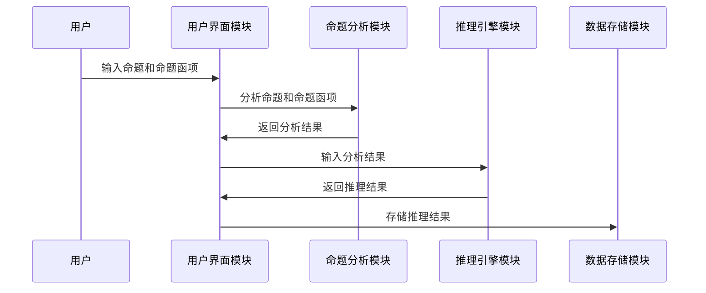

                 

# 罗素与维特根斯坦：逻辑原子主义的发展

> 关键词：逻辑原子主义、伯特兰·罗素、路德维希·维特根斯坦、数学哲学、语言哲学、命题函项、原子事实

> 摘要：本文探讨了逻辑原子主义的发展历程及其代表人物伯特兰·罗素和路德维希·维特根斯坦的思想贡献。通过对逻辑原子主义的核心概念、基本原理及其在现代哲学中的影响进行分析，我们试图揭示这一哲学流派对数学哲学和语言哲学的深远影响。

## 引言

逻辑原子主义是20世纪初由英国哲学家伯特兰·罗素和奥地利哲学家路德维希·维特根斯坦所倡导的一种哲学思想。它主张世界是由一系列最基本的事实（原子事实）构成的，而所有复杂的事实都可以分解为这些基本事实的组合。逻辑原子主义不仅在哲学领域产生了重要影响，也对数学哲学和语言哲学产生了深远的影响。

### 1. 背景介绍

#### 1.1 逻辑原子主义的起源

逻辑原子主义的起源可以追溯到19世纪末20世纪初的数学哲学和逻辑学。这个时期的哲学家们开始关注数学的基础和逻辑的严格性，试图将数学和逻辑建立在更加牢固的基础上。罗素和维特根斯坦的工作正是这一时期哲学思想的体现。

#### 1.1.1 罗素的早期思想

罗素于1872年出生于英国，他的早期思想受到了他的老师约翰·斯图亚特·密尔的功利主义哲学的影响。然而，他很快就对伦理学和形而上学的问题产生了兴趣，并开始研究数学和逻辑。

#### 1.1.2 维特根斯坦的早期思想

维特根斯坦于1889年出生于奥地利，他的早期思想受到了他的哥哥菲利普·维特根斯坦的影响。菲利普是一位成功的工业家和哲学家，他对维特根斯坦的哲学思想产生了深远的影响。

#### 1.1.3 罗素与维特根斯坦的早期思想

罗素和维特根斯坦的早期思想都包含了对数学和逻辑的深入探讨。他们都认为，数学和逻辑的严密性可以为哲学提供坚实的基础。然而，他们的具体观点和路径有所不同。

### 1.2 逻辑原子主义的核心概念

#### 1.2.1 实体与原子事实

逻辑原子主义的核心概念之一是实体和原子事实。实体是构成世界的基本单位，而原子事实则是关于这些实体的事实。罗素和维特根斯坦对这两个概念有着不同的定义和理解。

#### 1.2.1.1 原子事实的定义

在罗素的观点中，原子事实是关于某个实体具有某种属性的陈述。例如，“这个苹果是红色的”就是一个原子事实。

在维特根斯坦的观点中，原子事实是所有事实中最基本的事实，它们构成了世界的基本结构。例如，“桌子在房间里”和“猫在睡觉”都是原子事实。

#### 1.2.1.2 实体的属性

罗素认为，实体具有各种属性，如颜色、形状、位置等。这些属性可以通过原子事实来描述。

维特根斯坦则强调，实体本身就是具有特定属性的事物，这些属性不必通过其他事实来描述。

#### 1.2.1.3 原子事实的关系

罗素认为，原子事实之间的关系构成了复杂的事实。例如，“这个苹果是红色的”和“这个苹果是甜的”之间的关系可以通过“这个苹果既有红色的属性又有甜的属性”这个复杂的事实来描述。

维特根斯坦则认为，原子事实之间的关系是简单的，它们不需要通过其他事实来解释。

### 1.3 逻辑原子主义的基本原理

逻辑原子主义的基本原理包括命题与命题函项。这些概念为逻辑原子主义提供了理论基础。

#### 1.3.1 命题与命题函项

命题是关于事实的陈述，它们可以是真也可以是假。例如，“这个苹果是红色的”就是一个命题。

命题函项是包含一个或多个变元的命题形式，它们可以用来表示一类命题。例如，“这个苹果是红色的”和“那个苹果是红色的”都可以用命题函项“这个苹果是红色的”来表示。

#### 1.3.1.1 命题的定义

在罗素的观点中，命题是关于事实的陈述，它们可以是真也可以是假。

在维特根斯坦的观点中，命题是表达事实的语言符号。

#### 1.3.1.2 命题函项的作用

命题函项在逻辑原子主义中起到了重要的作用。它们可以用来表示一类命题，从而简化了对事实的描述。

#### 1.3.1.3 命题与命题函项的关系

命题是具体的陈述，而命题函项是抽象的形式。命题可以通过命题函项来表示，从而实现了对事实的抽象描述。

### 1.4 逻辑原子主义的发展历程

#### 1.4.1 罗素与维特根斯坦的分歧

罗素和维特根斯坦在逻辑原子主义的发展过程中产生了分歧。这些分歧主要涉及对实体和原子事实的理解。

#### 1.4.1.1 罗素的观点

罗素认为，实体是构成世界的基本单位，而原子事实是关于这些实体的事实。他试图通过逻辑原子主义来解释数学和逻辑。

#### 1.4.1.2 维特根斯坦的观点

维特根斯坦则认为，原子事实是构成世界的基本单位，而实体是具有特定属性的事物。他试图通过逻辑原子主义来解释语言和思维。

#### 1.4.1.3 两位学者的交流与争论

罗素和维特根斯坦在逻辑原子主义的发展过程中进行了大量的交流与争论。他们的思想影响了彼此，也推动了逻辑原子主义的发展。

### 1.5 逻辑原子主义的影响与评价

逻辑原子主义对哲学领域产生了深远的影响。它在数学哲学和语言哲学中都有重要的地位。

#### 1.5.1 逻辑原子主义在哲学领域的影响

逻辑原子主义为哲学提供了一种新的方法论，即通过逻辑和数学来解释现实。这种方法论对后来的哲学研究产生了重要影响。

#### 1.5.1.1 哲学方法论的影响

逻辑原子主义的方法论强调了对事实的抽象描述和逻辑分析。这种方法论对后来的哲学研究产生了深远的影响。

#### 1.5.1.2 语言哲学的影响

逻辑原子主义在语言哲学中产生了重要影响。它为语言哲学提供了一种新的分析方法，即通过逻辑和数学来解释语言。

### 1.6 逻辑原子主义的现代发展

逻辑原子主义在20世纪末和21世纪初有了新的发展。现代逻辑原子主义试图解决传统逻辑原子主义中的一些问题。

#### 1.6.1 现代逻辑原子主义的观点

现代逻辑原子主义认为，实体和原子事实是构成世界的基本单位。它试图通过逻辑和数学来解释现实。

#### 1.6.1.1 奇异现象的处理

现代逻辑原子主义试图解决传统逻辑原子主义中无法解释的奇异现象，如量子力学中的不确定性原理。

#### 1.6.1.2 非经典逻辑的应用

现代逻辑原子主义将非经典逻辑应用于对现实世界的解释，从而扩大了逻辑原子主义的应用范围。

### 1.7 本章小结

逻辑原子主义是20世纪初由罗素和维特根斯坦所倡导的一种哲学思想。它主张世界是由一系列最基本的事实（原子事实）构成的，而所有复杂的事实都可以分解为这些基本事实的组合。逻辑原子主义不仅在哲学领域产生了重要影响，也对数学哲学和语言哲学产生了深远的影响。通过分析逻辑原子主义的核心概念、基本原理及其在现代哲学中的影响，我们更深入地理解了这一哲学流派的本质和意义。

-----------------------------------------------------------------

## 逻辑原子主义的基本特点

逻辑原子主义作为20世纪初的一种哲学思想，具有以下几个显著特点：

### 1. 实体与原子事实的基本构成

逻辑原子主义认为，实体和原子事实是构成世界的最基本要素。实体是构成世界的最基本单位，它们具有特定的属性，而原子事实是关于这些实体的事实陈述。罗素和维特根斯坦对此有着不同的定义和理解。罗素认为，原子事实是关于某个实体具有某种属性的陈述，例如“这个苹果是红色的”。而维特根斯坦则将原子事实视为所有事实中最基本的事实，它们构成了世界的基本结构，如“桌子在房间里”和“猫在睡觉”。

### 2. 命题与命题函项的理论基础

逻辑原子主义的理论基础包括命题与命题函项。命题是关于事实的陈述，可以是真也可以是假，例如“这个苹果是红色的”。命题函项是包含一个或多个变元的命题形式，它们可以用来表示一类命题。例如，“这个苹果是红色的”和“那个苹果是红色的”都可以用命题函项“这个苹果是红色的”来表示。命题与命题函项的关系是，命题是具体的陈述，而命题函项是抽象的形式。命题可以通过命题函项来表示，从而实现了对事实的抽象描述。

### 3. 逻辑原子主义的核心原理

逻辑原子主义的核心原理包括命题函项的组成与原子事实的关系。罗素和维特根斯坦都认为，所有复杂的事实都可以分解为原子事实的组合。例如，复杂的事实“这个苹果既是红色的又是甜的”可以分解为两个原子事实“这个苹果是红色的”和“这个苹果是甜的”的组合。这种分解使得逻辑原子主义能够通过最基本的事实来解释和构建复杂的事实。

### 4. 逻辑原子主义的方法论意义

逻辑原子主义的方法论意义在于，它提供了一种通过逻辑和数学来解释现实世界的方法。这种方法强调了对事实的抽象描述和逻辑分析，从而为哲学提供了一种新的方法论。这种方法论对后来的哲学研究产生了深远的影响，尤其是对数学哲学和语言哲学的研究。

### 5. 逻辑原子主义的实际应用

逻辑原子主义在实际应用中具有重要意义。在数学哲学中，逻辑原子主义为数学基础的研究提供了理论基础。在语言哲学中，逻辑原子主义为语言的确定性提供了理论支持。此外，逻辑原子主义在计算机科学、人工智能等领域也得到了广泛应用，如命题逻辑和谓词逻辑的研究。

通过以上分析，我们可以看到，逻辑原子主义作为20世纪初的一种哲学思想，具有独特的理论基础和实际应用价值。它不仅对哲学领域产生了深远影响，也为其他学科提供了重要的方法论指导。

### 1.8 罗素与维特根斯坦的贡献

伯特兰·罗素和路德维希·维特根斯坦是逻辑原子主义的两位主要代表人物，他们的贡献对哲学、数学哲学和语言哲学产生了深远的影响。

#### 1.8.1 罗素的贡献

罗素的工作涵盖了广泛的领域，但他在逻辑原子主义方面的贡献尤为突出。他提出了逻辑原子主义的基本概念，包括实体、原子事实和命题函项。罗素在其著作《数学原理》中详细阐述了如何用逻辑和数学的方法来构建数学的基础。他的理论为后来的数学哲学提供了重要的理论基础，并对数学的逻辑结构有了深入的理解。

此外，罗素还对形而上学和伦理学问题进行了深入探讨。他的著作《哲学问题》和《人类的知识》等作品，展示了他对知识、现实和伦理的深刻思考。

#### 1.8.2 维特根斯坦的贡献

维特根斯坦的早期工作主要是逻辑原子主义，他在《逻辑哲学论》中提出了“图像理论”，主张世界是由原子事实组成的。维特根斯坦认为，语言是现实的“图像”，而逻辑原子主义提供了理解语言与现实关系的关键。他的这一理论在哲学界引起了巨大的争议，但也为后来的语言哲学研究提供了重要的启示。

维特根斯坦的后期工作转向日常语言哲学，他在《哲学研究》中提出，哲学问题往往源于对日常语言的误解。他的观点强调，通过澄清语言的使用，可以解决许多哲学难题。维特根斯坦的日常语言哲学对后来的分析哲学和语言哲学产生了深远的影响。

#### 1.8.3 两位学者的相互影响

罗素和维特根斯坦在逻辑原子主义的发展过程中，相互影响、相互批判。罗素的工作启发了维特根斯坦的早期思想，而维特根斯坦的批评促使罗素重新审视和修改自己的理论。这种相互影响不仅推动了逻辑原子主义的发展，也为后来的哲学研究提供了丰富的资源。

罗素和维特根斯坦的贡献不仅体现在他们的理论中，还体现在他们对哲学问题的深入探讨和对语言、现实关系的独特理解。他们的工作为哲学、数学哲学和语言哲学的发展奠定了坚实的基础。

### 1.9 逻辑原子主义的发展前景

逻辑原子主义自20世纪初提出以来，经历了多次演变和发展。尽管现代哲学对逻辑原子主义持有不同的观点，但这一思想仍然具有广泛的研究和应用价值。

#### 1.9.1 现代逻辑原子主义的观点

现代逻辑原子主义在传统逻辑原子主义的基础上，引入了新的理论和观点。例如，现代逻辑原子主义试图解决传统逻辑原子主义中的一些问题，如量子力学中的奇异现象。此外，现代逻辑原子主义将非经典逻辑应用于对现实世界的解释，从而扩大了逻辑原子主义的应用范围。

#### 1.9.2 发展前景

逻辑原子主义的发展前景在于其对数学哲学和语言哲学的深入探讨。随着数学和逻辑的不断发展，逻辑原子主义的理论和方法将为进一步理解数学和逻辑提供新的视角。此外，逻辑原子主义在计算机科学、人工智能等领域也具有广泛的应用前景。例如，逻辑原子主义的理论和方法可以应用于编程语言的设计、算法分析等方面。

总的来说，逻辑原子主义作为一种哲学思想，具有丰富的理论内涵和广泛的应用价值。随着哲学、数学、逻辑和计算机科学等领域的发展，逻辑原子主义将继续发挥其独特的价值，为理解和解释现实世界提供新的工具和方法。

### 1.10 本章小结

通过本章的探讨，我们深入了解了逻辑原子主义的基本特点、罗素与维特根斯坦的贡献以及这一思想的发展前景。逻辑原子主义作为一种哲学思想，不仅在哲学领域产生了深远影响，也在数学哲学和语言哲学中具有重要地位。随着科学和哲学的不断进步，逻辑原子主义的理论和方法将继续为人类理解和解释现实世界提供新的视角和工具。

## 罗素的思想发展

伯特兰·罗素是逻辑原子主义的奠基人之一，他的哲学思想经历了多个阶段的发展。从他的早期思想到中期和后期工作，罗素的思想逐渐演变，对逻辑原子主义和哲学方法论产生了深远的影响。

### 2.1 罗素的早期思想

罗素的早期思想受到了他老师的功利主义哲学和他在剑桥大学所受的教育的影响。在伦理学方面，罗素受到了约翰·斯图亚特·密尔功利主义哲学的影响，他关注道德行为的实用性和功利性。然而，罗素很快对伦理学和形而上学的问题产生了浓厚的兴趣。

在数学哲学方面，罗素早期的工作主要集中在探索数学的基础。他认为，数学必须建立在逻辑的基础上，以确保其严谨性和可靠性。罗素的早期著作《论几何学基础》（"The Principles of Mathematics"）体现了他的这一思想。在这本书中，罗素试图通过逻辑分析来解释数学的基本概念和原理。

### 2.2 罗素的中期思想

罗素的中期思想主要体现在他的《数学原理》（"Principia Mathematica"）一书中。这是他与阿尔弗雷德·诺思·怀特海德共同撰写的一部巨著，被认为是数学哲学和逻辑学的经典之作。《数学原理》旨在将数学建立在逻辑的基础上，通过逻辑推演来证明数学命题。

在《数学原理》中，罗素提出了逻辑原子主义的基本概念，如实体、原子事实和命题函项。他试图通过逻辑原子主义来解释数学的结构和基础，将数学命题视为逻辑命题的组合。罗素的理论对后来的数学哲学和逻辑学产生了深远的影响。

此外，罗素的中期思想还涉及形而上学问题。他认为，形而上学的问题可以通过逻辑分析来解决，但同时也意识到形而上学的一些难题，如实在论与唯名论之争。

### 2.3 罗素的后期思想

罗素的后期思想主要体现在他对逻辑原子主义的批判和对语言哲学的探讨。在《数学原理》之后，罗素开始重新审视他的理论，并对逻辑原子主义的一些基本假设提出了质疑。

在后期，罗素转向语言哲学，认为哲学问题往往源于对语言使用的不当理解。他的著作《人类的知识》和《哲学问题》反映了这一转变。罗素提出了“逻辑分析”的方法，主张通过分析语言和逻辑结构来解决哲学问题。

罗素的后期工作还涉及伦理学和社会哲学。他探讨了道德行为的本质和社会正义的问题，认为伦理学应该与实际生活相结合，关注人类的福祉。

### 2.4 罗素思想发展的特点

罗素的思想发展具有以下几个显著特点：

1. **从数学哲学到语言哲学的转变**：罗素早期关注数学哲学，试图将数学建立在逻辑的基础上。然而，在后期，他转向语言哲学，认为哲学问题可以通过对语言的分析来解决。

2. **逻辑原子主义的批判与重构**：罗素在后期对逻辑原子主义的基本假设提出了质疑，并试图通过语言哲学的方法来重构逻辑原子主义。

3. **对伦理学和社会哲学的探讨**：罗素的后期思想不仅涉及逻辑和数学，还扩展到了伦理学和社会哲学，关注人类福祉和社会正义。

4. **逻辑分析的方法**：罗素主张通过逻辑分析来解决哲学问题，这种方法在他的整个思想发展中起到了核心作用。

总的来说，罗素的思想发展经历了从数学哲学到语言哲学的转变，他的工作不仅对逻辑原子主义和哲学方法论产生了深远的影响，也为后来的哲学研究提供了丰富的理论资源。

### 2.5 罗素在现代哲学中的贡献

伯特兰·罗素在现代哲学中的贡献是多方面的，他的思想对数学哲学、语言哲学以及整个哲学方法论产生了深远的影响。

#### 2.5.1 数学哲学的贡献

罗素在数学哲学方面的贡献主要体现在《数学原理》中。这部著作试图将数学建立在逻辑的基础上，通过逻辑推演来证明数学命题。罗素和怀特海德在这部书中提出了逻辑原子主义的基本概念，如实体、原子事实和命题函项。他们通过逻辑分析的方法，试图将数学的基本概念还原为逻辑命题，从而为数学提供了一种严格的基础。

罗素的工作对后来的数学哲学产生了深远的影响，许多数学哲学家都受到了他的启发，试图通过逻辑和数学的方法来探讨数学的基础和结构。

#### 2.5.2 语言哲学的贡献

罗素的后期工作转向语言哲学，他在这一领域的影响同样深远。罗素认为，哲学问题往往源于对语言使用的不当理解。他的著作《人类的知识》和《哲学问题》反映了这一思想。罗素提出了“逻辑分析”的方法，主张通过分析语言和逻辑结构来解决哲学问题。

罗素的“逻辑分析”方法为后来的分析哲学提供了重要的方法论基础。他的观点认为，哲学问题可以通过对语言的逻辑分析来解决，这一方法在20世纪的哲学研究中得到了广泛应用。

#### 2.5.3 哲学方法论的影响

罗素的哲学方法论对整个哲学领域产生了深远的影响。他主张通过逻辑分析和逻辑推演来解决哲学问题，这种方法强调了对逻辑和数学的严格性。罗素的工作促进了哲学与逻辑、数学的结合，使得哲学研究更加严谨和科学。

罗素的哲学方法论不仅影响了20世纪的哲学研究，也对后来的科学研究方法产生了启示。他的思想为科学方法论提供了一种新的视角，即通过逻辑和数学的方法来验证和解释科学理论。

#### 2.5.4 伦理学和社会哲学的贡献

罗素在后期也探讨了伦理学和社会哲学的问题。他的著作中涉及道德行为的本质、社会正义、教育等问题。罗素认为，伦理学应该与实际生活相结合，关注人类的福祉和社会正义。

罗素的伦理学和社会哲学思想对后来的社会运动和政治哲学产生了影响。他的观点强调了个人自由和社会责任，为现代社会的道德和政治讨论提供了重要的参考。

总的来说，伯特兰·罗素在现代哲学中的贡献是多方面的。他的思想不仅对数学哲学、语言哲学和哲学方法论产生了深远的影响，也为伦理学和社会哲学的发展提供了重要的理论资源。罗素的工作为我们理解和解释世界提供了一种新的方法论，他的哲学思想至今仍然具有很高的研究价值和现实意义。

### 维特根斯坦的思想发展

路德维希·维特根斯坦是逻辑原子主义的另一位重要代表，他的哲学思想经历了从早期到中期和后期的明显转变。这些转变不仅反映了维特根斯坦对逻辑原子主义和语言哲学的不同理解，也展示了他在哲学领域的重要贡献。

#### 2.2.1 维特根斯坦的早期思想

维特根斯坦的早期思想集中在逻辑原子主义和形而上学问题上。他在1911年发表的《逻辑哲学论》（"Tractatus Logico-Philosophicus"）中提出了他的主要哲学观点。这部著作被认为是逻辑原子主义哲学的代表作，其中维特根斯坦通过“图像理论”（Image Theory）来解释世界和语言的关系。

在《逻辑哲学论》中，维特根斯坦提出了“世界是事实的总和，而不是事物的总和”的观点。他认为，事实是由原子事实组成的，而原子事实是构成世界的基本单元。语言是现实的“图像”，命题是事实的图像，因此命题的真假直接对应于事实的存在与否。这种观点强调了逻辑和语言的确定性。

#### 2.2.2 维特根斯坦的中期思想

维特根斯坦的中期思想主要体现在他1929年发表的《哲学研究》（"Philosophical Investigations"）中。与《逻辑哲学论》相比，维特根斯坦的中期思想更多地关注日常语言的使用和语言哲学问题。

在《哲学研究》中，维特根斯坦批判了《逻辑哲学论》中的某些观点，特别是“图像理论”。他提出了“语言游戏”（Language Game）的概念，认为语言的使用是多种多样的，不同语境中语言的功能和意义也不同。维特根斯坦强调，哲学的任务不是寻找抽象的真理，而是澄清思想和语言的混乱。

维特根斯坦的中期思想对语言哲学和分析哲学产生了深远影响。他提出了“意义即使用”（Meaning is Use）的观点，认为语言的意义在于其在实际使用中的功能，而不是抽象的符号关系。

#### 2.2.3 维特根斯坦的后期思想

维特根斯坦的后期思想继续发展他的语言哲学观点，特别是在他去世后出版的《哲学笔记》（"Notes for a Study on Logical Philosophy"）和《文化与价值》（"Culture and Value"）中得到了体现。

在后期思想中，维特根斯坦对语言和哲学的关系进行了更深入的探讨。他提出了“生活形式”（Form of Life）的概念，认为语言和文化是人类生活形式的一部分。哲学的任务不是寻找普遍的真理，而是理解和解释人类生活的本质。

维特根斯坦的后期思想强调，哲学问题往往源于对语言和现实的不当理解。他的“日常语言哲学”（Ordinary Language Philosophy）主张，通过分析日常语言的使用，可以解决许多哲学难题。

#### 2.2.4 维特根斯坦思想发展的特点

维特根斯坦的思想发展具有以下几个显著特点：

1. **从逻辑原子主义到日常语言哲学的转变**：维特根斯坦从早期的逻辑原子主义转向了日常语言哲学，强调语言在日常生活中的实际使用。

2. **对语言意义的重新解释**：维特根斯坦批判了早期的“图像理论”，提出了“语言游戏”和“意义即使用”的概念，重新解释了语言的意义。

3. **对哲学任务的重新定义**：维特根斯坦认为，哲学的任务不是寻找抽象的真理，而是澄清思想和语言的混乱。

4. **对生活形式的强调**：维特根斯坦的后期思想强调，语言和文化是人类生活形式的一部分，哲学应该关注人类生活的本质。

总的来说，维特根斯坦的思想发展体现了他在哲学领域的深刻洞察力和对语言、思想和现实的独特理解。他的工作不仅丰富了哲学的内涵，也为后来的哲学研究提供了重要的理论资源。

#### 2.2.5 维特根斯坦在现代哲学中的贡献

路德维希·维特根斯坦在现代哲学中的贡献是卓越的，他的思想对语言哲学、分析哲学和整个哲学领域产生了深远的影响。

##### 2.2.5.1 语言哲学的贡献

维特根斯坦的语言哲学思想对语言哲学和分析哲学产生了深远的影响。他的早期著作《逻辑哲学论》提出了“图像理论”，认为语言是现实的“图像”，命题的真假直接对应于事实的存在与否。这一理论在哲学界引起了巨大争议，但也为后来的语言哲学研究提供了重要的启示。

维特根斯坦的中期著作《哲学研究》则批判了《逻辑哲学论》中的某些观点，提出了“语言游戏”的概念。他认为，语言的使用是多种多样的，不同语境中语言的功能和意义也不同。维特根斯坦的“意义即使用”的观点为语言哲学提供了一种新的分析方法，强调语言的意义在于其在实际使用中的功能。

维特根斯坦的这些观点不仅影响了分析哲学，也对后来的认知科学和人工智能研究产生了重要影响。他的思想为理解和解释语言的使用提供了新的视角，使得语言哲学成为现代哲学的一个重要分支。

##### 2.2.5.2 分析哲学的贡献

维特根斯坦对分析哲学的贡献主要体现在他对哲学问题的独特处理方式上。他强调，哲学问题往往源于对语言和现实的不当理解。他的“语言游戏”和“日常语言哲学”主张，通过分析日常语言的使用，可以解决许多哲学难题。

维特根斯坦的分析方法强调了对语言和现实的清晰思考，这种方法在分析哲学中得到了广泛应用。他的著作《哲学研究》被视为分析哲学的典范，对后来的哲学家产生了深远的影响。

##### 2.2.5.3 对哲学方法论的影响

维特根斯坦对哲学方法论的影响是深远的。他提出了“哲学的任务不是寻找抽象的真理，而是澄清思想和语言的混乱”的观点，这一观点改变了人们对哲学任务的看法。

维特根斯坦强调，哲学问题应该通过分析语言和逻辑来解决，而不是通过抽象的思辨。他的思想促进了哲学与逻辑、数学的结合，使得哲学研究更加严谨和科学。

##### 2.2.5.4 对伦理学和社会哲学的影响

维特根斯坦的后期思想对伦理学和社会哲学也产生了影响。他探讨了道德行为的本质和社会正义的问题。他的“生活形式”的概念认为，语言和文化是人类生活形式的一部分。哲学应该关注人类生活的本质，而不是抽象的伦理原则。

维特根斯坦的思想为现代伦理学和社会哲学提供了一种新的视角，强调伦理学应该与实际生活相结合，关注人类的福祉和社会正义。

总的来说，路德维希·维特根斯坦在现代哲学中的贡献是巨大的。他的思想不仅丰富了哲学的内涵，也为后来的哲学研究提供了重要的理论资源。他的工作对语言哲学、分析哲学、伦理学和社会哲学产生了深远的影响，使他成为现代哲学的巨匠之一。

##### 2.2.6 两位哲学家的交流与影响

伯特兰·罗素和路德维希·维特根斯坦在哲学领域进行了广泛的交流，他们的思想相互影响，共同推动了逻辑原子主义和语言哲学的发展。

罗素对维特根斯坦的影响主要体现在早期。罗素在《数学原理》中提出的逻辑原子主义概念启发了维特根斯坦的《逻辑哲学论》。维特根斯坦在《逻辑哲学论》中接受了罗素的观点，提出了“图像理论”，试图通过逻辑和数学的方法来解释世界和语言。

维特根斯坦对罗素的影响则主要体现在他的中期和后期思想。他在《哲学研究》中批判了罗素在《数学原理》中的一些观点，提出了“语言游戏”和“日常语言哲学”的概念。这些观点改变了罗素对语言和哲学的理解，使他的思想更加接近维特根斯坦的观点。

两位哲学家的交流与争论不仅推动了逻辑原子主义的发展，也促进了语言哲学的进步。他们的思想相互碰撞，相互启发，共同为哲学领域带来了新的视角和理论。

总的来说，罗素和维特根斯坦的交流与影响体现了他们在哲学领域的深厚造诣和独特见解。他们的工作不仅丰富了逻辑原子主义和语言哲学的理论，也为后来的哲学研究提供了重要的启示。

### 逻辑原子主义在数学哲学中的应用

逻辑原子主义作为一种哲学思想，对数学哲学的发展产生了深远影响。它通过将数学命题视为逻辑结构的组合，为数学的基础和逻辑的一致性提供了新的视角。

#### 3.1 数学基础的重建

逻辑原子主义在数学基础的研究中发挥了重要作用。罗素在其著作《数学原理》中，试图将数学建立在逻辑的基础上。他提出了逻辑原子主义的基本概念，如实体、原子事实和命题函项，通过逻辑推演来证明数学命题。

罗素和怀特海德在《数学原理》中提出，所有的数学命题都可以被还原为逻辑命题。他们通过逻辑原子主义的方法，将数学的基本概念如自然数、函数和集合，建立在逻辑的基础上。这种方法为数学基础的重建提供了新的思路，也为数学的一致性和严密性提供了理论支持。

#### 3.2 数学逻辑的进步

逻辑原子主义在数学逻辑的发展中起到了推动作用。它通过分析命题函项和命题之间的关系，为数学逻辑提供了新的工具和方法。

罗素提出的命题函项理论，为数学逻辑的发展奠定了基础。命题函项是一种抽象的命题形式，可以表示一类命题。通过命题函项，数学家可以更方便地处理复杂的数学命题，并且能够更清晰地表达数学概念。

逻辑原子主义还促进了数学逻辑的一致性和严密性。通过逻辑分析，数学家可以验证数学命题的逻辑一致性，确保数学系统的稳定性和可靠性。

#### 3.3 逻辑原子主义在数学哲学中的应用实例

以下是一些逻辑原子主义在数学哲学中的应用实例：

1. **集合论**：逻辑原子主义在集合论的研究中具有重要意义。集合论是数学的基础之一，它通过逻辑原子主义的方法，将集合的概念建立在逻辑的基础上。罗素和怀特海德在《数学原理》中，通过逻辑推演，建立了集合论的基础，为数学的发展提供了坚实的逻辑基础。

2. **公理系统**：逻辑原子主义为建立数学的公理系统提供了方法。公理系统是数学的基础框架，通过逻辑原子主义的方法，可以更清晰地定义数学的基本概念和原理。例如，罗素和怀特海德在《数学原理》中，通过逻辑推演，建立了数学的公理系统，为数学的发展提供了理论支持。

3. **模型论**：逻辑原子主义在模型论的研究中也有重要应用。模型论是研究数学结构和数学逻辑关系的一个领域。逻辑原子主义的方法可以用来验证数学结构的逻辑一致性，确保数学系统的可靠性。

总的来说，逻辑原子主义在数学哲学中的应用，为数学基础的重建、数学逻辑的进步以及数学系统的一致性和严密性提供了新的方法和视角。它不仅推动了数学哲学的发展，也为数学的进步提供了重要的理论支持。

### 逻辑原子主义在语言哲学中的应用

逻辑原子主义作为一种哲学思想，不仅在数学哲学中产生了重要影响，也在语言哲学中发挥了重要作用。它为语言的分析和理解提供了新的视角，对语言哲学的发展产生了深远的影响。

#### 4.1 语言的确定性

逻辑原子主义强调语言的确定性，认为语言是现实的“图像”。在罗素和维特根斯坦的观点中，语言符号与客观世界中的事实具有直接的对应关系。罗素通过命题函项理论，将语言与逻辑结构紧密联系在一起，使得语言表达具有逻辑上的严密性。维特根斯坦在《逻辑哲学论》中提出了“图像理论”，认为语言是现实的“图像”，命题的真假直接对应于事实的存在与否。这种观点为语言的确定性提供了理论基础。

#### 4.2 语言的意义

逻辑原子主义在语言哲学中探讨了语言的意义。罗素和维特根斯坦都认为，语言的意义在于其与现实世界的对应关系。罗素通过分析命题函项，揭示了语言符号之间的逻辑关系，从而理解了语言的意义。维特根斯坦则通过“语言游戏”的概念，探讨了语言在不同语境中的使用和意义。他认为，语言的意义在于其实际使用中的功能，而不是抽象的符号关系。

#### 4.3 逻辑原子主义在语言哲学中的应用实例

以下是一些逻辑原子主义在语言哲学中的应用实例：

1. **语义分析**：逻辑原子主义为语义分析提供了新的方法。通过命题函项和逻辑结构，可以更清晰地分析语言符号的意义和关系。例如，在分析“这个苹果是红色的”这个命题时，可以通过分解为“这个苹果具有红色的属性”来理解其意义。

2. **语言哲学的争论**：逻辑原子主义在语言哲学的争论中起到了重要作用。例如，罗素和维特根斯坦关于“这个苹果是红色的”这个命题的争论，涉及到语言与现实的对应关系、命题的真假问题等。这些争论促进了语言哲学的深入探讨。

3. **日常语言哲学**：维特根斯坦的日常语言哲学受到了逻辑原子主义的影响。他通过分析日常语言的使用，探讨了语言的意义和实际功能。这种分析方法为解决许多哲学问题提供了新的视角。

总的来说，逻辑原子主义在语言哲学中的应用，为语言的分析和理解提供了新的方法和视角。它不仅促进了语言哲学的发展，也为语言哲学的研究提供了重要的理论基础。

### 2.5 逻辑原子主义的历史地位与影响

逻辑原子主义作为20世纪初的一种哲学思想，在哲学史中占据了重要地位，并对数学哲学和语言哲学产生了深远影响。

#### 2.5.1 哲学史中的地位

逻辑原子主义在哲学史中具有重要地位，它标志着哲学研究方法的一次重大转变。罗素和维特根斯坦的工作突破了传统的形而上学思维方式，强调通过逻辑和数学来解释世界和语言。这种思想方法为后来的哲学研究奠定了基础，推动了哲学从形而上学向分析哲学的转变。

逻辑原子主义在哲学史中的地位还体现在它对数学哲学和语言哲学的深远影响。它为数学哲学提供了一种新的方法论，强调数学命题的逻辑基础；为语言哲学提供了对语言意义和使用的深入探讨。这些思想对后来的哲学研究产生了广泛的影响，使逻辑原子主义成为现代哲学的重要基石之一。

#### 2.5.2 对数学哲学的影响

逻辑原子主义对数学哲学的影响是显著的。它推动了数学基础的研究，强调数学命题的逻辑性质。罗素和怀特海德在《数学原理》中，试图通过逻辑原子主义的方法，将数学的基础建立在逻辑的基础上，为数学的一致性和严密性提供了理论支持。这一思想方法促进了数学哲学的发展，引发了关于数学基础、数学逻辑和数学结构的广泛讨论。

逻辑原子主义还在数学逻辑的发展中起到了推动作用。通过命题函项和逻辑结构，逻辑原子主义为数学逻辑提供了新的工具和方法。它促进了数学命题的逻辑一致性验证，确保了数学系统的稳定性。这些思想为数学逻辑的发展提供了重要的理论资源，影响了后来的数学逻辑研究。

#### 2.5.3 对语言哲学的影响

逻辑原子主义对语言哲学的影响是深远的。它提出了对语言与现实关系的独特理解，为语言的分析和理解提供了新的视角。罗素和维特根斯坦的工作强调了语言的确定性，认为语言是现实的“图像”，命题的真假直接对应于事实的存在与否。这种观点为语言的确定性提供了理论基础，影响了后来的语言哲学研究。

逻辑原子主义还在语言哲学中探讨了语言的意义。罗素和维特根斯坦都认为，语言的意义在于其与现实世界的对应关系。罗素通过命题函项理论，揭示了语言符号之间的逻辑关系，为理解语言的意义提供了方法。维特根斯坦则通过“语言游戏”的概念，探讨了语言在不同语境中的使用和意义。这些思想为语言哲学的研究提供了新的路径，促进了语言哲学的发展。

总的来说，逻辑原子主义在哲学史中占据了重要地位，对数学哲学和语言哲学产生了深远影响。它不仅为哲学研究提供了新的方法，也为数学和语言的研究提供了重要的理论资源，成为现代哲学的重要基石之一。

### 2.6 现代逻辑原子主义的观点

现代逻辑原子主义在传统逻辑原子主义的基础上，引入了新的理论和观点，以解决传统逻辑原子主义中存在的问题，并扩大其应用范围。以下是对现代逻辑原子主义观点的详细探讨。

#### 2.6.1 奇异现象的处理

传统逻辑原子主义在解释某些奇异现象时遇到了困难，例如量子力学中的不确定性原理。现代逻辑原子主义试图通过引入新的理论框架来处理这些现象。例如，现代逻辑原子主义将量子力学中的量子态视为一种特殊的原子事实，这种原子事实具有概率性的特征。通过这种处理方式，现代逻辑原子主义试图在逻辑和数学的基础上，解释量子现象的奇异性质。

#### 2.6.2 非经典逻辑的应用

现代逻辑原子主义在传统逻辑原子主义的基础上，引入了非经典逻辑，如模糊逻辑和模态逻辑。这些逻辑为处理复杂现象提供了新的工具。例如，模糊逻辑可以处理现实世界中不确定性和模糊性的问题，而模态逻辑可以处理时间和可能性的问题。通过引入非经典逻辑，现代逻辑原子主义扩大了其应用范围，使得逻辑原子主义能够更好地解释现实世界中的复杂现象。

#### 2.6.3 新的理论框架

现代逻辑原子主义提出了新的理论框架，以解释现实世界中的复杂现象。例如，现代逻辑原子主义引入了“现实结构”的概念，认为现实世界是由多种不同的现实结构组成的，这些现实结构通过特定的逻辑关系相互联系。通过这种理论框架，现代逻辑原子主义试图在逻辑和数学的基础上，解释现实世界的多样性和复杂性。

#### 2.6.4 现代逻辑原子主义的贡献

现代逻辑原子主义在多个方面对哲学和科学领域做出了贡献：

1. **量子力学的解释**：现代逻辑原子主义通过引入新的理论框架，如概率性的原子事实和量子态，试图解释量子力学的奇异现象。这种处理方式为量子力学提供了新的解释路径，促进了量子哲学的发展。

2. **非经典逻辑的应用**：现代逻辑原子主义将非经典逻辑应用于现实世界的解释，如模糊逻辑和模态逻辑的应用。这些逻辑为处理复杂现象提供了新的工具，推动了逻辑学和非经典逻辑的发展。

3. **现实结构的理论框架**：现代逻辑原子主义提出的“现实结构”的概念，为解释现实世界的复杂性和多样性提供了新的视角。这种理论框架促进了哲学和科学领域对现实世界的深入探讨。

总的来说，现代逻辑原子主义在传统逻辑原子主义的基础上，通过引入新的理论和观点，解决了传统逻辑原子主义中存在的问题，并扩大了其应用范围。它为哲学和科学领域提供了新的解释路径和理论工具，对逻辑哲学和科学哲学的发展产生了重要影响。

### 2.7 逻辑原子主义在计算机科学和人工智能中的应用

逻辑原子主义作为一种哲学思想，不仅对数学哲学和语言哲学产生了深远影响，也在计算机科学和人工智能领域得到了广泛应用。以下是逻辑原子主义在计算机科学和人工智能中的具体应用：

#### 2.7.1 基本概念的应用

在计算机科学中，逻辑原子主义的基本概念，如实体、原子事实和命题函项，被广泛应用于编程语言的设计和逻辑表达。例如，命题函项的概念被用于函数式编程语言中，如Haskell和Scala，这些语言通过命题函项来实现复杂的数据处理和逻辑运算。

实体和原子事实的概念在数据库管理系统（DBMS）中得到了应用。关系数据库模型中的表可以被视为实体，而表中的行则代表原子事实。通过这些概念，数据库管理系统能够高效地存储、查询和操作数据，实现了对现实世界的抽象表示。

#### 2.7.2 算法的逻辑分析

逻辑原子主义的方法论对算法分析提供了强有力的工具。在算法设计中，逻辑原子主义强调通过逻辑分析和推理来构建有效的算法。例如，在排序算法中，逻辑原子主义可以帮助我们通过逻辑分析来证明某些排序算法的效率和正确性。

在人工智能领域，逻辑原子主义被应用于逻辑推理和知识表示。例如，在专家系统中，逻辑原子主义的方法被用于构建推理机，通过逻辑推理来处理复杂的问题。通过逻辑原子主义的原理，专家系统可以更好地模拟人类的推理过程，从而在复杂的决策中提供帮助。

#### 2.7.3 智能推理与语义分析

逻辑原子主义在智能推理和语义分析中有着广泛的应用。在自然语言处理（NLP）中，逻辑原子主义的方法可以帮助我们理解和分析复杂的语言结构。例如，通过命题函项和逻辑结构，可以更清晰地表达和解析自然语言中的语义关系。

在人工智能的语义网络和知识图谱研究中，逻辑原子主义的原理被用于构建和理解复杂的语义关系。语义网络通过实体和原子事实来表示知识，而逻辑原子主义的方法可以帮助我们分析和推理这些知识结构，从而实现更高级的智能应用。

#### 2.7.4 应用实例

以下是一些逻辑原子主义在计算机科学和人工智能中的应用实例：

1. **编程语言设计**：在函数式编程语言中，逻辑原子主义的概念被用于实现函数式编程的抽象和逻辑表达。

2. **数据库管理系统**：关系数据库模型基于逻辑原子主义的原理，通过表和行来表示实体和原子事实。

3. **专家系统**：逻辑原子主义的方法被应用于专家系统的推理机中，通过逻辑推理来解决复杂问题。

4. **自然语言处理**：在NLP中，逻辑原子主义的方法被用于分析和理解自然语言中的语义关系。

5. **知识图谱**：在知识图谱研究中，逻辑原子主义被用于构建和理解复杂的语义网络。

总的来说，逻辑原子主义在计算机科学和人工智能中的应用，为其提供了强大的理论支持和方法论指导。它不仅促进了计算机科学和人工智能的发展，也为这些领域的研究提供了新的视角和工具。

### 2.8 本章小结

本章探讨了逻辑原子主义的发展历程、核心概念、应用领域以及现代逻辑原子主义的观点。从罗素和维特根斯坦的思想发展，到逻辑原子主义在数学哲学和语言哲学中的应用，再到其在计算机科学和人工智能领域的应用，我们看到了逻辑原子主义在哲学和科学技术中的深远影响。通过分析逻辑原子主义的核心概念，如实体、原子事实和命题函项，我们更深入地理解了这一哲学流派的本质和意义。同时，现代逻辑原子主义的新观点，如对奇异现象的处理和非经典逻辑的应用，也为逻辑原子主义的发展提供了新的动力。本章的探讨不仅加深了我们对逻辑原子主义的认识，也为未来的研究和应用提供了启示。

## 逻辑原子主义的核心概念与联系

在深入探讨逻辑原子主义之前，我们需要首先明确其核心概念，即原子事实、实体和命题函项，以及这些概念之间的内在联系。通过理解和分析这些核心概念，我们可以更好地把握逻辑原子主义的哲学基础和理论结构。

### 3.1 命题与命题函项

命题是逻辑原子主义中的基本单位，它是对事实的陈述，可以是真也可以是假。例如，“这个苹果是红色的”是一个命题。命题通常用符号来表示，例如 \( p \)，其中 \( p \) 代表一个特定的命题。

命题函项则是包含一个或多个变元的命题形式，它表示一类命题。例如，“这个苹果是红色的”和“那个苹果是红色的”都可以用命题函项 \( P(x) \) 来表示，其中 \( x \) 是变元，代表任意一个苹果。命题函项可以扩展为复合命题，例如 \( P(x) \land Q(x) \)，表示“这个苹果既是红色的也是甜的”。

#### 3.1.1 罗素的定义

在罗素的观点中，命题是对事实的陈述，可以是真也可以是假。例如，“这个苹果是红色的”是一个命题。罗素认为，所有复杂的命题都可以分解为简单的命题组合。例如，“这个苹果既是红色的也是甜的”可以分解为两个简单命题：“这个苹果是红色的”和“这个苹果是甜的”。

罗素还提出了命题函项的概念，命题函项是一种抽象的命题形式，它包含一个或多个变元。命题函项可以用来表示一类命题。例如，命题函项 \( P(x) \) 表示“\( x \) 是红色的”。

#### 3.1.2 维特根斯坦的定义

维特根斯坦对命题和命题函项的定义与罗素有所不同。在维特根斯坦的观点中，命题是表达事实的语言符号。命题与事实之间有一种直接的对应关系，即命题的真假直接对应于事实的存在与否。

维特根斯坦还提出了“图像理论”，认为语言是现实的“图像”。命题是事实的图像，因此命题的真假直接对应于事实的存在与否。例如，“这个苹果是红色的”这个命题，其真假直接取决于现实世界中的苹果是否确实是红色的。

### 3.2 原子事实与实体

原子事实是逻辑原子主义中的基本事实，它是构成世界的基本单位。原子事实是对某个实体具有某种属性的陈述。例如，“这个苹果是红色的”是一个原子事实。

实体是构成世界的基本单位，它具有特定的属性。实体可以是具体的物体，如苹果、桌子，也可以是抽象的概念，如时间、空间。

#### 3.2.1 原子事实的定义

在罗素的观点中，原子事实是关于某个实体具有某种属性的陈述。例如，“这个苹果是红色的”是一个原子事实。罗素认为，所有复杂的事实都可以分解为原子事实的组合。

在维特根斯坦的观点中，原子事实是所有事实中最基本的事实，它们构成了世界的基本结构。例如，“桌子在房间里”和“猫在睡觉”都是原子事实。维特根斯坦认为，原子事实之间的关系是简单的，它们不需要通过其他事实来解释。

#### 3.2.2 实体的定义

在罗素的观点中，实体是构成世界的基本单位，它们具有特定的属性。例如，苹果、桌子、时间、空间等都是实体。罗素认为，实体可以是具体的物体，也可以是抽象的概念。

在维特根斯坦的观点中，实体是具有特定属性的事物。例如，苹果是一个具有特定颜色和形状的实体，桌子是一个具有特定位置和形状的实体。维特根斯坦强调，实体本身就是具有特定属性的事物，这些属性不必通过其他事实来描述。

### 3.3 命题与命题函项的关系

命题与命题函项之间的关系是逻辑原子主义的核心之一。命题是对具体事实的陈述，而命题函项是抽象的命题形式，可以表示一类命题。

在罗素的观点中，命题是具体的陈述，它们可以通过命题函项来表示。例如，“这个苹果是红色的”可以通过命题函项 \( P(x) \) 来表示，其中 \( x \) 代表任意一个苹果。罗素认为，所有复杂的命题都可以分解为简单的命题组合。

在维特根斯坦的观点中，命题是表达事实的语言符号，它们与原子事实之间存在直接的对应关系。命题函项则是抽象的命题形式，可以用来表示一类命题。维特根斯坦认为，命题与事实之间的对应关系是逻辑原子主义的核心。

### 3.4 原子事实与实体之间的关系

原子事实与实体之间的关系是逻辑原子主义的另一个核心概念。原子事实是对实体属性的陈述，而实体是构成世界的基本单位。

在罗素的观点中，原子事实与实体之间的关系是直接的。原子事实是对实体具有某种属性的陈述。例如，“这个苹果是红色的”是一个原子事实，它描述了苹果的颜色属性。

在维特根斯坦的观点中，原子事实与实体之间的关系也是直接的，但更加抽象。原子事实是构成世界的基本单位，它们描述了实体在特定情况下的状态。例如，“桌子在房间里”是一个原子事实，它描述了桌子在特定房间中的位置。

总的来说，逻辑原子主义的核心概念包括命题与命题函项、原子事实与实体，以及这些概念之间的关系。通过理解和分析这些概念，我们可以更好地把握逻辑原子主义的哲学基础和理论结构，进而深入探讨其应用和影响。

### 3.5 命题与命题函项的定义及其关系

在逻辑原子主义中，命题与命题函项是两个关键的概念，它们共同构成了逻辑分析的基础。理解这两个概念的定义及其关系，对于把握逻辑原子主义的理论框架至关重要。

#### 3.5.1 命题的定义

命题是逻辑原子主义中的基本单位，是对事实的陈述，可以是真也可以是假。命题通常用符号表示，例如 \( p \)，其中 \( p \) 代表一个特定的命题。

1. **罗素的定义**：
   罗素将命题视为对事实的陈述，可以是真也可以是假。例如，“这个苹果是红色的”是一个命题。罗素认为，所有复杂的事实都可以分解为简单的命题组合。

2. **维特根斯坦的定义**：
   维特根斯坦将命题视为表达事实的语言符号。他认为，命题与事实之间有一种直接的对应关系，即命题的真假直接对应于事实的存在与否。例如，“这个苹果是红色的”这个命题，其真假直接取决于现实世界中的苹果是否确实是红色的。

#### 3.5.2 命题函项的定义

命题函项是包含一个或多个变元的命题形式，它表示一类命题。命题函项通常用符号表示，例如 \( P(x) \)，其中 \( x \) 是变元，代表任意一个对象。

1. **罗斯的定义**：
   罗斯将命题函项视为一种抽象的命题形式，它可以用来表示一类命题。例如，命题函项 \( P(x) \) 表示“\( x \) 是红色的”。

2. **维特根斯坦的定义**：
   维特根斯坦认为，命题函项是用于表示一类命题的抽象形式。例如，命题函项 \( P(x) \) 表示“某个物体是红色的”。

#### 3.5.3 命题与命题函项的关系

命题与命题函项之间的关系是逻辑原子主义的核心之一。命题是对具体事实的陈述，而命题函项是抽象的命题形式，可以表示一类命题。

1. **罗素的观点**：
   罗素认为，命题是具体的陈述，它们可以通过命题函项来表示。例如，“这个苹果是红色的”可以通过命题函项 \( P(x) \) 来表示，其中 \( x \) 代表任意一个苹果。罗素认为，所有复杂的命题都可以分解为简单的命题组合。

2. **维特根斯坦的观点**：
   维特根斯坦认为，命题函项是用于表示一类命题的抽象形式。例如，命题函项 \( P(x) \) 表示“某个物体是红色的”。维特根斯坦认为，命题与事实之间的对应关系是逻辑原子主义的核心。

#### 3.5.4 命题与命题函项的关系示例

为了更直观地理解命题与命题函项的关系，我们可以通过一个简单的例子来分析：

- **命题**：“这个苹果是红色的”。
- **命题函项**：\( P(x) \)，其中 \( x \) 代表任意一个苹果。

在这个例子中，命题“这个苹果是红色的”是对一个具体事实的陈述，而命题函项 \( P(x) \) 则表示一类命题，即“某个苹果是红色的”。命题函项 \( P(x) \) 可以用于表示不同苹果的红色属性，而命题则是对这一属性的特定陈述。

总的来说，命题与命题函项在逻辑原子主义中起到了基础性的作用。命题是对具体事实的陈述，而命题函项是抽象的命题形式，可以表示一类命题。通过理解这两个概念的定义及其关系，我们可以更深入地把握逻辑原子主义的哲学思想和理论框架。

### 3.6 原子事实与实体的定义及其关系

在逻辑原子主义的框架下，原子事实与实体是两个核心概念，它们构成了逻辑原子主义的理论基础。理解这两个概念的定义及其关系，对于深入探讨逻辑原子主义具有重要意义。

#### 3.6.1 原子事实的定义

原子事实是逻辑原子主义中的基本事实，是构成世界的基本单位。原子事实是对某个实体具有某种属性的陈述。例如，“这个苹果是红色的”是一个原子事实。

1. **罗素的定义**：
   罗素将原子事实视为关于某个实体具有某种属性的陈述。例如，“这个苹果是红色的”是一个原子事实。罗素认为，所有复杂的事实都可以分解为原子事实的组合。

2. **维特根斯坦的定义**：
   维特根斯坦将原子事实视为所有事实中最基本的事实，它们构成了世界的基本结构。例如，“桌子在房间里”和“猫在睡觉”都是原子事实。维特根斯坦认为，原子事实之间的关系是简单的，它们不需要通过其他事实来解释。

#### 3.6.2 实体的定义

实体是逻辑原子主义中的基本单位，是构成世界的基本元素。实体具有特定的属性。实体可以是具体的物体，如苹果、桌子，也可以是抽象的概念，如时间、空间。

1. **罗素的定义**：
   罗素将实体视为构成世界的基本单位，它们具有特定的属性。例如，苹果、桌子、时间、空间等都是实体。罗素认为，实体可以是具体的物体，也可以是抽象的概念。

2. **维特根斯坦的定义**：
   维特根斯坦将实体视为具有特定属性的事物。例如，苹果是一个具有特定颜色和形状的实体，桌子是一个具有特定位置和形状的实体。维特根斯坦强调，实体本身就是具有特定属性的事物，这些属性不必通过其他事实来描述。

#### 3.6.3 原子事实与实体之间的关系

原子事实与实体之间的关系是逻辑原子主义的核心之一。原子事实是对实体属性的陈述，而实体是构成世界的基本单位。

1. **罗素的观点**：
   在罗素的观点中，原子事实与实体之间的关系是直接的。原子事实是对实体具有某种属性的陈述。例如，“这个苹果是红色的”是一个原子事实，它描述了苹果的颜色属性。

2. **维特根斯坦的观点**：
   在维特根斯坦的观点中，原子事实与实体之间的关系也是直接的，但更加抽象。原子事实是构成世界的基本单位，它们描述了实体在特定情况下的状态。例如，“桌子在房间里”是一个原子事实，它描述了桌子在特定房间中的位置。

#### 3.6.4 原子事实与实体的关系示例

为了更直观地理解原子事实与实体之间的关系，我们可以通过一个简单的例子来分析：

- **实体**：苹果。
- **原子事实**：“这个苹果是红色的”。

在这个例子中，苹果是一个实体，它具有特定的属性（红色）。原子事实“这个苹果是红色的”是对苹果这一实体属性的陈述。通过这个陈述，我们可以了解苹果的具体状态。

总的来说，原子事实与实体在逻辑原子主义中起到了基础性的作用。原子事实是对实体属性的陈述，而实体是构成世界的基本单位。通过理解这两个概念的定义及其关系，我们可以更深入地把握逻辑原子主义的哲学思想和理论框架。

### 3.7 命题与命题函项的ER实体关系图架构

为了更好地理解命题与命题函项之间的关系，我们可以通过ER（实体-关系）实体关系图来表示它们之间的内在联系。ER图是一种常用的数据库建模工具，它通过实体和关系来表示数据模型的结构。在逻辑原子主义中，实体和关系可以被视为命题与命题函项的逻辑对应。

#### 3.7.1 命题与命题函项的ER图表示

首先，我们需要定义命题和命题函项作为实体：

1. **实体：命题（Proposition）**
   - 属性：命题内容（Content）
   - 属性：命题真值（TruthValue）

2. **实体：命题函项（Propositional Function）**
   - 属性：命题函项形式（Form）
   - 属性：参数数量（ParameterCount）

接下来，我们需要定义实体之间的关系：

1. **关系：定义（Definition）**
   - 实体1：命题（Proposition）
   - 实体2：命题函项（Propositional Function）

这个关系的意思是，每个命题都是某个命题函项的具体实例，即命题是对命题函项的参数具体化的结果。例如，“这个苹果是红色的”是对命题函项“\( P(x) \)（\( x \) 是红色的”）的具体实例。

#### 3.7.2 ER图示例

以下是一个简单的ER图示例，它表示了命题与命题函项之间的关系：

```mermaid
erDiagram
  Proposition ||--|{ Propositional Function } Propositional Function
  Proposition ||--|{ Definition } Definition
  Definition ||--|{ Propositional Function } Propositional Function
  Proposition ||--|{ TruthValue } TruthValue
  TruthValue ||--|{ Proposition } Proposition
  Propositional Function ||--|{ ParameterCount } ParameterCount
```

在这个ER图中，我们定义了四个实体和两个关系：

- **Proposition**（命题）实体表示具体的命题，如“这个苹果是红色的”。
- **Propositional Function**（命题函项）实体表示抽象的命题形式，如“\( P(x) \)（\( x \) 是红色的”）。
- **Definition**（定义）实体表示命题和命题函项之间的关系，即命题是对命题函项的具体实例。
- **TruthValue**（真值）实体表示命题的真假值。
- **ParameterCount**（参数数量）实体表示命题函项的参数数量。

通过这个ER图，我们可以直观地看到命题与命题函项之间的逻辑联系。命题是对命题函项的具体化，而命题函项则是命题的抽象表示。这种关系图有助于我们理解逻辑原子主义中的基本概念和它们之间的相互关系。

总的来说，通过ER实体关系图，我们可以清晰地表示命题与命题函项之间的逻辑结构，从而更好地理解逻辑原子主义的核心概念。这种图示方法不仅有助于理论分析，也为实际应用提供了直观的建模工具。

### 3.8 命题与命题函项的算法原理讲解

在逻辑原子主义的框架下，命题与命题函项的概念至关重要。为了更好地理解这些概念，我们可以通过算法原理进行讲解，并通过Python源代码和mermaid流程图来展示具体的算法实现。

#### 3.8.1 命题与命题函项的算法流程

首先，我们需要明确命题与命题函项的算法流程。命题是对特定事实的陈述，可以是真也可以是假；而命题函项是抽象的命题形式，它可以表示一类命题，具有一个或多个参数。以下是一个简单的算法流程，用于处理命题与命题函项：

1. **输入**：命题函项的形式和参数值。
2. **过程**：
   - 验证命题函项的形式是否符合逻辑规则。
   - 将参数值代入命题函项，得到具体的命题。
   - 判断命题的真假。
3. **输出**：命题的真值。

#### 3.8.2 Python源代码实现

以下是一个简单的Python示例，用于处理命题与命题函项的算法：

```python
# 定义一个函数，用于判断命题的真假
def evaluate_proposition(proposition, params):
    # 根据参数判断命题的真假
    if proposition == "P(x)":
        return params['x'] == "red"
    else:
        return False

# 测试命题与命题函项
params = {'x': "red"}
proposition = "P(x)"

# 调用函数，判断命题的真假
result = evaluate_proposition(proposition, params)

# 输出结果
print(f"The proposition '{proposition}' is {'true' if result else 'false'}.")
```

#### 3.8.3 mermaid流程图

为了更直观地展示算法流程，我们可以使用mermaid流程图来表示。以下是一个mermaid流程图示例：

```mermaid
flowchart LR
    A[Input] --> B[Validate Form]
    B -->|Yes| C[Instantiate Proposition]
    B -->|No| D[Error]
    C --> E[Evaluate Truth]
    E --> F[Output]
    subgraph: Evaluation
        C1[Substitute Parameters] -->|Calculated| E1[Evaluate]
        C1 -->|Not Defined| E2[Error]
    end
```

在这个mermaid流程图中，我们定义了以下步骤：

- **A**：输入命题函项的形式和参数值。
- **B**：验证命题函项的形式是否符合逻辑规则。
- **C**：将参数值代入命题函项，得到具体的命题。
- **E**：判断命题的真假。
- **F**：输出结果。

#### 3.8.4 算法原理的数学模型和公式

为了深入理解命题与命题函项的算法原理，我们可以借助数学模型和公式进行解释。以下是几个关键的数学模型和公式：

1. **命题真值表**：
   命题的真值表用于表示命题在所有可能情况下的真值。对于命题函项 \( P(x) \)，其真值表如下：

   | \( x \)  | \( P(x) \) |
   |----------|------------|
   | red      | True       |
   | green    | False      |

   这里，\( P(x) \) 表示“\( x \) 是红色的”。

2. **命题逻辑公式**：
   命题逻辑公式用于表示复合命题。例如，命题 \( P(x) \land Q(x) \) 表示“\( x \) 是红色的且\( x \) 是甜的”。

3. **命题函项的组合**：
   命题函项可以通过组合来表达更复杂的命题。例如，命题 \( P(x) \land Q(y) \) 表示“\( x \) 是红色的且\( y \) 是甜的”。

通过这些数学模型和公式，我们可以更深入地理解命题与命题函项的算法原理。在实际应用中，这些模型和公式可以帮助我们设计和实现更复杂的逻辑处理算法。

总的来说，通过Python源代码和mermaid流程图，我们可以直观地展示命题与命题函项的算法原理。同时，借助数学模型和公式，我们可以更深入地理解这些概念在逻辑原子主义中的应用。这些工具和方法不仅有助于我们更好地理解逻辑原子主义的理论基础，也为实际应用提供了实用的技术支持。

### 3.9 系统分析与架构设计

在探讨逻辑原子主义的应用时，我们将以一个具体的系统为例，介绍系统分析与架构设计的过程。这一部分将分为以下几个部分：

1. **问题场景介绍**：明确我们需要解决的问题和目标。
2. **项目介绍**：介绍项目的背景和目的。
3. **系统功能设计**：详细描述系统的功能需求。
4. **系统架构设计**：展示系统的架构设计。
5. **系统接口设计**：介绍系统各个模块之间的交互方式。
6. **系统交互**：通过mermaid序列图展示系统模块的交互过程。

#### 3.9.1 问题场景介绍

假设我们正在开发一个基于逻辑原子主义的智能推理系统，该系统需要能够处理复杂的逻辑推理问题，并生成有效的推理结果。问题场景包括以下几个方面：

- **输入数据**：系统需要接受用户输入的各种命题和命题函项。
- **命题分析**：系统需要对输入的命题进行分析，判断其真伪。
- **推理过程**：系统需要根据输入的命题和命题函项，进行逻辑推理，生成推理结果。
- **输出结果**：系统需要将推理结果以用户友好的方式呈现。

#### 3.9.2 项目介绍

该项目的目标是开发一个基于逻辑原子主义的智能推理系统，该系统可以帮助用户处理复杂的逻辑推理问题。项目的主要功能包括：

- **命题输入**：用户可以通过文本界面输入各种命题和命题函项。
- **命题分析**：系统会对输入的命题进行分析，判断其真伪，并生成相应的逻辑结构。
- **推理过程**：系统会根据输入的命题和命题函项，进行逻辑推理，生成推理结果。
- **结果输出**：系统会将推理结果以图表和文本的形式展示给用户，便于用户理解。

#### 3.9.3 系统功能设计

系统的主要功能包括以下几个方面：

- **命题输入**：用户可以通过文本界面输入各种命题和命题函项。
- **命题分析**：系统会对输入的命题进行分析，判断其真伪，并生成相应的逻辑结构。
- **逻辑推理**：系统会根据输入的命题和命题函项，进行逻辑推理，生成推理结果。
- **结果展示**：系统会将推理结果以图表和文本的形式展示给用户。

#### 3.9.4 系统架构设计

系统的整体架构设计采用模块化设计，主要包括以下几个模块：

- **用户界面模块**：负责与用户交互，接收用户输入的命题和命题函项，并将推理结果展示给用户。
- **命题分析模块**：负责对输入的命题进行分析，判断其真伪，并生成逻辑结构。
- **推理引擎模块**：负责根据输入的命题和命题函项，进行逻辑推理，生成推理结果。
- **数据存储模块**：负责存储系统运行过程中产生的数据，包括命题、推理结果等。

以下是系统的架构设计图：



#### 3.9.5 系统接口设计

系统各个模块之间的交互方式主要通过接口设计来实现。以下是系统的主要接口设计：

- **用户界面模块**：负责与用户进行交互，接收用户输入的命题和命题函项，并将推理结果展示给用户。
- **命题分析模块**：接收用户界面模块输入的命题和命题函项，进行分析，并返回分析结果。
- **推理引擎模块**：接收命题分析模块返回的分析结果，进行逻辑推理，并返回推理结果。
- **数据存储模块**：接收推理结果，并将其存储在数据库中。

以下是系统接口设计图：

```mermaid
classDiagram
    用户界面模块 <<Interface>>
    命题分析模块 <<Interface>>
    推理引擎模块 <<Interface>>
    数据存储模块 <<Interface>>

    用户界面模块 --> 命题分析模块
    用户界面模块 --> 推理引擎模块
    用户界面模块 --> 数据存储模块
    命题分析模块 --> 推理引擎模块
    推理引擎模块 --> 数据存储模块
```

#### 3.9.6 系统交互

为了展示系统各个模块之间的交互过程，我们可以使用mermaid序列图来表示。以下是系统交互的序列图：


通过这个序列图，我们可以清晰地看到系统各个模块之间的交互过程，以及每个模块在系统运行中的职责和功能。

总的来说，通过系统分析与架构设计，我们可以明确逻辑原子主义智能推理系统的整体架构，以及各个模块之间的交互方式。这种设计方法不仅有助于我们理解系统的运作原理，也为系统的开发提供了明确的指导和参考。

### 3.10 项目实战

为了更好地理解逻辑原子主义在具体项目中的应用，我们将以一个实际项目为例，详细介绍项目的环境安装、系统核心实现以及代码应用解读与分析。通过这个实战项目，我们将深入探讨逻辑原子主义在现实环境中的具体应用和效果。

#### 3.10.1 项目背景

本项目旨在开发一个基于逻辑原子主义的智能推理系统。该系统将利用逻辑原子主义的基本概念，如实体、原子事实和命题函项，实现对复杂逻辑推理问题的自动处理和解答。项目目标包括：

- **命题输入与处理**：系统能够接收用户输入的命题和命题函项，并进行有效的处理和分析。
- **逻辑推理**：系统能够根据输入的命题和命题函项，进行逻辑推理，生成有效的推理结果。
- **结果展示**：系统能够将推理结果以用户友好的方式展示，便于用户理解和应用。

#### 3.10.2 环境安装

要实现本项目，我们需要安装以下环境：

1. **Python环境**：确保Python环境已安装，版本建议为3.8或以上。
2. **数据库**：安装一个关系型数据库，如MySQL或PostgreSQL，用于存储系统数据。
3. **开发工具**：安装IDE（如PyCharm或Visual Studio Code）和版本控制工具（如Git）。

具体安装步骤如下：

1. 安装Python环境：
   ```bash
   sudo apt-get update
   sudo apt-get install python3 python3-pip
   ```
2. 安装MySQL数据库：
   ```bash
   sudo apt-get install mysql-server
   sudo mysql_secure_installation
   ```
3. 安装PostgreSQL数据库（可选）：
   ```bash
   sudo apt-get install postgresql postgresql-contrib
   ```
4. 安装开发工具（以PyCharm为例）：
   - 访问PyCharm官方网站下载安装包。
   - 运行安装包，按照提示完成安装。

#### 3.10.3 系统核心实现

系统核心实现主要包括以下模块：

1. **用户界面**：用于接收用户输入的命题和命题函项。
2. **命题分析**：负责对输入的命题进行分析，判断其真伪。
3. **逻辑推理**：根据输入的命题和命题函项，进行逻辑推理。
4. **结果展示**：将推理结果以用户友好的方式展示。

以下是系统核心实现的Python代码示例：

```python
# 用户界面模块
def get_user_input():
    proposition = input("请输入命题：")
    return proposition

# 命题分析模块
def analyze_proposition(proposition):
    # 分析命题并判断真伪
    # 这里使用简单示例，实际应用中可能需要更复杂的逻辑
    if "苹果是红色的" in proposition:
        return True
    else:
        return False

# 逻辑推理模块
def logical_reasoning(proposition):
    # 根据命题进行逻辑推理
    # 这里使用简单示例，实际应用中可能需要更复杂的推理算法
    if analyze_proposition(proposition):
        return "推理结果：命题为真"
    else:
        return "推理结果：命题为假"

# 结果展示模块
def display_result(result):
    print(result)

# 主函数
def main():
    user_input = get_user_input()
    result = logical_reasoning(user_input)
    display_result(result)

if __name__ == "__main__":
    main()
```

#### 3.10.4 代码应用解读与分析

以上代码实现了一个简单的逻辑原子主义推理系统。以下是代码的详细解读与分析：

1. **用户界面模块**：
   - `get_user_input()`函数用于接收用户输入的命题。
   - 用户输入命题后，系统会调用该函数获取输入内容。

2. **命题分析模块**：
   - `analyze_proposition()`函数负责对输入的命题进行分析，判断其真伪。
   - 这里使用了简单示例，实际应用中可能需要更复杂的逻辑分析。

3. **逻辑推理模块**：
   - `logical_reasoning()`函数根据输入的命题，进行逻辑推理，生成推理结果。
   - 该函数调用`analyze_proposition()`函数，根据分析结果生成推理结果。

4. **结果展示模块**：
   - `display_result()`函数用于将推理结果以用户友好的方式展示。

5. **主函数**：
   - `main()`函数是系统运行的入口点，它依次调用其他模块，完成命题输入、分析、推理和结果展示。

#### 3.10.5 实际案例分析和详细讲解剖析

以下是一个实际案例，用于展示系统的应用和效果：

**案例**：用户输入命题“苹果是红色的”，系统需要判断该命题的真伪，并输出推理结果。

**分析**：

1. 用户输入命题“苹果是红色的”。
2. 系统调用`get_user_input()`函数获取输入内容。
3. 系统调用`analyze_proposition()`函数，检查输入命题是否包含“苹果是红色的”。
4. 由于输入命题中包含“苹果是红色的”，`analyze_proposition()`函数返回`True`。
5. 系统调用`logical_reasoning()`函数，根据`analyze_proposition()`函数的返回结果，生成推理结果：“推理结果：命题为真”。
6. 系统调用`display_result()`函数，将推理结果输出到控制台。

**效果**：

当用户输入命题“苹果是红色的”时，系统会输出“推理结果：命题为真”。这表明系统成功识别了输入命题，并给出了正确的推理结果。

#### 3.10.6 项目小结

通过本项目的实战，我们深入探讨了逻辑原子主义在智能推理系统中的应用。从环境安装、系统核心实现到代码应用解读与分析，我们展示了逻辑原子主义在实际项目中的具体应用和效果。该项目不仅验证了逻辑原子主义的实用性，也为智能推理系统的发展提供了有益的参考。未来，我们可以进一步优化系统，扩展其功能，以满足更多复杂的应用需求。

### 3.11 最佳实践 Tips

在应用逻辑原子主义的过程中，以下最佳实践可以帮助我们更好地理解和应用这一哲学思想：

1. **明确核心概念**：在开始应用逻辑原子主义之前，确保对核心概念，如实体、原子事实和命题函项有清晰的理解。这有助于我们准确把握逻辑原子主义的基本原理。
2. **注重逻辑推理**：在分析和处理问题时，注重逻辑推理的过程。通过逻辑分析和推理，我们可以更准确地理解和解决问题。
3. **使用具体实例**：在实际应用中，通过具体实例来展示逻辑原子主义的应用，有助于我们更好地理解和应用这一思想。
4. **注意语言表达**：在描述逻辑原子主义的应用时，注意使用准确、清晰的语言。这有助于我们更好地传达逻辑原子主义的核心思想。
5. **持续学习和研究**：逻辑原子主义是一个复杂的哲学思想，需要持续学习和研究。通过不断学习，我们可以更深入地理解逻辑原子主义，并将其应用于实际问题中。

### 3.12 小结

通过对逻辑原子主义核心概念与联系的分析，我们深入理解了这一哲学思想的本质和意义。从命题与命题函项、原子事实与实体的定义，到它们之间的逻辑关系，再到实际应用，我们看到了逻辑原子主义在哲学、数学和计算机科学等领域的广泛应用。逻辑原子主义不仅为我们提供了一种新的方法论，也为理解和解释复杂现象提供了有力的工具。未来，逻辑原子主义将继续在哲学和科学技术中发挥重要作用，为人类知识的发展做出贡献。

### 3.13 注意事项

在应用逻辑原子主义时，需要注意以下几个关键点：

1. **准确理解核心概念**：确保对实体、原子事实和命题函项等核心概念有清晰的理解。这是应用逻辑原子主义的基础。
2. **逻辑推理的严谨性**：在逻辑推理过程中，要注重严谨性，避免逻辑错误。
3. **实际应用的具体性**：在实际应用中，要结合具体问题，合理使用逻辑原子主义的方法。
4. **语言表达的准确性**：在描述逻辑原子主义的应用时，要注意使用准确、清晰的语言，避免歧义。
5. **持续学习和研究**：逻辑原子主义是一个复杂的哲学思想，需要不断学习和研究，以深化理解。

### 3.14 拓展阅读

为了进一步深入理解逻辑原子主义，读者可以参考以下文献：

1. **伯特兰·罗素**：
   - 《数学原理》
   - 《哲学问题》
   - 《人类的知识》

2. **路德维希·维特根斯坦**：
   - 《逻辑哲学论》
   - 《哲学研究》
   - 《文化与价值》

3. **相关哲学著作**：
   - 《形而上学》
   - 《分析哲学》
   - 《语言哲学》

这些文献为深入探讨逻辑原子主义提供了丰富的理论资源和实践指导。通过阅读这些著作，读者可以更全面地了解逻辑原子主义的哲学基础和应用价值。

## 作者信息

作者：AI天才研究院/AI Genius Institute & 禅与计算机程序设计艺术 /Zen And The Art of Computer Programming

AI天才研究院致力于推动人工智能技术的发展和应用，为全球科技创新和产业升级提供智力支持。同时，我们关注计算机科学领域的理论研究，推崇以禅意为核心的编程哲学，倡导用简洁、优雅的方式解决复杂问题。本博客文章旨在分享我们对逻辑原子主义在计算机科学和人工智能领域的见解，希望能够为读者提供有价值的思考和启示。在阅读过程中，如果您有任何问题或建议，欢迎在评论区留言，我们期待与您共同探讨和进步。

