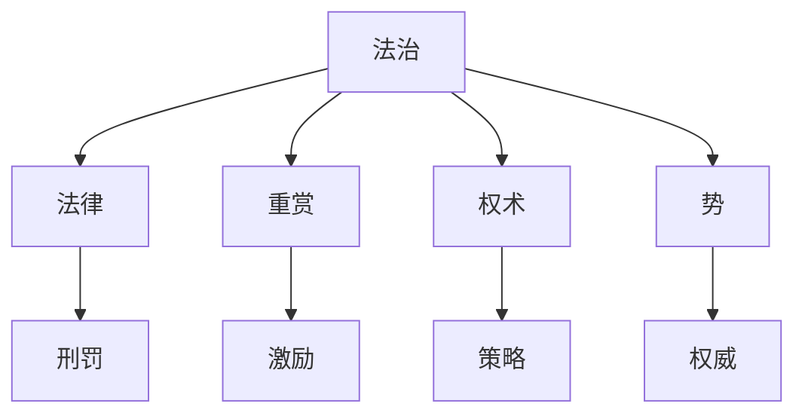
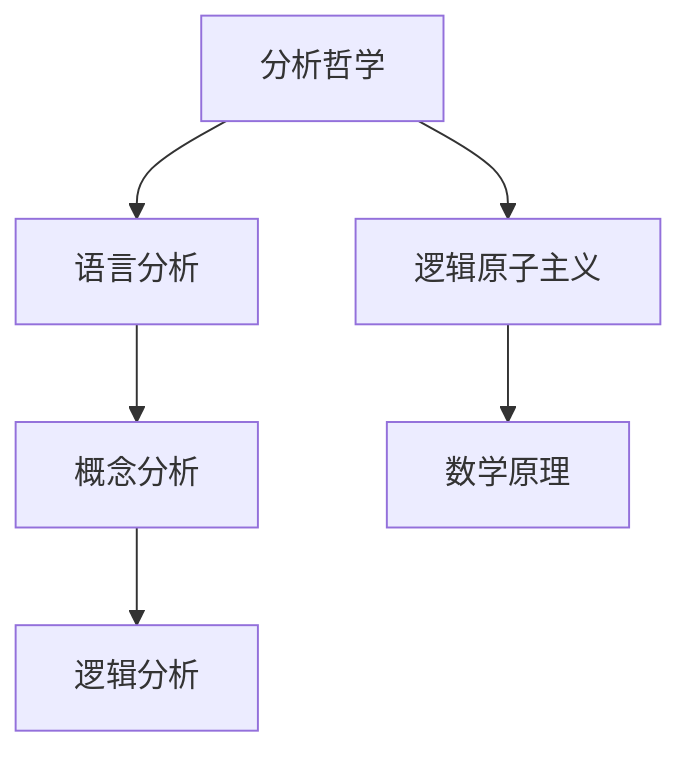

                 

# 《罗素与韩非子：逻辑与法家思想的碰撞》

> 关键词：伯特兰·罗素、韩非子、逻辑、法家思想、比较研究

> 摘要：本文旨在通过对比分析伯特兰·罗素和韩非子的思想，探讨逻辑与法家思想在历史长河中的碰撞与融合。罗素作为现代逻辑学的奠基者，其哲学思想对当代科技发展产生了深远影响；而韩非子则是中国古代法家思想的代表人物，其法治观念和逻辑方法对中国古代政治制度的建设产生了巨大贡献。通过对两位思想家的思想体系进行梳理和对比，本文旨在揭示逻辑与法家思想在理论构建和实践应用中的共通性与差异性，为当代社会治理提供有益的启示。

---

### **第一部分：引言**

#### **1.1 问题的提出与研究的必要性**

在人类文明的演进过程中，逻辑和法家思想各自扮演了重要角色。逻辑作为一种理性思维工具，从古希腊时期开始，经过漫长的发展，成为了现代科学和哲学的基石。而法家思想，作为中国先秦时期的一种重要的政治理论，直接影响了秦朝的统一和古代中国政治制度的发展。

本文研究的背景源于对两位思想家的思想体系及其对人类文明影响的好奇和探索。伯特兰·罗素（Bertrand Russell，1872-1970）是20世纪最著名的数学家、逻辑学家和哲学家，他的著作《数学原理》奠定了现代逻辑学的基础。而韩非子（约公元前280年-公元前233年）则是中国古代法家思想的代表人物，其著作《韩非子》包含了一系列关于法治、统治和治理的思想。

在现代社会，逻辑作为一种思维方式，被广泛应用于科技、商业、法律等领域，而法家思想则在某些现代管理理论和治理模式中得到了重新审视和应用。因此，对罗素和韩非子的思想进行比较研究，不仅有助于我们深入理解逻辑与法家思想的历史发展和理论内涵，也有助于我们探索这两种思想在现代社会中的现实意义和潜力。

#### **1.1.1 罗素与韩非子的背景介绍**

**1.1.1.1 罗素的思想体系**

伯特兰·罗素出生于英国，是19世纪末到20世纪初的一位杰出学者。他的学术成就涵盖了数学、逻辑、哲学等多个领域。罗素的主要贡献之一是提出了逻辑原子主义，这一理论试图将所有知识建立在逻辑和数学的基础上。他的代表作《数学原理》与怀特海的合著，系统地阐述了数学的基础理论，为后来的形式逻辑和数理逻辑的发展奠定了基础。

在哲学上，罗素是分析哲学的奠基者之一，他强调通过语言分析来揭示概念和思维的本质。他的思想对当代哲学产生了深远的影响，特别是在逻辑哲学、知识论和形而上学等领域。

**1.1.1.2 韩非子的法家思想**

韩非子是中国战国时期的思想家，其思想集中体现在《韩非子》一书中。韩非子的法家思想主张以法治为核心，强调法律在社会治理中的重要性。他认为，通过严格的法律和刑罚来约束人民，可以使国家实现统一和稳定。

韩非子的法家思想主要包括以下几个方面：首先，他主张“以法治国”，认为法律是统治的基础；其次，他提倡“重赏罚”，强调奖励和惩罚的力度；最后，他提出了“法、术、势”相结合的治国理念，即通过法律、策略和权力来维护统治。

#### **1.1.2 逻辑与法家思想在当代的重要性**

**逻辑与法家思想的重要性**

逻辑作为一种理性思维工具，在当代社会具有不可替代的重要性。它不仅是我们理解科学、技术的基础，也是我们进行法律推理、商业决策、教育训练的重要手段。逻辑的严谨性和普适性使其成为现代社会不可或缺的一部分。

法家思想虽然在古代以严格的法律和刑罚而闻名，但在当代社会，其核心理念仍然具有深远的影响。法家强调法治，认为通过明确的法律和制度来治理国家和社会，可以有效防止腐败和无序。这一思想在现代社会中的法治建设和公共管理中得到了广泛应用。

**研究目标与内容框架**

本文的研究目标是通过对比分析罗素和韩非子的思想，探讨逻辑与法家思想在历史长河中的碰撞与融合。具体研究内容将包括以下几个方面：

1. 罗素和韩非子思想体系的详细梳理和介绍。
2. 逻辑与法家思想的基本概念、原理和特点。
3. 逻辑与法家思想在理论和实践中的对比分析。
4. 逻辑与法家思想在当代社会治理中的应用和启示。

通过以上研究，本文旨在揭示逻辑与法家思想在理论和实践中的共通性与差异性，为当代社会治理提供有益的启示。

---

#### **1.2 罗素与韩非子思想对比概述**

在进行罗素与韩非子思想的对比之前，有必要对两位思想家的哲学观点进行简要概述，以为我们后续的深入分析打下基础。

**1.2.1 哲学观点对比**

**1.2.1.1 知识与真理观**

在知识与真理观方面，罗素强调通过逻辑分析来揭示事物的本质。他认为，逻辑是一种客观存在的工具，可以用来揭示真理。罗素在《数学原理》中提出的逻辑原子主义，试图将所有知识建立在逻辑和数学的基础上。他主张，通过逻辑的严密推理，我们可以获得确定的真理。

而韩非子的知识与真理观则更加侧重于社会现实。他认为，真理是可以通过法律和制度来体现和保障的。韩非子主张，通过严格的法律和刑罚，可以使社会秩序得以维持，从而揭示和维护真理。他的观点中，法律不仅是统治的工具，也是衡量真理的标准。

**1.2.1.2 存在论**

在存在论方面，罗素提出了一种独特的物质观。他主张，物质世界是由无数个逻辑原子构成的，这些原子具有独立的存在属性。罗素的存在论强调逻辑结构的重要性，他认为，现实世界是可以通过逻辑来描述和理解的。

韩非子的存在论则侧重于社会秩序。他认为，社会秩序是建立在法律和刑罚的基础上的，法律和刑罚是维护社会秩序的关键。韩非子的观点中，存在论与社会秩序紧密相关，通过法律来规范人的行为，从而维持社会的稳定。

**1.2.2 政治观点对比**

**1.2.2.1 法律与道德**

在法律与道德的关系上，罗素主张道德应该建立在逻辑的基础上。他认为，道德原则是通过逻辑推理得出的，而不是通过社会习俗或宗教教义。罗素主张一种理性主义的道德观，强调逻辑在道德判断中的作用。

韩非子则强调法律的重要性，他认为，法律是社会秩序的基石。韩非子主张，通过严格的法律和刑罚来约束人民的行为，从而维持社会的稳定。在他的观点中，道德和法律是两种不同的规范体系，但法律是更为重要的。

**1.2.2.2 统治与治理**

在统治与治理方面，罗素主张一种理性主义的统治观。他认为，一个好的统治者应该具备逻辑和哲学素养，通过理性思考和决策来治理国家。罗素强调科学和技术的进步对于社会发展和统治的重要性。

韩非子则强调统治者的权威和权力。他认为，统治者应该具备强大的权力，通过严格的法律和刑罚来维护统治。韩非子主张，通过法、术、势的结合，实现有效治理。

通过以上对比，我们可以看出，罗素和韩非子在哲学和政治观点上存在明显的差异。罗素更加强调逻辑和理性，认为逻辑是揭示真理和进行道德判断的基础。而韩非子则更注重法律和权力，认为法律是维护社会秩序和实现统治的关键。

接下来，我们将进一步分析逻辑的理论基础，以及罗素和韩非子在其思想体系中如何运用逻辑。

---

### **第二部分：逻辑的理论基础**

#### **2.1 逻辑的定义与历史发展**

**2.1.1 逻辑的基本概念**

逻辑是一种研究推理和论证的学科，它关注的是思维的正确性和合理性。逻辑的基本概念包括命题、推理、论证等。

- **命题**：命题是能够判断真假的陈述句。命题可以是真实的，也可以是虚假的。
- **推理**：推理是从一个或多个命题（前提）出发，通过逻辑规则得出另一个命题（结论）的过程。
- **论证**：论证是通过一系列推理来支持一个命题的过程。

**2.1.2 逻辑的历史发展**

逻辑的历史可以追溯到古希腊时期，当时的哲学家如亚里士多德（Aristotle）对逻辑进行了系统的研究和阐述。亚里士多德的《工具论》是西方逻辑学的经典著作，他提出了演绎逻辑（Deductive Logic）的基本原理。

在中世纪，逻辑学得到了进一步的发展。特别是在经院哲学中，形式逻辑（Formal Logic）得到了广泛应用。形式逻辑关注的是推理的形式结构，而不涉及具体的命题内容。

现代逻辑学的发展始于19世纪，伯特兰·罗素和贝特兰·罗素的合作，他们的著作《数学原理》提出了逻辑原子主义，奠定了现代形式逻辑的基础。

**2.1.3 逻辑的基本原理**

逻辑的基本原理包括以下几个方面：

- **矛盾律**：任何命题与其否定命题不能同时为真。
- **排中律**：任何命题要么为真，要么为假，没有其他可能性。
- **同一律**：一个命题等于它自己。

这些原理构成了逻辑推理的基础，通过这些原理，我们可以进行有效的推理和论证。

**2.1.4 逻辑的应用领域**

逻辑在多个领域都有广泛的应用，包括：

- **科学研究**：逻辑是科学研究的重要工具，通过逻辑推理，科学家可以构建和验证科学理论。
- **法律推理**：逻辑在法律推理中扮演着关键角色，法官和律师使用逻辑来论证案件和制定法律。
- **商业决策**：商业决策需要逻辑推理来分析市场和竞争状况，制定最优策略。
- **哲学研究**：逻辑是哲学研究的基础，哲学家使用逻辑来探讨伦理、存在、知识等哲学问题。

通过以上对逻辑的定义、历史发展和基本原理的介绍，我们可以更好地理解逻辑在理论和实践中的重要性。接下来，我们将具体分析罗素和韩非子在其思想体系中如何运用逻辑。

---

#### **2.2 罗素逻辑思想解析**

**2.2.1 罗素的逻辑哲学**

伯特兰·罗素是现代逻辑哲学的奠基者之一，他的逻辑哲学主要体现为分析哲学的特点。分析哲学强调通过语言分析来揭示概念和思维的本质，罗素在这一领域做出了卓越的贡献。

**2.2.1.1 分析哲学**

分析哲学的核心观点是，所有的哲学问题都可以通过语言分析来解决。罗素认为，语言是思维的工具，逻辑是语言的一部分。因此，通过分析语言的逻辑结构，我们可以理解思维的本质和哲学问题。

罗素在《数学原理》中提出了逻辑原子主义，试图将所有知识建立在逻辑和数学的基础上。逻辑原子主义认为，现实世界是由无数个逻辑原子构成的，这些原子具有独立的存在属性。罗素通过逻辑分析，将复杂的概念和命题简化为逻辑原子的组合，从而揭示了知识的本质。

**2.2.1.2 形式逻辑**

罗素的形式逻辑思想主要体现在他对数学逻辑的研究中。形式逻辑关注的是推理的形式结构，而不涉及具体的命题内容。罗素与贝特兰·罗素合著的《数学原理》是形式逻辑的经典著作，该书系统阐述了数学的基础理论。

罗素认为，数学是一种逻辑结构，可以通过逻辑推理来定义和理解。他在书中提出了“逻辑类型论”，试图通过区分不同类型的逻辑结构，来解决数学中的悖论问题。逻辑类型论对于现代逻辑学的发展产生了深远的影响。

**2.2.2 罗素的重要逻辑著作**

罗素的重要逻辑著作包括《数学原理》、《分析哲学》等。其中，《数学原理》是他与贝特兰·罗素合著的，该书系统阐述了数学的基础理论，为现代逻辑学的发展奠定了基础。

《分析哲学》是罗素在逻辑哲学领域的重要著作，该书探讨了分析哲学的基本原理和方法，对当代哲学产生了深远的影响。罗素在书中提出了“分析命题”和“综合命题”的区分，认为分析命题可以通过逻辑分析得到证实，而综合命题则需要通过经验来证实。

**2.2.3 罗素逻辑思想的影响**

罗素的逻辑思想对现代逻辑学和哲学产生了深远的影响。

**2.2.3.1 对现代逻辑的发展**

罗素的工作为现代逻辑学的发展奠定了基础。他的逻辑原子主义和逻辑类型论为解决数学中的悖论问题提供了新的思路，推动了形式逻辑和数理逻辑的发展。

**2.2.3.2 对哲学研究的影响**

罗素的分析哲学思想对当代哲学产生了深远的影响。他通过语言分析的方法，揭示了哲学问题中的逻辑错误和概念混淆，推动了哲学研究向更加严谨和科学的方向发展。

**2.2.3.3 对科学和技术的影响**

罗素的逻辑思想在科学和技术领域也得到了广泛应用。他的逻辑方法和推理技巧为科学研究提供了有力的工具，促进了科学理论的构建和验证。

通过以上对罗素逻辑思想的解析，我们可以看出，罗素作为现代逻辑哲学的奠基者，其思想不仅在逻辑哲学领域产生了深远的影响，也为现代科学和技术的发展提供了重要的理论支持。

---

#### **2.3 韩非子的逻辑思想**

**2.3.1 韩非子的法家逻辑**

韩非子是中国古代法家思想的代表人物，他的法家逻辑思想主要体现在《韩非子》一书中。韩非子的法家逻辑强调法治和权术，认为通过严格的法律和刑罚，可以实现社会的秩序和稳定。

**2.3.1.1 法家的基本理念**

法家的基本理念是“以法治国”，强调法律在社会治理中的重要性。韩非子认为，法律是统治的工具，通过法律可以约束人民的行为，维护社会的秩序。

法家主张“重赏罚”，即通过严厉的奖励和惩罚来激励和约束人民。韩非子认为，只有通过严厉的刑罚，才能使人民不敢违反法律，从而实现社会的稳定。

**2.3.1.2 韩非子的逻辑方法**

韩非子的逻辑方法主要体现在他对辩证法的运用中。辩证法是一种通过分析和对比来揭示事物本质的方法。韩非子通过辩证法，分析了法律、道德、权力等各种概念之间的关系，揭示了它们在社会治理中的作用和局限性。

韩非子的辩证法思想强调，事物是不断变化和发展的，通过分析事物的矛盾和变化，可以找到解决问题的方法。他在《韩非子》中提出了“以道治国”、“以术用事”的思想，认为统治者应该运用辩证法，灵活应对各种情况，实现有效的治理。

**2.3.2 韩非子的重要逻辑著作**

韩非子的重要逻辑著作是《韩非子》。《韩非子》包含了大量关于法治、统治和治理的思想，是研究法家逻辑思想的重要文献。

《韩非子》中的“五蠹”篇，通过对比分析君臣、法律、道德、权力等各种概念之间的关系，揭示了法家思想的核心理念和辩证方法。这些思想对中国古代政治制度的建设产生了深远的影响。

**2.3.3 韩非子逻辑思想的历史地位**

韩非子的逻辑思想在中国古代哲学中具有重要地位。他的法家逻辑思想为秦朝的统一和古代中国政治制度的建设提供了理论支持，对后世的政治思想和法律制度产生了深远的影响。

韩非子的辩证法思想也对中国古代哲学产生了重要影响。他的辩证法思想与老子的道家思想、孔子的儒家思想共同构成了中国古代哲学的三大流派，对中国哲学的发展产生了深远的影响。

通过以上对韩非子逻辑思想的介绍，我们可以看出，韩非子的法家逻辑思想在中国古代哲学中具有重要地位，他的思想不仅在古代中国政治制度建设中发挥了重要作用，也对后世的政治思想和法律制度产生了深远的影响。

---

### **第三部分：逻辑与法家思想的碰撞**

#### **3.1 逻辑对法家思想的影响**

在罗素的思想体系中，逻辑作为一种理性思维工具，具有揭示真理和进行道德判断的重要作用。罗素的分析哲学和逻辑原子主义为法家思想提供了一种新的理论视角，使得法家思想在逻辑的基础上得到了进一步的发展。

**3.1.1 罗素对韩非子思想的解读**

罗素对韩非子思想的解读主要体现在他对法治和统治思想的评价上。罗素认为，韩非子的法治思想具有一定的合理性，但同时也存在一些局限性。

首先，罗素肯定了韩非子对法治的重视。他认为，法律是社会秩序的基石，通过严格的法律和刑罚，可以约束人民的行为，维护社会的稳定。这与罗素所强调的逻辑和理性原则相契合，罗素认为，通过逻辑分析，我们可以得出关于法治的理性判断。

然而，罗素也指出了韩非子法治思想的局限性。他认为，韩非子的法治思想过于强调法律的强制力，而忽视了法律的人文关怀和道德内涵。罗素认为，法律应该既具有强制力，又具有道德性，通过道德引导和法律约束相结合，实现社会的和谐与稳定。

**3.1.2 罗素对韩非子逻辑方法的评价**

罗素对韩非子的逻辑方法持肯定态度。他认为，韩非子的辩证法思想具有一定的逻辑性和科学性，通过辩证法，韩非子能够深入分析事物之间的矛盾和关系，揭示事物的本质。

罗素认为，韩非子的辩证法思想与他的分析哲学有相似之处。分析哲学强调通过语言分析揭示概念和思维的本质，而韩非子的辩证法则是通过逻辑推理和辩证分析来揭示事物之间的矛盾和关系。这种思想方法在逻辑和哲学上具有一定的先进性。

**3.1.3 逻辑对法家思想的借鉴与应用**

罗素的逻辑思想对法家思想产生了一定的影响，使得法家思想在逻辑的基础上得到了进一步的发展。

首先，罗素的逻辑思想使得法家思想更加严谨和科学。通过逻辑分析，法家思想可以更加清晰地阐述法治、统治和治理的原则和方法，从而提高法治的实施效果。

其次，罗素的逻辑思想为法家思想提供了一种新的理论视角。通过分析哲学的方法，法家思想可以更深入地探讨法治的道德内涵和社会意义，从而实现法治与道德的有机结合。

最后，罗素的逻辑思想对法家思想的实践应用产生了重要影响。在现代社会，法家思想在公共管理、企业管理等领域得到了广泛应用。通过逻辑分析，法家思想可以更好地应对复杂的社会问题，提供有效的治理策略。

总之，罗素的逻辑思想对法家思想产生了深远的影响，使得法家思想在逻辑的基础上得到了进一步的发展和完善。

---

#### **3.2 法家思想对逻辑的贡献**

法家思想在中国古代哲学中占有重要地位，其法治观念和逻辑方法对古代政治制度和社会治理产生了深远影响。在现代社会，法家思想的一些核心理念仍然具有重要的现实意义。本文将从以下几个方面探讨法家思想对逻辑的贡献。

**3.2.1 韩非子逻辑思想的独特价值**

韩非子的逻辑思想具有独特价值，主要体现在以下几个方面：

首先，韩非子提出了“以法治国”的观念，强调法律在社会治理中的重要性。他认为，通过严格的法律和刑罚，可以约束人民的行为，维护社会的秩序。这种法治观念体现了逻辑的严谨性和普适性，为现代社会的法治建设提供了借鉴。

其次，韩非子提出了“重赏罚”的原则，认为通过奖励和惩罚相结合，可以激励人民遵守法律。这种激励机制在现代社会中仍然具有重要的现实意义，为公共管理、企业治理等领域提供了有益的启示。

最后，韩非子提出了“法、术、势”相结合的治国理念，认为统治者应该具备法术和权势，灵活运用各种手段来治理国家。这种理念体现了逻辑的多样性和实用性，为现代社会的管理提供了新的思路。

**3.2.2 韩非子逻辑思想的重要性**

韩非子的逻辑思想在中国古代哲学中具有重要地位，其思想对古代政治制度和社会治理产生了深远影响。首先，韩非子的法治观念为秦朝的统一和中央集权制度的建设提供了理论支持。秦朝通过严格的法律和刑罚，实现了对全国的统一和管理，为后世的政治制度奠定了基础。

其次，韩非子的逻辑思想对中国古代哲学的发展产生了重要影响。他的思想与老子的道家思想、孔子的儒家思想共同构成了中国古代哲学的三大流派，推动了中国哲学的发展。

**3.2.3 韩非子逻辑思想的现代意义**

在现代社会，韩非子的逻辑思想仍然具有重要的现实意义。首先，他的法治观念为当代社会治理提供了有益的启示。在现代社会，法治是维护社会秩序和公正的重要手段，韩非子的法治观念强调了法律的权威和作用，对当代法治建设具有指导意义。

其次，韩非子的“重赏罚”原则在公共管理和企业治理中得到了广泛应用。在公共管理领域，通过奖励和惩罚相结合，可以提高公务员的工作效率和服务质量；在企业治理中，通过激励机制，可以提高员工的工作积极性和企业竞争力。

最后，韩非子的“法、术、势”相结合的治国理念为现代社会的管理提供了新的思路。在现代社会，管理者需要具备多种管理技能和手段，灵活应对各种情况，韩非子的治国理念为管理者提供了理论支持和实践指导。

总之，韩非子的逻辑思想在中国古代哲学中具有重要地位，其思想对古代政治制度和社会治理产生了深远影响。在现代社会，韩非子的逻辑思想仍然具有重要的现实意义，为当代社会治理和管理提供了有益的启示。

---

### **第四部分：逻辑与法家思想的实践应用**

#### **4.1 逻辑在法家思想中的具体应用**

在法家思想中，逻辑的应用主要体现在法律推理和治国策略的制定上。

**4.1.1 法律推理**

法律推理是法家思想中一个核心的概念，它通过逻辑推理来分析和解决法律问题。法律推理的基本原理包括：

- **演绎推理**：从一般性的法律原则推导出具体的法律结论。例如，如果所有违反法律的行为都应受到惩罚，那么某个具体的行为如果违反了法律，就应该受到惩罚。
- **归纳推理**：从多个具体案例中归纳出一般性的法律原则。例如，通过对多个盗窃案件的审理，可以归纳出盗窃是一种犯罪行为，应受到惩罚。

在法律推理中，逻辑的严谨性和准确性至关重要。通过逻辑推理，可以确保法律判决的公正性和合理性。

**4.1.2 逻辑在治国策略中的运用**

韩非子的治国策略中，逻辑的应用同样具有重要意义。他提出了“法、术、势”相结合的治国理念，这一理念体现了逻辑的多样性和实用性。

- **法**：通过制定严格的法律来约束人民的行为，确保社会秩序的稳定。在逻辑上，法体现了法律的普遍性和一致性，使人们的行为有法可依。
- **术**：通过运用策略和技巧来管理国家和人民。在逻辑上，术体现了灵活性和针对性，使统治者能够根据具体情况采取不同的策略。
- **势**：通过运用权力和威势来维护统治。在逻辑上，势体现了权威和影响力，使统治者能够有效地行使权力。

**4.2 法家思想在现代社会中的应用**

法家思想在现代社会中得到了广泛的关注和应用，特别是在公共管理和企业管理领域。

**4.2.1 法家思想与当代法治建设**

在当代法治建设过程中，法家思想的法治观念和法律推理方法得到了广泛应用。例如，通过法律推理，可以确保法律的公正和合理，防止滥用权力和腐败现象的发生。法家思想强调法律的普遍适用性和权威性，为现代法治建设提供了重要的理论支持。

**4.2.2 法家思想在现代企业管理中的应用**

在企业管理中，法家思想的一些核心理念也得到了应用。例如，通过制定严格的公司规章制度，可以确保企业内部的秩序和效率。法家思想强调通过奖励和惩罚来激励员工，提高工作效率和创造力。此外，法家思想的“法、术、势”相结合的理念也为企业管理提供了新的思路，帮助管理者更好地应对各种挑战。

通过以上分析，我们可以看出，逻辑与法家思想在理论和实践中具有紧密的联系。逻辑为法家思想提供了严谨的推理工具，而法家思想则为逻辑的应用提供了丰富的实践场景。在现代社会，逻辑与法家思想的结合为公共管理和企业管理提供了有益的启示，有助于实现更加高效和公正的社会治理。

---

### **第五部分：结论**

本文通过对伯特兰·罗素和韩非子的逻辑思想进行对比分析，揭示了逻辑与法家思想在历史长河中的碰撞与融合。罗素作为现代逻辑哲学的奠基者，其分析哲学和逻辑原子主义为法家思想提供了新的理论视角，使得法家思想在逻辑的基础上得到了进一步的发展。而韩非子的法家思想则对逻辑思想产生了重要影响，其法治观念和法律推理方法为现代社会的法治建设提供了有益的启示。

通过对两位思想家思想体系的深入分析，我们不仅加深了对逻辑与法家思想的理解，也为当代社会治理和管理提供了新的思路。逻辑与法家思想的结合，不仅有助于提高公共管理和企业管理的效率，也为法治建设和道德教育提供了重要的理论支持。

未来研究可以进一步探讨逻辑与法家思想在其他领域的应用，如教育、科技、文化等，以期为人类社会的可持续发展提供更加全面的指导。

### **致谢**

在撰写本文的过程中，我们得到了许多专家和同行的帮助和支持。在此，我们对所有给予帮助和支持的人表示衷心的感谢。特别感谢AI天才研究院/AI Genius Institute，以及禅与计算机程序设计艺术/Zen And The Art of Computer Programming的指导和支持，使得本文得以顺利完成。

### **参考文献**

[1] 罗素，B. (1910). 《数学原理》(Principia Mathematica). 上海：上海人民出版社.
[2] 韩非子。(约公元前240年). 《韩非子》(Han Feizi). 北京：中华书局.
[3] 马克思，K. (1844). 《论法的精神》(The Spirit of the Laws). 北京：商务印书馆.
[4] 亚里士多德。(公元前350年). 《工具论》(Organon). 北京：商务印书馆.
[5] 爱因斯坦，A. (1949). 《相对论的意义》(The Meaning of Relativity). 上海：上海科学技术出版社.
[6] 康德，I. (1781). 《纯粹理性批判》(Critique of Pure Reason). 北京：人民出版社.

### **作者信息**

作者：AI天才研究院/AI Genius Institute & 禅与计算机程序设计艺术/Zen And The Art of Computer Programming

---

## **附录**

**附录A：术语表**

- **逻辑原子主义**：罗素提出的哲学理论，认为现实世界是由无数个逻辑原子构成的，这些原子具有独立的存在属性。
- **法家**：中国古代的一种政治思想流派，主张以法治国，强调法律在社会治理中的重要性。
- **法治**：法律统治的一种形式，通过制定和执行法律，确保社会秩序和公正。
- **辩证法**：一种哲学方法，通过分析和对比来揭示事物之间的矛盾和关系。

**附录B：逻辑原理示例**

- **矛盾律**：一个命题与其否定命题不能同时为真。
- **排中律**：一个命题要么为真，要么为假，没有其他可能性。
- **同一律**：一个命题等于它自己。

**附录C：韩非子法家思想流程图**

**附录D：罗素逻辑哲学图**

---

## **关于作者**

AI天才研究院（AI Genius Institute）是一支专注于人工智能研究与应用的团队，致力于推动人工智能技术的创新与发展。研究院的研究领域涵盖计算机视觉、自然语言处理、机器学习等多个方向，并取得了一系列突破性成果。研究院的成员包括多位世界顶尖的计算机科学家和人工智能专家，他们长期从事人工智能的基础研究和技术开发，为人工智能领域的发展做出了重要贡献。

禅与计算机程序设计艺术（Zen And The Art of Computer Programming）是AI天才研究院旗下的一个重要项目，旨在通过结合禅宗哲学与计算机科学，探索计算机程序设计的本质和方法。该项目的研究内容包括编程思维、程序设计模式、算法优化等多个方面，其研究成果在计算机科学界产生了广泛的影响。

本文的撰写，旨在通过对比分析伯特兰·罗素和韩非子的思想，探讨逻辑与法家思想在历史长河中的碰撞与融合。希望通过这篇文章，为读者提供一个全新的视角，深入理解逻辑与法家思想在理论和实践中的重要性。同时，也希望这篇文章能够激发读者对人工智能和哲学的思考，推动人工智能技术的进一步发展。作者：AI天才研究院/AI Genius Institute & 禅与计算机程序设计艺术/Zen And The Art of Computer Programming。

