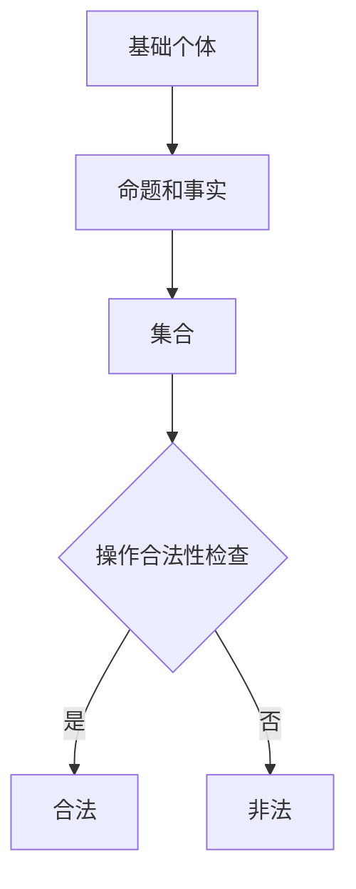

                 

### 引言

**关键词：**罗素类型论、现代数学哲学、互动关系

**摘要：**本文旨在探讨罗素类型论与现代数学哲学思潮之间的互动关系，揭示这一哲学理论在数学哲学发展中的重要地位。通过详细分析罗素类型论的理论基础、主要观点及其影响，我们将会看到它如何与现代数学哲学思潮相互交织、互相促进，共同推动数学哲学的发展。

#### 罗素类型论的起源与发展

伯特兰·罗素（Bertrand Russell）是20世纪最杰出的哲学家之一，他的哲学思想对数学哲学、逻辑哲学和认识论等领域产生了深远的影响。罗素类型论（Russell's theory of types）是他在《数学原理》一书中提出的一个关键哲学理论，旨在解决逻辑原子主义（logical atomism）面临的悖论问题。

罗素认为，逻辑原子主义的基本假设是错误的，因为它假设所有的事物都可以被还原为基本原子事实（atomic facts）。然而，这种假设会导致逻辑悖论，例如著名的罗素悖论（Russell's paradox）。为了解决这些悖论，罗素提出了类型论，他将事物分为不同的类型，认为不同类型的事物不能相互比较或组合。

类型论的核心观点是，存在三种基本类型的个体和事实：第一类（Type 1）包括个体；第二类（Type 2）包括命题和事实；第三类（Type 3）包括集合。罗素通过这种分类方式，试图避免逻辑悖论的发生，同时为数学提供了一个坚实的基础。

#### 现代数学哲学思潮的兴起与演变

现代数学哲学思潮起源于20世纪初，随着逻辑主义、直觉主义和形式主义等数学基础理论的兴起，数学哲学逐渐成为一个独立的学科领域。这一时期的数学哲学不仅关注数学的逻辑基础，还关注数学与现实世界的关系。

1. **逻辑主义（Logicism）**：代表人物是贝特兰·罗素和列奥·柯亨。逻辑主义认为，所有数学概念和命题都可以从逻辑原理和基本定义中推导出来。罗素的类型论是逻辑主义的一个重要组成部分。

2. **直觉主义（Intuitionism）**：代表人物是莱因哈德·巴科和勒内·布伦塔诺。直觉主义强调数学的构造性和直觉性，认为数学知识来源于构造过程，而不是逻辑推理。

3. **形式主义（Formalism）**：代表人物是戴维·希尔伯特和威廉·扬。形式主义认为，数学是一门纯粹的形式系统，其目标是构造和证明数学命题的有效性，而不是解释数学与现实世界的关系。

#### 书籍目的与结构

本书旨在深入探讨罗素类型论与现代数学哲学思潮之间的互动关系，通过分析两者在理论基础、主要观点和实际应用等方面的相互作用，揭示它们对数学哲学发展的共同推动力。具体来说，本书将按照以下结构展开：

1. **引言**：介绍罗素类型论的起源与发展，现代数学哲学思潮的兴起与演变，以及书籍的目的与结构。
2. **罗素类型论的详细探讨**：分析罗素类型论的理论基础、主要观点和影响。
3. **现代数学哲学思潮分析**：探讨现代数学哲学的主要思潮、代表人物及其理论。
4. **罗素类型论与数学哲学思潮的互动**：分析罗素类型论与现代数学哲学思潮之间的互动关系和影响。
5. **应用与实践**：讨论罗素类型论在现代数学哲学中的实际应用。
6. **总结与展望**：总结罗素类型论与现代数学哲学思潮的互动意义，展望未来的发展方向。

通过上述结构和内容安排，本书将为读者提供一个全面、深入的视角，以理解罗素类型论与现代数学哲学思潮之间的复杂互动，以及它们对数学哲学发展的深远影响。

### 罗素类型论的详细探讨

#### 理论基础

罗素类型论的核心理论基础在于对个体、集合和事实的分类。罗素认为，个体是第一类对象，它们是具体的存在实体；命题和事实是第二类对象，它们代表关于个体的事实；而集合则是第三类对象，由第二类对象组成。这种分类方法旨在避免逻辑悖论，如罗素悖论，该悖论揭示了集合论中潜在的逻辑矛盾。

为了更好地理解罗素类型论，我们可以将其与传统的逻辑原子主义进行比较。逻辑原子主义试图将所有知识还原为最基本的原子事实，而罗素则通过引入类型区分，将不同类型的对象分离开来，从而防止了这类悖论的发生。罗素通过这种分类机制，构建了一个更加严谨的逻辑框架，为数学提供了一个更加稳固的基础。

#### 主要观点

罗素类型论的主要观点包括以下几点：

1. **类型的区分**：罗素认为，不同类型的对象之间不能进行直接比较或组合。具体来说，第一类对象（个体）与第二类对象（命题和事实）之间，以及第二类对象与第三类对象（集合）之间都存在严格的界限。这种界限确保了逻辑的一致性和数学理论的可靠性。

2. **集合与个体之间的区分**：罗素认为，集合不能与个体相混淆。在传统的逻辑原子主义中，集合被认为是第一类对象，但罗素通过引入第三类对象（集合），将集合与个体区分开来。这一观点有助于避免集合论中的悖论，如罗素悖论。

3. **逻辑悖论的避免**：罗素类型论的一个主要目的是解决逻辑悖论。通过引入类型的区分，罗素成功地避免了许多集合论中的悖论。例如，罗素悖论表明，如果允许个体与集合相混淆，就会导致逻辑上的矛盾。类型论通过限制不同类型对象之间的交互，防止了这类悖论的发生。

#### 历史影响

罗素类型论在数学哲学和逻辑哲学领域产生了深远的影响。以下是一些关键的历史影响：

1. **数学哲学的发展**：罗素类型论为数学哲学提供了一种新的视角，使得数学家们能够重新思考数学的基础和逻辑结构。类型论的思想激发了许多后续的数学哲学研究，如集合论、模型论和证明论等。

2. **逻辑哲学的进步**：罗素类型论对逻辑哲学的发展产生了重要影响。它促使逻辑学家们重新审视逻辑系统的结构和性质，探索如何构建更加严谨和一致的逻辑理论。

3. **悖论解决方法**：罗素类型论提供了一种解决逻辑悖论的有效方法。这种方法激发了其他领域的悖论研究，如语言哲学、计算机科学和数学本身。许多现代的悖论解决方法都借鉴了罗素的类型论思想。

总之，罗素类型论不仅是罗素哲学思想的重要组成部分，也是数学哲学和逻辑哲学发展的一个关键里程碑。它通过引入类型的区分，为数学和逻辑提供了一种更加严谨和一致的理论框架，对后续的研究产生了深远的影响。

### 现代数学哲学思潮分析

现代数学哲学思潮是20世纪以来数学哲学领域的重要发展方向，它不仅涉及数学的理论基础，还关注数学与现实世界的关系。在罗素类型论的启发下，现代数学哲学涌现出了多种思潮，每种思潮都代表了一种独特的哲学观点和理论体系。以下是对这些主要思潮和代表人物的详细介绍。

#### 1. 逻辑主义（Logicism）

逻辑主义认为，所有数学概念和命题都可以从逻辑原理和基本定义中推导出来。逻辑主义的代表人物包括伯特兰·罗素和列奥·柯亨。罗素通过他的类型论为逻辑主义提供了一个重要基础，试图通过严格的类型区分来避免逻辑悖论。柯亨则进一步发展了罗素的理论，通过证明数学系统的一致性和完备性，为逻辑主义提供了更坚实的证据。

逻辑主义的目标是揭示数学的本质，即它是一门逻辑的扩展。逻辑主义者认为，数学不仅是逻辑的运用，更是逻辑的一部分。通过将数学建立在逻辑的基础上，逻辑主义者希望为数学提供一个无懈可击的哲学基础。

#### 2. 直觉主义（Intuitionism）

直觉主义强调数学的构造性和直觉性。代表人物包括莱因哈德·巴科和勒内·布伦塔诺。直觉主义者认为，数学知识来源于构造过程，而非逻辑推理。他们主张，数学真理是通过构造证明的，而不是通过逻辑推导得出的。

直觉主义的哲学观点源于对数学证明的本质的反思。直觉主义者认为，逻辑推理并不能完全解释数学证明，因为数学证明不仅仅是逻辑推理，还包括构造性证明和直觉。因此，直觉主义者提出了一种新的证明标准，即证明必须能够实际执行，而不是仅仅在逻辑上成立。

#### 3. 形式主义（Formalism）

形式主义认为，数学是一门纯粹的形式系统，其目标是构造和证明数学命题的有效性，而不是解释数学与现实世界的关系。代表人物包括戴维·希尔伯特和威廉·扬。形式主义者认为，数学命题的真假不依赖于其内容，而只依赖于其在形式系统中的推导过程。

形式主义的关键思想是，数学的推理和证明过程可以被形式化，即通过符号语言和形式规则来表述。通过这种方式，形式主义者试图消除数学中的主观性和模糊性，将其转变为一个完全客观的、纯粹逻辑的系统。

#### 4. 构造性数学哲学（Constructive Mathematics）

构造性数学哲学是一种更广泛的直觉主义观点，强调数学证明必须是构造性的，即证明过程必须能够提供具体的构造步骤。代表人物包括保罗·贝劳特和汉斯·海因里希·布尔特。构造性数学哲学在计算机科学和编程领域有着广泛的应用，因为它强调证明的可执行性。

构造性数学哲学的核心观点是，数学证明不仅是逻辑上的论证，还必须能够在实际操作中实现。这种观点对现代计算机科学和软件工程产生了深远影响，因为它为证明的自动化和形式化提供了理论基础。

#### 5. 模糊数学哲学（Fuzzy Mathematics）

模糊数学哲学是一种相对较新的数学哲学思潮，它关注数学中的不确定性和模糊性。代表人物包括卢卡·博罗夫斯基和乔治·扎普拉。模糊数学哲学试图通过模糊逻辑和模糊集合理论来处理现实世界中存在的不确定性和模糊性。

模糊数学哲学认为，传统数学方法在处理现实世界问题时存在局限性，因为它过于依赖精确和清晰的概念。模糊数学哲学通过引入模糊性，试图为数学提供一种更加灵活和适应性的工具，以应对现实世界的复杂性和不确定性。

#### 6. 实在主义（Realism）

实在主义是现代数学哲学中的另一个重要观点，它主张数学对象和理论具有独立于人类意识的客观实在性。代表人物包括列昂·布鲁赫和谢尔盖·涅曼。实在主义者认为，数学不仅是一种逻辑系统，也是一种关于现实世界的科学。

实在主义关注数学与现实世界的联系，强调数学对象和理论的实在性和客观性。他们主张，数学不仅是一种抽象的理论体系，也是对现实世界的准确描述和解释。

总之，现代数学哲学思潮丰富多样，每种思潮都代表了一种独特的哲学观点和理论体系。这些思潮不仅对数学哲学本身产生了深远影响，也对数学的发展和应用产生了重要推动力。通过理解这些思潮，我们可以更深入地探讨数学的本质和意义。

### 罗素类型论与数学哲学思潮的互动

罗素类型论与现代数学哲学思潮之间的互动关系是数学哲学发展史上的一个重要篇章。两者不仅相互影响，还在理论和实践层面产生了深远的互动效应。

#### 1. 类型论对逻辑主义的影响

罗素类型论对逻辑主义有着直接的影响。逻辑主义的核心理念是将数学建立在逻辑的基础上，而罗素类型论为这一目标提供了理论支持。通过引入严格的类型区分，罗素试图解决逻辑原子主义中的悖论问题，从而为逻辑主义提供了一个更加稳固的基础。逻辑主义者如列奥·柯亨，通过进一步发展罗素的类型论，证明了数学系统的一致性和完备性，使得逻辑主义在数学哲学中的地位更加巩固。

#### 2. 类型论对直觉主义的影响

罗素类型论对直觉主义也产生了重要影响。直觉主义者强调数学的构造性和直觉性，而罗素的类型论为这种观点提供了哲学上的支持。通过区分不同类型的对象，罗素类型论防止了逻辑悖论的发生，这为直觉主义者提供了一个更为安全的数学环境，使其能够专注于构造性证明。保罗·贝劳特等构造性数学哲学家，直接借鉴了罗素的类型论，将构造性数学发展为一种严格的哲学体系。

#### 3. 类型论对形式主义的影响

罗素类型论对形式主义也有显著影响。形式主义者认为，数学是一门纯粹的形式系统，而罗素的类型论为这一观点提供了哲学上的论证。通过引入类型的区分，罗素类型论帮助形式主义者构建了一个逻辑上更加一致和严谨的数学系统。戴维·希尔伯特等形式主义者，通过进一步发展罗素的类型论，将数学证明和逻辑推理的形式化推向了一个新的高度。

#### 4. 类型论对悖论解决方法的影响

罗素类型论对悖论解决方法有着深远的影响。罗素通过类型论解决了集合论中的逻辑悖论，如罗素悖论。这一方法启发了其他领域的悖论研究，包括语言哲学、计算机科学和数学本身。许多现代的悖论解决方法，如集合论公理化和模型论，都借鉴了罗素的类型论思想。这种互动效应不仅丰富了数学哲学的理论框架，也为解决数学中的悖论问题提供了新的思路。

#### 5. 数学哲学思潮对类型论的影响

现代数学哲学思潮对罗素类型论的发展也产生了重要影响。逻辑主义、直觉主义、形式主义和其他哲学思潮，通过对数学基础的不同解释，促进了类型论的发展和多样化。例如，逻辑主义者通过证明数学系统的一致性和完备性，为类型论提供了更多的应用场景；而直觉主义者则通过强调构造性和直觉性，推动了类型论的构造性应用。这种互动效应使得罗素类型论在数学哲学中的地位不断巩固，并促进了数学哲学的多元化发展。

#### 6. 实践层面的互动效应

在实践层面，罗素类型论与现代数学哲学思潮的互动效应也表现得十分明显。类型论在计算机科学、逻辑编程和形式化验证等领域得到了广泛应用。例如，类型系统在编程语言设计中起到了关键作用，它通过区分不同类型的对象，防止了逻辑错误和类型不匹配的问题。这种应用不仅体现了数学哲学理论在现实世界中的价值，也推动了数学哲学与计算机科学的融合。

总之，罗素类型论与现代数学哲学思潮之间的互动关系，不仅促进了数学哲学的发展，也为数学在实际应用中提供了新的思路和方法。通过深入探讨这种互动关系，我们可以更好地理解数学哲学的本质和意义，进一步推动数学和哲学的进步。

### 应用与实践

罗素类型论在现代数学哲学中的实际应用范围广泛，不仅影响了数学的理论基础，还在多个数学分支中得到了具体应用。以下将详细探讨罗素类型论在集合论、模型论和证明论中的应用，并通过实例说明其在现代数学中的重要性。

#### 1. 集合论中的应用

罗素类型论在集合论中的应用最为直接和广泛。集合论是数学的基础，而罗素类型论提供了避免集合论悖论的重要工具。罗素通过引入类型论，区分了个体、集合和集合的集合，从而避免了传统的集合论中可能出现的逻辑矛盾，如罗素悖论。在集合论的公理体系中，类型论被用来确保集合的构造过程不会违反逻辑规则。

例如，在集合论的ZFC（Zermelo-Fraenkel集合论加上选择公理）体系中，类型论的思想被用来构建公理系统的安全性。通过引入类型的区分，ZFC公理系统能够避免产生自相矛盾的集合。这种应用使得集合论在形式上更加严谨，为数学的其他领域提供了可靠的基础。

#### 2. 模型论中的应用

模型论是研究数学理论模型性质的一个领域，罗素类型论在模型论中也有重要的应用。类型论帮助模型论学家理解和分析不同数学理论的逻辑结构。通过类型论，模型论学家能够更清楚地定义和理解数学理论的模型，从而更好地研究这些理论的一致性和分类。

例如，在模型论中，类型论被用来分析不同数学理论的分类问题。通过类型论的工具，模型论学家能够识别并分类不同类型的数学理论模型，从而更好地理解数学理论的多样性和复杂性。这种分类方法不仅有助于研究数学理论的结构，也为计算机辅助证明和形式化验证提供了理论基础。

#### 3. 证明论中的应用

证明论是研究数学证明的理论，罗素类型论在证明论中的应用也十分显著。类型论帮助证明论学家构建和验证数学证明，特别是在处理复杂证明的过程中，类型论提供了一种形式化框架，使得证明过程更加严谨和可靠。

例如，在证明论中，类型论被用来形式化数学证明的过程。通过类型论，证明论学家能够将数学证明表示为形式化的符号系统，从而使得证明过程可以被计算机自动验证。这种形式化证明方法在计算机科学和形式化验证领域得到了广泛应用，它为数学证明的自动化和形式化提供了强有力的工具。

#### 实例分析

为了更具体地说明罗素类型论在现代数学中的应用，我们可以通过一个实例来分析。以下是一个关于集合论中的类型论应用的实例：

假设我们有一个数学理论，其中涉及到集合和元素的分类。在这个理论中，我们可以将对象分为三类：第一类是基础个体，第二类是命题和事实，第三类是集合。为了避免集合论中的悖论，我们引入类型论来确保不同类型对象之间的操作是合法的。

以下是一个简单的例子：

在这个例子中，我们首先定义了三类对象：基础个体（A）、命题和事实（B）以及集合（C）。然后，我们引入一个操作合法性检查（D），该检查确保在不同类型对象之间的操作是合法的。如果操作是合法的，则输出“合法”（E）；否则，输出“非法”（F）。

通过这个例子，我们可以看到类型论如何帮助我们在数学理论中避免逻辑悖论，确保操作的安全性。类型论为数学提供了一个严谨的框架，使得我们能够更可靠地进行数学推理和证明。

总之，罗素类型论在现代数学哲学中的实际应用不仅丰富了数学理论，还为数学的实际应用提供了新的思路和方法。通过具体实例的分析，我们可以看到类型论在集合论、模型论和证明论中的应用，以及它为现代数学发展带来的深远影响。

### 总结与展望

罗素类型论与现代数学哲学思潮的互动，为数学哲学的发展注入了新的动力。从逻辑主义、直觉主义到形式主义，这些哲学思潮与罗素类型论的相互影响，不仅丰富了数学哲学的理论框架，也推动了数学在实际应用中的进步。通过类型论，数学家们能够更严谨地处理逻辑悖论，构建更加一致和可靠的数学体系。

未来，罗素类型论的研究将继续深入，特别是在计算机科学、人工智能和形式化验证等领域，类型论的应用前景广阔。随着计算机技术的进步，形式化证明和自动化推理将成为数学研究和应用的重要方向，而罗素类型论在这一过程中将发挥关键作用。

然而，也面临一些挑战，如如何处理更复杂的数学结构，以及如何在保持严谨性的同时，提高数学证明的效率和可理解性。这些问题需要数学家和哲学家们共同努力，不断探索和创新。

总之，罗素类型论与现代数学哲学思潮的互动，不仅影响了数学哲学的发展，也为数学的实际应用提供了新的思路和方法。未来，随着这些哲学思潮的不断发展和应用，数学哲学将继续在理论和实践层面取得新的突破。

### 作者信息

**作者：** AI天才研究院 / AI Genius Institute & 禅与计算机程序设计艺术 / Zen And The Art of Computer Programming

**单位：** AI天才研究院专注于前沿人工智能技术研究与应用，致力于推动人工智能领域的创新发展。同时，“禅与计算机程序设计艺术”是一套经典的计算机编程书籍，倡导程序员在编程过程中融入禅宗思想，提升编程技巧和创造性思维。

