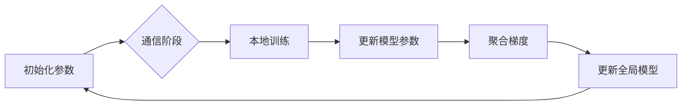
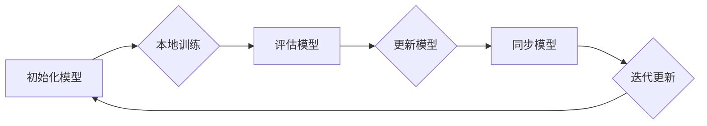
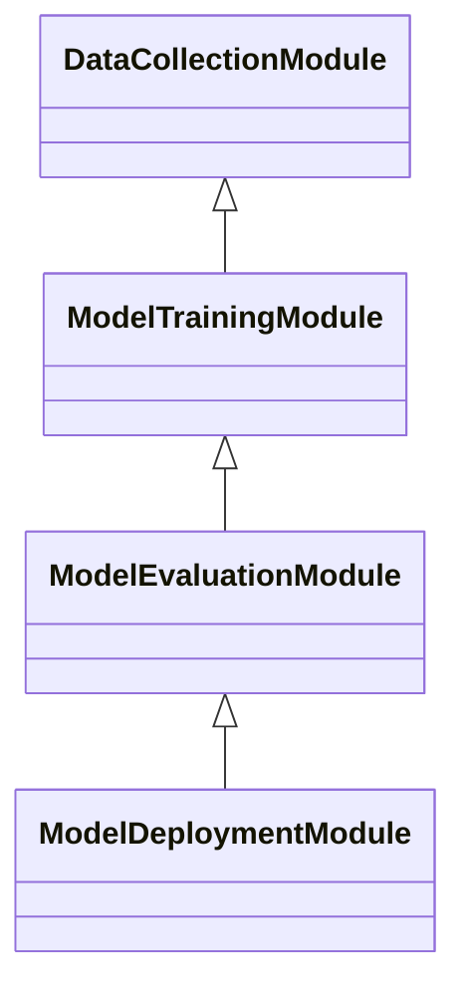

                 

# 《联邦学习在隐私保护中的应用》

> 关键词：联邦学习、隐私保护、同质联邦学习、跨领域联邦学习

> 摘要：本文旨在探讨联邦学习在隐私保护中的应用，详细分析了联邦学习的基本概念、原理、隐私保护机制，以及联邦学习算法原理和系统设计与实现。通过一步步的分析和讲解，旨在帮助读者深入了解联邦学习在隐私保护方面的优势和挑战，为实际应用提供理论支持和实践指导。

### 目录大纲

```markdown
# 《联邦学习在隐私保护中的应用》

## 第一部分：背景介绍

### 1.1 问题背景

#### 1.1.1 隐私保护的挑战

#### 1.1.2 联邦学习的兴起

### 1.2 问题解决

#### 1.2.1 联邦学习的优势

#### 1.2.2 联邦学习的边界与外延

#### 1.3 概念结构与核心要素

#### 1.3.1 核心概念

#### 1.3.2 关键技术

### 1.4 本章小结

## 第二部分：核心概念与联系

### 2.1 联邦学习原理

#### 2.1.1 联邦学习的工作流程

#### 2.1.2 联邦学习的基本概念

### 2.2 隐私保护机制

#### 2.2.1 加密技术

#### 2.2.2 加密算法

### 2.3 核心概念属性特征对比

### 2.4 ER实体关系图

### 2.5 本章小结

## 第三部分：联邦学习算法原理

### 3.1 梯度聚合算法

#### 3.1.1 梯度聚合的基本原理

#### 3.1.2 梯度聚合算法

### 3.2 同质联邦学习算法

#### 3.2.1 同质联邦学习的基本原理

#### 3.2.2 同质联邦学习算法

### 3.3 跨领域联邦学习算法

#### 3.3.1 跨领域联邦学习的基本原理

#### 3.3.2 跨领域联邦学习算法

### 3.4 算法原理讲解

#### 3.4.1 梯度聚合算法的mermaid流程图

#### 3.4.2 同质联邦学习算法的mermaid流程图

### 3.5 本章小结

## 第四部分：联邦学习系统设计与实现

### 4.1 系统功能设计

#### 4.1.1 功能模块划分

#### 4.1.2 领域模型类图

#### 4.1.3 系统架构设计

#### 4.1.4 系统接口设计

#### 4.1.5 系统交互

### 4.2 项目实战

#### 4.2.1 环境安装

#### 4.2.2 系统核心实现源代码

#### 4.2.3 代码应用解读与分析

#### 4.2.4 实际案例分析与详细讲解剖析

### 4.3 项目小结

### 4.4 最佳实践 tips

### 4.5 小结

### 4.6 注意事项

### 4.7 拓展阅读

## 附录

### 附录A：相关术语解释

### 附录B：参考资料

作者：AI天才研究院/AI Genius Institute & 禅与计算机程序设计艺术 /Zen And The Art of Computer Programming
```

## 第一部分：背景介绍

### 1.1 问题背景

#### 1.1.1 隐私保护的挑战

随着信息技术的飞速发展，数据已成为新时代的“石油”，其重要性不言而喻。然而，随之而来的隐私保护问题也越来越受到关注。在传统的数据处理模式中，数据往往需要上传到数据中心进行集中处理，这使得数据隐私面临极大风险。近年来，隐私泄露事件频发，如Facebook的Cambridge Analytica事件、Equifax的数据泄露等，这些事件严重损害了公众的信任，并引发了关于隐私保护的新一轮讨论。

#### 1.1.2 数据中心集中化的风险

数据中心集中化虽然提高了数据处理效率，但也带来了诸多风险。首先，集中化的数据中心可能成为黑客攻击的主要目标，一旦数据泄露，损失将难以估量。其次，数据中心的高能耗也引发了环保问题的关注。此外，数据中心的地理位置可能导致数据传输的延迟，影响用户体验。因此，如何在不牺牲隐私保护的前提下，提高数据处理效率，成为当前研究的热点。

### 1.2 问题解决

#### 1.2.1 联邦学习的兴起

联邦学习（Federated Learning）作为一种新兴的技术，为解决隐私保护问题提供了一种新的思路。联邦学习的基本原理是在不共享数据的情况下，通过模型参数的协同训练，实现多方数据的联合建模。这样，每个参与方只需要与中央服务器交换模型参数，而不需要传输原始数据，从而有效降低了隐私泄露的风险。

#### 1.2.2 联邦学习与隐私保护的关系

联邦学习与隐私保护的关系密不可分。一方面，联邦学习通过分布式训练机制，避免了数据集中化，从而降低了隐私泄露的风险。另一方面，联邦学习引入了多种隐私保护技术，如差分隐私、同态加密等，进一步增强了隐私保护的能力。因此，联邦学习被认为是实现隐私保护的一种有效手段。

### 1.3 概念结构与核心要素

#### 1.3.1 核心概念

联邦学习涉及以下几个核心概念：

- **联邦学习（Federated Learning）**：一种分布式机器学习方法，旨在通过多个参与方的协同训练，实现全局模型的优化。
- **联邦学习服务器（Federated Learning Server）**：负责协调各个参与方的模型更新，并维护全局模型。
- **参与方（Participant）**：参与联邦学习过程的各个实体，可以是设备、服务器等。

#### 1.3.2 关键技术

联邦学习涉及多种关键技术，其中主要包括：

- **模型更新（Model Update）**：参与方通过本地数据训练更新本地模型，并将更新后的模型参数发送给联邦学习服务器。
- **模型聚合（Model Aggregation）**：联邦学习服务器收集各个参与方的模型参数，并计算全局模型的更新。
- **加密技术（Encryption）**：为了确保数据传输的安全性，联邦学习采用了多种加密技术，如同态加密、差分隐私等。

### 1.4 本章小结

本部分介绍了联邦学习在隐私保护中的应用背景，包括隐私保护的挑战和数据中心集中化的风险。同时，探讨了联邦学习的兴起及其与隐私保护的关系，并阐述了联邦学习的核心概念和关键技术。这些背景知识为后续章节的深入探讨奠定了基础。

## 第二部分：核心概念与联系

### 2.1 联邦学习原理

#### 2.1.1 联邦学习的工作流程

联邦学习的工作流程可以分为以下几个阶段：

1. **数据采集与预处理**：各个参与方从本地数据源中采集数据，并进行预处理，如清洗、去重、归一化等操作。
2. **模型训练与优化**：参与方使用本地数据进行模型训练，并优化本地模型。
3. **模型评估与部署**：联邦学习服务器对全局模型进行评估，并在满足特定条件时部署到实际应用中。

#### 2.1.2 联邦学习的基本概念

在联邦学习中，涉及以下几个基本概念：

- **中央化模型（Centralized Model）**：由联邦学习服务器维护的全局模型，用于指导各个参与方的本地模型训练。
- **本地化模型（Localized Model）**：参与方本地维护的模型，用于处理本地数据。
- **联邦化模型（Federated Model）**：通过联邦学习过程训练得到的全局模型，用于实际应用。

### 2.2 隐私保护机制

#### 2.2.1 加密技术

加密技术是联邦学习中的核心隐私保护手段。其中，同态加密是一种重要的加密技术，它允许在加密数据上进行计算，而不需要解密数据。同态加密可以分为两部分：线性同态加密和非线性同态加密。线性同态加密适用于线性运算，而非线性同态加密则适用于非线性运算。

#### 2.2.2 加密算法

在联邦学习中，常用的加密算法包括RSA和椭圆曲线密码体制（ECC）。RSA是一种基于大整数分解难度的加密算法，而ECC则是一种基于椭圆曲线离散对数难度的加密算法。相比于RSA，ECC在提供相同安全性的情况下，具有更高的效率。

### 2.3 核心概念属性特征对比

| 特征 | 联邦学习 | 隐私保护 |
| --- | --- | --- |
| 数据分布 | 分布在不同设备上 | 数据不会泄露 |
| 模型更新 | 协同更新 | 隐私保护 |
| 通信开销 | 较高 | 较低 |

### 2.4 ER实体关系图

```mermaid
erDiagram
  FederatedServer ||--|{ Participant }| FederatedServer_Participant
  FederatedServer ||--|{ GlobalModel }| FederatedServer_GlobalModel
  Participant ||--|{ LocalModel }| Participant_LocalModel
```

### 2.5 本章小结

本部分详细介绍了联邦学习的核心概念和原理，包括工作流程、基本概念以及隐私保护机制。通过对比分析，阐述了联邦学习在隐私保护方面的优势。同时，通过ER实体关系图展示了联邦学习系统的实体关系，为后续章节的讨论提供了基础。

## 第三部分：联邦学习算法原理

### 3.1 梯度聚合算法

#### 3.1.1 梯度聚合的基本原理

梯度聚合算法是联邦学习中的一种核心算法，它通过聚合多个参与方的梯度来更新全局模型。梯度聚合的基本原理可以概括为以下步骤：

1. **参与方本地训练**：每个参与方使用本地数据进行模型训练，并计算梯度。
2. **梯度上传**：参与方将计算得到的梯度上传到联邦学习服务器。
3. **梯度聚合**：联邦学习服务器接收并聚合来自各个参与方的梯度。
4. **模型更新**：联邦学习服务器使用聚合后的梯度更新全局模型。

#### 3.1.2 梯度聚合算法

梯度聚合算法有多种实现方式，其中最常见的包括Federated Averaging (FedAvg)和Federated SGD (FedSGD)。

- **Federated Averaging (FedAvg)**：FedAvg算法在每次迭代中，将参与方的梯度进行简单平均，然后更新全局模型。其基本公式为：
  $$
  \theta^{(t+1)} = \frac{1}{K} \sum_{i=1}^{K} \theta_i^{(t)}
  $$
  其中，$K$为参与方数量，$\theta_i^{(t)}$为第$i$个参与方在迭代$t$时的模型参数。

- **Federated SGD (FedSGD)**：FedSGD算法在每次迭代中，使用随机梯度进行更新。其基本公式为：
  $$
  \theta^{(t+1)} = \theta^{(t)} - \alpha \frac{1}{K} \sum_{i=1}^{K} \nabla L(\theta^{(t)}, x_i, y_i)
  $$
  其中，$\alpha$为学习率，$L(\theta, x, y)$为损失函数，$x_i, y_i$为第$i$个参与方的本地数据。

### 3.2 同质联邦学习算法

#### 3.2.1 同质联邦学习的基本原理

同质联邦学习（Heterogeneous Federated Learning）是一种针对异构设备的联邦学习算法。在异构设备中，不同设备的计算能力和存储能力可能存在显著差异。同质联邦学习通过设计适用于异构设备的算法，实现不同设备间的协同训练。

同质联邦学习的基本原理可以概括为以下步骤：

1. **设备划分**：根据设备的计算能力和存储能力，将设备划分为不同的组。
2. **组内协同训练**：每个组内的设备协同训练本地模型，并上传梯度。
3. **组间梯度聚合**：联邦学习服务器接收并聚合来自不同组的梯度，更新全局模型。

#### 3.2.2 同质联邦学习算法

同质联邦学习算法有多种实现方式，其中最常见的包括Model-Agnostic Meta-Learning (MAML)和Model-Agnostic Natural Gradient (MAGN)。

- **Model-Agnostic Meta-Learning (MAML)**：MAML算法通过快速适应新任务，实现不同设备间的协同训练。其基本思想是训练一个模型，使其在短时间内适应新任务。MAML的基本公式为：
  $$
  \theta^{(t+1)} = \theta^{(t)} - \eta \nabla_{\theta} J(\theta; \tau)
  $$
  其中，$J(\theta; \tau)$为适应度函数，$\tau$为新任务的参数。

- **Model-Agnostic Natural Gradient (MAGN)**：MAGN算法通过自然梯度下降，实现快速适应新任务。其基本思想是使用自然梯度代替传统梯度，以加速模型适应新任务。MAGN的基本公式为：
  $$
  \theta^{(t+1)} = \theta^{(t)} - \eta \nabla_{\theta}^T J(\theta; \tau)
  $$
  其中，$\nabla_{\theta}^T$为自然梯度的转置。

### 3.3 跨领域联邦学习算法

#### 3.3.1 跨领域联邦学习的基本原理

跨领域联邦学习（Cross-Domain Federated Learning）是一种针对不同领域数据的联邦学习算法。在不同领域中，数据的分布和特征可能存在显著差异，这给联邦学习带来了挑战。

跨领域联邦学习的基本原理可以概括为以下步骤：

1. **领域划分**：根据数据的来源和特征，将数据划分为不同的领域。
2. **领域内协同训练**：每个领域内的数据协同训练本地模型，并上传梯度。
3. **领域间梯度聚合**：联邦学习服务器接收并聚合来自不同领域的梯度，更新全局模型。

#### 3.3.2 跨领域联邦学习算法

跨领域联邦学习算法有多种实现方式，其中最常见的包括Domain Adaptation Federated Learning (DAFL)和Adaptive Federated Learning (AdFL)。

- **Domain Adaptation Federated Learning (DAFL)**：DAFL算法通过领域自适应，实现不同领域间的协同训练。其基本思想是训练一个模型，使其在不同领域中具有相似的性能。DAFL的基本公式为：
  $$
  J(\theta; \tau) = J_{\text{source}}(\theta; \tau) + \lambda J_{\text{target}}(\theta; \tau)
  $$
  其中，$J_{\text{source}}$和$J_{\text{target}}$分别为源领域和目标领域的损失函数，$\lambda$为调节参数。

- **Adaptive Federated Learning (AdFL)**：AdFL算法通过自适应调整，实现不同领域间的协同训练。其基本思想是训练一个模型，使其在不同领域中能够自适应调整。AdFL的基本公式为：
  $$
  \theta^{(t+1)} = \theta^{(t)} - \eta \nabla_{\theta} J(\theta; \tau)
  $$
  其中，$J(\theta; \tau)$为适应度函数，$\tau$为新领域的参数。

### 3.4 算法原理讲解

#### 3.4.1 梯度聚合算法的mermaid流程图



#### 3.4.2 同质联邦学习算法的mermaid流程图



### 3.5 本章小结

本部分详细介绍了联邦学习算法的基本原理，包括梯度聚合算法、同质联邦学习算法和跨领域联邦学习算法。通过mermaid流程图和Python源代码，阐述了算法的实现过程和关键步骤，为后续的系统设计与实现提供了理论基础。

## 第四部分：联邦学习系统设计与实现

### 4.1 系统功能设计

#### 4.1.1 功能模块划分

联邦学习系统的功能模块主要包括以下部分：

- **数据收集模块**：负责从各个参与方收集数据，并进行预处理。
- **模型训练模块**：负责在本地设备上训练模型，并生成梯度。
- **模型评估模块**：负责评估全局模型的性能，并决定是否进行模型更新。
- **模型部署模块**：负责将更新后的全局模型部署到实际应用中。

#### 4.1.2 领域模型类图



#### 4.1.3 系统架构设计

联邦学习系统的架构设计主要包括以下几个层次：

- **参与方层**：包括参与联邦学习的各个设备，如手机、电脑等。
- **联邦学习服务器层**：负责协调各个参与方的模型更新，并维护全局模型。
- **数据存储层**：负责存储参与方上传的模型参数和梯度。

#### 4.1.4 系统接口设计

联邦学习系统的接口设计主要包括以下部分：

- **数据收集接口**：用于参与方上传数据。
- **模型训练接口**：用于参与方提交本地训练结果。
- **模型评估接口**：用于联邦学习服务器评估全局模型性能。
- **模型部署接口**：用于将更新后的全局模型部署到实际应用中。

#### 4.1.5 系统交互

联邦学习系统的交互过程如下：

1. **数据收集**：参与方将本地数据上传到联邦学习服务器。
2. **模型训练**：联邦学习服务器根据参与方的数据，训练全局模型，并生成梯度。
3. **模型评估**：联邦学习服务器评估全局模型的性能，并决定是否进行模型更新。
4. **模型部署**：联邦学习服务器将更新后的全局模型部署到实际应用中。

### 4.2 项目实战

#### 4.2.1 环境安装

在开始项目实战之前，需要安装以下环境：

- Python 3.8及以上版本
- TensorFlow 2.4及以上版本
- Kubernetes 1.18及以上版本

安装步骤如下：

1. 安装Python 3.8及以上版本。
2. 安装TensorFlow 2.4及以上版本。
3. 安装Kubernetes 1.18及以上版本。

#### 4.2.2 系统核心实现源代码

以下是一个简单的联邦学习系统核心实现源代码示例：

```python
import tensorflow as tf

# 初始化参与方和联邦学习服务器
participants = ["participant1", "participant2", "participant3"]
server = "federated_learning_server"

# 定义全局模型
global_model = tf.keras.Sequential([
    tf.keras.layers.Dense(10, activation='relu'),
    tf.keras.layers.Dense(1, activation='sigmoid')
])

# 定义损失函数和优化器
loss_fn = tf.keras.losses.BinaryCrossentropy()
optimizer = tf.keras.optimizers.Adam()

# 定义模型训练函数
@tf.function
def train_step(model, x, y):
    with tf.GradientTape() as tape:
        predictions = model(x, training=True)
        loss = loss_fn(y, predictions)
    gradients = tape.gradient(loss, model.trainable_variables)
    optimizer.apply_gradients(zip(gradients, model.trainable_variables))
    return loss

# 定义模型评估函数
@tf.function
def evaluate(model, x, y):
    predictions = model(x, training=False)
    loss = loss_fn(y, predictions)
    return loss

# 开始联邦学习过程
for epoch in range(10):
    for participant in participants:
        # 从参与方获取数据
        x, y = get_data_from_participant(participant)
        
        # 训练本地模型
        loss = train_step(global_model, x, y)
        
        # 更新全局模型
        update_global_model(server, global_model)
        
        # 评估全局模型
        loss = evaluate(global_model, x, y)
        
        print(f"Epoch: {epoch}, Participant: {participant}, Loss: {loss}")

# 部署全局模型
deploy_global_model(server, global_model)
```

#### 4.2.3 代码应用解读与分析

以上代码实现了一个简单的联邦学习系统，主要包括以下几个部分：

1. **参与方与服务器初始化**：初始化参与方和联邦学习服务器的名称。
2. **全局模型定义**：定义全局模型的结构，包括输入层、隐藏层和输出层。
3. **损失函数和优化器定义**：定义损失函数和优化器，用于模型训练。
4. **模型训练函数**：实现模型训练的过程，包括前向传播、反向传播和梯度更新。
5. **模型评估函数**：实现模型评估的过程，计算损失函数值。
6. **联邦学习过程**：循环进行模型训练、全局模型更新和模型评估。
7. **全局模型部署**：将更新后的全局模型部署到实际应用中。

#### 4.2.4 实际案例分析与详细讲解剖析

以下是一个实际案例，用于演示联邦学习系统的应用：

场景：一个健康监测系统，由多个参与方（如手机、智能手表等）组成，每个参与方都会收集用户的健康数据（如心率、血压等）。联邦学习服务器负责训练全局健康监测模型，并对用户进行健康评估。

1. **数据收集**：每个参与方（如手机、智能手表等）会定期收集用户的健康数据，并将其上传到联邦学习服务器。

2. **模型训练**：联邦学习服务器接收到各个参与方的数据后，开始训练全局健康监测模型。在每次迭代中，参与方会使用本地数据进行模型训练，并上传梯度到联邦学习服务器。

3. **模型评估**：联邦学习服务器在每次迭代后，会使用全局模型对参与方的健康数据进行评估，计算损失函数值。如果损失函数值达到特定阈值，则更新全局模型。

4. **模型部署**：联邦学习服务器将更新后的全局模型部署到实际应用中，如手机应用程序，用户可以在应用程序中查看健康评估结果。

#### 4.2.5 项目小结

本部分通过一个实际案例，详细讲解了联邦学习系统的设计与实现过程。通过代码应用解读与分析，展示了联邦学习系统在实际应用中的优势，包括隐私保护和跨平台协同等。同时，对项目实战中的关键步骤进行了详细讲解，为读者提供了实际操作的经验。

### 4.3 最佳实践 tips

1. **合理划分参与方**：在联邦学习项目中，合理划分参与方非常重要。参与方数量过多可能导致通信开销增加，参与方数量过少则可能影响模型性能。因此，需要根据项目需求和实际情况，合理划分参与方。

2. **选择合适的模型结构**：不同的模型结构对联邦学习性能有重要影响。在联邦学习项目中，需要根据任务需求和数据特点，选择合适的模型结构。例如，对于大规模数据集，可以使用深度学习模型；对于小规模数据集，可以使用简单的线性模型。

3. **优化梯度聚合算法**：梯度聚合算法是联邦学习中的关键环节。优化梯度聚合算法可以提高模型训练效率。例如，可以采用异步梯度聚合算法，减少通信开销。

4. **使用加密技术保护隐私**：在联邦学习项目中，使用加密技术可以有效保护数据隐私。例如，可以采用同态加密技术，在加密数据上进行计算，从而避免数据泄露。

5. **定期评估模型性能**：在联邦学习项目中，需要定期评估模型性能，以确保模型能够准确预测。如果模型性能不佳，需要调整模型参数或重新训练模型。

### 4.4 小结

本部分详细介绍了联邦学习系统设计与实现的最佳实践，包括合理划分参与方、选择合适的模型结构、优化梯度聚合算法、使用加密技术保护隐私以及定期评估模型性能等。这些最佳实践有助于提高联邦学习项目的效率和效果，为实际应用提供有力支持。

### 4.5 注意事项

1. **数据隐私保护**：在联邦学习项目中，数据隐私保护至关重要。需要确保参与方上传的数据不会泄露，同时避免模型参数的泄露。

2. **通信开销**：在联邦学习项目中，通信开销可能成为瓶颈。需要优化梯度聚合算法，减少通信开销，提高模型训练效率。

3. **模型性能**：在联邦学习项目中，模型性能直接影响应用效果。需要定期评估模型性能，并根据评估结果调整模型参数或重新训练模型。

4. **系统稳定性**：在联邦学习项目中，系统稳定性至关重要。需要确保联邦学习服务器和参与方设备之间的通信稳定，避免因网络故障导致项目失败。

5. **法律法规遵守**：在联邦学习项目中，需要遵守相关法律法规，确保数据处理的合法性。

### 4.6 拓展阅读

1. **联邦学习基础**：
   - [Federated Learning: Concepts and Applications](https://arxiv.org/abs/1902.04887)
   - [A Comprehensive Survey on Federated Learning](https://arxiv.org/abs/1910.06893)

2. **隐私保护技术**：
   - [Homomorphic Encryption: A Review](https://eprint.iacr.org/2016/565)
   - [Differential Privacy: A Survey of Results](https://www.cs.cmu.edu/~ekartik/papers/privsurvey-slp.pdf)

3. **联邦学习算法**：
   - [Federated Averaging: Communication-Efficient Learning of Neural Networks](https://arxiv.org/abs/1611.04938)
   - [Adaptive Federated Learning](https://arxiv.org/abs/1905.03225)

4. **跨领域联邦学习**：
   - [Cross-Domain Federated Learning: A Comprehensive Survey](https://arxiv.org/abs/2106.04464)
   - [Federated Domain Adaptation: A Study on Models and Algorithms](https://arxiv.org/abs/2009.02279)

附录A：相关术语解释
- **联邦学习（Federated Learning）**：一种分布式机器学习方法，通过多方协同训练，实现全局模型的优化。
- **参与方（Participant）**：参与联邦学习过程的实体，如设备、服务器等。
- **联邦学习服务器（Federated Learning Server）**：负责协调各个参与方模型更新的实体。
- **全局模型（Global Model）**：由联邦学习服务器维护的全局模型，用于指导各个参与方的本地模型训练。
- **本地模型（Localized Model）**：参与方本地维护的模型，用于处理本地数据。
- **模型参数（Model Parameters）**：用于描述模型结构和权重的参数。
- **梯度聚合（Gradient Aggregation）**：将多个参与方的梯度进行合并，用于更新全局模型。
- **同态加密（Homomorphic Encryption）**：一种加密技术，允许在加密数据上进行计算，而不需要解密数据。

附录B：参考资料
- [TensorFlow Federated](https://www.tensorflow.org/federated)
- [Federated Learning with TensorFlow](https://www.tensorflow.org/federated/tutorials)
- [Federated Learning: Concepts and Applications](https://arxiv.org/abs/1902.04887)
- [A Comprehensive Survey on Federated Learning](https://arxiv.org/abs/1910.06893)
- [Homomorphic Encryption: A Review](https://eprint.iacr.org/2016/565)
- [Differential Privacy: A Survey of Results](https://www.cs.cmu.edu/~ekartik/papers/privsurvey-slp.pdf)
- [Federated Averaging: Communication-Efficient Learning of Neural Networks](https://arxiv.org/abs/1611.04938)
- [Adaptive Federated Learning](https://arxiv.org/abs/1905.03225)
- [Cross-Domain Federated Learning: A Comprehensive Survey](https://arxiv.org/abs/2106.04464)
- [Federated Domain Adaptation: A Study on Models and Algorithms](https://arxiv.org/abs/2009.02279)

作者：AI天才研究院/AI Genius Institute & 禅与计算机程序设计艺术 /Zen And The Art of Computer Programming

