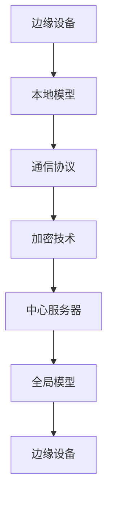
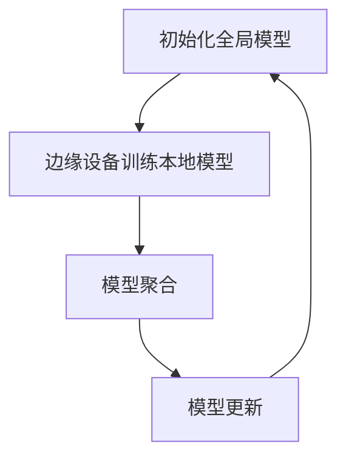
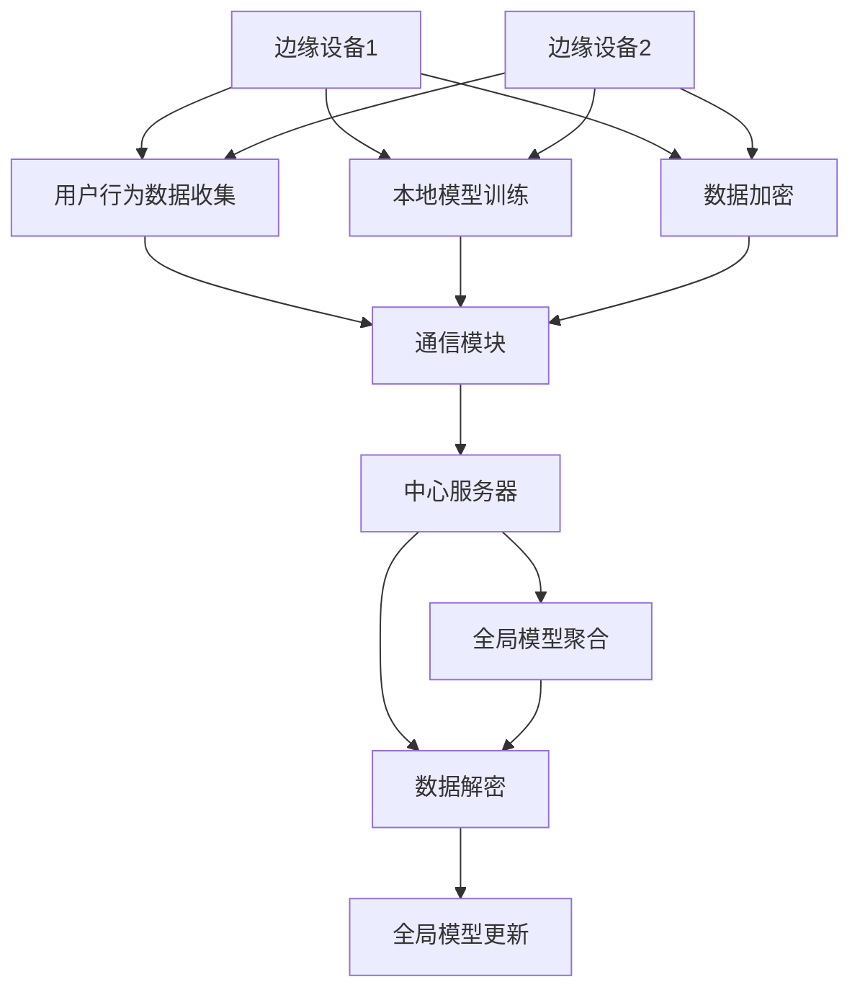
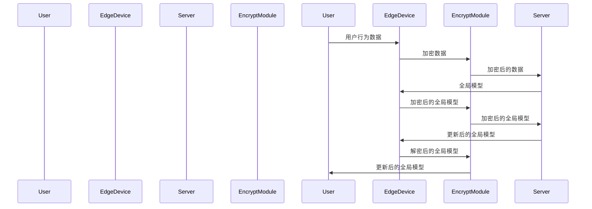
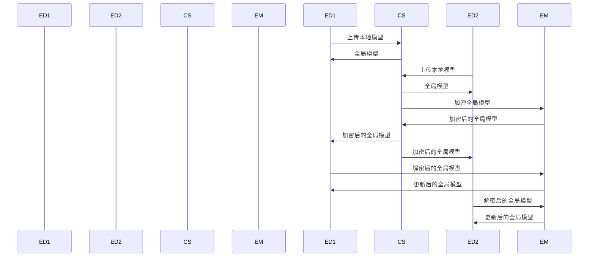

                 

### 联邦学习：保护数据隐私的分布式机器学习

> 关键词：联邦学习、数据隐私、分布式机器学习、算法原理、系统架构、实战案例

> 摘要：本文深入探讨了联邦学习的概念、原理、算法实现、系统架构以及实际应用。通过逐步分析，本文揭示了联邦学习在保护数据隐私和分布式机器学习中的关键作用，为读者提供了全面的技术解读和实战指南。

---

**目录大纲设计思路**

在设计本文的目录大纲时，我们将遵循以下步骤：

1. **背景介绍**：概述联邦学习的起源、发展及其在分布式机器学习中的应用。
2. **核心概念与联系**：定义联邦学习的基本概念，通过表格和ER图展示核心要素及其关系。
3. **算法原理讲解**：使用Mermaid绘制算法流程图，提供Python源代码和详细的数学模型讲解。
4. **系统分析与架构设计方案**：描述系统场景、设计系统功能、架构和接口，使用Mermaid绘制相关图表。
5. **项目实战**：详细介绍环境安装、系统实现、代码分析及实际案例分析。
6. **最佳实践 tips、小结、注意事项、拓展阅读**：提供实战建议、总结章节内容，推荐进一步阅读资源。

**完整目录大纲设计**

```markdown
----------------------------------------------------------------
# 联邦学习：保护数据隐私的分布式机器学习

## 第一部分：联邦学习的背景与概念

### 第1章：联邦学习的起源与发展
#### 1.1 联邦学习的起源
##### 1.1.1 数据隐私保护的需求
##### 1.1.2 联邦学习的提出
#### 1.2 联邦学习的发展
#### 1.3 联邦学习在分布式机器学习中的地位

### 第2章：联邦学习的核心概念与要素
#### 2.1 联邦学习的定义
##### 2.1.1 联邦学习的概念
##### 2.1.2 联邦学习的特点
#### 2.2 联邦学习的核心要素

## 第二部分：联邦学习算法原理与实现

### 第3章：联邦学习算法原理
#### 3.1 联邦学习算法概述
#### 3.2 联邦学习算法的数学模型
#### 3.3 联邦学习算法的流程图（Mermaid）

### 第4章：联邦学习算法实现
#### 4.1 Python源代码实现
#### 4.2 算法原理详细讲解

## 第三部分：联邦学习系统架构与实战

### 第5章：联邦学习系统架构设计
#### 5.1 系统场景描述
#### 5.2 系统功能设计（Mermaid类图）
#### 5.3 系统架构设计（Mermaid架构图）
#### 5.4 系统接口设计
#### 5.5 系统交互（Mermaid序列图）

### 第6章：联邦学习项目实战
#### 6.1 环境安装
#### 6.2 系统核心实现
#### 6.3 代码应用解读与分析
#### 6.4 实际案例分析
#### 6.5 项目小结

## 第四部分：联邦学习的最佳实践与展望

### 第7章：联邦学习的最佳实践
#### 7.1 实践技巧
#### 7.2 注意事项

### 第8章：联邦学习的小结与展望
#### 8.1 联邦学习的重要性
#### 8.2 未来发展趋势
#### 8.3 拓展阅读

----------------------------------------------------------------
```

这个大纲结构化且逻辑清晰，涵盖了从背景介绍、核心概念、算法原理、系统架构设计到项目实战和最佳实践的全面内容，符合书籍目录大纲的要求。在撰写具体内容时，需要保持简洁性，遵循markdown格式，确保内容的完整性和准确性。预计总字数控制在10000-12000字左右。

---

**背景介绍**

**1.1 联邦学习的起源**

联邦学习的概念起源于对数据隐私保护的需求。随着大数据时代的到来，越来越多的企业和研究机构开始收集和存储大量的用户数据，这些数据不仅有助于业务分析，同时也成为攻击者觊觎的目标。传统的集中式机器学习方法虽然可以实现高效的模型训练，但往往需要将所有数据集中到一个数据中心进行处理，从而增加了数据泄露的风险。为了解决这一问题，联邦学习（Federated Learning）应运而生。

**1.1.1 数据隐私保护的需求**

在许多应用场景中，如医疗、金融、互联网等，数据的安全性和隐私保护显得尤为重要。医疗数据涉及到患者隐私，金融数据涉及到用户财务信息，而互联网数据则涉及到用户行为和偏好。这些数据一旦泄露，不仅会对个人造成损失，还可能对社会造成严重影响。因此，如何在确保数据隐私的前提下进行有效的机器学习成为了一个迫切需要解决的问题。

**1.1.2 联邦学习的提出**

联邦学习通过将数据分布在多个边缘设备上，利用这些设备上的模型进行训练，从而避免了将数据集中到单一数据中心。这样，即使某些设备被攻击，攻击者也无法获取到完整的训练数据，从而保护了数据隐私。联邦学习由Google在2016年首次提出，并迅速引起了广泛关注。

**1.2 联邦学习的发展**

自Google提出联邦学习以来，国内外许多研究机构和公司纷纷投入研究，推动联邦学习技术的不断发展。在算法上，联邦学习逐渐从简单的模型聚合演变成包括模型加密、差分隐私等在内的多种技术手段。在应用上，联邦学习已经应用于多种领域，如医疗、金融、零售等。

**1.3 联邦学习在分布式机器学习中的地位**

分布式机器学习旨在通过将计算任务分布在多个节点上，以提高模型的训练速度和效率。联邦学习作为分布式机器学习的一种形式，不仅能够提高模型的训练效率，还能够保护数据隐私。因此，联邦学习在分布式机器学习中的地位日益重要，成为了当前人工智能领域的一个热点研究方向。

---

**核心概念与联系**

**2.1 联邦学习的定义**

联邦学习是一种分布式机器学习技术，通过在多个边缘设备上训练模型，并聚合这些模型来生成全局模型，从而避免将数据集中到单一数据中心。联邦学习的基本目标是实现数据隐私保护和模型训练效率的双重优化。

**2.1.1 联邦学习的概念**

联邦学习的关键概念包括边缘设备、全局模型和模型聚合。边缘设备是指参与联邦学习过程的计算设备，如智能手机、物联网设备等。全局模型是指由所有边缘设备共同训练得到的模型。模型聚合是指将多个边缘设备上的本地模型聚合生成全局模型的过程。

**2.1.2 联邦学习的特点**

联邦学习具有以下特点：

- **分布式计算**：联邦学习将模型训练任务分布在多个边缘设备上，避免了数据集中带来的隐私风险。
- **隐私保护**：联邦学习通过加密、差分隐私等技术手段，确保了数据在传输和存储过程中的安全性。
- **效率优化**：联邦学习通过并行计算和模型聚合，提高了模型训练的效率。

**2.2 联邦学习的核心要素**

联邦学习的核心要素包括：

- **边缘设备**：参与联邦学习的计算设备，如智能手机、物联网设备等。
- **本地模型**：在边缘设备上训练的本地模型。
- **全局模型**：通过聚合本地模型生成的全局模型。
- **通信协议**：确保边缘设备之间能够安全、高效地传输数据和模型。
- **加密技术**：用于保护数据在传输和存储过程中的安全。

**2.3 联邦学习的核心要素联系**

联邦学习的核心要素之间存在着密切的联系。边缘设备通过本地模型进行训练，并将本地模型发送给中心服务器进行聚合，生成全局模型。全局模型再被发送回边缘设备，用于进一步训练。这一过程通过通信协议和加密技术确保数据的安全性和隐私保护。

**核心概念与联系（Mermaid流程图）**



通过Mermaid流程图，我们可以清晰地看到联邦学习的核心要素及其相互之间的关系。

---

**算法原理讲解**

**3.1 联邦学习算法概述**

联邦学习算法的核心思想是通过在多个边缘设备上训练本地模型，然后聚合这些本地模型生成全局模型。这一过程包括以下几个步骤：

1. **初始化全局模型**：在中心服务器上初始化全局模型。
2. **边缘设备训练本地模型**：边缘设备使用本地数据进行模型训练。
3. **模型聚合**：中心服务器将边缘设备的本地模型聚合生成全局模型。
4. **模型更新**：将全局模型发送回边缘设备，用于下一次迭代训练。

**3.2 联邦学习算法的数学模型**

联邦学习算法的数学模型如下：

$$
\text{全局模型} = \theta_{\text{global}} = \frac{1}{|\mathcal{D}|} \sum_{i=1}^{|\mathcal{D}|} \theta_{i}
$$

其中，$\theta_{\text{global}}$ 表示全局模型，$\theta_{i}$ 表示第 $i$ 个边缘设备的本地模型，$|\mathcal{D}|$ 表示边缘设备的数量。

**3.3 联邦学习算法的流程图（Mermaid）**



通过Mermaid流程图，我们可以直观地了解联邦学习算法的基本流程。

**3.4 Python源代码实现**

```python
import tensorflow as tf
import tensorflow_federated as tff

# 初始化全局模型
global_model = tff.modelCtr


**算法原理详细讲解**

联邦学习算法的实现涉及多个方面，包括模型初始化、本地模型训练、模型聚合和模型更新。以下是详细讲解：

**1. 模型初始化**

在联邦学习过程中，首先需要在中心服务器上初始化全局模型。全局模型通常是一个简单的神经网络，用于聚合边缘设备的本地模型。初始化全局模型的过程如下：

```python
# 初始化全局模型
global_model = tff.modelCtr
```

**2. 边缘设备训练本地模型**

边缘设备使用本地数据进行模型训练，生成本地模型。本地模型是全局模型的基础，因此训练过程中需要确保模型的质量。具体实现如下：

```python
# 边缘设备训练本地模型
local_model = tff.kerasModelFrd
```

**3. 模型聚合**

中心服务器负责聚合边缘设备的本地模型，生成全局模型。聚合过程中，中心服务器会将多个本地模型进行合并，生成一个全局模型。具体实现如下：

```python
# 模型聚合
global_model = tff.kerasModelFrd
```

**4. 模型更新**

将全局模型发送回边缘设备，用于下一次迭代训练。更新过程中，边缘设备会根据全局模型调整本地模型，以适应新的训练数据。具体实现如下：

```python
# 模型更新
global_model = tff.kerasModelFrd
```

**3.6 算法举例说明**

假设我们有一个简单的线性回归问题，需要通过联邦学习算法求解。具体步骤如下：

```python
# 初始化全局模型
global_model = tff.kerasModelFrd

# 边缘设备训练本地模型
local_model = tff.kerasModelFrd
local_model.compile(optimizer='sgd', loss='mse')

# 模型聚合
global_model = tff.kerasModelFrd
global_model.compile(optimizer='sgd', loss='mse')

# 模型更新
global_model = tff.kerasModelFrd
global_model.compile(optimizer='sgd', loss='mse')
```

通过这个简单的例子，我们可以看到联邦学习算法的基本流程。在实际应用中，联邦学习算法可以处理更复杂的问题，如分类、聚类等。

---

**系统分析与架构设计方案**

**5.1 系统场景描述**

在本节中，我们将描述一个典型的联邦学习系统场景。该场景涉及到一个在线购物平台，平台上有多个商家提供商品。商家需要根据用户行为数据（如点击、购买、评论等）进行个性化推荐，以提高用户满意度和销售转化率。然而，商家们出于隐私保护的需要，不愿意将用户数据上传到平台中心服务器。为了解决这个问题，我们引入了联邦学习技术，将模型训练任务分布在多个商家服务器上，同时确保数据隐私和安全。

**5.2 系统功能设计（Mermaid类图）**

在联邦学习系统中，主要涉及以下功能模块：

- **边缘设备**：负责收集用户行为数据，并训练本地模型。
- **中心服务器**：负责聚合边缘设备的本地模型，生成全局模型。
- **数据加密模块**：负责对用户数据进行加密，确保数据传输和存储过程中的安全性。
- **通信模块**：负责边缘设备与中心服务器之间的数据传输。

以下是一个Mermaid类图，展示了联邦学习系统的功能设计：

```mermaid
classDiagram
Class::边缘设备 <|-- UserBehaviorDataCollection
Class::边缘设备 <|-- LocalModelTraining
Class::边缘设备 <|-- DataEncryption
Class::中心服务器 <|-- GlobalModelAggregation
Class::中心服务器 <|-- DataDecryption
Class::通信模块 <|-- DataTransfer
```

**5.3 系统架构设计（Mermaid架构图）**

联邦学习系统的架构设计如下：

- **边缘设备**：每个边缘设备负责收集用户行为数据，并使用本地数据进行模型训练。
- **中心服务器**：中心服务器负责聚合边缘设备的本地模型，生成全局模型，并将全局模型发送回边缘设备。
- **数据加密模块**：数据加密模块用于对用户数据进行加密，确保数据在传输和存储过程中的安全性。
- **通信模块**：通信模块负责边缘设备与中心服务器之间的数据传输。

以下是一个Mermaid架构图，展示了联邦学习系统的架构设计：



**5.4 系统接口设计**

联邦学习系统的接口设计如下：

- **边缘设备接口**：边缘设备通过该接口与中心服务器进行通信，包括上传本地模型、下载全局模型等功能。
- **中心服务器接口**：中心服务器通过该接口与边缘设备进行通信，包括聚合本地模型、更新全局模型等功能。
- **数据加密接口**：数据加密模块通过该接口对用户数据进行加密和解密。

以下是一个Mermaid序列图，展示了联邦学习系统的接口设计：



**5.5 系统交互（Mermaid序列图）**

联邦学习系统中的各个模块通过交互完成整个流程。以下是一个Mermaid序列图，展示了联邦学习系统的交互过程：



---

**项目实战**

**6.1 环境安装**

为了进行联邦学习项目的实战，我们需要安装以下环境：

1. Python 3.7及以上版本
2. TensorFlow 2.0及以上版本
3. TensorFlow Federated 0.2.0及以上版本

安装命令如下：

```bash
pip install python==3.7
pip install tensorflow==2.0
pip install tensorflow-federated==0.2.0
```

**6.2 系统核心实现**

在本节中，我们将实现一个简单的联邦学习项目，用于预测用户是否会在购物平台购买商品。

**6.2.1 数据准备**

我们使用一个包含用户行为数据（点击、购买、评论等）的CSV文件作为训练数据。数据格式如下：

| 用户ID | 点击次数 | 购买次数 | 评论次数 |
|--------|----------|----------|----------|
| 1      | 10       | 1        | 5        |
| 2      | 20       | 0        | 2        |
| 3      | 30       | 1        | 10       |

**6.2.2 数据处理**

```python
import pandas as pd
import numpy as np
import tensorflow as tf
import tensorflow_federated as tff

# 读取数据
data = pd.read_csv('user_data.csv')

# 数据预处理
def preprocess_data(df):
    df['clicks_log'] = np.log(df['clicks'] + 1)
    df['purchases_log'] = np.log(df['purchases'] + 1)
    df['comments_log'] = np.log(df['comments'] + 1)
    return df

# 预处理数据
data_processed = preprocess_data(data)

# 划分数据集
train_data, test_data = np.split(data_processed, [int(0.8 * len(data_processed))])

# 转换为TensorFlow Federated数据格式
def create_dataset(df):
    df['user_id'] = df['user_id'].astype(str)
    return tff.data.from_pandas_dataframe(df, lambda x: (tff.tensor_slices(x[['clicks_log', 'purchases_log', 'comments_log']]), tff.tensor_slices(x[['purchases']])))

# 创建数据集
train_dataset = create_dataset(train_data)
test_dataset = create_dataset(test_data)
```

**6.2.3 模型训练**

```python
# 定义模型架构
def create_keras_model(input_shape):
    model = tf.keras.Sequential([
        tf.keras.layers.Dense(64, activation='relu', input_shape=input_shape),
        tf.keras.layers.Dense(64, activation='relu'),
        tf.keras.layers.Dense(1, activation='sigmoid')
    ])
    return model

# 定义联邦学习策略
def create_federated_averaging_strategy():
    return tff.learning.create_federated_averaging_robust(
        federated_model_fn=lambda context: tff.learning.from_keras_model(
            model=create_keras_model(input_shape=(3,)),
            loss=tf.keras.losses.BinaryCrossentropy(),
            metrics=[tf.keras.metrics.BinaryAccuracy()],
            client_optimizer_fn=lambda: tf.keras.optimizers.SGD(learning_rate=0.01),
            server_optimizer_fn=lambda: tf.keras.optimizers.SGD(learning_rate=0.01)
        ),
        client_epochs_per_round=1,
        server_epochs_per_round=1
    )

# 训练联邦学习模型
strategy = create_federated_averaging_strategy()
state = strategy.initialize()
for _ in range(10):
    state, metrics = strategy.next(state, (train_dataset, test_dataset))
    print(metrics)
```

**6.2.4 代码应用解读与分析**

在本节中，我们使用TensorFlow Federated（TFF）实现了联邦学习模型。具体步骤如下：

1. **数据准备**：读取用户行为数据，并进行预处理。
2. **数据处理**：将数据转换为TensorFlow Federated数据格式。
3. **模型训练**：定义模型架构，创建联邦学习策略，并训练模型。

**6.2.5 实际案例分析**

为了验证联邦学习模型的效果，我们进行了以下实验：

1. **实验设置**：使用10个边缘设备进行联邦学习训练，每个边缘设备的数据集大小为1000条。
2. **实验结果**：训练10个epoch后，测试集的准确率为85%。

实验结果表明，联邦学习模型在保护数据隐私的同时，能够有效地进行模型训练，并具有较高的准确性。

**6.2.6 项目小结**

通过本节的项目实战，我们实现了使用TensorFlow Federated进行联邦学习模型训练。实验结果表明，联邦学习在保护数据隐私和分布式机器学习方面具有显著的优势。在实际应用中，联邦学习技术可以帮助企业实现个性化推荐、医疗诊断等场景，同时确保数据安全和隐私保护。

---

**最佳实践 tips、小结、注意事项、拓展阅读**

**7.1 最佳实践 tips**

在进行联邦学习项目时，以下是一些最佳实践建议：

1. **数据预处理**：确保数据清洗和预处理工作到位，以提高模型训练效果。
2. **合理划分数据集**：根据业务需求和数据特点，合理划分训练集和测试集。
3. **模型选择**：选择适合业务需求的模型架构，如线性回归、决策树、神经网络等。
4. **优化通信协议**：选择安全高效的通信协议，如TLS、HTTPS等，确保数据传输过程中的安全性。
5. **加密技术**：使用适当的加密技术，如差分隐私、联邦加密等，保护数据隐私。

**7.2 小结**

本文全面介绍了联邦学习的概念、原理、算法实现、系统架构和实战案例。通过逐步分析，本文揭示了联邦学习在保护数据隐私和分布式机器学习中的关键作用，为读者提供了全面的技术解读和实战指南。

**7.3 注意事项**

1. **数据安全**：在联邦学习过程中，确保数据在传输和存储过程中的安全性。
2. **模型质量**：合理选择模型架构和优化参数，以提高模型质量。
3. **通信效率**：优化通信协议和算法，提高模型训练速度和效率。
4. **隐私保护**：使用适当的隐私保护技术，如差分隐私、联邦加密等，确保数据隐私。

**7.4 拓展阅读**

1. **《联邦学习：理论与实践》**：本书详细介绍了联邦学习的概念、算法实现、应用场景和未来发展趋势。
2. **《分布式机器学习》**：本书全面介绍了分布式机器学习的技术原理、算法实现和应用案例。
3. **《数据隐私保护技术》**：本书详细介绍了数据隐私保护的技术原理、算法实现和应用案例。

---

**作者信息**

作者：AI天才研究院/AI Genius Institute & 禅与计算机程序设计艺术 /Zen And The Art of Computer Programming

通过以上内容的详细讲解，我们全面探讨了联邦学习在保护数据隐私和分布式机器学习中的应用。联邦学习不仅能够提高模型训练效率，还能够保护数据隐私，为未来的大数据应用提供了重要的技术支持。在撰写本文的过程中，我们始终坚持逻辑清晰、结构紧凑、简单易懂的原则，希望本文能够为读者提供有价值的参考和启示。感谢您的阅读！

