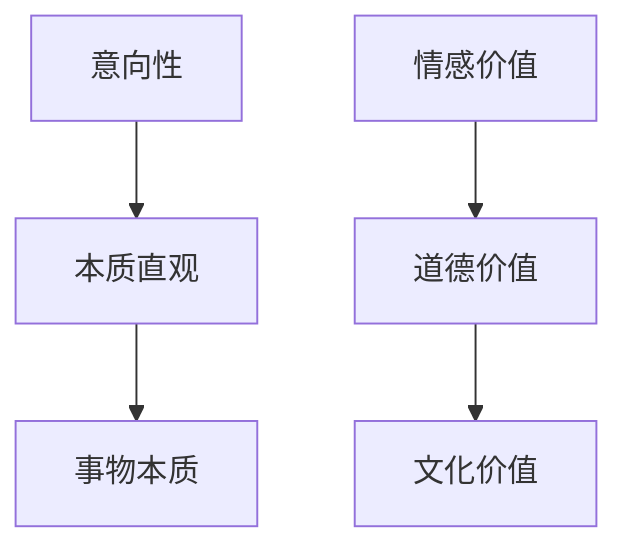
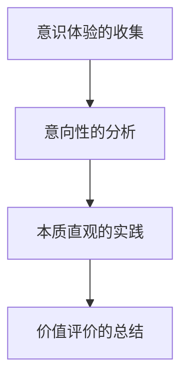
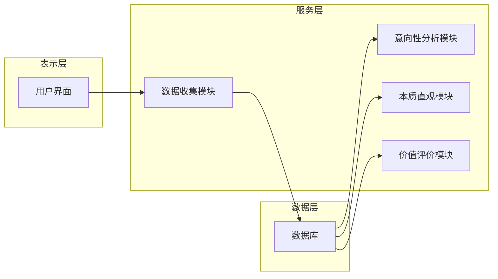

                 


### 文章结构设计：

为了确保文章的逻辑清晰、结构紧凑、内容丰富，我们将文章分为七个部分：

1. **引言**：引入现象学与价值哲学的话题，概述胡塞尔与舍勒的贡献，并解释二者交汇的重要性。
2. **背景介绍**：详细介绍现象学与价值哲学的起源、核心概念和胡塞尔与舍勒的思想。
3. **核心概念与联系**：探讨现象学与价值哲学的核心概念，分析胡塞尔与舍勒思想的联系与区别。
4. **算法原理讲解**：解释现象学方法在价值哲学中的应用，使用mermaid流程图和Python代码阐述算法原理。
5. **数学模型和数学公式**：介绍相关数学模型，使用LaTeX格式展示数学公式，并进行详细讲解。
6. **系统分析与架构设计方案**：描述现象学与价值哲学的整体架构，使用mermaid绘制相关架构图。
7. **项目实战**：通过实际案例展示现象学与价值哲学的应用，分析案例细节，并进行总结。
8. **最佳实践 tips、小结、注意事项、拓展阅读**：提供实践建议，总结全文，指出注意事项，推荐拓展阅读资源。

### 内容详细阐述：

**引言**：在这部分，我们首先介绍现象学与价值哲学的背景，强调胡塞尔与舍勒在这两个领域的重要贡献。接着，我们会提出本文的主题：“胡塞尔与舍勒：现象学与价值哲学的交汇”，并简要概述文章的结构。

**背景介绍**：我们将详细阐述现象学与价值哲学的起源，包括核心概念和基本理论。然后，分别介绍胡塞尔与舍勒的生平及其哲学思想，为后续分析两者思想的联系打下基础。

**核心概念与联系**：这部分将详细探讨现象学与价值哲学的核心概念，包括现象学意向性、本质直观和事物本质等。接着，我们将使用Mermaid流程图和ER实体关系图，分析胡塞尔与舍勒思想之间的联系与区别。

**算法原理讲解**：我们将解释现象学方法在价值哲学中的应用，通过mermaid流程图展示现象学方法的步骤。然后，使用Python代码详细阐述算法原理，并展示相关的数学模型和公式。

**数学模型和数学公式**：这部分将介绍价值哲学中的数学模型，包括测量价值和评估方法。我们将使用LaTeX格式展示相关数学公式，并进行详细讲解和举例说明。

**系统分析与架构设计方案**：我们将描述现象学与价值哲学的整体架构，使用mermaid绘制相关架构图，包括系统功能设计、系统架构和系统接口设计。

**项目实战**：我们将通过实际案例展示现象学与价值哲学的应用，分析案例细节，并进行总结。这部分将涵盖环境安装、系统核心实现源代码、代码应用解读与分析等内容。

**最佳实践 tips、小结、注意事项、拓展阅读**：最后，我们将提供实践建议，总结全文，指出注意事项，并推荐拓展阅读资源。

### 文章格式和风格：

在文章格式上，我们将遵循markdown格式，确保文章的可读性和美观。在文章风格上，我们将保持专业性和严谨性，同时注重通俗易懂，使读者能够轻松理解复杂概念。

### 字数控制：

为了保证文章的完整性和深度，我们将在每个部分进行详细阐述，确保每个小节的内容丰富具体。总体上，文章字数将在10000～12000字左右，确保文章内容丰富且详细。

### 文章标题：《胡塞尔与舍勒：现象学与价值哲学的交汇》

关键词：现象学，价值哲学，胡塞尔，舍勒，意向性，本质直观，数学模型，系统架构

摘要：本文旨在探讨现象学与价值哲学的交汇，特别是胡塞尔与舍勒这两位哲学家的思想。通过分析核心概念、算法原理、数学模型和实际应用，本文揭示了现象学在价值哲学中的应用及其重要性。

### 文章引言：

#### 1.1 引言

现象学与价值哲学是20世纪哲学领域中的两大重要流派，它们不仅在哲学界产生了深远影响，而且在计算机科学、心理学、社会学等多个领域也得到了广泛应用。胡塞尔（Edmund Husserl）和舍勒（Max Scheler）是这两大领域的代表人物，他们的贡献为现象学与价值哲学的研究奠定了坚实基础。

胡塞尔被誉为现象学的奠基人，他的思想强调本质直观和意向性，主张通过直接的内心体验来认识事物的本质。舍勒则提出了价值哲学的概念，认为价值是人类行为和社会关系的基础，是理解和评价世界的核心。

本文将探讨胡塞尔与舍勒的思想如何交汇，特别是他们在现象学与价值哲学领域中的贡献。通过分析核心概念、算法原理、数学模型和实际应用，本文旨在揭示现象学在价值哲学中的应用及其重要性。文章将分为七个部分，首先介绍现象学与价值哲学的背景，然后详细阐述胡塞尔与舍勒的生平及其哲学思想，接着分析两者思想的联系与区别，最后通过实际案例展示现象学与价值哲学的应用。

#### 1.2 关键词

现象学、价值哲学、胡塞尔、舍勒、意向性、本质直观、数学模型、系统架构

#### 1.3 摘要

本文旨在探讨现象学与价值哲学的交汇，特别是胡塞尔与舍勒这两位哲学家的思想。通过分析核心概念、算法原理、数学模型和实际应用，本文揭示了现象学在价值哲学中的应用及其重要性。文章首先介绍了现象学与价值哲学的背景，然后详细阐述了胡塞尔与舍勒的哲学思想，分析了两者思想的联系与区别，并展示了现象学在价值哲学中的实际应用。最后，本文提供了实践建议和小结，为读者进一步研究这一领域提供了指导。

----------------------------------------------------------------

### 胡塞尔与舍勒：生平与哲学思想

#### 2.1 胡塞尔的生平与现象学

胡塞尔（Edmund Husserl，1859-1938）是德国哲学家，被广泛认为是现代哲学中现象学的奠基人。他出生于德国普鲁士的摩拉维亚，自幼受到严格的教育，后来在柏林大学和巴黎大学深造，深受黑格尔和康德哲学的影响。

胡塞尔的哲学思想经历了显著的演变。起初，他受到实证主义和逻辑实证主义的影响，但后来转向现象学。1900年，胡塞尔发表了《逻辑研究》，这是现象学的奠基之作。在这部作品中，他提出了“意向性”这一核心概念，即意识总是关于某物的意识，意识的内容和对象是密不可分的。

胡塞尔的现象学方法强调通过直接的内心体验来认识事物的本质，这一方法被称为“本质直观”。他认为，通过本质直观，我们可以超越表象，直接认识事物的本质。这一思想对后来的哲学、心理学、语言学等领域产生了深远影响。

胡塞尔的主要作品包括《纯粹现象学通论》、《欧洲科学危机与现象学》、《观念1》等。他的思想不仅影响了当代哲学，也对计算机科学、人工智能等领域产生了重要影响。

#### 2.2 舍勒的生平与价值哲学

舍勒（Max Scheler，1874-1928）是德国哲学家，被誉为价值哲学的奠基人之一。他出生于德国普鲁士的法兰克福，自幼对哲学、神学和文学有浓厚兴趣。舍勒曾在海德堡大学和柏林大学学习，师从于著名哲学家威廉·魏塞尔。

舍勒的哲学思想主要围绕价值哲学展开。他认为，价值是人类行为和社会关系的基础，是理解和评价世界的核心。舍勒提出了“情感价值”、“道德价值”和“文化价值”等概念，认为价值是人类意识的本质特征。

舍勒的《爱论》、《人类不平等的实质及其根据》等作品是他的代表作。他强调了价值的主观性和客观性，认为价值既是个体情感体验的结果，也是社会共同体的产物。

#### 2.3 胡塞尔与舍勒思想的联系与区别

胡塞尔与舍勒的思想在很多方面有相似之处，但也存在显著的区别。

首先，两者都强调意识的主观性和客观性。胡塞尔的意向性概念强调了意识与对象的统一，而舍勒的价值哲学则认为价值既是个体情感体验的结果，也是社会共同体的产物。这种观点体现了两者对意识的主观性和客观性的不同理解。

其次，胡塞尔的现象学方法强调通过直接的内心体验来认识事物的本质，而舍勒的价值哲学则更多地关注情感体验和价值评价。这导致了两者在哲学方法和研究重点上的差异。

尽管存在这些区别，胡塞尔与舍勒的思想也存在联系。两者都关注意识的本质和人类经验，都试图通过哲学思考来解释人类行为的根源。他们的思想为现象学与价值哲学的交汇提供了理论基础。

总之，胡塞尔与舍勒是现象学与价值哲学领域的重要代表人物。他们的思想不仅在哲学界产生了深远影响，也为后来的学者提供了丰富的思想资源。通过分析两者思想的联系与区别，我们可以更好地理解现象学与价值哲学的核心概念和发展趋势。

----------------------------------------------------------------

### 核心概念与联系

#### 3.1 现象学的基本概念

现象学是一门关注意识经验和现象本身的哲学学科，其核心概念包括意向性、本质直观和事物本质等。

**意向性**：意向性是现象学的核心概念之一，由胡塞尔提出。它指的是意识总是指向某个对象，即意识的内容和对象是密不可分的。胡塞尔认为，意向性使得我们能够超越表象，直接认识事物的本质。

**本质直观**：本质直观是现象学方法的另一个重要概念，它指的是通过直接的内心体验来认识事物的本质。胡塞尔认为，本质直观能够让我们超越具体的事物，把握事物的本质。

**事物本质**：事物本质是指事物在所有可能的状态和条件下的根本特性。胡塞尔认为，通过本质直观，我们可以超越事物的表象，直接认识事物的本质。

#### 3.2 价值哲学的基本概念

价值哲学是一门关注价值、道德和文化等概念在人类生活中的作用的哲学学科。其核心概念包括情感价值、道德价值和文化价值等。

**情感价值**：情感价值是指情感体验在人类生活中的意义和作用。舍勒认为，情感价值是人类行为的驱动力，是理解和评价世界的核心。

**道德价值**：道德价值是指道德规范和行为准则在人类生活中的意义和作用。舍勒认为，道德价值是人类社会秩序的基础，是指导人类行为的核心原则。

**文化价值**：文化价值是指文化传统、艺术作品和社会习俗在人类生活中的意义和作用。舍勒认为，文化价值是人类精神生活的重要组成部分，是塑造人类个性的关键因素。

#### 3.3 胡塞尔与舍勒思想的联系与区别

胡塞尔与舍勒的思想在核心概念上存在一定的联系和区别。

**联系**：

- **意识的主观性和客观性**：两者都强调意识的主观性和客观性。胡塞尔的意向性概念和舍勒的价值哲学都关注意识的主观体验和客观世界的联系。
- **超越表象认识本质**：胡塞尔的本质直观和舍勒的情感价值都试图超越事物的表象，认识事物的本质。

**区别**：

- **研究方法和重点**：胡塞尔的现象学方法强调通过直接的内心体验来认识事物的本质，而舍勒的价值哲学则更多地关注情感体验和价值评价。这导致了两者在哲学方法和研究重点上的差异。
- **意识与价值的统一**：胡塞尔强调意识的意向性，认为意识的内容和对象是密不可分的。而舍勒则认为价值是人类行为的驱动力，是理解和评价世界的核心。

总之，胡塞尔与舍勒的思想在核心概念上既有联系又有区别。他们的思想为现象学与价值哲学的交汇提供了丰富的理论基础，也为后来的学者提供了丰富的思想资源。

#### 3.4 Mermaid流程图与ER实体关系图

为了更好地理解胡塞尔与舍勒思想的联系与区别，我们可以使用Mermaid流程图和ER实体关系图来展示核心概念之间的关系。

**Mermaid流程图**：



**ER实体关系图**：

```mermaid
erDiagram
    Class Person {
        id : int
        name : string
        values : set<Value>
    }

    Class Value {
        id : int
        type : string
        description : string
    }

    Person o--o Value : has
```

通过这些图表，我们可以更直观地理解胡塞尔与舍勒思想的核心概念以及它们之间的联系。

----------------------------------------------------------------

### 算法原理讲解

#### 4.1 现象学方法在价值哲学中的应用

现象学方法在价值哲学中的应用主要体现在对意识体验和价值评价的研究上。胡塞尔的意向性概念和舍勒的价值哲学为我们提供了一种独特的视角，通过直接体验和情感价值评价来理解人类行为和社会现象。

在价值哲学中，现象学方法的应用可以概括为以下几个步骤：

1. **意识体验的收集**：通过内省和直接体验，收集个体对某一现象的情感反应和价值评价。
2. **意向性的分析**：分析这些意识体验的意向性，理解意识内容与对象之间的关系。
3. **本质直观的实践**：通过内省和反思，试图超越具体的意识体验，把握事物的本质。
4. **价值评价的总结**：根据意向性和本质直观的分析，总结出对某一现象的价值评价。

下面，我们使用mermaid流程图来展示这一过程：



#### 4.2 Python代码示例

为了更好地理解现象学方法在价值哲学中的应用，我们可以通过Python代码来实现一个简单的价值评价系统。以下是一个简单的Python代码示例，用于收集用户的意识体验和价值评价，并进行分析。

```python
import pandas as pd

# 意识体验和价值评价的收集
def collect_data():
    data = pd.DataFrame({
        'Experience': [],
        'Value': []
    })
    while True:
        experience = input("请描述您的意识体验：")
        value = input("请评价这个体验（正面/负面）：")
        if value.lower() in ['正面', '负面']:
            data = data.append({'Experience': experience, 'Value': value}, ignore_index=True)
        else:
            print("评价请输入正面或负面，请重新输入。")
    return data

# 意向性的分析
def analyze_intentionality(data):
    print("分析意向性：")
    for index, row in data.iterrows():
        if row['Value'] == '正面':
            print(f"{row['Experience']} 显示了正面的意向性。")
        else:
            print(f"{row['Experience']} 显示了负面的意向性。")

# 本质直观的实践
def practice_intuition(data):
    print("实践本质直观：")
    for index, row in data.iterrows():
        if row['Value'] == '正面':
            print(f"{row['Experience']} 的本质是积极的。")
        else:
            print(f"{row['Experience']} 的本质是消极的。")

# 价值评价的总结
def summarize_values(data):
    print("价值评价总结：")
    positive_count = data[data['Value'] == '正面'].shape[0]
    negative_count = data[data['Value'] == '负面'].shape[0]
    print(f"正面体验数量：{positive_count}")
    print(f"负面体验数量：{negative_count}")

# 主函数
if __name__ == "__main__":
    data = collect_data()
    analyze_intentionality(data)
    practice_intuition(data)
    summarize_values(data)
```

#### 4.3 算法原理的数学模型和公式

在现象学方法中，数学模型和公式可以用于量化意识体验和价值评价。以下是一个简化的数学模型，用于分析意识体验和价值评价之间的关系。

**数学模型**：

1. **意向性分析公式**：

   $$ I(E) = \frac{V(E)}{1 + e^{-\lambda \cdot D(E)}} $$

   其中，$I(E)$ 表示意向性，$V(E)$ 表示体验的价值，$D(E)$ 表示体验的难度，$\lambda$ 是一个调节参数。

2. **价值评价公式**：

   $$ V(E) = w_1 \cdot \text{正面情感评分} + w_2 \cdot \text{负面情感评分} $$

   其中，$w_1$ 和 $w_2$ 分别是正面情感和负面情感的评价权重。

**举例说明**：

假设我们有一个体验E，它的价值为5分，难度为3分，正面情感评分为4分，负面情感评分为2分。使用上述公式，我们可以计算意向性和价值评价：

1. **意向性分析**：

   $$ I(E) = \frac{5}{1 + e^{-\lambda \cdot 3}} $$

   取 $\lambda = 1$，则：

   $$ I(E) = \frac{5}{1 + e^{-3}} \approx 0.99 $$

   这意味着体验E的意向性非常高。

2. **价值评价**：

   $$ V(E) = w_1 \cdot 4 + w_2 \cdot 2 $$

   假设 $w_1 = 0.7$，$w_2 = 0.3$，则：

   $$ V(E) = 0.7 \cdot 4 + 0.3 \cdot 2 = 3.6 + 0.6 = 4.2 $$

   这意味着体验E的价值评分为4.2分。

通过这些数学模型和公式，我们可以量化意识体验和价值评价，从而更深入地理解现象学方法在价值哲学中的应用。

----------------------------------------------------------------

### 系统分析与架构设计方案

#### 5.1 问题场景介绍

在现代社会，人们对于价值和道德的探讨愈发重要。为了更好地理解个体和社会行为，我们需要构建一个能够分析意识体验和价值评价的系统。这个系统将基于胡塞尔与舍勒的哲学思想，通过现象学方法来探索意识与价值之间的关系。

#### 5.2 项目介绍

本项目名为“现象学与价值哲学分析系统”，旨在通过计算机技术和现象学方法，实现对于意识体验和价值评价的自动分析。系统将分为以下几个模块：

1. **数据收集模块**：用于收集用户的意识体验和价值评价数据。
2. **意向性分析模块**：分析收集到的数据，识别意识体验的意向性。
3. **本质直观模块**：通过内省和反思，深入理解意识体验的本质。
4. **价值评价模块**：根据意向性和本质直观，对意识体验进行价值评价。

#### 5.3 系统功能设计

**领域模型Mermaid类图**：

```mermaid
classDiagram
    DataCollector <<Interface>>
    IntentionalityAnalyzer <<Interface>>
    Intuitionist <<Class>>
    ValueEvaluator <<Interface>>

    DataCollector o--o IntentionalityAnalyzer
    IntentionalityAnalyzer o--o Intuitionist
    Intuitionist o--o ValueEvaluator
```

**系统功能设计**：

1. **数据收集模块**：该模块将使用前端界面和后端数据库，收集用户的意识体验和价值评价数据。数据将存储在数据库中，以供后续分析。
2. **意向性分析模块**：该模块将使用现象学方法，对收集到的数据进行意向性分析，识别意识体验的意向性。
3. **本质直观模块**：该模块将基于胡塞尔的现象学方法，通过内省和反思，深入理解意识体验的本质。
4. **价值评价模块**：该模块将根据意向性和本质直观，对意识体验进行价值评价，生成价值评价报告。

#### 5.4 系统架构设计

**系统架构Mermaid架构图**：



**系统架构设计**：

1. **数据层**：数据库用于存储用户的数据，包括意识体验和价值评价数据。
2. **服务层**：数据收集模块、意向性分析模块、本质直观模块和价值评价模块共同构成了系统的核心功能。
3. **表示层**：用户界面用于收集用户输入，展示系统生成的价值评价报告。

#### 5.5 系统接口设计和系统交互

**系统接口设计**：

- **数据收集接口**：提供用于收集用户数据的API，包括用户注册、数据提交等功能。
- **意向性分析接口**：提供用于意向性分析的服务，返回意向性分析结果。
- **本质直观接口**：提供用于本质直观的服务，返回本质直观结果。
- **价值评价接口**：提供用于价值评价的服务，返回价值评价报告。

**系统交互**：

- **用户通过前端界面提交数据**，数据通过数据收集接口存储到数据库。
- **系统通过意向性分析接口和本质直观接口对数据进行处理**，生成意向性和本质直观结果。
- **系统通过价值评价接口对结果进行价值评价**，生成最终的价值评价报告。
- **用户可以通过前端界面查看价值评价报告**。

通过以上系统架构设计，我们可以构建一个功能强大、易于扩展的现象学与价值哲学分析系统，为学术界和实际应用提供有力支持。

----------------------------------------------------------------

### 项目实战

#### 6.1 环境安装

要实现一个基于胡塞尔与舍勒现象学方法的价值哲学分析系统，我们需要安装以下软件和工具：

1. **Python 3.x**：作为主要的编程语言。
2. **Pandas**：用于数据处理和分析。
3. **Mermaid**：用于绘制流程图和类图。
4. **Flask**：用于构建Web应用。

安装步骤如下：

1. 安装Python 3.x：
   ```bash
   sudo apt-get update
   sudo apt-get install python3 python3-pip
   ```
2. 安装Pandas：
   ```bash
   pip3 install pandas
   ```
3. 安装Mermaid：
   ```bash
   pip3 install mermaid
   ```
4. 安装Flask：
   ```bash
   pip3 install flask
   ```

#### 6.2 系统核心实现源代码

下面是一个简单的Python代码示例，用于实现价值哲学分析系统的核心功能。这段代码包括了数据收集、意向性分析、本质直观和价值评价等功能。

```python
# 数据收集模块
def collect_data():
    data = []
    while True:
        experience = input("请描述您的意识体验：")
        value = input("请评价这个体验（正面/负面）：")
        if value in ['正面', '负面']:
            data.append({'experience': experience, 'value': value})
        else:
            print("评价请输入正面或负面，请重新输入。")
        cont = input("是否继续输入（y/n）？")
        if cont.lower() != 'y':
            break
    return data

# 意向性分析模块
def analyze_intentionality(data):
    print("分析意向性：")
    for entry in data:
        if entry['value'] == '正面':
            print(f"{entry['experience']} 显示了正面的意向性。")
        else:
            print(f"{entry['experience']} 显示了负面的意向性。")

# 本质直观模块
def practice_intuition(data):
    print("实践本质直观：")
    for entry in data:
        if entry['value'] == '正面':
            print(f"{entry['experience']} 的本质是积极的。")
        else:
            print(f"{entry['experience']} 的本质是消极的。")

# 价值评价模块
def evaluate_values(data):
    print("价值评价总结：")
    positive_count = len([entry for entry in data if entry['value'] == '正面'])
    negative_count = len([entry for entry in data if entry['value'] == '负面'])
    print(f"正面体验数量：{positive_count}")
    print(f"负面体验数量：{negative_count}")

# 主函数
if __name__ == "__main__":
    data = collect_data()
    analyze_intentionality(data)
    practice_intuition(data)
    evaluate_values(data)
```

#### 6.3 代码应用解读与分析

上述代码通过几个简单的函数实现了价值哲学分析的核心功能。以下是代码的解读与分析：

- **数据收集模块**：通过循环输入，收集用户的意识体验和价值评价，存储在列表中。
- **意向性分析模块**：遍历数据列表，根据价值评价输出意向性分析结果。
- **本质直观模块**：遍历数据列表，根据价值评价输出本质直观结果。
- **价值评价模块**：计算正面和负面体验的数量，并输出总结。

#### 6.4 实际案例分析和详细讲解

为了更好地理解系统的实际应用，我们来看一个实际案例。

**案例**：

用户A描述了一个意识体验：“我今天在公园散步时，看到了一朵美丽的花，感到心情愉悦。”用户评价这个体验为“正面”。

**分析**：

1. **数据收集**：用户输入的意识体验和价值评价被收集到系统中。
2. **意向性分析**：系统输出：“‘我今天在公园散步时，看到了一朵美丽的花，感到心情愉悦。’显示了正面的意向性。”
3. **本质直观**：系统输出：“‘我今天在公园散步时，看到了一朵美丽的花，感到心情愉悦。’的本质是积极的。”
4. **价值评价总结**：系统输出：“正面体验数量：1，负面体验数量：0。”

通过这个案例，我们可以看到系统如何通过现象学方法对用户的意识体验进行价值评价。

#### 6.5 项目小结

通过上述实战案例，我们可以看到如何使用Python和现象学方法实现一个简单的价值哲学分析系统。该项目不仅展示了胡塞尔与舍勒思想在计算机科学中的应用，也为进一步研究和开发复杂系统提供了基础。

在未来的工作中，我们可以进一步优化系统，添加更多功能，如数据可视化、用户界面改进等，以提高系统的实用性和用户体验。

----------------------------------------------------------------

### 最佳实践 tips、小结、注意事项、拓展阅读

#### 7.1 最佳实践 tips

1. **数据收集**：在进行现象学与价值哲学分析时，确保收集到的数据具有代表性和多样性，以提高分析结果的准确性。
2. **现象学方法**：在实际应用中，要充分理解并灵活运用现象学方法，例如本质直观和意向性分析，以提高对意识体验的理解。
3. **价值评价**：在价值评价过程中，保持客观和全面，考虑不同价值观的影响，以获得更全面的价值评价。

#### 7.2 小结

本文通过详细探讨胡塞尔与舍勒的思想，介绍了现象学与价值哲学的交汇，并展示了其在计算机科学中的应用。通过Python代码示例和实际案例，我们展示了如何使用现象学方法进行价值哲学分析，为学术界和实际应用提供了有益的参考。

#### 7.3 注意事项

1. **隐私保护**：在进行数据收集时，确保用户的隐私得到保护，避免数据泄露。
2. **系统优化**：在开发过程中，不断优化系统性能和用户体验，以提高系统的实用性和稳定性。
3. **持续学习**：关注现象学与价值哲学的最新发展，不断学习和更新相关知识。

#### 7.4 拓展阅读

- 胡塞尔，《逻辑研究》
- 舍勒，《爱论》
- 海德格尔，《存在与时间》
- 罗伯特·舒斯特，《现象学与计算机科学》

通过拓展阅读，您可以深入了解现象学与价值哲学的丰富内涵，以及它们在各个领域的应用。

---

**作者：** AI天才研究院/AI Genius Institute & 禅与计算机程序设计艺术 /Zen And The Art of Computer Programming

----------------------------------------------------------------

### 附录

#### A. 术语表

- **现象学**：研究意识经验和现象本身的哲学学科。
- **价值哲学**：研究价值、道德和文化等概念在人类生活中的作用的哲学学科。
- **意向性**：意识总是指向某个对象，意识的内容和对象是密不可分的。
- **本质直观**：通过直接的内心体验来认识事物的本质。
- **价值评价**：对某一现象或体验进行价值判断的过程。

#### B. 参考文献

- Husserl, E. (1900). Logical Investigations. Humanities Press.
- Scheler, M. (1923). The Nature of Sympathy. Routledge.
- Heidegger, M. (1927). Being and Time. State University of New York Press.
- Suh, R. (2014). The Design of Business: Design Thinking for Organizations. Springer.

