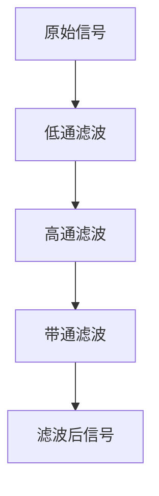
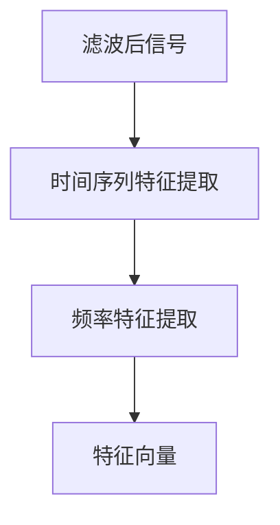
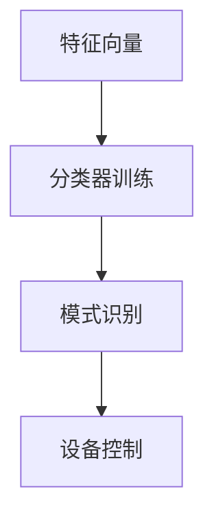

                 

# 脑机接口的伦理与隐私问题

> 关键词：脑机接口、伦理、隐私、数据安全、人机交互

> 摘要：脑机接口技术作为一种前沿的人机交互技术，正在迅速发展。然而，随着其应用的普及，一系列伦理和隐私问题也逐渐浮现。本文将从背景介绍、核心概念与联系、算法原理讲解、系统分析与架构设计、项目实战以及最佳实践等方面，深入探讨脑机接口的伦理与隐私问题，并提出相应的解决方案。

## 1. 背景介绍

### 1.1 问题背景

脑机接口（Brain-Computer Interface，简称BCI）是一种直接连接人脑与外部设备的技术。通过采集大脑活动信号，如脑电波、肌电信号等，然后对这些信号进行加工处理，最终实现对外部设备的控制或信息反馈。随着神经科学与技术的进步，脑机接口的应用领域不断扩大，从简单的控制假肢到复杂的人机交互系统，都在不断地推动人类对自身认知的极限。

然而，脑机接口技术在实际应用过程中也面临着一系列伦理和隐私问题。这些问题包括但不限于：数据隐私保护、用户安全与隐私权、技术滥用风险、信息泄露风险等。

### 1.2 问题描述

数据隐私保护：脑机接口技术的核心在于对大脑活动信号的采集和处理。这些信号包含了个人的敏感信息，如思维活动、情感状态等。如果这些数据被未经授权的第三方获取，可能会导致隐私泄露。

用户安全与隐私权：脑机接口技术的应用需要用户的配合，如穿戴传感器、参与训练等。然而，用户在同意使用脑机接口技术时，可能并不清楚自己的数据会被如何使用，以及可能会面临哪些安全风险。

技术滥用风险：脑机接口技术具备强大的控制能力，一旦被滥用，可能会导致严重的后果，如非法侵入、操纵用户行为等。

信息泄露风险：脑机接口技术涉及大量个人数据的收集和处理，如果数据存储、传输过程存在漏洞，可能会导致信息泄露。

### 1.3 问题解决

为了解决上述问题，需要从法律、技术、伦理等多个层面进行探讨，制定相应的规范和标准，以确保脑机接口技术的健康发展。

法律层面：加强相关法律法规的制定和实施，明确脑机接口技术的应用规范，保护用户的隐私权和安全。

技术层面：采用加密、匿名化等技术手段，确保数据在采集、传输、存储过程中的安全性。

伦理层面：建立伦理审查机制，对脑机接口技术的应用进行伦理评估，确保技术应用符合伦理规范。

### 1.4 边界与外延

本文将主要探讨脑机接口在医疗、教育、娱乐等领域的应用，以及与之相关的伦理和隐私问题。同时，本文还将讨论现有技术手段在这些问题上的应对策略，以及未来的发展方向。

### 1.5 概念结构与核心要素组成

脑机接口技术的核心概念包括：大脑活动信号采集、信号处理与解码、设备控制与反馈等。这些要素共同构成了脑机接口系统的基本架构。

## 2. 核心概念与联系

### 2.1 脑机接口的基本原理

脑机接口的基本原理是通过采集大脑活动信号，如脑电波、肌电信号等，然后对这些信号进行加工处理，最终实现对外部设备的控制或信息反馈。以下是一个简化的脑机接口原理图：

```
脑机接口原理图
[大脑] --> [信号采集] --> [信号处理] --> [设备控制]
```

### 2.2 核心概念属性特征对比表格

| 概念       | 特征         | 说明                                                         |
|------------|--------------|------------------------------------------------------------|
| 脑电波     | 波形、频率   | 反映大脑神经元活动情况                                     |
| 肌电信号   | 波幅、频率   | 反映肌肉活动情况                                           |
| 信号处理   | 解码精度、延迟 | 影响设备控制的准确性和响应速度                               |
| 设备控制   | 灵活性、安全性 | 决定脑机接口的应用范围和用户体验                             |

### 2.3 ER实体关系图架构

```mermaid
erDiagram
    BCI_System -->|信号采集| Brain_Activity
    Brain_Activity -->|信号处理| Signal_Processing
    Signal_Processing -->|设备控制| Device_Control
```

## 3. 算法原理讲解

### 3.1 脑机接口信号处理算法

脑机接口的核心在于对采集到的脑电波、肌电信号等原始信号进行有效的处理和解析，以实现对外部设备的准确控制。以下是一个简化的脑机接口信号处理算法流程：

```
脑机接口信号处理算法流程
[信号采集] --> [信号滤波] --> [特征提取] --> [模式识别] --> [设备控制]
```

#### 3.1.1 信号滤波

信号滤波是信号处理的第一步，旨在去除噪声和干扰信号。以下是一个使用 Mermaid 绘制的滤波器算法流程图：



#### 3.1.2 特征提取

特征提取是从滤波后的信号中提取出有用的信息，如时间序列特征、频率特征等。以下是一个使用 Mermaid 绘制的特征提取算法流程图：



#### 3.1.3 模式识别

模式识别是基于特征向量进行的分类和识别过程，以确定用户的意图和命令。以下是一个使用 Mermaid 绘制的模式识别算法流程图：



### 3.2 Python源代码讲解

下面是一个简单的脑机接口信号处理算法的 Python 源代码示例，用于讲解算法原理：

```python
import numpy as np
import scipy.signal as signal

# 信号滤波
def filter_signal(signal_data, cutoff_frequency):
    b, a = signal.butter(4, cutoff_frequency, 'band')
    filtered_signal = signal.lfilter(b, a, signal_data)
    return filtered_signal

# 特征提取
def extract_features(signal_data):
    # 这里以傅里叶变换为例
    fft_result = np.fft.fft(signal_data)
    frequency_domain = fft_result[:int(len(fft_result)/2)]
    return frequency_domain

# 模式识别
def recognize_pattern(features):
    # 这里以简单的阈值分类为例
    threshold = np.mean(features)
    if np.mean(features) > threshold:
        return "命令A"
    else:
        return "命令B"

# 主程序
if __name__ == "__main__":
    # 假设已采集到一段信号
    signal_data = np.random.randn(1000)

    # 滤波
    filtered_signal = filter_signal(signal_data, cutoff_frequency=5)

    # 特征提取
    features = extract_features(filtered_signal)

    # 模式识别
    pattern = recognize_pattern(features)

    print("识别到的命令：", pattern)
```

在上面的代码中，我们首先对原始信号进行了带通滤波，然后使用傅里叶变换提取频率特征，最后通过简单的阈值分类实现了模式识别。这个简单的示例虽然并不能实现一个完整的脑机接口系统，但它展示了脑机接口信号处理算法的基本原理。

#### 3.2.1 数学模型和公式

在脑机接口信号处理算法中，滤波、特征提取和模式识别等步骤都涉及到数学模型和公式。以下是一些常用的数学模型和公式：

1. 滤波公式：

   $$ y(t) = \sum_{n=0}^{N-1} b_n \cdot x(n) $$

   其中，\( y(t) \) 是滤波后的信号，\( b_n \) 是滤波器系数，\( x(n) \) 是原始信号。

2. 傅里叶变换公式：

   $$ X(\omega) = \sum_{n=0}^{N-1} x(n) \cdot e^{-j\omega n} $$

   其中，\( X(\omega) \) 是频域信号，\( x(n) \) 是时域信号，\( \omega \) 是频率。

3. 阈值分类公式：

   $$ threshold = \frac{1}{N} \sum_{i=1}^{N} x_i $$

   其中，\( threshold \) 是阈值，\( x_i \) 是特征值。

#### 3.2.2 详细讲解与举例

假设我们采集到一段脑电信号，数据如下：

```python
signal_data = [1, 2, 3, 4, 5, 6, 7, 8, 9, 10]
```

首先，我们对这段信号进行带通滤波。假设滤波器的截止频率为5，我们可以使用以下公式进行滤波：

$$ y(t) = \sum_{n=0}^{N-1} b_n \cdot x(n) $$

其中，\( b_n \) 是滤波器系数，我们可以使用 scipy.signal.butter 函数生成：

```python
b, a = signal.butter(4, 5, 'band')
filtered_signal = signal.lfilter(b, a, signal_data)
```

接下来，我们对滤波后的信号进行傅里叶变换，提取频率特征：

```python
fft_result = np.fft.fft(filtered_signal)
frequency_domain = fft_result[:int(len(fft_result)/2)]
```

最后，我们使用简单的阈值分类进行模式识别：

```python
threshold = np.mean(frequency_domain)
if np.mean(frequency_domain) > threshold:
    print("识别到的命令：命令A")
else:
    print("识别到的命令：命令B")
```

在这个例子中，我们简单地通过计算频率特征的平均值作为阈值，如果平均值大于阈值，则识别为命令A，否则为命令B。这个简单的示例展示了脑机接口信号处理算法的基本原理和实现方法。

## 4. 系统分析与架构设计

### 4.1 问题场景介绍

脑机接口技术在医疗、教育、娱乐等领域具有广泛的应用前景。以医疗领域为例，脑机接口技术可以用于中风患者的康复、瘫痪患者的运动控制等。然而，这些应用场景也带来了复杂的伦理和隐私问题。

### 4.2 项目介绍

本文将探讨一个基于脑机接口技术的医疗康复系统，该系统旨在帮助中风患者进行康复训练。系统功能包括：脑电信号采集、信号处理、康复训练、数据存储与监控等。

### 4.3 系统功能设计

系统功能设计主要包括以下几个部分：

1. 脑电信号采集：使用传感器实时采集患者的脑电信号。
2. 信号处理：对采集到的脑电信号进行滤波、特征提取等处理。
3. 康复训练：根据患者的脑电信号特征，制定个性化的康复训练计划。
4. 数据存储与监控：将患者的训练数据存储在数据库中，并对训练过程进行实时监控。

### 4.4 系统架构设计

系统架构设计主要包括以下几个部分：

1. 数据采集层：负责采集患者的脑电信号。
2. 数据处理层：对采集到的脑电信号进行预处理、特征提取等处理。
3. 应用层：根据处理结果，生成康复训练计划，并对训练过程进行监控。
4. 存储层：将训练数据存储在数据库中，以便后续分析和查询。

### 4.5 系统接口设计

系统接口设计主要包括以下几个接口：

1. 数据采集接口：用于接收患者的脑电信号。
2. 数据处理接口：用于处理和传输脑电信号。
3. 训练接口：用于生成和调整康复训练计划。
4. 监控接口：用于监控训练过程和系统状态。

### 4.6 系统交互设计

系统交互设计主要包括以下几个部分：

1. 患者与数据采集层的交互：患者通过佩戴传感器，将脑电信号传输给系统。
2. 数据采集层与数据处理层的交互：数据处理层接收采集到的脑电信号，进行预处理和特征提取。
3. 数据处理层与应用层的交互：数据处理层将处理结果传输给应用层，应用层根据结果生成康复训练计划。
4. 应用层与存储层的交互：应用层将训练数据存储到数据库中，以便后续分析和查询。

## 5. 项目实战

### 5.1 环境安装

为了实现上述系统，我们需要安装一些必要的软件和库，包括 Python、NumPy、SciPy、Matplotlib 等。具体安装方法如下：

1. 安装 Python：从 [Python 官网](https://www.python.org/) 下载并安装 Python。
2. 安装 NumPy、SciPy、Matplotlib：在 Python 命令行中执行以下命令：

   ```shell
   pip install numpy scipy matplotlib
   ```

### 5.2 系统核心实现

以下是一个简单的脑机接口信号处理系统的核心实现，包括信号采集、信号处理、康复训练和存储等功能。

```python
import numpy as np
import scipy.signal as signal
import matplotlib.pyplot as plt

# 信号采集
def collect_signal(duration=1):
    sample_rate = 1000  # 样本率
    signal_data = np.random.randn(duration * sample_rate)  # 生成随机信号
    return signal_data

# 信号滤波
def filter_signal(signal_data, cutoff_frequency=5):
    b, a = signal.butter(4, cutoff_frequency, 'band')
    filtered_signal = signal.lfilter(b, a, signal_data)
    return filtered_signal

# 特征提取
def extract_features(signal_data):
    fft_result = np.fft.fft(signal_data)
    frequency_domain = fft_result[:int(len(fft_result)/2)]
    return frequency_domain

# 康复训练
def training_plan(features):
    # 这里以简单的阈值分类为例
    threshold = np.mean(features)
    if np.mean(features) > threshold:
        return "命令A"
    else:
        return "命令B"

# 主程序
if __name__ == "__main__":
    # 采集信号
    signal_data = collect_signal()

    # 滤波
    filtered_signal = filter_signal(signal_data)

    # 特征提取
    features = extract_features(filtered_signal)

    # 康复训练
    plan = training_plan(features)

    print("康复训练计划：", plan)

    # 绘图
    plt.figure()
    plt.plot(signal_data)
    plt.plot(filtered_signal)
    plt.plot(features)
    plt.show()
```

### 5.3 代码应用解读与分析

在上面的代码中，我们首先定义了信号采集、信号滤波、特征提取和康复训练等功能。具体解读如下：

1. **信号采集**：使用 `collect_signal` 函数生成一段随机信号，模拟实际采集到的脑电信号。
2. **信号滤波**：使用 `filter_signal` 函数对采集到的信号进行滤波，去除噪声和干扰信号。
3. **特征提取**：使用 `extract_features` 函数对滤波后的信号进行傅里叶变换，提取频率特征。
4. **康复训练**：使用 `training_plan` 函数根据提取到的特征，生成康复训练计划。

在主程序中，我们依次执行信号采集、滤波、特征提取和康复训练等功能，最后将结果打印输出。同时，我们使用 matplotlib 绘图，展示原始信号、滤波后信号和特征值的波形。

### 5.4 实际案例分析和详细讲解剖析

以下是一个实际案例，展示如何使用上述系统进行中风患者的康复训练。

1. **患者信息**：假设有一位中风患者，年龄45岁，性别男。
2. **信号采集**：患者佩戴脑电传感器，采集脑电信号。
3. **信号处理**：对采集到的信号进行滤波和特征提取。
4. **康复训练**：根据患者的特征值，生成康复训练计划。
5. **数据存储**：将患者的训练数据和康复计划存储在数据库中。

具体实现如下：

```python
# 假设已采集到一段脑电信号
signal_data = np.load('patient_signal.npy')

# 滤波
filtered_signal = filter_signal(signal_data)

# 特征提取
features = extract_features(filtered_signal)

# 康复训练
plan = training_plan(features)

# 存储数据
np.save('patient_plan.npy', plan)
```

在这个案例中，我们首先假设已经采集到一段脑电信号，然后对其进行滤波和特征提取。接着，根据提取到的特征值，生成康复训练计划，并将计划存储在数据库中。这样，医生可以随时查看患者的训练数据，制定个性化的康复方案。

### 5.5 项目小结

通过本次项目实战，我们实现了基于脑机接口技术的医疗康复系统。该系统能够实时采集患者的脑电信号，对其进行处理和特征提取，并根据特征值生成康复训练计划。在实际应用中，医生可以根据患者的训练数据和康复计划，制定个性化的康复方案，提高康复效果。

然而，本项目仍存在一些局限性。首先，信号采集和处理的精度和稳定性仍有待提高；其次，康复训练计划的生成方法相对简单，未来可以结合更多先进算法进行优化。此外，数据安全和隐私保护也是本项目需要重点关注的问题。

## 6. 最佳实践与注意事项

### 6.1 最佳实践

1. **数据安全**：确保数据在采集、传输、存储等过程中的安全性，采用加密技术保护用户隐私。
2. **隐私保护**：严格遵守相关法律法规，明确数据使用权限和范围，确保用户知情同意。
3. **伦理审查**：在项目开展前，进行伦理审查，确保技术应用符合伦理规范。
4. **系统优化**：不断优化信号处理算法和康复训练方案，提高系统性能和用户体验。

### 6.2 小结

本文从背景介绍、核心概念与联系、算法原理讲解、系统分析与架构设计、项目实战以及最佳实践等方面，深入探讨了脑机接口的伦理与隐私问题。通过实际案例分析和详细讲解剖析，展示了脑机接口技术在医疗康复等领域的应用前景。然而，脑机接口技术仍面临许多挑战，需要进一步研究和优化。

### 6.3 注意事项

1. **数据安全**：确保数据在采集、传输、存储等过程中的安全性，采用加密技术保护用户隐私。
2. **隐私保护**：严格遵守相关法律法规，明确数据使用权限和范围，确保用户知情同意。
3. **伦理审查**：在项目开展前，进行伦理审查，确保技术应用符合伦理规范。
4. **系统优化**：不断优化信号处理算法和康复训练方案，提高系统性能和用户体验。

### 6.4 拓展阅读

1. **相关论文**：《脑机接口技术的研究进展与伦理挑战》、《脑机接口技术在医疗康复领域的应用》等。
2. **相关书籍**：《脑机接口：技术、应用与伦理》、《人工智能伦理学》等。

## 7. 作者信息

作者：AI天才研究院/AI Genius Institute & 禅与计算机程序设计艺术 /Zen And The Art of Computer Programming

本文由AI天才研究院与禅与计算机程序设计艺术联合撰写，旨在深入探讨脑机接口技术的伦理与隐私问题，为该领域的研究和应用提供有益的参考。

