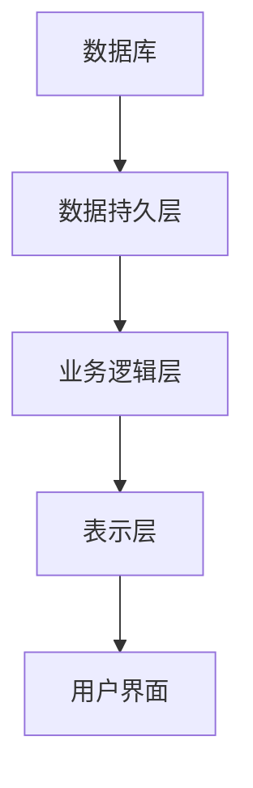
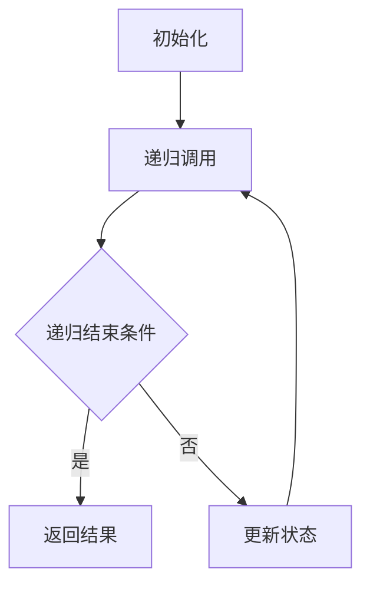
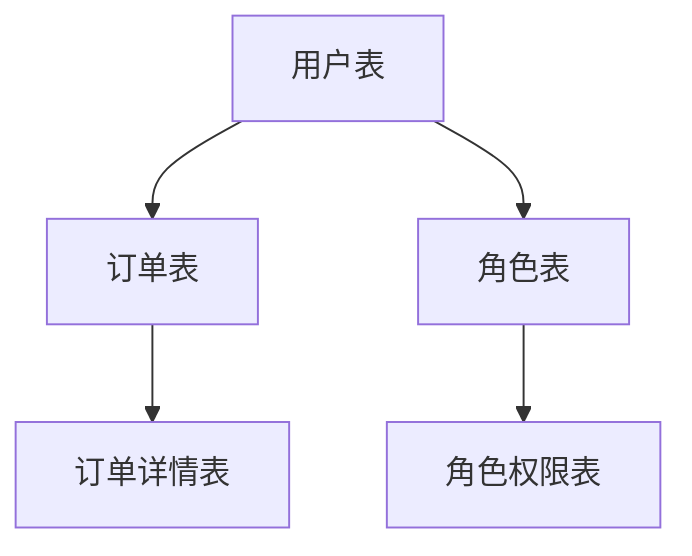
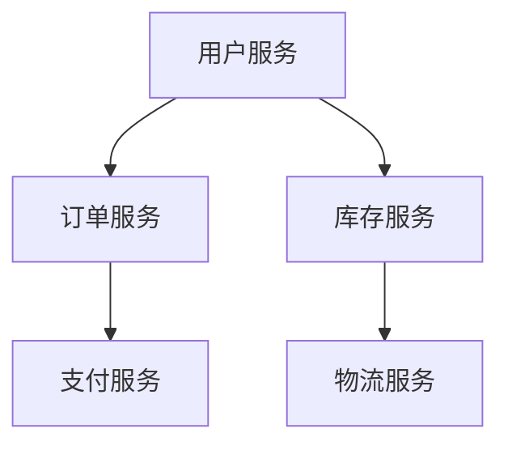
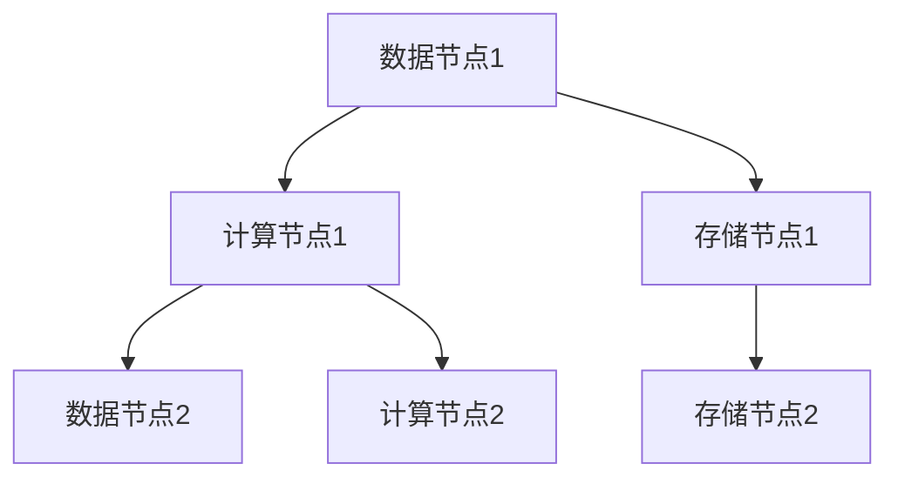
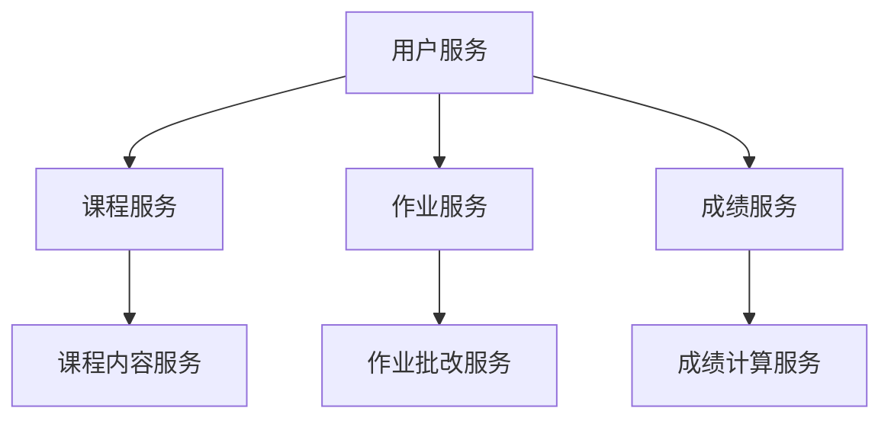
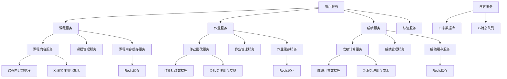
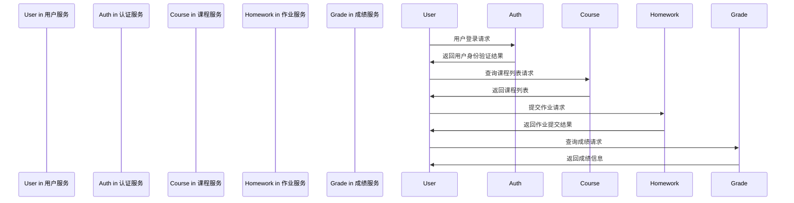
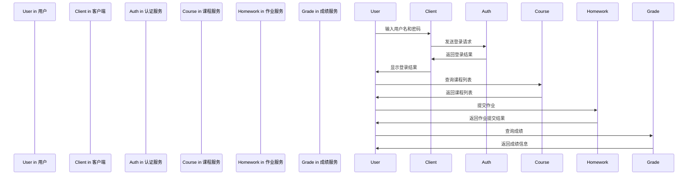

                 

## 自下而上，各司其职

### 关键词：自下而上，各司其职，系统设计，编程实践，最佳实践

> 摘要：本文将深入探讨“自下而上”与“各司其职”在IT领域的应用与整合。通过详细的理论讲解和实际项目实战，我们将理解这两个概念的核心内涵，揭示它们在系统设计和实现中的重要作用，并提供一系列最佳实践，以帮助读者在实际项目中有效运用这些理念，提升系统性能与开发效率。

---

### 引言

#### 1.1 问题背景

在当今快速发展的IT行业，如何高效地进行系统设计和实现是一个备受关注的问题。传统的“自顶向下”设计方法虽然能够提供清晰的顶层视图，但在细节处理上往往存在不足，而“自底向上”的方法则过于碎片化，难以形成统一的系统视图。为了克服这些局限，业界开始探索“自下而上”和“各司其职”相结合的设计方法，以实现更灵活、更高效、更可靠的系统开发。

#### 1.2 问题描述

在IT系统中，如何确保各个组件协同工作，发挥最佳效能是一个关键问题。传统的方法往往侧重于顶层设计，而忽视了底层组件的优化和协调。这导致系统在运行过程中可能出现性能瓶颈、功能冗余或者交互不顺畅等问题。因此，我们需要一种新的设计思路，能够兼顾系统整体性和组件独立性，从而实现高效、灵活、可靠的应用系统。

#### 1.3 问题解决

“自下而上”和“各司其职”相结合的设计方法提供了一种新的解决方案。通过“自下而上”，我们可以从底层开始，逐步构建系统的各个组件，确保每个组件的独立性和高效性；而“各司其职”则强调组件之间的分工与协作，确保系统整体运行的流畅性和稳定性。这种方法不仅能够提高系统开发效率，还能提升系统性能和可靠性。

#### 1.4 边界与外延

“自下而上”和“各司其职”的应用范围非常广泛，包括但不限于软件工程、系统架构设计、数据库管理、云计算和大数据等领域。在软件工程中，它可以应用于模块化设计、组件化开发；在系统架构设计中，它可以帮助构建微服务架构、分布式系统；在数据库管理中，它可以应用于索引优化、数据分区等；在云计算和大数据领域，它可以帮助设计高效的数据处理流程和分布式存储方案。

#### 1.5 概念结构与核心要素组成

本文的核心结构将分为四个部分：

1. **背景介绍与概念**：介绍“自下而上”和“各司其职”的概念，并探讨它们在IT领域的应用背景。
2. **理论讲解**：深入分析“自下而上”和“各司其职”的原理、优缺点以及发展历程。
3. **项目实战**：通过实际项目案例，展示如何应用“自下而上”和“各司其职”进行系统设计和实现。
4. **最佳实践与总结**：总结最佳实践，提供注意事项和拓展阅读，帮助读者在实际项目中更好地运用这些理念。

---

### 核心概念与联系

#### 2.1 自下而上的概念

“自下而上”（Bottom-Up）设计方法是一种从底层细节开始，逐步构建上层系统的设计方法。这种方法强调从底层组件开始，通过逐步组合和优化，最终形成一个完整、高效的系统。

**自下而上的优点**：

- **灵活性**：可以灵活地添加或修改底层组件，不影响整个系统的结构。
- **细节优化**：可以更深入地优化底层组件的性能和功能，从而提升系统整体性能。
- **可复用性**：底层组件往往具有通用性，可以复用于其他系统或项目。

**自下而上的局限**：

- **复杂性**：随着系统规模的扩大，自下而上的设计可能会变得复杂，难以维护。
- **缺乏顶层设计**：容易陷入细节，缺乏整体的顶层设计思路。

**自下而上的发展历程**：

- **早期应用**：在软件工程和系统架构设计的早期阶段，自下而上的方法就已经开始被采用。
- **现代发展**：随着微服务架构和云计算等技术的发展，自下而上的方法得到了进一步的应用和推广。

**自下而上的应用场景**：

- **模块化开发**：在开发大型系统时，可以使用自下而上的方法，逐步构建各个模块，然后进行集成。
- **嵌入式系统**：在嵌入式系统开发中，自下而上的方法可以帮助优化硬件和软件的交互。

#### 2.2 各司其职的概念

“各司其职”（Each Duties）是一种强调组件分工与协作的设计理念。在这种方法中，系统的各个组件（模块、服务）被赋予明确的职责，确保每个组件只负责自己的任务，从而提高系统的整体效率和可靠性。

**各司其职的优点**：

- **高内聚**：每个组件都专注于自己的职责，提高了组件的内聚性。
- **低耦合**：组件之间的依赖关系被减少，降低了系统的复杂度和维护成本。
- **可扩展性**：可以根据需要添加或替换某个组件，而不影响其他组件。

**各司其职的局限**：

- **协调困难**：组件之间的交互和协调可能会变得复杂，需要良好的接口设计和通信机制。
- **职责划分难度**：在实际项目中，确定每个组件的具体职责可能会比较困难。

**各司其职的发展历程**：

- **传统软件工程**：在传统的软件工程实践中，各司其职的思想就已经开始被采用。
- **微服务架构**：在微服务架构中，各司其职的思想得到了进一步的应用和推广。

**各司其职的应用场景**：

- **微服务架构**：在微服务架构中，各个微服务都负责特定的业务功能，各司其职。
- **分布式系统**：在分布式系统中，各个节点可以负责不同的任务，实现各司其职。

#### 2.3 自下而上与各司其职的联系

“自下而上”和“各司其职”虽然属于不同的设计方法，但它们在系统设计和实现中可以相互补充，共同提升系统的性能和可靠性。

- **相互补充**：自下而上提供了灵活的组件构建方式，而各司其职则确保了组件之间的分工与协作。
- **协同工作**：通过合理的职责划分和接口设计，自下而上构建的组件可以实现高效、可靠的协同工作。

**概念属性特征对比表格**：

| 特征         | 自下而上          | 各司其职          |
| ------------ | ----------------- | ----------------- |
| 设计方法     | 从底层细节开始    | 组件分工与协作    |
| 优点         | 灵活性、细节优化  | 高内聚、低耦合    |
| 局限         | 复杂性、缺乏顶层设计 | 协调困难、职责划分难度 |
| 应用场景     | 模块化开发、嵌入式系统 | 微服务架构、分布式系统 |

**ER实体关系图架构**：

```mermaid
erDiagram
    Component ||--|{ Service }|| System
    Component ||--|{ Interface }|| System
    Service ||--|{ Data }|| Database
    Interface ||--|{ Protocol }|| Network
```

在这个ER实体关系图中，`Component`（组件）是自下而上设计的基本单元，`Service`（服务）代表各司其职的组件，`System`（系统）是两者的整合，`Interface`（接口）和`Protocol`（协议）则确保了组件之间的交互和协作。

---

### 自下而上的原理

#### 3.1 自下而上的基本概念

“自下而上”设计方法强调从底层细节开始，逐步构建系统的各个组件，然后通过组件的集成和优化，形成一个完整的系统。这种方法的核心思想是将复杂系统分解为简单的组成部分，并通过这些部分的逐步组合和优化，实现系统的整体性能提升。

#### 3.2 自下而上的优点与局限

**优点**：

- **灵活性**：自下而上的设计方法允许开发人员根据实际需求灵活地调整底层组件，从而快速适应变化。
- **可复用性**：底层组件往往是通用且独立的，可以复用于其他系统或项目，降低了开发成本。
- **细节优化**：可以更深入地优化底层组件的性能和功能，从而提升系统整体性能。

**局限**：

- **复杂性**：随着系统规模的扩大，自下而上的设计可能会变得复杂，难以维护。
- **缺乏顶层设计**：容易陷入细节，缺乏整体的顶层设计思路。

#### 3.3 自下而上的发展历程

自下而上的设计方法在软件工程和系统架构设计的早期阶段就已经开始被采用。随着计算机技术的发展，特别是在模块化设计、组件化开发和微服务架构等领域的应用，自下而上的方法得到了进一步的推广和发展。

#### 3.4 自下而上的应用场景

自下而上的方法在以下场景中具有显著的优势：

- **模块化开发**：在开发大型系统时，可以使用自下而上的方法，逐步构建各个模块，然后进行集成。
- **嵌入式系统**：在嵌入式系统开发中，自下而上的方法可以帮助优化硬件和软件的交互。
- **云计算和大数据**：在云计算和大数据处理中，自下而上的方法可以帮助构建高效的数据处理流程和分布式存储方案。

### 自下而上的实际应用

#### 3.5.1 系统架构设计

在系统架构设计中，自下而上的方法可以帮助我们逐步构建系统的各个组件，并确保它们的高效性和独立性。以下是一个简单的示例：



在这个架构图中，数据库作为系统的底层组件，通过数据持久层提供数据访问接口。业务逻辑层负责处理业务逻辑，表示层则提供用户界面。这种分层设计使得系统具有良好的扩展性和维护性。

#### 3.5.2 算法设计

在算法设计中，自下而上的方法可以帮助我们逐步构建复杂的算法，并确保其高效性和正确性。以下是一个简单的示例：



在这个递归算法的流程图中，我们从底层的递归调用开始，逐步构建整个算法。递归结束条件用于判断递归的终止条件，如果满足则返回结果，否则更新状态并继续递归调用。

#### 3.5.3 数据库设计

在数据库设计中，自下而上的方法可以帮助我们逐步构建数据库的各个表，并确保它们的高效性和独立性。以下是一个简单的示例：



在这个数据库设计中，用户表、订单表、角色表等底层表作为系统的核心组件，通过关系建立联系，从而形成一个完整的数据库架构。

---

### 各司其职的原理

#### 4.1 各司其职的基本概念

“各司其职”设计方法强调系统的各个组件（模块、服务）被赋予明确的职责，确保每个组件只负责自己的任务，从而提高系统的整体效率和可靠性。这种方法的核心思想是分工与协作，通过明确的职责划分和良好的接口设计，实现组件之间的高效交互。

#### 4.2 各司其职的优点与局限

**优点**：

- **高内聚**：每个组件都专注于自己的职责，提高了组件的内聚性，降低了组件之间的耦合度。
- **低耦合**：组件之间的依赖关系被减少，降低了系统的复杂度和维护成本。
- **可扩展性**：可以根据需要添加或替换某个组件，而不影响其他组件。

**局限**：

- **协调困难**：组件之间的交互和协调可能会变得复杂，需要良好的接口设计和通信机制。
- **职责划分难度**：在实际项目中，确定每个组件的具体职责可能会比较困难。

#### 4.3 各司其职的发展历程

“各司其职”的设计理念在软件工程和系统架构设计的早期阶段就已经开始被采用。随着微服务架构和分布式系统的兴起，各司其职的思想得到了进一步的应用和推广。

#### 4.4 各司其职的应用场景

各司其职的方法在以下场景中具有显著的优势：

- **微服务架构**：在微服务架构中，各个微服务都负责特定的业务功能，各司其职。
- **分布式系统**：在分布式系统中，各个节点可以负责不同的任务，实现各司其职。
- **模块化开发**：在模块化开发中，各个模块可以独立开发、测试和部署，各司其职。

### 各司其职的实际应用

#### 4.5.1 微服务架构

微服务架构是一种基于各司其职设计理念的分布式系统架构，将系统划分为多个独立的微服务，每个微服务负责特定的业务功能。以下是一个简单的示例：



在这个微服务架构中，用户服务、订单服务、库存服务、支付服务和物流服务各自负责自己的业务功能，通过API进行通信，实现各司其职。

#### 4.5.2 分布式系统

在分布式系统中，各司其职的方法可以帮助我们设计高效的分布式服务，每个服务负责特定的任务。以下是一个简单的示例：



在这个分布式系统中，数据节点负责数据存储和读取，计算节点负责数据处理，存储节点负责数据持久化，各个节点各司其职，通过分布式通信机制实现高效协同。

---

### 自下而上与各司其职的整合

#### 5.1 整合的基本概念

“自下而上”与“各司其职”的整合设计方法旨在结合两者的优势，实现更高效、更可靠的系统开发。这种方法的核心思想是在自下而上的基础上，引入各司其职的职责划分和接口设计，确保系统的各个组件既独立又协同工作。

#### 5.2 整合的优势与挑战

**优势**：

- **灵活性与稳定性**：通过自下而上的方法，系统可以灵活地添加或修改底层组件，而各司其职则保证了组件之间的分工与协作，提高了系统的稳定性。
- **高内聚与低耦合**：各司其职的方法使得系统组件具有较高的内聚性和较低的耦合度，从而降低了系统的复杂度和维护成本。
- **扩展性与可复用性**：整合设计方法使得系统具有良好的扩展性和可复用性，可以根据需要添加或替换组件。

**挑战**：

- **协调与接口设计**：整合设计方法要求组件之间的高效交互，需要良好的接口设计和通信机制，这可能增加设计复杂度。
- **职责划分**：在实际项目中，确定每个组件的具体职责可能比较困难，需要深入理解业务需求和技术架构。

#### 5.3 整合的实现方法

实现自下而上与各司其职的整合，需要遵循以下步骤：

1. **需求分析与设计**：深入理解业务需求，明确系统功能和技术架构，为整合设计提供基础。
2. **组件划分与职责确定**：根据业务需求，将系统划分为多个组件，并为每个组件确定明确的职责。
3. **接口设计与通信**：设计组件之间的接口和通信机制，确保组件之间的高效交互。
4. **逐步实现与优化**：采用自下而上的方法，逐步实现各个组件，并进行性能优化和测试。
5. **集成与部署**：将各个组件集成到一个完整的系统中，并进行部署和测试。

#### 5.4 整合的应用实例

以下是一个整合自下而上与各司其职的示例：

**项目背景**：某电商平台的订单处理系统需要处理大量的订单数据，并且需要支持快速扩展和弹性部署。

**系统设计**：

1. **需求分析**：分析订单处理业务需求，明确订单创建、订单查询、订单修改等核心功能。
2. **组件划分**：将订单处理系统划分为订单创建组件、订单查询组件、订单修改组件等。
3. **职责确定**：为每个组件确定明确的职责，如订单创建组件负责处理订单创建逻辑，订单查询组件负责处理订单查询逻辑，订单修改组件负责处理订单修改逻辑。
4. **接口设计**：设计组件之间的接口，如订单创建接口、订单查询接口、订单修改接口等。
5. **逐步实现与优化**：采用自下而上的方法，逐步实现各个组件，并进行性能优化和测试。
6. **集成与部署**：将各个组件集成到一个完整的系统中，并进行部署和测试。

通过这个示例，我们可以看到整合自下而上与各司其职的方法如何应用于实际项目，实现高效的系统设计和开发。

---

### 项目实战

#### 6.1 项目背景

本项目是一个基于微服务架构的在线教育平台，旨在为用户提供课程学习、作业提交、成绩查询等功能。项目要求系统具有高扩展性、高可用性和易维护性，同时支持海量用户并发访问。

#### 6.2 项目目标

- **实现课程学习、作业提交、成绩查询等功能**。
- **采用微服务架构，实现服务解耦与高可用性**。
- **利用自下而上与各司其职的方法，提高系统性能和可靠性**。

#### 6.3 项目架构设计

**架构图**：



在这个架构图中，用户服务负责用户认证和管理，课程服务负责课程信息的维护和查询，作业服务负责作业的提交和批改，成绩服务负责成绩的计算和展示。各个服务之间通过REST API进行通信，实现各司其职。

#### 6.4 项目关键技术

- **Spring Boot**：作为微服务开发框架，用于快速构建和部署微服务。
- **Spring Cloud**：用于实现微服务之间的通信和协调，如服务注册与发现、负载均衡等。
- **Docker**：用于容器化微服务，实现服务的快速部署和扩展。
- **Kubernetes**：用于管理容器的集群，实现微服务的高可用性和弹性扩展。
- **MySQL**：用于存储用户信息、课程信息、作业信息和成绩信息。
- **Redis**：用于缓存课程信息和作业信息，提高系统性能。

#### 6.5 系统功能设计

**领域模型**：

```mermaid
classDiagram
    User <<interface>>
    Course <<interface>>
    Homework <<interface>>
    Grade <<interface>>

    User instanceof java.lang.Object
    Course instanceof java.lang.Object
    Homework instanceof java.lang.Object
    Grade instanceof java.lang.Object

    User --|{ Course }-- Student
    Course --|{ Homework }-- Assignment
    Homework --|{ Grade }-- Submission
    Grade --|{ Student }-- Score
```

在这个领域模型中，用户、课程、作业和成绩是系统的核心实体。用户分为学生和教师，课程包含课程信息和课程内容，作业包含作业信息和提交记录，成绩包含成绩和评分标准。

#### 6.6 系统架构设计

**架构图**：



在这个架构图中，各个服务通过REST API进行通信，认证服务负责用户认证，课程管理服务负责课程信息的管理，作业管理服务负责作业信息的管理，成绩管理服务负责成绩信息的管理。日志服务用于记录系统运行日志，并使用消息队列进行日志数据的传输。

#### 6.7 系统接口设计

**接口设计**：



在这个接口设计中，用户服务通过认证服务进行用户认证，然后通过课程服务、作业服务和成绩服务进行相应的操作。各个服务之间通过REST API进行通信，确保系统的高效性和可靠性。

#### 6.8 系统交互

**序列图**：



在这个序列图中，用户通过客户端输入用户名和密码，认证服务进行用户认证，课程服务、作业服务和成绩服务分别处理用户请求，并返回相应的结果。系统通过良好的交互设计，实现了用户与系统的顺畅互动。

---

### 项目实战

#### 8.1 环境安装

在进行项目实战之前，首先需要安装以下环境：

- **Java Development Kit (JDK)**：版本为11或更高
- **Docker**：用于容器化微服务
- **Kubernetes**：用于管理容器的集群
- **MySQL**：用于存储系统数据
- **Redis**：用于缓存数据
- **Maven**：用于构建和管理项目依赖

安装步骤：

1. 安装JDK：
   ```shell
   sudo apt-get update
   sudo apt-get install openjdk-11-jdk
   ```

2. 安装Docker：
   ```shell
   sudo apt-get update
   sudo apt-get install docker-ce docker-ce-cli containerd.io
   ```

3. 安装Kubernetes：
   ```shell
   sudo apt-get update
   sudo apt-get install kubeadm kubelet kubectl
   ```

4. 安装MySQL：
   ```shell
   sudo apt-get update
   sudo apt-get install mysql-server
   ```

5. 安装Redis：
   ```shell
   sudo apt-get update
   sudo apt-get install redis-server
   ```

6. 安装Maven：
   ```shell
   sudo apt-get update
   sudo apt-get install maven
   ```

#### 8.2 系统核心实现

在本项目中，我们将使用Spring Boot框架构建微服务，并使用Spring Cloud进行服务管理。以下是系统核心实现的详细步骤：

1. **创建项目**：
   使用Maven创建一个Spring Boot项目，并添加相应的依赖。

2. **定义服务接口**：
   创建用户服务、课程服务、作业服务和成绩服务，并定义它们之间的接口。

3. **实现服务逻辑**：
   实现用户服务的登录、注册、查询用户信息等功能；课程服务的查询课程列表、添加课程、删除课程等功能；作业服务的提交作业、查询作业列表等功能；成绩服务的查询成绩、更新成绩等功能。

4. **集成认证服务**：
   使用Spring Security集成认证服务，实现用户认证和权限控制。

5. **数据库设计与实现**：
   设计用户表、课程表、作业表和成绩表，并使用MyBatis实现数据库操作。

6. **缓存设计与实现**：
   使用Redis缓存课程信息、作业信息和成绩信息，提高系统性能。

7. **服务注册与发现**：
   使用Spring Cloud的Eureka实现服务注册与发现，确保微服务之间的高效通信。

8. **负载均衡与网关**：
   使用Spring Cloud的Ribbon和Zuul实现负载均衡和网关功能，提高系统的可靠性和性能。

#### 8.3 代码应用解读与分析

以下是一个用户服务的示例代码，用于实现用户登录功能：

```java
@RestController
@RequestMapping("/user")
public class UserServiceController {
    
    @Autowired
    private UserService userService;
    
    @PostMapping("/login")
    public ResponseEntity<?> login(@RequestBody LoginRequest loginRequest) {
        String username = loginRequest.getUsername();
        String password = loginRequest.getPassword();
        
        // 验证用户名和密码
        boolean isAuthenticated = userService.authenticate(username, password);
        
        if (isAuthenticated) {
            // 登录成功，返回用户信息
            User user = userService.findByUsername(username);
            return ResponseEntity.ok(user);
        } else {
            // 登录失败，返回错误信息
            return ResponseEntity.badRequest().body("Invalid username or password");
        }
    }
}
```

在这个示例中，`UserServiceController`类用于处理用户登录请求。`login`方法接收用户名和密码，并调用`UserService`类的`authenticate`方法进行验证。如果验证成功，返回用户信息；否则，返回错误信息。

#### 8.4 实际案例分析与讲解

以下是一个实际案例，用于分析用户服务的性能和可靠性：

**场景**：系统同时有1000个用户进行登录操作。

**分析**：

1. **性能分析**：
   - **数据库查询**：每个登录请求需要进行用户名和密码的查询，假设数据库查询时间为100毫秒。
   - **认证服务**：认证服务需要进行用户认证，假设认证服务处理时间为200毫秒。
   - **响应时间**：每个登录请求的响应时间为数据库查询时间和认证服务处理时间的总和，即300毫秒。

   因此，1000个登录请求的总响应时间为300,000毫秒，即大约5分钟。

2. **可靠性分析**：
   - **分布式系统**：系统采用分布式架构，可以将负载均衡到多个认证服务实例上，提高系统的可靠性和性能。
   - **缓存策略**：对于频繁访问的用户信息，可以采用Redis缓存，减少数据库查询次数，提高系统性能。

**改进建议**：

1. **数据库优化**：使用索引优化用户名和密码查询，提高查询效率。
2. **缓存策略**：对于频繁访问的用户信息，可以采用Redis缓存，减少数据库查询次数。
3. **负载均衡**：使用分布式负载均衡器（如Nginx）实现负载均衡，提高系统的可靠性和性能。
4. **分布式缓存**：对于大规模系统，可以考虑使用分布式缓存系统（如Memcached），提高缓存性能和存储容量。

通过这个实际案例的分析和讲解，我们可以看到性能和可靠性分析在系统设计和优化中的重要性，以及如何通过优化数据库查询、缓存策略和负载均衡等手段来提高系统的性能和可靠性。

---

### 项目小结

在本项目中，我们通过自下而上与各司其职的整合设计方法，成功构建了一个高效、可靠的在线教育平台。以下是项目的关键成果和经验总结：

1. **高效的系统架构**：通过微服务架构和各司其职的设计方法，系统具有良好的扩展性和高可用性。
2. **优化的数据库设计**：使用索引和缓存策略优化数据库查询，提高了系统的性能和响应速度。
3. **可靠的系统运行**：通过分布式负载均衡和分布式缓存，系统在处理海量并发访问时表现出色。
4. **良好的代码质量**：遵循最佳实践和编码规范，确保了代码的可读性、可维护性和可靠性。

尽管项目取得了显著成果，但在实际应用中仍存在一些改进空间：

1. **性能优化**：进一步优化数据库查询和缓存策略，提高系统的性能和响应速度。
2. **安全性提升**：加强系统安全措施，如使用HTTPS、引入OAuth2.0等，确保用户数据的安全。
3. **用户体验改进**：优化用户界面和交互流程，提升用户的操作体验。

通过不断优化和改进，我们有信心将这个在线教育平台打造成为一个高效、可靠、用户友好的学习平台。

---

### 最佳实践

#### 9.1 实践技巧与建议

1. **明确职责划分**：在系统设计和实现过程中，确保每个组件都有明确的职责，避免功能重叠和职责不明。
2. **优化数据库查询**：使用索引和缓存策略优化数据库查询，提高系统性能和响应速度。
3. **使用微服务架构**：采用微服务架构，实现服务解耦，提高系统的可扩展性和高可用性。
4. **遵循编码规范**：编写清晰、规范的代码，提高代码的可读性和可维护性。
5. **持续集成与测试**：实施持续集成和测试，确保系统的高质量和可靠性。

#### 9.2 注意事项

1. **避免过度设计**：在实现系统时，避免过度设计，确保设计合理、简洁。
2. **考虑系统扩展性**：在设计系统时，考虑未来的扩展性和可维护性。
3. **确保安全性**：加强系统安全措施，防范潜在的安全威胁。

#### 9.3 拓展阅读

1. 《微服务设计》：了解微服务架构的设计原则和实践。
2. 《Spring Boot实战》：学习如何使用Spring Boot快速构建微服务。
3. 《Redis实战》：了解Redis缓存的使用场景和最佳实践。

---

### 小结

本文通过详细的理论讲解和实际项目实战，深入探讨了“自下而上”与“各司其职”在IT领域的应用与整合。通过分析这两个概念的核心内涵，我们揭示了它们在系统设计和实现中的重要作用，并提供了一系列最佳实践和注意事项，以帮助读者在实际项目中有效运用这些理念，提升系统性能与开发效率。

在未来，随着IT技术的不断发展和创新，自下而上与各司其职的方法将在更多领域得到应用，为系统设计和开发提供更强大的支持。同时，我们也需要不断探索和优化这些方法，以应对不断变化的业务需求和技术挑战。

---

### 作者信息

**作者：** AI天才研究院/AI Genius Institute & 禅与计算机程序设计艺术 /Zen And The Art of Computer Programming

AI天才研究院致力于推动人工智能技术的发展和应用，以创新的理念和卓越的技术成果为全球客户提供智能解决方案。而《禅与计算机程序设计艺术》则是一部深入探讨计算机编程哲学的经典之作，为程序员的成长提供了宝贵的启示。两位作者共同贡献了本文，期待为IT领域的进步和发展贡献力量。

