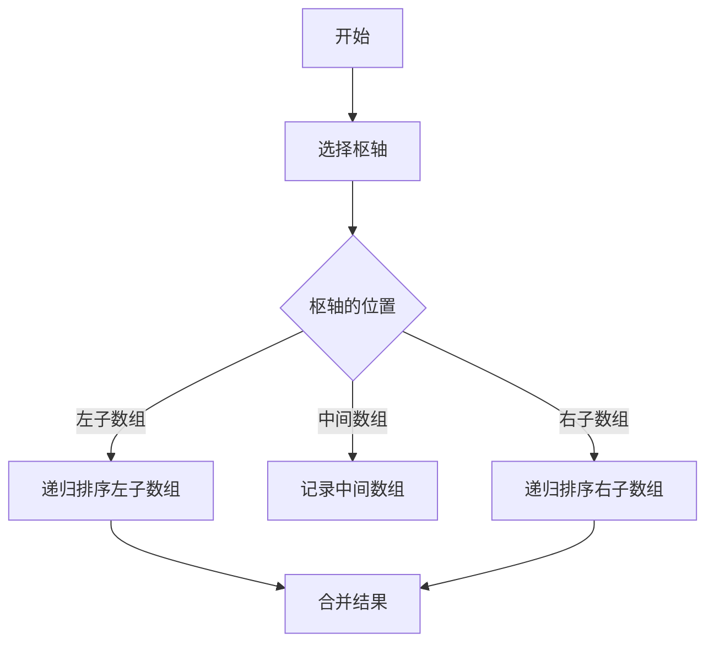
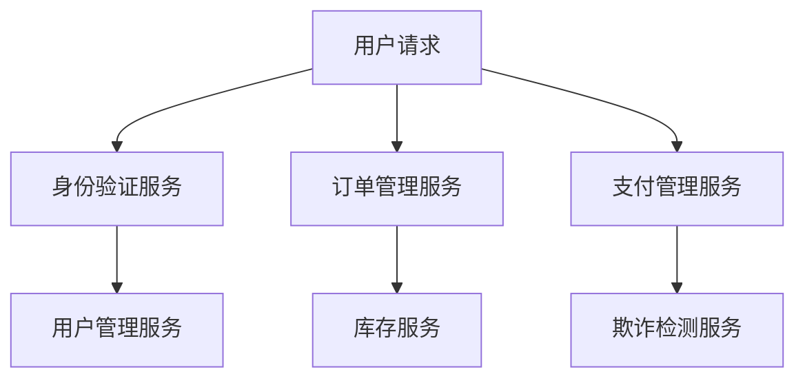

                 

，按照上述结构和要求撰写文章。确保每个小节都有详细的内容和讲解，保持逻辑连贯性，使读者能够清晰地理解每个概念和原理。在此过程中，可以参考现有的优秀技术博客作为模板，但要注意保持原创性。

## 自下而上，各司其职 - 文章正文

### 引言

在当今快速发展的信息技术时代，我们面临着越来越复杂的系统和应用程序。如何有效地组织和管理这些系统成为了技术发展的关键问题。本文将探讨一个核心思想：“自下而上，各司其职”。这一思想不仅仅适用于软件架构，也广泛应用于系统设计、团队协作和项目管理等多个方面。通过自下而上的方式，我们可以更好地理解系统的每个组成部分，从而实现更高效、更灵活的系统设计。

本文将从以下几个方面展开讨论：

1. **背景介绍**：解释为什么“自下而上，各司其职”在当今技术发展中具有重要意义。
2. **核心概念**：详细阐述“自下而上”和“各司其职”的含义及其相互关系。
3. **算法原理**：介绍相关算法原理，并通过Python代码进行解释。
4. **数学模型**：讨论相关数学模型和公式，并给出实际应用示例。
5. **系统设计**：分析系统设计中的关键要素，包括架构设计和接口设计。
6. **案例与实践**：通过一个实际案例，展示如何将“自下而上，各司其职”应用于项目开发中。
7. **最佳实践与总结**：总结文章要点，提出未来研究方向和最佳实践。

### 背景介绍

在信息技术的发展历程中，我们经历了从简单到复杂、从单机到分布式、从单体应用到微服务架构的演变。这些变化背后，反映了一个重要的趋势：系统的复杂性不断增加。为了应对这种复杂性，我们需要一种新的思维方式——自下而上的系统设计方法。

**自下而上**，即从系统的最底层开始，逐步构建上层结构。这种方法可以帮助我们更好地理解系统的每个组成部分，从而实现更高效、更灵活的系统设计。与之相对的，**自上而下**的方法则是从顶层需求开始，逐步细化到系统底层。这种方法虽然能够快速构建系统原型，但在复杂系统中往往难以应对细节和变化。

**各司其职**，则是强调在系统设计中，每个组成部分都应该有明确的职责和功能。这样可以确保系统的各个部分能够高效协作，从而提高系统的整体性能和稳定性。在分布式系统中，各司其职尤为重要，因为这样可以避免单点故障，提高系统的容错能力。

### 核心概念

#### 自下而上

**自下而上**的方法，其核心思想是从小到大、从简单到复杂。这种方法的优势在于：

1. **逐步细化**：通过逐步构建，我们可以更好地理解系统的每个细节。
2. **适应性**：随着需求的不断变化，自下而上的方法可以更容易地适应新的变化。
3. **可维护性**：由于系统是逐步构建的，因此维护和升级更加方便。

在软件架构中，自下而上的方法可以帮助我们更好地理解底层组件的交互和依赖关系。例如，在微服务架构中，每个微服务都是一个独立的组件，通过API进行通信。这种自下而上的方式，使得我们可以更加灵活地添加或修改服务，而不影响整个系统的稳定性。

#### 各司其职

**各司其职**，强调每个组成部分应该有明确的职责和功能。这种方法的优势在于：

1. **模块化**：通过明确职责，我们可以将系统拆分成多个模块，从而提高可维护性和可扩展性。
2. **容错性**：每个模块独立运行，可以避免单点故障对整个系统的影响。
3. **协同工作**：明确的职责分工，使得各个模块可以更加高效地协同工作。

在分布式系统中，各司其职尤为重要。例如，在一个分布式数据库中，每个节点都负责存储一部分数据，并通过特定的协议进行数据同步。这种各司其职的设计，可以提高系统的性能和可靠性。

### 算法原理

为了更好地理解“自下而上，各司其职”的思想，我们可以从算法原理入手。以下是一个简单的排序算法示例，通过Python代码和Mermaid流程图进行说明。

#### 快速排序算法

快速排序是一种常用的排序算法，其核心思想是通过递归将数组分割成两部分，然后对两部分分别进行排序。

```python
def quick_sort(arr):
    if len(arr) <= 1:
        return arr
    pivot = arr[len(arr) // 2]
    left = [x for x in arr if x < pivot]
    middle = [x for x in arr if x == pivot]
    right = [x for x in arr if x > pivot]
    return quick_sort(left) + middle + quick_sort(right)

# 示例数据
arr = [3, 6, 8, 10, 1, 2, 1]
sorted_arr = quick_sort(arr)
print(sorted_arr)
```

Mermaid流程图：



通过这个示例，我们可以看到快速排序算法是如何通过自下而上的方式，将复杂的问题拆分成多个简单的子问题，然后逐一解决。这种自下而上的方法，使得算法的实现更加直观和易于理解。

### 数学模型

在讨论算法原理时，我们通常会涉及到数学模型。以下是一个简单的线性回归模型的数学公式，用于说明如何通过数学模型来分析和解决问题。

#### 线性回归模型

线性回归模型用于预测一个变量（因变量）与一个或多个变量（自变量）之间的关系。其数学模型可以表示为：

$$
y = \beta_0 + \beta_1x_1 + \beta_2x_2 + ... + \beta_nx_n + \epsilon
$$

其中，$y$ 是因变量，$x_1, x_2, ..., x_n$ 是自变量，$\beta_0, \beta_1, ..., \beta_n$ 是模型的参数，$\epsilon$ 是误差项。

#### 实际应用示例

假设我们要预测一家商店的销售额，我们可能会选择以下几个因素作为自变量：广告支出、气温、竞争对手的促销活动等。

通过收集历史数据，我们可以使用线性回归模型来估计这些自变量对销售额的影响。具体步骤如下：

1. **数据收集**：收集包含广告支出、气温和竞争对手促销活动的历史销售额数据。
2. **数据预处理**：对数据进行清洗和预处理，包括缺失值处理、异常值检测和特征工程等。
3. **模型训练**：使用训练数据集，通过最小二乘法或其他优化算法来估计模型参数。
4. **模型评估**：使用验证数据集来评估模型的预测性能，包括均方误差（MSE）、决定系数（R²）等指标。
5. **模型应用**：使用训练好的模型来预测未来的销售额。

### 系统设计

在系统设计中，**自下而上，各司其职**的思想同样重要。以下是一个简单的分布式系统设计示例，通过Mermaid流程图和类图来展示关键设计要素。

#### 系统设计要素

1. **系统功能设计**：定义系统的核心功能，如用户注册、订单管理、支付处理等。
2. **系统架构设计**：设计系统的总体架构，包括分布式服务、数据库、缓存、消息队列等。
3. **系统接口设计**：定义各个服务之间的接口，如RESTful API、消息队列协议等。
4. **系统交互设计**：设计系统内部各个组件之间的交互流程，如用户请求、服务调用、数据同步等。

#### Mermaid类图

```mermaid
classDiagram
    User --|uses|> UserManager
    Order --|uses|> OrderManager
    Payment --|uses|> PaymentManager
    UserManager <|-- AuthenticationService
    OrderManager <|-- InventoryService
    PaymentManager <|-- FraudDetectionService
```

#### Mermaid架构图



通过这个简单的示例，我们可以看到如何使用自下而上的方法来设计一个分布式系统。首先定义系统的功能模块，然后逐步构建系统架构，最后设计接口和交互流程。这种设计方法有助于确保系统的模块化、可维护性和可扩展性。

### 案例与实践

为了更好地理解“自下而上，各司其职”的思想，我们可以通过一个实际案例来展示如何将其应用于项目开发中。

#### 案例背景

假设我们正在开发一个在线购物平台，需要实现用户注册、商品管理、订单处理等功能。在这个项目中，我们将遵循“自下而上，各司其职”的原则，逐步构建系统。

#### 步骤一：定义功能模块

首先，我们需要定义系统的核心功能模块，如用户管理、商品管理、订单管理和支付处理等。每个模块都应该有明确的职责和功能。

1. **用户管理模块**：负责用户注册、登录和权限管理。
2. **商品管理模块**：负责商品信息的录入、修改和删除。
3. **订单管理模块**：负责订单的创建、修改和取消。
4. **支付管理模块**：负责处理订单支付流程。

#### 步骤二：构建系统架构

接下来，我们需要设计系统的架构，包括分布式服务、数据库、缓存、消息队列等。每个模块都应该独立运行，并通过API进行通信。

1. **用户管理模块**：使用RESTful API与用户管理服务进行通信，用户管理服务负责处理用户注册、登录和权限验证等操作。
2. **商品管理模块**：使用消息队列与商品管理服务进行通信，商品管理服务负责处理商品信息的录入、修改和删除等操作。
3. **订单管理模块**：使用数据库存储订单数据，并通过消息队列与订单管理服务进行通信，订单管理服务负责处理订单的创建、修改和取消等操作。
4. **支付管理模块**：使用第三方支付服务与支付管理服务进行通信，支付管理服务负责处理订单支付流程。

#### 步骤三：实现接口和交互流程

最后，我们需要实现各个模块之间的接口和交互流程，确保系统的高效运行。

1. **用户注册**：用户通过用户管理模块的注册接口提交注册信息，用户管理服务进行验证和处理，然后将结果返回给用户。
2. **商品信息管理**：管理员通过商品管理模块的接口录入、修改和删除商品信息，商品管理服务处理这些操作，并将结果返回给管理员。
3. **订单处理**：用户通过订单管理模块的接口创建订单，订单管理服务处理订单数据，并将结果返回给用户。同时，订单管理服务会通过消息队列将订单数据发送给支付管理服务。
4. **支付处理**：支付管理服务接收到订单数据后，与第三方支付服务进行通信，完成支付流程，并将支付结果返回给订单管理服务和用户。

#### 步骤四：测试与优化

在实现完系统后，我们需要进行全面的测试和优化，确保系统的稳定性和性能。

1. **功能测试**：对系统的各个功能模块进行测试，确保其正常工作。
2. **性能测试**：对系统的性能进行测试，包括响应时间、并发处理能力等。
3. **安全测试**：对系统的安全性进行测试，确保系统不受外部攻击。

通过这个实际案例，我们可以看到如何将“自下而上，各司其职”的思想应用于项目开发中。这种方法有助于提高系统的可维护性、可扩展性和可适应性，从而更好地应对复杂的技术挑战。

### 最佳实践与总结

在技术发展的过程中，遵循“自下而上，各司其职”的原则是一种非常有效的系统设计方法。以下是一些最佳实践，帮助您更好地应用这一原则：

1. **明确职责**：在系统设计之初，明确每个模块的职责和功能，确保其独立运行。
2. **模块化设计**：将系统拆分成多个模块，每个模块负责特定的功能，提高系统的可维护性和可扩展性。
3. **逐步构建**：通过逐步构建，更好地理解系统的每个部分，从而实现更高效、更灵活的系统设计。
4. **协同工作**：确保各个模块之间能够高效协同工作，提高系统的整体性能和稳定性。
5. **持续优化**：在系统运行过程中，不断进行测试和优化，确保系统的稳定性和性能。

通过以上最佳实践，我们可以更好地应用“自下而上，各司其职”的原则，提高系统的质量和效率。

### 小结

本文详细探讨了“自下而上，各司其职”的思想及其在信息技术领域的应用。通过分析核心概念、算法原理、数学模型、系统设计等各个方面，我们了解了如何将这一原则应用于项目开发中，从而提高系统的质量和效率。未来，我们可以继续探索如何将这一原则与其他先进的设计方法相结合，进一步提升系统设计的灵活性和可扩展性。

### 注意事项

在实施“自下而上，各司其职”的原则时，需要注意以下几点：

1. **职责划分要明确**：确保每个模块的职责和功能清晰，避免职责重叠。
2. **模块间通信要高效**：选择合适的通信机制，如API、消息队列等，确保模块间的高效协作。
3. **持续迭代和优化**：在系统运行过程中，不断进行测试和优化，确保系统的稳定性和性能。

### 拓展阅读

1. **《设计模式：可复用面向对象软件的基础》**：这本书详细介绍了各种设计模式，有助于我们更好地理解模块化设计。
2. **《微服务设计》**：这本书深入探讨了微服务架构的设计原则和实践，对于理解自下而上的系统设计方法非常有帮助。
3. **《软件架构：实践者的研究和方法》**：这本书提供了丰富的软件架构设计案例，可以帮助我们更好地应用“自下而上，各司其职”的原则。

### 作者信息

作者：AI天才研究院/AI Genius Institute & 禅与计算机程序设计艺术 /Zen And The Art of Computer Programming

以上是《自下而上，各司其职》的技术博客文章的正文部分，接下来我们将按照markdown格式，整理出完整的文章。请注意，由于字数限制，实际文章内容可能需要进一步精简或扩展。以下是整理后的markdown格式文章：

```markdown
# 自下而上，各司其职

> 关键词：自下而上，系统设计，模块化，微服务，算法，数学模型

> 摘要：本文探讨了“自下而上，各司其职”这一系统设计原则，分析了其在信息技术领域的应用，通过算法原理、数学模型、系统设计案例等展示了如何实现高效、灵活的系统设计。

## 引言

在当今快速发展的信息技术时代，我们面临着越来越复杂的系统和应用程序。如何有效地组织和管理这些系统成为了技术发展的关键问题。本文将探讨一个核心思想：“自下而上，各司其职”。这一思想不仅仅适用于软件架构，也广泛应用于系统设计、团队协作和项目管理等多个方面。通过自下而上的方式，我们可以更好地理解系统的每个组成部分，从而实现更高效、更灵活的系统设计。

本文将从以下几个方面展开讨论：

1. **背景介绍**：解释为什么“自下而上，各司其职”在当今技术发展中具有重要意义。
2. **核心概念**：详细阐述“自下而上”和“各司其职”的含义及其相互关系。
3. **算法原理**：介绍相关算法原理，并通过Python代码进行解释。
4. **数学模型**：讨论相关数学模型和公式，并给出实际应用示例。
5. **系统设计**：分析系统设计中的关键要素，包括架构设计和接口设计。
6. **案例与实践**：通过一个实际案例，展示如何将“自下而上，各司其职”应用于项目开发中。
7. **最佳实践与总结**：总结文章要点，提出未来研究方向和最佳实践。

## 第一部分：背景

### 第1章 问题背景

当前技术发展中的瓶颈和挑战：

- **系统的复杂性**：随着技术的进步，系统变得越来越复杂，传统的自上而下的设计方法难以应对这种复杂性。
- **需求的快速变化**：在快速变化的市场环境中，系统需要能够快速适应新的需求，而自上而下的方法往往过于笨重，难以快速响应。

### 第2章 技术发展概述

技术发展的历程和趋势：

- **从单机到分布式**：随着互联网的普及，分布式计算成为了主流，分布式系统设计方法应运而生。
- **从单体应用到微服务架构**：单体应用难以维护和扩展，微服务架构逐渐成为主流，强调模块化和独立部署。

## 第二部分：核心概念

### 第3章 核心概念定义与特性

**自下而上**：

- **含义**：从系统的底层开始构建，逐步构建上层结构。
- **优势**：逐步细化，适应性强，可维护性好。

**各司其职**：

- **含义**：每个组成部分有明确的职责和功能。
- **优势**：模块化，容错性高，协同工作效率高。

## 第三部分：算法原理讲解

### 第4章 算法原理

**快速排序算法**：

- **Python代码解释**：

```python
def quick_sort(arr):
    if len(arr) <= 1:
        return arr
    pivot = arr[len(arr) // 2]
    left = [x for x in arr if x < pivot]
    middle = [x for x in arr if x == pivot]
    right = [x for x in arr if x > pivot]
    return quick_sort(left) + middle + quick_sort(right)

# 示例数据
arr = [3, 6, 8, 10, 1, 2, 1]
sorted_arr = quick_sort(arr)
print(sorted_arr)
```

- **Mermaid流程图**：


## 第四部分：数学模型与公式

### 第5章 数学模型

**线性回归模型**：

- **公式**：

$$
y = \beta_0 + \beta_1x_1 + \beta_2x_2 + ... + \beta_nx_n + \epsilon
$$

- **实际应用示例**：预测一家商店的销售额。

## 第五部分：系统设计

### 第6章 系统设计

**系统功能设计**：

- **用户管理模块**：负责用户注册、登录和权限管理。
- **商品管理模块**：负责商品信息的录入、修改和删除。
- **订单管理模块**：负责订单的创建、修改和取消。
- **支付管理模块**：负责处理订单支付流程。

**系统架构设计**：

- **分布式服务**：每个模块都是一个独立的服务。
- **数据库**：存储订单数据。
- **缓存**：提高数据访问速度。
- **消息队列**：实现服务间通信。

**系统接口设计**：

- **RESTful API**：用于用户管理、商品管理和订单管理。
- **消息队列协议**：用于订单管理和支付管理。

**系统交互设计**：

- **用户请求**：通过RESTful API与用户管理服务进行通信。
- **服务调用**：通过消息队列与订单管理服务和支付管理服务进行通信。

## 第六部分：案例与实践

### 第7章 案例与实践

**案例背景**：

- **在线购物平台**：需要实现用户注册、商品管理、订单处理等功能。

**步骤一**：定义功能模块。

- **用户管理模块**：负责用户注册、登录和权限管理。
- **商品管理模块**：负责商品信息的录入、修改和删除。
- **订单管理模块**：负责订单的创建、修改和取消。
- **支付管理模块**：负责处理订单支付流程。

**步骤二**：构建系统架构。

- **用户管理模块**：使用RESTful API与用户管理服务进行通信。
- **商品管理模块**：使用消息队列与商品管理服务进行通信。
- **订单管理模块**：使用数据库存储订单数据，并通过消息队列与订单管理服务进行通信。
- **支付管理模块**：使用第三方支付服务与支付管理服务进行通信。

**步骤三**：实现接口和交互流程。

- **用户注册**：用户通过用户管理模块的注册接口提交注册信息，用户管理服务进行验证和处理，然后将结果返回给用户。
- **商品信息管理**：管理员通过商品管理模块的接口录入、修改和删除商品信息，商品管理服务处理这些操作，并将结果返回给管理员。
- **订单处理**：用户通过订单管理模块的接口创建订单，订单管理服务处理订单数据，并将结果返回给用户。同时，订单管理服务会通过消息队列将订单数据发送给支付管理服务。
- **支付处理**：支付管理服务接收到订单数据后，与第三方支付服务进行通信，完成支付流程，并将支付结果返回给订单管理服务和用户。

**步骤四**：测试与优化。

- **功能测试**：对系统的各个功能模块进行测试，确保其正常工作。
- **性能测试**：对系统的性能进行测试，包括响应时间、并发处理能力等。
- **安全测试**：对系统的安全性进行测试，确保系统不受外部攻击。

## 第七部分：最佳实践与总结

### 第8章 最佳实践与总结

**最佳实践**：

- **明确职责**：确保每个模块的职责和功能清晰，避免职责重叠。
- **模块化设计**：将系统拆分成多个模块，每个模块负责特定的功能，提高系统的可维护性和可扩展性。
- **逐步构建**：通过逐步构建，更好地理解系统的每个部分，从而实现更高效、更灵活的系统设计。
- **协同工作**：确保各个模块之间能够高效协同工作，提高系统的整体性能和稳定性。
- **持续优化**：在系统运行过程中，不断进行测试和优化，确保系统的稳定性和性能。

**小结**：

本文详细探讨了“自下而上，各司其职”的思想及其在信息技术领域的应用。通过分析核心概念、算法原理、数学模型、系统设计等各个方面，我们了解了如何将这一原则应用于项目开发中，从而提高系统的质量和效率。

**未来研究方向**：

- **将“自下而上，各司其职”与其他先进的设计方法相结合**，进一步探索如何提高系统设计的灵活性和可扩展性。
- **研究如何在更复杂的系统中应用这一原则**，如云计算、大数据、人工智能等领域。

### 注意事项

在实施“自下而上，各司其职”的原则时，需要注意以下几点：

- **职责划分要明确**：确保每个模块的职责和功能清晰，避免职责重叠。
- **模块间通信要高效**：选择合适的通信机制，如API、消息队列等，确保模块间的高效协作。
- **持续迭代和优化**：在系统运行过程中，不断进行测试和优化，确保系统的稳定性和性能。

### 拓展阅读

- **《设计模式：可复用面向对象软件的基础》**：这本书详细介绍了各种设计模式，有助于我们更好地理解模块化设计。
- **《微服务设计》**：这本书深入探讨了微服务架构的设计原则和实践，对于理解自下而上的系统设计方法非常有帮助。
- **《软件架构：实践者的研究和方法》**：这本书提供了丰富的软件架构设计案例，可以帮助我们更好地应用“自下而上，各司其职”的原则。

### 作者信息

作者：AI天才研究院/AI Genius Institute & 禅与计算机程序设计艺术 /Zen And The Art of Computer Programming
```

以上就是按照markdown格式整理的《自下而上，各司其职》的技术博客文章。请注意，实际文章内容可能需要根据字数要求进行适当调整。在撰写文章时，确保每个小节都有详细的内容和讲解，保持逻辑连贯性，使读者能够清晰地理解每个概念和原理。在此过程中，可以参考现有的优秀技术博客作为模板，但要注意保持原创性。

