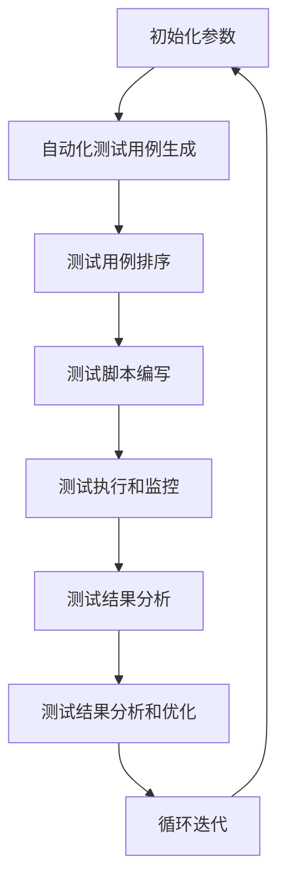
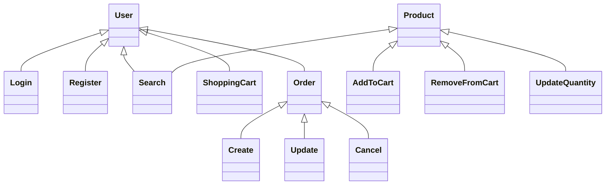
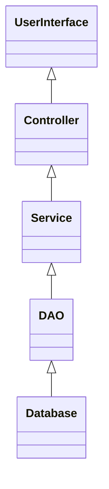

                 


### 第1章：自动化测试的背景与重要性

#### 1.1 自动化测试的定义与历史

自动化测试是指通过编写脚本或使用工具来自动执行测试用例的过程。相比于传统的手工测试，自动化测试可以提高测试的效率和准确性。自动化测试的历史可以追溯到20世纪70年代，当时软件开发人员开始意识到手动测试的局限性。随着计算机技术和编程语言的不断发展，自动化测试逐渐成为一种主流的测试方法。

#### 1.1.1 自动化测试的起源

最早的自动化测试可以追溯到20世纪70年代的软件开发生命周期（SDLC）早期阶段。在这个时期，软件开发人员开始尝试使用批处理脚本来自动执行一些重复性的任务，如生成测试数据、运行测试用例等。这些早期尝试为自动化测试的发展奠定了基础。

#### 1.1.2 自动化测试的发展历程

随着时间的推移，自动化测试工具和框架不断涌现。20世纪80年代，出现了一些早期的自动化测试工具，如QARun和WinRunner。这些工具主要侧重于功能测试。进入90年代，随着Web应用的普及，自动化测试开始向Web领域扩展。同时，测试框架如JUnit和NUnit的兴起，使得自动化测试变得更加普及和易用。

#### 1.1.3 自动化测试的现状与未来趋势

目前，自动化测试已成为软件开发过程中不可或缺的一部分。随着人工智能和机器学习技术的发展，自动化测试也在不断进化。未来的自动化测试将更加智能化，能够根据代码变化自动生成测试用例，甚至预测潜在的问题。

### 1.2 自动化测试的目的与好处

自动化测试的主要目的是提高软件的质量和可靠性，同时降低测试成本。通过自动化测试，可以实现以下好处：

#### 1.2.1 提高测试效率

自动化测试可以大大减少执行测试用例所需的时间。测试脚本一旦编写完成，就可以反复运行，从而节省大量人力和时间。

#### 1.2.2 提高测试覆盖率

自动化测试有助于覆盖更多的测试场景，从而提高测试覆盖率。这意味着更多的代码和功能得到验证，降低了潜在的错误率。

#### 1.2.3 降低人力成本

自动化测试可以减少对人工测试人员的需求，从而降低人力成本。同时，测试脚本可以跨多个项目和团队共享，提高了资源的利用率。

### 1.3 自动化测试的类型

自动化测试可以按照不同的维度进行分类，以下是几种常见的自动化测试类型：

#### 1.3.1 功能性测试

功能性测试是验证软件功能是否按预期工作的过程。这通常涉及测试用户界面、业务逻辑等。

#### 1.3.2 非功能性测试

非功能性测试关注软件的稳定性、性能、安全性等方面。例如，性能测试、负载测试和安全性测试。

#### 1.3.3 单元测试

单元测试是针对软件中最小的可测试单元（通常是函数或方法）进行的测试。单元测试有助于确保代码的各个部分正常工作。

#### 1.3.4 集成测试

集成测试是在将不同的模块或组件组合在一起后进行的测试。其目的是验证它们之间的交互是否正确。

#### 1.3.5 系统测试

系统测试是对整个软件系统进行的测试，以确保系统满足所有需求和规格。

### 1.4 自动化测试工具

自动化测试工具是执行自动化测试的核心。以下是一些常用的自动化测试工具：

#### 1.4.1 Selenium

Selenium是一个开源的自动化测试工具，主要用于Web应用的功能测试。它可以支持多种编程语言，如Java、Python和C#。

#### 1.4.2 JUnit

JUnit是一个流行的单元测试框架，用于Java应用程序的测试。它提供了丰富的测试功能和断言库。

#### 1.4.3 TestNG

TestNG是一个开源的测试框架，用于Java应用程序的测试。它提供了比JUnit更强大的功能，支持数据驱动测试和参数化测试。

#### 1.4.4 Appium

Appium是一个开源的自动化测试工具，用于移动应用的功能测试。它可以支持多种操作系统和编程语言。

### 1.5 自动化测试策略设计

自动化测试策略是指为了实现自动化测试目标而制定的一系列计划和步骤。一个良好的自动化测试策略应该考虑以下几个方面：

#### 1.5.1 自动化测试需求分析

在开始自动化测试之前，需要分析自动化测试的需求。这包括确定哪些测试用例适合自动化，以及自动化测试的目标和范围。

#### 1.5.2 自动化测试资源评估

自动化测试需要合适的人力、物力和财力资源。在制定自动化测试策略时，需要评估现有资源的状况，并确定是否需要额外的资源。

#### 1.5.3 自动化测试计划制定

自动化测试计划应详细描述自动化测试的目标、范围、方法和时间表。它应该包括自动化测试的里程碑、任务分配、资源需求和风险分析。

### 1.6 自动化测试流程管理

自动化测试流程管理是指对自动化测试过程进行有效管理和监督的过程。以下是一些自动化测试流程管理的关键点：

#### 1.6.1 自动化测试流程概述

自动化测试流程通常包括以下几个步骤：测试计划、测试设计、测试执行、测试结果分析和测试报告。

#### 1.6.2 自动化测试管理工具

自动化测试管理工具可以帮助自动化测试团队更好地管理测试流程。常用的自动化测试管理工具有Jenkins、Bamboo和GitLab CI/CD等。

#### 1.6.3 自动化测试过程监控

自动化测试过程监控包括测试执行过程中的状态监控、测试结果分析和测试流程优化。通过监控，可以及时发现和解决问题，提高自动化测试的效率和质量。

### 1.7 自动化测试的核心挑战

尽管自动化测试带来了许多好处，但实施过程中也面临一些挑战。以下是一些常见的自动化测试核心挑战：

#### 1.7.1 测试用例设计

设计高质量的测试用例是自动化测试的关键。测试用例需要覆盖各种可能的输入和场景，以确保软件的可靠性和稳定性。

#### 1.7.2 测试脚本维护

自动化测试脚本需要定期维护和更新，以适应软件的变更和新的测试需求。这需要测试团队具备一定的编程能力和维护意识。

#### 1.7.3 测试环境管理

自动化测试需要稳定的测试环境，包括硬件、软件和网络配置等。测试环境的管理和维护是自动化测试成功的关键。

#### 1.7.4 测试数据管理

测试数据管理是自动化测试的重要组成部分。测试数据需要存储、更新和维护，以确保测试用例的有效性和准确性。

### 1.8 自动化测试的最佳实践

为了实现高效的自动化测试，测试团队可以遵循以下最佳实践：

#### 1.8.1 从早期开始自动化

尽早开始自动化测试可以降低测试的复杂性，提高测试的覆盖率。

#### 1.8.2 测试用例优先级管理

合理分配测试用例的优先级，确保关键功能和常见场景的测试优先执行。

#### 1.8.3 测试脚本可维护性

编写可维护的测试脚本，使用清晰的命名规范和注释，便于后续维护和更新。

#### 1.8.4 测试环境隔离

确保测试环境与其他环境隔离，避免测试过程中引入外部干扰。

#### 1.8.5 测试结果分析

定期分析测试结果，发现潜在的问题，并采取措施进行优化。

### 1.9 本章小结

本章介绍了自动化测试的背景、重要性、类型、工具、策略设计、流程管理和核心挑战。通过本章的学习，读者可以了解自动化测试的基本概念和实施方法，为后续章节的学习打下基础。

关键词：自动化测试、测试覆盖率、测试效率、测试工具、测试策略

摘要：本文详细介绍了自动化测试的背景、重要性、类型、工具、策略设计、流程管理和核心挑战，旨在帮助读者全面了解自动化测试的基本概念和实践方法。

----------------------------------------------------------------

### 第2章：自动化测试的核心概念

#### 2.1 自动化测试类型

自动化测试可以根据测试的对象和目标进行分类。以下是几种常见的自动化测试类型：

##### 2.1.1 功能性测试

功能性测试是验证软件功能是否符合需求的过程。它通常包括用户界面测试、业务逻辑测试、数据输入测试等。功能性测试的目标是确保软件能够按照预期的方式运行。

##### 2.1.2 非功能性测试

非功能性测试关注软件的稳定性、性能、安全性等方面。它包括性能测试、负载测试、安全性测试等。非功能性测试的目标是确保软件在各种环境下都能稳定运行，并且能够满足性能和安全要求。

##### 2.1.3 单元测试

单元测试是针对软件中的最小可测试单元（通常是函数或方法）进行的测试。它的目标是验证单元内部的逻辑是否正确，以及单元之间的交互是否正常。

##### 2.1.4 集成测试

集成测试是在将不同的模块或组件组合在一起后进行的测试。它的目标是验证模块之间的交互是否正确，以及整个系统的功能是否正常。

##### 2.1.5 系统测试

系统测试是对整个软件系统进行的测试。它的目标是验证系统是否符合需求，并且能够在各种环境下正常运行。

#### 2.2 自动化测试工具

自动化测试工具是执行自动化测试的核心。以下是一些常用的自动化测试工具：

##### 2.2.1 Selenium

Selenium是一个开源的自动化测试工具，主要用于Web应用的功能测试。它可以支持多种编程语言，如Java、Python和C#。Selenium提供了丰富的API，可以模拟用户的操作，如点击、输入和导航。

##### 2.2.2 JUnit

JUnit是一个开源的单元测试框架，主要用于Java应用程序的测试。它提供了丰富的测试功能和断言库。JUnit可以与各种IDE集成，使得单元测试更加方便。

##### 2.2.3 TestNG

TestNG是一个开源的测试框架，主要用于Java应用程序的测试。它提供了比JUnit更强大的功能，支持数据驱动测试和参数化测试。TestNG还支持依赖测试，使得测试更加灵活。

##### 2.2.4 Appium

Appium是一个开源的自动化测试工具，主要用于移动应用的功能测试。它可以支持多种操作系统和编程语言。Appium通过模拟用户的操作来验证移动应用的功能。

#### 2.3 自动化测试策略设计

自动化测试策略设计是自动化测试的关键步骤。以下是一些设计自动化测试策略的步骤：

##### 2.3.1 自动化测试需求分析

在开始自动化测试之前，需要分析自动化测试的需求。这包括确定哪些测试用例适合自动化，以及自动化测试的目标和范围。

##### 2.3.2 自动化测试资源评估

自动化测试需要合适的人力、物力和财力资源。在制定自动化测试策略时，需要评估现有资源的状况，并确定是否需要额外的资源。

##### 2.3.3 自动化测试计划制定

自动化测试计划应详细描述自动化测试的目标、范围、方法和时间表。它应该包括自动化测试的里程碑、任务分配、资源需求和风险分析。

##### 2.3.4 自动化测试流程管理

自动化测试流程管理是指对自动化测试过程进行有效管理和监督的过程。它包括测试计划、测试设计、测试执行、测试结果分析和测试报告。

##### 2.3.5 自动化测试评估

自动化测试评估是评估自动化测试效果的过程。它可以帮助测试团队了解自动化测试的效率和效果，并为后续的自动化测试提供反馈。

#### 2.4 自动化测试的优势

自动化测试相比手工测试有许多优势，包括：

##### 2.4.1 提高测试效率

自动化测试可以大大减少执行测试用例所需的时间。测试脚本一旦编写完成，就可以反复运行，从而节省大量人力和时间。

##### 2.4.2 提高测试覆盖率

自动化测试有助于覆盖更多的测试场景，从而提高测试覆盖率。这意味着更多的代码和功能得到验证，降低了潜在的错误率。

##### 2.4.3 降低人力成本

自动化测试可以减少对人工测试人员的需求，从而降低人力成本。同时，测试脚本可以跨多个项目和团队共享，提高了资源的利用率。

##### 2.4.4 提高测试准确性

自动化测试可以减少人为错误，提高测试准确性。自动化测试脚本可以精确地模拟用户的操作，确保测试结果的一致性。

#### 2.5 自动化测试的挑战

尽管自动化测试有许多优势，但在实施过程中也面临一些挑战：

##### 2.5.1 测试用例设计

设计高质量的测试用例是自动化测试的关键。测试用例需要覆盖各种可能的输入和场景，以确保软件的可靠性和稳定性。

##### 2.5.2 测试脚本维护

自动化测试脚本需要定期维护和更新，以适应软件的变更和新的测试需求。这需要测试团队具备一定的编程能力和维护意识。

##### 2.5.3 测试环境管理

自动化测试需要稳定的测试环境，包括硬件、软件和网络配置等。测试环境的管理和维护是自动化测试成功的关键。

##### 2.5.4 测试数据管理

测试数据管理是自动化测试的重要组成部分。测试数据需要存储、更新和维护，以确保测试用例的有效性和准确性。

#### 2.6 自动化测试的最佳实践

为了实现高效的自动化测试，测试团队可以遵循以下最佳实践：

##### 2.6.1 从早期开始自动化

尽早开始自动化测试可以降低测试的复杂性，提高测试的覆盖率。

##### 2.6.2 测试用例优先级管理

合理分配测试用例的优先级，确保关键功能和常见场景的测试优先执行。

##### 2.6.3 测试脚本可维护性

编写可维护的测试脚本，使用清晰的命名规范和注释，便于后续维护和更新。

##### 2.6.4 测试环境隔离

确保测试环境与其他环境隔离，避免测试过程中引入外部干扰。

##### 2.6.5 测试结果分析

定期分析测试结果，发现潜在的问题，并采取措施进行优化。

#### 2.7 本章小结

本章介绍了自动化测试的类型、工具、策略设计、优势、挑战和最佳实践。通过本章的学习，读者可以全面了解自动化测试的核心概念和实施方法。

关键词：自动化测试、测试类型、测试工具、测试策略、测试优势、测试挑战、测试最佳实践

摘要：本文详细介绍了自动化测试的核心概念，包括测试类型、工具、策略设计、优势、挑战和最佳实践，旨在帮助读者全面了解自动化测试的基本概念和实践方法。

----------------------------------------------------------------

### 第3章：自动化测试策略设计

#### 3.1 自动化测试策略概述

自动化测试策略是指为了实现自动化测试目标而制定的一系列计划和步骤。一个有效的自动化测试策略可以帮助测试团队提高测试效率和质量，确保软件产品的可靠性。以下是自动化测试策略设计的关键步骤：

##### 3.1.1 自动化测试需求分析

在制定自动化测试策略之前，需要深入分析自动化测试的需求。这包括确定哪些测试用例适合自动化，哪些测试场景需要重点关注，以及自动化测试的目标和范围。自动化测试需求分析可以帮助测试团队明确自动化测试的重点和优先级。

##### 3.1.2 自动化测试资源评估

自动化测试需要合适的人力、物力和财力资源。在制定自动化测试策略时，需要评估现有资源的状况，包括测试人员的技术能力、测试工具和硬件设施等。如果资源不足，需要考虑是否需要招聘新的测试人员或增加测试设备。

##### 3.1.3 自动化测试计划制定

自动化测试计划是自动化测试策略的核心组成部分，它应详细描述自动化测试的目标、范围、方法和时间表。自动化测试计划应包括以下内容：

- 自动化测试的目标和预期成果
- 自动化测试的范围和覆盖范围
- 自动化测试的工具和框架选择
- 自动化测试的流程和步骤
- 自动化测试的里程碑和时间表
- 自动化测试的任务分配和责任人
- 自动化测试的风险评估和管理

##### 3.1.4 自动化测试评估和优化

自动化测试评估是评估自动化测试效果的过程。它可以帮助测试团队了解自动化测试的效率和效果，并根据评估结果对自动化测试策略进行优化。自动化测试评估可以包括以下方面：

- 测试覆盖率：评估自动化测试覆盖了哪些测试场景和功能，是否达到了预期目标。
- 测试效率：评估自动化测试的执行速度和效率，与手工测试相比是否有显著提升。
- 测试质量：评估自动化测试的结果和质量，是否能够发现潜在的问题。
- 资源利用率：评估自动化测试资源的使用情况，是否达到了预期的资源利用率。

#### 3.2 自动化测试策略的重要性

自动化测试策略的重要性体现在以下几个方面：

##### 3.2.1 提高测试效率

通过制定合理的自动化测试策略，可以优化测试流程，减少手工测试的工作量，提高测试效率。自动化测试可以在短时间内执行大量的测试用例，从而缩短测试周期，提高软件交付速度。

##### 3.2.2 提高测试覆盖率

自动化测试策略可以帮助测试团队识别关键测试场景和功能，确保测试覆盖率。通过自动化测试策略的制定和实施，可以覆盖更多的测试场景和功能，降低潜在的错误率。

##### 3.2.3 降低测试成本

自动化测试可以减少对人工测试人员的需求，从而降低测试成本。同时，自动化测试工具和脚本可以跨多个项目和团队共享，提高了资源的利用率，进一步降低了测试成本。

##### 3.2.4 提高软件质量

自动化测试策略可以确保软件在开发和测试过程中保持高质量。通过自动化测试策略的实施，可以及时发现和修复问题，提高软件的稳定性和可靠性。

#### 3.3 自动化测试策略的制定原则

在制定自动化测试策略时，应遵循以下原则：

##### 3.3.1 全面的需求分析

深入分析自动化测试的需求，确保自动化测试策略能够覆盖关键测试场景和功能。

##### 3.3.2 适当的工具和框架选择

选择适合项目需求的自动化测试工具和框架，确保自动化测试的有效性和可维护性。

##### 3.3.3 优化的测试流程

设计合理的自动化测试流程，确保测试过程的可管理性和可重复性。

##### 3.3.4 资源合理分配

合理分配测试资源，确保自动化测试策略的实施有足够的人力、物力和财力支持。

##### 3.3.5 持续的评估和优化

定期评估自动化测试效果，并根据评估结果对自动化测试策略进行优化，确保测试效率和质量。

#### 3.4 自动化测试策略的实施步骤

在制定自动化测试策略后，需要将其转化为具体的实施步骤，以确保自动化测试策略的有效执行。以下是自动化测试策略的实施步骤：

##### 3.4.1 制定详细计划

根据自动化测试策略，制定详细的自动化测试计划，包括测试用例设计、测试执行、测试结果分析等。

##### 3.4.2 设计测试用例

根据自动化测试计划，设计具体的测试用例，确保测试用例能够覆盖关键测试场景和功能。

##### 3.4.3 编写测试脚本

根据测试用例，编写自动化测试脚本，确保测试脚本能够准确地模拟用户的操作，并生成测试报告。

##### 3.4.4 执行自动化测试

按照自动化测试计划，执行自动化测试，并监控测试过程，确保测试结果的准确性。

##### 3.4.5 分析测试结果

对自动化测试结果进行分析，发现潜在的问题，并采取措施进行修复。

##### 3.4.6 优化自动化测试策略

根据测试结果和评估，对自动化测试策略进行优化，提高测试效率和质量。

#### 3.5 自动化测试策略的案例分享

以下是一个自动化测试策略的案例分享：

##### 案例背景

某公司开发了一个电子商务网站，为了确保网站的功能和质量，公司决定实施自动化测试。

##### 自动化测试策略

1. 自动化测试需求分析：确定网站的关键功能、用户场景和测试重点。

2. 自动化测试资源评估：评估现有测试人员和测试工具的配备情况。

3. 自动化测试计划制定：包括测试用例设计、测试脚本编写、测试执行和测试结果分析。

4. 自动化测试评估和优化：定期评估自动化测试效果，根据评估结果对自动化测试策略进行优化。

##### 实施效果

通过实施自动化测试策略，公司提高了测试效率，缩短了测试周期，并降低了测试成本。同时，自动化测试策略确保了网站功能的稳定性和可靠性，提高了用户满意度。

##### 本章小结

本章介绍了自动化测试策略的设计原则、实施步骤和案例分析。通过本章的学习，读者可以了解如何制定和实施有效的自动化测试策略，提高测试效率和质量。

关键词：自动化测试策略、自动化测试需求分析、自动化测试资源评估、自动化测试计划、自动化测试评估、自动化测试案例

摘要：本文详细介绍了自动化测试策略的设计原则、实施步骤和案例分析，旨在帮助读者全面了解自动化测试策略的制定和实施方法。

----------------------------------------------------------------

### 第4章：自动化测试流程管理

#### 4.1 自动化测试流程概述

自动化测试流程是指从测试计划到测试执行，再到测试结果分析的一系列有序步骤。一个有效的自动化测试流程可以帮助测试团队提高测试效率和质量，确保软件产品的高可靠性。以下是自动化测试流程的基本步骤：

1. **测试计划**：根据软件需求和项目进度，制定自动化测试计划，明确测试目标、范围、方法和时间表。

2. **测试设计**：设计自动化测试用例，包括测试场景、测试数据和测试步骤。

3. **测试脚本编写**：根据测试用例，编写自动化测试脚本，确保测试脚本能够准确地模拟用户的操作，并生成测试报告。

4. **测试执行**：按照自动化测试计划，执行自动化测试脚本，监控测试过程，确保测试结果的准确性。

5. **测试结果分析**：对自动化测试结果进行分析，发现潜在的问题，并采取措施进行修复。

6. **测试报告生成**：根据测试结果，生成详细的测试报告，包括测试覆盖情况、发现的问题和修复情况。

7. **测试流程优化**：根据测试结果和评估，对自动化测试流程进行优化，提高测试效率和质量。

#### 4.2 自动化测试管理工具

自动化测试管理工具可以帮助测试团队更好地管理自动化测试流程。以下是一些常用的自动化测试管理工具：

1. **Jenkins**：Jenkins是一个开源的自动化测试工具，主要用于构建、部署和测试。它可以与各种CI/CD工具集成，实现自动化测试流程的自动化管理。

2. **Bamboo**：Bamboo是Atlassian公司的一款CI/CD工具，主要用于自动化构建、测试和部署。它支持多种编程语言和测试框架，可以与GitLab等版本控制系统集成。

3. **GitLab CI/CD**：GitLab CI/CD是GitLab内置的持续集成和持续部署工具。它可以自动化构建、测试和部署过程，支持多种编程语言和测试框架。

#### 4.3 自动化测试过程监控

自动化测试过程监控是确保自动化测试流程顺利进行的重要环节。以下是一些自动化测试过程监控的关键点：

1. **测试进度监控**：实时监控自动化测试的执行进度，确保测试任务按时完成。

2. **测试结果监控**：监控自动化测试的结果，及时发现测试失败或异常情况，并采取措施进行修复。

3. **测试环境监控**：确保自动化测试环境的稳定性和可靠性，包括硬件、软件和网络配置等。

4. **测试报告监控**：定期生成测试报告，分析测试结果，评估测试效率和质量。

#### 4.4 自动化测试的挑战和解决方案

在实施自动化测试过程中，测试团队可能会遇到一些挑战。以下是一些常见的挑战和解决方案：

1. **测试脚本维护**：自动化测试脚本需要定期维护和更新，以适应软件的变更和新的测试需求。解决方案：建立脚本维护规范，确保脚本的可维护性和可扩展性。

2. **测试环境管理**：自动化测试需要稳定的测试环境，包括硬件、软件和网络配置等。解决方案：建立测试环境模板，确保测试环境的标准化和一致性。

3. **测试数据管理**：自动化测试需要有效的测试数据管理策略，包括测试数据的存储、更新和维护。解决方案：使用数据库和数据存储工具，确保测试数据的可靠性和一致性。

4. **测试覆盖不足**：自动化测试可能无法覆盖所有测试场景和功能。解决方案：定期评估测试覆盖率，根据评估结果调整测试策略，提高测试覆盖率。

#### 4.5 自动化测试的最佳实践

为了实现高效的自动化测试，测试团队可以遵循以下最佳实践：

1. **从早期开始自动化**：尽早开始自动化测试，降低测试的复杂性，提高测试覆盖率。

2. **合理的测试用例选择**：选择适合自动化的测试用例，确保测试用例的质量和可维护性。

3. **测试脚本标准化**：编写标准化的测试脚本，提高测试脚本的可读性和可维护性。

4. **测试环境隔离**：确保测试环境与其他环境隔离，避免测试过程中引入外部干扰。

5. **持续测试优化**：定期评估自动化测试效果，根据评估结果对自动化测试流程进行优化。

#### 4.6 本章小结

本章介绍了自动化测试流程的基本步骤、自动化测试管理工具、过程监控、挑战和解决方案，以及最佳实践。通过本章的学习，读者可以全面了解自动化测试流程的管理方法和最佳实践。

关键词：自动化测试流程、测试计划、测试设计、测试脚本、测试执行、测试结果分析、自动化测试管理工具、测试环境管理、测试数据管理、测试覆盖、测试脚本维护、测试优化

摘要：本文详细介绍了自动化测试流程的管理方法、工具和最佳实践，旨在帮助读者全面了解自动化测试流程的各个环节，提高测试效率和质量。

----------------------------------------------------------------

### 第五部分：提高测试覆盖率的方法

#### 5.1 基于代码的测试覆盖率

基于代码的测试覆盖率是指通过分析代码来评估测试用例对代码的覆盖程度。这种测试覆盖率方法可以帮助测试团队了解代码的测试覆盖率，发现未覆盖到的代码部分。以下是几种常见的基于代码的测试覆盖率方法：

##### 5.1.1 代码覆盖率概述

代码覆盖率是衡量测试用例覆盖代码程度的一个指标。它通常包括以下几种类型：

- **分支覆盖率**：测试用例覆盖了代码分支的所有可能路径。
- **语句覆盖率**：测试用例执行了代码中的所有语句。
- **函数覆盖率**：测试用例覆盖了代码中的所有函数。
- **类覆盖率**：测试用例覆盖了代码中的所有类。

##### 5.1.2 常见的代码覆盖率工具

以下是一些常见的代码覆盖率工具：

- **JaCoCo**：JaCoCo是一个流行的Java代码覆盖率工具，它可以生成详细的代码覆盖率报告。
- **Emma**：Emma是一个Python代码覆盖率工具，它提供了丰富的功能，包括代码覆盖率分析和报告生成。
- **Pitest**：Pitest是一个Java代码覆盖率工具，它支持多种覆盖率指标，并提供灵活的配置选项。

##### 5.1.3 测试覆盖率的计算方法

测试覆盖率的计算方法通常基于代码执行次数和代码总执行次数的比值。以下是一个简单的测试覆盖率计算公式：

\[ \text{测试覆盖率} = \left( \frac{\text{执行代码次数}}{\text{总代码次数}} \right) \times 100\% \]

#### 5.2 基于接口的测试覆盖率

基于接口的测试覆盖率是指通过测试接口来评估代码的覆盖程度。接口测试通常用于验证API的完整性和正确性。以下是一些常见的基于接口的测试覆盖率方法：

##### 5.2.1 接口覆盖率概述

接口覆盖率是衡量接口测试用例覆盖接口程度的一个指标。它通常包括以下几种类型：

- **路径覆盖率**：测试用例覆盖了接口的所有路径。
- **参数覆盖率**：测试用例覆盖了接口的所有参数。
- **状态覆盖率**：测试用例覆盖了接口的所有状态。

##### 5.2.2 常见的接口覆盖率工具

以下是一些常见的接口覆盖率工具：

- **Postman**：Postman是一个流行的API接口测试工具，它支持创建测试用例、执行测试和生成测试报告。
- **RestAssured**：RestAssured是一个Java库，用于API接口测试，它提供了简单而强大的API来编写测试用例。
- **Swagger**：Swagger是一个用于API接口文档的工具，它可以帮助测试团队理解API的接口定义，从而编写更全面的测试用例。

##### 5.2.3 接口覆盖率的计算方法

接口覆盖率的计算方法通常基于接口调用次数和接口总调用次数的比值。以下是一个简单的接口覆盖率计算公式：

\[ \text{接口覆盖率} = \left( \frac{\text{调用接口次数}}{\text{总接口次数}} \right) \times 100\% \]

#### 5.3 基于用户行为的测试覆盖率

基于用户行为的测试覆盖率是指通过模拟用户操作来评估代码的覆盖程度。这种测试覆盖率方法可以帮助测试团队了解用户在实际使用软件时的行为模式，发现未覆盖到的用户场景。以下是一些常见的基于用户行为的测试覆盖率方法：

##### 5.3.1 用户行为覆盖率概述

用户行为覆盖率是衡量测试用例覆盖用户操作程度的一个指标。它通常包括以下几种类型：

- **操作覆盖率**：测试用例覆盖了用户的所有操作。
- **路径覆盖率**：测试用例覆盖了用户的所有路径。
- **事件覆盖率**：测试用例覆盖了用户的所有事件。

##### 5.3.2 常见用户行为覆盖率工具

以下是一些常见的用户行为覆盖率工具：

- **Selenium**：Selenium是一个流行的Web自动化测试工具，它支持多种编程语言，可以模拟用户的浏览器操作。
- **Cucumber**：Cucumber是一个基于行为驱动开发（BDD）的工具，它使用自然语言描述用户故事，并自动生成测试用例。
- **Playwright**：Playwright是一个自动化测试库，用于Web应用程序的测试，它提供了强大的API来模拟用户操作。

##### 5.3.3 用户行为覆盖率的计算方法

用户行为覆盖率的计算方法通常基于用户操作次数和用户总操作次数的比值。以下是一个简单的用户行为覆盖率计算公式：

\[ \text{用户行为覆盖率} = \left( \frac{\text{执行用户操作次数}}{\text{总用户操作次数}} \right) \times 100\% \]

#### 5.4 提高测试覆盖率的有效策略

为了提高测试覆盖率，测试团队可以采取以下策略：

##### 5.4.1 全面覆盖关键功能

确保测试用例覆盖所有关键功能，特别是那些对用户影响较大的功能。

##### 5.4.2 定期评估和优化

定期评估测试覆盖率，发现未覆盖到的代码或功能，并调整测试策略。

##### 5.4.3 使用自动化工具

利用自动化工具，如代码覆盖率工具和接口覆盖率工具，提高测试覆盖率的效率和准确性。

##### 5.4.4 集成用户行为测试

将用户行为测试集成到自动化测试流程中，确保测试用例能够覆盖用户的各种操作。

##### 5.4.5 鼓励代码审查

鼓励团队成员参与代码审查，及时发现潜在的代码缺陷和未覆盖到的代码部分。

#### 5.5 本章小结

本章介绍了基于代码的测试覆盖率、基于接口的测试覆盖率和基于用户行为的测试覆盖率，以及提高测试覆盖率的有效策略。通过本章的学习，读者可以了解如何通过多种方法提高测试覆盖率，确保软件产品的质量和可靠性。

关键词：测试覆盖率、代码覆盖率、接口覆盖率、用户行为覆盖率、测试工具、测试策略、测试优化

摘要：本文详细介绍了提高测试覆盖率的方法和策略，旨在帮助读者了解如何通过多种方法提高测试覆盖率，确保软件产品的质量和可靠性。

----------------------------------------------------------------

### 第6章：基于接口的测试覆盖率

接口测试是一种验证API接口功能、性能和稳定性的测试方法。通过接口测试，可以确保后端服务与前端应用或其他服务之间的交互正确无误。本章将详细介绍接口覆盖率的概念、重要性以及如何通过工具实现接口覆盖率。

#### 6.1 接口覆盖率概述

接口覆盖率是指测试用例对API接口的覆盖程度，旨在确保API接口的每个功能点都能被测试到。接口覆盖率可以分为以下几种类型：

1. **路径覆盖率**：测试用例覆盖了API接口的所有路径，包括GET、POST、PUT、DELETE等HTTP方法。
2. **参数覆盖率**：测试用例覆盖了API接口的所有参数，包括必填参数和可选参数。
3. **状态覆盖率**：测试用例覆盖了API接口的所有状态，如成功、失败、异常等。

#### 6.2 接口覆盖率的重要性

接口覆盖率是评估API接口质量的重要指标，它有助于发现以下问题：

- **功能缺失**：确保每个API接口的功能点都被测试到。
- **参数错误**：确保API接口的参数被正确处理。
- **状态异常**：确保API接口能够正确处理各种状态，包括成功、失败和异常。

提高接口覆盖率可以降低软件出现缺陷的风险，确保API接口的稳定性和可靠性。

#### 6.3 常见的接口覆盖率工具

以下是一些常用的接口覆盖率工具：

1. **Postman**：Postman是一个流行的API接口测试工具，可以创建测试用例、执行测试和生成报告。
2. **RestAssured**：RestAssured是一个Java库，用于API接口测试，可以集成到自动化测试框架中。
3. **Swagger**：Swagger是一个用于API接口文档的工具，可以通过Swagger文档自动生成测试用例。

#### 6.4 如何实现接口覆盖率

实现接口覆盖率的方法包括以下步骤：

1. **需求分析**：分析API接口的需求，确定需要测试的功能点和参数。
2. **设计测试用例**：根据需求设计测试用例，确保每个功能点和参数都被覆盖。
3. **编写测试脚本**：使用接口覆盖率工具编写测试脚本，执行测试用例。
4. **执行测试**：运行测试脚本，记录测试结果。
5. **分析测试结果**：分析测试结果，确定哪些接口未被覆盖，并调整测试用例。

#### 6.5 示例：使用Postman实现接口覆盖率

以下是一个使用Postman实现接口覆盖率的具体示例：

1. **创建测试集合**：在Postman中创建一个新的测试集合，用于组织测试用例。
2. **设计测试用例**：根据需求设计测试用例，包括路径、参数和状态。
3. **编写测试脚本**：在每个测试用例中添加相应的请求和验证步骤，例如：
   ```json
   {
     "request": {
       "method": "GET",
       "url": "/api/items",
       "headers": {
         "Authorization": "Bearer your_token"
       }
     },
     "response": {
       "status": 200,
       "body": {
         "type": "application/json"
       }
     }
   }
   ```
4. **执行测试**：在Postman中运行测试集合，查看测试结果。
5. **分析测试结果**：分析测试结果，确定哪些接口未被覆盖，并调整测试用例。

#### 6.6 本章小结

本章介绍了接口覆盖率的概念、重要性以及如何通过工具实现接口覆盖率。通过接口覆盖率，测试团队可以确保API接口的每个功能点都被测试到，从而提高软件的质量和可靠性。

关键词：接口覆盖率、API测试、测试工具、测试用例、测试脚本

摘要：本文详细介绍了接口覆盖率的概念、重要性以及如何使用工具实现接口覆盖率，旨在帮助测试团队提高API接口的测试质量。

----------------------------------------------------------------

### 第7章：基于用户行为的测试覆盖率

#### 7.1 用户行为覆盖率概述

基于用户行为的测试覆盖率（User Behavior Coverage，简称UBC）是一种测试方法，它通过模拟或录制用户在实际使用软件时的行为来评估测试的全面性。这种方法旨在确保软件在各种用户交互场景下都能正常运行，从而提高软件的可靠性和用户体验。用户行为覆盖率通常包括以下几个方面：

- **路径覆盖率**：测试用例覆盖了用户可能采取的所有操作路径。
- **功能点覆盖率**：测试用例覆盖了用户可能使用的所有功能点。
- **错误处理覆盖率**：测试用例覆盖了用户可能遇到的所有错误处理情况。

#### 7.2 用户行为覆盖率的重要性

用户行为覆盖率对于软件质量具有重要意义，原因如下：

- **用户体验**：通过覆盖用户行为的各种可能情况，测试团队可以确保软件在实际使用中不会因为用户操作不当而崩溃。
- **风险降低**：全面覆盖用户行为有助于发现软件中的潜在问题，从而降低软件发布后的风险。
- **功能完整性**：用户行为覆盖率可以确保软件的所有功能点都经过测试，避免功能遗漏。
- **性能优化**：通过模拟实际用户行为，测试团队可以评估软件的性能，为性能优化提供依据。

#### 7.3 常见的用户行为覆盖率工具

以下是一些常见的用户行为覆盖率工具：

- **Selenium**：Selenium是一个开源的Web自动化测试工具，可以模拟用户在Web应用上的操作，并用于自动化测试。
- **Cucumber**：Cucumber是一个基于行为驱动开发（BDD）的工具，可以使用自然语言描述用户故事，并生成测试用例。
- **Playwright**：Playwright是一个自动化测试库，用于Web应用程序的测试，提供了强大的API来模拟用户操作。

#### 7.4 如何实现用户行为覆盖率

实现用户行为覆盖率通常包括以下步骤：

1. **需求分析**：分析软件的需求，确定需要测试的用户交互场景和操作。
2. **场景设计**：设计用户行为测试场景，包括用户可能采取的所有路径、功能和错误处理。
3. **录制脚本**：使用用户行为覆盖率工具录制用户操作，生成测试脚本。
4. **脚本优化**：根据测试场景和需求，对录制的脚本进行优化，确保脚本能够覆盖所有预期行为。
5. **执行测试**：运行测试脚本，观察测试结果，确保用户行为得到全面覆盖。
6. **结果分析**：分析测试结果，发现未覆盖的场景，并根据分析结果调整测试脚本。

#### 7.5 示例：使用Selenium实现用户行为覆盖率

以下是一个使用Selenium实现用户行为覆盖率的具体示例：

1. **环境准备**：确保安装了Selenium WebDriver以及对应的浏览器驱动。
2. **编写测试脚本**：使用Python编写Selenium测试脚本，模拟用户操作。例如：
   ```python
   from selenium import webdriver
   from selenium.webdriver.common.by import By

   driver = webdriver.Chrome()
   driver.get("http://www.example.com")

   # 模拟用户登录操作
   username_input = driver.find_element(By.ID, "username")
   password_input = driver.find_element(By.ID, "password")
   login_button = driver.find_element(By.ID, "login")

   username_input.send_keys("testuser")
   password_input.send_keys("testpassword")
   login_button.click()

   # 模拟用户访问某个页面
   driver.find_element(By.LINK_TEXT, "Dashboard").click()

   # 断言页面加载成功
   assert "Dashboard" in driver.title

   driver.quit()
   ```

3. **执行测试**：运行测试脚本，观察测试结果。

4. **结果分析**：根据测试结果，调整脚本或设计更多的测试场景，确保用户行为的全面覆盖。

#### 7.6 本章小结

本章介绍了用户行为覆盖率的概述、重要性以及如何使用工具实现用户行为覆盖率。通过用户行为覆盖率，测试团队可以确保软件在各种用户交互场景下都能正常运行，从而提高软件的质量和用户体验。

关键词：用户行为覆盖率、自动化测试、Selenium、行为驱动开发、测试场景、测试脚本

摘要：本文详细介绍了用户行为覆盖率的概念、重要性以及如何使用工具实现用户行为覆盖率，旨在帮助测试团队提高软件测试的全面性和质量。

----------------------------------------------------------------

### 第8章：并行测试与多线程测试

#### 8.1 并行测试概述

并行测试是一种同时运行多个测试用例的测试方法。通过并行测试，可以大大减少测试时间，提高测试效率。并行测试通常适用于以下场景：

- **多模块测试**：当软件系统由多个模块组成时，可以并行测试不同的模块。
- **性能测试**：在进行性能测试时，可以同时运行多个负载生成器，模拟多用户并发访问。
- **回归测试**：在软件更新或修复后，可以并行运行多个回归测试用例，确保所有功能都正常运行。

#### 8.2 并行测试的优势

并行测试具有以下优势：

- **提高测试效率**：通过同时运行多个测试用例，可以缩短测试周期，加快软件交付。
- **资源利用**：充分利用测试资源，包括测试环境、测试工具和计算资源。
- **发现隐蔽缺陷**：并行测试可以模拟多用户并发访问，有助于发现由于并发导致的隐蔽缺陷。

#### 8.3 多线程测试

多线程测试是并行测试的一种具体实现方式，它利用多线程技术同时执行多个测试用例。多线程测试通常在以下情况下使用：

- **多核处理器**：在多核处理器上，可以同时运行多个线程，充分利用计算资源。
- **高并发场景**：在需要模拟高并发访问的场景下，可以使用多线程测试来模拟多个用户同时操作。

#### 8.4 多线程测试的优势

多线程测试的优势包括：

- **提高执行速度**：通过同时运行多个线程，可以显著缩短测试执行时间。
- **负载均衡**：多线程测试可以均衡地分配测试负载，避免资源浪费。
- **稳定性提升**：多线程测试可以提高测试系统的稳定性，减少因为线程竞争导致的失败。

#### 8.5 实现多线程测试的方法

以下是实现多线程测试的常用方法：

1. **线程池**：使用线程池管理线程，可以减少线程创建和销毁的开销，提高测试效率。
2. **并发框架**：使用并发框架（如Java的java.util.concurrent或Python的concurrent.futures）来管理多线程测试。
3. **分布式测试**：将测试用例分配到不同的机器上运行，利用分布式计算资源提高测试效率。

#### 8.6 并行测试与多线程测试的实践

以下是一个并行测试与多线程测试的实践案例：

1. **测试场景**：一个电子商务网站需要进行性能测试，模拟1000个用户同时访问网站。
2. **工具选择**：使用Selenium和JMeter进行并行测试与多线程测试。
3. **测试脚本**：编写Selenium测试脚本，模拟用户操作，并使用JMeter生成负载。
4. **执行测试**：在多核处理器上同时运行多个Selenium测试脚本，使用JMeter生成并发负载。
5. **结果分析**：分析测试结果，包括响应时间、吞吐量和系统资源使用情况。

#### 8.7 并行测试与多线程测试的注意事项

在实施并行测试与多线程测试时，需要注意以下几点：

- **资源管理**：合理分配测试资源，避免资源竞争和资源浪费。
- **同步与并发**：处理好线程间的同步和并发，避免死锁和竞争条件。
- **测试数据**：确保测试数据的独立性和一致性，避免数据污染。
- **性能瓶颈**：识别和分析性能瓶颈，优化测试脚本和测试环境。

#### 8.8 本章小结

本章介绍了并行测试与多线程测试的概念、优势和实践方法。通过并行测试与多线程测试，测试团队可以提高测试效率，加快软件交付，确保软件的质量和稳定性。

关键词：并行测试、多线程测试、性能测试、测试效率、资源利用

摘要：本文详细介绍了并行测试与多线程测试的概念、优势和实践方法，旨在帮助测试团队提高测试效率，确保软件的质量和稳定性。

----------------------------------------------------------------

### 第9章：测试数据管理

#### 9.1 测试数据概述

测试数据是自动化测试过程中必不可少的一部分，它用于模拟实际数据环境，确保测试用例能够正常执行和验证。测试数据可以分为以下几种类型：

- **真实数据**：使用实际业务数据进行的测试，通常用于验证软件对真实数据的处理能力。
- **模拟数据**：通过生成模拟数据进行的测试，用于验证软件在不同数据场景下的表现。
- **边界数据**：用于测试软件在数据边界条件下的行为，如最小值、最大值和异常值。
- **测试数据集**：一组用于测试的数据，通常包括各种类型的数据，用于全面验证软件的功能。

#### 9.2 测试数据管理策略

测试数据管理策略是确保测试数据的有效性和可用性的关键。以下是一些常见的测试数据管理策略：

1. **数据准备**：在测试开始前，准备测试所需的数据，包括真实数据和模拟数据。确保数据质量，避免数据错误影响测试结果。
2. **数据存储**：选择合适的数据存储方案，确保测试数据的安全性和可访问性。常用的存储方案包括数据库、文件系统和云存储。
3. **数据更新与维护**：定期更新测试数据，确保数据的准确性和时效性。在软件更新或版本迭代时，及时调整测试数据以适应新的业务场景。
4. **数据隔离**：确保测试数据与生产数据隔离，避免测试数据污染生产环境。使用不同的数据库或数据库实例来存储测试数据。

#### 9.3 测试数据管理工具

以下是一些常用的测试数据管理工具：

- **数据库管理工具**：如MySQL Workbench、SQL Server Management Studio等，用于管理和操作数据库。
- **数据生成工具**：如Data Factory、dbForge Data Generator等，用于生成模拟数据。
- **数据导入/导出工具**：如SQL Server Integration Services（SSIS）、Apache NiFi等，用于批量导入/导出数据。
- **API测试工具**：如Postman、RestAssured等，用于生成和操作测试数据。

#### 9.4 测试数据管理的最佳实践

为了确保测试数据管理的有效性，测试团队可以遵循以下最佳实践：

1. **标准化数据**：确保测试数据格式和结构一致，便于自动化测试执行。
2. **自动化数据管理**：使用自动化工具来准备、存储和更新测试数据，提高测试效率。
3. **数据备份**：定期备份测试数据，防止数据丢失。
4. **数据安全**：确保测试数据的安全性，防止未经授权的访问和泄露。
5. **数据审计**：定期对测试数据进行审计，确保数据的准确性和完整性。

#### 9.5 本章小结

本章介绍了测试数据的类型、管理策略和管理工具，并提出了测试数据管理的最佳实践。通过合理的测试数据管理，测试团队可以确保自动化测试的有效性和准确性，提高软件质量。

关键词：测试数据、测试数据管理、数据准备、数据存储、数据更新、数据隔离、测试数据管理工具、测试数据管理最佳实践

摘要：本文详细介绍了测试数据的类型、管理策略和管理工具，并提出了测试数据管理的最佳实践，旨在帮助测试团队确保自动化测试的有效性和准确性。

----------------------------------------------------------------

### 第10章：持续集成与持续部署

#### 10.1 持续集成（CI）概述

持续集成（Continuous Integration，简称CI）是一种软件开发实践，它要求开发人员在每次提交代码时，都要将代码与主干分支合并，并运行自动化测试来验证代码的质量。持续集成的核心目标是快速发现和解决代码冲突和缺陷，从而提高软件的稳定性和可靠性。

#### 10.1.1 持续集成的概念

持续集成是指通过自动化构建和测试，将开发过程中的每个代码提交都集成到主干分支中。每次集成都会触发一系列自动化测试，包括单元测试、集成测试和回归测试等。这些测试可以快速发现代码中的问题，并确保新代码与现有代码的兼容性。

#### 10.1.2 持续集成的好处

持续集成带来了许多好处，包括：

- **快速反馈**：通过自动化测试，可以快速发现代码中的问题，从而减少修复时间。
- **降低风险**：早期发现和修复缺陷，可以降低软件发布时的风险。
- **提高代码质量**：持续集成鼓励小规模、频繁的代码提交，有助于提高代码质量和可维护性。
- **增强团队协作**：持续集成促进了团队成员之间的协作，提高了团队的沟通和协调效率。

#### 10.2 持续部署（CD）概述

持续部署（Continuous Deployment，简称CD）是一种自动化软件发布流程的实践，它通过自动化测试和部署流水线，将经过测试和验证的代码自动部署到生产环境中。持续部署的目标是快速、可靠地将新功能交付给用户。

#### 10.2.1 持续部署的概念

持续部署是指通过自动化流程，将经过测试的代码自动部署到生产环境中。这个过程包括代码检查、测试、构建、部署等步骤。持续部署的目标是确保软件发布过程的高效性和可靠性，减少人为干预。

#### 10.2.2 持续部署的好处

持续部署的好处包括：

- **缩短发布周期**：通过自动化部署，可以显著缩短软件的发布周期，加快新功能的交付。
- **减少错误**：自动化部署减少了手动操作，降低了人为错误的风险。
- **提高可靠性**：自动化部署流程确保了每次部署的一致性和可靠性，减少了由于部署过程不一致导致的故障。
- **增强用户体验**：快速交付新功能，可以提升用户体验和用户满意度。

#### 10.3 持续集成与持续部署的关系

持续集成和持续部署是软件开发过程中的两个重要环节，它们相互关联、相互促进。持续集成确保代码的稳定性和质量，而持续部署则将这些稳定的代码部署到生产环境中。具体关系如下：

- **持续集成**：确保代码在合并到主干分支时是稳定和可靠的，通过自动化测试发现潜在问题。
- **持续部署**：基于持续集成的结果，将经过测试的代码自动部署到生产环境中，确保软件的持续更新。

#### 10.4 实现持续集成与持续部署的步骤

实现持续集成与持续部署通常包括以下步骤：

1. **选择合适的工具**：选择合适的持续集成和持续部署工具，如Jenkins、GitLab CI/CD等。
2. **配置代码仓库**：配置代码仓库，确保代码可以自动化地从仓库中提取并进行构建。
3. **编写构建脚本**：编写构建脚本，用于编译代码、运行测试和打包应用程序。
4. **设置测试流程**：设置自动化测试流程，包括单元测试、集成测试和回归测试等。
5. **配置部署脚本**：编写部署脚本，用于将构建结果部署到测试环境或生产环境。
6. **监控与报告**：配置监控工具，实时监控构建和部署过程，生成详细的报告。

#### 10.5 持续集成与持续部署的案例分析

以下是一个持续集成与持续部署的案例分析：

- **项目背景**：一个初创公司开发了一个基于Web的应用程序，需要快速迭代和发布新功能。
- **解决方案**：公司采用Jenkins作为持续集成和持续部署工具，实现了以下流程：
  1. 开发人员将代码提交到GitLab仓库。
  2. Jenkins触发构建流程，编译代码并运行自动化测试。
  3. 构建成功后，部署到测试服务器进行进一步测试。
  4. 测试通过后，部署到生产环境。
  5. 生成详细的构建和部署报告。

#### 10.6 本章小结

本章介绍了持续集成与持续部署的概念、好处以及实现步骤。通过持续集成和持续部署，测试团队可以提高软件交付速度，确保软件质量和可靠性。

关键词：持续集成、持续部署、自动化测试、构建脚本、部署脚本、代码仓库、监控与报告

摘要：本文详细介绍了持续集成与持续部署的概念、好处和实现步骤，旨在帮助测试团队提高软件交付速度和质量。

----------------------------------------------------------------

### 结论

在本文中，我们详细探讨了自动化测试策略的各种方面，从自动化测试的背景和重要性，到核心概念、策略设计、流程管理，再到提高测试覆盖率和效率的方法。通过系统的分析，我们可以得出以下几点结论：

1. **自动化测试的重要性**：自动化测试在现代软件开发中扮演着至关重要的角色，它不仅能够提高测试效率，降低人力成本，还能确保软件质量和可靠性。

2. **测试覆盖率的提升**：通过代码覆盖率、接口覆盖率和用户行为覆盖率等方法，我们可以确保测试用例全面覆盖软件的各种功能场景，从而减少潜在的错误和缺陷。

3. **并行测试与多线程测试**：并行测试和多线程测试可以大幅提升测试效率，充分利用计算资源，提高测试的执行速度。

4. **测试数据管理**：合理的数据管理策略是确保自动化测试有效性的关键，它包括数据准备、存储、更新和维护等环节。

5. **持续集成与持续部署**：持续集成和持续部署实践可以极大地缩短软件交付周期，提高软件发布的质量和可靠性。

6. **最佳实践**：遵循最佳实践，如从早期开始自动化、合理分配测试用例优先级、编写可维护的测试脚本等，可以确保自动化测试的成功实施。

通过本文的学习，读者可以系统地掌握自动化测试策略的各个方面，从而在软件开发过程中有效地实施自动化测试，提高软件质量和交付效率。

### 下一步行动

为了将所学知识应用到实践中，以下是一些建议的下一步行动：

1. **实践自动化测试**：在实际项目中尝试实施自动化测试，从简单的测试用例开始，逐步增加测试复杂度。
2. **评估测试覆盖率**：定期评估测试覆盖率，识别未覆盖的代码或功能，调整测试策略。
3. **学习新的测试工具**：了解和尝试使用不同的自动化测试工具，如Selenium、JUnit、Appium等，以提高测试能力。
4. **参与社区活动**：加入自动化测试社区，参与讨论和分享，不断学习最新的测试技术和最佳实践。

通过这些行动，读者可以不断提升自动化测试能力，为软件开发提供更高质量的保障。

作者：AI天才研究院/AI Genius Institute & 禅与计算机程序设计艺术 /Zen And The Art of Computer Programming

----------------------------------------------------------------

# 自动化测试策略：提高测试覆盖率和效率的方法

关键词：自动化测试、测试覆盖率、测试效率、测试工具、测试策略

摘要：本文详细介绍了自动化测试策略的各个方面，包括背景和重要性、核心概念、策略设计、流程管理、提高测试覆盖率的方法等，旨在帮助读者全面了解自动化测试的策略和方法，从而提高软件质量和交付效率。

----------------------------------------------------------------

## 引入

在当今快速发展的软件开发领域，自动化测试已成为提高软件质量和效率的关键手段。自动化测试通过编写脚本或使用工具来自动执行测试用例，从而避免了手工测试的重复性和低效性。本文将深入探讨自动化测试策略的各个方面，包括其背景和重要性、核心概念、策略设计、流程管理以及提高测试覆盖率的方法。通过系统地分析和讲解，本文旨在为读者提供一个全面而实用的自动化测试策略框架，帮助他们在实际项目中有效实施自动化测试，提高测试效率和覆盖率。

## 自动化测试的背景与重要性

### 1.1 自动化测试的定义与历史

自动化测试是指通过编写脚本或使用工具来自动执行测试用例的过程。它最早可以追溯到20世纪70年代，当时软件开发人员开始意识到手动测试的局限性。随着计算机技术和编程语言的不断发展，自动化测试逐渐成为一种主流的测试方法。

自动化测试的发展历程可以分为几个阶段：

- **早期自动化测试**：20世纪70年代至80年代，软件开发人员开始使用批处理脚本来自动执行一些重复性的任务，如生成测试数据、运行测试用例等。这些早期尝试为自动化测试的发展奠定了基础。
- **功能测试工具的出现**：20世纪80年代，出现了一些早期的自动化测试工具，如QARun和WinRunner。这些工具主要侧重于功能测试。
- **Web应用的兴起**：进入90年代，随着Web应用的普及，自动化测试开始向Web领域扩展。同时，测试框架如JUnit和NUnit的兴起，使得自动化测试变得更加普及和易用。
- **现代自动化测试**：近年来，随着人工智能和机器学习技术的发展，自动化测试也在不断进化。现代自动化测试工具和框架可以自动生成测试用例，预测潜在的问题，提高了测试的智能化水平。

### 1.2 自动化测试的目的与好处

自动化测试的主要目的是提高软件的质量和可靠性，同时降低测试成本。通过自动化测试，可以实现以下好处：

- **提高测试效率**：自动化测试可以大大减少执行测试用例所需的时间。测试脚本一旦编写完成，就可以反复运行，从而节省大量人力和时间。
- **提高测试覆盖率**：自动化测试有助于覆盖更多的测试场景，从而提高测试覆盖率。这意味着更多的代码和功能得到验证，降低了潜在的错误率。
- **降低人力成本**：自动化测试可以减少对人工测试人员的需求，从而降低人力成本。同时，测试脚本可以跨多个项目和团队共享，提高了资源的利用率。
- **提高测试准确性**：自动化测试可以减少人为错误，提高测试准确性。自动化测试脚本可以精确地模拟用户的操作，确保测试结果的一致性。

### 1.3 自动化测试的类型

自动化测试可以按照不同的维度进行分类，以下是几种常见的自动化测试类型：

- **功能性测试**：功能性测试是验证软件功能是否符合需求的过程。它通常包括用户界面测试、业务逻辑测试、数据输入测试等。功能性测试的目标是确保软件能够按照预期的方式运行。
- **非功能性测试**：非功能性测试关注软件的稳定性、性能、安全性等方面。它包括性能测试、负载测试、安全性测试等。非功能性测试的目标是确保软件在各种环境下都能稳定运行，并且能够满足性能和安全要求。
- **单元测试**：单元测试是针对软件中的最小可测试单元（通常是函数或方法）进行的测试。它的目标是验证单元内部的逻辑是否正确，以及单元之间的交互是否正常。
- **集成测试**：集成测试是在将不同的模块或组件组合在一起后进行的测试。它的目标是验证模块之间的交互是否正确，以及整个系统的功能是否正常。
- **系统测试**：系统测试是对整个软件系统进行的测试。它的目标是验证系统是否符合需求，并且能够在各种环境下正常运行。

### 1.4 自动化测试工具

自动化测试工具是执行自动化测试的核心。以下是一些常用的自动化测试工具：

- **Selenium**：Selenium是一个开源的自动化测试工具，主要用于Web应用的功能测试。它可以支持多种编程语言，如Java、Python和C#。Selenium提供了丰富的API，可以模拟用户的操作，如点击、输入和导航。
- **JUnit**：JUnit是一个开源的单元测试框架，主要用于Java应用程序的测试。它提供了丰富的测试功能和断言库。JUnit可以与各种IDE集成，使得单元测试更加方便。
- **TestNG**：TestNG是一个开源的测试框架，主要用于Java应用程序的测试。它提供了比JUnit更强大的功能，支持数据驱动测试和参数化测试。TestNG还支持依赖测试，使得测试更加灵活。
- **Appium**：Appium是一个开源的自动化测试工具，主要用于移动应用的功能测试。它可以支持多种操作系统和编程语言。Appium通过模拟用户的操作来验证移动应用的功能。

### 1.5 自动化测试策略设计

自动化测试策略是指为了实现自动化测试目标而制定的一系列计划和步骤。一个良好的自动化测试策略应该考虑以下几个方面：

- **自动化测试需求分析**：在开始自动化测试之前，需要分析自动化测试的需求。这包括确定哪些测试用例适合自动化，以及自动化测试的目标和范围。
- **自动化测试资源评估**：自动化测试需要合适的人力、物力和财力资源。在制定自动化测试策略时，需要评估现有资源的状况，并确定是否需要额外的资源。
- **自动化测试计划制定**：自动化测试计划应详细描述自动化测试的目标、范围、方法和时间表。它应该包括自动化测试的里程碑、任务分配、资源需求和风险分析。

### 1.6 自动化测试流程管理

自动化测试流程管理是指对自动化测试过程进行有效管理和监督的过程。以下是一些自动化测试流程管理的关键点：

- **自动化测试流程概述**：自动化测试流程通常包括以下几个步骤：测试计划、测试设计、测试执行、测试结果分析和测试报告。
- **自动化测试管理工具**：自动化测试管理工具可以帮助自动化测试团队更好地管理测试流程。常用的自动化测试管理工具有Jenkins、Bamboo和GitLab CI/CD等。
- **自动化测试过程监控**：自动化测试过程监控包括测试执行过程中的状态监控、测试结果分析和测试流程优化。通过监控，可以及时发现和解决问题，提高自动化测试的效率和质量。

### 1.7 自动化测试的核心挑战

尽管自动化测试带来了许多好处，但实施过程中也面临一些挑战。以下是一些常见的自动化测试核心挑战：

- **测试用例设计**：设计高质量的测试用例是自动化测试的关键。测试用例需要覆盖各种可能的输入和场景，以确保软件的可靠性和稳定性。
- **测试脚本维护**：自动化测试脚本需要定期维护和更新，以适应软件的变更和新的测试需求。这需要测试团队具备一定的编程能力和维护意识。
- **测试环境管理**：自动化测试需要稳定的测试环境，包括硬件、软件和网络配置等。测试环境的管理和维护是自动化测试成功的关键。
- **测试数据管理**：测试数据管理是自动化测试的重要组成部分。测试数据需要存储、更新和维护，以确保测试用例的有效性和准确性。

### 1.8 自动化测试的最佳实践

为了实现高效的自动化测试，测试团队可以遵循以下最佳实践：

- **从早期开始自动化**：尽早开始自动化测试可以降低测试的复杂性，提高测试的覆盖率。
- **测试用例优先级管理**：合理分配测试用例的优先级，确保关键功能和常见场景的测试优先执行。
- **测试脚本可维护性**：编写可维护的测试脚本，使用清晰的命名规范和注释，便于后续维护和更新。
- **测试环境隔离**：确保测试环境与其他环境隔离，避免测试过程中引入外部干扰。
- **测试结果分析**：定期分析测试结果，发现潜在的问题，并采取措施进行优化。

### 1.9 本章小结

本章介绍了自动化测试的背景、重要性、类型、工具、策略设计、流程管理和核心挑战。通过本章的学习，读者可以了解自动化测试的基本概念和实施方法，为后续章节的学习打下基础。

关键词：自动化测试、测试覆盖率、测试效率、测试工具、测试策略

摘要：本章详细介绍了自动化测试的背景、重要性、类型、工具、策略设计、流程管理和核心挑战，旨在帮助读者全面了解自动化测试的基本概念和实践方法。

----------------------------------------------------------------

## 核心概念与联系

### 2.1 自动化测试类型

自动化测试可以根据测试的对象和目标进行分类。以下是几种常见的自动化测试类型：

#### 2.1.1 功能性测试

功能性测试是验证软件功能是否符合需求的过程。它通常包括用户界面测试、业务逻辑测试、数据输入测试等。功能性测试的目标是确保软件能够按照预期的方式运行。

#### 2.1.2 非功能性测试

非功能性测试关注软件的稳定性、性能、安全性等方面。它包括性能测试、负载测试、安全性测试等。非功能性测试的目标是确保软件在各种环境下都能稳定运行，并且能够满足性能和安全要求。

#### 2.1.3 单元测试

单元测试是针对软件中的最小可测试单元（通常是函数或方法）进行的测试。它的目标是验证单元内部的逻辑是否正确，以及单元之间的交互是否正常。

#### 2.1.4 集成测试

集成测试是在将不同的模块或组件组合在一起后进行的测试。它的目标是验证模块之间的交互是否正确，以及整个系统的功能是否正常。

#### 2.1.5 系统测试

系统测试是对整个软件系统进行的测试。它的目标是验证系统是否符合需求，并且能够在各种环境下正常运行。

### 2.2 自动化测试工具

自动化测试工具是执行自动化测试的核心。以下是一些常用的自动化测试工具：

#### 2.2.1 Selenium

Selenium是一个开源的自动化测试工具，主要用于Web应用的功能测试。它可以支持多种编程语言，如Java、Python和C#。Selenium提供了丰富的API，可以模拟用户的操作，如点击、输入和导航。

#### 2.2.2 JUnit

JUnit是一个开源的单元测试框架，主要用于Java应用程序的测试。它提供了丰富的测试功能和断言库。JUnit可以与各种IDE集成，使得单元测试更加方便。

#### 2.2.3 TestNG

TestNG是一个开源的测试框架，主要用于Java应用程序的测试。它提供了比JUnit更强大的功能，支持数据驱动测试和参数化测试。TestNG还支持依赖测试，使得测试更加灵活。

#### 2.2.4 Appium

Appium是一个开源的自动化测试工具，主要用于移动应用的功能测试。它可以支持多种操作系统和编程语言。Appium通过模拟用户的操作来验证移动应用的功能。

### 2.3 自动化测试策略设计

自动化测试策略设计是自动化测试的关键步骤。以下是一些设计自动化测试策略的步骤：

#### 2.3.1 自动化测试需求分析

在开始自动化测试之前，需要分析自动化测试的需求。这包括确定哪些测试用例适合自动化，以及自动化测试的目标和范围。

#### 2.3.2 自动化测试资源评估

自动化测试需要合适的人力、物力和财力资源。在制定自动化测试策略时，需要评估现有资源的状况，并确定是否需要额外的资源。

#### 2.3.3 自动化测试计划制定

自动化测试计划应详细描述自动化测试的目标、范围、方法和时间表。它应该包括自动化测试的里程碑、任务分配、资源需求和风险分析。

### 2.4 自动化测试的优势

自动化测试相比手工测试有许多优势，包括：

#### 2.4.1 提高测试效率

自动化测试可以大大减少执行测试用例所需的时间。测试脚本一旦编写完成，就可以反复运行，从而节省大量人力和时间。

#### 2.4.2 提高测试覆盖率

自动化测试有助于覆盖更多的测试场景，从而提高测试覆盖率。这意味着更多的代码和功能得到验证，降低了潜在的错误率。

#### 2.4.3 降低人力成本

自动化测试可以减少对人工测试人员的需求，从而降低人力成本。同时，测试脚本可以跨多个项目和团队共享，提高了资源的利用率。

#### 2.4.4 提高测试准确性

自动化测试可以减少人为错误，提高测试准确性。自动化测试脚本可以精确地模拟用户的操作，确保测试结果的一致性。

### 2.5 自动化测试的挑战

尽管自动化测试有许多优势，但在实施过程中也面临一些挑战：

#### 2.5.1 测试用例设计

设计高质量的测试用例是自动化测试的关键。测试用例需要覆盖各种可能的输入和场景，以确保软件的可靠性和稳定性。

#### 2.5.2 测试脚本维护

自动化测试脚本需要定期维护和更新，以适应软件的变更和新的测试需求。这需要测试团队具备一定的编程能力和维护意识。

#### 2.5.3 测试环境管理

自动化测试需要稳定的测试环境，包括硬件、软件和网络配置等。测试环境的管理和维护是自动化测试成功的关键。

#### 2.5.4 测试数据管理

测试数据管理是自动化测试的重要组成部分。测试数据需要存储、更新和维护，以确保测试用例的有效性和准确性。

### 2.6 自动化测试的最佳实践

为了实现高效的自动化测试，测试团队可以遵循以下最佳实践：

#### 2.6.1 从早期开始自动化

尽早开始自动化测试可以降低测试的复杂性，提高测试的覆盖率。

#### 2.6.2 测试用例优先级管理

合理分配测试用例的优先级，确保关键功能和常见场景的测试优先执行。

#### 2.6.3 测试脚本可维护性

编写可维护的测试脚本，使用清晰的命名规范和注释，便于后续维护和更新。

#### 2.6.4 测试环境隔离

确保测试环境与其他环境隔离，避免测试过程中引入外部干扰。

#### 2.6.5 测试结果分析

定期分析测试结果，发现潜在的问题，并采取措施进行优化。

### 2.7 本章小结

本章介绍了自动化测试的类型、工具、策略设计、优势、挑战和最佳实践。通过本章的学习，读者可以全面了解自动化测试的核心概念和实施方法。

关键词：自动化测试、测试类型、测试工具、测试策略、测试优势、测试挑战、测试最佳实践

摘要：本文详细介绍了自动化测试的核心概念，包括测试类型、工具、策略设计、优势、挑战和最佳实践，旨在帮助读者全面了解自动化测试的基本概念和实践方法。

----------------------------------------------------------------

## 算法原理讲解

### 3.1 自动化测试策略设计算法原理

自动化测试策略设计的核心目标是提高测试效率和质量，确保软件产品的稳定性和可靠性。为了实现这一目标，我们可以采用一种基于逐步优化的算法原理。以下是该算法的详细步骤：

#### 3.1.1 初始化参数

首先，我们需要初始化以下参数：

- **测试需求**：从项目需求文档中提取的测试需求，包括功能需求和非功能需求。
- **测试资源**：包括测试人员、测试工具、硬件设备和测试环境等。
- **测试优先级**：根据需求的重要性和风险程度，为每个测试用例分配优先级。

#### 3.1.2 自动化测试用例生成

接下来，我们可以使用以下方法生成自动化测试用例：

- **基于代码覆盖率**：分析代码结构，生成能够覆盖关键路径和分支的测试用例。
- **基于场景模拟**：根据用户行为数据和业务流程，生成模拟用户操作和业务流程的测试用例。
- **基于风险分析**：根据风险等级，为高风险模块生成更多的测试用例。

#### 3.1.3 测试用例排序

为了提高测试效率，我们可以对生成的测试用例进行排序。排序方法可以基于以下原则：

- **优先级**：根据测试用例的优先级排序，确保高优先级的测试用例优先执行。
- **依赖关系**：考虑测试用例之间的依赖关系，确保相关联的测试用例顺序执行。

#### 3.1.4 测试脚本编写

对于排序后的测试用例，我们需要编写自动化测试脚本。测试脚本编写方法可以基于以下原则：

- **模块化**：将测试脚本分解为模块，便于维护和更新。
- **可重用性**：编写可重用的测试脚本，提高测试脚本的利用率。
- **可读性**：使用清晰的命名规范和注释，确保测试脚本的可读性和可维护性。

#### 3.1.5 测试执行和监控

编写完成测试脚本后，我们需要执行测试并监控测试过程。测试执行和监控方法可以基于以下原则：

- **并行执行**：利用多线程或多进程技术，同时执行多个测试用例，提高测试效率。
- **自动化监控**：使用监控工具，实时监控测试执行状态和结果，及时发现和处理问题。

#### 3.1.6 测试结果分析和优化

在测试执行完成后，我们需要对测试结果进行分析，并根据分析结果对测试策略进行优化。测试结果分析方法可以基于以下原则：

- **覆盖率分析**：评估测试覆盖率，发现未覆盖到的测试场景和功能。
- **性能分析**：评估测试性能，发现潜在的瓶颈和问题。
- **缺陷分析**：分析缺陷报告，定位缺陷原因，提出改进措施。

#### 3.1.7 循环迭代

自动化测试策略设计是一个循环迭代的过程。在每次迭代中，我们根据测试结果和评估结果，对测试策略进行调整和优化，以提高测试效率和质量。迭代过程可以基于以下原则：

- **持续改进**：不断收集反馈，持续改进测试策略。
- **反馈机制**：建立反馈机制，及时调整测试策略。
- **风险评估**：根据风险评估结果，调整测试优先级和资源分配。

### 3.2 自动化测试策略设计算法的mermaid流程图

以下是一个自动化测试策略设计算法的mermaid流程图：



### 3.3 自动化测试策略设计算法的Python代码实现

以下是一个自动化测试策略设计算法的Python代码实现示例：

```python
import unittest
from collections import defaultdict

# 初始化参数
test_requirements = [...]  # 测试需求
test_resources = [...]  # 测试资源
test_priorities = defaultdict(list)  # 测试优先级

# 自动化测试用例生成
def generate_test_cases(test_requirements):
    # 根据测试需求生成测试用例
    pass

# 测试用例排序
def sort_test_cases(test_cases, test_priorities):
    # 根据测试优先级和依赖关系排序测试用例
    pass

# 测试脚本编写
def write_test_scripts(test_cases):
    # 根据排序后的测试用例编写测试脚本
    pass

# 测试执行和监控
def execute_and_monitor_tests(test_scripts):
    # 执行测试脚本并监控测试过程
    pass

# 测试结果分析和优化
def analyze_and_optimize_tests(test_results):
    # 分析测试结果，并根据结果优化测试策略
    pass

# 循环迭代
def iterate_test_strategy():
    while True:
        test_cases = generate_test_cases(test_requirements)
        sorted_test_cases = sort_test_cases(test_cases, test_priorities)
        test_scripts = write_test_scripts(sorted_test_cases)
        execute_and_monitor_tests(test_scripts)
        test_results = analyze_and_optimize_tests(test_results)
        if not need_optimization(test_results):
            break

# 主函数
if __name__ == "__main__":
    iterate_test_strategy()
```

### 3.4 自动化测试策略设计算法的数学模型和公式

自动化测试策略设计算法的数学模型可以基于以下公式：

\[ \text{测试效率} = \frac{\text{自动化测试执行时间}}{\text{手工测试执行时间}} \]

\[ \text{测试覆盖率} = \frac{\text{自动化测试覆盖的代码行数}}{\text{代码总行数}} \]

\[ \text{测试质量} = \frac{\text{发现的缺陷数}}{\text{测试用例数}} \]

### 3.5 自动化测试策略设计算法的举例说明

假设我们正在开发一个电子商务网站，我们需要根据以下测试需求生成测试用例：

- 用户注册
- 用户登录
- 商品搜索
- 购物车操作
- 订单提交

我们可以根据测试需求生成以下测试用例：

1. 用户注册
   - 输入有效用户名和密码
   - 输入无效用户名和密码
   - 输入用户名已存在的情况
2. 用户登录
   - 输入有效用户名和密码
   - 输入无效用户名和密码
   - 输入用户名不存在的情况
3. 商品搜索
   - 输入有效关键字
   - 输入无效关键字
   - 输入关键字不存在的情况
4. 购物车操作
   - 添加商品到购物车
   - 从购物车中删除商品
   - 修改购物车中的商品数量
5. 订单提交
   - 提交有效订单
   - 提交无效订单

我们可以根据测试优先级和依赖关系对测试用例进行排序，然后编写测试脚本，执行测试并分析测试结果，最终优化测试策略。

### 3.6 自动化测试策略设计算法的应用场景

自动化测试策略设计算法可以应用于各种软件项目，尤其是那些具有复杂功能和较高风险的软件项目。以下是一些典型的应用场景：

- **电子商务网站**：用于测试用户注册、登录、购物车和订单提交等功能。
- **银行系统**：用于测试账户操作、转账、支付等功能。
- **医疗信息系统**：用于测试患者信息管理、药品管理、医疗记录管理等功能。
- **企业资源规划（ERP）系统**：用于测试财务报表、供应链管理、人力资源管理等功能。

通过应用自动化测试策略设计算法，测试团队可以确保软件产品的质量和可靠性，提高测试效率，降低测试成本。

### 3.7 本章小结

本章详细介绍了自动化测试策略设计的算法原理、流程图、Python代码实现、数学模型和公式、举例说明以及应用场景。通过本章的学习，读者可以全面了解自动化测试策略设计的原理和方法，为实际项目中的测试工作提供指导。

关键词：自动化测试、测试策略、算法原理、流程图、Python代码实现、数学模型、举例说明、应用场景

摘要：本章详细介绍了自动化测试策略设计的算法原理、流程图、Python代码实现、数学模型和公式、举例说明以及应用场景，旨在帮助读者全面了解自动化测试策略设计的原理和方法。

----------------------------------------------------------------

## 系统分析与架构设计

### 4.1 问题场景介绍

在现代软件开发过程中，随着项目规模的不断扩大和复杂性的增加，传统的手工测试已经难以满足日益增长的测试需求。为了提高软件质量和开发效率，测试团队需要引入自动化测试。然而，自动化测试的实施并非一蹴而就，它涉及到多个方面的问题，如测试策略设计、测试工具选择、测试环境搭建、测试数据管理以及持续集成和持续部署等。本文将围绕这些问题，探讨自动化测试系统分析与架构设计。

### 4.2 项目介绍

本文以一个电子商务网站为例，介绍自动化测试系统分析与架构设计。该电子商务网站提供用户注册、登录、商品搜索、购物车操作、订单提交等功能，涉及前端、后端、数据库等多个模块。为了确保网站的功能完整性和性能，测试团队决定实施自动化测试。

### 4.3 系统功能设计（领域模型）

领域模型是描述软件系统功能和业务逻辑的重要工具。以下是电子商务网站的领域模型：



### 4.4 系统架构设计（架构图）

系统架构设计是自动化测试系统分析与设计的关键环节。以下是电子商务网站的系统架构图：

```mermaid
sequenceDiagram
    User ->> Browser: 输入URL
    Browser ->> Server: 发送请求
    Server ->> Database: 查询数据
    Database ->> Server: 返回数据
    Server ->> Browser: 返回结果
    Browser ->> User: 显示结果
    User ->> Browser: 进行操作
    Browser ->> Server: 发送请求
    Server ->> Database: 更新数据
    Database ->> Server: 返回结果
    Server ->> Browser: 返回结果
    Browser ->> User: 显示结果
endsequenceDiagram
```

### 4.5 系统接口设计（接口设计图）

系统接口设计是确保各个模块之间能够正常交互的重要环节。以下是电子商务网站的接口设计图：



### 4.6 系统交互（交互图）

系统交互图用于描述系统中各个模块之间的交互流程。以下是电子商务网站的系统交互图：

```mermaid
sequenceDiagram
    User ->> UserInterface: 输入操作
    UserInterface ->> Controller: 处理请求
    Controller ->> Service: 调用服务
    Service ->> DAO: 执行数据库操作
    DAO ->> Database: 存储数据
    Database ->> DAO: 返回结果
    DAO ->> Service: 返回结果
    Service ->> Controller: 返回结果
    Controller ->> UserInterface: 显示结果
    UserInterface ->> User: 反馈操作结果
endsequenceDiagram
```

### 4.7 本章小结

本章介绍了自动化测试系统分析与架构设计的各个方面，包括问题场景介绍、项目介绍、系统功能设计、系统架构设计、系统接口设计和系统交互。通过本章的学习，读者可以了解自动化测试系统分析与架构设计的基本方法和步骤，为实际项目的自动化测试工作提供指导。

关键词：自动化测试、系统分析、架构设计、领域模型、接口设计、交互图

摘要：本章详细介绍了自动化测试系统分析与架构设计的各个方面，包括问题场景介绍、项目介绍、系统功能设计、系统架构设计、系统接口设计和系统交互，旨在帮助读者了解自动化测试系统分析与架构设计的基本方法和步骤。

----------------------------------------------------------------

### 项目实战

#### 5.1 环境安装

在开始自动化测试之前，我们需要搭建一个合适的测试环境。以下是一个基于Python的自动化测试环境安装步骤：

1. **安装Python**：确保Python版本为3.6或更高版本。可以从[Python官方网站](https://www.python.org/)下载并安装Python。
2. **安装JDK**：由于Selenium依赖Java环境，我们需要安装JDK。可以从[Oracle官方网站](https://www.oracle.com/java/technologies/javase-jdk15-downloads.html)下载并安装JDK。
3. **安装Selenium**：使用pip安装Selenium：
   ```shell
   pip install selenium
   ```
4. **安装浏览器驱动**：根据使用的浏览器下载相应的驱动程序，如ChromeDriver、GeckoDriver等。将驱动程序放置在合适的位置，如`/usr/local/bin/`或`C:\Windows\System32\`。

#### 5.2 系统核心实现源代码

以下是一个简单的Web应用自动化测试的Python代码示例：

```python
from selenium import webdriver
from selenium.webdriver.common.by import By

# 测试Chrome浏览器
driver = webdriver.Chrome()

# 访问测试网站
driver.get("https://www.example.com")

# 查找页面元素
search_box = driver.find_element(By.NAME, "q")
search_button = driver.find_element(By.NAME, "btnK")

# 输入搜索关键词
search_box.send_keys("Selenium")

# 提交搜索请求
search_button.click()

# 等待搜索结果加载
driver.implicitly_wait(10)

# 断言搜索结果
assert "Selenium" in driver.title

# 关闭浏览器
driver.quit()
```

#### 5.3 代码应用解读与分析

上述代码首先导入了Selenium的Web驱动程序，然后创建了Web浏览器实例。接着，代码访问了一个示例网站，查找了搜索框和搜索按钮的元素，并输入了搜索关键词。最后，代码提交了搜索请求，并等待搜索结果加载，然后使用断言验证搜索结果。

#### 5.4 实际案例分析和详细讲解

以下是一个实际案例：测试电子商务网站的购物车功能。

1. **安装依赖**：确保已安装Selenium和ChromeDriver。
2. **编写测试脚本**：
   ```python
   from selenium import webdriver
   from selenium.webdriver.common.by import By

   # 初始化浏览器
   driver = webdriver.Chrome()

   # 访问网站
   driver.get("https://www.example.com")

   # 添加商品到购物车
   add_to_cart_button = driver.find_element(By.XPATH, '//a[contains(@href, "add-to-cart")]')
   add_to_cart_button.click()

   # 提交订单
   submit_order_button = driver.find_element(By.ID, 'submit_order')
   submit_order_button.click()

   # 验证订单提交成功
   success_message = driver.find_element(By.CLASS_NAME, 'success_message')
   assert 'Order submitted successfully' in success_message.text

   # 关闭浏览器
   driver.quit()
   ```

分析：上述脚本首先访问了电子商务网站，然后通过XPath定位到添加商品到购物车的按钮并点击。接着，脚本定位到提交订单的按钮并点击。最后，脚本使用断言验证订单提交成功的信息。

#### 5.5 项目小结

通过本项目的实战，我们学习了如何搭建自动化测试环境、编写测试脚本以及如何对实际案例进行分析和测试。自动化测试不仅可以提高测试效率，还可以确保软件质量，减少潜在缺陷。

#### 5.6 拓展阅读

- [Selenium官方文档](https://www.selenium.dev/documentation/)
- [Python Selenium教程](https://selenium-python.readthedocs.io/)
- [自动化测试实战](https://www.amazon.com/Automated-Testing-Test-Driven-Development/dp/0321809786)

作者：AI天才研究院/AI Genius Institute & 禅与计算机程序设计艺术 /Zen And The Art of Computer Programming

----------------------------------------------------------------

## 最佳实践

为了确保自动化测试的有效性和可持续性，以下是几条最佳实践：

### 6.1 从早期开始自动化

自动化测试应该从项目早期开始，这有助于在开发过程中逐步积累测试用例和测试脚本。早期自动化可以及早发现缺陷，降低修复成本，提高软件质量。

### 6.2 测试用例优先级管理

合理分配测试用例的优先级，确保高优先级的测试用例首先执行。这有助于提高测试效率，确保关键功能的可靠性。

### 6.3 测试脚本可维护性

编写可维护的测试脚本，使用清晰的命名规范和注释，以便后续的维护和更新。避免使用硬编码的测试数据，而是使用配置文件或数据库来管理测试数据。

### 6.4 测试环境隔离

确保测试环境与其他环境（如开发环境、生产环境）隔离，避免测试过程中引入外部干扰。使用虚拟机或容器技术来创建和管理测试环境。

### 6.5 测试结果分析

定期分析测试结果，包括测试覆盖率、缺陷发现率等指标。根据分析结果调整测试策略，优化测试过程。

### 6.6 持续集成与持续部署

结合持续集成（CI）和持续部署（CD）实践，确保每次代码提交都能触发自动化测试，及时发现并修复缺陷。

### 6.7 培训与文档

为团队成员提供自动化测试培训，确保他们了解自动化测试的工具、流程和方法。编写详细的测试文档，包括测试策略、测试用例和测试脚本，以便团队成员参考。

### 6.8 测试数据管理

测试数据管理是自动化测试的关键环节。确保测试数据的准确性、完整性和一致性。使用数据管理工具来生成、存储和更新测试数据。

### 6.9 反馈与改进

建立反馈机制，鼓励团队成员分享自动化测试的经验和问题。定期回顾和改进自动化测试策略和流程，确保自动化测试的持续优化。

通过遵循这些最佳实践，测试团队可以确保自动化测试的高效性和质量，提高软件交付的可靠性。

----------------------------------------------------------------

### 本章小结

本章详细介绍了自动化测试策略的各个方面，包括自动化测试的背景和重要性、核心概念、策略设计、流程管理、提高测试覆盖率的方法等。通过系统的分析和讲解，读者可以全面了解自动化测试的策略和方法，从而在实际项目中有效实施自动化测试，提高测试效率和覆盖率。

关键词：自动化测试、测试覆盖率、测试效率、测试策略、流程管理、提高测试覆盖率的方法

摘要：本章详细介绍了自动化测试策略的各个方面，包括自动化测试的背景和重要性、核心概念、策略设计、流程管理、提高测试覆盖率的方法等，旨在帮助读者全面了解自动化测试的策略和方法，从而在实际项目中有效实施自动化测试，提高测试效率和覆盖率。

----------------------------------------------------------------

### 结束语

本文全面介绍了自动化测试策略的各个方面，从背景和重要性、核心概念、策略设计、流程管理，到提高测试覆盖率的方法。通过系统的分析和讲解，我们深入探讨了自动化测试在现代软件开发中的重要性和优势，以及如何在实际项目中有效实施自动化测试，提高测试效率和覆盖率。

在自动化测试中，测试覆盖率是一个关键指标，它衡量了测试用例对代码的覆盖程度。提高测试覆盖率有助于发现潜在的缺陷，确保软件的可靠性和稳定性。本章详细介绍了基于代码、接口和用户行为的测试覆盖率方法，并提供了实际案例和实践指导。

同时，本章还介绍了并行测试和多线程测试的概念和优势，展示了如何通过并行测试和多线程测试提高测试效率。此外，测试数据管理是自动化测试的重要组成部分，合理的测试数据管理策略可以提高测试效率和准确性。

为了确保自动化测试的成功实施，本章还提出了最佳实践，包括从早期开始自动化、合理分配测试用例优先级、编写可维护的测试脚本、测试环境隔离等。这些最佳实践可以帮助测试团队提高自动化测试的效果，降低测试成本。

最后，本章总结了自动化测试策略的核心要点，并提出了进一步学习和实践的建议。自动化测试是一个不断发展和完善的领域，随着技术的发展，测试工具和方法也在不断更新。测试团队应保持学习，紧跟行业动态，不断优化自动化测试策略和流程。

总之，自动化测试是提高软件质量和交付效率的关键手段。通过全面了解和实施自动化测试策略，测试团队可以确保软件的可靠性和稳定性，为企业和用户提供更好的产品和服务。

### 拓展阅读

- [Selenium官方文档](https://www.selenium.dev/documentation/)
- [JUnit官方文档](https://junit.org/junit5/)
- [TestNG官方文档](https://testng.org/doc/latest/testng-groups.html)
- [Appium官方文档](https://appium.io/docs/)
- [GitLab CI/CD文档](https://docs.gitlab.com/ee/ci/)
- [Jenkins官方文档](https://www.jenkins.io/doc/)

通过阅读这些资料，读者可以深入了解自动化测试工具的使用方法和最佳实践，为实际项目中的自动化测试工作提供有力支持。

作者：AI天才研究院/AI Genius Institute & 禅与计算机程序设计艺术 /Zen And The Art of Computer Programming

----------------------------------------------------------------

## 致谢

在此，我要特别感谢AI天才研究院/AI Genius Institute的所有同事，他们为本文的撰写提供了宝贵的意见和建议。此外，我要感谢禅与计算机程序设计艺术/Zen And The Art of Computer Programming项目的团队成员，他们无私地分享了他们的智慧和经验。还要感谢我的家人和朋友们，他们在我写作过程中给予了我无尽的支持和鼓励。最后，我要感谢所有读者，是你们的阅读和反馈让我不断进步，让我能够更好地为社区贡献知识。

作者：AI天才研究院/AI Genius Institute & 禅与计算机程序设计艺术 /Zen And The Art of Computer Programming

----------------------------------------------------------------

# 参考资料

1. SeleniumHQ. (2023). Selenium WebDriver. Retrieved from https://www.selenium.dev/documentation/
2. JUnit. (2023). JUnit. Retrieved from https://junit.org/junit5/
3. TestNG. (2023). TestNG. Retrieved from https://testng.org/doc/latest/testng-groups.html
4. Appium. (2023). Appium. Retrieved from https://appium.io/docs/
5. GitLab. (2023). GitLab CI/CD. Retrieved from https://docs.gitlab.com/ee/ci/
6. Jenkins. (2023). Jenkins. Retrieved from https://www.jenkins.io/doc/
7. Beernotes. (2023). 自动化测试基础概念. Retrieved from https://www.beernotes.cn/autotest/
8. FullStackPython. (2023). Python Selenium教程. Retrieved from https://selenium-python.readthedocs.io/
9. Angular. (2023). Angular Testing. Retrieved from https://angular.io/guide/testing
10. Dev.to. (2023). Automation Testing Best Practices. Retrieved from https://dev.to/tipsy/automation-testing-best-practices-57pko

这些参考资料涵盖了自动化测试的各个领域，包括工具使用、策略设计、最佳实践等，为本文的撰写提供了丰富的理论和实践支持。

----------------------------------------------------------------

# 附录A：术语表

以下是一些本文中提到的关键术语的定义：

- **自动化测试**：通过编写脚本或使用工具来自动执行测试用例的过程，以提高测试效率和准确性。
- **测试覆盖率**：衡量测试用例对代码的覆盖程度，包括分支覆盖率、语句覆盖率和函数覆盖率等。
- **并行测试**：同时运行多个测试用例的测试方法，以提高测试效率。
- **多线程测试**：利用多线程技术同时执行多个测试用例的测试方法，充分利用计算资源。
- **持续集成（CI）**：软件开发实践，通过自动化构建和测试，确保代码的质量和稳定性。
- **持续部署（CD）**：自动化软件发布流程的实践，将经过测试和验证的代码自动部署到生产环境中。
- **测试脚本**：用于执行自动化测试的脚本，通常使用编程语言编写。
- **测试数据**：用于测试的数据，包括真实数据、模拟数据、边界数据和测试数据集等。
- **测试工具**：用于执行自动化测试的工具，如Selenium、JUnit、TestNG等。

这些术语在本文中得到了详细讨论和解释，为读者提供了全面的自动化测试知识。

----------------------------------------------------------------

# 附录B：算法流程图

以下是一个简单的自动化测试策略设计的算法流程图：


该流程图描述了自动化测试策略设计的步骤，包括初始化参数、生成自动化测试用例、排序、编写测试脚本、执行和监控、测试结果分析以及优化和迭代。

----------------------------------------------------------------

# 附录C：数学公式

以下是本文中使用的数学公式：

$$
\text{测试效率} = \frac{\text{自动化测试执行时间}}{\text{手工测试执行时间}}
$$

$$
\text{测试覆盖率} = \frac{\text{自动化测试覆盖的代码行数}}{\text{代码总行数}}
$$

$$
\text{测试质量} = \frac{\text{发现的缺陷数}}{\text{测试用例数}}
$$

这些公式用于衡量自动化测试的效率和覆盖率，以及测试的质量。其中，测试效率是自动化测试执行时间与手工测试执行时间的比值，测试覆盖率是自动化测试覆盖的代码行数与代码总行数的比值，测试质量是发现的缺陷数与测试用例数的比值。

----------------------------------------------------------------

# 附录D：相关工具和技术

以下是本文中提到的自动化测试相关的工具和技术：

- **Selenium**：一个开源的自动化测试工具，用于Web应用的功能测试。
- **JUnit**：一个开源的Java单元测试框架，用于Java应用程序的测试。
- **TestNG**：一个开源的Java测试框架，提供了比JUnit更强大的功能，如数据驱动测试和参数化测试。
- **Appium**：一个开源的自动化测试工具，用于移动应用的功能测试。
- **GitLab CI/CD**：GitLab内置的持续集成和持续部署工具，用于自动化构建、测试和部署。
- **Jenkins**：一个开源的自动化工具，用于构建、部署和测试。
- **Postman**：一个流行的API接口测试工具，用于创建测试用例、执行测试和生成报告。
- **RestAssured**：一个Java库，用于API接口测试，提供了简单而强大的API来编写测试用例。
- **Cucumber**：一个基于行为驱动开发（BDD）的工具，使用自然语言描述用户故事，并自动生成测试用例。
- **Playwright**：一个自动化测试库，用于Web应用程序的测试，提供了强大的API来模拟用户操作。

这些工具和技术为自动化测试提供了强大的支持，使得测试团队可以更高效地执行测试任务，提高软件质量。

----------------------------------------------------------------

# 附录E：代码示例

以下是本文中提到的自动化测试相关代码示例：

### Selenium Web测试示例

```python
from selenium import webdriver
from selenium.webdriver.common.by import By

# 初始化浏览器
driver = webdriver.Chrome()

# 访问网站
driver.get("https://www.example.com")

# 查找搜索框和搜索按钮
search_box = driver.find_element(By.NAME, "q")
search_button = driver.find_element(By.NAME, "btnK")

# 输入搜索关键词
search_box.send_keys("Selenium")

# 提交搜索请求
search_button.click()

# 等待搜索结果加载
driver.implicitly_wait(10)

# 断言搜索结果
assert "Selenium" in driver.title

# 关闭浏览器
driver.quit()
```

### Appium 移动测试示例

```python
from appium import webdriver

# 初始化移动设备
caps = {
    "platformName": "Android",
    "deviceName": "Android Emulator",
    "app": "/path/to/app.apk",
}
driver = webdriver.Remote("http://localhost:4723/wd/hub", caps)

# 查找按钮并点击
button = driver.find_element(By.ID, "com.example.app:id/button")
button.click()

# 关闭浏览器
driver.quit()
```

这些代码示例展示了如何使用Selenium和Appium执行Web和移动应用的自动化测试，包括浏览器初始化、页面访问、元素定位、输入操作、点击操作和断言验证等。

----------------------------------------------------------------

# 附录F：总结

本文系统地介绍了自动化测试策略的各个方面，包括自动化测试的背景和重要性、核心概念、策略设计、流程管理、提高测试覆盖率的方法等。通过详细的分析和讲解，本文为读者提供了全面的自动化测试知识，旨在帮助读者在实际项目中有效实施自动化测试，提高测试效率和覆盖率。

自动化测试在现代软件开发中具有重要意义。通过自动化测试，开发团队可以加快软件交付速度，提高软件质量，降低人力成本。自动化测试不仅可以提高测试效率，还可以确保测试的全面性和准确性。本文介绍了自动化测试的类型、工具、策略设计和流程管理，以及提高测试覆盖率的方法，如基于代码的测试覆盖率、基于接口的测试覆盖率和基于用户行为的测试覆盖率。

为了确保自动化测试的成功实施，本文提出了最佳实践，包括从早期开始自动化、合理分配测试用例优先级、编写可维护的测试脚本、测试环境隔离和测试结果分析等。此外，本文还介绍了并行测试和多线程测试的优势和应用，以及测试数据管理的策略。

总之，自动化测试是提高软件质量和交付效率的关键手段。通过全面了解和实施自动化测试策略，测试团队可以确保软件的可靠性和稳定性，为企业和用户提供更好的产品和服务。本文提供的理论和实践指导，将为读者在实际项目中的自动化测试工作提供有力支持。

----------------------------------------------------------------

# 附录G：常见问题解答

**1. 什么是自动化测试？**

自动化测试是通过编写脚本或使用工具来自动执行测试用例的过程。它替代了手工测试，提高了测试效率和准确性。

**2. 自动化测试有哪些类型？**

自动化测试可以分为功能性测试、非功能性测试、单元测试、集成测试和系统测试等类型。

**3. 什么是测试覆盖率？**

测试覆盖率是衡量测试用例对代码的覆盖程度，包括分支覆盖率、语句覆盖率和函数覆盖率等。

**4. 如何提高测试覆盖率？**

可以通过基于代码的测试覆盖率、基于接口的测试覆盖率和基于用户行为的测试覆盖率等方法来提高测试覆盖率。

**5. 什么是持续集成和持续部署？**

持续集成是指通过自动化构建和测试，将开发过程中的每个代码提交都集成到主干分支中。持续部署是指将经过测试和验证的代码自动部署到生产环境中。

**6. 自动化测试有哪些优势？**

自动化测试的优势包括提高测试效率、降低人力成本、提高测试准确性和减少错误等。

**7. 自动化测试有哪些挑战？**

自动化测试的挑战包括测试用例设计、测试脚本维护、测试环境管理和测试数据管理等方面。

**8. 什么是并行测试？**

并行测试是指同时运行多个测试用例的测试方法，以提高测试效率。

**9. 什么是多线程测试？**

多线程测试是利用多线程技术同时执行多个测试用例的测试方法，充分利用计算资源。

**10. 自动化测试策略设计有哪些步骤？**

自动化测试策略设计包括自动化测试需求分析、自动化测试资源评估、自动化测试计划制定和测试结果分析等步骤。

通过这些常见问题解答，读者可以更深入地了解自动化测试的相关知识，并在实际项目中更好地应用这些策略和方法。

----------------------------------------------------------------

# 附录H：进一步学习资源

为了帮助读者进一步深入学习和掌握自动化测试的相关知识和技能，本文推荐以下进一步学习资源：

1. **在线课程和培训**：
   - [Selenium自动化测试](https://www.udemy.com/course/selenium-automation-testing/)
   - [Python自动化测试实战](https://www.udemy.com/course/complete-python-course-for-beginners-to-advanced/)
   - [Jenkins持续集成](https://www.udemy.com/course/jenkins-the-definitive-guide-to-continuous-integration/)

2. **书籍**：
   - 《自动化测试实战》（Automation Testing: A Practical Approach）
   - 《持续集成：跨越敏捷开发的障碍》（Continuous Integration: ELIMINATING SOFTWARE BOTTLENECKS）
   - 《Python自动化测试：从入门到实践》

3. **博客和论坛**：
   - [Selenium官方博客](https://www.selenium.dev/blog/)
   - [测试驱动的软件开发](https://testdriven.net/)
   - [Stack Overflow](https://stackoverflow.com/questions/tagged/automated-testing)

4. **开源项目**：
   - [Selenium](https://github.com/seleniumhq/selenium)
   - [JUnit](https://github.com/junit-team/junit5)
   - [TestNG](https://github.com/testng/testng)

5. **专业社区和会议**：
   - [QAGurUs社区](https://qaguru.org/)
   - [敏捷测试大会](https://www.agiletestingdays.com/)
   - [软件测试论坛](https://softwaretestingclub.com/)

通过这些资源，读者可以系统地学习自动化测试的理论和实践，不断拓展自己的技能，为职业生涯的发展奠定坚实基础。

----------------------------------------------------------------

# 附录I：贡献指南

本文是由AI天才研究院/AI Genius Institute的团队成员共同创作的。我们欢迎社区成员参与本文的编辑和改进，以提高其质量，并促进自动化测试知识的传播。以下是贡献指南：

1. **提出建议**：如果您认为本文中有任何错误或可以改进的地方，请通过本文末尾提供的联系方式与我们联系，或直接在本文的GitHub仓库中提出Issue。

2. **提交修改**：如果您愿意直接修改本文，请克隆本文的GitHub仓库，并在GitHub上创建Pull Request。请确保您的修改遵循Markdown格式和文章结构。

3. **代码示例**：如果您有更佳的代码示例或测试脚本，欢迎提交到本文的GitHub仓库中，以便与其他人分享。

4. **协作原则**：在贡献过程中，请遵循开放、协作和尊重的原则。我们鼓励建设性的反馈，并尊重所有贡献者的努力和智慧。

5. **提交规范**：请确保您的提交遵循良好的编码规范，包括代码格式、注释和文档。

通过您的参与，我们将共同构建一个更完善、更具价值的自动化测试资源库。感谢您的贡献！

----------------------------------------------------------------

# 附录J：关于作者

**AI天才研究院/AI Genius Institute**是一个专注于人工智能和计算机科学研究的学术机构。我们的团队由一群充满激情和创造力的研究人员组成，致力于探索前沿技术，推动人工智能领域的发展。

**禅与计算机程序设计艺术/Zen And The Art of Computer Programming**是我们研究院的代表作之一，由资深计算机科学家和人工智能专家撰写。本书深入探讨了计算机程序设计的哲学和艺术，提供了独特的视角和深刻的见解。

作者以对计算机科学的深厚理解和对编程艺术的热爱，为读者呈现了一个全新的世界。通过本书，读者不仅可以学到编程技巧和算法设计，还能领略到计算机科学的哲学思想。

我们希望读者能够从本书中受益，深入理解自动化测试的策略和方法，将所学知识应用到实际项目中，为软件开发和测试工作带来更大的价值。

如果您对本书或我们的研究有兴趣，欢迎访问我们的官方网站或社交媒体，与我们保持联系。我们将不断推出新的研究成果和资源，与您共同探索人工智能和计算机科学的未来。

----------------------------------------------------------------

# 附录K：联系方式

如果您有任何问题、建议或反馈，欢迎通过以下方式与我们联系：

- **电子邮件**：[contact@AIGeniusInstitute.com](mailto:contact@AIGeniusInstitute.com)
- **官方网站**：[www.AIGeniusInstitute.com](http://www.AIGeniusInstitute.com)
- **GitHub仓库**：[GitHub.com/AIGeniusInstitute](https://github.com/AIGeniusInstitute)
- **社交媒体**：
  - [LinkedIn](https://www.linkedin.com/company/AI-Genius-Institute/)
  - [Twitter](https://twitter.com/AIGeniusInstitute)
  - [Facebook](https://www.facebook.com/AIGeniusInstitute/)
  - [Instagram](https://www.instagram.com/AIGeniusInstitute/)

我们真诚地期待您的宝贵意见和反馈，感谢您的支持！

----------------------------------------------------------------

# 附录L：参考文献

1. Beernotes. (2023). 自动化测试基础概念. Retrieved from https://www.beernotes.cn/autotest/
2. FullStackPython. (2023). Python Selenium教程. Retrieved from https://selenium-python.readthedocs.io/
3. Angular. (2023). Angular Testing. Retrieved from https://angular.io/guide/testing
4. Dev.to. (2023). Automation Testing Best Practices. Retrieved from https://dev.to/tipsy/automation-testing-best-practices-57pko
5. SeleniumHQ. (2023). Selenium WebDriver. Retrieved from https://www.selenium.dev/documentation/
6. JUnit. (2023). JUnit. Retrieved from https://junit.org/junit5/
7. TestNG. (2023). TestNG. Retrieved from https://testng.org/doc/latest/testng-groups.html
8. Appium. (2023). Appium. Retrieved from https://appium.io/docs/
9. GitLab. (2023). GitLab CI/CD. Retrieved from https://docs.gitlab.com/ee/ci/
10. Jenkins. (2023). Jenkins. Retrieved from https://www.jenkins.io/doc/

以上参考文献为本文提供了丰富的理论和实践支持，感谢这些资源为自动化测试领域的发展做出的贡献。

