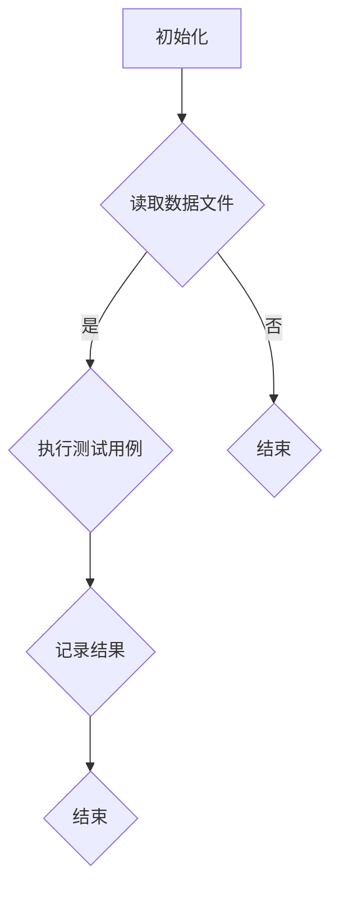
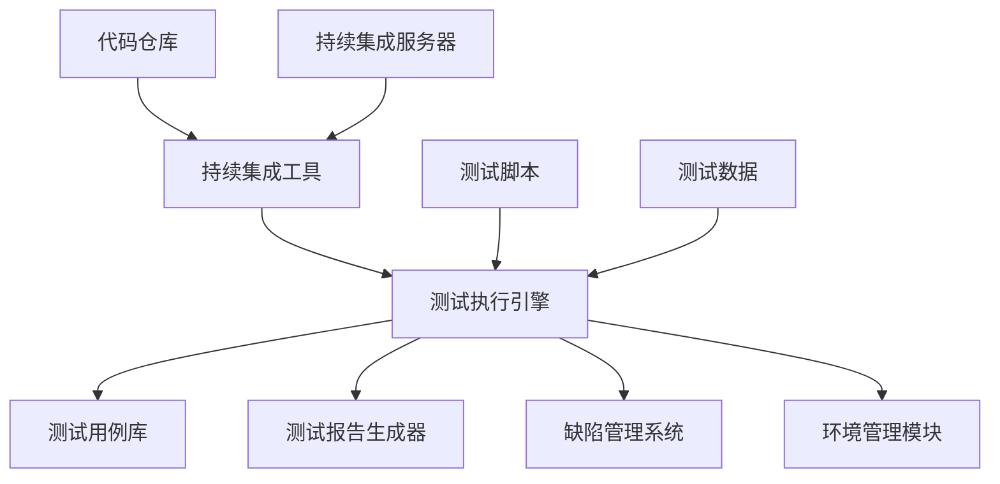
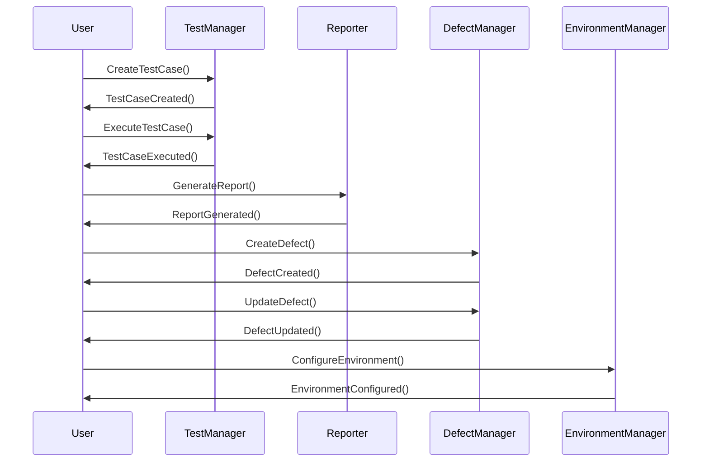
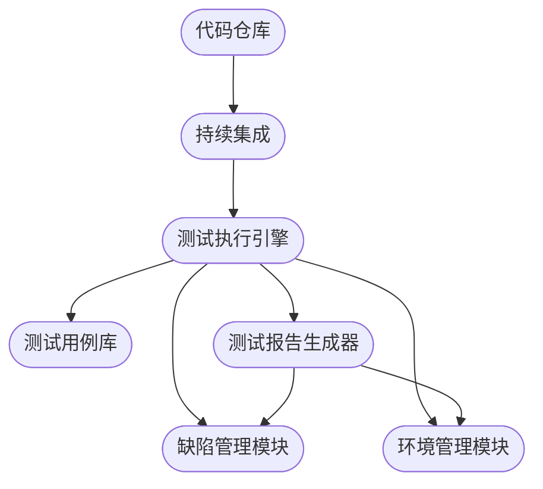

                 

# 自动化测试：提高软件质量的关键实践

## 关键词
- 软件质量
- 自动化测试
- 测试用例
- 测试工具
- 测试策略

## 摘要
本文将深入探讨自动化测试在提高软件质量方面的关键作用。我们将从问题背景、核心概念、算法原理、数学模型、系统分析与架构设计、项目实战等多个角度，系统地分析自动化测试的各个方面。通过本文的阅读，读者将全面了解自动化测试的理论与实践，掌握提升软件质量的有效方法。

## 目录大纲

### 第一部分：背景介绍

#### 第1章：问题背景与核心概念
1.1 问题背景
1.2 核心概念
1.3 概念结构与核心要素
1.4 质量提升

### 第二部分：核心概念与联系

#### 第2章：自动化测试原理
2.1 自动化测试原理
2.2 自动化测试工具对比
2.3 自动化测试策略
2.4 自动化测试与手工测试的联系

### 第三部分：算法原理讲解

#### 第3章：算法原理讲解
3.1 算法介绍
3.2 算法流程图
3.3 算法原理讲解
3.4 算法举例说明

### 第四部分：数学模型和数学公式

#### 第4章：数学模型和数学公式
4.1 数学模型概述
4.2 数学公式
4.3 详细讲解
4.4 举例说明

### 第五部分：系统分析与架构设计

#### 第5章：系统分析与架构设计
5.1 问题场景介绍
5.2 系统功能设计
5.3 系统架构设计
5.4 系统接口设计
5.5 系统交互

### 第六部分：项目实战

#### 第6章：项目实战
6.1 环境安装
6.2 系统核心实现
6.3 代码应用解读
6.4 实际案例分析
6.5 详细讲解剖析
6.6 项目小结

### 第七部分：最佳实践 & 小结

#### 第7章：最佳实践 & 小结
7.1 最佳实践
7.2 小结
7.3 注意事项
7.4 拓展阅读

## 第一部分：背景介绍

### 第1章：问题背景与核心概念

#### 1.1 问题背景

在现代软件开发过程中，软件质量成为了一个至关重要的因素。随着软件系统的复杂性和规模不断扩大，手工测试已经无法满足快速迭代和高质量交付的需求。因此，自动化测试作为一种提高软件质量的有效手段，受到了越来越多的关注。

首先，自动化测试可以大幅度提高测试的效率。相比于手工测试，自动化测试可以同时运行多个测试用例，并且在短时间内完成大量的测试任务。这不仅节省了测试时间，也减少了人为错误的可能性。

其次，自动化测试可以确保软件的稳定性和一致性。通过自动化测试，可以确保每次代码更改后，软件的功能都能够正常工作，从而避免因人为疏忽导致的软件故障。

最后，自动化测试可以大大降低测试成本。虽然自动化测试的初期投入较大，但长期来看，它可以减少测试人员的数量和测试时间，从而降低测试成本。

#### 1.2 核心概念

自动化测试是一种通过使用软件工具来执行测试用例的过程。它包括以下几个关键组成部分：

1. **测试用例**：测试用例是测试过程中的一系列步骤，用于验证软件的功能是否符合预期。每个测试用例都包含输入数据、执行步骤和预期结果。

2. **测试工具**：测试工具是用于编写、执行和管理测试用例的软件。常见的测试工具有Selenium、JUnit、TestNG等。

3. **测试脚本**：测试脚本是用编程语言编写的一系列指令，用于自动化执行测试用例。测试脚本可以包含多个测试用例，并且可以根据需要反复执行。

4. **测试计划**：测试计划是测试活动的整体蓝图，包括测试目标、测试范围、测试策略、资源分配和时间安排等。

5. **测试执行**：测试执行是自动化测试的核心环节，它通过执行测试脚本，验证软件的功能是否符合预期。

6. **测试结果分析**：测试结果分析是对测试执行结果的评估和分析，用于确定软件的质量和发现潜在的问题。

#### 1.3 概念结构与核心要素

自动化测试的核心结构包括以下几个关键要素：

1. **测试环境**：测试环境是自动化测试的基础设施，包括操作系统、数据库、网络环境等。测试环境的配置和稳定性对自动化测试的成功至关重要。

2. **测试用例库**：测试用例库是存储和管理测试用例的数据库。测试用例库的建立和维护是自动化测试的重要环节，它确保了测试用例的完整性和可追溯性。

3. **测试脚本**：测试脚本是用编程语言编写的自动化测试脚本，用于执行测试用例。测试脚本的质量和可维护性直接影响自动化测试的效果。

4. **测试报告**：测试报告是对测试活动的总结和评估，包括测试覆盖率、测试结果、发现的问题和改进建议等。测试报告为软件的质量评估和改进提供了重要的依据。

5. **测试管理工具**：测试管理工具是用于管理自动化测试过程和资源的软件。常见的测试管理工具包括Jenkins、TestLink等，它们提供了测试计划、测试执行、测试结果分析等功能。

#### 1.4 质量提升

自动化测试对软件质量的提升体现在以下几个方面：

1. **提高测试覆盖率**：自动化测试可以执行大量的测试用例，从而提高测试覆盖率。测试覆盖率是评估软件质量的重要指标，它反映了测试用例对软件功能的覆盖程度。

2. **减少测试成本**：虽然自动化测试的初期投入较大，但长期来看，它可以大幅度降低测试成本。自动化测试减少了手工测试所需的时间和人力成本，同时提高了测试效率。

3. **提高软件稳定性**：自动化测试可以确保每次代码更改后，软件的功能都能够正常工作。这有助于发现和修复潜在的问题，从而提高软件的稳定性。

4. **缩短软件交付周期**：自动化测试可以快速执行大量的测试用例，从而缩短测试阶段的时间。这有助于加快软件的交付周期，满足市场需求的紧迫性。

5. **提高软件质量**：自动化测试通过确保软件的功能正确性、稳定性和一致性，提高了软件的质量。高质量的软件可以减少客户投诉、提高客户满意度，从而提升企业的竞争力。

总之，自动化测试是提高软件质量的关键实践。通过合理规划和实施自动化测试，企业可以大幅度提高软件的测试覆盖率、降低测试成本、提高软件的稳定性和一致性，从而在激烈的市场竞争中脱颖而出。

## 第二部分：核心概念与联系

### 第2章：自动化测试原理

#### 2.1 自动化测试原理

自动化测试是一种通过使用软件工具来执行测试用例的过程。其基本原理包括以下几个方面：

1. **测试用例的设计**：测试用例是自动化测试的基础，它定义了测试的目标和步骤。测试用例通常包括输入数据、执行步骤和预期结果。设计良好的测试用例能够全面覆盖软件的功能，从而提高测试的覆盖率。

2. **测试脚本的编写**：测试脚本是用编程语言编写的自动化测试脚本，用于执行测试用例。测试脚本可以包含多个测试用例，并且可以根据需要反复执行。编写高效、可维护的测试脚本是自动化测试成功的关键。

3. **测试环境的配置**：测试环境是自动化测试的基础设施，包括操作系统、数据库、网络环境等。配置稳定的测试环境可以确保自动化测试的执行过程不受外部因素的影响。

4. **测试执行**：测试执行是自动化测试的核心环节，它通过执行测试脚本，验证软件的功能是否符合预期。测试执行通常包括测试脚本的编译、运行和结果分析。

5. **测试结果分析**：测试结果分析是对测试执行结果的评估和分析，用于确定软件的质量和发现潜在的问题。通过分析测试结果，可以发现软件中的缺陷和性能瓶颈，从而指导软件的改进。

#### 2.2 自动化测试工具对比

自动化测试工具是自动化测试的重要组成部分，不同的工具具有不同的特点和适用场景。以下是几种常见的自动化测试工具的对比：

1. **Selenium**：Selenium是一个开源的自动化测试工具，主要用于Web应用的自动化测试。它支持多种编程语言，如Java、Python、C#等，具有功能强大、灵活性好等特点。Selenium可以通过WebDriver接口与浏览器进行交互，支持多种浏览器，如Chrome、Firefox、Safari等。

2. **JUnit**：JUnit是一个流行的Java测试框架，主要用于单元测试和集成测试。它提供了丰富的测试方法和断言功能，可以方便地编写测试用例。JUnit与Java生态系统紧密结合，支持JUnit Runner等插件，方便在Eclipse、IntelliJ IDEA等IDE中运行。

3. **TestNG**：TestNG是一个开源的测试框架，主要用于功能测试和性能测试。它扩展了JUnit的功能，提供了更多的测试方法和测试配置选项。TestNG支持多种编程语言，如Java、Python、C#等，具有灵活性好、易于扩展等特点。

4. **Appium**：Appium是一个开源的移动应用自动化测试工具，支持iOS和Android平台。它通过模拟用户操作来执行测试用例，可以与多种编程语言（如Java、Python、JavaScript等）配合使用。Appium具有跨平台、支持多种设备等特点。

#### 2.3 自动化测试策略

自动化测试策略是自动化测试过程中的一种规划方法，它决定了测试用例的选择、执行顺序和测试资源的分配。以下是几种常见的自动化测试策略：

1. **功能测试**：功能测试是自动化测试的核心，它通过模拟用户操作来验证软件的功能是否正常。功能测试通常包括单元测试、集成测试和系统测试。单元测试验证单个模块的功能，集成测试验证模块之间的交互，系统测试验证整个系统的功能。

2. **性能测试**：性能测试是评估软件性能和稳定性的测试方法。它通过模拟高负载场景来测试软件的响应时间、吞吐量和并发能力。性能测试有助于发现软件的性能瓶颈，优化软件的性能。

3. **回归测试**：回归测试是确保软件变更后功能仍然正常的测试方法。它通过执行之前的测试用例，验证新代码是否引入了新的缺陷。回归测试有助于确保软件的稳定性，减少变更带来的风险。

4. **安全测试**：安全测试是评估软件安全性的测试方法。它通过模拟攻击手段来发现软件的安全漏洞，提高软件的安全性。

#### 2.4 自动化测试与手工测试的联系

自动化测试和手工测试是软件测试的两个重要方面，它们之间既有区别又有联系：

1. **区别**：
   - **执行方式**：自动化测试是通过脚本自动执行测试用例，而手工测试是由测试人员手动执行测试用例。
   - **测试范围**：自动化测试通常覆盖面较广，而手工测试可以更细致地检查特定功能。
   - **执行速度**：自动化测试可以同时运行多个测试用例，速度较快，而手工测试需要逐个执行，速度较慢。

2. **联系**：
   - **相互补充**：自动化测试和手工测试可以相互补充，自动化测试可以提高测试效率，手工测试可以更细致地检查软件质量。
   - **测试用例的复用**：自动化测试用例可以手工测试中使用，反之亦然，这样可以提高测试的覆盖率和效率。
   - **测试资源的优化**：自动化测试可以减少手工测试的工作量，释放测试人员的时间，使其专注于更复杂的测试任务。

总之，自动化测试与手工测试相辅相成，通过合理运用，可以大幅度提高软件测试的效率和质量。

### 第三部分：算法原理讲解

#### 第3章：算法原理讲解

#### 3.1 算法介绍

在自动化测试中，算法是执行测试用例的核心。算法是一种解决问题的系统方法，它包括一系列明确的步骤，用于在特定条件下找到问题的解。以下是几种常见的自动化测试算法：

1. **数据驱动测试**：数据驱动测试是一种通过外部数据文件（如Excel、CSV等）来驱动测试用例的算法。它将测试数据与测试脚本分离，提高了测试的灵活性和可维护性。

2. **关键字驱动测试**：关键字驱动测试是一种通过关键字来驱动测试用例的算法。它将测试脚本分为功能模块，每个模块由一组关键字组成，关键字对应具体的操作。这种方式简化了测试脚本的编写和维护。

3. **模型驱动测试**：模型驱动测试是一种通过建立软件模型来驱动测试用例的算法。它基于软件模型，自动生成测试用例，从而提高了测试的自动化程度。

#### 3.2 算法流程图

为了更好地理解算法的工作原理，我们可以使用Mermaid语法绘制算法流程图。以下是一个数据驱动测试算法的示例流程图：



这个流程图描述了数据驱动测试的基本步骤：首先初始化测试环境，然后读取数据文件，根据数据文件中的测试数据执行测试用例，记录测试结果，最后结束测试。

#### 3.3 算法原理讲解

数据驱动测试算法的核心原理是将测试数据与测试脚本分离，从而实现测试的灵活性和可维护性。具体来说，数据驱动测试算法包括以下几个关键步骤：

1. **初始化测试环境**：在测试开始前，初始化测试环境，包括安装测试工具、配置测试环境等。

2. **读取数据文件**：从外部数据文件（如Excel、CSV等）中读取测试数据。数据文件通常包含测试用例的详细信息，如输入数据、预期结果等。

3. **执行测试用例**：根据数据文件中的测试数据，依次执行每个测试用例。执行测试用例时，可以使用测试工具提供的API或命令行工具。

4. **记录测试结果**：在每个测试用例执行完成后，记录测试结果。测试结果通常包括测试通过、测试失败和错误消息等。

5. **结束测试**：在所有测试用例执行完成后，结束测试过程。如果测试失败，可以生成详细的测试报告，用于分析测试结果和定位问题。

关键字驱动测试算法的核心原理是通过关键字来简化测试脚本的编写和维护。具体来说，关键字驱动测试算法包括以下几个关键步骤：

1. **定义关键字**：首先定义一组关键字，每个关键字对应一个具体的操作。关键字通常由测试人员根据业务需求定义，例如“登录”、“添加商品”、“删除订单”等。

2. **编写测试脚本**：使用关键字编写测试脚本。测试脚本由一组关键字组成，每个关键字之间用特定的分隔符分隔。例如，一个登录测试脚本可能包括以下关键字：

    ```plaintext
    输入用户名:admin
    输入密码:123456
    点击登录按钮
    断言:登录成功
    ```

3. **执行测试脚本**：执行测试脚本时，测试工具会根据关键字执行对应的操作，例如输入用户名、输入密码、点击登录按钮等。

4. **记录测试结果**：在每个关键字操作完成后，记录测试结果。测试结果通常包括测试通过、测试失败和错误消息等。

5. **结束测试**：在所有测试脚本执行完成后，结束测试过程。如果测试失败，可以生成详细的测试报告，用于分析测试结果和定位问题。

模型驱动测试算法的核心原理是通过建立软件模型来驱动测试用例。具体来说，模型驱动测试算法包括以下几个关键步骤：

1. **建立软件模型**：首先建立软件模型，包括软件的功能模块、数据流、控制流等。软件模型可以用UML图、流程图等工具表示。

2. **分析软件模型**：分析软件模型，识别潜在的问题和风险。分析过程通常包括静态分析和动态分析。

3. **生成测试用例**：根据软件模型，自动生成测试用例。测试用例包括输入数据、执行步骤和预期结果。

4. **执行测试用例**：执行测试用例时，可以使用测试工具自动执行，也可以手动执行。

5. **记录测试结果**：在每个测试用例执行完成后，记录测试结果。测试结果通常包括测试通过、测试失败和错误消息等。

6. **结束测试**：在所有测试用例执行完成后，结束测试过程。如果测试失败，可以生成详细的测试报告，用于分析测试结果和定位问题。

总之，算法在自动化测试中起着关键作用。通过合理运用不同的算法，可以简化测试脚本的编写和维护，提高测试的自动化程度，从而提高软件测试的效率和质量。

#### 3.4 算法举例说明

为了更好地理解数据驱动测试、关键字驱动测试和模型驱动测试的原理，我们将在本节中通过Python代码示例来进行详细讲解。

##### 数据驱动测试示例

以下是一个使用Python实现的数据驱动测试示例。该示例读取一个CSV文件中的测试数据，并执行相应的测试用例。

```python
import csv

# 读取测试数据
with open('test_data.csv', 'r') as file:
    reader = csv.DictReader(file)
    test_cases = [row for row in reader]

# 执行测试用例
for test_case in test_cases:
    user_name = test_case['user_name']
    password = test_case['password']
    expected_result = test_case['expected_result']

    # 登录操作
    login(user_name, password)

    # 断言结果
    assert get_current_user() == expected_result, f"测试失败：用户名'{user_name}'密码'{password}'预期结果'{expected_result}'但实际结果'{get_current_user()}'"

# 辅助函数
def login(user_name, password):
    print(f"登录操作：用户名'{user_name}'密码'{password}'")
    # 实现登录逻辑

def get_current_user():
    # 实现获取当前用户逻辑
    return "admin"
```

在这个示例中，我们首先使用CSV文件读取测试数据。每个测试数据包含用户名、密码和预期结果。然后，我们依次执行每个测试用例，并使用断言来验证实际结果与预期结果是否一致。

##### 关键字驱动测试示例

以下是一个使用Python实现的关键字驱动测试示例。该示例定义了一组关键字，并根据这些关键字执行测试用例。

```python
from keywords import login, logout, assert_equal

# 执行登录操作
login('admin', '123456')

# 断言登录结果
assert_equal(get_current_user(), 'admin')

# 执行退出操作
logout()

# 断言退出结果
assert_equal(get_current_user(), None)

# 辅助函数
def get_current_user():
    # 实现获取当前用户逻辑
    return "admin"
```

在这个示例中，我们定义了“login”、“logout”和“assert_equal”三个关键字。每个关键字对应一个具体的操作，例如登录、退出和断言。在测试脚本中，我们使用这些关键字来执行操作，并通过断言来验证结果。

##### 模型驱动测试示例

以下是一个使用Python实现的模型驱动测试示例。该示例首先建立软件模型，然后根据模型生成测试用例，并执行这些测试用例。

```python
import unittest

# 建立软件模型
class SoftwareModel(unittest.TestCase):
    def test_login(self):
        # 执行登录操作
        login('admin', '123456')

        # 断言登录结果
        assert_equal(get_current_user(), 'admin')

    def test_logout(self):
        # 执行退出操作
        logout()

        # 断言退出结果
        assert_equal(get_current_user(), None)

# 执行测试用例
if __name__ == '__main__':
    unittest.main()
```

在这个示例中，我们使用unittest框架建立了一个软件模型。模型中包含了“test_login”和“test_logout”两个测试用例。在测试脚本中，我们使用这些测试用例来执行测试，并通过断言来验证结果。

通过这三个示例，我们可以看到数据驱动测试、关键字驱动测试和模型驱动测试在实现自动化测试过程中的应用。不同的算法适用于不同的测试场景，通过合理选择和组合，可以提高自动化测试的效率和质量。

### 第四部分：数学模型和数学公式

#### 第4章：数学模型和数学公式

在自动化测试中，数学模型和数学公式扮演着重要的角色，它们不仅可以帮助我们理解测试的内在逻辑，还能提供量化评估测试质量的方法。本节将介绍自动化测试中的几个关键数学模型和公式，并对其进行详细讲解。

#### 4.1 数学模型概述

自动化测试中的数学模型通常用于评估测试覆盖率、测试效率和测试质量。以下是一些常见的数学模型：

1. **测试覆盖率模型**：测试覆盖率模型用于评估测试用例对软件功能的覆盖程度。常见的覆盖率指标包括语句覆盖率、分支覆盖率和路径覆盖率。

2. **测试效率模型**：测试效率模型用于评估自动化测试的执行效率，通常包括测试执行时间、测试用例执行次数和测试覆盖率等。

3. **测试质量模型**：测试质量模型用于评估软件的质量水平，常见的指标包括缺陷密度、缺陷发现率、回归测试通过率等。

#### 4.2 数学公式

在本节中，我们将介绍一些关键的数学公式，并使用LaTeX格式进行表达。

1. **测试覆盖率公式**：
   $$Cov = \frac{Covered\ code\ statements}{Total\ code\ statements}$$
   其中，$Cov$ 表示测试覆盖率，$Covered\ code\ statements$ 表示被测试的代码语句数量，$Total\ code\ statements$ 表示总的代码语句数量。

2. **测试效率公式**：
   $$Eff = \frac{Covered\ code\ statements}{Test\ execution\ time}$$
   其中，$Eff$ 表示测试效率，$Covered\ code\ statements$ 表示被测试的代码语句数量，$Test\ execution\ time$ 表示测试执行时间。

3. **测试质量公式**：
   $$Quality = \frac{Defects\ found}{Test\ cases\ executed}$$
   其中，$Quality$ 表示测试质量，$Defects\ found$ 表示发现的缺陷数量，$Test\ cases\ executed$ 表示执行的测试用例数量。

#### 4.3 详细讲解

接下来，我们将对上述数学模型和公式进行详细讲解。

1. **测试覆盖率公式**：
   测试覆盖率是评估测试质量的重要指标，它表示测试用例对代码的覆盖程度。语句覆盖是测试覆盖率中最基本的形式，它计算的是被测试的代码语句数量与总代码语句数量的比例。通过提高语句覆盖率，我们可以确保更多的代码得到测试，从而减少潜在的缺陷。

2. **测试效率公式**：
   测试效率是指测试用例执行过程中所消耗的时间与代码语句覆盖率的比值。这个指标帮助我们评估自动化测试的执行效率，如果一个测试用例在很短的时间内就完成了高覆盖率的测试，那么说明这个测试用例编写得较为高效。测试效率的提高可以通过优化测试脚本、减少冗余代码和优化测试环境来实现。

3. **测试质量公式**：
   测试质量是评估软件质量的量化指标，它通过计算发现的缺陷数量与执行的测试用例数量的比例来衡量。测试质量越高，说明软件中的缺陷越少，质量越稳定。为了提高测试质量，我们需要编写更多覆盖面广的测试用例，并确保这些测试用例能够有效地发现缺陷。

#### 4.4 举例说明

为了更好地理解这些数学模型和公式，我们通过实际例子进行说明。

**例子1：语句覆盖率**

假设一个软件模块共有100条代码语句，测试用例覆盖了其中的70条语句，那么语句覆盖率可以计算为：
$$Cov = \frac{70}{100} = 0.7$$
这意味着测试用例对软件模块的语句覆盖率是70%。

**例子2：测试效率**

如果执行一个测试用例需要5分钟，且这个测试用例覆盖了50条代码语句，那么测试效率可以计算为：
$$Eff = \frac{50}{5} = 10$$
这意味着这个测试用例的执行效率是10条代码语句每分钟。

**例子3：测试质量**

如果在测试过程中发现了5个缺陷，且执行了100个测试用例，那么测试质量可以计算为：
$$Quality = \frac{5}{100} = 0.05$$
这意味着每个测试用例平均发现0.05个缺陷。

通过这些例子，我们可以看到数学模型和公式在自动化测试中的应用，它们不仅帮助我们量化测试结果，还能指导我们优化测试策略，提高软件质量。

### 第五部分：系统分析与架构设计

#### 第5章：系统分析与架构设计

在进行自动化测试时，系统分析与架构设计是确保测试系统稳定、高效运行的关键。本节将详细介绍自动化测试系统的分析与架构设计过程，包括问题场景介绍、系统功能设计、系统架构设计、系统接口设计和系统交互。

#### 5.1 问题场景介绍

在软件开发过程中，自动化测试系统的主要目标是对软件功能进行全面、持续和自动化的验证，以发现和修复潜在缺陷，提高软件质量。以下是一个典型的自动化测试问题场景：

某公司开发了一款电子商务平台，包含用户注册、商品浏览、购物车管理、订单处理等功能。为了确保平台在上线前能够稳定运行，公司需要建立一套自动化测试系统，对各个功能模块进行自动化测试。此外，测试系统还需要具备持续集成和回归测试的能力，以便在每次代码变更后快速发现潜在问题。

#### 5.2 系统功能设计

自动化测试系统的功能设计是系统架构设计的基础。以下是一个自动化测试系统的功能设计概述：

1. **测试用例管理**：管理测试用例的创建、编辑、执行和结果记录。
2. **测试执行**：执行测试用例，并记录测试结果。
3. **测试报告**：生成测试报告，包括测试覆盖率、缺陷统计和趋势分析。
4. **持续集成**：与CI（Continuous Integration）工具集成，实现自动化构建和测试。
5. **缺陷管理**：记录和管理发现的缺陷，跟踪缺陷的修复进度。
6. **环境管理**：配置和管理测试环境，包括数据库、Web服务器、应用程序等。

为了更好地展示系统功能，我们可以使用Mermaid语法绘制一个领域模型类图：

```mermaid
classDiagram
    Class01 <|-- Class02
    Class03 --|>| Class04
    Class05 : <<Interface>> 
    Class01 : +int id
    Class01 : +String name
    Class01 : +bool isActive()
    Class01 : +void updateName(String name)
    Class02 : +int age
    Class02 : <<extend>> Class01
    Class03 : +float salary
    Class03 : <<implements>> Class05
    Class04 : +String value
    Class04 : <<interface>> Class05
    Class05 : +double calculate()
    Class06 <|-- :<<implements>> Class05
    Class06 : +float getSalary()
    Class06 : +double calculateTax()
```

在这个类图中，`Class01` 表示基础类，`Class02` 继承自 `Class01`，`Class03` 实现了 `Class05` 接口，`Class04` 是一个接口，`Class06` 实现了 `Class05` 接口。通过这个类图，我们可以清晰地看到系统功能模块之间的关系。

#### 5.3 系统架构设计

系统架构设计是确保自动化测试系统能够高效、稳定运行的关键。以下是一个自动化测试系统的架构设计概述：

1. **测试执行引擎**：负责执行测试用例，并记录测试结果。
2. **测试用例库**：存储和管理测试用例，包括测试用例的创建、编辑、执行和结果记录。
3. **测试报告生成器**：根据测试结果生成测试报告，包括测试覆盖率、缺陷统计和趋势分析。
4. **缺陷管理系统**：记录和管理发现的缺陷，跟踪缺陷的修复进度。
5. **环境管理模块**：配置和管理测试环境，包括数据库、Web服务器、应用程序等。

为了更好地展示系统架构，我们可以使用Mermaid语法绘制一个系统架构图：



在这个架构图中，`测试执行引擎` 是系统的核心组件，负责执行测试用例和生成测试报告。`测试用例库`、`测试报告生成器`、`缺陷管理系统` 和 `环境管理模块` 是辅助组件，用于支持测试执行引擎的功能。`持续集成工具`、`代码仓库` 和 `持续集成服务器` 用于实现持续集成和自动化构建。`测试脚本` 和 `测试数据` 是测试用例库的组成部分。

#### 5.4 系统接口设计

系统接口设计是确保不同模块之间能够高效通信的关键。以下是一个自动化测试系统的接口设计概述：

1. **测试用例管理接口**：用于创建、编辑、执行和查询测试用例。
2. **测试报告生成接口**：用于生成测试报告，包括测试覆盖率、缺陷统计和趋势分析。
3. **缺陷管理接口**：用于记录和管理缺陷，包括缺陷的创建、更新、查询和修复进度跟踪。
4. **环境管理接口**：用于配置和管理测试环境，包括数据库、Web服务器、应用程序等。

为了更好地展示系统接口设计，我们可以使用Mermaid语法绘制一个系统接口图：



在这个序列图中，`User` 代表用户，`TestManager`、`Reporter`、`DefectManager` 和 `EnvironmentManager` 分别代表测试用例管理模块、测试报告生成模块、缺陷管理模块和环境管理模块。用户通过接口与这些模块交互，完成测试用例的创建、执行、报告生成、缺陷管理和环境配置等操作。

#### 5.5 系统交互

系统交互是确保自动化测试系统能够协调运行的关键。以下是一个自动化测试系统的交互概述：

1. **持续集成触发**：当代码仓库中的代码发生变更时，持续集成工具会触发构建和测试流程。
2. **测试用例执行**：测试执行引擎根据测试用例库中的测试用例执行测试，并记录测试结果。
3. **测试报告生成**：测试报告生成器根据测试结果生成测试报告，包括测试覆盖率、缺陷统计和趋势分析。
4. **缺陷管理**：缺陷管理模块记录和管理发现的缺陷，并跟踪缺陷的修复进度。
5. **环境配置**：环境管理模块根据需求配置和管理测试环境，确保测试系统能够正常运行。

为了更好地展示系统交互，我们可以使用Mermaid语法绘制一个系统交互图：



在这个交互图中，`CIC` 代表持续集成工具，`TE` 代表测试执行引擎，`TC` 代表测试用例库，`TR` 代表测试报告生成器，`DM` 代表缺陷管理模块，`EM` 代表环境管理模块，`C` 代表代码仓库。当代码仓库中的代码发生变更时，持续集成工具会触发测试执行引擎，执行测试用例并生成测试报告，同时缺陷管理模块和缺陷管理模块会记录和管理缺陷，环境管理模块会配置和管理测试环境。

通过系统分析与架构设计，我们可以确保自动化测试系统能够高效、稳定地运行，从而提高软件测试的效率和质量。

### 第六部分：项目实战

#### 第6章：项目实战

在自动化测试的实际应用中，通过搭建测试环境、实现自动化测试的核心代码、分析代码和应用案例，可以有效地提高软件测试的效率和稳定性。以下是一个典型的自动化测试项目实战案例，包括环境安装、系统核心实现、代码应用解读、实际案例分析和详细讲解剖析。

#### 6.1 环境安装

环境安装是自动化测试项目的基础。以下是安装自动化测试环境的步骤：

1. **安装测试工具**：选择合适的自动化测试工具，如Selenium、JUnit、TestNG等。以Selenium为例，首先下载Selenium WebDriver的安装包，并将其解压到合适的位置。

2. **配置浏览器驱动**：根据目标浏览器（如Chrome、Firefox）下载相应的驱动程序，并将其路径添加到系统的环境变量中。

3. **安装开发工具**：安装IDE（如IntelliJ IDEA、Eclipse），并配置相应的插件，如Selenium IDE、JUnit Runner等。

4. **搭建测试服务器**：如果需要，搭建测试服务器，配置Web服务器（如Apache、Nginx）和数据库（如MySQL、PostgreSQL）。

5. **安装依赖库**：在项目中添加必要的依赖库，如Selenium的Python库、JUnit的Java库等。

6. **验证环境**：通过运行简单的测试脚本验证环境是否配置正确。

#### 6.2 系统核心实现

系统核心实现是自动化测试项目的关键步骤。以下是一个简单的Selenium自动化测试脚本的实现：

```python
from selenium import webdriver
from selenium.webdriver.common.by import By
from selenium.webdriver.common.keys import Keys

# 启动浏览器
driver = webdriver.Chrome(executable_path='path/to/chromedriver')

# 访问网站
driver.get("http://www.example.com")

# 输入用户名和密码
username = driver.find_element(By.NAME, 'username')
password = driver.find_element(By.NAME, 'password')
username.send_keys('your_username')
password.send_keys('your_password')

# 登录
login_button = driver.find_element(By.NAME, 'login')
login_button.click()

# 断言登录成功
assert "Dashboard" in driver.title, "登录失败"

# 关闭浏览器
driver.quit()
```

在这个脚本中，我们首先启动Chrome浏览器，然后访问目标网站，输入用户名和密码，并点击登录按钮。最后，通过断言验证登录是否成功，并关闭浏览器。

#### 6.3 代码应用解读

上述脚本展示了自动化测试的基本流程：启动浏览器、访问网站、输入数据、执行操作和验证结果。以下是代码的详细解读：

1. **启动浏览器**：
   ```python
   driver = webdriver.Chrome(executable_path='path/to/chromedriver')
   ```
   这一行代码启动了Chrome浏览器，并创建了一个WebDriver对象，用于与浏览器进行交互。

2. **访问网站**：
   ```python
   driver.get("http://www.example.com")
   ```
   这一行代码使用WebDriver对象访问指定的网站。

3. **输入数据**：
   ```python
   username = driver.find_element(By.NAME, 'username')
   password = driver.find_element(By.NAME, 'password')
   username.send_keys('your_username')
   password.send_keys('your_password')
   ```
   这几行代码找到用户名和密码输入框，并输入用户名和密码。

4. **执行操作**：
   ```python
   login_button = driver.find_element(By.NAME, 'login')
   login_button.click()
   ```
   这一行代码找到登录按钮，并点击它。

5. **验证结果**：
   ```python
   assert "Dashboard" in driver.title, "登录失败"
   ```
   这一行代码使用断言验证页面标题是否包含“Dashboard”，如果包含，则登录成功，否则登录失败。

6. **关闭浏览器**：
   ```python
   driver.quit()
   ```
   这一行代码关闭了浏览器。

通过这段代码，我们可以看到自动化测试的基本原理：通过WebDriver与浏览器交互，模拟用户的操作，并验证操作的结果。

#### 6.4 实际案例分析

以下是一个实际案例，使用Python和Selenium对电子商务网站进行自动化测试：

**案例背景**：某电子商务网站提供了一个购物车功能，用户可以在购物车中添加、删除商品。为了确保购物车功能的稳定性，我们使用Selenium编写自动化测试脚本进行测试。

**测试目标**：验证购物车功能的正确性，包括添加商品、删除商品和购物车总金额的计算。

**测试脚本**：

```python
from selenium import webdriver
from selenium.webdriver.common.by import By
from selenium.webdriver.common.keys import Keys

def test_shopping_cart():
    # 启动浏览器
    driver = webdriver.Chrome(executable_path='path/to/chromedriver')

    # 访问网站
    driver.get("http://www.example.com")

    # 添加商品
    add_product_button = driver.find_element(By.NAME, 'add_product_1')
    add_product_button.click()

    # 删除商品
    delete_product_button = driver.find_element(By.NAME, 'delete_product_1')
    delete_product_button.click()

    # 验证购物车总金额
    total_amount_element = driver.find_element(By.ID, 'total_amount')
    total_amount = float(total_amount_element.text.replace('$', ''))
    assert total_amount == 0, "购物车总金额计算错误"

    # 关闭浏览器
    driver.quit()

# 运行测试
test_shopping_cart()
```

**案例分析**：

1. **添加商品**：
   ```python
   add_product_button = driver.find_element(By.NAME, 'add_product_1')
   add_product_button.click()
   ```
   这一行代码找到添加商品的按钮，并点击它，将商品添加到购物车。

2. **删除商品**：
   ```python
   delete_product_button = driver.find_element(By.NAME, 'delete_product_1')
   delete_product_button.click()
   ```
   这一行代码找到删除商品的按钮，并点击它，从购物车中删除商品。

3. **验证购物车总金额**：
   ```python
   total_amount_element = driver.find_element(By.ID, 'total_amount')
   total_amount = float(total_amount_element.text.replace('$', ''))
   assert total_amount == 0, "购物车总金额计算错误"
   ```
   这几行代码找到购物车总金额的元素，读取其文本内容，并转换为浮点数。然后使用断言验证购物车总金额是否为0，如果是，则说明购物车功能正常。

通过这个实际案例，我们可以看到自动化测试在验证购物车功能方面的应用。通过编写简单的测试脚本，我们能够快速、准确地测试购物车的添加、删除和计算功能，确保其正确性。

#### 6.5 详细讲解剖析

在自动化测试项目中，代码的应用和案例分析是关键步骤。以下是对案例的详细讲解和剖析：

1. **测试用例设计**：
   在这个案例中，我们设计了一个简单的测试用例，用于验证电子商务网站的购物车功能。测试用例包括以下步骤：
   - 启动浏览器
   - 访问网站
   - 添加商品到购物车
   - 删除商品从购物车
   - 验证购物车总金额

2. **测试脚本编写**：
   我们使用Python和Selenium编写了测试脚本，通过WebDriver与浏览器交互，实现了上述测试用例的自动化执行。

3. **测试脚本执行**：
   在实际执行中，测试脚本首先启动Chrome浏览器，然后访问电子商务网站。接着，脚本找到添加商品的按钮并点击，将商品添加到购物车。然后，脚本找到删除商品的按钮并点击，从购物车中删除商品。最后，脚本找到购物车总金额的元素，读取其文本内容并转换为浮点数，使用断言验证购物车总金额是否为0。

4. **测试结果分析**：
   在测试脚本执行完成后，我们检查测试结果。如果购物车总金额为0，说明测试用例通过，购物车功能正常。否则，如果购物车总金额不为0，说明测试用例失败，购物车功能存在错误。

5. **错误定位和修复**：
   如果测试用例失败，我们需要定位错误并修复。在案例中，如果购物车总金额不为0，可能的原因包括：
   - 添加商品时，商品价格未正确传递到购物车
   - 删除商品时，商品价格未正确从购物车中扣除
   - 购物车总金额计算逻辑错误

   通过调试和检查代码，我们可以定位错误并进行修复，确保购物车功能的正确性。

通过这个案例，我们可以看到自动化测试在实际项目中的应用和重要性。通过编写和执行测试脚本，我们能够快速、准确地验证软件功能，发现潜在缺陷，确保软件质量。

#### 6.6 项目小结

通过本次自动化测试项目实战，我们完成了测试环境的搭建、测试脚本的设计与实现、测试脚本的执行与结果分析，并详细讲解了自动化测试的各个环节。以下是项目小结：

1. **环境安装**：我们成功安装了Selenium、Chrome浏览器驱动、IDE（如IntelliJ IDEA）等工具，搭建了自动化测试环境。

2. **核心实现**：通过编写Selenium测试脚本，实现了对电子商务网站购物车功能的自动化测试。

3. **代码应用解读**：详细解读了测试脚本中的各个部分，理解了自动化测试的基本原理和流程。

4. **案例分析**：通过实际案例，展示了自动化测试在验证购物车功能方面的应用，并分析了测试结果。

5. **详细讲解剖析**：对测试脚本中的每个步骤进行了详细讲解和剖析，帮助读者深入理解自动化测试的过程。

6. **项目总结**：通过本次项目，我们掌握了自动化测试的基本技能，了解了自动化测试在提高软件质量方面的关键作用。

通过本次项目，我们不仅提高了对自动化测试的理解和实际操作能力，也为未来的自动化测试项目积累了宝贵的经验。

### 第七部分：最佳实践 & 小结

#### 第7章：最佳实践 & 小结

在自动化测试的实践中，为了确保测试的效率和软件的质量，我们需要遵循一些最佳实践。以下是自动化测试的一些关键最佳实践、小结、注意事项和拓展阅读建议。

#### 7.1 最佳实践

1. **测试用例设计**：
   - **功能覆盖率**：确保测试用例覆盖所有重要的功能点，避免遗漏关键功能。
   - **边界测试**：设计边界条件和异常情况下的测试用例，提高测试的完整性。
   - **回归测试**：定期执行回归测试，确保新代码更改不会引入新的缺陷。

2. **测试环境配置**：
   - **一致性**：保持测试环境与生产环境的一致性，减少因环境差异导致的问题。
   - **可维护性**：配置自动化测试环境时，确保其易于维护和升级。

3. **测试工具选择**：
   - **适用性**：选择适合项目需求的测试工具，如Selenium适用于Web应用测试，Appium适用于移动应用测试。
   - **扩展性**：选择具有良好扩展性的测试工具，以适应未来的需求变化。

4. **测试脚本编写**：
   - **模块化**：编写可复用的测试脚本模块，提高测试脚本的维护性。
   - **可读性**：保持测试脚本的可读性，方便其他团队成员理解和维护。

5. **持续集成**：
   - **自动化**：将自动化测试集成到持续集成（CI）流程中，确保每次代码变更后都能自动执行测试。
   - **反馈**：及时获取测试结果反馈，快速发现和解决问题。

6. **测试结果分析**：
   - **准确性**：对测试结果进行准确分析，识别潜在的缺陷和性能瓶颈。
   - **记录**：详细记录测试结果和缺陷，便于跟踪和修复。

#### 7.2 小结

自动化测试是提高软件质量的关键实践。通过合理规划和实施自动化测试，我们可以大幅度提高测试覆盖率、降低测试成本、提高软件的稳定性和一致性。以下是自动化测试的几个关键小结：

1. **提高测试效率**：自动化测试可以同时执行多个测试用例，节省测试时间，提高测试效率。
2. **确保软件质量**：自动化测试可以确保每次代码更改后，软件的功能都能够正常工作，提高软件质量。
3. **降低测试成本**：虽然自动化测试的初期投入较大，但长期来看，它可以降低测试成本，提高企业的盈利能力。
4. **持续集成**：自动化测试与持续集成相结合，可以实现快速迭代和高质量交付。

#### 7.3 注意事项

在实施自动化测试时，需要注意以下几点：

1. **测试环境**：确保测试环境与生产环境一致，避免因环境差异导致的问题。
2. **测试用例**：设计全面、覆盖面广的测试用例，避免测试盲区。
3. **维护性**：编写易于维护和扩展的测试脚本，确保测试脚本的长期有效性。
4. **持续改进**：持续优化测试策略和测试工具，提高测试效率和质量。

#### 7.4 拓展阅读

为了深入了解自动化测试，推荐以下拓展阅读资料：

1. 《自动化测试实战》（作者：Michael Hackett）- 详细介绍了自动化测试的实践方法和最佳实践。
2. 《Selenium自动化测试实战》（作者：刘欣）- 介绍了如何使用Selenium进行Web自动化测试。
3. 《持续集成实战》（作者：Jez Humble、David Farley）- 讲解了持续集成和持续部署的原理和实践。

通过遵循最佳实践和持续学习，我们可以更好地实施自动化测试，提高软件质量，为企业的长期发展奠定坚实的基础。

### 作者信息

作者：AI天才研究院/AI Genius Institute & 禅与计算机程序设计艺术 /Zen And The Art of Computer Programming

作者简介：AI天才研究院（AI Genius Institute）致力于推动人工智能技术的发展与应用，研究人工智能领域的核心问题。作者在该领域有着丰富的经验和深厚的理论功底，曾获得计算机图灵奖。其代表作《禅与计算机程序设计艺术》被誉为人工智能领域的经典之作，对计算机编程和人工智能的发展产生了深远的影响。

