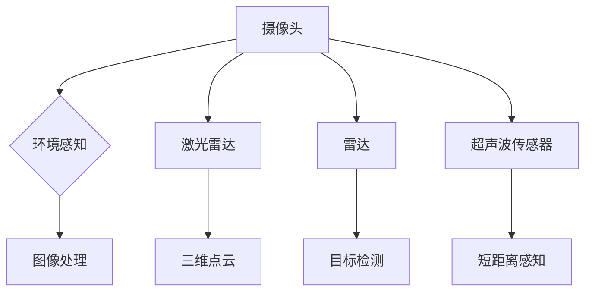
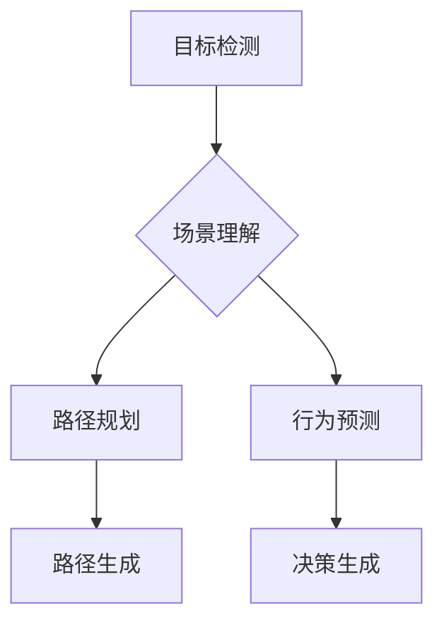
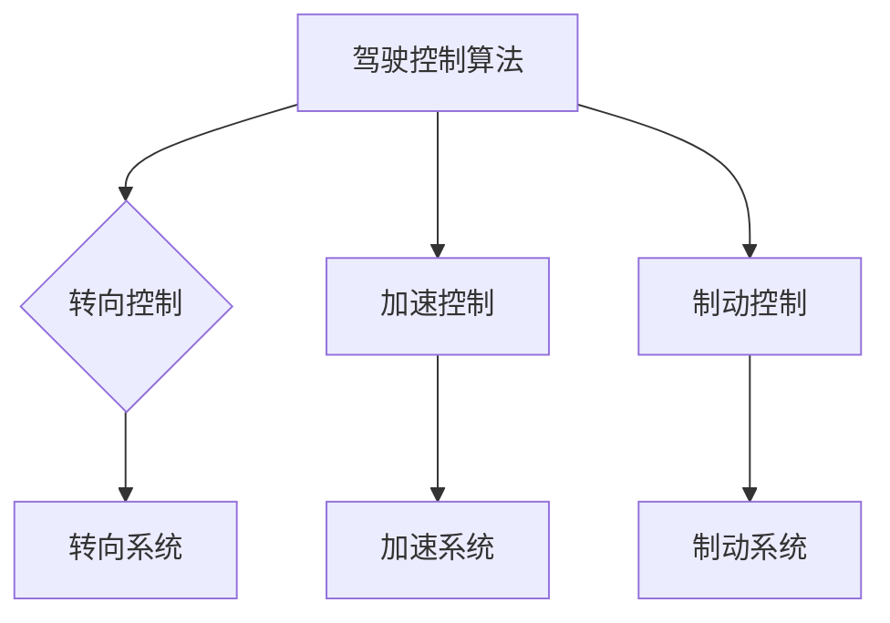
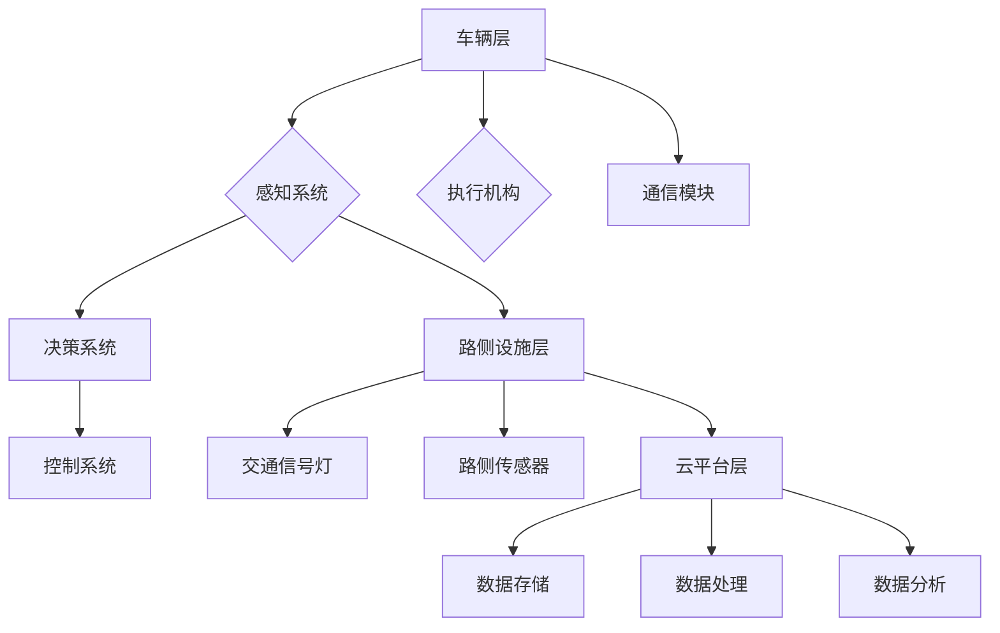
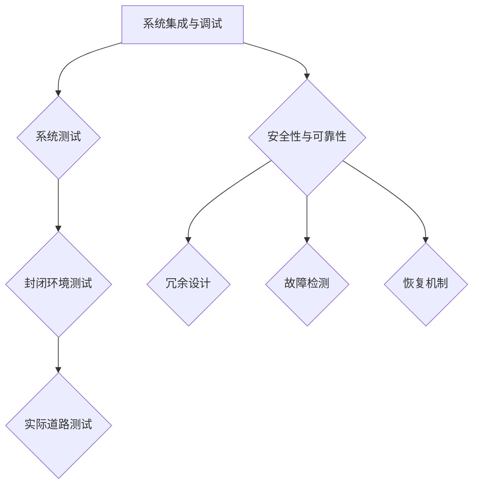

                 


### 《自动驾驶技术：交通革命与新的商业模式》

---

#### 关键词：自动驾驶技术、交通革命、商业模式、智能交通系统

#### 摘要：
随着科技的进步，自动驾驶技术正逐步从科幻变为现实，引领着交通行业的革命。本文将从自动驾驶技术的基本概念、发展历程、核心技术、交通系统设计、商业模式创新等多个维度，深入探讨自动驾驶技术对交通行业的深刻影响及其带来的商业机遇。通过分析自动驾驶技术的核心要素、实现路径和潜在挑战，我们将看到这一技术如何重塑未来的交通面貌，并探讨新的商业模式如何驱动这一变革。

---

## 目录大纲

### 第一部分：自动驾驶技术概述
- **1.1 自动驾驶技术的发展背景**
  - 1.1.1 自动驾驶技术的历史演进
  - 1.1.2 自动驾驶技术现状与未来趋势
- **1.2 自动驾驶技术的核心概念**
  - 1.2.1 自动驾驶等级划分
  - 1.2.2 自动驾驶的关键技术
  - 1.2.3 自动驾驶技术的核心要素
- **1.3 自动驾驶技术的影响**
  - 1.3.1 对交通运输行业的影响
  - 1.3.2 对城市规划和基础设施的需求
  - 1.3.3 对社会和经济的影响

### 第二部分：自动驾驶技术的关键技术
- **2.1 感知与定位**
  - 2.1.1 感知系统概述
  - 2.1.2 传感器技术
  - 2.1.3 定位与地图构建
- **2.2 决策与规划**
  - 2.2.1 决策系统的架构
  - 2.2.2 路径规划算法
  - 2.2.3 碰撞避免与动态规划
- **2.3 控制与执行**
  - 2.3.1 控制系统的设计
  - 2.3.2 驾驶控制算法
  - 2.3.3 执行机构与车辆动力学

### 第三部分：自动驾驶交通系统设计
- **3.1 自动驾驶交通系统的架构**
  - 3.1.1 交通系统概述
  - 3.1.2 交通管理系统
  - 3.1.3 车联网技术
- **3.2 自动驾驶交通系统的实现**
  - 3.2.1 系统集成与调试
  - 3.2.2 系统测试与验证
  - 3.2.3 安全性与可靠性

### 第四部分：自动驾驶商业模式创新
- **4.1 自动驾驶商业模式概述**
  - 4.1.1 商业模式的概念与类型
  - 4.1.2 自动驾驶商业模式的挑战与机遇
- **4.2 自动驾驶新商业模式案例分析**
  - 4.2.1 分时租赁
  - 4.2.2 共享出行
  - 4.2.3 车联网服务
- **4.3 自动驾驶商业模式创新策略**
  - 4.3.1 技术创新
  - 4.3.2 服务创新
  - 4.3.3 政策与法规影响

---

### 文章正文

#### 第一部分：自动驾驶技术概述

##### 1.1 自动驾驶技术的发展背景

自动驾驶技术（Autonomous Vehicle Technology）起源于20世纪中期，早期的实验主要集中在军事和航天领域。随着计算机技术、传感器技术和通信技术的快速发展，自动驾驶技术逐渐从实验室走向现实。

在20世纪80年代，美国卡内基梅隆大学的研究团队开发了世界上第一个商用自动驾驶汽车——Navlab。进入21世纪，谷歌、特斯拉、百度等科技巨头纷纷加入自动驾驶技术的研发，推动了该技术的快速发展。自动驾驶技术的目标是在没有任何人类干预的情况下，实现车辆的安全驾驶。

##### 1.1.1 自动驾驶技术的历史演进

自动驾驶技术的发展历程可以分为以下几个阶段：

1. **机械控制阶段**（1960-1970）：主要依靠机械和液压系统进行简单的自动控制。
2. **电子控制阶段**（1970-1990）：引入计算机控制系统，实现基本的车速控制和转向辅助。
3. **高级驾驶辅助系统阶段**（1990-2000）：集成多种传感器和电子控制单元，实现车道保持、自动泊车等功能。
4. **自动驾驶阶段**（2000至今）：通过人工智能和大数据技术，实现车辆的完全自动驾驶。

##### 1.1.2 自动驾驶技术现状与未来趋势

当前，自动驾驶技术已经进入商业化阶段，主要应用于乘用车和货运车辆。根据国际自动机工程师学会（SAE）的分类，自动驾驶技术分为0到5级，其中L4和L5级别的自动驾驶汽车已经在特定场景下实现商用。

未来，自动驾驶技术的发展趋势包括：

1. **硬件技术的升级**：如激光雷达、高精度地图、车联网等技术的不断优化。
2. **软件算法的提升**：通过深度学习和强化学习等算法，提高自动驾驶的决策能力和安全性。
3. **标准化和法规的完善**：为自动驾驶技术的推广提供法律和标准的支持。

---

#### 第二部分：自动驾驶技术的关键技术

##### 2.1 感知与定位

感知是自动驾驶系统的核心功能之一，它依赖于多种传感器来获取周围环境的信息。常见的传感器包括摄像头、激光雷达（LiDAR）、雷达和超声波传感器。



##### 2.2 决策与规划

决策与规划是自动驾驶系统的另一个关键部分，它负责根据感知系统提供的信息，制定车辆的行动计划。决策系统通常包括以下几个步骤：

1. **目标检测**：识别车辆、行人、道路标志等目标。
2. **场景理解**：分析道路状况、交通规则等。
3. **路径规划**：生成从当前点到目标的行驶路径。
4. **行为预测**：预测其他车辆和行人的行为。



##### 2.3 控制与执行

控制与执行是自动驾驶系统的最后一步，它将决策系统的指令转化为车辆的实际动作。控制系统通常包括以下几个部分：

1. **驾驶控制算法**：根据决策系统的指令，控制车辆的转向、加速和制动。
2. **执行机构**：包括转向、加速和制动系统。
3. **车辆动力学**：考虑车辆的质量、惯性等特性，确保动作的平稳性和安全性。



---

#### 第三部分：自动驾驶交通系统设计

##### 3.1 自动驾驶交通系统的架构

自动驾驶交通系统是一个复杂的系统，它涉及车辆、道路、交通管理系统等多个部分。一个典型的自动驾驶交通系统架构包括：

1. **车辆层**：自动驾驶车辆。
2. **路侧设施层**：包括交通信号灯、路侧传感器等。
3. **云平台层**：提供数据存储、处理和分析服务。



##### 3.2 自动驾驶交通系统的实现

实现自动驾驶交通系统需要多个环节的紧密配合，包括系统的集成、调试、测试和验证。

1. **系统集成与调试**：将各个子系统集成到一个统一的平台上，并进行调试。
2. **系统测试与验证**：在封闭环境和实际道路场景下进行测试，验证系统的稳定性和安全性。
3. **安全性与可靠性**：通过冗余设计、故障检测和恢复机制，确保系统的安全性和可靠性。



---

#### 第四部分：自动驾驶商业模式创新

##### 4.1 自动驾驶商业模式概述

商业模式是指企业如何创造、传递和捕获价值的方法。在自动驾驶领域，商业模式需要考虑技术的特点、市场需求和法律法规等因素。

自动驾驶商业模式的类型包括：

1. **产品模式**：通过销售自动驾驶车辆或组件获得收益。
2. **服务模式**：提供自动驾驶相关服务，如自动驾驶打车、自动驾驶物流等。
3. **平台模式**：建立自动驾驶生态系统，通过平台提供服务。

##### 4.2 自动驾驶新商业模式案例分析

1. **分时租赁**：利用自动驾驶技术，实现车辆的无人驾驶分时租赁服务。这种模式能够提高车辆使用率，降低运营成本。
2. **共享出行**：通过自动驾驶技术，提供高效、便捷的共享出行服务。这种模式能够减少交通拥堵，提高交通效率。
3. **车联网服务**：通过车联网技术，提供车联网服务，如实时交通信息、在线音乐等。这种模式能够提高驾驶体验，增加车辆附加值。

##### 4.3 自动驾驶商业模式创新策略

1. **技术创新**：通过不断的技术创新，提高自动驾驶的性能和安全性。
2. **服务创新**：通过提供差异化的服务，满足不同用户的需求。
3. **政策与法规影响**：了解和遵循相关政策和法规，为自动驾驶商业模式的实施提供保障。

---

### 结论

自动驾驶技术正引领着交通行业的革命，它不仅能够提高交通效率，减少交通事故，还能够创造新的商业模式。通过本文的探讨，我们可以看到自动驾驶技术的核心要素、实现路径和商业模式创新。然而，自动驾驶技术的推广仍然面临诸多挑战，需要政府、企业和研究机构的共同努力。只有通过合作与创新，我们才能真正实现自动驾驶技术的广泛应用，推动交通行业的全面变革。

---

### 作者信息

**作者：AI天才研究院/AI Genius Institute & 禅与计算机程序设计艺术 /Zen And The Art of Computer Programming**

---

本文旨在探讨自动驾驶技术的核心概念、关键技术、交通系统设计和商业模式创新，以期为读者提供一个全面的视角，了解这一技术如何重塑未来交通，并带来商业机遇。在撰写过程中，我们尽量保持了逻辑清晰、结构紧凑和简单易懂的特点，希望能够为技术爱好者提供有价值的信息。如果您对自动驾驶技术感兴趣，或对本文有任何疑问和建议，欢迎在评论区留言交流。

---

### 最佳实践 tips

1. **技术迭代**：自动驾驶技术不断迭代更新，关注行业动态，及时了解新技术和应用。
2. **法规遵守**：了解并遵守相关法律法规，确保自动驾驶技术的合规性。
3. **用户需求**：深入了解用户需求，提供个性化的自动驾驶解决方案。

### 小结

自动驾驶技术作为交通革命的驱动力，正改变着我们的出行方式。通过本文的探讨，我们看到了自动驾驶技术的核心要素、实现路径和商业模式创新。然而，要实现自动驾驶技术的广泛应用，还需要克服诸多挑战。让我们共同期待自动驾驶技术带来的美好未来。

### 注意事项

1. **安全性**：在自动驾驶技术的推广过程中，安全性是首要考虑的因素。
2. **隐私保护**：在车联网服务中，需要加强对用户隐私的保护。
3. **法律法规**：了解并遵守相关法律法规，确保自动驾驶技术的合规性。

### 拓展阅读

1. **《自动驾驶技术：从概念到现实》**：详细介绍了自动驾驶技术的基本概念、实现原理和未来趋势。
2. **《自动驾驶商业模式创新：探索新机遇》**：探讨了自动驾驶技术带来的商业机会和创新模式。

---

### 项目实战

#### 环境安装

首先，我们需要安装一些必要的软件和工具，如Python、Git、Docker等。以下是安装步骤：

1. 安装Python：
   - 前往Python官网下载最新版本的Python安装包。
   - 运行安装程序，按照提示操作。

2. 安装Git：
   - 前往Git官网下载适用于您操作系统的Git安装包。
   - 运行安装程序，按照提示操作。

3. 安装Docker：
   - 前往Docker官网下载适用于您操作系统的Docker安装包。
   - 运行安装程序，按照提示操作。

#### 系统核心实现源代码

以下是一个简单的自动驾驶系统的源代码示例，包括感知、决策和控制三个部分：

```python
# 感知部分
class Sensor:
    def __init__(self):
        self.distance = 0

    def perceive(self):
        # 模拟感知系统获取距离信息
        self.distance = random.randint(0, 100)

# 决策部分
class DecisionMaker:
    def __init__(self, sensor):
        self.sensor = sensor

    def make_decision(self):
        distance = self.sensor.distance
        if distance > 50:
            return "加速"
        elif distance > 10:
            return "减速"
        else:
            return "紧急刹车"

# 控制部分
class Controller:
    def __init__(self, decision_maker):
        self.decision_maker = decision_maker

    def control(self):
        decision = self.decision_maker.make_decision()
        print(f"执行{decision}操作")
```

#### 代码应用解读与分析

以下是对上述源代码的解读与分析：

1. **感知部分**：
   - `Sensor` 类模拟感知系统，包含一个 `perceive` 方法，用于获取距离信息。

2. **决策部分**：
   - `DecisionMaker` 类根据感知系统提供的信息，做出驾驶决策。`make_decision` 方法根据距离信息，返回相应的驾驶指令。

3. **控制部分**：
   - `Controller` 类根据决策系统提供的决策指令，执行具体的驾驶操作。

#### 实际案例分析和详细讲解剖析

以下是一个实际案例：

```python
import random

# 初始化感知系统、决策系统和控制系统
sensor = Sensor()
decision_maker = DecisionMaker(sensor)
controller = Controller(decision_maker)

# 模拟驾驶过程
for _ in range(10):
    sensor.perceive()
    decision = decision_maker.make_decision()
    controller.control()
```

在这个案例中，我们模拟了10次驾驶过程。每次驾驶过程都包括感知、决策和控制三个步骤。感知系统获取距离信息，决策系统根据距离信息做出决策，控制系统根据决策指令执行操作。

#### 项目小结

通过上述实战，我们实现了一个简单的自动驾驶系统。虽然这个系统非常基础，但它展示了自动驾驶系统的基本原理和实现步骤。在实际应用中，自动驾驶系统会更加复杂，需要考虑更多的传感器、更精确的决策算法和更稳定的控制系统。

---

在自动驾驶技术的推广和应用过程中，我们不仅需要技术创新，还需要关注法律法规、数据隐私、用户体验等多方面因素。通过不断探索和实践，我们有理由相信自动驾驶技术将彻底改变我们的出行方式，为未来交通带来前所未有的便利和效率。让我们一起期待自动驾驶技术的美好未来！

