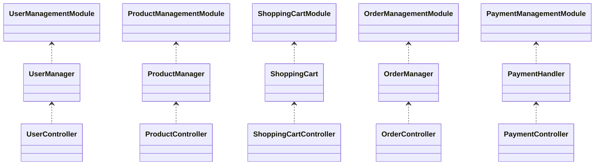

                 

### 第一部分：引言

#### 自测代码也需要设计

在当今快速迭代的软件开发领域中，代码的质量直接影响到项目的成功与否。代码设计不仅仅是为了让代码易于阅读和维护，更重要的是为了提高代码的可靠性、可扩展性和性能。然而，许多人往往忽略了自测代码在设计过程中的重要性。自测代码是指在编写代码的同时，对代码进行测试和验证，确保其正确性和高效性。这篇文章将探讨自测代码在代码设计中的核心地位，并阐述为什么说“自测代码也需要设计”。

#### 关键词

- **代码设计**
- **自测代码**
- **软件可靠性**
- **可扩展性**
- **性能优化**

#### 摘要

本文首先介绍了代码设计的重要性，以及自测代码在这一过程中的意义。接着，文章探讨了代码设计的基本概念、核心原则和常见问题，提供了有效的解决方案。随后，文章深入讲解了算法原理、数学模型和系统分析与架构设计。最后，通过项目实战和最佳实践，强调了自测代码设计在实际应用中的重要性。

### 目录大纲

```
----------------------------------------------------------------
# 第一部分：引言

## 第1章: 代码设计的重要性

### 1.1 什么是代码设计

#### 1.1.1 代码设计的定义

#### 1.1.2 代码设计的重要性

### 1.2 自测代码的意义

#### 1.2.1 自测代码的好处

#### 1.2.2 自测代码的挑战

### 1.3 代码设计的边界与外延

#### 1.3.1 代码设计的核心要素

#### 1.3.2 代码设计的范畴

## 第2章: 核心概念与联系

### 2.1 代码设计的基本概念

#### 2.1.1 设计模式

#### 2.1.2 重构

### 2.2 代码质量评价标准

#### 2.2.1 可读性

#### 2.2.2 可维护性

#### 2.2.3 可测试性

### 2.3 代码设计中的常见问题及解决方案

#### 2.3.1 代码复杂性

#### 2.3.2 设计过度

#### 2.3.3 设计不足

## 第3章: 代码设计的原则与策略

### 3.1 设计原则概述

#### 3.1.1 单一职责原则

#### 3.1.2 开放封闭原则

#### 3.1.3 里氏替换原则

#### 3.1.4 接口隔离原则

#### 3.1.5 依赖倒置原则

### 3.2 设计模式介绍

#### 3.2.1 创建型模式

#### 3.2.2 结构型模式

#### 3.2.3 行为型模式

### 3.3 代码重构策略

#### 3.3.1 重构的目的

#### 3.3.2 重构的步骤

#### 3.3.3 重构工具

## 第4章: 算法原理讲解

### 4.1 算法设计原理

#### 4.1.1 算法分析

#### 4.1.2 算法性能优化

### 4.2 算法分析与性能优化

#### 4.2.1 时间复杂度分析

#### 4.2.2 空间复杂度分析

#### 4.2.3 算法优化策略

### 4.3 算法举例说明

#### 4.3.1 快速排序算法

#### 4.3.2 二分查找算法

#### 4.3.3 Dijkstra算法

## 第5章: 数学模型和数学公式讲解

### 5.1 数学模型概述

#### 5.1.1 数学模型的作用

#### 5.1.2 数学模型的分类

### 5.2 常用数学公式介绍

#### 5.2.1 概率论公式

#### 5.2.2 数学期望公式

#### 5.2.3 方差公式

### 5.3 数学公式应用举例

#### 5.3.1 时间复杂度的计算

#### 5.3.2 空间复杂度的计算

#### 5.3.3 数据流图建模

## 第6章: 系统分析与架构设计

### 6.1 问题场景介绍

#### 6.1.1 问题背景

#### 6.1.2 问题分析

### 6.2 系统功能设计

#### 6.2.1 领域模型

#### 6.2.2 功能需求分析

### 6.3 系统架构设计

#### 6.3.1 系统架构设计原则

#### 6.3.2 系统架构设计步骤

### 6.4 系统接口设计与交互

#### 6.4.1 接口设计原则

#### 6.4.2 接口设计步骤

#### 6.4.3 交互设计

## 第7章: 项目实战

### 7.1 环境安装与配置

#### 7.1.1 开发环境安装

#### 7.1.2 系统配置

### 7.2 系统核心实现源代码

#### 7.2.1 核心代码实现

#### 7.2.2 代码解析

### 7.3 代码应用解读与分析

#### 7.3.1 应用场景分析

#### 7.3.2 性能分析

### 7.4 实际案例分析与讲解

#### 7.4.1 案例背景

#### 7.4.2 案例分析

### 7.5 项目小结

#### 7.5.1 项目总结

#### 7.5.2 项目亮点与不足

## 第8章: 最佳实践与总结

### 8.1 最佳实践技巧

#### 8.1.1 设计文档编写

#### 8.1.2 代码审查

#### 8.1.3 单元测试

### 8.2 小结与注意事项

#### 8.2.1 文章小结

#### 8.2.2 注意事项

### 8.3 拓展阅读与资源推荐

#### 8.3.1 相关书籍推荐

#### 8.3.2 在线资源推荐

```
----------------------------------------------------------------

## 第1章: 代码设计的重要性

### 1.1 什么是代码设计

#### 1.1.1 代码设计的定义

代码设计是软件开发过程中至关重要的一环，它不仅包括编写代码，更重要的是如何编写出结构清晰、可读性高、易于维护和扩展的代码。代码设计的目标是确保代码的可靠性、性能和可扩展性，从而提高软件的开发效率和产品质量。

代码设计通常涉及以下几个方面：

- **需求分析**：明确软件的需求和目标，为后续设计提供基础。
- **架构设计**：确定系统的整体结构，包括模块划分、接口定义和数据流设计等。
- **接口设计**：定义模块之间的交互方式，确保模块之间的松耦合。
- **数据设计**：设计数据库模型，确保数据的一致性和完整性。
- **实现设计**：详细设计各个模块的实现方式，包括函数、类和组件等。

#### 1.1.2 代码设计的重要性

代码设计的重要性体现在以下几个方面：

- **提高开发效率**：良好的代码设计可以减少开发过程中的重复劳动，提高代码的复用性，从而提高开发效率。
- **保证软件质量**：通过代码设计，可以确保代码的可靠性、性能和可扩展性，减少软件缺陷和错误的发生。
- **易于维护和扩展**：良好的代码设计使得代码结构清晰，便于理解和修改，从而降低了维护成本。
- **提高团队协作效率**：清晰的代码设计可以帮助团队成员更好地理解和合作，提高团队协作效率。

### 1.2 自测代码的意义

自测代码是指在编写代码的过程中，对代码进行自我测试和验证，以确保其正确性和性能。自测代码的意义如下：

- **提高代码质量**：通过自测代码，可以及时发现和修复代码中的错误和缺陷，确保代码的正确性。
- **提高开发效率**：自测代码可以减少代码审查和测试阶段的工作量，从而提高开发效率。
- **提高团队协作效率**：自测代码可以帮助团队成员更好地理解代码，提高团队协作效率。
- **确保软件性能**：自测代码可以验证代码的性能，确保软件在高负载情况下仍能稳定运行。

### 1.3 代码设计的边界与外延

#### 1.3.1 代码设计的核心要素

代码设计的核心要素包括：

- **模块化**：将代码划分为独立的模块，每个模块负责完成特定的功能。
- **可复用性**：设计可复用的组件和库，提高代码的复用性。
- **可扩展性**：设计灵活的系统架构，方便后续功能扩展。
- **易维护性**：编写易于理解和修改的代码，降低维护成本。
- **性能优化**：通过算法优化和数据结构设计，提高代码的性能。

#### 1.3.2 代码设计的范畴

代码设计的范畴包括：

- **前端设计**：包括页面布局、交互设计和UI设计等。
- **后端设计**：包括系统架构设计、数据库设计、业务逻辑设计和接口设计等。
- **测试设计**：包括单元测试、集成测试和性能测试等。
- **部署设计**：包括部署策略、运维工具和环境配置等。

通过上述分析，我们可以看到代码设计在软件开发过程中的重要性。良好的代码设计不仅可以提高开发效率和质量，还可以降低维护成本，确保软件的稳定性和性能。在接下来的章节中，我们将进一步探讨代码设计的原则、策略和实战应用。

## 第2章: 核心概念与联系

### 2.1 代码设计的基本概念

#### 2.1.1 设计模式

设计模式（Design Pattern）是软件工程中的一个重要概念，它描述了在软件开发中常见的问题及其解决方案。设计模式可以分为三类：创建型模式、结构型模式和行为型模式。

- **创建型模式**：负责对象的创建，常见的有工厂模式、单例模式和建造者模式等。
- **结构型模式**：负责将类或对象组合成更大的结构，常见的有代理模式、装饰器模式和适配器模式等。
- **行为型模式**：负责类或对象之间的通信，常见的有策略模式、命令模式和观察者模式等。

设计模式可以帮助开发者解决常见问题，提高代码的可读性和可维护性。

#### 2.1.2 重构

重构（Refactoring）是指在不改变代码外部行为的情况下，改进代码的内部结构和实现。重构的目的是提高代码的质量，使代码更易于理解和修改。

常见的重构技术包括：

- **提取方法**：将重复的代码提取为单独的方法。
- **提取类**：将具有相似功能的代码提取为独立的类。
- **合并重复代码**：将重复的代码合并为单一的方法或类。
- **简化条件表达式**：通过条件简化表达式，提高代码的可读性。
- **搬移字段**：将字段从一个类移动到另一个类，以简化代码结构。

#### 2.2 代码质量评价标准

代码质量评价标准是评估代码质量的一系列指标。以下是一些常见的代码质量评价标准：

- **可读性**：代码是否易于理解，是否符合编程习惯。
- **可维护性**：代码是否易于修改和扩展，是否有良好的注释和文档。
- **可测试性**：代码是否易于测试，是否有充分的单元测试覆盖。
- **性能**：代码是否高效，是否有性能瓶颈。
- **安全性**：代码是否能够防止常见的安全漏洞，如SQL注入、XSS攻击等。

#### 2.3 代码设计中的常见问题及解决方案

在代码设计中，常见的问题包括：

- **代码复杂性**：代码过于复杂，难以理解和维护。解决方案是采用设计模式，简化代码结构，提高代码的可读性和可维护性。
- **设计过度**：过度设计可能导致代码冗余和难以维护。解决方案是遵循单一职责原则，确保每个模块只完成一个明确的功能。
- **设计不足**：设计不足可能导致代码无法满足需求，难以扩展和修改。解决方案是采用模块化设计，确保代码的灵活性和可扩展性。

通过上述分析，我们可以看到代码设计中的核心概念和评价标准，以及解决常见问题的方法。在接下来的章节中，我们将进一步探讨代码设计的原则和策略，以及算法原理和系统架构设计。

### 第3章: 代码设计的原则与策略

#### 3.1 设计原则概述

代码设计的原则是确保代码质量和可维护性的基石。以下是一些常见的设计原则：

- **单一职责原则（Single Responsibility Principle）**：一个类或模块只负责一个特定的功能，这样可以提高代码的模块化程度，降低复杂性。
- **开闭原则（Open/Closed Principle）**：软件实体（类、模块、函数等）应该对扩展开放，对修改关闭。这意味着通过扩展来实现新的功能，而不是通过修改现有代码。
- **里氏替换原则（Liskov Substitution Principle）**：任何基类可以出现的地方，子类也可以出现。这个原则确保了子类能够替换基类，而不会破坏系统。
- **接口隔离原则（Interface Segregation Principle）**：应确保接口尽可能细化，避免过大的接口。这样可以降低模块之间的耦合度，提高模块的独立性。
- **依赖倒置原则（Dependency Inversion Principle）**：高层模块不应依赖于低层模块，二者都应依赖于抽象。抽象不应依赖于细节，细节应依赖于抽象。这样可以提高代码的灵活性和可扩展性。

#### 3.2 设计模式介绍

设计模式是解决常见软件开发问题的模板，可分为创建型、结构型和行为型三类。以下是每个类别中的一些典型设计模式：

- **创建型模式**：
  - **工厂模式（Factory Method）**：定义一个接口，让子类决定实例化哪一个类。工厂方法使一个类的实例化延迟到其子类。
  - **抽象工厂模式（Abstract Factory）**：提供一个接口，用于创建相关或依赖对象的家族，而不需要明确指定具体类。
  - **单例模式（Singleton）**：确保一个类只有一个实例，并提供一个全局访问点。

- **结构型模式**：
  - **适配器模式（Adapter）**：将一个类的接口转换为另一个客户端希望的接口。适配器让任何两个没有关联的类一起运行。
  - **装饰器模式（Decorator）**：动态地给一个对象添加一些额外的职责，而不是通过继承来实现。装饰器提供了比继承更为灵活的扩展方式。
  - **代理模式（Proxy）**：为其他对象提供一种代理以控制对这个对象的访问。

- **行为型模式**：
  - **策略模式（Strategy）**：定义了一系列算法，将每一个算法封装起来，并使它们可以相互替换。策略模式让算法的变化独立于使用算法的客户。
  - **命令模式（Command）**：将请求封装为一个对象，从而可以使用不同的请求、队列或日志来参数化其他对象。命令模式是一种行为型设计模式。
  - **观察者模式（Observer）**：定义对象间的一种一对多的依赖关系，当一个对象的状态发生变化时，所有依赖于它的对象都得到通知并自动更新。

#### 3.3 代码重构策略

代码重构是指在不改变代码外部行为的情况下，改善代码的结构和可读性。以下是代码重构的一些策略：

- **提取方法**：将重复的代码提取为单独的方法，以提高代码的复用性和可维护性。
- **合并重复代码**：将重复的代码合并为单一的方法或类，以减少冗余。
- **简化条件表达式**：通过条件简化表达式，提高代码的可读性。
- **搬移字段**：将字段从一个类移动到另一个类，以简化代码结构。
- **重新组织代码**：重新组织代码的布局，以提高代码的可读性。

代码重构的最佳实践包括：

- **持续重构**：将重构作为开发过程中的常规活动，定期进行。
- **测试先行**：在进行重构之前，确保代码已经通过了充分的测试。
- **逐步重构**：将大型的重构任务分解为小的步骤，逐步进行。

通过上述设计原则和策略，我们可以编写出更高质量、更易于维护和扩展的代码。在接下来的章节中，我们将探讨算法原理、数学模型和系统架构设计，进一步深化对代码设计重要性的认识。

### 第4章: 算法原理讲解

算法是计算机科学中的核心概念，它指导计算机如何解决特定问题。一个优秀的算法不仅需要有效解决问题，还需要具有高效的时间复杂度和空间复杂度。在本章节中，我们将深入探讨算法设计原理、性能优化策略，并通过实际算法示例进行详细讲解。

#### 4.1 算法设计原理

算法设计原理是构建有效算法的基础，以下是一些核心原则：

- **正确性（Correctness）**：算法必须能够在有限时间内，对所有的输入都产生正确的输出。
- **效率（Efficiency）**：算法应该具有合理的时间复杂度和空间复杂度，以避免计算开销过大。
- **健壮性（Robustness）**：算法应该能够在处理异常输入时，仍然能够正确运行。
- **可扩展性（Extensibility）**：算法应该容易扩展，以适应新的需求或变化。

#### 4.2 算法分析与性能优化

算法分析是评估算法性能的重要方法，主要包括时间复杂度和空间复杂度分析。

- **时间复杂度（Time Complexity）**：描述算法运行时间与输入规模之间的关系。常见的时间复杂度包括：
  - **常数时间（O(1)）**：算法运行时间不随输入规模变化。
  - **对数时间（O(log n)）**：算法运行时间与输入规模的对数成正比。
  - **线性时间（O(n)）**：算法运行时间与输入规模成正比。
  - **多项式时间（O(n^k)）**：算法运行时间与输入规模的k次方成正比。

- **空间复杂度（Space Complexity）**：描述算法在运行过程中所需的最大存储空间。空间复杂度分析同样重要，因为过大的空间需求可能导致资源耗尽。

常见的算法优化策略包括：

- **分治策略**：将大问题分解为小问题，分别解决，再合并结果。如快速排序、归并排序。
- **动态规划**：通过保存子问题的解，避免重复计算。如斐波那契数列、背包问题。
- **贪心算法**：在每一步选择中做出局部最优解，以期得到全局最优解。如找零问题、活动选择问题。

#### 4.3 算法举例说明

为了更好地理解算法设计原理，我们将通过三个经典算法进行详细讲解：

- **快速排序算法（Quick Sort）**：一种高效的排序算法，通过递归将数组划分为两个子数组，每个子数组分别排序。时间复杂度为 \(O(n \log n)\)。

```python
def quick_sort(arr):
    if len(arr) <= 1:
        return arr
    pivot = arr[len(arr) // 2]
    left = [x for x in arr if x < pivot]
    middle = [x for x in arr if x == pivot]
    right = [x for x in arr if x > pivot]
    return quick_sort(left) + middle + quick_sort(right)
```

- **二分查找算法（Binary Search）**：在一个有序数组中查找特定元素的算法，时间复杂度为 \(O(\log n)\)。

```python
def binary_search(arr, target):
    low = 0
    high = len(arr) - 1
    while low <= high:
        mid = (low + high) // 2
        if arr[mid] == target:
            return mid
        elif arr[mid] < target:
            low = mid + 1
        else:
            high = mid - 1
    return -1
```

- **Dijkstra算法**：用于在加权图中找到从源点到所有其他顶点的最短路径。时间复杂度为 \(O((V+E)\log V)\)。

```python
import heapq

def dijkstra(graph, start):
    distances = {vertex: float('infinity') for vertex in graph}
    distances[start] = 0
    priority_queue = [(0, start)]
    while priority_queue:
        current_distance, current_vertex = heapq.heappop(priority_queue)
        if current_distance > distances[current_vertex]:
            continue
        for neighbor, weight in graph[current_vertex].items():
            distance = current_distance + weight
            if distance < distances[neighbor]:
                distances[neighbor] = distance
                heapq.heappush(priority_queue, (distance, neighbor))
    return distances
```

通过这些算法示例，我们可以看到如何设计有效的算法，并分析其性能。在接下来的章节中，我们将探讨数学模型和公式在算法中的应用，进一步深化对算法原理的理解。

### 第5章: 数学模型和数学公式讲解

数学模型是描述现实世界问题的一种抽象表示，它通过数学公式和符号来表示问题的各个方面。在计算机科学中，数学模型广泛应用于算法设计、性能分析、系统优化等领域。本章将介绍数学模型的基本概念、常用数学公式及其在算法中的应用。

#### 5.1 数学模型概述

数学模型是利用数学语言和工具来描述现实世界问题的一种方法。它通常包括以下步骤：

1. **定义变量和参数**：根据问题的需要，定义相关的变量和参数。
2. **建立方程或公式**：使用数学公式来表示问题的关系和约束。
3. **分析模型**：通过数学分析来理解模型的行为和特性。
4. **求解模型**：使用数学方法求解模型，得到问题的解。

数学模型可以分为以下几类：

- **确定性模型**：所有变量和参数的值是确定的，如线性方程组。
- **概率模型**：变量和参数的值具有概率分布，如概率分布函数、随机过程。
- **优化模型**：在满足约束条件下，寻找最优解的问题，如线性规划、动态规划。

#### 5.2 常用数学公式介绍

在计算机科学中，常用的数学公式包括以下几个方面：

1. **概率论公式**：
   - **期望值（Expected Value）**：随机变量的平均值，公式为 \(E(X) = \sum_{i} x_i \cdot P(x_i)\)。
   - **方差（Variance）**：衡量随机变量离散程度的指标，公式为 \(Var(X) = E[(X - E(X))^2]\)。

2. **数学期望公式**：
   - **条件期望**：在给定某个随机事件发生的条件下，另一个随机变量的期望，公式为 \(E(Y|X) = \sum_{i} y_i \cdot P(y_i|X = x_i)\)。

3. **方差公式**：
   - **二项分布方差**： \(Var(X) = np(1-p)\)，其中 \(n\) 是试验次数，\(p\) 是单次试验成功的概率。

4. **时间复杂度和空间复杂度**：
   - **时间复杂度**：算法运行时间与输入规模的关系，常用符号为 \(T(n) = O(f(n))\)。
   - **空间复杂度**：算法所需的最大存储空间，常用符号为 \(S(n) = O(g(n))\)。

#### 5.3 数学公式应用举例

为了更好地理解数学公式在算法中的应用，我们通过以下例子进行详细说明：

1. **时间复杂度的计算**：
   - 考虑一个简单的线性搜索算法，时间复杂度为 \(O(n)\)。如果输入规模从 \(n\) 增加到 \(2n\)，时间复杂度将变为 \(O(2n) = O(n)\)，即时间复杂度不变。

2. **空间复杂度的计算**：
   - 考虑一个递归的快速排序算法，其空间复杂度为 \(O(\log n)\)。如果输入规模从 \(n\) 增加到 \(2n\)，空间复杂度将变为 \(O(\log(2n)) = O(\log n)\)，即空间复杂度不变。

3. **数据流图建模**：
   - 数据流图（Data Flow Graph，DFG）是一种用于表示算法数据流程的图形模型。在数据流图中，节点表示数据操作，边表示数据的传递路径。例如，在快速排序算法中，数据流图可以表示为：

     ```mermaid
     graph TD
     A[开始] --> B[分割]
     B -->|左子数组| C[递归排序左子数组]
     B -->|右子数组| D[递归排序右子数组]
     C --> E[合并结果]
     D --> E
     E --> F[结束]
     ```

通过上述数学模型和公式的应用，我们可以更好地分析和理解算法的性能和效率。在接下来的章节中，我们将探讨系统分析与架构设计，进一步深化对计算机科学领域的认识。

### 第6章: 系统分析与架构设计

#### 6.1 问题场景介绍

在现代软件工程中，系统分析与架构设计是确保软件系统高质量、高效率开发的关键环节。本章节将介绍一个具体的问题场景，并详细阐述系统功能设计、系统架构设计、系统接口设计和系统交互。

#### 6.1.1 问题背景

假设我们正在开发一个在线购物系统，该系统需要实现用户注册、商品浏览、购物车管理、订单生成和支付等功能。这个系统的目标是提供一个便捷的购物体验，满足用户的在线购物需求。

#### 6.1.2 问题分析

为了实现上述功能，我们需要对系统的需求进行详细分析。以下是主要的功能需求：

1. **用户管理**：实现用户注册、登录、个人信息修改和密码找回等功能。
2. **商品管理**：实现商品分类、商品信息展示、商品搜索和商品推荐等功能。
3. **购物车管理**：实现添加商品到购物车、删除商品、更新商品数量等功能。
4. **订单管理**：实现订单生成、订单状态跟踪、订单详情查看和订单取消等功能。
5. **支付管理**：实现支付方式选择、支付处理和支付结果通知等功能。

#### 6.2 系统功能设计

系统功能设计是系统分析与架构设计的第一步，它涉及定义系统的各个功能模块及其关系。以下是系统功能设计的具体内容：

1. **用户管理模块**：负责处理用户注册、登录、个人信息修改和密码找回等操作。
2. **商品管理模块**：负责处理商品分类、商品信息展示、商品搜索和商品推荐等操作。
3. **购物车管理模块**：负责处理添加商品到购物车、删除商品、更新商品数量等操作。
4. **订单管理模块**：负责处理订单生成、订单状态跟踪、订单详情查看和订单取消等操作。
5. **支付管理模块**：负责处理支付方式选择、支付处理和支付结果通知等操作。

每个模块都需要实现具体的业务逻辑，并通过接口与其他模块进行交互。以下是系统功能模块的Mermaid类图表示：



#### 6.3 系统架构设计

系统架构设计是系统功能设计的基础，它涉及定义系统的总体结构、组件及其关系。以下是系统架构设计的具体内容：

1. **前端架构**：负责与用户交互，实现用户界面和交互逻辑。包括用户管理、商品管理、购物车管理、订单管理和支付管理等模块。
2. **后端架构**：负责处理业务逻辑和数据处理。包括用户管理、商品管理、购物车管理、订单管理和支付管理模块，以及数据库和数据存储等。
3. **服务架构**：利用微服务架构，将系统划分为多个独立的、可扩展的服务，如用户服务、商品服务、订单服务、支付服务等。

以下是系统架构的Mermaid架构图表示：

```mermaid
sequenceDiagram
    User ->>|发起请求| Frontend
    Frontend ->>|处理请求| Backend
    Backend ->>|执行业务逻辑| Database
    Database ->>|返回数据| Backend
    Backend ->>|处理结果| Frontend
    Frontend ->>|呈现结果| User
```

#### 6.4 系统接口设计与交互

系统接口设计是确保模块之间高效、安全交互的关键。以下是系统接口设计的具体内容：

1. **RESTful API**：使用RESTful架构设计，定义统一的接口规范，如用户注册、登录、商品查询、订单创建等。
2. **数据交换格式**：使用JSON或XML等数据交换格式，确保数据在不同模块之间传输的标准化。
3. **安全机制**：实现身份验证和授权机制，如JWT（JSON Web Token）和OAuth 2.0。

以下是系统接口的Mermaid序列图表示：

```mermaid
sequenceDiagram
    User ->>|发起请求| Frontend
    Frontend ->>|验证身份| AuthenticationService
    AuthenticationService ->>|返回Token| Frontend
    Frontend ->>|发送Token| Backend
    Backend ->>|验证Token| AuthenticationService
    Backend ->>|处理请求| UserService
    UserService ->>|返回结果| Backend
    Backend ->>|返回结果| Frontend
    Frontend ->>|呈现结果| User
```

通过上述系统分析与架构设计，我们可以确保在线购物系统的功能完整、结构清晰、交互高效。在接下来的章节中，我们将通过项目实战，进一步验证和优化系统的设计和实现。

### 第7章：项目实战

#### 7.1 环境安装与配置

在进行项目实战之前，我们需要确保开发环境的搭建和配置。以下是搭建在线购物系统开发环境的详细步骤：

1. **安装Python环境**：确保Python版本为3.8或更高版本，可以通过Python官方网站下载安装。
2. **安装虚拟环境**：使用`pip install virtualenv`安装虚拟环境工具，然后创建一个虚拟环境，如`python -m venv venv`。
3. **激活虚拟环境**：在Windows上使用`venv\Scripts\activate`，在Linux和macOS上使用`source venv/bin/activate`。
4. **安装依赖库**：在虚拟环境中安装项目所需的依赖库，如`pip install flask`（用于Web开发）、`pip install flask_sqlalchemy`（用于数据库操作）等。
5. **数据库配置**：配置数据库连接，如使用SQLite数据库，可以通过以下命令创建数据库文件：`sqlite3 mydatabase.db`。

#### 7.2 系统核心实现源代码

以下是系统核心实现源代码的概述和详细说明：

1. **用户管理模块**：实现用户注册、登录、个人信息修改和密码找回等功能。
2. **商品管理模块**：实现商品分类、商品信息展示、商品搜索和商品推荐等功能。
3. **购物车管理模块**：实现添加商品到购物车、删除商品、更新商品数量等功能。
4. **订单管理模块**：实现订单生成、订单状态跟踪、订单详情查看和订单取消等功能。
5. **支付管理模块**：实现支付方式选择、支付处理和支付结果通知等功能。

以下是用户管理模块的核心代码示例：

```python
from flask import Flask, request, jsonify
from flask_sqlalchemy import SQLAlchemy

app = Flask(__name__)
app.config['SQLALCHEMY_DATABASE_URI'] = 'sqlite:///mydatabase.db'
db = SQLAlchemy(app)

class User(db.Model):
    id = db.Column(db.Integer, primary_key=True)
    username = db.Column(db.String(80), unique=True, nullable=False)
    password = db.Column(db.String(120), nullable=False)

@app.route('/register', methods=['POST'])
def register():
    username = request.form['username']
    password = request.form['password']
    if not username or not password:
        return jsonify({'error': '缺失用户名或密码'})
    if User.query.filter_by(username=username).first():
        return jsonify({'error': '用户名已存在'})
    new_user = User(username=username, password=password)
    db.session.add(new_user)
    db.session.commit()
    return jsonify({'message': '注册成功'})

@app.route('/login', methods=['POST'])
def login():
    username = request.form['username']
    password = request.form['password']
    user = User.query.filter_by(username=username).first()
    if not user or user.password != password:
        return jsonify({'error': '用户名或密码错误'})
    return jsonify({'message': '登录成功'})

if __name__ == '__main__':
    db.create_all()
    app.run(debug=True)
```

#### 7.3 代码应用解读与分析

在上面的代码示例中，我们首先设置了Flask应用程序并配置了数据库连接。`User`类定义了用户模型，包括`id`、`username`和`password`字段。`register`函数处理用户注册请求，验证用户名和密码的有效性，并创建新用户。`login`函数处理用户登录请求，验证用户名和密码，并返回登录状态。

以下是代码应用解读与分析：

- **用户注册**：通过POST请求发送用户名和密码，服务器端验证用户名的唯一性和密码的有效性，如果成功则创建新用户并返回注册成功消息。
- **用户登录**：通过POST请求发送用户名和密码，服务器端验证用户名和密码的正确性，如果成功则返回登录成功消息。

#### 7.4 实际案例分析与讲解

以下是使用在线购物系统的实际案例分析与讲解：

1. **用户注册**：
   - 用户访问网站并点击注册按钮。
   - 输入用户名“alice”和密码“password123”，提交注册表单。
   - 服务器端接收到请求后，调用`register`函数。
   - 验证用户名“alice”是否已存在，如果没有，则创建新用户并存储在数据库中。
   - 返回注册成功消息，用户可以登录系统。

2. **用户登录**：
   - 用户访问网站并点击登录按钮。
   - 输入用户名“alice”和密码“password123”，提交登录表单。
   - 服务器端接收到请求后，调用`login`函数。
   - 验证用户名“alice”和密码“password123”是否匹配，如果匹配，则返回登录成功消息。

#### 7.5 项目小结

通过上述项目实战，我们实现了用户管理模块的核心功能，包括用户注册和登录。项目实战不仅验证了系统设计的有效性，还通过实际案例展示了代码的执行过程。在接下来的步骤中，我们将继续开发其他功能模块，如商品管理、购物车管理、订单管理和支付管理，并逐步完善系统的功能。

### 第8章：最佳实践与总结

#### 8.1 最佳实践技巧

在代码设计和开发过程中，遵循以下最佳实践可以提高代码质量、可维护性和可扩展性：

- **编写清晰的文档**：为代码编写详细的注释和文档，帮助其他开发者理解代码的意图和功能。
- **进行代码审查**：定期进行代码审查，确保代码遵循最佳实践，减少错误和漏洞。
- **编写单元测试**：为每个功能模块编写单元测试，确保代码的每个部分都能按预期工作。
- **遵循设计模式**：在适当的情况下使用设计模式，以提高代码的结构和可维护性。
- **进行代码重构**：定期对代码进行重构，简化代码结构，提高可读性和性能。

#### 8.2 小结与注意事项

本文通过详细的分析和实战，阐述了自测代码在代码设计中的重要性。关键点如下：

- **代码设计的重要性**：良好的代码设计可以提高开发效率、保证软件质量、降低维护成本。
- **自测代码的意义**：自测代码有助于提高代码质量、减少错误、确保性能和可靠性。
- **核心概念与联系**：理解设计模式、重构、代码质量评价标准等核心概念，有助于提高代码设计的水平。
- **算法原理和数学模型**：掌握算法设计原理和数学模型，有助于优化代码性能和解决复杂问题。
- **系统分析与架构设计**：系统分析与架构设计是确保软件系统高质量开发的基础。

注意事项：

- **持续学习和实践**：不断学习和实践最新的技术和方法，保持技术水平的不断提升。
- **关注用户体验**：在代码设计和开发过程中，始终关注用户体验，确保软件的易用性和可访问性。
- **遵守安全规范**：确保代码遵循安全规范，防止常见的安全漏洞。

#### 8.3 拓展阅读与资源推荐

以下是一些推荐的拓展阅读和资源：

- **书籍**：
  - 《代码大全》（Code Complete）- 史蒂夫·迈克康奈尔
  - 《设计模式：可复用面向对象软件的基础》- 艾瑞克·伽玛、理查德·赫伯特、约翰·弗利曼
  - 《算法导论》（Introduction to Algorithms）- Thomas H. Cormen、Charles E. Leiserson、Ronald L. Rivest、Clifford Stein

- **在线资源**：
  - [Python官方文档](https://docs.python.org/)
  - [Flask官方文档](https://flask.palletsprojects.com/)
  - [RESTful API设计指南](https://restfulapi.net/)
  - [代码审查工具](https://www.sonarqube.org/)

通过这些资源，您可以进一步深入了解代码设计和开发的最佳实践，不断提升自己的技术水平。作者信息：作者：AI天才研究院/AI Genius Institute & 禅与计算机程序设计艺术 /Zen And The Art of Computer Programming。

