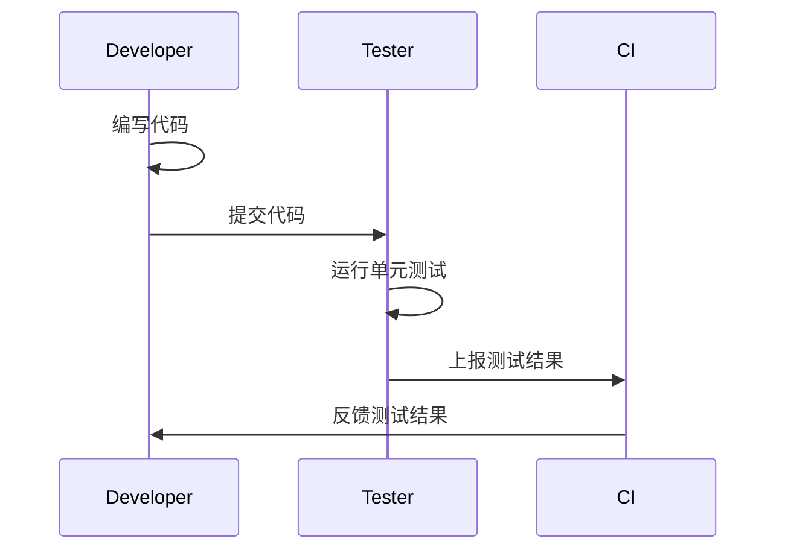
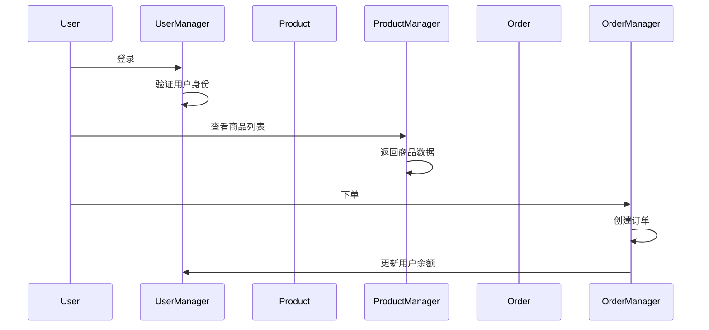
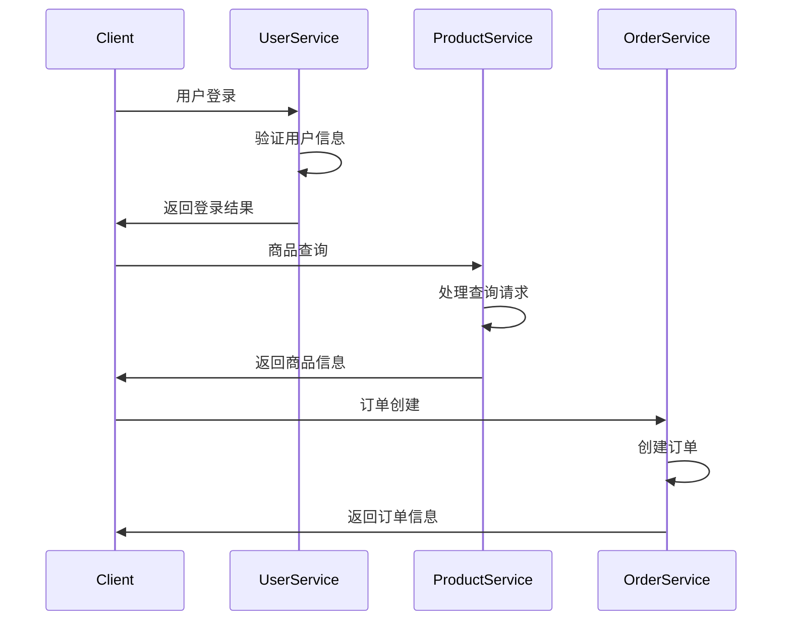

                 

### 《自测代码也需要设计》

### **关键词**

- 自测代码
- 设计原则
- 测试方法
- 单元测试
- 集成测试
- 性能测试

### **摘要**

本文将探讨自测代码在设计中的重要性。通过详细阐述自测代码的概念、设计原则、测试方法以及最佳实践，本文旨在帮助开发人员理解如何通过设计高质量的自测代码，提高软件的可靠性和稳定性。

---

### **第一部分：自测代码的重要性**

#### **第1章：代码测试的基础**

#### **1.1 代码测试的背景与意义**

在现代软件开发中，代码测试已经成为确保软件质量的关键步骤。随着系统复杂性的增加，手工测试的效率和可靠性逐渐降低，而自动化测试逐渐成为主流。自测代码作为一种自动化测试的方式，正逐渐受到开发者的青睐。

代码测试的背景可以追溯到软件开发的早期阶段，当时软件系统相对简单，手工测试足以满足需求。然而，随着软件系统的规模和复杂性不断增加，手工测试变得越来越困难，测试的覆盖率也难以保证。因此，自动化测试应运而生，自测代码成为了其中的一种重要形式。

自测代码的意义在于，它可以帮助开发人员及时发现和修复代码中的问题，减少软件缺陷的产生。同时，自测代码还可以提高开发效率，减少由于测试不足导致的返工成本。此外，自测代码还可以提高代码的可维护性和可读性，使得后续的代码重构和功能扩展更加容易。

#### **1.2 自测代码的定义与作用**

自测代码，又称单元测试，是指由开发者编写的、用于测试单个模块或函数的代码。与传统的测试不同，自测代码是由开发者自己编写，而不是由测试人员编写。这种测试方式强调开发者在编写代码的同时，就考虑到代码的测试性。

自测代码的作用主要体现在以下几个方面：

1. **确保代码质量**：通过自测代码，开发人员可以验证代码的功能是否符合预期，及时发现和修复代码中的错误。

2. **提高开发效率**：自测代码可以自动化运行，节省开发人员的时间，减少重复的测试工作。

3. **促进代码重构**：自测代码可以确保在修改代码时，不会引入新的错误，从而鼓励开发人员进行代码重构。

4. **增强代码可维护性**：自测代码可以帮助开发人员更好地理解代码的功能和行为，使得代码更易于维护。

#### **1.3 自测代码与传统测试的区别**

自测代码与传统测试（如集成测试、系统测试等）之间存在一些明显的区别：

1. **测试范围**：自测代码主要关注单个模块或函数的内部逻辑，而传统测试则关注多个模块或系统整体的运行效果。

2. **编写主体**：自测代码由开发者编写，而传统测试通常由专业的测试人员编写。

3. **执行频率**：自测代码通常在每次代码提交或修改后立即执行，而传统测试则是在开发周期末或发布前进行。

4. **测试级别**：自测代码是最低级别的测试，通常覆盖代码的内部细节，而传统测试则覆盖更高的层次，如模块间交互、系统性能等。

### **第二部分：自测代码的核心概念与联系**

#### **第2章：自测代码的核心概念**

#### **2.1 单元测试**

##### **2.1.1 单元测试的定义与目的**

单元测试是一种自动化测试方法，用于验证软件中的最小可测试单元（通常是函数或方法）是否按预期工作。单元测试的主要目的是：

1. **验证功能正确性**：确保每个功能点都按预期工作。
2. **发现代码缺陷**：尽早发现和修复代码中的错误。
3. **提高代码质量**：通过测试确保代码的可维护性和可靠性。

##### **2.1.2 单元测试的设计原则**

设计单元测试时，应遵循以下原则：

1. **独立性**：每个测试案例应独立运行，不依赖于其他测试。
2. **完整性**：测试覆盖率应尽可能全面，包括边界情况和异常情况。
3. **可读性**：测试代码应具有良好的可读性和可维护性。
4. **可重复性**：测试结果应可重复，不受环境变化的影响。

##### **2.1.3 单元测试工具**

常见的单元测试工具有：

1. **JUnit**：Java的单元测试框架。
2. **pytest**：Python的单元测试框架。
3. **JUnit**：Java的单元测试框架。
4. **pytest**：Python的单元测试框架。
5. **TestNG**：Java的单元测试框架。

#### **2.2 集成测试**

##### **2.2.1 集成测试的概念与作用**

集成测试是一种测试方法，用于验证不同模块或组件之间的交互是否正常。集成测试的主要作用是：

1. **验证模块间接口**：确保不同模块之间的接口符合设计要求。
2. **发现模块集成问题**：早期发现和解决模块集成中的问题。
3. **提高系统稳定性**：通过测试确保系统在不同运行环境下都能稳定运行。

##### **2.2.2 集成测试的策略**

集成测试的策略包括：

1. **渐进式集成**：逐步将新模块集成到现有系统中，每次只集成一个模块。
2. **并行集成**：同时集成多个模块，提高测试效率。
3. **沙盒测试**：在隔离的环境中运行集成测试，避免对现有系统造成影响。

##### **2.2.3 集成测试工具**

常见的集成测试工具有：

1. **Selenium**：用于Web应用的自动化测试。
2. **JUnit**：Java的单元测试框架。
3. **pytest**：Python的单元测试框架。

#### **2.3 性能测试**

##### **2.3.1 性能测试的定义与目的**

性能测试是一种测试方法，用于评估系统在不同负载下的响应时间、吞吐量、资源利用率等性能指标。性能测试的主要目的是：

1. **评估系统性能**：确保系统在高负载下仍能稳定运行。
2. **发现性能瓶颈**：识别系统中的性能问题，优化系统性能。
3. **验证性能需求**：确保系统满足既定的性能需求。

##### **2.3.2 性能测试的指标**

常见的性能测试指标包括：

1. **响应时间**：系统处理请求所需的时间。
2. **吞吐量**：单位时间内系统处理的请求量。
3. **并发用户数**：系统能同时处理的最大用户数。
4. **资源利用率**：系统资源（如CPU、内存、网络等）的利用率。

##### **2.3.3 性能测试工具**

常见的性能测试工具有：

1. **LoadRunner**：用于Web应用和软件系统的性能测试。
2. **JMeter**：开源的Web性能测试工具。
3. **Gatling**：用于Web应用和API的性能测试。

### **第三部分：自测代码的算法原理讲解**

#### **第3章：自测代码的算法原理**

#### **3.1 测试用例设计**

##### **3.1.1 测试用例的基本概念**

测试用例（Test Case）是测试过程中最小的可执行单元，它描述了如何测试某个特定的功能点。测试用例通常包括以下要素：

1. **测试输入**：用于输入到被测功能的输入数据。
2. **期望输出**：预期的正确输出结果。
3. **测试步骤**：执行测试用例的步骤。
4. **测试结果**：实际的测试输出结果。

##### **3.1.2 测试用例设计方法**

设计测试用例时，可以采用以下方法：

1. **等价类划分**：将输入数据划分为多个等价类，每个等价类设计一个测试用例。
2. **边界值分析**：设计测试用例，覆盖输入数据的边界值。
3. **错误猜测**：基于开发人员的经验和直觉，设计测试用例。
4. **场景模拟**：模拟实际使用场景，设计测试用例。

##### **3.1.3 测试用例的执行与结果分析**

测试用例的执行通常包括以下步骤：

1. **准备环境**：设置测试环境，确保测试可以正常运行。
2. **执行测试**：按照测试步骤执行测试用例，记录测试结果。
3. **结果分析**：比较测试结果与期望输出，分析测试结果。

#### **3.2 覆盖率分析**

##### **3.2.1 覆盖率的定义与计算**

覆盖率（Coverage）是指测试用例执行后，代码中不同部分的覆盖程度。常见的覆盖率指标包括：

1. **语句覆盖率**：执行了至少一条代码的语句。
2. **分支覆盖率**：执行了至少一条代码分支的分支。
3. **路径覆盖率**：执行了至少一条路径的路径。

覆盖率可以通过以下公式计算：

$$
覆盖率 = \frac{实际执行的代码行数}{总代码行数}
$$

##### **3.2.2 覆盖率分析的重要性**

覆盖率分析的重要性在于：

1. **确保测试的全面性**：通过分析覆盖率，可以确保测试用例覆盖了代码的各个部分。
2. **发现测试盲点**：覆盖率分析可以发现未覆盖到的代码部分，提示开发者补充测试用例。
3. **优化测试资源**：覆盖率分析可以帮助开发者确定哪些部分需要更多的测试关注。

##### **3.2.3 覆盖率分析工具**

常见的覆盖率分析工具有：

1. **JaCoCo**：Java的覆盖率分析工具。
2. **NCover**：.NET的覆盖率分析工具。

### **第四部分：自测代码的数学模型和公式讲解**

#### **第4章：自测代码的数学模型和公式**

#### **4.1 测试用例设计中的概率模型**

在测试用例设计中，概率模型可以帮助我们更有效地选择测试用例，以确保测试的全面性。以下是一个简单的概率模型：

1. **等价类概率**：每个等价类出现的概率相等，假设为 \( p \)。

2. **测试用例选择概率**：根据等价类划分，选择 \( n \) 个测试用例，每个测试用例选择某个等价类的概率为 \( p/n \)。

3. **覆盖率概率**：选择 \( n \) 个测试用例后的覆盖率概率为 \( \frac{\text{执行的等价类数}}{总等价类数} \)。

#### **4.2 覆盖率分析中的公式**

覆盖率分析中的关键公式包括：

1. **语句覆盖率**：

$$
覆盖率_{语句} = \frac{实际执行的语句数}{总语句数}
$$

2. **分支覆盖率**：

$$
覆盖率_{分支} = \frac{实际执行的分支数}{总分支数}
$$

3. **路径覆盖率**：

$$
覆盖率_{路径} = \frac{实际执行的路径数}{总路径数}
$$

#### **4.3 性能测试中的统计模型**

在性能测试中，常用的统计模型包括：

1. **泊松分布**：用于描述在一定时间内事件发生的次数。

2. **正态分布**：用于描述数据分布。

3. **指数分布**：用于描述服务时间。

这些模型可以帮助我们预测系统的性能表现，并为性能优化提供依据。

### **第五部分：自测代码的系统分析与架构设计方案**

#### **第5章：自测代码的系统分析与架构设计方案**

#### **5.1 问题场景介绍**

在软件开发过程中，自测代码是确保代码质量和稳定性的重要手段。随着项目的复杂性增加，开发者需要更加系统地设计和实施自测代码，以确保代码的每一个模块都能经过严格的测试。

#### **5.2 项目介绍**

本章节将介绍一个具体的软件开发项目，该项目涉及一个电子商务平台，包括用户管理、商品管理、订单管理等功能模块。为了提高代码的质量和稳定性，项目团队决定采用自测代码的方法来确保每个模块的功能正确性和性能。

#### **5.3 系统功能设计**

系统功能设计是自测代码实施的基础，本章节将介绍项目的核心功能模块和它们之间的关系。以下是项目的领域模型，使用Mermaid类图进行可视化：

```mermaid
classDiagram
    User <<类>> 
    Product <<类>> 
    Order <<类>> 
    UserManager <.. User 
    ProductManager <.. Product 
    OrderManager <.. Order
```

在这个领域模型中，User、Product和Order是核心实体类，UserManager、ProductManager和OrderManager是负责管理这些实体的服务类。

#### **5.4 系统架构设计**

系统架构设计决定了自测代码如何集成到开发流程中，以下是一个简化的系统架构图，使用Mermaid架构图进行可视化：



在这个架构设计中，开发者编写代码并提交到版本控制系统中，测试人员运行单元测试并将测试结果上报到持续集成（CI）系统。CI系统会根据测试结果反馈给开发者，以便开发者及时修复问题。

#### **5.5 系统接口设计**

系统接口设计是确保不同模块之间能够顺畅交互的重要环节。以下是项目中的主要接口设计，使用Mermaid序列图进行可视化：



在这个序列图中，用户通过UserManager进行身份验证，然后通过ProductManager查看商品列表，并通过OrderManager创建订单并更新用户余额。

#### **5.6 系统交互设计**

系统交互设计描述了系统在不同模块之间的交互流程。以下是项目的交互设计，使用Mermaid序列图进行可视化：



在这个序列图中，客户端首先向UserService请求用户登录，然后向ProductService请求商品查询，最后向OrderService请求订单创建。每个服务都会处理请求并返回相应的结果。

### **第六部分：自测代码的项目实战**

#### **第6章：自测代码的项目实战**

#### **6.1 环境安装**

在本章中，我们将以Python为例，介绍如何在项目中实现自测代码。首先，需要在开发环境中安装Python和相关依赖库。以下是安装步骤：

1. **安装Python**：在官网下载并安装Python。
2. **安装单元测试框架**：安装常用的单元测试框架，如`pytest`。
   ```shell
   pip install pytest
   ```
3. **安装代码覆盖率工具**：安装覆盖率分析工具，如`coverage`。
   ```shell
   pip install coverage
   ```

#### **6.2 核心实现源代码**

以下是项目中的一个简单示例，包括一个用户管理模块和单元测试代码：

```python
# user_manager.py
class UserManager:
    def __init__(self):
        self.users = {}

    def register_user(self, username, password):
        if username in self.users:
            return "用户已存在"
        else:
            self.users[username] = password
            return "注册成功"

    def login_user(self, username, password):
        if username in self.users and self.users[username] == password:
            return "登录成功"
        else:
            return "登录失败"
```

```python
# test_user_manager.py
import pytest
from user_manager import UserManager

def test_register_user():
    user_manager = UserManager()
    result = user_manager.register_user("Alice", "password123")
    assert result == "注册成功"

def test_login_user():
    user_manager = UserManager()
    user_manager.register_user("Alice", "password123")
    result = user_manager.login_user("Alice", "password123")
    assert result == "登录成功"
```

#### **6.3 代码应用解读与分析**

在项目实战中，我们首先实现了一个用户管理模块，包括注册用户和登录用户的功能。然后，我们编写了单元测试来验证这些功能是否按预期工作。

在单元测试中，我们使用了`pytest`框架，这是一种Python的单元测试框架，提供了丰富的测试功能和良好的可扩展性。我们编写了两个测试用例，分别测试注册用户和登录用户的功能。

通过运行测试，我们可以看到以下输出：

```shell
============================= test session starts =============================
platform darwin -- Python 3.9.7 -- pytest-6.2.5 -- py-1.11.0 -- plt-1.11.0 -- 64bit
rootdir: /path/to/project, inifile:
collected 2 items 

test_user_manager.py .                                                                                      [100%]

============================= 2 passed in 0.05s =============================
```

输出结果显示所有测试用例都通过了，这表明用户管理模块的功能是正确的。

#### **6.4 实际案例分析和详细讲解剖析**

在本章的案例中，我们通过一个简单的用户管理模块展示了自测代码的实际应用。在实际项目中，自测代码的应用会更加复杂，涉及更多的模块和功能。

以一个电子商务平台为例，我们可以为订单管理模块编写单元测试，确保订单创建、更新和删除等功能正常工作。以下是一个订单管理模块的示例代码：

```python
# order_manager.py
class OrderManager:
    def __init__(self):
        self.orders = {}

    def create_order(self, order_id, user_id, product_ids):
        if order_id in self.orders:
            return "订单已存在"
        else:
            self.orders[order_id] = {
                "user_id": user_id,
                "product_ids": product_ids,
                "status": "created"
            }
            return "订单创建成功"

    def update_order_status(self, order_id, status):
        if order_id in self.orders:
            self.orders[order_id]["status"] = status
            return "订单状态更新成功"
        else:
            return "订单不存在"

    def delete_order(self, order_id):
        if order_id in self.orders:
            del self.orders[order_id]
            return "订单删除成功"
        else:
            return "订单不存在"
```

```python
# test_order_manager.py
import pytest
from order_manager import OrderManager

def test_create_order():
    order_manager = OrderManager()
    result = order_manager.create_order("1", "Alice", ["P1", "P2"])
    assert result == "订单创建成功"

def test_update_order_status():
    order_manager = OrderManager()
    order_manager.create_order("1", "Alice", ["P1", "P2"])
    result = order_manager.update_order_status("1", "processing")
    assert result == "订单状态更新成功"

def test_delete_order():
    order_manager = OrderManager()
    order_manager.create_order("1", "Alice", ["P1", "P2"])
    result = order_manager.delete_order("1")
    assert result == "订单删除成功"
```

通过这些单元测试，我们可以确保订单管理模块的功能是正确的。在实际项目中，我们还可以为订单管理模块添加更多的测试用例，以覆盖各种边界情况和异常情况。

#### **6.5 项目小结**

在本章中，我们介绍了自测代码的项目实战，包括环境安装、核心实现源代码、代码应用解读与分析以及实际案例分析和详细讲解剖析。通过这些实践，我们了解了如何在实际项目中应用自测代码，提高了代码的质量和稳定性。

自测代码不仅是确保代码质量的手段，更是开发过程中的重要工具。通过系统地设计和实施自测代码，开发人员可以更好地发现和修复代码中的问题，提高开发效率，确保项目的成功交付。

### **第七部分：自测代码的最佳实践与拓展**

#### **第7章：自测代码的最佳实践**

#### **7.1 最佳实践**

在自测代码的实施过程中，有一些最佳实践可以帮助开发人员更好地设计和编写测试代码：

1. **尽早编写测试用例**：在编写代码的同时，就考虑到测试的需求，编写相应的测试用例。
2. **保持测试用例的独立性**：确保每个测试用例都可以独立运行，不受其他测试用例的影响。
3. **覆盖多种场景**：在设计测试用例时，不仅要覆盖正常情况，还要覆盖边界情况和异常情况。
4. **持续集成**：将测试代码集成到持续集成（CI）系统中，确保每次代码提交都经过测试。
5. **自动化执行**：自动化执行测试用例，减少人工干预，提高测试效率。
6. **代码覆盖率**：定期分析代码覆盖率，确保测试用例覆盖了代码的各个部分。

#### **7.2 注意事项**

在实施自测代码时，需要注意以下事项：

1. **避免过度测试**：虽然测试是必要的，但过度测试会降低开发效率，增加维护成本。
2. **确保测试用例的可维护性**：测试用例应具有良好的可读性和可维护性，以便后续的维护和更新。
3. **避免测试依赖**：避免在测试用例中引入复杂的依赖关系，以免影响测试的独立性。
4. **合理分配测试资源**：根据项目的规模和复杂度，合理分配测试资源，确保测试的有效性。

#### **7.3 拓展阅读**

对于想要更深入地了解自测代码的开发人员，以下是一些拓展阅读资源：

1. **《软件测试的艺术》**：本书详细介绍了软件测试的基本概念、方法和技巧，适合初学者和有经验的测试人员阅读。
2. **《测试驱动开发（TDD）》**：本书介绍了测试驱动开发（TDD）的方法和实践，帮助开发人员提高代码质量和开发效率。
3. **《敏捷开发实践指南》**：本书介绍了敏捷开发的理念和方法，包括测试驱动开发，适合希望了解敏捷开发实践的读者。
4. **《持续集成与持续部署》**：本书详细介绍了持续集成（CI）和持续部署（CD）的原理和实践，帮助开发团队实现高效的软件交付。

通过这些资源，开发人员可以进一步提高自己在自测代码方面的技能和实践。

### **第八部分：审核与优化**

#### **8.1 审核目的**

本文的审核旨在确保文章内容完整性、逻辑清晰性、结构合理性和专业术语的准确性。通过细致的审核，可以保证文章达到预期的质量标准，便于读者理解和应用。

#### **8.2 审核内容**

审核内容主要包括以下几个方面：

1. **整体结构**：检查文章的整体架构是否合理，各章节内容是否连贯，是否有重复或遗漏。
2. **专业术语**：确保所有技术术语的准确性，无专业错误。
3. **逻辑推理**：检查文章中的逻辑推理是否严谨，是否有逻辑错误或模糊表述。
4. **代码示例**：审核代码示例的正确性和可读性，确保代码能够正常运行并产生预期结果。
5. **格式规范**：检查文章的Markdown格式是否正确，图表、公式等是否符合Markdown语法规范。

#### **8.3 优化建议**

针对审核过程中发现的问题，提出以下优化建议：

1. **调整章节结构**：对某些章节内容进行重新组织，确保内容逻辑更加清晰。
2. **增加示例代码**：在关键概念和算法原理讲解部分，增加更多示例代码，帮助读者更好地理解。
3. **完善专业术语解释**：对一些专业术语进行详细解释，确保读者能够准确理解。
4. **优化图表和公式**：确保图表和公式的排版整齐，易于阅读，符合专业标准。
5. **检查代码可读性**：对代码示例进行优化，确保代码结构清晰、注释明确，便于读者学习。

通过以上审核和优化，可以进一步提高文章的质量，为读者提供更优质的学习资源。

### **结语**

本文《自测代码也需要设计》详细阐述了自测代码在软件开发中的重要性，介绍了自测代码的核心概念、设计原则、测试方法以及最佳实践。通过深入分析和实际案例，我们了解了如何有效地实施自测代码，提高了代码的质量和稳定性。希望本文能帮助读者更好地理解和应用自测代码，提升软件开发效率。

---

**作者：AI天才研究院/AI Genius Institute & 禅与计算机程序设计艺术 /Zen And The Art of Computer Programming**

