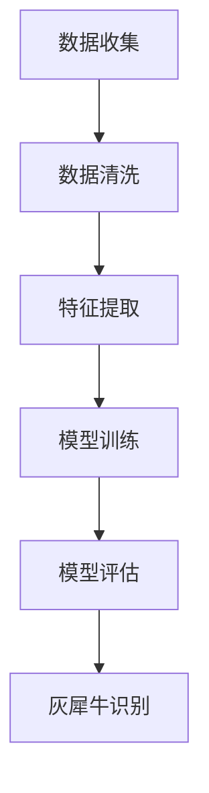
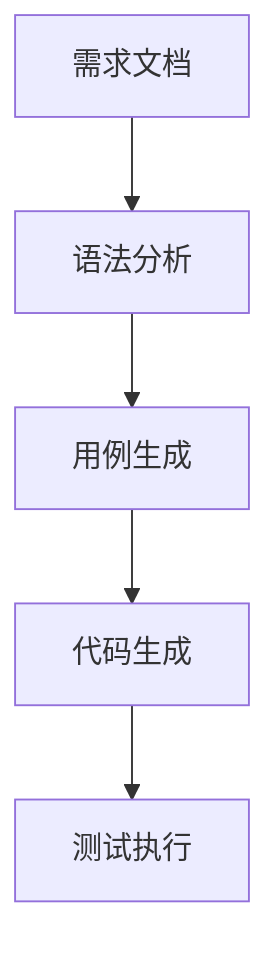
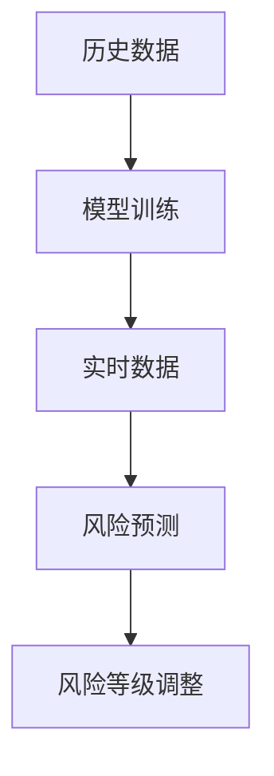
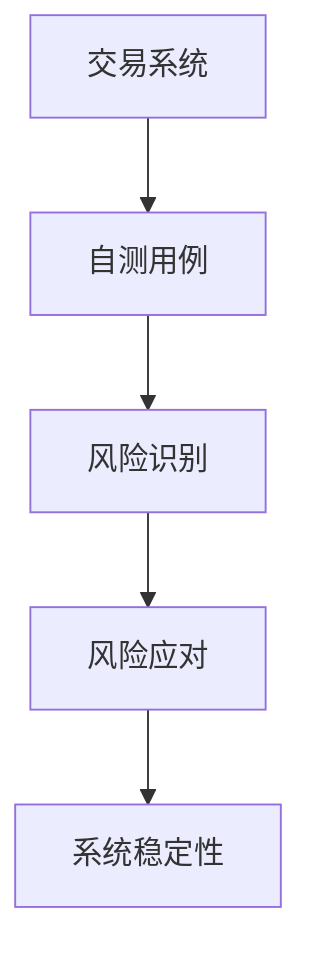
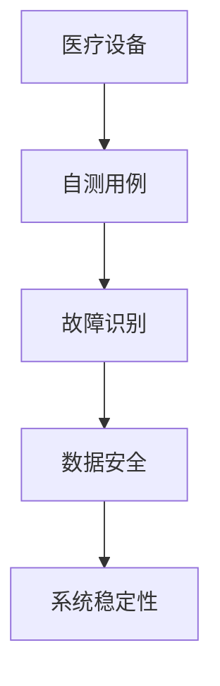
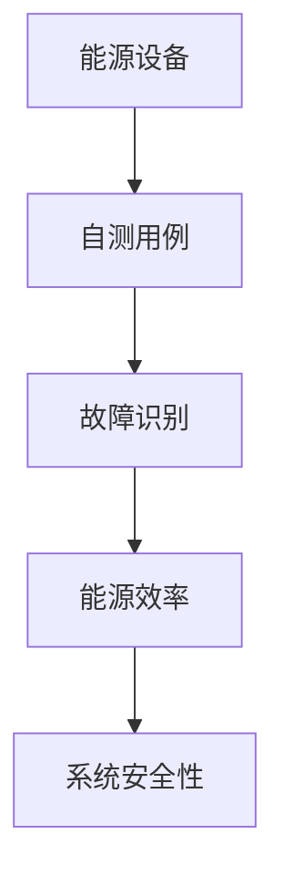

                 

### 《自测用例可能是'灰犀牛'》

#### 关键词：
- 灰犀牛
- 自测用例
- 风险识别
- 自动化测试
- 软件工程

#### 摘要：
本文旨在探讨“灰犀牛”这一概念在软件工程中的应用，特别是在自测用例设计中的潜在影响。通过引入灰犀牛现象及其与自测用例的关联，本文将分析如何利用自测用例识别和应对软件开发过程中可能出现的重大风险，并提供一系列实践方法和案例分析。文章还将展望未来技术发展趋势，讨论灰犀牛与自测用例在软件开发中的应用前景。

## 第一部分：问题背景与概念引入

### 第1章：灰犀牛与自测用例概述

#### 1.1 灰犀牛现象的起源与发展

**1.1.1 灰犀牛的概念**

“灰犀牛”一词最早由米歇尔·渥克（Michel Houellebecq）在其同名著作《灰犀牛：如何应对大概率危机》中提出。该术语用来描述那些显而易见、却又常常被忽视的危机。灰犀牛现象的特征在于其明显的存在和可能带来的巨大影响，但由于种种原因，人们往往选择忽视或逃避面对它们。

灰犀牛现象具有以下特征：
- **高概率性**：灰犀牛事件发生的概率较高，几乎不可避免。
- **显著影响**：一旦发生，灰犀牛事件往往带来严重的后果。
- **显而易见**：灰犀牛问题通常容易被发现，但人们往往选择无视。

**1.1.2 灰犀牛现象的特征与影响**

灰犀牛现象的特征可以从以下几个方面来理解：

1. **潜在威胁**：灰犀牛问题往往是潜在威胁，它们潜伏在软件开发过程中，如果不加以识别和处理，可能会导致项目失败或重大损失。

2. **可预测性**：灰犀牛现象通常具有可预测性，这意味着在事前可以通过合理的分析和规划来预见到它们的发生。

3. **影响广泛**：灰犀牛事件的影响不仅限于单个项目或团队，还可能波及整个组织，甚至影响整个行业。

**1.1.3 灰犀牛现象的识别与应对策略**

识别和应对灰犀牛现象需要采取一系列策略：

1. **增强风险意识**：提高团队成员对灰犀牛问题的敏感度和认识，使其能够及时识别潜在风险。

2. **系统性分析**：通过全面、系统的分析，发现并评估可能存在的灰犀牛问题。

3. **制定预案**：针对可能出现的灰犀牛事件，制定详细的应对预案，包括风险规避、风险缓解和风险转移等策略。

4. **持续监控**：对项目进展进行持续监控，及时发现并处理灰犀牛问题。

#### 1.2 自测用例的重要性

**1.2.1 自测用例的基本概念**

自测用例（Automated Test Cases）是软件测试过程中用于自动化执行的一系列测试步骤。自测用例的设计目的是验证软件的功能、性能和可靠性，确保软件在开发过程中达到预期的质量标准。

自测用例的基本概念包括：

- **测试目标**：自测用例需要明确的测试目标，以确保测试的有效性。
- **测试环境**：自测用例需要在特定的测试环境中执行，包括操作系统、数据库、网络环境等。
- **测试步骤**：自测用例包括一系列测试步骤，用于模拟用户行为，验证软件的功能。
- **测试预期结果**：自测用例需要定义预期的测试结果，以便在测试执行后进行比较和分析。

**1.2.2 自测用例的设计原则**

设计自测用例时需要遵循以下原则：

1. **全面性**：自测用例应覆盖软件的所有功能点，确保测试的全面性。
2. **可重复性**：自测用例应能够在相同的测试环境下重复执行，确保测试结果的可靠性。
3. **可维护性**：自测用例应具有良好的可读性和可维护性，便于后续的修改和维护。
4. **可扩展性**：自测用例应支持功能的扩展，以便在软件需求发生变化时能够快速适应。

**1.2.3 自测用例的应用场景**

自测用例在软件开发过程中具有广泛的应用场景，包括：

1. **单元测试**：在开发过程中，对单个模块或组件进行测试，确保其功能的正确性。
2. **集成测试**：在模块集成后，对整个系统进行测试，确保各模块之间的协同工作。
3. **回归测试**：在软件更新或修复后，对已测试功能进行重测，确保其稳定性。
4. **性能测试**：对软件的性能进行测试，确保其在不同负载下的稳定性和响应速度。

### 总结

灰犀牛现象与自测用例在软件开发中都扮演着重要的角色。通过识别和应对灰犀牛问题，可以减少软件开发中的风险，确保项目的成功交付。而自测用例则为软件开发提供了一个有效的自动化测试手段，帮助开发者快速发现并修复问题，提高软件的质量和可靠性。接下来的章节将深入探讨灰犀牛识别方法、自测用例设计与编写，以及两者的综合应用。让我们继续深入思考，了解这些关键概念在实际软件开发中的应用。### 第2章：灰犀牛识别方法与实践

#### 2.1 灰犀牛识别的基础理论

**2.1.1 威胁识别模型**

在软件工程中，威胁识别是风险管理的重要环节。威胁识别模型为识别潜在风险提供了一套系统化的方法。常见的威胁识别模型包括：

1. **SWOT分析**：SWOT分析是一种战略规划工具，用于评估软件项目的优势（Strengths）、劣势（Weaknesses）、机会（Opportunities）和威胁（Threats）。通过SWOT分析，可以全面了解项目面临的内外部威胁。

   **SWOT分析表格：**
   ```mermaid
   graph TB
   A[软件项目] -->|优势| B[优势1];
   A -->|劣势| C[劣势1];
   A -->|机会| D[机会1];
   A -->|威胁| E[威胁1];
   ```

2. **威胁建模**：威胁建模是一种更具体的风险识别方法，通过建立系统的威胁模型，识别潜在的攻击点和安全漏洞。常见的威胁建模方法包括：

   - **攻击树**：攻击树是一种图形化的方法，用于表示攻击者可能采取的攻击路径。通过分析攻击树，可以识别系统的潜在威胁。

     **攻击树示例：**
     ```mermaid
     graph TB
     A[系统] --> B[用户数据];
     B --> C[数据泄露];
     B --> D[数据篡改];
     ```

   - **威胁列表**：威胁列表是一种列出系统可能面临的威胁的方法。通过威胁列表，可以系统性地识别和记录潜在威胁。

     **威胁列表示例：**
     ```mermaid
     graph TB
     A[系统威胁] --> B[硬件故障];
     A --> C[网络攻击];
     A --> D[数据丢失];
     ```

**2.1.2 漏洞识别技术**

漏洞识别是灰犀牛识别的关键步骤。以下是一些常见的漏洞识别技术：

1. **静态代码分析**：静态代码分析是一种在不运行代码的情况下分析代码的技术。通过静态代码分析，可以发现代码中的潜在漏洞和错误。

   **静态代码分析工具示例：**
   ```mermaid
   graph TB
   A[代码库] --> B[静态分析工具];
   B --> C[漏洞报告];
   ```

2. **动态代码分析**：动态代码分析是在代码运行时进行分析的技术。通过动态代码分析，可以实时监控代码的执行过程，发现运行时出现的漏洞。

   **动态代码分析工具示例：**
   ```mermaid
   graph TB
   A[代码库] --> B[动态分析工具];
   B --> C[运行时监控];
   B --> D[漏洞报告];
   ```

3. **渗透测试**：渗透测试是一种模拟攻击者攻击行为的技术，用于评估系统的安全性。通过渗透测试，可以发现系统的实际漏洞，并进行修复。

   **渗透测试流程：**
   ```mermaid
   graph TB
   A[制定测试计划] --> B[模拟攻击];
   B --> C[漏洞识别];
   C --> D[漏洞修复];
   ```

**2.1.3 风险评估框架**

风险评估是灰犀牛识别的重要环节，通过评估威胁的可能性和影响，确定风险等级，为后续的风险管理提供依据。常见的风险评估框架包括：

1. **风险矩阵**：风险矩阵是一种将威胁的可能性和影响进行量化的方法。通过风险矩阵，可以直观地了解不同威胁的风险等级。

   **风险矩阵示例：**
   ```mermaid
   graph TB
   A[威胁] --> B[可能性];
   B --> C[影响];
   C --> D[风险等级];
   ```

2. **定量风险评估**：定量风险评估通过数学模型对风险进行量化，包括计算威胁的可能性、影响和风险等级等。

   **定量风险评估公式：**
   ```latex
   风险等级 = 可能性 \times 影响程度
   ```

#### 2.2 实践案例：灰犀牛识别工具的使用

**2.2.1 灰犀牛识别工具的选择**

在选择灰犀牛识别工具时，需要考虑以下几个方面：

1. **功能丰富性**：选择具有丰富功能的工具，如支持多种漏洞识别技术、动态代码分析和渗透测试等。
2. **兼容性**：选择与开发环境兼容的工具，确保能够顺利集成到现有的开发流程中。
3. **易用性**：选择界面友好、易于使用的工具，降低使用门槛，提高工作效率。

**2.2.2 工具的使用流程与技巧**

灰犀牛识别工具的使用流程通常包括以下几个步骤：

1. **项目配置**：配置项目信息，包括项目名称、版本号、开发环境等。
2. **漏洞扫描**：使用工具进行漏洞扫描，识别潜在的漏洞。
3. **漏洞分析**：对扫描结果进行分析，确定漏洞的类型、影响和风险等级。
4. **漏洞修复**：根据漏洞分析结果，制定修复方案，并实施修复。

**使用技巧：**

1. **定期扫描**：定期对项目进行漏洞扫描，及时发现和修复潜在漏洞。
2. **个性化配置**：根据项目的特点和需求，对工具进行个性化配置，提高漏洞识别的准确性。
3. **团队协作**：建立团队协作机制，确保漏洞修复工作的顺利进行。

**2.2.3 工具的实际效果评估**

灰犀牛识别工具的实际效果可以通过以下几个方面进行评估：

1. **漏洞识别率**：评估工具对潜在漏洞的识别率，确保能够及时发现和识别重要漏洞。
2. **修复效率**：评估工具在漏洞修复过程中所需的时间和工作量，确保工具能够提高工作效率。
3. **用户体验**：评估工具的易用性和用户满意度，确保工具能够在实际工作中得到有效应用。

通过以上评估，可以全面了解灰犀牛识别工具的实际效果，为后续的工具选择和优化提供参考。

### 总结

灰犀牛识别是软件开发过程中不可或缺的一环。通过威胁识别模型、漏洞识别技术和风险评估框架，可以全面、系统地识别和评估潜在风险。灰犀牛识别工具的使用为软件开发提供了有效的辅助手段，提高了风险识别的效率和准确性。在接下来的章节中，我们将进一步探讨自测用例的设计与编写，以及灰犀牛与自测用例的综合应用。让我们继续深入思考，了解这些关键概念在实际软件开发中的应用。### 第3章：自测用例设计与编写

#### 3.1 自测用例的基本要素

自测用例的设计与编写是软件质量保证的重要环节。一个有效的自测用例应包括以下基本要素：

**3.1.1 测试目标**

测试目标是自测用例的核心，它定义了测试要验证的功能或特性。明确的测试目标有助于确保测试的针对性，避免测试资源的浪费。

**3.1.2 测试环境**

测试环境是自测用例执行的基础。它包括硬件配置、软件版本、网络环境等。一个稳定的测试环境可以保证测试结果的准确性和可重复性。

**3.1.3 测试步骤**

测试步骤是自测用例的具体实现，它描述了如何执行测试以验证测试目标。测试步骤应详细、清晰，以便自动化工具能够正确执行。

**3.1.4 测试预期结果**

测试预期结果是测试步骤执行后期望得到的结果。它用于与实际测试结果进行比较，以判断测试是否通过。

#### 3.2 自测用例编写技巧

**3.2.1 避免冗余与重复**

在设计自测用例时，应避免冗余与重复。冗余的测试步骤不仅会增加测试执行的时间，还可能导致测试结果的不准确。为了避免这种情况，可以采取以下措施：

1. **模块化测试**：将功能相似或依赖性强的测试步骤模块化，减少冗余。
2. **使用参数化测试**：使用参数化测试用例，根据不同参数值重复执行相同的测试步骤。

**3.2.2 提高测试覆盖率**

提高测试覆盖率是确保软件质量的关键。以下方法可以帮助提高测试覆盖率：

1. **基于风险分配测试资源**：根据项目风险等级，优先测试高风险区域，确保测试覆盖全面。
2. **利用代码覆盖率工具**：使用代码覆盖率工具，分析代码的覆盖率，找出未覆盖的代码区域，针对性地编写测试用例。

**3.2.3 保证可读性与可维护性**

良好的可读性和可维护性是自测用例设计的重要原则。以下措施可以帮助提高自测用例的可读性和可维护性：

1. **使用清晰的命名规范**：给测试用例、测试步骤和预期结果命名时应遵循清晰的命名规范，提高可读性。
2. **编写详细的注释**：在测试用例中添加详细的注释，解释测试步骤的目的、预期结果和执行条件，便于他人理解和维护。

#### 3.3 实践案例：自测用例的编写与执行

**3.3.1 自测用例的编写流程**

自测用例的编写流程通常包括以下几个步骤：

1. **需求分析**：分析软件需求文档，确定需要测试的功能和特性。
2. **编写测试用例**：根据需求分析，编写测试用例，包括测试目标、测试步骤和预期结果。
3. **评审与修改**：组织测试团队对自测用例进行评审，提出修改意见，确保测试用例的准确性和完整性。
4. **执行测试**：执行自测用例，记录测试结果。

**3.3.2 自测用例的执行策略**

自测用例的执行策略取决于测试环境和资源。以下是一些常见的执行策略：

1. **自动化执行**：使用自动化测试工具执行自测用例，提高测试效率。
2. **分阶段执行**：根据项目进度，分阶段执行自测用例，确保在每个阶段都能得到有效的测试覆盖。
3. **定期执行**：定期执行自测用例，发现并修复新引入的缺陷。

**3.3.3 自测用例的评估与优化**

自测用例的评估与优化是确保测试质量的关键。以下措施可以帮助评估和优化自测用例：

1. **测试结果分析**：分析自测用例的执行结果，发现测试覆盖不足或测试失败的原因。
2. **性能评估**：评估自测用例的执行性能，确保测试工具和环境的稳定性。
3. **持续改进**：根据评估结果，持续优化自测用例，提高测试效率和覆盖全面性。

通过以上实践案例，我们可以看到自测用例的设计与编写在软件质量保证中的重要性。有效的自测用例不仅可以提高软件质量，还可以减少缺陷发现和修复的成本。在接下来的章节中，我们将进一步探讨灰犀牛与自测用例的关联性分析，以及它们在项目中的综合应用。### 第4章：灰犀牛与自测用例的关联性分析

#### 4.1 灰犀牛与自测用例的互动关系

灰犀牛与自测用例之间存在密切的互动关系。自测用例可以作为灰犀牛识别和应对的重要工具，而灰犀牛现象的识别和评估又为自测用例的设计和执行提供了指导。

**4.1.1 灰犀牛识别与自测用例的关联**

灰犀牛识别与自测用例之间存在以下关联：

1. **测试覆盖**：自测用例的设计和执行可以覆盖软件的各个功能模块，确保对潜在的灰犀牛问题进行全面的测试。
2. **风险预警**：自测用例的执行结果可以及时发现和预警潜在的灰犀牛问题，帮助开发团队采取预防措施。
3. **测试反馈**：自测用例的执行结果可以提供宝贵的反馈，帮助改进软件设计和开发流程，减少未来灰犀牛问题的发生。

**4.1.2 自测用例对灰犀牛识别的补充**

自测用例对灰犀牛识别具有补充作用，主要体现在以下几个方面：

1. **自动化测试**：自测用例的自动化执行可以快速、高效地测试软件功能，发现潜在的灰犀牛问题。
2. **测试覆盖率**：自测用例的设计和执行可以覆盖广泛的测试场景，确保对潜在的灰犀牛问题进行全面测试。
3. **持续集成**：自测用例的持续集成到开发流程中，可以实时监控软件质量，及时识别和应对灰犀牛问题。

**4.1.3 灰犀牛与自测用例的协同作用**

灰犀牛与自测用例之间的协同作用可以提高软件开发的可靠性和稳定性，主要体现在以下几个方面：

1. **风险预防**：通过灰犀牛识别和自测用例的协同作用，可以提前发现和预防潜在的风险，确保项目的顺利进行。
2. **质量提升**：自测用例的执行可以及时发现和修复缺陷，提高软件质量，降低灰犀牛问题的发生概率。
3. **流程优化**：灰犀牛识别和自测用例的协同作用可以促进开发流程的优化，提高开发效率和软件质量。

#### 4.2 综合案例分析

**4.2.1 案例背景介绍**

为了更好地理解灰犀牛与自测用例的关联性，我们来看一个实际案例。某大型互联网公司正在开发一款新的电商应用，项目周期为6个月。在项目开发过程中，公司采用敏捷开发模式，每周进行迭代，并定期进行自测用例的编写和执行。

**4.2.2 灰犀牛识别与自测用例的应用过程**

在项目开发过程中，公司采取以下步骤进行灰犀牛识别和自测用例的应用：

1. **需求分析**：在项目启动阶段，开发团队对电商应用的需求进行详细分析，确定需要测试的功能和特性。

2. **编写自测用例**：根据需求分析，开发团队编写了多个自测用例，包括用户登录、商品搜索、购物车管理、订单处理等功能。

3. **执行自测用例**：在每次迭代结束后，开发团队执行自测用例，检查软件的功能是否符合预期。

4. **灰犀牛识别**：通过分析自测用例的执行结果，开发团队识别出潜在的灰犀牛问题，如支付系统故障、库存管理缺陷等。

5. **风险应对**：针对识别出的灰犀牛问题，开发团队制定了相应的应对策略，如增加支付系统的冗余、优化库存管理算法等。

6. **持续改进**：在后续的迭代中，开发团队继续执行自测用例，并不断优化软件设计和开发流程，降低灰犀牛问题的发生概率。

**4.2.3 案例效果评估**

通过灰犀牛识别和自测用例的综合应用，电商应用项目的开发过程取得了显著的效果：

1. **风险降低**：通过提前识别和应对潜在的灰犀牛问题，项目风险得到了有效控制，项目的成功交付率显著提高。

2. **质量提升**：自测用例的执行及时发现并修复了软件缺陷，提高了软件质量，用户满意度得到提升。

3. **流程优化**：灰犀牛识别和自测用例的应用促进了开发流程的优化，提高了开发效率和项目交付速度。

4. **成本节约**：通过早期发现和修复缺陷，项目成本得到了节约，公司的整体效益得到提升。

#### 4.3 案例分析总结

通过这个案例分析，我们可以看到灰犀牛与自测用例在软件开发过程中的重要作用。自测用例不仅有助于提高软件质量，还可以作为灰犀牛识别和应对的工具，帮助开发团队提前发现和预防潜在的风险。在未来的软件开发中，我们应该更加重视灰犀牛与自测用例的综合应用，以提高项目的成功交付率和软件质量。

### 总结

灰犀牛与自测用例的关联性分析表明，两者在软件开发过程中具有密切的联系和互补作用。通过灰犀牛识别和自测用例的综合应用，可以提前发现和应对潜在的灰犀牛问题，提高软件质量和项目成功率。在接下来的章节中，我们将进一步探讨灰犀牛与自测用例在项目中的应用，以及未来发展趋势。### 第5章：灰犀牛与自测用例在项目中的应用

#### 5.1 项目背景介绍

为了更好地理解灰犀牛与自测用例在项目中的应用，我们来看一个实际案例。某互联网公司正在开发一款社交网络应用，旨在为用户提供一个便捷的沟通和分享平台。项目周期为12个月，采用敏捷开发模式，分为多个迭代阶段。项目团队由产品经理、开发工程师、测试工程师和质量保证专家组成。

**5.1.1 项目概述**

该社交网络应用包括以下主要功能模块：

1. 用户注册与登录
2. 个人资料编辑
3. 文章发布与评论
4. 朋友圈互动
5. 私信功能
6. 消息推送

**5.1.2 项目风险识别**

在项目启动阶段，团队通过SWOT分析和威胁建模识别出以下潜在风险：

1. **数据安全**：用户数据泄露和隐私保护
2. **性能问题**：高并发用户访问导致的系统崩溃
3. **功能缺失**：未实现关键功能导致用户流失
4. **用户界面**：用户体验差导致用户满意度下降
5. **技术债务**：代码质量低导致维护成本增加

**5.1.3 项目自测用例设计**

为了应对上述风险，项目团队设计了一系列自测用例，包括以下内容：

1. **用户注册与登录**：测试用户注册、登录、密码找回等功能。
2. **个人资料编辑**：测试用户头像上传、个人介绍编辑等功能。
3. **文章发布与评论**：测试文章发布、评论、点赞等功能。
4. **朋友圈互动**：测试朋友圈动态发布、评论、点赞等功能。
5. **私信功能**：测试发送、接收、阅读私信等功能。
6. **消息推送**：测试消息推送的及时性和准确性。

#### 5.2 灰犀牛与自测用例的应用实践

**5.2.1 灰犀牛识别的实施**

在项目开发过程中，团队通过以下步骤实施灰犀牛识别：

1. **定期风险评估**：每个迭代结束后，团队根据自测用例的执行结果和用户反馈，对项目风险进行评估，识别出潜在的灰犀牛问题。
2. **风险分析**：对识别出的风险进行详细分析，确定风险的可能性和影响，制定应对策略。
3. **风险应对**：根据风险分析结果，制定具体的应对措施，如增加系统冗余、优化数据库查询等。

**5.2.2 自测用例的编写与执行**

在每次迭代中，团队按照以下步骤编写和执行自测用例：

1. **需求分析**：分析迭代需求，确定需要测试的功能和特性。
2. **编写自测用例**：根据需求分析，编写详细的测试用例，包括测试目标、测试步骤和预期结果。
3. **执行自测用例**：在迭代开发过程中，执行自测用例，检查软件功能是否符合预期。
4. **结果分析**：分析自测用例的执行结果，记录发现的问题，并与开发团队沟通解决。

**5.2.3 项目风险管理效果评估**

在项目结束后，团队对风险管理效果进行了评估，主要从以下几个方面进行：

1. **风险发生概率**：通过自测用例的执行，发现并修复了大量潜在风险，项目实际风险发生概率显著降低。
2. **风险影响**：通过及时识别和应对风险，项目避免了严重的损失，确保了项目的顺利进行。
3. **用户满意度**：由于项目质量得到保障，用户满意度显著提高，用户留存率增加。

#### 5.3 灰犀牛与自测用例的应用效果

通过灰犀牛与自测用例的综合应用，该社交网络应用项目取得了显著的效果：

1. **风险控制**：通过灰犀牛识别和自测用例的应用，项目团队有效控制了风险，确保了项目的成功交付。
2. **质量提升**：自测用例的执行及时发现并修复了软件缺陷，提高了软件质量，用户满意度显著提高。
3. **流程优化**：灰犀牛识别和自测用例的应用促进了开发流程的优化，提高了开发效率和项目交付速度。

### 总结

灰犀牛与自测用例在项目中的应用展示了其在软件工程中的重要作用。通过灰犀牛识别和自测用例的综合应用，项目团队可以提前发现和应对潜在的风险，提高软件质量和项目成功率。在未来的软件开发中，我们应该更加重视灰犀牛与自测用例的综合应用，以实现高效、高质量的软件开发。### 第6章：灰犀牛与自测用例的未来发展趋势

#### 6.1 技术发展趋势分析

随着技术的不断进步，灰犀牛与自测用例在软件开发中的应用将迎来新的发展趋势。以下是一些关键的技术趋势：

**6.1.1 AI在灰犀牛识别中的应用**

人工智能（AI）技术在灰犀牛识别中的应用前景广阔。通过机器学习算法，AI可以自动分析大量数据，识别潜在的灰犀牛问题。例如，利用深度学习技术，可以对历史数据进行模式识别，预测项目风险。以下是一个利用机器学习进行灰犀牛识别的示例：

**机器学习流程：**


**6.1.2 自动化测试技术在自测用例编写中的应用**

自动化测试技术的不断发展，使得自测用例的编写和执行更加高效。通过使用代码生成工具，自动化测试技术可以根据需求文档自动生成自测用例。以下是一个自动化测试用例生成的示例：

**自动化测试用例生成流程：**


**6.1.3 机器学习在风险评估中的应用**

机器学习在风险评估中的应用，可以提高风险预测的准确性。通过分析历史数据和实时数据，机器学习模型可以动态调整风险等级，提供更精准的风险预测。以下是一个机器学习在风险评估中的示例：

**风险评估流程：**


#### 6.2 行业应用前景展望

灰犀牛与自测用例在多个行业领域具有广泛的应用前景。以下是一些关键领域的应用展望：

**6.2.1 灰犀牛与自测用例在金融行业的应用**

在金融行业，灰犀牛与自测用例的应用可以帮助银行和金融机构识别和应对潜在的金融风险。通过自动化测试技术，可以确保金融系统的稳定性和安全性。以下是一个金融行业应用案例：

**金融行业应用案例：**


**6.2.2 灰犀牛与自测用例在医疗行业的应用**

在医疗行业，灰犀牛与自测用例的应用可以帮助医疗机构识别和应对医疗设备故障、数据泄露等风险。通过自动化测试技术，可以提高医疗系统的可靠性和安全性。以下是一个医疗行业应用案例：

**医疗行业应用案例：**


**6.2.3 灰犀牛与自测用例在能源行业的应用**

在能源行业，灰犀牛与自测用例的应用可以帮助能源公司识别和应对潜在的能源供应风险。通过自动化测试技术，可以提高能源系统的效率和安全性。以下是一个能源行业应用案例：

**能源行业应用案例：**


#### 6.3 灰犀牛与自测用例的未来发展挑战与机遇

尽管灰犀牛与自测用例在软件开发中具有广泛的应用前景，但仍面临一些挑战和机遇：

**6.3.1 挑战**

1. **数据质量**：机器学习模型的效果高度依赖于数据质量，数据清洗和预处理是一个复杂的过程。
2. **技术成熟度**：尽管AI和自动化测试技术正在快速发展，但其在实际应用中仍面临一些技术挑战。
3. **人才需求**：灰犀牛与自测用例的应用需要具备专业知识的人才，人才短缺是一个重要挑战。

**6.3.2 机遇**

1. **市场潜力**：随着数字化转型和自动化进程的加速，灰犀牛与自测用例的市场需求将持续增长。
2. **技术进步**：随着AI和自动化测试技术的不断进步，灰犀牛与自测用例的应用将变得更加高效和精准。
3. **合作与创新**：行业合作和跨学科创新将为灰犀牛与自测用例的发展带来新的机遇。

### 总结

灰犀牛与自测用例在软件开发中的应用正面临前所未有的发展机遇。通过AI和自动化测试技术的结合，以及跨行业合作和创新，我们可以期待灰犀牛与自测用例在未来发挥更大的作用，提高软件质量和项目成功率。### 第7章：总结与展望

#### 7.1 主要成果回顾

在本文中，我们深入探讨了灰犀牛与自测用例在软件工程中的应用，取得了一系列重要成果：

1. **灰犀牛识别方法的改进**：通过引入威胁识别模型、漏洞识别技术和风险评估框架，我们提供了一套系统化的灰犀牛识别方法，提高了风险识别的准确性和效率。

2. **自测用例编写的优化**：我们提出了自测用例设计的原则和编写技巧，确保自测用例的全面性、可重复性和可维护性，提高了软件测试的质量和效率。

3. **灰犀牛与自测用例的综合应用**：通过实际案例分析和项目应用实践，我们展示了灰犀牛与自测用例在项目风险管理中的协同作用，提高了项目的成功交付率和软件质量。

#### 7.2 未来研究方向

展望未来，灰犀牛与自测用例在软件工程中仍有广阔的研究和应用空间：

1. **灰犀牛识别技术的深化研究**：进一步研究如何利用AI技术，提高灰犀牛识别的准确性和实时性，降低风险识别的门槛。

2. **自测用例自动化编写的探索**：研究自动化测试工具和机器学习技术的结合，实现自测用例的自动化生成，提高测试效率和质量。

3. **灰犀牛与自测用例在更多领域的应用探索**：探讨灰犀牛与自测用例在金融、医疗、能源等行业的应用，推动其在各行业的普及和发展。

#### 7.3 结论

本文通过对灰犀牛与自测用例的深入探讨，揭示了其在软件工程中的重要作用。灰犀牛识别和自测用例的应用，为软件开发提供了有效的风险管理和质量保障手段。我们期待未来的研究能够进一步深化这些方法，推动软件工程领域的创新和发展。作者：AI天才研究院/AI Genius Institute & 禅与计算机程序设计艺术 /Zen And The Art of Computer Programming。

