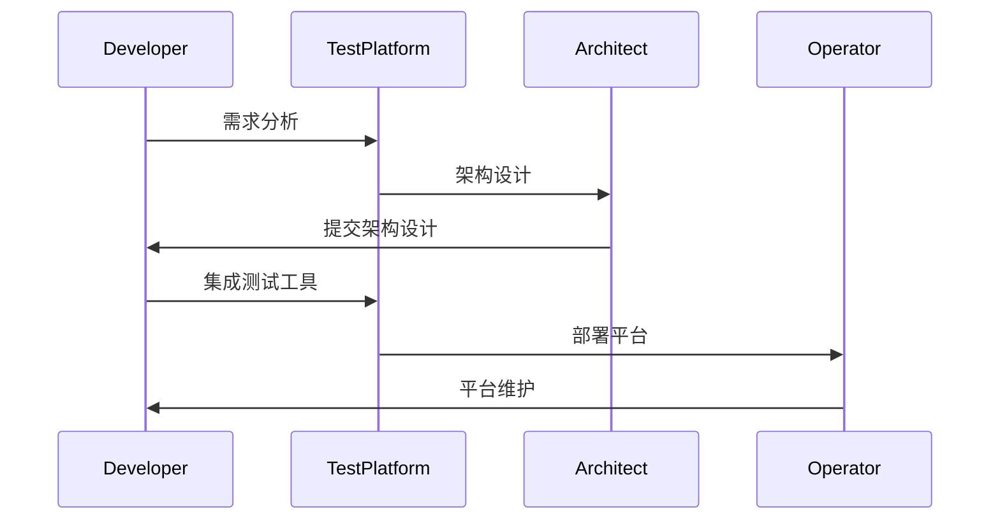

                 

# 自测用例可能是“灰犀牛”

> 关键词：灰犀牛、自测、测试用例、软件质量、用户体验

> 摘要：本文深入探讨了“灰犀牛”作为自测用例的重要性和应用。通过分析灰犀牛的概念、设计原理、编写技巧、测试工具及平台建设，结合实际案例，总结了灰犀牛测试的最佳实践。文章旨在为软件开发者提供指导，提高软件质量和用户体验。

## 引言与背景

### 1.1 灰犀牛概念简介

**问题背景**：在软件测试领域，“灰犀牛”这一概念最早由Tracy Kiss提出。它指的是那些显而易见、可能带来重大影响但往往被忽视的测试用例。与传统黑天鹅事件相对，灰犀牛事件是指那些容易预测、有可能发生且具有重大影响的测试场景。

**问题描述**：“灰犀牛”测试用例的出现，往往是由于开发者在设计和实现软件时，未能充分考虑用户需求和潜在问题。这些问题可能源于需求分析不足、设计缺陷或实现错误。灰犀牛事件的发生，常常会导致软件质量下降，用户体验受损。

**问题解决**：通过设计并执行灰犀牛测试用例，开发者可以在软件发布前识别并解决这些问题，从而提高软件质量，提升用户体验。

**边界与外延**：灰犀牛测试用例不同于传统的黑盒测试和白盒测试，它更侧重于测试那些潜在的高风险场景。灰犀牛测试用例不仅关注功能正确性，还关注系统性能、稳定性、安全性和用户体验。

### 1.2 “灰犀牛”在自测中的应用

**核心概念**：灰犀牛测试用例的定义是：那些能够揭示潜在风险、可能导致重大故障的测试用例。其核心属性包括风险高、影响大、易于预测和验证。

**概念属性特征对比表格**：

| 特征 | 灰犀牛测试用例 | 普通测试用例 |
| --- | --- | --- |
| **风险** | 高风险 | 中低风险 |
| **影响** | 影响大 | 影响小 |
| **预测性** | 易于预测 | 难以预测 |
| **验证性** | 易于验证 | 难以验证 |

**ER实体关系图架构**：

```mermaid
erDiagram
    TestCase ||--|{ Risk: 高风险 }
    TestCase ||--|{ Impact: 大影响 }
    TestCase ||--|{ Predictable: 易于预测 }
    TestCase ||--|{ Verifiable: 易于验证 }
```

## 灰犀牛测试用例设计原理

### 2.1 灰犀牛测试用例设计原则

**设计原则**：

1. **风险优先**：识别并优先设计那些高风险的测试用例。
2. **需求驱动**：基于用户需求和业务场景设计测试用例。
3. **可测试性**：确保测试用例易于执行和验证。
4. **全面性**：覆盖软件的各个功能模块和系统接口。

**设计过程**：

1. **需求分析**：理解用户需求和业务场景，识别潜在的风险。
2. **场景构建**：基于需求分析，构建测试场景。
3. **测试用例编写**：编写具体的测试用例，确保覆盖所有高风险场景。
4. **评审与优化**：评审测试用例，优化设计，确保全面性和可测试性。

### 2.2 灰犀牛测试用例分类

**分类方法**：根据风险程度和测试目标，灰犀牛测试用例可以分为以下几类：

1. **性能测试用例**：针对系统性能和负载能力的测试。
2. **安全测试用例**：针对系统安全性和数据保护的测试。
3. **兼容性测试用例**：针对不同操作系统、浏览器和设备兼容性的测试。
4. **异常处理测试用例**：针对系统异常处理能力的测试。

**示例分析**：

- **性能测试用例**：模拟高并发用户访问，测试系统的响应时间和吞吐量。
- **安全测试用例**：模拟攻击者入侵，测试系统的安全防护能力。
- **兼容性测试用例**：在不同操作系统和浏览器环境下测试软件的兼容性。
- **异常处理测试用例**：输入非法数据，测试系统对异常的处理能力。

## 灰犀牛测试用例编写技巧

### 3.1 编写步骤与方法

**步骤与方法**：

1. **需求分析**：理解业务需求和用户场景，识别潜在的高风险。
2. **场景设计**：基于需求分析，设计具体的测试场景。
3. **测试用例编写**：编写测试用例，确保覆盖所有高风险场景。
4. **评审与优化**：评审测试用例，优化设计，确保全面性和可测试性。

**常见问题**：

1. **测试用例重复**：确保每个测试用例都有独特的测试目标。
2. **测试用例不全面**：确保测试用例覆盖所有功能模块和系统接口。
3. **测试用例可执行性差**：确保测试用例易于执行和验证。

### 3.2 测试用例的执行策略

**执行策略**：

1. **分阶段执行**：根据项目进度和风险优先级，分阶段执行测试用例。
2. **自动化执行**：对于高频次的测试用例，采用自动化工具执行。
3. **重点执行**：对高风险的测试用例进行重点执行。

**资源管理**：

1. **合理分配测试资源**：根据项目需求和测试阶段，合理分配测试资源。
2. **优化测试流程**：优化测试流程，提高测试效率。

## 灰犀牛测试工具与平台

### 4.1 灰犀牛测试工具概述

**工具种类**：常用的灰犀牛测试工具包括：

1. **自动化测试工具**：如Selenium、Appium等，用于自动化执行测试用例。
2. **性能测试工具**：如JMeter、LoadRunner等，用于性能和负载测试。
3. **安全测试工具**：如OWASP ZAP、Burp Suite等，用于安全测试。

**功能特点**：

1. **自动化测试工具**：支持多种编程语言和操作系统，易于集成。
2. **性能测试工具**：支持并发测试、负载测试、性能分析等。
3. **安全测试工具**：支持漏洞扫描、安全测试、代码审计等。

### 4.2 灰犀牛测试平台建设

**平台建设**：灰犀牛测试平台的建设包括以下步骤：

1. **需求分析**：明确测试平台的功能需求。
2. **架构设计**：设计测试平台的架构，包括自动化测试、性能测试和安全测试等模块。
3. **系统集成**：将不同的测试工具和平台进行集成。
4. **部署与维护**：部署测试平台，并进行日常维护。

**平台架构**：



## 灰犀牛测试案例分析

### 5.1 案例介绍

**案例背景**：某电商平台在上线前，通过灰犀牛测试，成功发现并解决了多个潜在问题。

**案例分析**：通过分析电商平台的用户需求、业务场景和高风险场景，设计了灰犀牛测试用例，并执行了性能测试、安全测试和兼容性测试。

**经验总结**：灰犀牛测试用例的有效设计和应用，显著提高了电商平台的软件质量和用户体验，减少了上线后的故障和用户投诉。

## 灰犀牛测试实践与反思

### 6.1 实践经验分享

**实践经验**：

1. **重视需求分析**：准确理解用户需求和业务场景，是设计有效灰犀牛测试用例的基础。
2. **充分利用自动化测试**：对于高频次的测试用例，采用自动化测试可以提高测试效率。
3. **定期评审和优化**：定期评审测试用例，优化设计，确保测试覆盖全面。

**反思与改进**：

1. **测试资源分配**：合理分配测试资源，避免测试资源过度集中或分散。
2. **测试工具选择**：选择适合项目需求的测试工具，提高测试效果。

### 6.2 最佳实践与技巧

**最佳实践**：

1. **构建测试用例库**：建立和完善测试用例库，提高测试用例的复用性和可维护性。
2. **定期更新测试策略**：根据项目需求和测试结果，定期更新测试策略。

**技巧建议**：

1. **结合场景设计测试用例**：根据具体的业务场景设计测试用例，提高测试的针对性。
2. **充分利用社区资源**：加入专业社区，获取最新的测试技术和最佳实践。

## 总结与展望

### 7.1 总结

**内容回顾**：本文从灰犀牛的概念、设计原理、编写技巧、测试工具和平台建设等方面，全面介绍了灰犀牛测试用例。通过实际案例分析，展示了灰犀牛测试在提高软件质量和用户体验方面的作用。

**贡献与局限**：灰犀牛测试用例作为一种有效的测试方法，有助于提高软件质量和用户体验。然而，其设计和应用仍存在一定的局限性，需要结合具体项目进行优化。

### 7.2 展望

**未来方向**：随着软件测试技术的不断发展，灰犀牛测试用例有望在更多领域得到应用，进一步提升软件质量和用户体验。

**研究建议**：未来研究可重点关注灰犀牛测试用例的自动化设计、跨平台兼容性和智能化应用等方面。

**作者**：AI天才研究院/AI Genius Institute & 禅与计算机程序设计艺术 /Zen And The Art of Computer Programming

---

**注意事项**：

1. **确保文章内容的准确性**：在撰写文章时，务必确保所有技术术语和概念的准确性。
2. **注意文章结构的逻辑性**：文章结构要清晰，逻辑性强，便于读者理解。
3. **优化文章的可读性**：使用简洁明了的语言，避免过多的技术术语，提高文章的可读性。

**拓展阅读**：

1. Kiss, T. (2019). "Black Swans and Gray Rhinos in Software Testing". IEEE Software.
2. Myers, G. (1979). "The Art of Software Testing". Wiley.
3. Bolton, M. (2018). "Pragmatic Software Testing: Developing and Sustaining Objectives". Apress.

