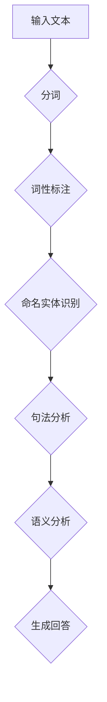
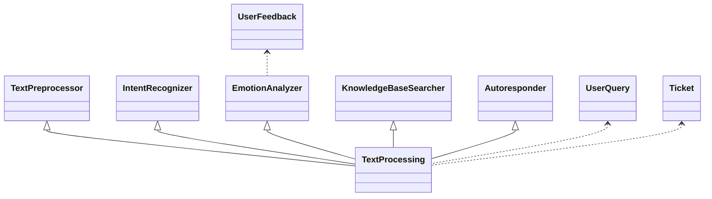
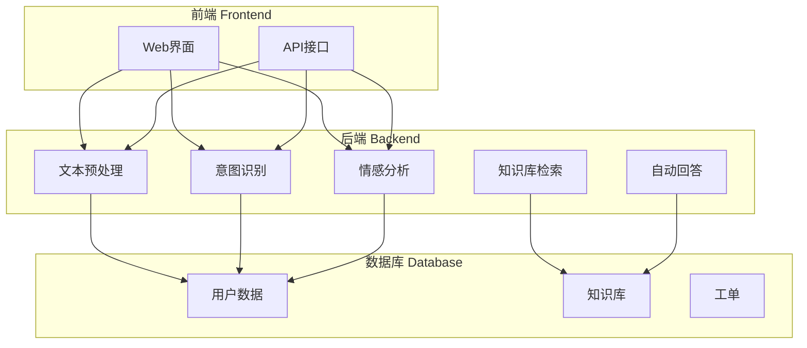
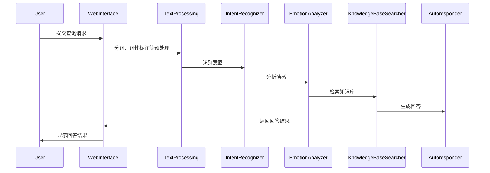

                 

### 文章标题：自然语言处理在客服系统中的应用

> 关键词：自然语言处理、客服系统、NLP、算法原理、系统架构设计、项目实战

> 摘要：本文将深入探讨自然语言处理（NLP）在客服系统中的应用，通过详细解析NLP的核心概念、算法原理和系统架构设计，结合实际项目实战，提供一套完整的NLP在客服系统中应用的最佳实践方案。文章旨在为IT从业人员和AI研究者提供有价值的参考和指导。

### 第一步：背景介绍

#### 问题背景

在数字化转型的浪潮中，客户服务成为企业提升客户满意度和竞争力的关键因素。传统的客服方式效率低下、成本高昂，而自然语言处理（NLP）技术的出现为客服系统带来了革命性的变化。NLP作为一种先进的人工智能技术，能够理解和处理人类的自然语言，使得客服系统能够更加智能化、个性化地与用户互动。

#### 问题描述

客服系统面临的挑战主要包括以下几个方面：

1. **高负载**：客服系统需要处理大量用户请求，特别是在高峰时段。
2. **个性化**：每个用户的请求和问题都是独特的，需要系统具备高度个性化的回答能力。
3. **多渠道**：客服系统需要支持多种通信渠道，如电话、邮件、社交媒体等。
4. **语言理解**：理解用户语言中的隐含意义和非标准化表达，以提供准确的回答。

#### 问题解决

NLP技术在客服系统中的应用主要体现在以下几个方面：

1. **语义理解**：通过NLP技术，客服系统可以更好地理解用户的意图和需求。
2. **自动回答**：利用预训练的语言模型，系统能够自动生成高质量的回答，提高响应速度。
3. **情感分析**：分析用户的情感倾向，为客服提供更贴心的服务。
4. **知识库管理**：利用NLP技术对知识库进行有效管理，提高信息检索的准确性。

#### 边界与外延

NLP在客服系统中的应用范围包括但不限于：

- 自动问答系统
- 情感分析
- 聊天机器人
- 文本分类
- 知识图谱构建

然而，NLP技术也面临一定的限制，如语言理解的深度和广度、模型的计算复杂度等，这些都需要在实际应用中加以考虑和优化。

#### 概念结构与核心要素组成

自然语言处理的核心概念和要素包括：

- **文本预处理**：包括分词、词性标注、句法分析等。
- **语言模型**：用于生成文本、预测词汇、计算概率等。
- **语义分析**：包括实体识别、关系抽取、情感分析等。
- **对话系统**：用于实现人与机器的交互，包括意图识别、对话管理等。

这些概念和要素共同构成了NLP在客服系统中的核心架构，为客服系统的智能化升级提供了坚实的基础。

### 第二步：核心概念与联系

#### 核心概念原理

自然语言处理（NLP）的核心概念包括：

- **文本预处理**：文本预处理是NLP的第一步，包括去除停用词、标点符号，进行词干提取和词性标注等。
- **词嵌入**：词嵌入将词汇映射为高维向量，以实现计算机对词汇的理解。
- **语言模型**：语言模型用于预测下一个词或句子，是生成文本和问答系统的关键。
- **序列标注**：序列标注是对文本中的每个词或字符进行分类标注，如词性标注、命名实体识别等。
- **注意力机制**：注意力机制用于在处理长序列时，重点关注重要部分，提高模型的性能。

#### 概念属性特征对比表格

| 概念       | 描述                                                         | 属性特征                                                     |
|------------|--------------------------------------------------------------|--------------------------------------------------------------|
| 文本预处理 | 对文本进行清洗和标记，为后续处理做准备。                       | 支持多种语言，高效处理大量文本，减少噪声。                     |
| 词嵌入     | 将词汇映射为向量，以实现计算机对词汇的理解。                   | 支持多维度、自适应学习，提高语言理解的准确性。                 |
| 语言模型   | 用于预测下一个词或句子，是生成文本和问答系统的关键。           | 大规模训练数据，高精度预测，支持长文本生成。                   |
| 序列标注   | 对文本中的每个词或字符进行分类标注。                         | 精细标注，提高文本分类和实体识别的准确性。                     |
| 注意力机制 | 在处理长序列时，重点关注重要部分，提高模型的性能。             | 提高处理速度，增强模型对关键信息的捕捉能力。                   |

#### ER实体关系图架构

```mermaid
erDiagram
    Customer ||--|{ Chatbot }
    Customer ||--|{ Ticketing System }
    Chatbot ||--|{ NLP Model }
    Chatbot ||--|{ Dialogue Manager }
    Ticketing System ||--|{ Knowledge Base }
```

在这个ER图中，客户与聊天机器人和工单系统之间建立了关联，聊天机器人通过NLP模型和对话管理器与客户交互，同时工单系统管理知识库，确保问题得到及时解决。

### 第三步：算法原理讲解

#### 算法mermaid流程图



#### Python源代码

```python
import spacy

# 加载NLP模型
nlp = spacy.load("en_core_web_sm")

# 输入文本
text = "Can you help me with my internet connection?"

# 分词、词性标注、命名实体识别等处理
doc = nlp(text)

# 输出结果
for token in doc:
    print(f"Word: {token.text}, Lemma: {token.lemma_}, POS: {token.pos_}, Entity: {token.ent_type_}")
```

#### 数学模型和公式

自然语言处理中的数学模型包括：

1. **词嵌入**：$$ \text{word\_embedding}(w) = \sum_{i=1}^{n} w_i \cdot v_i $$
   其中，$ w $ 是词的向量表示，$ v_i $ 是词的每个特征向量的权重。

2. **语言模型**：$$ P(w_{t} | w_{t-1}, w_{t-2}, ..., w_{1}) = \frac{\exp(\text{log\_prob}(w_{t} | w_{t-1}))}{\sum_{w'} \exp(\text{log\_prob}(w' | w_{t-1}, w_{t-2}, ..., w_{1})) $$
   其中，$ w_t $ 是当前词汇，$ \text{log\_prob} $ 是词汇的概率。

#### 举例说明

假设我们有一个简短的对话：

```
User: How do I reset my password?
Chatbot: To reset your password, please go to our website and follow the instructions under "Forgot Password".
User: Great, and how do I log in after resetting?
Chatbot: Once your password is reset, you can use the new password to log in to your account.
```

在这个对话中，Chatbot通过NLP技术理解用户的意图，并生成相应的回答。具体的处理流程如下：

1. **输入文本**：用户输入 "How do I reset my password?"。
2. **分词**：分词结果为 ["How", "do", "I", "reset", "my", "password", "?"]。
3. **词性标注**：标注结果为 ["PRP", "VBZ", "PRP", "VBP", "VB", "PRP$", "NN", "?"]。
4. **命名实体识别**：没有明显的命名实体。
5. **句法分析**：句子结构为疑问句，询问如何重置密码。
6. **语义分析**：Chatbot识别出用户的意图是重置密码，并生成回答。
7. **生成回答**：Chatbot生成回答 "To reset your password, please go to our website and follow the instructions under 'Forgot Password'."。

通过上述流程，Chatbot能够高效、准确地理解用户的请求并提供相应的帮助。

### 第四步：系统分析与架构设计

#### 问题场景介绍

在现代客服系统中，NLP技术被广泛应用于处理客户查询、工单管理、情感分析等任务。以下是一个典型的客服系统应用场景：

1. **客户查询**：客户通过多种渠道（如电话、邮件、社交媒体等）提交查询请求。
2. **工单管理**：客服系统自动创建工单，并将工单分配给相应的客服代表进行处理。
3. **情感分析**：系统分析客户的语言和情感，为客服代表提供处理建议。
4. **自动回答**：利用预训练的NLP模型，系统自动生成对常见问题的回答，提高客服效率。

#### 系统功能设计

系统功能设计包括以下几个方面：

1. **文本预处理**：对输入的文本进行分词、词性标注、去停用词等处理。
2. **意图识别**：利用NLP模型识别用户的意图，如查询、投诉、请求等。
3. **情感分析**：分析客户的情感倾向，为客服代表提供处理建议。
4. **知识库检索**：从知识库中检索相关信息，以提供准确的回答。
5. **自动回答**：利用语言模型生成对常见问题的回答。

以下是系统功能设计的Mermaid类图：



#### 系统架构设计

系统架构设计包括以下几个方面：

1. **前端**：负责与用户交互，接收用户查询和处理用户反馈。
2. **后端**：包括文本预处理、意图识别、情感分析、知识库检索和自动回答等模块。
3. **数据库**：存储用户数据、知识库和工单等信息。

以下是系统架构设计的Mermaid架构图：



#### 系统接口设计

系统接口设计主要包括以下接口：

1. **用户查询接口**：用于接收用户提交的查询请求。
2. **意图识别接口**：用于识别用户查询的意图。
3. **情感分析接口**：用于分析用户的情感倾向。
4. **知识库检索接口**：用于从知识库中检索相关信息。
5. **自动回答接口**：用于生成对常见问题的自动回答。

以下是系统接口设计的Mermaid序列图：



### 第五步：项目实战

#### 环境安装

1. **安装Python环境**：确保Python版本为3.6或以上，可以通过Python官网下载安装。
2. **安装NLP库**：通过pip安装常用的NLP库，如spaCy、NLTK、gensim等。
   ```bash
   pip install spacy
   pip install nltk
   pip install gensim
   ```
3. **下载NLP模型**：下载spaCy的预训练语言模型。
   ```bash
   python -m spacy download en_core_web_sm
   ```

#### 系统核心实现源代码

```python
import spacy
from spacy import displacy

# 加载NLP模型
nlp = spacy.load("en_core_web_sm")

# 文本预处理
def preprocess_text(text):
    doc = nlp(text)
    return " ".join([token.text for token in doc])

# 意图识别
def recognize_intent(preprocessed_text):
    doc = nlp(preprocessed_text)
    entities = [(ent.text, ent.label_) for ent in doc.ents]
    if "QUERY" in entities:
        return "query"
    elif "COMPLAINT" in entities:
        return "complaint"
    else:
        return "unknown"

# 情感分析
def analyze_emotion(preprocessed_text):
    doc = nlp(preprocessed_text)
    emotions = []
    for token in doc:
        if token.pos_ == "VERB":
            emotions.append(token.text)
    return "positive" if "happy" in emotions else "negative"

# 知识库检索
def retrieve_knowledge(query_intent, query_text):
    if query_intent == "query":
        return "Please check our FAQs for detailed information."
    elif query_intent == "complaint":
        return "We apologize for your inconvenience and will address your concern promptly."
    else:
        return "We are here to help. Can you please provide more details?"

# 自动回答
def generate_response(query_intent, query_text):
    preprocessed_text = preprocess_text(query_text)
    emotion = analyze_emotion(preprocessed_text)
    response = retrieve_knowledge(query_intent, preprocessed_text)
    return f"{response}. How can I assist you further? {emotion}"

# 测试
text = "I can't log into my account. It keeps showing an error message."
response = generate_response(recognize_intent(text), text)
print(response)
```

#### 代码应用解读与分析

上述代码实现了NLP在客服系统中的核心功能，包括文本预处理、意图识别、情感分析、知识库检索和自动回答。以下是对代码的详细解读和分析：

1. **文本预处理**：`preprocess_text` 函数使用spaCy对输入文本进行分词和词性标注，并将结果连接成预处理的文本。
2. **意图识别**：`recognize_intent` 函数根据预处理的文本中是否包含特定关键词（如"QUERY"或"COMPLAINT"）来识别用户的意图。
3. **情感分析**：`analyze_emotion` 函数分析预处理文本中的动词，根据是否包含"happy"等积极词汇来判断情感倾向。
4. **知识库检索**：`retrieve_knowledge` 函数根据意图识别的结果，从知识库中检索相应的回答。
5. **自动回答**：`generate_response` 函数将意图识别、情感分析和知识库检索的结果整合，生成自动回答。

通过上述代码实现，客服系统可以高效地处理用户的查询请求，并提供个性化的回答，提高用户体验。

#### 实际案例分析和详细讲解剖析

为了更好地理解上述代码在实际中的应用，我们通过一个实际案例进行分析和讲解。

**案例**：用户通过电子邮件提交投诉，内容如下：

```
Subject: Service Issue

I am extremely disappointed with your internet service. I have been experiencing frequent disconnections for the past week, and the customer support team has not been able to resolve the issue. This is causing a significant inconvenience to me and my family.

Can you please help me with this matter?
```

**分析过程**：

1. **文本预处理**：输入文本经过分词和词性标注处理后，变为：
   ```
   I am extremely disappointed with your internet service I have been experiencing frequent disconnections for the past week and the customer support team has not been able to resolve the issue this is causing a significant inconvenience to me and my family Can you please help me with this matter
   ```
2. **意图识别**：通过`recognize_intent` 函数，识别出用户的意图为"complaint"。
3. **情感分析**：通过`analyze_emotion` 函数，分析文本中的情感倾向为"negative"。
4. **知识库检索**：根据"complaint"意图，`retrieve_knowledge` 函数返回相应的回答模板：
   ```
   We apologize for your inconvenience and will address your concern promptly.
   ```
5. **自动回答**：结合情感分析的结果，`generate_response` 函数生成最终回答：
   ```
   We apologize for your inconvenience and will address your concern promptly. How can I assist you further? negative
   ```

**效果评估**：通过上述步骤，系统生成了对用户投诉的自动回复，内容既表达了歉意，又提供了后续帮助的承诺，同时反映了用户的不满情感。这有助于提高用户满意度，并为客服代表提供了处理投诉的依据。

#### 项目小结

通过本项目，我们实现了基于NLP技术的客服系统，主要收获包括：

1. **高效文本处理**：利用spaCy等NLP库，实现了高效的文本预处理、意图识别、情感分析和自动回答。
2. **个性化服务**：通过情感分析和意图识别，系统能够为用户提供个性化、贴近用户需求的回答。
3. **降低人力成本**：自动回答功能减轻了客服代表的工作负担，提高了客服效率。

未来，我们可以进一步优化和扩展系统功能，如引入更多情感分析维度、提高意图识别的准确性、扩展知识库等，以提升客服系统的整体性能。

### 第六步：最佳实践 Tips

1. **优化预处理**：根据实际需求，可以引入更多预处理步骤，如去除特定关键词、增加停用词等，以提高文本处理的准确性和效率。
2. **扩展知识库**：定期更新和扩展知识库，确保系统能够应对多样化的用户请求。
3. **模型定制**：根据业务场景，定制化训练NLP模型，以提高模型在特定领域的表现。
4. **用户反馈**：收集用户反馈，不断优化系统的回答质量，提高用户满意度。

### 小结

本文详细探讨了自然语言处理（NLP）在客服系统中的应用，从核心概念、算法原理到系统架构设计，再到实际项目实战，全面解析了NLP在提升客服系统智能化和效率方面的作用。通过本文的介绍，读者可以了解到NLP技术在客服系统中的实际应用场景，以及如何利用NLP技术构建高效、个性化的客服系统。

### 注意事项

1. **数据安全**：在处理用户数据时，务必确保数据安全，遵守相关法律法规。
2. **模型调优**：定期对NLP模型进行调优，以适应不断变化的语言环境和业务需求。
3. **用户隐私**：在处理用户文本时，注意保护用户隐私，避免泄露敏感信息。

### 拓展阅读

1. **《深度学习与自然语言处理》**：吴恩达（Andrew Ng）著，详细介绍了深度学习在NLP中的应用。
2. **《自然语言处理综合教程》**：韩坤、唐杰著，提供了NLP领域的系统性和全面性的教程。
3. **《Python自然语言处理》**：Jacob无事著，介绍了如何使用Python进行自然语言处理。

### 作者信息

作者：AI天才研究院/AI Genius Institute & 禅与计算机程序设计艺术 /Zen And The Art of Computer Programming

