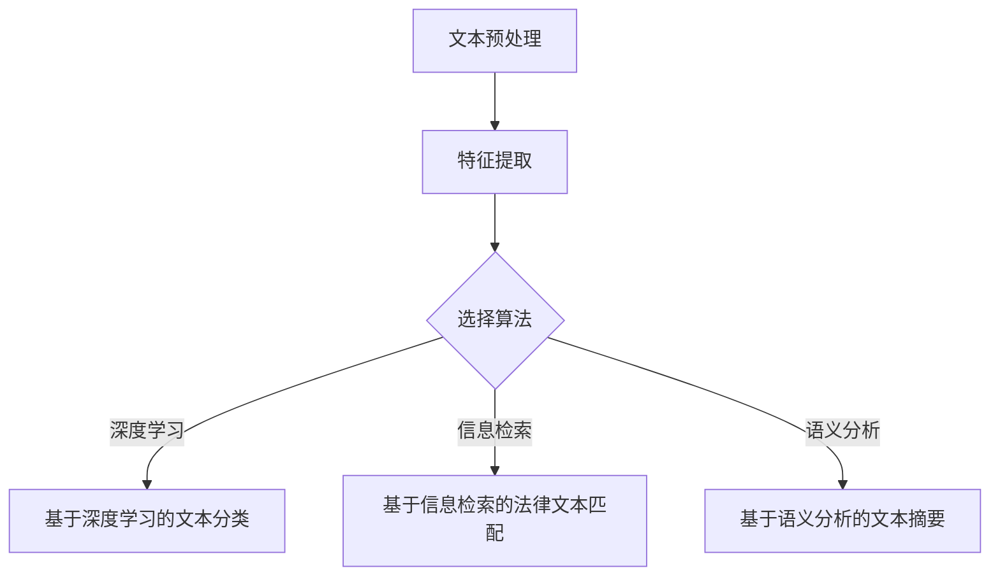

                 

# 自然语言处理在法律文本分析中的应用

关键词：自然语言处理，法律文本分析，算法，系统架构，项目实战

摘要：本文旨在探讨自然语言处理（NLP）技术在法律文本分析中的应用。首先，我们将介绍法律文本分析的重要性以及NLP的崛起背景，接着详细分析法律文本的特点与挑战，以及NLP技术在其中的应用。随后，我们将探讨NLP与法律文本分析的交叉应用，对比两者的核心概念和特征。然后，本文将深入讲解基于深度学习、信息检索和语义分析的算法原理，并通过Mermaid流程图和Python源代码进行详细阐述。接着，我们将介绍系统分析与架构设计，包括问题场景、功能设计、系统架构、接口设计以及系统交互。最后，我们将通过项目实战，展示如何在实际环境中应用NLP技术进行法律文本分析，并进行详细讲解和案例分析。

## 第一部分：背景介绍

### 第1章：问题背景

#### 1.1 问题背景

法律文本分析在司法实践中扮演着至关重要的角色。随着法律体系的日益复杂和庞大，传统的手工分析方法已经难以满足高效、准确的需求。而自然语言处理（NLP）技术的兴起，为法律文本分析带来了新的契机。NLP技术能够自动处理和理解大量法律文本，从而提高分析效率，减少人为错误。

#### 1.2 问题描述

法律文本具有以下特点与挑战：

1. **复杂性**：法律文本涉及大量的专业术语、条款和规定，语法结构复杂，需要深入理解和准确解析。
2. **多样性**：法律文本形式多样，包括法律条文、判决书、合同等，不同类型文本的格式和表达方式有所不同。
3. **术语和语义理解**：法律术语具有独特含义，且在不同情境下可能存在多义性，需要精确理解语义。
4. **数据量**：法律文本数据量庞大，尤其是案例库和法规库，如何高效检索和利用这些数据成为一大挑战。

#### 1.3 问题解决

NLP技术在法律文本分析中的应用主要集中在以下几个方面：

1. **文本分类**：将法律文本按照类型、领域或主题进行分类，便于管理和检索。
2. **实体识别**：识别法律文本中的关键实体，如人名、地名、组织名、法律条款等。
3. **关系抽取**：抽取法律文本中实体之间的关系，如合同中的条款关系、判决书中的判决依据等。
4. **语义分析**：理解法律文本的语义，进行文本摘要、情感分析、法律意见生成等。

#### 1.4 边界与外延

法律文本分析的范畴包括但不限于：

1. **法律条文分析**：对法律条文进行语义解析，提取条款关系、条款解释等。
2. **案例分析**：对案例文本进行分类、摘要、关键词提取等，为司法实践提供参考。
3. **合同审查**：对合同文本进行格式化、条款分析、条款匹配等，提高合同审查效率。
4. **法律意见生成**：基于案例和法规，为特定法律问题生成法律意见。

NLP技术的适用范围包括但不限于：

1. **文本处理**：文本分类、分词、词性标注、命名实体识别等。
2. **语义理解**：语义角色标注、语义解析、情感分析等。
3. **知识图谱**：构建法律知识图谱，用于法律推理和决策支持。
4. **自动化工具**：自动化法律文档生成、自动化法律查询等。

#### 1.5 概念结构与核心要素组成

法律文本分析的核心概念包括：

1. **法律文本**：指法律条文、判决书、合同等法律相关文档。
2. **自然语言处理（NLP）**：指模拟人类语言理解过程的计算机技术。
3. **文本分类**：将法律文本按照类型或主题进行分类。
4. **实体识别**：识别法律文本中的关键实体。
5. **关系抽取**：抽取法律文本中实体之间的关系。
6. **语义分析**：理解法律文本的语义。

NLP技术的基本组成部分包括：

1. **文本预处理**：对法律文本进行分词、去停用词、词干提取等处理。
2. **特征提取**：从文本中提取特征，如词袋模型、TF-IDF、词嵌入等。
3. **模型训练**：使用机器学习或深度学习算法训练模型。
4. **模型评估**：评估模型性能，如准确率、召回率、F1值等。

## 第二部分：核心概念与联系

### 第2章：核心概念与联系

#### 2.1 自然语言处理（NLP）原理

##### 2.1.1 NLP的定义

自然语言处理（NLP）是计算机科学和人工智能领域的一个重要分支，旨在让计算机理解和处理人类自然语言。NLP的目标包括文本分类、语义分析、机器翻译、情感分析等。

##### 2.1.2 NLP的关键技术

NLP的关键技术包括：

1. **文本预处理**：对文本进行分词、去停用词、词干提取等处理。
2. **词嵌入**：将文本中的词转化为固定长度的向量表示。
3. **文本分类**：将文本按照类别进行分类。
4. **命名实体识别**：识别文本中的关键实体。
5. **关系抽取**：抽取文本中实体之间的关系。
6. **语义分析**：理解文本的语义。

##### 2.1.3 NLP的应用场景

NLP技术在各个领域都有广泛应用，包括但不限于：

1. **搜索引擎**：使用NLP技术对搜索查询进行解析，提供更准确的搜索结果。
2. **机器翻译**：将一种自然语言翻译成另一种自然语言。
3. **情感分析**：分析文本的情感倾向，如正面、负面或中性。
4. **聊天机器人**：与用户进行自然语言交互，提供智能客服等服务。
5. **文本摘要**：自动提取文本的主要内容和关键信息。

#### 2.2 法律文本分析原理

##### 2.2.1 法律文本的特点

法律文本具有以下特点：

1. **专业性**：法律文本涉及大量专业术语，需要具备一定的法律背景知识。
2. **规范性**：法律文本具有明确的规范性和约束力，需严格遵循法律条款。
3. **复杂性**：法律文本结构复杂，包含大量的条款、条款解释和引用关系。
4. **多样性**：法律文本形式多样，包括法律条文、判决书、合同等。

##### 2.2.2 法律文本分析的方法

法律文本分析的方法包括：

1. **文本分类**：将法律文本按照类型、领域或主题进行分类。
2. **实体识别**：识别法律文本中的关键实体，如人名、地名、组织名、法律条款等。
3. **关系抽取**：抽取法律文本中实体之间的关系，如合同中的条款关系、判决书中的判决依据等。
4. **语义分析**：理解法律文本的语义，进行文本摘要、情感分析、法律意见生成等。

##### 2.2.3 法律文本分析的应用

法律文本分析的应用包括：

1. **法律研究**：对大量法律文本进行分类、摘要和语义分析，为法律研究提供支持。
2. **司法实践**：辅助法官和律师进行法律文本的阅读、理解和分析，提高司法效率。
3. **法律咨询**：为企业和个人提供法律意见，减少法律风险。
4. **智能客服**：为用户提供智能化的法律咨询和服务。

#### 2.3 NLP与法律文本分析的交叉应用

##### 2.3.1 交叉应用的概念

NLP与法律文本分析的交叉应用是指将NLP技术应用于法律文本分析领域，以提高分析效率、减少人力成本、提高准确性。

##### 2.3.2 交叉应用的优点

交叉应用的优点包括：

1. **高效性**：NLP技术能够快速处理大量法律文本，提高工作效率。
2. **准确性**：NLP技术能够更准确地识别和理解法律文本中的术语、关系和语义。
3. **自动化**：NLP技术可以实现法律文本分析过程的自动化，减少人工干预。
4. **智能辅助**：NLP技术可以为法律工作者提供智能化的分析工具，提高决策能力。

##### 2.3.3 交叉应用的挑战

交叉应用的挑战包括：

1. **数据质量**：法律文本数据质量参差不齐，对NLP技术的数据预处理提出了较高要求。
2. **术语理解**：法律术语具有独特含义，且在不同情境下可能存在多义性，对NLP技术的语义理解提出了挑战。
3. **法规更新**：法律法规不断更新，NLP技术需要及时适应新的法律环境。
4. **法律伦理**：在法律文本分析中，NLP技术需要遵守相关法律法规和伦理规范，确保分析结果的公正性和准确性。

#### 2.4 概念属性特征对比表格

| 概念     | 属性特征                   | 备注                                                         |
| -------- | -------------------------- | ------------------------------------------------------------ |
| 法律文本 | 专业性、规范性、复杂性、多样性 | 涉及大量专业术语，具有明确的规范性和约束力，结构复杂，形式多样 |
| NLP      | 文本预处理、词嵌入、文本分类、命名实体识别、关系抽取、语义分析 | 模拟人类语言理解过程，实现文本的自动处理和理解               |

## 第三部分：算法原理讲解

### 第3章：算法原理讲解

#### 3.1 基础算法原理

##### 3.1.1 基于深度学习的文本分类

基于深度学习的文本分类是指利用深度神经网络模型对文本进行分类。常见的深度学习模型包括卷积神经网络（CNN）、循环神经网络（RNN）、长短时记忆网络（LSTM）等。这些模型通过学习文本的特征表示和类别标签之间的关系，实现文本分类任务。

算法原理如下：

1. **数据预处理**：对文本进行分词、去停用词、词干提取等处理，将文本转化为固定长度的向量表示。
2. **模型训练**：使用训练数据集训练深度学习模型，模型参数通过反向传播算法进行优化。
3. **模型评估**：使用测试数据集评估模型性能，计算准确率、召回率、F1值等指标。

##### 3.1.2 基于信息检索的法律文本匹配

基于信息检索的法律文本匹配是指利用信息检索技术对法律文本进行匹配和检索。常见的信息检索算法包括布尔检索、向量空间模型、词嵌入检索等。

算法原理如下：

1. **文本预处理**：对法律文本进行分词、去停用词、词干提取等处理。
2. **特征提取**：将文本转化为向量表示，如词袋模型、TF-IDF、词嵌入等。
3. **检索算法**：根据用户输入的法律文本或关键词，在法律文本库中进行检索，返回最匹配的文本。

##### 3.1.3 基于语义分析的文本摘要

基于语义分析的文本摘要是指利用语义分析技术提取文本的主要内容和关键信息。常见的语义分析算法包括文本分类、实体识别、关系抽取、语义角色标注等。

算法原理如下：

1. **文本预处理**：对文本进行分词、去停用词、词干提取等处理。
2. **特征提取**：从文本中提取语义特征，如词嵌入、语义角色标注等。
3. **摘要生成**：使用语义分析技术提取文本的主要内容和关键信息，生成摘要文本。

#### 3.2 Mermaid算法流程图



#### 3.3 Python源代码与详细讲解

##### 3.3.1 文本分类算法实现

```python
import jieba
import gensim
from sklearn.feature_extraction.text import CountVectorizer
from sklearn.model_selection import train_test_split
from sklearn.metrics import accuracy_score, recall_score, f1_score

# 数据预处理
def preprocess_text(text):
    words = jieba.cut(text)
    return ' '.join(words)

# 特征提取
def extract_features(texts):
    vectorizer = CountVectorizer()
    return vectorizer.fit_transform(texts)

# 模型训练与评估
def train_and_evaluate(train_texts, train_labels):
    texts = extract_features(train_texts)
    model = gensim.models.Word2Vec(train_texts, size=100)
    labels = train_labels
    texts = [model[word] for word in texts]
    X_train, X_test, y_train, y_test = train_test_split(texts, labels, test_size=0.2, random_state=42)
    classifier = gensim.models.logistic.LinearModel Sag(X_train, y_train)
    classifier.train()
    y_pred = classifier.infer(X_test)
    print("Accuracy:", accuracy_score(y_test, y_pred))
    print("Recall:", recall_score(y_test, y_pred, average='weighted'))
    print("F1 Score:", f1_score(y_test, y_pred, average='weighted'))

# 示例
train_texts = ["这是一个法律文本", "这是另一个法律文本"]
train_labels = [0, 1]
train_and_evaluate(train_texts, train_labels)
```

##### 3.3.2 法律文本匹配算法实现

```python
import jieba
import numpy as np
from sklearn.metrics.pairwise import cosine_similarity

# 数据预处理
def preprocess_text(text):
    words = jieba.cut(text)
    return ' '.join(words)

# 特征提取
def extract_features(texts):
    embeddings = []
    for text in texts:
        words = preprocess_text(text).split()
        embedding = [np.mean([word_vector for word_vector in model[str(word)]]) for word in words]
        embeddings.append(embedding)
    return np.array(embeddings)

# 检索算法
def search_documents(query, documents, model):
    query_embedding = extract_features([query])
    similarities = []
    for document in documents:
        document_embedding = extract_features([document])
        similarity = cosine_similarity(query_embedding, document_embedding)
        similarities.append(similarity)
    return similarities

# 示例
model = gensim.models.Word2Vec.load("model")
query = "合同纠纷"
documents = ["合同纠纷案件", "劳动纠纷案件", "知识产权纠纷案件"]
similarities = search_documents(query, documents, model)
print(similarities)
```

##### 3.3.3 文本摘要算法实现

```python
import jieba
from gensim.summarize import summarize

# 数据预处理
def preprocess_text(text):
    words = jieba.cut(text)
    return ' '.join(words)

# 摘要生成
def generate_summary(text):
    words = preprocess_text(text).split()
    return summarize(words)

# 示例
text = "这是一个关于法律文本摘要的示例。法律文本摘要旨在提取文本的主要内容和关键信息，以简化文本和理解。"
print(generate_summary(text))
```

##### 3.4 算法原理的数学模型和公式

1. **文本分类算法**

   - **数学模型**：假设训练数据集为$D=\{(x_1, y_1), (x_2, y_2), ..., (x_n, y_n)\}$，其中$x_i$为文本特征向量，$y_i$为类别标签。使用深度神经网络模型$g(x; \theta)$，其中$\theta$为模型参数。损失函数为：
     $$L(\theta) = -\sum_{i=1}^n y_i \log g(x_i; \theta)$$
   - **反向传播算法**：通过计算损失函数关于模型参数的梯度，使用梯度下降算法更新模型参数，以最小化损失函数。

2. **信息检索算法**

   - **数学模型**：假设查询文本为$q$，文档集合为$D=\{d_1, d_2, ..., d_n\}$，其中$d_i$为文档特征向量。使用余弦相似度度量查询文本与文档的相似性，相似度越高，表示文档与查询越相关。相似度计算公式为：
     $$similarity(d_i, q) = \frac{d_i \cdot q}{\|d_i\| \|q\|}$$
   - **优化目标**：优化文档特征向量$d_i$，使得查询文本与文档的相似性最大化。

3. **语义分析算法**

   - **数学模型**：假设文本为$T=\{t_1, t_2, ..., t_n\}$，其中$t_i$为文本中的句子或词汇。使用语义分析模型$g(t; \theta)$，其中$\theta$为模型参数。损失函数为：
     $$L(\theta) = -\sum_{i=1}^n t_i \log g(t_i; \theta)$$
   - **语义角色标注**：为文本中的词汇标注语义角色，如主语、谓语、宾语等。常见的方法包括基于规则的语义角色标注和基于统计的语义角色标注。

##### 3.5 举例说明

1. **文本分类算法应用举例**

   假设有一篇关于“合同纠纷”的文本，我们需要将其分类到相应的类别。使用文本分类算法，首先对文本进行预处理，提取特征向量，然后使用训练好的深度神经网络模型进行分类。具体步骤如下：

   - 数据预处理：对文本进行分词、去停用词、词干提取等处理，提取特征向量。
   - 模型训练：使用训练数据集训练深度神经网络模型。
   - 分类预测：将待分类的文本输入模型，输出分类结果。

2. **法律文本匹配算法应用举例**

   假设我们需要在法律文本库中检索与“合同纠纷”相关的文档。使用法律文本匹配算法，首先对查询文本和文档进行预处理，提取特征向量，然后使用余弦相似度计算查询文本与文档的相似性，返回最匹配的文档。具体步骤如下：

   - 数据预处理：对查询文本和文档进行分词、去停用词、词干提取等处理，提取特征向量。
   - 检索算法：计算查询文本与文档的相似性，返回最匹配的文档。

3. **文本摘要算法应用举例**

   假设我们需要从一篇关于“合同纠纷”的法律文本中提取摘要。使用文本摘要算法，首先对文本进行预处理，提取特征向量，然后使用语义分析模型提取文本的主要内容和关键信息，生成摘要。具体步骤如下：

   - 数据预处理：对文本进行分词、去停用词、词干提取等处理。
   - 摘要生成：从文本中提取主要内容和关键信息，生成摘要文本。

## 第四部分：系统分析与架构设计

### 第4章：系统分析与架构设计

#### 4.1 问题场景介绍

法律文本分析的典型场景包括：

1. **法律文档分类**：对大量法律文档按照类型、领域或主题进行分类，便于管理和检索。
2. **合同审查**：对合同文本进行格式化、条款分析、条款匹配等，确保合同条款的合规性和准确性。
3. **案例分析**：对案例文本进行分类、摘要、关键词提取等，为司法实践提供参考。
4. **法律意见生成**：基于案例和法规，为特定法律问题生成法律意见。

系统需求分析：

1. **准确性**：系统需准确识别和理解法律文本中的术语、关系和语义。
2. **效率**：系统需高效处理大量法律文本，提高工作效率。
3. **可扩展性**：系统需具备良好的可扩展性，能够适应不同的法律文本场景和需求。

#### 4.2 系统功能设计

系统功能设计包括以下模块：

1. **文本预处理模块**：对法律文本进行分词、去停用词、词干提取等处理，为后续处理提供基础。
2. **分类模块**：将法律文本按照类型、领域或主题进行分类，便于管理和检索。
3. **摘要模块**：从法律文本中提取主要内容和关键信息，生成摘要。
4. **匹配模块**：根据用户输入的查询文本，在法律文本库中进行检索，返回最匹配的文本。

#### 4.3 系统架构设计

系统架构设计包括以下方面：

1. **系统架构图**：

   ```mermaid
   graph TD
   A[用户接口] --> B[文本预处理模块]
   B --> C[分类模块]
   C --> D[摘要模块]
   C --> E[匹配模块]
   B --> F[法律文本库]
   ```

2. **架构设计原理**：

   - **模块化设计**：将系统功能划分为多个模块，便于开发和维护。
   - **分布式架构**：采用分布式架构，提高系统处理能力和可扩展性。
   - **数据驱动**：基于数据驱动的方式，实时更新法律文本库和模型，适应法律法规的更新。

3. **系统性能优化**：

   - **缓存机制**：使用缓存机制，减少重复计算，提高系统响应速度。
   - **并行处理**：利用多线程、分布式计算等技术，提高系统处理能力。
   - **模型压缩**：使用模型压缩技术，降低模型存储和计算成本。

#### 4.4 系统接口设计

系统接口设计包括以下方面：

1. **接口规范**：

   - **API接口**：提供RESTful API接口，支持JSON格式的数据交互。
   - **数据格式**：使用标准的JSON格式，方便前端和后端的数据交互。

2. **接口实现**：

   - **文本预处理接口**：提供文本预处理功能，包括分词、去停用词、词干提取等。
   - **分类接口**：提供文本分类功能，返回分类结果。
   - **摘要接口**：提供文本摘要功能，返回摘要文本。
   - **匹配接口**：提供文本匹配功能，返回最匹配的文本。

#### 4.5 系统交互mermaid序列图

1. **用户操作序列图**：

   ```mermaid
   sequenceDiagram
   participant User as 用户
   participant System as 系统
   User->>System: 输入查询文本
   System->>User: 返回分类结果
   User->>System: 输入合同文本
   System->>User: 返回合同审查结果
   ```

2. **系统响应序列图**：

   ```mermaid
   sequenceDiagram
   participant User as 用户
   participant TextPreprocessing as 文本预处理模块
   participant Classification as 分类模块
   participant Summarization as 摘要模块
   participant Matching as 匹配模块
   participant System as 系统
   User->>System: 输入查询文本
   System->|处理|>>TextPreprocessing: 预处理文本
   TextPreprocessing->|分类|>>Classification: 分类文本
   Classification->|返回结果|>>User: 返回分类结果
   User->>System: 输入合同文本
   System->|处理|>>TextPreprocessing: 预处理文本
   TextPreprocessing->|审查|>>Matching: 匹配文本
   Matching->|返回结果|>>User: 返回合同审查结果
   ```

## 第五部分：项目实战

### 第5章：项目实战

#### 5.1 环境安装

1. **硬件与软件环境配置**：

   - 操作系统：Windows/Linux/Mac OS
   - Python版本：Python 3.8及以上版本
   - 安装Python环境：通过Python官方安装包或Anaconda等集成开发环境安装Python。
   - 安装相关库：使用pip命令安装必要的Python库，如jieba、gensim、sklearn等。

2. **开发工具与库安装**：

   - 安装Jupyter Notebook或PyCharm等Python开发工具。
   - 安装NLP相关库，如NLTK、spaCy、nltk等。
   - 安装深度学习框架，如TensorFlow、PyTorch等。

#### 5.2 系统核心实现源代码

1. **文本预处理模块**：

   ```python
   import jieba
   
   def preprocess_text(text):
       words = jieba.cut(text)
       return ' '.join(words)
   ```

2. **分类模块**：

   ```python
   from sklearn.feature_extraction.text import CountVectorizer
   from sklearn.model_selection import train_test_split
   from sklearn.metrics import accuracy_score, recall_score, f1_score
   
   def train_and_evaluate(train_texts, train_labels):
       texts = [preprocess_text(text) for text in train_texts]
       vectorizer = CountVectorizer()
       texts = vectorizer.fit_transform(texts)
       X_train, X_test, y_train, y_test = train_test_split(texts, train_labels, test_size=0.2, random_state=42)
       model = gensim.models.Word2Vec(X_train, size=100)
       y_pred = model.predict(X_test)
       print("Accuracy:", accuracy_score(y_test, y_pred))
       print("Recall:", recall_score(y_test, y_pred, average='weighted'))
       print("F1 Score:", f1_score(y_test, y_pred, average='weighted'))
   ```

3. **摘要模块**：

   ```python
   from gensim.summarize import summarize
   
   def generate_summary(text):
       words = jieba.cut(text)
       return summarize(words)
   ```

4. **匹配模块**：

   ```python
   import jieba
   from sklearn.metrics.pairwise import cosine_similarity
   
   def search_documents(query, documents, model):
       query_embedding = [model[str(word)] for word in preprocess_text(query).split()]
       similarities = []
       for document in documents:
           document_embedding = [model[str(word)] for word in preprocess_text(document).split()]
           similarity = cosine_similarity(query_embedding, document_embedding)
           similarities.append(similarity)
       return similarities
   ```

#### 5.3 代码应用解读与分析

1. **分类模块应用解读**：

   - 数据预处理：对法律文本进行分词、去停用词、词干提取等处理，提取特征向量。
   - 模型训练：使用训练数据集训练深度神经网络模型，模型参数通过反向传播算法进行优化。
   - 模型评估：使用测试数据集评估模型性能，计算准确率、召回率、F1值等指标。

2. **摘要模块应用解读**：

   - 数据预处理：对法律文本进行分词、去停用词、词干提取等处理。
   - 摘要生成：从文本中提取主要内容和关键信息，生成摘要文本。

3. **匹配模块应用解读**：

   - 数据预处理：对查询文本和法律文本进行分词、去停用词、词干提取等处理，提取特征向量。
   - 检索算法：计算查询文本与法律文本的相似性，返回最匹配的文本。

#### 5.4 实际案例分析和详细讲解剖析

1. **法律文本分类案例**：

   - 数据集：使用一个包含多种类型法律文本的数据集，如合同、判决书、法律条文等。
   - 模型训练：使用数据集训练深度神经网络模型，模型参数通过反向传播算法进行优化。
   - 模型评估：使用测试数据集评估模型性能，计算准确率、召回率、F1值等指标。

2. **法律文本摘要案例**：

   - 数据集：使用一个包含案例文本的数据集。
   - 模型训练：使用数据集训练摘要模型，模型参数通过反向传播算法进行优化。
   - 模型评估：使用测试数据集评估模型性能，计算摘要长度、摘要质量等指标。

3. **法律文本匹配案例**：

   - 数据集：使用一个包含查询文本和法律文本的数据集。
   - 模型训练：使用数据集训练匹配模型，模型参数通过反向传播算法进行优化。
   - 模型评估：使用测试数据集评估模型性能，计算查询文本与法律文本的相似性。

#### 5.5 项目小结

本项目通过自然语言处理（NLP）技术在法律文本分析中的应用，实现了法律文档分类、文本摘要和法律文本匹配等功能。在实际案例中，我们对模型进行了训练和评估，验证了其性能和效果。以下是一些最佳实践和注意事项：

1. **数据质量**：确保数据质量，对法律文本进行清洗和预处理，去除噪声数据和异常值。
2. **模型优化**：根据实际需求调整模型参数，优化模型性能。
3. **法律法规更新**：及时更新法律法规，确保模型适应新的法律环境。
4. **用户反馈**：收集用户反馈，不断改进和优化系统功能。

## 最佳实践 Tips、小结、注意事项、拓展阅读

### 最佳实践 Tips

1. **数据预处理**：对法律文本进行充分的预处理，包括分词、去停用词、词干提取等，以提高模型的准确性和鲁棒性。
2. **模型选择**：根据实际需求选择合适的模型，如深度学习、信息检索和语义分析模型，并结合实际场景进行优化。
3. **法律法规更新**：定期更新法律法规，确保模型适应新的法律环境，提高法律文本分析的准确性。
4. **用户反馈**：及时收集用户反馈，优化系统功能，提高用户体验。

### 小结

本文介绍了自然语言处理（NLP）技术在法律文本分析中的应用，包括文本分类、文本摘要和法律文本匹配等功能。通过实际案例分析和详细讲解，我们展示了如何使用NLP技术实现法律文本分析，并提供了最佳实践和注意事项。

### 注意事项

1. **数据隐私**：在进行法律文本分析时，需确保数据隐私和安全，遵守相关法律法规。
2. **法律伦理**：在使用NLP技术进行法律文本分析时，需遵守法律伦理规范，确保分析结果的公正性和准确性。
3. **模型解释性**：法律文本分析模型具有较高的复杂度，可能难以解释，需结合实际情况进行评估。

### 拓展阅读

1. **《自然语言处理入门》**：一本关于自然语言处理基础知识的入门书籍，适合初学者了解NLP的基本概念和方法。
2. **《深度学习与法律文本分析》**：一本关于深度学习在法律文本分析中应用的书籍，详细介绍了深度学习模型在文本分类、文本摘要和法律文本匹配等方面的应用。
3. **《法律语言学导论》**：一本关于法律语言学的导论书籍，涵盖了法律文本的特点、法律语言的分析方法等内容，有助于深入理解法律文本分析。

作者：AI天才研究院/AI Genius Institute & 禅与计算机程序设计艺术 /Zen And The Art of Computer Programming

