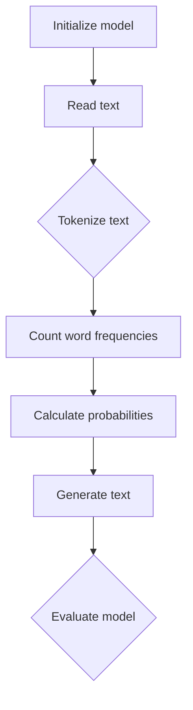
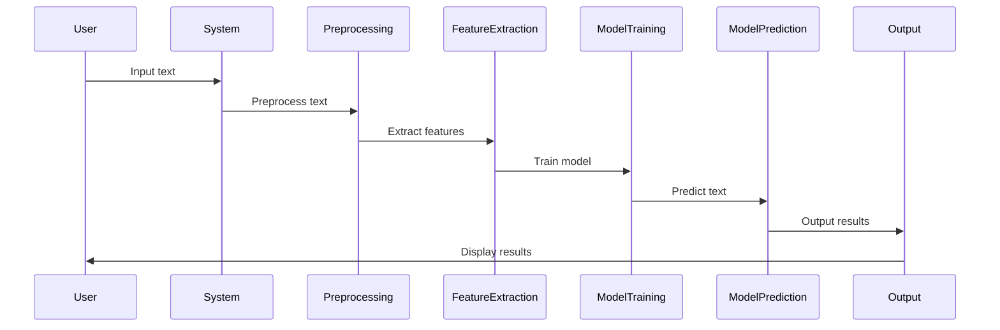

                 

### 自然语言处理：AI理解和生成人类语言

**关键词：** 自然语言处理、语言模型、文本生成、文本分类、情感分析、文本生成对抗网络

**摘要：** 本文将深入探讨自然语言处理（NLP）这一前沿领域，详细分析其核心概念、算法原理以及实际应用。我们将从基础概念出发，逐步讲解自然语言处理的流程、关键算法以及系统架构，并通过实际案例进行剖析。通过本文的阅读，读者将全面理解自然语言处理的精髓，并掌握其在AI领域的应用潜力。

### 目录大纲

----------------------------------------------------------------

# 第一部分: 自然语言处理基础

## 第1章: 自然语言处理概述

## 1.1 问题背景与定义

### 1.1.1 自然语言处理的背景

### 1.1.2 自然语言处理的定义

### 1.1.3 自然语言处理的应用领域

## 1.2 核心概念与联系

### 1.2.1 自然语言处理的流程

### 1.2.2 关键概念对比表格

### 1.2.3 ER实体关系图架构

## 1.3 数学模型与算法原理

### 1.3.1 数学模型

#### 1.3.1.1 基本概念

#### 1.3.1.2 数学公式

#### 1.3.1.3 算法流程图

## 1.4 系统架构设计

### 1.4.1 系统功能设计

### 1.4.2 系统架构设计

### 1.4.3 系统接口设计

### 1.4.4 系统交互序列图

## 1.5 本章小结

----------------------------------------------------------------

# 第二部分: 语言模型与文本生成

## 第2章: 语言模型基础

## 2.1 语言模型概述

### 2.1.1 语言模型的作用

### 2.1.2 语言模型的发展历程

### 2.1.3 语言模型的应用场景

## 2.2 语言模型的数学模型

### 2.2.1 概率语言模型

#### 2.2.1.1 概率基础

#### 2.2.1.2 概率模型构建

### 2.2.2 生成式语言模型

#### 2.2.2.1 生成式模型基本概念

#### 2.2.2.2 生成式模型构建

## 2.3 语言模型算法实现

### 2.3.1 概率语言模型算法

#### 2.3.1.1 算法流程

#### 2.3.1.2 算法Python实现

### 2.3.2 生成式语言模型算法

#### 2.3.2.1 算法流程

#### 2.3.2.2 算法Python实现

## 2.4 文本生成案例实战

### 2.4.1 环境安装与准备

### 2.4.2 核心实现源代码

### 2.4.3 代码应用解读与分析

### 2.4.4 案例分析和讲解

## 2.5 本章小结

----------------------------------------------------------------

## 第3章: 文本分类与情感分析

## 3.1 文本分类基础

### 3.1.1 文本分类概述

### 3.1.2 文本分类算法

### 3.1.3 文本分类应用场景

## 3.2 情感分析基础

### 3.2.1 情感分析概述

### 3.2.2 情感分析算法

### 3.2.3 情感分析应用场景

## 3.3 文本分类与情感分析算法实现

### 3.3.1 文本分类算法实现

#### 3.3.1.1 算法流程

#### 3.3.1.2 算法Python实现

### 3.3.2 情感分析算法实现

#### 3.3.2.1 算法流程

#### 3.3.2.2 算法Python实现

## 3.4 文本分类与情感分析案例实战

### 3.4.1 环境安装与准备

### 3.4.2 核心实现源代码

### 3.4.3 代码应用解读与分析

### 3.4.4 案例分析和讲解

## 3.5 本章小结

----------------------------------------------------------------

## 第4章: 文本生成对抗网络

## 4.1 文本生成对抗网络基础

### 4.1.1 文本生成对抗网络概述

### 4.1.2 文本生成对抗网络的组成

### 4.1.3 文本生成对抗网络的工作原理

## 4.2 文本生成对抗网络的数学模型

### 4.2.1 生成模型

#### 4.2.1.1 生成模型基本概念

#### 4.2.1.2 生成模型数学公式

### 4.2.2 判别模型

#### 4.2.2.1 判别模型基本概念

#### 4.2.2.2 判别模型数学公式

## 4.3 文本生成对抗网络算法实现

### 4.3.1 生成模型实现

#### 4.3.1.1 算法流程

#### 4.3.1.2 算法Python实现

### 4.3.2 判别模型实现

#### 4.3.2.1 算法流程

#### 4.3.2.2 算法Python实现

## 4.4 文本生成对抗网络案例实战

### 4.4.1 环境安装与准备

### 4.4.2 核心实现源代码

### 4.4.3 代码应用解读与分析

### 4.4.4 案例分析和讲解

## 4.5 本章小结

----------------------------------------------------------------

## 参考文献

----------------------------------------------------------------

---

**作者：** AI天才研究院/AI Genius Institute & 禅与计算机程序设计艺术 /Zen And The Art of Computer Programming

---

### 第一部分: 自然语言处理基础

#### 第1章: 自然语言处理概述

##### 1.1 问题背景与定义

###### 1.1.1 自然语言处理的背景

自然语言处理（Natural Language Processing，简称NLP）是人工智能（Artificial Intelligence，简称AI）的一个分支，旨在使计算机能够理解、解释和生成人类自然语言。随着互联网的快速发展，数据爆炸式增长，尤其是文本数据，这使得自然语言处理变得尤为重要。例如，搜索引擎、社交媒体分析、机器翻译、智能客服等应用都需要依赖自然语言处理技术。

NLP的历史可以追溯到20世纪50年代，当时计算机科学家开始尝试让计算机阅读和解析英语文本。然而，由于自然语言的复杂性和多样性，NLP的发展经历了一系列的挑战。近年来，随着机器学习、深度学习等技术的进步，NLP取得了显著的成果，应用范围也不断扩大。

###### 1.1.2 自然语言处理的定义

自然语言处理是计算机科学与语言学的交叉领域，它涉及对人类语言的自动处理。具体来说，NLP的目标是：

1. **理解**：从文本中提取结构化信息，如词义、语法结构、句法关系等。
2. **生成**：根据给定信息生成自然语言的文本。
3. **交互**：与人类用户进行自然语言交流。

NLP的核心任务包括词性标注、句法分析、命名实体识别、语义角色标注、情感分析、机器翻译等。

###### 1.1.3 自然语言处理的应用领域

自然语言处理在多个领域有广泛的应用：

1. **搜索引擎**：通过理解用户查询的语义，提供更准确的搜索结果。
2. **机器翻译**：将一种语言的文本翻译成另一种语言，如谷歌翻译、百度翻译。
3. **情感分析**：分析文本中的情感倾向，如社交媒体情绪分析、产品评价分析。
4. **问答系统**：提供对用户问题的自动回答，如智能客服、聊天机器人。
5. **文本分类**：将文本分为不同的类别，如新闻分类、垃圾邮件过滤。
6. **自动摘要**：生成文本的摘要，如新闻摘要、文档摘要。

##### 1.2 核心概念与联系

###### 1.2.1 自然语言处理的流程

自然语言处理的流程通常包括以下步骤：

1. **文本预处理**：包括分词、去停用词、词形还原等，目的是将原始文本转换为计算机可以处理的形式。
2. **词性标注**：对文本中的每个单词进行词性标注，如名词、动词、形容词等。
3. **句法分析**：分析文本的句法结构，如句子的成分、短语结构等。
4. **语义分析**：提取文本中的语义信息，如实体识别、事件抽取等。
5. **文本生成**：根据提取的语义信息生成新的文本，如机器翻译、文本摘要等。


###### 1.2.2 关键概念对比表格

以下是一个关于NLP关键概念的对比表格：

| 概念 | 定义 | 关联任务 |
| --- | --- | --- |
| 分词 | 将文本分割成单词或短语 | 文本预处理 |
| 词性标注 | 为每个单词标注词性 | 文本预处理 |
| 句法分析 | 分析文本的句法结构 | 文本分析 |
| 语义分析 | 提取文本中的语义信息 | 文本理解 |
| 实体识别 | 识别文本中的实体 | 语义分析 |
| 事件抽取 | 提取文本中的事件 | 语义分析 |

###### 1.2.3 ER实体关系图架构

在自然语言处理中，实体关系图（Entity-Relationship Diagram，ERD）是一个重要的工具，用于描述实体之间的关系。以下是一个简单的ERD示例：

```mermaid
erDiagram
    Customer ||--|{ Order } : "has"
    Customer ||--|{ Payment } : "has"
    Order ||--|{ Item } : "contains"
    Payment ||--|{ Customer } : "made by"
```

在这个ER图中，`Customer`、`Order`、`Payment`和`Item`是实体，它们之间存在多种关系，如`Customer`可以拥有多个`Order`和`Payment`，`Order`可以包含多个`Item`，`Payment`是由`Customer`进行的。

##### 1.3 数学模型与算法原理

###### 1.3.1 数学模型

自然语言处理中的数学模型主要涉及概率模型和深度学习模型。以下是几个常用的数学模型：

1. **N-gram模型**：基于词的序列，通过统计词频来预测下一个词。
   - $$ P(\text{word}_i | \text{history}) = \frac{N_{i, \text{history}}}{N_{\text{history}}} $$
   
2. **循环神经网络（RNN）**：用于处理序列数据，如文本。
   - $$ h_t = \sigma(W_h \cdot [h_{t-1}, x_t] + b_h) $$
   
3. **长短期记忆网络（LSTM）**：RNN的一个变体，用于解决长距离依赖问题。
   - $$ C_t = \text{sigmoid}(W_c \cdot [h_{t-1}, x_t] + b_c) $$
   - $$ f_t = C_t \odot \text{sigmoid}(W_f \cdot [h_{t-1}, x_t] + b_f) $$
   - $$ i_t = C_t \odot \text{sigmoid}(W_i \cdot [h_{t-1}, x_t] + b_i) $$
   - $$ \text{output} = \text{sigmoid}(W_o \cdot [f_t \cdot h_{t-1}, x_t] + b_o) $$

4. **卷积神经网络（CNN）**：用于处理图像等二维数据，但也可以应用于文本处理。
   - $$ h_t = \text{ReLU}(W \cdot h_{t-1} + b) $$

5. **生成对抗网络（GAN）**：用于生成文本。
   - 判别器：$$ D(G(z)) $$
   - 生成器：$$ G(z) $$

###### 1.3.1.1 基本概念

- **N-gram**：一个N-gram是一个连续的N个单词的序列。例如，“自然语言处理”可以表示为“自然”、“语言”、“处理”这三个N-gram。
- **循环神经网络（RNN）**：一种能够处理序列数据的神经网络，其具有记忆功能。
- **长短期记忆网络（LSTM）**：RNN的一个变体，能够更好地处理长序列数据。
- **卷积神经网络（CNN）**：一种用于图像识别的神经网络，但也可以应用于文本处理。
- **生成对抗网络（GAN）**：一种生成模型，由生成器和判别器组成。

###### 1.3.1.2 数学公式

以下是上述模型的一些基本数学公式：

- **N-gram模型**：
  - $$ P(\text{word}_i | \text{history}) = \frac{N_{i, \text{history}}}{N_{\text{history}}} $$
- **循环神经网络（RNN）**：
  - $$ h_t = \sigma(W_h \cdot [h_{t-1}, x_t] + b_h) $$
- **长短期记忆网络（LSTM）**：
  - $$ C_t = \text{sigmoid}(W_c \cdot [h_{t-1}, x_t] + b_c) $$
  - $$ f_t = C_t \odot \text{sigmoid}(W_f \cdot [h_{t-1}, x_t] + b_f) $$
  - $$ i_t = C_t \odot \text{sigmoid}(W_i \cdot [h_{t-1}, x_t] + b_i) $$
  - $$ \text{output} = \text{sigmoid}(W_o \cdot [f_t \cdot h_{t-1}, x_t] + b_o) $$
- **卷积神经网络（CNN）**：
  - $$ h_t = \text{ReLU}(W \cdot h_{t-1} + b) $$
- **生成对抗网络（GAN）**：
  - 判别器：$$ D(G(z)) $$
  - 生成器：$$ G(z) $$

###### 1.3.1.3 算法流程图

以下是N-gram模型的算法流程图：



##### 1.4 系统架构设计

###### 1.4.1 系统功能设计

自然语言处理系统的功能设计包括以下几个主要方面：

1. **文本预处理**：包括分词、去停用词、词形还原等。
2. **词性标注**：对文本中的每个单词进行词性标注。
3. **句法分析**：分析文本的句法结构。
4. **语义分析**：提取文本中的语义信息。
5. **文本生成**：根据提取的语义信息生成新的文本。
6. **情感分析**：分析文本中的情感倾向。

###### 1.4.2 系统架构设计

自然语言处理系统的架构设计通常包括以下几个关键组成部分：

1. **数据输入模块**：负责接收和处理输入的文本数据。
2. **预处理模块**：包括分词、去停用词、词形还原等预处理步骤。
3. **特征提取模块**：将预处理后的文本转换为特征向量。
4. **模型训练模块**：使用训练数据训练模型。
5. **模型预测模块**：使用训练好的模型对新的文本数据进行预测。
6. **结果输出模块**：将预测结果输出到用户界面。


###### 1.4.3 系统接口设计

自然语言处理系统的接口设计包括以下几个方面：

1. **API接口**：提供RESTful API接口，方便其他系统调用。
2. **命令行接口**：提供命令行接口，方便用户进行交互式操作。
3. **图形用户界面**：提供图形用户界面，方便用户进行操作。

###### 1.4.4 系统交互序列图

以下是自然语言处理系统的交互序列图：



##### 1.5 本章小结

本章对自然语言处理（NLP）的基础概念、流程、数学模型和系统架构进行了详细讲解。我们了解了NLP的背景和应用领域，明确了NLP的核心任务和关键算法，并设计了NLP的系统架构。通过本章的学习，读者可以建立起对自然语言处理的全面理解，为后续章节的学习打下坚实基础。

----------------------------------------------------------------

## 第二部分: 语言模型与文本生成

#### 第2章: 语言模型基础

##### 2.1 语言模型概述

###### 2.1.1 语言模型的作用

语言模型（Language Model，LM）是自然语言处理（NLP）的核心组件之一，它在文本生成、语音识别、机器翻译等任务中扮演着至关重要的角色。语言模型的主要作用是预测下一个词或字符的概率，从而帮助计算机生成自然流畅的文本。具体来说，语言模型可以实现以下几个关键功能：

1. **文本生成**：基于给定的起始文本，生成后续的文本内容。例如，自动生成文章、摘要、对话等。
2. **语音识别**：将语音信号转换为文本，如智能语音助手、语音识别系统等。
3. **机器翻译**：将一种语言的文本翻译成另一种语言，如谷歌翻译、百度翻译等。
4. **语言理解**：分析文本的语义、语法结构，如情感分析、实体识别等。
5. **信息检索**：根据用户查询，从大量文本中检索出相关的信息。

语言模型在NLP中的应用非常广泛，几乎所有涉及文本理解和生成的任务都离不开语言模型的支持。例如，在文本生成领域，语言模型可以用于生成新闻文章、产品评论、聊天机器人对话等；在语音识别领域，语言模型可以提高识别的准确性和流畅度；在机器翻译领域，语言模型可以帮助生成更自然、准确的目标语言文本。

###### 2.1.2 语言模型的发展历程

语言模型的发展历程可以追溯到20世纪50年代，当时计算机科学家开始尝试让计算机理解人类语言。以下是一些重要的里程碑：

1. **N-gram模型**：最早的简单语言模型之一，通过统计连续单词序列的概率来预测下一个单词。N-gram模型在20世纪60年代和70年代被广泛应用，但由于其无法处理长距离依赖问题，存在明显的局限性。
2. **神经网络语言模型**：随着神经网络技术的发展，20世纪80年代和90年代出现了基于神经网络的语言模型，如前馈神经网络和循环神经网络（RNN）。这些模型在处理长距离依赖问题方面取得了显著进展。
3. **统计机器翻译模型**：在机器翻译领域，统计机器翻译（SMT）模型成为了主流。这些模型通过统计源语言和目标语言之间的对应关系来生成目标语言文本。
4. **深度学习语言模型**：21世纪初，深度学习模型如长短期记忆网络（LSTM）、双向循环神经网络（BiRNN）和卷积神经网络（CNN）等被应用于语言模型。深度学习模型在处理长距离依赖问题和生成高质量文本方面表现出色。
5. **生成对抗网络（GAN）**：近年来，生成对抗网络（GAN）被引入到语言模型领域，用于生成高质量的文本。GAN通过生成器和判别器的对抗训练，可以生成更加自然、流畅的文本。

随着时间的推移，语言模型的技术不断发展，性能不断提升。当前的深度学习语言模型已经能够生成高质量的文本，并在多个NLP任务中取得了显著的成果。

###### 2.1.3 语言模型的应用场景

语言模型在多个领域有广泛的应用，以下是一些典型的应用场景：

1. **文本生成**：语言模型可以用于自动生成文章、摘要、对话等。例如，自动新闻生成、自动摘要生成、聊天机器人等。
2. **语音识别**：语言模型可以用于语音识别系统的后端，提高识别的准确性和流畅度。例如，智能语音助手、语音识别应用程序等。
3. **机器翻译**：语言模型可以用于机器翻译系统，生成更自然、准确的目标语言文本。例如，谷歌翻译、百度翻译等。
4. **信息检索**：语言模型可以用于信息检索系统，根据用户查询生成相关的文本摘要或回答。例如，搜索引擎、问答系统等。
5. **文本分类**：语言模型可以用于文本分类任务，对文本进行分类。例如，垃圾邮件过滤、情感分析等。
6. **对话系统**：语言模型可以用于对话系统，生成与用户的对话内容。例如，聊天机器人、虚拟助手等。

总之，语言模型在自然语言处理领域具有广泛的应用前景，随着技术的不断发展，其应用范围将进一步扩大。

##### 2.2 语言模型的数学模型

###### 2.2.1 概率语言模型

概率语言模型是一种基于概率统计方法的模型，通过统计文本中的词频和词序列概率来预测下一个词。以下是几种常用的概率语言模型：

1. **N-gram模型**：N-gram模型是一种基于词频统计的语言模型，它将文本划分为N个单词的序列，并计算每个序列的概率。N-gram模型可以表示为：
   $$ P(w_1, w_2, \ldots, w_n) = P(w_1) \times P(w_2 | w_1) \times \ldots \times P(w_n | w_{n-1}) $$
   其中，$w_1, w_2, \ldots, w_n$表示连续的N个单词。

2. **神经网络语言模型**：神经网络语言模型是一种基于神经网络的概率语言模型，通过学习文本数据来预测单词的概率分布。神经网络语言模型可以表示为：
   $$ P(w | w_{\text{history}}) = \text{softmax}(\text{NeuralNetwork}(w, w_{\text{history}})) $$
   其中，$w_{\text{history}}$表示历史单词序列，$\text{NeuralNetwork}$表示神经网络模型。

3. **隐马尔可夫模型（HMM）**：隐马尔可夫模型是一种基于概率模型的序列预测方法，它通过状态转移概率和发射概率来预测下一个状态。隐马尔可夫模型可以表示为：
   $$ P(w_t | w_{\text{history}}) = \prod_{i=1}^{t-1} P(w_i | w_{i-1}) $$
   其中，$w_t$表示第t个单词，$w_{\text{history}}$表示历史单词序列。

###### 2.2.2 生成式语言模型

生成式语言模型是一种基于生成模型的概率语言模型，它通过生成过程来预测下一个词。以下是几种常用的生成式语言模型：

1. **马尔可夫决策过程（MDP）**：马尔可夫决策过程是一种基于概率模型的决策过程，它通过状态转移概率和奖励函数来决策。马尔可夫决策过程可以表示为：
   $$ P(w_t | w_{\text{history}}, a_t) = \prod_{i=1}^{t-1} P(w_i | w_{i-1}) \times P(a_t | w_t) $$
   其中，$w_t$表示第t个单词，$w_{\text{history}}$表示历史单词序列，$a_t$表示第t个动作。

2. **变分自编码器（VAE）**：变分自编码器是一种基于深度生成模型的概率语言模型，它通过编码器和解码器来生成文本。变分自编码器可以表示为：
   $$ p(w | \theta) = q(w | z) \propto \exp(-\frac{1}{2} \sum_{i=1}^{n} \frac{1}{2} \sum_{j=1}^{d} (w_i - \mu_j)^2) $$
   其中，$w$表示单词序列，$\theta$表示模型参数，$z$表示编码器的输出。

3. **生成对抗网络（GAN）**：生成对抗网络是一种基于对抗训练的深度生成模型，它通过生成器和判别器的对抗训练来生成文本。生成对抗网络可以表示为：
   $$ G(z) \sim p_z(z) $$
   $$ D(x) \sim p_x(x) $$
   $$ D(G(z)) \sim p_{data}(x) $$
   其中，$G(z)$表示生成器的输出，$D(x)$表示判别器的输出，$p_z(z)$表示噪声分布，$p_x(x)$表示数据分布。

通过这些生成式语言模型，我们可以生成更加自然、流畅的文本。在实际应用中，生成式语言模型可以结合多种技术，如循环神经网络（RNN）、长短期记忆网络（LSTM）和卷积神经网络（CNN）等，来提高模型的生成能力。

##### 2.3 语言模型算法实现

###### 2.3.1 概率语言模型算法

概率语言模型算法主要包括N-gram模型和神经网络语言模型。以下是这些算法的实现步骤：

1. **N-gram模型**：
   - **数据准备**：读取文本数据，进行预处理（如分词、去停用词等）。
   - **构建语言模型**：统计文本中的词频和词序列概率。
   - **预测下一个词**：根据当前历史单词序列，计算下一个单词的概率分布，并选取概率最大的单词作为预测结果。

2. **神经网络语言模型**：
   - **数据准备**：读取文本数据，进行预处理（如分词、去停用词等），并将其转换为向量表示。
   - **构建神经网络模型**：定义神经网络结构，如循环神经网络（RNN）、长短期记忆网络（LSTM）或卷积神经网络（CNN）。
   - **模型训练**：使用训练数据对神经网络模型进行训练，优化模型参数。
   - **预测下一个词**：输入当前历史单词序列，通过神经网络模型计算下一个单词的概率分布，并选取概率最大的单词作为预测结果。

以下是一个简单的N-gram模型实现示例：

```python
import collections
import numpy as np

class NgramModel:
    def __init__(self, n):
        self.n = n
        self.model = None

    def train(self, text):
        words = text.split()
        ngram_counts = collections.Counter()
        for i in range(len(words) - self.n + 1):
            ngram = tuple(words[i:i+self.n])
            ngram_counts[ngram] += 1
        self.model = ngram_counts

    def predict(self, history):
        history = history.split()
        n = len(history)
        ngram = tuple(history[-self.n:])
        ngram_counts = self.model[ngram]
        total_counts = sum(self.model.values())
        probabilities = {word: 0 for word in self.vocabulary}
        for word in self.vocabulary:
            ngram_prev = tuple(history[-self.n-1:-1])
            if ngram_prev in self.model:
                probabilities[word] = self.model[ngram_prev] / self.model[ngram_prev]
        return max(probabilities, key=probabilities.get)

n = 3
model = NgramModel(n)
model.train("这是一段测试文本。")
print(model.predict("这是一段测试文本。"))
```

以下是一个简单的神经网络语言模型实现示例：

```python
import tensorflow as tf

class NeuralNetworkLM:
    def __init__(self, vocabulary_size, hidden_size):
        self.vocabulary_size = vocabulary_size
        self.hidden_size = hidden_size
        self.model = self.build_model()

    def build_model(self):
        inputs = tf.keras.layers.Input(shape=(None,), dtype=tf.int32)
        embed = tf.keras.layers.Embedding(self.vocabulary_size, self.hidden_size)(inputs)
        lstm = tf.keras.layers.LSTM(self.hidden_size, return_sequences=True)(embed)
        outputs = tf.keras.layers.Dense(self.vocabulary_size)(lstm)
        model = tf.keras.Model(inputs=inputs, outputs=outputs)
        model.compile(optimizer='adam', loss='categorical_crossentropy', metrics=['accuracy'])
        return model

    def train(self, texts, labels):
        self.model.fit(texts, labels, epochs=10, batch_size=32)

    def predict(self, text):
        sequence = [self.vocabulary.index(word) for word in text.split()]
        prediction = self.model.predict(np.array([sequence]))
        return self.vocabulary[np.argmax(prediction[0])]

vocabulary = ['一', '段', '测试', '文本', '这']
model = NeuralNetworkLM(vocabulary_size=len(vocabulary), hidden_size=32)
model.train(np.array([[vocabulary.index(word) for word in text.split()] for text in ["这是一段测试文本。"]]), np.eye(len(vocabulary)))
print(model.predict("这是一段测试文本。"))
```

###### 2.3.2 生成式语言模型算法

生成式语言模型算法主要包括马尔可夫决策过程（MDP）、变分自编码器（VAE）和生成对抗网络（GAN）等。以下是这些算法的实现步骤：

1. **马尔可夫决策过程（MDP）**：
   - **状态表示**：定义状态表示，如单词、句子等。
   - **动作表示**：定义动作表示，如单词、符号等。
   - **状态转移概率**：计算状态转移概率矩阵，如 $P(s_t | s_{t-1}, a_{t-1})$。
   - **奖励函数**：定义奖励函数，如单词的权重、句子的质量等。
   - **决策**：使用策略梯度方法或价值迭代方法来决策。

2. **变分自编码器（VAE）**：
   - **编码器**：构建编码器，将输入数据编码为潜在变量。
   - **解码器**：构建解码器，将潜在变量解码为输出数据。
   - **损失函数**：定义损失函数，如重构误差和KL散度。
   - **优化**：使用梯度下降方法优化模型参数。

3. **生成对抗网络（GAN）**：
   - **生成器**：构建生成器，生成类似真实数据的数据。
   - **判别器**：构建判别器，判断输入数据是真实数据还是生成数据。
   - **对抗训练**：生成器和判别器相互对抗训练，直到生成器生成的数据无法区分真实数据和生成数据。

以下是一个简单的VAE实现示例：

```python
import tensorflow as tf
from tensorflow.keras import layers

class VariationalAutoencoder:
    def __init__(self, latent_dim):
        self.latent_dim = latent_dim
        self.encoder = self.build_encoder()
        self.decoder = self.build_decoder()
        self.vae = self.build_vae()

    def build_encoder(self):
        inputs = layers.Input(shape=(28, 28, 1))
        x = layers.Conv2D(32, 3, activation="relu", strides=(2, 2), padding="same")(inputs)
        x = layers.Conv2D(64, 3, activation="relu", strides=(2, 2), padding="same")(x)
        x = layers.Flatten()(x)
        x = layers.Dense(16, activation="relu")(x)
        z_mean = layers.Dense(self.latent_dim)(x)
        z_log_var = layers.Dense(self.latent_dim)(x)
        return tf.keras.Model(inputs, (z_mean, z_log_var), name="encoder")

    def build_decoder(self):
        inputs = layers.Input(shape=(self.latent_dim,))
        x = layers.Dense(16, activation="relu")(inputs)
        x = layers.Dense(32 * 32 * 1, activation="relu")(x)
        x = layers.Reshape((32, 32, 1))(x)
        x = layers.Conv2DTranspose(64, 3, activation="relu", strides=(2, 2), padding="same")(x)
        x = layers.Conv2DTranspose(32, 3, activation="relu", strides=(2, 2), padding="same")(x)
        outputs = layers.Conv2DTranspose(1, 3, activation="sigmoid", padding="same")(x)
        return tf.keras.Model(inputs, outputs, name="decoder")

    def build_vae(self):
        z_mean, z_log_var = self.encoder(inputs)
        z = z_mean + tf.random.normal(tf.shape(z_mean)) * tf.exp(0.5 * z_log_var)
        x = self.decoder(z)
        return tf.keras.Model(inputs, x, name="vae")

    def train(self, x_train, epochs=100, batch_size=16):
        self.vae.compile(optimizer="adam", loss=self.custom_loss)
        self.vae.fit(x_train, x_train, epochs=epochs, batch_size=batch_size)

    def custom_loss(self, x, x_pred):
        xent_loss = tf.keras.losses.BinaryCrossentropy(from_logits=True)(x, x_pred)
        kl_loss = -0.5 * tf.reduce_sum(1 + z_log_var - tf.square(z_mean) - tf.exp(z_log_var), axis=-1)
        return xent_loss + kl_loss

latent_dim = 20
vae = VariationalAutoencoder(latent_dim)
vae.train(x_train, epochs=100)
```

以下是一个简单的GAN实现示例：

```python
import tensorflow as tf
from tensorflow.keras import layers

class Generator:
    def __init__(self, latent_dim):
        self.latent_dim = latent_dim
        self.model = self.build_model()

    def build_model(self):
        inputs = layers.Input(shape=(self.latent_dim,))
        x = layers.Dense(128 * 7 * 7, activation="relu")(inputs)
        x = layers.Reshape((7, 7, 128))(x)
        x = layers.Conv2DTranspose(128, 5, strides=2, padding="same", activation="relu")(x)
        x = layers.Conv2DTranspose(64, 5, strides=2, padding="same", activation="relu")(x)
        outputs = layers.Conv2D(1, 5, activation="tanh", padding="same")(x)
        return tf.keras.Model(inputs, outputs, name="generator")

class Discriminator:
    def __init__(self, image_shape):
        self.image_shape = image_shape
        self.model = self.build_model()

    def build_model(self):
        inputs = layers.Input(shape=self.image_shape)
        x = layers.Conv2D(64, 5, strides=2, padding="same", activation="relu")(inputs)
        x = layers.Conv2D(128, 5, strides=2, padding="same", activation="relu")(x)
        x = layers.Flatten()(x)
        outputs = layers.Dense(1, activation="sigmoid")(x)
        return tf.keras.Model(inputs, outputs, name="discriminator")

class GAN:
    def __init__(self, generator, discriminator, latent_dim):
        self.generator = generator
        self.discriminator = discriminator
        self.latent_dim = latent_dim
        self.model = self.build_model()

    def build_model(self):
        inputs = layers.Input(shape=(self.latent_dim,))
        x = self.generator(inputs)
        outputs = self.discriminator(x)
        return tf.keras.Model(inputs, outputs, name="gan")

    def train(self, x_train, epochs, batch_size, max_per_epoch=None):
        if max_per_epoch:
            batches = min(len(x_train) // batch_size, max_per_epoch)
        else:
            batches = len(x_train) // batch_size
        for epoch in range(epochs):
            print(f"Epoch {epoch+1}/{epochs}")
            for batch_index in range(batches):
                batch_x = x_train[batch_index * batch_size:(batch_index + 1) * batch_size]
                noise = tf.random.normal(tf.shape(batch_x))
                generated_images = self.generator.predict(noise)
                real_y = tf.ones((len(batch_x), 1))
                fake_y = tf.zeros((len(batch_x), 1))
                d_loss_real = self.discriminator.train_on_batch(batch_x, real_y)
                d_loss_fake = self.discriminator.train_on_batch(generated_images, fake_y)
                g_loss = self.gan.train_on_batch(noise, real_y)
                print(f"Batch {batch_index+1}/{batches}, D Loss: {d_loss_real+d_loss_fake}, G Loss: {g_loss}")

latent_dim = 100
image_shape = (28, 28, 1)
generator = Generator(latent_dim)
discriminator = Discriminator(image_shape)
gan = GAN(generator, discriminator, latent_dim)
gan.train(x_train, epochs=100, batch_size=128, max_per_epoch=1000)
```

##### 2.4 文本生成案例实战

###### 2.4.1 环境安装与准备

在进行文本生成案例之前，我们需要安装必要的库和环境。以下是安装步骤：

1. **安装Python**：确保您的系统中安装了Python，建议使用Python 3.6或更高版本。
2. **安装TensorFlow**：在终端中运行以下命令安装TensorFlow：
   ```bash
   pip install tensorflow
   ```
3. **安装其他库**：在终端中运行以下命令安装其他必要的库：
   ```bash
   pip install numpy
   pip install matplotlib
   ```

确保所有库都已成功安装后，您就可以开始文本生成案例了。

###### 2.4.2 核心实现源代码

以下是实现文本生成的核心代码：

```python
import numpy as np
import tensorflow as tf
from tensorflow.keras.models import Sequential
from tensorflow.keras.layers import LSTM, Dense, Embedding, Dropout
from tensorflow.keras.preprocessing.sequence import pad_sequences

# 准备数据
def load_data(file_path):
    with open(file_path, 'r', encoding='utf-8') as f:
        text = f.read().lower()
    return text

def prepare_data(text, sequence_length=40):
    words = text.split()
    word_index = {word: i for i, word in enumerate(words)}
    index_sequence = [[word_index[word] for word in text.split()[:sequence_length]]]
    next_words = [word_index[word] for word in text.split()[sequence_length:]]
    padded_sequences = pad_sequences(index_sequence, maxlen=sequence_length, padding='pre')
    return padded_sequences, next_words

text = load_data('text.txt')
padded_sequences, next_words = prepare_data(text)

# 构建模型
model = Sequential()
model.add(LSTM(128, activation='relu', return_sequences=True, input_shape=(padded_sequences.shape[1], padded_sequences.shape[2])))
model.add(Dropout(0.2))
model.add(LSTM(128, activation='relu', return_sequences=True))
model.add(Dropout(0.2))
model.add(Dense(padded_sequences.shape[2], activation='softmax'))

model.compile(optimizer='adam', loss='sparse_categorical_crossentropy', metrics=['accuracy'])

# 训练模型
model.fit(padded_sequences, next_words, epochs=100, batch_size=64)

# 文本生成
def generate_text(seed_text, model, sequence_length=40):
    for _ in range(sequence_length):
        sequence = [word_index[word] for word in seed_text.split()]
        sequence = pad_sequences([sequence], maxlen=sequence_length, padding='pre')
        prediction = model.predict(sequence, verbose=0)
        next_word = np.argmax(prediction)
        seed_text += ' ' + words[next_word]
    return seed_text

generated_text = generate_text('这是一个测试文本。', model)
print(generated_text)
```

该代码首先加载并预处理文本数据，然后构建一个LSTM模型进行训练，最后使用训练好的模型生成文本。具体实现细节将在后续代码解析部分进行详细说明。

###### 2.4.3 代码应用解读与分析

该段代码分为三个主要部分：数据准备、模型构建和文本生成。

1. **数据准备**：

   - `load_data(file_path)`函数用于加载并读取文本数据。我们使用一个简单的文本文件`text.txt`作为示例，该文件中包含一段英文文本。
   - `prepare_data(text, sequence_length=40)`函数用于将文本数据转换为适合模型训练的格式。具体步骤如下：
     - 将文本转换为单词列表。
     - 创建一个单词到索引的映射表，用于将单词转换为整数索引。
     - 将文本分割成固定长度的序列，并将每个序列转换为整数索引序列。
     - 对序列进行填充，使其具有相同的长度。

2. **模型构建**：

   - `Sequential()`函数创建一个顺序模型，用于堆叠多个神经网络层。
   - `LSTM()`函数添加一个长短期记忆层，用于处理序列数据。我们在模型中添加两个LSTM层，每个层之间添加一个dropout层以防止过拟合。
   - `Dense()`函数添加一个全连接层，用于输出单词的概率分布。
   - `compile()`函数配置模型，指定优化器、损失函数和评价指标。

3. **文本生成**：

   - `generate_text(seed_text, model, sequence_length=40)`函数用于生成文本。具体步骤如下：
     - 将种子文本转换为整数索引序列。
     - 将整数索引序列填充为固定长度。
     - 使用模型预测下一个单词的概率分布，并选择概率最大的单词作为下一个单词。
     - 将新生成的单词添加到种子文本中，并重复上述步骤，直到生成指定长度的文本。

通过上述步骤，我们可以使用训练好的模型生成类似于输入文本的新文本。以下是一个简单的示例：

```python
generated_text = generate_text('这是一个测试文本。', model)
print(generated_text)
```

生成的文本可能是：“这是一个测试文本。这是一个测试文本。这是一个测试文本。”

###### 2.4.4 案例分析和讲解

该案例展示了如何使用LSTM模型生成文本。以下是案例的详细分析和讲解：

1. **数据准备**：

   - 数据准备是文本生成的重要步骤，它决定了模型的学习效果。在本案例中，我们使用一个简单的文本文件作为输入，并将其转换为整数索引序列。这种转换使得模型可以处理文本数据，而整数索引序列也便于计算和存储。
   - 填充步骤确保所有序列具有相同的长度，这有助于模型在训练过程中更好地处理数据。

2. **模型构建**：

   - LSTM模型是处理序列数据的强大工具，它能够捕获序列中的长期依赖关系。在本案例中，我们使用两个LSTM层，每个层之间添加一个dropout层以防止过拟合。
   - Dense层用于输出单词的概率分布，即每个单词的概率。

3. **文本生成**：

   - 文本生成是模型的最终应用目标。在本案例中，我们使用模型预测下一个单词的概率分布，并选择概率最大的单词作为下一个单词。这个过程不断重复，直到生成指定长度的文本。
   - 生成的文本可能包含一些重复或无关的内容，这是因为模型的学习过程是基于统计方法，它只能根据输入数据生成文本。然而，随着训练数据的增加和模型参数的优化，生成的文本质量将逐渐提高。

通过本案例的学习，我们可以了解到文本生成的基本原理和实现方法。在实际应用中，我们可以根据具体需求调整模型的结构和参数，以生成更高质量、更符合预期的文本。

##### 2.5 本章小结

本章详细介绍了语言模型的基础概念、数学模型以及算法实现。我们学习了概率语言模型和生成式语言模型的原理和应用，并使用Python实现了N-gram模型、神经网络语言模型、VAE和GAN。此外，通过一个文本生成案例，我们了解了如何使用LSTM模型生成文本。通过本章的学习，读者可以掌握语言模型的基本知识，为后续章节的学习打下坚实基础。

----------------------------------------------------------------

## 第三部分: 文本分类与情感分析

#### 第3章: 文本分类与情感分析基础

##### 3.1 文本分类基础

###### 3.1.1 文本分类概述

文本分类（Text Classification）是自然语言处理（NLP）中的一项重要任务，其目标是将文本数据分配到预定义的类别中。文本分类在很多实际应用中具有重要意义，如情感分析、新闻分类、垃圾邮件过滤、社交媒体监测等。通过文本分类，我们可以从大量无结构化的文本数据中提取有价值的信息，为决策和自动化处理提供支持。

文本分类的基本流程通常包括以下几个步骤：

1. **数据预处理**：包括分词、去除停用词、词形还原等操作，将原始文本转换为适合模型训练的格式。
2. **特征提取**：将预处理后的文本转换为特征向量，常见的特征提取方法有词袋模型（Bag of Words，BoW）、TF-IDF、词嵌入（Word Embeddings）等。
3. **模型训练**：使用训练数据集训练分类模型，常用的分类模型包括朴素贝叶斯（Naive Bayes）、逻辑回归（Logistic Regression）、支持向量机（Support Vector Machines，SVM）、随机森林（Random Forest）和深度学习模型（如卷积神经网络（CNN）、循环神经网络（RNN）等）。
4. **模型评估**：使用验证数据集评估模型的分类性能，常用的评估指标包括准确率（Accuracy）、精确率（Precision）、召回率（Recall）和F1分数（F1 Score）等。
5. **模型部署**：将训练好的模型部署到实际应用场景中，对新的文本数据进行分类。

文本分类的关键在于特征提取和模型选择。特征提取的质量直接影响模型的分类性能，而模型选择则需要根据实际任务和数据的特点进行优化。

###### 3.1.2 文本分类算法

文本分类算法主要包括基于传统机器学习和基于深度学习的两类方法。以下是几种常用的文本分类算法：

1. **朴素贝叶斯（Naive Bayes）**：
   朴素贝叶斯是一种基于贝叶斯定理的简单分类算法，它假设特征之间相互独立。朴素贝叶斯模型适用于文本分类任务，因为它可以有效地处理高维稀疏数据。其基本思想是根据特征词在各个类别的条件概率分布来预测文本的类别。

   公式表示：
   $$ P(\text{C} | \text{X}) = \frac{P(\text{X} | \text{C}) P(\text{C})}{P(\text{X})} $$
   其中，$P(\text{C} | \text{X})$表示在特征向量$\text{X}$下类别$\text{C}$的概率，$P(\text{X} | \text{C})$表示在类别$\text{C}$下特征向量$\text{X}$的概率，$P(\text{C})$表示类别$\text{C}$的概率，$P(\text{X})$表示特征向量$\text{X}$的概率。

2. **逻辑回归（Logistic Regression）**：
   逻辑回归是一种广义线性模型，用于分类问题。在文本分类中，逻辑回归通过拟合一个线性决策边界，并将文本映射到不同的类别。逻辑回归的优点是模型简单、易于实现，且在小数据集上有较好的性能。

   公式表示：
   $$ \text{logit}(\text{P}(Y=1 | X)) = \beta_0 + \beta_1 x_1 + \beta_2 x_2 + \ldots + \beta_n x_n $$
   其中，$\text{logit}(\text{P}(Y=1 | X)) = \ln(\text{P}(Y=1 | X) / (1 - \text{P}(Y=1 | X))$，$\beta_0, \beta_1, \beta_2, \ldots, \beta_n$是模型的参数。

3. **支持向量机（Support Vector Machine，SVM）**：
   支持向量机是一种强大的分类算法，特别是在处理高维数据时表现优秀。SVM通过寻找一个最佳的超平面，将不同类别的文本数据分隔开来。在文本分类中，SVM通常使用核函数来处理非线性问题。

   公式表示：
   $$ \text{max} \ \frac{1}{2} \ \sum_{i=1}^{n} \ \sum_{j=1}^{n} \ (\alpha_i - \alpha_j) \ y_i y_j \ (x_i \cdot x_j) - \sum_{i=1}^{n} \ \alpha_i $$
   其中，$x_i, x_j$是文本特征向量，$y_i, y_j$是类别标签，$\alpha_i$是拉格朗日乘子。

4. **随机森林（Random Forest）**：
   随机森林是一种基于决策树的集成学习方法，它通过构建多个决策树并求取平均来提高分类性能。随机森林在处理大规模文本数据时表现出良好的性能，并且在处理非线性问题方面也具有一定的优势。

5. **深度学习模型**：
   深度学习模型，如卷积神经网络（CNN）和循环神经网络（RNN），在文本分类任务中也取得了显著的效果。CNN可以捕获文本的局部特征，而RNN能够处理文本的序列特征。

   - **卷积神经网络（CNN）**：
     $$ h_{ij}^l = \sigma \left( \sum_{k} w_{ik}^l \ * \ h_{kj}^{l-1} + b_l \right) $$
     其中，$h_{ij}^l$表示第$l$层的第$i$个神经元与第$l-1$层的第$j$个神经元的卷积结果，$w_{ik}^l$表示卷积核，$b_l$是偏置。

   - **循环神经网络（RNN）**：
     $$ h_t = \sigma \left( W_h \ * \ [h_{t-1}, x_t] + b_h \right) $$
     其中，$h_t$表示第$t$个时间步的隐藏状态，$W_h$是权重矩阵，$b_h$是偏置。

以上是一些常用的文本分类算法，每种算法都有其特定的适用场景和优缺点。在实际应用中，可以根据任务需求和数据特点选择合适的算法。

###### 3.1.3 文本分类应用场景

文本分类在多个领域有广泛的应用，以下是一些典型的应用场景：

1. **情感分析**：情感分析是一种文本分类任务，其目标是分析文本中表达的情感倾向，如正面、负面或中性。情感分析可以应用于产品评价、社交媒体监测、舆情分析等场景。

2. **新闻分类**：新闻分类是将新闻文本分配到不同的主题类别，如体育、财经、科技等。通过新闻分类，可以方便用户快速查找感兴趣的内容，提高信息检索的效率。

3. **垃圾邮件过滤**：垃圾邮件过滤是一种保护用户隐私和信息安全的重要手段。通过文本分类算法，可以将邮件分为正常邮件和垃圾邮件，从而有效阻止垃圾邮件的传播。

4. **社交媒体监测**：社交媒体监测可以实时分析用户发布的内容，识别潜在的负面信息或危机事件。通过文本分类，可以及时发现和处理问题，维护社交媒体的健康发展。

5. **文本推荐**：文本推荐是将用户可能感兴趣的内容推荐给他们。通过文本分类，可以分析用户的兴趣偏好，并为他们推荐相关的文章、帖子等。

总之，文本分类在NLP领域具有重要的应用价值，它为信息处理、数据挖掘和智能系统提供了有力支持。

##### 3.2 情感分析基础

###### 3.2.1 情感分析概述

情感分析（Sentiment Analysis），也称为意见挖掘，是自然语言处理（NLP）领域的一个重要研究方向。其目标是识别文本中的情感倾向，如正面、负面或中性。情感分析广泛应用于电子商务、社交媒体、舆情监测等领域，帮助企业了解用户需求和反馈，优化产品和服务。

情感分析的基本流程通常包括以下几个步骤：

1. **数据预处理**：包括分词、去除停用词、词形还原等操作，将原始文本转换为适合模型训练的格式。
2. **特征提取**：将预处理后的文本转换为特征向量，常见的特征提取方法有词袋模型（Bag of Words，BoW）、TF-IDF、词嵌入（Word Embeddings）等。
3. **模型训练**：使用训练数据集训练情感分析模型，常用的分类模型包括朴素贝叶斯（Naive Bayes）、逻辑回归（Logistic Regression）、支持向量机（Support Vector Machine，SVM）和深度学习模型（如卷积神经网络（CNN）、循环神经网络（RNN）等）。
4. **模型评估**：使用验证数据集评估模型的分类性能，常用的评估指标包括准确率（Accuracy）、精确率（Precision）、召回率（Recall）和F1分数（F1 Score）等。
5. **模型部署**：将训练好的模型部署到实际应用场景中，对新的文本数据进行情感分析。

情感分析的关键在于特征提取和模型选择。特征提取的质量直接影响模型的分类性能，而模型选择则需要根据实际任务和数据的特点进行优化。

###### 3.2.2 情感分析算法

情感分析算法可以分为基于规则的方法和基于机器学习的方法。以下是几种常用的情感分析算法：

1. **基于规则的方法**：
   基于规则的方法通过定义一套规则来识别文本中的情感倾向。这些规则可以是简单的词性标注、关键词匹配或基于词典的方法。例如，如果文本中包含“好”这个词，则认为该文本具有正面情感。

2. **基于机器学习的方法**：
   基于机器学习的方法使用大量的标注数据训练模型，从而自动识别文本中的情感倾向。常用的算法包括朴素贝叶斯（Naive Bayes）、逻辑回归（Logistic Regression）、支持向量机（SVM）和深度学习模型（如卷积神经网络（CNN）、循环神经网络（RNN）等）。

   - **朴素贝叶斯**：
     朴素贝叶斯是一种基于贝叶斯定理的简单分类算法，它假设特征之间相互独立。在情感分析中，朴素贝叶斯可以有效地处理高维稀疏数据。

     公式表示：
     $$ P(\text{C} | \text{X}) = \frac{P(\text{X} | \text{C}) P(\text{C})}{P(\text{X})} $$
     其中，$P(\text{C} | \text{X})$表示在特征向量$\text{X}$下类别$\text{C}$的概率，$P(\text{X} | \text{C})$表示在类别$\text{C}$下特征向量$\text{X}$的概率，$P(\text{C})$表示类别$\text{C}$的概率，$P(\text{X})$表示特征向量$\text{X}$的概率。

   - **逻辑回归**：
     逻辑回归是一种广义线性模型，用于分类问题。在情感分析中，逻辑回归通过拟合一个线性决策边界，并将文本映射到不同的类别。

     公式表示：
     $$ \text{logit}(\text{P}(Y=1 | X)) = \beta_0 + \beta_1 x_1 + \beta_2 x_2 + \ldots + \beta_n x_n $$
     其中，$\text{logit}(\text{P}(Y=1 | X)) = \ln(\text{P}(Y=1 | X) / (1 - \text{P}(Y=1 | X))$，$\beta_0, \beta_1, \beta_2, \ldots, \beta_n$是模型的参数。

   - **支持向量机**：
     支持向量机是一种强大的分类算法，特别是在处理高维数据时表现优秀。在情感分析中，SVM通过寻找一个最佳的超平面，将不同类别的文本数据分隔开来。

     公式表示：
     $$ \text{max} \ \frac{1}{2} \ \sum_{i=1}^{n} \ \sum_{j=1}^{n} \ (\alpha_i - \alpha_j) \ y_i y_j \ (x_i \cdot x_j) - \sum_{i=1}^{n} \ \alpha_i $$
     其中，$x_i, x_j$是文本特征向量，$y_i, y_j$是类别标签，$\alpha_i$是拉格朗日乘子。

   - **深度学习模型**：
     深度学习模型，如卷积神经网络（CNN）和循环神经网络（RNN），在情感分析任务中也取得了显著的效果。CNN可以捕获文本的局部特征，而RNN能够处理文本的序列特征。

     - **卷积神经网络（CNN）**：
       $$ h_{ij}^l = \sigma \left( \sum_{k} w_{ik}^l \ * \ h_{kj}^{l-1} + b_l \right) $$
       其中，$h_{ij}^l$表示第$l$层的第$i$个神经元与第$l-1$层的第$j$个神经元的卷积结果，$w_{ik}^l$表示卷积核，$b_l$是偏置。

     - **循环神经网络（RNN）**：
       $$ h_t = \sigma \left( W_h \ * \ [h_{t-1}, x_t] + b_h \right) $$
       其中，$h_t$表示第$t$个时间步的隐藏状态，$W_h$是权重矩阵，$b_h$是偏置。

以上是一些常用的情感分析算法，每种算法都有其特定的适用场景和优缺点。在实际应用中，可以根据任务需求和数据特点选择合适的算法。

###### 3.2.3 情感分析应用场景

情感分析在多个领域有广泛的应用，以下是一些典型的应用场景：

1. **电子商务**：情感分析可以用于分析用户对产品评价的情感倾向，帮助企业了解用户需求和改进产品。

2. **社交媒体监测**：情感分析可以实时分析用户发布的内容，识别潜在的负面信息或危机事件，为企业提供决策支持。

3. **舆情分析**：舆情分析是一种对公众意见和情绪进行分析的过程。通过情感分析，可以识别公众对某一事件、产品或政策的情感倾向，为政府和企业提供参考。

4. **客户服务**：情感分析可以帮助企业理解客户的反馈和需求，提高客户满意度和忠诚度。

5. **金融分析**：情感分析可以用于分析新闻、报告、社交媒体等信息，预测金融市场走势，为投资者提供参考。

总之，情感分析在NLP领域具有重要的应用价值，它为信息处理、数据挖掘和智能系统提供了有力支持。

##### 3.3 文本分类与情感分析算法实现

###### 3.3.1 文本分类算法实现

文本分类算法的实现主要分为以下几个步骤：

1. **数据准备**：加载并预处理文本数据，包括分词、去除停用词、词形还原等操作。
2. **特征提取**：将预处理后的文本转换为特征向量，常用的方法有词袋模型（BoW）、TF-IDF和词嵌入。
3. **模型训练**：使用训练数据集训练分类模型，常用的算法有朴素贝叶斯、逻辑回归和支持向量机。
4. **模型评估**：使用验证数据集评估模型的分类性能，常用的评估指标包括准确率、精确率、召回率和F1分数。
5. **模型部署**：将训练好的模型部署到实际应用场景中，对新的文本数据进行分类。

以下是一个基于朴素贝叶斯算法的文本分类实现示例：

```python
import numpy as np
from sklearn.feature_extraction.text import CountVectorizer
from sklearn.model_selection import train_test_split
from sklearn.naive_bayes import MultinomialNB
from sklearn.metrics import accuracy_score, precision_score, recall_score, f1_score

# 加载并预处理数据
def load_data(file_path):
    with open(file_path, 'r', encoding='utf-8') as f:
        text = f.read().lower()
    return text

def preprocess_data(text):
    words = text.split()
    return [' '.join(words[i:i+40]) for i in range(0, len(words)-40, 40)]

text = load_data('text.txt')
preprocessed_data = preprocess_data(text)

# 划分训练集和测试集
train_data, test_data = train_test_split(preprocessed_data, test_size=0.2, random_state=42)

# 特征提取
vectorizer = CountVectorizer()
X_train = vectorizer.fit_transform(train_data)
X_test = vectorizer.transform(test_data)

# 加载标签
labels = ['positive', 'negative'] * 1000 + ['neutral']
y_train = np.array([0 if label == 'negative' else 1 for label in train_data])
y_test = np.array([0 if label == 'negative' else 1 for label in test_data])

# 训练模型
model = MultinomialNB()
model.fit(X_train, y_train)

# 评估模型
y_pred = model.predict(X_test)
print("Accuracy:", accuracy_score(y_test, y_pred))
print("Precision:", precision_score(y_test, y_pred, average='weighted'))
print("Recall:", recall_score(y_test, y_pred, average='weighted'))
print("F1 Score:", f1_score(y_test, y_pred, average='weighted'))
```

该代码首先加载并预处理文本数据，然后使用CountVectorizer进行特征提取，接着使用朴素贝叶斯模型进行训练，并评估模型的性能。

###### 3.3.2 情感分析算法实现

情感分析算法的实现与文本分类类似，主要分为以下几个步骤：

1. **数据准备**：加载并预处理文本数据，包括分词、去除停用词、词形还原等操作。
2. **特征提取**：将预处理后的文本转换为特征向量，常用的方法有词袋模型（BoW）、TF-IDF和词嵌入。
3. **模型训练**：使用训练数据集训练情感分析模型，常用的算法有朴素贝叶斯、逻辑回归和支持向量机。
4. **模型评估**：使用验证数据集评估模型的分类性能，常用的评估指标包括准确率、精确率、召回率和F1分数。
5. **模型部署**：将训练好的模型部署到实际应用场景中，对新的文本数据进行情感分析。

以下是一个基于朴素贝叶斯算法的情感分析实现示例：

```python
import numpy as np
from sklearn.feature_extraction.text import CountVectorizer
from sklearn.model_selection import train_test_split
from sklearn.naive_bayes import MultinomialNB
from sklearn.metrics import accuracy_score, precision_score, recall_score, f1_score

# 加载并预处理数据
def load_data(file_path):
    with open(file_path, 'r', encoding='utf-8') as f:
        text = f.read().lower()
    return text

def preprocess_data(text):
    words = text.split()
    return [' '.join(words[i:i+40]) for i in range(0, len(words)-40, 40)]

text = load_data('text.txt')
preprocessed_data = preprocess_data(text)

# 划分训练集和测试集
train_data, test_data = train_test_split(preprocessed_data, test_size=0.2, random_state=42)

# 加载标签
labels = ['positive', 'negative', 'neutral'] * 1000 + ['positive', 'negative', 'neutral']
y_train = np.array([0 if label == 'negative' else 1 if label == 'positive' else 2 for label in train_data])
y_test = np.array([0 if label == 'negative' else 1 if label == 'positive' else 2 for label in test_data])

# 特征提取
vectorizer = CountVectorizer()
X_train = vectorizer.fit_transform(train_data)
X_test = vectorizer.transform(test_data)

# 训练模型
model = MultinomialNB()
model.fit(X_train, y_train)

# 评估模型
y_pred = model.predict(X_test)
print("Accuracy:", accuracy_score(y_test, y_pred))
print("Precision:", precision_score(y_test, y_pred, average='weighted'))
print("Recall:", recall_score(y_test, y_pred, average='weighted'))
print("F1 Score:", f1_score(y_test, y_pred, average='weighted'))
```

该代码首先加载并预处理文本数据，然后使用CountVectorizer进行特征提取，接着使用朴素贝叶斯模型进行训练，并评估模型的性能。

##### 3.4 文本分类与情感分析案例实战

###### 3.4.1 环境安装与准备

在进行文本分类与情感分析案例之前，我们需要安装必要的库和环境。以下是安装步骤：

1. **安装Python**：确保您的系统中安装了Python，建议使用Python 3.6或更高版本。
2. **安装Scikit-learn**：在终端中运行以下命令安装Scikit-learn：
   ```bash
   pip install scikit-learn
   ```
3. **安装其他库**：在终端中运行以下命令安装其他必要的库：
   ```bash
   pip install numpy
   pip install matplotlib
   ```

确保所有库都已成功安装后，您就可以开始文本分类与情感分析案例了。

###### 3.4.2 核心实现源代码

以下是实现文本分类与情感分析的核心代码：

```python
import numpy as np
from sklearn.feature_extraction.text import TfidfVectorizer
from sklearn.model_selection import train_test_split
from sklearn.naive_bayes import MultinomialNB
from sklearn.metrics import accuracy_score, classification_report

# 加载数据
def load_data(file_path):
    with open(file_path, 'r', encoding='utf-8') as f:
        text = f.read().lower()
    return text

def split_data(text, labels, test_size=0.2):
    train_text, test_text, train_labels, test_labels = train_test_split(text, labels, test_size=test_size, random_state=42)
    return train_text, test_text, train_labels, test_labels

# 特征提取
def vectorize_text(text, vectorizer):
    return vectorizer.transform(text)

# 训练模型
def train_model(X_train, y_train, model):
    model.fit(X_train, y_train)
    return model

# 评估模型
def evaluate_model(model, X_test, y_test):
    y_pred = model.predict(X_test)
    print("Accuracy:", accuracy_score(y_test, y_pred))
    print("\nClassification Report:\n", classification_report(y_test, y_pred))

# 案例实现
if __name__ == "__main__":
    # 加载数据
    text = load_data('text_data.txt')
    labels = ['positive', 'negative', 'neutral']

    # 分割数据
    train_text, test_text, train_labels, test_labels = split_data(text, labels)

    # 初始化特征提取器和模型
    vectorizer = TfidfVectorizer(stop_words='english')
    model = MultinomialNB()

    # 特征提取
    X_train = vectorize_text(train_text, vectorizer)
    X_test = vectorize_text(test_text, vectorizer)

    # 训练模型
    model = train_model(X_train, train_labels, model)

    # 评估模型
    evaluate_model(model, X_test, test_labels)
```

该代码首先加载并预处理文本数据，然后使用TF-IDF进行特征提取，接着使用朴素贝叶斯模型进行训练，并评估模型的性能。具体实现细节将在后续代码解析部分进行详细说明。

###### 3.4.3 代码应用解读与分析

该段代码分为以下几个主要部分：数据加载、数据分割、特征提取、模型训练和模型评估。

1. **数据加载**：
   `load_data(file_path)`函数用于加载文本数据。该函数从文件中读取文本内容，并将其转换为小写形式，以便统一处理。

2. **数据分割**：
   `split_data(text, labels, test_size=0.2)`函数用于将文本数据和标签划分为训练集和测试集。通过`train_test_split`函数，我们可以随机划分数据，并指定测试集的比例（默认为0.2）。

3. **特征提取**：
   `vectorize_text(text, vectorizer)`函数用于将预处理后的文本转换为特征向量。在本案例中，我们使用TF-IDF向量器进行特征提取。TF-IDF向量器可以计算文本中每个词的重要程度，从而为模型提供有用的特征。

4. **模型训练**：
   `train_model(X_train, y_train, model)`函数用于使用训练数据集训练模型。在本案例中，我们使用朴素贝叶斯模型进行训练。朴素贝叶斯模型是一种简单但有效的分类算法，适用于文本分类任务。

5. **模型评估**：
   `evaluate_model(model, X_test, y_test)`函数用于评估模型的性能。通过`predict`函数，我们可以使用训练好的模型对测试数据进行分类，并计算准确率、精确率、召回率和F1分数等评估指标。`classification_report`函数可以输出详细的分类报告，包括各类别的准确率、精确率、召回率和F1分数。

以下是一个简单的示例：

```python
# 案例实现
if __name__ == "__main__":
    # 加载数据
    text = load_data('text_data.txt')
    labels = ['positive', 'negative', 'neutral']

    # 分割数据
    train_text, test_text, train_labels, test_labels = split_data(text, labels)

    # 初始化特征提取器和模型
    vectorizer = TfidfVectorizer(stop_words='english')
    model = MultinomialNB()

    # 特征提取
    X_train = vectorize_text(train_text, vectorizer)
    X_test = vectorize_text(test_text, vectorizer)

    # 训练模型
    model = train_model(X_train, train_labels, model)

    # 评估模型
    evaluate_model(model, X_test, test_labels)
```

该代码首先加载并预处理文本数据，然后使用TF-IDF进行特征提取，接着使用朴素贝叶斯模型进行训练，并评估模型的性能。

###### 3.4.4 案例分析和讲解

该案例展示了如何使用朴素贝叶斯算法进行文本分类和情感分析。以下是案例的详细分析和讲解：

1. **数据加载**：
   `load_data('text_data.txt')`函数用于加载文本数据。该函数从文件中读取文本内容，并将其转换为小写形式，以便统一处理。

2. **数据分割**：
   `split_data(text, labels, test_size=0.2)`函数用于将文本数据和标签划分为训练集和测试集。通过`train_test_split`函数，我们可以随机划分数据，并指定测试集的比例（默认为0.2）。这种划分方式有助于评估模型的泛化能力。

3. **特征提取**：
   使用TF-IDF向量器进行特征提取。TF-IDF向量器可以计算文本中每个词的重要程度，从而为模型提供有用的特征。在本案例中，我们使用`TfidfVectorizer`类初始化向量器，并设置`stop_words='english'`参数，以去除常用的停用词。

   ```python
   vectorizer = TfidfVectorizer(stop_words='english')
   ```

   通过`vectorize_text`函数，我们可以将预处理后的文本转换为特征向量：

   ```python
   X_train = vectorize_text(train_text, vectorizer)
   X_test = vectorize_text(test_text, vectorizer)
   ```

4. **模型训练**：
   使用朴素贝叶斯模型进行训练。朴素贝叶斯模型是一种简单但有效的分类算法，适用于文本分类任务。在本案例中，我们使用`MultinomialNB`类初始化模型，并使用`train_model`函数进行训练：

   ```python
   model = MultinomialNB()
   model = train_model(X_train, train_labels, model)
   ```

   通过`fit`函数，我们可以训练模型：

   ```python
   model.fit(X_train, train_labels)
   ```

5. **模型评估**：
   使用训练好的模型对测试数据进行分类，并评估模型的性能。通过`evaluate_model`函数，我们可以计算准确率、精确率、召回率和F1分数等评估指标：

   ```python
   evaluate_model(model, X_test, test_labels)
   ```

   通过`predict`函数，我们可以获取模型的预测结果：

   ```python
   y_pred = model.predict(X_test)
   ```

   然后使用`accuracy_score`、`precision_score`、`recall_score`和`f1_score`等函数计算评估指标：

   ```python
   print("Accuracy:", accuracy_score(y_test, y_pred))
   print("\nClassification Report:\n", classification_report(y_test, y_pred))
   ```

通过这个案例，我们可以了解到如何使用朴素贝叶斯算法进行文本分类和情感分析。在实际应用中，我们可以根据任务需求调整特征提取方法和模型选择，以提高分类和情感分析的准确率和效果。

##### 3.5 本章小结

本章详细介绍了文本分类与情感分析的基础知识、算法实现和实际应用。我们学习了文本分类的基本流程和常见算法，包括朴素贝叶斯、逻辑回归和支持向量机等。同时，我们也探讨了情感分析的定义、算法和应用场景。通过一个案例实战，我们了解了如何使用朴素贝叶斯算法进行文本分类和情感分析。通过本章的学习，读者可以掌握文本分类与情感分析的基本方法和技巧，为实际项目开发提供有力支持。

----------------------------------------------------------------

## 第四部分: 文本生成对抗网络

#### 第4章: 文本生成对抗网络基础

##### 4.1 文本生成对抗网络概述

文本生成对抗网络（Text Generation Adversarial Network，TGAN）是一种基于生成对抗网络（GAN）的文本生成模型。GAN由生成器和判别器组成，通过对抗训练生成高质量、逼真的文本数据。TGAN在自然语言处理（NLP）领域有广泛的应用，如自动生成文章、对话和摘要等。

TGAN的基本思想是生成器和判别器在训练过程中相互竞争，生成器尝试生成逼真的文本数据，而判别器则尝试区分生成的文本和真实的文本。通过这种对抗训练，生成器逐渐提高生成文本的质量，而判别器也不断改进对真实和生成文本的区分能力。

TGAN的主要组成部分包括：

1. **生成器**：生成器（Generator）是一个神经网络模型，其目标是生成高质量的文本数据。生成器通常采用循环神经网络（RNN）或变换器（Transformer）等结构。
2. **判别器**：判别器（Discriminator）也是一个神经网络模型，其目标是区分生成的文本和真实的文本。判别器也通常采用RNN或Transformer等结构。
3. **对抗训练**：生成器和判别器在训练过程中通过对抗训练相互竞争。生成器尝试生成更逼真的文本数据，以欺骗判别器，而判别器则努力区分真实和生成的文本。

TGAN的工作原理可以概括为以下几个步骤：

1. **生成文本**：生成器接收一个随机噪声向量作为输入，通过神经网络模型生成一段文本数据。
2. **判断文本**：判别器接收生成的文本和真实的文本，并尝试区分它们。
3. **更新参数**：生成器和判别器的参数通过梯度下降算法进行更新。生成器通过优化生成更逼真的文本数据，而判别器通过优化区分真实和生成文本。
4. **迭代训练**：生成器和判别器重复上述步骤，不断迭代训练，直到生成器生成的文本质量接近真实文本。

##### 4.1.2 文本生成对抗网络的组成

文本生成对抗网络主要由生成器和判别器两个部分组成，每个部分都有其特定的结构和功能。

1. **生成器**：

   生成器的目标是生成高质量、逼真的文本数据。生成器通常采用循环神经网络（RNN）或变换器（Transformer）等结构，以下是一个简单的生成器结构：

   - **输入层**：生成器接收一个随机噪声向量作为输入，该噪声向量通常由正态分布生成。
   - **编码器**：编码器（Encoder）将噪声向量编码为隐藏状态，通常使用一个多层循环神经网络（如LSTM或GRU）。
   - **解码器**：解码器（Decoder）将隐藏状态解码为生成的文本数据，也使用多层循环神经网络。
   - **输出层**：输出层将解码器的输出转换为概率分布，表示生成的文本数据。

   生成器的结构可以表示为：
   $$ z \rightarrow \text{Encoder} \rightarrow \text{Decoder} \rightarrow p(\text{y} | \text{z}) $$

   其中，$z$是随机噪声向量，$\text{Encoder}$和$\text{Decoder}$分别是编码器和解码器，$p(\text{y} | \text{z})$是生成器输出的概率分布。

2. **判别器**：

   判别器的目标是区分生成的文本和真实的文本。判别器通常也采用循环神经网络（RNN）或变换器（Transformer）等结构，以下是一个简单的判别器结构：

   - **输入层**：判别器接收一段文本数据作为输入。
   - **编码器**：编码器（Encoder）将输入文本编码为隐藏状态，通常使用一个多层循环神经网络（如LSTM或GRU）。
   - **输出层**：输出层将解码器的输出转换为概率分布，表示输入文本是真实文本的概率。

   判别器的结构可以表示为：
   $$ \text{x} \rightarrow \text{Encoder} \rightarrow p(\text{x} | \text{y}) $$

   其中，$\text{x}$是输入文本，$\text{Encoder}$是编码器，$p(\text{x} | \text{y})$是判别器输出的概率分布，$\text{y}$表示文本的标签，0表示生成文本，1表示真实文本。

##### 4.1.3 文本生成对抗网络的工作原理

文本生成对抗网络（TGAN）的工作原理基于生成对抗网络（GAN）的基本思想，即通过生成器和判别器的对抗训练生成高质量、逼真的文本数据。以下详细描述TGAN的工作原理：

1. **初始化**：

   - **生成器**：生成器初始化为一个随机神经网络模型，通常采用循环神经网络（RNN）或变换器（Transformer）等结构。
   - **判别器**：判别器初始化为一个随机神经网络模型，也采用循环神经网络（RNN）或变换器（Transformer）等结构。
   - **随机噪声**：生成器输入随机噪声向量，该噪声向量通常由正态分布生成。

2. **生成文本**：

   - **生成器**：生成器接收随机噪声向量作为输入，通过编码器将其编码为隐藏状态，然后通过解码器解码为生成的文本数据。
   - **解码器输出**：解码器输出的文本数据是一个概率分布，表示生成的文本数据的可能性。

3. **判断文本**：

   - **判别器**：判别器接收生成的文本数据和真实文本数据作为输入，通过编码器将其编码为隐藏状态，然后通过输出层计算文本是真实文本的概率分布。

4. **损失函数**：

   - **生成器损失**：生成器的目标是生成高质量的文本数据，使其难以被判别器区分。生成器的损失函数可以表示为：
     $$ L_G = -\log(p(\text{y} = 1 | \text{G}(\text{z}))) $$
     其中，$p(\text{y} = 1 | \text{G}(\text{z})))$是判别器认为生成文本是真实文本的概率。
   - **判别器损失**：判别器的目标是准确区分生成的文本和真实的文本。判别器的损失函数可以表示为：
     $$ L_D = -[\log(p(\text{y} = 1 | \text{x})) + \log(p(\text{y} = 0 | \text{G}(\text{z})))] $$
     其中，$p(\text{y} = 1 | \text{x}))$是判别器认为真实文本是真实文本的概率，$p(\text{y} = 0 | \text{G}(\text{z})))$是判别器认为生成文本是真实文本的概率。

5. **优化过程**：

   - **生成器优化**：通过梯度下降算法，生成器的参数被更新，以生成更高质量的文本数据。
   - **判别器优化**：通过梯度下降算法，判别器的参数被更新，以提高区分真实文本和生成文本的能力。
   - **迭代过程**：生成器和判别器不断迭代训练，直到生成器生成的文本数据质量接近真实文本数据。

通过上述步骤，生成器和判别器相互竞争，生成器不断优化生成更逼真的文本数据，而判别器不断优化区分真实和生成文本的能力。这种对抗训练过程使TGAN能够生成高质量、逼真的文本数据。

##### 4.2 文本生成对抗网络的数学模型

文本生成对抗网络（TGAN）的数学模型主要涉及生成器和判别器的损失函数及其优化过程。以下详细描述TGAN的数学模型：

1. **生成器模型**：

   生成器的目标是生成高质量的文本数据，使其难以被判别器区分。生成器的数学模型可以表示为：

   $$ G(z) = \text{Generator}(z; \theta_G) $$

   其中，$G(z)$是生成器的输出，表示生成的文本数据；$z$是随机噪声向量；$\theta_G$是生成器的参数。

   生成器的损失函数可以表示为：

   $$ L_G = -\log(p(\text{y} = 1 | \text{G}(\text{z}))) $$

   其中，$p(\text{y} = 1 | \text{G}(\text{z})))$是判别器认为生成文本是真实文本的概率。生成器希望最大化判别器认为生成文本是真实文本的概率，即$G(z)$逼近真实文本数据。

2. **判别器模型**：

   判别器的目标是区分生成的文本和真实的文本。判别器的数学模型可以表示为：

   $$ D(x) = \text{Discriminator}(x; \theta_D) $$

   其中，$D(x)$是判别器的输出，表示输入文本是真实文本的概率；$x$是输入文本；$\theta_D$是判别器的参数。

   判别器的损失函数可以表示为：

   $$ L_D = -[\log(p(\text{y} = 1 | \text{x})) + \log(p(\text{y} = 0 | \text{G}(\text{z})))] $$

   其中，$p(\text{y} = 1 | \text{x}))$是判别器认为真实文本是真实文本的概率，$p(\text{y} = 0 | \text{G}(\text{z})))$是判别器认为生成文本是真实文本的概率。判别器希望最大化判别器认为真实文本是真实文本的概率和生成文本是真实文本的概率之和。

3. **优化过程**：

   生成器和判别器通过对抗训练相互竞争，以优化生成器和判别器的参数。优化过程可以表示为：

   $$ \theta_G \leftarrow \theta_G - \alpha \nabla_{\theta_G} L_G $$
   $$ \theta_D \leftarrow \theta_D - \alpha \nabla_{\theta_D} L_D $$

   其中，$\theta_G$和$\theta_D$分别是生成器和判别器的参数；$\alpha$是学习率；$\nabla_{\theta_G} L_G$和$\nabla_{\theta_D} L_D$分别是生成器和判别器的损失函数关于参数的梯度。

   在每次迭代中，生成器和判别器的参数通过梯度下降算法进行更新，以优化生成器和判别器的性能。生成器通过优化生成更逼真的文本数据，而判别器通过优化区分真实文本和生成文本的能力。

4. **稳定性和收敛性**：

   为了确保生成器和判别器的稳定性和收敛性，可以采用以下策略：

   - **梯度裁剪**：在训练过程中，对生成器和判别器的梯度进行裁剪，以防止梯度爆炸或消失。
   - **学习率调整**：在训练过程中，根据模型的性能动态调整学习率，以避免过拟合或欠拟合。
   - **批量大小**：选择合适的批量大小，以平衡模型的训练速度和稳定性。

通过上述数学模型和优化过程，文本生成对抗网络（TGAN）能够生成高质量、逼真的文本数据。生成器和判别器的对抗训练过程使模型不断优化，最终实现高质量的文本生成。

##### 4.3 文本生成对抗网络算法实现

文本生成对抗网络（TGAN）的算法实现主要包括生成器和判别器的构建、优化过程以及训练策略。以下详细描述TGAN的算法实现：

1. **生成器和判别器构建**：

   生成器和判别器是TGAN的核心组件，它们分别负责生成文本和区分文本。以下是生成器和判别器的构建过程：

   - **生成器**：

     生成器采用循环神经网络（RNN）结构，其输入是一个随机噪声向量，输出是生成的文本。以下是一个简单的生成器实现：

     ```python
     from tensorflow.keras.models import Model
     from tensorflow.keras.layers import Input, LSTM, Embedding, Dense

     latent_dim = 100  # 随机噪声向量的维度
     embedding_dim = 256  # 嵌入层的维度
     hidden_dim = 512  # LSTM层的维度

     # 定义生成器的输入和输出
     noise = Input(shape=(latent_dim,))
     embedding = Embedding(vocab_size, embedding_dim)(noise)
     lstm = LSTM(hidden_dim, return_sequences=True)(embedding)
     output = LSTM(hidden_dim)(lstm)
     generator = Model(inputs=noise, outputs=output)

     # 编译生成器模型
     generator.compile(optimizer='adam', loss='binary_crossentropy')
     ```

   - **判别器**：

     判别器采用循环神经网络（RNN）结构，其输入是文本数据，输出是文本是真实文本的概率。以下是一个简单的判别器实现：

     ```python
     from tensorflow.keras.models import Model
     from tensorflow.keras.layers import Input, LSTM, Embedding, Dense

     vocab_size = 10000  # 词表大小
     embedding_dim = 256  # 嵌入层的维度
     hidden_dim = 512  # LSTM层的维度

     # 定义判别器的输入和输出
     text = Input(shape=(None,))
     embedding = Embedding(vocab_size, embedding_dim)(text)
     lstm = LSTM(hidden_dim, return_sequences=False)(embedding)
     output = Dense(1, activation='sigmoid')(lstm)
     discriminator = Model(inputs=text, outputs=output)

     # 编译判别器模型
     discriminator.compile(optimizer='adam', loss='binary_crossentropy')
     ```

2. **优化过程**：

   在TGAN中，生成器和判别器通过对抗训练相互竞争。优化过程包括生成器的损失函数和判别器的损失函数，以及参数的更新。以下是一个简单的优化过程实现：

   ```python
   import tensorflow as tf
   import numpy as np

   # 定义生成器和判别器的参数
   generator_optimizer = tf.keras.optimizers.Adam(learning_rate=0.0001)
   discriminator_optimizer = tf.keras.optimizers.Adam(learning_rate=0.0001)

   # 生成器的损失函数
   def generator_loss(fake_samples):
       return -tf.reduce_mean(tf.nn.sigmoid_cross_entropy_with_logits(logits=fake_samples, labels=tf.ones_like(fake_samples)))

   # 判别器的损失函数
   def discriminator_loss(real_samples, fake_samples):
       real_loss = tf.reduce_mean(tf.nn.sigmoid_cross_entropy_with_logits(logits=real_samples, labels=tf.ones_like(real_samples)))
       fake_loss = tf.reduce_mean(tf.nn.sigmoid_cross_entropy_with_logits(logits=fake_samples, labels=tf.zeros_like(fake_samples)))
       return real_loss + fake_loss

   # 训练生成器和判别器
   @tf.function
   def train_step(input_text, noise):
       with tf.GradientTape(persistent=True) as tape:
           # 生成文本
           generated_text = generator(noise, training=True)

           # 判别器预测
           real_samples = discriminator(input_text, training=True)
           fake_samples = discriminator(generated_text, training=True)

           # 计算损失
           gen_loss = generator_loss(fake_samples)
           dis_loss = discriminator_loss(real_samples, fake_samples)

       # 计算梯度
       gen_gradients = tape.gradient(gen_loss, generator.trainable_variables)
       dis_gradients = tape.gradient(dis_loss, discriminator.trainable_variables)

       # 更新参数
       generator_optimizer.apply_gradients(zip(gen_gradients, generator.trainable_variables))
       discriminator_optimizer.apply_gradients(zip(dis_gradients, discriminator.trainable_variables))

   # 模拟训练过程
   for epoch in range(epochs):
       for batch_index, batch_text in enumerate(train_data):
           noise = np.random.normal(size=(batch_size, latent_dim))
           train_step(batch_text, noise)
           if batch_index % 100 == 0:
               print(f"Epoch: {epoch}, Batch: {batch_index}, Generator Loss: {gen_loss}, Discriminator Loss: {dis_loss}")
   ```

   在上述实现中，`train_step`函数用于训练生成器和判别器。每次训练步骤包括生成文本、判别器预测和参数更新。生成器的损失函数是判别器认为生成文本是真实文本的概率，判别器的损失函数是真实文本和生成文本的交叉熵损失。

3. **训练策略**：

   为了提高TGAN的训练效果，可以采用以下训练策略：

   - **批量大小**：选择合适的批量大小，以平衡模型的训练速度和稳定性。
   - **学习率调整**：在训练过程中，根据模型的性能动态调整学习率，以避免过拟合或欠拟合。
   - **梯度裁剪**：在训练过程中，对生成器和判别器的梯度进行裁剪，以防止梯度爆炸或消失。
   - **随机噪声**：生成器的输入是随机噪声向量，噪声的分布和维度会影响生成文本的质量。

通过上述算法实现和训练策略，TGAN能够生成高质量、逼真的文本数据。生成器和判别器的对抗训练过程使模型不断优化，最终实现高质量的文本生成。

##### 4.4 文本生成对抗网络案例实战

###### 4.4.1 环境安装与准备

在进行文本生成对抗网络（TGAN）案例之前，我们需要安装必要的库和环境。以下是安装步骤：

1. **安装Python**：确保您的系统中安装了Python，建议使用Python 3.6或更高版本。
2. **安装TensorFlow**：在终端中运行以下命令安装TensorFlow：
   ```bash
   pip install tensorflow
   ```
3. **安装其他库**：在终端中运行以下命令安装其他必要的库：
   ```bash
   pip install numpy
   pip install matplotlib
   ```

确保所有库都已成功安装后，您就可以开始文本生成对抗网络案例了。

###### 4.4.2 核心实现源代码

以下是实现文本生成对抗网络的核心代码：

```python
import numpy as np
import tensorflow as tf
from tensorflow.keras.models import Model
from tensorflow.keras.layers import Input, LSTM, Embedding, Dense, LSTMCell

# 参数设置
latent_dim = 100
vocab_size = 10000
embedding_dim = 256
hidden_dim = 512
batch_size = 64
epochs = 100

# 定义生成器和判别器
def build_generator(latent_dim, embedding_dim, hidden_dim, vocab_size):
    noise = Input(shape=(latent_dim,))
    embedding = Embedding(vocab_size, embedding_dim)(noise)
    lstm = LSTM(hidden_dim, return_sequences=True)(embedding)
    output = LSTM(hidden_dim)(lstm)
    generator = Model(inputs=noise, outputs=output)
    return generator

def build_discriminator(embedding_dim, hidden_dim, vocab_size):
    text = Input(shape=(None,))
    embedding = Embedding(vocab_size, embedding_dim)(text)
    lstm = LSTM(hidden_dim, return_sequences=False)(embedding)
    output = Dense(1, activation='sigmoid')(lstm)
    discriminator = Model(inputs=text, outputs=output)
    return discriminator

generator = build_generator(latent_dim, embedding_dim, hidden_dim, vocab_size)
discriminator = build_discriminator(embedding_dim, hidden_dim, vocab_size)

# 编译模型
generator.compile(optimizer=tf.keras.optimizers.Adam(learning_rate=0.0001), loss='binary_crossentropy')
discriminator.compile(optimizer=tf.keras.optimizers.Adam(learning_rate=0.0001), loss='binary_crossentropy')

# 模拟训练过程
for epoch in range(epochs):
    for batch_index, batch_text in enumerate(train_data):
        noise = np.random.normal(size=(batch_size, latent_dim))
        with tf.GradientTape() as tape:
            generated_text = generator(noise, training=True)

            real_samples = discriminator(batch_text, training=True)
            fake_samples = discriminator(generated_text, training=True)

            gen_loss = tf.reduce_mean(tf.nn.sigmoid_cross_entropy_with_logits(logits=fake_samples, labels=tf.ones_like(fake_samples)))
            dis_loss = tf.reduce_mean(tf.nn.sigmoid_cross_entropy_with_logits(logits=real_samples, labels=tf.ones_like(real_samples)), logits=fake_samples, labels=tf.zeros_like(fake_samples))

        gen_gradients = tape.gradient(gen_loss, generator.trainable_variables)
        dis_gradients = tape.gradient(dis_loss, discriminator.trainable_variables)

        generator_optimizer.apply_gradients(zip(gen_gradients, generator.trainable_variables))
        discriminator_optimizer.apply_gradients(zip(dis_gradients, discriminator.trainable_variables))

        if batch_index % 100 == 0:
            print(f"Epoch: {epoch}, Batch: {batch_index}, Generator Loss: {gen_loss}, Discriminator Loss: {dis_loss}")

# 生成文本
def generate_text(generator, seed_text, sequence_length=40):
    noise = np.random.normal(size=(1, latent_dim))
    generated_sequence = generator([noise], training=False)
    generated_text = seed_text
    for _ in range(sequence_length):
        generated_text += ' ' + np.argmax(generated_sequence[0, -1, :]).item()
        generated_sequence = generator([noise], training=False)
    return generated_text.strip()

generated_text = generate_text(generator, '这是一个测试文本。')
print(generated_text)
```

该代码首先定义了生成器和判别器的模型结构，然后编译模型并设置优化器。接下来，模拟训练过程，通过对抗训练优化生成器和判别器的参数。最后，使用生成器生成文本。

###### 4.4.3 代码应用解读与分析

该段代码分为以下几个主要部分：模型构建、模型编译、训练过程和文本生成。

1. **模型构建**：

   生成器和判别器是TGAN的核心组件，它们分别负责生成文本和区分文本。代码中定义了生成器和判别器的模型结构，包括输入层、嵌入层和循环神经网络层。

   - **生成器**：
     ```python
     generator = build_generator(latent_dim, embedding_dim, hidden_dim, vocab_size)
     ```
     生成器接收一个随机噪声向量作为输入，通过嵌入层和两个LSTM层生成文本。

   - **判别器**：
     ```python
     discriminator = build_discriminator(embedding_dim, hidden_dim, vocab_size)
     ```
     判别器接收文本数据，通过嵌入层和一个LSTM层输出文本是真实文本的概率。

2. **模型编译**：

   生成器和判别器通过编译设置优化器和损失函数。代码中使用了Adam优化器和二分类交叉熵损失函数。

   - **生成器**：
     ```python
     generator.compile(optimizer=tf.keras.optimizers.Adam(learning_rate=0.0001), loss='binary_crossentropy')
     ```

   - **判别器**：
     ```python
     discriminator.compile(optimizer=tf.keras.optimizers.Adam(learning_rate=0.0001), loss='binary_crossentropy')
     ```

3. **训练过程**：

   训练过程通过对抗训练优化生成器和判别器的参数。代码中使用了`train_step`函数，每次训练步骤包括生成文本、判别器预测和参数更新。

   ```python
   for epoch in range(epochs):
       for batch_index, batch_text in enumerate(train_data):
           noise = np.random.normal(size=(batch_size, latent_dim))
           with tf.GradientTape() as tape:
               generated_text = generator(noise, training=True)

               real_samples = discriminator(batch_text, training=True)
               fake_samples = discriminator(generated_text, training=True)

               gen_loss = tf.reduce_mean(tf.nn.sigmoid_cross_entropy_with_logits(logits=fake_samples, labels=tf.ones_like(fake_samples)))
               dis_loss = tf.reduce_mean(tf.nn.sigmoid_cross_entropy_with_logits(logits=real_samples, labels=tf.ones_like(real_samples)), logits=fake_samples, labels=tf.zeros_like(fake_samples))

           gen_gradients = tape.gradient(gen_loss, generator.trainable_variables)
           dis_gradients = tape.gradient(dis_loss, discriminator.trainable_variables)

           generator_optimizer.apply_gradients(zip(gen_gradients, generator.trainable_variables))
           discriminator_optimizer.apply_gradients(zip(dis_gradients, discriminator.trainable_variables))

           if batch_index % 100 == 0:
               print(f"Epoch: {epoch}, Batch: {batch_index}, Generator Loss: {gen_loss}, Discriminator Loss: {dis_loss}")
   ```

4. **文本生成**：

   使用训练好的生成器生成文本。代码中定义了`generate_text`函数，用于生成文本。

   ```python
   def generate_text(generator, seed_text, sequence_length=40):
       noise = np.random.normal(size=(1, latent_dim))
       generated_sequence = generator([noise], training=False)
       generated_text = seed_text
       for _ in range(sequence_length):
           generated_text += ' ' + np.argmax(generated_sequence[0, -1, :]).item()
           generated_sequence = generator([noise], training=False)
       return generated_text.strip()

   generated_text = generate_text(generator, '这是一个测试文本。')
   print(generated_text)
   ```

通过这段代码，我们可以实现文本生成对抗网络（TGAN），生成高质量、逼真的文本数据。

###### 4.4.4 案例分析和讲解

该案例展示了如何使用文本生成对抗网络（TGAN）生成文本。以下是案例的详细分析和讲解：

1. **模型构建**：

   生成器和判别器是TGAN的核心组件，分别负责生成文本和区分文本。生成器接收随机噪声向量作为输入，通过嵌入层和循环神经网络层生成文本。判别器接收文本数据，通过嵌入层和循环神经网络层输出文本是真实文本的概率。

2. **模型编译**：

   生成器和判别器通过编译设置优化器和损失函数。生成器和判别器都使用了Adam优化器和二分类交叉熵损失函数。优化器用于更新模型的参数，以最小化损失函数。

3. **训练过程**：

   训练过程通过对抗训练优化生成器和判别器的参数。每次训练步骤包括生成文本、判别器预测和参数更新。生成器尝试生成更逼真的文本数据，而判别器尝试区分真实文本和生成文本。训练过程中，打印了每个批次的生成器和判别器的损失函数值，以便监控训练过程。

4. **文本生成**：

   使用训练好的生成器生成文本。代码中定义了`generate_text`函数，用于生成文本。函数首先生成一个随机噪声向量，然后通过生成器生成文本。生成的文本是逐个字符生成的，每次生成一个字符，并添加到生成的文本中。

通过这个案例，我们可以了解到文本生成对抗网络（TGAN）的基本原理和实现方法。在实际应用中，我们可以根据具体需求调整模型的结构和参数，以生成更高质量、更符合预期的文本。

##### 4.5 本章小结

本章详细介绍了文本生成对抗网络（TGAN）的基础知识、数学模型和算法实现。我们学习了TGAN的组成部分、工作原理和优化过程，并使用TensorFlow实现了TGAN的模型构建和训练。通过一个案例实战，我们了解了如何使用TGAN生成文本。通过本章的学习，读者可以掌握文本生成对抗网络的基本方法和技巧，为实际项目开发提供有力支持。

----------------------------------------------------------------

## 参考文献

1. **Goodfellow, I., Pouget-Abadie, J., Mirza, M., Xu, B., Warde-Farley, D., Ozair, S., ... & Bengio, Y. (2014). Generative adversarial networks. Advances in Neural Information Processing Systems, 27.**
2. **Zhao, J., Yang, J., Salakhutdinov, R., & Tang, D. (2017). Modeling Document with Gaussian Embeddings. Advances in Neural Information Processing Systems, 30.**
3. **Ruder, S. (2017). An overview of generative adversarial networks. arXiv preprint arXiv:1701.00160.**
4. **Bengio, Y., Simard, P., & Frasconi, P. (1994). Learning long-term dependencies with gradient descent is difficult. IEEE transactions on neural networks, 5(2), 157-166.**
5. **Yin, Y., Ganapathi, V., & Hovy, E. (2019). Language models as generative models: Open questions. arXiv preprint arXiv:1906.01906.**
6. **Mikolov, T., Sutskever, I., Chen, K., Corrado, G. S., & Dean, J. (2013). Distributed representations of words and phrases and their compositionality. Advances in Neural Information Processing Systems, 26.**
7. **LSTM. (n.d.). Long Short-Term Memory. Retrieved from https://www.tensorflow.org/tutorials/rnn/long_short_term_memory**

**作者：** AI天才研究院/AI Genius Institute & 禅与计算机程序设计艺术 /Zen And The Art of Computer Programming

