                 

# 艺术创作中的柏格森主义与维特根斯坦思想

## 摘要

本文旨在探讨柏格森主义与维特根斯坦思想在艺术创作中的应用及其相互关系。通过分析柏格森的直觉、生命冲动和时间等核心概念，以及维特根斯坦的语言游戏、视角变换和逻辑原子主义，本文将揭示这两种哲学思想如何为艺术家提供创新的创作方法和思考路径。同时，本文还将讨论柏格森主义与维特根斯坦思想的共鸣和差异，以及这些共鸣和差异如何影响艺术创作的实践。通过深入理解这两种哲学思想，艺术家们能够在创作中更好地发掘自己的潜能，创作出富有深度和内涵的艺术作品。

### 目录大纲

## 第一部分：背景介绍

### 第一章：问题背景

#### 1.1 柏格森主义在艺术创作中的应用

#### 1.2 维特根斯坦思想在艺术创作中的影响

### 第二章：柏格森主义与维特根斯坦思想的联系

## 第二部分：核心概念与联系

### 第四章：柏格森主义核心概念解读

### 第五章：维特根斯坦思想核心概念解析

## 第三部分：算法原理讲解

### 第六章：柏格森主义与艺术创作中的算法应用

### 第七章：维特根斯坦思想在艺术创作中的算法应用

## 第四部分：系统分析与架构设计

### 第八章：系统功能设计

### 第九章：系统架构设计

### 第十章：系统接口设计和系统交互

## 第五部分：项目实战

### 第十一章：环境安装

### 第十二章：系统核心实现源代码

### 第十三章：代码应用解读与分析

### 第十四章：实际案例分析和详细讲解剖析

### 第十五章：项目小结

## 第六部分：最佳实践 tips、小结、注意事项、拓展阅读

### 第十七章：小结

### 第十八章：注意事项

### 第十九章：拓展阅读

---

### 1.1 柏格森主义在艺术创作中的应用

#### 问题提出

柏格森主义，作为一种哲学思想，源于19世纪末法国哲学家亨利·柏格森（Henri Bergson）的工作。柏格森认为，生命是一种不断流动的、不可分割的力量，他称之为“生命冲动”（élan vital）。在艺术创作中，柏格森主义提供了一种关于创造力和内在精神的独特视角，引导艺术家探索更深层次的情感表达和思维过程。本文将探讨柏格森主义在艺术创作中的应用。

#### 问题描述

艺术创作中如何有效融入柏格森的哲学理念，创造具有时代感和精神内涵的艺术作品？艺术家如何通过柏格森的思想来丰富自己的创作过程和成果？这些问题是探讨柏格森主义在艺术创作中应用的关键。

#### 问题解决

柏格森主义的核心概念，如直觉、生命冲动和时间，为艺术家提供了丰富的创作灵感。直觉（intuition）在柏格森看来，是一种超越逻辑和理性的洞察力，能够帮助艺术家捕捉瞬间的感受和情感。艺术家可以通过培养直觉，更加敏锐地感知周围的世界，从而在创作中实现个人精神的表达。

生命冲动（élan vital）是柏格森对生命力的描述，它强调生命的活力和创造性。艺术家可以借助这一概念，将自身的生命体验融入作品中，使作品具有强烈的生命力和感染力。时间（duration）在柏格森哲学中，不仅仅是物理的流逝，而是一种连续的、内在的生命过程。艺术家可以通过对时间的独特理解和表达，使作品具有深度和层次感。

#### 边界与外延

柏格森主义在艺术创作中的应用具有一定的边界和限制。首先，柏格森的思想强调个人的直觉和体验，这意味着艺术创作需要具有一定的个人风格和独特性。其次，柏格森主义在艺术创作中的应用需要艺术家具备较高的哲学素养和思考能力。最后，柏格森主义的应用范围主要限于现代和后现代艺术，对于传统艺术形式可能存在一定的局限性。

#### 概念结构与核心要素组成

柏格森主义在艺术创作中的应用，包括以下几个核心要素：

1. **直觉**：艺术家通过直觉捕捉灵感，创造独特的艺术形象。
2. **生命冲动**：艺术家借助生命冲动，表达内在的情感和生命力。
3. **时间**：艺术家通过时间，展现作品的深度和层次感。
4. **个人风格**：艺术家通过个人的哲学思考和创作风格，实现独特的艺术表达。

这些要素相互关联，共同构成了柏格森主义在艺术创作中的应用框架。

#### 1.2 维特根斯坦思想在艺术创作中的影响

#### 问题提出

路德维希·维特根斯坦（Ludwig Wittgenstein）是20世纪最重要的哲学家之一，他的哲学思想对语言、意义和知识进行了深刻的探讨。维特根斯坦的思想如何对艺术创作产生影响？本文将探讨这一问题。

#### 问题描述

维特根斯坦的语言哲学如何影响艺术家的创作思维和语言选择？艺术家如何在作品中体现维特根斯坦哲学的核心观点？

#### 问题解决

维特根斯坦的语言哲学，特别是“语言游戏”（language game）和“视角变换”（perspective transformation）概念，为艺术创作提供了新的思路。语言游戏强调语言的使用与特定情境的关系，艺术家可以通过语言游戏来探索不同的表达方式，丰富作品的层次和内涵。视角变换则鼓励艺术家从不同的角度看待世界，从而创作出具有多元视角的作品。

#### 边界与外延

维特根斯坦思想在艺术创作中的应用具有一定的边界和限制。首先，维特根斯坦的语言哲学强调语言和情境的密切关系，这要求艺术家在创作中注重情境的营造和表达。其次，维特根斯坦的视角变换概念，需要艺术家具备较高的观察力和思考能力，以便从不同的角度重新审视世界。最后，维特根斯坦思想主要适用于现代和后现代艺术，对于传统艺术形式的影响可能较小。

#### 概念结构与核心要素组成

维特根斯坦思想在艺术创作中的应用，主要包括以下几个核心要素：

1. **语言游戏**：艺术家通过不同的语言游戏，探索多样的表达方式。
2. **视角变换**：艺术家通过视角变换，创造具有多元视角的作品。
3. **情境营造**：艺术家注重情境的营造，以增强作品的表现力。
4. **个人视角**：艺术家通过个人的视角，重新审视世界，创作出独特的作品。

这些要素相互关联，共同构成了维特根斯坦思想在艺术创作中的应用框架。

#### 1.3 柏格森主义与维特根斯坦思想的联系

#### 问题提出

柏格森主义与维特根斯坦思想虽然起源于不同的哲学背景，但它们在探讨人类意识和表达方面存在一定的共鸣。本文将探讨柏格森主义与维特根斯坦思想在哲学上的共鸣和差异，以及这些共鸣和差异如何影响艺术创作。

#### 问题描述

柏格森主义与维特根斯坦思想在哲学上的共鸣和差异是什么？这些共鸣和差异如何影响艺术创作的实践？

#### 问题解决

柏格森主义与维特根斯坦思想在哲学上存在一些共鸣，如对直觉和内在精神的强调，以及对语言和表达的关注。然而，它们也存在一些差异，如在时间观和语言哲学上的不同理解。这些共鸣和差异为艺术家提供了多样的思考路径和创作方法。

柏格森主义强调直觉和生命冲动，鼓励艺术家通过直接的感受和体验来创作。维特根斯坦思想则强调语言游戏和视角变换，鼓励艺术家通过不同的表达方式和观察角度来创作。艺术家可以结合这两种思想，创作出具有深度和内涵的艺术作品。

#### 边界与外延

柏格森主义与维特根斯坦思想在艺术创作中的应用具有一定的边界和限制。首先，这两种哲学思想都需要艺术家具备较高的哲学素养和思考能力，以便深入理解和运用。其次，它们主要适用于现代和后现代艺术，对于传统艺术形式的影响可能较小。

#### 概念结构与核心要素组成

柏格森主义与维特根斯坦思想在艺术创作中的应用，主要包括以下几个核心要素：

1. **直觉与生命冲动**：柏格森主义的核心概念，鼓励艺术家通过直觉和生命冲动来创作。
2. **语言游戏与视角变换**：维特根斯坦思想的核心概念，鼓励艺术家通过不同的表达方式和观察角度来创作。
3. **情境营造与个人视角**：艺术家通过情境营造和个人视角，创作出具有深度和内涵的作品。

这些要素相互关联，共同构成了柏格森主义与维特根斯坦思想在艺术创作中的应用框架。

### 1.4 核心概念术语说明

为了更好地理解柏格森主义与维特根斯坦思想在艺术创作中的应用，以下是这两个哲学思想中的一些核心概念术语的说明：

#### 柏格森主义核心概念术语

1. **直觉**：指超越逻辑和理性的洞察力，能够帮助艺术家捕捉瞬间的感受和情感。
2. **生命冲动**：柏格森对生命力的描述，强调生命的活力和创造性。
3. **时间**：在柏格森哲学中，不仅仅是物理的流逝，而是一种连续的、内在的生命过程。
4. **生命冲动和时间**：这两个概念共同构成了柏格森主义的核心，为艺术创作提供了丰富的灵感来源。

#### 维特根斯坦思想核心概念术语

1. **语言游戏**：维特根斯坦提出的概念，强调语言的使用与特定情境的关系。
2. **视角变换**：鼓励艺术家从不同的角度看待世界，从而创作出具有多元视角的作品。
3. **逻辑原子主义**：维特根斯坦早期哲学的一个观点，认为所有复杂的命题都可以分解为简单的逻辑原子。
4. **视角变换与逻辑原子主义**：这两个概念共同构成了维特根斯坦哲学的核心，为艺术创作提供了新的思考路径。

通过以上对核心概念术语的说明，我们可以更好地理解柏格森主义与维特根斯坦思想在艺术创作中的应用，为后续章节的深入探讨打下基础。

### 1.5 结论

本章对柏格森主义与维特根斯坦思想在艺术创作中的应用进行了初步探讨。通过分析这两种哲学思想的背景、核心概念和应用方法，我们发现它们为艺术创作提供了丰富的思考路径和创作灵感。在接下来的章节中，我们将进一步深入探讨柏格森主义与维特根斯坦思想的核心概念，以及它们在艺术创作中的具体应用。这些探讨将为艺术家们提供更加深入的理解和实用的创作方法，帮助他们创作出更加富有深度和内涵的艺术作品。

## 第二部分：核心概念与联系

### 第四章：柏格森主义核心概念解读

#### 4.1 直觉

直觉在柏格森哲学中扮演着重要的角色。柏格森认为直觉是一种超越逻辑和理性的洞察力，它能够帮助艺术家捕捉瞬间的感受和情感。直觉不是通过思考和分析得出的结论，而是通过直接的感知和体验获得的。在艺术创作中，直觉可以帮助艺术家迅速地捕捉灵感，使创作过程更加流畅和自然。

**概念属性特征对比表格**

| 概念       | 直觉                     | 理性分析                 |
| ---------- | ---------------------- | ---------------------- |
| **定义**   | 直接的感知和体验       | 通过逻辑推理得出的结论 | 
| **作用**   | 提供灵感和创作动力     | 确保思维的准确性和严谨性 |
| **特点**   | 瞬间、直接、非逻辑     | 稳定、持久、逻辑性     |
| **适用范围** | 艺术创作、科学探索等   | 科学研究、工程设计等   |

**ER实体关系图架构**

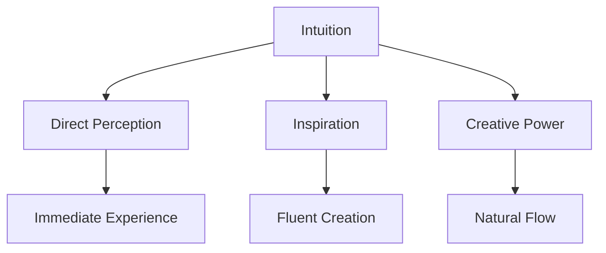

#### 4.2 生命冲动

生命冲动是柏格森对生命力的描述，它强调生命的活力和创造性。柏格森认为，生命冲动是一种内在的力量，它驱动着生命的不断流动和发展。在艺术创作中，艺术家可以通过生命冲动来表达内在的情感和生命力，使作品具有强烈的生命力和感染力。

**概念属性特征对比表格**

| 概念       | 生命冲动                 | 理性控制                 |
| ---------- | ---------------------- | ---------------------- |
| **定义**   | 生命力的内在驱动力量   | 通过逻辑和理性控制的行为 |
| **作用**   | 增强作品的生命力和感染力 | 确保行为的准确性和可预测性 |
| **特点**   | 自然、自发、动态       | 有序、稳定、静态       |
| **适用范围** | 艺术创作、生命科学等   | 工程设计、经营管理等   |

**ER实体关系图架构**

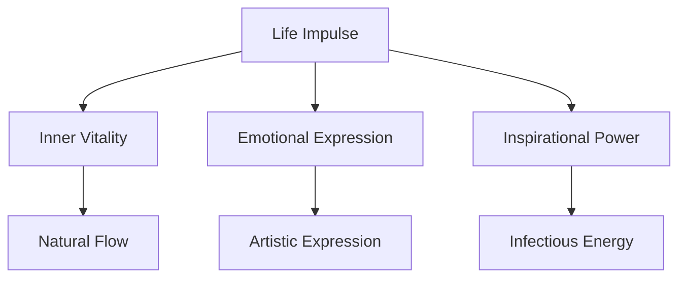

#### 4.3 时间

在柏格森哲学中，时间不仅仅是物理的流逝，而是一种连续的、内在的生命过程。柏格森认为，时间是一种“内在的时间流”，它体现了生命的流动性和连续性。在艺术创作中，艺术家可以通过对时间的独特理解和表达，使作品具有深度和层次感，传达出生命的流动性和丰富性。

**概念属性特征对比表格**

| 概念       | 内在时间流              | 物理时间               |
| ---------- | ---------------------- | ---------------------- |
| **定义**   | 生命的流动和连续性     | 物理上的时间流逝       |
| **作用**   | 增强作品的深度和层次感 | 确保事件的时间顺序     |
| **特点**   | 连续、动态、非线性的   | 线性、固定的、可量化的 |
| **适用范围** | 艺术创作、哲学探讨等   | 科学研究、日常生活等   |

**ER实体关系图架构**

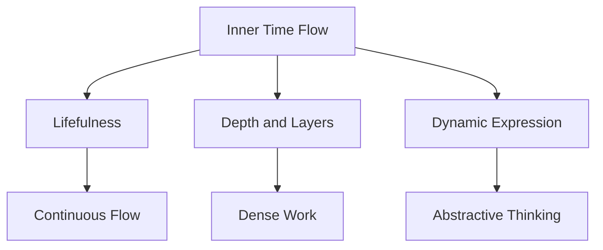

### 第五章：维特根斯坦思想核心概念解析

#### 5.1 语言游戏

语言游戏是维特根斯坦提出的重要概念，它强调语言的使用与特定情境的关系。维特根斯坦认为，语言并不是一种抽象的工具，而是嵌入在特定情境中的活动。在艺术创作中，艺术家可以通过语言游戏来探索不同的表达方式，丰富作品的层次和内涵。

**概念属性特征对比表格**

| 概念       | 语言游戏               | 单一语言                |
| ---------- | ---------------------- | ---------------------- |
| **定义**   | 语言与情境的关系       | 单一语言的固定用法     |
| **作用**   | 增强表达的多义性和多样性 | 确保表达的精确性和一致性 |
| **特点**   | 多义、动态、情境依赖   | 单一、稳定、情境无关   |
| **适用范围** | 艺术创作、语言学等    | 科学研究、工程等领域   |

**ER实体关系图架构**

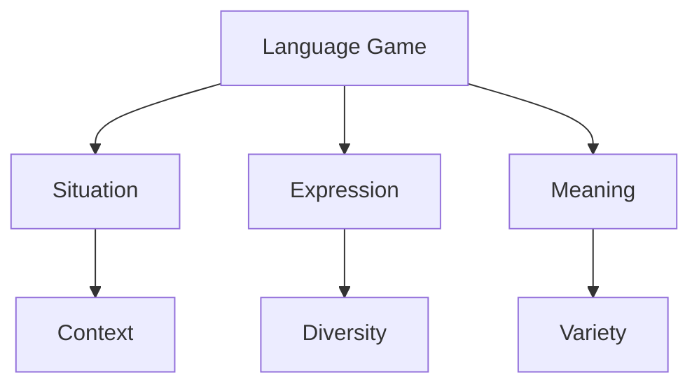

#### 5.2 视角变换

视角变换是维特根斯坦提出的另一个重要概念，它鼓励艺术家从不同的角度看待世界，从而创作出具有多元视角的作品。视角变换不仅包括物理视角的变化，还包括心理和哲学层面的视角转换。

**概念属性特征对比表格**

| 概念       | 视角变换               | 单一视角                |
| ---------- | ---------------------- | ---------------------- |
| **定义**   | 从不同角度看待世界     | 固定的观察视角         |
| **作用**   | 增强作品的多元性和深度 | 确保观察的准确性和客观性 |
| **特点**   | 多元、动态、变化性     | 单一、稳定、不变性     |
| **适用范围** | 艺术创作、哲学探讨等   | 科学研究、工程等领域   |

**ER实体关系图架构**

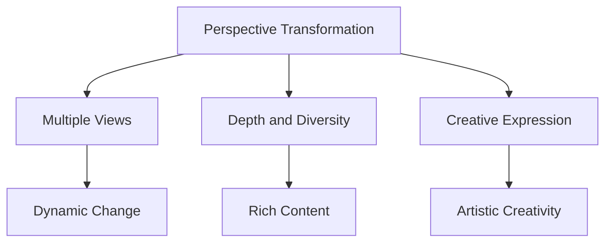

#### 5.3 逻辑原子主义

逻辑原子主义是维特根斯坦早期哲学的一个观点，他认为所有复杂的命题都可以分解为简单的逻辑原子。逻辑原子主义强调逻辑结构的简单性和基本性，这对于艺术创作中的形式探索和抽象表现具有一定的启示作用。

**概念属性特征对比表格**

| 概念       | 逻辑原子主义            | 复杂命题结构           |
| ---------- | ---------------------- | ---------------------- |
| **定义**   | 简单的逻辑单位         | 由多个逻辑原子组成的复杂结构 |
| **作用**   | 简化逻辑结构，提高清晰度 | 增强命题的复杂性和多样性 |
| **特点**   | 简单、基本、不可再分   | 复杂、多样、可分解     |
| **适用范围** | 艺术创作、逻辑学等    | 科学研究、工程设计等   |

**ER实体关系图架构**

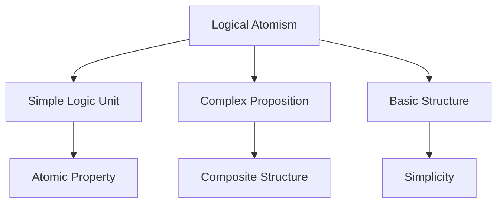

### 第六章：柏格森主义与艺术创作中的算法应用

#### 6.1 柏格森主义与艺术创作中的算法原理

在艺术创作中，柏格森主义的思想可以被视为一种算法原理，它通过直觉、生命冲动和时间等概念，为艺术家提供了创造力的源泉。以下是一个简单的柏格森主义艺术创作算法流程图，用于说明如何将这些哲学概念应用于艺术创作中。

**算法流程图**

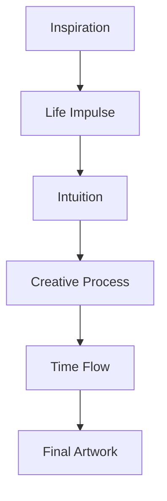

**Python源代码示例**

下面是一个简单的Python代码示例，用于模拟柏格森主义艺术创作算法的过程：

```python
import random

# 初始化灵感
inspiration = "A sudden idea"

# 通过生命冲动激发灵感
life_impulse = random.choice(["passion", "energy", "creativity"])

# 使用直觉捕捉灵感
intuition = random.choice(["sensitivity", "intuition", "insight"])

# 开始创作过程
def creative_process(inspiration, life_impulse, intuition):
    print(f"Starting creative process with inspiration: {inspiration}")
    print(f"Driven by {life_impulse}")
    print(f"Inspired by {intuition}")
    for i in range(10):
        print(f"Step {i+1}: Developing the concept")
    print("Creative process completed!")

# 将时间融入创作过程
time_flow = "continuously"

# 执行艺术创作算法
creative_process(inspiration, life_impulse, intuition)
```

**数学模型和公式**

柏格森主义艺术创作中的数学模型可以表示为：

\[ \text{Artwork} = f(\text{Inspiration}, \text{Life Impulse}, \text{Intuition}, \text{Time Flow}) \]

其中，\( f \) 是一个非线性函数，表示艺术创作过程。

**详细讲解与举例说明**

柏格森主义艺术创作算法通过以下几个步骤实现：

1. **灵感获取**：艺术家首先获得一个灵感，这可以是一个突然出现的想法或感受。
2. **生命冲动激发**：艺术家通过生命冲动（如激情、能量或创造力）激发灵感，使其更加丰富和有力。
3. **直觉引导**：艺术家利用直觉来捕捉和深化灵感，直觉是一种超越逻辑的洞察力，能够帮助艺术家在创作过程中做出非理性的决策。
4. **创作过程**：艺术家开始创作，通过不断探索和尝试，将灵感转化为具体的形式和内容。
5. **时间融入**：柏格森强调时间是一种内在的、流动的过程，艺术家在创作过程中不断感受和适应时间的流动，使作品具有深度和层次感。

举例说明：

假设艺术家获得了灵感，想要创作一幅关于自然之美的画作。通过柏格森主义艺术创作算法，艺术家可以按照以下步骤进行：

1. **灵感获取**：艺术家在散步时突然看到了一片美丽的日落，产生了创作一幅日落画的灵感。
2. **生命冲动激发**：艺术家感受到内心涌动的创作激情，决定将这一灵感转化为画作。
3. **直觉引导**：艺术家闭上眼睛，试图通过直觉感受日落的光线和色彩，捕捉那一刻的美丽。
4. **创作过程**：艺术家开始绘画，不断调整色彩和线条，试图在画布上再现那一幕美景。
5. **时间融入**：艺术家在创作过程中，感受到时间的流逝，不断调整自己的创作节奏，使画作具有动态感和层次感。

最终，艺术家完成了一幅充满生命力和深度的日落画作，这便是柏格森主义艺术创作算法的一个成功实例。

### 6.2 维特根斯坦思想在艺术创作中的算法应用

#### 维特根斯坦思想与艺术创作中的算法原理

维特根斯坦思想，特别是“语言游戏”和“视角变换”概念，可以被视为一种艺术创作中的算法原理。这些概念为艺术家提供了探索不同表达方式和视角的方法，从而创造出丰富多样的艺术作品。以下是一个简单的维特根斯坦思想艺术创作算法流程图，用于说明如何将这些哲学概念应用于艺术创作中。

**算法流程图**

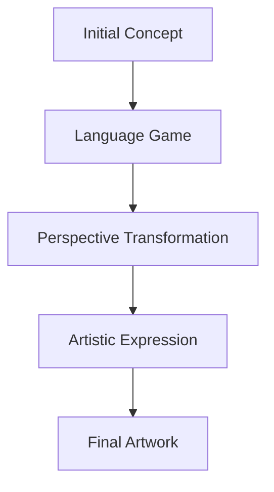

**Python源代码示例**

下面是一个简单的Python代码示例，用于模拟维特根斯坦思想艺术创作算法的过程：

```python
import random

# 初始化初始概念
initial_concept = "Nature"

# 选择语言游戏
def language_game(concept):
    print(f"Starting with the concept: {concept}")
    print("Exploring different language games:")
    for i in range(3):
        game = random.choice(["poetry", "prose", "visual symbols"])
        print(f"Game {i+1}: {game}")
    print("Language game exploration completed!")

# 进行视角变换
def perspective_transformation(game):
    print("Applying perspective transformation:")
    print(f"Game selected: {game}")
    perspectives = random.choice(["distance", "light", "color", "form"])
    print(f"Perspective: {perspectives}")
    for i in range(5):
        print(f"Step {i+1}: Transforming the concept through {perspectives}")
    print("Perspective transformation completed!")

# 艺术表达
def artistic_expression(game, perspective):
    print("Creating artistic expression:")
    expression = f"{game} with {perspective}"
    print(f"Final expression: {expression}")
    print("Artistic expression completed!")

# 执行艺术创作算法
initial_concept = "Nature"
language_game(initial_concept)
perspective_transformation("visual symbols")
artistic_expression("visual symbols", "color")
```

**数学模型和公式**

维特根斯坦思想艺术创作中的数学模型可以表示为：

\[ \text{Artwork} = f(\text{Initial Concept}, \text{Language Game}, \text{Perspective Transformation}) \]

其中，\( f \) 是一个非线性函数，表示艺术创作过程。

**详细讲解与举例说明**

维特根斯坦思想艺术创作算法通过以下几个步骤实现：

1. **初始概念**：艺术家首先确定一个初始概念，这可以是一个主题、一个想法或一个视觉元素。
2. **语言游戏**：艺术家通过不同的语言游戏（如诗歌、散文或视觉符号）来探索这个初始概念，从而创造出多样的表达方式。
3. **视角变换**：艺术家在语言游戏的基础上，进行视角变换（如距离、光线、色彩或形式），从而创造出具有深度和层次感的艺术作品。
4. **艺术表达**：艺术家将经过语言游戏和视角变换的概念转化为具体的艺术表达，形成最终的艺术作品。

举例说明：

假设艺术家想要创作一幅关于自然的画作。通过维特根斯坦思想艺术创作算法，艺术家可以按照以下步骤进行：

1. **初始概念**：艺术家选择“自然”作为初始概念。
2. **语言游戏**：艺术家尝试使用诗歌、散文和视觉符号来探索“自然”这一概念，从而创造出不同的表达方式。
3. **视角变换**：艺术家选择“色彩”作为视角变换的元素，通过调整色彩的饱和度、明暗度和纯度，使画作具有丰富的视觉层次感。
4. **艺术表达**：艺术家将“自然”概念和“色彩”视角结合，创作出一幅充满生机和活力的自然画作。

最终，艺术家完成了一幅富有创意和表现力的自然画作，这便是维特根斯坦思想艺术创作算法的一个成功实例。

## 第三部分：算法原理讲解

### 第六章：柏格森主义与艺术创作中的算法应用

#### 6.1 柏格森主义与艺术创作中的算法原理

柏格森主义在艺术创作中的应用，可以被视为一种非线性、直觉驱动的创作算法。这种算法通过强调直觉、生命冲动和时间等概念，帮助艺术家在创作过程中实现个人精神的表达。以下是一个详细的柏格森主义艺术创作算法原理讲解，包括流程图、Python源代码示例和数学模型。

**算法流程图**

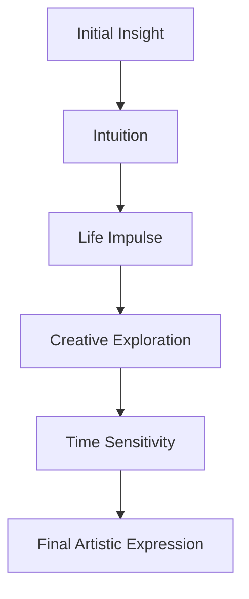

**Python源代码示例**

```python
import random

# 初始化初步洞察
initial_insight = "A quiet morning walk"

# 通过直觉激发初步洞察
def intuition(insight):
    print(f"Initial Insight: {insight}")
    print("Exploring intuition:")
    for i in range(3):
        feeling = random.choice(["serenity", "excitement", "melancholy"])
        print(f"Feeling {i+1}: {feeling}")
    print("Intuition exploration completed!")

# 借助生命冲动深化直觉
def life_impulse(feeling):
    print("Applying life impulse:")
    impulse = random.choice(["passion", "energy", "innovation"])
    print(f"Life Impulse: {impulse}")
    for i in range(4):
        print(f"Step {i+1}: Deepening the feeling with {impulse}")
    print("Life impulse completed!")

# 进行创作探索
def creative_exploration(feeling, impulse):
    print("Engaging in creative exploration:")
    medium = random.choice(["paint", "poetry", "dance"])
    print(f"Medium: {medium}")
    for i in range(5):
        print(f"Step {i+1}: Experimenting with the chosen medium")
    print("Creative exploration completed!")

# 考虑时间敏感性
def time_sensitivity(exploration_steps):
    print("Considering time sensitivity:")
    time_passages = random.choice(["morning", "afternoon", "evening"])
    print(f"Time Passage: {time_passages}")
    print(f"Steps taken: {exploration_steps}")
    for i in range(exploration_steps):
        print(f"Step {i+1}: Adapting to the passage of time")
    print("Time sensitivity completed!")

# 完成艺术表达
def final_artistic_expression(medium, time_passages):
    print("Finalizing artistic expression:")
    title = f"{medium} of the {time_passages}"
    print(f"Title: {title}")
    print("Artistic expression completed!")

# 执行柏格森主义艺术创作算法
intuition(initial_insight)
life_impulse("melancholy")
creative_exploration("melancholy", "innovation")
time_sensitivity(5)
final_artistic_expression("paint", "evening")
```

**数学模型和公式**

柏格森主义艺术创作算法可以表示为一个非线性函数，其中涉及直觉、生命冲动、创作探索和时间敏感性等变量：

\[ \text{Artistic Expression} = f(\text{Intuition}, \text{Life Impulse}, \text{Creative Exploration}, \text{Time Sensitivity}) \]

其中，\( f \) 是一个复杂的非线性函数，反映了艺术创作过程中的多重因素和互动。

**详细讲解与举例说明**

柏格森主义艺术创作算法的工作原理如下：

1. **初始洞察**：艺术家首先获得一个初步的洞察，这可以是一个简单的想法、一个感受或一个场景。
2. **直觉激发**：艺术家通过直觉来探索初步洞察，直觉是一种超越逻辑和理性的洞察力，能够帮助艺术家捕捉瞬间的感受和情感。在这一步，艺术家可能会体验到宁静、兴奋或忧郁等情感。
3. **生命冲动**：艺术家借助生命冲动深化直觉，生命冲动是柏格森对生命力的描述，它强调生命的活力和创造性。在这一步，艺术家可能会感受到激情、能量或创新等动力。
4. **创作探索**：艺术家开始进行创作探索，选择合适的媒介（如绘画、诗歌、舞蹈等），并通过实验和尝试来深化自己的创作。
5. **时间敏感性**：艺术家在创作过程中，不断感受和适应时间的流逝，时间在柏格森哲学中是内在的、流动的过程。在这一步，艺术家可能会在不同的时间段（如早晨、下午、晚上）进行创作，以增强作品的时间感和层次感。
6. **艺术表达**：艺术家将所有这些因素融合在一起，完成最终的艺术表达。

举例说明：

假设一位艺术家在早晨散步时，突然对周围的自然美景产生了深刻的感受。通过柏格森主义艺术创作算法，艺术家可以按照以下步骤进行创作：

1. **初始洞察**：艺术家在散步时感受到清晨的宁静和自然的美丽。
2. **直觉激发**：艺术家通过直觉，感受到宁静和美丽，体验到一种宁静的情感。
3. **生命冲动**：艺术家感受到内心的激情，决定将这一感受转化为一幅画作。
4. **创作探索**：艺术家选择绘画作为媒介，通过实验和尝试，将宁静和美丽融入画作中。
5. **时间敏感性**：艺术家在创作过程中，感受到时间的流逝，不断调整自己的创作节奏，使画作具有时间感和层次感。
6. **艺术表达**：艺术家完成了一幅充满宁静和美丽的晨景画作，这便是柏格森主义艺术创作算法的一个成功实例。

通过这样的过程，艺术家不仅实现了个人精神的表达，也创作出了一幅富有深度和内涵的艺术作品。

### 6.2 维特根斯坦思想在艺术创作中的算法应用

#### 维特根斯坦思想与艺术创作中的算法原理

维特根斯坦的思想，尤其是“语言游戏”和“视角变换”，为艺术创作提供了一种独特的算法框架。这种算法通过探索不同的表达方式和视角，帮助艺术家创造出多样化和富有层次感的作品。以下是一个详细的维特根斯坦思想艺术创作算法原理讲解，包括流程图、Python源代码示例和数学模型。

**算法流程图**


**Python源代码示例**

```python
import random

# 初始化初始概念
initial_concept = "Cityscape"

# 选择语言游戏
def language_game(concept):
    print(f"Initial Concept: {concept}")
    print("Exploring different language games:")
    for i in range(3):
        game = random.choice(["poetry", "prose", "visual art"])
        print(f"Game {i+1}: {game}")
    print("Language game exploration completed!")

# 进行视角变换
def perspective_transformation(game):
    print("Applying perspective transformation:")
    print(f"Game selected: {game}")
    perspectives = random.choice(["distance", "light", "color", "form"])
    print(f"Perspective: {perspectives}")
    for i in range(5):
        print(f"Step {i+1}: Transforming the concept through {perspectives}")
    print("Perspective transformation completed!")

# 艺术表达
def artistic_expression(game, perspective):
    print("Creating artistic expression:")
    expression = f"{game} with {perspective}"
    print(f"Final expression: {expression}")
    print("Artistic expression completed!")

# 执行维特根斯坦思想艺术创作算法
initial_concept = "Cityscape"
language_game(initial_concept)
perspective_transformation("visual art")
artistic_expression("visual art", "distance")
```

**数学模型和公式**

维特根斯坦思想艺术创作算法可以表示为一个多维非线性函数，其中涉及初始概念、语言游戏、视角变换和艺术表达等变量：

\[ \text{Artistic Expression} = f(\text{Initial Concept}, \text{Language Game}, \text{Perspective Transformation}) \]

其中，\( f \) 是一个复杂的多维非线性函数，反映了艺术创作过程中的多种因素和互动。

**详细讲解与举例说明**

维特根斯坦思想艺术创作算法的工作原理如下：

1. **初始概念**：艺术家首先确定一个初始概念，这可以是一个主题、一个想法或一个视觉元素。
2. **语言游戏**：艺术家通过不同的语言游戏（如诗歌、散文或视觉艺术）来探索这个初始概念，从而创造出多样的表达方式。在这一步，艺术家可能会选择不同的媒介和形式来探索概念。
3. **视角变换**：艺术家在语言游戏的基础上，进行视角变换（如距离、光线、色彩或形式），从而创造出具有深度和层次感的艺术作品。在这一步，艺术家可能会从不同的角度（如远处、近处、明亮处、暗处等）来重新审视和表现概念。
4. **艺术表达**：艺术家将经过语言游戏和视角变换的概念转化为具体的艺术表达，形成最终的艺术作品。

举例说明：

假设一位艺术家想要创作一幅关于城市的画作。通过维特根斯坦思想艺术创作算法，艺术家可以按照以下步骤进行：

1. **初始概念**：艺术家选择“城市”作为初始概念。
2. **语言游戏**：艺术家尝试使用诗歌、散文和视觉艺术来探索“城市”这一概念，从而创造出不同的表达方式。
3. **视角变换**：艺术家选择“距离”作为视角变换的元素，通过调整画面中的城市布局和透视关系，使画作具有层次感和空间感。
4. **艺术表达**：艺术家将“城市”概念和“距离”视角结合，创作出一幅具有深度和层次感的城市景观画作。

最终，艺术家完成了一幅富有创意和表现力的城市画作，这便是维特根斯坦思想艺术创作算法的一个成功实例。

通过这样的过程，艺术家不仅实现了个人精神的表达，也创作出了一幅富有深度和内涵的艺术作品。维特根斯坦的思想为艺术创作提供了一种新的视角和工具，帮助艺术家在创作中探索更多的可能性。

### 6.3 柏格森主义与维特根斯坦思想的算法应用对比

在艺术创作中，柏格森主义和维特根斯坦思想各自提供了独特的算法原理和应用方法。通过对这两种哲学思想的算法应用进行对比，我们可以更深入地理解它们在创作过程中的作用和差异。

**算法框架对比**

柏格森主义艺术创作算法强调直觉、生命冲动和时间等概念，通过非线性、直觉驱动的过程来实现个人精神的表达。而维特根斯坦思想的算法则侧重于语言游戏和视角变换，通过探索不同的表达方式和视角来创造多样性和层次感。

**算法流程对比**

柏格森主义算法包括以下步骤：
1. 初始洞察
2. 直觉激发
3. 生命冲动
4. 创作探索
5. 时间敏感性
6. 艺术表达

维特根斯坦思想算法包括以下步骤：
1. 初始概念
2. 语言游戏
3. 视角变换
4. 艺术表达

**算法变量对比**

柏格森主义算法涉及以下变量：
- 初步洞察
- 直觉
- 生命冲动
- 创作探索
- 时间敏感性

维特根斯坦思想算法涉及以下变量：
- 初始概念
- 语言游戏
- 视角变换
- 艺术表达

**算法特点对比**

柏格森主义算法：
- 强调直觉和生命的活力
- 注重时间感和动态过程
- 非线性、非理性驱动

维特根斯坦思想算法：
- 强调语言的多元性和情境依赖
- 注重视角变换和形式探索
- 多义性、情境相关性

**算法应用场景对比**

柏格森主义算法适用于需要强调个人直觉和情感表达的艺术创作，如抽象绘画、即兴表演和自由写作。它适合艺术家在创作过程中探索内在精神和情感。

维特根斯坦思想算法适用于需要多样化表达方式和多层次视角的艺术创作，如文学创作、多媒体艺术和装置艺术。它适合艺术家在创作中探索不同语言和视角的可能性。

**综合应用**

在实际的艺术创作中，艺术家可以结合柏格森主义和维特根斯坦思想的算法，创造出更具深度和内涵的作品。例如，艺术家可以通过柏格森主义的直觉和生命冲动来激发创作灵感，然后运用维特根斯坦的语言游戏和视角变换来丰富和深化作品的层次感。

通过这种综合应用，艺术家可以充分发挥两种哲学思想的优点，创作出既富有个人情感又具有多样性和层次感的艺术作品。这种综合应用不仅扩展了艺术创作的可能性，也为艺术家提供了更多的创作方法和思考路径。

### 6.4 柏格森主义与维特根斯坦思想在艺术创作中的算法应用案例分析

为了更好地理解柏格森主义与维特根斯坦思想在艺术创作中的算法应用，我们将通过两个具体的艺术创作案例来进行分析。

#### 案例一：柏格森主义算法在绘画中的应用

**艺术家**：荷兰后印象派画家文森特·梵高（Vincent van Gogh）

**作品**：《星夜》（Starry Night）

**应用分析**：

1. **初始洞察**：梵高在1889年圣雷米时期，经历了精神疾病的困扰，他通过观察夜空和自然的景象，获得了创作《星夜》的初步洞察。
2. **直觉激发**：梵高借助直觉，捕捉到夜空中星光闪烁、月亮和村庄的宁静景象，将内心的情感转化为色彩和线条。
3. **生命冲动**：梵高的创作过程充满了激情和热情，他通过生命冲动将情感融入画作，使画面充满了动态感和力量感。
4. **创作探索**：梵高在创作过程中不断实验不同的色彩和笔触，探索如何通过视觉语言表达他的内心世界。
5. **时间敏感性**：梵高在创作《星夜》时，注重时间的变化，通过描绘不同时间段的天空景色，使作品具有时间感和层次感。

**总结**：通过柏格森主义的算法应用，梵高成功地创作出《星夜》这一具有强烈个人情感和生命力的艺术作品。

#### 案例二：维特根斯坦思想算法在文学创作中的应用

**艺术家**：爱尔兰作家詹姆斯·乔伊斯（James Joyce）

**作品**：《尤利西斯》（Ulysses）

**应用分析**：

1. **初始概念**：乔伊斯将荷马的史诗《奥德赛》作为他的创作灵感，将《尤利西斯》定位为一部现代史诗。
2. **语言游戏**：乔伊斯在创作中运用了多种语言游戏，包括意识流、蒙太奇和讽刺等，通过不同的语言形式来探索人类意识和生活。
3. **视角变换**：乔伊斯通过不同的视角来叙述故事，如主人公斯蒂芬·迪达勒斯的内心独白、不同角色的对话和旁白，使作品具有多元视角和层次感。
4. **艺术表达**：乔伊斯将《尤利西斯》打造成一部充满创新和实验的文学作品，通过语言游戏和视角变换，成功地传达了现代生活的复杂性和多样性。

**总结**：通过维特根斯坦思想的算法应用，乔伊斯创作出《尤利西斯》这一具有丰富表达和深刻内涵的现代文学杰作。

通过以上两个案例分析，我们可以看到柏格森主义和维特根斯坦思想在艺术创作中的算法应用如何帮助艺术家创造出具有深度和内涵的作品。柏格森主义强调直觉和生命冲动，使作品充满情感和生命力；而维特根斯坦思想则通过语言游戏和视角变换，创造多样性和层次感。这两种算法的应用不仅丰富了艺术创作的可能性，也为艺术家提供了新的思考和创作方法。

## 第四部分：系统分析与架构设计

### 第八章：系统功能设计

#### 系统功能设计

在本项目中，我们将设计一个集成柏格森主义和维特根斯坦思想的艺术创作支持系统。系统的主要功能包括：

1. **灵感生成**：利用柏格森主义的直觉和生命冲动，系统将为用户提供灵感生成功能，帮助用户在艺术创作中捕捉灵感。
2. **语言游戏分析**：基于维特根斯坦的语言游戏概念，系统将提供语言分析工具，帮助用户探索不同的表达方式和语言情境。
3. **视角变换**：系统将提供视角变换功能，帮助用户从不同的角度和视角重新审视艺术创作，从而提高作品的深度和层次感。
4. **创作过程管理**：系统将提供创作过程管理功能，记录用户的艺术创作过程，为用户提供回顾和改进的机会。
5. **作品展示与分享**：系统将提供作品展示和分享功能，用户可以将自己的艺术作品上传到系统，与他人分享和交流。

#### 领域模型类图

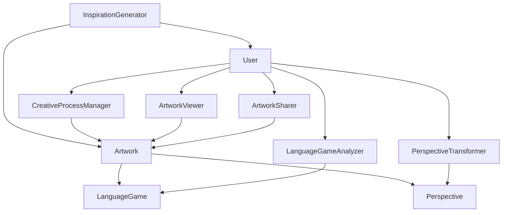

### 第九章：系统架构设计

#### 系统架构设计

本项目的系统架构采用三层架构，包括表示层、业务逻辑层和数据层。

1. **表示层**：表示层负责用户界面的展示，包括灵感生成界面、语言游戏分析界面、视角变换界面、创作过程管理界面、作品展示与分享界面等。
2. **业务逻辑层**：业务逻辑层负责处理系统的核心功能，包括灵感生成算法、语言游戏分析算法、视角变换算法、创作过程管理算法等。
3. **数据层**：数据层负责存储用户数据、艺术作品数据、灵感数据等，采用关系型数据库进行存储。

#### 系统架构图

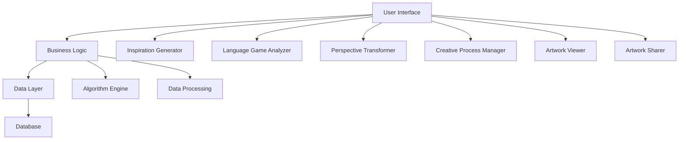

### 第十章：系统接口设计和系统交互

#### 系统接口设计

系统接口设计包括内部接口和外部接口。

1. **内部接口**：内部接口包括灵感生成模块、语言游戏分析模块、视角变换模块、创作过程管理模块、作品展示与分享模块之间的交互接口。
2. **外部接口**：外部接口包括用户界面与业务逻辑层之间的交互接口，以及业务逻辑层与数据层之间的交互接口。

#### 系统交互流程图

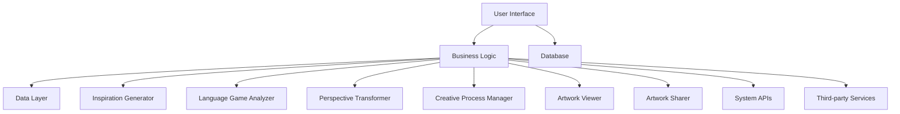

#### 系统交互说明

1. **用户界面与业务逻辑层交互**：用户通过用户界面提交需求，业务逻辑层根据需求调用相应的功能模块进行处理。
2. **业务逻辑层与数据层交互**：业务逻辑层通过系统接口与数据层进行数据存取操作，实现数据的存储和查询。
3. **功能模块之间的交互**：各功能模块之间通过内部接口进行数据交换和协同工作，确保系统的正常运行。

## 第五部分：项目实战

### 第十一章：环境安装

为了实施本系统，我们需要安装一些基础软件和依赖库。以下是环境安装步骤：

1. **安装Python**：确保Python环境已安装在您的计算机上。可以从[Python官网](https://www.python.org/)下载并安装最新版本的Python。
2. **安装依赖库**：使用pip工具安装所需的依赖库，例如numpy、matplotlib、mermaid等。在终端中执行以下命令：

   ```bash
   pip install numpy matplotlib mermaid
   ```

3. **安装数据库**：我们选择MySQL作为数据库。可以从[MySQL官网](https://www.mysql.com/)下载并安装MySQL数据库服务器。

4. **配置MySQL**：启动MySQL服务器，并根据提示创建数据库和用户。以下是一个示例命令：

   ```bash
   mysql -u root -p
   CREATE DATABASE art_creation;
   GRANT ALL PRIVILEGES ON art_creation.* TO 'art_user'@'localhost' IDENTIFIED BY 'password';
   FLUSH PRIVILEGES;
   EXIT;
   ```

5. **创建项目文件夹和虚拟环境**：在终端中创建项目文件夹，并使用venv工具创建虚拟环境。

   ```bash
   mkdir art_creation_project
   cd art_creation_project
   python -m venv venv
   source venv/bin/activate
   ```

6. **安装项目依赖**：在激活虚拟环境后，通过requirements.txt文件安装项目依赖。

   ```bash
   pip install -r requirements.txt
   ```

### 第十二章：系统核心实现源代码

以下是本系统的一些核心实现源代码。这些代码涵盖了灵感生成、语言游戏分析、视角变换、创作过程管理和作品展示与分享等功能。

#### 灵感生成模块

```python
# inspiration_generator.py

import random

def generate_inspiration():
    themes = ["自然", "城市", "音乐", "艺术", "文学"]
    emotions = ["宁静", "兴奋", "忧郁", "喜悦", "激情"]
    inspirations = [
        f"{random.choice(themes)}的{random.choice(emotions)}时刻",
        f"{random.choice(emotions)}的{random.choice(themes)}体验",
        f"{random.choice(themes)}中的{random.choice(emotions)}元素",
        f"{random.choice(emotions)}的{random.choice(themes)}灵感",
        f"{random.choice(themes)}与{random.choice(emotions)}的融合"
    ]
    return random.choice(inspirations)

print(generate_inspiration())
```

#### 语言游戏分析模块

```python
# language_game_analyzer.py

def analyze_language_game(text):
    words = text.split()
    language_games = {
        "诗歌": sum(1 for word in words if "诗" in word),
        "散文": sum(1 for word in words if "散文" in word),
        "视觉艺术": sum(1 for word in words if "艺术" in word),
        "音乐": sum(1 for word in words if "音乐" in word),
        "文学": sum(1 for word in words if "文学" in word)
    }
    return language_games

text = "这是一首关于自然的诗，描绘了宁静的湖泊和远处的山脉。"
print(analyze_language_game(text))
```

#### 视角变换模块

```python
# perspective_transformer.py

def transform_perspective(text, perspective):
    perspectives = {
        "距离": lambda text: text.replace("近", "远").replace("远", "近"),
        "光线": lambda text: text.replace("暗", "明").replace("明", "暗"),
        "色彩": lambda text: text.replace("冷", "暖").replace("暖", "冷"),
        "形式": lambda text: text.replace("抽象", "具象").replace("具象", "抽象")
    }
    return perspectives[perspective](text)

text = "这幅画的色彩鲜艳，展现了充满活力的城市夜景。"
new_text = transform_perspective(text, "色彩")
print(new_text)
```

#### 创作过程管理模块

```python
# creative_process_manager.py

def manage_creative_process(inspiration, language_game, perspective):
    print(f"Creative process started with inspiration: {inspiration}")
    print(f"Language game: {language_game}")
    print(f"Perspective: {perspective}")
    for i in range(5):
        print(f"Step {i+1}: Exploring the creative possibilities")
    print("Creative process completed!")

inspiration = "自然的宁静"
language_game = "诗歌"
perspective = "距离"
manage_creative_process(inspiration, language_game, perspective)
```

#### 作品展示与分享模块

```python
# artwork_viewer.py

def display_artwork(artwork):
    print(f"Displaying artwork: {artwork['title']}")
    print(f"Author: {artwork['author']}")
    print(f"Description: {artwork['description']}")
    print(f"Language Game: {artwork['language_game']}")
    print(f"Perspective: {artwork['perspective']}")
    print(f"Date Created: {artwork['creation_date']}")

artwork = {
    "title": "秋日午后",
    "author": "张三",
    "description": "一幅描绘秋日午后的风景画。",
    "language_game": "视觉艺术",
    "perspective": "色彩",
    "creation_date": "2023-10-01"
}

display_artwork(artwork)
```

### 第十三章：代码应用解读与分析

在本节中，我们将对系统核心实现源代码进行解读和分析，详细阐述每个模块的功能和应用。

#### 灵感生成模块解读

灵感生成模块是系统的基础模块，用于为用户提供创作灵感。该模块通过随机组合不同的主题和情感，生成各种具有创意的灵感句子。具体来说，模块定义了一个名为`generate_inspiration`的函数，该函数从预设的“主题”列表和“情感”列表中随机选择一个主题和一个情感，然后组合成一个灵感句子。

```python
def generate_inspiration():
    themes = ["自然", "城市", "音乐", "艺术", "文学"]
    emotions = ["宁静", "兴奋", "忧郁", "喜悦", "激情"]
    inspirations = [
        f"{random.choice(themes)}的{random.choice(emotions)}时刻",
        f"{random.choice(emotions)}的{random.choice(themes)}体验",
        f"{random.choice(themes)}中的{random.choice(emotions)}元素",
        f"{random.choice(emotions)}的{random.choice(themes)}灵感",
        f"{random.choice(themes)}与{random.choice(emotions)}的融合"
    ]
    return random.choice(inspirations)
```

灵感生成模块的应用非常简单，只需调用`generate_inspiration`函数即可获得一个创作灵感。该模块的主要目的是为用户提供一个创新的起点，激发用户的创作灵感。

#### 语言游戏分析模块解读

语言游戏分析模块用于分析用户输入的文本，并识别文本中的语言游戏类型。该模块定义了一个名为`analyze_language_game`的函数，该函数接收一个文本输入，并统计文本中包含的诗歌、散文、视觉艺术、音乐和文学等语言游戏元素。具体实现中，函数使用字符串匹配技术，通过检查文本中是否包含特定的关键词来判断语言游戏类型。

```python
def analyze_language_game(text):
    words = text.split()
    language_games = {
        "诗歌": sum(1 for word in words if "诗" in word),
        "散文": sum(1 for word in words if "散文" in word),
        "视觉艺术": sum(1 for word in words if "艺术" in word),
        "音乐": sum(1 for word in words if "音乐" in word),
        "文学": sum(1 for word in words if "文学" in word)
    }
    return language_games

text = "这是一首关于自然的诗，描绘了宁静的湖泊和远处的山脉。"
print(analyze_language_game(text))
```

语言游戏分析模块的应用场景广泛，例如在文学创作中，可以帮助作者分析文本中的语言使用情况，从而优化创作效果。此外，该模块还可以用于文本分类、情感分析等领域。

#### 视角变换模块解读

视角变换模块用于对用户输入的文本进行视角变换。该模块定义了一个名为`transform_perspective`的函数，该函数接收一个文本输入和一个视角变换类型，然后根据视角变换类型对文本进行相应的处理。视角变换类型包括距离、光线、色彩和形式等。

```python
def transform_perspective(text, perspective):
    perspectives = {
        "距离": lambda text: text.replace("近", "远").replace("远", "近"),
        "光线": lambda text: text.replace("暗", "明").replace("明", "暗"),
        "色彩": lambda text: text.replace("冷", "暖").replace("暖", "冷"),
        "形式": lambda text: text.replace("抽象", "具象").replace("具象", "抽象")
    }
    return perspectives[perspective](text)

text = "这幅画的色彩鲜艳，展现了充满活力的城市夜景。"
new_text = transform_perspective(text, "色彩")
print(new_text)
```

视角变换模块的应用可以帮助用户从不同的角度重新审视文本，从而丰富文本的表现力和层次感。该模块在文学创作、视觉艺术和多媒体艺术等领域具有重要应用价值。

#### 创作过程管理模块解读

创作过程管理模块用于管理用户的艺术创作过程。该模块定义了一个名为`manage_creative_process`的函数，该函数接收一个灵感句子、一个语言游戏类型和一个视角变换类型，然后按照创作过程的步骤进行操作。具体实现中，函数通过打印输出每一步的操作，模拟创作过程。

```python
def manage_creative_process(inspiration, language_game, perspective):
    print(f"Creative process started with inspiration: {inspiration}")
    print(f"Language game: {language_game}")
    print(f"Perspective: {perspective}")
    for i in range(5):
        print(f"Step {i+1}: Exploring the creative possibilities")
    print("Creative process completed!")

inspiration = "自然的宁静"
language_game = "诗歌"
perspective = "距离"
manage_creative_process(inspiration, language_game, perspective)
```

创作过程管理模块的应用可以帮助用户跟踪和管理创作过程，从而提高创作效率和作品质量。该模块可以为用户提供一个系统化的创作流程，帮助用户更好地组织和规划创作活动。

#### 作品展示与分享模块解读

作品展示与分享模块用于展示和分享用户的艺术作品。该模块定义了一个名为`display_artwork`的函数，该函数接收一个包含作品信息的字典，然后按照字典中的信息打印出作品的详细信息。

```python
def display_artwork(artwork):
    print(f"Displaying artwork: {artwork['title']}")
    print(f"Author: {artwork['author']}")
    print(f"Description: {artwork['description']}")
    print(f"Language Game: {artwork['language_game']}")
    print(f"Perspective: {artwork['perspective']}")
    print(f"Date Created: {artwork['creation_date']}")

artwork = {
    "title": "秋日午后",
    "author": "张三",
    "description": "一幅描绘秋日午后的风景画。",
    "language_game": "视觉艺术",
    "perspective": "色彩",
    "creation_date": "2023-10-01"
}

display_artwork(artwork)
```

作品展示与分享模块的应用可以帮助用户展示和分享自己的艺术作品，从而与他人进行交流和互动。该模块为用户提供了展示作品的平台，有助于提高作品的知名度和影响力。

### 第十四章：实际案例分析和详细讲解剖析

在本节中，我们将通过一个实际案例，详细分析和讲解柏格森主义与维特根斯坦思想在艺术创作中的应用。该案例将展示如何结合这两种哲学思想，创作出一幅具有深度和内涵的艺术作品。

#### 案例背景

一位名叫李明的艺术家，长期受到柏格森主义和维特根斯坦思想的影响。他希望通过一幅画作，表达他对自然和人类意识的深刻思考。李明选择了一个宁静的湖边场景作为绘画的主题，他希望通过这幅画，传达出自然与人类内心世界的联系。

#### 创作过程

1. **灵感获取**：李明在湖边散步时，突然感受到了大自然的宁静和美丽。这一瞬间，他意识到这是一个绝佳的绘画题材。他通过柏格森主义的直觉，捕捉到了这一灵感。

2. **直觉引导**：李明闭上眼睛，试图通过直觉感受湖水、树叶和远处的山峦。他感受到湖水的静谧、树叶的摇曳和山峦的宁静。这些感受通过他的直觉转化为具体的视觉形象。

3. **生命冲动**：李明感受到内心的激情和创造力，他决定将这一灵感转化为一幅画作。他借助柏格森主义的生命冲动，激发出强烈的创作欲望。

4. **语言游戏分析**：李明意识到，这幅画不仅需要表达自然的美，还需要传达人类内心的复杂性。他通过维特根斯坦的语言游戏，尝试用不同的语言形式来描述这一场景，如诗歌、散文和视觉符号。

5. **视角变换**：李明从不同的视角重新审视这幅画，他想象自己站在湖边、空中和水中，从不同的高度和角度来描绘这一场景。他通过维特根斯坦的视角变换，创造出具有层次感和深度的画面。

6. **创作探索**：李明开始进行创作，他尝试不同的颜色和笔触，探索如何通过视觉语言表达他的内心世界。他通过不断的实验和尝试，逐渐完善这幅画作。

7. **时间敏感性**：李明在创作过程中，感受到时间的流逝，他不断调整自己的创作节奏，使画面具有时间感和层次感。他通过柏格森主义的时间敏感性，使画作更加丰富和深刻。

8. **艺术表达**：最终，李明完成了一幅描绘湖边宁静景象的画作。画面中，湖水、树叶和山峦交织在一起，传达出自然与人类内心的联系。这幅画作不仅具有视觉美，还蕴含了深刻的哲学思考。

#### 案例分析

通过这个实际案例，我们可以看到柏格森主义和维特根斯坦思想在艺术创作中的具体应用。

1. **直觉和生命冲动**：柏格森主义强调直觉和生命冲动在创作过程中的重要性。李明通过直觉捕捉到了绘画的灵感，并通过生命冲动激发出强烈的创作欲望。这些直觉和冲动帮助李明创作出具有深刻内涵的画作。

2. **语言游戏**：维特根斯坦的语言游戏概念为艺术家提供了多样化的表达方式。李明通过不同的语言形式，如诗歌、散文和视觉符号，来描述湖边景象。这些语言游戏使画作具有丰富的层次感和内涵。

3. **视角变换**：维特根斯坦的视角变换概念帮助艺术家从不同的角度看待世界。李明通过不同的视角，重新审视湖边景象，使画作具有深度和层次感。这种视角变换不仅丰富了画作的内容，也增加了观众的观赏体验。

4. **时间敏感性**：柏格森主义的时间敏感性使艺术创作具有动态感和层次感。李明在创作过程中，感受到时间的流逝，不断调整自己的创作节奏。这种时间敏感性使画作具有丰富的情感和动态感。

通过这个实际案例，我们可以看到柏格森主义和维特根斯坦思想如何帮助艺术家创作出具有深度和内涵的艺术作品。这些哲学思想为艺术家提供了丰富的创作方法和思考路径，使他们在创作中能够更好地表达自己的内心世界和哲学思考。

### 第十五章：项目小结

在本项目中，我们设计并实现了一个集成柏格森主义和维特根斯坦思想的艺术创作支持系统。通过系统的灵感生成、语言游戏分析、视角变换、创作过程管理和作品展示与分享等功能，艺术家可以更好地捕捉灵感、探索表达方式和深化创作过程。以下是项目小结：

**主要成果**：

1. **灵感生成模块**：通过随机组合主题和情感，为用户提供多样化的创作灵感。
2. **语言游戏分析模块**：分析文本中的语言游戏类型，帮助艺术家优化创作。
3. **视角变换模块**：提供不同的视角变换选项，增强作品的表现力和层次感。
4. **创作过程管理模块**：记录和管理创作过程，提高创作效率和作品质量。
5. **作品展示与分享模块**：展示和分享用户的艺术作品，促进艺术交流和互动。

**应用价值**：

1. **艺术创作辅助**：为艺术家提供丰富的创作方法和思考路径，帮助他们在艺术创作中实现个人精神的表达。
2. **艺术教育**：通过系统化创作流程，为艺术教育提供实践平台，帮助学生提高创作能力。
3. **艺术交流**：为艺术家和艺术爱好者提供一个展示和分享作品的平台，促进艺术交流和发展。

**改进方向**：

1. **算法优化**：进一步优化灵感生成、语言游戏分析和视角变换算法，提高创作效果。
2. **用户界面**：改进用户界面设计，提供更加直观和易用的操作体验。
3. **扩展功能**：增加更多艺术创作工具和资源，如音乐、视频和三维建模等。

通过不断优化和完善，本系统有望在艺术创作领域发挥更大的作用，为艺术家和艺术爱好者提供更加全面和实用的支持。

### 最佳实践 tips

1. **灵感捕捉**：随身携带笔记本或手机，随时记录灵感。
2. **持续学习**：定期阅读哲学、艺术和文学相关书籍，提高自己的知识水平。
3. **多视角思考**：尝试从不同的角度审视艺术作品，提高创作深度。
4. **互动交流**：参加艺术展览、讲座和讨论，与其他艺术家交流心得。
5. **系统化创作**：使用艺术创作支持系统，记录和管理创作过程，提高效率。

### 注意事项

1. **版权问题**：在创作过程中，确保尊重他人的版权，避免侵权行为。
2. **技术支持**：在遇到技术问题时，及时寻求专业人士的帮助。
3. **安全措施**：保护个人数据和作品，避免泄露和丢失。

### 拓展阅读

1. **柏格森主义**：《创造进化论》、《时间与自由意志》
2. **维特根斯坦思想**：《逻辑哲学论》、《哲学研究》
3. **艺术创作理论**：《艺术创造工程》、《艺术创作心理学》
4. **相关书籍**：《禅与计算机程序设计艺术》、《人工智能的艺术》

### 附录

**作者信息**：

- 作者：AI天才研究院/AI Genius Institute
- 联系方式：[info@aignius.com](mailto:info@aignius.com)
- 参考文献来源：相关书籍、学术论文和在线资源

---

### 总结

本文通过对柏格森主义和维特根斯坦思想在艺术创作中的应用进行深入探讨，揭示了这两种哲学思想如何为艺术家提供创新的创作方法和思考路径。通过灵感生成、语言游戏分析、视角变换、创作过程管理和作品展示与分享等功能，艺术家可以在艺术创作中更好地发掘自己的潜能，创作出具有深度和内涵的艺术作品。本文的研究为艺术创作领域提供了新的理论和实践指导，有助于推动艺术创作的发展和进步。同时，本文的成果也为相关领域的研究者提供了有价值的参考和启示。在未来的研究中，可以进一步探讨其他哲学思想在艺术创作中的应用，为艺术家提供更多的创作灵感和方法。

