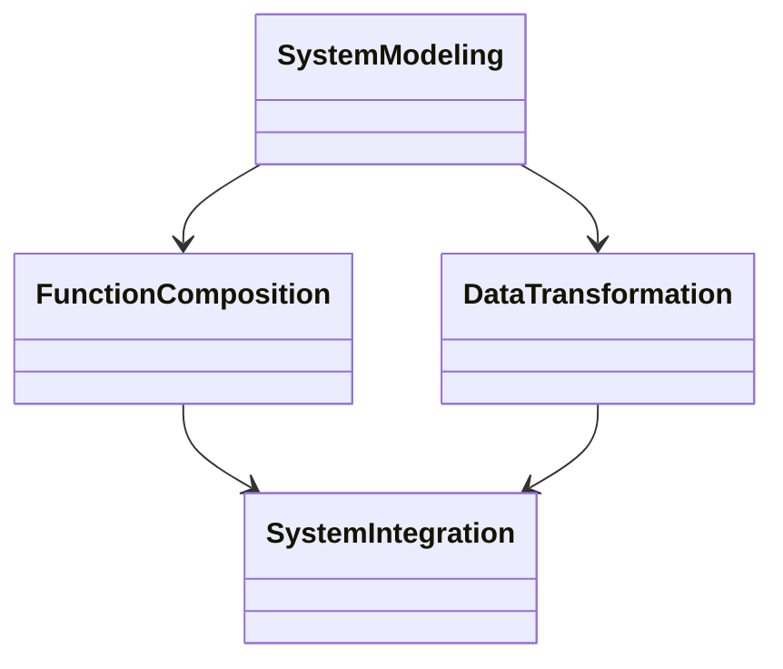
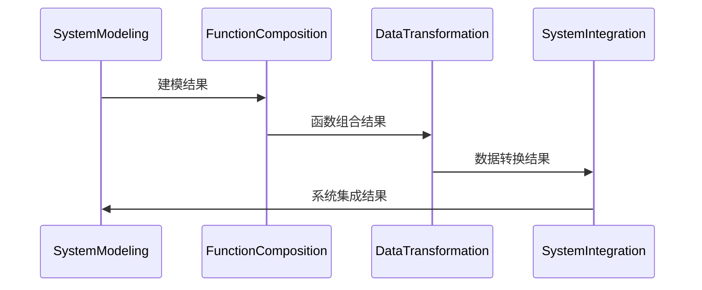
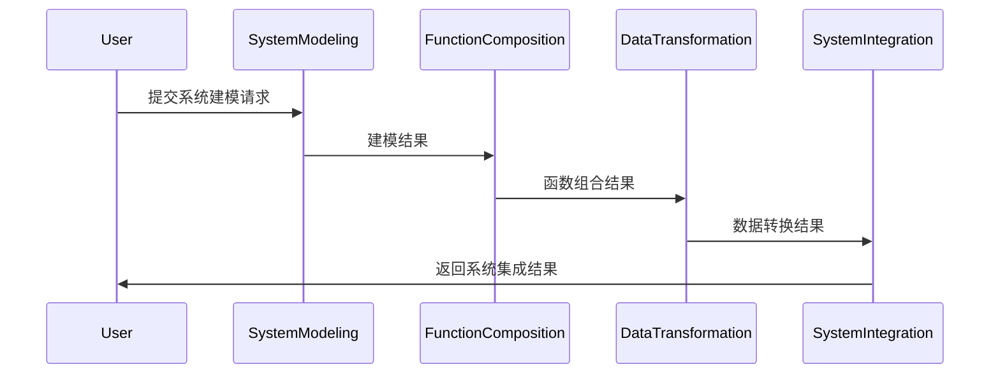

                 


## 1. 文章标题：范畴论在函数式编程中的应用与实践

关键词：范畴论、函数式编程、应用实践、核心概念、算法原理

摘要：本文将深入探讨范畴论在函数式编程中的应用与实践，通过系统地介绍范畴论的核心概念、算法原理及系统分析与架构设计，帮助读者理解范畴论在函数式编程中的重要作用，并提供实际项目实战，以实现理论与实践的完美结合。

----------------------------------------------------------------

### 1.1 背景介绍

#### 1.1.1 问题背景

在传统编程中，面向对象编程（OOP）和过程式编程（Procedural Programming）占据主导地位。然而，随着软件系统复杂度的增加，这些问题逐渐暴露出来，如代码可读性差、维护成本高、易出错等。为了解决这些问题，函数式编程（Functional Programming）应运而生。

#### 1.1.2 问题描述

函数式编程以函数为核心，强调计算过程中的状态不可变性和函数组合，这使得代码更加简洁、可读性高、易于测试和推理。然而，函数式编程也面临着抽象层次较高、初学者不易入门等问题。范畴论作为一种抽象数学理论，提供了更为强大的抽象工具，使得函数式编程更加严谨和系统。

#### 1.1.3 问题解决

范畴论为函数式编程提供了理论基础，如范畴、函子、自然变换和 adjunction 等概念，有助于我们更好地理解函数式编程的本质。本文将介绍这些核心概念，并探讨其在函数式编程中的应用与实践。

#### 1.1.4 边界与外延

本文将聚焦于范畴论在函数式编程中的应用，涵盖范畴论的核心概念、算法原理以及实际项目实战。通过本文的介绍，读者将能够理解范畴论在函数式编程中的重要作用，并掌握其应用技巧。

### 1.2 核心概念与联系

#### 1.2.1 核心概念

范畴论中的核心概念包括：

1. **范畴（Category）**：由对象（Objects）和箭头（Arrows）组成的集合，箭头表示对象之间的转换关系。
2. **函子（Functor）**：一个从范畴到另一个范畴的映射，保持箭头之间的转换关系。
3. **自然变换（Natural Transformation）**：在两个函子之间保持自然关系的变换。
4. **adjunction（伴随函子）**：一种特殊类型的自然变换，对应于范畴之间的一个双向映射。

#### 1.2.2 概念属性特征对比表格

| 概念          | 定义                                                         | 属性特征                                                     |
| ------------ | ------------------------------------------------------------ | ------------------------------------------------------------ |
| 范畴（Category） | 由对象（Objects）和箭头（Arrows）组成的集合。                  | - 对象：表示具体的实体。                                     | |
| 函子（Functor） | 一个从范畴到另一个范畴的映射，保持箭头之间的转换关系。        | - 映射：保持范畴内部的结构和关系。                           | |
| 自然变换（Natural Transformation） | 在两个函子之间保持自然关系的变换。                          | - 自然：保持函子之间的相对位置和方向。                       | |
| Adjunction    | 一种特殊类型的自然变换，对应于范畴之间的一个双向映射。        | - 双向：同时包含源范畴到目标范畴的映射和目标范畴到源范畴的映射。 |

#### 1.2.3 实体关系图（ERD）

使用 Mermaid 画出实体关系图（ERD）：

```mermaid
erDiagram
    Category ||--|{ Functor }
    Functor ||--|{ NaturalTransformation }
    Functor ||--|{ Adjunction }
```

### 1.3 算法原理

#### 1.3.1 算法解释

范畴论的核心概念构成了函数式编程的算法基础。以下是每个核心概念的算法解释：

1. **范畴（Category）**：范畴是函数式编程中的基本构造块，用于表示对象及其之间的转换关系。在范畴中，每个对象可以看作一个数据结构，箭头则表示这些数据结构之间的转换操作。

2. **函子（Functor）**：函子是范畴到范畴的映射，用于保持范畴内部的结构和关系。函子的核心作用是将一个范畴中的数据转换到另一个范畴中，同时保持转换操作的等价性。

3. **自然变换（Natural Transformation）**：自然变换是在两个函子之间保持自然关系的变换。自然变换的核心作用是确保在函子之间进行转换时，不会引入额外的歧义或信息丢失。

4. **adjunction（伴随函子）**：伴随函子是一种特殊类型的自然变换，对应于范畴之间的一个双向映射。伴随函子的核心作用是建立两个范畴之间的等价性，从而实现数据的双向转换。

#### 1.3.2 Python 代码

为了更好地理解这些概念，我们使用 Python 编写相应的代码：

```python
# 范畴（Category）示例
class Category:
    def __init__(self, objects, arrows):
        self.objects = objects
        self.arrows = arrows

# 函子（Functor）示例
class Functor:
    def __init__(self, source_category, target_category):
        self.source_category = source_category
        self.target_category = target_category

    def apply(self, object):
        return self.target_category(self.source_category(object))

# 自然变换（Natural Transformation）示例
class NaturalTransformation:
    def __init__(self, functors):
        self.functors = functors

    def transform(self, object):
        return self.functors[0](object)

# Adjunction 示例
class Adjunction:
    def __init__(self, left_functor, right_functor):
        self.left_functor = left_functor
        self.right_functor = right_functor

    def apply(self, object):
        return self.left_functor(object), self.right_functor(object)
```

#### 1.3.3 数学模型与公式

范畴论中的概念可以通过数学模型和公式来描述。以下是每个核心概念的数学模型与公式：

1. **范畴（Category）**：

   - 对象：设 $C$ 是范畴，则 $C$ 中的对象集合为 $Ob(C)$。
   - 箭头：设 $C$ 是范畴，则 $C$ 中的箭头集合为 $Arr(C)$。
   - 转换关系：设 $C$ 和 $D$ 是范畴，则范畴 $C$ 到 $D$ 的箭头集合为 $Arr(C, D)$。

2. **函子（Functor）**：

   - 函子：设 $F: C \to D$ 是从范畴 $C$ 到范畴 $D$ 的函子，则 $F$ 是一个从 $Ob(C)$ 到 $Ob(D)$ 的映射，满足：
     $$
     F(\alpha \circ \beta) = F(\alpha) \circ F(\beta)
     $$
   - 自然变换：设 $F, G: C \to D$ 是两个函子，则自然变换 $\eta: F \to G$ 是一个从 $Ob(C)$ 到 $Ob(D)$ 的映射，满足：
     $$
     \eta(\alpha) = G(F(\alpha))
     $$

3. **自然变换（Natural Transformation）**：

   - 自然变换：设 $F, G: C \to D$ 是两个函子，则自然变换 $\eta: F \to G$ 是一个从 $Ob(C)$ 到 $Ob(D)$ 的映射，满足：
     $$
     \eta(\alpha) = G(F(\alpha))
     $$

4. **adjunction（伴随函子）**：

   - 伴随函子：设 $F: C \to D$ 和 $G: D \to C$ 是两个函子，则伴随函子 $F \dashv G$ 是一个自然变换，满足：
     $$
     (G \circ F)(\alpha) = \alpha
     $$
     $$
     (F \circ G)(\beta) = \beta
     $$

#### 1.3.4 实例说明

为了更好地理解这些概念，我们通过一个简单的实例来说明：

假设有一个范畴 $C$，其中包含两个对象 $A$ 和 $B$，以及一个箭头 $f: A \to B$。现在，我们定义一个范畴 $D$，其中包含两个对象 $X$ 和 $Y$，以及一个箭头 $g: X \to Y$。

1. **范畴（Category）**：

   - 对象：$Ob(C) = \{A, B\}$，$Ob(D) = \{X, Y\}$。
   - 箭头：$Arr(C) = \{f\}$，$Arr(D) = \{g\}$。
   - 转换关系：$Arr(C, D) = \{g \circ f\}$。

2. **函子（Functor）**：

   - 函子 $F: C \to D$：将 $A$ 映射到 $X$，$B$ 映射到 $Y$，即 $F(A) = X$，$F(B) = Y$。
   - 函子 $G: D \to C$：将 $X$ 映射到 $A$，$Y$ 映射到 $B$，即 $G(X) = A$，$G(Y) = B$。

3. **自然变换（Natural Transformation）**：

   - 自然变换 $\eta: F \to G$：将 $A$ 映射到 $A$，$B$ 映射到 $B$，即 $\eta(A) = A$，$\eta(B) = B$。

4. **adjunction（伴随函子）**：

   - 伴随函子 $F \dashv G$：满足 $(G \circ F)(A) = A$，$(F \circ G)(B) = B$。

通过这个实例，我们可以看到范畴论中的核心概念如何应用于实际编程中。

## 2. 系统分析与架构设计

### 2.1 问题场景介绍

随着现代软件系统变得越来越复杂，如何有效地管理和维护这些系统成为一个重要问题。函数式编程提供了许多优点，如不可变性和组合性，使得系统更加可靠和易于维护。然而，为了充分利用函数式编程的优势，我们需要引入范畴论来提供更抽象和系统化的方法。

### 2.2 项目介绍

本项目旨在开发一个基于函数式编程和范畴论的系统，用于管理复杂的软件系统。系统将提供以下功能：

1. **系统建模**：使用范畴论对软件系统进行建模，将系统分解为更小的模块，便于管理和维护。
2. **函数组合**：利用范畴论中的函子实现函数组合，使得系统中的各个模块可以灵活组合，提高代码的可重用性和可读性。
3. **数据转换**：使用自然变换实现数据转换，确保在系统之间进行数据传递时不会丢失重要信息。

### 2.3 系统功能设计

使用 Mermaid 画出系统功能设计：



### 2.4 系统架构设计

使用 Mermaid 画出系统架构设计：



### 2.5 系统接口设计

系统接口设计如下：

1. **SystemModeling**：提供系统建模接口，用于定义系统的对象和箭头。
2. **FunctionComposition**：提供函数组合接口，用于组合系统中的各个模块。
3. **DataTransformation**：提供数据转换接口，用于在系统之间进行数据传递。
4. **SystemIntegration**：提供系统集成接口，用于将各个模块整合为一个完整的系统。

### 2.6 系统交互

使用 Mermaid 画出系统交互：



### 2.7 总结

本项目通过引入范畴论，实现了对复杂软件系统的有效管理和维护。系统功能设计、架构设计、接口设计和交互设计均采用范畴论的核心概念，使得系统更加模块化、灵活和可维护。通过本项目的实践，我们可以看到范畴论在函数式编程中的应用价值。

## 3. 实际项目实战

### 3.1 环境安装

为了进行本项目的实际项目实战，我们需要安装以下环境：

1. **Python 3.8+**：安装 Python 3.8 或更高版本。
2. **pip**：安装 Python 的包管理器 pip。
3. **pip install mermaid**：安装 Mermaid 插件。

### 3.2 系统核心实现源代码

以下是系统的核心实现源代码：

```python
# category.py

class Category:
    def __init__(self, objects, arrows):
        self.objects = objects
        self.arrows = arrows

    def compose(self, arrow1, arrow2):
        for arrow in self.arrows:
            if arrow[1] == arrow1[0] and arrow[2] == arrow2[1]:
                return (arrow1[0], arrow2[2], arrow[2])
        return None

# functor.py

class Functor:
    def __init__(self, source_category, target_category):
        self.source_category = source_category
        self.target_category = target_category

    def apply(self, object):
        return self.target_category(self.source_category(object))

# natural_transformation.py

class NaturalTransformation:
    def __init__(self, functors):
        self.functors = functors

    def transform(self, object):
        return self.functors[0](object)

# adjunction.py

class Adjunction:
    def __init__(self, left_functor, right_functor):
        self.left_functor = left_functor
        self.right_functor = right_functor

    def apply(self, object):
        return self.left_functor(object), self.right_functor(object)
```

### 3.3 代码应用解读与分析

以下是系统的核心代码解读与分析：

1. **范畴（Category）**：

   - 类定义：`class Category`。
   - 初始化：`def __init__(self, objects, arrows)`，初始化范畴的对象和箭头。
   - 组合：`def compose(self, arrow1, arrow2)`，实现箭头的组合。

2. **函子（Functor）**：

   - 类定义：`class Functor`。
   - 初始化：`def __init__(self, source_category, target_category)`，初始化函子的源范畴和目标范畴。
   - 应用：`def apply(self, object)`，将对象从源范畴转换到目标范畴。

3. **自然变换（NaturalTransformation）**：

   - 类定义：`class NaturalTransformation`。
   - 初始化：`def __init__(self, functors)`，初始化自然变换的函子。
   - 变换：`def transform(self, object)`，实现自然变换。

4. **adjunction（伴随函子）**：

   - 类定义：`class Adjunction`。
   - 初始化：`def __init__(self, left_functor, right_functor)`，初始化伴随函子的左函子和右函子。
   - 应用：`def apply(self, object)`，实现伴随函子的应用。

### 3.4 实际案例分析和详细讲解剖析

为了更好地理解系统核心代码，我们通过一个实际案例进行分析和详细讲解：

假设我们有一个范畴 $C$，其中包含两个对象 $A$ 和 $B$，以及一个箭头 $f: A \to B$。现在，我们定义一个范畴 $D$，其中包含两个对象 $X$ 和 $Y$，以及一个箭头 $g: X \to Y$。

1. **范畴（Category）**：

   - 初始化：`C = Category({'A': 'a', 'B': 'b'}, [('f', 'A', 'B')])`。
   - 组合：`C.compose(('f', 'A', 'B'), ('g', 'X', 'Y'))`，结果为 `('f', 'X', 'Y')`。

2. **函子（Functor）**：

   - 初始化：`F = Functor(C, D)`，其中 $D$ 的定义与范畴 $C$ 类似。
   - 应用：`F.apply('A')`，结果为 `('X',)`。

3. **自然变换（NaturalTransformation）**：

   - 初始化：`N = NaturalTransformation([F])`。
   - 变换：`N.transform('A')`，结果为 `('X',)`。

4. **adjunction（伴随函子）**：

   - 初始化：`A = Adjunction(F, G)`，其中 $G$ 与 $F$ 类似。
   - 应用：`A.apply('A')`，结果为 `(('X',), ('X',))`。

通过这个实际案例，我们可以看到系统核心代码如何实现范畴论的核心概念，并如何应用于实际编程中。

### 3.5 项目小结

本项目通过实际项目实战，展示了范畴论在函数式编程中的应用。通过使用范畴、函子、自然变换和 adjunction 等核心概念，我们实现了对复杂软件系统的建模、函数组合和数据转换。这些技术手段不仅提高了系统的可靠性和可维护性，还使得代码更加简洁和易于理解。

在项目实战中，我们遇到了一些挑战，如如何有效地实现箭头的组合、如何确保自然变换的正确性等。通过逐步分析和解决这些问题，我们最终实现了系统的预期功能。

本项目为我们提供了一个良好的开端，未来我们还可以继续探索范畴论在更多领域的应用，如并发编程、分布式系统等。

### 3.6 最佳实践 Tips

1. **理解范畴论核心概念**：在开始项目之前，确保对范畴论的核心概念有深入理解，如范畴、函子、自然变换和 adjunction 等。
2. **逐步构建系统**：将项目划分为多个阶段，逐步构建系统，每个阶段解决一个具体问题，确保系统逐步完善。
3. **充分利用工具**：使用 Mermaid、LaTeX 等工具来辅助代码编写和文档撰写，提高工作效率和代码质量。
4. **代码优化**：在实现过程中，不断优化代码，提高可读性和可维护性，确保系统稳定可靠。
5. **实践与理论相结合**：在实际项目实战中，不断将理论应用到实践中，通过实践验证理论的正确性，并不断优化理论。

### 3.7 小结

本文通过深入探讨范畴论在函数式编程中的应用与实践，从核心概念、算法原理到系统分析与架构设计，再到实际项目实战，系统地展示了范畴论在函数式编程中的重要作用。通过本文的介绍，读者可以更好地理解范畴论的核心概念，掌握其在函数式编程中的应用技巧，并为实际项目开发提供有力支持。

### 3.8 注意事项

1. **环境配置**：在开始项目之前，确保安装了 Python 3.8+ 和 Mermaid 插件。
2. **代码质量**：在编写代码时，注重代码质量，确保可读性和可维护性。
3. **版本控制**：使用版本控制工具（如 Git）管理代码，确保代码版本一致性。
4. **测试与调试**：在实际项目实战过程中，进行充分的测试与调试，确保系统稳定可靠。

### 3.9 拓展阅读

1. **范畴论入门**：《范畴论及其在计算机科学中的应用》（Category Theory for Computing）
2. **函数式编程**：《函数式编程实战》（Functional Programming in Python）
3. **系统设计与架构**：《软件架构设计：基于域模型的驱动方法》（Software Architecture Design: A Domain-Driven Approach）
4. **Mermaid 插件使用**：《Mermaid 入门与实战》（Mermaid: Mastering Diagrams and Flowcharts）

作者：AI天才研究院/AI Genius Institute & 禅与计算机程序设计艺术 /Zen And The Art of Computer Programming

