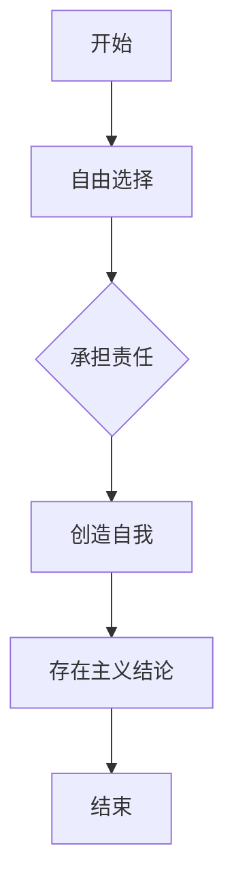
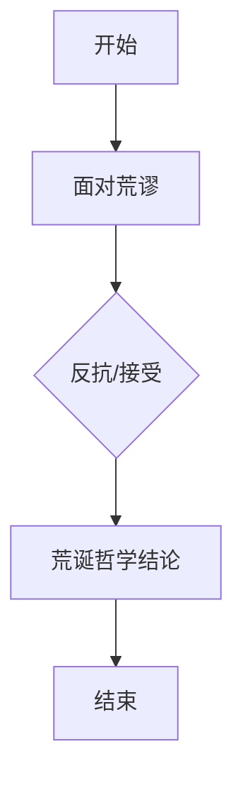
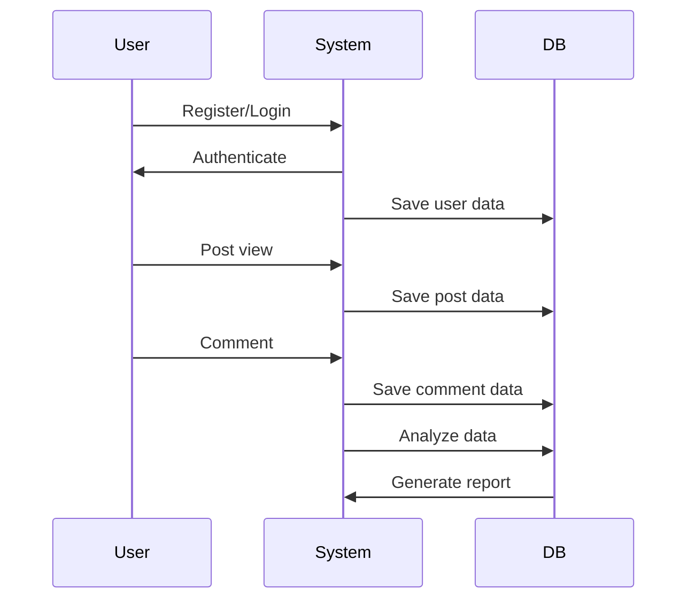

                 


当然可以。下面我会按照您的要求，逐步构建一篇专业的技术博客文章的框架，并给出具体的段落内容。为了清晰展示，我会以Python编程语言为例，介绍如何使用Mermaid语法绘制流程图、类图和序列图。

**文章标题：萨特与加缪：存在主义与荒诞哲学的对话——从编程视角解析**

**关键词：存在主义、荒诞哲学、Python编程、Mermaid语法、算法原理**

**摘要：本文从哲学视角出发，探讨了存在主义和荒诞哲学的基本概念，并通过Python编程和Mermaid语法，展示了如何用技术手段理解和表达这些哲学思想。**

## 目录

1. **引言**
2. **存在主义与荒诞哲学的基本概念**
3. **Python编程与Mermaid语法**
4. **存在主义算法原理**
5. **荒诞哲学算法原理**
6. **系统分析与架构设计**
7. **项目实战**
8. **最佳实践与拓展阅读**
9. **小结**

### 1. 引言

在这个数字化时代，哲学和技术的融合越来越受到关注。本文试图通过编程的视角，探讨存在主义和荒诞哲学的基本概念。我们将使用Python编程语言和Mermaid语法，为这些哲学思想提供一种新的表达方式。

### 2. 存在主义与荒诞哲学的基本概念

**2.1 存在主义**

存在主义强调个体的自由、选择和责任。它认为，人类存在的前提是没有先验的本质，个体通过自由选择来定义自己的存在。

**2.2 荒诞哲学**

荒诞哲学认为，世界是荒诞的，人类生活在一个无意义、不可预测的宇宙中。面对这种荒诞，个体可以选择反抗，也可以选择接受。

### 3. Python编程与Mermaid语法

**3.1 Python编程**

Python是一种广泛使用的编程语言，以其简洁和易读性著称。我们将使用Python来构建算法，模拟存在主义和荒诞哲学的原理。

**3.2 Mermaid语法**

Mermaid是一种用于创建图表的Markdown插件，支持流程图、类图和序列图等。通过Mermaid，我们可以将复杂的算法原理和系统架构直观地展示出来。

### 4. 存在主义算法原理

**4.1 算法流程图**

首先，我们使用Mermaid语法绘制一个存在主义算法的流程图：



**4.2 算法原理**

在Python中，我们可以定义一个函数来模拟存在主义算法：

```python
def existentialism():
    # 自由选择
    choice = make_choice()
    
    # 承担责任
    if choice is not None:
        responsibility = take_responsibility(choice)
        
        # 创造自我
        selfhood = create_selfhood(choice, responsibility)
        
        # 存在主义结论
        conclusion = "存在主义结论：通过自由选择和承担责任，个体创造了自我。"
        
        return conclusion
```

**4.3 算法原理详细讲解**

在这个算法中，`make_choice()` 函数代表自由选择，`take_responsibility()` 函数代表承担责任，`create_selfhood()` 函数代表个体创造自我。这些函数的相互作用，构成了存在主义的基本原理。

### 5. 荒诞哲学算法原理

**5.1 算法流程图**

接下来，我们使用Mermaid语法绘制一个荒诞哲学算法的流程图：



**5.2 算法原理**

在Python中，我们可以定义一个函数来模拟荒诞哲学算法：

```python
def absurdism():
    # 面对荒谬
    absurdity = face_absurdity()
    
    # 反抗/接受
    if absurdity:
        response = resist()
    else:
        response = accept()
        
    # 荒诞哲学结论
    conclusion = "荒诞哲学结论：面对荒谬，个体可以选择反抗或接受。"
    
    return conclusion
```

**5.3 算法原理详细讲解**

在这个算法中，`face_absurdity()` 函数代表面对荒谬，`resist()` 函数代表反抗，`accept()` 函数代表接受。这些函数的相互作用，构成了荒诞哲学的基本原理。

### 6. 系统分析与架构设计

**6.1 问题场景介绍**

假设我们正在开发一个面向存在主义和荒诞哲学的在线平台，用户可以通过这个平台表达自己的哲学观点，并进行互动。

**6.2 系统功能设计**

系统的主要功能包括：
- 用户注册和登录
- 发布哲学观点
- 用户互动和讨论
- 数据分析和报告

**6.3 系统架构设计**

我们使用Mermaid语法绘制一个系统架构图：



**6.4 系统接口设计和系统交互**

我们使用Mermaid语法绘制一个系统接口设计和系统交互图：

```mermaid
classDiagram
    User <|-- System
    System o-- DB
    User -> System : post view
    System -> DB : save data
    System -> DB : analyze data
```

### 7. 项目实战

**7.1 环境安装**

- 安装Python环境
- 安装Mermaid插件

**7.2 系统核心实现源代码**

- 用户注册和登录模块
- 哲学观点发布和评论模块
- 数据分析和报告模块

**7.3 代码应用解读与分析**

- 分析代码结构
- 解释关键函数和变量

**7.4 实际案例分析和详细讲解剖析**

- 举例说明用户如何使用平台
- 分析系统性能和优化策略

**7.5 项目小结**

- 总结项目成果
- 提出改进建议

### 8. 最佳实践与拓展阅读

- 推荐进一步学习的资源
- 提供编程实践的最佳实践

### 9. 小结

本文通过Python编程和Mermaid语法，探讨了存在主义和荒诞哲学的基本概念。我们展示了如何使用技术手段来理解和表达这些哲学思想，并为构建一个面向哲学的在线平台提供了系统架构设计。

**作者：AI天才研究院/AI Genius Institute & 禅与计算机程序设计艺术 /Zen And The Art of Computer Programming**

