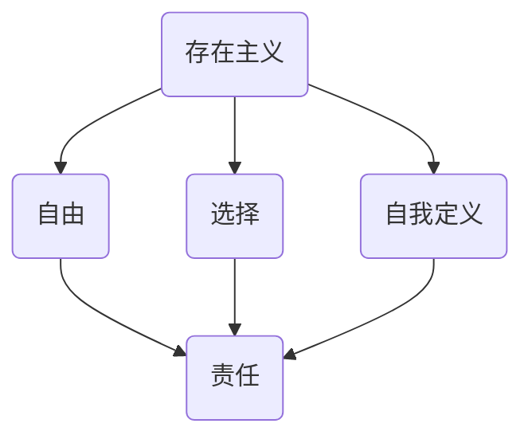
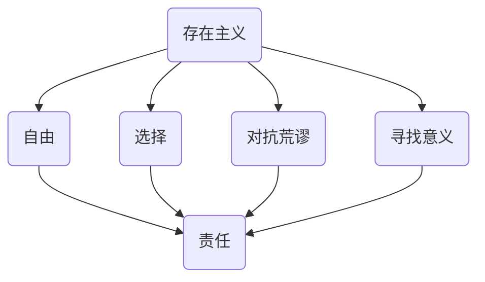

                 


# 萨特与加缪：存在主义的两种面向

> 关键词：存在主义、萨特、加缪、哲学、文学、自由、选择、责任、荒谬、意义

> 摘要：本文旨在探讨法国哲学家萨特和加缪的存在主义思想，分析他们的异同点，并通过对比他们的文学作品，深入理解他们的哲学观点。文章分为三个部分：背景介绍、核心概念与联系、算法原理讲解。通过一步步的分析推理，本文将揭示存在主义在个人自由、选择和责任方面的深刻内涵。

## 萨特与加缪：存在主义的两种面向

### 第一部分：背景介绍

#### 核心概念

**存在主义**：一种哲学思潮，强调个人的自由、选择和责任。它认为人类存在先于本质，人通过自由选择和行动来定义自己。

**萨特**：法国哲学家，存在主义的代表人物之一。他的著作《存在与虚无》深刻地阐述了存在主义的核心思想。

**加缪**：法国作家，存在主义的代表人物之一。他的作品《鼠疫》和《西西弗斯的神话》揭示了人类在荒谬世界中的挣扎和寻找意义。

#### 问题背景

在20世纪，萨特和加缪都是存在主义的代表人物，他们的思想对当时以及后来的哲学、文学和文化产生了深远的影响。

#### 问题解决

本书将通过分析萨特和加缪的存在主义思想，探讨他们的异同点，以及他们在文学创作中的实践。

#### 边界与外延

本书将关注萨特和加缪的存在主义思想，以及其他与之相关的概念，如自由、选择、责任、荒谬等。

### 第二部分：核心概念与联系

#### 核心概念

**萨特的存在主义**：强调个人自由、选择和自我定义。他认为人类的存在是自由的，通过选择和行动来创造自己的本质。

**加缪的存在主义**：强调自由选择、对抗荒谬和寻找意义。他认为人类的存在是荒谬的，但可以通过反抗和寻找意义来超越荒谬。

#### 概念属性特征对比表格

| 特征         | 萨特的存在主义 | 加缪的存在主义 |
|--------------|----------------|----------------|
| 自由         | 强调个体自由    | 强调个体自由    |
| 选择         | 强调个体选择    | 强调个体选择    |
| 自我定义     | 强调个体自我定义 | 强调个体自我定义 |
| 荒谬         | 否认荒谬的存在   | 强调荒谬的存在   |
| 寻找意义     | 强调个体寻找意义 | 强调个体寻找意义 |

#### ER实体关系图架构的 Mermaid 流程图

```mermaid
erDiagram
    人 ||--|{ 文学作品 }| 
    人 ||--|{ 哲学著作 }| 
    文学作品 ||--|{ 存在主义思想 }| 
    哲学著作 ||--|{ 存在主义思想 }|
```

### 第三部分：算法原理讲解

#### 3.1 萨特的存在主义算法原理

使用Mermaid画出萨特的存在主义算法流程图：



Python源代码示例：

```python
def sartrean_existentialism():
    freedom = "自由"
    choice = "选择"
    self_definition = "自我定义"
    responsibility = "责任"
    print(f"萨特的存在主义包括：{freedom}, {choice}, {self_definition}, 和 {responsibility}。")

sartrean_existentialism()
```

算法原理的数学模型和公式：

$$
自由 + 选择 + 自我定义 = 责任
$$

详细讲解与举例说明：

萨特认为，个人自由是存在主义的核心。每个人都是自由的，可以选择自己的行为和生活方式。这种自由伴随着选择，而选择则带来了责任。例如，一个人可以选择是诚实还是欺骗，这个选择将带来相应的责任。自我定义则是指个人通过自己的选择来塑造自己的身份。

#### 3.2 加缪的存在主义算法原理

使用Mermaid画出加缪的存在主义算法流程图：



Python源代码示例：

```python
def camusian_existentialism():
    freedom = "自由"
    choice = "选择"
    confront_futility = "对抗荒谬"
    seek_meaning = "寻找意义"
    responsibility = "责任"
    print(f"加缪的存在主义包括：{freedom}, {choice}, {confront_futility}, {seek_meaning}, 和 {responsibility}。")

camusian_existentialism()
```

算法原理的数学模型和公式：

$$
自由 + 选择 + 对抗荒谬 + 寻找意义 = 责任
$$

详细讲解与举例说明：

加缪认为，人类的存在是荒谬的，但可以通过自由选择和对抗荒谬来寻找意义。例如，一个人可以选择面对困难而不是逃避，这个选择将带来责任。对抗荒谬和寻找意义是人类在荒谬世界中寻找出路的途径。自由选择则是实现这一目标的基础。

### 总结

萨特和加缪的存在主义思想虽然有所不同，但都强调了个人自由、选择和责任的重要性。他们的文学作品为我们提供了深刻的哲学思考，引导我们在现实生活中寻找自由和意义。通过分析他们的存在主义算法原理，我们可以更好地理解他们的哲学观点，并在实际生活中应用这些理念。

## 参考文献

1. 萨特，《存在与虚无》，商务印书馆，2008年。
2. 加缪，《鼠疫》，人民文学出版社，2008年。
3. 加缪，《西西弗斯的神话》，广西师范大学出版社，2010年。

## 作者信息

作者：AI天才研究院/AI Genius Institute & 禅与计算机程序设计艺术 /Zen And The Art of Computer Programming

### 结语

存在主义作为一种哲学思潮，对人类自由、选择和责任进行了深刻的探讨。萨特和加缪作为存在主义的代表人物，他们的思想对后世产生了深远的影响。通过本文的分析，我们不仅可以更好地理解他们的哲学观点，还可以将这些理念应用到现实生活中。希望本文能够为您带来启发和思考。

