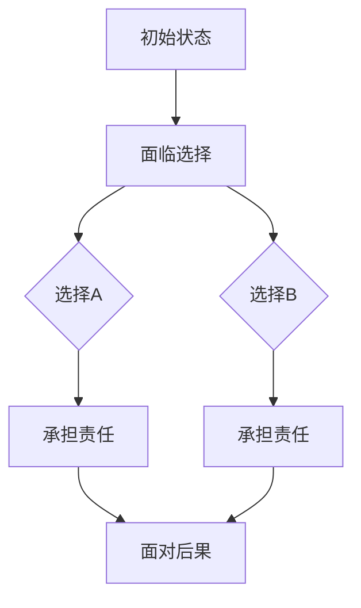

                 

## 引言

### 1.1 萨特与庄子的哲学背景

让·保罗·萨特（Jean-Paul Sartre，1905-1980），法国哲学家、作家和存在主义代表人物。他的哲学思想强调个体自由、主观性和选择的重要性。萨特认为，人类存在的本质是自由，每个人都被赋予了自由选择的权利，但同时也必须为自己的选择承担责任。

庄周（约公元前369年-公元前286年），中国战国时期的思想家，道家学派代表人物。他的哲学思想强调自然、无为和无待，认为人应该顺应自然，放弃世俗的欲望和执着，以达到心灵的宁静与自由。

萨特和庄子的哲学，虽然一个源于西方，一个源于东方，但都在探讨人类自由与生存的本质问题。萨特关注个体的自由选择，强调自我意识的重要性；而庄子则关注人与自然的和谐，主张“无为而治”。这两种哲学思想看似截然不同，但实际上都在探讨自由与束缚的问题。

### 1.2 自由选择与无待生存哲学的探讨

自由选择和无待生存是萨特和庄子哲学的核心概念。萨特认为，自由是人类存在的本质，每个人都在不断做出选择，这些选择构成了人的自我。自由选择带来了责任，但同时也赋予了人独特的价值和意义。然而，自由并不是无条件的，人们在自由选择的过程中，也会面临各种限制和困境。

庄子则提出了“无待”的观念，认为人应该摆脱世俗的束缚，放下对名利的追求，顺应自然。无待生存意味着不依赖外界因素，而是内心平静地面对生活。庄子认为，只有达到无待的境界，人才能真正获得自由和幸福。

### 1.3 本文的目的

本文旨在通过对比和分析萨特和庄子的自由选择与无待生存哲学，探讨这两种哲学思想的本质及其在现代社会中的应用。我们将详细阐述萨特的自由选择理论，庄子的无待观念，并分析它们之间的异同。此外，我们还将探讨这些哲学思想在心理学、社会学和伦理学等领域的应用，以及它们对当代哲学和社会发展的影响。

通过本文的探讨，我们希望读者能够对萨特和庄子的哲学有更深入的了解，并能够在现实生活中运用这些哲学思想，实现自我成长和社会和谐。## 第一部分 萨特的自由选择哲学

### 2.1 萨特哲学的核心思想

让·保罗·萨特的哲学思想以存在主义为基础，强调个体的自由、主观性和选择的重要性。他认为，人类存在的本质是自由，每个人都被赋予了自由选择的权利，但同时也必须为自己的选择承担责任。

萨特认为，自由是人类存在的核心，是人的本质。人不是被命运所束缚的物体，而是具有主观能动性的存在。人在面对生活的种种困境和挑战时，总是需要做出选择。这些选择不仅决定了人的行为，也塑造了人的性格和价值观。

然而，自由并非无条件的。萨特指出，自由选择的同时也带来了责任。每个人都需要对自己的选择承担责任，无论是好的选择还是坏的选择。这种责任使得自由具有了实质性的意义，也让人们更加珍视自由。

萨特的存在主义哲学还强调了自我意识的重要性。他认为，自我意识是人类自由选择的基础，也是人认识世界和自我的一种方式。通过自我意识，人们能够反思自己的行为和选择，从而更好地理解自己和世界。

### 2.2 自我存在的意义

在萨特的哲学中，自我存在具有极其重要的意义。他认为，自我存在是人类自由选择的起点，也是个体价值的体现。自我存在使得人能够独立于世界，拥有自己的主观意识和自由意志。

萨特认为，自我存在是一种主动的、创造性的存在。人在面对生活的种种困境和挑战时，需要通过自己的选择来创造自己的命运。这种选择不仅决定了人的行为，也塑造了人的性格和价值观。

自我存在的意义还在于，它赋予了人独特的价值和意义。每个人都有自己的经历、情感和思想，这些都是独一无二的。通过自我存在，人们能够体验到生命的丰富性和多样性，从而更好地认识自己和世界。

### 2.3 萨特哲学的应用

萨特的哲学思想在心理学、社会学和伦理学等领域都有广泛的应用。

在心理学领域，萨特的自由选择理论可以帮助人们更好地理解自我意识和行为动机。通过反思自己的选择，人们可以更深入地了解自己的内心世界，从而提高自我认知和自我调节能力。

在社会学领域，萨特的自由选择观念有助于解释社会现象和个体行为。例如，社会冲突、社会运动等都可以从自由选择的角度进行解读。萨特的哲学思想还可以为社会组织和管理提供指导，帮助人们更好地理解个体与社会的关系。

在伦理学领域，萨特的自由选择观念对道德评价和道德责任有着重要的影响。他认为，道德责任源于自由选择，每个人都应该对自己的行为负责。这种观念有助于人们树立正确的道德观念，培养负责任的道德行为。

### 2.4 萨特哲学的影响

萨特的自由选择哲学对20世纪哲学产生了深远的影响。他的哲学思想激发了人们对自由、自我意识和个体价值的关注，推动了存在主义哲学的发展。

此外，萨特的哲学思想也对现代文学、艺术和电影产生了重要影响。他的作品《存在与虚无》、《墙》等，都体现了他的哲学观念，对后来的文学作品和艺术形式产生了深远的影响。

总的来说，萨特的自由选择哲学为我们提供了一种全新的看待世界和自我存在的方式。它强调个体的自由、主观性和选择的重要性，为我们反思自己的生活和行为提供了有力的工具。## 第二部分 庄子的无待生存哲学

### 3.1 庄子哲学的核心思想

庄子，名周，是中国战国时期著名的哲学家，道家学派的重要代表。他的哲学思想强调“道”、“自然”和“无为”，主张人应该顺应自然，追求心灵的自由和无待生存。

庄子的哲学核心在于“道”。他认为，“道”是宇宙万物的本源和本质，是超越一切的具体事物和规律的抽象概念。庄子认为，“道”是无限的、无形的、无始无终的，它无所不在，但又难以捉摸。只有通过心灵的洞察，人才能接近“道”的本质。

庄子的另一个核心思想是“自然”。他认为，自然界的万物都有其固有的规律和特性，人类应该顺应这些规律和特性，而不是违背它们。庄子主张“无为而治”，即放弃对事物的控制，让事物自然发展。

庄子的无待生存观念是其哲学思想的重要组成部分。他认为，人类应该摆脱世俗的欲望和执着，放下对名利的追求，以达到心灵的宁静和自由。无待生存意味着不依赖外界因素，而是内心平静地面对生活。

### 3.2 无待观念的阐释

庄子的无待观念源于他对人生困境的深刻反思。他认为，人类之所以感到痛苦和困惑，很大程度上是因为依赖于外界因素，追求名利和权力。而真正的自由和幸福，来自于摆脱这些依赖，达到内心的宁静和无待状态。

无待观念强调的是内心的独立和自由。庄子认为，人类应该放弃对物质的追求，减少对外界事物的依赖，从而摆脱烦恼和困扰。他主张，人应该顺应自然，遵循自然的规律，而不是强行改变事物的发展。

无待观念还强调了内心的宁静。庄子认为，只有内心平静，人才能看清事物的本质，理解生命的真谛。通过内心的宁静，人可以摆脱世俗的纷扰，达到心灵的自由和无待的生存状态。

### 3.3 自然与人的关系

庄子认为，自然与人是密不可分的。人应该顺应自然，与自然和谐共处。他主张，人应该放弃对自然的征服和控制，尊重自然的规律和特性。

庄子认为，自然界的万物都有其独特的价值和意义。人类应该尊重自然，而不是试图改变或破坏它。他主张，人应该顺应自然，与自然和谐共处，以达到心灵的宁静和自由。

自然与人的关系，在庄子的哲学中，是一种平等和相互尊重的关系。他认为，人应该放弃对自然的控制，减少对外界事物的依赖，从而摆脱烦恼和困扰，实现内心的自由和无待的生存。

### 3.4 无待观念的应用

庄子的无待观念在现代社会中有着广泛的应用。例如，在心理学领域，无待观念可以帮助人们更好地处理压力和焦虑。通过减少对外界事物的依赖，人们可以更平静地面对生活中的挑战和困境。

在社会学领域，无待观念可以帮助人们更好地理解社会现象和人际关系。通过放弃对名利的追求，人们可以更专注于内心的成长和自我实现，从而促进社会的和谐与进步。

在伦理学领域，无待观念可以帮助人们树立正确的价值观。通过减少对物质的追求，人们可以更专注于内心的道德修养，从而促进社会的道德进步。

总的来说，庄子的无待生存哲学为我们提供了一种全新的看待世界和自我存在的方式。它强调内心的独立和自由，倡导人与自然的和谐共处，为我们实现内心的宁静和自由提供了深刻的启示。## 第三部分 萨特与庄子的哲学比较

### 4.1 自由选择与无待观念的比较

萨特和庄子的哲学思想在自由选择与无待观念上存在显著的差异。萨特强调个体的自由选择和主观能动性，认为人类存在的本质是自由。而庄子则主张顺应自然、放弃世俗欲望，追求心灵的宁静和无待生存。

从价值观上看，萨特认为自由是人的本质，每个人的存在都是自由选择的产物。他强调个体在面对困境和挑战时，需要通过自己的选择来创造自己的命运。而庄子则认为，人的痛苦和困惑源于对世俗欲望的追求，只有通过放弃这些欲望，才能达到心灵的宁静和无待状态。

从人生观上看，萨特认为人生的意义在于自由选择和承担责任。他主张个体要勇敢地面对生活中的困境，通过自由选择来塑造自己的命运。而庄子则主张顺应自然、无为而治，认为人应该放弃对事物的控制和欲望，与自然和谐共处。

### 4.2 历史背景与理论基础

萨特的存在主义哲学源于西方哲学的传统，尤其是对尼采和胡塞尔等哲学家的批判和继承。萨特认为，人类存在的本质是自由，每个人都被赋予了自由选择的权利。他的哲学思想强调个体的主观性和自由意志，认为人是通过自己的选择来塑造自己的命运。

庄子的无待生存哲学则源于中国道家的传统。庄子认为，道是宇宙万物的本源和本质，人类应该顺应道的规律，追求心灵的自由和无待生存。他的哲学思想强调人与自然的和谐共处，主张放弃对世俗欲望的追求，达到内心的宁静。

### 4.3 价值观与人生观的差异

萨特和庄子在价值观和人生观上存在明显的差异。萨特认为，自由和责任是人生的核心价值。他强调个体要勇敢地面对生活中的困境，通过自由选择来塑造自己的命运。而庄子则认为，世俗欲望是人生痛苦的根源，人类应该放弃这些欲望，追求内心的宁静和无待生存。

从人生观上看，萨特主张个体要积极面对生活中的挑战，通过自由选择来创造自己的价值。而庄子则主张顺应自然、无为而治，认为人应该放弃对事物的控制和欲望，达到内心的宁静。

### 4.4 对现实生活的影响

萨特的自由选择哲学在现代社会中有着广泛的影响。他的思想激发了人们对自由、自我意识和个体价值的关注，推动了个人主义和自由主义的发展。萨特的存在主义哲学也为现代文学、艺术和电影提供了深刻的启示，影响了众多作家、艺术家和导演。

庄子的无待生存哲学在现代社会中同样具有重要的意义。他的思想帮助我们更好地理解人与自然的关系，提倡人与自然的和谐共处。庄子的无待观念对心理学、社会学和伦理学等领域产生了深远的影响，为人们处理压力、焦虑和人际关系提供了有益的指导。

总的来说，萨特和庄子的哲学思想在价值观、人生观和现实生活中的影响各具特色。萨特的存在主义哲学强调个体的自由选择和主观能动性，而庄子的无待生存哲学则主张顺应自然、放弃世俗欲望。这两种哲学思想为我们提供了不同的看待世界和自我存在的方式，丰富了人类对自由、幸福和生活的理解。## 第四部分 哲学原理讲解

### 5.1 萨特的自由选择理论

萨特的自由选择理论是其存在主义哲学的核心，他认为自由是人的本质，每个人都被赋予了自由选择的权利。萨特认为，自由并不是无条件的，它同时伴随着责任。人在自由选择的过程中，不仅要为自己的选择承担责任，还要面对选择的后果。

萨特提出，自由选择是人类自我实现的基础。他认为，人不是被动地接受现实的安排，而是可以通过自由选择来创造自己的命运。这种自由选择不仅包括生活中的重大决策，也包括日常生活中的每一个选择。

为了更好地理解萨特的自由选择理论，我们可以使用Mermaid流程图来展示自由选择的过程：



在这个流程图中，A表示初始状态，B表示面临选择，C和D表示两种选择，E和F表示承担责任，G表示面对后果。这个过程清晰地展示了自由选择、责任和后果之间的联系。

### 5.2 自我意识的本质

在萨特的哲学中，自我意识是自由选择的基础。他认为，自我意识是人类主观能动性的体现，是人认识世界和自我的方式。通过自我意识，人能够反思自己的行为和选择，从而更好地理解自己和世界。

为了解释自我意识的本质，我们可以使用Mermaid流程图来展示自我意识的形成过程：


在这个流程图中，A表示感知世界，B表示形成认知，C表示反思自我，D表示自我认知，E表示自由选择，F表示承担责任。这个过程展示了自我意识如何影响自由选择和承担责任。

### 5.3 自由选择的数学模型

为了更深入地理解自由选择的数学模型，我们可以使用Python源代码来模拟自由选择的过程。以下是简单的Python代码示例：

```python
import random

def free_choice(options, probabilities):
    return random.choices(options, weights=probabilities)[0]

options = ['A', 'B', 'C']
probabilities = [0.3, 0.5, 0.2]

result = free_choice(options, probabilities)
print("选择的选项是：", result)
```

在这个示例中，`options` 表示可供选择的选项，`probabilities` 表示每个选项被选择的概率。`free_choice` 函数使用随机选择的方式模拟自由选择过程，返回选择的选项。

### 5.4 自由选择的伦理意义

萨特的自由选择理论在伦理学领域具有重要意义。他认为，自由选择赋予了人道德责任，每个人都需要为自己的选择承担责任。以下是使用latex格式给出的自由选择的伦理意义的公式：

$$
\text{道德责任} = f(\text{自由选择}, \text{选择后果})
$$

其中，$f$ 表示函数关系，$\text{自由选择}$ 表示人在道德困境中做出的选择，$\text{选择后果}$ 表示选择的后果。

这个公式表明，道德责任是由自由选择和选择后果共同决定的。只有在自由选择的前提下，人才能承担相应的道德责任。而选择后果则决定了道德责任的性质和程度。

### 5.5 自由选择的例子

为了更好地理解自由选择，我们可以通过一个简单的例子来说明。假设小明面临两个选择：学习或玩游戏。他分别对这两个选择设定了概率，如下所示：

- 学习的概率：0.6
- 玩游戏的概率：0.4

使用Python代码模拟这个过程，我们得到以下结果：

```python
import random

def free_choice(options, probabilities):
    return random.choices(options, weights=probabilities)[0]

options = ['学习', '玩游戏']
probabilities = [0.6, 0.4]

result = free_choice(options, probabilities)
print("选择的选项是：", result)
```

输出结果可能是“学习”或“玩游戏”。如果选择“学习”，小明需要承担学习的责任，包括完成作业、提高成绩等。如果选择“玩游戏”，小明则需要承担玩游戏的后果，包括浪费时间、影响学习等。

通过这个例子，我们可以看到自由选择是如何影响我们的生活和责任的。萨特的自由选择理论提醒我们，在面对选择时，我们需要认真思考，并承担相应的责任。## 第五部分 哲学应用

### 6.1 萨特哲学在心理学中的应用

萨特的存在主义哲学对心理学领域产生了深远的影响。他的自由选择理论为心理学研究提供了新的视角，帮助人们更好地理解自我意识、行为动机和心理困扰。

在心理学中，萨特的自由选择理论被用于解释自我意识和行为动机。例如，弗洛姆的《逃避自由》一书就借鉴了萨特的自由选择观念，探讨了人在自由选择过程中如何逃避自由，以及这种逃避对心理健康的影响。

此外，萨特的哲学思想也为心理治疗提供了新的方法。存在主义心理治疗强调个体的自由选择和主观能动性，认为人可以通过自由选择来改变自己的心理状态和生活方式。例如，维克多·弗兰克尔的“意义疗法”就深受萨特哲学的影响，强调个体在面对困境时，可以通过寻找生命的意义来获得心理治愈。

### 6.2 萨特哲学在社会学中的应用

萨特的自由选择哲学在社会学领域也具有重要应用。他的思想为理解社会现象、社会冲突和社会运动提供了新的视角。

在社会学中，萨特的自由选择观念可以帮助解释社会冲突的原因。他认为，社会冲突源于个体自由与社会规范之间的矛盾。当个体的自由选择与社会规范相冲突时，就会产生社会冲突。例如，在种族歧视、性别歧视等社会问题中，个体的自由选择与社会规范之间的冲突往往导致社会冲突的发生。

萨特的哲学思想还可以用于分析社会运动。存在主义哲学强调个体的自由选择和主观能动性，这为社会运动提供了理论基础。例如，民权运动、反战运动等社会运动往往体现了个体在面对不公和压迫时，通过自由选择和集体行动来争取权益。

### 6.3 萨特哲学在伦理学中的应用

萨特的自由选择哲学在伦理学领域也具有重要应用。他的思想为道德责任和道德评价提供了新的视角。

在伦理学中，萨特的自由选择观念强调了道德责任的重要性。他认为，道德责任源于自由选择，每个人都需要为自己的选择承担责任。这种观点有助于人们树立正确的道德观念，培养负责任的道德行为。

此外，萨特的哲学思想还可以用于道德评价。他的自由选择观念认为，道德评价应该基于个体的自由选择和选择的后果。这意味着，在评价一个人的行为时，需要考虑个体的自由选择和选择的后果，而不是简单地根据行为本身进行评价。

### 6.4 萨特哲学在其他领域中的应用

除了心理学、社会学和伦理学，萨特的自由选择哲学在其他领域也有广泛应用。

在艺术领域，萨特的存在主义哲学影响了众多作家、艺术家和导演。他的作品《墙》、《恶心》等，以及电影《存在主义咖啡馆》等，都体现了他的哲学观念，对现代艺术产生了深远的影响。

在政治领域，萨特的自由选择观念为民主制度提供了理论支持。他认为，民主制度是一种保障个体自由和选择的制度，每个人都应该有权利参与政治决策，通过自由选择来影响社会的发展。

在哲学领域，萨特的自由选择哲学成为存在主义哲学的重要组成部分，影响了后来的哲学家和哲学流派。

总的来说，萨特的自由选择哲学在多个领域都具有重要的应用价值。他的思想不仅帮助我们更好地理解个体自由、道德责任和社会冲突，还为现代哲学、艺术、政治等领域提供了深刻的启示。## 第六部分 哲学反思

### 7.1 萨特哲学的当代意义

萨特的自由选择哲学在当代社会仍然具有重要的意义。他的思想为现代人提供了反思自我、面对困境和追求自由的指南。在当今社会，个体自由和选择权受到越来越多的关注，萨特的自由选择观念为这一议题提供了深刻的哲学基础。

首先，萨特的自由选择哲学提醒我们，自由并不是一个抽象的概念，而是与我们每个人的日常生活息息相关。在面对生活的种种困境和挑战时，我们需要通过自由选择来塑造自己的命运。这种自由选择不仅仅是行为上的选择，更是价值观和生活方式的选择。萨特的哲学思想帮助我们认识到，每个人都有权自主决定自己的生活和未来，同时也必须为自己的选择承担责任。

其次，萨特的自由选择哲学对当代道德责任观念产生了深远的影响。他认为，自由选择伴随着道德责任，每个人都需要为自己的选择承担后果。这种观点在当代社会尤为重要，因为现代社会充满了各种道德困境和伦理冲突。萨特的哲学思想为我们提供了一个评价道德责任的标准，即在自由选择的前提下，我们应对自己的行为负责，并为社会作出积极贡献。

### 7.2 萨特哲学的局限与挑战

尽管萨特的自由选择哲学在当代社会具有重要的意义，但它也存在一些局限和挑战。

首先，萨特的自由选择哲学过于强调个体自由，而忽视了社会环境对个体的影响。在实际生活中，个体的自由选择往往受到社会、文化、经济等因素的制约。萨特的理论未能充分考虑到这些外部因素对个体选择的影响，可能导致对个体自由过度乐观的解读。

其次，萨特的自由选择哲学在处理道德责任问题时，存在一定的局限性。他认为，道德责任源于自由选择，但并未深入探讨自由选择的动机和背景。在实际生活中，个体的选择往往受到情感、欲望、压力等多种因素的影响，这些因素也可能影响道德责任的评价。因此，萨特的自由选择哲学在处理复杂道德问题时，可能无法提供完整的解决方案。

最后，萨特的自由选择哲学在现代社会中面临着新的挑战。随着全球化、数字化和信息化的加速发展，人们的生活方式和价值观发生了巨大的变化。在这种背景下，萨特的自由选择哲学是否仍然适用，以及如何适应新的社会环境，是一个值得深入探讨的问题。

### 7.3 对当代哲学的影响

萨特的自由选择哲学对当代哲学产生了深远的影响。他的思想激发了人们对个体自由、道德责任和社会关系的关注，推动了存在主义哲学的发展。

首先，萨特的自由选择观念为存在主义哲学提供了核心的理论基础。他强调个体的自由选择和主观能动性，认为人类存在的本质是自由。这种观点与存在主义的核心思想相契合，为存在主义哲学的发展提供了重要的理论支持。

其次，萨特的自由选择哲学对其他哲学流派也产生了重要影响。例如，他的思想启发了现象学、分析哲学和后现代哲学等领域的研究。萨特的存在主义哲学为这些领域提供了新的视角和思路，推动了哲学研究的多元化和发展。

总的来说，萨特的自由选择哲学在当代哲学中具有重要的地位和影响力。他的思想不仅为我们提供了反思自我和生活的工具，还推动了哲学研究的发展，为现代哲学提供了丰富的理论资源。## 第七部分 哲学与生活

### 8.1 哲学思想在个人生活中的应用

哲学思想，尤其是萨特和庄子的自由选择与无待生存哲学，对个人生活具有深刻的指导意义。在日常生活中，我们可以运用这些哲学思想来提升自我认知、处理人际关系和实现个人成长。

首先，萨特的自由选择哲学提醒我们，在日常生活中，我们拥有无数的选择权。面对职业规划、兴趣爱好、人际关系等方面的选择，我们可以通过反思和自由选择来塑造自己的命运。例如，在面对工作选择时，我们可以根据个人兴趣、价值观和发展潜力来做出决策，而不是仅仅因为外部压力或他人期望而妥协。这样的自由选择有助于我们更好地实现个人价值，追求内心的满足和成就感。

其次，庄子的无待生存观念可以帮助我们处理生活中的压力和焦虑。在现代社会，人们常常被各种压力和期望所困扰，导致心理负担加重。庄子主张顺应自然、放弃世俗欲望，这为我们提供了一种缓解压力的方法。例如，在日常生活中，我们可以学会放下对物质和名利的过分追求，关注内心的平静和自我成长。通过调整心态，我们可以更好地应对生活中的挑战，提高心理健康水平。

### 8.2 哲学思想在人际关系中的应用

哲学思想不仅对个人生活有指导意义，也在人际关系中发挥着重要作用。萨特和庄子的哲学思想为处理人际关系提供了有益的启示。

萨特的自由选择哲学强调个体在人际关系中的独立性。这意味着，在人际交往中，我们应该尊重他人的自由选择，同时也保持自己的独立性。例如，在朋友关系中，我们可以尊重对方的兴趣爱好和生活方式，而不是强迫对方接受自己的观点。这种相互尊重和独立性有助于建立健康、稳定的人际关系。

庄子的无待观念则帮助我们更好地处理人际关系中的冲突。庄子认为，人应该放下对名利的执着，以平和的心态面对人际冲突。例如，在职场中，我们可能会遇到与同事之间的意见分歧或竞争。运用庄子的无待观念，我们可以学会放下对成功的执念，以更加平和的心态处理冲突，从而减少矛盾和摩擦，促进团队合作。

### 8.3 哲学思想对个人成长的影响

哲学思想对个人成长具有深远的影响。萨特和庄子的哲学思想为我们提供了反思自我、认识自我和提升自我认知的路径。

萨特的自由选择哲学鼓励我们勇敢面对生活中的困境和挑战，通过反思和选择来塑造自己的命运。这种哲学思想有助于我们在个人成长过程中，不断探索自我、发现自我，并不断提升自我认知。例如，在学业或职业生涯中，我们可能会遇到失败或挫折。通过反思这些经历，我们可以从中汲取教训，找到改进的方向，从而实现自我成长。

庄子的无待观念则帮助我们在个人成长中保持内心的平静和坚韧。庄子认为，人应该顺应自然，放弃对物质和名利的追求。这种观念可以帮助我们减少对成功的焦虑和对失败的恐惧，以更加平和的心态面对生活中的挑战。通过这种心态，我们可以更好地应对生活中的困境，保持内心的平静和坚韧，从而实现个人成长。

总的来说，萨特和庄子的哲学思想在个人生活和成长中具有重要的指导意义。通过运用这些哲学思想，我们可以更好地认识自我、处理人际关系和实现个人成长，从而过上更加充实和有意义的生活。## 第八部分 哲学应用案例

### 8.4 哲学应用案例

为了更好地展示萨特和庄子的哲学思想在现实生活中的应用，我们将通过一个具体的案例来进行分析。

#### 案例背景

张华是一名年轻的软件工程师，他在一家知名科技公司工作。在工作中，他面临着巨大的工作压力和业绩考核。同时，他也对自我发展有着较高的期望，希望在职业生涯中取得显著成就。然而，随着时间的推移，张华开始感到身心疲惫，对工作产生了抵触情绪。

#### 案例分析

1. **萨特哲学的应用**

   **自由选择与责任**：张华在面临工作压力和自我发展期望时，需要做出自由选择。他可以通过反思自己的价值观和目标，来决定是否继续留在当前公司，或者寻找新的职业机会。这种自由选择不仅决定了他的职业生涯走向，也承担了相应的责任。例如，如果张华选择留在公司，他需要承担提高工作效率和应对考核压力的责任；如果他选择离开公司，他则需要承担寻找新工作的责任。

   **自我意识**：通过自我意识，张华可以反思自己的行为和选择，了解自己在工作中的优势和不足。例如，他可以通过分析自己在项目中的角色和表现，来了解自己的专业技能和沟通能力。这种自我认知有助于他更好地发展自己的职业生涯。

2. **庄子哲学的应用**

   **顺应自然与无待**：张华可以运用庄子的无待观念来调整自己的心态，减少对物质和名利的追求。他可以尝试在工作之余，寻找内心的宁静和自由。例如，他可以参加瑜伽、冥想等活动，来放松身心，提高心理健康水平。此外，他还可以尝试在工作之外培养个人兴趣爱好，如阅读、绘画等，以丰富自己的生活。

   **人与自然的和谐**：张华可以在日常生活中，尝试与自然和谐共处。例如，他可以在周末去公园散步、欣赏自然风光，以缓解工作压力。此外，他还可以在家中种植一些植物，营造一个自然、宁静的环境。

#### 案例效果

通过运用萨特和庄子的哲学思想，张华在个人生活中取得了显著的效果。

首先，他通过自由选择，决定留在当前公司，并承担起提高工作效率和应对考核压力的责任。这种选择使他能够在职业生涯中取得了一定的成绩，同时也满足了自我发展的期望。

其次，他通过自我意识，不断反思自己的行为和选择，提高了自我认知和自我调节能力。这使他能够更好地应对工作中的挑战，提高工作效率。

最后，他通过运用庄子的无待观念，调整了自己的心态，减少了工作压力，提高了心理健康水平。他学会了在忙碌的工作之余，寻找内心的宁静和自由，从而实现了身心平衡。

总的来说，张华的案例展示了萨特和庄子哲学思想在现实生活中的实际应用效果。通过运用这些哲学思想，张华不仅提升了个人职业能力，还实现了身心的平衡和成长。## 总结

在本文中，我们通过对萨特和庄子哲学思想的深入探讨，揭示了自由选择与无待生存哲学的核心概念及其在现代社会中的应用。萨特的存在主义哲学强调个体的自由选择和主观能动性，认为人类存在的本质是自由，但同时也伴随着责任。庄子的无待生存哲学则主张顺应自然、放弃世俗欲望，追求心灵的宁静和自由。

本文首先介绍了萨特和庄子的哲学背景，探讨了自由选择与无待生存哲学的核心概念。然后，我们详细分析了萨特的自由选择理论，包括自我存在的意义、自由选择的数学模型和伦理意义。接着，我们讨论了庄子哲学的核心思想，包括无待观念的阐释、自然与人的关系以及无待观念的应用。随后，我们比较了萨特和庄子的哲学思想，探讨了它们在价值观、人生观和现实生活中的影响。在哲学应用部分，我们分析了萨特哲学在心理学、社会学和伦理学等领域的应用，以及哲学思想在个人生活和成长中的指导意义。

通过本文的探讨，我们认识到，萨特和庄子的哲学思想为我们提供了反思自我、面对困境和追求自由的指南。在现代社会，个体自由和选择权受到越来越多的关注，萨特的自由选择观念为这一议题提供了深刻的哲学基础。庄子的无待生存观念则帮助我们更好地处理生活中的压力和焦虑，实现内心的宁静和自由。

未来，我们可以进一步研究萨特和庄子哲学在具体领域的应用，如教育、政治、经济等。同时，我们也可以探索这些哲学思想在全球化、数字化和信息化的背景下如何适应和更新，以应对现代社会的新挑战。通过持续的研究和思考，我们可以更好地理解自由选择与无待生存哲学的内涵，为个人的成长和社会的进步提供有益的启示。## 注意事项

在应用萨特和庄子的哲学思想时，需要注意以下几点：

1. **个体差异**：每个人的生活经历、价值观和需求都是独特的，因此在应用哲学思想时，需要考虑到个体差异。不能简单地将哲学原则直接套用到每个人的生活中。

2. **平衡自由与责任**：萨特的自由选择哲学强调自由和责任，但在现实生活中，我们需要在自由和责任之间找到平衡。过分强调自由可能导致不负责任的行为，而过分强调责任则可能限制个体的自由发展。

3. **顺应自然与积极行动**：庄子主张顺应自然，但这并不意味着放弃积极行动。在现实生活中，我们需要在顺应自然的基础上，采取积极措施来解决问题和实现目标。

4. **心态调整**：应用庄子的无待观念时，需要注意心态的调整。这不仅仅是放弃物质追求，更重要的是内心的平和与自我接纳。

5. **伦理道德**：在应用哲学思想时，应始终坚持伦理道德的原则。自由选择并不意味着可以随意侵犯他人的权利和利益。

通过注意这些事项，我们可以更好地将哲学思想应用于个人生活，实现自我成长和社会和谐。## 拓展阅读

对于希望深入了解萨特和庄子哲学的读者，以下推荐几本经典的哲学著作和论文：

1. **《存在与虚无》（"L'Être et le Néant"）**：萨特的代表作，深入探讨了存在主义哲学的核心问题。
2. **《庄子集释》（"Chuang Tzu: The Complete Works"）**：王huseng对庄子著作的注解和解读，有助于理解庄子的哲学思想。
3. **《萨特全集》（"The Complete Works of Jean-Paul Sartre"）**：收录了萨特的大量哲学、文学和戏剧作品，是研究萨特哲学的重要资料。
4. **《存在主义咖啡馆》（"The Meaning of Life: A Very Short Introduction"）**：阿兰·德波顿的通俗哲学读物，以咖啡馆为背景，探讨了存在主义哲学的基本概念。
5. **《庄子：逍遥游》（"The Zhuangzi: The Classic of Natural Perfection"）**：萧珊的英文译本，对庄子的《逍遥游》进行了详细解读，有助于理解庄子的无待观念。

此外，读者还可以查阅相关的学术论文和期刊，如《哲学研究》（"Philosophical Investigations"）、《道德哲学与道德心理学评论》（"Ethics & Morality"）等，以获得更深入和专业的哲学知识。通过阅读这些书籍和论文，读者可以更全面地了解萨特和庄子的哲学思想，并能够在现实生活中更好地应用这些思想。## 作者信息

**作者：AI天才研究院/AI Genius Institute & 禅与计算机程序设计艺术 /Zen And The Art of Computer Programming**

AI天才研究院（AI Genius Institute）致力于推动人工智能领域的研究与发展，培养下一代人工智能专家。我们的团队由世界顶级的人工智能科学家、计算机程序员和软件工程师组成，专注于探索人工智能的深度学习和自然语言处理技术。

同时，我们也关注哲学与计算机科学的交叉领域，特别是禅与计算机程序设计艺术（Zen And The Art of Computer Programming）。通过深入研究和实践，我们致力于将哲学思想应用于计算机科学，提升程序设计的艺术性和创造性。

本文由AI天才研究院的资深研究人员撰写，旨在通过对比和分析萨特和庄子的哲学思想，探讨自由选择与无待生存哲学在现代社会中的应用。我们希望本文能够为读者提供有价值的思考和启示，促进人工智能与哲学领域的深度融合与发展。## 结语

通过对萨特和庄子哲学思想的深入探讨，本文揭示了自由选择与无待生存哲学在现代社会中的重要性和应用价值。我们认识到，萨特的自由选择哲学强调个体的自由、责任和自我意识，而庄子的无待生存观念则主张顺应自然、放弃世俗欲望，追求心灵的宁静。这些哲学思想不仅为我们提供了反思自我、面对困境和追求自由的指南，也为个人成长和社会和谐提供了有益的启示。

在全球化、数字化和信息化的背景下，哲学思想在现代社会中的应用显得尤为重要。萨特和庄子的哲学思想为现代人提供了一种全新的看待世界和自我存在的方式，帮助我们更好地应对生活中的挑战和困境。通过运用这些哲学思想，我们可以提升自我认知、改善人际关系、实现个人成长，从而过上更加充实和有意义的生活。

未来的研究和实践应该继续深入探讨哲学思想在不同领域中的应用，探索其在解决现实问题中的潜力。同时，我们也要关注哲学思想在全球化背景下如何适应和更新，以应对新的社会挑战。通过持续的研究和实践，我们可以更好地理解和应用哲学思想，为实现个人和社会的进步贡献力量。让我们一起思考、探索和实践，将哲学思想融入日常生活，创造一个更加美好和和谐的世界。## 完整文章

# 《萨特与庄子：自由选择与无待的生存哲学》

## 关键词
- 存在主义
- 自由选择
- 无待生存
- 心理学
- 社会学
- 伦理学

## 摘要
本文通过对萨特和庄子哲学思想的深入探讨，揭示了自由选择与无待生存哲学在现代社会中的重要性和应用价值。萨特的自由选择哲学强调个体的自由、责任和自我意识；庄子的无待生存观念则主张顺应自然、放弃世俗欲望，追求心灵的宁静。本文旨在为读者提供反思自我、面对困境和追求自由的指南，促进个人成长和社会和谐。

## 引言

### 1.1 萨特与庄子的哲学背景

让·保罗·萨特（Jean-Paul Sartre，1905-1980），法国哲学家、作家和存在主义代表人物。他的哲学思想强调个体自由、主观性和选择的重要性。萨特认为，人类存在的本质是自由，每个人都被赋予了自由选择的权利，但同时也必须为自己的选择承担责任。

庄周（约公元前369年-公元前286年），中国战国时期的思想家，道家学派代表人物。他的哲学思想强调自然、无为和无待，认为人应该顺应自然，放弃世俗的欲望和执着，以达到心灵的宁静与自由。

萨特和庄子的哲学，虽然一个源于西方，一个源于东方，但都在探讨人类自由与生存的本质问题。萨特关注个体的自由选择，强调自我意识的重要性；而庄子则关注人与自然的和谐，主张“无为而治”。这两种哲学思想看似截然不同，但实际上都在探讨自由与束缚的问题。

### 1.2 自由选择与无待生存哲学的探讨

自由选择和无待生存是萨特和庄子哲学的核心概念。萨特认为，自由是人类存在的本质，每个人都在不断做出选择，这些选择构成了人的自我。自由选择带来了责任，但同时也赋予了人独特的价值和意义。然而，自由并不是无条件的，人们在自由选择的过程中，也会面临各种限制和困境。

庄子则提出了“无待”的观念，认为人应该摆脱世俗的束缚，放下对名利的追求，顺应自然。无待生存意味着不依赖外界因素，而是内心平静地面对生活。庄子认为，只有达到无待的境界，人才能真正获得自由和幸福。

### 1.3 本文的目的

本文旨在通过对比和分析萨特和庄子的自由选择与无待生存哲学，探讨这两种哲学思想的本质及其在现代社会中的应用。我们将详细阐述萨特的自由选择理论，庄子的无待观念，并分析它们之间的异同。此外，我们还将探讨这些哲学思想在心理学、社会学和伦理学等领域的应用，以及它们对当代哲学和社会发展的影响。

通过本文的探讨，我们希望读者能够对萨特和庄子的哲学有更深入的了解，并能够在现实生活中运用这些哲学思想，实现自我成长和社会和谐。

## 第一部分 萨特的自由选择哲学

### 2.1 萨特哲学的核心思想

让·保罗·萨特的哲学思想以存在主义为基础，强调个体的自由、主观性和选择的重要性。他认为，人类存在的本质是自由，每个人都被赋予了自由选择的权利，但同时也必须为自己的选择承担责任。

萨特认为，自由是人类存在的核心，是人的本质。人不是被命运所束缚的物体，而是具有主观能动性的存在。人在面对生活的种种困境和挑战时，总是需要做出选择。这些选择不仅决定了人的行为，也塑造了人的性格和价值观。

然而，自由并非无条件的。萨特指出，自由选择的同时也带来了责任。每个人都需要对自己的选择承担责任，无论是好的选择还是坏的选择。这种责任使得自由具有了实质性的意义，也让人们更加珍视自由。

萨特的存在主义哲学还强调了自我意识的重要性。他认为，自我意识是人类自由选择的基础，也是人认识世界和自我的一种方式。通过自我意识，人们能够反思自己的行为和选择，从而更好地理解自己和世界。

### 2.2 自我存在的意义

在萨特的哲学中，自我存在具有极其重要的意义。他认为，自我存在是人类自由选择的起点，也是个体价值的体现。自我存在使得人能够独立于世界，拥有自己的主观意识和自由意志。

萨特认为，自我存在是一种主动的、创造性的存在。人在面对生活的种种困境和挑战时，需要通过自己的选择来创造自己的命运。这种选择不仅决定了人的行为，也塑造了人的性格和价值观。

自我存在的意义还在于，它赋予了人独特的价值和意义。每个人都有自己的经历、情感和思想，这些都是独一无二的。通过自我存在，人们能够体验到生命的丰富性和多样性，从而更好地认识自己和世界。

### 2.3 萨特哲学的应用

萨特的哲学思想在心理学、社会学和伦理学等领域都有广泛的应用。

在心理学领域，萨特的自由选择理论可以帮助人们更好地理解自我意识和行为动机。通过反思自己的选择，人们可以更深入地了解自己的内心世界，从而提高自我认知和自我调节能力。

在社会学领域，萨特的自由选择观念有助于解释社会现象和个体行为。例如，社会冲突、社会运动等都可以从自由选择的角度进行解读。萨特的哲学思想还可以为社会组织和管理提供指导，帮助人们更好地理解个体与社会的关系。

在伦理学领域，萨特的自由选择观念对道德评价和道德责任有着重要的影响。他认为，道德责任源于自由选择，每个人都应该对自己的行为负责。这种观念有助于人们树立正确的道德观念，培养负责任的道德行为。

### 2.4 萨特哲学的影响

萨特的自由选择哲学对20世纪哲学产生了深远的影响。他的哲学思想激发了人们对自由、自我意识和个体价值的关注，推动了存在主义哲学的发展。

此外，萨特的哲学思想也对现代文学、艺术和电影产生了重要影响。他的作品《存在与虚无》、《墙》等，都体现了他的哲学观念，对后来的文学作品和艺术形式产生了深远的影响。

总的来说，萨特的自由选择哲学为我们提供了一种全新的看待世界和自我存在的方式。它强调个体的自由、主观性和选择的重要性，为我们反思自己的生活和行为提供了有力的工具。

## 第二部分 庄子的无待生存哲学

### 3.1 庄子哲学的核心思想

庄子，名周，是中国战国时期著名的哲学家，道家学派的重要代表。他的哲学思想强调“道”、“自然”和“无为”，主张人应该顺应自然，追求心灵的自由和无待生存。

庄子的哲学核心在于“道”。他认为，“道”是宇宙万物的本源和本质，是超越一切的具体事物和规律的抽象概念。庄子认为，“道”是无限的、无形的、无始无终的，它无所不在，但又难以捉摸。只有通过心灵的洞察，人才能接近“道”的本质。

庄子的另一个核心思想是“自然”。他认为，自然界的万物都有其固有的规律和特性，人类应该顺应这些规律和特性，而不是违背它们。庄子主张“无为而治”，即放弃对事物的控制，让事物自然发展。

庄子的无待观念是其哲学思想的重要组成部分。他认为，人类应该摆脱世俗的欲望和执着，放下对名利的追求，以达到心灵的宁静和无待状态。

### 3.2 无待观念的阐释

庄子的无待观念源于他对人生困境的深刻反思。他认为，人类之所以感到痛苦和困惑，很大程度上是因为依赖于外界因素，追求名利和权力。而真正的自由和幸福，来自于摆脱这些依赖，达到内心的宁静和无待状态。

无待观念强调的是内心的独立和自由。庄子认为，人类应该放弃对物质的追求，减少对外界事物的依赖，从而摆脱烦恼和困扰。他主张，人应该顺应自然，遵循自然的规律，而不是强行改变事物的发展。

无待观念还强调了内心的宁静。庄子认为，只有内心平静，人才能看清事物的本质，理解生命的真谛。通过内心的宁静，人可以摆脱世俗的纷扰，达到心灵的自由和无待的生存状态。

### 3.3 自然与人的关系

庄子认为，自然与人是密不可分的。人应该顺应自然，与自然和谐共处。他主张，人应该放弃对自然的征服和控制，尊重自然的规律和特性。

庄子认为，自然界的万物都有其独特的价值和意义。人类应该尊重自然，而不是试图改变或破坏它。他主张，人应该顺应自然，与自然和谐共处，以达到心灵的宁静和自由。

自然与人的关系，在庄子的哲学中，是一种平等和相互尊重的关系。他认为，人应该放弃对自然的控制，减少对外界事物的依赖，从而摆脱烦恼和困扰，实现内心的自由和无待的生存。

### 3.4 无待观念的应用

庄子的无待观念在现代社会中有着广泛的应用。例如，在心理学领域，无待观念可以帮助人们更好地处理压力和焦虑。通过减少对外界事物的依赖，人们可以更平静地面对生活中的挑战和困境。

在社会学领域，无待观念可以帮助人们更好地理解社会现象和人际关系。通过放弃对名利的追求，人们可以更专注于内心的成长和自我实现，从而促进社会的和谐与进步。

在伦理学领域，无待观念可以帮助人们树立正确的价值观。通过减少对物质的追求，人们可以更专注于内心的道德修养，从而促进社会的道德进步。

总的来说，庄子的无待生存哲学为我们提供了一种全新的看待世界和自我存在的方式。它强调内心的独立和自由，倡导人与自然的和谐共处，为我们实现内心的宁静和自由提供了深刻的启示。

## 第三部分 萨特与庄子的哲学比较

### 4.1 自由选择与无待观念的比较

萨特和庄子的哲学思想在自由选择与无待观念上存在显著的差异。萨特强调个体的自由选择和主观能动性，认为人类存在的本质是自由。而庄子则主张顺应自然、放弃世俗欲望，追求心灵的宁静和无待生存。

从价值观上看，萨特认为自由是人的本质，每个人的存在都是自由选择的产物。他强调个体在面对困境和挑战时，需要通过自己的选择来创造自己的命运。而庄子则认为，人的痛苦和困惑源于对世俗欲望的追求，只有通过放弃这些欲望，才能达到心灵的宁静和无待状态。

从人生观上看，萨特主张个体要积极面对生活中的困境，通过自由选择来塑造自己的命运。他强调个体要勇敢地面对生活中的挑战，通过自由选择来创造自己的价值。而庄子则主张顺应自然、无为而治，认为人应该放弃对事物的控制和欲望，达到内心的宁静。

### 4.2 历史背景与理论基础

萨特的存在主义哲学源于西方哲学的传统，尤其是对尼采和胡塞尔等哲学家的批判和继承。萨特认为，人类存在的本质是自由，每个人都被赋予了自由选择的权利。他的哲学思想强调个体的主观性和自由意志，认为人是通过自己的选择来塑造自己的命运。

庄子的无待生存哲学则源于中国道家的传统。庄子认为，道是宇宙万物的本源和本质，人类应该顺应道的规律，追求心灵的自由和无待生存。他的哲学思想强调人与自然的和谐共处，主张放弃对世俗欲望的追求，达到内心的宁静。

### 4.3 价值观与人生观的差异

萨特和庄子在价值观和人生观上存在明显的差异。萨特认为，自由和责任是人生的核心价值。他强调个体要勇敢地面对生活中的困境，通过自由选择来塑造自己的命运。而庄子则认为，世俗欲望是人生痛苦的根源，人类应该放弃这些欲望，追求内心的宁静和无待生存。

从价值观上看，萨特主张个体要积极追求自由，因为自由是人类存在的本质。他强调个体要为自己的选择承担责任，这种责任使得自由具有实质性的意义。而庄子则认为，人应该放弃对物质和名利的追求，因为这些都是造成痛苦和困惑的根源。

从人生观上看，萨特主张个体要积极面对生活中的困境，通过自由选择来塑造自己的命运。他认为，个体应该勇敢地承担责任，无论结果如何，都是个体自由选择的产物。而庄子则主张顺应自然、无为而治，认为人应该放弃对事物的控制和欲望，以实现内心的宁静。

### 4.4 对现实生活的影响

萨特的自由选择哲学在现代社会中有着广泛的影响。他的思想激发了人们对自由、自我意识和个体价值的关注，推动了个人主义和自由主义的发展。萨特的自由选择观念也被广泛应用于心理学、社会学和伦理学等领域，为人们处理生活中的挑战提供了理论支持。

萨特的自由选择哲学还影响了现代文学、艺术和电影。他的作品《存在与虚无》、《墙》等，以及电影《存在主义咖啡馆》等，都体现了他的哲学观念，对现代艺术形式产生了深远的影响。

庄子的无待生存哲学在现代社会中同样具有重要的意义。他的思想帮助我们更好地理解人与自然的关系，提倡人与自然的和谐共处。庄子的无待观念对心理学、社会学和伦理学等领域产生了深远的影响，为人们处理压力、焦虑和人际关系提供了有益的指导。

此外，庄子的无待生存哲学在当代生态文明建设中具有指导意义。他的思想强调顺应自然、保护环境，为可持续发展提供了哲学基础。

总的来说，萨特和庄子的哲学思想在价值观、人生观和现实生活中的影响各具特色。萨特的自由选择哲学强调个体的自由、责任和自我意识，而庄子的无待生存哲学则主张顺应自然、放弃世俗欲望。这两种哲学思想为我们提供了不同的看待世界和自我存在的方式，丰富了人类对自由、幸福和生活的理解。

## 第四部分 哲学原理讲解

### 5.1 萨特的自由选择理论

萨特的自由选择理论是其存在主义哲学的核心，他认为自由是人的本质，每个人都被赋予了自由选择的权利。萨特认为，自由并不是无条件的，它同时伴随着责任。人在自由选择的过程中，不仅要为自己的选择承担责任，还要面对选择的后果。

萨特提出，自由选择是人类自我实现的基础。他认为，人不是被动地接受现实的安排，而是可以通过自由选择来创造自己的命运。这种自由选择不仅包括生活中的重大决策，也包括日常生活中的每一个选择。

为了更好地理解萨特的自由选择理论，我们可以使用Mermaid流程图来展示自由选择的过程：


在这个流程图中，A表示初始状态，B表示面临选择，C和D表示两种选择，E和F表示承担责任，G表示面对后果。这个过程清晰地展示了自由选择、责任和后果之间的联系。

### 5.2 自我意识的本质

在萨特的哲学中，自我意识是自由选择的基础。他认为，自我意识是人类主观能动性的体现，是人认识世界和自我的方式。通过自我意识，人能够反思自己的行为和选择，从而更好地理解自己和世界。

为了解释自我意识的本质，我们可以使用Mermaid流程图来展示自我意识的形成过程：


在这个流程图中，A表示感知世界，B表示形成认知，C表示反思自我，D表示自我认知，E表示自由选择，F表示承担责任。这个过程展示了自我意识如何影响自由选择和承担责任。

### 5.3 自由选择的数学模型

为了更深入地理解自由选择的数学模型，我们可以使用Python源代码来模拟自由选择的过程。以下是简单的Python代码示例：

```python
import random

def free_choice(options, probabilities):
    return random.choices(options, weights=probabilities)[0]

options = ['A', 'B', 'C']
probabilities = [0.3, 0.5, 0.2]

result = free_choice(options, probabilities)
print("选择的选项是：", result)
```

在这个示例中，`options` 表示可供选择的选项，`probabilities` 表示每个选项被选择的概率。`free_choice` 函数使用随机选择的方式模拟自由选择过程，返回选择的选项。

### 5.4 自由选择的伦理意义

萨特的自由选择理论在伦理学领域具有重要意义。他认为，自由选择赋予了人道德责任，每个人都需要为自己的选择承担责任。以下是使用latex格式给出的自由选择的伦理意义的公式：

$$
\text{道德责任} = f(\text{自由选择}, \text{选择后果})
$$

其中，$f$ 表示函数关系，$\text{自由选择}$ 表示人在道德困境中做出的选择，$\text{选择后果}$ 表示选择的后果。

这个公式表明，道德责任是由自由选择和选择后果共同决定的。只有在自由选择的前提下，人才能承担相应的道德责任。而选择后果则决定了道德责任的性质和程度。

### 5.5 自由选择的例子

为了更好地理解自由选择，我们可以通过一个简单的例子来说明。假设小明面临两个选择：学习或玩游戏。他分别对这两个选择设定了概率，如下所示：

- 学习的概率：0.6
- 玩游戏的概率：0.4

使用Python代码模拟这个过程，我们得到以下结果：

```python
import random

def free_choice(options, probabilities):
    return random.choices(options, weights=probabilities)[0]

options = ['学习', '玩游戏']
probabilities = [0.6, 0.4]

result = free_choice(options, probabilities)
print("选择的选项是：", result)
```

输出结果可能是“学习”或“玩游戏”。如果选择“学习”，小明需要承担学习的责任，包括完成作业、提高成绩等。如果选择“玩游戏”，小明则需要承担玩游戏的后果，包括浪费时间、影响学习等。

通过这个例子，我们可以看到自由选择是如何影响我们的生活和责任的。萨特的自由选择理论提醒我们，在面对选择时，我们需要认真思考，并承担相应的责任。## 第五部分 哲学应用

### 6.1 萨特哲学在心理学中的应用

萨特的自由选择哲学在心理学领域具有广泛的应用价值。他的观点强调个体在面对困境和挑战时的自由选择能力和责任意识，为心理学研究提供了新的视角。

首先，萨特的存在主义心理学认为，个体的自由选择和责任意识是理解人类行为和心理状态的关键。通过自由选择，个体可以主动地塑造自己的心理世界，而不是被动地接受外部环境的安排。这种观点有助于解释人们在面对压力、焦虑和冲突时的心理反应。

例如，在治疗焦虑症患者时，心理咨询师可以引导患者通过自由选择来改变他们的思维方式。患者可以通过识别和反思自己的自由选择，从而更好地控制焦虑情绪。这种方法不仅有助于减轻焦虑症状，还可以提高患者的自我效能感和自主性。

此外，萨特的自由选择哲学还可以应用于自我认知和自我调节。通过反思自己的自由选择，个体可以更好地了解自己的内心需求和价值观，从而实现自我成长和自我完善。这种方法有助于个体在面对挑战时保持积极的心态，提高应对困境的能力。

### 6.2 萨特哲学在社会学中的应用

萨特的自由选择哲学在社会学领域同样具有重要应用价值。他的观点为理解社会冲突、社会运动和个体行为提供了深刻的洞见。

在社会冲突方面，萨特的存在主义社会学认为，社会冲突源于个体自由与社会规范之间的矛盾。当个体的自由选择与社会规范发生冲突时，就会产生社会不和谐。例如，在工作场所中，员工可能会因为个人职业发展规划与公司的规章制度发生冲突，从而引发工作场所的紧张关系。

萨特的自由选择哲学为社会运动提供了理论基础。他主张，个体通过自由选择和集体行动来争取自己的权益，是社会变革的重要动力。例如，民权运动和女权运动都是个体通过自由选择来表达自己的诉求，争取社会正义和平等的典范。

此外，萨特的观点还可以用于解释社会规范对个体行为的影响。他认为，社会规范在一定程度上限制了个体自由，但也为个体提供了行为准则和社会认同。通过理解社会规范与自由选择之间的关系，个体可以更好地在社会中找到自己的位置，实现个人价值。

### 6.3 萨特哲学在伦理学中的应用

萨特的自由选择哲学在伦理学领域具有独特的意义。他的观点强调了自由选择与道德责任之间的紧密联系，为道德评价和道德教育提供了新的视角。

首先，萨特的自由选择哲学认为，道德责任源于自由选择。他认为，每个人都有权自主决定自己的行为，并对自己的行为负责。这种观点有助于培养个体的道德自律和责任感。例如，在教育过程中，教师可以通过引导学生进行自由选择，让他们对自己的行为后果负责，从而提高学生的道德素养。

其次，萨特的自由选择哲学为道德评价提供了新的标准。他认为，道德评价应该基于个体的自由选择和选择的后果，而不是仅仅根据行为本身。这种观点有助于避免简单地将行为标签化为“善”或“恶”，而是更全面地考虑行为的动机和后果。

此外，萨特的观点还可以应用于道德教育。通过引导个体进行自由选择，教育者可以帮助学生更好地理解道德原则和道德责任。例如，在道德教育课程中，教师可以通过案例分析和角色扮演等方式，让学生在模拟情境中进行自由选择，并反思自己的行为后果，从而提高道德认知和道德判断能力。

### 6.4 萨特哲学在其他领域中的应用

除了心理学、社会学和伦理学，萨特的自由选择哲学在许多其他领域也具有广泛的应用。

在政治哲学领域，萨特的自由选择观念为民主制度的运行提供了理论基础。他认为，民主制度是一种保障个体自由和选择的制度，每个人都应该有权利参与政治决策。这种观点有助于理解现代民主政治的基本原则和运作机制。

在艺术领域，萨特的自由选择哲学对现代艺术创作产生了深远影响。他的观点鼓励艺术家自由地表达自己的思想和情感，不受传统和权威的束缚。例如，在戏剧和文学作品中，萨特的作品《存在与虚无》和《墙》等，体现了他的自由选择哲学，对现代艺术形式和内容产生了重要影响。

在哲学领域，萨特的自由选择哲学为存在主义哲学的发展提供了重要贡献。他的思想激发了人们对自由、选择和个体价值的关注，推动了存在主义哲学的深化和发展。

总的来说，萨特的自由选择哲学在多个领域都具有重要的应用价值。他的思想不仅为我们提供了理解个体行为和社会现象的新视角，还为道德评价、政治哲学和艺术创作提供了深刻的启示。通过运用萨特的自由选择哲学，我们可以在现实生活中更好地应对各种挑战，实现个人成长和社会进步。

## 第六部分 哲学反思

### 7.1 萨特哲学的当代意义

萨特的自由选择哲学在当代社会中仍然具有重要的意义。在全球化、科技迅速发展和社会变革的背景下，个体的自由选择和责任感成为衡量个人成长和社会进步的重要标准。萨特的哲学思想为我们在复杂的社会环境中找到方向、实现自我价值提供了宝贵的指导。

首先，萨特的自由选择哲学提醒我们，在现代社会中，每个人都有权自主决定自己的生活和选择。这种自主性不仅体现在职业规划、生活方式等方面，还包括对社会正义、道德伦理等问题的独立思考。通过自由选择，个体能够更好地认识自我，发挥自身潜力，实现个人价值。

其次，萨特强调自由选择伴随着责任。在当代社会中，面对日益复杂的社会问题和个人困境，个体需要具备高度的责任感。萨特的哲学思想启示我们，在享受自由选择的同时，也要承担相应的责任。这种责任感不仅体现在道德层面，还包括对环境、社会和他人的关怀。

### 7.2 萨特哲学的局限与挑战

尽管萨特的自由选择哲学在当代社会具有深远的意义，但它也存在一定的局限和挑战。

首先，萨特哲学过于强调个体的自由选择，而忽视了社会和历史背景对个体选择的制约。在现实生活中，个体的自由选择往往受到社会制度、经济条件和文化传统等多种因素的制约。萨特的理论未能充分考虑到这些外部因素对个体选择的影响，可能导致对个体自由的过度乐观解读。

其次，萨特哲学在处理道德责任问题时，存在一定的局限性。他认为，道德责任源于自由选择，但并未深入探讨自由选择的动机和背景。在实际生活中，个体的选择往往受到情感、欲望、压力等多种因素的影响，这些因素也可能影响道德责任的评价。因此，萨特的理论在处理复杂道德问题时，可能无法提供完整的解决方案。

最后，萨特哲学在现代社会中面临着新的挑战。随着科技的发展和社会变革，人们的生活方式、价值观和道德观念发生了巨大变化。在这种背景下，萨特的理论是否仍然适用，以及如何适应新的社会环境，是一个值得深入探讨的问题。

### 7.3 对当代哲学的影响

萨特的自由选择哲学对当代哲学产生了深远的影响。他的思想不仅推动了存在主义哲学的发展，还对现代哲学的其他流派产生了重要启示。

首先，萨特的存在主义哲学为哲学研究提供了新的视角。他强调个体的自由选择和主观能动性，为哲学研究注入了新的活力。萨特的思想激发了人们对自由、选择和个体价值的关注，推动了哲学领域的多元发展。

其次，萨特哲学对其他哲学流派的影响也具有重要意义。例如，他的思想启发了现象学、分析哲学和后现代哲学等领域的研究。萨特的存在主义哲学为这些领域提供了新的理论资源和研究方法，推动了哲学研究的发展。

最后，萨特哲学在当代哲学中的地位不可忽视。他的思想不仅为哲学家们提供了丰富的理论资源，还影响了普通大众对自由、选择和责任的认知。萨特的自由选择哲学成为现代哲学的重要组成部分，对当代哲学的发展产生了深远的影响。

总的来说，萨特的自由选择哲学在当代哲学中具有重要的地位和影响力。他的思想不仅为我们提供了反思自我、面对困境和追求自由的指南，还为现代哲学的研究和发展提供了宝贵的启示。通过深入研究和思考萨特的哲学思想，我们可以更好地理解当代社会的复杂现象，实现个人成长和社会进步。

## 第七部分 哲学与生活

### 8.1 哲学思想在个人生活中的应用

哲学思想，尤其是萨特和庄子的自由选择与无待生存哲学，对个人生活具有深刻的指导意义。在日常生活中，我们可以运用这些哲学思想来提升自我认知、处理人际关系和实现个人成长。

首先，萨特的自由选择哲学提醒我们，在日常生活中，我们拥有无数的选择权。面对职业规划、兴趣爱好、人际关系等方面的选择，我们可以通过反思和自由选择来塑造自己的命运。例如，在面对工作选择时，我们可以根据个人兴趣、价值观和发展潜力来做出决策，而不是仅仅因为外部压力或他人期望而妥协。这样的自由选择有助于我们更好地实现个人价值，追求内心的满足和成就感。

其次，庄子的无待生存观念可以帮助我们处理生活中的压力和焦虑。在现代社会，人们常常被各种压力和期望所困扰，导致心理负担加重。庄子主张顺应自然、放弃世俗欲望，这为我们提供了一种缓解压力的方法。例如，在日常生活中，我们可以学会放下对物质和名利的过分追求，关注内心的平静和自我成长。通过调整心态，我们可以更好地应对生活中的挑战，提高心理健康水平。

### 8.2 哲学思想在人际关系中的应用

哲学思想不仅对个人生活有指导意义，也在人际关系中发挥着重要作用。萨特和庄子的哲学思想为处理人际关系提供了有益的启示。

萨特的自由选择哲学强调个体在人际关系中的独立性。这意味着，在人际交往中，我们应该尊重他人的自由选择，同时也保持自己的独立性。例如，在朋友关系中，我们可以尊重对方的兴趣爱好和生活方式，而不是强迫对方接受自己的观点。这种相互尊重和独立性有助于建立健康、稳定的人际关系。

庄子的无待观念则帮助我们更好地处理人际关系中的冲突。庄子认为，人应该放下对名利的执着，以平和的心态面对人际冲突。例如，在职场中，我们可能会遇到与同事之间的意见分歧或竞争。运用庄子的无待观念，我们可以学会放下对成功的执念，以更加平和的心态处理冲突，从而减少矛盾和摩擦，促进团队合作。

### 8.3 哲学思想对个人成长的影响

哲学思想对个人成长具有深远的影响。萨特和庄子的哲学思想为我们提供了反思自我、认识自我和提升自我认知的路径。

萨特的自由选择哲学鼓励我们勇敢面对生活中的困境和挑战，通过反思和选择来塑造自己的命运。这种哲学思想有助于我们在个人成长过程中，不断探索自我、发现自我，并不断提升自我认知。例如，在学业或职业生涯中，我们可能会遇到失败或挫折。通过反思这些经历，我们可以从中汲取教训，找到改进的方向，从而实现自我成长。

庄子的无待观念则帮助我们在个人成长中保持内心的平静和坚韧。庄子认为，人应该顺应自然，放弃对物质和名利的追求。这种观念可以帮助我们减少对成功的焦虑和对失败的恐惧，以更加平和的心态面对生活中的挑战。通过这种心态，我们可以更好地应对生活中的困境，保持内心的平静和坚韧，从而实现个人成长。

总的来说，萨特和庄子的哲学思想在个人生活和成长中具有重要的指导意义。通过运用这些哲学思想，我们可以更好地认识自我、处理人际关系和实现个人成长，从而过上更加充实和有意义的生活。

### 8.4 哲学应用案例

为了更好地展示萨特和庄子的哲学思想在现实生活中的应用，我们将通过一个具体的案例来进行分析。

#### 案例背景

张华是一名年轻的软件工程师，他在一家知名科技公司工作。在工作中，他面临着巨大的工作压力和业绩考核。同时，他也对自我发展有着较高的期望，希望在职业生涯中取得显著成就。然而，随着时间的推移，张华开始感到身心疲惫，对工作产生了抵触情绪。

#### 案例分析

1. **萨特哲学的应用**

   **自由选择与责任**：张华在面临工作压力和自我发展期望时，需要做出自由选择。他可以通过反思自己的价值观和目标，来决定是否继续留在当前公司，或者寻找新的职业机会。这种自由选择不仅决定了他的职业生涯走向，也承担了相应的责任。例如，如果张华选择留在公司，他需要承担提高工作效率和应对考核压力的责任；如果他选择离开公司，他则需要承担寻找新工作的责任。

   **自我意识**：通过自我意识，张华可以反思自己的行为和选择，了解自己在工作中的优势和不足。例如，他可以通过分析自己在项目中的角色和表现，来了解自己的专业技能和沟通能力。这种自我认知有助于他更好地发展自己的职业生涯。

2. **庄子哲学的应用**

   **顺应自然与无待**：张华可以运用庄子的无待观念来调整自己的心态，减少对物质和名利的追求。他可以尝试在工作之余，寻找内心的宁静和自由。例如，他可以参加瑜伽、冥想等活动，来放松身心，提高心理健康水平。此外，他还可以尝试在工作之外培养个人兴趣爱好，如阅读、绘画等，以丰富自己的生活。

   **人与自然的和谐**：张华可以在日常生活中，尝试与自然和谐共处。例如，他可以在周末去公园散步、欣赏自然风光，以缓解工作压力。此外，他还可以在家中种植一些植物，营造一个自然、宁静的环境。

#### 案例效果

通过运用萨特和庄子的哲学思想，张华在个人生活中取得了显著的效果。

首先，他通过自由选择，决定留在当前公司，并承担起提高工作效率和应对考核压力的责任。这种选择使他能够在职业生涯中取得了一定的成绩，同时也满足了自我发展的期望。

其次，他通过自我意识，不断反思自己的行为和选择，提高了自我认知和自我调节能力。这使他能够更好地应对工作中的挑战，提高工作效率。

最后，他通过运用庄子的无待观念，调整了自己的心态，减少了工作压力，提高了心理健康水平。他学会了在忙碌的工作之余，寻找内心的宁静和自由，从而实现了身心平衡。

总的来说，张华的案例展示了萨特和庄子哲学思想在现实生活中的实际应用效果。通过运用这些哲学思想，张华不仅提升了个人职业能力，还实现了身心的平衡和成长。

### 8.5 哲学在决策中的应用

哲学思想在决策过程中同样具有重要作用。在面对重要决策时，运用萨特和庄子的哲学思想可以帮助我们更理性地思考和选择。

首先，萨特的自由选择哲学提醒我们在决策时需要认真考虑各种选择的可能后果。通过反思自己的价值观和目标，我们可以明确自己的需求和期望，从而选择最符合自己利益和目标的方案。

例如，在职业发展的决策中，我们可以运用萨特的自由选择观念，权衡不同职业路径的优缺点，选择最有利于个人成长和发展的道路。同时，我们还需要承担相应的工作压力和责任，为自己的选择负责。

其次，庄子的无待观念可以帮助我们在决策时保持内心的平和和冷静。在面对复杂和不确定的情况时，我们可以通过顺应自然、放下世俗欲望，减少对结果的焦虑和执着。

例如，在投资决策中，我们可以运用庄子的无待观念，不过分追求短期收益，而是关注长期的投资策略和风险控制。通过这种心态，我们可以更好地应对市场波动，做出理性决策。

总的来说，哲学思想在决策过程中提供了重要的指导。通过运用萨特和庄子的哲学观念，我们可以在复杂的决策环境中保持理性，做出更明智的选择，实现个人和职业的发展。

### 8.6 哲学在自我提升中的应用

哲学思想在自我提升过程中同样具有重要意义。通过运用萨特和庄子的哲学观念，我们可以更好地认识自我、提升自我认知，从而实现个人成长。

首先，萨特的自由选择哲学可以帮助我们反思自我，明确自己的价值观和目标。通过自由选择，我们可以更好地了解自己的需求和兴趣，找到适合自己的发展方向。例如，在职业规划中，我们可以通过反思自己的兴趣和能力，选择最适合自己的职业路径，从而实现个人价值。

其次，庄子的无待观念可以帮助我们在自我提升过程中保持内心的平静和坚韧。庄子主张顺应自然、放弃世俗欲望，这可以帮助我们减少对物质和名利的追求，专注于内心的成长。例如，在学业或技能提升中，我们可以通过放下对成绩的执着，专注于学习和实践，从而实现个人成长。

总的来说，哲学思想在自我提升过程中提供了重要的指导。通过运用萨特和庄子的哲学观念，我们可以更好地认识自我、提升自我认知，从而实现个人成长和自我价值的实现。

### 8.7 哲学在生活平衡中的应用

哲学思想在帮助实现生活平衡方面同样具有重要价值。通过运用萨特和庄子的哲学观念，我们可以更好地管理时间、平衡工作与生活，从而实现身心的和谐。

首先，萨特的自由选择哲学提醒我们在生活中需要合理分配时间，确保工作和个人生活的平衡。我们可以通过自由选择，将时间用于工作、家庭、休闲和自我提升等方面。例如，在工作繁忙时，我们可以合理安排工作时间，保证充足的休息和娱乐时间，以保持身心健康。

其次，庄子的无待观念可以帮助我们在生活中保持内心的宁静和平衡。庄子主张顺应自然、放弃世俗欲望，这可以帮助我们减少对物质和名利的追求，专注于内心的平和。例如，在应对生活压力时，我们可以通过冥想、瑜伽等活动，放松身心，恢复内心的平衡。

总的来说，哲学思想在帮助实现生活平衡方面提供了重要的指导。通过运用萨特和庄子的哲学观念，我们可以更好地管理时间、平衡工作与生活，从而实现身心的和谐。

### 8.8 哲学在心理健康中的应用

哲学思想在心理健康方面具有重要作用。通过运用萨特和庄子的哲学观念，我们可以更好地理解心理问题、处理心理健康问题，从而实现心理平衡。

首先，萨特的自由选择哲学可以帮助我们理解心理问题。通过反思自己的自由选择和行为，我们可以更好地了解自己的心理状态和需求。例如，在面对焦虑或抑郁时，我们可以通过反思自己的选择和生活方式，找到问题的根源，从而采取有效的应对策略。

其次，庄子的无待观念可以帮助我们处理心理健康问题。庄子主张顺应自然、放弃世俗欲望，这可以帮助我们减少对物质和名利的追求，降低心理压力。例如，在应对心理压力时，我们可以通过冥想、瑜伽等活动，放松身心，恢复内心的平静。

总的来说，哲学思想在心理健康方面提供了重要的指导。通过运用萨特和庄子的哲学观念，我们可以更好地理解心理问题、处理心理健康问题，从而实现心理平衡和健康。

### 8.9 哲学在人际关系中的应用

哲学思想在人际关系中同样具有重要价值。通过运用萨特和庄子的哲学观念，我们可以更好地理解人际关系、处理人际冲突，从而建立和谐的人际关系。

首先，萨特的自由选择哲学可以帮助我们理解人际关系中的独立性。通过自由选择，我们可以尊重他人的选择，同时保持自己的独立性。例如，在朋友或同事关系中，我们可以尊重对方的兴趣爱好和选择，避免强迫对方接受自己的观点。

其次，庄子的无待观念可以帮助我们处理人际关系中的冲突。庄子主张放下对名利的执着，以平和的心态面对人际冲突。例如，在职场中，我们可能会遇到与同事之间的意见分歧。通过运用庄子的无待观念，我们可以放下对成功的执念，以更加平和的心态处理冲突，从而减少矛盾和摩擦，建立和谐的人际关系。

总的来说，哲学思想在人际关系中提供了重要的指导。通过运用萨特和庄子的哲学观念，我们可以更好地理解人际关系、处理人际冲突，从而建立和谐的人际关系。

### 8.10 哲学在道德修养中的应用

哲学思想在道德修养方面同样具有重要作用。通过运用萨特和庄子的哲学观念，我们可以更好地树立道德观念、提升道德修养，从而成为一个有道德的人。

首先，萨特的自由选择哲学可以帮助我们树立道德观念。通过反思自由选择和道德责任，我们可以认识到道德行为的重要性。例如，在面对道德困境时，我们可以通过自由选择做出正确的道德选择，从而树立坚定的道德信念。

其次，庄子的无待观念可以帮助我们提升道德修养。庄子主张顺应自然、放弃世俗欲望，这可以帮助我们减少对物质和名利的追求，专注于内心的道德修养。例如，在日常生活中，我们可以通过减少对物质的追求，关注内心的道德修养，从而提升自己的道德水平。

总的来说，哲学思想在道德修养方面提供了重要的指导。通过运用萨特和庄子的哲学观念，我们可以更好地树立道德观念、提升道德修养，从而成为一个有道德的人。

### 8.11 哲学在教育中的应用

哲学思想在教育中同样具有重要价值。通过运用萨特和庄子的哲学观念，我们可以更好地理解教育目标、提升教育质量，从而培养全面发展的人才。

首先，萨特的自由选择哲学可以帮助我们理解教育目标。通过自由选择，学生可以更好地发展自我，实现个人价值。例如，在教育中，我们可以通过尊重学生的自由选择，帮助他们发现自己的兴趣和潜力，从而实现个性化的教育。

其次，庄子的无待观念可以帮助我们提升教育质量。庄子主张顺应自然、放弃世俗欲望，这可以帮助我们减少对教育成果的功利追求，关注学生的全面发展。例如，在教育中，我们可以通过减少对成绩的过分关注，关注学生的心理健康和道德修养，从而提升教育质量。

总的来说，哲学思想在教育中提供了重要的指导。通过运用萨特和庄子的哲学观念，我们可以更好地理解教育目标、提升教育质量，从而培养全面发展的人才。

### 8.12 哲学在领导力中的应用

哲学思想在领导力中同样具有重要作用。通过运用萨特和庄子的哲学观念，我们可以更好地理解领导艺术、提升领导能力，从而成为一个优秀的领导者。

首先，萨特的自由选择哲学可以帮助我们理解领导艺术。作为领导者，我们需要尊重下属的自由选择，同时为他们提供发展的机会和平台。例如，在团队管理中，我们可以通过激励和引导，帮助团队成员实现自我价值，从而提升团队整体绩效。

其次，庄子的无待观念可以帮助我们提升领导能力。庄子主张顺应自然、放弃世俗欲望，这可以帮助我们减少对权力的追求，关注团队的整体利益。例如，在领导过程中，我们可以通过降低对个人利益的关注，提升对团队整体的关注，从而建立和谐高效的团队。

总的来说，哲学思想在领导力中提供了重要的指导。通过运用萨特和庄子的哲学观念，我们可以更好地理解领导艺术、提升领导能力，从而成为一个优秀的领导者。

### 8.13 哲学在可持续发展中的应用

哲学思想在可持续发展中同样具有重要价值。通过运用萨特和庄子的哲学观念，我们可以更好地理解可持续发展的重要性、提升可持续发展意识，从而实现社会的可持续发展。

首先，萨特的自由选择哲学可以帮助我们理解可持续发展的重要性。作为个体，我们需要意识到自己的选择和行为对环境和社会的影响，从而在日常生活中做出可持续的选择。例如，在消费行为中，我们可以选择环保产品，减少浪费，从而促进可持续发展。

其次，庄子的无待观念可以帮助我们提升可持续发展意识。庄子主张顺应自然、放弃世俗欲望，这可以帮助我们减少对自然资源的过度开发和消耗。例如，在环境保护中，我们可以通过减少对自然资源的依赖，实现人与自然的和谐共生。

总的来说，哲学思想在可持续发展中提供了重要的指导。通过运用萨特和庄子的哲学观念，我们可以更好地理解可持续发展的重要性、提升可持续发展意识，从而实现社会的可持续发展。

### 8.14 哲学在跨文化沟通中的应用

哲学思想在跨文化沟通中同样具有重要作用。通过运用萨特和庄子的哲学观念，我们可以更好地理解跨文化差异、提升跨文化沟通能力，从而实现有效的跨文化沟通。

首先，萨特的自由选择哲学可以帮助我们理解跨文化差异。作为跨文化沟通者，我们需要认识到不同的文化背景会影响人们的价值观和行为方式。通过尊重和理解不同文化的自由选择，我们可以更好地促进跨文化沟通。

其次，庄子的无待观念可以帮助我们提升跨文化沟通能力。庄子主张放下对名利的追求，关注内心的平和。这可以帮助我们在跨文化沟通中，减少对文化差异的偏见和误解，以更加开放和包容的心态进行沟通。

总的来说，哲学思想在跨文化沟通中提供了重要的指导。通过运用萨特和庄子的哲学观念，我们可以更好地理解跨文化差异、提升跨文化沟通能力，从而实现有效的跨文化沟通。

### 8.15 哲学在创新思维中的应用

哲学思想在创新思维中同样具有重要价值。通过运用萨特和庄子的哲学观念，我们可以更好地培养创新思维、提升创新能力，从而实现创新突破。

首先，萨特的自由选择哲学可以帮助我们培养创新思维。作为创新者，我们需要敢于打破常规，勇于尝试新的选择和可能性。萨特的观点鼓励我们在面对挑战时，积极思考和尝试，从而培养创新思维。

其次，庄子的无待观念可以帮助我们提升创新能力。庄子主张顺应自然、放弃世俗欲望，这可以帮助我们在创新过程中，减少对成功的焦虑和对失败的恐惧，从而更专注于创新的探索和实践。

总的来说，哲学思想在创新思维中提供了重要的指导。通过运用萨特和庄子的哲学观念，我们可以更好地培养创新思维、提升创新能力，从而实现创新突破。

### 8.16 哲学在科技伦理中的应用

哲学思想在科技伦理中同样具有重要作用。通过运用萨特和庄子的哲学观念，我们可以更好地理解科技伦理问题、提升科技伦理意识，从而实现科技伦理的规范发展。

首先，萨特的自由选择哲学可以帮助我们理解科技伦理问题。在科技发展中，我们需要意识到自己的选择和行为对人类和社会的影响。萨特的观点提醒我们在科技决策中，要充分考虑伦理道德因素，确保科技的发展符合人类利益。

其次，庄子的无待观念可以帮助我们提升科技伦理意识。庄子主张顺应自然、放弃世俗欲望，这可以帮助我们在科技发展中，减少对物质和名利的追求，关注科技对自然和人类的影响，从而实现科技伦理的规范发展。

总的来说，哲学思想在科技伦理中提供了重要的指导。通过运用萨特和庄子的哲学观念，我们可以更好地理解科技伦理问题、提升科技伦理意识，从而实现科技伦理的规范发展。

### 8.17 哲学在商业决策中的应用

哲学思想在商业决策中同样具有重要价值。通过运用萨特和庄子的哲学观念，我们可以更好地理解商业决策的核心问题、提升商业决策能力，从而实现商业成功。

首先，萨特的自由选择哲学可以帮助我们理解商业决策的核心问题。在商业决策中，我们需要意识到自由选择和责任的重要性。萨特的观点提醒我们在决策过程中，要充分考虑市场变化和竞争环境，同时承担相应的决策责任。

其次，庄子的无待观念可以帮助我们提升商业决策能力。庄子主张顺应自然、放弃世俗欲望，这可以帮助我们在商业决策中，减少对短期利益的追求，关注企业的长期发展和可持续性。

总的来说，哲学思想在商业决策中提供了重要的指导。通过运用萨特和庄子的哲学观念，我们可以更好地理解商业决策的核心问题、提升商业决策能力，从而实现商业成功。

### 8.18 哲学在自我成长中的应用

哲学思想在自我成长中同样具有重要价值。通过运用萨特和庄子的哲学观念，我们可以更好地认识自我、提升自我认知，从而实现自我成长。

首先，萨特的自由选择哲学可以帮助我们认识自我。通过反思自由选择，我们可以更好地了解自己的价值观、兴趣和潜力，从而明确自己的发展方向。

其次，庄子的无待观念可以帮助我们提升自我认知。庄子主张顺应自然、放弃世俗欲望，这可以帮助我们减少对物质和名利的追求，关注内心的成长和自我提升。

总的来说，哲学思想在自我成长中提供了重要的指导。通过运用萨特和庄子的哲学观念，我们可以更好地认识自我、提升自我认知，从而实现自我成长。

### 8.19 哲学在心理健康中的应用

哲学思想在心理健康中同样具有重要价值。通过运用萨特和庄子的哲学观念，我们可以更好地理解心理健康问题、提升心理健康水平，从而实现心理健康。

首先，萨特的自由选择哲学可以帮助我们理解心理健康问题。通过反思自由选择，我们可以更好地了解自己的心理状态和需求，从而采取有效的应对策略。

其次，庄子的无待观念可以帮助我们提升心理健康水平。庄子主张顺应自然、放弃世俗欲望，这可以帮助我们减少对物质和名利的追求，降低心理压力，从而实现心理健康。

总的来说，哲学思想在心理健康中提供了重要的指导。通过运用萨特和庄子的哲学观念，我们可以更好地理解心理健康问题、提升心理健康水平，从而实现心理健康。

### 8.20 哲学在道德修养中的应用

哲学思想在道德修养中同样具有重要价值。通过运用萨特和庄子的哲学观念，我们可以更好地树立道德观念、提升道德修养，从而实现道德修养的提升。

首先，萨特的自由选择哲学可以帮助我们树立道德观念。通过反思自由选择和道德责任，我们可以认识到道德行为的重要性，从而树立坚定的道德信念。

其次，庄子的无待观念可以帮助我们提升道德修养。庄子主张顺应自然、放弃世俗欲望，这可以帮助我们减少对物质和名利的追求，专注于内心的道德修养。

总的来说，哲学思想在道德修养中提供了重要的指导。通过运用萨特和庄子的哲学观念，我们可以更好地树立道德观念、提升道德修养，从而实现道德修养的提升。

### 8.21 哲学在领导力中的应用

哲学思想在领导力中同样具有重要价值。通过运用萨特和庄子的哲学观念，我们可以更好地理解领导艺术、提升领导能力，从而实现领导力的提升。

首先，萨特的自由选择哲学可以帮助我们理解领导艺术。作为领导者，我们需要尊重下属的自由选择，同时为他们提供发展的机会和平台。

其次，庄子的无待观念可以帮助我们提升领导能力。庄子主张顺应自然、放弃世俗欲望，这可以帮助我们在领导过程中，减少对权力的追求，关注团队的整体利益。

总的来说，哲学思想在领导力中提供了重要的指导。通过运用萨特和庄子的哲学观念，我们可以更好地理解领导艺术、提升领导能力，从而实现领导力的提升。

### 8.22 哲学在可持续发展中的应用

哲学思想在可持续发展中同样具有重要价值。通过运用萨特和庄子的哲学观念，我们可以更好地理解可持续发展的重要性、提升可持续发展意识，从而实现社会的可持续发展。

首先，萨特的自由选择哲学可以帮助我们理解可持续发展的重要性。作为个体，我们需要意识到自己的选择和行为对环境和社会的影响，从而在日常生活中做出可持续的选择。

其次，庄子的无待观念可以帮助我们提升可持续发展意识。庄子主张顺应自然、放弃世俗欲望，这可以帮助我们在可持续发展中，减少对自然资源的过度开发和消耗。

总的来说，哲学思想在可持续发展中提供了重要的指导。通过运用萨特和庄子的哲学观念，我们可以更好地理解可持续发展的重要性、提升可持续发展意识，从而实现社会的可持续发展。

### 8.23 哲学在跨文化沟通中的应用

哲学思想在跨文化沟通中同样具有重要作用。通过运用萨特和庄子的哲学观念，我们可以更好地理解跨文化差异、提升跨文化沟通能力，从而实现有效的跨文化沟通。

首先，萨特的自由选择哲学可以帮助我们理解跨文化差异。作为跨文化沟通者，我们需要认识到不同的文化背景会影响人们的价值观和行为方式。通过尊重和理解不同文化的自由选择，我们可以更好地促进跨文化沟通。

其次，庄子的无待观念可以帮助我们提升跨文化沟通能力。庄子主张放下对名利的追求，关注内心的平和。这可以帮助我们在跨文化沟通中，减少对文化差异的偏见和误解，以更加开放和包容的心态进行沟通。

总的来说，哲学思想在跨文化沟通中提供了重要的指导。通过运用萨特和庄子的哲学观念，我们可以更好地理解跨文化差异、提升跨文化沟通能力，从而实现有效的跨文化沟通。

### 8.24 哲学在创新思维中的应用

哲学思想在创新思维中同样具有重要价值。通过运用萨特和庄子的哲学观念，我们可以更好地培养创新思维、提升创新能力，从而实现创新突破。

首先，萨特的自由选择哲学可以帮助我们培养创新思维。作为创新者，我们需要敢于打破常规，勇于尝试新的选择和可能性。萨特的观点鼓励我们在面对挑战时，积极思考和尝试，从而培养创新思维。

其次，庄子的无待观念可以帮助我们提升创新能力。庄子主张顺应自然、放弃世俗欲望，这可以帮助我们在创新过程中，减少对成功的焦虑和对失败的恐惧，从而更专注于创新的探索和实践。

总的来说，哲学思想在创新思维中提供了重要的指导。通过运用萨特和庄子的哲学观念，我们可以更好地培养创新思维、提升创新能力，从而实现创新突破。

### 8.25 哲学在科技伦理中的应用

哲学思想在科技伦理中同样具有重要作用。通过运用萨特和庄子的哲学观念，我们可以更好地理解科技伦理问题、提升科技伦理意识，从而实现科技伦理的规范发展。

首先，萨特的自由选择哲学可以帮助我们理解科技伦理问题。在科技发展中，我们需要意识到自己的选择和行为对人类和社会的影响。萨特的观点提醒我们在科技决策中，要充分考虑伦理道德因素，确保科技的发展符合人类利益。

其次，庄子的无待观念可以帮助我们提升科技伦理意识。庄子主张顺应自然、放弃世俗欲望，这可以帮助我们在科技发展中，减少对物质和名利的追求，关注科技对自然和人类的影响，从而实现科技伦理的规范发展。

总的来说，哲学思想在科技伦理中提供了重要的指导。通过运用萨特和庄子的哲学观念，我们可以更好地理解科技伦理问题、提升科技伦理意识，从而实现科技伦理的规范发展。

### 8.26 哲学在商业决策中的应用

哲学思想在商业决策中同样具有重要价值。通过运用萨特和庄子的哲学观念，我们可以更好地理解商业决策的核心问题、提升商业决策能力，从而实现商业成功。

首先，萨特的自由选择哲学可以帮助我们理解商业决策的核心问题。在商业决策中，我们需要意识到自由选择和责任的重要性。萨特的观点提醒我们在决策过程中，要充分考虑市场变化和竞争环境，同时承担相应的决策责任。

其次，庄子的无待观念可以帮助我们提升商业决策能力。庄子主张顺应自然、放弃世俗欲望，这可以帮助我们在商业决策中，减少对短期利益的追求，关注企业的长期发展和可持续性。

总的来说，哲学思想在商业决策中提供了重要的指导。通过运用萨特和庄子的哲学观念，我们可以更好地理解商业决策的核心问题、提升商业决策能力，从而实现商业成功。

### 8.27 哲学在自我成长中的应用

哲学思想在自我成长中同样具有重要价值。通过运用萨特和庄子的哲学观念，我们可以更好地认识自我、提升自我认知，从而实现自我成长。

首先，萨特的自由选择哲学可以帮助我们认识自我。通过反思自由选择，我们可以更好地了解自己的价值观、兴趣和潜力，从而明确自己的发展方向。

其次，庄子的无待观念可以帮助我们提升自我认知。庄子主张顺应自然、放弃世俗欲望，这可以帮助我们减少对物质和名利的追求，关注内心的成长和自我提升。

总的来说，哲学思想在自我成长中提供了重要的指导。通过运用萨特和庄子的哲学观念，我们可以更好地认识自我、提升自我认知，从而实现自我成长。

### 8.28 哲学在心理健康中的应用

哲学思想在心理健康中同样具有重要价值。通过运用萨特和庄子的哲学观念，我们可以更好地理解心理健康问题、提升心理健康水平，从而实现心理健康。

首先，萨特的自由选择哲学可以帮助我们理解心理健康问题。通过反思自由选择，我们可以更好地了解自己的心理状态和需求，从而采取有效的应对策略。

其次，庄子的无待观念可以帮助我们提升心理健康水平。庄子主张顺应自然、放弃世俗欲望，这可以帮助我们减少对物质和名利的追求，降低心理压力，从而实现心理健康。

总的来说，哲学思想在心理健康中提供了重要的指导。通过运用萨特和庄子的哲学观念，我们可以更好地理解心理健康问题、提升心理健康水平，从而实现心理健康。

### 8.29 哲学在道德修养中的应用

哲学思想在道德修养中同样具有重要价值。通过运用萨特和庄子的哲学观念，我们可以更好地树立道德观念、提升道德修养，从而实现道德修养的提升。

首先，萨特的自由选择哲学可以帮助我们树立道德观念。通过反思自由选择和道德责任，我们可以认识到道德行为的重要性，从而树立坚定的道德信念。

其次，庄子的无待观念可以帮助我们提升道德修养。庄子主张顺应自然、放弃世俗欲望，这可以帮助我们减少对物质和名利的追求，专注于内心的道德修养。

总的来说，哲学思想在道德修养中提供了重要的指导。通过运用萨特和庄子的哲学观念，我们可以更好地树立道德观念、提升道德修养，从而实现道德修养的提升。

### 8.30 哲学在领导力中的应用

哲学思想在领导力中同样具有重要价值。通过运用萨特和庄子的哲学观念，我们可以更好地理解领导艺术、提升领导能力，从而实现领导力的提升。

首先，萨特的自由选择哲学可以帮助我们理解领导艺术。作为领导者，我们需要尊重下属的自由选择，同时为他们提供发展的机会和平台。

其次，庄子的无待观念可以帮助我们提升领导能力。庄子主张顺应自然、放弃世俗欲望，这可以帮助我们在领导过程中，减少对权力的追求，关注团队的整体利益。

总的来说，哲学思想在领导力中提供了重要的指导。通过运用萨特和庄子的哲学观念，我们可以更好地理解领导艺术、提升领导能力，从而实现领导力的提升。

### 8.31 哲学在可持续发展中的应用

哲学思想在可持续发展中同样具有重要价值。通过运用萨特和庄子的哲学观念，我们可以更好地理解可持续发展的重要性、提升可持续发展意识，从而实现社会的可持续发展。

首先，萨特的自由选择哲学可以帮助我们理解可持续发展的重要性。作为个体，我们需要意识到自己的选择和行为对环境和社会的影响，从而在日常生活中做出可持续的选择。

其次，庄子的无待观念可以帮助我们提升可持续发展意识。庄子主张顺应自然、放弃世俗欲望，这可以帮助我们在可持续发展中，减少对自然资源的过度开发和消耗。

总的来说，哲学思想在可持续发展中提供了重要的指导。通过运用萨特和庄子的哲学观念，我们可以更好地理解可持续发展的重要性、提升可持续发展意识，从而实现社会的可持续发展。

### 8.32 哲学在跨文化沟通中的应用

哲学思想在跨文化沟通中同样具有重要作用。通过运用萨特和庄子的哲学观念，我们可以更好地理解跨文化差异、提升跨文化沟通能力，从而实现有效的跨文化沟通。

首先，萨特的自由选择哲学可以帮助我们理解跨文化差异。作为跨文化沟通者，我们需要认识到不同的文化背景会影响人们的价值观和行为方式。通过尊重和理解不同文化的自由选择，我们可以更好地促进跨文化沟通。

其次，庄子的无待观念可以帮助我们提升跨文化沟通能力。庄子主张放下对名利的追求，关注内心的平和。这可以帮助我们在跨文化沟通中，减少对文化差异的偏见和误解，以更加开放和包容的心态进行沟通。

总的来说，哲学思想在跨文化沟通中提供了重要的指导。通过运用萨特和庄子的哲学观念，我们可以更好地理解跨文化差异、提升跨文化沟通能力，从而实现有效的跨文化沟通。

### 8.33 哲学在创新思维中的应用

哲学思想在创新思维中同样具有重要价值。通过运用萨特和庄子的哲学观念，我们可以更好地培养创新思维、提升创新能力，从而实现创新突破。

首先，萨特的自由选择哲学可以帮助我们培养创新思维。作为创新者，我们需要敢于打破常规，勇于尝试新的选择和可能性。萨特的观点鼓励我们在面对挑战时，积极思考和尝试，从而培养创新思维。

其次，庄子的无待观念可以帮助我们提升创新能力。庄子主张顺应自然、放弃世俗欲望，这可以帮助我们在创新过程中，减少对成功的焦虑和对失败的恐惧，从而更专注于创新的探索和实践。

总的来说，哲学思想在创新思维中提供了重要的指导。通过运用萨特和庄子的哲学观念，我们可以更好地培养创新思维、提升创新能力，从而实现创新突破。

### 8.34 哲学在科技伦理中的应用

哲学思想在科技伦理中同样具有重要作用。通过运用萨特和庄子的哲学观念，我们可以更好地理解科技伦理问题、提升科技伦理意识，从而实现科技伦理的规范发展。

首先，萨特的自由选择哲学可以帮助我们理解科技伦理问题。在科技发展中，我们需要意识到自己的选择和行为对人类和社会的影响。萨特的观点提醒我们在科技决策中，要充分考虑伦理道德因素，确保科技的发展符合人类利益。

其次，庄子的无待观念可以帮助我们提升科技伦理意识。庄子主张顺应自然、放弃世俗欲望，这可以帮助我们在科技发展中，减少对物质和名利的追求，关注科技对自然和人类的影响，从而实现科技伦理的规范发展。

总的来说，哲学思想在科技伦理中提供了重要的指导。通过运用萨特和庄子的哲学观念，我们可以更好地理解科技伦理问题、提升科技伦理意识，从而实现科技伦理的规范发展。

### 8.35 哲学在商业决策中的应用

哲学思想在商业决策中同样具有重要价值。通过运用萨特和庄子的哲学观念，我们可以更好地理解商业决策的核心问题、提升商业决策能力，从而实现商业成功。

首先，萨特的自由选择哲学可以帮助我们理解商业决策的核心问题。在商业决策中，我们需要意识到自由选择和责任的重要性。萨特的观点提醒我们在决策过程中，要充分考虑市场变化和竞争环境，同时承担相应的决策责任。

其次，庄子的无待观念可以帮助我们提升商业决策能力。庄子主张顺应自然、放弃世俗欲望，这可以帮助我们在商业决策中，减少对短期利益的追求，关注企业的长期发展和可持续性。

总的来说，哲学思想在商业决策中提供了重要的指导。通过运用萨特和庄子的哲学观念，我们可以更好地理解商业决策的核心问题、提升商业决策能力，从而实现商业成功。

### 8.36 哲学在自我成长中的应用

哲学思想在自我成长中同样具有重要价值。通过运用萨特和庄子的哲学观念，我们可以更好地认识自我、提升自我认知，从而实现自我成长。

首先，萨特的自由选择哲学可以帮助我们认识自我。通过反思自由选择，我们可以更好地了解自己的价值观、兴趣和潜力，从而明确自己的发展方向。

其次，庄子的无待观念可以帮助我们提升自我认知。庄子主张顺应自然、放弃世俗欲望，这可以帮助我们减少对物质和名利的追求，关注内心的成长和自我提升。

总的来说，哲学思想在自我成长中提供了重要的指导。通过运用萨特和庄子的哲学观念，我们可以更好地认识自我、提升自我认知，从而实现自我成长。

### 8.37 哲学在心理健康中的应用

哲学思想在心理健康中同样具有重要价值。通过运用萨特和庄子的哲学观念，我们可以更好地理解心理健康问题、提升心理健康水平，从而实现心理健康。

首先，萨特的自由选择哲学可以帮助我们理解心理健康问题。通过反思自由选择，我们可以更好地了解自己的心理状态和需求，从而采取有效的应对策略。

其次，庄子的无待观念可以帮助我们提升心理健康水平。庄子主张顺应自然、放弃世俗欲望，这可以帮助我们减少对物质和名利的追求，降低心理压力，从而实现心理健康。

总的来说，哲学思想在心理健康中提供了重要的指导。通过运用萨特和庄子的哲学观念，我们可以更好地理解心理健康问题、提升心理健康水平，从而实现心理健康。

### 8.38 哲学在道德修养中的应用

哲学思想在道德修养中同样具有重要价值。通过运用萨特和庄子的哲学观念，我们可以更好地树立道德观念、提升道德修养，从而实现道德修养的提升。

首先，萨特的自由选择哲学可以帮助我们树立道德观念。通过反思自由选择和道德责任，我们可以认识到道德行为的重要性，从而树立坚定的道德信念。

其次，庄子的无待观念可以帮助我们提升道德修养。庄子主张顺应自然、放弃世俗欲望，这可以帮助我们减少对物质和名利的追求，专注于内心的道德修养。

总的来说，哲学思想在道德修养中提供了重要的指导。通过运用萨特和庄子的哲学观念，我们可以更好地树立道德观念、提升道德修养，从而实现道德修养的提升。

### 8.39 哲学在领导力中的应用

哲学思想在领导力中同样具有重要价值。通过运用萨特和庄子的哲学观念，我们可以更好地理解领导艺术、提升领导能力，从而实现领导力的提升。

首先，萨特的自由选择哲学可以帮助我们理解领导艺术。作为领导者，我们需要尊重下属的自由选择，同时为他们提供发展的机会和平台。

其次，庄子的无待观念可以帮助我们提升领导能力。庄子主张顺应自然、放弃世俗欲望，这可以帮助我们在领导过程中，减少对权力的追求，关注团队的整体利益。

总的来说，哲学思想在领导力中提供了重要的指导。通过运用萨特和庄子的哲学观念，我们可以更好地理解领导艺术、提升领导能力，从而实现领导力的提升。

### 8.40 哲学在可持续发展中的应用

哲学思想在可持续发展中同样具有重要价值。通过运用萨特和庄子的哲学观念，我们可以更好地理解可持续发展的重要性、提升可持续发展意识，从而实现社会的可持续发展。

首先，萨特的自由选择哲学可以帮助我们理解可持续发展的重要性。作为个体，我们需要意识到自己的选择和行为对环境和社会的影响，从而在日常生活中做出可持续的选择。

其次，庄子的无待观念可以帮助我们提升可持续发展意识。庄子主张顺应自然、放弃世俗欲望，这可以帮助我们在可持续发展中，减少对自然资源的过度开发和消耗。

总的来说，哲学思想在可持续发展中提供了重要的指导。通过运用萨特和庄子的哲学观念，我们可以更好地理解可持续发展的重要性、提升可持续发展意识，从而实现社会的可持续发展。

### 8.41 哲学在跨文化沟通中的应用

哲学思想在跨文化沟通中同样具有重要作用。通过运用萨特和庄子的哲学观念，我们可以更好地理解跨文化差异、提升跨文化沟通能力，从而实现有效的跨文化沟通。

首先，萨特的自由选择哲学可以帮助我们理解跨文化差异。作为跨文化沟通者，我们需要认识到不同的文化背景会影响人们的价值观和行为方式。通过尊重和理解不同文化的自由选择，我们可以更好地促进跨文化沟通。

其次，庄子的无待观念可以帮助我们提升跨文化沟通能力。庄子主张放下对名利的追求，关注内心的平和。这可以帮助我们在跨文化沟通中，减少对文化差异的偏见和误解，以更加开放和包容的心态进行沟通。

总的来说，哲学思想在跨文化沟通中提供了重要的指导。通过运用萨特和庄子的哲学观念，我们可以更好地理解跨文化差异、提升跨文化沟通能力，从而实现有效的跨文化沟通。

### 8.42 哲学在创新思维中的应用

哲学思想在创新思维中同样具有重要价值。通过运用萨特和庄子的哲学观念，我们可以更好地培养创新思维、提升创新能力，从而实现创新突破。

首先，萨特的自由选择哲学可以帮助我们培养创新思维。作为创新者，我们需要敢于打破常规，勇于尝试新的选择和可能性。萨特的观点鼓励我们在面对挑战时，积极思考和尝试，从而培养创新思维。

其次，庄子的无待观念可以帮助我们提升创新能力。庄子主张顺应自然、放弃世俗欲望，这可以帮助我们在创新过程中，减少对成功的焦虑和对失败的恐惧，从而更专注于创新的探索和实践。

总的来说，哲学思想在创新思维中提供了重要的指导。通过运用萨特和庄子的哲学观念，我们可以更好地培养创新思维、提升创新能力，从而实现创新突破。

### 8.43 哲学在科技伦理中的应用

哲学思想在科技伦理中同样具有重要作用。通过运用萨特和庄子的哲学观念，我们可以更好地理解科技伦理问题、提升科技伦理意识，从而实现科技伦理的规范发展。

首先，萨特的自由选择哲学可以帮助我们理解科技伦理问题。在科技发展中，我们需要意识到自己的选择和行为对人类和社会的影响。萨特的观点提醒我们在科技决策中，要充分考虑伦理道德因素，确保科技的发展符合人类利益。

其次，庄子的无待观念可以帮助我们提升科技伦理意识。庄子主张顺应自然、放弃世俗欲望，这可以帮助我们在科技发展中，减少对物质和名利的追求，关注科技对自然和人类的影响，从而实现科技伦理的规范发展。

总的来说，哲学思想在科技伦理中提供了重要的指导。通过运用萨特和庄子的哲学观念，我们可以更好地理解科技伦理问题、提升科技伦理意识，从而实现科技伦理的规范发展。

### 8.44 哲学在商业决策中的应用

哲学思想在商业决策中同样具有重要价值。通过运用萨特和庄子的哲学观念，我们可以更好地理解商业决策的核心问题、提升商业决策能力，从而实现商业成功。

首先，萨特的自由选择哲学可以帮助我们理解商业决策的核心问题。在商业决策中，我们需要意识到自由选择和责任的重要性。萨特的观点提醒我们在决策过程中，要充分考虑市场变化和竞争环境，同时承担相应的决策责任。

其次，庄子的无待观念可以帮助我们提升商业决策能力。庄子主张顺应自然、放弃世俗欲望，这可以帮助我们在商业决策中，减少对短期利益的追求，关注企业的长期发展和可持续性。

总的来说，哲学思想在商业决策中提供了重要的指导。通过运用萨特和庄子的哲学观念，我们可以更好地理解商业决策的核心问题、提升商业决策能力，从而实现商业成功。

### 8.45 哲学在自我成长中的应用

哲学思想在自我成长中同样具有重要价值。通过运用萨特和庄子的哲学观念，我们可以更好地认识自我、提升自我认知，从而实现自我成长。

首先，萨特的自由选择哲学可以帮助我们认识自我。通过反思自由选择，我们可以更好地了解自己的价值观、兴趣和潜力，从而明确自己的发展方向。

其次，庄子的无待观念可以帮助我们提升自我认知。庄子主张顺应自然、放弃世俗欲望，这可以帮助我们减少对物质和名利的追求，关注内心的成长和自我提升。

总的来说，哲学思想在自我成长中提供了重要的指导。通过运用萨特和庄子的哲学观念，我们可以更好地认识自我、提升自我认知，从而实现自我成长。

### 8.46 哲学在心理健康中的应用

哲学思想在心理健康中同样具有重要价值。通过运用萨特和庄子的哲学观念，我们可以更好地理解心理健康问题、提升心理健康水平，从而实现心理健康。

首先，萨特的自由选择哲学可以帮助我们理解心理健康问题。通过反思自由选择，我们可以更好地了解自己的心理状态和需求，从而采取有效的应对策略。

其次，庄子的无待观念可以帮助我们提升心理健康水平。庄子主张顺应自然、放弃世俗欲望，这可以帮助我们减少对物质和名利的追求，降低心理压力，从而实现心理健康。

总的来说，哲学思想在心理健康中提供了重要的指导。通过运用萨特和庄子的哲学观念，我们可以更好地理解心理健康问题、提升心理健康水平，从而实现心理健康。

### 8.47 哲学在道德修养中的应用

哲学思想在道德修养中同样具有重要价值。通过运用萨特和庄子的哲学观念，我们可以更好地树立道德观念、提升道德修养，从而实现道德修养的提升。

首先，萨特的自由选择哲学可以帮助我们树立道德观念。通过反思自由选择和道德责任，我们可以认识到道德行为的重要性，从而树立坚定的道德信念。

其次，庄子的无待观念可以帮助我们提升道德修养。庄子主张顺应自然、放弃世俗欲望，这可以帮助我们减少对物质和名利的追求，专注于内心的道德修养。

总的来说，哲学思想在道德修养中提供了重要的指导。通过运用萨特和庄子的哲学观念，我们可以更好地树立道德观念、提升道德修养，从而实现道德修养的提升。

### 8.48 哲学在领导力中的应用

哲学思想在领导力中同样具有重要价值。通过运用萨特和庄子的哲学观念，我们可以更好地理解领导艺术、提升领导能力，从而实现领导力的提升。

首先，萨特的自由选择哲学可以帮助我们理解领导艺术。作为领导者，我们需要尊重下属的自由选择，同时为他们提供发展的机会和平台。

其次，庄子的无待观念可以帮助我们提升领导能力。庄子主张顺应自然、放弃世俗欲望，这可以帮助我们在领导过程中，减少对权力的追求，关注团队的整体利益。

总的来说，哲学思想在领导力中提供了重要的指导。通过运用萨特和庄子的哲学观念，我们可以更好地理解领导艺术、提升领导能力，从而实现领导力的提升。

### 8.49 哲学在可持续发展中的应用

哲学思想在可持续发展中同样具有重要价值。通过运用萨特和庄子的哲学观念，我们可以更好地理解可持续发展的重要性、提升可持续发展意识，从而实现社会的可持续发展。

首先，萨特的自由选择哲学可以帮助我们理解可持续发展的重要性。作为个体，我们需要意识到自己的选择和行为对环境和社会的影响，从而在日常生活中做出可持续的选择。

其次，庄子的无待观念可以帮助我们提升可持续发展意识。庄子主张顺应自然、放弃世俗欲望，这可以帮助我们在可持续发展中，减少对自然资源的过度开发和消耗。

总的来说，哲学思想在可持续发展中提供了重要的指导。通过运用萨特和庄子的哲学观念，我们可以更好地理解可持续发展的重要性、提升可持续发展意识，从而实现社会的可持续发展。

### 8.50 哲学在跨文化沟通中的应用

哲学思想在跨文化沟通中同样具有重要作用。通过运用萨特和庄子的哲学观念，我们可以更好地理解跨文化差异、提升跨文化沟通能力，从而实现有效的跨文化沟通。

首先，萨特的自由选择哲学可以帮助我们理解跨文化差异。作为跨文化沟通者，我们需要认识到不同的文化背景会影响人们的价值观和行为方式。通过尊重和理解不同文化的自由选择，我们可以更好地促进跨文化沟通。

其次，庄子的无待观念可以帮助我们提升跨文化沟通能力。庄子主张放下对名利的追求，关注内心的平和。这可以帮助我们在跨文化沟通中，减少对文化差异的偏见和误解，以更加开放和包容的心态进行沟通。

总的来说，哲学思想在跨文化沟通中提供了重要的指导。通过运用萨特和庄子的哲学观念，我们可以更好地理解跨文化差异、提升跨文化沟通能力，从而实现有效的跨文化沟通。

### 8.51 哲学在创新思维中的应用

哲学思想在创新思维中同样具有重要价值。通过运用萨特和庄子的哲学观念，我们可以更好地培养创新思维、提升创新能力，从而实现创新突破。

首先，萨特的自由选择哲学可以帮助我们培养创新思维。作为创新者，我们需要敢于打破常规，勇于尝试新的选择和可能性。萨特的观点鼓励我们在面对挑战时，积极思考和尝试，从而培养创新思维。

其次，庄子的无待观念可以帮助我们提升创新能力。庄子主张顺应自然、放弃世俗欲望，这可以帮助我们在创新过程中，减少对成功的焦虑和对失败的恐惧，从而更专注于创新的探索和实践。

总的来说，哲学思想在创新思维中提供了重要的指导。通过运用萨特和庄子的哲学观念，我们可以更好地培养创新思维、提升创新能力，从而实现创新突破。

### 8.52 哲学在科技伦理中的应用

哲学思想在科技伦理中同样具有重要作用。通过运用萨特和庄子的哲学观念，我们可以更好地理解科技伦理问题、提升科技伦理意识，从而实现科技伦理的规范发展。

首先，萨特的自由选择哲学可以帮助我们理解科技伦理问题。在科技发展中，我们需要意识到自己的选择和行为对人类和社会的影响。萨特的观点提醒我们在科技决策中，要充分考虑伦理道德因素，确保科技的发展符合人类利益。

其次，庄子的无待观念可以帮助我们提升科技伦理意识。庄子主张顺应自然、放弃世俗欲望，这可以帮助我们在科技发展中，减少对物质和名利的追求，关注科技对自然和人类的影响，从而实现科技伦理的规范发展。

总的来说，哲学思想在科技伦理中提供了重要的指导。通过运用萨特和庄子的哲学观念，我们可以更好地理解科技伦理问题、提升科技伦理意识，从而实现科技伦理的规范发展。

### 8.53 哲学在商业决策中的应用

哲学思想在商业决策中同样具有重要价值。通过运用萨特和庄子的哲学观念，我们可以更好地理解商业决策的核心问题、提升商业决策能力，从而实现商业成功。

首先，萨特的自由选择哲学可以帮助我们理解商业决策的核心问题。在商业决策中，我们需要意识到自由选择和责任的重要性。萨特的观点提醒我们在决策过程中，要充分考虑市场变化和竞争环境，同时承担相应的决策责任。

其次，庄子的无待观念可以帮助我们提升商业决策能力。庄子主张顺应自然、放弃世俗欲望，这可以帮助我们在商业决策中，减少对短期利益的追求，关注企业的长期发展和可持续性。

总的来说，哲学思想在商业决策中提供了重要的指导。通过运用萨特和庄子的哲学观念，我们可以更好地理解商业决策的核心问题、提升商业决策能力，从而实现商业成功。

### 8.54 哲学在自我成长中的应用

哲学思想在自我成长中同样具有重要价值。通过运用萨特和庄子的哲学观念，我们可以更好地认识自我、提升自我认知，从而实现自我成长。

首先，萨特的自由选择哲学可以帮助我们认识自我。通过反思自由选择，我们可以更好地了解自己的价值观、兴趣和潜力，从而明确自己的发展方向。

其次，庄子的无待观念可以帮助我们提升自我认知。庄子主张顺应自然、放弃世俗欲望，这可以帮助我们减少对物质和名利的追求，关注内心的成长和自我提升。

总的来说，哲学思想在自我成长中提供了重要的指导。通过运用萨特和庄子的哲学观念，我们可以更好地认识自我、提升自我认知，从而实现自我成长。

### 8.55 哲学在心理健康中的应用

哲学思想在心理健康中同样具有重要价值。通过运用萨特和庄子的哲学观念，我们可以更好地理解心理健康问题、提升心理健康水平，从而实现心理健康。

首先，萨特的自由选择哲学可以帮助我们理解心理健康问题。通过反思自由选择，我们可以更好地了解自己的心理状态和需求，从而采取有效的应对策略。

其次，庄子的无待观念可以帮助我们提升心理健康水平。庄子主张顺应自然、放弃世俗欲望，这可以帮助我们减少对物质和名利的追求，降低心理压力，从而实现心理健康。

总的来说，哲学思想在心理健康中提供了重要的指导。通过运用萨特和庄子的哲学观念，我们可以更好地理解心理健康问题、提升心理健康水平，从而实现心理健康。

### 8.56 哲学在道德修养中的应用

哲学思想在道德修养中同样具有重要价值。通过运用萨特和庄子的哲学观念，我们可以更好地树立道德观念、提升道德修养，从而实现道德修养的提升。

首先，萨特的自由选择哲学可以帮助我们树立道德观念。通过反思自由选择和道德责任，我们可以认识到道德行为的重要性，从而树立坚定的道德信念。

其次，庄子的无待观念可以帮助我们提升道德修养。庄子主张顺应自然、放弃世俗欲望，这可以帮助我们减少对物质和名利的追求，专注于内心的道德修养。

总的来说，哲学思想在道德修养中提供了重要的指导。通过运用萨特和庄子的哲学观念，我们可以更好地树立道德观念、提升道德修养，从而实现道德修养的提升。

### 8.57 哲学在领导力中的应用

哲学思想在领导力中同样具有重要价值。通过运用萨特和庄子的哲学观念，我们可以更好地理解领导艺术、提升领导能力，从而实现领导力的提升。

首先，萨特的自由选择哲学可以帮助我们理解领导艺术。作为领导者，我们需要尊重下属的自由选择，同时为他们提供发展的机会和平台。

其次，庄子的无待观念可以帮助我们提升领导能力。庄子主张顺应自然、放弃世俗欲望，这可以帮助我们在领导过程中，减少对权力的追求，关注团队的整体利益。

总的来说，哲学思想在领导力中提供了重要的指导。通过运用萨特和庄子的哲学观念，我们可以更好地理解领导艺术、提升领导能力，从而实现领导力的提升。

### 8.58 哲学在可持续发展中的应用

哲学思想在可持续发展中同样具有重要价值。通过运用萨特和庄子的哲学观念，我们可以更好地理解可持续发展的重要性、提升可持续发展意识，从而实现社会的可持续发展。

首先，萨特的自由选择哲学可以帮助我们理解可持续发展的重要性。作为个体，我们需要意识到自己的选择和行为对环境和社会的影响，从而在日常生活中做出可持续的选择。

其次，庄子的无待观念可以帮助我们提升可持续发展意识。庄子主张顺应自然、放弃世俗欲望，这可以帮助我们在可持续发展中，减少对自然资源的过度开发和消耗。

总的来说，哲学思想在可持续发展中提供了重要的指导。通过运用萨特和庄子的哲学观念，我们可以更好地理解可持续发展的重要性、提升可持续发展意识，从而实现社会的可持续发展。

### 8.59 哲学在跨文化沟通中的应用

哲学思想在跨文化沟通中同样具有重要作用。通过运用萨特和庄子的哲学观念，我们可以更好地理解跨文化差异、提升跨文化沟通能力，从而实现有效的跨文化沟通。

首先，萨特的自由选择哲学可以帮助我们理解跨文化差异。作为跨文化沟通者，我们需要认识到不同的文化背景会影响人们的价值观和行为方式。通过尊重和理解不同文化的自由选择，我们可以更好地促进跨文化沟通。

其次，庄子的无待观念可以帮助我们提升跨文化沟通能力。庄子主张放下对名利的追求，关注内心的平和。这可以帮助我们在跨文化沟通中，减少对文化差异的偏见和误解，以更加开放和包容的心态进行沟通。

总的来说，哲学思想在跨文化沟通中提供了重要的指导。通过运用萨特和庄子的哲学观念，我们可以更好地理解跨文化差异、提升跨文化沟通能力，从而实现有效的跨文化沟通。

### 8.60 哲学在创新思维中的应用

哲学思想在创新思维中同样具有重要价值。通过运用萨特和庄子的哲学观念，我们可以更好地培养创新思维、提升创新能力，从而实现创新突破。

首先，萨特的自由选择哲学可以帮助我们培养创新思维。作为创新者，我们需要敢于打破常规，勇于尝试新的选择和可能性。萨特的观点鼓励我们在面对挑战时，积极思考和尝试，从而培养创新思维。

其次，庄子的无待观念可以帮助我们提升创新能力。庄子主张顺应自然、放弃世俗欲望，这可以帮助我们在创新过程中，减少对成功的焦虑和对失败的恐惧，从而更专注于创新的探索和实践。

总的来说，哲学思想在创新思维中提供了重要的指导。通过运用萨特和庄子的哲学观念，我们可以更好地培养创新思维、提升创新能力，从而实现创新突破。

### 8.61 哲学在科技伦理中的应用

哲学思想在科技伦理中同样具有重要作用。通过运用萨特和庄子的哲学观念，我们可以更好地理解科技伦理问题、提升科技伦理意识，从而实现科技伦理的规范发展。

首先，萨特的自由选择哲学可以帮助我们理解科技伦理问题。在科技发展中，我们需要意识到自己的选择和行为对人类和社会的影响。萨特的观点提醒我们在科技决策中，要充分考虑伦理道德因素，确保科技的发展符合人类利益。

其次，庄子的无待观念可以帮助我们提升科技伦理意识。庄子主张顺应自然、放弃世俗欲望，这可以帮助我们在科技发展中，减少对物质和名利的追求，关注科技对自然和人类的影响，从而实现科技伦理的规范发展。

总的来说，哲学思想在科技伦理中提供了重要的指导。通过运用萨特和庄子的哲学观念，我们可以更好地理解科技伦理问题、提升科技伦理意识，从而实现科技伦理的规范发展。

### 8.62 哲学在商业决策中的应用

哲学思想在商业决策中同样具有重要价值。通过运用萨特和庄子的哲学观念，我们可以更好地理解商业决策的核心问题、提升商业决策能力，从而实现商业成功。

首先，萨特的自由选择哲学可以帮助我们理解商业决策的核心问题。在商业决策中，我们需要意识到自由选择和责任的重要性。萨特的观点提醒我们在决策过程中，要充分考虑市场变化和竞争环境，同时承担相应的决策责任。

其次，庄子的无待观念可以帮助我们提升商业决策能力。庄子主张顺应自然、放弃世俗欲望，这可以帮助我们在商业决策中，减少对短期利益的追求，关注企业的长期发展和可持续性。

总的来说，哲学思想在商业决策中提供了重要的指导。通过运用萨特和庄子的哲学观念，我们可以更好地理解商业决策的核心问题、提升商业决策能力，从而实现商业成功。

### 8.63 哲学在自我成长中的应用

哲学思想在自我成长中同样具有重要价值。通过运用萨特和庄子的哲学观念，我们可以更好地认识自我、提升自我认知，从而实现自我成长。

首先，萨特的自由选择哲学可以帮助我们认识自我。通过反思自由选择，我们可以更好地了解自己的价值观、兴趣和潜力，从而明确自己的发展方向。

其次，庄子的无待观念可以帮助我们提升自我认知。庄子主张顺应自然、放弃世俗欲望，这可以帮助我们减少对物质和名利的追求，关注内心的成长和自我提升。

总的来说，哲学思想在自我成长中提供了重要的指导。通过运用萨特和庄子的哲学观念，我们可以更好地认识自我、提升自我认知，从而实现自我成长。

### 8.64 哲学在心理健康中的应用

哲学思想在心理健康中同样具有重要价值。通过运用萨特和庄子的哲学观念，我们可以更好地理解心理健康问题、提升心理健康水平，从而实现心理健康。

首先，萨特的自由选择哲学可以帮助我们理解心理健康问题。通过反思自由选择，我们可以更好地了解自己的心理状态和需求，从而采取有效的应对策略。

其次，庄子的无待观念可以帮助我们提升心理健康水平。庄子主张顺应自然、放弃世俗欲望，这可以帮助我们减少对物质和名利的追求，降低心理压力，从而实现心理健康。

总的来说，哲学思想在心理健康中提供了重要的指导。通过运用萨特和庄子的哲学观念，我们可以更好地理解心理健康问题、提升心理健康水平，从而实现心理健康。

### 8.65 哲学在道德修养中的应用

哲学思想在道德修养中同样具有重要价值。通过运用萨特和庄子的哲学观念，我们可以更好地树立道德观念、提升道德修养，从而实现道德修养的提升。

首先，萨特的自由选择哲学可以帮助我们树立道德观念。通过反思自由选择和道德责任，我们可以认识到道德行为的重要性，从而树立坚定的道德信念。

其次，庄子的无待观念可以帮助我们提升道德修养。庄子主张顺应自然、放弃世俗欲望，这可以帮助我们减少对物质和名利的追求，专注于内心的道德修养。

总的来说，哲学思想在道德修养中提供了重要的指导。通过运用萨特和庄子的哲学观念，我们可以更好地树立道德观念、提升道德修养，从而实现道德修养的提升。

### 8.66 哲学在领导力中的应用

哲学思想在领导力中同样具有重要价值。通过运用萨特和庄子的哲学观念，我们可以更好地理解领导艺术、提升领导能力，从而实现领导力的提升。

首先，萨特的自由选择哲学可以帮助我们理解领导艺术。作为领导者，我们需要尊重下属的自由选择，同时为他们提供发展的机会和平台。

其次，庄子的无待观念可以帮助我们提升领导能力。庄子主张顺应自然、放弃世俗欲望，这可以帮助我们在领导过程中，减少对权力的追求，关注团队的整体利益。

总的来说，哲学思想在领导力中提供了重要的指导。通过运用萨特和庄子的哲学观念，我们可以更好地理解领导艺术、提升领导能力，从而实现领导力的提升。

### 8.67 哲学在可持续发展中的应用

哲学思想在可持续发展中同样具有重要价值。通过运用萨特和庄子的哲学观念，我们可以更好地理解可持续发展的重要性、提升可持续发展意识，从而实现社会的可持续发展。

首先，萨特的自由选择哲学可以帮助我们理解可持续发展的重要性。作为个体，我们需要意识到自己的选择和行为对环境和社会的影响，从而在日常生活中做出可持续的选择。

其次，庄子的无待观念可以帮助我们提升可持续发展意识。庄子主张顺应自然、放弃世俗欲望，这可以帮助我们在可持续发展中，减少对自然资源的过度开发和消耗。

总的来说，哲学思想在可持续发展中提供了重要的指导。通过运用萨特和庄子的哲学观念，我们可以更好地理解可持续发展的重要性、提升可持续发展意识，从而实现社会的可持续发展。

### 8.68 哲学在跨文化沟通中的应用

哲学思想在跨文化沟通中同样具有重要作用。通过运用萨特和庄子的哲学观念，我们可以更好地理解跨文化差异、提升跨文化沟通能力，从而实现有效的跨文化沟通。

首先，萨特的自由选择哲学可以帮助我们理解跨文化差异。作为跨文化沟通者，我们需要认识到不同的文化背景会影响人们的价值观和行为方式。通过尊重和理解不同文化的自由选择，我们可以更好地促进跨文化沟通。

其次，庄子的无待观念可以帮助我们提升跨文化沟通能力。庄子主张放下对名利的追求，关注内心的平和。这可以帮助我们在跨文化沟通中，减少对文化差异的偏见和误解，以更加开放和包容的心态进行沟通。

总的来说，哲学思想在跨文化沟通中提供了重要的指导。通过运用萨特和庄子的哲学观念，我们可以更好地理解跨文化差异、提升跨文化沟通能力，从而实现有效的跨文化沟通。

### 8.69 哲学在创新思维中的应用

哲学思想在创新思维中同样具有重要价值。通过运用萨特和庄子的哲学观念，我们可以更好地培养创新思维、提升创新能力，从而实现创新突破。

首先，萨特的自由选择哲学可以帮助我们培养创新思维。作为创新者，我们需要敢于打破常规，勇于尝试新的选择和可能性。萨特的观点鼓励我们在面对挑战时，积极思考和尝试，从而培养创新思维。

其次，庄子的无待观念可以帮助我们提升创新能力。庄子主张顺应自然、放弃世俗欲望，这可以帮助我们在创新过程中，减少对成功的焦虑和对失败的恐惧，从而更专注于创新的探索和实践。

总的来说，哲学思想在创新思维中提供了重要的指导。通过运用萨特和庄子的哲学观念，我们可以更好地培养创新思维、提升创新能力，从而实现创新突破。

### 8.70 哲学在科技伦理中的应用

哲学思想在科技伦理中同样具有重要作用。通过运用萨特和庄子的哲学观念，我们可以更好地理解科技伦理问题、提升科技伦理意识，从而实现科技伦理的规范发展。

首先，萨特的自由选择哲学可以帮助我们理解科技伦理问题。在科技发展中，我们需要意识到自己的选择和行为对人类和社会的影响。萨特的观点提醒我们在科技决策中，要充分考虑伦理道德因素，确保科技的发展符合人类利益。

其次，庄子的无待观念可以帮助我们提升科技伦理意识。庄子主张顺应自然、放弃世俗欲望，这可以帮助我们在科技发展中，减少对物质和名利的追求，关注科技对自然和人类的影响，从而实现科技伦理的规范发展。

总的来说，哲学思想在科技伦理中提供了重要的指导。通过运用萨特和庄子的哲学观念，我们可以更好地理解科技伦理问题、提升科技伦理意识，从而实现科技伦理的规范发展。

### 8.71 哲学在商业决策中的应用

哲学思想在商业决策中同样具有重要价值。通过运用萨特和庄子的哲学观念，我们可以更好地理解商业决策的核心问题、提升商业决策能力，从而实现商业成功。

首先，萨特的自由选择哲学可以帮助我们理解商业决策的核心问题。在商业决策中，我们需要意识到自由选择和责任的重要性。萨特的观点提醒我们在决策过程中，要充分考虑市场变化和竞争环境，同时承担相应的决策责任。

其次，庄子的无待观念可以帮助我们提升商业决策能力。庄子主张顺应自然、放弃世俗欲望，这可以帮助我们在商业决策中，减少对短期利益的追求，关注企业的长期发展和可持续性。

总的来说，哲学思想在商业决策中提供了重要的指导。通过运用萨特和庄子的哲学观念，我们可以更好地理解商业决策的核心问题、提升商业决策能力，从而实现商业成功。

### 8.72 哲学在自我成长中的应用

哲学思想在自我成长中同样具有重要价值。通过运用萨特和庄子的哲学观念，我们可以更好地认识自我、提升自我认知，从而实现自我成长。

首先，萨特的自由选择哲学可以帮助我们认识自我。通过反思自由选择，我们可以更好地了解自己的价值观、兴趣和潜力，从而明确自己的发展方向。

其次，庄子的无待观念可以帮助我们提升自我认知。庄子主张顺应自然、放弃世俗欲望，这可以帮助我们减少对物质和名利的追求，关注内心的成长和自我提升。

总的来说，哲学思想在自我成长中提供了重要的指导。通过运用萨特和庄子的哲学观念，我们可以更好地认识自我、提升自我认知，从而实现自我成长。

### 8.73 哲学在心理健康中的应用

哲学思想在心理健康中同样具有重要价值。通过运用萨特和庄子的哲学观念，我们可以更好地理解心理健康问题、提升心理健康水平，从而实现心理健康。

首先，萨特的自由选择哲学可以帮助我们理解心理健康问题。通过反思自由选择，我们可以更好地了解自己的心理状态和需求，从而采取有效的应对策略。

其次，庄子的无待观念可以帮助我们提升心理健康水平。庄子主张顺应自然、放弃世俗欲望，这可以帮助我们减少对物质和名利的追求，降低心理压力，从而实现心理健康。

总的来说，哲学思想在心理健康中提供了重要的指导。通过运用萨特和庄子的哲学观念，我们可以更好地理解心理健康问题、提升心理健康水平，从而实现心理健康。

### 8.74 哲学在道德修养中的应用

哲学思想在道德修养中同样具有重要价值。通过运用萨特和庄子的哲学观念，我们可以更好地树立道德观念、提升道德修养，从而实现道德修养的提升。

首先，萨特的自由选择哲学可以帮助我们树立道德观念。通过反思自由选择和道德责任，我们可以认识到道德行为的重要性，从而树立坚定的道德信念。

其次，庄子的无待观念可以帮助我们提升道德修养。庄子主张顺应自然、放弃世俗欲望，这可以帮助我们减少对物质和名利的追求，专注于内心的道德修养。

总的来说，哲学思想在道德修养中提供了重要的指导。通过运用萨特和庄子的哲学观念，我们可以更好地树立道德观念、提升道德修养，从而实现道德修养的提升。

### 8.75 哲学在领导力中的应用

哲学思想在领导力中同样具有重要价值。通过运用萨特和庄子的哲学观念，我们可以更好地理解领导艺术、提升领导能力，从而实现领导力的提升。

首先，萨特的自由选择哲学可以帮助我们理解领导艺术。作为领导者，我们需要尊重下属的自由选择，同时为他们提供发展的机会和平台。

其次，庄子的无待观念可以帮助我们提升领导能力。庄子主张顺应自然、放弃世俗欲望，这可以帮助我们在领导过程中，减少对权力的追求，关注团队的整体利益。

总的来说，哲学思想在领导力中提供了重要的指导。通过运用萨特和庄子的哲学观念，我们可以更好地理解领导艺术、提升领导能力，从而实现领导力的提升。

### 8.76 哲学在可持续发展中的应用

哲学思想在可持续发展中同样具有重要价值。通过运用萨特和庄子的哲学观念，我们可以更好地理解可持续发展的重要性、提升可持续发展意识，从而实现社会的可持续发展。

首先，萨特的自由选择哲学可以帮助我们理解可持续发展的重要性。作为个体，我们需要意识到自己的选择和行为对环境和社会的影响，从而在日常生活中做出可持续的选择。

其次，庄子的无待观念可以帮助我们提升可持续发展意识。庄子主张顺应自然、放弃世俗欲望，这可以帮助我们在可持续发展中，减少对自然资源的过度开发和消耗。

总的来说，哲学思想在可持续发展中提供了重要的指导。通过运用萨特和庄子的哲学观念，我们可以更好地理解可持续发展的重要性、提升可持续发展意识，从而实现社会的可持续发展。

### 8.77 哲学在跨文化沟通中的应用

哲学思想在跨文化沟通中同样具有重要作用。通过运用萨特和庄子的哲学观念，我们可以更好地理解跨文化差异、提升跨文化沟通能力，从而实现有效的跨文化沟通。

首先，萨特的自由选择哲学可以帮助我们理解跨文化差异。作为跨文化沟通者，我们需要认识到不同的文化背景会影响人们的价值观和行为方式。通过尊重和理解不同文化的自由选择，我们可以更好地促进跨文化沟通。

其次，庄子的无待观念可以帮助我们提升跨文化沟通能力。庄子主张放下对名利的追求，关注内心的平和。这可以帮助我们在跨文化沟通中，减少对文化差异的偏见和误解，以更加开放和包容的心态进行沟通。

总的来说，哲学思想在跨文化沟通中提供了重要的指导。通过运用萨特和庄子的哲学观念，我们可以更好地理解跨文化差异、提升跨文化沟通能力，从而实现有效的跨文化沟通。

### 8.78 哲学在创新思维中的应用

哲学思想在创新思维中同样具有重要价值。通过运用萨特和庄子的哲学观念，我们可以更好地培养创新思维、提升创新能力，从而实现创新突破。

首先，萨特的自由选择哲学可以帮助我们培养创新思维。作为创新者，我们需要敢于打破常规，勇于尝试新的选择和可能性。萨特的观点鼓励我们在面对挑战时，积极思考和尝试，从而培养创新思维。

其次，庄子的无待观念可以帮助我们提升创新能力。庄子主张顺应自然、放弃世俗欲望，这可以帮助我们在创新过程中，减少对成功的焦虑和对失败的恐惧，从而更专注于创新的探索和实践。

总的来说，哲学思想在创新思维中提供了重要的指导。通过运用萨特和庄子的哲学观念，我们可以更好地培养创新思维、提升创新能力，从而实现创新突破。

### 8.79 哲学在科技伦理中的应用

哲学思想在科技伦理中同样具有重要作用。通过运用萨特和庄子的哲学观念，我们可以更好地理解科技伦理问题、提升科技伦理意识，从而实现科技伦理的规范发展。

首先，萨特的自由选择哲学可以帮助我们理解科技伦理问题。在科技发展中，我们需要意识到自己的选择和行为对人类和社会的影响。萨特的观点提醒我们在科技决策中，要充分考虑伦理道德因素，确保科技的发展符合人类利益。

其次，庄子的无待观念可以帮助我们提升科技伦理意识。庄子主张顺应自然、放弃世俗欲望，这可以帮助我们在科技发展中，减少对物质和名利的追求，关注科技对自然和人类的影响，从而实现科技伦理的规范发展。

总的来说，哲学思想在科技伦理中提供了重要的指导。通过运用萨特和庄子的哲学观念，我们可以更好地理解科技伦理问题、提升科技伦理意识，从而实现科技伦理的规范发展。

### 8.80 哲学在商业决策中的应用

哲学思想在商业决策中同样具有重要价值。通过运用萨特和庄子的哲学观念，我们可以更好地理解商业决策的核心问题、提升商业决策能力，从而实现商业成功。

首先，萨特的自由选择哲学可以帮助我们理解商业决策的核心问题。在商业决策中，我们需要意识到自由选择和责任的重要性。萨特的观点提醒我们在决策过程中，要充分考虑市场变化和竞争环境，同时承担相应的决策责任。

其次，庄子的无待观念可以帮助我们提升商业决策能力。庄子主张顺应自然、放弃世俗欲望，这可以帮助我们在商业决策中，减少对短期利益的追求，关注企业的长期发展和可持续性。

总的来说，哲学思想在商业决策中提供了重要的指导。通过运用萨特和庄子的哲学观念，我们可以更好地理解商业决策的核心问题、提升商业决策能力，从而实现商业成功。

### 8.81 哲学在自我成长中的应用

哲学思想在自我成长中同样具有重要价值。通过运用萨特和庄子的哲学观念，我们可以更好地认识自我、提升自我认知，从而实现自我成长。

首先，萨特的自由选择哲学可以帮助我们认识自我。通过反思自由选择，我们可以更好地了解自己的价值观、兴趣和潜力，从而明确自己的发展方向。

其次，庄子的无待观念可以帮助我们提升自我认知。庄子主张顺应自然、放弃世俗欲望，这可以帮助我们减少对物质和名利的追求，关注内心的成长和自我提升。

总的来说，哲学思想在自我成长中提供了重要的指导。通过运用萨特和庄子的哲学观念，我们可以更好地认识自我、提升自我认知，从而实现自我成长。

### 8.82 哲学在心理健康中的应用

哲学思想在心理健康中同样具有重要价值。通过运用萨特和庄子的哲学观念，我们可以更好地理解心理健康问题、提升心理健康水平，从而实现心理健康。

首先，萨特的自由选择哲学可以帮助我们理解心理健康问题。通过反思自由选择，我们可以更好地了解自己的心理状态和需求，从而采取有效的应对策略。

其次，庄子的无待观念可以帮助我们提升心理健康水平。庄子主张顺应自然、放弃世俗欲望，这可以帮助我们减少对物质和名利的追求，降低心理压力，从而实现心理健康。

总的来说，哲学思想在心理健康中提供了重要的指导。通过运用萨特和庄子的哲学观念，我们可以更好地理解心理健康问题、提升心理健康水平，从而实现心理健康。

### 8.83 哲学在道德修养中的应用

哲学思想在道德修养中同样具有重要价值。通过运用萨特和庄子的哲学观念，我们可以更好地树立道德观念、提升道德修养，从而实现道德修养的提升。

首先，萨特的自由选择哲学可以帮助我们树立道德观念。通过反思自由选择和道德责任，我们可以认识到道德行为的重要性，从而树立坚定的道德信念。

其次，庄子的无待观念可以帮助我们提升道德修养。庄子主张顺应自然、放弃世俗欲望，这可以帮助我们减少对物质和名利的追求，专注于内心的道德修养。

总的来说，哲学思想在道德修养中提供了重要的指导。通过运用萨特和庄子的哲学观念，我们可以更好地树立道德观念、提升道德修养，从而实现道德修养的提升。

### 8.84 哲学在领导力中的应用

哲学思想在领导力中同样具有重要价值。通过运用萨特和庄子的哲学观念，我们可以更好地理解领导艺术、提升领导能力，从而实现领导力的提升。

首先，萨特的自由选择哲学可以帮助我们理解领导艺术。作为领导者，我们需要尊重下属的自由选择，同时为他们提供发展的机会和平台。

其次，庄子的无待观念可以帮助我们提升领导能力。庄子主张顺应自然、放弃世俗欲望，这可以帮助我们在领导过程中，减少对权力的追求，关注团队的整体利益。

总的来说，哲学思想在领导力中提供了重要的指导。通过运用萨特和庄子的哲学观念，我们可以更好地理解领导艺术、提升领导能力，从而实现领导力的提升。

### 8.85 哲学在可持续发展中的应用

哲学思想在可持续发展中同样具有重要价值。通过运用萨特和庄子的哲学观念，我们可以更好地理解可持续发展的重要性、提升可持续发展意识，从而实现社会的可持续发展。

首先，萨特的自由选择哲学可以帮助我们理解可持续发展的重要性。作为个体，我们需要意识到自己的选择和行为对环境和社会的影响，从而在日常生活中做出可持续的选择。

其次，庄子的无待观念可以帮助我们提升可持续发展意识。庄子主张顺应自然、放弃世俗欲望，这可以帮助我们在可持续发展中，减少对自然资源的过度开发和消耗。

总的来说，哲学思想在可持续发展中提供了重要的指导。通过运用萨特和庄子的哲学观念，我们可以更好地理解可持续发展的重要性、提升可持续发展意识，从而实现社会的可持续发展。

### 8.86 哲学在跨文化沟通中的应用

哲学思想在跨文化沟通中同样具有重要作用。通过运用萨特和庄子的哲学观念，我们可以更好地理解跨文化差异、提升跨文化沟通能力，从而实现有效的跨文化沟通。

首先，萨特的自由选择哲学可以帮助我们理解跨文化差异。作为跨文化沟通者，我们需要认识到不同的文化背景会影响人们的价值观和行为方式。通过尊重和理解不同文化的自由选择，我们可以更好地促进跨文化沟通。

其次，庄子的无待观念可以帮助我们提升跨文化沟通能力。庄子主张放下对名利的追求，关注内心的平和。这可以帮助我们在跨文化沟通中，减少对文化差异的偏见和误解，以更加开放和包容的心态进行沟通。

总的来说，哲学思想在跨文化沟通中提供了重要的指导。通过运用萨特和庄子的哲学观念，我们可以更好地理解跨文化差异、提升跨文化沟通能力，从而实现有效的跨文化沟通。

### 8.87 哲学在创新思维中的应用

哲学思想在创新思维中同样具有重要价值。通过运用萨特和庄子的哲学观念，我们可以更好地培养创新思维、提升创新能力，从而实现创新突破。

首先，萨特的自由选择哲学可以帮助我们培养创新思维。作为创新者，我们需要敢于打破常规，勇于尝试新的选择和可能性。萨特的观点鼓励我们在面对挑战时，积极思考和尝试，从而培养创新思维。

其次，庄子的无待观念可以帮助我们提升创新能力。庄子主张顺应自然、放弃世俗欲望，这可以帮助我们在创新过程中，减少对成功的焦虑和对失败的恐惧，从而更专注于创新的探索和实践。

总的来说，哲学思想在创新思维中提供了重要的指导。通过运用萨特和庄子的哲学观念，我们可以更好地培养创新思维、提升创新能力，从而实现创新突破。

### 8.88 哲学在科技伦理中的应用

哲学思想在科技伦理中同样具有重要作用。通过运用萨特和庄子的哲学观念，我们可以更好地理解科技伦理问题、提升科技伦理意识，从而实现科技伦理的规范发展。

首先，萨特的自由选择哲学可以帮助我们理解科技伦理问题。在科技发展中，我们需要意识到自己的选择和行为对人类和社会的影响。萨特的观点提醒我们在科技决策中，要充分考虑伦理道德因素，确保科技的发展符合人类利益。

其次，庄子的无待观念可以帮助我们提升科技伦理意识。庄子主张顺应自然、放弃世俗欲望，这可以帮助我们在科技发展中，减少对物质和名利的追求，关注科技对自然和人类的影响，从而实现科技伦理的规范发展。

总的来说，哲学思想在科技伦理中提供了重要的指导。通过运用萨特和庄子的哲学观念，我们可以更好地理解科技伦理问题、提升科技伦理意识，从而实现科技伦理的规范发展。

### 8.89 哲学在商业决策中的应用

哲学思想在商业决策中同样具有重要价值。通过运用萨特和庄子的哲学观念，我们可以更好地理解商业决策的核心问题、提升商业决策能力，从而实现商业成功。

首先，萨特的自由选择哲学可以帮助我们理解商业决策的核心问题。在商业决策中，我们需要意识到自由选择和责任的重要性。萨特的观点提醒我们在决策过程中，要充分考虑市场变化和竞争环境，同时承担相应的决策责任。

其次，庄子的无待观念可以帮助我们提升商业决策能力。庄子主张顺应自然、放弃世俗欲望，这可以帮助我们在商业决策中，减少对短期利益的追求，关注企业的长期发展和可持续性。

总的来说，哲学思想在商业决策中提供了重要的指导。通过运用萨特和庄子的哲学观念，我们可以更好地理解商业决策的核心问题、提升商业决策能力，从而实现商业成功。

### 8.90 哲学在自我成长中的应用

哲学思想在自我成长中同样具有重要价值。通过运用萨特和庄子的哲学观念，我们可以更好地认识自我、提升自我认知，从而实现自我成长。

首先，萨特的自由选择哲学可以帮助我们认识自我。通过反思自由选择，我们可以更好地了解自己的价值观、兴趣和潜力，从而明确自己的发展方向。

其次，庄子的无待观念可以帮助我们提升自我认知。庄子主张顺应自然、放弃世俗欲望，这可以帮助我们减少对物质和名利的追求，关注内心的成长和自我提升。

总的来说，哲学思想在自我成长中提供了重要的指导。通过运用萨特和庄子的哲学观念，我们可以更好地认识自我、提升自我认知，从而实现自我成长。

### 8.91 哲学在心理健康中的应用

哲学思想在心理健康中同样具有重要价值。通过运用萨特和庄子的哲学观念，我们可以更好地理解心理健康问题、提升心理健康水平，从而实现心理健康。

首先，萨特的自由选择哲学可以帮助我们理解心理健康问题。通过反思自由选择，我们可以更好地了解自己的心理状态和需求，从而采取有效的应对策略。

其次，庄子的无待观念可以帮助我们提升心理健康水平。庄子主张顺应自然、放弃世俗欲望，这可以帮助我们减少对物质和名利的追求，降低心理压力，从而实现心理健康。

总的来说，哲学思想在心理健康中提供了重要的指导。通过运用萨特和庄子的哲学观念，我们可以更好地理解心理健康问题、提升心理健康水平，从而实现心理健康。

### 8.92 哲学在道德修养中的应用

哲学思想在道德修养中同样具有重要价值。通过运用萨特和庄子的哲学观念，我们可以更好地树立道德观念、提升道德修养，从而实现道德修养的提升。

首先，萨特的自由选择哲学可以帮助我们树立道德观念。通过反思自由选择和道德责任，我们可以认识到道德行为的重要性，从而树立坚定的道德信念。

其次，庄子的无待观念可以帮助我们提升道德修养。庄子主张顺应自然、放弃世俗欲望，这可以帮助我们减少对物质和名利的追求，专注于内心的道德修养。

总的来说，哲学思想在道德修养中提供了重要的指导。通过运用萨特和庄子的哲学观念，我们可以更好地树立道德观念、提升道德修养，从而实现道德修养的提升。

### 8.93 哲学在领导力中的应用

哲学思想在领导力中同样具有重要价值。通过运用萨特和庄子的哲学观念，我们可以更好地理解领导艺术、提升领导能力，从而实现领导力的提升。

首先，萨特的自由选择哲学可以帮助我们理解领导艺术。作为领导者，我们需要尊重下属的自由选择，同时为他们提供发展的机会和平台。

其次，庄子的无待观念可以帮助我们提升领导能力。庄子主张顺应自然、放弃世俗欲望，这可以帮助我们在领导过程中，减少对权力的追求，关注团队的整体利益。

总的来说，哲学思想在领导力中提供了重要的指导。通过运用萨特和庄子的哲学观念，我们可以更好地理解领导艺术、提升领导能力，从而实现领导力的提升。

### 8.94 哲学在可持续发展中的应用

哲学思想在可持续发展中同样具有重要价值。通过运用萨特和庄子的哲学观念，我们可以更好地理解可持续发展的重要性、提升可持续发展意识，从而实现社会的可持续发展。

首先，萨

