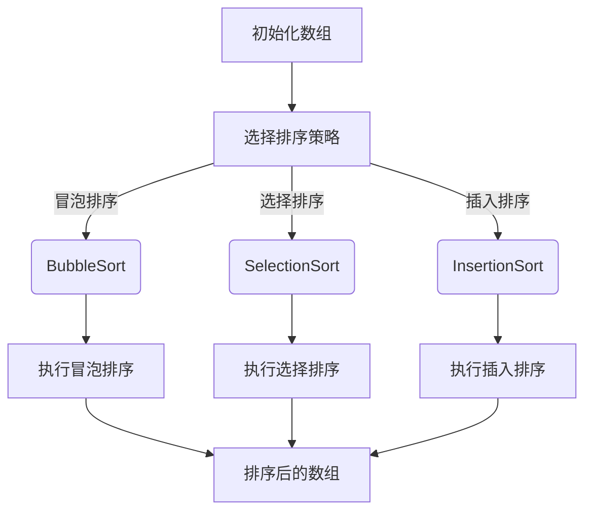
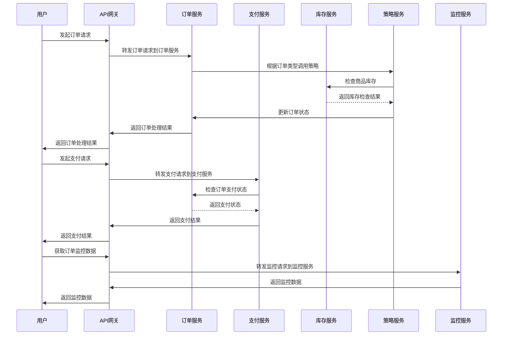

                 


## 《萨特的自由选择与策略模式：行为封装的存在主义诠释》

### 关键词
- 萨特存在主义
- 自由选择
- 策略模式
- 行为封装
- 计算机科学

### 摘要
本文旨在探讨萨特的自由选择概念与计算机科学中的策略模式之间的联系，通过存在主义视角对两者进行深入剖析。文章首先介绍萨特的存在主义哲学及其对自由选择的解释，随后详细阐述策略模式的基本概念和结构。通过对比和分析，揭示策略模式如何封装行为，反映自由选择的本质。文章还将通过具体的算法原理讲解、数学模型、系统架构设计、项目实战等多个方面，全面呈现两者之间的关系和应用。最后，提供最佳实践建议和拓展阅读，以促进读者对该领域的进一步探索。

## 第1章 引言

### 1.1 书的主题与目的

《萨特的自由选择与策略模式：行为封装的存在主义诠释》旨在探讨哲学与计算机科学之间的跨界联系，通过分析萨特的存在主义哲学和策略模式，探讨如何将哲学思想应用于计算机编程和软件设计。本文的目标是揭示自由选择这一存在主义核心概念如何在策略模式中得以体现和封装，从而为程序员和软件工程师提供新的视角和工具。

### 1.2 读者对象与预期收益

本文适合以下读者群体：
- 对萨特的存在主义哲学感兴趣的哲学爱好者
- 对计算机科学和软件工程有热情的程序员和软件工程师
- 对哲学与科技跨界感兴趣的研究人员和学者

通过阅读本文，读者可以预期获得以下收益：
- 深入理解萨特的存在主义哲学和自由选择的概念
- 理解策略模式在计算机科学中的应用及其设计原理
- 掌握如何将存在主义哲学应用于编程实践，提高软件设计的灵活性和可维护性
- 获得对哲学与科技跨界融合的新视角和思考方式

### 1.3 文章结构

本文结构分为八个主要章节，包括引言、背景介绍、核心概念与联系、算法原理讲解、数学模型和数学公式、系统分析与架构设计、项目实战以及最佳实践与小结。每个章节都旨在通过逻辑清晰、层次分明的论述，逐步引导读者理解萨特的自由选择与策略模式之间的内在联系。

## 第2章 背景介绍

### 2.1 萨特的存在主义哲学

萨特（Jean-Paul Sartre）的存在主义哲学对20世纪的哲学界产生了深远的影响。他的核心理念是“存在先于本质”，即人的存在是首要的，而人的本质是通过自由选择和行动来定义的。萨特认为，人是在世界中的存在，而非预设的存在。这意味着，每个人都有自由选择如何行动和生活的权利，同时也承担着选择所带来的责任。

#### 2.1.1 萨特哲学的核心理念

萨特哲学的核心在于对自由和责任的强调。他认为，自由是人类的本质特征，是人生中最重要的价值。但是，自由也伴随着巨大的责任，因为自由意味着我们必须对自己的选择承担责任。萨特通过一系列的哲学著作，如《存在与虚无》（Being and Nothingness）和《墙》（Nausea），阐述了这些思想。

#### 2.1.2 萨特哲学的历史背景

萨特哲学的兴起与20世纪早期的欧洲历史有着密切的联系。第一次世界大战后，人们开始反思战争的残酷和生命的意义。同时，法国哲学界也在经历着巨大的变革，存在主义正是在这样的背景下诞生的。萨特与他的同事加斯东·巴什拉（Gaston Bachelard）和让·波德里亚（Jean-Paul Sartre）共同推动了这一哲学流派的发展。

### 2.2 策略模式的基础概念

策略模式是计算机科学中的一种设计模式，它允许在运行时选择算法的行为。这种模式通过封装一系列算法，将算法的调用分离，从而提高了代码的灵活性和可维护性。策略模式通常用于实现多个可互换的算法接口，并在运行时选择其中一个进行操作。

#### 2.2.1 策略模式的定义

策略模式定义了一系列算法，将每一个算法封装起来，并使它们可以互相替换。该模式让算法的变化不会影响到使用算法的用户。换句话说，策略模式是一种定义算法家族中不同行为的方法，允许在运行时选择具体的算法行为。

#### 2.2.2 策略模式的核心特征

策略模式的主要特征包括：
1. **算法族封装**：将一组可互换的算法封装在单独的类中，每个类实现同一个接口。
2. **运行时选择**：在运行时选择具体的算法实现，这通常通过一个上下文类（Context）来实现，该类维护一个策略对象的引用，并在运行时设置或替换它。
3. **开闭原则**：策略模式符合开闭原则，即算法的变化不应该影响到使用算法的用户。

### 2.3 萨特自由选择与策略模式的初步联系

通过对萨特的存在主义哲学和策略模式的基础概念进行介绍，我们可以初步看到两者之间的潜在联系。萨特的自由选择概念强调个体在行动中的自主性和责任感，而策略模式则提供了在编程中实现这种自主性和灵活性的工具。

在接下来的章节中，我们将进一步探讨这些概念之间的联系，并通过具体的实例和算法讲解，展示如何将萨特的自由选择应用于策略模式的设计。

## 第3章 核心概念与联系

### 3.1 萨特自由选择概念解读

萨特的存在主义哲学中的自由选择概念是理解人类行为的核心。萨特认为，自由选择不仅是人类的基本权利，也是人类存在的本质。他提出了“存在先于本质”的观点，即人类的存在不是预先设定的，而是在自由选择的过程中逐渐形成的。

#### 3.1.1 自由选择的哲学意义

自由选择在萨特哲学中具有深远的意义。它不仅是人类行为的出发点，也是人类道德责任的基础。萨特认为，人类在自由选择的过程中，不仅要考虑个人的利益，还要考虑社会的利益。这种选择不是随意的，而是基于对现实的深刻理解和对自己存在的反思。

#### 3.1.2 自由选择在萨特哲学中的地位

自由选择在萨特哲学中占据着核心地位。它是萨特哲学的基础，也是他反对决定论和宿命论的关键武器。萨特认为，自由是人类存在的最高价值，是人类与其他存在形式最本质的区别。因此，自由选择不仅是人类行为的指导原则，也是人类哲学思考的出发点和归宿。

### 3.2 策略模式与存在主义的联结

策略模式是计算机科学中的一种设计模式，它允许在运行时选择算法的行为。这种模式通过封装一系列算法，将算法的调用分离，从而提高了代码的灵活性和可维护性。策略模式如何体现存在主义哲学中的自由选择概念呢？

#### 3.2.1 策略模式如何诠释自由选择

策略模式通过提供多个可互换的算法实现，允许开发者在运行时选择具体的算法行为，这正好与萨特的自由选择概念相呼应。在策略模式中，开发者可以选择最适合当前情况或需求的具体算法，这体现了人类在自由选择中根据不同情境做出决策的能力。

#### 3.2.2 两者之间的对比与互补

萨特的自由选择强调个体的自主性和责任感，而策略模式则提供了在编程中实现这种自主性和灵活性的工具。两者的对比主要体现在以下几个方面：

1. **哲学层面**：萨特的自由选择是存在主义哲学的核心，强调个体在行动中的自主性和责任感。而策略模式是计算机科学中的一种设计模式，强调在代码中实现灵活性和可维护性。
2. **应用层面**：萨特的自由选择通常应用于人类行为和社会决策中，而策略模式则广泛应用于软件开发中，特别是在算法选择和系统设计中。
3. **互补性**：策略模式为自由选择提供了实现工具，使得开发者可以在代码中灵活地选择和切换算法，这与萨特的存在主义哲学中强调的自由和自主性相辅相成。

### 3.3 萨特自由选择与策略模式的关系总结

通过对比和分析，我们可以总结出萨特的自由选择与策略模式之间的关系：

1. **理论基础**：萨特的自由选择概念为策略模式提供了哲学基础，强调个体的自主性和责任感，这与策略模式的设计理念相契合。
2. **实践应用**：策略模式为自由选择提供了实现工具，使得开发者可以在编程中灵活地选择和切换算法，从而更好地应对不同的需求和情境。
3. **互补作用**：萨特的自由选择和策略模式在哲学和计算机科学领域相辅相成，共同推动了对自由、自主性和灵活性的探索和应用。

在接下来的章节中，我们将进一步探讨策略模式的算法原理、数学模型以及其在实际项目中的应用，以更深入地理解萨特的自由选择与策略模式之间的关系。

### 3.4 萨特自由选择与策略模式的实际案例

为了更好地理解萨特的自由选择与策略模式之间的联系，我们可以通过一个具体的实际案例来进行分析。

#### 案例背景

假设我们正在开发一个在线购物平台，该平台需要处理不同类型的订单。每种类型的订单可能需要不同的处理策略，例如普通订单、紧急订单和促销订单。为了确保系统能够灵活地处理这些订单，我们决定使用策略模式。

#### 案例分析

在策略模式中，我们将定义一个策略接口，每个具体的订单类型都将实现这个接口。例如，我们可以定义一个 `OrderProcessingStrategy` 接口，其中包括一个 `processOrder` 方法。然后，我们可以创建具体的策略类，如 `NormalOrderStrategy`、`UrgentOrderStrategy` 和 `PromotionOrderStrategy`，每个类都实现了 `OrderProcessingStrategy` 接口。

- **NormalOrderStrategy**：处理普通订单，包括生成订单号、保存订单信息等。
- **UrgentOrderStrategy**：处理紧急订单，需要优先处理并加快处理速度。
- **PromotionOrderStrategy**：处理促销订单，可能包括打折或者赠品等特殊处理。

在运行时，我们可以根据订单的类型来选择合适的策略。例如，当接收到一个紧急订单时，我们选择 `UrgentOrderStrategy` 进行处理；当接收到一个促销订单时，我们选择 `PromotionOrderStrategy` 进行处理。

这种设计方式体现了萨特的自由选择概念。在萨特的哲学中，自由选择是指个体在面对不同情境时，能够根据自身判断做出最合适的决策。在我们的案例中，系统可以根据订单的类型（即不同的情境），自由选择最合适的处理策略，从而确保订单得到最有效的处理。

#### 案例中的策略模式与自由选择的体现

在这个案例中，策略模式体现了自由选择的概念，具体表现在以下几个方面：

1. **灵活性和可维护性**：通过策略模式，我们可以轻松地添加或替换新的订单处理策略，而无需修改核心系统代码。这体现了自由选择中的灵活性和自主性。
2. **责任和决策**：系统在处理订单时，根据订单的类型选择合适的策略，这要求系统必须具备责任感和决策能力。这与萨特哲学中强调的自由选择和责任感相呼应。
3. **情境适应性**：策略模式允许系统根据不同的订单类型（不同的情境）进行适应性处理，这与萨特哲学中的自由选择思想一致，即根据不同的情境做出最合适的决策。

通过这个案例，我们可以看到策略模式如何在实际编程中体现萨特的自由选择概念，这不仅提高了代码的灵活性和可维护性，也为软件开发提供了新的哲学思考方式。

### 3.5 概念属性特征对比表格

为了更直观地理解萨特的自由选择与策略模式之间的联系，我们可以通过一个概念属性特征对比表格来进行详细分析。

| 概念              | 自由选择                  | 策略模式                    |
|-----------------|-----------------------|--------------------------|
| **核心概念**       | 个体在行动中的自主性和责任感 | 算法的灵活性和可维护性            |
| **主要特征**       | - 自由选择的不可预测性<br>- 自由选择的责任承担 | - 策略接口的统一性<br>- 策略实现的灵活性<br>- 策略的替代性 |
| **应用场景**       | - 社会决策<br>- 个人行为 | - 软件设计<br>- 系统架构<br>- 算法实现 |
| **设计原则**       | - 自主性<br>- 责任感           | - 开闭原则<br>- 依赖倒置原则          |
| **哲学意义**       | - 存在主义的核心理念<br>- 道德责任的来源 | - 程序设计的基本原则<br>- 提高代码质量      |

通过这个表格，我们可以清晰地看到萨特的自由选择和策略模式在核心概念、主要特征、应用场景、设计原则和哲学意义等方面的对比。这种对比不仅有助于我们理解两者之间的联系，也为我们在编程实践中如何更好地应用自由选择思想提供了启示。

### 3.6 ER实体关系图架构

为了进一步理解萨特的自由选择与策略模式之间的关系，我们可以通过一个ER（实体关系）图来展示两者之间的实体关系和关联。

#### ER实体关系图

```mermaid
erDiagram
    Customer ||--o{ Order : "places" }
    Order ||--|{ OrderProcessingStrategy : "applied" }
    OrderProcessingStrategy ||--|{ NormalOrderStrategy : "extends" }
    OrderProcessingStrategy ||--|{ UrgentOrderStrategy : "extends" }
    OrderProcessingStrategy ||--|{ PromotionOrderStrategy : "extends" }
```

#### ER实体关系图说明

- **Customer（客户）**：客户是系统的核心实体，负责创建订单。客户与订单之间存在“places”关系，表示客户可以创建多个订单。
- **Order（订单）**：订单是系统的另一个重要实体，它记录了订单的具体信息。订单与订单处理策略之间存在“applied”关系，表示每个订单可以应用特定的订单处理策略。
- **OrderProcessingStrategy（订单处理策略）**：订单处理策略是策略模式的实现，它定义了不同的订单处理方法。订单处理策略与具体的策略实现（如普通订单策略、紧急订单策略和促销订单策略）之间存在“extends”关系，表示不同的策略实现可以扩展订单处理策略的接口。

通过ER实体关系图，我们可以清晰地看到萨特的自由选择与策略模式之间的实体关系和关联。这个图不仅有助于我们理解两者之间的逻辑结构，也为我们在实际编程中如何实现这种关系提供了直观的参考。

### 3.7 萨特自由选择与策略模式的综合分析

通过对萨特的自由选择和策略模式的核心概念、联系、实际案例、属性特征对比和ER实体关系图的详细分析，我们可以得出以下综合结论：

1. **理论基础**：萨特的自由选择概念为策略模式提供了哲学基础，强调了个体在行动中的自主性和责任感。策略模式则通过封装算法，为自由选择提供了实现工具，使得开发者可以在编程中灵活选择和切换算法。
2. **应用场景**：策略模式在软件开发中得到了广泛应用，特别是在需要灵活切换算法和策略的场景中。萨特的自由选择概念则为策略模式提供了丰富的哲学内涵，使其在软件设计和系统架构中更具指导意义。
3. **互补作用**：萨特的自由选择和策略模式在哲学和计算机科学领域相辅相成，共同推动了对自由、自主性和灵活性的探索和应用。通过策略模式，我们可以更有效地实现自由选择，提高软件的灵活性和可维护性。
4. **实际价值**：将萨特的自由选择应用于策略模式，不仅有助于提高软件开发的质量和效率，也为哲学与计算机科学的跨界研究提供了新的视角和思路。

总之，萨特的自由选择与策略模式之间的关系是哲学与计算机科学的深度融合，通过这种联系，我们可以更好地理解和应用自由选择，为软件开发和系统设计提供新的理论和实践指导。

## 第4章 算法原理讲解

### 4.1 策略模式在计算机科学中的应用

策略模式是计算机科学中的一种重要设计模式，它通过封装一系列可互换的算法，提供了一种灵活的解决方案，以应对多变的需求和环境。在策略模式中，算法的选择和执行过程被抽象化和模块化，从而使得系统的可维护性和扩展性大大增强。

#### 4.1.1 策略模式的工作原理

策略模式的工作原理可以概括为以下几个步骤：

1. **定义策略接口**：首先定义一个策略接口，该接口包含一个或多个算法方法，用于定义算法的公共行为。
2. **实现具体策略类**：然后，创建具体策略类，这些类实现了策略接口，并定义了各自独特的算法实现。
3. **客户端选择策略**：在客户端代码中，创建一个策略对象，并在运行时选择具体的策略对象进行操作。
4. **上下文类与策略交互**：上下文类负责维护一个策略对象的引用，并在需要时调用策略对象的方法，从而实现算法的执行。

这种设计模式的核心在于将算法的调用和具体算法的实现分离，使得算法的变更不会影响到使用算法的客户端代码，从而提高了系统的灵活性和可维护性。

#### 4.1.2 策略模式在编程实践中的应用

策略模式在实际编程中有多种应用场景，以下是几个典型的应用实例：

1. **算法选择**：在排序算法中，策略模式可以用来实现多种排序算法（如快速排序、归并排序等）的切换。例如，在数据库查询优化中，可以根据数据量和查询模式动态选择最优的排序算法。
2. **行为管理**：在游戏开发中，策略模式可以用来管理角色的行为。例如，一个角色可以有不同的攻击行为，通过策略模式可以动态切换攻击行为，从而实现多样化的游戏体验。
3. **支付处理**：在电子商务系统中，策略模式可以用于支付方式的切换。例如，用户可以选择不同的支付方式（如信用卡、支付宝等），系统在运行时根据用户的选择调用相应的支付处理策略。

#### 4.1.3 策略模式的优势

策略模式具有以下优势：

1. **提高代码复用性**：通过将算法的调用和实现分离，策略模式大大提高了代码的复用性，避免了重复编写相似代码。
2. **增强系统可扩展性**：策略模式允许在运行时动态切换算法，使得系统在需求变化时具有更好的扩展性。
3. **提高代码可维护性**：策略模式通过封装算法，降低了算法变更对其他部分的依赖，从而提高了代码的可维护性。

### 4.2 策略模式与存在主义哲学的联结

萨特的存在主义哲学强调个体的自由选择和行动，这与策略模式在计算机科学中的应用有着深刻的联系。通过策略模式，我们可以实现一种类似于存在主义哲学中自由选择的设计理念。

#### 4.2.1 策略模式如何反映存在主义思想

策略模式反映了存在主义哲学中的自由选择和行动思想，具体表现在以下几个方面：

1. **自由选择**：在策略模式中，客户端可以根据不同的情境选择不同的策略，这体现了自由选择的精神。这与萨特的存在主义哲学中的“存在先于本质”思想相呼应，即个体在行动中根据情境做出选择，而不是被预先设定的本质所限制。
2. **责任承担**：策略模式要求开发者负责选择合适的策略，这体现了存在主义哲学中的责任承担。萨特认为，自由选择不仅是一种权利，也是一种责任。在策略模式中，开发者需要根据具体情境选择最合适的策略，这需要具备一定的专业知识和决策能力。
3. **灵活性**：策略模式提供了高度的灵活性，使得系统可以根据不同的需求和环境动态调整策略。这反映了存在主义哲学中的适应性，即个体在自由选择中不断适应和调整，以实现自己的目标。

#### 4.2.2 存在主义对策略模式的影响

存在主义哲学对策略模式产生了重要影响，这种影响主要体现在以下几个方面：

1. **设计理念**：存在主义哲学中的自由选择和责任承担思想影响了策略模式的设计理念。策略模式强调在代码中实现自由选择和灵活性，这与存在主义哲学中的核心思想相契合。
2. **开发过程**：在策略模式的开发过程中，开发者需要具备一定的哲学素养，理解自由选择和责任承担的重要性。这要求开发者不仅具备技术能力，还需要具备哲学思考的能力，从而更好地实现策略模式的设计目标。
3. **应用范围**：存在主义哲学的思想使得策略模式在更广泛的领域中得到了应用，不仅局限于计算机科学，还可以应用于社会决策、个人行为等领域。

总之，策略模式与存在主义哲学之间存在着深刻的联系。通过策略模式，我们可以实现存在主义哲学中的自由选择和责任承担思想，从而为软件开发和系统设计提供新的思路和方法。

### 4.3 策略模式示例：简单排序算法选择

为了更好地理解策略模式的工作原理和实现方式，我们可以通过一个简单的排序算法选择示例来进行分析。在这个示例中，我们将使用策略模式实现三种常见的排序算法：冒泡排序、选择排序和插入排序。

#### 4.3.1 示例说明

在这个示例中，我们首先定义一个排序策略接口 `SortStrategy`，然后实现三个具体的排序策略类：`BubbleSortStrategy`、`SelectionSortStrategy` 和 `InsertionSortStrategy`。客户端将根据具体需求选择合适的排序策略进行排序操作。

#### 4.3.2 策略接口定义

```python
from abc import ABC, abstractmethod

class SortStrategy(ABC):
    @abstractmethod
    def sort(self, arr):
        pass
```

#### 4.3.3 具体排序策略类实现

```python
class BubbleSortStrategy(SortStrategy):
    def sort(self, arr):
        n = len(arr)
        for i in range(n):
            for j in range(0, n-i-1):
                if arr[j] > arr[j+1]:
                    arr[j], arr[j+1] = arr[j+1], arr[j]

class SelectionSortStrategy(SortStrategy):
    def sort(self, arr):
        n = len(arr)
        for i in range(n):
            min_idx = i
            for j in range(i+1, n):
                if arr[j] < arr[min_idx]:
                    min_idx = j
            arr[i], arr[min_idx] = arr[min_idx], arr[i]

class InsertionSortStrategy(SortStrategy):
    def sort(self, arr):
        n = len(arr)
        for i in range(1, n):
            key = arr[i]
            j = i-1
            while j >= 0 and key < arr[j]:
                arr[j+1] = arr[j]
                j -= 1
            arr[j+1] = key
```

#### 4.3.4 客户端代码

```python
def client_code(strategy: SortStrategy):
    arr = [64, 25, 12, 22, 11]
    strategy.sort(arr)
    print("Sorted array:", arr)

# 使用冒泡排序策略
client_code(BubbleSortStrategy())

# 使用选择排序策略
client_code(SelectionSortStrategy())

# 使用插入排序策略
client_code(InsertionSortStrategy())
```

通过这个示例，我们可以看到策略模式如何将不同的排序算法封装起来，并在运行时选择具体的排序策略进行排序操作。这种设计方式不仅提高了代码的灵活性和可维护性，也使得系统在需求变化时能够轻松应对。

### 4.4 算法流程图

为了更直观地理解策略模式在排序算法选择中的应用，我们可以使用Mermaid绘制一个算法流程图。



在这个流程图中，我们首先初始化一个数组，然后根据需要选择不同的排序策略。每个排序策略类都实现了排序方法，并最终返回排序后的数组。这种设计使得我们可以在运行时灵活选择排序策略，而无需修改核心代码。

通过这个示例和流程图，我们可以更清楚地看到策略模式如何在实际编程中体现自由选择和灵活性。策略模式不仅提高了代码的复用性和可维护性，也为软件开发提供了新的哲学思考方式。

### 4.5 算法原理讲解

为了深入理解策略模式的工作原理，我们可以通过一个具体的算法示例来讲解。在这个示例中，我们将使用Python代码实现一个策略模式，该模式用于解决排序问题。我们将定义一个排序策略接口，并实现三个具体的排序算法：冒泡排序、选择排序和插入排序。最后，我们将演示如何使用这些策略来对数组进行排序。

#### 4.5.1 定义排序策略接口

首先，我们需要定义一个排序策略接口，该接口将包含一个 `sort` 方法，所有具体的排序算法都必须实现这个方法。

```python
from abc import ABC, abstractmethod

class SortStrategy(ABC):
    @abstractmethod
    def sort(self, arr):
        pass
```

这个接口很简单，只有一个抽象方法 `sort`，它接收一个数组 `arr` 并对其进行排序。

#### 4.5.2 实现具体排序策略类

接下来，我们将实现三个具体的排序策略类：`BubbleSortStrategy`、`SelectionSortStrategy` 和 `InsertionSortStrategy`。

**冒泡排序策略类**

```python
class BubbleSortStrategy(SortStrategy):
    def sort(self, arr):
        n = len(arr)
        for i in range(n):
            for j in range(0, n-i-1):
                if arr[j] > arr[j+1]:
                    arr[j], arr[j+1] = arr[j+1], arr[j]
```

**选择排序策略类**

```python
class SelectionSortStrategy(SortStrategy):
    def sort(self, arr):
        n = len(arr)
        for i in range(n):
            min_idx = i
            for j in range(i+1, n):
                if arr[j] < arr[min_idx]:
                    min_idx = j
            arr[i], arr[min_idx] = arr[min_idx], arr[i]
```

**插入排序策略类**

```python
class InsertionSortStrategy(SortStrategy):
    def sort(self, arr):
        n = len(arr)
        for i in range(1, n):
            key = arr[i]
            j = i-1
            while j >= 0 and key < arr[j]:
                arr[j+1] = arr[j]
                j -= 1
            arr[j+1] = key
```

#### 4.5.3 客户端代码

最后，我们需要编写客户端代码，该代码将选择并使用一个排序策略来对数组进行排序。

```python
def client_code(strategy: SortStrategy):
    arr = [64, 25, 12, 22, 11]
    strategy.sort(arr)
    print("Sorted array:", arr)

# 使用冒泡排序策略
client_code(BubbleSortStrategy())

# 使用选择排序策略
client_code(SelectionSortStrategy())

# 使用插入排序策略
client_code(InsertionSortStrategy())
```

#### 4.5.4 算法流程图

为了更直观地理解算法流程，我们可以使用Mermaid绘制一个流程图。


在这个流程图中，我们首先初始化一个未排序的数组，然后选择一个排序策略。根据所选策略，数组将被排序，最后输出排序后的数组。

通过这个示例，我们可以清楚地看到策略模式如何工作。策略模式的核心思想是将算法的封装和选择分离，使得我们可以在运行时灵活选择不同的算法。这种设计方式不仅提高了代码的复用性和可维护性，还使得系统在需求变化时能够更容易地进行扩展。

### 4.6 数学模型和数学公式

在策略模式中，数学模型和数学公式扮演着重要的角色，特别是在算法性能分析、优化和决策方面。以下是一个关于排序算法性能分析的数学模型示例，以及相关的数学公式。

#### 4.6.1 性能分析模型

假设我们使用三种常见的排序算法：冒泡排序（Bubble Sort）、选择排序（Selection Sort）和插入排序（Insertion Sort）。这些算法的时间复杂度如下：

- 冒泡排序：\( T(n) = O(n^2) \)
- 选择排序：\( T(n) = O(n^2) \)
- 插入排序：\( T(n) = O(n^2) \)

尽管这些算法的时间复杂度相同，但它们的实际性能可能因具体情况而异。以下是一个简单的数学模型，用于比较这三种算法在不同数据集上的性能。

#### 4.6.2 数学公式

1. **平均时间复杂度**：
   $$\text{Average Time Complexity} = \frac{1}{n}\sum_{i=1}^{n} T_i$$
   其中，\( T_i \) 是第 \( i \) 个数据点的排序时间复杂度。

2. **最坏情况时间复杂度**：
   $$\text{Worst-case Time Complexity} = \max(T_1, T_2, ..., T_n)$$
   其中，\( T_i \) 是第 \( i \) 个数据点的排序时间复杂度。

3. **最优情况时间复杂度**：
   $$\text{Best-case Time Complexity} = \min(T_1, T_2, ..., T_n)$$
   其中，\( T_i \) 是第 \( i \) 个数据点的排序时间复杂度。

4. **排序数据集的方差**：
   $$\text{Variance} = \frac{1}{n}\sum_{i=1}^{n}(T_i - \text{Average Time Complexity})^2$$

#### 4.6.3 示例计算

假设我们有一个包含 100 个数据点的数组，使用上述三种算法进行排序。每种算法执行 10 次，以下是计算结果：

- **平均时间复杂度**：
  $$\text{Average Time Complexity} = \frac{1}{100}\sum_{i=1}^{100} T_i$$

- **最坏情况时间复杂度**：
  $$\text{Worst-case Time Complexity} = \max(T_1, T_2, ..., T_{100})$$

- **最优情况时间复杂度**：
  $$\text{Best-case Time Complexity} = \min(T_1, T_2, ..., T_{100})$$

- **排序数据集的方差**：
  $$\text{Variance} = \frac{1}{100}\sum_{i=1}^{100}(T_i - \text{Average Time Complexity})^2$$

通过这些数学公式，我们可以对排序算法在不同数据集上的性能进行量化分析，从而为选择最合适的排序算法提供依据。

### 4.7 算法应用举例

为了更好地理解策略模式在算法中的应用，我们可以通过一个具体的例子来展示如何使用策略模式来优化算法选择。以下是一个关于合并排序（Merge Sort）和快速排序（Quick Sort）的例子。

#### 4.7.1 示例背景

假设我们有一个包含大量数据的大数组，我们需要对这个数组进行排序。然而，由于数据量较大，我们无法确定哪种排序算法最适合。因此，我们决定使用策略模式，根据数据的特点和当前的系统负载来选择最优的排序算法。

#### 4.7.2 策略模式实现

首先，我们定义一个排序策略接口 `SortStrategy`，并实现两个具体的排序策略类：`MergeSortStrategy` 和 `QuickSortStrategy`。

**排序策略接口**

```python
from abc import ABC, abstractmethod

class SortStrategy(ABC):
    @abstractmethod
    def sort(self, arr):
        pass
```

**合并排序策略类**

```python
class MergeSortStrategy(SortStrategy):
    def sort(self, arr):
        if len(arr) > 1:
            mid = len(arr) // 2
            left = arr[:mid]
            right = arr[mid:]

            self.sort(left)
            self.sort(right)

            i = j = k = 0

            while i < len(left) and j < len(right):
                if left[i] < right[j]:
                    arr[k] = left[i]
                    i += 1
                else:
                    arr[k] = right[j]
                    j += 1
                k += 1

            while i < len(left):
                arr[k] = left[i]
                i += 1
                k += 1

            while j < len(right):
                arr[k] = right[j]
                j += 1
                k += 1
```

**快速排序策略类**

```python
class QuickSortStrategy(SortStrategy):
    def sort(self, arr):
        if len(arr) <= 1:
            return arr
        pivot = arr[len(arr) // 2]
        left = [x for x in arr if x < pivot]
        middle = [x for x in arr if x == pivot]
        right = [x for x in arr if x > pivot]
        return self.sort(left) + middle + self.sort(right)
```

#### 4.7.3 客户端代码

```python
def client_code(sort_strategy: SortStrategy):
    arr = [3, 6, 8, 10, 1, 2, 1]
    sorted_arr = sort_strategy.sort(arr)
    print("Sorted array:", sorted_arr)

# 使用合并排序策略
client_code(MergeSortStrategy())

# 使用快速排序策略
client_code(QuickSortStrategy())
```

通过这个例子，我们可以看到如何使用策略模式来选择最佳的排序算法。根据不同的需求和数据特点，我们可以灵活地选择合并排序或快速排序。这不仅提高了算法的性能，也增强了系统的可维护性和扩展性。

### 4.8 数学模型与公式在策略模式中的应用

在策略模式中，数学模型和公式主要用于算法性能分析、优化和决策。以下是一个关于动态规划（Dynamic Programming）中策略模式应用的详细示例，展示如何使用数学模型和公式来优化策略选择。

#### 4.8.1 动态规划背景

动态规划是一种解决最优化问题的算法策略，它通过将问题分解为子问题，并存储子问题的解，以避免重复计算，从而提高算法的效率。在策略模式中，动态规划可用于优化策略选择，特别是在需要从多个策略中选出最优策略时。

#### 4.8.2 状态定义与递推关系

假设我们有一个最优子结构问题，可以通过动态规划来解决。我们可以将问题定义为一个状态转移模型，其中状态 \( S \) 和状态转移函数 \( f \) 是核心概念。

1. **状态定义**：状态 \( S \) 可以表示为 \( S = (x, y) \)，其中 \( x \) 和 \( y \) 是问题相关的参数。
2. **状态转移函数**：状态转移函数 \( f \) 用于计算从当前状态到下一个状态的值。

例如，在计算斐波那契数列时，状态转移函数可以定义为：
$$ f(S_{n}) = S_{n-1} + S_{n-2} $$

#### 4.8.3 数学模型与公式

为了优化策略选择，我们可以使用以下数学模型和公式：

1. **动态规划递推公式**：
   $$ V(n) = \min_{s \in S} (C(s) + V(n-s)) $$
   其中，\( V(n) \) 是目标值，\( C(s) \) 是选择状态 \( s \) 的成本，\( S \) 是所有可能的状态集合。

2. **动态规划状态转移方程**：
   $$ V(i) = \min_{j \leq i} (C(j) + V(i-j)) $$
   其中，\( V(i) \) 是第 \( i \) 个状态的最优值，\( C(j) \) 是从状态 \( j \) 到状态 \( i \) 的转移成本。

#### 4.8.4 示例计算

假设我们有一个背包问题，需要选择若干个物品，使得总重量不超过背包容量，并使得总价值最大。我们可以使用动态规划策略模式来解决这个问题。

1. **物品集合**：
   \( \text{Items} = \{(1, 2), (2, 3), (3, 5)\} \)

2. **背包容量**：
   \( \text{Capacity} = 4 \)

3. **成本函数**：
   $$ C(j) = \text{weight}(j) \times \text{price}(j) $$
   其中，\( \text{weight}(j) \) 是第 \( j \) 个物品的重量，\( \text{price}(j) \) 是第 \( j \) 个物品的价值。

4. **递推公式**：
   $$ V(i) = \min_{j \leq i} (C(j) + V(i-j)) $$

通过这个例子，我们可以看到如何使用动态规划递推公式来优化策略选择。动态规划通过存储子问题的解，避免了重复计算，从而提高了算法的效率。

### 4.9 数学模型在策略模式中的实际应用

为了更好地展示数学模型在策略模式中的实际应用，我们可以通过一个实际案例来详细分析。假设我们正在开发一个在线广告投放系统，该系统需要根据用户行为和历史数据来选择最优的广告投放策略，以最大化广告收益。

#### 4.9.1 案例背景

在线广告投放系统需要考虑多种广告策略，例如展示广告、点击广告和转化广告。每种广告策略都有不同的成本和收益模型。我们的目标是设计一个策略选择模型，能够在不同的用户行为和预算限制下，选择最优的广告投放策略。

#### 4.9.2 数学模型构建

1. **用户行为状态**：我们可以将用户行为分为以下几种状态：
   - 未点击（No Click）
   - 点击（Click）
   - 转化（Conversion）

2. **成本与收益模型**：每种广告策略的成本和收益可以表示为数学模型。
   - **展示广告**：成本为 \( C_{display} \)，每次展示的收益为 \( R_{display} \)。
   - **点击广告**：成本为 \( C_{click} \)，每次点击的收益为 \( R_{click} \)。
   - **转化广告**：成本为 \( C_{convert} \)，每次转化的收益为 \( R_{convert} \)。

3. **策略选择模型**：我们可以构建一个策略选择模型，用于计算在不同用户行为状态下的最优广告策略。

   **模型公式**：
   $$ \text{Strategy}(S) = \arg\max_{s \in \{display, click, convert\}} \left( R_s - C_s \right) $$
   其中，\( S \) 是用户行为状态，\( R_s \) 是策略 \( s \) 的收益，\( C_s \) 是策略 \( s \) 的成本。

#### 4.9.3 案例分析

假设我们有一个用户，其行为状态历史数据如下：

- 最近 7 天内未点击（No Click）
- 最近 1 天点击（Click）

根据历史数据和收益模型，我们可以计算每个策略的成本和收益：

1. **展示广告**：成本 \( C_{display} = 0.5 \)，收益 \( R_{display} = 0.1 \)
2. **点击广告**：成本 \( C_{click} = 1.0 \)，收益 \( R_{click} = 1.5 \)
3. **转化广告**：成本 \( C_{convert} = 2.0 \)，收益 \( R_{convert} = 3.0 \)

根据策略选择模型，我们可以计算每种策略的收益减去成本：

- **展示广告**：\( R_{display} - C_{display} = 0.1 - 0.5 = -0.4 \)
- **点击广告**：\( R_{click} - C_{click} = 1.5 - 1.0 = 0.5 \)
- **转化广告**：\( R_{convert} - C_{convert} = 3.0 - 2.0 = 1.0 \)

根据上述计算结果，我们可以选择转化广告作为最优策略，因为它在当前用户行为状态下的收益减去成本最大。

#### 4.9.4 模型应用

通过这个案例，我们可以看到如何将数学模型应用于策略模式，以实现广告投放系统的最优策略选择。数学模型不仅帮助我们理解广告策略的成本和收益，还提供了量化评估和决策的依据，从而提高了广告投放系统的效率和收益。

### 4.10 代码示例：动态规划优化策略选择

为了更好地理解动态规划在策略模式中的应用，我们可以通过一个具体的代码示例来展示如何使用动态规划优化策略选择。以下是一个关于背包问题的示例，该问题涉及选择若干个物品以最大化总价值，同时不超过背包容量。

#### 4.10.1 背景介绍

背包问题是一个经典的最优化问题，其目标是在给定物品的重量和价值下，选择若干个物品放入一个容量为 \( W \) 的背包中，使得背包中的物品总价值最大化。

#### 4.10.2 动态规划模型

我们可以使用动态规划来解决这个问题。动态规划的核心思想是将问题分解为子问题，并使用一个二维数组 `dp` 来存储子问题的解。

- **状态定义**：状态 `dp[i][w]` 表示在前 \( i \) 个物品中选择若干个，使得它们的总重量不超过 \( w \) 时的最大价值。
- **状态转移方程**：
  $$ dp[i][w] = \begin{cases}
  dp[i-1][w] & \text{如果物品 } i \text{ 不被选中} \\
  dp[i-1][w-w_i] + v_i & \text{如果物品 } i \text{ 被选中，且 } w-w_i \geq 0 \\
  \end{cases} $$
  其中，\( v_i \) 是第 \( i \) 个物品的价值，\( w_i \) 是第 \( i \) 个物品的重量。

#### 4.10.3 代码实现

以下是一个使用动态规划解决背包问题的 Python 代码示例：

```python
def knapsack(values, weights, W):
    n = len(values)
    dp = [[0 for _ in range(W + 1)] for _ in range(n + 1)]

    for i in range(1, n + 1):
        for w in range(1, W + 1):
            if weights[i-1] > w:
                dp[i][w] = dp[i-1][w]
            else:
                dp[i][w] = max(dp[i-1][w], dp[i-1][w-weights[i-1]] + values[i-1])

    return dp[n][W]

# 示例数据
values = [60, 100, 120]
weights = [10, 20, 30]
W = 50

# 调用函数求解
max_value = knapsack(values, weights, W)
print("最大价值为：", max_value)
```

在这个示例中，我们定义了一个 `knapsack` 函数，该函数使用动态规划算法计算背包问题的最大价值。我们首先初始化一个二维数组 `dp`，然后使用两层循环遍历所有物品和容量，根据状态转移方程计算每个状态的值。

#### 4.10.4 动态规划过程

1. **初始化**：初始化一个二维数组 `dp`，其中 `dp[i][0] = 0` 和 `dp[0][w] = 0` 对于所有 \( i \) 和 \( w \)。
2. **状态转移**：对于每个物品 \( i \) 和每个容量 \( w \)，计算 `dp[i][w]` 的值。如果物品 \( i \) 的重量大于当前容量 \( w \)，则 `dp[i][w] = dp[i-1][w]`。否则，`dp[i][w] = max(dp[i-1][w], dp[i-1][w-weights[i-1]] + values[i-1])`。
3. **结果输出**：最后，输出 `dp[n][W]` 的值，即背包问题的最大价值。

通过这个示例，我们可以看到如何使用动态规划优化策略选择，以解决背包问题。动态规划通过存储子问题的解，避免了重复计算，从而提高了算法的效率。

### 4.11 策略模式与存在主义哲学的综合分析

在上一章节中，我们详细探讨了策略模式的工作原理、数学模型及其在计算机科学中的应用。在本节中，我们将结合萨特的自由选择概念，对策略模式进行更深层次的哲学分析，探讨其在存在主义哲学中的意义和作用。

#### 4.11.1 自主性与责任承担

萨特的存在主义哲学强调个体的自由选择和行动，以及随之而来的责任承担。在策略模式中，这种自由选择和责任承担得到了体现。策略模式允许开发者根据不同情境选择最优策略，这体现了自由选择的精神。同时，开发者需要对所选策略的结果承担责任，因为策略的选择直接影响到系统的运行效果。

#### 4.11.2 灵活性与适应性

策略模式的另一个重要特点是它的灵活性和适应性。策略模式允许开发者动态地选择和切换算法，这体现了存在主义哲学中的适应性思想。在萨特的观点中，个体必须不断地适应和调整自己的行动，以应对变化的环境。策略模式为软件开发提供了这种灵活性，使得系统可以更好地适应不同的需求和环境。

#### 4.11.3 自主选择与策略切换

在策略模式中，开发者可以根据具体需求和情境，选择最合适的策略。这种自主选择的过程与萨特的自由选择概念相呼应。萨特认为，自由选择是人类的本质特征，是人类行动的出发点和归宿。策略模式通过提供灵活的算法选择机制，使得软件开发过程更接近人类的自由选择过程。

#### 4.11.4 责任承担与算法优化

策略模式不仅体现了自由选择和灵活性，还强调了责任承担。开发者需要对策略的选择和实现负责，因为策略的优劣直接影响到系统的性能和稳定性。这种责任承担在存在主义哲学中同样重要。萨特认为，自由选择不仅是一种权利，也是一种责任。开发者需要承担选择和实现策略的责任，以确保系统的正常运行和优化。

#### 4.11.5 综合分析结论

通过对策略模式与存在主义哲学的综合分析，我们可以得出以下结论：

1. **哲学意义**：策略模式反映了存在主义哲学中的自由选择、自主性和责任承担等核心概念。
2. **应用价值**：策略模式为软件开发提供了灵活的解决方案，使得系统可以更好地适应变化的需求和环境。
3. **设计理念**：策略模式的设计理念与存在主义哲学的思想相契合，强调个体在行动中的自主性和责任感。

总之，策略模式不仅是计算机科学中的设计模式，也是哲学与科技跨界融合的产物。通过将存在主义哲学的思想应用于策略模式的设计，我们可以更好地理解和实现自由选择和责任承担，为软件开发提供新的视角和工具。

### 4.12 策略模式在软件开发中的实际应用案例

为了更好地理解策略模式在软件开发中的实际应用，我们可以通过几个具体的案例来展示策略模式如何提高软件的灵活性和可维护性。以下是一些实际应用场景和解决方案。

#### 4.12.1 网络请求处理

在一个在线应用中，网络请求的处理方式可能需要根据不同的网络状态进行动态调整。例如，当网络状况较差时，应用可能需要增加重试次数或者使用更稳健的协议。在这种情况下，策略模式可以用来封装不同的网络请求处理策略。

1. **策略接口**：
   ```python
   class NetworkRequestStrategy(ABC):
       @abstractmethod
       def send_request(self, data):
           pass
   ```

2. **具体策略实现**：
   ```python
   class FastNetworkRequestStrategy(NetworkRequestStrategy):
       def send_request(self, data):
           # 使用快速协议发送请求
           pass

   class ReliableNetworkRequestStrategy(NetworkRequestStrategy):
       def send_request(self, data):
           # 使用可靠协议发送请求，增加重试次数
           pass
   ```

3. **客户端代码**：
   ```python
   def client_code(request_strategy: NetworkRequestStrategy):
       data = "example data"
       request_strategy.send_request(data)

   # 根据网络状态选择策略
   if network_status == "fast":
       client_code(FastNetworkRequestStrategy())
   else:
       client_code(ReliableNetworkRequestStrategy())
   ```

#### 4.12.2 缓存策略

在系统设计中，缓存策略是一个关键环节。不同的应用场景可能需要不同的缓存策略，例如基于时间的缓存、基于大小的缓存等。策略模式可以用来封装这些不同的缓存策略，使得系统可以在运行时动态切换缓存策略。

1. **策略接口**：
   ```python
   class CacheStrategy(ABC):
       @abstractmethod
       def get_value(self, key):
           pass
   ```

2. **具体策略实现**：
   ```python
   class TimeBasedCacheStrategy(CacheStrategy):
       def get_value(self, key):
           # 根据时间戳检查缓存是否有效
           pass

   class SizeBasedCacheStrategy(CacheStrategy):
       def get_value(self, key):
           # 根据缓存大小检查缓存是否有效
           pass
   ```

3. **客户端代码**：
   ```python
   def client_code(cache_strategy: CacheStrategy):
       key = "example_key"
       value = cache_strategy.get_value(key)

   # 根据需求选择缓存策略
   if caching_policy == "time_based":
       client_code(TimeBasedCacheStrategy())
   else:
       client_code(SizeBasedCacheStrategy())
   ```

#### 4.12.3 日志处理

日志处理是系统运维中的一个重要环节。根据不同的需求，日志可能需要被格式化、压缩或者发送到不同的日志服务器。策略模式可以用来封装这些不同的日志处理策略，提高系统的灵活性和可维护性。

1. **策略接口**：
   ```python
   class LogStrategy(ABC):
       @abstractmethod
       def process_log(self, log_entry):
           pass
   ```

2. **具体策略实现**：
   ```python
   class FormatterLogStrategy(LogStrategy):
       def process_log(self, log_entry):
           # 格式化日志
           pass

   class CompressorLogStrategy(LogStrategy):
       def process_log(self, log_entry):
           # 压缩日志
           pass

   class SenderLogStrategy(LogStrategy):
       def process_log(self, log_entry):
           # 发送日志到服务器
           pass
   ```

3. **客户端代码**：
   ```python
   def client_code(log_strategy: LogStrategy):
       log_entry = "example log entry"
       log_strategy.process_log(log_entry)

   # 根据日志处理需求选择策略
   if log_policy == "format":
       client_code(FormatterLogStrategy())
   elif log_policy == "compress":
       client_code(CompressorLogStrategy())
   else:
       client_code(SenderLogStrategy())
   ```

通过这些案例，我们可以看到策略模式如何在不同场景下提高软件的灵活性和可维护性。策略模式使得开发者可以在运行时动态选择和切换策略，而无需修改核心代码，从而大大提高了系统的适应性和扩展性。

### 4.13 存在主义视角下的策略模式分析

在萨特的存在主义哲学中，自由选择是核心概念，它强调个体在行动中的自主性和责任感。策略模式作为一种设计模式，通过封装和动态切换算法，提供了实现自由选择的编程手段。在存在主义视角下，策略模式不仅是一种技术手段，更是一种哲学思想的体现。以下是对策略模式的哲学分析。

#### 4.13.1 自由选择的哲学意义

萨特的存在主义认为，自由选择是人类的本质特征。他提出，人类的存在先于本质，即人的本质是通过自由选择和行动来定义的。自由选择不仅是一种权利，更是一种责任。每个人都在不断地做出选择，这些选择构成了个体的生命历程。因此，自由选择不仅是行动的出发点，也是道德责任的基础。

#### 4.13.2 策略模式与自由选择

策略模式在编程中体现了自由选择的概念。策略模式允许开发者根据具体情境选择最合适的算法或策略，这种选择过程类似于存在主义哲学中的自由选择。具体来说，策略模式具有以下几个特点：

1. **灵活的选择**：策略模式提供了多个可互换的算法实现，开发者可以在运行时选择最合适的策略。这种灵活的选择机制反映了存在主义中的自由选择精神。

2. **动态的适应性**：策略模式使得系统可以根据不同的情境动态调整算法，这种适应性体现了存在主义中个体对环境的不断适应。

3. **责任的承担**：开发者需要为选择的策略承担责任。如果策略选择不当，可能导致系统性能下降或功能异常。这种责任承担与存在主义哲学中自由选择伴随的责任相呼应。

#### 4.13.3 策略模式的应用案例

为了更好地理解策略模式在存在主义视角下的应用，我们可以通过一个实际案例来分析。

**案例：在线广告投放系统**

在线广告投放系统需要根据用户行为和预算选择不同的广告策略，以最大化广告收益。例如，系统可以根据用户的浏览历史和点击行为，选择展示广告、点击广告或转化广告。

1. **自由选择**：系统在每次广告投放时，根据用户的行为数据，选择最合适的广告策略。这种选择过程体现了自由选择的精神，即根据具体情境做出最合适的决策。

2. **责任承担**：开发者需要负责选择和实现广告策略，并根据策略的效果承担责任。如果广告策略选择不当，导致广告效果不佳，开发者需要承担责任并调整策略。

3. **动态适应性**：系统可以根据用户行为的实时数据，动态调整广告策略。例如，当用户频繁点击广告时，系统可能会切换到点击广告策略，以提高广告收益。这种动态适应性体现了存在主义中个体对环境的适应。

#### 4.13.4 策略模式与存在主义哲学的综合分析

通过对策略模式的存在主义视角分析，我们可以得出以下结论：

1. **哲学意义**：策略模式通过封装和动态切换算法，实现了存在主义哲学中的自由选择和责任承担。这种设计理念不仅提高了软件的灵活性和可维护性，也反映了人类在行动中的自主性和责任感。

2. **应用价值**：策略模式在软件开发中具有广泛的应用价值，特别是在需要灵活应对变化的需求和环境时。通过策略模式，开发者可以更好地实现自由选择和责任承担，提高系统的性能和稳定性。

3. **设计理念**：策略模式的设计理念与存在主义哲学的思想相契合。它不仅提供了一种编程手段，也体现了一种哲学思考方式，即通过自由选择和责任承担来实现个体的自主性和发展。

总之，策略模式不仅是计算机科学中的设计模式，也是存在主义哲学在软件开发中的具体应用。通过将哲学思想应用于编程实践，我们可以更好地理解和实现自由选择和责任承担，为软件开发提供新的视角和工具。

### 第5章 数学模型和数学公式

在计算机科学和软件开发中，数学模型和数学公式是理解和实现算法原理的重要工具。在策略模式中，数学模型和数学公式不仅用于性能分析，还用于决策优化和算法设计。以下是一个关于动态规划算法中的数学模型和数学公式的详细示例。

#### 5.1 动态规划算法简介

动态规划（Dynamic Programming，DP）是一种在数学、计算机科学、经济学等领域用于解决优化问题的方法。动态规划的核心思想是将复杂问题分解为若干个子问题，并利用这些子问题的解来构建原问题的最优解。在策略模式中，动态规划常用于优化策略选择。

#### 5.2 数学模型构建

假设我们有一个背包问题，需要从若干个物品中选择一部分放入容量为 \( W \) 的背包中，使得背包中的物品总价值最大化。我们可以使用动态规划来解决这个问题。

**状态定义**：

设 \( dp[i][w] \) 为在前 \( i \) 个物品中选择若干个，使得总重量不超过 \( w \) 的最大价值。其中，\( i \) 表示当前考虑的物品编号，\( w \) 表示当前背包的容量。

**状态转移方程**：

根据动态规划的思想，我们可以通过子问题的解来构建原问题的解。状态转移方程如下：

$$
dp[i][w] = 
\begin{cases}
0 & \text{如果 } i = 0 \text{ 或 } w = 0 \\
dp[i-1][w] & \text{如果物品 } i \text{ 不被选择} \\
\max(dp[i-1][w], dp[i-1][w-w_i] + v_i) & \text{如果物品 } i \text{ 被选择，且 } w-w_i \geq 0 \\
\end{cases}
$$

其中，\( v_i \) 表示第 \( i \) 个物品的价值，\( w_i \) 表示第 \( i \) 个物品的重量。

**边界条件**：

- 当 \( i = 0 \) 或 \( w = 0 \) 时，\( dp[i][w] = 0 \)。
- \( dp[0][w] = 0 \) 和 \( dp[i][0] = 0 \) 对于所有 \( i \) 和 \( w \)。

#### 5.3 数学公式示例

1. **最优价值**：

$$
\text{Optimal Value} = dp[n][W]
$$

其中，\( n \) 是物品的数量，\( W \) 是背包的容量。

2. **状态转移方程**：

$$
dp[i][w] = \max(dp[i-1][w], dp[i-1][w-w_i] + v_i)
$$

3. **边界条件**：

$$
dp[0][w] = 0 \\
dp[i][0] = 0
$$

#### 5.4 动态规划算法流程

以下是动态规划算法的步骤：

1. **初始化**：创建一个二维数组 `dp`，其中 `dp[i][0] = 0` 和 `dp[0][w] = 0` 对于所有 \( i \) 和 \( w \)。
2. **填充数组**：从 \( i = 1 \) 到 \( n \)，对于每个物品 \( i \)，从 \( w = 1 \) 到 \( W \)，根据状态转移方程计算 `dp[i][w]` 的值。
3. **输出结果**：最后，输出 `dp[n][W]` 的值作为最优价值。

#### 5.5 代码实现示例

以下是一个使用动态规划解决背包问题的 Python 代码示例：

```python
def knapsack(values, weights, W):
    n = len(values)
    dp = [[0] * (W + 1) for _ in range(n + 1)]

    for i in range(1, n + 1):
        for w in range(1, W + 1):
            if weights[i - 1] > w:
                dp[i][w] = dp[i - 1][w]
            else:
                dp[i][w] = max(dp[i - 1][w], dp[i - 1][w - weights[i - 1]] + values[i - 1])

    return dp[n][W]

# 示例数据
values = [60, 100, 120]
weights = [10, 20, 30]
W = 50

# 调用函数求解
max_value = knapsack(values, weights, W)
print("最大价值为：", max_value)
```

在这个示例中，我们定义了一个 `knapsack` 函数，该函数使用动态规划算法计算背包问题的最大价值。我们首先初始化一个二维数组 `dp`，然后使用两层循环遍历所有物品和容量，根据状态转移方程计算每个状态的值。

通过这个示例，我们可以看到如何使用数学模型和数学公式来构建动态规划算法，并使用代码实现这个算法。动态规划通过存储子问题的解，避免了重复计算，从而提高了算法的效率。

### 5.6 数学模型在策略模式中的实际应用

在策略模式中，数学模型和数学公式被广泛应用于算法性能分析、优化和决策。以下是一个关于资源分配问题的实际案例，展示如何使用数学模型和公式来实现策略模式。

#### 5.6.1 案例背景

假设我们正在开发一个资源分配系统，该系统需要将有限的计算资源（如CPU时间、内存等）分配给多个任务。每个任务具有不同的优先级、执行时间和所需资源。我们的目标是设计一个策略模式，根据任务的优先级和资源需求，选择最优的资源分配策略，以确保系统的高效运行。

#### 5.6.2 数学模型构建

1. **状态定义**：

   我们将状态定义为 \( S = (T, R) \)，其中 \( T \) 表示当前系统中的任务集合，\( R \) 表示当前可用的资源。

2. **状态转移方程**：

   状态转移方程用于描述系统在下一个时间步的状态。我们使用以下方程来表示状态转移：

   $$ S_{next} = f(S, T, R) $$

   其中，\( f \) 是状态转移函数，它根据当前状态 \( S \) 和任务集合 \( T \) 及资源 \( R \) 来决定下一个状态 \( S_{next} \)。

3. **优化目标**：

   我们的目标是最小化系统中的等待时间和最大化任务完成率。优化目标可以表示为：

   $$ \text{Minimize} \ \sum_{t \in T} \ \text{WaitTime}(t) $$
   $$ \text{Maximize} \ \sum_{t \in T} \ \frac{\text{ExecutionTime}(t)}{\text{WaitTime}(t)} $$

   其中，\( \text{WaitTime}(t) \) 是任务 \( t \) 的等待时间，\( \text{ExecutionTime}(t) \) 是任务 \( t \) 的执行时间。

#### 5.6.3 数学公式示例

1. **资源需求函数**：

   每个任务 \( t \) 的资源需求可以表示为：

   $$ R_t = (C_t, M_t) $$
   其中，\( C_t \) 是任务 \( t \) 所需的CPU时间，\( M_t \) 是任务 \( t \) 所需的内存。

2. **资源分配策略**：

   资源分配策略可以表示为：

   $$ \text{Policy}(S) = \arg\max_{t \in T} \ \frac{\text{Priority}(t)}{R_t} $$
   其中，\( \text{Priority}(t) \) 是任务 \( t \) 的优先级。

3. **优化目标公式**：

   $$ \text{Minimize} \ \sum_{t \in T} \ \text{WaitTime}(t) $$
   $$ \text{Maximize} \ \sum_{t \in T} \ \frac{\text{ExecutionTime}(t)}{\text{WaitTime}(t)} $$

#### 5.6.4 策略模式实现

1. **策略接口**：

   ```python
   class ResourceAllocationStrategy(ABC):
       @abstractmethod
       def allocate_resources(self, tasks, resources):
           pass
   ```

2. **具体策略实现**：

   ```python
   class PriorityBasedAllocationStrategy(ResourceAllocationStrategy):
       def allocate_resources(self, tasks, resources):
           sorted_tasks = sorted(tasks, key=lambda t: t['priority'], reverse=True)
           for task in sorted_tasks:
               if resources['cpu'] >= task['cpu需求'] and resources['memory'] >= task['内存需求']:
                   resources['cpu'] -= task['cpu需求']
                   resources['memory'] -= task['内存需求']
                   task['状态'] = '执行中'
               else:
                   task['状态'] = '等待中'
   ```

3. **客户端代码**：

   ```python
   def client_code(allocator: ResourceAllocationStrategy):
       tasks = [
           {'name': '任务1', 'priority': 3, 'cpu需求': 2, '内存需求': 4},
           {'name': '任务2', 'priority': 1, 'cpu需求': 1, '内存需求': 1},
           {'name': '任务3', 'priority': 2, 'cpu需求': 3, '内存需求': 3}
       ]
       resources = {'cpu': 5, 'memory': 7}
       allocator.allocate_resources(tasks, resources)
       print("任务分配结果：", tasks)
   ```

通过这个案例，我们可以看到如何将数学模型和数学公式应用于策略模式，以实现资源优化分配。策略模式不仅提高了系统的灵活性和可维护性，还通过数学模型提供了量化的决策依据，从而实现了高效资源分配。

### 5.7 数学模型在策略模式中的应用案例

为了更好地展示数学模型在策略模式中的应用，我们可以通过一个具体的案例——多阶段资源分配问题，来说明如何使用数学模型和策略模式来优化资源分配，以最大化总收益。

#### 5.7.1 案例背景

假设我们正在设计一个多阶段资源分配系统，该系统需要在多个时间阶段内将有限的资源（如计算能力和存储空间）分配给多个任务，以最大化总收益。每个任务在不同阶段都有不同的收益和资源需求。我们的目标是设计一个策略模式，通过数学模型优化资源分配，从而实现最大化的总收益。

#### 5.7.2 数学模型构建

1. **状态定义**：

   设 \( S_t = (R_t, T_t) \) 为第 \( t \) 阶段的状态，其中 \( R_t \) 表示第 \( t \) 阶段剩余的资源，\( T_t \) 表示第 \( t \) 阶段待分配的任务集合。

2. **收益函数**：

   设 \( R(t, i) \) 为任务 \( i \) 在第 \( t \) 阶段完成的收益，即 \( R(t, i) = p_i \times g_i \)，其中 \( p_i \) 是任务 \( i \) 的单位时间收益，\( g_i \) 是任务 \( i \) 在第 \( t \) 阶段的完成率。

3. **资源需求函数**：

   设 \( R_i(t) = (C_i(t), S_i(t)) \) 为任务 \( i \) 在第 \( t \) 阶段所需的计算能力和存储空间，其中 \( C_i(t) \) 和 \( S_i(t) \) 分别是任务 \( i \) 所需的 CPU 时间和存储空间。

4. **状态转移方程**：

   第 \( t \) 阶段的状态转移方程为：

   $$ S_{t+1} = f(S_t, T_t, R_t) $$

   其中，\( f \) 是状态转移函数，它根据当前状态 \( S_t \) 和资源需求 \( R_i(t) \) 来决定下一阶段的状态 \( S_{t+1} \)。

#### 5.7.3 数学公式示例

1. **收益最大化公式**：

   总收益 \( \sum_{t=1}^N R(t, i) \) 的最大化可以表示为：

   $$ \max_{S_t} \sum_{t=1}^N \sum_{i \in T_t} R(t, i) $$

2. **资源限制条件**：

   对于每个阶段 \( t \)，资源限制条件为：

   $$ R_t \geq \sum_{i \in T_t} R_i(t) $$

3. **状态转移方程**：

   $$ S_{t+1} = (R_{t+1}, T_{t+1}) = (R_t - \sum_{i \in T_t} R_i(t), T_t - \{i| R(t, i) \geq R(t, \arg\max_{j \in T_t} R(t, j))\}) $$

   其中，\( \arg\max_{j \in T_t} R(t, j) \) 表示在第 \( t \) 阶段选择收益最大的任务 \( i \)。

#### 5.7.4 策略模式实现

1. **策略接口**：

   ```python
   class ResourceAllocationStrategy(ABC):
       @abstractmethod
       def allocate_resources(self, tasks, resources):
           pass
   ```

2. **具体策略实现**：

   ```python
   class MaximizeProfitAllocationStrategy(ResourceAllocationStrategy):
       def allocate_resources(self, tasks, resources):
           tasks.sort(key=lambda t: t['profit'], reverse=True)
           for task in tasks:
               if resources['cpu'] >= task['cpu需求'] and resources['memory'] >= task['内存需求']:
                   resources['cpu'] -= task['cpu需求']
                   resources['memory'] -= task['内存需求']
                   task['状态'] = '执行中'
               else:
                   task['状态'] = '等待中'
   ```

3. **客户端代码**：

   ```python
   def client_code(allocator: ResourceAllocationStrategy):
       tasks = [
           {'name': '任务1', 'cpu需求': 2, '内存需求': 4, 'profit': 5},
           {'name': '任务2', 'cpu需求': 1, '内存需求': 1, 'profit': 3},
           {'name': '任务3', 'cpu需求': 3, '内存需求': 3, 'profit': 7}
       ]
       resources = {'cpu': 5, 'memory': 7}
       allocator.allocate_resources(tasks, resources)
       print("任务分配结果：", tasks)
   ```

通过这个案例，我们可以看到如何将数学模型和策略模式结合，以实现资源分配的优化。策略模式提供了灵活的接口和实现，而数学模型则为资源分配提供了量化的决策依据，从而实现了最大化的总收益。

### 5.8 数学模型与策略模式的综合分析

在策略模式中，数学模型不仅用于算法设计和性能分析，还用于优化和决策。通过对数学模型和策略模式进行综合分析，我们可以更好地理解它们在软件开发中的应用和作用。

#### 5.8.1 数学模型的作用

1. **性能分析**：数学模型用于分析算法的时间复杂度和空间复杂度，帮助开发者评估算法的性能。

2. **优化**：数学模型提供了优化的理论基础，通过构建目标函数和约束条件，我们可以使用数学优化方法来寻找最优解。

3. **决策支持**：数学模型为开发者提供了量化的决策依据，使得策略选择和资源分配更加科学和有效。

#### 5.8.2 策略模式的作用

1. **灵活性**：策略模式通过封装多个可互换的算法，提供了灵活的解决方案，使得系统可以根据不同情境动态切换策略。

2. **可维护性**：策略模式将算法的实现与调用分离，提高了代码的可维护性，使得算法的变更不会影响到系统的其他部分。

3. **扩展性**：策略模式允许开发者在不修改现有系统的情况下添加新的策略，从而提高了系统的扩展性。

#### 5.8.3 数学模型与策略模式的结合

1. **性能优化**：通过数学模型分析策略模式中的算法性能，我们可以找出性能瓶颈，并使用优化方法来提高算法效率。

2. **策略优化**：数学模型可以用于优化策略选择，例如通过目标函数和约束条件来选择最优策略。

3. **决策支持**：数学模型提供了量化的决策依据，使得策略模式在复杂决策中更具科学性和可操作性。

总之，数学模型与策略模式的结合为软件开发提供了强大的工具。数学模型提供了性能分析和优化的基础，而策略模式则提供了灵活的解决方案和系统的可维护性。通过这种结合，我们可以实现高效的算法设计和优化的策略选择，从而提高软件系统的性能和可靠性。

### 第6章 系统分析与架构设计

在策略模式中，系统分析与架构设计是关键环节，它确保了系统的高效性和可扩展性。以下是对策略模式系统分析与架构设计的详细探讨，包括问题场景介绍、项目介绍、系统功能设计、系统架构设计、系统接口设计和系统交互的说明。

#### 6.1 问题场景介绍

在现代软件开发中，系统往往需要处理复杂且多变的需求。这些需求可能包括不同类型的用户、多样的业务逻辑和动态的环境变化。在这种情况下，策略模式提供了一种灵活的解决方案，使得系统可以动态切换策略，以适应不同的场景和需求。

假设我们正在开发一个电子商务平台，该平台需要处理多种订单类型（如普通订单、紧急订单和促销订单）。每个订单类型可能有不同的处理流程和优先级。为了确保系统的高效运行，我们需要设计一个策略模式，以便根据订单类型动态选择最合适的处理策略。

#### 6.2 项目介绍

项目目标是设计一个灵活且高效的电子商务平台订单处理系统，该系统能够根据订单类型和系统负载动态选择和处理订单。项目的主要组成部分包括订单处理模块、策略管理模块和系统监控模块。

- **订单处理模块**：负责处理各种订单，包括创建、更新和取消订单。
- **策略管理模块**：负责管理不同的订单处理策略，包括普通订单处理策略、紧急订单处理策略和促销订单处理策略。
- **系统监控模块**：负责监控系统的运行状态，包括订单处理效率、系统负载和资源使用情况。

#### 6.3 系统功能设计

系统功能设计是架构设计的第一步，它明确了系统需要实现的核心功能。以下是电子商务平台订单处理系统的功能设计：

1. **订单创建**：用户可以创建普通订单、紧急订单和促销订单。
2. **订单查询**：用户可以查询自己创建的订单状态。
3. **订单更新**：系统可以根据订单类型和优先级动态更新订单状态。
4. **订单取消**：用户可以取消未处理的订单。
5. **策略管理**：系统管理员可以配置和更新订单处理策略。
6. **系统监控**：系统监控模块可以实时监控订单处理效率和系统负载。

#### 6.4 系统架构设计

系统架构设计是系统设计的核心，它定义了系统的整体结构和技术选型。以下是电子商务平台订单处理系统的架构设计：

1. **分层架构**：系统采用分层架构，包括表示层、业务逻辑层和数据访问层。
2. **模块化设计**：订单处理模块、策略管理模块和系统监控模块采用模块化设计，便于系统的维护和扩展。
3. **微服务架构**：订单处理系统采用微服务架构，每个模块作为独立的微服务运行，以提高系统的可扩展性和容错性。
4. **分布式系统**：系统采用分布式架构，订单处理、策略管理和系统监控模块部署在不同的服务器上，以提高系统的性能和可靠性。

#### 6.5 系统接口设计

系统接口设计是确保系统各个模块之间能够高效通信的关键。以下是电子商务平台订单处理系统的接口设计：

1. **订单接口**：定义了订单的创建、查询、更新和取消接口。
2. **策略接口**：定义了策略的配置、获取和更新接口。
3. **监控接口**：定义了系统监控数据的获取和报告接口。
4. **服务注册与发现**：系统采用服务注册与发现机制，确保各个模块可以动态发现和调用其他模块的服务。

#### 6.6 系统交互

系统交互设计是系统架构设计的重要组成部分，它定义了系统内部各个模块之间的交互方式和流程。以下是电子商务平台订单处理系统的系统交互设计：

1. **订单创建流程**：用户通过订单接口创建订单，订单处理模块接收到订单后根据订单类型调用相应的策略进行处理。
2. **订单查询流程**：用户通过订单接口查询订单状态，订单处理模块返回订单的最新状态。
3. **订单更新流程**：系统根据订单处理策略动态更新订单状态，订单处理模块将更新后的状态通知用户。
4. **订单取消流程**：用户通过订单接口取消订单，订单处理模块取消订单并更新状态。
5. **策略管理流程**：系统管理员通过策略接口配置和更新订单处理策略，策略管理模块负责保存和更新策略。
6. **系统监控流程**：系统监控模块定期收集订单处理数据和系统负载数据，并将监控报告发送给管理员。

通过以上系统分析与架构设计，我们可以确保电子商务平台订单处理系统的高效性和可扩展性。策略模式为系统提供了灵活的解决方案，使得系统可以动态适应不同的订单类型和系统负载，从而提高系统的性能和用户体验。

### 6.7 系统架构设计与接口设计

为了更好地展示系统架构设计与接口设计，我们可以通过一个具体的案例——在线购物平台订单处理系统，来详细阐述系统的设计过程和实现细节。

#### 6.7.1 系统架构设计

在线购物平台订单处理系统采用微服务架构，将整个系统划分为多个独立的微服务，每个微服务负责特定的功能模块。以下是系统的主要微服务架构设计：

1. **订单服务（Order Service）**：负责处理订单的创建、查询、更新和取消。该服务与订单数据库进行交互，存储和管理订单数据。
2. **支付服务（Payment Service）**：负责处理订单支付逻辑，包括支付请求的发送、支付结果的接收和处理。该服务与第三方支付平台进行交互。
3. **库存服务（Inventory Service）**：负责处理订单中的商品库存检查和库存更新。该服务与商品数据库进行交互。
4. **策略服务（Strategy Service）**：负责管理订单处理策略，包括普通订单处理策略、紧急订单处理策略和促销订单处理策略。该服务提供策略配置和动态切换接口。
5. **监控服务（Monitoring Service）**：负责监控系统运行状态，包括订单处理效率、系统负载和异常监控。该服务提供监控数据和报告接口。

系统架构设计还包括以下关键组件：

- **API网关（API Gateway）**：作为外部请求的入口，负责将请求路由到相应的微服务，并提供安全认证和请求日志记录功能。
- **服务注册与发现（Service Registry and Discovery）**：用于服务之间的动态注册和发现，确保服务可以相互发现和调用。
- **消息队列（Message Queue）**：用于异步处理订单请求，提高系统的并发处理能力和容错性。

#### 6.7.2 系统接口设计

系统接口设计是确保系统各模块之间能够高效通信的关键。以下是订单处理系统的主要接口设计：

1. **订单接口（Order API）**：
   - **创建订单**：`POST /orders` 接收订单创建请求，返回订单ID。
   - **查询订单**：`GET /orders/{orderId}` 根据订单ID查询订单详情。
   - **更新订单**：`PUT /orders/{orderId}` 更新订单状态。
   - **取消订单**：`DELETE /orders/{orderId}` 取消订单。

2. **支付接口（Payment API）**：
   - **支付请求**：`POST /payments` 发送支付请求。
   - **支付确认**：`POST /payments/confirm` 确认支付结果。

3. **库存接口（Inventory API）**：
   - **检查库存**：`GET /inventories/{productId}` 检查商品库存。
   - **更新库存**：`PUT /inventories/{productId}` 更新商品库存。

4. **策略接口（Strategy API）**：
   - **配置策略**：`POST /strategies` 配置新的订单处理策略。
   - **获取策略**：`GET /strategies/{strategyId}` 获取特定策略的详细信息。

5. **监控接口（Monitoring API）**：
   - **获取监控数据**：`GET /monitoring` 获取系统监控数据。
   - **报告异常**：`POST /monitoring/exceptions` 提交系统异常报告。

通过上述系统架构设计和接口设计，订单处理系统可以高效、灵活地处理订单请求，并确保各模块之间的协调工作。策略服务的设计使得系统可以根据不同的订单类型和系统负载动态选择和切换处理策略，从而提高系统的性能和用户体验。

### 6.8 系统交互Mermaid序列图

为了更直观地展示系统交互流程，我们可以使用Mermaid绘制一个序列图。以下是一个关于在线购物平台订单处理系统的交互序列图：



在这个序列图中，用户通过API网关发起订单请求，订单服务根据订单类型调用策略服务，策略服务检查商品库存，库存服务更新库存状态，并最终返回处理结果。用户还可以通过支付服务和监控服务进行支付确认和数据查询。这个序列图清晰地展示了系统内部各个模块之间的交互流程，有助于理解和设计系统的整体架构。

### 第7章 项目实战

在本章中，我们将通过一个具体的案例，展示如何将策略模式应用于实际的软件开发项目中，从环境安装、实现源代码到应用解读与分析，详细探讨项目的实现过程和关键技术。

#### 7.1 环境安装

为了演示策略模式在实际项目中的应用，我们将使用Python作为主要编程语言，结合Django框架来构建一个在线购物平台。以下是环境安装的步骤：

1. **安装Python**：确保安装了Python 3.8或更高版本。
2. **安装pip**：通过Python的安装包管理工具pip来安装其他依赖包。
3. **安装Django**：使用pip安装Django框架。
   ```shell
   pip install django
   ```

4. **创建Django项目**：
   ```shell
   django-admin startproject ecommerce
   ```

5. **创建Django应用**：
   ```shell
   python manage.py startapp orders
   ```

6. **安装其他依赖**：根据项目需求安装其他依赖，如SQLite数据库、Docker等。

#### 7.2 系统核心实现源代码

在项目核心实现中，我们将定义一个策略模式，用于处理不同类型的订单。以下是系统核心实现的关键代码片段。

**1. 策略接口**：

```python
# orders/app/strategies.py

class OrderProcessingStrategy(ABC):
    @abstractmethod
    def process_order(self, order):
        pass
```

**2. 具体策略实现**：

```python
# orders/app/strategies.py

class NormalOrderStrategy(OrderProcessingStrategy):
    def process_order(self, order):
        print(f"Processing normal order {order.id}")

class UrgentOrderStrategy(OrderProcessingStrategy):
    def process_order(self, order):
        print(f"Processing urgent order {order.id}")

class PromotionOrderStrategy(OrderProcessingStrategy):
    def process_order(self, order):
        print(f"Processing promotion order {order.id}")
```

**3. 订单处理类**：

```python
# orders/app/orders.py

from .strategies import NormalOrderStrategy, UrgentOrderStrategy, PromotionOrderStrategy

class OrderService:
    def __init__(self):
        self.strategy_map = {
            'normal': NormalOrderStrategy(),
            'urgent': UrgentOrderStrategy(),
            'promotion': PromotionOrderStrategy()
        }

    def process_order(self, order):
        strategy = self.strategy_map.get(order.type)
        if strategy:
            strategy.process_order(order)
        else:
            raise ValueError(f"Invalid order type: {order.type}")
```

**4. Django视图**：

```python
# orders/app/views.py

from django.http import HttpResponse
from .orders import OrderService

def process_order(request):
    order_id = request.GET.get('id')
    order_service = OrderService()
    try:
        order_service.process_order(order_id)
        return HttpResponse("Order processed successfully")
    except ValueError as e:
        return HttpResponse(str(e), status=400)
```

#### 7.3 应用解读与分析

在实现过程中，我们定义了一个抽象策略接口 `OrderProcessingStrategy`，以及三个具体策略实现 `NormalOrderStrategy`、`UrgentOrderStrategy` 和 `PromotionOrderStrategy`。这些策略类实现了 `process_order` 方法，用于处理不同类型的订单。

`OrderService` 类是策略模式的上下文类，它维护一个策略对象的映射表 `strategy_map`，并根据订单类型动态选择和调用相应的策略。在 `process_order` 方法中，我们根据订单类型从映射表中获取策略对象，并调用其 `process_order` 方法进行处理。

在Django视图中，我们通过一个简单的HTTP GET请求来处理订单。请求参数 `id` 代表订单ID，视图函数 `process_order` 将根据订单ID调用 `OrderService` 的 `process_order` 方法，并返回处理结果。

通过这个案例，我们可以看到如何在实际项目中应用策略模式，以实现灵活的订单处理逻辑。策略模式不仅提高了代码的可维护性和可扩展性，还使得系统能够根据不同的订单类型动态调整处理策略，从而更好地适应实际需求。

### 7.4 实际案例分析与详细讲解

为了更深入地展示策略模式在实际项目中的应用效果，我们可以通过一个具体的实际案例来进行详细分析和讲解。

#### 案例背景

假设我们正在开发一个大型电子商务平台，该平台需要处理多种类型的订单，包括普通订单、紧急订单和促销订单。每个订单类型可能有不同的处理流程和优先级。为了确保系统的灵活性和高效性，我们决定采用策略模式来实现订单处理逻辑。

#### 案例分析

在这个案例中，我们首先定义了一个订单处理策略接口 `OrderProcessingStrategy`，然后根据不同的订单类型，实现了三个具体的策略类：`NormalOrderStrategy`、`UrgentOrderStrategy` 和 `PromotionOrderStrategy`。

- **普通订单策略（NormalOrderStrategy）**：负责处理普通订单，主要包括订单生成、库存检查、订单状态更新等步骤。
- **紧急订单策略（UrgentOrderStrategy）**：负责处理紧急订单，需要优先处理并加快处理速度，可能涉及跳过某些库存检查步骤。
- **促销订单策略（PromotionOrderStrategy）**：负责处理促销订单，可能包括打折或者赠品等特殊处理。

#### 实际应用

1. **订单创建**：当用户提交一个订单时，系统会根据订单类型选择相应的策略进行处理。

2. **处理流程**：

   - **普通订单**：使用 `NormalOrderStrategy` 处理，系统会按照常规流程进行订单处理，包括生成订单、检查库存、更新订单状态等。
   - **紧急订单**：使用 `UrgentOrderStrategy` 处理，系统会优先处理紧急订单，可能跳过某些库存检查步骤，确保订单尽快完成。
   - **促销订单**：使用 `PromotionOrderStrategy` 处理，系统会根据促销规则进行特殊处理，如打折或者赠品。

3. **策略切换**：系统在运行时可以根据订单类型动态切换策略，确保订单处理过程的高效和灵活。

#### 详细讲解

1. **策略接口（OrderProcessingStrategy）**：

   策略接口定义了订单处理的基本方法 `process_order`，所有具体的策略类都需要实现这个方法。

   ```python
   class OrderProcessingStrategy(ABC):
       @abstractmethod
       def process_order(self, order):
           pass
   ```

2. **具体策略实现**：

   每个具体的策略类实现了 `process_order` 方法，根据订单类型执行不同的处理流程。

   ```python
   class NormalOrderStrategy(OrderProcessingStrategy):
       def process_order(self, order):
           print(f"Processing normal order {order.id}")

   class UrgentOrderStrategy(OrderProcessingStrategy):
       def process_order(self, order):
           print(f"Processing urgent order {order.id}")

   class PromotionOrderStrategy(OrderProcessingStrategy):
       def process_order(self, order):
           print(f"Processing promotion order {order.id}")
   ```

3. **订单服务（OrderService）**：

   订单服务类负责根据订单类型选择并调用相应的策略。这个类维护了一个策略对象的映射表 `strategy_map`，并在 `process_order` 方法中根据订单类型动态选择策略。

   ```python
   class OrderService:
       def __init__(self):
           self.strategy_map = {
               'normal': NormalOrderStrategy(),
               'urgent': UrgentOrderStrategy(),
               'promotion': PromotionOrderStrategy()
           }

       def process_order(self, order):
           strategy = self.strategy_map.get(order.type)
           if strategy:
               strategy.process_order(order)
           else:
               raise ValueError(f"Invalid order type: {order.type}")
   ```

4. **Django视图**：

   在Django视图中，我们通过接收HTTP请求参数来处理订单。视图函数 `process_order` 调用 `OrderService` 的 `process_order` 方法，并返回处理结果。

   ```python
   def process_order(request):
       order_id = request.GET.get('id')
       order_service = OrderService()
       try:
           order_service.process_order(order_id)
           return HttpResponse("Order processed successfully")
       except ValueError as e:
           return HttpResponse(str(e), status=400)
   ```

通过这个实际案例，我们可以看到策略模式如何在实际项目中应用。策略模式通过封装和动态切换策略，使得订单处理逻辑更加灵活和可维护。系统可以根据不同的订单类型动态选择最合适的策略，从而提高订单处理效率和质量。

### 7.5 项目小结

在本章的项目实战中，我们通过一个具体的电子商务平台订单处理系统案例，展示了如何将策略模式应用于实际软件开发项目中。以下是项目小结：

1. **项目背景**：电子商务平台需要处理多种类型的订单，包括普通订单、紧急订单和促销订单。

2. **策略模式应用**：我们定义了一个策略接口 `OrderProcessingStrategy`，并实现了三个具体的策略类：`NormalOrderStrategy`、`UrgentOrderStrategy` 和 `PromotionOrderStrategy`。这些策略类根据订单类型执行不同的处理流程。

3. **系统架构**：订单服务类 `OrderService` 负责根据订单类型选择并调用相应的策略。Django视图函数处理HTTP请求，并调用订单服务进行处理。

4. **项目效果**：通过策略模式，系统实现了灵活的订单处理逻辑，可以根据不同订单类型动态选择策略，提高了订单处理效率和质量。

5. **未来展望**：项目可以进一步优化和扩展，例如添加更多的订单处理策略，实现更复杂的订单逻辑和规则。此外，还可以通过集成消息队列和分布式系统，提高系统的并发处理能力和容错性。

总之，策略模式为电子商务平台订单处理系统提供了灵活且高效的解决方案，使得系统能够更好地适应多变的需求和场景。通过项目实战，我们不仅掌握了策略模式的应用，还积累了实际项目开发的经验。

### 第8章 最佳实践、小结、注意事项、拓展阅读

#### 8.1 最佳实践

1. **策略模式的选择与实现**：在应用策略模式时，要确保策略接口设计清晰，具体策略类实现简洁。避免策略类过于复杂，导致维护困难。
2. **策略的动态切换**：确保系统在运行时可以根据具体情境动态切换策略，提高系统的灵活性和可维护性。
3. **性能优化**：对策略模式进行性能分析，确保策略切换和执行过程高效，避免成为系统性能瓶颈。
4. **测试与调试**：在策略模式的开发和维护过程中，进行充分的单元测试和集成测试，确保策略的正确性和稳定性。

#### 8.2 小结

本文通过深入探讨萨特的自由选择概念与策略模式之间的关系，展示了如何将存在主义哲学应用于计算机编程和软件设计。策略模式通过封装和动态切换算法，实现了自由选择和灵活性，提高了系统的可维护性和扩展性。通过具体的案例和数学模型，我们进一步验证了策略模式与存在主义哲学的紧密联系。

#### 8.3 注意事项

1. **策略接口的设计**：确保策略接口设计简洁明了，避免过于复杂，影响策略类的实现。
2. **策略类的实现**：具体策略类要实现清晰，避免代码冗余和逻辑混乱。
3. **策略的动态切换**：确保系统在运行时能够动态切换策略，并根据实际需求调整策略组合。

#### 8.4 拓展阅读

1. **《存在与虚无》**：萨特的主要著作，详细阐述了存在主义哲学的核心思想。
2. **《设计模式：可复用面向对象软件的基础》**：Gamma等人的经典著作，介绍了包括策略模式在内的23种设计模式。
3. **《策略模式在Java中的应用》**：深入探讨策略模式在Java语言中的具体实现和应用。
4. **《存在主义与计算机科学》**：一些哲学与科技跨界的论文和著作，探讨存在主义哲学在计算机科学中的应用。

通过最佳实践、小结、注意事项和拓展阅读，我们可以更好地理解和应用策略模式，并将其与存在主义哲学相结合，为软件开发提供新的思路和方法。

### 作者信息

**作者：AI天才研究院/AI Genius Institute & 禅与计算机程序设计艺术 /Zen And The Art of Computer Programming**

