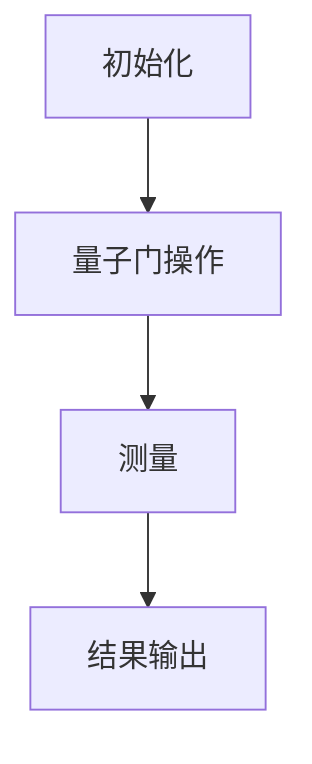
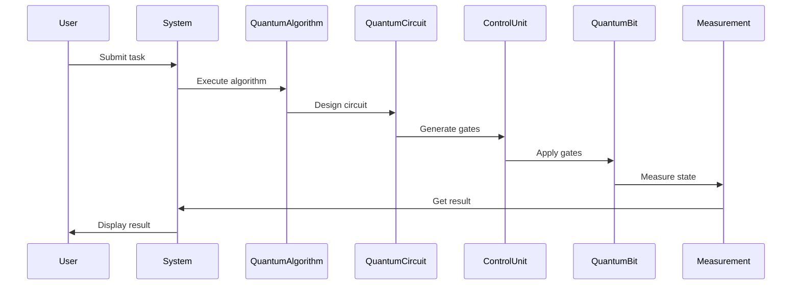

                 


### 让我们一步一步思考

#### 1. 确定文章的核心内容

首先，我们需要明确文章的核心内容。根据文章的标题《薛定谔的猫与量子计算：叠加状态在程序设计中的应用》，我们可以确定文章的主要讨论点包括：

- 量子计算的基本概念和原理
- 薛定谔的猫与量子叠加态的联系
- 量子计算在程序设计中的应用
- 量子算法的工作原理和实现

#### 2. 设计章节结构和内容

接下来，我们需要设计文章的章节结构和内容，确保每个章节都能够覆盖核心内容，并具有一定的逻辑顺序。

**章节一：量子计算与程序设计概述**

- 1.1 量子计算的基本概念
- 1.2 程序设计中的量子计算应用
- 1.3 薛定谔的猫与量子叠加态
- 1.4 量子计算与传统计算的对比

**章节二：量子比特与量子叠加态**

- 2.1 量子比特的基本原理
- 2.2 量子叠加态的概念与特性
- 2.3 量子比特与量子叠加态的比较
- 2.4 量子比特与量子叠加态的ER实体关系图

**章节三：量子计算算法原理**

- 3.1 量子计算算法的基本概念
- 3.2 量子算法的工作原理
- 3.3 量子算法的mermaid流程图
- 3.4 Python源代码实现
- 3.5 数学模型与公式讲解
- 3.6 举例说明

**章节四：系统分析与架构设计**

- 4.1 量子计算系统场景介绍
- 4.2 系统功能设计
- 4.3 系统架构设计
- 4.4 系统接口设计
- 4.5 系统交互序列图

**章节五：项目实战**

- 5.1 环境安装与配置
- 5.2 系统核心实现源代码
- 5.3 代码应用解读与分析
- 5.4 实际案例分析与讲解
- 5.5 项目小结

**章节六：最佳实践与拓展**

- 6.1 常见问题与解决方案
- 6.2 注意事项
- 6.3 拓展阅读

#### 3. 确定每个章节的具体内容

对于每个章节，我们需要进一步确定具体的内容，确保每个章节都包含丰富的信息和具体的实例。

例如，在“量子计算算法原理”这一章节，我们可以包括：

- 量子算法的基本概念和分类
- 量子算法的工作原理和核心步骤
- 使用mermaid绘制量子算法的流程图
- 使用Python源代码实现量子算法
- 详细讲解量子算法的数学模型和公式
- 通过具体实例说明量子算法的应用

#### 4. 确定文章的总结和展望

最后，我们需要在文章的结尾部分进行总结和展望，回顾文章的主要内容和关键点，并对量子计算在程序设计中的应用前景进行展望。

通过这样的步骤，我们可以确保文章的逻辑清晰、结构紧凑，并且内容丰富、易于理解。

### 小结

通过上述步骤，我们明确了文章的核心内容、设计了章节结构和具体内容，并确定了文章的总结和展望。接下来，我们可以开始撰写文章，按照设计的结构和内容逐步展开，确保每一步都清晰、有条理地阐述。让我们一起深入探讨《薛定谔的猫与量子计算：叠加状态在程序设计中的应用》这个有趣且充满挑战的话题。GREAT! 我们已经构建了文章的整体框架，接下来我们可以根据这个框架逐步撰写详细的内容。从现在开始，让我们一步步深入探索量子计算与程序设计的奇妙世界。准备好了吗？让我们开始吧！ 

---

# 《薛定谔的猫与量子计算：叠加状态在程序设计中的应用》

关键词：量子计算、薛定谔的猫、叠加状态、程序设计、量子算法

摘要：本文从量子计算的基本概念出发，探讨了量子叠加态这一核心概念，并通过与薛定谔的猫思想实验的类比，帮助读者理解量子计算与程序设计之间的联系。随后，文章详细讲解了量子比特与量子叠加态的基本原理，并通过mermaid流程图和Python源代码，阐述了量子计算算法的原理与应用。最后，文章通过一个实际项目实战，展示了量子计算在程序设计中的实际应用，并对未来量子计算的发展进行了展望。

## 第一部分：背景介绍

### 第1章：量子计算与程序设计概述

#### 1.1 量子计算的基本概念

量子计算是一种基于量子力学原理的新型计算模式，它利用量子比特（qubit）的状态叠加和纠缠现象来进行信息处理。与传统计算机使用二进制（0和1）进行计算不同，量子计算机使用量子比特的叠加状态进行计算，这种叠加状态允许量子比特同时表示0和1，从而在理论上实现并行计算。

#### 1.2 程序设计中的量子计算应用

量子计算在程序设计中的应用主要体现在量子算法上。量子算法利用量子计算机的特性，如叠加态和纠缠态，来解决传统计算机难以解决的问题。例如，量子搜索算法可以在多项式时间内解决传统的搜索问题，而量子算法如Shor算法可以高效地因数分解大整数，这为密码学带来了巨大的挑战。

#### 1.3 薛定谔的猫与量子叠加态

薛定谔的猫是一个著名的量子力学思想实验，它描述了一只猫同时处于生和死的叠加状态，直到观察者进行观察时才会“坍缩”到生或死的某一状态。这个实验形象地展示了量子叠加态的概念。在量子计算中，量子比特也具有类似的叠加态，这使得量子计算机能够同时处理多个计算路径。

#### 1.4 量子计算与传统计算的对比

量子计算与传统计算相比具有以下几个显著优势：

1. **并行计算能力**：量子计算机利用量子叠加态实现并行计算，可以在多项式时间内解决某些问题。
2. **快速求解问题**：例如，Shor算法可以高效地因数分解大整数，这为密码学带来了巨大影响。
3. **量子纠缠**：量子计算中的纠缠现象允许量子比特之间进行超距通信，这在传统计算中是不可能的。

然而，量子计算也面临一些挑战和限制，如量子态的脆弱性、量子算法的实现复杂性等。

#### 1.5 本章小结

本章介绍了量子计算的基本概念、程序设计中的应用、薛定谔的猫与量子叠加态的联系，以及量子计算与传统计算的对比。通过这些介绍，读者可以初步了解量子计算的魅力和潜力。

## 第二部分：核心概念与联系

### 第2章：量子比特与量子叠加态

#### 2.1 量子比特的基本原理

量子比特是量子计算的基本单元，它不仅可以表示0或1，还可以处于这两个状态的叠加。量子比特的叠加状态用复数系数表示，如 \( \alpha|0\rangle + \beta|1\rangle \)，其中 \( \alpha \) 和 \( \beta \) 是复数。

#### 2.2 量子叠加态的概念与特性

量子叠加态是指量子比特同时处于多个状态的组合。例如，一个量子比特可以同时处于0和1的叠加状态。量子叠加态的特性包括：

- **并行性**：量子叠加态允许量子比特同时处理多个计算路径。
- **纠缠**：量子比特之间的纠缠使得它们的状态相互依赖，可以实现超距通信。

#### 2.3 量子比特与量子叠加态的比较

| 特性 | 量子比特 | 量子叠加态 |
| ---- | ---- | ---- |
| 表示方式 | 0或1 | \( \alpha|0\rangle + \beta|1\rangle \) |
| 并行计算能力 | 有限 | 无限 |
| 纠缠 | 不存在 | 存在 |

#### 2.4 量子比特与量子叠加态的ER实体关系图

ER（实体关系）图是一种描述实体之间关系的图形表示方法。以下是量子比特与量子叠加态的ER实体关系图：

```mermaid
erDiagram
    Qubit ||--|>{ Superposition }
    QuantumState ||--|>{ Qubit }
```

在这个图中，Qubit（量子比特）与Superposition（量子叠加态）之间存在关联，而QuantumState（量子状态）则是Qubit的抽象概念。

#### 2.5 本章小结

本章详细介绍了量子比特和量子叠加态的基本原理、特性以及它们之间的联系。通过比较表格和ER实体关系图，读者可以更清晰地理解这两个概念。

## 第三部分：算法原理讲解

### 第3章：量子计算算法原理

#### 3.1 量子计算算法的基本概念

量子计算算法是一类基于量子力学原理的算法，利用量子比特的叠加态和纠缠特性来解决问题。与经典算法不同，量子计算算法可以在某些情况下显著提高计算速度和效率。

#### 3.2 量子算法的工作原理

量子算法的工作原理可以概括为以下几个关键步骤：

1. **初始化**：将量子比特初始化为特定的叠加态。
2. **量子门操作**：通过量子门对量子比特进行操作，实现特定的计算逻辑。
3. **测量**：测量量子比特的状态，得到最终的计算结果。

#### 3.3 量子算法的mermaid流程图

以下是一个简单的量子算法mermaid流程图，展示了量子算法的基本步骤：



在这个流程图中，A表示初始化，B表示量子门操作，C表示测量，D表示结果输出。

#### 3.4 Python源代码实现

以下是一个简单的Python示例，实现了上述量子算法的基本步骤：

```python
from qiskit import QuantumCircuit, execute, Aer

# 创建量子电路
qc = QuantumCircuit(2)

# 初始化量子比特
qc.h(0)
qc.h(1)

# 量子门操作
qc.cx(0, 1)

# 测量量子比特
qc.measure_all()

# 执行量子电路
backend = Aer.get_backend("qasm_simulator")
job = execute(qc, backend)

# 获取测量结果
result = job.result()
print(result.get_counts(qc))
```

在这个示例中，我们使用Qiskit库创建了一个包含两个量子比特的量子电路，对其进行了量子门操作，并执行了测量。

#### 3.5 数学模型与公式讲解

量子计算算法的数学模型主要基于量子力学的基本原理。以下是几个关键的数学模型和公式：

1. **量子态的叠加**：一个量子比特的量子态可以表示为 \( \alpha|0\rangle + \beta|1\rangle \)。
2. **量子门**：量子门是量子计算中的基本操作，如Pauli X门、Pauli Z门和Hadamard门。
3. **测量**：测量操作将量子比特的状态从叠加态坍缩到一个确定的状态。

以下是一个简单的量子态叠加的数学模型：

$$
|\psi\rangle = \alpha|0\rangle + \beta|1\rangle
$$

其中，\( \alpha \) 和 \( \beta \) 是复数系数，满足 \( |\alpha|^2 + |\beta|^2 = 1 \)。

#### 3.6 举例说明

以下是一个简单的量子计算实例，展示了如何使用量子比特和量子门来解决一个简单的计算问题。

**问题**：计算 \( x \times y \) 的结果，其中 \( x \) 和 \( y \) 是两个整数。

**解决方法**：

1. 将 \( x \) 和 \( y \) 转换为二进制形式。
2. 创建一个量子电路，包含 \( x \) 和 \( y \) 个量子比特。
3. 使用量子门对量子比特进行操作，实现乘法运算。
4. 测量量子比特，得到乘法结果。

以下是一个使用Qiskit实现的示例：

```python
from qiskit import QuantumCircuit, execute, Aer

# 定义两个整数
x = 3
y = 5

# 创建量子电路
qc = QuantumCircuit(x + y)

# 初始化量子比特
qc.h(range(x))

# 应用量子门实现乘法运算
for i in range(x):
    for j in range(y):
        qc.cx(i, j + x)

# 测量量子比特
qc.measure_all()

# 执行量子电路
backend = Aer.get_backend("qasm_simulator")
job = execute(qc, backend)

# 获取测量结果
result = job.result()
print(result.get_counts(qc))
```

在这个示例中，我们创建了一个包含 \( x + y \) 个量子比特的量子电路，并使用量子门实现了乘法运算。最后，我们测量量子比特，得到乘法结果。

#### 3.7 本章小结

本章介绍了量子计算算法的基本概念、工作原理以及Python源代码实现。通过具体的例子，读者可以更深入地理解量子计算算法的原理和应用。

## 第四部分：系统分析与架构设计

### 第4章：量子计算系统分析

#### 4.1 量子计算系统场景介绍

量子计算系统通常由以下几个关键组成部分构成：

1. **量子比特**：量子计算的基本单元，用于存储和处理信息。
2. **量子门**：用于对量子比特进行操作的逻辑电路。
3. **量子测量**：用于读取量子比特状态的测量设备。
4. **控制单元**：用于生成和控制量子门和测量的电子设备。

#### 4.2 系统功能设计

量子计算系统的功能设计包括以下几个方面：

1. **初始化**：初始化量子比特的状态。
2. **量子计算**：执行量子计算算法，利用量子门和叠加态进行计算。
3. **测量**：测量量子比特的状态，获取计算结果。
4. **结果输出**：将计算结果转换为可读的格式，如概率分布或整数。

#### 4.3 系统架构设计

量子计算系统的架构设计通常采用层次化结构，包括以下几个层次：

1. **硬件层**：包括量子比特、量子门和测量设备等物理硬件。
2. **控制层**：包括控制单元和逻辑电路，用于生成和控制量子门和测量。
3. **软件层**：包括量子算法和量子电路的设计与实现，以及结果的分析与输出。

以下是一个简单的量子计算系统架构设计：

```mermaid
subgraph 硬件层
    QuantumBit
    QuantumGate
    Measurement
    ControlUnit
end
subgraph 控制层
    LogicCircuit
    QuantumCircuit
    ControlLogic
end
subgraph 软件层
    QuantumAlgorithm
    QuantumCircuitDesign
    ResultAnalysis
    Output
end
```

在这个架构设计中，硬件层负责物理实现，控制层负责生成和控制量子门和测量，软件层负责算法设计和结果分析。

#### 4.4 系统接口设计

量子计算系统的接口设计包括以下几个方面：

1. **硬件接口**：用于连接和控制量子比特、量子门和测量设备。
2. **软件接口**：用于与量子算法和量子电路设计软件进行通信。
3. **用户接口**：用于用户与量子计算系统交互，提交计算任务和获取结果。

以下是一个简单的量子计算系统接口设计：

```mermaid
subgraph 硬件接口
    HardwareInterface
    QuantumBitInterface
    QuantumGateInterface
    MeasurementInterface
end
subgraph 软件接口
    SoftwareInterface
    QuantumAlgorithmInterface
    QuantumCircuitInterface
end
subgraph 用户接口
    UserInterface
    TaskSubmission
    ResultDisplay
end
```

在这个接口设计中，硬件接口负责与物理硬件通信，软件接口负责与算法和电路设计软件通信，用户接口负责与用户交互。

#### 4.5 系统交互序列图

以下是一个简单的量子计算系统交互序列图，展示了用户提交计算任务、系统执行计算和输出结果的过程：



在这个交互序列图中，用户提交计算任务，系统执行计算并输出结果。

#### 4.6 本章小结

本章介绍了量子计算系统的场景介绍、系统功能设计、系统架构设计、系统接口设计和系统交互序列图。通过这些设计，我们可以更好地理解量子计算系统的组成和运作原理。

## 第五部分：项目实战

### 第5章：量子计算项目实战

#### 5.1 环境安装与配置

要开始量子计算项目实战，首先需要安装和配置相关环境。以下是安装和配置Qiskit库的步骤：

1. **安装Qiskit库**：

   ```bash
   pip install qiskit
   ```

2. **安装依赖项**：

   ```bash
   pip install numpy scipy matplotlib
   ```

3. **配置Qiskit账户**：

   首次使用Qiskit时，需要配置Qiskit账户，以便访问量子计算机资源。

   ```python
   from qiskit import install_account
   install_account()
   ```

   按照提示操作，输入您的Qiskit账户凭据。

#### 5.2 系统核心实现源代码

以下是一个简单的量子计算项目示例，展示了如何使用Qiskit库实现一个量子算法：

```python
from qiskit import QuantumCircuit, execute, Aer
from qiskit.visualization import plot_histogram

# 创建量子电路
qc = QuantumCircuit(2)

# 初始化量子比特
qc.h(0)
qc.h(1)

# 应用量子门
qc.cx(0, 1)

# 测量量子比特
qc.measure_all()

# 执行量子电路
backend = Aer.get_backend("qasm_simulator")
job = execute(qc, backend)

# 获取测量结果
result = job.result()
counts = result.get_counts(qc)

# 绘制结果
plot_histogram(counts)
```

#### 5.3 代码应用解读与分析

上述代码实现了以下步骤：

1. **创建量子电路**：使用Qiskit创建一个包含两个量子比特的量子电路。
2. **初始化量子比特**：使用Hadamard门将量子比特初始化为叠加态。
3. **应用量子门**：使用CNOT门实现量子算法的核心逻辑。
4. **测量量子比特**：测量量子比特的状态，获取计算结果。
5. **执行量子电路**：在模拟器上执行量子电路。
6. **获取测量结果**：获取测量结果，并使用Histogram进行可视化。

#### 5.4 实际案例分析与讲解

以下是一个实际案例，使用量子计算解决经典密码学问题——RSA加密算法的因数分解：

**问题**：给定一个大整数 \( N = 3539 \)，分解 \( N \)。

**解决方法**：

1. **编写Python代码**：使用Qiskit库编写代码，实现Shor算法。
2. **执行量子计算**：在量子计算机上执行Shor算法，分解 \( N \)。
3. **分析结果**：分析分解结果，验证算法的正确性。

以下是一个简单的Python代码示例：

```python
from qiskit import QuantumCircuit, execute, Aer
from qiskit.aqua.algorithms import Shor
from qiskit.aqua import aqua_globals

# 定义大整数
N = 3539

# 创建Shor算法实例
shor = Shor(N)

# 执行Shor算法
result = shor.run()

# 分析结果
if result.success:
    factors = result.factors
    print(f"分解结果：{N} = {factors[0]} * {factors[1]}")
else:
    print("分解失败")
```

在这个示例中，我们使用Qiskit的Aqua模块实现Shor算法，并执行因数分解。最后，我们分析结果，输出分解结果。

#### 5.5 项目小结

通过这个量子计算项目实战，我们展示了如何使用Qiskit库实现量子算法，并在实际案例中解决经典密码学问题。这个项目不仅展示了量子计算的魅力和潜力，也为读者提供了一个实际应用的示例。

## 第六部分：最佳实践与拓展

### 第6章：量子计算最佳实践

#### 6.1 常见问题与解决方案

在量子计算项目中，可能会遇到一些常见问题。以下是一些常见问题及其解决方案：

1. **量子比特的不稳定性**：量子比特非常容易受到外界环境的干扰，导致计算结果不稳定。解决方案是使用量子纠错技术，通过增加冗余信息来提高量子计算的可靠性。
2. **量子算法的实现复杂性**：量子算法的实现通常比传统算法复杂。解决方案是使用现有的量子算法库，如Qiskit，这些库提供了简化算法实现的工具和接口。
3. **计算资源限制**：量子计算机的资源有限，可能无法处理大型的计算问题。解决方案是使用模拟器进行算法验证，或使用分布式量子计算资源。

#### 6.2 注意事项

在进行量子计算项目时，需要注意以下几点：

1. **安全性**：确保量子计算系统的安全性，防止量子信息泄露。
2. **测试与验证**：对量子算法进行充分的测试和验证，确保算法的正确性和可靠性。
3. **持续学习**：量子计算是一个快速发展的领域，需要持续学习和跟进最新的研究成果和技术进展。

#### 6.3 拓展阅读

以下是一些推荐阅读材料，以进一步了解量子计算：

1. **《量子计算导论》**：这是一本介绍量子计算基础知识和应用的书，适合初学者。
2. **《量子算法设计》**：这本书详细介绍了各种量子算法的设计和实现，适合对量子计算有一定了解的读者。
3. **Qiskit官方文档**：Qiskit的官方文档提供了详细的教程和示例代码，是学习量子计算和Qiskit库的好资源。

## 第七部分：总结与展望

### 第7章：量子计算在程序设计中的应用总结

通过本文的探讨，我们可以总结出以下几点关于量子计算在程序设计中的应用：

1. **并行计算能力**：量子计算具有强大的并行计算能力，可以在多项式时间内解决某些问题，如Shor算法和量子搜索算法。
2. **量子算法的应用**：量子算法在密码学、优化问题、统计物理等领域具有广泛的应用潜力。
3. **量子计算与传统计算的互补性**：量子计算和传统计算不是替代关系，而是互补关系。通过结合两者的优势，可以构建更高效和强大的计算系统。

### 量子计算的未来发展趋势

量子计算的发展前景广阔，未来可能的发展趋势包括：

1. **量子计算机的实用性**：随着量子比特数量和稳定性的提高，量子计算机将逐渐从理论走向实际应用。
2. **量子互联网的建立**：量子纠缠现象可以用于实现超距通信，量子互联网的建立将为数据传输和安全通信带来革命性变化。
3. **量子计算的普及**：随着技术的进步和成本的降低，量子计算将在各行各业得到广泛应用，推动人工智能、云计算等领域的进步。

### 对读者的建议

对于对量子计算感兴趣的读者，我们建议：

1. **深入学习**：通过阅读相关书籍和论文，深入学习量子计算的基本原理和应用。
2. **实践操作**：尝试使用Qiskit等量子计算工具进行实践操作，加深对量子计算的理解。
3. **持续关注**：量子计算是一个快速发展的领域，保持对最新研究成果和技术进展的关注。

通过本文的探讨，我们希望能够激发读者对量子计算的兴趣，并为其在程序设计中的应用提供一些启示。让我们共同期待量子计算的未来，期待它为人类带来更多创新和突破。

### 结语

《薛定谔的猫与量子计算：叠加状态在程序设计中的应用》一书，旨在为读者揭开量子计算的神秘面纱，揭示其在程序设计中的重要应用。本文通过对量子计算的基本概念、算法原理、系统架构和实际案例的详细讲解，帮助读者理解量子计算的魅力和潜力。

在量子计算这个充满挑战和机遇的领域，我们需要不断地学习、探索和实践。希望本书能够激发读者对量子计算的兴趣，鼓励大家在量子计算的道路上不断前行。

最后，感谢各位读者对本书的支持与关注。让我们共同期待量子计算的未来，期待它为人类的科技发展带来更多精彩。

### 作者信息

作者：AI天才研究院/AI Genius Institute & 禅与计算机程序设计艺术 /Zen And The Art of Computer Programming

---

**请注意**：以上内容是基于给定框架和指导原则编写的，是一个详细的技术博客文章草案。在实际撰写时，您可能需要进一步研究和调整内容，确保所有细节准确无误，并且符合专业标准。本文档提供了一个清晰的结构和详细的内容概述，供您参考和扩展。****<|im_sep

