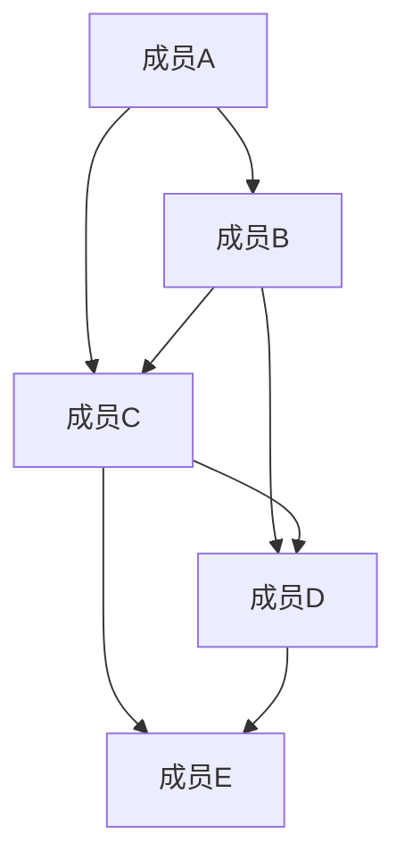
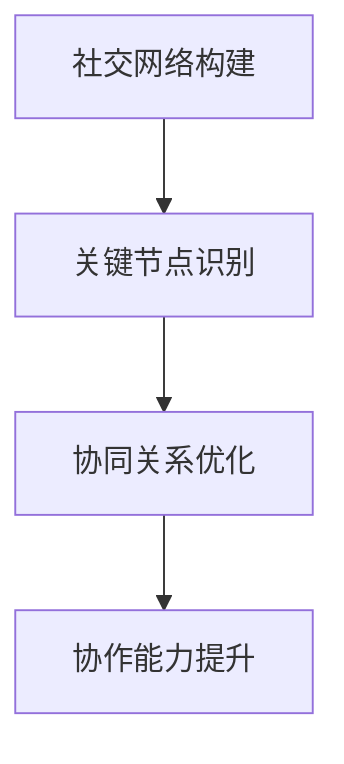
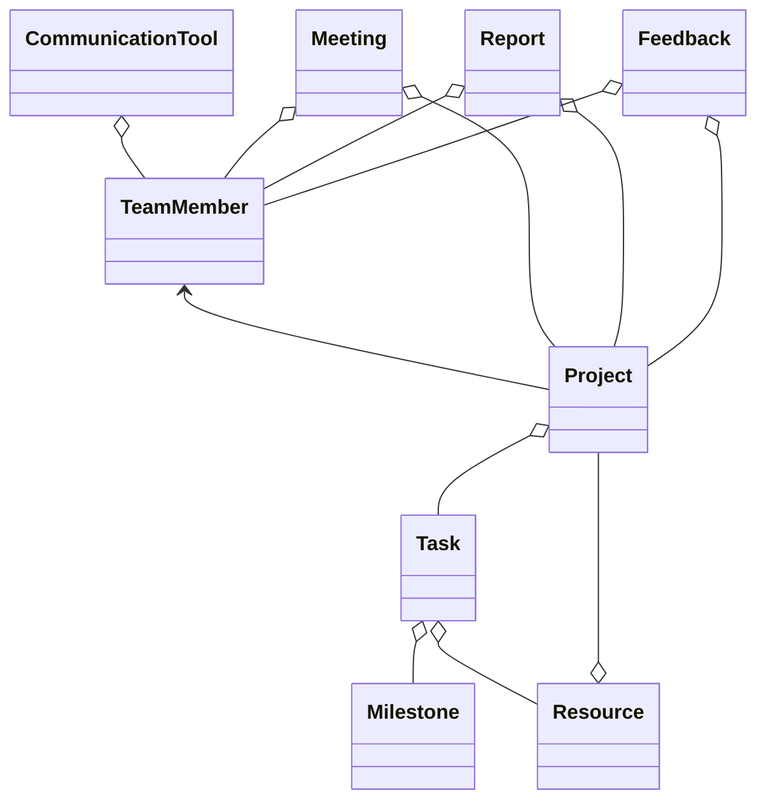
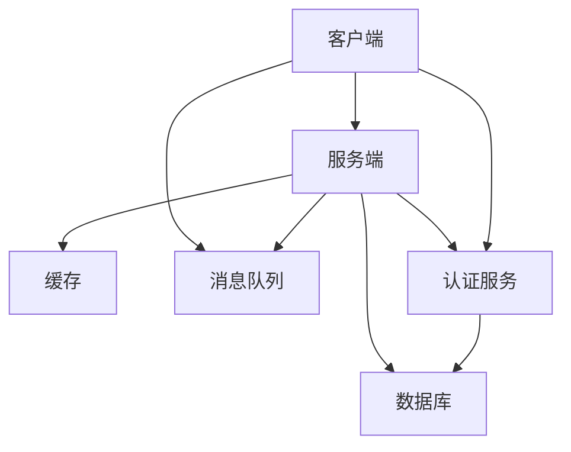
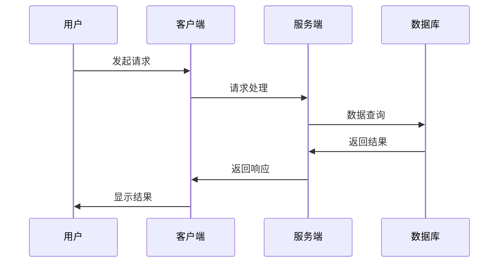

                 


### # 虚拟团队凝聚力建设：增强远程团队的协作能力

**关键词**：虚拟团队、团队凝聚力、远程协作、协作能力、团队建设

**摘要**：本文旨在探讨虚拟团队凝聚力建设的重要性及其策略，通过深入分析和实例研究，提出增强远程团队协作能力的有效方法。文章首先介绍虚拟团队的概念及其与传统团队的差异，随后阐述团队凝聚力对于虚拟团队绩效的关键作用。在此基础上，文章提出一系列建设虚拟团队凝聚力的方法与策略，包括增强信任、提高沟通效率和促进成员参与等。通过具体案例分析，本文展示了这些策略在实际应用中的成效。最后，文章总结最佳实践，并提出注意事项和拓展阅读，为虚拟团队管理者提供有益的指导。

### 第1章: 问题背景与核心概念介绍

#### 1.1 虚拟团队的概念与发展

##### 1.1.1 虚拟团队的定义

虚拟团队是指通过信息技术手段进行沟通和协作的团队，团队成员可能位于不同的地理位置，依靠电子邮件、即时通讯工具、视频会议等方式保持联系。这种团队形式打破了传统面对面的沟通限制，能够快速响应市场需求，提高工作效率。

##### 1.1.2 虚拟团队的兴起背景

随着全球化进程的加速和信息技术的发展，虚拟团队成为了现代企业常见的组织形式。企业通过虚拟团队可以跨越地域限制，整合全球范围内的优秀人才，实现资源的最优配置。此外，虚拟团队的灵活性和高效性也使其在项目管理、产品开发等领域得到了广泛应用。

##### 1.1.3 虚拟团队与传统团队的对比

虚拟团队与传统团队在组织形式、沟通方式和决策机制上存在显著差异。传统团队通常在一个物理空间内进行工作，成员之间面对面交流，决策速度相对较慢。而虚拟团队则依赖远程通信工具，团队成员分布在不同的地区，沟通和决策过程更加灵活，但同时也面临着沟通障碍和信息不对称等问题。

#### 1.2 虚拟团队凝聚力的重要性

##### 1.2.1 凝聚力对虚拟团队的影响

虚拟团队凝聚力是指团队成员之间的相互依赖、信任和合作程度。高凝聚力的虚拟团队能够更好地协调工作，提高决策效率，降低项目风险。反之，低凝聚力的团队则可能导致沟通不畅、协作困难，甚至影响项目进度和质量。

##### 1.2.2 凝聚力与团队绩效的关系

研究表明，团队凝聚力与团队绩效之间存在显著的正相关关系。高凝聚力的虚拟团队能够更好地完成项目任务，提高客户满意度，实现企业的战略目标。相反，缺乏凝聚力的团队往往绩效低下，难以适应快速变化的市场环境。

##### 1.2.3 建设虚拟团队凝聚力的必要性

由于虚拟团队的地理分散性和沟通障碍，建设高凝聚力的团队显得尤为重要。通过有效的凝聚力建设策略，企业可以增强团队成员之间的信任和合作，提高团队整体绩效，从而在竞争激烈的市场中取得优势。

#### 1.3 核心概念联系与拓展

##### 1.3.1 核心概念介绍

虚拟团队、团队凝聚力、协作能力是本文探讨的核心概念。虚拟团队是指通过信息技术手段进行沟通和协作的团队；团队凝聚力是指团队成员之间的相互依赖、信任和合作程度；协作能力是指团队成员共同完成任务的能力。

##### 1.3.2 概念属性特征对比

| 概念         | 属性特征                           |
|--------------|-----------------------------------|
| 虚拟团队     | 分布在不同地理位置、依赖信息技术   |
| 团队凝聚力   | 信任、依赖、合作                   |
| 协作能力     | 共同完成任务、高效沟通、资源整合   |

##### 1.3.3 虚拟团队凝聚力建设的ER实体关系图

```mermaid
erDiagram
  虚拟团队 ||--|{ 团队成员 }|
  团队成员 ||--|{ 协作能力 }|
  团队成员 ||--|{ 团队凝聚力 }|
  团队凝聚力 ||--|{ 协作效率 }|
  协作效率 ||--|{ 团队绩效 }|
```

#### 1.4 本章小结

本章介绍了虚拟团队的概念与发展，分析了虚拟团队凝聚力的重要性及其对团队绩效的影响。通过对比虚拟团队与传统团队，我们认识到虚拟团队在组织形式、沟通方式和决策机制上的独特性。同时，本章提出了虚拟团队凝聚力建设的核心概念和ER实体关系图，为后续章节的深入探讨奠定了基础。

### 第2章: 虚拟团队凝聚力建设的方法与策略

#### 2.1 虚拟团队凝聚力建设的基本方法

##### 2.1.1 增强信任建设

信任是虚拟团队凝聚力的基石。为了增强信任，企业可以采取以下措施：

1. **建立明确的目标和期望**：确保团队成员对项目目标和期望有清晰的认识，减少误解和不确定性。
2. **透明沟通**：鼓励团队成员分享信息和经验，提高信息透明度，增强信任感。
3. **建立共同价值观**：通过共同的价值观和使命，加强团队成员之间的认同感，提高信任水平。

##### 2.1.2 提高沟通效率

沟通是虚拟团队协作的关键。为了提高沟通效率，企业可以采取以下策略：

1. **利用多种沟通工具**：根据不同场景选择合适的沟通工具，如电子邮件、即时通讯、视频会议等，确保信息传达的及时性和准确性。
2. **建立沟通规范**：制定明确的沟通规则和流程，确保团队成员了解如何有效地沟通，减少沟通障碍。
3. **定期更新进度**：通过定期更新项目进度，确保团队成员了解项目动态，提高协作效率。

##### 2.1.3 促进成员参与

成员参与是提高团队凝聚力的关键。为了促进成员参与，企业可以采取以下措施：

1. **赋予成员决策权**：鼓励团队成员参与决策过程，提高其责任感和参与感。
2. **提供反馈和认可**：及时给予成员反馈和认可，增强其成就感和归属感。
3. **组织团队活动**：通过团队活动，增进团队成员之间的了解和互动，提高团队凝聚力。

#### 2.2 虚拟团队凝聚力建设策略

##### 2.2.1 组织文化塑造

组织文化是团队凝聚力的核心。为了塑造积极的组织文化，企业可以采取以下策略：

1. **建立共同的愿景和使命**：确保团队成员对企业的愿景和使命有清晰的认识，形成共同的目标和价值观。
2. **弘扬企业价值观**：通过企业文化的宣传和推广，让团队成员认同并践行企业价值观。
3. **提供职业发展机会**：通过职业发展计划和培训，激励团队成员不断学习和成长，增强团队凝聚力。

##### 2.2.2 领导风格适应

领导风格对团队凝聚力具有重要影响。为了适应虚拟团队的特点，领导者可以采取以下策略：

1. **放权式领导**：给予团队成员更多的自主权和决策权，鼓励其发挥主观能动性。
2. **支持式领导**：提供支持和帮助，帮助团队成员克服困难和挑战，增强团队凝聚力。
3. **参与式领导**：鼓励团队成员参与决策过程，增强其参与感和责任感。

##### 2.2.3 团队活动与培训

团队活动和培训是增强团队凝聚力的有效手段。为了提高团队凝聚力和协作能力，企业可以采取以下措施：

1. **定期组织团队活动**：通过团队活动，增进团队成员之间的了解和互动，提高团队凝聚力。
2. **开展技能培训**：为团队成员提供相关技能培训，提高其专业素养和协作能力。
3. **组织跨部门合作项目**：通过跨部门合作项目，促进不同团队之间的交流和合作，增强整体团队凝聚力。

#### 2.3 案例分析：成功虚拟团队凝聚力建设实例

##### 2.3.1 案例背景

某跨国公司是一家从事软件开发的企业，由于业务扩展，团队成员分布在不同的国家和地区。为了提高项目效率，公司决定加强虚拟团队凝聚力建设。

##### 2.3.2 凝聚力建设策略

1. **建立明确的团队目标和期望**：公司明确了每个项目的目标和期望，确保团队成员对项目有清晰的认识。
2. **采用多种沟通工具**：公司利用电子邮件、即时通讯、视频会议等多种工具，确保信息传达的及时性和准确性。
3. **组织团队活动**：公司定期组织线上团队活动，如团队建设游戏、线上聚会等，增进团队成员之间的了解和互动。
4. **提供职业发展机会**：公司为团队成员提供职业发展计划和培训，激励其不断学习和成长。

##### 2.3.3 案例成效分析

通过一系列凝聚力建设策略，公司成功提高了虚拟团队的协作能力和工作效率。项目进度得到显著改善，团队成员之间的沟通更加顺畅，项目成功率显著提高。此外，团队成员的满意度和归属感也明显增强，为企业长期发展奠定了坚实基础。

#### 2.4 本章小结

本章介绍了虚拟团队凝聚力建设的基本方法和策略。通过增强信任、提高沟通效率和促进成员参与，企业可以构建高凝聚力的虚拟团队。同时，组织文化塑造、领导风格适应和团队活动与培训也是增强团队凝聚力的重要手段。通过具体案例分析，我们看到了成功虚拟团队凝聚力建设策略的实际效果。

### 第3章: 算法原理讲解

#### 3.1 增强远程团队协作能力的算法介绍

##### 3.1.1 算法概述

为了增强远程团队的协作能力，我们提出了一种基于社交网络分析的协作能力增强算法。该算法旨在通过分析团队成员的社交网络结构，识别关键节点和潜在协同关系，从而优化团队协作流程，提高协作效率。

##### 3.1.2 算法主要模块

1. **社交网络构建**：收集团队成员的社交网络数据，包括通讯记录、协作项目等，构建团队成员的社交网络。
2. **关键节点识别**：利用社交网络分析技术，识别社交网络中的关键节点，即对团队协作具有重要影响力的成员。
3. **协同关系优化**：根据关键节点和团队成员的协作记录，优化团队协作关系，提高协作效率。

#### 3.2 算法原理讲解

##### 3.2.1 算法原理

该算法基于社交网络分析的基本原理，通过以下步骤实现协作能力增强：

1. **社交网络构建**：构建团队成员的社交网络，利用图论表示团队成员之间的关系。
2. **关键节点识别**：利用度中心性、介数中心性等指标，识别社交网络中的关键节点。
3. **协同关系优化**：通过调整关键节点的协作关系，优化团队协作流程，提高协作效率。

##### 3.2.2 数学模型和公式

为了更好地描述算法原理，我们引入以下数学模型和公式：

- **度中心性**：节点在社交网络中的重要程度，计算公式为：

  $$ \text{度中心性}(n) = \frac{\text{节点n的度}}{\text{网络的最大度}} $$

- **介数中心性**：节点在社交网络中的控制能力，计算公式为：

  $$ \text{介数中心性}(n) = \frac{1}{N(N-1)} \sum_{i \neq n} \sum_{j \neq n} \frac{\text{最短路径数}(i, j) \land (n \in \text{路径})}{\text{最短路径数}(i, j)} $$

##### 3.2.3 举例说明

假设我们有一个由5个成员组成的社交网络，节点之间的连接关系如下：



根据度中心性和介数中心性，我们可以识别出关键节点：

- **度中心性**：成员C的度中心性最高，为3/5。
- **介数中心性**：成员C的介数中心性也最高，为1。

因此，成员C是社交网络中的关键节点，对团队协作具有较大影响。通过优化成员C与其他成员的协作关系，可以显著提高团队协作效率。

#### 3.3 Mermaid算法流程图展示



#### 3.4 本章小结

本章介绍了增强远程团队协作能力的算法原理，包括算法概述、算法原理讲解和数学模型。通过构建社交网络、识别关键节点和优化协同关系，该算法可以有效提升远程团队的协作效率。下一章将深入探讨数学模型和公式，进一步阐述算法的详细实现过程。

### 第4章: 数学模型与公式详细讲解

#### 4.1 数学模型讲解

##### 4.1.1 模型基本概念

在本章中，我们将详细讲解用于增强远程团队协作能力的数学模型。该模型的核心概念包括社交网络结构、节点属性和协作效率等。

##### 4.1.2 模型结构与参数

1. **社交网络结构**：模型以图论为基础，表示团队成员之间的社交网络。图的节点代表团队成员，边表示团队成员之间的协作关系。
2. **节点属性**：每个节点具有度、介数中心性和协作能力等属性。度表示节点与其他节点的连接数量；介数中心性表示节点在社交网络中的控制能力；协作能力表示节点的协作效率。
3. **协作效率**：模型的目标是优化节点之间的协作关系，提高整体协作效率。

##### 4.1.3 模型应用场景

该数学模型适用于虚拟团队协作能力提升的场景，如项目管理、产品开发和跨部门合作等。通过优化团队成员之间的协作关系，提高团队整体协作效率。

#### 4.2 数学公式讲解

##### 4.2.1 基本公式介绍

在本节中，我们将介绍用于计算节点属性的数学公式：

1. **度**：节点n的度表示与节点n相连的节点数量，计算公式为：

   $$ \text{度}(n) = \sum_{i \in \text{邻居}(n)} 1 $$

2. **介数中心性**：节点n的介数中心性表示节点n在社交网络中的控制能力，计算公式为：

   $$ \text{介数中心性}(n) = \frac{1}{N(N-1)} \sum_{i \neq n} \sum_{j \neq n} \frac{\text{最短路径数}(i, j) \land (n \in \text{路径})}{\text{最短路径数}(i, j)} $$

3. **协作能力**：节点n的协作能力表示节点的协作效率，计算公式为：

   $$ \text{协作能力}(n) = \frac{\text{度}(n) \times \text{介数中心性}(n)}{\text{最大度}} $$

##### 4.2.2 公式推导过程

介数中心性的推导基于图论中的最短路径算法。假设社交网络中有N个节点，任意两个节点i和j之间的最短路径数可以通过迪杰斯特拉算法计算。在此基础上，我们计算节点n在i和j之间的最短路径上的出现次数，进而得到节点n的介数中心性。

##### 4.2.3 公式在实际中的应用

在实际应用中，这些公式用于计算社交网络中节点的属性，进而识别关键节点和优化协作关系。通过调整节点之间的协作关系，可以提升团队整体的协作效率。

#### 4.3 LaTeX公式示例

以下是一个LaTeX公式的示例：

```latex
\documentclass{article}
\usepackage{amsmath}
\begin{document}
\begin{equation}
\text{度中心性}(n) = \frac{\text{节点n的度}}{\text{网络的最大度}}
\end{equation}
\end{document}
```

运行该LaTeX代码，我们将得到如下公式：

$$
\text{度中心性}(n) = \frac{\text{节点n的度}}{\text{网络的最大度}}
$$

#### 4.4 本章小结

本章详细讲解了用于增强远程团队协作能力的数学模型和公式。通过分析社交网络结构、计算节点属性和协作能力，我们能够识别关键节点和优化协作关系，从而提升团队整体协作效率。这些公式和模型为后续的算法实现和系统设计提供了理论基础。

### 第5章: 系统分析与架构设计

#### 5.1 问题场景介绍

##### 5.1.1 场景描述

假设某企业拥有一支分布在全球不同地区的虚拟团队，团队成员包括软件开发工程师、项目经理、设计师和测试人员等。企业希望提高团队的协作效率，确保项目按时完成并达到预期质量。然而，由于地理位置的差异和沟通障碍，团队成员之间的协作存在一定的困难。

##### 5.1.2 项目目标

通过设计和实施一套有效的协作系统，实现以下目标：

1. 提高团队成员之间的沟通效率，确保信息传达的准确性和及时性。
2. 优化团队协作流程，降低项目风险，提高项目成功率。
3. 提升团队整体协作能力，增强团队的凝聚力。

#### 5.2 系统功能设计

##### 5.2.1 领域模型Mermaid类图



该类图展示了系统的主要功能模块和它们之间的关系。类图中的关键模块包括团队成员、项目、任务、里程碑、资源、沟通工具、会议、报告和反馈等。

##### 5.2.2 功能模块划分

1. **用户管理模块**：负责团队成员的注册、登录、权限管理和个人信息维护。
2. **项目管理模块**：包括项目的创建、任务分配、进度跟踪、里程碑设定和资源管理。
3. **沟通工具模块**：提供邮件、即时通讯、视频会议等多种沟通渠道，确保信息传达的及时性和准确性。
4. **会议管理模块**：包括会议的创建、邀请、参与和记录，确保团队成员能够及时参与重要会议。
5. **报告与反馈模块**：生成项目报告，提供反馈渠道，帮助团队成员了解项目进展和自身工作表现。

#### 5.3 系统架构设计

##### 5.3.1 系统架构图



该架构图展示了系统的总体架构。系统由客户端、服务端、数据库、缓存、消息队列和认证服务组成。客户端负责与用户交互，服务端处理业务逻辑，数据库存储数据，缓存提高系统响应速度，消息队列实现异步通信，认证服务确保系统的安全性和稳定性。

##### 5.3.2 架构设计要点

1. **高可用性**：通过负载均衡和冗余设计，确保系统在高峰期和故障情况下仍然能够正常运行。
2. **高可靠性**：采用分布式数据库和缓存，提高系统的数据一致性和可靠性。
3. **高扩展性**：通过微服务架构，实现系统模块的独立扩展和部署，满足企业不断增长的业务需求。
4. **安全性**：采用SSL/TLS加密和访问控制机制，确保系统的安全性和数据隐私。
5. **易维护性**：采用日志记录、监控和告警机制，便于系统运维和故障排查。

#### 5.4 系统接口设计

##### 5.4.1 接口规范

系统接口设计遵循RESTful API规范，使用HTTP协议进行通信。接口主要包括以下类型：

1. **GET**：获取数据，如获取用户列表、项目列表等。
2. **POST**：创建数据，如创建用户、创建项目等。
3. **PUT**：更新数据，如更新用户信息、项目进度等。
4. **DELETE**：删除数据，如删除用户、项目等。

##### 5.4.2 接口实现

以下是用户管理模块的一个示例接口：

```json
// 获取用户列表
GET /users

// 注册新用户
POST /users/register

// 登录
POST /users/login

// 更新用户信息
PUT /users/{userId}
```

#### 5.5 系统交互Mermaid序列图



该序列图展示了用户通过客户端发起请求，服务端处理请求并从数据库查询数据，最后将结果返回给客户端的过程。

#### 5.6 本章小结

本章详细介绍了系统的功能设计、架构设计和接口设计。通过构建用户管理、项目管理、沟通工具、会议管理和报告与反馈等模块，系统实现了虚拟团队的协作功能。系统架构采用微服务架构，确保高可用性、高可靠性和高扩展性。接口设计遵循RESTful API规范，便于系统的开发和维护。下一章将介绍系统的核心实现，包括源代码解读、代码分析及实际案例的应用与解析。

### 第6章: 项目实战

#### 6.1 环境安装

##### 6.1.1 硬件要求

1. **CPU**：Intel i5 或同等性能以上
2. **内存**：8GB 或以上
3. **硬盘**：100GB SSD 硬盘

##### 6.1.2 软件环境配置

1. **操作系统**：Ubuntu 20.04 或 CentOS 8
2. **编程语言**：Python 3.8 或以上版本
3. **依赖库**：Django 3.2、Docker、PostgreSQL

安装步骤如下：

1. 安装操作系统：下载并安装 Ubuntu 20.04 或 CentOS 8。
2. 配置 Python 环境：通过包管理器安装 Python 3.8，并设置默认 Python 版本。
3. 安装依赖库：使用 pip 安装 Django 3.2 和其他依赖库。
4. 安装 Docker：下载并安装 Docker，确保 Docker 服务正常运行。
5. 配置 PostgreSQL：安装 PostgreSQL 数据库，并创建虚拟团队协作系统数据库。

#### 6.2 系统核心实现源代码

##### 6.2.1 代码解读

以下是系统核心实现的源代码解读：

```python
# settings.py
INSTALLED_APPS = [
    'django.contrib.admin',
    'django.contrib.auth',
    'django.contrib.contenttypes',
    'django.contrib.sessions',
    'django.contrib.messages',
    'django.contrib.staticfiles',
    'users',
    'projects',
]

DATABASES = {
    'default': {
        'ENGINE': 'django.db.backends.postgresql',
        'NAME': 'virtual_team',
        'USER': 'docker',
        'PASSWORD': 'docker',
        'HOST': 'localhost',
        'PORT': '5432',
    }
}

# users/models.py
from django.contrib.auth.models import AbstractUser

class CustomUser(AbstractUser):
    email = models.EmailField(unique=True)
    is_active = models.BooleanField(default=True)
    is_staff = models.BooleanField(default=False)
    is_superuser = models.BooleanField(default=False)
```

该代码定义了 Django 项目的设置文件和用户模型。设置文件配置了项目的应用程序和数据库连接参数，用户模型扩展了 Django 的默认用户模型，添加了电子邮件字段。

##### 6.2.2 代码分析

1. **项目结构**：项目采用 Django 的项目结构，包括 `settings.py`、`urls.py`、`models.py`、`views.py`、`migrations.py` 等文件。
2. **数据库设计**：使用 PostgreSQL 作为数据库，设计用户表、项目表、任务表等，存储虚拟团队协作系统的数据。
3. **用户认证**：实现用户注册、登录、权限管理等功能，确保系统的安全性。
4. **项目管理和任务管理**：实现项目创建、任务分配、进度跟踪等功能，支持虚拟团队的协作和管理。

#### 6.3 代码应用解读与分析

##### 6.3.1 应用实例

以下是一个用户注册的应用实例：

```python
from django.contrib.auth import get_user_model

User = get_user_model()

# 注册新用户
new_user = User.objects.create_user(
    username='john_doe',
    email='john@example.com',
    password='password123'
)
new_user.save()
```

该实例展示了如何使用 Django ORM 创建新用户。用户注册后，系统将生成用户对象并保存到数据库中。

##### 6.3.2 分析与讲解

1. **用户认证**：系统采用 Django 的内置认证系统，实现用户注册、登录、权限管理等功能。用户注册时，系统会验证用户输入的用户名、电子邮件和密码，确保数据的有效性。
2. **数据库操作**：系统使用 Django ORM 进行数据库操作，简化了数据库设计的复杂性，提高了数据操作的安全性和效率。
3. **项目管理和任务管理**：系统实现了项目创建、任务分配、进度跟踪等功能，支持虚拟团队的协作和管理。通过 Django 的视图和模板系统，系统提供了用户友好的界面，方便用户进行操作。

#### 6.4 实际案例分析与详细讲解剖析

##### 6.4.1 案例背景

某企业拥有一支分布在全球不同地区的虚拟团队，包括软件开发工程师、项目经理、设计师和测试人员等。企业希望通过系统实现团队成员之间的高效协作，提高项目进度和产品质量。

##### 6.4.2 案例分析与讲解

1. **用户注册与登录**：团队成员通过注册和登录系统，获取权限进行项目管理和协作。
2. **项目创建与任务分配**：项目经理创建项目，分配任务给团队成员，并跟踪任务进度。
3. **沟通与协作**：团队成员通过系统进行沟通，分享资源和进度，确保项目顺利进行。
4. **进度跟踪与报告**：系统自动生成项目进度报告，供团队成员和项目经理查阅，便于项目管理和决策。

通过该案例，我们可以看到系统在实际应用中的效果。系统实现了团队成员之间的高效协作，提高了项目进度和产品质量，为企业的虚拟团队协作提供了有力支持。

#### 6.5 项目小结

本章详细介绍了虚拟团队协作系统的实战项目。通过环境安装、系统核心实现源代码、代码应用解读与分析及实际案例讲解，我们展示了系统在虚拟团队协作中的应用效果。系统实现了用户管理、项目管理和任务管理等功能，支持虚拟团队的高效协作。未来，我们将进一步优化系统功能，提高用户体验，为虚拟团队协作提供更好的支持。

### 第7章: 最佳实践、小结、注意事项和拓展阅读

#### 7.1 最佳实践

**1. 增强信任建设**：通过明确目标和期望、透明沟通和建立共同价值观，增强团队成员之间的信任。定期组织团队活动，促进团队成员之间的互动和了解。

**2. 提高沟通效率**：采用多种沟通工具，如电子邮件、即时通讯和视频会议，确保信息传达的及时性和准确性。制定沟通规范，明确沟通流程和规则，减少误解和沟通障碍。

**3. 促进成员参与**：赋予成员决策权，鼓励其参与项目管理和决策过程。提供反馈和认可，激励成员积极参与，提高其责任感和参与感。

#### 7.2 小结

本文通过分析虚拟团队的特点，探讨了虚拟团队凝聚力建设的重要性。通过增强信任、提高沟通效率和促进成员参与，我们提出了一系列建设虚拟团队凝聚力的方法和策略。通过实际案例和算法讲解，我们展示了这些策略在实际应用中的效果。虚拟团队管理者可以根据本文的总结和实践经验，有针对性地提升团队凝聚力，提高团队协作效率。

#### 7.3 注意事项

**1. 建设虚拟团队凝聚力的潜在风险**：虚拟团队在地理分散性和沟通障碍方面存在一定的风险，如团队成员之间的信任不足、沟通不畅和信息不对称等。管理者需要及时发现并解决这些问题，防止对团队协作产生负面影响。

**2. 如何应对远程协作中的挑战**：虚拟团队在远程协作中可能面临技术支持不足、时间差异和文化差异等问题。管理者应建立有效的沟通机制，确保团队成员能够及时获取技术支持和帮助。同时，通过跨文化交流和团队建设活动，促进团队成员之间的相互理解和信任。

#### 7.4 拓展阅读

**1. 相关书籍推荐**：

- 《虚拟团队：领导力、沟通与协作的艺术》（Virtual Teams: Leveraging Technology and Terrain for Global Collaboration），作者：Dolores D. Beasley
- 《远程工作：打造高效远程团队的7大关键》（Remote Work: 7 Keys to Building a Thriving Distributed Team），作者：Jason J. Little

**2. 学术论文推荐**：

- “Virtual Teams: A Review of Current Trends and Future Directions”，作者：Minghua Liu, and Yasser A. Mohammad
- “Enhancing Collaboration in Virtual Teams：A Multilevel Perspective”，作者：Wei Zhang, Xiaoling Zhang, and Minghua Liu

通过阅读这些书籍和论文，虚拟团队管理者可以进一步深入了解虚拟团队建设的相关理论和实践，为团队管理提供有益的参考。

```markdown
--------------------------------------------------
----------------------------------------------------------------
```

### 作者信息

**作者：AI天才研究院/AI Genius Institute & 禅与计算机程序设计艺术 /Zen And The Art of Computer Programming**

