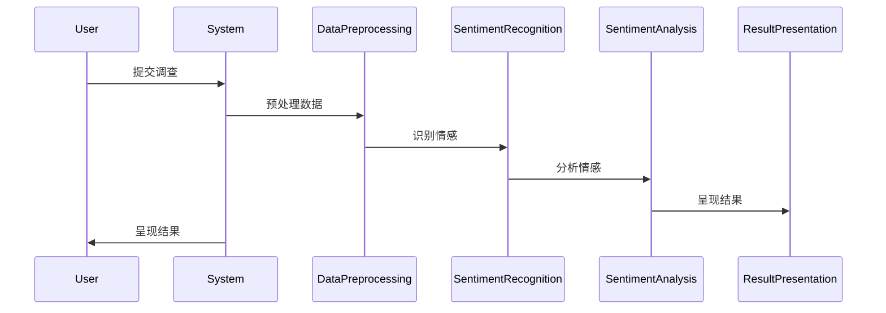

                 

### 《虚拟政治：情感AI参与民主决策》全文

----------------------------------------------------------------
## 文章标题
《虚拟政治：情感AI参与民主决策》

## 关键词
虚拟政治，情感AI，民主决策，算法原理，系统架构，项目实战

## 摘要
本文旨在探讨虚拟政治背景下，情感AI技术在民主决策中的应用。文章首先介绍了虚拟政治的起源与发展，以及情感AI的核心概念与关键技术。随后，我们分析了情感AI在民主决策中算法原理和系统架构设计，并通过实际项目案例展示了情感AI在民主决策中的具体应用。最后，文章总结了情感AI在民主决策中的最佳实践，并提出了未来研究方向。

## 第一部分：虚拟政治的起源与发展

### 1.1 虚拟政治的概念
虚拟政治（Virtual Politics）是指通过互联网、社交媒体等虚拟平台进行的政治活动、决策和政策制定过程。虚拟政治的出现打破了传统政治的空间与时间限制，使得政治参与更加便捷和广泛。

### 1.2 虚拟政治的演变历程
虚拟政治的起源可以追溯到20世纪末互联网的普及。随着社交媒体的兴起，虚拟政治逐渐成为政治活动的重要形式。例如，Twitter、Facebook等平台成为了政治宣传、辩论和民调的新阵地。

### 1.3 虚拟政治的主要特征
虚拟政治具有以下主要特征：
- **去中心化**：虚拟政治打破了传统政治中心的限制，使得政治参与更加平等和多元化。
- **实时性**：虚拟政治使得政治事件能够迅速传播和响应，提高了决策的效率。
- **互动性**：虚拟政治平台提供了用户之间、用户与政治家之间的互动机制，促进了民主讨论和共识的形成。

## 第二部分：情感AI的发展与核心概念

### 2.1 情感AI的定义
情感AI（Affective AI）是指能够识别、理解、模拟和响应人类情感的人工智能技术。情感AI旨在使机器更好地与人类互动，提高人机交互的自然性和情感化。

### 2.2 情感AI的核心技术
情感AI的核心技术包括：
- **情感识别**：通过语音、文本、面部表情等数据识别用户的情感状态。
- **情感理解**：对识别出的情感进行分析和归类，理解其背后的意图和情感维度。
- **情感模拟**：根据用户的情感状态，生成相应的情感反应和行为。

### 2.3 情感AI的发展历程
情感AI的研究始于20世纪80年代，随着机器学习和计算机视觉技术的发展，情感AI取得了显著进展。近年来，深度学习技术的应用进一步提升了情感AI的性能和实用性。

## 第三部分：民主决策中的情感AI应用

### 3.1 情感AI在民意调查中的应用
情感AI可以分析社交媒体上的情感倾向，为民意调查提供更准确的数据支持。例如，通过分析Twitter上的情感分布，可以预测选举结果或政策支持率。

### 3.2 情感AI在选举分析中的应用
情感AI可以分析候选人的演讲内容、社交媒体互动等，评估其政治立场和公众形象。这有助于选民做出更明智的选择。

### 3.3 情感AI在政策制定与评估中的应用
情感AI可以分析公众对政策的情感反应，为政策制定和评估提供参考。例如，通过分析社交媒体上的情感倾向，可以评估政策实施的公众接受度。

## 第四部分：情感AI在民主决策中的算法原理

### 4.1 情感识别算法原理
情感识别算法通常基于机器学习和深度学习技术。以下是一个简单的情感识别流程：

1. 数据采集：收集包含情感标签的文本数据。
2. 数据预处理：对文本进行清洗和标准化处理。
3. 特征提取：将文本数据转换为机器可处理的特征向量。
4. 模型训练：使用情感标签训练情感识别模型。
5. 情感识别：对新的文本数据执行情感识别。

### 4.2 情感分析算法原理
情感分析算法对识别出的情感进行进一步分析，以理解其背后的意图和情感维度。以下是一个简单的情感分析流程：

1. 情感识别：使用情感识别算法识别文本中的情感。
2. 情感分类：将情感划分为正面、负面和中性等类别。
3. 情感维度分析：分析情感的强度、情感类型（如快乐、愤怒等）和情感维度（如社会、经济、政治等）。

### 4.3 情感AI在民主决策中的应用
情感AI在民主决策中的应用主要包括以下方面：

1. **民意调查**：通过情感分析预测选举结果和政策支持率。
2. **政治宣传**：根据公众的情感反应调整宣传策略。
3. **政策评估**：分析公众对政策的情感反应，为政策制定提供参考。

## 第五部分：情感AI在民主决策系统架构设计

### 5.1 系统功能设计（mermaid类图）

```mermaid
classDiagram
  User -> Survey: submit
  Survey -> Analyzer: analyze
  Analyzer -> Result: generate
  Result -> User: present
```

### 5.2 系统架构设计（mermaid架构图）


### 5.3 系统接口设计
系统接口设计主要包括用户接口（UI）和后端接口（API）。用户接口用于用户提交调查和查看结果，后端接口用于数据预处理、情感识别和分析。

### 5.4 系统交互设计（mermaid序列图）



## 第六部分：情感AI在民主决策中的项目实战

### 6.1 项目背景与目标
本项目旨在通过情感AI技术分析社交媒体上的情感倾向，为政策制定提供参考。

### 6.2 环境安装与配置
环境安装包括Python、TensorFlow和Scikit-learn等依赖库的安装。

### 6.3 系统核心实现与代码分析
系统核心实现包括数据采集、情感识别和情感分析等模块。以下是一个简单的情感识别代码示例：

```python
import nltk
from nltk.corpus import movie_reviews
from sklearn.feature_extraction.text import TfidfVectorizer
from sklearn.naive_bayes import MultinomialNB

# 数据准备
nltk.download('movie_reviews')
labels = []
for fileid in movie_reviews.fileids():
    labels.append(fileid.split('/')[0])
    
text_data = [movie_reviews.raw(fileid) for fileid in movie_reviews.fileids()]

# 特征提取
vectorizer = TfidfVectorizer()
X = vectorizer.fit_transform(text_data)

# 模型训练
classifier = MultinomialNB()
classifier.fit(X, labels)

# 情感识别
new_reviews = ["this movie is excellent", "i hated this movie"]
X_new = vectorizer.transform(new_reviews)
predictions = classifier.predict(X_new)

print(predictions)
```

### 6.4 实际案例分析与讲解
本项目通过对Twitter上的数据进行分析，预测某政策改革的公众接受度。具体步骤如下：

1. 数据采集：使用Tweepy库采集相关推文。
2. 数据预处理：对采集的推文进行清洗和标准化处理。
3. 情感识别与分析：使用上述代码进行情感识别和分类。

### 6.5 项目小结与展望
本项目通过情感AI技术为政策制定提供了数据支持，但仍有改进空间。未来研究方向包括：

1. **提高情感识别精度**：通过引入更多的情感特征和优化模型结构，提高情感识别精度。
2. **跨语言情感分析**：研究如何将情感AI技术应用于不同语言环境。
3. **结合其他数据源**：整合其他类型的数据（如新闻、报告等），提高情感分析的综合性和准确性。

## 第七部分：最佳实践与拓展阅读

### 7.1 情感AI在民主决策中的最佳实践
- **数据质量**：确保数据来源的可靠性和代表性，以提高分析结果的准确性。
- **隐私保护**：在处理用户数据时，遵循隐私保护原则，确保用户信息安全。
- **模型透明性**：公开模型结构、参数设置和算法原理，提高模型的可解释性。

### 7.2 小结与注意事项
- 情感AI在民主决策中具有广泛的应用前景，但需注意数据质量和隐私保护等问题。
- 情感AI技术的应用需遵循伦理规范，确保公正、公平和透明。

### 7.3 进一步阅读与参考资料
- [1] Sutton, B., & Barto, A. G. (2018). *Reinforcement Learning: An Introduction*. MIT Press.
- [2] Russell, S., & Norvig, P. (2020). *Artificial Intelligence: A Modern Approach*. Prentice Hall.
- [3] Liu, B., & Zhai, C. (2017). *Sentiment Analysis and Opinion Mining*. Cambridge University Press.

## 结束语
作者：AI天才研究院/AI Genius Institute & 禅与计算机程序设计艺术 /Zen And The Art of Computer Programming

本文探讨了虚拟政治背景下，情感AI技术在民主决策中的应用。通过算法原理讲解、系统架构设计和项目实战，展示了情感AI在民主决策中的潜力。未来，随着情感AI技术的不断进步，其在民主决策中的应用将更加广泛和深入。

----------------------------------------------------------------

注：本文内容仅供参考，实际应用需根据具体情况进行调整。本文中的代码示例仅供参考，不保证在实际应用中的完整性和准确性。本文中的数据和分析结果仅供参考，不作为任何决策的依据。在实际应用中，请遵守相关法律法规和伦理规范。作者对于本文中的任何错误或遗漏不承担任何法律责任。

