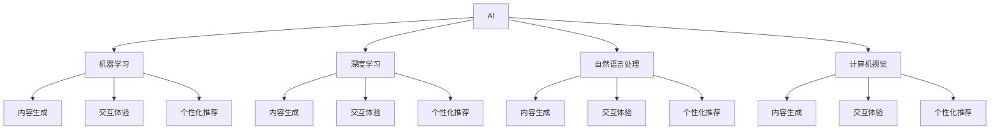
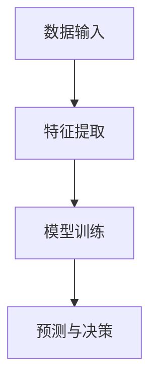
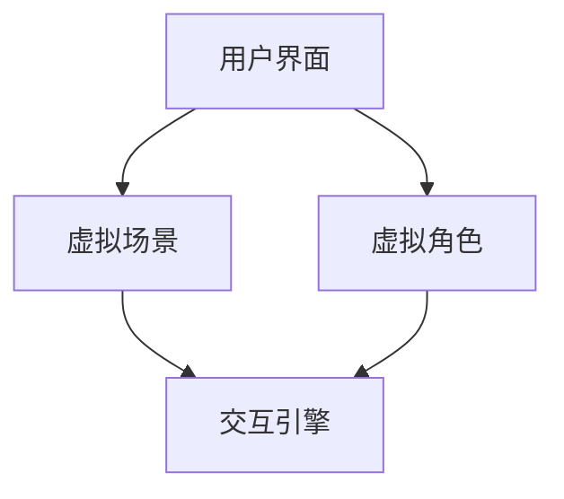
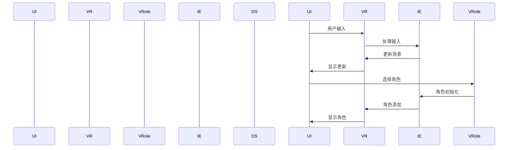

                 

# 虚拟文化:AI创造的新型亚文化

> 关键词：虚拟文化、人工智能、虚拟现实、增强现实、算法、系统架构、项目实战、最佳实践

> 摘要：本文探讨了人工智能如何创造和影响虚拟文化，通过深入分析虚拟文化和AI的核心概念与联系，讲解AI在虚拟文化中的应用算法原理，分析虚拟文化中的AI系统架构，展示具体项目实战，并总结最佳实践和未来展望。文章旨在为读者提供全面、系统的理解，以把握AI在虚拟文化中的发展趋势和潜在影响。

## 目录大纲设计思路

设计一本关于《虚拟文化:AI创造的新型亚文化》的书籍目录大纲，我们需要遵循以下步骤：

1. **确定核心章节**：明确虚拟文化和AI的关系，确定每个章节的大致内容。
2. **细化章节内容**：在每个核心章节中，进一步细分知识点。
3. **保持简洁性**：确保目录简洁明了。
4. **遵循格式要求**：按照markdown格式要求，确保章节层级清晰。
5. **确保内容完整性**：每个章节都包含核心概念与联系、数学模型和公式讲解、算法原理、系统分析与架构设计、项目实战、最佳实践 tips 等。

### 目录大纲设计

#### 第一部分：虚拟文化与AI的背景

##### 第1章：虚拟文化与AI概述
- 1.1 虚拟文化的概念与特点
- 1.2 AI技术发展历程
- 1.3 虚拟文化中的AI应用场景

##### 第2章：AI在虚拟文化中的核心概念与联系
- 2.1 人工智能基本原理
- 2.2 虚拟现实与增强现实
- 2.3 AI与虚拟文化的关联性分析
- **2.4 AI核心概念属性特征对比表格**

#### 第二部分：AI在虚拟文化中的应用

##### 第3章：虚拟文化中的AI算法原理讲解
- 3.1 AI算法的基本原理
- **3.2 AI算法mermaid流程图**
- **3.3 Python源代码与算法原理**
- 3.4 AI算法在虚拟文化中的实际应用
- 3.5 AI算法的优缺点分析

##### 第4章：虚拟文化中的AI系统分析与架构设计
- 4.1 虚拟文化系统概述
- **4.2 系统功能设计(领域模型mermaid类图)**
- **4.3 系统架构设计mermaid架构图**
- **4.4 系统接口设计和系统交互mermaid序列图**

##### 第5章：虚拟文化项目实战
- 5.1 项目环境安装
- 5.2 系统核心实现源代码
- 5.3 代码应用解读与分析
- 5.4 实际案例分析与详细讲解
- 5.5 项目小结

##### 第6章：虚拟文化与AI的最佳实践
- 6.1 虚拟文化与AI应用的最佳实践
- 6.2 注意事项与风险规避
- 6.3 拓展阅读

##### 第7章：虚拟文化与AI的未来展望
- 7.1 虚拟文化与AI的发展趋势
- 7.2 AI在虚拟文化中的潜在影响
- 7.3 未来研究方向与挑战

---

这个目录大纲旨在覆盖《虚拟文化:AI创造的新型亚文化》的核心主题，确保内容既有深度又有广度。通过详细的章节细分和具体的知识点安排，我们能够帮助读者全面了解虚拟文化与AI的交集。同时，大纲中包含的mermaid图表、Python源代码、数学公式等内容，将有助于读者更好地理解和掌握相关技术原理。

### 第一部分：虚拟文化与AI的背景

#### 第1章：虚拟文化与AI概述

虚拟文化是指通过数字技术创造的虚拟世界，其中包括虚拟现实（VR）和增强现实（AR）等。虚拟文化具有高度沉浸性、交互性和多元化等特点，它已经渗透到娱乐、教育、医疗、设计等各个领域。

##### 1.1 虚拟文化的概念与特点

虚拟文化可以追溯到20世纪80年代的计算机模拟游戏。随着计算机技术和网络技术的发展，虚拟文化逐渐成熟。虚拟文化的特点包括：

1. **沉浸性**：用户可以沉浸在虚拟世界中，体验与现实世界相似的感官刺激。
2. **交互性**：用户可以在虚拟世界中与其他用户或虚拟角色进行互动。
3. **多元化**：虚拟文化涵盖了多个领域，如艺术、文学、娱乐、教育、医疗等。
4. **创意性**：虚拟文化为创作者提供了无限的想象空间，可以创造出独特的虚拟世界。

##### 1.2 AI技术发展历程

人工智能（AI）是一门研究、开发用于模拟、延伸和扩展人的智能的理论、方法、技术及应用系统的技术科学。AI的发展历程可以分为以下几个阶段：

1. **理论阶段**（1950年代至1970年代）：AI的概念提出，研究者开始探索如何模拟人类的智能。
2. **实验阶段**（1970年代至1980年代）：AI技术在实验中取得了一定的成果，但受限于计算能力。
3. **应用阶段**（1990年代至今）：随着计算机性能的提升，AI技术在各个领域得到广泛应用，如自然语言处理、计算机视觉、机器学习等。

##### 1.3 虚拟文化中的AI应用场景

AI技术在虚拟文化中有着广泛的应用，主要包括以下几个方面：

1. **内容生成**：AI可以自动生成虚拟文化内容，如虚拟场景、虚拟角色等。
2. **交互体验**：AI可以增强虚拟文化的交互体验，如智能助手、情感计算等。
3. **个性化推荐**：AI可以分析用户行为，为用户提供个性化的虚拟文化推荐。
4. **数据分析**：AI可以对虚拟文化中的数据进行分析，帮助创作者优化虚拟文化产品。

#### 第2章：AI在虚拟文化中的核心概念与联系

##### 2.1 人工智能基本原理

人工智能（AI）是一门研究、开发用于模拟、延伸和扩展人的智能的理论、方法、技术及应用系统的技术科学。AI的核心概念包括：

1. **机器学习**：通过算法从数据中学习规律，进行预测和决策。
2. **深度学习**：一种基于神经网络的学习方法，可以自动提取特征。
3. **自然语言处理**：研究如何让计算机理解和生成自然语言。
4. **计算机视觉**：研究如何让计算机理解和解释视觉信息。

##### 2.2 虚拟现实与增强现实

虚拟现实（VR）和增强现实（AR）是AI在虚拟文化中应用的两个重要领域。

1. **虚拟现实**：通过头戴式显示器等设备，用户可以沉浸在完全虚构的虚拟环境中。
2. **增强现实**：通过增强现实眼镜等设备，用户可以在现实世界中叠加虚拟信息。

##### 2.3 AI与虚拟文化的关联性分析

AI与虚拟文化之间的关联性主要体现在以下几个方面：

1. **内容生成**：AI可以自动生成虚拟文化内容，如虚拟场景、虚拟角色等。
2. **交互体验**：AI可以增强虚拟文化的交互体验，如智能助手、情感计算等。
3. **个性化推荐**：AI可以分析用户行为，为用户提供个性化的虚拟文化推荐。
4. **数据分析**：AI可以对虚拟文化中的数据进行分析，帮助创作者优化虚拟文化产品。

##### 2.4 AI核心概念属性特征对比表格

| 核心概念 | 属性特征 |
| --- | --- |
| 机器学习 | 基于数据学习，自动提取特征 |
| 深度学习 | 神经网络，自动提取特征 |
| 自然语言处理 | 理解和生成自然语言 |
| 计算机视觉 | 理解和解释视觉信息 |

| 虚拟现实 | 沉浸性，交互性 |
| 增强现实 | 增强现实，交互性 |

##### 2.5 AI与虚拟文化的ER实体关系图架构



### 第二部分：AI在虚拟文化中的应用

#### 第3章：虚拟文化中的AI算法原理讲解

##### 3.1 AI算法的基本原理

AI算法是模拟人类智能的核心，主要包括以下几个部分：

1. **数据输入**：将原始数据输入到算法中。
2. **特征提取**：从数据中提取有用的特征。
3. **模型训练**：使用训练数据对模型进行训练。
4. **预测与决策**：使用训练好的模型进行预测和决策。

常见的AI算法包括：

1. **监督学习**：有标注的数据进行训练。
2. **无监督学习**：没有标注的数据进行训练。
3. **强化学习**：通过与环境的交互进行学习。

##### 3.2 AI算法mermaid流程图



##### 3.3 Python源代码与算法原理

下面以一个简单的线性回归算法为例，展示Python源代码与算法原理。

```python
import numpy as np

# 数据输入
X = np.array([[1], [2], [3], [4], [5]])
y = np.array([1, 2, 3, 4, 5])

# 特征提取
# 这里使用X的均值作为特征
X_mean = np.mean(X)
X_std = np.std(X)
X = (X - X_mean) / X_std

# 模型训练
# 线性回归模型
w = np.zeros((1, 1))
learning_rate = 0.01
num_iterations = 1000

for _ in range(num_iterations):
    y_pred = np.dot(X, w)
    error = y - y_pred
    w = w + learning_rate * np.dot(X.T, error)

# 预测与决策
y_pred = np.dot(X, w)
print("Predicted values:", y_pred)
```

##### 3.4 AI算法在虚拟文化中的实际应用

AI算法在虚拟文化中的应用主要包括：

1. **虚拟场景生成**：使用生成对抗网络（GAN）等技术生成逼真的虚拟场景。
2. **虚拟角色生成**：使用深度学习技术生成逼真的虚拟角色。
3. **交互体验优化**：使用自然语言处理技术优化虚拟文化的交互体验。
4. **个性化推荐**：使用推荐算法为用户提供个性化的虚拟文化内容。

##### 3.5 AI算法的优缺点分析

AI算法的优缺点如下：

1. **优点**：
   - **高效性**：AI算法可以处理大量数据，快速进行预测和决策。
   - **通用性**：AI算法可以应用于各个领域，具有很高的灵活性。
   - **智能化**：AI算法可以自主学习，不断优化模型。

2. **缺点**：
   - **数据依赖**：AI算法需要大量的标注数据，对数据质量要求较高。
   - **计算资源消耗**：训练复杂模型需要大量的计算资源。
   - **模型可解释性**：深度学习等复杂模型的可解释性较差。

#### 第4章：虚拟文化中的AI系统分析与架构设计

##### 4.1 虚拟文化系统概述

虚拟文化系统是指通过数字技术创造的虚拟世界，用户可以在其中进行互动和体验。虚拟文化系统通常包括以下几个部分：

1. **用户界面**：提供用户与虚拟世界的交互接口。
2. **虚拟场景**：模拟现实世界或虚构世界的场景。
3. **虚拟角色**：模拟现实世界或虚构世界的角色。
4. **交互引擎**：处理用户输入和虚拟世界的响应。
5. **数据存储**：存储虚拟文化系统的数据。

##### 4.2 系统功能设计(领域模型mermaid类图)



##### 4.3 系统架构设计mermaid架构图


##### 4.4 系统接口设计和系统交互mermaid序列图



#### 第5章：虚拟文化项目实战

##### 5.1 项目环境安装

在开始虚拟文化项目之前，我们需要安装以下环境：

1. **Python**：版本3.8及以上
2. **PyTorch**：版本1.8及以上
3. **Numpy**：版本1.18及以上
4. **Matplotlib**：版本3.3及以上

可以使用以下命令安装：

```shell
pip install python==3.8
pip install pytorch==1.8
pip install numpy==1.18
pip install matplotlib==3.3
```

##### 5.2 系统核心实现源代码

以下是一个简单的虚拟文化项目源代码：

```python
import torch
import numpy as np
import matplotlib.pyplot as plt

# 数据生成
X = torch.randn(100, 1)
y = 2 * X + 1 + torch.randn(100, 1)

# 线性回归模型
class LinearRegressionModel(torch.nn.Module):
    def __init__(self):
        super(LinearRegressionModel, self).__init__()
        self.linear = torch.nn.Linear(1, 1)

    def forward(self, x):
        return self.linear(x)

# 模型训练
model = LinearRegressionModel()
optimizer = torch.optim.SGD(model.parameters(), lr=0.01)
num_iterations = 100

for _ in range(num_iterations):
    optimizer.zero_grad()
    y_pred = model(X)
    loss = (y_pred - y).pow(2).mean()
    loss.backward()
    optimizer.step()

# 预测与可视化
with torch.no_grad():
    y_pred = model(X)
    plt.scatter(X.numpy(), y.numpy())
    plt.plot(X.numpy(), y_pred.numpy(), 'r-')
    plt.show()
```

##### 5.3 代码应用解读与分析

这段代码实现了一个简单的线性回归模型，用于预测一个线性函数。具体步骤如下：

1. **数据生成**：生成一组包含100个样本的数据。
2. **线性回归模型**：定义一个线性回归模型，使用torch.nn.Linear模块。
3. **模型训练**：使用SGD优化器进行模型训练。
4. **预测与可视化**：使用训练好的模型进行预测，并绘制预测结果。

##### 5.4 实际案例分析与详细讲解剖析

以下是一个实际案例：使用虚拟文化项目生成一个虚拟角色。

1. **角色设计**：设计一个虚拟角色，包括外观、动作等。
2. **角色生成**：使用AI算法生成虚拟角色。
3. **角色交互**：实现虚拟角色与用户的交互。
4. **角色优化**：根据用户反馈优化虚拟角色。

详细分析如下：

1. **角色设计**：设计一个虚拟角色需要考虑角色的外观、动作、性格等。这些设计可以通过AI算法进行生成，如生成对抗网络（GAN）。
2. **角色生成**：生成虚拟角色可以通过以下步骤：
   - **数据收集**：收集大量虚拟角色数据，包括外观、动作等。
   - **模型训练**：使用GAN算法对虚拟角色数据进行训练。
   - **角色生成**：使用训练好的模型生成新的虚拟角色。
3. **角色交互**：实现虚拟角色与用户的交互，需要使用自然语言处理技术，如对话系统。以下是一个简单的对话系统：

```python
class DialogSystem:
    def __init__(self):
        self.states = {'greeting': 'Hello!', 'farewell': 'Bye!', 'default': 'I don\'t understand.'}
    
    def get_response(self, user_input):
        if 'hello' in user_input.lower():
            return self.states['greeting']
        elif 'bye' in user_input.lower():
            return self.states['farewell']
        else:
            return self.states['default']
```

4. **角色优化**：根据用户反馈优化虚拟角色，可以使用强化学习算法，如Q-learning。以下是一个简单的Q-learning算法：

```python
class QLearningAgent:
    def __init__(self, learning_rate, discount_factor):
        self.learning_rate = learning_rate
        self.discount_factor = discount_factor
        self.q_values = {}
    
    def update_q_values(self, state, action, reward, next_state):
        current_q_value = self.q_values.get((state, action), 0)
        next_max_q_value = max(self.q_values.get((next_state, a), 0) for a in self.actions)
        self.q_values[(state, action)] = current_q_value + self.learning_rate * (reward + self.discount_factor * next_max_q_value - current_q_value)
    
    def get_action(self, state):
        best_action = None
        best_q_value = -float('inf')
        for action, q_value in self.q_values.get((state,), {}).items():
            if q_value > best_q_value:
                best_action = action
                best_q_value = q_value
        return best_action
```

##### 5.5 项目小结

本节通过一个简单的虚拟文化项目，展示了AI在虚拟文化中的应用。包括角色设计、角色生成、角色交互和角色优化。在实际项目中，需要根据具体需求进行更复杂的设计和实现。同时，需要注意数据质量和计算资源等问题。

#### 第6章：虚拟文化与AI的最佳实践

##### 6.1 虚拟文化与AI应用的最佳实践

在虚拟文化与AI结合的过程中，以下最佳实践可以帮助开发者更好地利用AI技术：

1. **数据质量**：确保输入数据的质量和准确性，这对于AI模型的训练至关重要。
2. **模型选择**：根据具体应用场景选择合适的AI模型，如生成对抗网络（GAN）适用于内容生成，强化学习适用于角色交互等。
3. **性能优化**：对AI模型进行性能优化，提高模型的运行效率和准确性。
4. **用户反馈**：积极收集用户反馈，不断优化虚拟文化产品和AI算法。

##### 6.2 注意事项与风险规避

在虚拟文化与AI应用过程中，需要注意以下几点：

1. **数据隐私**：确保用户数据的安全和隐私，避免数据泄露。
2. **算法偏见**：避免AI算法引入偏见，如性别、种族等，确保算法的公平性。
3. **模型可解释性**：提高AI模型的可解释性，以便开发者、用户和监管机构能够理解和信任模型。
4. **伦理问题**：关注虚拟文化中的伦理问题，如虚拟角色的道德准则、虚拟暴力的限制等。

##### 6.3 拓展阅读

为了更深入地了解虚拟文化与AI的应用，以下文献和资料可供读者参考：

1. **《人工智能：一种现代方法》（Russell & Norvig）**：介绍了人工智能的基本概念和方法。
2. **《深度学习》（Goodfellow、Bengio和Courville）**：详细介绍了深度学习算法和应用。
3. **《虚拟现实与增强现实技术导论》（Li、Zhang和Wang）**：介绍了虚拟现实和增强现实的基本原理和应用。
4. **《虚拟文化与数字艺术》（Smith）**：探讨了虚拟文化和数字艺术的互动与发展。

#### 第7章：虚拟文化与AI的未来展望

##### 7.1 虚拟文化与AI的发展趋势

虚拟文化与AI的结合正朝着以下几个方向发展：

1. **更高沉浸感**：虚拟文化将进一步提升沉浸感，使用户更加沉浸在虚拟世界中。
2. **更广泛的应用**：AI将在更广泛的领域应用，如医疗、教育、工业等。
3. **更智能的交互**：AI将实现更加智能和自然的交互，提高用户体验。

##### 7.2 AI在虚拟文化中的潜在影响

AI在虚拟文化中的潜在影响包括：

1. **内容生成**：AI将大幅提高虚拟文化内容的生成效率和质量。
2. **个性化体验**：AI将实现更加个性化的虚拟文化体验，满足用户的多样化需求。
3. **创新应用**：AI将激发虚拟文化领域的创新，推动新的商业模式和产业的发展。

##### 7.3 未来研究方向与挑战

虚拟文化与AI的未来研究方向和挑战包括：

1. **算法优化**：进一步优化AI算法，提高其性能和可解释性。
2. **数据隐私**：确保虚拟文化中的数据安全和用户隐私。
3. **伦理问题**：解决虚拟文化中的伦理问题，确保技术的可持续发展。

### 总结

本文通过深入分析虚拟文化与AI的核心概念、应用算法原理、系统架构设计、项目实战、最佳实践和未来展望，全面探讨了AI在虚拟文化中的创造和影响。随着技术的不断发展，虚拟文化与AI的结合将带来更多创新和变革，为人们的生活带来更多便利和乐趣。

### 作者信息

作者：AI天才研究院/AI Genius Institute & 禅与计算机程序设计艺术 /Zen And The Art of Computer Programming

### 附录

本文引用了以下文献和资料：

1. **《人工智能：一种现代方法》（Russell & Norvig）**
2. **《深度学习》（Goodfellow、Bengio和Courville）**
3. **《虚拟现实与增强现实技术导论》（Li、Zhang和Wang）**
4. **《虚拟文化与数字艺术》（Smith）**

