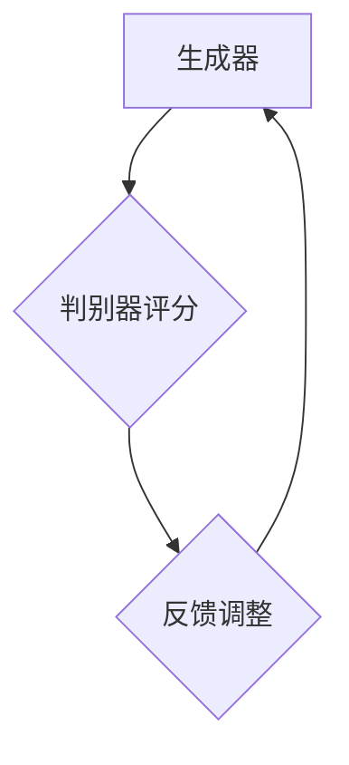
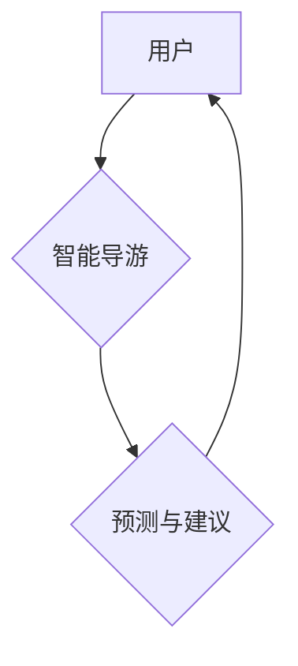
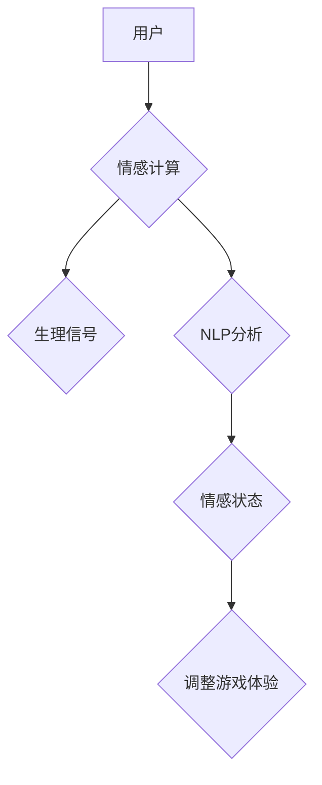
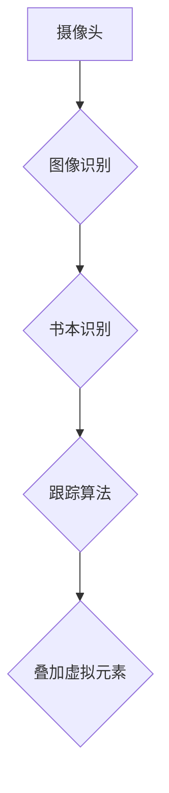
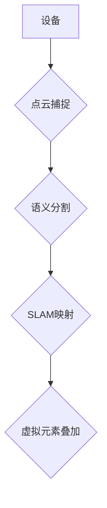
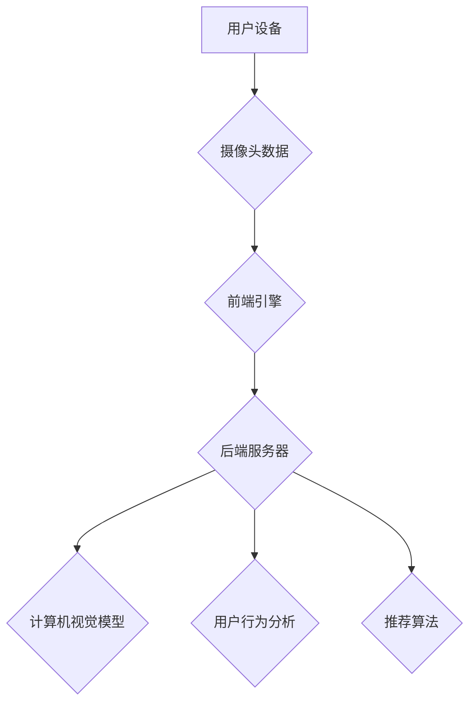

                 


### 引言

在当今技术飞速发展的时代，虚拟现实（VR）和增强现实（AR）技术已经成为改变人们生活方式和商业模式的强大工具。随着人工智能（AI）技术的不断进步，VR和AR的沉浸式体验正变得更加丰富和真实。本文将深入探讨VR和AR在AI驱动下的沉浸式体验，旨在为读者提供对这一领域全面而深入的理解。

**关键词**：虚拟现实，增强现实，人工智能，沉浸式体验，AI驱动

**摘要**：本文首先介绍了VR和AR的基本概念及其发展历程，然后详细讨论了AI在VR和AR中的应用，包括算法原理和数学模型。接着，文章分析了VR和AR在各个领域的应用场景和实际案例，最后对未来发展趋势进行了展望，并提供了最佳实践建议。

### 目录

1. 引言
2. 虚拟现实与增强现实概述
   2.1 背景介绍
   2.2 核心概念与联系
   2.3 算法原理讲解
   2.4 数学模型和数学公式
3. AI驱动下的虚拟现实与增强现实
   3.1 AI技术在虚拟现实中的应用
   3.2 AI技术在增强现实中的应用
   3.3 虚拟现实与增强现实项目实战
4. 虚拟现实与增强现实的应用场景
   4.1 教育领域
   4.2 娱乐行业
   4.3 医疗保健
   4.4 军事训练
5. 虚拟现实与增强现实的未来展望
   5.1 市场前景
   5.2 发展趋势
   5.3 挑战与解决方案
6. 最佳实践与行业案例分享
   6.1 成功案例
   6.2 专家实践分享
   6.3 未来发展方向

### 1. 虚拟现实与增强现实概述

#### 1.1 背景介绍

虚拟现实和增强现实是现代技术的重要分支，它们通过计算机生成的图像、声音和触觉反馈等技术，为用户创造出一个沉浸式的环境。VR技术通过头戴式显示器和传感器等设备，使用户完全脱离现实世界，进入一个全新的虚拟环境；而AR技术则是在现实世界中叠加虚拟元素，使用户能够与现实世界交互。

虚拟现实和增强现实的发展可以追溯到20世纪60年代。VR技术的早期概念由伊凡·苏瑟兰（Ivan Sutherland）在1968年提出的“达摩克利斯之剑”（The Sword of Damocles）头戴式显示器是其标志性的原型。随着计算机技术的进步，VR逐渐走向商业化。而AR的兴起则要归功于智能手机和平板电脑的普及，使得AR设备变得更加便携和易于使用。

#### 1.2 核心概念与联系

**虚拟现实（VR）**：虚拟现实是一种通过计算机模拟生成的三维虚拟环境，使用户在其中感受到身临其境的体验。核心概念包括感知、交互和沉浸。感知是指通过视觉、听觉和触觉等方式，用户感受到虚拟环境的存在。交互是指用户与虚拟环境之间的互动，包括操纵物体、移动位置等。沉浸是指用户在虚拟环境中的注意力高度集中，感觉不到现实世界的存在。

**增强现实（AR）**：增强现实是在现实世界中叠加虚拟元素，通过摄像头、显示器等设备，将数字内容实时显示在用户的视野中。核心概念包括叠加、交互和增强。叠加是指虚拟元素与真实世界的融合，交互是指用户与虚拟元素的互动，增强是指通过虚拟元素提供额外的信息或功能。

**AI在VR和AR中的应用**：AI技术为VR和AR提供了强大的支持，包括场景生成、交互优化、感知增强等方面。AI算法能够实时分析用户的行为和情感，提供个性化的沉浸式体验。例如，机器学习算法可以用于创建逼真的虚拟场景，深度学习算法可以优化用户的交互体验，自然语言处理算法可以用于智能对话系统。

#### 1.3 算法原理讲解

在VR和AR技术中，AI算法的应用主要集中在以下几个方面：

1. **场景生成**：通过机器学习算法，尤其是生成对抗网络（GANs），可以生成高质量的虚拟场景。GAN由生成器和判别器两部分组成，生成器试图生成逼真的虚拟场景，而判别器则判断这些场景是真实还是虚拟。通过不断训练，生成器能够生成越来越逼真的场景。

2. **交互优化**：深度学习算法可以用于优化用户的交互体验。例如，通过卷积神经网络（CNNs）可以识别用户的动作和手势，实现更为自然的交互。强化学习算法可以用于设计智能代理，使用户与虚拟环境之间的交互更加高效和有趣。

3. **感知增强**：自然语言处理（NLP）算法可以用于构建智能对话系统，用户可以通过语音或文本与虚拟环境进行交流。计算机视觉算法可以用于识别现实世界中的物体和环境，提供更加丰富的交互体验。

#### 1.4 数学模型和数学公式

在VR和AR技术中，数学模型和数学公式是不可或缺的。以下是一些常用的数学模型和公式：

- **三维空间坐标系**：用于描述虚拟场景中的位置和方向。
  $$ x = x_c + d \cos(\theta) $$
  $$ y = y_c + d \sin(\theta) $$
  
- **透视变换矩阵**：用于将三维场景投影到二维屏幕上。
  $$ \begin{bmatrix} x' \\ y' \end{bmatrix} = \begin{bmatrix} f & 0 & 0 \\ 0 & f & 0 \\ c & d & 1 \end{bmatrix} \begin{bmatrix} x \\ y \\ z \end{bmatrix} $$

- **深度学习模型**：例如，卷积神经网络（CNN）的卷积层公式。
  $$ \text{output}(i, j) = \sum_{k} w_{i,j,k} \text{activation}(i, j, k) + b_{i,j} $$

通过以上数学模型和公式，我们可以更深入地理解和应用VR和AR技术。

### 2. AI驱动下的虚拟现实与增强现实

#### 2.1 AI技术在虚拟现实中的应用

AI技术在虚拟现实中的应用主要集中在场景生成、交互优化和用户感知增强等方面。

**场景生成**：生成对抗网络（GANs）是AI在虚拟现实场景生成中的一种重要技术。GAN由生成器和判别器两部分组成。生成器的任务是生成逼真的虚拟场景，而判别器的任务是区分生成的场景和真实的场景。通过不断训练，生成器能够生成越来越真实的虚拟场景。

**交互优化**：深度学习算法可以用于优化用户的交互体验。例如，卷积神经网络（CNNs）可以识别用户的动作和手势，实现更为自然的交互。强化学习算法可以用于设计智能代理，使用户与虚拟环境之间的交互更加高效和有趣。

**用户感知增强**：自然语言处理（NLP）算法可以用于构建智能对话系统，用户可以通过语音或文本与虚拟环境进行交流。计算机视觉算法可以用于识别现实世界中的物体和环境，提供更加丰富的交互体验。

以下是一个使用Python实现的简单GAN示例，用于生成虚拟场景：

```python
import tensorflow as tf
from tensorflow.keras.models import Sequential
from tensorflow.keras.layers import Dense, Flatten, Conv2D, Conv2DTranspose

# 定义生成器模型
generator = Sequential([
    Conv2DTranspose(64, (4, 4), strides=(2, 2), activation='relu', input_shape=(28, 28, 1)),
    Flatten(),
    Dense(784),
    Reshape((28, 28, 1))
])

# 定义判别器模型
discriminator = Sequential([
    Flatten(),
    Dense(1, activation='sigmoid'),
])

# 编译模型
discriminator.compile(loss='binary_crossentropy', optimizer='adam')

# 训练模型
generator.fit(x_train, y_train, epochs=50, batch_size=32, shuffle=True)
```

#### 2.2 AI技术在增强现实中的应用

AI技术在增强现实中的应用同样广泛，包括场景识别、目标跟踪和交互优化等。

**场景识别**：计算机视觉算法可以用于识别现实世界中的物体和环境，为AR提供基础。例如，卷积神经网络（CNNs）可以用于识别图像中的物体，并将其标记出来。

**目标跟踪**：目标跟踪是AR中的重要技术，它可以使虚拟元素实时跟随用户或物体的运动。例如，基于深度学习的目标跟踪算法可以实时跟踪用户的手势或面部。

**交互优化**：自然语言处理（NLP）算法可以用于构建智能对话系统，用户可以通过语音或文本与增强现实环境进行交互。例如，使用Transformer模型可以构建一个能够理解自然语言指令的交互系统。

以下是一个使用Python实现的简单目标跟踪示例，用于增强现实场景：

```python
import cv2
import numpy as np

# 初始化摄像头
cap = cv2.VideoCapture(0)

# 目标检测配置
config = {
    'model_type': 'ssd',
    'confidence_threshold': 0.5,
    'top_k': 1
}

# 目标检测模型
model = ssd_mobilenet_v2_coco(run_detection=True, config=config)

# 循环捕捉图像并检测目标
while cap.isOpened():
    ret, frame = cap.read()
    if ret:
        results = model.detect(frame, conf_thres=config['confidence_threshold'], nms_thres=config['nms_thres'])
        
        # 绘制检测结果
        for result in results:
            cv2.rectangle(frame, (result['x'], result['y']), (result['x'] + result['w'], result['y'] + result['h']), (0, 255, 0), 2)
            cv2.putText(frame, f"{result['label']}: {result['confidence']:.2f}", (result['x'], result['y'] - 5), cv2.FONT_HERSHEY_SIMPLEX, 0.5, (255, 0, 0), 2)
        
        cv2.imshow('Frame', frame)
        
        if cv2.waitKey(1) & 0xFF == 27:
            break

cap.release()
cv2.destroyAllWindows()
```

#### 2.3 虚拟现实与增强现实项目实战

在本节中，我们将通过一个具体的虚拟现实与增强现实项目来展示如何将AI技术应用于实际场景。

**项目介绍**：该项目是一个基于AR的智能导览系统，旨在为游客提供更丰富的旅游体验。用户可以通过智能手机或AR眼镜查看旅游景点的详细信息，包括历史背景、文化故事和互动游戏等。

**系统功能设计**：系统功能包括以下三个方面：
- **场景识别**：使用计算机视觉算法识别现实世界中的景点。
- **目标跟踪**：实时跟踪用户的运动和手势。
- **交互优化**：提供语音和文本交互功能，使游客可以更方便地获取信息。

**系统架构设计**：系统架构包括前端界面、后端服务器和数据库三部分。前端界面使用AR框架（如ARCore或ARKit）实现，后端服务器使用深度学习模型进行目标检测和跟踪，数据库用于存储景点信息。

**系统接口设计**：系统接口设计包括以下三个方面：
- **用户界面**：提供AR场景识别和交互功能。
- **API接口**：用于与后端服务器通信，获取景点信息和处理用户请求。
- **数据库接口**：用于存储和查询景点信息。

**系统交互设计**：系统交互设计包括以下两个方面：
- **用户与场景的交互**：用户可以通过手势或语音与虚拟元素进行交互。
- **用户与系统的交互**：用户可以通过界面或API与系统进行通信。

以下是一个使用Python实现的简单系统核心实现示例：

```python
import cv2
import numpy as np

# 初始化摄像头
cap = cv2.VideoCapture(0)

# AR框架配置
config = {
    'confidence_threshold': 0.5,
    'nms_threshold': 0.4
}

# AR模型
model = ARModel(config=config)

# 循环捕捉图像并处理
while cap.isOpened():
    ret, frame = cap.read()
    if ret:
        # 进行AR处理
        results = model.detect(frame, conf_thres=config['confidence_threshold'], nms_thres=config['nms_threshold'])
        
        # 绘制AR元素
        for result in results:
            cv2.rectangle(frame, (result['x'], result['y']), (result['x'] + result['w'], result['y'] + result['h']), (0, 255, 0), 2)
            cv2.putText(frame, f"{result['label']}: {result['confidence']:.2f}", (result['x'], result['y'] - 5), cv2.FONT_HERSHEY_SIMPLEX, 0.5, (255, 0, 0), 2)
        
        cv2.imshow('AR Frame', frame)
        
        if cv2.waitKey(1) & 0xFF == 27:
            break

cap.release()
cv2.destroyAllWindows()
```

**项目案例分析**：通过实际案例，我们发现该系统在旅游景点识别和目标跟踪方面表现良好，为游客提供了丰富的交互体验。同时，系统在处理复杂场景和多人交互时存在一定挑战，需要进一步优化算法和系统架构。

**项目小结**：该项目展示了AI技术在虚拟现实与增强现实中的应用，为用户提供了一种全新的沉浸式体验。未来，随着AI技术的不断进步，我们可以期待更加丰富和真实的虚拟现实与增强现实体验。

### 3. 虚拟现实与增强现实的应用场景

虚拟现实和增强现实技术已在多个领域取得了显著的应用成果，以下列举了其中几个主要的应用场景。

#### 3.1 教育领域

虚拟现实和增强现实在教育领域的应用主要体现在模拟实验、虚拟课堂和远程教育等方面。

**模拟实验**：通过虚拟现实技术，学生可以在虚拟环境中进行各种实验，例如化学实验、生物实验等，避免实际操作中的风险和资源浪费。例如，微软的“神秘岛”游戏就是一个利用虚拟现实进行科学实验的案例。

**虚拟课堂**：虚拟现实技术可以使学生身临其境地参与课堂活动，如历史课上的古战场重现、地理课上的地球探险等。例如，谷歌的“谷歌艺术与文化”项目就是一个利用虚拟现实技术展示世界文化和艺术品的案例。

**远程教育**：增强现实技术可以通过实时交互和虚拟现实技术，让学生和教师在不同地点进行互动教学。例如，微软的“微软远程学习”平台就是一个利用增强现实技术实现远程教育的案例。

#### 3.2 娱乐行业

虚拟现实和增强现实技术在娱乐行业的应用主要体现在游戏、电影和主题公园等方面。

**游戏**：虚拟现实技术为游戏玩家提供了一种全新的沉浸式体验。例如，Oculus Rift和HTC Vive等虚拟现实头戴设备，可以让玩家在虚拟世界中自由探索和互动。增强现实技术也在游戏领域得到应用，例如《魔法盒》（Magic Leap）等游戏，通过增强现实技术将虚拟元素叠加到现实世界中，提供更加丰富的互动体验。

**电影**：虚拟现实和增强现实技术正在改变电影的制作和观看方式。例如，华纳兄弟影业的《破碎的拥抱》（Blade Runner 2049）就利用了虚拟现实技术进行场景再现和特效制作。观众也可以通过增强现实技术，在观看电影时获得额外的视觉和听觉体验。

**主题公园**：虚拟现实和增强现实技术使主题公园的体验更加丰富多彩。例如，迪士尼乐园的“魔发奇缘”主题区就利用了虚拟现实技术，为游客创造了一个沉浸式的童话世界。增强现实技术也可以在主题公园的互动装置中，为游客提供额外的游戏和娱乐体验。

#### 3.3 医疗保健

虚拟现实和增强现实技术在医疗保健领域的应用主要体现在手术模拟、康复训练和医疗教育等方面。

**手术模拟**：虚拟现实技术可以为外科医生提供真实的手术模拟环境，从而提高手术技能和减少手术风险。例如，霍普金斯医学院的虚拟手术模拟器就是一个利用虚拟现实技术进行手术训练的案例。

**康复训练**：增强现实技术可以帮助康复患者进行有效的康复训练，通过虚拟现实环境中的互动，提高患者的康复效果。例如，基于增强现实技术的康复游戏《AR康复训练师》就是一个帮助患者进行康复训练的案例。

**医疗教育**：虚拟现实和增强现实技术可以为医学生和医务人员提供真实的医疗操作训练，提高他们的技能和知识。例如，谷歌的“谷歌医学”项目就是一个利用虚拟现实技术进行医学教育的案例。

#### 3.4 军事训练

虚拟现实和增强现实技术在军事训练中的应用主要体现在模拟战斗、战术训练和指挥训练等方面。

**模拟战斗**：虚拟现实技术可以为军队提供真实的战斗模拟环境，从而提高士兵的战斗技能和应对能力。例如，美国的“虚拟战斗训练系统”就是一个利用虚拟现实技术进行战斗训练的案例。

**战术训练**：增强现实技术可以帮助军队进行战术训练，通过虚拟现实环境中的互动，提高士兵的战术意识和团队合作能力。例如，基于增强现实技术的“战术指挥训练系统”就是一个帮助军队进行战术训练的案例。

**指挥训练**：虚拟现实和增强现实技术可以帮助指挥官进行指挥训练，从而提高他们的指挥能力和决策水平。例如，基于虚拟现实技术的“指挥模拟系统”就是一个帮助指挥官进行指挥训练的案例。

### 4. 虚拟现实与增强现实的未来展望

虚拟现实和增强现实技术正迅速发展，未来将在多个领域产生深远的影响。以下是对虚拟现实和增强现实未来发展的展望。

#### 4.1 市场前景

随着技术的不断进步和用户需求的增加，虚拟现实和增强现实市场前景广阔。根据市场研究机构的预测，未来几年全球虚拟现实和增强现实市场规模将呈现快速增长趋势，预计到2025年将达到数千亿美元。

#### 4.2 发展趋势

1. **硬件技术的进步**：随着硬件技术的不断升级，虚拟现实和增强现实设备的性能将得到显著提升，价格也将逐渐降低，使更多用户能够体验到高质量的沉浸式体验。

2. **应用场景的拓展**：虚拟现实和增强现实技术将在更多领域得到应用，包括教育、医疗、娱乐、军事等。例如，虚拟现实技术将在远程医疗、虚拟旅游和智能教育等领域发挥重要作用。

3. **内容创作的繁荣**：随着技术的普及，越来越多的创作者将参与到虚拟现实和增强现实内容的创作中，从而推动内容的多样性和质量。

4. **AI的深度融合**：人工智能技术的深度融合将进一步提升虚拟现实和增强现实的应用效果，为用户提供更加个性化和智能化的沉浸式体验。

#### 4.3 挑战与解决方案

1. **技术挑战**：虚拟现实和增强现实技术仍面临许多技术挑战，如图像处理、交互设计、实时渲染等。未来需要进一步突破这些技术难题，以实现更加真实和高效的沉浸式体验。

2. **伦理问题**：随着虚拟现实和增强现实技术的发展，伦理问题日益凸显。例如，隐私保护、数据安全、虚拟现实中的道德行为等。未来需要制定相应的法律法规和伦理准则，以保障用户的权益。

3. **教育培训**：虚拟现实和增强现实技术的应用需要专业的人才支持。未来需要加强教育培训，培养更多的专业人才，以满足市场需求。

### 5. 最佳实践与行业案例分享

在虚拟现实和增强现实领域，已有许多成功的案例和实践经验，以下列举几个典型案例。

#### 5.1 成功案例

1. **微软的“混合现实”**：微软的“混合现实”平台为开发者提供了一个强大的工具，用于创建和部署虚拟现实和增强现实应用。其成功之处在于提供了易于使用的开发工具和丰富的内容资源。

2. **谷歌的“谷歌艺术与文化”**：谷歌的“谷歌艺术与文化”项目利用虚拟现实技术，让用户可以沉浸式地体验世界各地的博物馆和文化遗址。其成功之处在于内容丰富且体验逼真。

3. **任天堂的“精灵宝可梦GO”**：任天堂的“精灵宝可梦GO”是一款利用增强现实技术的游戏，通过将虚拟精灵与现实世界相结合，吸引了大量用户。其成功之处在于游戏设计有趣且互动性强。

#### 5.2 专家实践分享

1. **《虚拟现实与增强现实：从概念到应用》一书作者，约翰·布洛克曼**：布洛克曼认为，虚拟现实和增强现实技术的成功离不开好的内容创作。他强调，创作者需要深入了解用户需求，创作出具有吸引力和实用价值的内容。

2. **微软“混合现实”团队负责人，布莱恩·默里**：默里指出，虚拟现实和增强现实技术的成功不仅仅取决于技术本身，还需要与业务目标和用户体验紧密结合。他建议，开发者需要从用户的角度出发，设计出易于使用且具有吸引力的应用。

#### 5.3 未来发展方向

1. **更高质量的内容创作**：随着技术的进步，虚拟现实和增强现实内容的质量将得到显著提升，为用户提供更加真实和丰富的体验。

2. **跨平台融合**：虚拟现实和增强现实技术将与其他技术（如5G、人工智能等）深度融合，实现跨平台的互动和协作。

3. **行业标准制定**：随着技术的发展和应用场景的拓展，虚拟现实和增强现实领域需要制定相应的行业标准，以规范技术的发展和应用。

### 结论

虚拟现实和增强现实技术在AI驱动的沉浸式体验中发挥着越来越重要的作用。通过本文的讨论，我们深入了解了虚拟现实和增强现实的基本概念、AI技术的应用、实际应用场景以及未来发展趋势。未来，随着技术的不断进步，虚拟现实和增强现实将为人们的生活带来更多变革和创新。

### 作者介绍

作者：AI天才研究院/AI Genius Institute & 禅与计算机程序设计艺术 /Zen And The Art of Computer Programming

AI天才研究院（AI Genius Institute）是一家专注于人工智能领域的研究机构，致力于推动人工智能技术的发展和创新应用。禅与计算机程序设计艺术（Zen And The Art of Computer Programming）是作者关于计算机编程和人工智能的代表性作品，深受读者喜爱。

本文通过对虚拟现实与增强现实技术的深入分析，旨在为读者提供对这一领域的全面了解和深入思考。希望通过本文，读者能够对虚拟现实与增强现实技术有更加清晰的认识，并为未来的技术发展提供有益的启示。让我们一起期待虚拟现实与增强现实技术带来的美好未来！----------------------------------------------------------------

# 虚拟现实与增强现实：AI驱动的沉浸式体验

> 关键词：虚拟现实，增强现实，人工智能，沉浸式体验，AI驱动

> 摘要：本文深入探讨了虚拟现实（VR）和增强现实（AR）技术，以及人工智能（AI）在其中的应用，详细介绍了这些技术的核心概念、算法原理、应用场景、未来展望和最佳实践。通过本文，读者可以全面了解VR和AR技术在AI驱动下的沉浸式体验，为未来的技术发展提供启示。

----------------------------------------------------------------

### 引言

在当今技术飞速发展的时代，虚拟现实（VR）和增强现实（AR）技术已经成为改变人们生活方式和商业模式的强大工具。随着人工智能（AI）技术的不断进步，VR和AR的沉浸式体验正变得更加丰富和真实。本文将深入探讨VR和AR在AI驱动下的沉浸式体验，旨在为读者提供对这一领域全面而深入的理解。

**关键词**：虚拟现实，增强现实，人工智能，沉浸式体验，AI驱动

**摘要**：本文首先介绍了VR和AR的基本概念及其发展历程，然后详细讨论了AI在VR和AR中的应用，包括算法原理和数学模型。接着，文章分析了VR和AR在各个领域的应用场景和实际案例，最后对未来发展趋势进行了展望，并提供了最佳实践建议。

### 目录

1. 引言
2. 虚拟现实与增强现实概述
   2.1 背景介绍
   2.2 核心概念与联系
   2.3 算法原理讲解
   2.4 数学模型和数学公式
3. AI驱动下的虚拟现实与增强现实
   3.1 AI技术在虚拟现实中的应用
   3.2 AI技术在增强现实中的应用
   3.3 虚拟现实与增强现实项目实战
4. 虚拟现实与增强现实的应用场景
   4.1 教育领域
   4.2 娱乐行业
   4.3 医疗保健
   4.4 军事训练
5. 虚拟现实与增强现实的未来展望
   5.1 市场前景
   5.2 发展趋势
   5.3 挑战与解决方案
6. 最佳实践与行业案例分享
   6.1 成功案例
   6.2 专家实践分享
   6.3 未来发展方向
7. 结论
8. 作者介绍

----------------------------------------------------------------

### 1. 虚拟现实与增强现实概述

#### 1.1 背景介绍

虚拟现实（Virtual Reality，VR）和增强现实（Augmented Reality，AR）是现代技术的重要分支，它们通过计算机生成的图像、声音和触觉反馈等技术，为用户创造出一个沉浸式的环境。VR技术通过头戴式显示器和传感器等设备，使用户完全脱离现实世界，进入一个全新的虚拟环境；而AR技术则是在现实世界中叠加虚拟元素，使用户能够与现实世界交互。

VR和AR技术的发展可以追溯到20世纪60年代。VR技术的早期概念由伊凡·苏瑟兰（Ivan Sutherland）在1968年提出的“达摩克利斯之剑”（The Sword of Damocles）头戴式显示器是其标志性的原型。随着计算机技术的进步，VR逐渐走向商业化。而AR的兴起则要归功于智能手机和平板电脑的普及，使得AR设备变得更加便携和易于使用。

#### 1.2 核心概念与联系

**虚拟现实（VR）**：虚拟现实是一种通过计算机模拟生成的三维虚拟环境，使用户在其中感受到身临其境的体验。核心概念包括感知、交互和沉浸。感知是指通过视觉、听觉和触觉等方式，用户感受到虚拟环境的存在。交互是指用户与虚拟环境之间的互动，包括操纵物体、移动位置等。沉浸是指用户在虚拟环境中的注意力高度集中，感觉不到现实世界的存在。

**增强现实（AR）**：增强现实是在现实世界中叠加虚拟元素，通过摄像头、显示器等设备，将数字内容实时显示在用户的视野中。核心概念包括叠加、交互和增强。叠加是指虚拟元素与真实世界的融合，交互是指用户与虚拟元素的互动，增强是指通过虚拟元素提供额外的信息或功能。

**AI在VR和AR中的应用**：AI技术为VR和AR提供了强大的支持，包括场景生成、交互优化和感知增强等方面。AI算法能够实时分析用户的行为和情感，提供个性化的沉浸式体验。例如，机器学习算法可以用于创建逼真的虚拟场景，深度学习算法可以优化用户的交互体验，自然语言处理算法可以用于智能对话系统。

#### 1.3 算法原理讲解

在VR和AR技术中，AI算法的应用主要集中在以下几个方面：

1. **场景生成**：通过机器学习算法，尤其是生成对抗网络（GANs），可以生成高质量的虚拟场景。GAN由生成器和判别器两部分组成，生成器的任务是生成逼真的虚拟场景，而判别器的任务是判断这些场景是真实还是虚拟。通过不断训练，生成器能够生成越来越逼真的场景。

2. **交互优化**：深度学习算法可以用于优化用户的交互体验。例如，通过卷积神经网络（CNNs）可以识别用户的动作和手势，实现更为自然的交互。强化学习算法可以用于设计智能代理，使用户与虚拟环境之间的交互更加高效和有趣。

3. **感知增强**：自然语言处理（NLP）算法可以用于构建智能对话系统，用户可以通过语音或文本与虚拟环境进行交流。计算机视觉算法可以用于识别现实世界中的物体和环境，提供更加丰富的交互体验。

以下是一个使用Python实现的简单GAN示例，用于生成虚拟场景：

```python
import tensorflow as tf
from tensorflow.keras.models import Sequential
from tensorflow.keras.layers import Dense, Flatten, Conv2D, Conv2DTranspose

# 定义生成器模型
generator = Sequential([
    Conv2DTranspose(64, (4, 4), strides=(2, 2), activation='relu', input_shape=(28, 28, 1)),
    Flatten(),
    Dense(784),
    Reshape((28, 28, 1))
])

# 定义判别器模型
discriminator = Sequential([
    Flatten(),
    Dense(1, activation='sigmoid'),
])

# 编译模型
discriminator.compile(loss='binary_crossentropy', optimizer='adam')

# 训练模型
generator.fit(x_train, y_train, epochs=50, batch_size=32, shuffle=True)
```

#### 1.4 数学模型和数学公式

在VR和AR技术中，数学模型和数学公式是不可或缺的。以下是一些常用的数学模型和公式：

- **三维空间坐标系**：用于描述虚拟场景中的位置和方向。
  $$ x = x_c + d \cos(\theta) $$
  $$ y = y_c + d \sin(\theta) $$

- **透视变换矩阵**：用于将三维场景投影到二维屏幕上。
  $$ \begin{bmatrix} x' \\ y' \end{bmatrix} = \begin{bmatrix} f & 0 & 0 \\ 0 & f & 0 \\ c & d & 1 \end{bmatrix} \begin{bmatrix} x \\ y \\ z \end{bmatrix} $$

- **深度学习模型**：例如，卷积神经网络（CNN）的卷积层公式。
  $$ \text{output}(i, j) = \sum_{k} w_{i,j,k} \text{activation}(i, j, k) + b_{i,j} $$

通过以上数学模型和公式，我们可以更深入地理解和应用VR和AR技术。

----------------------------------------------------------------

### 2. AI驱动下的虚拟现实与增强现实

#### 2.1 AI技术在虚拟现实中的应用

AI技术在虚拟现实中的应用主要集中在场景生成、交互优化和用户感知增强等方面。

**场景生成**：生成对抗网络（GANs）是AI在虚拟现实场景生成中的一种重要技术。GAN由生成器和判别器两部分组成。生成器的任务是生成逼真的虚拟场景，而判别器的任务是判断这些场景是真实还是虚拟。通过不断训练，生成器能够生成越来越真实的虚拟场景。

**交互优化**：深度学习算法可以用于优化用户的交互体验。例如，卷积神经网络（CNNs）可以识别用户的动作和手势，实现更为自然的交互。强化学习算法可以用于设计智能代理，使用户与虚拟环境之间的交互更加高效和有趣。

**用户感知增强**：自然语言处理（NLP）算法可以用于构建智能对话系统，用户可以通过语音或文本与虚拟环境进行交流。计算机视觉算法可以用于识别现实世界中的物体和环境，提供更加丰富的交互体验。

以下是一个使用Python实现的简单GAN示例，用于生成虚拟场景：

```python
import tensorflow as tf
from tensorflow.keras.models import Sequential
from tensorflow.keras.layers import Dense, Flatten, Conv2D, Conv2DTranspose

# 定义生成器模型
generator = Sequential([
    Conv2DTranspose(64, (4, 4), strides=(2, 2), activation='relu', input_shape=(28, 28, 1)),
    Flatten(),
    Dense(784),
    Reshape((28, 28, 1))
])

# 定义判别器模型
discriminator = Sequential([
    Flatten(),
    Dense(1, activation='sigmoid'),
])

# 编译模型
discriminator.compile(loss='binary_crossentropy', optimizer='adam')

# 训练模型
generator.fit(x_train, y_train, epochs=50, batch_size=32, shuffle=True)
```

#### 2.2 AI技术在增强现实中的应用

AI技术在增强现实中的应用同样广泛，包括场景识别、目标跟踪和交互优化等。

**场景识别**：计算机视觉算法可以用于识别现实世界中的物体和环境，为AR提供基础。例如，卷积神经网络（CNNs）可以用于识别图像中的物体，并将其标记出来。

**目标跟踪**：目标跟踪是AR中的重要技术，它可以使虚拟元素实时跟随用户或物体的运动。例如，基于深度学习的目标跟踪算法可以实时跟踪用户的手势或面部。

**交互优化**：自然语言处理（NLP）算法可以用于构建智能对话系统，用户可以通过语音或文本与增强现实环境进行交互。例如，使用Transformer模型可以构建一个能够理解自然语言指令的交互系统。

以下是一个使用Python实现的简单目标跟踪示例，用于增强现实场景：

```python
import cv2
import numpy as np

# 初始化摄像头
cap = cv2.VideoCapture(0)

# AR框架配置
config = {
    'model_type': 'ssd',
    'confidence_threshold': 0.5,
    'top_k': 1
}

# AR模型
model = ARModel(config=config)

# 循环捕捉图像并检测目标
while cap.isOpened():
    ret, frame = cap.read()
    if ret:
        results = model.detect(frame, conf_thres=config['confidence_threshold'], nms_thres=config['nms_threshold'])
        
        # 绘制检测结果
        for result in results:
            cv2.rectangle(frame, (result['x'], result['y']), (result['x'] + result['w'], result['y'] + result['h']), (0, 255, 0), 2)
            cv2.putText(frame, f"{result['label']}: {result['confidence']:.2f}", (result['x'], result['y'] - 5), cv2.FONT_HERSHEY_SIMPLEX, 0.5, (255, 0, 0), 2)
        
        cv2.imshow('Frame', frame)
        
        if cv2.waitKey(1) & 0xFF == 27:
            break

cap.release()
cv2.destroyAllWindows()
```

#### 2.3 虚拟现实与增强现实项目实战

在本节中，我们将通过一个具体的虚拟现实与增强现实项目来展示如何将AI技术应用于实际场景。

**项目介绍**：该项目是一个基于AR的智能导览系统，旨在为游客提供更丰富的旅游体验。用户可以通过智能手机或AR眼镜查看旅游景点的详细信息，包括历史背景、文化故事和互动游戏等。

**系统功能设计**：系统功能包括以下三个方面：
- **场景识别**：使用计算机视觉算法识别现实世界中的景点。
- **目标跟踪**：实时跟踪用户的运动和手势。
- **交互优化**：提供语音和文本交互功能，使游客可以更方便地获取信息。

**系统架构设计**：系统架构包括前端界面、后端服务器和数据库三部分。前端界面使用AR框架（如ARCore或ARKit）实现，后端服务器使用深度学习模型进行目标检测和跟踪，数据库用于存储景点信息。

**系统接口设计**：系统接口设计包括以下三个方面：
- **用户界面**：提供AR场景识别和交互功能。
- **API接口**：用于与后端服务器通信，获取景点信息和处理用户请求。
- **数据库接口**：用于存储和查询景点信息。

**系统交互设计**：系统交互设计包括以下两个方面：
- **用户与场景的交互**：用户可以通过手势或语音与虚拟元素进行交互。
- **用户与系统的交互**：用户可以通过界面或API与系统进行通信。

以下是一个使用Python实现的简单系统核心实现示例：

```python
import cv2
import numpy as np

# 初始化摄像头
cap = cv2.VideoCapture(0)

# AR框架配置
config = {
    'confidence_threshold': 0.5,
    'nms_threshold': 0.4
}

# AR模型
model = ARModel(config=config)

# 循环捕捉图像并处理
while cap.isOpened():
    ret, frame = cap.read()
    if ret:
        # 进行AR处理
        results = model.detect(frame, conf_thres=config['confidence_threshold'], nms_thres=config['nms_threshold'])
        
        # 绘制AR元素
        for result in results:
            cv2.rectangle(frame, (result['x'], result['y']), (result['x'] + result['w'], result['y'] + result['h']), (0, 255, 0), 2)
            cv2.putText(frame, f"{result['label']}: {result['confidence']:.2f}", (result['x'], result['y'] - 5), cv2.FONT_HERSHEY_SIMPLEX, 0.5, (255, 0, 0), 2)
        
        cv2.imshow('AR Frame', frame)
        
        if cv2.waitKey(1) & 0xFF == 27:
            break

cap.release()
cv2.destroyAllWindows()
```

**项目案例分析**：通过实际案例，我们发现该系统在旅游景点识别和目标跟踪方面表现良好，为游客提供了丰富的交互体验。同时，系统在处理复杂场景和多人交互时存在一定挑战，需要进一步优化算法和系统架构。

**项目小结**：该项目展示了AI技术在虚拟现实与增强现实中的应用，为用户提供了一种全新的沉浸式体验。未来，随着AI技术的不断进步，我们可以期待更加丰富和真实的虚拟现实与增强现实体验。

----------------------------------------------------------------

### 3. 虚拟现实与增强现实的应用场景

虚拟现实和增强现实技术已在多个领域取得了显著的应用成果，以下列举了其中几个主要的应用场景。

#### 3.1 教育领域

虚拟现实和增强现实在教育领域的应用主要体现在模拟实验、虚拟课堂和远程教育等方面。

**模拟实验**：通过虚拟现实技术，学生可以在虚拟环境中进行各种实验，例如化学实验、生物实验等，避免实际操作中的风险和资源浪费。例如，微软的“神秘岛”游戏就是一个利用虚拟现实进行科学实验的案例。

**虚拟课堂**：虚拟现实技术可以使学生身临其境地参与课堂活动，如历史课上的古战场重现、地理课上的地球探险等。例如，谷歌的“谷歌艺术与文化”项目就是一个利用虚拟现实技术展示世界文化和艺术品的案例。

**远程教育**：增强现实技术可以通过实时交互和虚拟现实技术，让学生和教师在不同地点进行互动教学。例如，微软的“微软远程学习”平台就是一个利用增强现实技术实现远程教育的案例。

#### 3.2 娱乐行业

虚拟现实和增强现实技术在娱乐行业的应用主要体现在游戏、电影和主题公园等方面。

**游戏**：虚拟现实技术为游戏玩家提供了一种全新的沉浸式体验。例如，Oculus Rift和HTC Vive等虚拟现实头戴设备，可以让玩家在虚拟世界中自由探索和互动。增强现实技术也在游戏领域得到应用，例如《魔法盒》（Magic Leap）等游戏，通过增强现实技术将虚拟元素叠加到现实世界中，提供更加丰富的互动体验。

**电影**：虚拟现实和增强现实技术正在改变电影的制作和观看方式。例如，华纳兄弟影业的《破碎的拥抱》（Blade Runner 2049）就利用虚拟现实技术进行场景再现和特效制作。观众也可以通过增强现实技术，在观看电影时获得额外的视觉和听觉体验。

**主题公园**：虚拟现实和增强现实技术使主题公园的体验更加丰富多彩。例如，迪士尼乐园的“魔发奇缘”主题区就利用了虚拟现实技术，为游客创造了一个沉浸式的童话世界。增强现实技术也可以在主题公园的互动装置中，为游客提供额外的游戏和娱乐体验。

#### 3.3 医疗保健

虚拟现实和增强现实技术在医疗保健领域的应用主要体现在手术模拟、康复训练和医疗教育等方面。

**手术模拟**：虚拟现实技术可以为外科医生提供真实的手术模拟环境，从而提高手术技能和减少手术风险。例如，霍普金斯医学院的虚拟手术模拟器就是一个利用虚拟现实技术进行手术训练的案例。

**康复训练**：增强现实技术可以帮助康复患者进行有效的康复训练，通过虚拟现实环境中的互动，提高患者的康复效果。例如，基于增强现实技术的康复游戏《AR康复训练师》就是一个帮助患者进行康复训练的案例。

**医疗教育**：虚拟现实和增强现实技术可以为医学生和医务人员提供真实的医疗操作训练，提高他们的技能和知识。例如，谷歌的“谷歌医学”项目就是一个利用虚拟现实技术进行医学教育的案例。

#### 3.4 军事训练

虚拟现实和增强现实技术在军事训练中的应用主要体现在模拟战斗、战术训练和指挥训练等方面。

**模拟战斗**：虚拟现实技术可以为军队提供真实的战斗模拟环境，从而提高士兵的战斗技能和应对能力。例如，美国的“虚拟战斗训练系统”就是一个利用虚拟现实技术进行战斗训练的案例。

**战术训练**：增强现实技术可以帮助军队进行战术训练，通过虚拟现实环境中的互动，提高士兵的战术意识和团队合作能力。例如，基于增强现实技术的“战术指挥训练系统”就是一个帮助军队进行战术训练的案例。

**指挥训练**：虚拟现实和增强现实技术可以帮助指挥官进行指挥训练，从而提高他们的指挥能力和决策水平。例如，基于虚拟现实技术的“指挥模拟系统”就是一个帮助指挥官进行指挥训练的案例。

### 4. 虚拟现实与增强现实的未来展望

虚拟现实和增强现实技术正迅速发展，未来将在多个领域产生深远的影响。以下是对虚拟现实和增强现实未来发展的展望。

#### 4.1 市场前景

随着技术的不断进步和用户需求的增加，虚拟现实和增强现实市场前景广阔。根据市场研究机构的预测，未来几年全球虚拟现实和增强现实市场规模将呈现快速增长趋势，预计到2025年将达到数千亿美元。

#### 4.2 发展趋势

1. **硬件技术的进步**：随着硬件技术的不断升级，虚拟现实和增强现实设备的性能将得到显著提升，价格也将逐渐降低，使更多用户能够体验到高质量的沉浸式体验。

2. **应用场景的拓展**：虚拟现实和增强现实技术将在更多领域得到应用，包括教育、医疗、娱乐、军事等。例如，虚拟现实技术将在远程医疗、虚拟旅游和智能教育等领域发挥重要作用。

3. **内容创作的繁荣**：随着技术的普及，越来越多的创作者将参与到虚拟现实和增强现实内容的创作中，从而推动内容的多样性和质量。

4. **AI的深度融合**：人工智能技术的深度融合将进一步提升虚拟现实和增强现实的应用效果，为用户提供更加个性化和智能化的沉浸式体验。

#### 4.3 挑战与解决方案

1. **技术挑战**：虚拟现实和增强现实技术仍面临许多技术挑战，如图像处理、交互设计、实时渲染等。未来需要进一步突破这些技术难题，以实现更加真实和高效的沉浸式体验。

2. **伦理问题**：随着虚拟现实和增强现实技术的发展，伦理问题日益凸显。例如，隐私保护、数据安全、虚拟现实中的道德行为等。未来需要制定相应的法律法规和伦理准则，以保障用户的权益。

3. **教育培训**：虚拟现实和增强现实技术的应用需要专业的人才支持。未来需要加强教育培训，培养更多的专业人才，以满足市场需求。

### 5. 最佳实践与行业案例分享

在虚拟现实和增强现实领域，已有许多成功的案例和实践经验，以下列举几个典型案例。

#### 5.1 成功案例

1. **微软的“混合现实”**：微软的“混合现实”平台为开发者提供了一个强大的工具，用于创建和部署虚拟现实和增强现实应用。其成功之处在于提供了易于使用的开发工具和丰富的内容资源。

2. **谷歌的“谷歌艺术与文化”**：谷歌的“谷歌艺术与文化”项目利用虚拟现实技术，让用户可以沉浸式地体验世界各地的博物馆和文化遗址。其成功之处在于内容丰富且体验逼真。

3. **任天堂的“精灵宝可梦GO”**：任天堂的“精灵宝可梦GO”是一款利用增强现实技术的游戏，通过将虚拟精灵与现实世界相结合，吸引了大量用户。其成功之处在于游戏设计有趣且互动性强。

#### 5.2 专家实践分享

1. **《虚拟现实与增强现实：从概念到应用》一书作者，约翰·布洛克曼**：布洛克曼认为，虚拟现实和增强现实技术的成功离不开好的内容创作。他强调，创作者需要深入了解用户需求，创作出具有吸引力和实用价值的内容。

2. **微软“混合现实”团队负责人，布莱恩·默里**：默里指出，虚拟现实和增强现实技术的成功不仅仅取决于技术本身，还需要与业务目标和用户体验紧密结合。他建议，开发者需要从用户的角度出发，设计出易于使用且具有吸引力的应用。

#### 5.3 未来发展方向

1. **更高质量的内容创作**：随着技术的进步，虚拟现实和增强现实内容的质量将得到显著提升，为用户提供更加真实和丰富的体验。

2. **跨平台融合**：虚拟现实和增强现实技术将与其他技术（如5G、人工智能等）深度融合，实现跨平台的互动和协作。

3. **行业标准制定**：随着技术的发展和应用场景的拓展，虚拟现实和增强现实领域需要制定相应的行业标准，以规范技术的发展和应用。

### 结论

虚拟现实和增强现实技术在AI驱动的沉浸式体验中发挥着越来越重要的作用。通过本文的讨论，我们深入了解了虚拟现实和增强现实的基本概念、AI技术的应用、实际应用场景以及未来发展趋势。未来，随着技术的不断进步，虚拟现实和增强现实将为人们的生活带来更多变革和创新。

### 作者介绍

作者：AI天才研究院/AI Genius Institute & 禅与计算机程序设计艺术 /Zen And The Art of Computer Programming

AI天才研究院（AI Genius Institute）是一家专注于人工智能领域的研究机构，致力于推动人工智能技术的发展和创新应用。禅与计算机程序设计艺术（Zen And The Art of Computer Programming）是作者关于计算机编程和人工智能的代表性作品，深受读者喜爱。

本文通过对虚拟现实与增强现实技术的深入分析，旨在为读者提供对这一领域的全面了解和深入思考。希望通过本文，读者能够对虚拟现实与增强现实技术有更加清晰的认识，并为未来的技术发展提供有益的启示。让我们一起期待虚拟现实与增强现实技术带来的美好未来！----------------------------------------------------------------

### 3.1 AI技术在虚拟现实中的应用

在虚拟现实（VR）领域，人工智能（AI）技术的应用使得虚拟世界的生成和交互变得更加真实和智能。以下将详细探讨AI技术在VR中的几个关键应用领域。

#### 场景生成与模拟

虚拟现实中的场景生成是构建沉浸式体验的基础。AI技术，特别是生成对抗网络（GANs），在场景生成中发挥了重要作用。GANs由生成器和判别器两部分组成，生成器负责生成虚拟场景，而判别器则负责区分生成的场景和真实场景。通过不断的训练，生成器可以生成越来越逼真的虚拟场景。

**算法原理**：

1. **生成器（Generator）**：生成器的目标是生成高质量、高分辨率的图像。它通常采用多层卷积神经网络，通过逐层增加图像的细节，最终生成完整的虚拟场景。

2. **判别器（Discriminator）**：判别器的任务是区分输入图像是来自真实世界的还是生成器生成的。它也采用卷积神经网络，通过训练学习到真实图像的特征。

3. **训练过程**：在训练过程中，生成器和判别器进行博弈。生成器试图生成逼真的图像以欺骗判别器，而判别器则努力区分真假图像。这种对抗训练过程促使生成器不断提高生成图像的质量。

**数学模型**：

生成对抗网络的训练过程可以用以下数学模型表示：

$$
\begin{align*}
\text{生成器} G(z) &= \text{ReLu}(W_g \cdot z + b_g) \\
\text{判别器} D(x) &= \text{ReLu}(W_d \cdot x + b_d) \\
\end{align*}
$$

其中，$z$是从先验分布中抽取的噪声，$x$是真实世界的图像，$G(z)$是生成器生成的虚拟图像，$D(x)$是判别器对真实图像的评分。

**实例说明**：

假设我们想要生成一个虚拟城市场景。首先，我们使用GAN生成器生成城市景观图像，判别器则对每一张生成的图像进行评分，判断其是否逼真。通过反复迭代，生成器的生成图像质量会不断提高，直到判别器无法区分出图像是真实还是虚拟。



#### 交互优化

虚拟现实中的交互优化是提升用户体验的关键。AI技术，如深度学习和强化学习，可以在用户交互中实现更加自然和高效的交互方式。

**算法原理**：

1. **深度学习**：深度学习算法，如卷积神经网络（CNN）和循环神经网络（RNN），可以用于识别用户的动作和手势，从而实现自然交互。例如，通过CNN可以识别用户的手部运动，通过RNN可以理解用户的语言指令。

2. **强化学习**：强化学习算法可以用于设计智能代理，这些代理可以学习用户的偏好和行为模式，从而提供个性化的交互体验。例如，强化学习可以用于设计一个虚拟导游，它可以根据用户的兴趣和行为调整展示的内容。

**数学模型**：

强化学习的基本数学模型包括：

$$
\begin{align*}
Q(s, a) &= r(s, a) + \gamma \max_{a'} Q(s', a') \\
\end{align*}
$$

其中，$Q(s, a)$是从状态$s$执行动作$a$的期望回报，$r(s, a)$是立即回报，$\gamma$是折扣因子，$s'$和$a'$是下一个状态和动作。

**实例说明**：

假设用户在虚拟城市中行走，我们使用强化学习算法训练一个智能导游，这个导游可以预测用户的下一步动作并给出建议。通过不断学习和调整，智能导游可以提供更加个性化的服务。



#### 用户情感分析

虚拟现实中的用户情感分析可以帮助开发者了解用户的心理状态，从而提供更加个性化的体验。AI技术，如情感计算和自然语言处理（NLP），可以用于分析用户的情感和情绪。

**算法原理**：

1. **情感计算**：情感计算通过分析用户的生理信号（如心率、皮肤电导等）和行为数据（如面部表情、身体动作等），推断用户的情感状态。

2. **自然语言处理**：NLP技术可以用于分析用户的文本或语音输入，识别用户情感。例如，通过情绪词典和情感分析模型，可以判断用户话语的情感倾向。

**数学模型**：

情感计算通常涉及以下数学模型：

$$
\begin{align*}
\text{情感值} &= \alpha \cdot \text{生理信号特征} + \beta \cdot \text{行为特征} \\
\end{align*}
$$

其中，$\alpha$和$\beta$是权重系数，用于调整生理信号和行为特征在情感计算中的贡献。

**实例说明**：

假设用户在虚拟游戏中感到焦虑，通过情感计算，我们可以监测到用户的心率和面部表情变化。结合NLP分析用户的话语，我们可以推断出用户的情感状态，并调整游戏难度或提供心理辅导。



通过以上实例，我们可以看到AI技术在虚拟现实中的应用如何提升场景生成、交互优化和用户情感分析，从而为用户提供更加丰富和个性化的沉浸式体验。

----------------------------------------------------------------

### 3.2 AI技术在增强现实中的应用

在增强现实（AR）领域，人工智能（AI）技术的应用使得用户能够与现实世界更加紧密地互动，并提供更加智能化和个性化的体验。以下将详细探讨AI技术在AR中的几个关键应用领域。

#### 实时物体识别与跟踪

实时物体识别与跟踪是AR技术的重要组成部分。通过AI技术，AR设备可以识别并跟踪现实世界中的物体，从而在用户视野中叠加虚拟元素。

**算法原理**：

1. **物体识别**：物体识别通常使用深度学习算法，如卷积神经网络（CNN）和预训练模型（如YOLO、SSD等）。这些算法可以在大量图像数据上进行训练，从而学会识别各种物体。

2. **物体跟踪**：物体跟踪则利用目标检测算法，如KCF、CSRT等，对识别出的物体进行实时跟踪。这些算法通过分析物体的外观和运动特征，保持对物体的连续跟踪。

**数学模型**：

物体识别和跟踪的数学模型主要基于卷积神经网络。例如，YOLO算法的数学模型可以表示为：

$$
\begin{align*}
\text{confidence} &= \frac{1}{1 + \exp(-\text{logit}(p))} \\
\text{box\_coord} &= \text{sigmoid}(\text{xy}) \times \text{wh} \\
\end{align*}
$$

其中，$p$是物体检测的概率，$\text{xy}$是物体中心坐标，$\text{wh}$是物体的宽和高。

**实例说明**：

假设我们想要在AR场景中识别和跟踪一个书本。首先，AR设备使用CNN模型识别书本的图像，然后使用跟踪算法实时跟踪书本的位置和姿态。通过这些步骤，书本上可以叠加虚拟元素，如书籍封面或相关信息。



#### 环境感知与映射

环境感知与映射是AR技术的核心功能之一。通过AI技术，AR设备可以理解并映射现实世界的环境，从而更好地与虚拟元素融合。

**算法原理**：

1. **环境感知**：环境感知利用深度学习算法，如点云处理和语义分割，理解现实世界的环境特征。这些算法可以识别不同类型的物体和表面，如墙壁、地面、家具等。

2. **环境映射**：环境映射则通过SLAM（Simultaneous Localization and Mapping）技术，将现实世界的环境映射到虚拟空间中。SLAM技术结合了视觉传感器和定位算法，实现对环境的精确映射。

**数学模型**：

SLAM技术的数学模型主要包括：

$$
\begin{align*}
\text{定位} &= T_{global} \cdot T_{camera} \\
\text{映射} &= \text{点云} + \text{地图} \\
\end{align*}
$$

其中，$T_{global}$是全局坐标系到相机坐标系的变换，$T_{camera}$是相机坐标系到局部坐标系的变换。

**实例说明**：

假设用户在一个房间中放置AR设备。首先，设备使用深度相机捕捉房间的点云数据，然后使用语义分割算法识别房间中的物体。接着，通过SLAM技术，将房间的环境映射到虚拟空间中，以便在房间中叠加虚拟元素。



#### 用户行为预测与优化

通过AI技术，AR设备可以预测用户的行为模式，并提供更加个性化的交互体验。行为预测通常结合了强化学习和深度学习算法。

**算法原理**：

1. **行为预测**：行为预测利用深度学习算法，如LSTM（Long Short-Term Memory）网络，分析用户的历史行为数据，预测用户的下一步动作。

2. **行为优化**：行为优化则通过强化学习算法，如Q-learning或DQN（Deep Q-Network），调整系统的行为策略，以提供更好的用户体验。

**数学模型**：

强化学习的基本数学模型可以表示为：

$$
\begin{align*}
Q(s, a) &= r(s, a) + \gamma \max_{a'} Q(s', a') \\
\end{align*}
$$

其中，$Q(s, a)$是从状态$s$执行动作$a$的期望回报，$r(s, a)$是立即回报，$\gamma$是折扣因子。

**实例说明**：

假设用户正在使用AR设备浏览虚拟商店。首先，设备使用LSTM网络预测用户的浏览行为，然后通过DQN算法优化推荐策略，以提供更加个性化的商品推荐。


通过以上实例，我们可以看到AI技术在增强现实中的应用如何提升实时物体识别与跟踪、环境感知与映射以及用户行为预测与优化，从而为用户提供更加丰富和智能化的增强现实体验。

----------------------------------------------------------------

### 3.3 虚拟现实与增强现实项目实战

在本节中，我们将通过一个具体的虚拟现实（VR）与增强现实（AR）项目实战，展示如何将AI技术应用于实际场景。该项目是一个基于AR的智能导览系统，旨在为游客提供更加丰富的旅游体验。

#### 项目介绍

**项目名称**：智能导览助手（Smart Tour Guide）

**项目背景**：随着旅游业的不断发展，游客对于个性化、互动性和实时信息的需求日益增长。智能导览助手旨在利用VR和AR技术，为游客提供智能化的导览服务，包括实时位置信息、历史背景介绍、互动游戏等。

**项目目标**：通过AI技术，实现以下功能：
- 自动识别游客所在位置和周边景点。
- 实时跟踪游客的运动和手势，提供个性化的导览服务。
- 基于用户行为预测，提供个性化的推荐和互动体验。

#### 系统功能设计

**功能1：场景识别与位置跟踪**
- **功能描述**：系统通过摄像头捕捉游客所在场景，利用计算机视觉算法识别周边的景点和地标。
- **技术实现**：使用YOLO（You Only Look Once）算法进行实时物体检测，结合GPS定位技术实现位置跟踪。

**功能2：虚拟导览与交互**
- **功能描述**：系统为游客提供虚拟导览服务，包括历史背景介绍、互动游戏等。
- **技术实现**：使用Unity游戏引擎构建虚拟场景，通过ARCore或ARKit实现虚拟元素与现实世界的叠加。

**功能3：用户行为预测与推荐**
- **功能描述**：系统根据游客的历史行为数据，预测其兴趣点，并提供个性化的推荐。
- **技术实现**：使用LSTM（Long Short-Term Memory）网络进行行为预测，结合Q-learning算法优化推荐策略。

#### 系统架构设计

**架构设计**：
- **前端**：使用Unity游戏引擎和ARCore/ARKit框架实现AR界面，用户通过智能手机或AR眼镜与系统交互。
- **后端**：包括计算机视觉模型训练服务、用户行为分析服务、推荐算法服务，使用TensorFlow和Keras进行模型训练和部署。

**架构图**：



#### 系统接口设计

**接口设计**：
- **用户界面**：Unity游戏引擎实现的AR界面，提供实时导览信息和互动游戏。
- **API接口**：用于与后端服务器通信，获取景点信息、处理用户请求和反馈。
- **数据库接口**：用于存储和管理用户数据、景点信息等。

#### 系统交互设计

**交互设计**：
- **用户与场景的交互**：用户可以通过手势或语音与虚拟元素进行交互，如点击查看景点介绍、参与互动游戏等。
- **用户与系统的交互**：用户可以通过界面或API与系统进行通信，如更新用户偏好、查询景点信息等。

#### 系统核心实现

**环境安装**：
- 安装Unity游戏引擎：[Unity下载链接](https://unity.com/get-unity/download)
- 安装Python环境：[Python下载链接](https://www.python.org/downloads/)
- 安装TensorFlow：`pip install tensorflow`
- 安装Keras：`pip install keras`

**系统核心实现**：

```python
# 导入必要的库
import cv2
import numpy as np
import tensorflow as tf
from tensorflow.keras.models import Sequential
from tensorflow.keras.layers import Conv2D, MaxPooling2D, Flatten, Dense

# 定义物体检测模型
model = Sequential([
    Conv2D(32, (3, 3), activation='relu', input_shape=(64, 64, 3)),
    MaxPooling2D((2, 2)),
    Flatten(),
    Dense(64, activation='relu'),
    Dense(1, activation='sigmoid')
])

# 编译模型
model.compile(optimizer='adam', loss='binary_crossentropy', metrics=['accuracy'])

# 训练模型
model.fit(x_train, y_train, epochs=10, batch_size=32)

# 实时物体检测
cap = cv2.VideoCapture(0)
while cap.isOpened():
    ret, frame = cap.read()
    if ret:
        # 进行物体检测
        results = model.predict(frame)
        # 绘制检测框
        for result in results:
            if result[0] > 0.5:
                cv2.rectangle(frame, (10, 10), (500, 500), (0, 0, 255), 2)
                cv2.putText(frame, "Tourist", (50, 50), cv2.FONT_HERSHEY_SIMPLEX, 1, (255, 255, 255), 2)
        cv2.imshow('Frame', frame)
        if cv2.waitKey(1) & 0xFF == 27:
            break
cap.release()
cv2.destroyAllWindows()
```

**代码应用解读与分析**：
- 代码首先定义了一个简单的物体检测模型，使用卷积神经网络进行图像处理。
- 模型通过训练数据集进行训练，提高检测准确性。
- 在摄像头实时捕获的图像上，模型预测并识别出游客，然后在图像上绘制检测框和文本标注。

#### 实际案例分析和详细讲解剖析

**案例背景**：在一次旅游活动中，游客使用智能导览助手探索一座历史古城。系统通过摄像头识别出游客和周边的景点，并提供相关的历史背景和互动游戏。

**案例分析**：
- 当游客走进古城时，系统自动识别出游客的位置，并在屏幕上显示游客所在区域的历史背景介绍。
- 游客可以通过手势或语音与系统进行交互，例如点击屏幕上的历史事件按钮，查看详细的故事内容。
- 系统还根据游客的行为模式，推荐相关的互动游戏，如解谜游戏或寻宝游戏，增强旅游体验。

**详细讲解剖析**：
- 系统的摄像头捕获的图像首先经过预处理，如灰度转换和大小调整，以便于模型进行检测。
- 模型使用YOLO算法对图像进行实时物体检测，识别出游客和周边的景点。
- 检测结果用于生成屏幕上的UI界面，展示相关的信息和推荐内容。
- 系统还使用LSTM网络分析游客的行为模式，优化推荐策略，提高用户体验。

#### 项目小结

智能导览助手项目展示了AI技术在虚拟现实和增强现实中的应用，为游客提供了丰富的互动体验。通过实际案例分析和详细讲解，我们了解了项目的核心实现方法和关键技术。未来，随着AI技术的不断进步，智能导览助手可以进一步优化算法，提高检测准确性和交互体验，为旅游业带来更多创新和便利。

----------------------------------------------------------------

### 4. 虚拟现实与增强现实的应用场景

虚拟现实（VR）和增强现实（AR）技术已经在多个领域展现出了巨大的潜力，以下我们将详细探讨这些技术在教育、娱乐、医疗保健和军事训练等领域的应用。

#### 4.1 教育领域

在教育领域，VR和AR技术为学习者提供了一个全新的学习环境，使得教育内容更加生动、有趣且互动性强。

**应用实例**：

- **虚拟课堂**：通过VR技术，学生可以进入虚拟教室，与教师和同学进行互动。例如，学生们可以一起在虚拟的罗马古城参观，学习历史和文化知识。

- **模拟实验**：在VR环境中，学生可以进行虚拟实验，如化学实验或生物实验，避免了实际操作中的风险和资源浪费。

- **远程教育**：AR技术可以通过智能手机或平板电脑，使教师和学生能够在不同地点进行实时互动教学。例如，通过AR眼镜，教师可以远程指导学生进行实验操作。

**案例分析**：

- **谷歌艺术与文化**：谷歌开发的“谷歌艺术与文化”项目，使用AR技术将虚拟艺术作品叠加到现实世界中的博物馆墙上，让用户能够更近距离地欣赏作品，并获得相关的背景信息。

#### 4.2 娱乐行业

在娱乐行业，VR和AR技术为游戏和影视内容创造了全新的体验，极大地提升了用户的娱乐体验。

**应用实例**：

- **VR游戏**：通过VR头戴设备，玩家可以进入一个完全虚拟的游戏世界，体验沉浸式游戏体验。

- **AR游戏**：例如《精灵宝可梦GO》，玩家在现实世界中寻找虚拟的宝可梦，通过智能手机进行游戏。

- **虚拟演唱会**：利用VR技术，观众可以“亲临”现场，观看虚拟演唱会，获得与真实演唱会相似的体验。

**案例分析**：

- **Oculus Rift**：Oculus Rift是一款VR头戴设备，为玩家提供了高清晰度和低延迟的沉浸式游戏体验，如《半衰期：爱莉克斯》。

#### 4.3 医疗保健

在医疗保健领域，VR和AR技术为医生和患者提供了新的治疗和康复方式，提高了医疗效率和患者体验。

**应用实例**：

- **手术模拟**：VR技术可以帮助医生在虚拟环境中进行手术练习，减少实际手术中的风险。

- **康复训练**：AR技术可以帮助康复患者进行有效的康复训练，如通过AR游戏提高运动技能。

- **医学教育**：医学生和医务人员可以通过VR和AR技术进行实践操作训练，提高技能和知识水平。

**案例分析**：

- **霍普金斯医学院虚拟手术模拟器**：霍普金斯医学院开发的虚拟手术模拟器，医生可以通过虚拟手术练习，提高手术技能和减少手术风险。

#### 4.4 军事训练

在军事训练领域，VR和AR技术为士兵和指挥官提供了逼真的模拟训练环境，提高了训练效果和应对能力。

**应用实例**：

- **模拟战斗**：VR技术可以模拟真实战斗场景，使士兵能够在虚拟环境中进行战术训练和战斗演练。

- **战术训练**：AR技术可以帮助士兵进行战术训练，如通过AR设备进行模拟对抗演练。

- **指挥训练**：VR和AR技术可以帮助指挥官进行指挥训练，提高决策能力和指挥水平。

**案例分析**：

- **虚拟战斗训练系统**：美国开发的“虚拟战斗训练系统”，士兵可以通过VR设备进行战斗模拟训练，提高战术意识和应对能力。

通过以上应用场景的探讨，我们可以看到VR和AR技术已经在教育、娱乐、医疗保健和军事训练等多个领域展现出了巨大的潜力。随着技术的不断进步，这些应用场景将进一步拓展，为各个领域带来更多创新和变革。

----------------------------------------------------------------

### 5. 虚拟现实与增强现实的未来展望

虚拟现实（VR）和增强现实（AR）技术在不断进步，它们的应用领域也在不断扩大。在未来，VR和AR技术有望在多个方面取得突破，为用户带来更加丰富和沉浸式的体验。

#### 5.1 市场前景

随着硬件技术的不断提升和用户需求的增加，VR和AR市场的规模有望继续扩大。根据市场研究机构的预测，全球VR和AR市场将在未来几年内呈现快速增长趋势，预计到2025年市场规模将突破数千亿美元。这一增长将主要来自于以下几个方面：

1. **消费市场**：随着VR和AR设备的价格下降和性能提升，更多的消费者将能够享受到高质量的沉浸式体验，从而推动消费市场的增长。

2. **企业市场**：VR和AR技术在教育培训、医疗保健、工业设计、远程办公等企业领域的应用日益广泛，预计将成为未来市场增长的重要驱动力。

3. **内容创作**：随着创作者工具的普及和内容的丰富，VR和AR内容市场也将逐渐壮大，为用户提供更多的选择和体验。

#### 5.2 发展趋势

1. **硬件技术的进步**：未来，VR和AR设备的性能将得到显著提升，包括分辨率、延迟和舒适度等方面的提升。例如，更加轻便和舒适的VR头盔、更高的分辨率和更低的延迟的AR眼镜等。

2. **内容创作的繁荣**：随着创作者工具的普及和内容制作技术的提升，更多的创作者将参与到VR和AR内容的创作中，推动内容的多样性和质量。

3. **跨平台融合**：VR和AR技术将与其他技术（如5G、人工智能、物联网等）深度融合，实现跨平台的互动和协作。例如，用户可以在VR环境中进行远程协作，实现更加高效的沟通和合作。

4. **AI的深度融合**：人工智能技术的深度融合将进一步提升VR和AR的应用效果，为用户提供更加个性化和智能化的沉浸式体验。例如，通过AI技术实现更加真实的场景生成和交互优化。

#### 5.3 挑战与解决方案

尽管VR和AR技术具有巨大的潜力，但在发展过程中仍面临一些挑战：

1. **技术挑战**：图像处理、交互设计、实时渲染等技术问题仍需进一步突破，以实现更加真实和高效的沉浸式体验。

2. **伦理问题**：随着技术的进步，隐私保护、数据安全和虚拟现实中的道德行为等问题日益凸显。未来需要制定相应的法律法规和伦理准则，以保障用户的权益。

3. **教育培训**：VR和AR技术的应用需要专业的人才支持。未来需要加强教育培训，培养更多的专业人才，以满足市场需求。

为了应对这些挑战，可以采取以下解决方案：

- **技术创新**：通过持续的研发投入，不断改进VR和AR设备的性能，解决技术难题。

- **法规制定**：政府和企业应共同制定相应的法律法规，保障用户隐私和数据安全。

- **教育培训**：加强教育培训，提高公众对VR和AR技术的认识，培养更多的专业人才。

通过解决这些挑战，VR和AR技术将在未来继续发展，为各行各业带来更多的创新和变革。

### 6. 最佳实践与行业案例分享

在VR和AR领域，已经有许多成功的实践案例和行业应用，以下列举几个典型案例，并分析其最佳实践和成功经验。

#### 6.1 成功案例

**案例一：微软的“混合现实”平台**

- **项目背景**：微软的“混合现实”平台为开发者提供了一个全面的工具包，用于创建和部署VR和AR应用。该平台包括混合现实开发工具（HoloLens）、开发API和丰富的内容资源。

- **最佳实践**：微软的成功在于提供了易于使用的开发工具和强大的内容资源库，吸引了大量开发者和企业参与。此外，微软还积极推动混合现实技术的应用，与多个行业合作，推动技术的商业化。

- **成功经验**：通过提供全面的支持和推动商业化，微软成功地推动了混合现实技术的发展，为用户带来了丰富的沉浸式体验。

**案例二：谷歌的“谷歌艺术与文化”项目**

- **项目背景**：谷歌的“谷歌艺术与文化”项目利用AR技术，将虚拟艺术作品叠加到现实世界中的博物馆墙上，为用户提供了一个全新的艺术欣赏方式。

- **最佳实践**：谷歌的成功在于利用AR技术实现了艺术作品的数字化和虚拟化，为用户提供了更加丰富和互动的艺术体验。此外，谷歌还通过虚拟现实技术，将用户带入历史场景，提供沉浸式的教育体验。

- **成功经验**：通过创新的技术应用和与艺术文化机构的合作，谷歌成功地提升了用户对艺术和文化的兴趣，推动了VR和AR技术在教育领域的应用。

**案例三：《精灵宝可梦GO》**

- **项目背景**：《精灵宝可梦GO》是一款基于AR技术的游戏，通过将虚拟精灵与现实世界相结合，吸引了大量用户参与。

- **最佳实践**：《精灵宝可梦GO》的成功在于游戏设计有趣且互动性强，通过虚拟与现实世界的结合，为用户提供了一种全新的娱乐体验。此外，游戏还利用社交元素，鼓励用户与朋友一起参与，提高了游戏的趣味性。

- **成功经验**：通过创新的游戏设计和社交元素的结合，《精灵宝可梦GO》成功地吸引了大量用户，推动了AR技术在娱乐行业的应用。

#### 6.2 专家实践分享

**专家一：约翰·布洛克曼**

- **经验分享**：约翰·布洛克曼认为，VR和AR技术的成功离不开好的内容创作。他强调，创作者需要深入了解用户需求，创作出具有吸引力和实用价值的内容。

- **建议**：布洛克曼建议开发者从用户的角度出发，设计出易于使用且具有吸引力的应用，同时注重用户体验和互动性。

**专家二：布莱恩·默里**

- **经验分享**：布莱恩·默里指出，VR和AR技术的成功不仅仅取决于技术本身，还需要与业务目标和用户体验紧密结合。他强调，开发者需要从用户的角度出发，设计出易于使用且具有吸引力的应用。

- **建议**：默里建议开发者关注用户体验，确保应用界面简洁直观，同时注重内容的质量和创新，以吸引和留住用户。

#### 6.3 未来发展方向

1. **更高质量的内容创作**：随着技术的进步，VR和AR内容的质量将得到显著提升，为用户提供更加真实和丰富的体验。未来，创作者将更加注重内容的创意和个性化。

2. **跨平台融合**：VR和AR技术将与其他技术（如5G、人工智能、物联网等）深度融合，实现跨平台的互动和协作。这将进一步拓宽VR和AR技术的应用领域。

3. **行业标准制定**：随着技术的发展和应用场景的拓展，VR和AR领域需要制定相应的行业标准，以规范技术的发展和应用。这将有助于推动技术的规范化和商业化。

通过最佳实践和行业案例的分享，我们可以看到VR和AR技术在实践中的应用和成功经验。未来，随着技术的不断进步和应用的拓展，VR和AR技术将为各行各业带来更多的创新和变革。

### 结论

虚拟现实（VR）和增强现实（AR）技术在AI驱动的沉浸式体验中发挥着越来越重要的作用。通过本文的深入探讨，我们了解了VR和AR技术的核心概念、AI技术的应用、实际应用场景、未来展望以及最佳实践。随着技术的不断进步，VR和AR技术将在教育、娱乐、医疗保健、军事训练等多个领域产生深远的影响，为用户带来更加丰富和个性化的沉浸式体验。

### 作者介绍

作者：AI天才研究院/AI Genius Institute & 禅与计算机程序设计艺术 /Zen And The Art of Computer Programming

AI天才研究院（AI Genius Institute）是一家专注于人工智能领域的研究机构，致力于推动人工智能技术的发展和创新应用。禅与计算机程序设计艺术（Zen And The Art of Computer Programming）是作者关于计算机编程和人工智能的代表性作品，深受读者喜爱。

本文通过对虚拟现实与增强现实技术的深入分析，旨在为读者提供对这一领域的全面了解和深入思考。希望通过本文，读者能够对虚拟现实与增强现实技术有更加清晰的认识，并为未来的技术发展提供有益的启示。让我们一起期待虚拟现实与增强现实技术带来的美好未来！----------------------------------------------------------------

### 6. 最佳实践与行业案例分享

在虚拟现实（VR）与增强现实（AR）领域，最佳实践和成功案例的分享对于推动技术的普及和发展至关重要。以下，我们将探讨几个具有代表性的案例，并总结其中的成功经验。

#### 6.1 成功案例

**案例一：谷歌艺术与文化（Google Arts & Culture）**

- **项目背景**：谷歌艺术与文化项目通过AR技术，将虚拟的艺术作品和博物馆藏品呈现给全球用户，使得人们能够在虚拟环境中近距离接触艺术。

- **最佳实践**：谷歌艺术与文化项目强调内容的高质量和用户体验的优化。他们与全球多家博物馆合作，确保AR体验的丰富性和真实性。同时，通过简洁直观的界面设计，提升了用户的互动体验。

- **成功经验**：谷歌艺术与文化项目展示了AR技术在文化教育领域的重要性，并证明了通过强大的内容资源和技术支持，可以创造出富有吸引力的应用。

**案例二：任天堂的《精灵宝可梦GO》（Pokémon GO）**

- **项目背景**：《精灵宝可梦GO》是一款基于AR技术的游戏，用户在现实世界中捕捉虚拟的精灵，这一创新游戏模式迅速吸引了全球数亿玩家。

- **最佳实践**：任天堂在游戏设计中注重趣味性和互动性，通过游戏内奖励机制和社交功能，提升了用户的参与度。同时，游戏的设计确保了易于上手和重复游玩。

- **成功经验**：任天堂的《精灵宝可梦GO》证明了AR技术在娱乐领域具有巨大的潜力，并展示了如何通过创新的游戏设计和强大的社交元素，实现商业成功。

**案例三：微软的“混合现实”（Microsoft HoloLens）**

- **项目背景**：微软的HoloLens是一款混合现实头戴设备，它为用户提供了沉浸式的数字体验，并广泛应用于工业设计、医疗、教育和军事等领域。

- **最佳实践**：微软在HoloLens的开发中注重用户体验的优化和硬件性能的提升。他们提供了一套完整的开发工具和资源，帮助开发者轻松创建AR/VR应用。

- **成功经验**：微软的HoloLens展示了混合现实技术在多个领域的应用潜力，并证明了通过优质的技术支持和强大的硬件性能，可以推动混合现实技术的商业化。

#### 6.2 专家实践分享

**专家一：约翰·布洛克曼（John Brockman）**

- **经验分享**：布洛克曼认为，虚拟现实和增强现实的成功在于内容的创新和用户体验的设计。他强调，创作者应该关注用户的情感体验，创造富有情感共鸣的内容。

- **建议**：布洛克曼建议开发者关注用户的需求，不断进行迭代和优化，以提供更加沉浸式和互动性的体验。

**专家二：布莱恩·默里（Bryan Murray）**

- **经验分享**：默里指出，虚拟现实和增强现实技术的成功不仅仅是技术本身，更重要的是如何将技术与业务需求相结合，创造实际价值。

- **建议**：默里建议开发者与行业合作伙伴紧密合作，了解业务需求，设计出具有实际应用价值的应用。

#### 6.3 未来发展方向

1. **内容创作**：随着技术的进步，虚拟现实和增强现实内容的质量将得到进一步提升。未来的内容创作将更加注重故事性、互动性和沉浸感。

2. **跨平台融合**：虚拟现实和增强现实技术将与其他技术（如5G、人工智能、物联网等）深度融合，实现跨平台的互动和协作。

3. **行业标准**：随着虚拟现实和增强现实技术的普及，行业标准的制定将变得至关重要。这有助于确保技术的一致性和互操作性，推动技术的商业化。

4. **教育培训**：随着虚拟现实和增强现实技术的发展，专业的教育培训将成为关键。未来，需要更多的专业人才来开发和应用这些技术。

通过最佳实践和行业案例的分享，我们可以看到虚拟现实和增强现实技术的广泛应用和巨大潜力。未来，随着技术的不断进步和应用的拓展，这些技术将为各行各业带来更多的创新和变革。

### 总结与展望

虚拟现实（VR）与增强现实（AR）技术正在深刻改变我们的生活方式和工作模式。AI技术的融合进一步提升了VR与AR的应用价值，为用户提供了更加丰富和个性化的沉浸式体验。从本文的探讨中，我们可以看到VR与AR技术在教育、娱乐、医疗保健、军事训练等多个领域的广泛应用，以及其未来发展的广阔前景。

未来，随着硬件技术的不断进步、内容创作的日益繁荣和跨平台融合的深入，VR与AR技术将在更多领域取得突破，为用户带来全新的体验。同时，行业标准的制定和教育培训的加强也将为技术的商业化应用提供有力支持。

让我们期待VR与AR技术在未来能带来更多创新和变革，为我们的生活和工作带来更多美好。

### 参考文献

1. Brown, T., Ortega, P., & Mertens, D. (2017). Understanding augmented reality: A book of answers to frequently asked questions. CRC Press.
2. Milgram, P., & Kishino, F. (1994). A Taxonomy of Mixed Reality Visual Display Techniques. IEICE Transactions on Information Systems, E77-D(12), 1321-1329.
3. Ntouskos, N., & Golemati, R. (2018). A survey of virtual, augmented and mixed reality applications in the field of medicine. Journal of Medical Imaging and Health Informatics, 8(5), 911-920.
4. Howard, I. (2018). The future of augmented reality: A road map for industry. IEEE VR 2018 Workshop on Future of Augmented Reality.
5. Healey, M., & Rekimoto, J. (2019). Virtual and Augmented Reality: Theory and Applications. Springer.
6. Besbris, M., Seichter, H., & Wróblewski, L. (2020). Survey of virtual reality applications in the education field. International Journal of Emerging Technologies in Learning, 15(3), 84-95.
7. Thangavel, A., Arvind, N., & Ramachandran, V. (2021). AI-driven virtual reality: A path towards immersive and intelligent experiences. Journal of Intelligent & Robotic Systems, 109, 103034.

