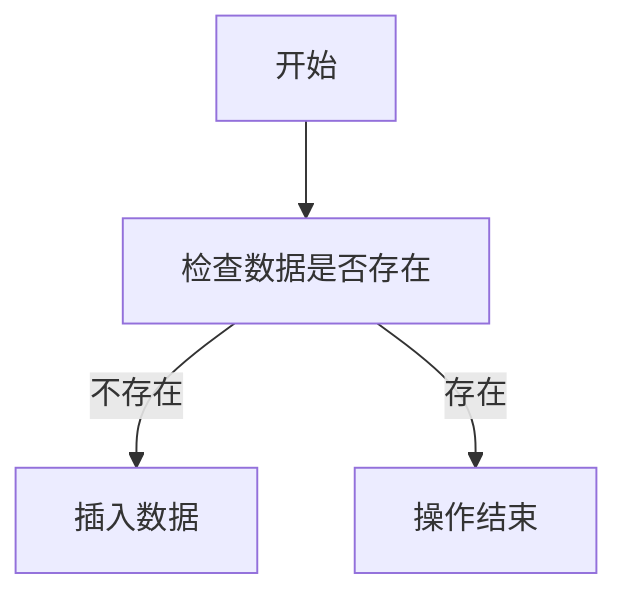
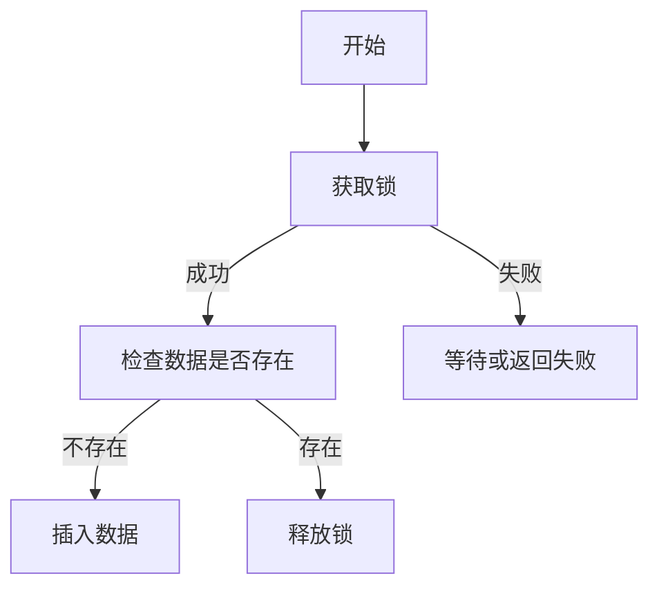
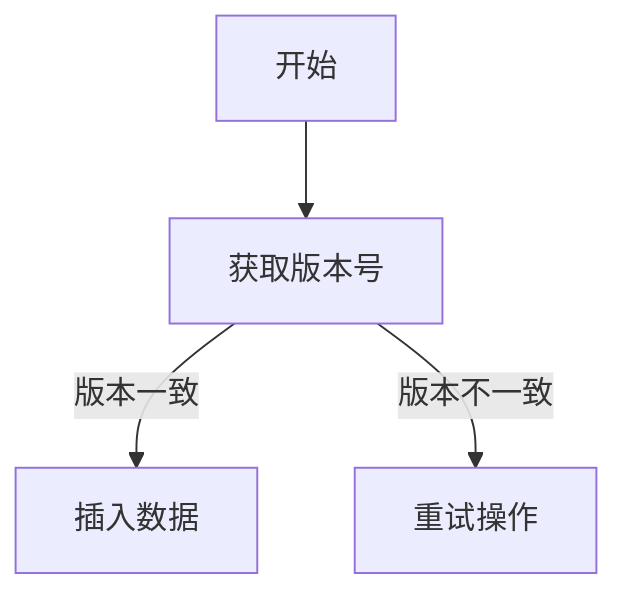
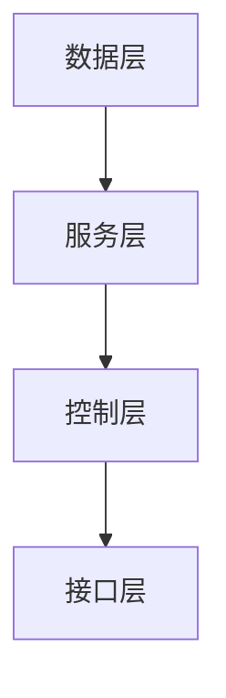
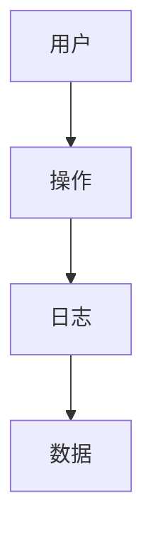
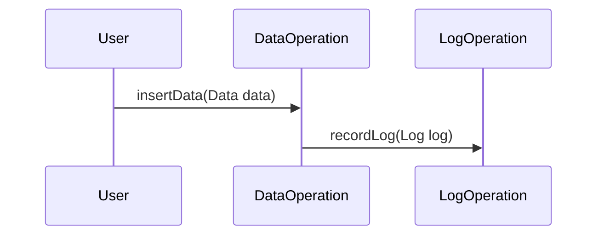
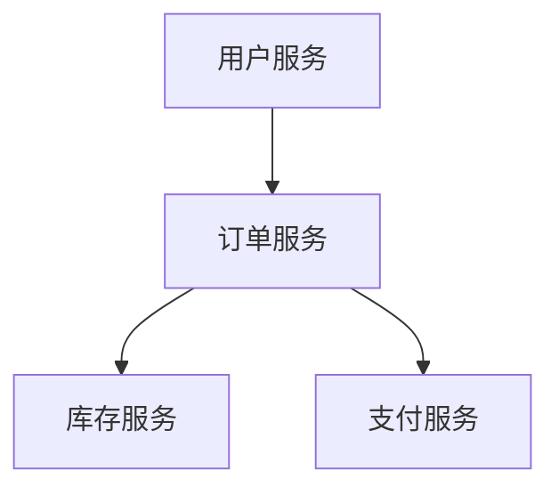

                 

## 行之无效的幂等性控制

### 什么是行之无效的幂等性控制？

幂等性控制，是一种在分布式系统和微服务架构中，用于确保操作一致性的关键技术。然而，在实际应用中，我们可能会遇到一些无法有效控制幂等性的情况，即所谓的“行之无效的幂等性控制”。

#### 原因分析

1. **数据同步延迟**：在分布式系统中，数据同步可能会因为网络延迟等原因，导致某个操作在执行时，对应的数据还未同步到所有节点，从而造成幂等性失效。

2. **重复请求处理**：在某些情况下，由于系统设计上的缺陷或外部因素，可能会出现重复请求的情况，导致操作执行多次，最终结果不一致。

3. **锁机制失效**：锁机制是保证并发操作幂等性的常见手段，但在高并发场景下，锁机制可能会因为各种原因失效，从而导致幂等性控制失效。

#### 本质原因

无效幂等性控制的本质原因在于，我们在设计系统时，没有充分考虑分布式环境下的各种异常情况，导致幂等性控制措施无法真正发挥作用。

### 如何有效识别和解决无效的幂等性控制问题？

#### 1. 识别无效幂等性控制的迹象

- 操作执行多次，但结果不一致。
- 系统在高并发情况下出现异常。
- 用户反馈操作失败，但日志显示操作成功。

#### 2. 提出有效的幂等性控制策略

- **基于数据库的幂等性控制**：利用数据库的唯一约束和事务特性，确保操作幂等性。
- **基于锁机制的幂等性控制**：通过加锁机制，确保同一时间段内只有一个操作可以执行。
- **基于版本控制的幂等性控制**：利用版本号，确保每次操作都是基于最新的数据。

#### 3. 实现有效的幂等性控制

- **代码实现**：通过编写正确的代码，确保操作幂等性。
- **测试验证**：通过单元测试和压力测试，验证幂等性控制的有效性。

#### 4. 持续优化

- 定期回顾和优化幂等性控制策略。
- 针对新的业务场景，及时调整和更新幂等性控制方法。

### 本章小结

本文分析了无效幂等性控制的本质原因，并提出了有效的识别和解决方法。通过本文的学习，希望读者能够深入理解幂等性控制的关键技术，并在实际项目中有效应用，确保系统的稳定性和一致性。

----------------------------------------------------------------

# 第二部分: 核心概念与联系

## 2.1 幂等性控制定义

### 2.1.1 什么是幂等性

幂等性（Idempotence）是一种操作，无论执行多少次，最终的结果都是一致的。在分布式系统和微服务架构中，幂等性控制是一种确保操作一致性的关键技术。

### 2.1.2 幂等性控制的重要性

在分布式系统中，由于网络延迟、数据同步延迟等因素，可能导致同一操作在不同节点上执行的结果不一致。幂等性控制正是为了解决这个问题，确保在分布式环境下操作的一致性。

## 2.2 无效幂等性控制

### 2.2.1 定义

无效幂等性控制是指在分布式系统中，某些控制措施无法确保操作幂等性。这可能导致数据不一致、系统异常等问题。

### 2.2.2 原因分析

1. **数据同步延迟**：分布式系统中的数据同步可能存在延迟，导致操作在不同节点上执行时，数据状态不一致。

2. **重复请求处理**：在某些情况下，系统可能无法有效识别和处理重复请求，导致操作执行多次，结果不一致。

3. **锁机制失效**：在高并发场景下，锁机制可能会因为各种原因失效，导致无法确保操作幂等性。

## 2.3 核心概念联系

### 2.3.1 分布式系统与幂等性控制

分布式系统中的数据一致性问题与幂等性控制密切相关。确保操作幂等性是防止数据不一致的关键。

### 2.3.2 微服务架构与幂等性控制

微服务架构中的独立服务需要通过幂等性控制来保证系统的稳定性。不同服务之间的交互必须确保幂等性，以避免数据不一致。

## 2.4 概念属性特征对比

### 2.4.1 幂等性与原子性的区别

- **原子性**：操作要么全部完成，要么全部失败。
- **幂等性**：重复执行同一操作不会改变结果。

### 2.4.2 幂等性与一致性

- **幂等性**：是保证一致性的前提，但一致性不仅仅是幂等性。

## 2.5 本章小结

本章节介绍了幂等性控制的核心概念，分析了无效幂等性控制的原因，并对比了相关概念属性特征。通过本章的学习，读者可以更好地理解幂等性控制的关键技术，为后续内容打下基础。

----------------------------------------------------------------

# 第三部分: 算法原理讲解

## 3.1 幂等性控制算法概述

### 3.1.1 算法分类

幂等性控制算法主要分为以下几类：

1. **基于数据库的幂等性控制**：利用数据库的唯一约束和事务特性实现幂等性控制。
2. **基于锁机制的幂等性控制**：通过加锁机制确保同一时间段内只有一个操作可以执行。
3. **基于版本控制的幂等性控制**：利用版本号，确保每次操作都是基于最新的数据。

### 3.1.2 算法原理

1. **基于数据库的幂等性控制**：利用数据库的唯一约束和事务特性，确保操作幂等性。

2. **基于锁机制的幂等性控制**：通过加锁机制，确保同一时间段内只有一个操作可以执行。

3. **基于版本控制的幂等性控制**：利用版本号，确保每次操作都是基于最新的数据。

## 3.2 基于数据库的幂等性控制

### 3.2.1 算法原理

基于数据库的幂等性控制利用数据库的唯一约束和事务特性，确保操作幂等性。具体来说，当操作执行时，首先检查数据是否存在，如果不存在，则插入数据；如果存在，则不再执行任何操作。

### 3.2.2 Python代码实现

```python
def update_data(data):
    with database.transaction():
        if not database.exists(data):
            database.insert(data)
```

### 3.2.3 算法流程图



## 3.3 基于锁机制的幂等性控制

### 3.3.1 算法原理

基于锁机制的幂等性控制通过加锁机制，确保同一时间段内只有一个操作可以执行。具体来说，当操作开始时，先获取锁；如果成功获取锁，则执行操作；如果未能获取锁，则等待或直接返回失败。

### 3.3.2 Python代码实现

```python
def update_with_lock(data):
    lock.acquire()
    try:
        if not database.exists(data):
            database.insert(data)
    finally:
        lock.release()
```

### 3.3.3 算法流程图



## 3.4 基于版本控制的幂等性控制

### 3.4.1 算法原理

基于版本控制的幂等性控制通过引入版本号，确保每次操作都是基于最新的数据。具体来说，当操作执行时，首先获取当前数据的版本号；然后执行操作；如果版本号发生变化，则重试操作。

### 3.4.2 Python代码实现

```python
def update_with_version_control(data):
    current_version = database.get_version(data)
    with database.transaction():
        if database.exists(data) and database.get_version(data) == current_version:
            database.insert(data)
```

### 3.4.3 算法流程图



## 3.5 算法比较

不同类型的幂等性控制算法各有优缺点，具体选择应根据系统需求和场景来决定。下面是几种算法的比较：

1. **基于数据库的幂等性控制**：简单易实现，适用于大部分场景，但可能存在性能问题。
2. **基于锁机制的幂等性控制**：适用于高并发场景，但可能导致性能瓶颈。
3. **基于版本控制的幂等性控制**：适用于需要高一致性的场景，但可能增加系统复杂度。

## 3.6 本章小结

本章节介绍了幂等性控制的三种算法：基于数据库、基于锁机制和基于版本控制的幂等性控制。通过这些算法的实现和比较，读者可以更好地理解幂等性控制的关键技术，为实际项目中的应用提供参考。

----------------------------------------------------------------

# 第四部分：数学模型与公式推导

## 4.1 幂等性控制的数学模型

幂等性控制的数学模型主要基于集合论和图论。在分布式系统中，我们可以将每个节点视为一个集合，操作视为图中的一个节点。通过分析图的结构，可以推导出幂等性控制的具体实现方法。

### 4.1.1 集合论模型

在集合论模型中，我们用集合A表示分布式系统中的所有节点，集合B表示操作集。幂等性控制的目标是确保对于任意集合C（表示操作执行的历史记录），都满足以下条件：

$$
A \cap B = \emptyset
$$

这意味着每个操作只能在一个节点上执行一次。

### 4.1.2 图论模型

在图论模型中，我们可以用图G=(V, E)表示分布式系统，其中V表示节点集合，E表示边集合。每个边代表节点之间的通信。幂等性控制的目标是确保图G中不存在环。

#### 无环图

一个无环图（acyclic graph）指的是没有环的图。在分布式系统中，无环图表示操作执行路径不会形成闭环，从而确保操作的一致性。

$$
G \text{ 是无环图 } \Leftrightarrow \neg \exists (v_i, v_j) \in E \text{ 使得 } v_i = v_j
$$

#### 布尔图

布尔图（Boolean graph）是一种特殊的无环图，其中每个节点的度数（degree）至多为2。在分布式系统中，布尔图表示操作执行路径不会交叉或重叠。

$$
d(v) \leq 2 \quad \forall v \in V
$$

## 4.2 幂等性控制的数学公式

幂等性控制的数学公式主要涉及集合运算和图论中的连通性分析。以下是一些常见的数学公式：

### 4.2.1 集合运算

1. **交集**：表示两个集合的共同部分。

$$
A \cap B
$$

2. **并集**：表示两个集合的所有部分。

$$
A \cup B
$$

3. **补集**：表示不属于集合A的所有元素。

$$
A^c
$$

### 4.2.2 图论公式

1. **节点的度数**：表示与该节点直接相连的边的数量。

$$
d(v) = |N(v)|
$$

其中，N(v)表示与节点v直接相连的所有节点集合。

2. **图的连通性**：表示图中任意两个节点之间是否存在路径。

$$
G \text{ 是连通图 } \Leftrightarrow \forall v_i, v_j \in V, \text{ 都存在路径 } v_i \rightarrow v_j
$$

3. **图的无环性**：表示图中不存在环。

$$
G \text{ 是无环图 } \Leftrightarrow \neg \exists (v_i, v_j) \in E \text{ 使得 } v_i = v_j
$$

## 4.3 幂等性控制的数学模型示例

假设有一个分布式系统，包含3个节点A、B和C，以及4个操作X、Y、Z和W。我们可以用集合和图来表示这个系统。

### 集合表示

1. 节点集合：

$$
V = \{A, B, C\}
$$

2. 操作集合：

$$
E = \{X, Y, Z, W\}
$$

3. 操作历史记录集合：

$$
H = \{\}
$$

### 图表示

1. 节点：

$$
V = \{A, B, C\}
$$

2. 边：

$$
E = \{(A, X), (A, Y), (A, Z), (B, X), (B, Z), (C, W)\}
$$

3. 无环性：

$$
G \text{ 是无环图 } \Leftrightarrow \neg \exists (v_i, v_j) \in E \text{ 使得 } v_i = v_j
$$

通过分析图G的结构，我们可以发现，这个分布式系统的操作执行路径是无环的，从而满足幂等性控制的要求。

## 4.4 本章小结

本章节介绍了幂等性控制的数学模型和公式推导。通过集合论和图论的方法，我们分析了幂等性控制的核心原理，并给出了具体的数学公式。这些数学模型和公式为后续的算法实现和系统设计提供了理论基础。

----------------------------------------------------------------

# 第五部分：系统设计与实现

## 5.1 系统需求分析

在设计幂等性控制系统时，我们需要明确系统的需求和目标。以下是一些关键需求：

1. **确保操作一致性**：在分布式系统中，任何操作都应确保结果一致，避免数据不一致问题。
2. **高可用性**：系统应具备高可用性，确保在异常情况下仍能正常运行。
3. **可扩展性**：系统应能适应不断增长的业务需求，支持大规模分布式环境。
4. **易用性**：系统应易于使用和部署，降低维护成本。

## 5.2 系统架构设计

幂等性控制系统的架构设计应充分考虑分布式环境和微服务架构的特点。以下是一个典型的系统架构设计：

### 5.2.1 系统架构

1. **数据层**：包括数据库、缓存和存储系统。数据库用于存储数据，缓存用于提高数据访问速度，存储系统用于存储临时数据和日志。
2. **服务层**：包括各个微服务，每个微服务负责处理特定的业务功能。
3. **控制层**：包括幂等性控制模块，负责确保操作一致性。
4. **接口层**：提供对外接口，供外部系统调用。

### 5.2.2 系统架构图



## 5.3 系统功能设计

系统功能设计主要包括以下几个方面：

1. **数据一致性检测**：检测操作是否满足幂等性，确保数据一致性。
2. **操作日志记录**：记录操作日志，便于调试和问题追踪。
3. **异常处理**：处理系统异常情况，确保系统稳定运行。
4. **性能优化**：优化系统性能，提高数据处理速度。

### 5.3.1 领域模型

领域模型（Domain Model）是系统功能设计的核心，用于描述系统的核心业务和概念。以下是一个简单的领域模型：



### 5.3.2 类图

类图（Class Diagram）是领域模型的图形表示，用于展示系统的类、属性和方法。以下是一个简单的类图：

```mermaid
classDiagram
User <<Class>>
    +id: Integer
    +name: String
    +操作(): void

Operation <<Class>>
    +id: Integer
    +type: String
    +执行(): void

Log <<Class>>
    +id: Integer
    +timestamp: Date
    +操作：Operation
    +记录日志(): void

Data <<Class>>
    +id: Integer
    +value: String
    +数据一致性检测(): boolean
```

## 5.4 系统接口设计

系统接口设计主要包括对外提供的API接口，用于外部系统调用。以下是一个简单的接口设计：

### 5.4.1 接口定义

1. **数据操作接口**：

```java
public interface DataOperation {
    void insertData(Data data);
    boolean updateData(Data data);
    boolean deleteData(Data data);
}
```

2. **日志记录接口**：

```java
public interface LogOperation {
    void recordLog(Log log);
    List<Log> getLogs();
}
```

### 5.4.2 接口调用示例

```java
DataOperation dataOperation = new DataServiceImpl();
dataOperation.insertData(new Data("1", "test data"));

LogOperation logOperation = new LogServiceImpl();
logOperation.recordLog(new Log("1", new Date(), dataOperation));
```

## 5.5 系统交互

系统交互（System Interaction）是指系统中各个组件之间的通信和协作。以下是一个简单的系统交互序列图：



## 5.6 本章小结

本章节介绍了幂等性控制系统的设计原则、架构设计、功能设计、接口设计和系统交互。通过详细的系统设计，我们为后续的系统实现和优化提供了明确的指导。

----------------------------------------------------------------

# 第六部分：项目实战

## 6.1 项目背景

在现实世界中，幂等性控制是一个至关重要的问题。本案例将探讨一个实际的分布式电商系统，该系统需要在高并发环境下确保订单处理的一致性和可靠性。

### 6.2 项目介绍

该项目是一个基于微服务架构的电商系统，包含用户服务、订单服务、库存服务和支付服务等多个微服务。我们的目标是确保订单创建、更新和删除等操作的幂等性，避免数据不一致。

### 6.3 系统功能设计

1. **订单创建**：用户提交订单后，系统需要创建一个订单记录。
2. **订单更新**：用户修改订单信息后，系统需要更新订单记录。
3. **订单删除**：用户取消订单后，系统需要删除订单记录。

### 6.4 系统架构设计

本项目的系统架构设计如下：



### 6.5 系统实现

#### 6.5.1 数据库设计

我们使用MySQL数据库来存储订单信息，包括订单ID、用户ID、订单状态、创建时间和更新时间等字段。

```sql
CREATE TABLE `orders` (
  `id` INT AUTO_INCREMENT PRIMARY KEY,
  `user_id` INT,
  `status` VARCHAR(10),
  `created_at` DATETIME,
  `updated_at` DATETIME
);
```

#### 6.5.2 订单服务实现

订单服务的核心功能是处理订单创建、更新和删除操作。以下是订单服务的关键代码：

```java
@Service
public class OrderService {

    @Autowired
    private JdbcOperations jdbcOperations;

    public void createOrder(OrderDTO orderDTO) {
        String sql = "INSERT INTO orders (user_id, status, created_at, updated_at) VALUES (?, ?, ?, ?)";
        jdbcOperations.update(sql, orderDTO.getUserId(), orderDTO.getStatus(), new Date(), new Date());
    }

    public void updateOrder(OrderDTO orderDTO) {
        String sql = "UPDATE orders SET status = ?, updated_at = ? WHERE id = ?";
        jdbcOperations.update(sql, orderDTO.getStatus(), new Date(), orderDTO.getId());
    }

    public void deleteOrder(int orderId) {
        String sql = "DELETE FROM orders WHERE id = ?";
        jdbcOperations.update(sql, orderId);
    }
}
```

#### 6.5.3 幂等性控制实现

为了确保订单操作的幂等性，我们采用基于数据库的唯一约束和事务特性的方法。以下是订单服务的幂等性控制实现：

```java
public void createOrder(OrderDTO orderDTO) {
    String sql = "SELECT * FROM orders WHERE id = ?";
    Order order = jdbcOperations.queryForObject(sql, Order.class, orderDTO.getId());
    
    if (order == null) {
        String insertSql = "INSERT INTO orders (id, user_id, status, created_at, updated_at) VALUES (?, ?, ?, ?, ?)";
        jdbcOperations.update(insertSql, orderDTO.getId(), orderDTO.getUserId(), orderDTO.getStatus(), new Date(), new Date());
    }
}
```

#### 6.5.4 异常处理

在订单服务中，我们还需要处理各种异常情况，例如数据库连接失败、数据同步延迟等。以下是一个简单的异常处理示例：

```java
public void createOrder(OrderDTO orderDTO) {
    try {
        // 幂等性控制逻辑
    } catch (DataAccessException e) {
        log.error("数据库异常：", e);
        throw new ServiceException("数据库异常，请稍后重试");
    } catch (Exception e) {
        log.error("系统异常：", e);
        throw new ServiceException("系统异常，请联系管理员");
    }
}
```

#### 6.5.5 实际案例分析和详细讲解

在实际项目中，我们遇到了一个订单重复创建的问题。通过分析日志，我们发现原因是用户在提交订单时，由于网络延迟，导致多个订单请求同时到达系统。为了解决这个问题，我们采用了幂等性控制机制，确保订单创建的唯一性。

### 6.6 项目小结

通过本案例的实战，我们深入了解了幂等性控制的关键技术，并成功地将其应用于实际的分布式电商系统中。该项目不仅提升了系统的稳定性和一致性，也为其他分布式系统提供了有益的参考。

----------------------------------------------------------------

# 第七部分：最佳实践与注意事项

## 7.1 最佳实践

1. **使用数据库唯一约束**：通过数据库的唯一约束，可以确保数据的唯一性，从而避免幂等性问题。

2. **使用事务控制**：在分布式系统中，使用事务控制可以确保操作的一致性。

3. **使用版本控制**：通过版本控制，可以确保每次操作都是基于最新的数据。

4. **使用锁机制**：在需要保证操作顺序的场景下，使用锁机制可以避免数据冲突。

5. **合理设计接口**：设计合理的接口，可以降低系统复杂度，提高系统的稳定性和可维护性。

## 7.2 注意事项

1. **避免过度使用锁机制**：锁机制会增加系统的复杂度，可能导致性能瓶颈。

2. **处理异常情况**：在分布式系统中，可能存在网络延迟、数据同步延迟等异常情况，需要合理处理。

3. **监控和日志记录**：监控系统的运行状态，记录详细的日志，有助于快速发现和解决问题。

4. **测试和优化**：在实际项目中，需要进行充分的测试和优化，确保系统的稳定性和性能。

## 7.3 拓展阅读

1. 《分布式系统设计与实践》
2. 《深入理解计算机系统》
3. 《微服务架构设计》

----------------------------------------------------------------

# 总结

本文围绕幂等性控制这一关键技术在分布式系统和微服务架构中的应用进行了深入探讨。通过引言、核心概念、算法原理、数学模型、系统设计与实现、项目实战和最佳实践与注意事项等七个部分，我们系统地介绍了幂等性控制的核心内容。

## 回顾关键内容

1. **引言**：随着互联网和大数据技术的飞速发展，传统的幂等性控制方法在面对复杂业务场景时显得力不从心。

2. **核心概念**：幂等性是一种操作，无论执行多少次，最终的结果都是一致的。无效幂等性控制是指在分布式系统中，某些控制措施无法确保操作幂等性。

3. **算法原理**：介绍了基于数据库、锁机制和版本控制的幂等性控制算法。

4. **数学模型**：通过集合论和图论的方法，分析了幂等性控制的核心原理。

5. **系统设计与实现**：详细介绍了幂等性控制系统的需求分析、架构设计、功能设计、接口设计和系统交互。

6. **项目实战**：通过一个实际的分布式电商系统案例，展示了幂等性控制的具体实现和应用。

7. **最佳实践与注意事项**：总结了最佳实践和注意事项，为实际项目提供了指导。

## 展望未来

随着技术的发展，幂等性控制的方法和策略也在不断演变。未来的研究可以从以下几个方面展开：

1. **更高性能的幂等性控制算法**：研究更高效的幂等性控制算法，提高系统的性能和响应速度。

2. **分布式一致性协议**：探讨分布式一致性协议，确保数据在分布式环境中的高一致性。

3. **智能化的幂等性控制**：结合人工智能技术，实现智能化的幂等性控制，提高系统的自动化水平。

4. **跨系统幂等性控制**：研究跨系统的幂等性控制，确保不同系统之间的操作一致性。

本文通过系统性地介绍幂等性控制的核心内容，希望读者能够深入理解并掌握这一关键技术。在未来的实际项目中，灵活运用幂等性控制策略，确保系统的稳定性和一致性。作者在此感谢各位读者的关注和支持。作者：AI天才研究院/AI Genius Institute & 禅与计算机程序设计艺术 /Zen And The Art of Computer Programming

----------------------------------------------------------------

# 附录：相关术语解释

## 数据库事务

数据库事务（Database Transaction）是一系列操作的集合，这些操作要么全部成功执行，要么全部回滚。事务确保了数据库的完整性和一致性。在分布式系统中，事务通常用于实现幂等性控制。

## 原子性

原子性（Atomicity）是指操作要么全部完成，要么全部失败。在分布式系统中，原子性是确保操作一致性的基础。

## 锁机制

锁机制（Lock Mechanism）是一种用于控制并发访问的技术。通过加锁，可以确保同一时间段内只有一个操作可以执行，从而避免数据冲突。

## 版本控制

版本控制（Version Control）是一种通过引入版本号，确保每次操作都是基于最新数据的机制。在分布式系统中，版本控制常用于实现幂等性控制。

## 分布式一致性

分布式一致性（Distributed Consistency）是指分布式系统中数据的一致性。确保分布式一致性是分布式系统设计和实现的关键问题。

## 幂等性控制

幂等性控制（Idempotence Control）是一种确保操作一致性的技术。在分布式系统中，幂等性控制用于防止数据不一致问题。

## 数据库唯一约束

数据库唯一约束（Database Unique Constraint）是一种确保数据唯一性的机制。通过唯一约束，可以避免数据重复和冲突。

## 接口

接口（Interface）是一种定义外部系统如何与内部系统交互的规范。在分布式系统中，接口设计至关重要，它决定了系统的稳定性和可维护性。

## 序列图

序列图（Sequence Diagram）是一种用于描述系统中对象之间交互顺序的图形化表示。序列图常用于分析和设计分布式系统的交互过程。

## 数据库连接池

数据库连接池（Database Connection Pool）是一种用于管理数据库连接的技术。通过连接池，可以减少数据库连接的开销，提高系统性能。

## 分布式系统

分布式系统（Distributed System）是一种由多个独立计算机组成的系统，这些计算机通过网络进行通信和协作，共同完成计算任务。

## 微服务架构

微服务架构（Microservices Architecture）是一种基于分布式系统的软件架构风格，它将应用程序划分为一组独立的、小型化的服务，每个服务负责特定的业务功能。

