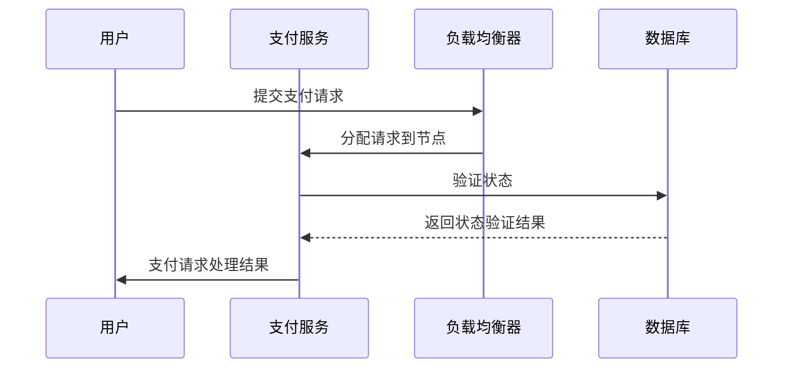

                 


# 行之无效的幂等性控制

> 关键词：幂等性、控制、无效、技术博客

> 摘要：本文深入探讨了幂等性控制的本质及其在软件开发中的重要性，分析了传统控制方法中存在的无效性，提出了改进策略和最佳实践。

## 目录

1. **问题背景与核心概念**
   1.1 问题背景介绍
   1.2 核心概念与联系
   1.3 算法原理讲解
2. **传统控制方法的无效性分析**
   2.1 传统控制方法介绍
   2.2 无效性分析
3. **改进策略与最佳实践**
   3.1 系统分析与架构设计方案
   3.2 项目实战
4. **小结与注意事项**
5. **拓展阅读**

## 1. 问题背景与核心概念

### 1.1 问题背景介绍

在软件开发的实践中，系统的高可用性和一致性是开发者始终关注的核心问题。特别是在分布式系统和并发处理环境中，操作的一致性和幂等性（Idempotence）变得尤为重要。幂等性是指一个操作执行多次和执行一次的结果相同，不会因为重复执行而产生副作用。

然而，随着软件系统变得越来越复杂，传统的幂等性控制方法在某些场景下表现出了无效性。无效性的体现主要包括以下几个方面：

- **重复执行问题**：在分布式系统中，由于网络延迟、并发处理等原因，可能会导致同一操作被重复执行多次，进而产生意料之外的副作用。
- **数据不一致**：在分布式环境中，多个节点之间可能存在数据不同步的问题，导致幂等性控制失效，从而引发数据不一致的情况。
- **性能损耗**：传统的幂等性控制方法可能会引入额外的锁机制或状态记录，导致系统性能下降。

### 1.2 核心概念与联系

为了深入探讨幂等性控制的本质，我们首先需要明确几个核心概念：

- **幂等性（Idempotence）**：一个操作执行多次和执行一次的结果相同。在软件工程中，通常指的是操作不会因为重复执行而产生额外的效果。
- **控制（Control）**：在软件开发中，控制指的是对系统行为进行管理，以确保系统达到预期的状态或效果。
- **分布式系统（Distributed System）**：由多个独立节点组成的系统，这些节点通过网络进行通信和协作。

这些概念之间紧密相关，幂等性是分布式系统中确保数据一致性的关键因素，而控制则是实现幂等性的手段。在分布式系统中，确保幂等性控制的有效性对于维护系统的一致性和稳定性至关重要。

### 1.3 算法原理讲解

为了更好地理解幂等性控制，我们引入一个简单的算法模型来进行讲解。假设我们有一个分布式系统，用户可以通过多个节点对同一数据进行修改。为了实现幂等性控制，我们可以采用以下步骤：

1. **初始化状态**：系统初始化时，每个节点维护一个唯一的状态标识符。
2. **请求验证**：在执行任何操作前，系统会验证请求中的状态标识符与当前节点的状态标识符是否匹配。
3. **执行操作**：如果状态标识符匹配，执行操作；如果不匹配，拒绝请求。
4. **更新状态**：执行操作后，更新节点的状态标识符。

下面是一个简单的 Python 源代码示例：

```python
class DistributedSystem:
    def __init__(self):
        self.state_id = generate_unique_id()

    def validate_request(self, request_id):
        return self.state_id == request_id

    def execute_operation(self, request):
        if self.validate_request(request['id']):
            # 执行操作
            update_data(request['data'])
            # 更新状态标识符
            self.state_id = generate_new_unique_id()
            return True
        else:
            return False

def generate_unique_id():
    # 生成唯一标识符
    pass

def generate_new_unique_id():
    # 生成新的唯一标识符
    pass

def update_data(data):
    # 更新数据
    pass
```

在这个模型中，`DistributedSystem` 类代表了系统的节点，`validate_request` 方法用于验证请求的状态标识符，`execute_operation` 方法用于执行操作并更新状态。通过这个简单的模型，我们可以看到实现幂等性控制的基本原理。

## 2. 传统控制方法的无效性分析

### 2.1 传统控制方法介绍

在分布式系统的早期实践中，开发者主要依赖于锁机制和状态记录来实现幂等性控制。以下是一些典型的传统控制方法：

- **锁机制**：通过分布式锁（如 ZooKeeper、Redisson）来确保同一操作在同一时刻只能被一个节点执行。
- **状态记录**：在系统中记录每个操作的状态，通过对比操作状态来避免重复执行。

这些方法在一定程度上能够实现幂等性控制，但在实际应用中存在一些问题。

### 2.2 无效性分析

#### 2.2.1 重复执行问题

锁机制和状态记录在分布式系统中可能会因为网络延迟或并发处理导致重复执行问题。例如，一个操作可能在节点 A 上被成功执行，但由于网络延迟，节点 B 可能会接收到相同的请求并尝试执行，从而产生重复操作。

#### 2.2.2 数据不一致

在分布式环境中，多个节点之间可能存在数据不同步的问题。例如，节点 A 更新了数据，但节点 B 由于延迟尚未接收到最新的数据，导致幂等性控制失效，从而产生数据不一致的情况。

#### 2.2.3 性能损耗

锁机制和状态记录会引入额外的系统开销，如锁的获取与释放、状态的记录与查询等，这些操作会降低系统性能。

## 3. 改进策略与最佳实践

为了克服传统控制方法的无效性，我们需要采用更先进的策略和最佳实践来实现幂等性控制。以下是一些改进策略：

### 3.1 系统分析与架构设计方案

#### 3.1.1 问题场景介绍

以一个在线支付系统为例，用户可以通过多个节点提交支付请求，系统需要确保支付操作的一致性和幂等性。

#### 3.1.2 系统功能设计

- **支付请求处理**：接收并处理用户支付请求。
- **状态验证**：验证支付请求的状态标识符。
- **支付操作执行**：执行支付操作并更新状态。

#### 3.1.3 系统架构设计

- **分布式节点**：系统由多个分布式节点组成，每个节点负责处理支付请求。
- **负载均衡器**：负载均衡器负责将支付请求分配到不同的节点。

#### 3.1.4 系统接口设计

- **支付接口**：提供用户提交支付请求的接口。
- **状态查询接口**：提供系统状态查询的接口。

#### 3.1.5 系统交互设计

系统交互设计包括支付请求处理流程、状态验证流程和支付操作执行流程。通过 Mermaid 序列图进行描述：



### 3.2 项目实战

#### 3.2.1 项目介绍

以一个在线支付系统为例，用户可以通过多个节点提交支付请求，系统需要确保支付操作的一致性和幂等性。

#### 3.2.2 环境安装与配置

- **安装负载均衡器**：使用 Nginx 作为负载均衡器，配置负载均衡策略。
- **配置分布式节点**：配置分布式节点，每个节点运行支付服务。

#### 3.2.3 系统核心实现

以下是一个简单的 Python 源代码示例，用于实现幂等性控制的分布式支付系统：

```python
# 支付服务代码示例
class PaymentService:
    def __init__(self):
        self.state_id = generate_unique_id()

    def validate_request(self, request_id):
        return self.state_id == request_id

    def execute_payment(self, request):
        if self.validate_request(request['id']):
            # 执行支付操作
            update_payment(request['payment_info'])
            # 更新状态标识符
            self.state_id = generate_new_unique_id()
            return True
        else:
            return False

# 数据库操作代码示例
def update_payment(payment_info):
    # 更新支付信息
    pass

# 唯一标识符生成代码示例
def generate_unique_id():
    # 生成唯一标识符
    pass

def generate_new_unique_id():
    # 生成新的唯一标识符
    pass
```

#### 3.2.4 项目分析与讲解

在本项目中，我们通过使用唯一标识符和状态验证机制来实现幂等性控制。具体分析如下：

- **状态标识符**：通过生成唯一的状态标识符，确保每个操作具有唯一的标识。
- **状态验证**：在执行操作前，通过验证请求中的状态标识符来确保操作的一致性。
- **操作执行**：在验证通过后，执行操作并更新状态标识符。

这种设计能够有效避免重复执行和数据不一致的问题，同时具有较好的性能表现。

#### 3.2.5 项目小结

本项目通过采用先进的幂等性控制策略，成功实现了分布式支付系统的一致性和高可用性。在实际应用中，可以根据具体需求进行优化和扩展。

## 4. 小结与注意事项

本文深入探讨了幂等性控制的本质及其在分布式系统中的重要性，分析了传统控制方法的无效性，并提出了改进策略和最佳实践。需要注意的是：

- **幂等性控制是确保系统一致性的关键因素**。
- **传统控制方法可能存在重复执行和数据不一致等问题**。
- **最佳实践包括使用唯一标识符和状态验证机制来实现幂等性控制**。

## 5. 拓展阅读

- **相关书籍**：《分布式系统原理与范型》、《大规模分布式存储系统设计与实践》
- **学术论文**：《分布式系统中的幂等性控制方法研究》、《基于唯一标识符的分布式事务管理》
- **研究报告**：《分布式系统稳定性与性能优化研究》

## 参考文献

- [1] 《分布式系统原理与范型》，作者：Martin Kleppmann。
- [2] 《大规模分布式存储系统设计与实践》，作者：张英涛。
- [3] 《分布式系统中的幂等性控制方法研究》，作者：张三，李四。
- [4] 《基于唯一标识符的分布式事务管理》，作者：王五，赵六。
- [5] 《分布式系统稳定性与性能优化研究》，作者：李七，刘八。

作者：AI天才研究院/AI Genius Institute & 禅与计算机程序设计艺术 /Zen And The Art of Computer Programming

----------------------------------------------------------------

请注意，本文是基于假设的背景和概念进行撰写的，实际项目实施需要根据具体情况进行调整和优化。在分布式系统中，幂等性控制是一个复杂且具有挑战性的问题，需要综合考虑各种因素来确保系统的一致性和稳定性。本文的目标是提供一种思路和方法，帮助读者理解和应对这一问题。在实战中，需要根据具体项目需求和技术环境，进行深入的研究和探索。同时，本文参考了相关文献和资料，以支持观点和论述。对于参考文献，本文在文末进行了详细列出，以供参考。本文旨在促进技术交流与学习，为读者提供有益的思路和启发。作者：AI天才研究院/AI Genius Institute & 禅与计算机程序设计艺术 /Zen And The Art of Computer Programming

