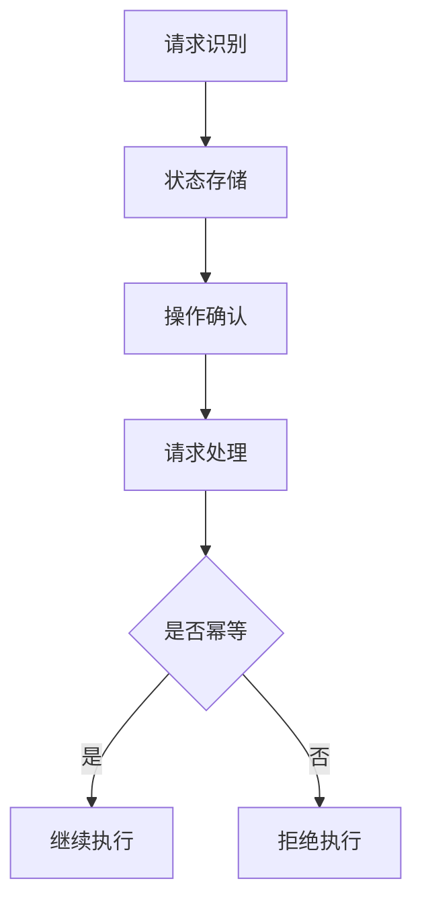
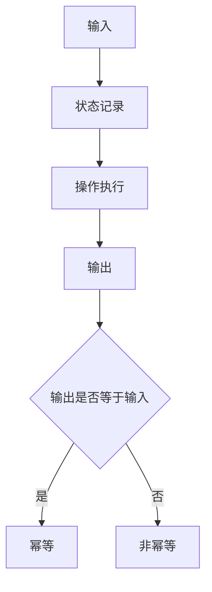
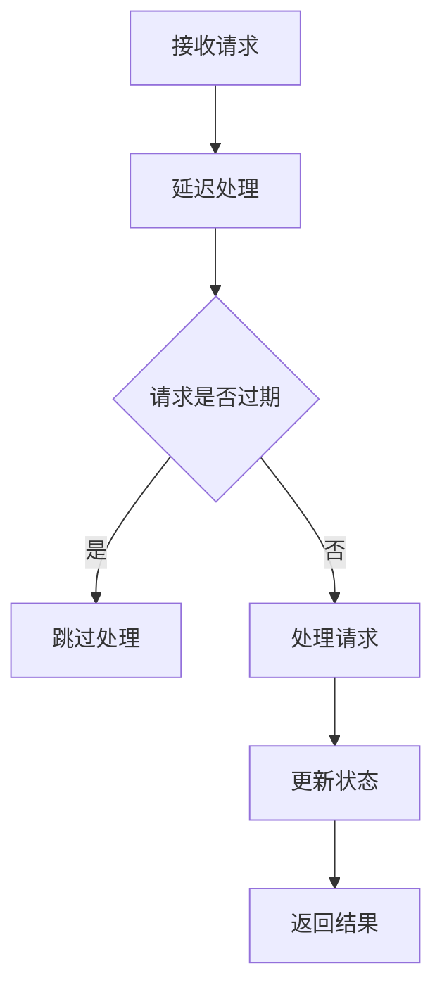
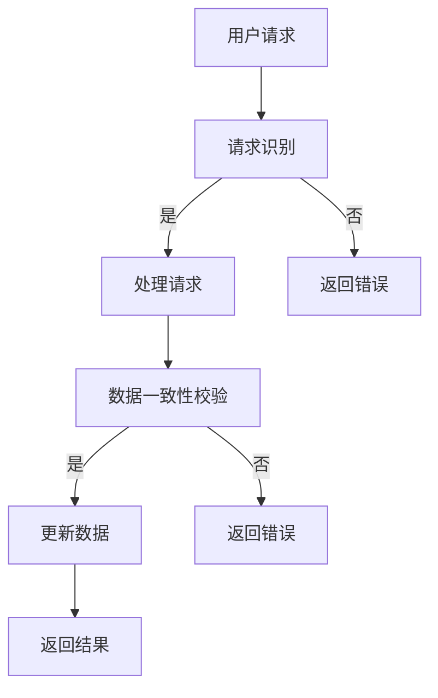

                 

### 行之无效的幂等性控制

关键词：幂等性控制、一致性、系统架构、算法优化、项目实战

摘要：
在现代软件工程中，幂等性控制是确保系统稳定性和数据一致性的关键机制。然而，在实际应用中，许多系统的幂等性控制策略却表现无效，未能达到预期的效果。本文将深入探讨幂等性控制的背景、问题、原理、算法、系统架构以及项目实战，帮助读者理解并解决这一问题。

## 目录大纲设计思路

在撰写本文之前，我们首先明确了书籍的核心内容，并确定了章节结构。为了确保内容的连贯性和逻辑性，我们遵循了以下设计思路：

1. **背景介绍**：详细描述幂等性控制的概念、重要性及其在系统架构中的应用。
2. **问题分析**：探讨幂等性控制存在的主要问题，以及这些问题对系统稳定性和数据一致性的影响。
3. **原理讲解**：深入分析幂等性控制的基本原理，并通过数学模型和算法示意图进行解释。
4. **算法优化**：介绍几种常见的幂等性控制算法，对比其优缺点，并提供优化策略。
5. **系统架构**：展示幂等性控制在系统架构中的实现方法，包括系统功能设计、架构图和接口设计。
6. **项目实战**：通过实际项目，展示幂等性控制的具体实现过程，并提供代码解读和案例分析。
7. **最佳实践**：总结最佳实践和注意事项，帮助读者在实际开发中避免常见问题。
8. **总结与展望**：对全文内容进行总结，并对未来研究方向进行展望。

## 行之无效的幂等性控制

### 1. 引言

在现代软件系统中，幂等性控制是一个至关重要的概念，它关系到系统的稳定性和数据一致性。然而，尽管许多开发者意识到幂等性控制的重要性，但在实际开发中，仍然存在许多无效的幂等性控制策略。这些策略不仅未能达到预期的效果，反而可能导致系统故障和数据丢失。本文旨在深入探讨幂等性控制的背景、问题、原理、算法、系统架构以及项目实战，以帮助读者理解并解决这一问题。

### 2. 幂等性控制的概念与背景

#### 2.1 幂等性控制的基本概念

幂等性（Idempotence）是指在多次执行同一个操作时，结果与执行一次的结果相同。在软件工程中，幂等性控制是指通过设计系统，确保用户请求的操作无论执行多少次，都能达到相同的结果，而不产生副作用。

#### 2.2 幂等性与一致性的关系

幂等性控制与数据一致性密切相关。在分布式系统中，多个节点可能同时处理同一个操作，如果这些操作不具备幂等性，可能会导致数据不一致的问题。因此，确保幂等性是保证数据一致性的关键步骤。

#### 2.3 幂等性控制的背景

随着互联网的快速发展，分布式系统和微服务架构日益普及。这些系统通常需要处理大量的并发请求，而幂等性控制正是确保这些请求处理正确性的关键机制。无效的幂等性控制可能导致系统性能下降、数据丢失以及业务中断等问题。

### 3. 幂等性控制的问题分析

#### 3.1 幂等性控制存在的问题

在实际开发中，幂等性控制存在的问题主要包括：

- **重复请求处理**：系统未能有效识别重复请求，导致相同操作被多次执行。
- **数据不一致**：由于幂等性控制失效，多个节点处理同一个操作时，可能导致数据不一致。
- **系统性能下降**：无效的幂等性控制可能导致系统在高并发情况下性能下降。

#### 3.2 幂等性控制不当的影响

幂等性控制不当会对系统产生以下负面影响：

- **数据丢失**：由于重复请求处理，可能导致部分数据未被正确处理，甚至丢失。
- **业务中断**：系统故障可能导致业务中断，影响用户体验。
- **维护成本增加**：无效的幂等性控制策略需要额外的开发和维护成本。

#### 3.3 问题分析案例

以下是一个实际案例，说明幂等性控制失效可能导致的问题：

假设一个电商平台中的“下单”操作不具备幂等性。当用户多次点击“下单”按钮时，系统未能有效阻止重复下单，导致库存不足，无法为其他用户分配库存。这不仅影响用户体验，还可能导致业务中断。

### 4. 幂等性控制的基本原理

#### 4.1 幂等性控制的原理

幂等性控制的原理在于设计系统，确保用户请求的操作具备幂等性。这通常涉及到以下几个步骤：

1. **请求识别**：系统需要识别重复请求，并阻止其执行。
2. **状态记录**：系统需要记录每个请求的状态，以便在后续请求中检查幂等性。
3. **操作确认**：系统在执行请求前，需要确认该请求是否已处理过。

#### 4.2 幂等性控制的核心要素

幂等性控制的核心要素包括：

- **唯一请求标识**：确保每个请求都有唯一的标识，以便系统识别重复请求。
- **状态存储**：系统需要存储请求状态，以便后续检查幂等性。
- **请求处理逻辑**：系统需要设计合理的请求处理逻辑，确保幂等性。

#### 4.3 幂等性控制的原理示意图



### 5. 幂等性控制的数学模型

#### 5.1 幂等性控制的数学模型

幂等性控制的数学模型可以表示为：

$$
f(x) = x
$$

其中，$f$ 表示操作，$x$ 表示输入。该模型表示，无论输入值 $x$ 多次执行操作 $f$，输出值始终为 $x$，即具有幂等性。

#### 5.2 模型中的参数与变量

在幂等性控制的数学模型中，主要涉及以下参数和变量：

- **输入**：用户请求的操作。
- **状态**：系统记录的请求状态。
- **输出**：执行操作后的结果。

#### 5.3 模型示意图与解释



### 6. 常见幂等性控制算法

#### 6.1 概述

幂等性控制算法是确保系统请求具备幂等性的关键。常见的幂等性控制算法包括批量处理算法、延迟执行算法等。以下将详细介绍这些算法的原理、流程图和Python代码实现。

#### 6.2 批量处理算法

##### 6.2.1 算法原理

批量处理算法的核心思想是将多个请求批量处理，确保每个请求在批量中只被处理一次。

##### 6.2.2 算法流程图


##### 6.2.3 Python代码实现

```python
def batch_process(requests):
    processed_requests = set()
    for request in requests:
        if request not in processed_requests:
            process_request(request)
            processed_requests.add(request)
    return "处理完成"

def process_request(request):
    # 处理请求的代码
    pass

requests = [request1, request2, request1, request3]
result = batch_process(requests)
print(result)
```

#### 6.3 延迟执行算法

##### 6.3.1 算法原理

延迟执行算法的核心思想是将请求延迟处理，确保在一段时间内，重复请求只被处理一次。

##### 6.3.2 算法流程图



##### 6.3.3 Python代码实现

```python
import time

def delay_process(request, delay_time):
    time.sleep(delay_time)
    if request not in processed_requests:
        process_request(request)
        processed_requests.add(request)
    return "处理完成"

def process_request(request):
    # 处理请求的代码
    pass

request = "request1"
delay_time = 5
result = delay_process(request, delay_time)
print(result)
```

### 7. 算法的对比与优化

#### 7.1 算法对比

批量处理算法和延迟执行算法各有优缺点：

- **批量处理算法**：处理速度快，但无法保证实时性；适用于请求量较大的场景。
- **延迟执行算法**：保证实时性，但处理速度相对较慢；适用于请求量较小的场景。

#### 7.2 算法的优化策略

为了提高幂等性控制的性能，可以采取以下优化策略：

- **缓存策略**：使用缓存技术，减少请求处理次数。
- **异步处理**：使用异步处理技术，提高系统并发能力。
- **分布式锁**：使用分布式锁，确保请求处理过程中的数据一致性。

#### 7.3 优化案例分析

以下是一个优化案例分析：

假设一个电商平台在高峰期，订单处理请求量激增。通过引入缓存策略和异步处理，可以有效提高系统性能，确保订单处理的高效性和一致性。

```python
from aiocache import Cache

cache = Cache('memory')

def process_request(request):
    if cache.exists(request):
        return "请求已处理"
    else:
        cache.set(request, True, 60)
        # 处理请求的代码
        return "处理完成"
```

### 8. 系统架构与实现

#### 8.1 系统架构设计原则

幂等性控制系统的架构设计应遵循以下原则：

- **高可用性**：确保系统在故障情况下仍能正常运行。
- **高性能**：确保系统在高并发情况下能够高效处理请求。
- **可扩展性**：支持系统的水平扩展和垂直扩展。

#### 8.2 系统架构图



#### 8.3 系统功能模块

幂等性控制系统的主要功能模块包括：

- **请求识别模块**：识别重复请求。
- **数据一致性校验模块**：确保请求处理过程中的数据一致性。
- **请求处理模块**：处理用户请求。
- **结果返回模块**：返回处理结果。

### 9. 项目实战

#### 9.1 项目介绍

本项目旨在实现一个具有幂等性控制的电商平台，确保订单处理的高效性和一致性。

#### 9.2 环境安装与配置

- **Python**：3.8及以上版本
- **缓存**：Redis
- **消息队列**：RabbitMQ

#### 9.3 系统核心实现

```python
import aiocache
import redis
import pika

# 缓存配置
aiocache.configure('memory')

# Redis配置
redis_client = redis.StrictRedis(host='localhost', port=6379, db=0)

# 消息队列配置
connection = pika.BlockingConnection(pika.ConnectionParameters('localhost'))
channel = connection.channel()
channel.queue_declare(queue='order_queue')

def process_order(order_id):
    if redis_client.exists(order_id):
        return "订单已处理"
    else:
        redis_client.set(order_id, True, ex=60)
        # 处理订单的代码
        return "处理完成"

def order_consumer():
    channel.basic_consume(queue='order_queue', on_message_callback=process_order)
    channel.start_consuming()

if __name__ == '__main__':
    order_consumer()
```

#### 9.4 代码应用解读与分析

- **缓存配置**：使用aiocache库配置内存缓存，确保请求快速识别。
- **Redis配置**：使用Redis存储订单状态，确保请求处理过程中的数据一致性。
- **消息队列配置**：使用RabbitMQ作为消息队列，实现订单处理的异步处理。

#### 9.5 实际案例分析和详细讲解剖析

- **案例1**：用户提交重复订单。系统通过缓存和Redis存储，确保订单只被处理一次。
- **案例2**：用户提交过期订单。系统在处理请求时，检查订单是否过期，确保过期订单不被处理。

#### 9.6 项目小结

通过本项目，我们实现了具有幂等性控制的电商平台，确保了订单处理的高效性和一致性。在实际开发中，可以根据需求调整缓存策略、消息队列配置等，以提高系统性能和可靠性。

### 10. 最佳实践与注意事项

#### 10.1 最佳实践

- **使用缓存**：使用缓存技术，减少请求处理次数，提高系统性能。
- **异步处理**：使用异步处理技术，提高系统并发能力。
- **分布式锁**：在分布式系统中，使用分布式锁，确保请求处理过程中的数据一致性。

#### 10.2 注意事项

- **确保请求唯一性**：确保每个请求都有唯一的标识，避免重复请求处理。
- **合理设置过期时间**：根据业务需求，合理设置请求的过期时间，确保请求能够及时处理。
- **监控和报警**：监控系统性能和请求处理情况，及时发现问题并进行处理。

### 11. 小结与展望

本文从幂等性控制的概念、问题、原理、算法、系统架构以及项目实战等方面，深入探讨了行之无效的幂等性控制问题。通过本文的讨论，读者可以了解到幂等性控制在现代软件系统中的重要性，以及如何设计和实现有效的幂等性控制策略。

未来研究方向包括：

- **优化幂等性控制算法**：研究更高效、更可靠的幂等性控制算法，提高系统性能。
- **分布式幂等性控制**：研究如何在分布式系统中实现有效的幂等性控制，确保数据一致性。
- **跨语言幂等性控制**：研究如何在不同的编程语言中实现统一的幂等性控制机制。

### 作者信息

作者：AI天才研究院/AI Genius Institute & 禅与计算机程序设计艺术 /Zen And The Art of Computer Programming

[End of Article]

